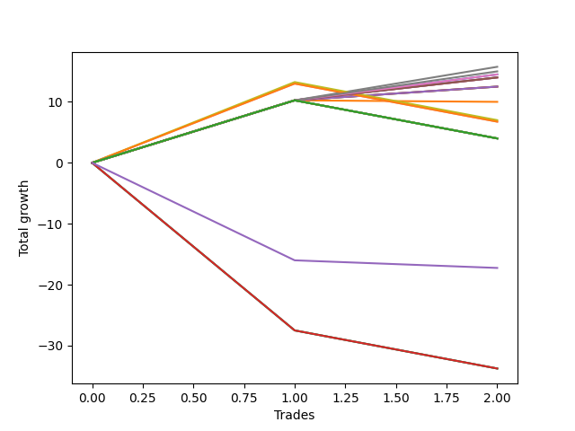

# Short Bernese 003 50 
- Symbol: ES_FOMC
- Date Range: 11/30/2022 - 12/14/2022
- Trading Period: 8:30-12:30
- Number of Trades: 2



| Name | Win Percent | Profit | Avg Profit / Trade | Avg Time / Trade |      | Name | Win Percent | Profit | Avg Profit / Trade | Avg Time / Trade |
| ---- | ----------- | ------ | ------------------ | ---------------- | ---- | ---- | ----------- | ------ | ------------------ | ---------------- |
| Sorted By <br> Profit | | | | | | Sorted By <br> Win Percentage ||||
| V Mid | 100.00 | 7875.00 | 3937.50 | 15:07 |     | V Mid | 100.00 | 7875.00 | 3937.50 | 15:07 |
| TP-5 | 100.00 | 7500.00 | 3750.00 | 02:20 |     | TP-5 | 100.00 | 7500.00 | 3750.00 | 02:20 |
| TP-4 | 100.00 | 7250.00 | 3625.00 | 02:17 |     | TP-4 | 100.00 | 7250.00 | 3625.00 | 02:17 |
| BB-20 Mid | 100.00 | 7250.00 | 3625.00 | 02:17 |     | BB-20 Mid | 100.00 | 7250.00 | 3625.00 | 02:17 |
| TP-3 | 100.00 | 7000.00 | 3500.00 | 02:15 |     | TP-3 | 100.00 | 7000.00 | 3500.00 | 02:15 |
| TP-2 | 100.00 | 7000.00 | 3500.00 | 02:15 |     | TP-2 | 100.00 | 7000.00 | 3500.00 | 02:15 |
| TP-1 | 100.00 | 7000.00 | 3500.00 | 02:15 |     | TP-1 | 100.00 | 7000.00 | 3500.00 | 02:15 |
| BB-50 Mid | 100.00 | 6250.00 | 3125.00 | 14:07 |     | BB-50 Mid | 100.00 | 6250.00 | 3125.00 | 14:07 |
| BB-20 U/L 2SD C | 100.00 | 6250.00 | 3125.00 | 14:07 |     | BB-20 U/L 2SD C | 100.00 | 6250.00 | 3125.00 | 14:07 |
| BB-20 U/L 2SD | 100.00 | 6250.00 | 3125.00 | 14:07 |     | BB-20 U/L 2SD | 100.00 | 6250.00 | 3125.00 | 14:07 |
| BB-20 U/L 1SD | 50.00 | 5000.00 | 2500.00 | 13:55 |     | BB-20 U/L 1SD | 50.00 | 5000.00 | 2500.00 | 13:55 |
| V U/L 1SD | 50.00 | 3500.00 | 1750.00 | 31:07 |     | V U/L 1SD | 50.00 | 3500.00 | 1750.00 | 31:07 |
| BB-200 Mid | 50.00 | 3375.00 | 1687.50 | 31:05 |     | BB-200 Mid | 50.00 | 3375.00 | 1687.50 | 31:05 |
| BB-50 U/L 2SD | 50.00 | 3375.00 | 1687.50 | 31:05 |     | BB-50 U/L 2SD | 50.00 | 3375.00 | 1687.50 | 31:05 |
| TP-10 | 50.00 | 2000.00 | 1000.00 | 31:02 |     | TP-10 | 50.00 | 2000.00 | 1000.00 | 31:02 |
| TP-9 | 50.00 | 2000.00 | 1000.00 | 31:02 |     | TP-9 | 50.00 | 2000.00 | 1000.00 | 31:02 |
| TP-8 | 50.00 | 2000.00 | 1000.00 | 31:02 |     | TP-8 | 50.00 | 2000.00 | 1000.00 | 31:02 |
| TP-7 | 50.00 | 2000.00 | 1000.00 | 31:02 |     | TP-7 | 50.00 | 2000.00 | 1000.00 | 31:02 |
| TP-6 | 50.00 | 2000.00 | 1000.00 | 31:02 |     | TP-6 | 50.00 | 2000.00 | 1000.00 | 31:02 |
| BB-100 Mid | 50.00 | 2000.00 | 1000.00 | 31:02 |     | BB-100 Mid | 50.00 | 2000.00 | 1000.00 | 31:02 |
| BB-50 U/L 1SD | 50.00 | 2000.00 | 1000.00 | 31:02 |     | BB-50 U/L 1SD | 50.00 | 2000.00 | 1000.00 | 31:02 |
| NEWFI 0000 | 0.00 | -8625.00 | -4312.50 | 19:05 |     | NEWFI 0000 | 0.00 | -8625.00 | -4312.50 | 19:05 |
| NEWFI 000 | 0.00 | -16875.00 | -8437.50 | 60:55 |     | NEWFI 000 | 0.00 | -16875.00 | -8437.50 | 60:55 |
| BB-200 U/L 2SD | 0.00 | -16875.00 | -8437.50 | 60:55 |     | BB-200 U/L 2SD | 0.00 | -16875.00 | -8437.50 | 60:55 |
| BB-100 U/L 2SD | 0.00 | -16875.00 | -8437.50 | 60:55 |     | BB-100 U/L 2SD | 0.00 | -16875.00 | -8437.50 | 60:55 |

## NO STOPLOSS

### Test BB-20 Mid
* Sell when price hits the middle line of the 20p bollinger
* No Stoploss
* Results:
```
Total Trades: 2
Percent Up: 0.00
Percent Down: 100.00
Total Points Moved Down: 14.50
Potential Profit: 7250.00
Total Points Ups: 0.00 Count Ups: 0
Total Points Downs: 14.50 Count Downs: 2
```

<details><summary>Trades</summary>

<code>In: 2022-07-06 11:11:00		Out: 2022-07-06 11:12:10		Total Position Time: 01:10		Total Move Down: 10.25		Total to Date: 10.25</code> <br />
<code>In: 2022-11-23 11:08:00		Out: 2022-11-23 11:11:25		Total Position Time: 03:25		Total Move Down: 4.25		Total to Date: 14.50</code> <br />


</details>

### Test BB-20 U/L 1SD
* Sell when the price hits the lower line of the 20p 1std bollinger
* No Stoploss
* Results:
```
Total Trades: 2
Percent Up: 50.00
Percent Down: 50.00
Total Points Moved Down: 10.00
Potential Profit: 5000.00
Total Points Ups: 0.25 Count Ups: 1
Total Points Downs: 10.25 Count Downs: 1
```

<details><summary>Trades</summary>

<code>In: 2022-07-06 11:11:00		Out: 2022-07-06 11:12:10		Total Position Time: 01:10		Total Move Down: 10.25		Total to Date: 10.25</code> <br />
<code>In: 2022-11-23 11:08:00		Out: 2022-11-23 11:34:40		Total Position Time: 26:40		Total Move Down: -0.25		Total to Date: 10.00</code> <br />


</details>

### Test BB-20 U/L 2SD
* Sell when the price hits the lower line of the 20p 2std bollinger
* No Stoploss
* Results:
```
Total Trades: 2
Percent Up: 0.00
Percent Down: 100.00
Total Points Moved Down: 12.50
Potential Profit: 6250.00
Total Points Ups: 0.00 Count Ups: 0
Total Points Downs: 12.50 Count Downs: 2
```

<details><summary>Trades</summary>

<code>In: 2022-07-06 11:11:00		Out: 2022-07-06 11:12:10		Total Position Time: 01:10		Total Move Down: 10.25		Total to Date: 10.25</code> <br />
<code>In: 2022-11-23 11:08:00		Out: 2022-11-23 11:35:05		Total Position Time: 27:05		Total Move Down: 2.25		Total to Date: 12.50</code> <br />


</details>

### Test BB-20 U/L 2SD C
* Sell when the price hits the lower line of the 20p 2std bollinger
* No Stoploss
* Results:
```
Total Trades: 2
Percent Up: 0.00
Percent Down: 100.00
Total Points Moved Down: 12.50
Potential Profit: 6250.00
Total Points Ups: 0.00 Count Ups: 0
Total Points Downs: 12.50 Count Downs: 2
```

<details><summary>Trades</summary>

<code>In: 2022-07-06 11:11:00		Out: 2022-07-06 11:12:10		Total Position Time: 01:10		Total Move Down: 10.25		Total to Date: 10.25</code> <br />
<code>In: 2022-11-23 11:08:00		Out: 2022-11-23 11:35:05		Total Position Time: 27:05		Total Move Down: 2.25		Total to Date: 12.50</code> <br />


</details>

### Test BB-50 Mid
* Sell when price hits the middle line of the 50p bollinger
* No Stoploss
* Results:
```
Total Trades: 2
Percent Up: 0.00
Percent Down: 100.00
Total Points Moved Down: 12.50
Potential Profit: 6250.00
Total Points Ups: 0.00 Count Ups: 0
Total Points Downs: 12.50 Count Downs: 2
```

<details><summary>Trades</summary>

<code>In: 2022-07-06 11:11:00		Out: 2022-07-06 11:12:10		Total Position Time: 01:10		Total Move Down: 10.25		Total to Date: 10.25</code> <br />
<code>In: 2022-11-23 11:08:00		Out: 2022-11-23 11:35:05		Total Position Time: 27:05		Total Move Down: 2.25		Total to Date: 12.50</code> <br />


</details>

### Test BB-50 U/L 1SD
* Sell when the price hits the lower line of the 50p 1std bollinger
* No Stoploss
* Results:
```
Total Trades: 2
Percent Up: 50.00
Percent Down: 50.00
Total Points Moved Down: 4.00
Potential Profit: 2000.00
Total Points Ups: 6.25 Count Ups: 1
Total Points Downs: 10.25 Count Downs: 1
```

<details><summary>Trades</summary>

<code>In: 2022-07-06 11:11:00		Out: 2022-07-06 11:12:10		Total Position Time: 01:10		Total Move Down: 10.25		Total to Date: 10.25</code> <br />
<code>In: 2022-11-23 11:08:00		Out: 2022-11-23 12:08:55		Total Position Time: 60:55		Total Move Down: -6.25		Total to Date: 4.00</code> <br />


</details>

### Test BB-50 U/L 2SD
* Sell when the price hits the lower line of the 50p 2std bollinger
* No Stoploss
* Results:
```
Total Trades: 2
Percent Up: 50.00
Percent Down: 50.00
Total Points Moved Down: 6.75
Potential Profit: 3375.00
Total Points Ups: 6.25 Count Ups: 1
Total Points Downs: 13.00 Count Downs: 1
```

<details><summary>Trades</summary>

<code>In: 2022-07-06 11:11:00		Out: 2022-07-06 11:12:15		Total Position Time: 01:15		Total Move Down: 13.00		Total to Date: 13.00</code> <br />
<code>In: 2022-11-23 11:08:00		Out: 2022-11-23 12:08:55		Total Position Time: 60:55		Total Move Down: -6.25		Total to Date: 6.75</code> <br />


</details>

### Test V Mid
* Sell when the price hits the middle line of the 1std VWAP
* No Stoploss
* Results:
```
Total Trades: 2
Percent Up: 0.00
Percent Down: 100.00
Total Points Moved Down: 15.75
Potential Profit: 7875.00
Total Points Ups: 0.00 Count Ups: 0
Total Points Downs: 15.75 Count Downs: 2
```

<details><summary>Trades</summary>

<code>In: 2022-07-06 11:11:00		Out: 2022-07-06 11:12:10		Total Position Time: 01:10		Total Move Down: 10.25		Total to Date: 10.25</code> <br />
<code>In: 2022-11-23 11:08:00		Out: 2022-11-23 11:37:05		Total Position Time: 29:05		Total Move Down: 5.50		Total to Date: 15.75</code> <br />


</details>

### Test V U/L 1SD
* Sell when the price hits the lower line of the 1std VWAP
* No Stoploss
* Results:
```
Total Trades: 2
Percent Up: 50.00
Percent Down: 50.00
Total Points Moved Down: 7.00
Potential Profit: 3500.00
Total Points Ups: 6.25 Count Ups: 1
Total Points Downs: 13.25 Count Downs: 1
```

<details><summary>Trades</summary>

<code>In: 2022-07-06 11:11:00		Out: 2022-07-06 11:12:20		Total Position Time: 01:20		Total Move Down: 13.25		Total to Date: 13.25</code> <br />
<code>In: 2022-11-23 11:08:00		Out: 2022-11-23 12:08:55		Total Position Time: 60:55		Total Move Down: -6.25		Total to Date: 7.00</code> <br />


</details>

### Test BB-100 Mid
* Move to BB100 Mid
* No Stoploss
* Results:
```
Total Trades: 2
Percent Up: 50.00
Percent Down: 50.00
Total Points Moved Down: 4.00
Potential Profit: 2000.00
Total Points Ups: 6.25 Count Ups: 1
Total Points Downs: 10.25 Count Downs: 1
```

<details><summary>Trades</summary>

<code>In: 2022-07-06 11:11:00		Out: 2022-07-06 11:12:10		Total Position Time: 01:10		Total Move Down: 10.25		Total to Date: 10.25</code> <br />
<code>In: 2022-11-23 11:08:00		Out: 2022-11-23 12:08:55		Total Position Time: 60:55		Total Move Down: -6.25		Total to Date: 4.00</code> <br />


</details>

### Test BB-100 U/L 2SD
* Move to BB100 Upper Band
* No Stoploss
* Results:
```
Total Trades: 2
Percent Up: 100.00
Percent Down: 0.00
Total Points Moved Down: -33.75
Potential Profit: -16875.00
Total Points Ups: 33.75 Count Ups: 2
Total Points Downs: 0.00 Count Downs: 0
```

<details><summary>Trades</summary>

<code>In: 2022-07-06 11:11:00		Out: 2022-07-06 12:11:55		Total Position Time: 60:55		Total Move Down: -27.50		Total to Date: -27.50</code> <br />
<code>In: 2022-11-23 11:08:00		Out: 2022-11-23 12:08:55		Total Position Time: 60:55		Total Move Down: -6.25		Total to Date: -33.75</code> <br />


</details>

### Test BB-200 Mid
* Move to BB200 Mid
* No Stoploss
* Results:
```
Total Trades: 2
Percent Up: 50.00
Percent Down: 50.00
Total Points Moved Down: 6.75
Potential Profit: 3375.00
Total Points Ups: 6.25 Count Ups: 1
Total Points Downs: 13.00 Count Downs: 1
```

<details><summary>Trades</summary>

<code>In: 2022-07-06 11:11:00		Out: 2022-07-06 11:12:15		Total Position Time: 01:15		Total Move Down: 13.00		Total to Date: 13.00</code> <br />
<code>In: 2022-11-23 11:08:00		Out: 2022-11-23 12:08:55		Total Position Time: 60:55		Total Move Down: -6.25		Total to Date: 6.75</code> <br />


</details>

### Test BB-200 U/L 2SD
* Move to BB200 Upper Band
* No Stoploss
* Results:
```
Total Trades: 2
Percent Up: 100.00
Percent Down: 0.00
Total Points Moved Down: -33.75
Potential Profit: -16875.00
Total Points Ups: 33.75 Count Ups: 2
Total Points Downs: 0.00 Count Downs: 0
```

<details><summary>Trades</summary>

<code>In: 2022-07-06 11:11:00		Out: 2022-07-06 12:11:55		Total Position Time: 60:55		Total Move Down: -27.50		Total to Date: -27.50</code> <br />
<code>In: 2022-11-23 11:08:00		Out: 2022-11-23 12:08:55		Total Position Time: 60:55		Total Move Down: -6.25		Total to Date: -33.75</code> <br />


</details>

## TAKE PROFIT

### Test TP-1
* Take Profit of 1 Point
* No Stoploss
* Results:
```
Total Trades: 2
Percent Up: 0.00
Percent Down: 100.00
Total Points Moved Down: 14.00
Potential Profit: 7000.00
Total Points Ups: 0.00 Count Ups: 0
Total Points Downs: 14.00 Count Downs: 2
```

<details><summary>Trades</summary>

<code>In: 2022-07-06 11:11:00		Out: 2022-07-06 11:12:10		Total Position Time: 01:10		Total Move Down: 10.25		Total to Date: 10.25</code> <br />
<code>In: 2022-11-23 11:08:00		Out: 2022-11-23 11:11:20		Total Position Time: 03:20		Total Move Down: 3.75		Total to Date: 14.00</code> <br />


</details>

### Test TP-2
* Take Profit of 2 Point
* No Stoploss
* Results:
```
Total Trades: 2
Percent Up: 0.00
Percent Down: 100.00
Total Points Moved Down: 14.00
Potential Profit: 7000.00
Total Points Ups: 0.00 Count Ups: 0
Total Points Downs: 14.00 Count Downs: 2
```

<details><summary>Trades</summary>

<code>In: 2022-07-06 11:11:00		Out: 2022-07-06 11:12:10		Total Position Time: 01:10		Total Move Down: 10.25		Total to Date: 10.25</code> <br />
<code>In: 2022-11-23 11:08:00		Out: 2022-11-23 11:11:20		Total Position Time: 03:20		Total Move Down: 3.75		Total to Date: 14.00</code> <br />


</details>

### Test TP-3
* Take Profit of 3 Point
* No Stoploss
* Results:
```
Total Trades: 2
Percent Up: 0.00
Percent Down: 100.00
Total Points Moved Down: 14.00
Potential Profit: 7000.00
Total Points Ups: 0.00 Count Ups: 0
Total Points Downs: 14.00 Count Downs: 2
```

<details><summary>Trades</summary>

<code>In: 2022-07-06 11:11:00		Out: 2022-07-06 11:12:10		Total Position Time: 01:10		Total Move Down: 10.25		Total to Date: 10.25</code> <br />
<code>In: 2022-11-23 11:08:00		Out: 2022-11-23 11:11:20		Total Position Time: 03:20		Total Move Down: 3.75		Total to Date: 14.00</code> <br />


</details>

### Test TP-4
* Take Profit of 4 Point
* No Stoploss
* Results:
```
Total Trades: 2
Percent Up: 0.00
Percent Down: 100.00
Total Points Moved Down: 14.50
Potential Profit: 7250.00
Total Points Ups: 0.00 Count Ups: 0
Total Points Downs: 14.50 Count Downs: 2
```

<details><summary>Trades</summary>

<code>In: 2022-07-06 11:11:00		Out: 2022-07-06 11:12:10		Total Position Time: 01:10		Total Move Down: 10.25		Total to Date: 10.25</code> <br />
<code>In: 2022-11-23 11:08:00		Out: 2022-11-23 11:11:25		Total Position Time: 03:25		Total Move Down: 4.25		Total to Date: 14.50</code> <br />


</details>

### Test TP-5
* Take Profit of 5 Point
* No Stoploss
* Results:
```
Total Trades: 2
Percent Up: 0.00
Percent Down: 100.00
Total Points Moved Down: 15.00
Potential Profit: 7500.00
Total Points Ups: 0.00 Count Ups: 0
Total Points Downs: 15.00 Count Downs: 2
```

<details><summary>Trades</summary>

<code>In: 2022-07-06 11:11:00		Out: 2022-07-06 11:12:10		Total Position Time: 01:10		Total Move Down: 10.25		Total to Date: 10.25</code> <br />
<code>In: 2022-11-23 11:08:00		Out: 2022-11-23 11:11:30		Total Position Time: 03:30		Total Move Down: 4.75		Total to Date: 15.00</code> <br />


</details>

### Test TP-6
* Take Profit of 6 Point
* No Stoploss
* Results:
```
Total Trades: 2
Percent Up: 50.00
Percent Down: 50.00
Total Points Moved Down: 4.00
Potential Profit: 2000.00
Total Points Ups: 6.25 Count Ups: 1
Total Points Downs: 10.25 Count Downs: 1
```

<details><summary>Trades</summary>

<code>In: 2022-07-06 11:11:00		Out: 2022-07-06 11:12:10		Total Position Time: 01:10		Total Move Down: 10.25		Total to Date: 10.25</code> <br />
<code>In: 2022-11-23 11:08:00		Out: 2022-11-23 12:08:55		Total Position Time: 60:55		Total Move Down: -6.25		Total to Date: 4.00</code> <br />


</details>

### Test TP-7
* Take Profit of 7 Point
* No Stoploss
* Results:
```
Total Trades: 2
Percent Up: 50.00
Percent Down: 50.00
Total Points Moved Down: 4.00
Potential Profit: 2000.00
Total Points Ups: 6.25 Count Ups: 1
Total Points Downs: 10.25 Count Downs: 1
```

<details><summary>Trades</summary>

<code>In: 2022-07-06 11:11:00		Out: 2022-07-06 11:12:10		Total Position Time: 01:10		Total Move Down: 10.25		Total to Date: 10.25</code> <br />
<code>In: 2022-11-23 11:08:00		Out: 2022-11-23 12:08:55		Total Position Time: 60:55		Total Move Down: -6.25		Total to Date: 4.00</code> <br />


</details>

### Test TP-8
* Take Profit of 8 Point
* No Stoploss
* Results:
```
Total Trades: 2
Percent Up: 50.00
Percent Down: 50.00
Total Points Moved Down: 4.00
Potential Profit: 2000.00
Total Points Ups: 6.25 Count Ups: 1
Total Points Downs: 10.25 Count Downs: 1
```

<details><summary>Trades</summary>

<code>In: 2022-07-06 11:11:00		Out: 2022-07-06 11:12:10		Total Position Time: 01:10		Total Move Down: 10.25		Total to Date: 10.25</code> <br />
<code>In: 2022-11-23 11:08:00		Out: 2022-11-23 12:08:55		Total Position Time: 60:55		Total Move Down: -6.25		Total to Date: 4.00</code> <br />


</details>

### Test TP-9
* Take Profit of 9 Point
* No Stoploss
* Results:
```
Total Trades: 2
Percent Up: 50.00
Percent Down: 50.00
Total Points Moved Down: 4.00
Potential Profit: 2000.00
Total Points Ups: 6.25 Count Ups: 1
Total Points Downs: 10.25 Count Downs: 1
```

<details><summary>Trades</summary>

<code>In: 2022-07-06 11:11:00		Out: 2022-07-06 11:12:10		Total Position Time: 01:10		Total Move Down: 10.25		Total to Date: 10.25</code> <br />
<code>In: 2022-11-23 11:08:00		Out: 2022-11-23 12:08:55		Total Position Time: 60:55		Total Move Down: -6.25		Total to Date: 4.00</code> <br />


</details>

### Test TP-10
* Take Profit of 10 Point
* No Stoploss
* Results:
```
Total Trades: 2
Percent Up: 50.00
Percent Down: 50.00
Total Points Moved Down: 4.00
Potential Profit: 2000.00
Total Points Ups: 6.25 Count Ups: 1
Total Points Downs: 10.25 Count Downs: 1
```

<details><summary>Trades</summary>

<code>In: 2022-07-06 11:11:00		Out: 2022-07-06 11:12:10		Total Position Time: 01:10		Total Move Down: 10.25		Total to Date: 10.25</code> <br />
<code>In: 2022-11-23 11:08:00		Out: 2022-11-23 12:08:55		Total Position Time: 60:55		Total Move Down: -6.25		Total to Date: 4.00</code> <br />


</details>

## Indicator Exits

### Test NEWFI 000
* Newfi 0000
* No Stoploss
* Results:
```
Total Trades: 2
Percent Up: 100.00
Percent Down: 0.00
Total Points Moved Down: -33.75
Potential Profit: -16875.00
Total Points Ups: 33.75 Count Ups: 2
Total Points Downs: 0.00 Count Downs: 0
```

<details><summary>Trades</summary>

<code>In: 2022-07-06 11:11:00		Out: 2022-07-06 12:11:55		Total Position Time: 60:55		Total Move Down: -27.50		Total to Date: -27.50</code> <br />
<code>In: 2022-11-23 11:08:00		Out: 2022-11-23 12:08:55		Total Position Time: 60:55		Total Move Down: -6.25		Total to Date: -33.75</code> <br />


</details>

### Test NEWFI 0000
* Newfi 0000
* No Stoploss
* Results:
```
Total Trades: 2
Percent Up: 100.00
Percent Down: 0.00
Total Points Moved Down: -17.25
Potential Profit: -8625.00
Total Points Ups: 17.25 Count Ups: 2
Total Points Downs: 0.00 Count Downs: 0
```

<details><summary>Trades</summary>

<code>In: 2022-07-06 11:11:00		Out: 2022-07-06 11:38:05		Total Position Time: 27:05		Total Move Down: -16.00		Total to Date: -16.00</code> <br />
<code>In: 2022-11-23 11:08:00		Out: 2022-11-23 11:19:05		Total Position Time: 11:05		Total Move Down: -1.25		Total to Date: -17.25</code> <br />


</details>