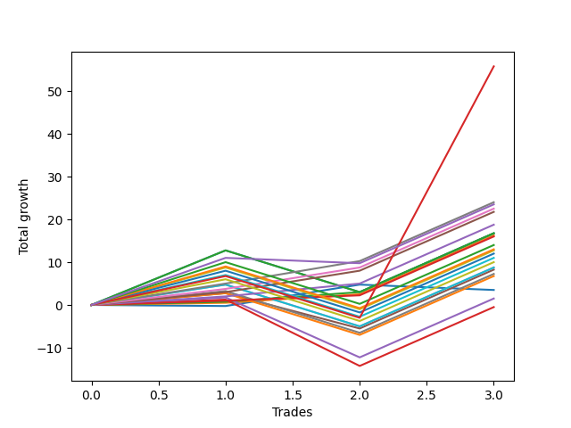

# Short Bernese 005 1v 
- Symbol: ES_FOMC
- Date Range: 11/30/2022 - 12/14/2022
- Trading Period: 8:30-12:30
- Number of Trades: 3



| Name | Win Percent | Profit | Avg Profit / Trade | Avg Time / Trade |      | Name | Win Percent | Profit | Avg Profit / Trade | Avg Time / Trade |
| ---- | ----------- | ------ | ------------------ | ---------------- | ---- | ---- | ----------- | ------ | ------------------ | ---------------- |
| Sorted By <br> Profit | | | | | | Sorted By <br> Win Percentage ||||
| NEWFI 000 | 66.67 | 27875.00 | 9291.67 | 38:41 |     | TP-5 | 100.00 | 12000.00 | 4000.00 | 10:28 |
| TP-5 | 100.00 | 12000.00 | 4000.00 | 10:28 |     | TP-4 | 100.00 | 11250.00 | 3750.00 | 09:55 |
| NEWFI 0000 | 66.67 | 11750.00 | 3916.67 | 25:01 |     | TP-3 | 100.00 | 10875.00 | 3625.00 | 09:46 |
| TP-4 | 100.00 | 11250.00 | 3750.00 | 09:55 |     | TP-2 | 100.00 | 9375.00 | 3125.00 | 08:06 |
| TP-3 | 100.00 | 10875.00 | 3625.00 | 09:46 |     | BB-20 U/L 2SD | 100.00 | 8375.00 | 2791.67 | 08:35 |
| TP-2 | 100.00 | 9375.00 | 3125.00 | 08:06 |     | BB-20 U/L 1SD | 100.00 | 8125.00 | 2708.33 | 08:00 |
| BB-20 U/L 2SD | 100.00 | 8375.00 | 2791.67 | 08:35 |     | TP-1 | 100.00 | 8000.00 | 2666.67 | 04:55 |
| BB-200 U/L 2SD | 66.67 | 8375.00 | 2791.67 | 33:31 |     | NEWFI 000 | 66.67 | 27875.00 | 9291.67 | 38:41 |
| BB-100 U/L 2SD | 66.67 | 8375.00 | 2791.67 | 33:31 |     | NEWFI 0000 | 66.67 | 11750.00 | 3916.67 | 25:01 |
| BB-20 U/L 1SD | 100.00 | 8125.00 | 2708.33 | 08:00 |     | BB-200 U/L 2SD | 66.67 | 8375.00 | 2791.67 | 33:31 |
| TP-1 | 100.00 | 8000.00 | 2666.67 | 04:55 |     | BB-100 U/L 2SD | 66.67 | 8375.00 | 2791.67 | 33:31 |
| TP-10 | 66.67 | 7000.00 | 2333.33 | 33:15 |     | TP-10 | 66.67 | 7000.00 | 2333.33 | 33:15 |
| TP-9 | 66.67 | 6500.00 | 2166.67 | 32:53 |     | TP-9 | 66.67 | 6500.00 | 2166.67 | 32:53 |
| V U/L 1SD | 66.67 | 6375.00 | 2125.00 | 32:48 |     | V U/L 1SD | 66.67 | 6375.00 | 2125.00 | 32:48 |
| TP-8 | 66.67 | 6000.00 | 2000.00 | 32:30 |     | TP-8 | 66.67 | 6000.00 | 2000.00 | 32:30 |
| TP-7 | 66.67 | 5500.00 | 1833.33 | 32:25 |     | TP-7 | 66.67 | 5500.00 | 1833.33 | 32:25 |
| TP-6 | 66.67 | 5000.00 | 1666.67 | 32:03 |     | TP-6 | 66.67 | 5000.00 | 1666.67 | 32:03 |
| BB-100 Mid | 66.67 | 4375.00 | 1458.33 | 29:56 |     | BB-100 Mid | 66.67 | 4375.00 | 1458.33 | 29:56 |
| BB-50 U/L 2SD | 66.67 | 4375.00 | 1458.33 | 29:55 |     | BB-50 U/L 2SD | 66.67 | 4375.00 | 1458.33 | 29:55 |
| BB-50 U/L 1SD | 66.67 | 4125.00 | 1375.00 | 29:00 |     | BB-50 U/L 1SD | 66.67 | 4125.00 | 1375.00 | 29:00 |
| V Mid | 66.67 | 3625.00 | 1208.33 | 29:25 |     | V Mid | 66.67 | 3625.00 | 1208.33 | 29:25 |
| BB-200 Mid | 66.67 | 3375.00 | 1125.00 | 29:16 |     | BB-200 Mid | 66.67 | 3375.00 | 1125.00 | 29:16 |
| BB-20 Mid | 33.33 | 1750.00 | 583.33 | 02:28 |     | BB-50 Mid | 66.67 | 750.00 | 250.00 | 25:13 |
| BB-50 Mid | 66.67 | 750.00 | 250.00 | 25:13 |     | BB-20 U/L 2SD C | 66.67 | -250.00 | -83.33 | 19:40 |
| BB-20 U/L 2SD C | 66.67 | -250.00 | -83.33 | 19:40 |     | BB-20 Mid | 33.33 | 1750.00 | 583.33 | 02:28 |

## NO STOPLOSS

### Test BB-20 Mid
* Sell when price hits the middle line of the 20p bollinger
* No Stoploss
* Results:
```
Total Trades: 3
Percent Up: 66.67
Percent Down: 33.33
Total Points Moved Down: 3.50
Potential Profit: 1750.00
Total Points Ups: 1.50 Count Ups: 2
Total Points Downs: 5.00 Count Downs: 1
```

<details><summary>Trades</summary>

<code>In: 2022-11-30 08:45:00		Out: 2022-11-30 08:46:10		Total Position Time: 01:10		Total Move Down: -0.25		Total to Date: -0.25</code> <br />
<code>In: 2022-05-25 11:37:00		Out: 2022-05-25 11:39:10		Total Position Time: 02:10		Total Move Down: 5.00		Total to Date: 4.75</code> <br />
<code>In: 2022-09-21 10:55:00		Out: 2022-09-21 10:59:05		Total Position Time: 04:05		Total Move Down: -1.25		Total to Date: 3.50</code> <br />


</details>

### Test BB-20 U/L 1SD
* Sell when the price hits the lower line of the 20p 1std bollinger
* No Stoploss
* Results:
```
Total Trades: 3
Percent Up: 0.00
Percent Down: 100.00
Total Points Moved Down: 16.25
Potential Profit: 8125.00
Total Points Ups: 0.00 Count Ups: 0
Total Points Downs: 16.25 Count Downs: 3
```

<details><summary>Trades</summary>

<code>In: 2022-11-30 08:45:00		Out: 2022-11-30 08:51:00		Total Position Time: 06:00		Total Move Down: 0.50		Total to Date: 0.50</code> <br />
<code>In: 2022-05-25 11:37:00		Out: 2022-05-25 11:49:55		Total Position Time: 12:55		Total Move Down: 2.00		Total to Date: 2.50</code> <br />
<code>In: 2022-09-21 10:55:00		Out: 2022-09-21 11:00:05		Total Position Time: 05:05		Total Move Down: 13.75		Total to Date: 16.25</code> <br />


</details>

### Test BB-20 U/L 2SD
* Sell when the price hits the lower line of the 20p 2std bollinger
* No Stoploss
* Results:
```
Total Trades: 3
Percent Up: 0.00
Percent Down: 100.00
Total Points Moved Down: 16.75
Potential Profit: 8375.00
Total Points Ups: 0.00 Count Ups: 0
Total Points Downs: 16.75 Count Downs: 3
```

<details><summary>Trades</summary>

<code>In: 2022-11-30 08:45:00		Out: 2022-11-30 08:52:40		Total Position Time: 07:40		Total Move Down: 0.75		Total to Date: 0.75</code> <br />
<code>In: 2022-05-25 11:37:00		Out: 2022-05-25 11:50:00		Total Position Time: 13:00		Total Move Down: 2.25		Total to Date: 3.00</code> <br />
<code>In: 2022-09-21 10:55:00		Out: 2022-09-21 11:00:05		Total Position Time: 05:05		Total Move Down: 13.75		Total to Date: 16.75</code> <br />


</details>

### Test BB-20 U/L 2SD C
* Sell when the price hits the lower line of the 20p 2std bollinger
* No Stoploss
* Results:
```
Total Trades: 3
Percent Up: 33.33
Percent Down: 66.67
Total Points Moved Down: -0.50
Potential Profit: -250.00
Total Points Ups: 15.50 Count Ups: 1
Total Points Downs: 15.00 Count Downs: 2
```

<details><summary>Trades</summary>

<code>In: 2022-11-30 08:45:00		Out: 2022-11-30 08:52:55		Total Position Time: 07:55		Total Move Down: 1.25		Total to Date: 1.25</code> <br />
<code>In: 2022-05-25 11:37:00		Out: 2022-05-25 12:23:00		Total Position Time: 46:00		Total Move Down: -15.50		Total to Date: -14.25</code> <br />
<code>In: 2022-09-21 10:55:00		Out: 2022-09-21 11:00:05		Total Position Time: 05:05		Total Move Down: 13.75		Total to Date: -0.50</code> <br />


</details>

### Test BB-50 Mid
* Sell when price hits the middle line of the 50p bollinger
* No Stoploss
* Results:
```
Total Trades: 3
Percent Up: 33.33
Percent Down: 66.67
Total Points Moved Down: 1.50
Potential Profit: 750.00
Total Points Ups: 14.00 Count Ups: 1
Total Points Downs: 15.50 Count Downs: 2
```

<details><summary>Trades</summary>

<code>In: 2022-11-30 08:45:00		Out: 2022-11-30 08:58:15		Total Position Time: 13:15		Total Move Down: 1.75		Total to Date: 1.75</code> <br />
<code>In: 2022-05-25 11:37:00		Out: 2022-05-25 12:34:20		Total Position Time: 57:20		Total Move Down: -14.00		Total to Date: -12.25</code> <br />
<code>In: 2022-09-21 10:55:00		Out: 2022-09-21 11:00:05		Total Position Time: 05:05		Total Move Down: 13.75		Total to Date: 1.50</code> <br />


</details>

### Test BB-50 U/L 1SD
* Sell when the price hits the lower line of the 50p 1std bollinger
* No Stoploss
* Results:
```
Total Trades: 3
Percent Up: 33.33
Percent Down: 66.67
Total Points Moved Down: 8.25
Potential Profit: 4125.00
Total Points Ups: 8.25 Count Ups: 1
Total Points Downs: 16.50 Count Downs: 2
```

<details><summary>Trades</summary>

<code>In: 2022-11-30 08:45:00		Out: 2022-11-30 09:06:50		Total Position Time: 21:50		Total Move Down: 2.75		Total to Date: 2.75</code> <br />
<code>In: 2022-05-25 11:37:00		Out: 2022-05-25 12:37:05		Total Position Time: 60:05		Total Move Down: -8.25		Total to Date: -5.50</code> <br />
<code>In: 2022-09-21 10:55:00		Out: 2022-09-21 11:00:05		Total Position Time: 05:05		Total Move Down: 13.75		Total to Date: 8.25</code> <br />


</details>

### Test BB-50 U/L 2SD
* Sell when the price hits the lower line of the 50p 2std bollinger
* No Stoploss
* Results:
```
Total Trades: 3
Percent Up: 33.33
Percent Down: 66.67
Total Points Moved Down: 8.75
Potential Profit: 4375.00
Total Points Ups: 9.75 Count Ups: 1
Total Points Downs: 18.50 Count Downs: 2
```

<details><summary>Trades</summary>

<code>In: 2022-11-30 08:45:00		Out: 2022-11-30 09:08:45		Total Position Time: 23:45		Total Move Down: 4.75		Total to Date: 4.75</code> <br />
<code>In: 2022-05-25 11:37:00		Out: 2022-05-25 12:37:55		Total Position Time: 60:55		Total Move Down: -9.75		Total to Date: -5.00</code> <br />
<code>In: 2022-09-21 10:55:00		Out: 2022-09-21 11:00:05		Total Position Time: 05:05		Total Move Down: 13.75		Total to Date: 8.75</code> <br />


</details>

### Test V Mid
* Sell when the price hits the middle line of the 1std VWAP
* No Stoploss
* Results:
```
Total Trades: 3
Percent Up: 33.33
Percent Down: 66.67
Total Points Moved Down: 7.25
Potential Profit: 3625.00
Total Points Ups: 9.75 Count Ups: 1
Total Points Downs: 17.00 Count Downs: 2
```

<details><summary>Trades</summary>

<code>In: 2022-11-30 08:45:00		Out: 2022-11-30 09:07:15		Total Position Time: 22:15		Total Move Down: 3.25		Total to Date: 3.25</code> <br />
<code>In: 2022-05-25 11:37:00		Out: 2022-05-25 12:37:55		Total Position Time: 60:55		Total Move Down: -9.75		Total to Date: -6.50</code> <br />
<code>In: 2022-09-21 10:55:00		Out: 2022-09-21 11:00:05		Total Position Time: 05:05		Total Move Down: 13.75		Total to Date: 7.25</code> <br />


</details>

### Test V U/L 1SD
* Sell when the price hits the lower line of the 1std VWAP
* No Stoploss
* Results:
```
Total Trades: 3
Percent Up: 33.33
Percent Down: 66.67
Total Points Moved Down: 12.75
Potential Profit: 6375.00
Total Points Ups: 9.75 Count Ups: 1
Total Points Downs: 22.50 Count Downs: 2
```

<details><summary>Trades</summary>

<code>In: 2022-11-30 08:45:00		Out: 2022-11-30 09:17:25		Total Position Time: 32:25		Total Move Down: 8.75		Total to Date: 8.75</code> <br />
<code>In: 2022-05-25 11:37:00		Out: 2022-05-25 12:37:55		Total Position Time: 60:55		Total Move Down: -9.75		Total to Date: -1.00</code> <br />
<code>In: 2022-09-21 10:55:00		Out: 2022-09-21 11:00:05		Total Position Time: 05:05		Total Move Down: 13.75		Total to Date: 12.75</code> <br />


</details>

### Test BB-100 Mid
* Move to BB100 Mid
* No Stoploss
* Results:
```
Total Trades: 3
Percent Up: 33.33
Percent Down: 66.67
Total Points Moved Down: 8.75
Potential Profit: 4375.00
Total Points Ups: 9.75 Count Ups: 1
Total Points Downs: 18.50 Count Downs: 2
```

<details><summary>Trades</summary>

<code>In: 2022-11-30 08:45:00		Out: 2022-11-30 09:08:50		Total Position Time: 23:50		Total Move Down: 4.75		Total to Date: 4.75</code> <br />
<code>In: 2022-05-25 11:37:00		Out: 2022-05-25 12:37:55		Total Position Time: 60:55		Total Move Down: -9.75		Total to Date: -5.00</code> <br />
<code>In: 2022-09-21 10:55:00		Out: 2022-09-21 11:00:05		Total Position Time: 05:05		Total Move Down: 13.75		Total to Date: 8.75</code> <br />


</details>

### Test BB-100 U/L 2SD
* Move to BB100 Upper Band
* No Stoploss
* Results:
```
Total Trades: 3
Percent Up: 33.33
Percent Down: 66.67
Total Points Moved Down: 16.75
Potential Profit: 8375.00
Total Points Ups: 9.75 Count Ups: 1
Total Points Downs: 26.50 Count Downs: 2
```

<details><summary>Trades</summary>

<code>In: 2022-11-30 08:45:00		Out: 2022-11-30 09:19:35		Total Position Time: 34:35		Total Move Down: 12.75		Total to Date: 12.75</code> <br />
<code>In: 2022-05-25 11:37:00		Out: 2022-05-25 12:37:55		Total Position Time: 60:55		Total Move Down: -9.75		Total to Date: 3.00</code> <br />
<code>In: 2022-09-21 10:55:00		Out: 2022-09-21 11:00:05		Total Position Time: 05:05		Total Move Down: 13.75		Total to Date: 16.75</code> <br />


</details>

### Test BB-200 Mid
* Move to BB200 Mid
* No Stoploss
* Results:
```
Total Trades: 3
Percent Up: 33.33
Percent Down: 66.67
Total Points Moved Down: 6.75
Potential Profit: 3375.00
Total Points Ups: 9.75 Count Ups: 1
Total Points Downs: 16.50 Count Downs: 2
```

<details><summary>Trades</summary>

<code>In: 2022-11-30 08:45:00		Out: 2022-11-30 09:06:50		Total Position Time: 21:50		Total Move Down: 2.75		Total to Date: 2.75</code> <br />
<code>In: 2022-05-25 11:37:00		Out: 2022-05-25 12:37:55		Total Position Time: 60:55		Total Move Down: -9.75		Total to Date: -7.00</code> <br />
<code>In: 2022-09-21 10:55:00		Out: 2022-09-21 11:00:05		Total Position Time: 05:05		Total Move Down: 13.75		Total to Date: 6.75</code> <br />


</details>

### Test BB-200 U/L 2SD
* Move to BB200 Upper Band
* No Stoploss
* Results:
```
Total Trades: 3
Percent Up: 33.33
Percent Down: 66.67
Total Points Moved Down: 16.75
Potential Profit: 8375.00
Total Points Ups: 9.75 Count Ups: 1
Total Points Downs: 26.50 Count Downs: 2
```

<details><summary>Trades</summary>

<code>In: 2022-11-30 08:45:00		Out: 2022-11-30 09:19:35		Total Position Time: 34:35		Total Move Down: 12.75		Total to Date: 12.75</code> <br />
<code>In: 2022-05-25 11:37:00		Out: 2022-05-25 12:37:55		Total Position Time: 60:55		Total Move Down: -9.75		Total to Date: 3.00</code> <br />
<code>In: 2022-09-21 10:55:00		Out: 2022-09-21 11:00:05		Total Position Time: 05:05		Total Move Down: 13.75		Total to Date: 16.75</code> <br />


</details>

## TAKE PROFIT

### Test TP-1
* Take Profit of 1 Point
* No Stoploss
* Results:
```
Total Trades: 3
Percent Up: 0.00
Percent Down: 100.00
Total Points Moved Down: 16.00
Potential Profit: 8000.00
Total Points Ups: 0.00 Count Ups: 0
Total Points Downs: 16.00 Count Downs: 3
```

<details><summary>Trades</summary>

<code>In: 2022-11-30 08:45:00		Out: 2022-11-30 08:52:50		Total Position Time: 07:50		Total Move Down: 1.00		Total to Date: 1.00</code> <br />
<code>In: 2022-05-25 11:37:00		Out: 2022-05-25 11:38:50		Total Position Time: 01:50		Total Move Down: 1.25		Total to Date: 2.25</code> <br />
<code>In: 2022-09-21 10:55:00		Out: 2022-09-21 11:00:05		Total Position Time: 05:05		Total Move Down: 13.75		Total to Date: 16.00</code> <br />


</details>

### Test TP-2
* Take Profit of 2 Point
* No Stoploss
* Results:
```
Total Trades: 3
Percent Up: 0.00
Percent Down: 100.00
Total Points Moved Down: 18.75
Potential Profit: 9375.00
Total Points Ups: 0.00 Count Ups: 0
Total Points Downs: 18.75 Count Downs: 3
```

<details><summary>Trades</summary>

<code>In: 2022-11-30 08:45:00		Out: 2022-11-30 09:02:10		Total Position Time: 17:10		Total Move Down: 2.00		Total to Date: 2.00</code> <br />
<code>In: 2022-05-25 11:37:00		Out: 2022-05-25 11:39:05		Total Position Time: 02:05		Total Move Down: 3.00		Total to Date: 5.00</code> <br />
<code>In: 2022-09-21 10:55:00		Out: 2022-09-21 11:00:05		Total Position Time: 05:05		Total Move Down: 13.75		Total to Date: 18.75</code> <br />


</details>

### Test TP-3
* Take Profit of 3 Point
* No Stoploss
* Results:
```
Total Trades: 3
Percent Up: 0.00
Percent Down: 100.00
Total Points Moved Down: 21.75
Potential Profit: 10875.00
Total Points Ups: 0.00 Count Ups: 0
Total Points Downs: 21.75 Count Downs: 3
```

<details><summary>Trades</summary>

<code>In: 2022-11-30 08:45:00		Out: 2022-11-30 09:07:05		Total Position Time: 22:05		Total Move Down: 3.00		Total to Date: 3.00</code> <br />
<code>In: 2022-05-25 11:37:00		Out: 2022-05-25 11:39:10		Total Position Time: 02:10		Total Move Down: 5.00		Total to Date: 8.00</code> <br />
<code>In: 2022-09-21 10:55:00		Out: 2022-09-21 11:00:05		Total Position Time: 05:05		Total Move Down: 13.75		Total to Date: 21.75</code> <br />


</details>

### Test TP-4
* Take Profit of 4 Point
* No Stoploss
* Results:
```
Total Trades: 3
Percent Up: 0.00
Percent Down: 100.00
Total Points Moved Down: 22.50
Potential Profit: 11250.00
Total Points Ups: 0.00 Count Ups: 0
Total Points Downs: 22.50 Count Downs: 3
```

<details><summary>Trades</summary>

<code>In: 2022-11-30 08:45:00		Out: 2022-11-30 09:07:30		Total Position Time: 22:30		Total Move Down: 3.75		Total to Date: 3.75</code> <br />
<code>In: 2022-05-25 11:37:00		Out: 2022-05-25 11:39:10		Total Position Time: 02:10		Total Move Down: 5.00		Total to Date: 8.75</code> <br />
<code>In: 2022-09-21 10:55:00		Out: 2022-09-21 11:00:05		Total Position Time: 05:05		Total Move Down: 13.75		Total to Date: 22.50</code> <br />


</details>

### Test TP-5
* Take Profit of 5 Point
* No Stoploss
* Results:
```
Total Trades: 3
Percent Up: 0.00
Percent Down: 100.00
Total Points Moved Down: 24.00
Potential Profit: 12000.00
Total Points Ups: 0.00 Count Ups: 0
Total Points Downs: 24.00 Count Downs: 3
```

<details><summary>Trades</summary>

<code>In: 2022-11-30 08:45:00		Out: 2022-11-30 09:08:55		Total Position Time: 23:55		Total Move Down: 5.00		Total to Date: 5.00</code> <br />
<code>In: 2022-05-25 11:37:00		Out: 2022-05-25 11:39:25		Total Position Time: 02:25		Total Move Down: 5.25		Total to Date: 10.25</code> <br />
<code>In: 2022-09-21 10:55:00		Out: 2022-09-21 11:00:05		Total Position Time: 05:05		Total Move Down: 13.75		Total to Date: 24.00</code> <br />


</details>

### Test TP-6
* Take Profit of 6 Point
* No Stoploss
* Results:
```
Total Trades: 3
Percent Up: 33.33
Percent Down: 66.67
Total Points Moved Down: 10.00
Potential Profit: 5000.00
Total Points Ups: 9.75 Count Ups: 1
Total Points Downs: 19.75 Count Downs: 2
```

<details><summary>Trades</summary>

<code>In: 2022-11-30 08:45:00		Out: 2022-11-30 09:15:10		Total Position Time: 30:10		Total Move Down: 6.00		Total to Date: 6.00</code> <br />
<code>In: 2022-05-25 11:37:00		Out: 2022-05-25 12:37:55		Total Position Time: 60:55		Total Move Down: -9.75		Total to Date: -3.75</code> <br />
<code>In: 2022-09-21 10:55:00		Out: 2022-09-21 11:00:05		Total Position Time: 05:05		Total Move Down: 13.75		Total to Date: 10.00</code> <br />


</details>

### Test TP-7
* Take Profit of 7 Point
* No Stoploss
* Results:
```
Total Trades: 3
Percent Up: 33.33
Percent Down: 66.67
Total Points Moved Down: 11.00
Potential Profit: 5500.00
Total Points Ups: 9.75 Count Ups: 1
Total Points Downs: 20.75 Count Downs: 2
```

<details><summary>Trades</summary>

<code>In: 2022-11-30 08:45:00		Out: 2022-11-30 09:16:15		Total Position Time: 31:15		Total Move Down: 7.00		Total to Date: 7.00</code> <br />
<code>In: 2022-05-25 11:37:00		Out: 2022-05-25 12:37:55		Total Position Time: 60:55		Total Move Down: -9.75		Total to Date: -2.75</code> <br />
<code>In: 2022-09-21 10:55:00		Out: 2022-09-21 11:00:05		Total Position Time: 05:05		Total Move Down: 13.75		Total to Date: 11.00</code> <br />


</details>

### Test TP-8
* Take Profit of 8 Point
* No Stoploss
* Results:
```
Total Trades: 3
Percent Up: 33.33
Percent Down: 66.67
Total Points Moved Down: 12.00
Potential Profit: 6000.00
Total Points Ups: 9.75 Count Ups: 1
Total Points Downs: 21.75 Count Downs: 2
```

<details><summary>Trades</summary>

<code>In: 2022-11-30 08:45:00		Out: 2022-11-30 09:16:30		Total Position Time: 31:30		Total Move Down: 8.00		Total to Date: 8.00</code> <br />
<code>In: 2022-05-25 11:37:00		Out: 2022-05-25 12:37:55		Total Position Time: 60:55		Total Move Down: -9.75		Total to Date: -1.75</code> <br />
<code>In: 2022-09-21 10:55:00		Out: 2022-09-21 11:00:05		Total Position Time: 05:05		Total Move Down: 13.75		Total to Date: 12.00</code> <br />


</details>

### Test TP-9
* Take Profit of 9 Point
* No Stoploss
* Results:
```
Total Trades: 3
Percent Up: 33.33
Percent Down: 66.67
Total Points Moved Down: 13.00
Potential Profit: 6500.00
Total Points Ups: 9.75 Count Ups: 1
Total Points Downs: 22.75 Count Downs: 2
```

<details><summary>Trades</summary>

<code>In: 2022-11-30 08:45:00		Out: 2022-11-30 09:17:40		Total Position Time: 32:40		Total Move Down: 9.00		Total to Date: 9.00</code> <br />
<code>In: 2022-05-25 11:37:00		Out: 2022-05-25 12:37:55		Total Position Time: 60:55		Total Move Down: -9.75		Total to Date: -0.75</code> <br />
<code>In: 2022-09-21 10:55:00		Out: 2022-09-21 11:00:05		Total Position Time: 05:05		Total Move Down: 13.75		Total to Date: 13.00</code> <br />


</details>

### Test TP-10
* Take Profit of 10 Point
* No Stoploss
* Results:
```
Total Trades: 3
Percent Up: 33.33
Percent Down: 66.67
Total Points Moved Down: 14.00
Potential Profit: 7000.00
Total Points Ups: 9.75 Count Ups: 1
Total Points Downs: 23.75 Count Downs: 2
```

<details><summary>Trades</summary>

<code>In: 2022-11-30 08:45:00		Out: 2022-11-30 09:18:45		Total Position Time: 33:45		Total Move Down: 10.00		Total to Date: 10.00</code> <br />
<code>In: 2022-05-25 11:37:00		Out: 2022-05-25 12:37:55		Total Position Time: 60:55		Total Move Down: -9.75		Total to Date: 0.25</code> <br />
<code>In: 2022-09-21 10:55:00		Out: 2022-09-21 11:00:05		Total Position Time: 05:05		Total Move Down: 13.75		Total to Date: 14.00</code> <br />


</details>

## Indicator Exits

### Test NEWFI 000
* Newfi 0000
* No Stoploss
* Results:
```
Total Trades: 3
Percent Up: 33.33
Percent Down: 66.67
Total Points Moved Down: 55.75
Potential Profit: 27875.00
Total Points Ups: 9.75 Count Ups: 1
Total Points Downs: 65.50 Count Downs: 2
```

<details><summary>Trades</summary>

<code>In: 2022-11-30 08:45:00		Out: 2022-11-30 09:17:05		Total Position Time: 32:05		Total Move Down: 6.75		Total to Date: 6.75</code> <br />
<code>In: 2022-05-25 11:37:00		Out: 2022-05-25 12:37:55		Total Position Time: 60:55		Total Move Down: -9.75		Total to Date: -3.00</code> <br />
<code>In: 2022-09-21 10:55:00		Out: 2022-09-21 11:18:05		Total Position Time: 23:05		Total Move Down: 58.75		Total to Date: 55.75</code> <br />


</details>

### Test NEWFI 0000
* Newfi 0000
* No Stoploss
* Results:
```
Total Trades: 3
Percent Up: 33.33
Percent Down: 66.67
Total Points Moved Down: 23.50
Potential Profit: 11750.00
Total Points Ups: 1.25 Count Ups: 1
Total Points Downs: 24.75 Count Downs: 2
```

<details><summary>Trades</summary>

<code>In: 2022-11-30 08:45:00		Out: 2022-11-30 09:45:55		Total Position Time: 60:55		Total Move Down: 11.00		Total to Date: 11.00</code> <br />
<code>In: 2022-05-25 11:37:00		Out: 2022-05-25 11:46:05		Total Position Time: 09:05		Total Move Down: -1.25		Total to Date: 9.75</code> <br />
<code>In: 2022-09-21 10:55:00		Out: 2022-09-21 11:00:05		Total Position Time: 05:05		Total Move Down: 13.75		Total to Date: 23.50</code> <br />


</details>