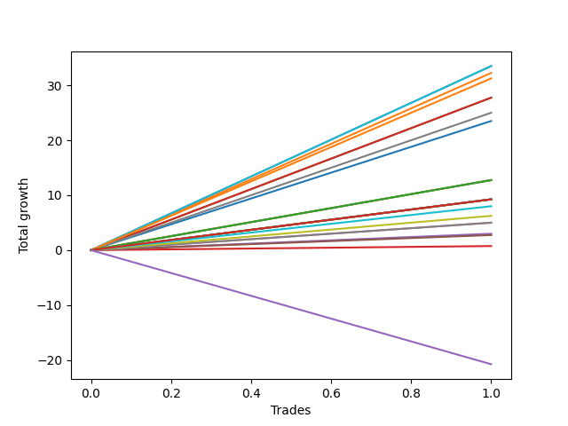

# Short Labrador 001 
- Symbol: ES_FOMC
- Date Range: 11/30/2022 - 12/14/2022
- Trading Period: 8:30-12:30
- Number of Trades: 1



| Name | Win Percent | Profit | Avg Profit / Trade | Avg Time / Trade |      | Name | Win Percent | Profit | Avg Profit / Trade | Avg Time / Trade |
| ---- | ----------- | ------ | ------------------ | ---------------- | ---- | ---- | ----------- | ------ | ------------------ | ---------------- |
| Sorted By <br> Profit | | | | | | Sorted By <br> Win Percentage ||||
| BB-100 Mid | 100.00 | 16750.00 | 16750.00 | 09:05 |     | BB-100 Mid | 100.00 | 16750.00 | 16750.00 | 09:05 |
| BB-50 Mid | 100.00 | 16750.00 | 16750.00 | 09:05 |     | BB-50 Mid | 100.00 | 16750.00 | 16750.00 | 09:05 |
| BB-20 U/L 1SD | 100.00 | 16125.00 | 16125.00 | 08:55 |     | BB-20 U/L 1SD | 100.00 | 16125.00 | 16125.00 | 08:55 |
| BB-200 Mid | 100.00 | 15625.00 | 15625.00 | 09:00 |     | BB-200 Mid | 100.00 | 15625.00 | 15625.00 | 09:00 |
| BB-20 U/L 2SD C | 100.00 | 13875.00 | 13875.00 | 24:05 |     | BB-20 U/L 2SD C | 100.00 | 13875.00 | 13875.00 | 24:05 |
| BB-20 U/L 2SD | 100.00 | 13875.00 | 13875.00 | 24:05 |     | BB-20 U/L 2SD | 100.00 | 13875.00 | 13875.00 | 24:05 |
| V Mid | 100.00 | 12500.00 | 12500.00 | 05:50 |     | V Mid | 100.00 | 12500.00 | 12500.00 | 05:50 |
| BB-20 Mid | 100.00 | 11750.00 | 11750.00 | 03:35 |     | BB-20 Mid | 100.00 | 11750.00 | 11750.00 | 03:35 |
| TP-10 | 100.00 | 6375.00 | 6375.00 | 03:10 |     | TP-10 | 100.00 | 6375.00 | 6375.00 | 03:10 |
| TP-9 | 100.00 | 6375.00 | 6375.00 | 03:10 |     | TP-9 | 100.00 | 6375.00 | 6375.00 | 03:10 |
| TP-8 | 100.00 | 6375.00 | 6375.00 | 03:10 |     | TP-8 | 100.00 | 6375.00 | 6375.00 | 03:10 |
| NEWFI 000 | 100.00 | 4625.00 | 4625.00 | 58:00 |     | NEWFI 000 | 100.00 | 4625.00 | 4625.00 | 58:00 |
| BB-200 U/L 2SD | 100.00 | 4625.00 | 4625.00 | 58:00 |     | BB-200 U/L 2SD | 100.00 | 4625.00 | 4625.00 | 58:00 |
| BB-100 U/L 2SD | 100.00 | 4625.00 | 4625.00 | 58:00 |     | BB-100 U/L 2SD | 100.00 | 4625.00 | 4625.00 | 58:00 |
| V U/L 1SD | 100.00 | 4625.00 | 4625.00 | 58:00 |     | V U/L 1SD | 100.00 | 4625.00 | 4625.00 | 58:00 |
| BB-50 U/L 2SD | 100.00 | 4625.00 | 4625.00 | 58:00 |     | BB-50 U/L 2SD | 100.00 | 4625.00 | 4625.00 | 58:00 |
| BB-50 U/L 1SD | 100.00 | 4625.00 | 4625.00 | 58:00 |     | BB-50 U/L 1SD | 100.00 | 4625.00 | 4625.00 | 58:00 |
| TP-7 | 100.00 | 4000.00 | 4000.00 | 03:05 |     | TP-7 | 100.00 | 4000.00 | 4000.00 | 03:05 |
| TP-6 | 100.00 | 3125.00 | 3125.00 | 02:30 |     | TP-6 | 100.00 | 3125.00 | 3125.00 | 02:30 |
| TP-5 | 100.00 | 2500.00 | 2500.00 | 01:25 |     | TP-5 | 100.00 | 2500.00 | 2500.00 | 01:25 |
| TP-4 | 100.00 | 2500.00 | 2500.00 | 01:25 |     | TP-4 | 100.00 | 2500.00 | 2500.00 | 01:25 |
| TP-2 | 100.00 | 1500.00 | 1500.00 | 01:15 |     | TP-2 | 100.00 | 1500.00 | 1500.00 | 01:15 |
| TP-3 | 100.00 | 1375.00 | 1375.00 | 01:20 |     | TP-3 | 100.00 | 1375.00 | 1375.00 | 01:20 |
| TP-1 | 100.00 | 375.00 | 375.00 | 01:10 |     | TP-1 | 100.00 | 375.00 | 375.00 | 01:10 |
| NEWFI 0000 | 0.00 | -10375.00 | -10375.00 | 43:05 |     | NEWFI 0000 | 0.00 | -10375.00 | -10375.00 | 43:05 |

## NO STOPLOSS

### Test BB-20 Mid
* Sell when price hits the middle line of the 20p bollinger
* No Stoploss
* Results:
```
Total Trades: 1
Percent Up: 0.00
Percent Down: 100.00
Total Points Moved Down: 23.50
Potential Profit: 11750.00
Total Points Ups: 0.00 Count Ups: 0
Total Points Downs: 23.50 Count Downs: 1
```

<details><summary>Trades</summary>

<code>In: 2022-06-15 11:49:00		Out: 2022-06-15 11:52:35		Total Position Time: 03:35		Total Move Down: 23.50		Total to Date: 23.50</code> <br />


</details>

### Test BB-20 U/L 1SD
* Sell when the price hits the lower line of the 20p 1std bollinger
* No Stoploss
* Results:
```
Total Trades: 1
Percent Up: 0.00
Percent Down: 100.00
Total Points Moved Down: 32.25
Potential Profit: 16125.00
Total Points Ups: 0.00 Count Ups: 0
Total Points Downs: 32.25 Count Downs: 1
```

<details><summary>Trades</summary>

<code>In: 2022-06-15 11:49:00		Out: 2022-06-15 11:57:55		Total Position Time: 08:55		Total Move Down: 32.25		Total to Date: 32.25</code> <br />


</details>

### Test BB-20 U/L 2SD
* Sell when the price hits the lower line of the 20p 2std bollinger
* No Stoploss
* Results:
```
Total Trades: 1
Percent Up: 0.00
Percent Down: 100.00
Total Points Moved Down: 27.75
Potential Profit: 13875.00
Total Points Ups: 0.00 Count Ups: 0
Total Points Downs: 27.75 Count Downs: 1
```

<details><summary>Trades</summary>

<code>In: 2022-06-15 11:49:00		Out: 2022-06-15 12:13:05		Total Position Time: 24:05		Total Move Down: 27.75		Total to Date: 27.75</code> <br />


</details>

### Test BB-20 U/L 2SD C
* Sell when the price hits the lower line of the 20p 2std bollinger
* No Stoploss
* Results:
```
Total Trades: 1
Percent Up: 0.00
Percent Down: 100.00
Total Points Moved Down: 27.75
Potential Profit: 13875.00
Total Points Ups: 0.00 Count Ups: 0
Total Points Downs: 27.75 Count Downs: 1
```

<details><summary>Trades</summary>

<code>In: 2022-06-15 11:49:00		Out: 2022-06-15 12:13:05		Total Position Time: 24:05		Total Move Down: 27.75		Total to Date: 27.75</code> <br />


</details>

### Test BB-50 Mid
* Sell when price hits the middle line of the 50p bollinger
* No Stoploss
* Results:
```
Total Trades: 1
Percent Up: 0.00
Percent Down: 100.00
Total Points Moved Down: 33.50
Potential Profit: 16750.00
Total Points Ups: 0.00 Count Ups: 0
Total Points Downs: 33.50 Count Downs: 1
```

<details><summary>Trades</summary>

<code>In: 2022-06-15 11:49:00		Out: 2022-06-15 11:58:05		Total Position Time: 09:05		Total Move Down: 33.50		Total to Date: 33.50</code> <br />


</details>

### Test BB-50 U/L 1SD
* Sell when the price hits the lower line of the 50p 1std bollinger
* No Stoploss
* Results:
```
Total Trades: 1
Percent Up: 0.00
Percent Down: 100.00
Total Points Moved Down: 9.25
Potential Profit: 4625.00
Total Points Ups: 0.00 Count Ups: 0
Total Points Downs: 9.25 Count Downs: 1
```

<details><summary>Trades</summary>

<code>In: 2022-06-15 11:49:00		Out: 2022-06-15 12:47:00		Total Position Time: 58:00		Total Move Down: 9.25		Total to Date: 9.25</code> <br />


</details>

### Test BB-50 U/L 2SD
* Sell when the price hits the lower line of the 50p 2std bollinger
* No Stoploss
* Results:
```
Total Trades: 1
Percent Up: 0.00
Percent Down: 100.00
Total Points Moved Down: 9.25
Potential Profit: 4625.00
Total Points Ups: 0.00 Count Ups: 0
Total Points Downs: 9.25 Count Downs: 1
```

<details><summary>Trades</summary>

<code>In: 2022-06-15 11:49:00		Out: 2022-06-15 12:47:00		Total Position Time: 58:00		Total Move Down: 9.25		Total to Date: 9.25</code> <br />


</details>

### Test V Mid
* Sell when the price hits the middle line of the 1std VWAP
* No Stoploss
* Results:
```
Total Trades: 1
Percent Up: 0.00
Percent Down: 100.00
Total Points Moved Down: 25.00
Potential Profit: 12500.00
Total Points Ups: 0.00 Count Ups: 0
Total Points Downs: 25.00 Count Downs: 1
```

<details><summary>Trades</summary>

<code>In: 2022-06-15 11:49:00		Out: 2022-06-15 11:54:50		Total Position Time: 05:50		Total Move Down: 25.00		Total to Date: 25.00</code> <br />


</details>

### Test V U/L 1SD
* Sell when the price hits the lower line of the 1std VWAP
* No Stoploss
* Results:
```
Total Trades: 1
Percent Up: 0.00
Percent Down: 100.00
Total Points Moved Down: 9.25
Potential Profit: 4625.00
Total Points Ups: 0.00 Count Ups: 0
Total Points Downs: 9.25 Count Downs: 1
```

<details><summary>Trades</summary>

<code>In: 2022-06-15 11:49:00		Out: 2022-06-15 12:47:00		Total Position Time: 58:00		Total Move Down: 9.25		Total to Date: 9.25</code> <br />


</details>

### Test BB-100 Mid
* Move to BB100 Mid
* No Stoploss
* Results:
```
Total Trades: 1
Percent Up: 0.00
Percent Down: 100.00
Total Points Moved Down: 33.50
Potential Profit: 16750.00
Total Points Ups: 0.00 Count Ups: 0
Total Points Downs: 33.50 Count Downs: 1
```

<details><summary>Trades</summary>

<code>In: 2022-06-15 11:49:00		Out: 2022-06-15 11:58:05		Total Position Time: 09:05		Total Move Down: 33.50		Total to Date: 33.50</code> <br />


</details>

### Test BB-100 U/L 2SD
* Move to BB100 Upper Band
* No Stoploss
* Results:
```
Total Trades: 1
Percent Up: 0.00
Percent Down: 100.00
Total Points Moved Down: 9.25
Potential Profit: 4625.00
Total Points Ups: 0.00 Count Ups: 0
Total Points Downs: 9.25 Count Downs: 1
```

<details><summary>Trades</summary>

<code>In: 2022-06-15 11:49:00		Out: 2022-06-15 12:47:00		Total Position Time: 58:00		Total Move Down: 9.25		Total to Date: 9.25</code> <br />


</details>

### Test BB-200 Mid
* Move to BB200 Mid
* No Stoploss
* Results:
```
Total Trades: 1
Percent Up: 0.00
Percent Down: 100.00
Total Points Moved Down: 31.25
Potential Profit: 15625.00
Total Points Ups: 0.00 Count Ups: 0
Total Points Downs: 31.25 Count Downs: 1
```

<details><summary>Trades</summary>

<code>In: 2022-06-15 11:49:00		Out: 2022-06-15 11:58:00		Total Position Time: 09:00		Total Move Down: 31.25		Total to Date: 31.25</code> <br />


</details>

### Test BB-200 U/L 2SD
* Move to BB200 Upper Band
* No Stoploss
* Results:
```
Total Trades: 1
Percent Up: 0.00
Percent Down: 100.00
Total Points Moved Down: 9.25
Potential Profit: 4625.00
Total Points Ups: 0.00 Count Ups: 0
Total Points Downs: 9.25 Count Downs: 1
```

<details><summary>Trades</summary>

<code>In: 2022-06-15 11:49:00		Out: 2022-06-15 12:47:00		Total Position Time: 58:00		Total Move Down: 9.25		Total to Date: 9.25</code> <br />


</details>

## TAKE PROFIT

### Test TP-1
* Take Profit of 1 Point
* No Stoploss
* Results:
```
Total Trades: 1
Percent Up: 0.00
Percent Down: 100.00
Total Points Moved Down: 0.75
Potential Profit: 375.00
Total Points Ups: 0.00 Count Ups: 0
Total Points Downs: 0.75 Count Downs: 1
```

<details><summary>Trades</summary>

<code>In: 2022-06-15 11:49:00		Out: 2022-06-15 11:50:10		Total Position Time: 01:10		Total Move Down: 0.75		Total to Date: 0.75</code> <br />


</details>

### Test TP-2
* Take Profit of 2 Point
* No Stoploss
* Results:
```
Total Trades: 1
Percent Up: 0.00
Percent Down: 100.00
Total Points Moved Down: 3.00
Potential Profit: 1500.00
Total Points Ups: 0.00 Count Ups: 0
Total Points Downs: 3.00 Count Downs: 1
```

<details><summary>Trades</summary>

<code>In: 2022-06-15 11:49:00		Out: 2022-06-15 11:50:15		Total Position Time: 01:15		Total Move Down: 3.00		Total to Date: 3.00</code> <br />


</details>

### Test TP-3
* Take Profit of 3 Point
* No Stoploss
* Results:
```
Total Trades: 1
Percent Up: 0.00
Percent Down: 100.00
Total Points Moved Down: 2.75
Potential Profit: 1375.00
Total Points Ups: 0.00 Count Ups: 0
Total Points Downs: 2.75 Count Downs: 1
```

<details><summary>Trades</summary>

<code>In: 2022-06-15 11:49:00		Out: 2022-06-15 11:50:20		Total Position Time: 01:20		Total Move Down: 2.75		Total to Date: 2.75</code> <br />


</details>

### Test TP-4
* Take Profit of 4 Point
* No Stoploss
* Results:
```
Total Trades: 1
Percent Up: 0.00
Percent Down: 100.00
Total Points Moved Down: 5.00
Potential Profit: 2500.00
Total Points Ups: 0.00 Count Ups: 0
Total Points Downs: 5.00 Count Downs: 1
```

<details><summary>Trades</summary>

<code>In: 2022-06-15 11:49:00		Out: 2022-06-15 11:50:25		Total Position Time: 01:25		Total Move Down: 5.00		Total to Date: 5.00</code> <br />


</details>

### Test TP-5
* Take Profit of 5 Point
* No Stoploss
* Results:
```
Total Trades: 1
Percent Up: 0.00
Percent Down: 100.00
Total Points Moved Down: 5.00
Potential Profit: 2500.00
Total Points Ups: 0.00 Count Ups: 0
Total Points Downs: 5.00 Count Downs: 1
```

<details><summary>Trades</summary>

<code>In: 2022-06-15 11:49:00		Out: 2022-06-15 11:50:25		Total Position Time: 01:25		Total Move Down: 5.00		Total to Date: 5.00</code> <br />


</details>

### Test TP-6
* Take Profit of 6 Point
* No Stoploss
* Results:
```
Total Trades: 1
Percent Up: 0.00
Percent Down: 100.00
Total Points Moved Down: 6.25
Potential Profit: 3125.00
Total Points Ups: 0.00 Count Ups: 0
Total Points Downs: 6.25 Count Downs: 1
```

<details><summary>Trades</summary>

<code>In: 2022-06-15 11:49:00		Out: 2022-06-15 11:51:30		Total Position Time: 02:30		Total Move Down: 6.25		Total to Date: 6.25</code> <br />


</details>

### Test TP-7
* Take Profit of 7 Point
* No Stoploss
* Results:
```
Total Trades: 1
Percent Up: 0.00
Percent Down: 100.00
Total Points Moved Down: 8.00
Potential Profit: 4000.00
Total Points Ups: 0.00 Count Ups: 0
Total Points Downs: 8.00 Count Downs: 1
```

<details><summary>Trades</summary>

<code>In: 2022-06-15 11:49:00		Out: 2022-06-15 11:52:05		Total Position Time: 03:05		Total Move Down: 8.00		Total to Date: 8.00</code> <br />


</details>

### Test TP-8
* Take Profit of 8 Point
* No Stoploss
* Results:
```
Total Trades: 1
Percent Up: 0.00
Percent Down: 100.00
Total Points Moved Down: 12.75
Potential Profit: 6375.00
Total Points Ups: 0.00 Count Ups: 0
Total Points Downs: 12.75 Count Downs: 1
```

<details><summary>Trades</summary>

<code>In: 2022-06-15 11:49:00		Out: 2022-06-15 11:52:10		Total Position Time: 03:10		Total Move Down: 12.75		Total to Date: 12.75</code> <br />


</details>

### Test TP-9
* Take Profit of 9 Point
* No Stoploss
* Results:
```
Total Trades: 1
Percent Up: 0.00
Percent Down: 100.00
Total Points Moved Down: 12.75
Potential Profit: 6375.00
Total Points Ups: 0.00 Count Ups: 0
Total Points Downs: 12.75 Count Downs: 1
```

<details><summary>Trades</summary>

<code>In: 2022-06-15 11:49:00		Out: 2022-06-15 11:52:10		Total Position Time: 03:10		Total Move Down: 12.75		Total to Date: 12.75</code> <br />


</details>

### Test TP-10
* Take Profit of 10 Point
* No Stoploss
* Results:
```
Total Trades: 1
Percent Up: 0.00
Percent Down: 100.00
Total Points Moved Down: 12.75
Potential Profit: 6375.00
Total Points Ups: 0.00 Count Ups: 0
Total Points Downs: 12.75 Count Downs: 1
```

<details><summary>Trades</summary>

<code>In: 2022-06-15 11:49:00		Out: 2022-06-15 11:52:10		Total Position Time: 03:10		Total Move Down: 12.75		Total to Date: 12.75</code> <br />


</details>

## Indicator Exits

### Test NEWFI 000
* Newfi 0000
* No Stoploss
* Results:
```
Total Trades: 1
Percent Up: 0.00
Percent Down: 100.00
Total Points Moved Down: 9.25
Potential Profit: 4625.00
Total Points Ups: 0.00 Count Ups: 0
Total Points Downs: 9.25 Count Downs: 1
```

<details><summary>Trades</summary>

<code>In: 2022-06-15 11:49:00		Out: 2022-06-15 12:47:00		Total Position Time: 58:00		Total Move Down: 9.25		Total to Date: 9.25</code> <br />


</details>

### Test NEWFI 0000
* Newfi 0000
* No Stoploss
* Results:
```
Total Trades: 1
Percent Up: 100.00
Percent Down: 0.00
Total Points Moved Down: -20.75
Potential Profit: -10375.00
Total Points Ups: 20.75 Count Ups: 1
Total Points Downs: 0.00 Count Downs: 0
```

<details><summary>Trades</summary>

<code>In: 2022-06-15 11:49:00		Out: 2022-06-15 12:32:05		Total Position Time: 43:05		Total Move Down: -20.75		Total to Date: -20.75</code> <br />


</details>