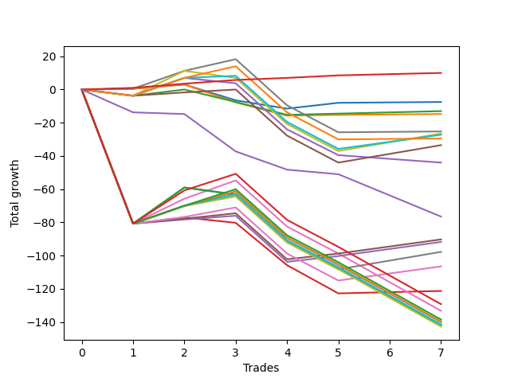

# Short Labrador 002 
- Symbol: ES_FOMC
- Date Range: 11/30/2022 - 12/14/2022
- Trading Period: 8:30-12:30
- Number of Trades: 7



| Name | Win Percent | Profit | Avg Profit / Trade | Avg Time / Trade |      | Name | Win Percent | Profit | Avg Profit / Trade | Avg Time / Trade |
| ---- | ----------- | ------ | ------------------ | ---------------- | ---- | ---- | ----------- | ------ | ------------------ | ---------------- |
| Sorted By <br> Profit | | | | | | Sorted By <br> Win Percentage ||||
| TP-1 | 100.00 | 5000.00 | 714.29 | 02:11 |     | TP-1 | 100.00 | 5000.00 | 714.29 | 02:11 |
| BB-20 Mid | 71.43 | -3750.00 | -535.71 | 06:31 |     | BB-20 Mid | 71.43 | -3750.00 | -535.71 | 06:31 |
| BB-20 U/L 2SD | 57.14 | -6500.00 | -928.57 | 12:34 |     | BB-20 U/L 1SD | 71.43 | -7375.00 | -1053.57 | 11:50 |
| BB-20 U/L 1SD | 71.43 | -7375.00 | -1053.57 | 11:50 |     | V Mid | 71.43 | -12625.00 | -1803.57 | 24:00 |
| V Mid | 71.43 | -12625.00 | -1803.57 | 24:00 |     | TP-3 | 71.43 | -45125.00 | -6446.43 | 21:25 |
| V U/L 1SD | 42.86 | -13250.00 | -1892.86 | 31:57 |     | TP-2 | 71.43 | -45875.00 | -6553.57 | 21:18 |
| BB-100 Mid | 57.14 | -13625.00 | -1946.43 | 27:10 |     | BB-20 U/L 2SD | 57.14 | -6500.00 | -928.57 | 12:34 |
| BB-200 Mid | 57.14 | -14750.00 | -2107.14 | 25:11 |     | BB-100 Mid | 57.14 | -13625.00 | -1946.43 | 27:10 |
| BB-50 U/L 1SD | 57.14 | -16750.00 | -2392.86 | 27:12 |     | BB-200 Mid | 57.14 | -14750.00 | -2107.14 | 25:11 |
| BB-50 Mid | 14.29 | -22000.00 | -3142.86 | 26:32 |     | BB-50 U/L 1SD | 57.14 | -16750.00 | -2392.86 | 27:12 |
| NEWFI 0000 | 0.00 | -38250.00 | -5464.29 | 12:56 |     | TP-5 | 57.14 | -48875.00 | -6982.14 | 34:47 |
| TP-3 | 71.43 | -45125.00 | -6446.43 | 21:25 |     | TP-4 | 57.14 | -53250.00 | -7607.14 | 34:43 |
| TP-2 | 71.43 | -45875.00 | -6553.57 | 21:18 |     | V U/L 1SD | 42.86 | -13250.00 | -1892.86 | 31:57 |
| TP-5 | 57.14 | -48875.00 | -6982.14 | 34:47 |     | BB-20 U/L 2SD C | 42.86 | -60625.00 | -8660.71 | 29:20 |
| TP-4 | 57.14 | -53250.00 | -7607.14 | 34:43 |     | NEWFI 000 | 28.57 | -64625.00 | -9232.14 | 53:32 |
| BB-20 U/L 2SD C | 42.86 | -60625.00 | -8660.71 | 29:20 |     | BB-50 U/L 2SD | 28.57 | -66625.00 | -9517.86 | 51:55 |
| NEWFI 000 | 28.57 | -64625.00 | -9232.14 | 53:32 |     | TP-10 | 28.57 | -69250.00 | -9892.86 | 50:00 |
| BB-50 U/L 2SD | 28.57 | -66625.00 | -9517.86 | 51:55 |     | TP-9 | 28.57 | -69875.00 | -9982.14 | 49:47 |
| TP-10 | 28.57 | -69250.00 | -9892.86 | 50:00 |     | TP-8 | 28.57 | -70000.00 | -10000.00 | 49:35 |
| TP-9 | 28.57 | -69875.00 | -9982.14 | 49:47 |     | TP-7 | 28.57 | -70750.00 | -10107.14 | 49:30 |
| TP-8 | 28.57 | -70000.00 | -10000.00 | 49:35 |     | TP-6 | 28.57 | -71375.00 | -10196.43 | 49:20 |
| TP-7 | 28.57 | -70750.00 | -10107.14 | 49:30 |     | BB-50 Mid | 14.29 | -22000.00 | -3142.86 | 26:32 |
| BB-200 U/L 2SD | 14.29 | -70875.00 | -10125.00 | 54:30 |     | BB-200 U/L 2SD | 14.29 | -70875.00 | -10125.00 | 54:30 |
| BB-100 U/L 2SD | 14.29 | -70875.00 | -10125.00 | 54:30 |     | BB-100 U/L 2SD | 14.29 | -70875.00 | -10125.00 | 54:30 |
| TP-6 | 28.57 | -71375.00 | -10196.43 | 49:20 |     | NEWFI 0000 | 0.00 | -38250.00 | -5464.29 | 12:56 |

## NO STOPLOSS

### Test BB-20 Mid
* Sell when price hits the middle line of the 20p bollinger
* No Stoploss
* Results:
```
Total Trades: 7
Percent Up: 28.57
Percent Down: 71.43
Total Points Moved Down: -7.50
Potential Profit: -3750.00
Total Points Ups: 14.50 Count Ups: 2
Total Points Downs: 7.00 Count Downs: 5
```

<details><summary>Trades</summary>

<code>In: 2022-11-30 10:20:00		Out: 2022-11-30 10:23:05		Total Position Time: 03:05		Total Move Down: 0.50		Total to Date: 0.50</code> <br />
<code>In: 2022-04-06 10:56:00		Out: 2022-04-06 10:57:10		Total Position Time: 01:10		Total Move Down: 2.50		Total to Date: 3.00</code> <br />
<code>In: 2022-04-06 11:49:00		Out: 2022-04-06 12:07:45		Total Position Time: 18:45		Total Move Down: -9.50		Total to Date: -6.50</code> <br />
<code>In: 2022-05-25 11:24:00		Out: 2022-05-25 11:39:10		Total Position Time: 15:10		Total Move Down: -5.00		Total to Date: -11.50</code> <br />
<code>In: 2022-05-25 11:34:00		Out: 2022-05-25 11:39:10		Total Position Time: 05:10		Total Move Down: 3.50		Total to Date: -8.00</code> <br />
<code>In: 2022-11-23 10:51:00		Out: 2022-11-23 10:52:10		Total Position Time: 01:10		Total Move Down: 0.25		Total to Date: -7.75</code> <br />
<code>In: 2022-11-23 10:51:00		Out: 2022-11-23 10:52:10		Total Position Time: 01:10		Total Move Down: 0.25		Total to Date: -7.50</code> <br />


</details>

### Test BB-20 U/L 1SD
* Sell when the price hits the lower line of the 20p 1std bollinger
* No Stoploss
* Results:
```
Total Trades: 7
Percent Up: 28.57
Percent Down: 71.43
Total Points Moved Down: -14.75
Potential Profit: -7375.00
Total Points Ups: 18.75 Count Ups: 2
Total Points Downs: 4.00 Count Downs: 5
```

<details><summary>Trades</summary>

<code>In: 2022-11-30 10:20:00		Out: 2022-11-30 10:29:30		Total Position Time: 09:30		Total Move Down: 0.50		Total to Date: 0.50</code> <br />
<code>In: 2022-04-06 10:56:00		Out: 2022-04-06 10:57:10		Total Position Time: 01:10		Total Move Down: 2.50		Total to Date: 3.00</code> <br />
<code>In: 2022-04-06 11:49:00		Out: 2022-04-06 12:17:05		Total Position Time: 28:05		Total Move Down: -10.75		Total to Date: -7.75</code> <br />
<code>In: 2022-05-25 11:24:00		Out: 2022-05-25 11:49:55		Total Position Time: 25:55		Total Move Down: -8.00		Total to Date: -15.75</code> <br />
<code>In: 2022-05-25 11:34:00		Out: 2022-05-25 11:49:55		Total Position Time: 15:55		Total Move Down: 0.50		Total to Date: -15.25</code> <br />
<code>In: 2022-11-23 10:51:00		Out: 2022-11-23 10:52:10		Total Position Time: 01:10		Total Move Down: 0.25		Total to Date: -15.00</code> <br />
<code>In: 2022-11-23 10:51:00		Out: 2022-11-23 10:52:10		Total Position Time: 01:10		Total Move Down: 0.25		Total to Date: -14.75</code> <br />


</details>

### Test BB-20 U/L 2SD
* Sell when the price hits the lower line of the 20p 2std bollinger
* No Stoploss
* Results:
```
Total Trades: 7
Percent Up: 42.86
Percent Down: 57.14
Total Points Moved Down: -13.00
Potential Profit: -6500.00
Total Points Ups: 19.00 Count Ups: 3
Total Points Downs: 6.00 Count Downs: 4
```

<details><summary>Trades</summary>

<code>In: 2022-11-30 10:20:00		Out: 2022-11-30 10:30:10		Total Position Time: 10:10		Total Move Down: -3.75		Total to Date: -3.75</code> <br />
<code>In: 2022-04-06 10:56:00		Out: 2022-04-06 10:58:00		Total Position Time: 02:00		Total Move Down: 3.75		Total to Date: 0.00</code> <br />
<code>In: 2022-04-06 11:49:00		Out: 2022-04-06 12:19:50		Total Position Time: 30:50		Total Move Down: -7.50		Total to Date: -7.50</code> <br />
<code>In: 2022-05-25 11:24:00		Out: 2022-05-25 11:50:00		Total Position Time: 26:00		Total Move Down: -7.75		Total to Date: -15.25</code> <br />
<code>In: 2022-05-25 11:34:00		Out: 2022-05-25 11:50:00		Total Position Time: 16:00		Total Move Down: 0.75		Total to Date: -14.50</code> <br />
<code>In: 2022-11-23 10:51:00		Out: 2022-11-23 10:52:30		Total Position Time: 01:30		Total Move Down: 0.75		Total to Date: -13.75</code> <br />
<code>In: 2022-11-23 10:51:00		Out: 2022-11-23 10:52:30		Total Position Time: 01:30		Total Move Down: 0.75		Total to Date: -13.00</code> <br />


</details>

### Test BB-20 U/L 2SD C
* Sell when the price hits the lower line of the 20p 2std bollinger
* No Stoploss
* Results:
```
Total Trades: 7
Percent Up: 57.14
Percent Down: 42.86
Total Points Moved Down: -121.25
Potential Profit: -60625.00
Total Points Ups: 126.50 Count Ups: 4
Total Points Downs: 5.25 Count Downs: 3
```

<details><summary>Trades</summary>

<code>In: 2022-11-30 10:20:00		Out: 2022-11-30 11:20:55		Total Position Time: 60:55		Total Move Down: -80.75		Total to Date: -80.75</code> <br />
<code>In: 2022-04-06 10:56:00		Out: 2022-04-06 10:58:05		Total Position Time: 02:05		Total Move Down: 3.75		Total to Date: -77.00</code> <br />
<code>In: 2022-04-06 11:49:00		Out: 2022-04-06 12:20:25		Total Position Time: 31:25		Total Move Down: -3.25		Total to Date: -80.25</code> <br />
<code>In: 2022-05-25 11:24:00		Out: 2022-05-25 12:23:00		Total Position Time: 59:00		Total Move Down: -25.50		Total to Date: -105.75</code> <br />
<code>In: 2022-05-25 11:34:00		Out: 2022-05-25 12:23:00		Total Position Time: 49:00		Total Move Down: -17.00		Total to Date: -122.75</code> <br />
<code>In: 2022-11-23 10:51:00		Out: 2022-11-23 10:52:30		Total Position Time: 01:30		Total Move Down: 0.75		Total to Date: -122.00</code> <br />
<code>In: 2022-11-23 10:51:00		Out: 2022-11-23 10:52:30		Total Position Time: 01:30		Total Move Down: 0.75		Total to Date: -121.25</code> <br />


</details>

### Test BB-50 Mid
* Sell when price hits the middle line of the 50p bollinger
* No Stoploss
* Results:
```
Total Trades: 7
Percent Up: 85.71
Percent Down: 14.29
Total Points Moved Down: -44.00
Potential Profit: -22000.00
Total Points Ups: 54.75 Count Ups: 6
Total Points Downs: 10.75 Count Downs: 1
```

<details><summary>Trades</summary>

<code>In: 2022-11-30 10:20:00		Out: 2022-11-30 10:30:10		Total Position Time: 10:10		Total Move Down: -3.75		Total to Date: -3.75</code> <br />
<code>In: 2022-04-06 10:56:00		Out: 2022-04-06 11:00:10		Total Position Time: 04:10		Total Move Down: 10.75		Total to Date: 7.00</code> <br />
<code>In: 2022-04-06 11:49:00		Out: 2022-04-06 12:20:25		Total Position Time: 31:25		Total Move Down: -3.25		Total to Date: 3.75</code> <br />
<code>In: 2022-05-25 11:24:00		Out: 2022-05-25 12:24:55		Total Position Time: 60:55		Total Move Down: -27.75		Total to Date: -24.00</code> <br />
<code>In: 2022-05-25 11:34:00		Out: 2022-05-25 12:34:20		Total Position Time: 60:20		Total Move Down: -15.50		Total to Date: -39.50</code> <br />
<code>In: 2022-11-23 10:51:00		Out: 2022-11-23 11:00:25		Total Position Time: 09:25		Total Move Down: -2.25		Total to Date: -41.75</code> <br />
<code>In: 2022-11-23 10:51:00		Out: 2022-11-23 11:00:25		Total Position Time: 09:25		Total Move Down: -2.25		Total to Date: -44.00</code> <br />


</details>

### Test BB-50 U/L 1SD
* Sell when the price hits the lower line of the 50p 1std bollinger
* No Stoploss
* Results:
```
Total Trades: 7
Percent Up: 42.86
Percent Down: 57.14
Total Points Moved Down: -33.50
Potential Profit: -16750.00
Total Points Ups: 47.75 Count Ups: 3
Total Points Downs: 14.25 Count Downs: 4
```

<details><summary>Trades</summary>

<code>In: 2022-11-30 10:20:00		Out: 2022-11-30 10:30:10		Total Position Time: 10:10		Total Move Down: -3.75		Total to Date: -3.75</code> <br />
<code>In: 2022-04-06 10:56:00		Out: 2022-04-06 11:00:15		Total Position Time: 04:15		Total Move Down: 2.00		Total to Date: -1.75</code> <br />
<code>In: 2022-04-06 11:49:00		Out: 2022-04-06 12:23:15		Total Position Time: 34:15		Total Move Down: 1.75		Total to Date: 0.00</code> <br />
<code>In: 2022-05-25 11:24:00		Out: 2022-05-25 12:24:55		Total Position Time: 60:55		Total Move Down: -27.75		Total to Date: -27.75</code> <br />
<code>In: 2022-05-25 11:34:00		Out: 2022-05-25 12:34:55		Total Position Time: 60:55		Total Move Down: -16.25		Total to Date: -44.00</code> <br />
<code>In: 2022-11-23 10:51:00		Out: 2022-11-23 11:01:00		Total Position Time: 10:00		Total Move Down: 5.25		Total to Date: -38.75</code> <br />
<code>In: 2022-11-23 10:51:00		Out: 2022-11-23 11:01:00		Total Position Time: 10:00		Total Move Down: 5.25		Total to Date: -33.50</code> <br />


</details>

### Test BB-50 U/L 2SD
* Sell when the price hits the lower line of the 50p 2std bollinger
* No Stoploss
* Results:
```
Total Trades: 7
Percent Up: 71.43
Percent Down: 28.57
Total Points Moved Down: -133.25
Potential Profit: -66625.00
Total Points Ups: 159.25 Count Ups: 5
Total Points Downs: 26.00 Count Downs: 2
```

<details><summary>Trades</summary>

<code>In: 2022-11-30 10:20:00		Out: 2022-11-30 11:20:55		Total Position Time: 60:55		Total Move Down: -80.75		Total to Date: -80.75</code> <br />
<code>In: 2022-04-06 10:56:00		Out: 2022-04-06 11:09:40		Total Position Time: 13:40		Total Move Down: 15.00		Total to Date: -65.75</code> <br />
<code>In: 2022-04-06 11:49:00		Out: 2022-04-06 12:34:15		Total Position Time: 45:15		Total Move Down: 11.00		Total to Date: -54.75</code> <br />
<code>In: 2022-05-25 11:24:00		Out: 2022-05-25 12:24:55		Total Position Time: 60:55		Total Move Down: -27.75		Total to Date: -82.50</code> <br />
<code>In: 2022-05-25 11:34:00		Out: 2022-05-25 12:34:55		Total Position Time: 60:55		Total Move Down: -16.25		Total to Date: -98.75</code> <br />
<code>In: 2022-11-23 10:51:00		Out: 2022-11-23 11:51:55		Total Position Time: 60:55		Total Move Down: -17.25		Total to Date: -116.00</code> <br />
<code>In: 2022-11-23 10:51:00		Out: 2022-11-23 11:51:55		Total Position Time: 60:55		Total Move Down: -17.25		Total to Date: -133.25</code> <br />


</details>

### Test V Mid
* Sell when the price hits the middle line of the 1std VWAP
* No Stoploss
* Results:
```
Total Trades: 7
Percent Up: 28.57
Percent Down: 71.43
Total Points Moved Down: -25.25
Potential Profit: -12625.00
Total Points Ups: 44.00 Count Ups: 2
Total Points Downs: 18.75 Count Downs: 5
```

<details><summary>Trades</summary>

<code>In: 2022-11-30 10:20:00		Out: 2022-11-30 10:21:55		Total Position Time: 01:55		Total Move Down: 0.50		Total to Date: 0.50</code> <br />
<code>In: 2022-04-06 10:56:00		Out: 2022-04-06 11:00:10		Total Position Time: 04:10		Total Move Down: 10.75		Total to Date: 11.25</code> <br />
<code>In: 2022-04-06 11:49:00		Out: 2022-04-06 12:26:50		Total Position Time: 37:50		Total Move Down: 7.00		Total to Date: 18.25</code> <br />
<code>In: 2022-05-25 11:24:00		Out: 2022-05-25 12:24:55		Total Position Time: 60:55		Total Move Down: -27.75		Total to Date: -9.50</code> <br />
<code>In: 2022-05-25 11:34:00		Out: 2022-05-25 12:34:55		Total Position Time: 60:55		Total Move Down: -16.25		Total to Date: -25.75</code> <br />
<code>In: 2022-11-23 10:51:00		Out: 2022-11-23 10:52:10		Total Position Time: 01:10		Total Move Down: 0.25		Total to Date: -25.50</code> <br />
<code>In: 2022-11-23 10:51:00		Out: 2022-11-23 10:52:10		Total Position Time: 01:10		Total Move Down: 0.25		Total to Date: -25.25</code> <br />


</details>

### Test V U/L 1SD
* Sell when the price hits the lower line of the 1std VWAP
* No Stoploss
* Results:
```
Total Trades: 7
Percent Up: 57.14
Percent Down: 42.86
Total Points Moved Down: -26.50
Potential Profit: -13250.00
Total Points Ups: 52.00 Count Ups: 4
Total Points Downs: 25.50 Count Downs: 3
```

<details><summary>Trades</summary>

<code>In: 2022-11-30 10:20:00		Out: 2022-11-30 10:30:10		Total Position Time: 10:10		Total Move Down: -3.75		Total to Date: -3.75</code> <br />
<code>In: 2022-04-06 10:56:00		Out: 2022-04-06 11:09:40		Total Position Time: 13:40		Total Move Down: 15.00		Total to Date: 11.25</code> <br />
<code>In: 2022-04-06 11:49:00		Out: 2022-04-06 12:47:00		Total Position Time: 58:00		Total Move Down: -4.25		Total to Date: 7.00</code> <br />
<code>In: 2022-05-25 11:24:00		Out: 2022-05-25 12:24:55		Total Position Time: 60:55		Total Move Down: -27.75		Total to Date: -20.75</code> <br />
<code>In: 2022-05-25 11:34:00		Out: 2022-05-25 12:34:55		Total Position Time: 60:55		Total Move Down: -16.25		Total to Date: -37.00</code> <br />
<code>In: 2022-11-23 10:51:00		Out: 2022-11-23 11:01:00		Total Position Time: 10:00		Total Move Down: 5.25		Total to Date: -31.75</code> <br />
<code>In: 2022-11-23 10:51:00		Out: 2022-11-23 11:01:00		Total Position Time: 10:00		Total Move Down: 5.25		Total to Date: -26.50</code> <br />


</details>

### Test BB-100 Mid
* Move to BB100 Mid
* No Stoploss
* Results:
```
Total Trades: 7
Percent Up: 42.86
Percent Down: 57.14
Total Points Moved Down: -27.25
Potential Profit: -13625.00
Total Points Ups: 47.75 Count Ups: 3
Total Points Downs: 20.50 Count Downs: 4
```

<details><summary>Trades</summary>

<code>In: 2022-11-30 10:20:00		Out: 2022-11-30 10:30:10		Total Position Time: 10:10		Total Move Down: -3.75		Total to Date: -3.75</code> <br />
<code>In: 2022-04-06 10:56:00		Out: 2022-04-06 11:00:10		Total Position Time: 04:10		Total Move Down: 10.75		Total to Date: 7.00</code> <br />
<code>In: 2022-04-06 11:49:00		Out: 2022-04-06 12:23:10		Total Position Time: 34:10		Total Move Down: 1.25		Total to Date: 8.25</code> <br />
<code>In: 2022-05-25 11:24:00		Out: 2022-05-25 12:24:55		Total Position Time: 60:55		Total Move Down: -27.75		Total to Date: -19.50</code> <br />
<code>In: 2022-05-25 11:34:00		Out: 2022-05-25 12:34:55		Total Position Time: 60:55		Total Move Down: -16.25		Total to Date: -35.75</code> <br />
<code>In: 2022-11-23 10:51:00		Out: 2022-11-23 11:00:55		Total Position Time: 09:55		Total Move Down: 4.25		Total to Date: -31.50</code> <br />
<code>In: 2022-11-23 10:51:00		Out: 2022-11-23 11:00:55		Total Position Time: 09:55		Total Move Down: 4.25		Total to Date: -27.25</code> <br />


</details>

### Test BB-100 U/L 2SD
* Move to BB100 Upper Band
* No Stoploss
* Results:
```
Total Trades: 7
Percent Up: 85.71
Percent Down: 14.29
Total Points Moved Down: -141.75
Potential Profit: -70875.00
Total Points Ups: 163.50 Count Ups: 6
Total Points Downs: 21.75 Count Downs: 1
```

<details><summary>Trades</summary>

<code>In: 2022-11-30 10:20:00		Out: 2022-11-30 11:20:55		Total Position Time: 60:55		Total Move Down: -80.75		Total to Date: -80.75</code> <br />
<code>In: 2022-04-06 10:56:00		Out: 2022-04-06 11:14:55		Total Position Time: 18:55		Total Move Down: 21.75		Total to Date: -59.00</code> <br />
<code>In: 2022-04-06 11:49:00		Out: 2022-04-06 12:47:00		Total Position Time: 58:00		Total Move Down: -4.25		Total to Date: -63.25</code> <br />
<code>In: 2022-05-25 11:24:00		Out: 2022-05-25 12:24:55		Total Position Time: 60:55		Total Move Down: -27.75		Total to Date: -91.00</code> <br />
<code>In: 2022-05-25 11:34:00		Out: 2022-05-25 12:34:55		Total Position Time: 60:55		Total Move Down: -16.25		Total to Date: -107.25</code> <br />
<code>In: 2022-11-23 10:51:00		Out: 2022-11-23 11:51:55		Total Position Time: 60:55		Total Move Down: -17.25		Total to Date: -124.50</code> <br />
<code>In: 2022-11-23 10:51:00		Out: 2022-11-23 11:51:55		Total Position Time: 60:55		Total Move Down: -17.25		Total to Date: -141.75</code> <br />


</details>

### Test BB-200 Mid
* Move to BB200 Mid
* No Stoploss
* Results:
```
Total Trades: 7
Percent Up: 42.86
Percent Down: 57.14
Total Points Moved Down: -29.50
Potential Profit: -14750.00
Total Points Ups: 47.75 Count Ups: 3
Total Points Downs: 18.25 Count Downs: 4
```

<details><summary>Trades</summary>

<code>In: 2022-11-30 10:20:00		Out: 2022-11-30 10:30:10		Total Position Time: 10:10		Total Move Down: -3.75		Total to Date: -3.75</code> <br />
<code>In: 2022-04-06 10:56:00		Out: 2022-04-06 11:00:10		Total Position Time: 04:10		Total Move Down: 10.75		Total to Date: 7.00</code> <br />
<code>In: 2022-04-06 11:49:00		Out: 2022-04-06 12:26:50		Total Position Time: 37:50		Total Move Down: 7.00		Total to Date: 14.00</code> <br />
<code>In: 2022-05-25 11:24:00		Out: 2022-05-25 12:24:55		Total Position Time: 60:55		Total Move Down: -27.75		Total to Date: -13.75</code> <br />
<code>In: 2022-05-25 11:34:00		Out: 2022-05-25 12:34:55		Total Position Time: 60:55		Total Move Down: -16.25		Total to Date: -30.00</code> <br />
<code>In: 2022-11-23 10:51:00		Out: 2022-11-23 10:52:10		Total Position Time: 01:10		Total Move Down: 0.25		Total to Date: -29.75</code> <br />
<code>In: 2022-11-23 10:51:00		Out: 2022-11-23 10:52:10		Total Position Time: 01:10		Total Move Down: 0.25		Total to Date: -29.50</code> <br />


</details>

### Test BB-200 U/L 2SD
* Move to BB200 Upper Band
* No Stoploss
* Results:
```
Total Trades: 7
Percent Up: 85.71
Percent Down: 14.29
Total Points Moved Down: -141.75
Potential Profit: -70875.00
Total Points Ups: 163.50 Count Ups: 6
Total Points Downs: 21.75 Count Downs: 1
```

<details><summary>Trades</summary>

<code>In: 2022-11-30 10:20:00		Out: 2022-11-30 11:20:55		Total Position Time: 60:55		Total Move Down: -80.75		Total to Date: -80.75</code> <br />
<code>In: 2022-04-06 10:56:00		Out: 2022-04-06 11:14:55		Total Position Time: 18:55		Total Move Down: 21.75		Total to Date: -59.00</code> <br />
<code>In: 2022-04-06 11:49:00		Out: 2022-04-06 12:47:00		Total Position Time: 58:00		Total Move Down: -4.25		Total to Date: -63.25</code> <br />
<code>In: 2022-05-25 11:24:00		Out: 2022-05-25 12:24:55		Total Position Time: 60:55		Total Move Down: -27.75		Total to Date: -91.00</code> <br />
<code>In: 2022-05-25 11:34:00		Out: 2022-05-25 12:34:55		Total Position Time: 60:55		Total Move Down: -16.25		Total to Date: -107.25</code> <br />
<code>In: 2022-11-23 10:51:00		Out: 2022-11-23 11:51:55		Total Position Time: 60:55		Total Move Down: -17.25		Total to Date: -124.50</code> <br />
<code>In: 2022-11-23 10:51:00		Out: 2022-11-23 11:51:55		Total Position Time: 60:55		Total Move Down: -17.25		Total to Date: -141.75</code> <br />


</details>

## TAKE PROFIT

### Test TP-1
* Take Profit of 1 Point
* No Stoploss
* Results:
```
Total Trades: 7
Percent Up: 0.00
Percent Down: 100.00
Total Points Moved Down: 10.00
Potential Profit: 5000.00
Total Points Ups: 0.00 Count Ups: 0
Total Points Downs: 10.00 Count Downs: 7
```

<details><summary>Trades</summary>

<code>In: 2022-11-30 10:20:00		Out: 2022-11-30 10:23:40		Total Position Time: 03:40		Total Move Down: 1.00		Total to Date: 1.00</code> <br />
<code>In: 2022-04-06 10:56:00		Out: 2022-04-06 10:57:10		Total Position Time: 01:10		Total Move Down: 2.50		Total to Date: 3.50</code> <br />
<code>In: 2022-04-06 11:49:00		Out: 2022-04-06 11:50:10		Total Position Time: 01:10		Total Move Down: 2.25		Total to Date: 5.75</code> <br />
<code>In: 2022-05-25 11:24:00		Out: 2022-05-25 11:25:15		Total Position Time: 01:15		Total Move Down: 1.25		Total to Date: 7.00</code> <br />
<code>In: 2022-05-25 11:34:00		Out: 2022-05-25 11:39:05		Total Position Time: 05:05		Total Move Down: 1.50		Total to Date: 8.50</code> <br />
<code>In: 2022-11-23 10:51:00		Out: 2022-11-23 10:52:30		Total Position Time: 01:30		Total Move Down: 0.75		Total to Date: 9.25</code> <br />
<code>In: 2022-11-23 10:51:00		Out: 2022-11-23 10:52:30		Total Position Time: 01:30		Total Move Down: 0.75		Total to Date: 10.00</code> <br />


</details>

### Test TP-2
* Take Profit of 2 Point
* No Stoploss
* Results:
```
Total Trades: 7
Percent Up: 28.57
Percent Down: 71.43
Total Points Moved Down: -91.75
Potential Profit: -45875.00
Total Points Ups: 108.50 Count Ups: 2
Total Points Downs: 16.75 Count Downs: 5
```

<details><summary>Trades</summary>

<code>In: 2022-11-30 10:20:00		Out: 2022-11-30 11:20:55		Total Position Time: 60:55		Total Move Down: -80.75		Total to Date: -80.75</code> <br />
<code>In: 2022-04-06 10:56:00		Out: 2022-04-06 10:57:10		Total Position Time: 01:10		Total Move Down: 2.50		Total to Date: -78.25</code> <br />
<code>In: 2022-04-06 11:49:00		Out: 2022-04-06 11:50:10		Total Position Time: 01:10		Total Move Down: 2.25		Total to Date: -76.00</code> <br />
<code>In: 2022-05-25 11:24:00		Out: 2022-05-25 12:24:55		Total Position Time: 60:55		Total Move Down: -27.75		Total to Date: -103.75</code> <br />
<code>In: 2022-05-25 11:34:00		Out: 2022-05-25 11:39:10		Total Position Time: 05:10		Total Move Down: 3.50		Total to Date: -100.25</code> <br />
<code>In: 2022-11-23 10:51:00		Out: 2022-11-23 11:00:55		Total Position Time: 09:55		Total Move Down: 4.25		Total to Date: -96.00</code> <br />
<code>In: 2022-11-23 10:51:00		Out: 2022-11-23 11:00:55		Total Position Time: 09:55		Total Move Down: 4.25		Total to Date: -91.75</code> <br />


</details>

### Test TP-3
* Take Profit of 3 Point
* No Stoploss
* Results:
```
Total Trades: 7
Percent Up: 28.57
Percent Down: 71.43
Total Points Moved Down: -90.25
Potential Profit: -45125.00
Total Points Ups: 108.50 Count Ups: 2
Total Points Downs: 18.25 Count Downs: 5
```

<details><summary>Trades</summary>

<code>In: 2022-11-30 10:20:00		Out: 2022-11-30 11:20:55		Total Position Time: 60:55		Total Move Down: -80.75		Total to Date: -80.75</code> <br />
<code>In: 2022-04-06 10:56:00		Out: 2022-04-06 10:57:20		Total Position Time: 01:20		Total Move Down: 3.00		Total to Date: -77.75</code> <br />
<code>In: 2022-04-06 11:49:00		Out: 2022-04-06 11:50:45		Total Position Time: 01:45		Total Move Down: 3.25		Total to Date: -74.50</code> <br />
<code>In: 2022-05-25 11:24:00		Out: 2022-05-25 12:24:55		Total Position Time: 60:55		Total Move Down: -27.75		Total to Date: -102.25</code> <br />
<code>In: 2022-05-25 11:34:00		Out: 2022-05-25 11:39:10		Total Position Time: 05:10		Total Move Down: 3.50		Total to Date: -98.75</code> <br />
<code>In: 2022-11-23 10:51:00		Out: 2022-11-23 11:00:55		Total Position Time: 09:55		Total Move Down: 4.25		Total to Date: -94.50</code> <br />
<code>In: 2022-11-23 10:51:00		Out: 2022-11-23 11:00:55		Total Position Time: 09:55		Total Move Down: 4.25		Total to Date: -90.25</code> <br />


</details>

### Test TP-4
* Take Profit of 4 Point
* No Stoploss
* Results:
```
Total Trades: 7
Percent Up: 42.86
Percent Down: 57.14
Total Points Moved Down: -106.50
Potential Profit: -53250.00
Total Points Ups: 124.75 Count Ups: 3
Total Points Downs: 18.25 Count Downs: 4
```

<details><summary>Trades</summary>

<code>In: 2022-11-30 10:20:00		Out: 2022-11-30 11:20:55		Total Position Time: 60:55		Total Move Down: -80.75		Total to Date: -80.75</code> <br />
<code>In: 2022-04-06 10:56:00		Out: 2022-04-06 10:59:55		Total Position Time: 03:55		Total Move Down: 4.00		Total to Date: -76.75</code> <br />
<code>In: 2022-04-06 11:49:00		Out: 2022-04-06 12:25:35		Total Position Time: 36:35		Total Move Down: 5.75		Total to Date: -71.00</code> <br />
<code>In: 2022-05-25 11:24:00		Out: 2022-05-25 12:24:55		Total Position Time: 60:55		Total Move Down: -27.75		Total to Date: -98.75</code> <br />
<code>In: 2022-05-25 11:34:00		Out: 2022-05-25 12:34:55		Total Position Time: 60:55		Total Move Down: -16.25		Total to Date: -115.00</code> <br />
<code>In: 2022-11-23 10:51:00		Out: 2022-11-23 11:00:55		Total Position Time: 09:55		Total Move Down: 4.25		Total to Date: -110.75</code> <br />
<code>In: 2022-11-23 10:51:00		Out: 2022-11-23 11:00:55		Total Position Time: 09:55		Total Move Down: 4.25		Total to Date: -106.50</code> <br />


</details>

### Test TP-5
* Take Profit of 5 Point
* No Stoploss
* Results:
```
Total Trades: 7
Percent Up: 42.86
Percent Down: 57.14
Total Points Moved Down: -97.75
Potential Profit: -48875.00
Total Points Ups: 124.75 Count Ups: 3
Total Points Downs: 27.00 Count Downs: 4
```

<details><summary>Trades</summary>

<code>In: 2022-11-30 10:20:00		Out: 2022-11-30 11:20:55		Total Position Time: 60:55		Total Move Down: -80.75		Total to Date: -80.75</code> <br />
<code>In: 2022-04-06 10:56:00		Out: 2022-04-06 11:00:10		Total Position Time: 04:10		Total Move Down: 10.75		Total to Date: -70.00</code> <br />
<code>In: 2022-04-06 11:49:00		Out: 2022-04-06 12:25:35		Total Position Time: 36:35		Total Move Down: 5.75		Total to Date: -64.25</code> <br />
<code>In: 2022-05-25 11:24:00		Out: 2022-05-25 12:24:55		Total Position Time: 60:55		Total Move Down: -27.75		Total to Date: -92.00</code> <br />
<code>In: 2022-05-25 11:34:00		Out: 2022-05-25 12:34:55		Total Position Time: 60:55		Total Move Down: -16.25		Total to Date: -108.25</code> <br />
<code>In: 2022-11-23 10:51:00		Out: 2022-11-23 11:01:00		Total Position Time: 10:00		Total Move Down: 5.25		Total to Date: -103.00</code> <br />
<code>In: 2022-11-23 10:51:00		Out: 2022-11-23 11:01:00		Total Position Time: 10:00		Total Move Down: 5.25		Total to Date: -97.75</code> <br />


</details>

### Test TP-6
* Take Profit of 6 Point
* No Stoploss
* Results:
```
Total Trades: 7
Percent Up: 71.43
Percent Down: 28.57
Total Points Moved Down: -142.75
Potential Profit: -71375.00
Total Points Ups: 159.25 Count Ups: 5
Total Points Downs: 16.50 Count Downs: 2
```

<details><summary>Trades</summary>

<code>In: 2022-11-30 10:20:00		Out: 2022-11-30 11:20:55		Total Position Time: 60:55		Total Move Down: -80.75		Total to Date: -80.75</code> <br />
<code>In: 2022-04-06 10:56:00		Out: 2022-04-06 11:00:10		Total Position Time: 04:10		Total Move Down: 10.75		Total to Date: -70.00</code> <br />
<code>In: 2022-04-06 11:49:00		Out: 2022-04-06 12:25:35		Total Position Time: 36:35		Total Move Down: 5.75		Total to Date: -64.25</code> <br />
<code>In: 2022-05-25 11:24:00		Out: 2022-05-25 12:24:55		Total Position Time: 60:55		Total Move Down: -27.75		Total to Date: -92.00</code> <br />
<code>In: 2022-05-25 11:34:00		Out: 2022-05-25 12:34:55		Total Position Time: 60:55		Total Move Down: -16.25		Total to Date: -108.25</code> <br />
<code>In: 2022-11-23 10:51:00		Out: 2022-11-23 11:51:55		Total Position Time: 60:55		Total Move Down: -17.25		Total to Date: -125.50</code> <br />
<code>In: 2022-11-23 10:51:00		Out: 2022-11-23 11:51:55		Total Position Time: 60:55		Total Move Down: -17.25		Total to Date: -142.75</code> <br />


</details>

### Test TP-7
* Take Profit of 7 Point
* No Stoploss
* Results:
```
Total Trades: 7
Percent Up: 71.43
Percent Down: 28.57
Total Points Moved Down: -141.50
Potential Profit: -70750.00
Total Points Ups: 159.25 Count Ups: 5
Total Points Downs: 17.75 Count Downs: 2
```

<details><summary>Trades</summary>

<code>In: 2022-11-30 10:20:00		Out: 2022-11-30 11:20:55		Total Position Time: 60:55		Total Move Down: -80.75		Total to Date: -80.75</code> <br />
<code>In: 2022-04-06 10:56:00		Out: 2022-04-06 11:00:10		Total Position Time: 04:10		Total Move Down: 10.75		Total to Date: -70.00</code> <br />
<code>In: 2022-04-06 11:49:00		Out: 2022-04-06 12:26:50		Total Position Time: 37:50		Total Move Down: 7.00		Total to Date: -63.00</code> <br />
<code>In: 2022-05-25 11:24:00		Out: 2022-05-25 12:24:55		Total Position Time: 60:55		Total Move Down: -27.75		Total to Date: -90.75</code> <br />
<code>In: 2022-05-25 11:34:00		Out: 2022-05-25 12:34:55		Total Position Time: 60:55		Total Move Down: -16.25		Total to Date: -107.00</code> <br />
<code>In: 2022-11-23 10:51:00		Out: 2022-11-23 11:51:55		Total Position Time: 60:55		Total Move Down: -17.25		Total to Date: -124.25</code> <br />
<code>In: 2022-11-23 10:51:00		Out: 2022-11-23 11:51:55		Total Position Time: 60:55		Total Move Down: -17.25		Total to Date: -141.50</code> <br />


</details>

### Test TP-8
* Take Profit of 8 Point
* No Stoploss
* Results:
```
Total Trades: 7
Percent Up: 71.43
Percent Down: 28.57
Total Points Moved Down: -140.00
Potential Profit: -70000.00
Total Points Ups: 159.25 Count Ups: 5
Total Points Downs: 19.25 Count Downs: 2
```

<details><summary>Trades</summary>

<code>In: 2022-11-30 10:20:00		Out: 2022-11-30 11:20:55		Total Position Time: 60:55		Total Move Down: -80.75		Total to Date: -80.75</code> <br />
<code>In: 2022-04-06 10:56:00		Out: 2022-04-06 11:00:10		Total Position Time: 04:10		Total Move Down: 10.75		Total to Date: -70.00</code> <br />
<code>In: 2022-04-06 11:49:00		Out: 2022-04-06 12:27:25		Total Position Time: 38:25		Total Move Down: 8.50		Total to Date: -61.50</code> <br />
<code>In: 2022-05-25 11:24:00		Out: 2022-05-25 12:24:55		Total Position Time: 60:55		Total Move Down: -27.75		Total to Date: -89.25</code> <br />
<code>In: 2022-05-25 11:34:00		Out: 2022-05-25 12:34:55		Total Position Time: 60:55		Total Move Down: -16.25		Total to Date: -105.50</code> <br />
<code>In: 2022-11-23 10:51:00		Out: 2022-11-23 11:51:55		Total Position Time: 60:55		Total Move Down: -17.25		Total to Date: -122.75</code> <br />
<code>In: 2022-11-23 10:51:00		Out: 2022-11-23 11:51:55		Total Position Time: 60:55		Total Move Down: -17.25		Total to Date: -140.00</code> <br />


</details>

### Test TP-9
* Take Profit of 9 Point
* No Stoploss
* Results:
```
Total Trades: 7
Percent Up: 71.43
Percent Down: 28.57
Total Points Moved Down: -139.75
Potential Profit: -69875.00
Total Points Ups: 159.25 Count Ups: 5
Total Points Downs: 19.50 Count Downs: 2
```

<details><summary>Trades</summary>

<code>In: 2022-11-30 10:20:00		Out: 2022-11-30 11:20:55		Total Position Time: 60:55		Total Move Down: -80.75		Total to Date: -80.75</code> <br />
<code>In: 2022-04-06 10:56:00		Out: 2022-04-06 11:00:10		Total Position Time: 04:10		Total Move Down: 10.75		Total to Date: -70.00</code> <br />
<code>In: 2022-04-06 11:49:00		Out: 2022-04-06 12:28:45		Total Position Time: 39:45		Total Move Down: 8.75		Total to Date: -61.25</code> <br />
<code>In: 2022-05-25 11:24:00		Out: 2022-05-25 12:24:55		Total Position Time: 60:55		Total Move Down: -27.75		Total to Date: -89.00</code> <br />
<code>In: 2022-05-25 11:34:00		Out: 2022-05-25 12:34:55		Total Position Time: 60:55		Total Move Down: -16.25		Total to Date: -105.25</code> <br />
<code>In: 2022-11-23 10:51:00		Out: 2022-11-23 11:51:55		Total Position Time: 60:55		Total Move Down: -17.25		Total to Date: -122.50</code> <br />
<code>In: 2022-11-23 10:51:00		Out: 2022-11-23 11:51:55		Total Position Time: 60:55		Total Move Down: -17.25		Total to Date: -139.75</code> <br />


</details>

### Test TP-10
* Take Profit of 10 Point
* No Stoploss
* Results:
```
Total Trades: 7
Percent Up: 71.43
Percent Down: 28.57
Total Points Moved Down: -138.50
Potential Profit: -69250.00
Total Points Ups: 159.25 Count Ups: 5
Total Points Downs: 20.75 Count Downs: 2
```

<details><summary>Trades</summary>

<code>In: 2022-11-30 10:20:00		Out: 2022-11-30 11:20:55		Total Position Time: 60:55		Total Move Down: -80.75		Total to Date: -80.75</code> <br />
<code>In: 2022-04-06 10:56:00		Out: 2022-04-06 11:00:10		Total Position Time: 04:10		Total Move Down: 10.75		Total to Date: -70.00</code> <br />
<code>In: 2022-04-06 11:49:00		Out: 2022-04-06 12:30:20		Total Position Time: 41:20		Total Move Down: 10.00		Total to Date: -60.00</code> <br />
<code>In: 2022-05-25 11:24:00		Out: 2022-05-25 12:24:55		Total Position Time: 60:55		Total Move Down: -27.75		Total to Date: -87.75</code> <br />
<code>In: 2022-05-25 11:34:00		Out: 2022-05-25 12:34:55		Total Position Time: 60:55		Total Move Down: -16.25		Total to Date: -104.00</code> <br />
<code>In: 2022-11-23 10:51:00		Out: 2022-11-23 11:51:55		Total Position Time: 60:55		Total Move Down: -17.25		Total to Date: -121.25</code> <br />
<code>In: 2022-11-23 10:51:00		Out: 2022-11-23 11:51:55		Total Position Time: 60:55		Total Move Down: -17.25		Total to Date: -138.50</code> <br />


</details>

## Indicator Exits

### Test NEWFI 000
* Newfi 0000
* No Stoploss
* Results:
```
Total Trades: 7
Percent Up: 71.43
Percent Down: 28.57
Total Points Moved Down: -129.25
Potential Profit: -64625.00
Total Points Ups: 159.25 Count Ups: 5
Total Points Downs: 30.00 Count Downs: 2
```

<details><summary>Trades</summary>

<code>In: 2022-11-30 10:20:00		Out: 2022-11-30 11:20:55		Total Position Time: 60:55		Total Move Down: -80.75		Total to Date: -80.75</code> <br />
<code>In: 2022-04-06 10:56:00		Out: 2022-04-06 11:22:05		Total Position Time: 26:05		Total Move Down: 20.00		Total to Date: -60.75</code> <br />
<code>In: 2022-04-06 11:49:00		Out: 2022-04-06 12:33:05		Total Position Time: 44:05		Total Move Down: 10.00		Total to Date: -50.75</code> <br />
<code>In: 2022-05-25 11:24:00		Out: 2022-05-25 12:24:55		Total Position Time: 60:55		Total Move Down: -27.75		Total to Date: -78.50</code> <br />
<code>In: 2022-05-25 11:34:00		Out: 2022-05-25 12:34:55		Total Position Time: 60:55		Total Move Down: -16.25		Total to Date: -94.75</code> <br />
<code>In: 2022-11-23 10:51:00		Out: 2022-11-23 11:51:55		Total Position Time: 60:55		Total Move Down: -17.25		Total to Date: -112.00</code> <br />
<code>In: 2022-11-23 10:51:00		Out: 2022-11-23 11:51:55		Total Position Time: 60:55		Total Move Down: -17.25		Total to Date: -129.25</code> <br />


</details>

### Test NEWFI 0000
* Newfi 0000
* No Stoploss
* Results:
```
Total Trades: 7
Percent Up: 100.00
Percent Down: 0.00
Total Points Moved Down: -76.50
Potential Profit: -38250.00
Total Points Ups: 76.50 Count Ups: 7
Total Points Downs: 0.00 Count Downs: 0
```

<details><summary>Trades</summary>

<code>In: 2022-11-30 10:20:00		Out: 2022-11-30 10:34:05		Total Position Time: 14:05		Total Move Down: -13.75		Total to Date: -13.75</code> <br />
<code>In: 2022-04-06 10:56:00		Out: 2022-04-06 11:06:05		Total Position Time: 10:05		Total Move Down: -1.00		Total to Date: -14.75</code> <br />
<code>In: 2022-04-06 11:49:00		Out: 2022-04-06 12:03:05		Total Position Time: 14:05		Total Move Down: -22.50		Total to Date: -37.25</code> <br />
<code>In: 2022-05-25 11:24:00		Out: 2022-05-25 11:30:05		Total Position Time: 06:05		Total Move Down: -11.00		Total to Date: -48.25</code> <br />
<code>In: 2022-05-25 11:34:00		Out: 2022-05-25 11:46:05		Total Position Time: 12:05		Total Move Down: -2.75		Total to Date: -51.00</code> <br />
<code>In: 2022-11-23 10:51:00		Out: 2022-11-23 11:08:05		Total Position Time: 17:05		Total Move Down: -12.75		Total to Date: -63.75</code> <br />
<code>In: 2022-11-23 10:51:00		Out: 2022-11-23 11:08:05		Total Position Time: 17:05		Total Move Down: -12.75		Total to Date: -76.50</code> <br />


</details>