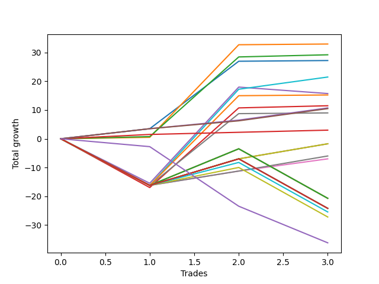

# Short Labrador 003 
- Symbol: ES_FOMC
- Date Range: 11/30/2022 - 12/14/2022
- Trading Period: 8:30-12:30
- Number of Trades: 3



| Name | Win Percent | Profit | Avg Profit / Trade | Avg Time / Trade |      | Name | Win Percent | Profit | Avg Profit / Trade | Avg Time / Trade |
| ---- | ----------- | ------ | ------------------ | ---------------- | ---- | ---- | ----------- | ------ | ------------------ | ---------------- |
| Sorted By <br> Profit | | | | | | Sorted By <br> Win Percentage ||||
| BB-20 U/L 1SD | 100.00 | 16500.00 | 5500.00 | 08:40 |     | BB-20 U/L 1SD | 100.00 | 16500.00 | 5500.00 | 08:40 |
| BB-20 U/L 2SD | 100.00 | 14625.00 | 4875.00 | 13:51 |     | BB-20 U/L 2SD | 100.00 | 14625.00 | 4875.00 | 13:51 |
| BB-20 Mid | 100.00 | 13625.00 | 4541.67 | 03:18 |     | BB-20 Mid | 100.00 | 13625.00 | 4541.67 | 03:18 |
| BB-100 Mid | 66.67 | 10750.00 | 3583.33 | 26:38 |     | TP-2 | 100.00 | 5375.00 | 1791.67 | 05:26 |
| BB-50 Mid | 33.33 | 7875.00 | 2625.00 | 26:16 |     | TP-3 | 100.00 | 5250.00 | 1750.00 | 05:28 |
| BB-200 Mid | 66.67 | 7625.00 | 2541.67 | 23:41 |     | TP-1 | 100.00 | 1500.00 | 500.00 | 02:35 |
| BB-20 U/L 2SD C | 66.67 | 5750.00 | 1916.67 | 24:51 |     | BB-100 Mid | 66.67 | 10750.00 | 3583.33 | 26:38 |
| TP-2 | 100.00 | 5375.00 | 1791.67 | 05:26 |     | BB-200 Mid | 66.67 | 7625.00 | 2541.67 | 23:41 |
| TP-3 | 100.00 | 5250.00 | 1750.00 | 05:28 |     | BB-20 U/L 2SD C | 66.67 | 5750.00 | 1916.67 | 24:51 |
| V Mid | 66.67 | 4500.00 | 1500.00 | 22:38 |     | V Mid | 66.67 | 4500.00 | 1500.00 | 22:38 |
| TP-1 | 100.00 | 1500.00 | 500.00 | 02:35 |     | V U/L 1SD | 66.67 | -875.00 | -291.67 | 42:58 |
| V U/L 1SD | 66.67 | -875.00 | -291.67 | 42:58 |     | BB-50 U/L 1SD | 66.67 | -875.00 | -291.67 | 42:58 |
| BB-50 U/L 1SD | 66.67 | -875.00 | -291.67 | 42:58 |     | TP-5 | 66.67 | -3000.00 | -1000.00 | 24:06 |
| TP-5 | 66.67 | -3000.00 | -1000.00 | 24:06 |     | TP-4 | 66.67 | -3500.00 | -1166.67 | 24:05 |
| TP-4 | 66.67 | -3500.00 | -1166.67 | 24:05 |     | BB-50 Mid | 33.33 | 7875.00 | 2625.00 | 26:16 |
| TP-10 | 33.33 | -10375.00 | -3458.33 | 41:40 |     | TP-10 | 33.33 | -10375.00 | -3458.33 | 41:40 |
| TP-9 | 33.33 | -10375.00 | -3458.33 | 41:40 |     | TP-9 | 33.33 | -10375.00 | -3458.33 | 41:40 |
| TP-8 | 33.33 | -10375.00 | -3458.33 | 41:40 |     | TP-8 | 33.33 | -10375.00 | -3458.33 | 41:40 |
| NEWFI 000 | 33.33 | -12125.00 | -4041.67 | 59:56 |     | NEWFI 000 | 33.33 | -12125.00 | -4041.67 | 59:56 |
| BB-200 U/L 2SD | 33.33 | -12125.00 | -4041.67 | 59:56 |     | BB-200 U/L 2SD | 33.33 | -12125.00 | -4041.67 | 59:56 |
| BB-100 U/L 2SD | 33.33 | -12125.00 | -4041.67 | 59:56 |     | BB-100 U/L 2SD | 33.33 | -12125.00 | -4041.67 | 59:56 |
| BB-50 U/L 2SD | 33.33 | -12125.00 | -4041.67 | 59:56 |     | BB-50 U/L 2SD | 33.33 | -12125.00 | -4041.67 | 59:56 |
| TP-7 | 33.33 | -12750.00 | -4250.00 | 41:38 |     | TP-7 | 33.33 | -12750.00 | -4250.00 | 41:38 |
| TP-6 | 33.33 | -13625.00 | -4541.67 | 41:26 |     | TP-6 | 33.33 | -13625.00 | -4541.67 | 41:26 |
| NEWFI 0000 | 0.00 | -18125.00 | -6041.67 | 24:05 |     | NEWFI 0000 | 0.00 | -18125.00 | -6041.67 | 24:05 |

## NO STOPLOSS

### Test BB-20 Mid
* Sell when price hits the middle line of the 20p bollinger
* No Stoploss
* Results:
```
Total Trades: 3
Percent Up: 0.00
Percent Down: 100.00
Total Points Moved Down: 27.25
Potential Profit: 13625.00
Total Points Ups: 0.00 Count Ups: 0
Total Points Downs: 27.25 Count Downs: 3
```

<details><summary>Trades</summary>

<code>In: 2022-05-25 11:34:00		Out: 2022-05-25 11:39:10		Total Position Time: 05:10		Total Move Down: 3.50		Total to Date: 3.50</code> <br />
<code>In: 2022-06-15 11:49:00		Out: 2022-06-15 11:52:35		Total Position Time: 03:35		Total Move Down: 23.50		Total to Date: 27.00</code> <br />
<code>In: 2022-11-23 10:51:00		Out: 2022-11-23 10:52:10		Total Position Time: 01:10		Total Move Down: 0.25		Total to Date: 27.25</code> <br />


</details>

### Test BB-20 U/L 1SD
* Sell when the price hits the lower line of the 20p 1std bollinger
* No Stoploss
* Results:
```
Total Trades: 3
Percent Up: 0.00
Percent Down: 100.00
Total Points Moved Down: 33.00
Potential Profit: 16500.00
Total Points Ups: 0.00 Count Ups: 0
Total Points Downs: 33.00 Count Downs: 3
```

<details><summary>Trades</summary>

<code>In: 2022-05-25 11:34:00		Out: 2022-05-25 11:49:55		Total Position Time: 15:55		Total Move Down: 0.50		Total to Date: 0.50</code> <br />
<code>In: 2022-06-15 11:49:00		Out: 2022-06-15 11:57:55		Total Position Time: 08:55		Total Move Down: 32.25		Total to Date: 32.75</code> <br />
<code>In: 2022-11-23 10:51:00		Out: 2022-11-23 10:52:10		Total Position Time: 01:10		Total Move Down: 0.25		Total to Date: 33.00</code> <br />


</details>

### Test BB-20 U/L 2SD
* Sell when the price hits the lower line of the 20p 2std bollinger
* No Stoploss
* Results:
```
Total Trades: 3
Percent Up: 0.00
Percent Down: 100.00
Total Points Moved Down: 29.25
Potential Profit: 14625.00
Total Points Ups: 0.00 Count Ups: 0
Total Points Downs: 29.25 Count Downs: 3
```

<details><summary>Trades</summary>

<code>In: 2022-05-25 11:34:00		Out: 2022-05-25 11:50:00		Total Position Time: 16:00		Total Move Down: 0.75		Total to Date: 0.75</code> <br />
<code>In: 2022-06-15 11:49:00		Out: 2022-06-15 12:13:05		Total Position Time: 24:05		Total Move Down: 27.75		Total to Date: 28.50</code> <br />
<code>In: 2022-11-23 10:51:00		Out: 2022-11-23 10:52:30		Total Position Time: 01:30		Total Move Down: 0.75		Total to Date: 29.25</code> <br />


</details>

### Test BB-20 U/L 2SD C
* Sell when the price hits the lower line of the 20p 2std bollinger
* No Stoploss
* Results:
```
Total Trades: 3
Percent Up: 33.33
Percent Down: 66.67
Total Points Moved Down: 11.50
Potential Profit: 5750.00
Total Points Ups: 17.00 Count Ups: 1
Total Points Downs: 28.50 Count Downs: 2
```

<details><summary>Trades</summary>

<code>In: 2022-05-25 11:34:00		Out: 2022-05-25 12:23:00		Total Position Time: 49:00		Total Move Down: -17.00		Total to Date: -17.00</code> <br />
<code>In: 2022-06-15 11:49:00		Out: 2022-06-15 12:13:05		Total Position Time: 24:05		Total Move Down: 27.75		Total to Date: 10.75</code> <br />
<code>In: 2022-11-23 10:51:00		Out: 2022-11-23 10:52:30		Total Position Time: 01:30		Total Move Down: 0.75		Total to Date: 11.50</code> <br />


</details>

### Test BB-50 Mid
* Sell when price hits the middle line of the 50p bollinger
* No Stoploss
* Results:
```
Total Trades: 3
Percent Up: 66.67
Percent Down: 33.33
Total Points Moved Down: 15.75
Potential Profit: 7875.00
Total Points Ups: 17.75 Count Ups: 2
Total Points Downs: 33.50 Count Downs: 1
```

<details><summary>Trades</summary>

<code>In: 2022-05-25 11:34:00		Out: 2022-05-25 12:34:20		Total Position Time: 60:20		Total Move Down: -15.50		Total to Date: -15.50</code> <br />
<code>In: 2022-06-15 11:49:00		Out: 2022-06-15 11:58:05		Total Position Time: 09:05		Total Move Down: 33.50		Total to Date: 18.00</code> <br />
<code>In: 2022-11-23 10:51:00		Out: 2022-11-23 11:00:25		Total Position Time: 09:25		Total Move Down: -2.25		Total to Date: 15.75</code> <br />


</details>

### Test BB-50 U/L 1SD
* Sell when the price hits the lower line of the 50p 1std bollinger
* No Stoploss
* Results:
```
Total Trades: 3
Percent Up: 33.33
Percent Down: 66.67
Total Points Moved Down: -1.75
Potential Profit: -875.00
Total Points Ups: 16.25 Count Ups: 1
Total Points Downs: 14.50 Count Downs: 2
```

<details><summary>Trades</summary>

<code>In: 2022-05-25 11:34:00		Out: 2022-05-25 12:34:55		Total Position Time: 60:55		Total Move Down: -16.25		Total to Date: -16.25</code> <br />
<code>In: 2022-06-15 11:49:00		Out: 2022-06-15 12:47:00		Total Position Time: 58:00		Total Move Down: 9.25		Total to Date: -7.00</code> <br />
<code>In: 2022-11-23 10:51:00		Out: 2022-11-23 11:01:00		Total Position Time: 10:00		Total Move Down: 5.25		Total to Date: -1.75</code> <br />


</details>

### Test BB-50 U/L 2SD
* Sell when the price hits the lower line of the 50p 2std bollinger
* No Stoploss
* Results:
```
Total Trades: 3
Percent Up: 66.67
Percent Down: 33.33
Total Points Moved Down: -24.25
Potential Profit: -12125.00
Total Points Ups: 33.50 Count Ups: 2
Total Points Downs: 9.25 Count Downs: 1
```

<details><summary>Trades</summary>

<code>In: 2022-05-25 11:34:00		Out: 2022-05-25 12:34:55		Total Position Time: 60:55		Total Move Down: -16.25		Total to Date: -16.25</code> <br />
<code>In: 2022-06-15 11:49:00		Out: 2022-06-15 12:47:00		Total Position Time: 58:00		Total Move Down: 9.25		Total to Date: -7.00</code> <br />
<code>In: 2022-11-23 10:51:00		Out: 2022-11-23 11:51:55		Total Position Time: 60:55		Total Move Down: -17.25		Total to Date: -24.25</code> <br />


</details>

### Test V Mid
* Sell when the price hits the middle line of the 1std VWAP
* No Stoploss
* Results:
```
Total Trades: 3
Percent Up: 33.33
Percent Down: 66.67
Total Points Moved Down: 9.00
Potential Profit: 4500.00
Total Points Ups: 16.25 Count Ups: 1
Total Points Downs: 25.25 Count Downs: 2
```

<details><summary>Trades</summary>

<code>In: 2022-05-25 11:34:00		Out: 2022-05-25 12:34:55		Total Position Time: 60:55		Total Move Down: -16.25		Total to Date: -16.25</code> <br />
<code>In: 2022-06-15 11:49:00		Out: 2022-06-15 11:54:50		Total Position Time: 05:50		Total Move Down: 25.00		Total to Date: 8.75</code> <br />
<code>In: 2022-11-23 10:51:00		Out: 2022-11-23 10:52:10		Total Position Time: 01:10		Total Move Down: 0.25		Total to Date: 9.00</code> <br />


</details>

### Test V U/L 1SD
* Sell when the price hits the lower line of the 1std VWAP
* No Stoploss
* Results:
```
Total Trades: 3
Percent Up: 33.33
Percent Down: 66.67
Total Points Moved Down: -1.75
Potential Profit: -875.00
Total Points Ups: 16.25 Count Ups: 1
Total Points Downs: 14.50 Count Downs: 2
```

<details><summary>Trades</summary>

<code>In: 2022-05-25 11:34:00		Out: 2022-05-25 12:34:55		Total Position Time: 60:55		Total Move Down: -16.25		Total to Date: -16.25</code> <br />
<code>In: 2022-06-15 11:49:00		Out: 2022-06-15 12:47:00		Total Position Time: 58:00		Total Move Down: 9.25		Total to Date: -7.00</code> <br />
<code>In: 2022-11-23 10:51:00		Out: 2022-11-23 11:01:00		Total Position Time: 10:00		Total Move Down: 5.25		Total to Date: -1.75</code> <br />


</details>

### Test BB-100 Mid
* Move to BB100 Mid
* No Stoploss
* Results:
```
Total Trades: 3
Percent Up: 33.33
Percent Down: 66.67
Total Points Moved Down: 21.50
Potential Profit: 10750.00
Total Points Ups: 16.25 Count Ups: 1
Total Points Downs: 37.75 Count Downs: 2
```

<details><summary>Trades</summary>

<code>In: 2022-05-25 11:34:00		Out: 2022-05-25 12:34:55		Total Position Time: 60:55		Total Move Down: -16.25		Total to Date: -16.25</code> <br />
<code>In: 2022-06-15 11:49:00		Out: 2022-06-15 11:58:05		Total Position Time: 09:05		Total Move Down: 33.50		Total to Date: 17.25</code> <br />
<code>In: 2022-11-23 10:51:00		Out: 2022-11-23 11:00:55		Total Position Time: 09:55		Total Move Down: 4.25		Total to Date: 21.50</code> <br />


</details>

### Test BB-100 U/L 2SD
* Move to BB100 Upper Band
* No Stoploss
* Results:
```
Total Trades: 3
Percent Up: 66.67
Percent Down: 33.33
Total Points Moved Down: -24.25
Potential Profit: -12125.00
Total Points Ups: 33.50 Count Ups: 2
Total Points Downs: 9.25 Count Downs: 1
```

<details><summary>Trades</summary>

<code>In: 2022-05-25 11:34:00		Out: 2022-05-25 12:34:55		Total Position Time: 60:55		Total Move Down: -16.25		Total to Date: -16.25</code> <br />
<code>In: 2022-06-15 11:49:00		Out: 2022-06-15 12:47:00		Total Position Time: 58:00		Total Move Down: 9.25		Total to Date: -7.00</code> <br />
<code>In: 2022-11-23 10:51:00		Out: 2022-11-23 11:51:55		Total Position Time: 60:55		Total Move Down: -17.25		Total to Date: -24.25</code> <br />


</details>

### Test BB-200 Mid
* Move to BB200 Mid
* No Stoploss
* Results:
```
Total Trades: 3
Percent Up: 33.33
Percent Down: 66.67
Total Points Moved Down: 15.25
Potential Profit: 7625.00
Total Points Ups: 16.25 Count Ups: 1
Total Points Downs: 31.50 Count Downs: 2
```

<details><summary>Trades</summary>

<code>In: 2022-05-25 11:34:00		Out: 2022-05-25 12:34:55		Total Position Time: 60:55		Total Move Down: -16.25		Total to Date: -16.25</code> <br />
<code>In: 2022-06-15 11:49:00		Out: 2022-06-15 11:58:00		Total Position Time: 09:00		Total Move Down: 31.25		Total to Date: 15.00</code> <br />
<code>In: 2022-11-23 10:51:00		Out: 2022-11-23 10:52:10		Total Position Time: 01:10		Total Move Down: 0.25		Total to Date: 15.25</code> <br />


</details>

### Test BB-200 U/L 2SD
* Move to BB200 Upper Band
* No Stoploss
* Results:
```
Total Trades: 3
Percent Up: 66.67
Percent Down: 33.33
Total Points Moved Down: -24.25
Potential Profit: -12125.00
Total Points Ups: 33.50 Count Ups: 2
Total Points Downs: 9.25 Count Downs: 1
```

<details><summary>Trades</summary>

<code>In: 2022-05-25 11:34:00		Out: 2022-05-25 12:34:55		Total Position Time: 60:55		Total Move Down: -16.25		Total to Date: -16.25</code> <br />
<code>In: 2022-06-15 11:49:00		Out: 2022-06-15 12:47:00		Total Position Time: 58:00		Total Move Down: 9.25		Total to Date: -7.00</code> <br />
<code>In: 2022-11-23 10:51:00		Out: 2022-11-23 11:51:55		Total Position Time: 60:55		Total Move Down: -17.25		Total to Date: -24.25</code> <br />


</details>

## TAKE PROFIT

### Test TP-1
* Take Profit of 1 Point
* No Stoploss
* Results:
```
Total Trades: 3
Percent Up: 0.00
Percent Down: 100.00
Total Points Moved Down: 3.00
Potential Profit: 1500.00
Total Points Ups: 0.00 Count Ups: 0
Total Points Downs: 3.00 Count Downs: 3
```

<details><summary>Trades</summary>

<code>In: 2022-05-25 11:34:00		Out: 2022-05-25 11:39:05		Total Position Time: 05:05		Total Move Down: 1.50		Total to Date: 1.50</code> <br />
<code>In: 2022-06-15 11:49:00		Out: 2022-06-15 11:50:10		Total Position Time: 01:10		Total Move Down: 0.75		Total to Date: 2.25</code> <br />
<code>In: 2022-11-23 10:51:00		Out: 2022-11-23 10:52:30		Total Position Time: 01:30		Total Move Down: 0.75		Total to Date: 3.00</code> <br />


</details>

### Test TP-2
* Take Profit of 2 Point
* No Stoploss
* Results:
```
Total Trades: 3
Percent Up: 0.00
Percent Down: 100.00
Total Points Moved Down: 10.75
Potential Profit: 5375.00
Total Points Ups: 0.00 Count Ups: 0
Total Points Downs: 10.75 Count Downs: 3
```

<details><summary>Trades</summary>

<code>In: 2022-05-25 11:34:00		Out: 2022-05-25 11:39:10		Total Position Time: 05:10		Total Move Down: 3.50		Total to Date: 3.50</code> <br />
<code>In: 2022-06-15 11:49:00		Out: 2022-06-15 11:50:15		Total Position Time: 01:15		Total Move Down: 3.00		Total to Date: 6.50</code> <br />
<code>In: 2022-11-23 10:51:00		Out: 2022-11-23 11:00:55		Total Position Time: 09:55		Total Move Down: 4.25		Total to Date: 10.75</code> <br />


</details>

### Test TP-3
* Take Profit of 3 Point
* No Stoploss
* Results:
```
Total Trades: 3
Percent Up: 0.00
Percent Down: 100.00
Total Points Moved Down: 10.50
Potential Profit: 5250.00
Total Points Ups: 0.00 Count Ups: 0
Total Points Downs: 10.50 Count Downs: 3
```

<details><summary>Trades</summary>

<code>In: 2022-05-25 11:34:00		Out: 2022-05-25 11:39:10		Total Position Time: 05:10		Total Move Down: 3.50		Total to Date: 3.50</code> <br />
<code>In: 2022-06-15 11:49:00		Out: 2022-06-15 11:50:20		Total Position Time: 01:20		Total Move Down: 2.75		Total to Date: 6.25</code> <br />
<code>In: 2022-11-23 10:51:00		Out: 2022-11-23 11:00:55		Total Position Time: 09:55		Total Move Down: 4.25		Total to Date: 10.50</code> <br />


</details>

### Test TP-4
* Take Profit of 4 Point
* No Stoploss
* Results:
```
Total Trades: 3
Percent Up: 33.33
Percent Down: 66.67
Total Points Moved Down: -7.00
Potential Profit: -3500.00
Total Points Ups: 16.25 Count Ups: 1
Total Points Downs: 9.25 Count Downs: 2
```

<details><summary>Trades</summary>

<code>In: 2022-05-25 11:34:00		Out: 2022-05-25 12:34:55		Total Position Time: 60:55		Total Move Down: -16.25		Total to Date: -16.25</code> <br />
<code>In: 2022-06-15 11:49:00		Out: 2022-06-15 11:50:25		Total Position Time: 01:25		Total Move Down: 5.00		Total to Date: -11.25</code> <br />
<code>In: 2022-11-23 10:51:00		Out: 2022-11-23 11:00:55		Total Position Time: 09:55		Total Move Down: 4.25		Total to Date: -7.00</code> <br />


</details>

### Test TP-5
* Take Profit of 5 Point
* No Stoploss
* Results:
```
Total Trades: 3
Percent Up: 33.33
Percent Down: 66.67
Total Points Moved Down: -6.00
Potential Profit: -3000.00
Total Points Ups: 16.25 Count Ups: 1
Total Points Downs: 10.25 Count Downs: 2
```

<details><summary>Trades</summary>

<code>In: 2022-05-25 11:34:00		Out: 2022-05-25 12:34:55		Total Position Time: 60:55		Total Move Down: -16.25		Total to Date: -16.25</code> <br />
<code>In: 2022-06-15 11:49:00		Out: 2022-06-15 11:50:25		Total Position Time: 01:25		Total Move Down: 5.00		Total to Date: -11.25</code> <br />
<code>In: 2022-11-23 10:51:00		Out: 2022-11-23 11:01:00		Total Position Time: 10:00		Total Move Down: 5.25		Total to Date: -6.00</code> <br />


</details>

### Test TP-6
* Take Profit of 6 Point
* No Stoploss
* Results:
```
Total Trades: 3
Percent Up: 66.67
Percent Down: 33.33
Total Points Moved Down: -27.25
Potential Profit: -13625.00
Total Points Ups: 33.50 Count Ups: 2
Total Points Downs: 6.25 Count Downs: 1
```

<details><summary>Trades</summary>

<code>In: 2022-05-25 11:34:00		Out: 2022-05-25 12:34:55		Total Position Time: 60:55		Total Move Down: -16.25		Total to Date: -16.25</code> <br />
<code>In: 2022-06-15 11:49:00		Out: 2022-06-15 11:51:30		Total Position Time: 02:30		Total Move Down: 6.25		Total to Date: -10.00</code> <br />
<code>In: 2022-11-23 10:51:00		Out: 2022-11-23 11:51:55		Total Position Time: 60:55		Total Move Down: -17.25		Total to Date: -27.25</code> <br />


</details>

### Test TP-7
* Take Profit of 7 Point
* No Stoploss
* Results:
```
Total Trades: 3
Percent Up: 66.67
Percent Down: 33.33
Total Points Moved Down: -25.50
Potential Profit: -12750.00
Total Points Ups: 33.50 Count Ups: 2
Total Points Downs: 8.00 Count Downs: 1
```

<details><summary>Trades</summary>

<code>In: 2022-05-25 11:34:00		Out: 2022-05-25 12:34:55		Total Position Time: 60:55		Total Move Down: -16.25		Total to Date: -16.25</code> <br />
<code>In: 2022-06-15 11:49:00		Out: 2022-06-15 11:52:05		Total Position Time: 03:05		Total Move Down: 8.00		Total to Date: -8.25</code> <br />
<code>In: 2022-11-23 10:51:00		Out: 2022-11-23 11:51:55		Total Position Time: 60:55		Total Move Down: -17.25		Total to Date: -25.50</code> <br />


</details>

### Test TP-8
* Take Profit of 8 Point
* No Stoploss
* Results:
```
Total Trades: 3
Percent Up: 66.67
Percent Down: 33.33
Total Points Moved Down: -20.75
Potential Profit: -10375.00
Total Points Ups: 33.50 Count Ups: 2
Total Points Downs: 12.75 Count Downs: 1
```

<details><summary>Trades</summary>

<code>In: 2022-05-25 11:34:00		Out: 2022-05-25 12:34:55		Total Position Time: 60:55		Total Move Down: -16.25		Total to Date: -16.25</code> <br />
<code>In: 2022-06-15 11:49:00		Out: 2022-06-15 11:52:10		Total Position Time: 03:10		Total Move Down: 12.75		Total to Date: -3.50</code> <br />
<code>In: 2022-11-23 10:51:00		Out: 2022-11-23 11:51:55		Total Position Time: 60:55		Total Move Down: -17.25		Total to Date: -20.75</code> <br />


</details>

### Test TP-9
* Take Profit of 9 Point
* No Stoploss
* Results:
```
Total Trades: 3
Percent Up: 66.67
Percent Down: 33.33
Total Points Moved Down: -20.75
Potential Profit: -10375.00
Total Points Ups: 33.50 Count Ups: 2
Total Points Downs: 12.75 Count Downs: 1
```

<details><summary>Trades</summary>

<code>In: 2022-05-25 11:34:00		Out: 2022-05-25 12:34:55		Total Position Time: 60:55		Total Move Down: -16.25		Total to Date: -16.25</code> <br />
<code>In: 2022-06-15 11:49:00		Out: 2022-06-15 11:52:10		Total Position Time: 03:10		Total Move Down: 12.75		Total to Date: -3.50</code> <br />
<code>In: 2022-11-23 10:51:00		Out: 2022-11-23 11:51:55		Total Position Time: 60:55		Total Move Down: -17.25		Total to Date: -20.75</code> <br />


</details>

### Test TP-10
* Take Profit of 10 Point
* No Stoploss
* Results:
```
Total Trades: 3
Percent Up: 66.67
Percent Down: 33.33
Total Points Moved Down: -20.75
Potential Profit: -10375.00
Total Points Ups: 33.50 Count Ups: 2
Total Points Downs: 12.75 Count Downs: 1
```

<details><summary>Trades</summary>

<code>In: 2022-05-25 11:34:00		Out: 2022-05-25 12:34:55		Total Position Time: 60:55		Total Move Down: -16.25		Total to Date: -16.25</code> <br />
<code>In: 2022-06-15 11:49:00		Out: 2022-06-15 11:52:10		Total Position Time: 03:10		Total Move Down: 12.75		Total to Date: -3.50</code> <br />
<code>In: 2022-11-23 10:51:00		Out: 2022-11-23 11:51:55		Total Position Time: 60:55		Total Move Down: -17.25		Total to Date: -20.75</code> <br />


</details>

## Indicator Exits

### Test NEWFI 000
* Newfi 0000
* No Stoploss
* Results:
```
Total Trades: 3
Percent Up: 66.67
Percent Down: 33.33
Total Points Moved Down: -24.25
Potential Profit: -12125.00
Total Points Ups: 33.50 Count Ups: 2
Total Points Downs: 9.25 Count Downs: 1
```

<details><summary>Trades</summary>

<code>In: 2022-05-25 11:34:00		Out: 2022-05-25 12:34:55		Total Position Time: 60:55		Total Move Down: -16.25		Total to Date: -16.25</code> <br />
<code>In: 2022-06-15 11:49:00		Out: 2022-06-15 12:47:00		Total Position Time: 58:00		Total Move Down: 9.25		Total to Date: -7.00</code> <br />
<code>In: 2022-11-23 10:51:00		Out: 2022-11-23 11:51:55		Total Position Time: 60:55		Total Move Down: -17.25		Total to Date: -24.25</code> <br />


</details>

### Test NEWFI 0000
* Newfi 0000
* No Stoploss
* Results:
```
Total Trades: 3
Percent Up: 100.00
Percent Down: 0.00
Total Points Moved Down: -36.25
Potential Profit: -18125.00
Total Points Ups: 36.25 Count Ups: 3
Total Points Downs: 0.00 Count Downs: 0
```

<details><summary>Trades</summary>

<code>In: 2022-05-25 11:34:00		Out: 2022-05-25 11:46:05		Total Position Time: 12:05		Total Move Down: -2.75		Total to Date: -2.75</code> <br />
<code>In: 2022-06-15 11:49:00		Out: 2022-06-15 12:32:05		Total Position Time: 43:05		Total Move Down: -20.75		Total to Date: -23.50</code> <br />
<code>In: 2022-11-23 10:51:00		Out: 2022-11-23 11:08:05		Total Position Time: 17:05		Total Move Down: -12.75		Total to Date: -36.25</code> <br />


</details>