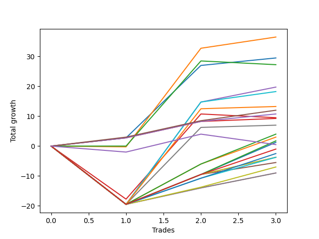

# Short Labrador 006 
- Symbol: ES_FOMC
- Date Range: 11/30/2022 - 12/14/2022
- Trading Period: 8:30-12:30
- Number of Trades: 3



| Name | Win Percent | Profit | Avg Profit / Trade | Avg Time / Trade |      | Name | Win Percent | Profit | Avg Profit / Trade | Avg Time / Trade |
| ---- | ----------- | ------ | ------------------ | ---------------- | ---- | ---- | ----------- | ------ | ------------------ | ---------------- |
| Sorted By <br> Profit | | | | | | Sorted By <br> Win Percentage ||||
| BB-20 U/L 1SD | 66.67 | 18250.00 | 6083.33 | 11:00 |     | BB-20 Mid | 100.00 | 14750.00 | 4916.67 | 05:08 |
| BB-20 Mid | 100.00 | 14750.00 | 4916.67 | 05:08 |     | TP-3 | 100.00 | 6000.00 | 2000.00 | 04:35 |
| BB-20 U/L 2SD | 33.33 | 13625.00 | 4541.67 | 24:23 |     | TP-2 | 100.00 | 5375.00 | 1791.67 | 04:00 |
| BB-50 Mid | 66.67 | 9875.00 | 3291.67 | 25:36 |     | TP-1 | 100.00 | 4625.00 | 1541.67 | 03:16 |
| BB-100 Mid | 66.67 | 9125.00 | 3041.67 | 25:33 |     | BB-20 U/L 1SD | 66.67 | 18250.00 | 6083.33 | 11:00 |
| BB-200 Mid | 66.67 | 6625.00 | 2208.33 | 24:21 |     | BB-50 Mid | 66.67 | 9875.00 | 3291.67 | 25:36 |
| TP-3 | 100.00 | 6000.00 | 2000.00 | 04:35 |     | BB-100 Mid | 66.67 | 9125.00 | 3041.67 | 25:33 |
| TP-2 | 100.00 | 5375.00 | 1791.67 | 04:00 |     | BB-200 Mid | 66.67 | 6625.00 | 2208.33 | 24:21 |
| BB-20 U/L 2SD C | 33.33 | 4750.00 | 1583.33 | 35:23 |     | V Mid | 66.67 | 3500.00 | 1166.67 | 23:18 |
| TP-1 | 100.00 | 4625.00 | 1541.67 | 03:16 |     | TP-10 | 66.67 | 2000.00 | 666.67 | 36:43 |
| V Mid | 66.67 | 3500.00 | 1166.67 | 23:18 |     | TP-9 | 66.67 | 1500.00 | 500.00 | 35:33 |
| TP-10 | 66.67 | 2000.00 | 666.67 | 36:43 |     | BB-200 U/L 2SD | 66.67 | 875.00 | 291.67 | 55:45 |
| TP-9 | 66.67 | 1500.00 | 500.00 | 35:33 |     | BB-100 U/L 2SD | 66.67 | 625.00 | 208.33 | 60:16 |
| BB-200 U/L 2SD | 66.67 | 875.00 | 291.67 | 55:45 |     | NEWFI 000 | 66.67 | -500.00 | -166.67 | 57:20 |
| BB-100 U/L 2SD | 66.67 | 625.00 | 208.33 | 60:16 |     | TP-8 | 66.67 | -1250.00 | -416.67 | 35:20 |
| NEWFI 0000 | 33.33 | 250.00 | 83.33 | 06:05 |     | TP-7 | 66.67 | -1875.00 | -625.00 | 34:28 |
| NEWFI 000 | 66.67 | -500.00 | -166.67 | 57:20 |     | V U/L 1SD | 66.67 | -1875.00 | -625.00 | 52:06 |
| TP-8 | 66.67 | -1250.00 | -416.67 | 35:20 |     | BB-50 U/L 2SD | 66.67 | -1875.00 | -625.00 | 52:21 |
| TP-7 | 66.67 | -1875.00 | -625.00 | 34:28 |     | BB-50 U/L 1SD | 66.67 | -2750.00 | -916.67 | 51:01 |
| V U/L 1SD | 66.67 | -1875.00 | -625.00 | 52:06 |     | TP-6 | 66.67 | -3500.00 | -1166.67 | 33:28 |
| BB-50 U/L 2SD | 66.67 | -1875.00 | -625.00 | 52:21 |     | TP-5 | 66.67 | -4500.00 | -1500.00 | 22:36 |
| BB-50 U/L 1SD | 66.67 | -2750.00 | -916.67 | 51:01 |     | TP-4 | 66.67 | -4500.00 | -1500.00 | 22:36 |
| TP-6 | 66.67 | -3500.00 | -1166.67 | 33:28 |     | BB-20 U/L 2SD | 33.33 | 13625.00 | 4541.67 | 24:23 |
| TP-5 | 66.67 | -4500.00 | -1500.00 | 22:36 |     | BB-20 U/L 2SD C | 33.33 | 4750.00 | 1583.33 | 35:23 |
| TP-4 | 66.67 | -4500.00 | -1500.00 | 22:36 |     | NEWFI 0000 | 33.33 | 250.00 | 83.33 | 06:05 |

## NO STOPLOSS

### Test BB-20 Mid
* Sell when price hits the middle line of the 20p bollinger
* No Stoploss
* Results:
```
Total Trades: 3
Percent Up: 0.00
Percent Down: 100.00
Total Points Moved Down: 29.50
Potential Profit: 14750.00
Total Points Ups: 0.00 Count Ups: 0
Total Points Downs: 29.50 Count Downs: 3
```

<details><summary>Trades</summary>

<code>In: 2022-05-25 11:33:00		Out: 2022-05-25 11:39:10		Total Position Time: 06:10		Total Move Down: 2.75		Total to Date: 2.75</code> <br />
<code>In: 2022-06-15 11:48:00		Out: 2022-06-15 11:52:35		Total Position Time: 04:35		Total Move Down: 24.25		Total to Date: 27.00</code> <br />
<code>In: 2022-10-12 11:16:00		Out: 2022-10-12 11:20:40		Total Position Time: 04:40		Total Move Down: 2.50		Total to Date: 29.50</code> <br />


</details>

### Test BB-20 U/L 1SD
* Sell when the price hits the lower line of the 20p 1std bollinger
* No Stoploss
* Results:
```
Total Trades: 3
Percent Up: 33.33
Percent Down: 66.67
Total Points Moved Down: 36.50
Potential Profit: 18250.00
Total Points Ups: 0.25 Count Ups: 1
Total Points Downs: 36.75 Count Downs: 2
```

<details><summary>Trades</summary>

<code>In: 2022-05-25 11:33:00		Out: 2022-05-25 11:49:55		Total Position Time: 16:55		Total Move Down: -0.25		Total to Date: -0.25</code> <br />
<code>In: 2022-06-15 11:48:00		Out: 2022-06-15 11:57:55		Total Position Time: 09:55		Total Move Down: 33.00		Total to Date: 32.75</code> <br />
<code>In: 2022-10-12 11:16:00		Out: 2022-10-12 11:22:10		Total Position Time: 06:10		Total Move Down: 3.75		Total to Date: 36.50</code> <br />


</details>

### Test BB-20 U/L 2SD
* Sell when the price hits the lower line of the 20p 2std bollinger
* No Stoploss
* Results:
```
Total Trades: 3
Percent Up: 66.67
Percent Down: 33.33
Total Points Moved Down: 27.25
Potential Profit: 13625.00
Total Points Ups: 1.25 Count Ups: 2
Total Points Downs: 28.50 Count Downs: 1
```

<details><summary>Trades</summary>

<code>In: 2022-05-25 11:33:00		Out: 2022-05-25 11:50:00		Total Position Time: 17:00		Total Move Down: -0.00		Total to Date: 0.00</code> <br />
<code>In: 2022-06-15 11:48:00		Out: 2022-06-15 12:13:05		Total Position Time: 25:05		Total Move Down: 28.50		Total to Date: 28.50</code> <br />
<code>In: 2022-10-12 11:16:00		Out: 2022-10-12 11:47:05		Total Position Time: 31:05		Total Move Down: -1.25		Total to Date: 27.25</code> <br />


</details>

### Test BB-20 U/L 2SD C
* Sell when the price hits the lower line of the 20p 2std bollinger
* No Stoploss
* Results:
```
Total Trades: 3
Percent Up: 66.67
Percent Down: 33.33
Total Points Moved Down: 9.50
Potential Profit: 4750.00
Total Points Ups: 19.00 Count Ups: 2
Total Points Downs: 28.50 Count Downs: 1
```

<details><summary>Trades</summary>

<code>In: 2022-05-25 11:33:00		Out: 2022-05-25 12:23:00		Total Position Time: 50:00		Total Move Down: -17.75		Total to Date: -17.75</code> <br />
<code>In: 2022-06-15 11:48:00		Out: 2022-06-15 12:13:05		Total Position Time: 25:05		Total Move Down: 28.50		Total to Date: 10.75</code> <br />
<code>In: 2022-10-12 11:16:00		Out: 2022-10-12 11:47:05		Total Position Time: 31:05		Total Move Down: -1.25		Total to Date: 9.50</code> <br />


</details>

### Test BB-50 Mid
* Sell when price hits the middle line of the 50p bollinger
* No Stoploss
* Results:
```
Total Trades: 3
Percent Up: 33.33
Percent Down: 66.67
Total Points Moved Down: 19.75
Potential Profit: 9875.00
Total Points Ups: 19.50 Count Ups: 1
Total Points Downs: 39.25 Count Downs: 2
```

<details><summary>Trades</summary>

<code>In: 2022-05-25 11:33:00		Out: 2022-05-25 12:33:55		Total Position Time: 60:55		Total Move Down: -19.50		Total to Date: -19.50</code> <br />
<code>In: 2022-06-15 11:48:00		Out: 2022-06-15 11:58:05		Total Position Time: 10:05		Total Move Down: 34.25		Total to Date: 14.75</code> <br />
<code>In: 2022-10-12 11:16:00		Out: 2022-10-12 11:21:50		Total Position Time: 05:50		Total Move Down: 5.00		Total to Date: 19.75</code> <br />


</details>

### Test BB-50 U/L 1SD
* Sell when the price hits the lower line of the 50p 1std bollinger
* No Stoploss
* Results:
```
Total Trades: 3
Percent Up: 33.33
Percent Down: 66.67
Total Points Moved Down: -5.50
Potential Profit: -2750.00
Total Points Ups: 19.50 Count Ups: 1
Total Points Downs: 14.00 Count Downs: 2
```

<details><summary>Trades</summary>

<code>In: 2022-05-25 11:33:00		Out: 2022-05-25 12:33:55		Total Position Time: 60:55		Total Move Down: -19.50		Total to Date: -19.50</code> <br />
<code>In: 2022-06-15 11:48:00		Out: 2022-06-15 12:47:00		Total Position Time: 59:00		Total Move Down: 10.00		Total to Date: -9.50</code> <br />
<code>In: 2022-10-12 11:16:00		Out: 2022-10-12 11:49:10		Total Position Time: 33:10		Total Move Down: 4.00		Total to Date: -5.50</code> <br />


</details>

### Test BB-50 U/L 2SD
* Sell when the price hits the lower line of the 50p 2std bollinger
* No Stoploss
* Results:
```
Total Trades: 3
Percent Up: 33.33
Percent Down: 66.67
Total Points Moved Down: -3.75
Potential Profit: -1875.00
Total Points Ups: 19.50 Count Ups: 1
Total Points Downs: 15.75 Count Downs: 2
```

<details><summary>Trades</summary>

<code>In: 2022-05-25 11:33:00		Out: 2022-05-25 12:33:55		Total Position Time: 60:55		Total Move Down: -19.50		Total to Date: -19.50</code> <br />
<code>In: 2022-06-15 11:48:00		Out: 2022-06-15 12:47:00		Total Position Time: 59:00		Total Move Down: 10.00		Total to Date: -9.50</code> <br />
<code>In: 2022-10-12 11:16:00		Out: 2022-10-12 11:53:10		Total Position Time: 37:10		Total Move Down: 5.75		Total to Date: -3.75</code> <br />


</details>

### Test V Mid
* Sell when the price hits the middle line of the 1std VWAP
* No Stoploss
* Results:
```
Total Trades: 3
Percent Up: 33.33
Percent Down: 66.67
Total Points Moved Down: 7.00
Potential Profit: 3500.00
Total Points Ups: 19.50 Count Ups: 1
Total Points Downs: 26.50 Count Downs: 2
```

<details><summary>Trades</summary>

<code>In: 2022-05-25 11:33:00		Out: 2022-05-25 12:33:55		Total Position Time: 60:55		Total Move Down: -19.50		Total to Date: -19.50</code> <br />
<code>In: 2022-06-15 11:48:00		Out: 2022-06-15 11:54:50		Total Position Time: 06:50		Total Move Down: 25.75		Total to Date: 6.25</code> <br />
<code>In: 2022-10-12 11:16:00		Out: 2022-10-12 11:18:10		Total Position Time: 02:10		Total Move Down: 0.75		Total to Date: 7.00</code> <br />


</details>

### Test V U/L 1SD
* Sell when the price hits the lower line of the 1std VWAP
* No Stoploss
* Results:
```
Total Trades: 3
Percent Up: 33.33
Percent Down: 66.67
Total Points Moved Down: -3.75
Potential Profit: -1875.00
Total Points Ups: 19.50 Count Ups: 1
Total Points Downs: 15.75 Count Downs: 2
```

<details><summary>Trades</summary>

<code>In: 2022-05-25 11:33:00		Out: 2022-05-25 12:33:55		Total Position Time: 60:55		Total Move Down: -19.50		Total to Date: -19.50</code> <br />
<code>In: 2022-06-15 11:48:00		Out: 2022-06-15 12:47:00		Total Position Time: 59:00		Total Move Down: 10.00		Total to Date: -9.50</code> <br />
<code>In: 2022-10-12 11:16:00		Out: 2022-10-12 11:52:25		Total Position Time: 36:25		Total Move Down: 5.75		Total to Date: -3.75</code> <br />


</details>

### Test BB-100 Mid
* Move to BB100 Mid
* No Stoploss
* Results:
```
Total Trades: 3
Percent Up: 33.33
Percent Down: 66.67
Total Points Moved Down: 18.25
Potential Profit: 9125.00
Total Points Ups: 19.50 Count Ups: 1
Total Points Downs: 37.75 Count Downs: 2
```

<details><summary>Trades</summary>

<code>In: 2022-05-25 11:33:00		Out: 2022-05-25 12:33:55		Total Position Time: 60:55		Total Move Down: -19.50		Total to Date: -19.50</code> <br />
<code>In: 2022-06-15 11:48:00		Out: 2022-06-15 11:58:05		Total Position Time: 10:05		Total Move Down: 34.25		Total to Date: 14.75</code> <br />
<code>In: 2022-10-12 11:16:00		Out: 2022-10-12 11:21:40		Total Position Time: 05:40		Total Move Down: 3.50		Total to Date: 18.25</code> <br />


</details>

### Test BB-100 U/L 2SD
* Move to BB100 Upper Band
* No Stoploss
* Results:
```
Total Trades: 3
Percent Up: 33.33
Percent Down: 66.67
Total Points Moved Down: 1.25
Potential Profit: 625.00
Total Points Ups: 19.50 Count Ups: 1
Total Points Downs: 20.75 Count Downs: 2
```

<details><summary>Trades</summary>

<code>In: 2022-05-25 11:33:00		Out: 2022-05-25 12:33:55		Total Position Time: 60:55		Total Move Down: -19.50		Total to Date: -19.50</code> <br />
<code>In: 2022-06-15 11:48:00		Out: 2022-06-15 12:47:00		Total Position Time: 59:00		Total Move Down: 10.00		Total to Date: -9.50</code> <br />
<code>In: 2022-10-12 11:16:00		Out: 2022-10-12 12:16:55		Total Position Time: 60:55		Total Move Down: 10.75		Total to Date: 1.25</code> <br />


</details>

### Test BB-200 Mid
* Move to BB200 Mid
* No Stoploss
* Results:
```
Total Trades: 3
Percent Up: 33.33
Percent Down: 66.67
Total Points Moved Down: 13.25
Potential Profit: 6625.00
Total Points Ups: 19.50 Count Ups: 1
Total Points Downs: 32.75 Count Downs: 2
```

<details><summary>Trades</summary>

<code>In: 2022-05-25 11:33:00		Out: 2022-05-25 12:33:55		Total Position Time: 60:55		Total Move Down: -19.50		Total to Date: -19.50</code> <br />
<code>In: 2022-06-15 11:48:00		Out: 2022-06-15 11:58:00		Total Position Time: 10:00		Total Move Down: 32.00		Total to Date: 12.50</code> <br />
<code>In: 2022-10-12 11:16:00		Out: 2022-10-12 11:18:10		Total Position Time: 02:10		Total Move Down: 0.75		Total to Date: 13.25</code> <br />


</details>

### Test BB-200 U/L 2SD
* Move to BB200 Upper Band
* No Stoploss
* Results:
```
Total Trades: 3
Percent Up: 33.33
Percent Down: 66.67
Total Points Moved Down: 1.75
Potential Profit: 875.00
Total Points Ups: 19.50 Count Ups: 1
Total Points Downs: 21.25 Count Downs: 2
```

<details><summary>Trades</summary>

<code>In: 2022-05-25 11:33:00		Out: 2022-05-25 12:33:55		Total Position Time: 60:55		Total Move Down: -19.50		Total to Date: -19.50</code> <br />
<code>In: 2022-06-15 11:48:00		Out: 2022-06-15 12:47:00		Total Position Time: 59:00		Total Move Down: 10.00		Total to Date: -9.50</code> <br />
<code>In: 2022-10-12 11:16:00		Out: 2022-10-12 12:03:20		Total Position Time: 47:20		Total Move Down: 11.25		Total to Date: 1.75</code> <br />


</details>

## TAKE PROFIT

### Test TP-1
* Take Profit of 1 Point
* No Stoploss
* Results:
```
Total Trades: 3
Percent Up: 0.00
Percent Down: 100.00
Total Points Moved Down: 9.25
Potential Profit: 4625.00
Total Points Ups: 0.00 Count Ups: 0
Total Points Downs: 9.25 Count Downs: 3
```

<details><summary>Trades</summary>

<code>In: 2022-05-25 11:33:00		Out: 2022-05-25 11:39:10		Total Position Time: 06:10		Total Move Down: 2.75		Total to Date: 2.75</code> <br />
<code>In: 2022-06-15 11:48:00		Out: 2022-06-15 11:49:10		Total Position Time: 01:10		Total Move Down: 5.50		Total to Date: 8.25</code> <br />
<code>In: 2022-10-12 11:16:00		Out: 2022-10-12 11:18:30		Total Position Time: 02:30		Total Move Down: 1.00		Total to Date: 9.25</code> <br />


</details>

### Test TP-2
* Take Profit of 2 Point
* No Stoploss
* Results:
```
Total Trades: 3
Percent Up: 0.00
Percent Down: 100.00
Total Points Moved Down: 10.75
Potential Profit: 5375.00
Total Points Ups: 0.00 Count Ups: 0
Total Points Downs: 10.75 Count Downs: 3
```

<details><summary>Trades</summary>

<code>In: 2022-05-25 11:33:00		Out: 2022-05-25 11:39:10		Total Position Time: 06:10		Total Move Down: 2.75		Total to Date: 2.75</code> <br />
<code>In: 2022-06-15 11:48:00		Out: 2022-06-15 11:49:10		Total Position Time: 01:10		Total Move Down: 5.50		Total to Date: 8.25</code> <br />
<code>In: 2022-10-12 11:16:00		Out: 2022-10-12 11:20:40		Total Position Time: 04:40		Total Move Down: 2.50		Total to Date: 10.75</code> <br />


</details>

### Test TP-3
* Take Profit of 3 Point
* No Stoploss
* Results:
```
Total Trades: 3
Percent Up: 0.00
Percent Down: 100.00
Total Points Moved Down: 12.00
Potential Profit: 6000.00
Total Points Ups: 0.00 Count Ups: 0
Total Points Downs: 12.00 Count Downs: 3
```

<details><summary>Trades</summary>

<code>In: 2022-05-25 11:33:00		Out: 2022-05-25 11:39:55		Total Position Time: 06:55		Total Move Down: 3.00		Total to Date: 3.00</code> <br />
<code>In: 2022-06-15 11:48:00		Out: 2022-06-15 11:49:10		Total Position Time: 01:10		Total Move Down: 5.50		Total to Date: 8.50</code> <br />
<code>In: 2022-10-12 11:16:00		Out: 2022-10-12 11:21:40		Total Position Time: 05:40		Total Move Down: 3.50		Total to Date: 12.00</code> <br />


</details>

### Test TP-4
* Take Profit of 4 Point
* No Stoploss
* Results:
```
Total Trades: 3
Percent Up: 33.33
Percent Down: 66.67
Total Points Moved Down: -9.00
Potential Profit: -4500.00
Total Points Ups: 19.50 Count Ups: 1
Total Points Downs: 10.50 Count Downs: 2
```

<details><summary>Trades</summary>

<code>In: 2022-05-25 11:33:00		Out: 2022-05-25 12:33:55		Total Position Time: 60:55		Total Move Down: -19.50		Total to Date: -19.50</code> <br />
<code>In: 2022-06-15 11:48:00		Out: 2022-06-15 11:49:10		Total Position Time: 01:10		Total Move Down: 5.50		Total to Date: -14.00</code> <br />
<code>In: 2022-10-12 11:16:00		Out: 2022-10-12 11:21:45		Total Position Time: 05:45		Total Move Down: 5.00		Total to Date: -9.00</code> <br />


</details>

### Test TP-5
* Take Profit of 5 Point
* No Stoploss
* Results:
```
Total Trades: 3
Percent Up: 33.33
Percent Down: 66.67
Total Points Moved Down: -9.00
Potential Profit: -4500.00
Total Points Ups: 19.50 Count Ups: 1
Total Points Downs: 10.50 Count Downs: 2
```

<details><summary>Trades</summary>

<code>In: 2022-05-25 11:33:00		Out: 2022-05-25 12:33:55		Total Position Time: 60:55		Total Move Down: -19.50		Total to Date: -19.50</code> <br />
<code>In: 2022-06-15 11:48:00		Out: 2022-06-15 11:49:10		Total Position Time: 01:10		Total Move Down: 5.50		Total to Date: -14.00</code> <br />
<code>In: 2022-10-12 11:16:00		Out: 2022-10-12 11:21:45		Total Position Time: 05:45		Total Move Down: 5.00		Total to Date: -9.00</code> <br />


</details>

### Test TP-6
* Take Profit of 6 Point
* No Stoploss
* Results:
```
Total Trades: 3
Percent Up: 33.33
Percent Down: 66.67
Total Points Moved Down: -7.00
Potential Profit: -3500.00
Total Points Ups: 19.50 Count Ups: 1
Total Points Downs: 12.50 Count Downs: 2
```

<details><summary>Trades</summary>

<code>In: 2022-05-25 11:33:00		Out: 2022-05-25 12:33:55		Total Position Time: 60:55		Total Move Down: -19.50		Total to Date: -19.50</code> <br />
<code>In: 2022-06-15 11:48:00		Out: 2022-06-15 11:50:25		Total Position Time: 02:25		Total Move Down: 5.75		Total to Date: -13.75</code> <br />
<code>In: 2022-10-12 11:16:00		Out: 2022-10-12 11:53:05		Total Position Time: 37:05		Total Move Down: 6.75		Total to Date: -7.00</code> <br />


</details>

### Test TP-7
* Take Profit of 7 Point
* No Stoploss
* Results:
```
Total Trades: 3
Percent Up: 33.33
Percent Down: 66.67
Total Points Moved Down: -3.75
Potential Profit: -1875.00
Total Points Ups: 19.50 Count Ups: 1
Total Points Downs: 15.75 Count Downs: 2
```

<details><summary>Trades</summary>

<code>In: 2022-05-25 11:33:00		Out: 2022-05-25 12:33:55		Total Position Time: 60:55		Total Move Down: -19.50		Total to Date: -19.50</code> <br />
<code>In: 2022-06-15 11:48:00		Out: 2022-06-15 11:52:05		Total Position Time: 04:05		Total Move Down: 8.75		Total to Date: -10.75</code> <br />
<code>In: 2022-10-12 11:16:00		Out: 2022-10-12 11:54:25		Total Position Time: 38:25		Total Move Down: 7.00		Total to Date: -3.75</code> <br />


</details>

### Test TP-8
* Take Profit of 8 Point
* No Stoploss
* Results:
```
Total Trades: 3
Percent Up: 33.33
Percent Down: 66.67
Total Points Moved Down: -2.50
Potential Profit: -1250.00
Total Points Ups: 19.50 Count Ups: 1
Total Points Downs: 17.00 Count Downs: 2
```

<details><summary>Trades</summary>

<code>In: 2022-05-25 11:33:00		Out: 2022-05-25 12:33:55		Total Position Time: 60:55		Total Move Down: -19.50		Total to Date: -19.50</code> <br />
<code>In: 2022-06-15 11:48:00		Out: 2022-06-15 11:52:05		Total Position Time: 04:05		Total Move Down: 8.75		Total to Date: -10.75</code> <br />
<code>In: 2022-10-12 11:16:00		Out: 2022-10-12 11:57:00		Total Position Time: 41:00		Total Move Down: 8.25		Total to Date: -2.50</code> <br />


</details>

### Test TP-9
* Take Profit of 9 Point
* No Stoploss
* Results:
```
Total Trades: 3
Percent Up: 33.33
Percent Down: 66.67
Total Points Moved Down: 3.00
Potential Profit: 1500.00
Total Points Ups: 19.50 Count Ups: 1
Total Points Downs: 22.50 Count Downs: 2
```

<details><summary>Trades</summary>

<code>In: 2022-05-25 11:33:00		Out: 2022-05-25 12:33:55		Total Position Time: 60:55		Total Move Down: -19.50		Total to Date: -19.50</code> <br />
<code>In: 2022-06-15 11:48:00		Out: 2022-06-15 11:52:10		Total Position Time: 04:10		Total Move Down: 13.50		Total to Date: -6.00</code> <br />
<code>In: 2022-10-12 11:16:00		Out: 2022-10-12 11:57:35		Total Position Time: 41:35		Total Move Down: 9.00		Total to Date: 3.00</code> <br />


</details>

### Test TP-10
* Take Profit of 10 Point
* No Stoploss
* Results:
```
Total Trades: 3
Percent Up: 33.33
Percent Down: 66.67
Total Points Moved Down: 4.00
Potential Profit: 2000.00
Total Points Ups: 19.50 Count Ups: 1
Total Points Downs: 23.50 Count Downs: 2
```

<details><summary>Trades</summary>

<code>In: 2022-05-25 11:33:00		Out: 2022-05-25 12:33:55		Total Position Time: 60:55		Total Move Down: -19.50		Total to Date: -19.50</code> <br />
<code>In: 2022-06-15 11:48:00		Out: 2022-06-15 11:52:10		Total Position Time: 04:10		Total Move Down: 13.50		Total to Date: -6.00</code> <br />
<code>In: 2022-10-12 11:16:00		Out: 2022-10-12 12:01:05		Total Position Time: 45:05		Total Move Down: 10.00		Total to Date: 4.00</code> <br />


</details>

## Indicator Exits

### Test NEWFI 000
* Newfi 0000
* No Stoploss
* Results:
```
Total Trades: 3
Percent Up: 33.33
Percent Down: 66.67
Total Points Moved Down: -1.00
Potential Profit: -500.00
Total Points Ups: 19.50 Count Ups: 1
Total Points Downs: 18.50 Count Downs: 2
```

<details><summary>Trades</summary>

<code>In: 2022-05-25 11:33:00		Out: 2022-05-25 12:33:55		Total Position Time: 60:55		Total Move Down: -19.50		Total to Date: -19.50</code> <br />
<code>In: 2022-06-15 11:48:00		Out: 2022-06-15 12:47:00		Total Position Time: 59:00		Total Move Down: 10.00		Total to Date: -9.50</code> <br />
<code>In: 2022-10-12 11:16:00		Out: 2022-10-12 12:08:05		Total Position Time: 52:05		Total Move Down: 8.50		Total to Date: -1.00</code> <br />


</details>

### Test NEWFI 0000
* Newfi 0000
* No Stoploss
* Results:
```
Total Trades: 3
Percent Up: 66.67
Percent Down: 33.33
Total Points Moved Down: 0.50
Potential Profit: 250.00
Total Points Ups: 5.50 Count Ups: 2
Total Points Downs: 6.00 Count Downs: 1
```

<details><summary>Trades</summary>

<code>In: 2022-05-25 11:33:00		Out: 2022-05-25 11:34:05		Total Position Time: 01:05		Total Move Down: -2.00		Total to Date: -2.00</code> <br />
<code>In: 2022-06-15 11:48:00		Out: 2022-06-15 11:49:05		Total Position Time: 01:05		Total Move Down: 6.00		Total to Date: 4.00</code> <br />
<code>In: 2022-10-12 11:16:00		Out: 2022-10-12 11:32:05		Total Position Time: 16:05		Total Move Down: -3.50		Total to Date: 0.50</code> <br />


</details>