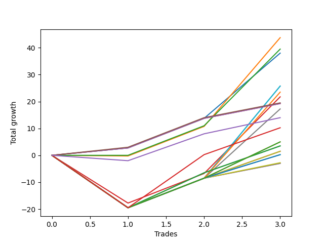

# Short Labrador 007 
- Symbol: ES_FOMC
- Date Range: 11/30/2022 - 12/14/2022
- Trading Period: 8:30-12:30
- Number of Trades: 3



| Name | Win Percent | Profit | Avg Profit / Trade | Avg Time / Trade |      | Name | Win Percent | Profit | Avg Profit / Trade | Avg Time / Trade |
| ---- | ----------- | ------ | ------------------ | ---------------- | ---- | ---- | ----------- | ------ | ------------------ | ---------------- |
| Sorted By <br> Profit | | | | | | Sorted By <br> Win Percentage ||||
| BB-20 U/L 1SD | 66.67 | 21875.00 | 7291.67 | 09:20 |     | BB-20 Mid | 100.00 | 19000.00 | 6333.33 | 03:58 |
| BB-20 U/L 2SD | 66.67 | 19750.00 | 6583.33 | 14:25 |     | TP-3 | 100.00 | 9750.00 | 3250.00 | 03:05 |
| BB-20 Mid | 100.00 | 19000.00 | 6333.33 | 03:58 |     | TP-2 | 100.00 | 9625.00 | 3208.33 | 02:50 |
| BB-100 Mid | 66.67 | 12875.00 | 4291.67 | 24:03 |     | TP-1 | 100.00 | 9625.00 | 3208.33 | 02:50 |
| BB-50 Mid | 66.67 | 12875.00 | 4291.67 | 24:03 |     | BB-20 U/L 1SD | 66.67 | 21875.00 | 7291.67 | 09:20 |
| BB-200 Mid | 66.67 | 11750.00 | 3916.67 | 24:01 |     | BB-20 U/L 2SD | 66.67 | 19750.00 | 6583.33 | 14:25 |
| BB-20 U/L 2SD C | 66.67 | 10875.00 | 3625.00 | 25:25 |     | BB-100 Mid | 66.67 | 12875.00 | 4291.67 | 24:03 |
| TP-3 | 100.00 | 9750.00 | 3250.00 | 03:05 |     | BB-50 Mid | 66.67 | 12875.00 | 4291.67 | 24:03 |
| TP-2 | 100.00 | 9625.00 | 3208.33 | 02:50 |     | BB-200 Mid | 66.67 | 11750.00 | 3916.67 | 24:01 |
| TP-1 | 100.00 | 9625.00 | 3208.33 | 02:50 |     | BB-20 U/L 2SD C | 66.67 | 10875.00 | 3625.00 | 25:25 |
| V Mid | 66.67 | 8625.00 | 2875.00 | 22:58 |     | V Mid | 66.67 | 8625.00 | 2875.00 | 22:58 |
| NEWFI 0000 | 66.67 | 7000.00 | 2333.33 | 01:05 |     | NEWFI 0000 | 66.67 | 7000.00 | 2333.33 | 01:05 |
| NEWFI 000 | 66.67 | 5125.00 | 1708.33 | 42:40 |     | NEWFI 000 | 66.67 | 5125.00 | 1708.33 | 42:40 |
| TP-10 | 66.67 | 2500.00 | 833.33 | 22:05 |     | TP-10 | 66.67 | 2500.00 | 833.33 | 22:05 |
| TP-9 | 66.67 | 2500.00 | 833.33 | 22:05 |     | TP-9 | 66.67 | 2500.00 | 833.33 | 22:05 |
| BB-200 U/L 2SD | 66.67 | 1750.00 | 583.33 | 40:23 |     | BB-200 U/L 2SD | 66.67 | 1750.00 | 583.33 | 40:23 |
| BB-100 U/L 2SD | 66.67 | 1750.00 | 583.33 | 40:23 |     | BB-100 U/L 2SD | 66.67 | 1750.00 | 583.33 | 40:23 |
| V U/L 1SD | 66.67 | 750.00 | 250.00 | 40:21 |     | V U/L 1SD | 66.67 | 750.00 | 250.00 | 40:21 |
| BB-50 U/L 2SD | 66.67 | 750.00 | 250.00 | 40:21 |     | BB-50 U/L 2SD | 66.67 | 750.00 | 250.00 | 40:21 |
| BB-50 U/L 1SD | 66.67 | 750.00 | 250.00 | 40:21 |     | BB-50 U/L 1SD | 66.67 | 750.00 | 250.00 | 40:21 |
| TP-8 | 66.67 | 125.00 | 41.67 | 22:03 |     | TP-8 | 66.67 | 125.00 | 41.67 | 22:03 |
| TP-7 | 66.67 | 125.00 | 41.67 | 22:03 |     | TP-7 | 66.67 | 125.00 | 41.67 | 22:03 |
| TP-6 | 66.67 | -1375.00 | -458.33 | 21:30 |     | TP-6 | 66.67 | -1375.00 | -458.33 | 21:30 |
| TP-5 | 66.67 | -1500.00 | -500.00 | 21:05 |     | TP-5 | 66.67 | -1500.00 | -500.00 | 21:05 |
| TP-4 | 66.67 | -1500.00 | -500.00 | 21:05 |     | TP-4 | 66.67 | -1500.00 | -500.00 | 21:05 |

## NO STOPLOSS

### Test BB-20 Mid
* Sell when price hits the middle line of the 20p bollinger
* No Stoploss
* Results:
```
Total Trades: 3
Percent Up: 0.00
Percent Down: 100.00
Total Points Moved Down: 38.00
Potential Profit: 19000.00
Total Points Ups: 0.00 Count Ups: 0
Total Points Downs: 38.00 Count Downs: 3
```

<details><summary>Trades</summary>

<code>In: 2022-05-25 11:33:00		Out: 2022-05-25 11:39:10		Total Position Time: 06:10		Total Move Down: 2.75		Total to Date: 2.75</code> <br />
<code>In: 2022-06-15 11:02:00		Out: 2022-06-15 11:03:10		Total Position Time: 01:10		Total Move Down: 11.00		Total to Date: 13.75</code> <br />
<code>In: 2022-06-15 11:48:00		Out: 2022-06-15 11:52:35		Total Position Time: 04:35		Total Move Down: 24.25		Total to Date: 38.00</code> <br />


</details>

### Test BB-20 U/L 1SD
* Sell when the price hits the lower line of the 20p 1std bollinger
* No Stoploss
* Results:
```
Total Trades: 3
Percent Up: 33.33
Percent Down: 66.67
Total Points Moved Down: 43.75
Potential Profit: 21875.00
Total Points Ups: 0.25 Count Ups: 1
Total Points Downs: 44.00 Count Downs: 2
```

<details><summary>Trades</summary>

<code>In: 2022-05-25 11:33:00		Out: 2022-05-25 11:49:55		Total Position Time: 16:55		Total Move Down: -0.25		Total to Date: -0.25</code> <br />
<code>In: 2022-06-15 11:02:00		Out: 2022-06-15 11:03:10		Total Position Time: 01:10		Total Move Down: 11.00		Total to Date: 10.75</code> <br />
<code>In: 2022-06-15 11:48:00		Out: 2022-06-15 11:57:55		Total Position Time: 09:55		Total Move Down: 33.00		Total to Date: 43.75</code> <br />


</details>

### Test BB-20 U/L 2SD
* Sell when the price hits the lower line of the 20p 2std bollinger
* No Stoploss
* Results:
```
Total Trades: 3
Percent Up: 33.33
Percent Down: 66.67
Total Points Moved Down: 39.50
Potential Profit: 19750.00
Total Points Ups: 0.00 Count Ups: 1
Total Points Downs: 39.50 Count Downs: 2
```

<details><summary>Trades</summary>

<code>In: 2022-05-25 11:33:00		Out: 2022-05-25 11:50:00		Total Position Time: 17:00		Total Move Down: -0.00		Total to Date: 0.00</code> <br />
<code>In: 2022-06-15 11:02:00		Out: 2022-06-15 11:03:10		Total Position Time: 01:10		Total Move Down: 11.00		Total to Date: 11.00</code> <br />
<code>In: 2022-06-15 11:48:00		Out: 2022-06-15 12:13:05		Total Position Time: 25:05		Total Move Down: 28.50		Total to Date: 39.50</code> <br />


</details>

### Test BB-20 U/L 2SD C
* Sell when the price hits the lower line of the 20p 2std bollinger
* No Stoploss
* Results:
```
Total Trades: 3
Percent Up: 33.33
Percent Down: 66.67
Total Points Moved Down: 21.75
Potential Profit: 10875.00
Total Points Ups: 17.75 Count Ups: 1
Total Points Downs: 39.50 Count Downs: 2
```

<details><summary>Trades</summary>

<code>In: 2022-05-25 11:33:00		Out: 2022-05-25 12:23:00		Total Position Time: 50:00		Total Move Down: -17.75		Total to Date: -17.75</code> <br />
<code>In: 2022-06-15 11:02:00		Out: 2022-06-15 11:03:10		Total Position Time: 01:10		Total Move Down: 11.00		Total to Date: -6.75</code> <br />
<code>In: 2022-06-15 11:48:00		Out: 2022-06-15 12:13:05		Total Position Time: 25:05		Total Move Down: 28.50		Total to Date: 21.75</code> <br />


</details>

### Test BB-50 Mid
* Sell when price hits the middle line of the 50p bollinger
* No Stoploss
* Results:
```
Total Trades: 3
Percent Up: 33.33
Percent Down: 66.67
Total Points Moved Down: 25.75
Potential Profit: 12875.00
Total Points Ups: 19.50 Count Ups: 1
Total Points Downs: 45.25 Count Downs: 2
```

<details><summary>Trades</summary>

<code>In: 2022-05-25 11:33:00		Out: 2022-05-25 12:33:55		Total Position Time: 60:55		Total Move Down: -19.50		Total to Date: -19.50</code> <br />
<code>In: 2022-06-15 11:02:00		Out: 2022-06-15 11:03:10		Total Position Time: 01:10		Total Move Down: 11.00		Total to Date: -8.50</code> <br />
<code>In: 2022-06-15 11:48:00		Out: 2022-06-15 11:58:05		Total Position Time: 10:05		Total Move Down: 34.25		Total to Date: 25.75</code> <br />


</details>

### Test BB-50 U/L 1SD
* Sell when the price hits the lower line of the 50p 1std bollinger
* No Stoploss
* Results:
```
Total Trades: 3
Percent Up: 33.33
Percent Down: 66.67
Total Points Moved Down: 1.50
Potential Profit: 750.00
Total Points Ups: 19.50 Count Ups: 1
Total Points Downs: 21.00 Count Downs: 2
```

<details><summary>Trades</summary>

<code>In: 2022-05-25 11:33:00		Out: 2022-05-25 12:33:55		Total Position Time: 60:55		Total Move Down: -19.50		Total to Date: -19.50</code> <br />
<code>In: 2022-06-15 11:02:00		Out: 2022-06-15 11:03:10		Total Position Time: 01:10		Total Move Down: 11.00		Total to Date: -8.50</code> <br />
<code>In: 2022-06-15 11:48:00		Out: 2022-06-15 12:47:00		Total Position Time: 59:00		Total Move Down: 10.00		Total to Date: 1.50</code> <br />


</details>

### Test BB-50 U/L 2SD
* Sell when the price hits the lower line of the 50p 2std bollinger
* No Stoploss
* Results:
```
Total Trades: 3
Percent Up: 33.33
Percent Down: 66.67
Total Points Moved Down: 1.50
Potential Profit: 750.00
Total Points Ups: 19.50 Count Ups: 1
Total Points Downs: 21.00 Count Downs: 2
```

<details><summary>Trades</summary>

<code>In: 2022-05-25 11:33:00		Out: 2022-05-25 12:33:55		Total Position Time: 60:55		Total Move Down: -19.50		Total to Date: -19.50</code> <br />
<code>In: 2022-06-15 11:02:00		Out: 2022-06-15 11:03:10		Total Position Time: 01:10		Total Move Down: 11.00		Total to Date: -8.50</code> <br />
<code>In: 2022-06-15 11:48:00		Out: 2022-06-15 12:47:00		Total Position Time: 59:00		Total Move Down: 10.00		Total to Date: 1.50</code> <br />


</details>

### Test V Mid
* Sell when the price hits the middle line of the 1std VWAP
* No Stoploss
* Results:
```
Total Trades: 3
Percent Up: 33.33
Percent Down: 66.67
Total Points Moved Down: 17.25
Potential Profit: 8625.00
Total Points Ups: 19.50 Count Ups: 1
Total Points Downs: 36.75 Count Downs: 2
```

<details><summary>Trades</summary>

<code>In: 2022-05-25 11:33:00		Out: 2022-05-25 12:33:55		Total Position Time: 60:55		Total Move Down: -19.50		Total to Date: -19.50</code> <br />
<code>In: 2022-06-15 11:02:00		Out: 2022-06-15 11:03:10		Total Position Time: 01:10		Total Move Down: 11.00		Total to Date: -8.50</code> <br />
<code>In: 2022-06-15 11:48:00		Out: 2022-06-15 11:54:50		Total Position Time: 06:50		Total Move Down: 25.75		Total to Date: 17.25</code> <br />


</details>

### Test V U/L 1SD
* Sell when the price hits the lower line of the 1std VWAP
* No Stoploss
* Results:
```
Total Trades: 3
Percent Up: 33.33
Percent Down: 66.67
Total Points Moved Down: 1.50
Potential Profit: 750.00
Total Points Ups: 19.50 Count Ups: 1
Total Points Downs: 21.00 Count Downs: 2
```

<details><summary>Trades</summary>

<code>In: 2022-05-25 11:33:00		Out: 2022-05-25 12:33:55		Total Position Time: 60:55		Total Move Down: -19.50		Total to Date: -19.50</code> <br />
<code>In: 2022-06-15 11:02:00		Out: 2022-06-15 11:03:10		Total Position Time: 01:10		Total Move Down: 11.00		Total to Date: -8.50</code> <br />
<code>In: 2022-06-15 11:48:00		Out: 2022-06-15 12:47:00		Total Position Time: 59:00		Total Move Down: 10.00		Total to Date: 1.50</code> <br />


</details>

### Test BB-100 Mid
* Move to BB100 Mid
* No Stoploss
* Results:
```
Total Trades: 3
Percent Up: 33.33
Percent Down: 66.67
Total Points Moved Down: 25.75
Potential Profit: 12875.00
Total Points Ups: 19.50 Count Ups: 1
Total Points Downs: 45.25 Count Downs: 2
```

<details><summary>Trades</summary>

<code>In: 2022-05-25 11:33:00		Out: 2022-05-25 12:33:55		Total Position Time: 60:55		Total Move Down: -19.50		Total to Date: -19.50</code> <br />
<code>In: 2022-06-15 11:02:00		Out: 2022-06-15 11:03:10		Total Position Time: 01:10		Total Move Down: 11.00		Total to Date: -8.50</code> <br />
<code>In: 2022-06-15 11:48:00		Out: 2022-06-15 11:58:05		Total Position Time: 10:05		Total Move Down: 34.25		Total to Date: 25.75</code> <br />


</details>

### Test BB-100 U/L 2SD
* Move to BB100 Upper Band
* No Stoploss
* Results:
```
Total Trades: 3
Percent Up: 33.33
Percent Down: 66.67
Total Points Moved Down: 3.50
Potential Profit: 1750.00
Total Points Ups: 19.50 Count Ups: 1
Total Points Downs: 23.00 Count Downs: 2
```

<details><summary>Trades</summary>

<code>In: 2022-05-25 11:33:00		Out: 2022-05-25 12:33:55		Total Position Time: 60:55		Total Move Down: -19.50		Total to Date: -19.50</code> <br />
<code>In: 2022-06-15 11:02:00		Out: 2022-06-15 11:03:15		Total Position Time: 01:15		Total Move Down: 13.00		Total to Date: -6.50</code> <br />
<code>In: 2022-06-15 11:48:00		Out: 2022-06-15 12:47:00		Total Position Time: 59:00		Total Move Down: 10.00		Total to Date: 3.50</code> <br />


</details>

### Test BB-200 Mid
* Move to BB200 Mid
* No Stoploss
* Results:
```
Total Trades: 3
Percent Up: 33.33
Percent Down: 66.67
Total Points Moved Down: 23.50
Potential Profit: 11750.00
Total Points Ups: 19.50 Count Ups: 1
Total Points Downs: 43.00 Count Downs: 2
```

<details><summary>Trades</summary>

<code>In: 2022-05-25 11:33:00		Out: 2022-05-25 12:33:55		Total Position Time: 60:55		Total Move Down: -19.50		Total to Date: -19.50</code> <br />
<code>In: 2022-06-15 11:02:00		Out: 2022-06-15 11:03:10		Total Position Time: 01:10		Total Move Down: 11.00		Total to Date: -8.50</code> <br />
<code>In: 2022-06-15 11:48:00		Out: 2022-06-15 11:58:00		Total Position Time: 10:00		Total Move Down: 32.00		Total to Date: 23.50</code> <br />


</details>

### Test BB-200 U/L 2SD
* Move to BB200 Upper Band
* No Stoploss
* Results:
```
Total Trades: 3
Percent Up: 33.33
Percent Down: 66.67
Total Points Moved Down: 3.50
Potential Profit: 1750.00
Total Points Ups: 19.50 Count Ups: 1
Total Points Downs: 23.00 Count Downs: 2
```

<details><summary>Trades</summary>

<code>In: 2022-05-25 11:33:00		Out: 2022-05-25 12:33:55		Total Position Time: 60:55		Total Move Down: -19.50		Total to Date: -19.50</code> <br />
<code>In: 2022-06-15 11:02:00		Out: 2022-06-15 11:03:15		Total Position Time: 01:15		Total Move Down: 13.00		Total to Date: -6.50</code> <br />
<code>In: 2022-06-15 11:48:00		Out: 2022-06-15 12:47:00		Total Position Time: 59:00		Total Move Down: 10.00		Total to Date: 3.50</code> <br />


</details>

## TAKE PROFIT

### Test TP-1
* Take Profit of 1 Point
* No Stoploss
* Results:
```
Total Trades: 3
Percent Up: 0.00
Percent Down: 100.00
Total Points Moved Down: 19.25
Potential Profit: 9625.00
Total Points Ups: 0.00 Count Ups: 0
Total Points Downs: 19.25 Count Downs: 3
```

<details><summary>Trades</summary>

<code>In: 2022-05-25 11:33:00		Out: 2022-05-25 11:39:10		Total Position Time: 06:10		Total Move Down: 2.75		Total to Date: 2.75</code> <br />
<code>In: 2022-06-15 11:02:00		Out: 2022-06-15 11:03:10		Total Position Time: 01:10		Total Move Down: 11.00		Total to Date: 13.75</code> <br />
<code>In: 2022-06-15 11:48:00		Out: 2022-06-15 11:49:10		Total Position Time: 01:10		Total Move Down: 5.50		Total to Date: 19.25</code> <br />


</details>

### Test TP-2
* Take Profit of 2 Point
* No Stoploss
* Results:
```
Total Trades: 3
Percent Up: 0.00
Percent Down: 100.00
Total Points Moved Down: 19.25
Potential Profit: 9625.00
Total Points Ups: 0.00 Count Ups: 0
Total Points Downs: 19.25 Count Downs: 3
```

<details><summary>Trades</summary>

<code>In: 2022-05-25 11:33:00		Out: 2022-05-25 11:39:10		Total Position Time: 06:10		Total Move Down: 2.75		Total to Date: 2.75</code> <br />
<code>In: 2022-06-15 11:02:00		Out: 2022-06-15 11:03:10		Total Position Time: 01:10		Total Move Down: 11.00		Total to Date: 13.75</code> <br />
<code>In: 2022-06-15 11:48:00		Out: 2022-06-15 11:49:10		Total Position Time: 01:10		Total Move Down: 5.50		Total to Date: 19.25</code> <br />


</details>

### Test TP-3
* Take Profit of 3 Point
* No Stoploss
* Results:
```
Total Trades: 3
Percent Up: 0.00
Percent Down: 100.00
Total Points Moved Down: 19.50
Potential Profit: 9750.00
Total Points Ups: 0.00 Count Ups: 0
Total Points Downs: 19.50 Count Downs: 3
```

<details><summary>Trades</summary>

<code>In: 2022-05-25 11:33:00		Out: 2022-05-25 11:39:55		Total Position Time: 06:55		Total Move Down: 3.00		Total to Date: 3.00</code> <br />
<code>In: 2022-06-15 11:02:00		Out: 2022-06-15 11:03:10		Total Position Time: 01:10		Total Move Down: 11.00		Total to Date: 14.00</code> <br />
<code>In: 2022-06-15 11:48:00		Out: 2022-06-15 11:49:10		Total Position Time: 01:10		Total Move Down: 5.50		Total to Date: 19.50</code> <br />


</details>

### Test TP-4
* Take Profit of 4 Point
* No Stoploss
* Results:
```
Total Trades: 3
Percent Up: 33.33
Percent Down: 66.67
Total Points Moved Down: -3.00
Potential Profit: -1500.00
Total Points Ups: 19.50 Count Ups: 1
Total Points Downs: 16.50 Count Downs: 2
```

<details><summary>Trades</summary>

<code>In: 2022-05-25 11:33:00		Out: 2022-05-25 12:33:55		Total Position Time: 60:55		Total Move Down: -19.50		Total to Date: -19.50</code> <br />
<code>In: 2022-06-15 11:02:00		Out: 2022-06-15 11:03:10		Total Position Time: 01:10		Total Move Down: 11.00		Total to Date: -8.50</code> <br />
<code>In: 2022-06-15 11:48:00		Out: 2022-06-15 11:49:10		Total Position Time: 01:10		Total Move Down: 5.50		Total to Date: -3.00</code> <br />


</details>

### Test TP-5
* Take Profit of 5 Point
* No Stoploss
* Results:
```
Total Trades: 3
Percent Up: 33.33
Percent Down: 66.67
Total Points Moved Down: -3.00
Potential Profit: -1500.00
Total Points Ups: 19.50 Count Ups: 1
Total Points Downs: 16.50 Count Downs: 2
```

<details><summary>Trades</summary>

<code>In: 2022-05-25 11:33:00		Out: 2022-05-25 12:33:55		Total Position Time: 60:55		Total Move Down: -19.50		Total to Date: -19.50</code> <br />
<code>In: 2022-06-15 11:02:00		Out: 2022-06-15 11:03:10		Total Position Time: 01:10		Total Move Down: 11.00		Total to Date: -8.50</code> <br />
<code>In: 2022-06-15 11:48:00		Out: 2022-06-15 11:49:10		Total Position Time: 01:10		Total Move Down: 5.50		Total to Date: -3.00</code> <br />


</details>

### Test TP-6
* Take Profit of 6 Point
* No Stoploss
* Results:
```
Total Trades: 3
Percent Up: 33.33
Percent Down: 66.67
Total Points Moved Down: -2.75
Potential Profit: -1375.00
Total Points Ups: 19.50 Count Ups: 1
Total Points Downs: 16.75 Count Downs: 2
```

<details><summary>Trades</summary>

<code>In: 2022-05-25 11:33:00		Out: 2022-05-25 12:33:55		Total Position Time: 60:55		Total Move Down: -19.50		Total to Date: -19.50</code> <br />
<code>In: 2022-06-15 11:02:00		Out: 2022-06-15 11:03:10		Total Position Time: 01:10		Total Move Down: 11.00		Total to Date: -8.50</code> <br />
<code>In: 2022-06-15 11:48:00		Out: 2022-06-15 11:50:25		Total Position Time: 02:25		Total Move Down: 5.75		Total to Date: -2.75</code> <br />


</details>

### Test TP-7
* Take Profit of 7 Point
* No Stoploss
* Results:
```
Total Trades: 3
Percent Up: 33.33
Percent Down: 66.67
Total Points Moved Down: 0.25
Potential Profit: 125.00
Total Points Ups: 19.50 Count Ups: 1
Total Points Downs: 19.75 Count Downs: 2
```

<details><summary>Trades</summary>

<code>In: 2022-05-25 11:33:00		Out: 2022-05-25 12:33:55		Total Position Time: 60:55		Total Move Down: -19.50		Total to Date: -19.50</code> <br />
<code>In: 2022-06-15 11:02:00		Out: 2022-06-15 11:03:10		Total Position Time: 01:10		Total Move Down: 11.00		Total to Date: -8.50</code> <br />
<code>In: 2022-06-15 11:48:00		Out: 2022-06-15 11:52:05		Total Position Time: 04:05		Total Move Down: 8.75		Total to Date: 0.25</code> <br />


</details>

### Test TP-8
* Take Profit of 8 Point
* No Stoploss
* Results:
```
Total Trades: 3
Percent Up: 33.33
Percent Down: 66.67
Total Points Moved Down: 0.25
Potential Profit: 125.00
Total Points Ups: 19.50 Count Ups: 1
Total Points Downs: 19.75 Count Downs: 2
```

<details><summary>Trades</summary>

<code>In: 2022-05-25 11:33:00		Out: 2022-05-25 12:33:55		Total Position Time: 60:55		Total Move Down: -19.50		Total to Date: -19.50</code> <br />
<code>In: 2022-06-15 11:02:00		Out: 2022-06-15 11:03:10		Total Position Time: 01:10		Total Move Down: 11.00		Total to Date: -8.50</code> <br />
<code>In: 2022-06-15 11:48:00		Out: 2022-06-15 11:52:05		Total Position Time: 04:05		Total Move Down: 8.75		Total to Date: 0.25</code> <br />


</details>

### Test TP-9
* Take Profit of 9 Point
* No Stoploss
* Results:
```
Total Trades: 3
Percent Up: 33.33
Percent Down: 66.67
Total Points Moved Down: 5.00
Potential Profit: 2500.00
Total Points Ups: 19.50 Count Ups: 1
Total Points Downs: 24.50 Count Downs: 2
```

<details><summary>Trades</summary>

<code>In: 2022-05-25 11:33:00		Out: 2022-05-25 12:33:55		Total Position Time: 60:55		Total Move Down: -19.50		Total to Date: -19.50</code> <br />
<code>In: 2022-06-15 11:02:00		Out: 2022-06-15 11:03:10		Total Position Time: 01:10		Total Move Down: 11.00		Total to Date: -8.50</code> <br />
<code>In: 2022-06-15 11:48:00		Out: 2022-06-15 11:52:10		Total Position Time: 04:10		Total Move Down: 13.50		Total to Date: 5.00</code> <br />


</details>

### Test TP-10
* Take Profit of 10 Point
* No Stoploss
* Results:
```
Total Trades: 3
Percent Up: 33.33
Percent Down: 66.67
Total Points Moved Down: 5.00
Potential Profit: 2500.00
Total Points Ups: 19.50 Count Ups: 1
Total Points Downs: 24.50 Count Downs: 2
```

<details><summary>Trades</summary>

<code>In: 2022-05-25 11:33:00		Out: 2022-05-25 12:33:55		Total Position Time: 60:55		Total Move Down: -19.50		Total to Date: -19.50</code> <br />
<code>In: 2022-06-15 11:02:00		Out: 2022-06-15 11:03:10		Total Position Time: 01:10		Total Move Down: 11.00		Total to Date: -8.50</code> <br />
<code>In: 2022-06-15 11:48:00		Out: 2022-06-15 11:52:10		Total Position Time: 04:10		Total Move Down: 13.50		Total to Date: 5.00</code> <br />


</details>

## Indicator Exits

### Test NEWFI 000
* Newfi 0000
* No Stoploss
* Results:
```
Total Trades: 3
Percent Up: 33.33
Percent Down: 66.67
Total Points Moved Down: 10.25
Potential Profit: 5125.00
Total Points Ups: 19.50 Count Ups: 1
Total Points Downs: 29.75 Count Downs: 2
```

<details><summary>Trades</summary>

<code>In: 2022-05-25 11:33:00		Out: 2022-05-25 12:33:55		Total Position Time: 60:55		Total Move Down: -19.50		Total to Date: -19.50</code> <br />
<code>In: 2022-06-15 11:02:00		Out: 2022-06-15 11:10:05		Total Position Time: 08:05		Total Move Down: 19.75		Total to Date: 0.25</code> <br />
<code>In: 2022-06-15 11:48:00		Out: 2022-06-15 12:47:00		Total Position Time: 59:00		Total Move Down: 10.00		Total to Date: 10.25</code> <br />


</details>

### Test NEWFI 0000
* Newfi 0000
* No Stoploss
* Results:
```
Total Trades: 3
Percent Up: 33.33
Percent Down: 66.67
Total Points Moved Down: 14.00
Potential Profit: 7000.00
Total Points Ups: 2.00 Count Ups: 1
Total Points Downs: 16.00 Count Downs: 2
```

<details><summary>Trades</summary>

<code>In: 2022-05-25 11:33:00		Out: 2022-05-25 11:34:05		Total Position Time: 01:05		Total Move Down: -2.00		Total to Date: -2.00</code> <br />
<code>In: 2022-06-15 11:02:00		Out: 2022-06-15 11:03:05		Total Position Time: 01:05		Total Move Down: 10.00		Total to Date: 8.00</code> <br />
<code>In: 2022-06-15 11:48:00		Out: 2022-06-15 11:49:05		Total Position Time: 01:05		Total Move Down: 6.00		Total to Date: 14.00</code> <br />


</details>