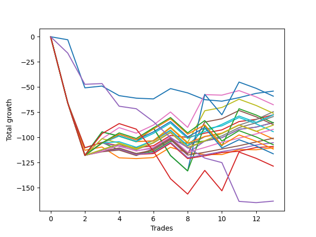

# Short Labrador 008 
- Symbol: ES_FOMC
- Date Range: 11/30/2022 - 12/14/2022
- Trading Period: 8:30-12:30
- Number of Trades: 13



| Name | Win Percent | Profit | Avg Profit / Trade | Avg Time / Trade |      | Name | Win Percent | Profit | Avg Profit / Trade | Avg Time / Trade |
| ---- | ----------- | ------ | ------------------ | ---------------- | ---- | ---- | ----------- | ------ | ------------------ | ---------------- |
| Sorted By <br> Profit | | | | | | Sorted By <br> Win Percentage ||||
| BB-20 Mid | 38.46 | -27000.00 | -2076.92 | 11:48 |     | V Mid | 69.23 | -37250.00 | -2865.38 | 29:50 |
| BB-100 U/L 2SD | 30.77 | -29500.00 | -2269.23 | 54:55 |     | TP-5 | 69.23 | -39625.00 | -3048.08 | 30:43 |
| BB-50 U/L 2SD | 46.15 | -33750.00 | -2596.15 | 45:48 |     | TP-4 | 69.23 | -46000.00 | -3538.46 | 28:49 |
| V Mid | 69.23 | -37250.00 | -2865.38 | 29:50 |     | TP-3 | 69.23 | -50375.00 | -3875.00 | 21:56 |
| V U/L 1SD | 46.15 | -38000.00 | -2923.08 | 39:50 |     | TP-2 | 69.23 | -52625.00 | -4048.08 | 21:41 |
| TP-7 | 61.54 | -38750.00 | -2980.77 | 35:42 |     | TP-1 | 69.23 | -54500.00 | -4192.31 | 21:35 |
| BB-20 U/L 2SD C | 61.54 | -38750.00 | -2980.77 | 24:18 |     | TP-7 | 61.54 | -38750.00 | -2980.77 | 35:42 |
| TP-5 | 69.23 | -39625.00 | -3048.08 | 30:43 |     | BB-20 U/L 2SD C | 61.54 | -38750.00 | -2980.77 | 24:18 |
| BB-50 Mid | 61.54 | -42625.00 | -3278.85 | 28:37 |     | BB-50 Mid | 61.54 | -42625.00 | -3278.85 | 28:37 |
| BB-20 U/L 2SD | 61.54 | -42625.00 | -3278.85 | 24:13 |     | BB-20 U/L 2SD | 61.54 | -42625.00 | -3278.85 | 24:13 |
| BB-200 U/L 2SD | 30.77 | -42750.00 | -3288.46 | 53:35 |     | TP-6 | 61.54 | -43875.00 | -3375.00 | 35:19 |
| BB-50 U/L 1SD | 53.85 | -43625.00 | -3355.77 | 37:16 |     | BB-50 U/L 1SD | 53.85 | -43625.00 | -3355.77 | 37:16 |
| TP-6 | 61.54 | -43875.00 | -3375.00 | 35:19 |     | BB-100 Mid | 53.85 | -47125.00 | -3625.00 | 37:11 |
| TP-4 | 69.23 | -46000.00 | -3538.46 | 28:49 |     | BB-200 Mid | 53.85 | -50750.00 | -3903.85 | 34:04 |
| BB-100 Mid | 53.85 | -47125.00 | -3625.00 | 37:11 |     | BB-50 U/L 2SD | 46.15 | -33750.00 | -2596.15 | 45:48 |
| TP-3 | 69.23 | -50375.00 | -3875.00 | 21:56 |     | V U/L 1SD | 46.15 | -38000.00 | -2923.08 | 39:50 |
| BB-200 Mid | 53.85 | -50750.00 | -3903.85 | 34:04 |     | TP-10 | 46.15 | -53625.00 | -4125.00 | 44:09 |
| TP-2 | 69.23 | -52625.00 | -4048.08 | 21:41 |     | TP-9 | 46.15 | -55750.00 | -4288.46 | 44:01 |
| TP-10 | 46.15 | -53625.00 | -4125.00 | 44:09 |     | TP-8 | 46.15 | -58125.00 | -4471.15 | 41:01 |
| TP-1 | 69.23 | -54500.00 | -4192.31 | 21:35 |     | BB-20 Mid | 38.46 | -27000.00 | -2076.92 | 11:48 |
| BB-20 U/L 1SD | 38.46 | -55125.00 | -4240.38 | 21:21 |     | BB-20 U/L 1SD | 38.46 | -55125.00 | -4240.38 | 21:21 |
| TP-9 | 46.15 | -55750.00 | -4288.46 | 44:01 |     | BB-100 U/L 2SD | 30.77 | -29500.00 | -2269.23 | 54:55 |
| TP-8 | 46.15 | -58125.00 | -4471.15 | 41:01 |     | BB-200 U/L 2SD | 30.77 | -42750.00 | -3288.46 | 53:35 |
| NEWFI 000 | 30.77 | -64250.00 | -4942.31 | 55:48 |     | NEWFI 000 | 30.77 | -64250.00 | -4942.31 | 55:48 |
| NEWFI 0000 | 15.38 | -81625.00 | -6278.85 | 12:28 |     | NEWFI 0000 | 15.38 | -81625.00 | -6278.85 | 12:28 |

## NO STOPLOSS

### Test BB-20 Mid
* Sell when price hits the middle line of the 20p bollinger
* No Stoploss
* Results:
```
Total Trades: 13
Percent Up: 61.54
Percent Down: 38.46
Total Points Moved Down: -54.00
Potential Profit: -27000.00
Total Points Ups: 76.00 Count Ups: 8
Total Points Downs: 22.00 Count Downs: 5
```

<details><summary>Trades</summary>

<code>In: 2022-11-30 10:35:00		Out: 2022-11-30 10:46:40		Total Position Time: 11:40		Total Move Down: -3.00		Total to Date: -3.00</code> <br />
<code>In: 2022-11-30 10:53:00		Out: 2022-11-30 11:33:20		Total Position Time: 40:20		Total Move Down: -47.75		Total to Date: -50.75</code> <br />
<code>In: 2022-04-06 10:46:00		Out: 2022-04-06 10:55:45		Total Position Time: 09:45		Total Move Down: 1.75		Total to Date: -49.00</code> <br />
<code>In: 2022-04-06 11:49:00		Out: 2022-04-06 12:07:45		Total Position Time: 18:45		Total Move Down: -9.50		Total to Date: -58.50</code> <br />
<code>In: 2022-05-04 09:27:00		Out: 2022-05-04 09:45:30		Total Position Time: 18:30		Total Move Down: -2.50		Total to Date: -61.00</code> <br />
<code>In: 2022-05-25 10:41:00		Out: 2022-05-25 10:50:55		Total Position Time: 09:55		Total Move Down: -0.75		Total to Date: -61.75</code> <br />
<code>In: 2022-07-06 11:11:00		Out: 2022-07-06 11:12:10		Total Position Time: 01:10		Total Move Down: 10.25		Total to Date: -51.50</code> <br />
<code>In: 2022-07-06 11:38:00		Out: 2022-07-06 11:50:05		Total Position Time: 12:05		Total Move Down: -4.25		Total to Date: -55.75</code> <br />
<code>In: 2022-09-21 11:49:00		Out: 2022-09-21 12:01:05		Total Position Time: 12:05		Total Move Down: -6.75		Total to Date: -62.50</code> <br />
<code>In: 2022-11-02 10:45:00		Out: 2022-11-02 10:56:50		Total Position Time: 11:50		Total Move Down: -1.50		Total to Date: -64.00</code> <br />
<code>In: 2022-11-02 10:54:00		Out: 2022-11-02 10:56:50		Total Position Time: 02:50		Total Move Down: 3.50		Total to Date: -60.50</code> <br />
<code>In: 2022-11-23 11:08:00		Out: 2022-11-23 11:11:25		Total Position Time: 03:25		Total Move Down: 4.25		Total to Date: -56.25</code> <br />
<code>In: 2022-11-23 11:19:00		Out: 2022-11-23 11:20:15		Total Position Time: 01:15		Total Move Down: 2.25		Total to Date: -54.00</code> <br />


</details>

### Test BB-20 U/L 1SD
* Sell when the price hits the lower line of the 20p 1std bollinger
* No Stoploss
* Results:
```
Total Trades: 13
Percent Up: 61.54
Percent Down: 38.46
Total Points Moved Down: -110.25
Potential Profit: -55125.00
Total Points Ups: 131.75 Count Ups: 8
Total Points Downs: 21.50 Count Downs: 5
```

<details><summary>Trades</summary>

<code>In: 2022-11-30 10:35:00		Out: 2022-11-30 11:35:55		Total Position Time: 60:55		Total Move Down: -65.75		Total to Date: -65.75</code> <br />
<code>In: 2022-11-30 10:53:00		Out: 2022-11-30 11:38:05		Total Position Time: 45:05		Total Move Down: -47.00		Total to Date: -112.75</code> <br />
<code>In: 2022-04-06 10:46:00		Out: 2022-04-06 10:57:05		Total Position Time: 11:05		Total Move Down: 3.25		Total to Date: -109.50</code> <br />
<code>In: 2022-04-06 11:49:00		Out: 2022-04-06 12:17:05		Total Position Time: 28:05		Total Move Down: -10.75		Total to Date: -120.25</code> <br />
<code>In: 2022-05-04 09:27:00		Out: 2022-05-04 09:46:40		Total Position Time: 19:40		Total Move Down: -0.75		Total to Date: -121.00</code> <br />
<code>In: 2022-05-25 10:41:00		Out: 2022-05-25 10:51:35		Total Position Time: 10:35		Total Move Down: 1.00		Total to Date: -120.00</code> <br />
<code>In: 2022-07-06 11:11:00		Out: 2022-07-06 11:12:10		Total Position Time: 01:10		Total Move Down: 10.25		Total to Date: -109.75</code> <br />
<code>In: 2022-07-06 11:38:00		Out: 2022-07-06 12:00:45		Total Position Time: 22:45		Total Move Down: -5.25		Total to Date: -115.00</code> <br />
<code>In: 2022-09-21 11:49:00		Out: 2022-09-21 12:03:25		Total Position Time: 14:25		Total Move Down: -2.00		Total to Date: -117.00</code> <br />
<code>In: 2022-11-02 10:45:00		Out: 2022-11-02 11:00:15		Total Position Time: 15:15		Total Move Down: -0.00		Total to Date: -117.00</code> <br />
<code>In: 2022-11-02 10:54:00		Out: 2022-11-02 11:00:15		Total Position Time: 06:15		Total Move Down: 5.00		Total to Date: -112.00</code> <br />
<code>In: 2022-11-23 11:08:00		Out: 2022-11-23 11:34:40		Total Position Time: 26:40		Total Move Down: -0.25		Total to Date: -112.25</code> <br />
<code>In: 2022-11-23 11:19:00		Out: 2022-11-23 11:34:40		Total Position Time: 15:40		Total Move Down: 2.00		Total to Date: -110.25</code> <br />


</details>

### Test BB-20 U/L 2SD
* Sell when the price hits the lower line of the 20p 2std bollinger
* No Stoploss
* Results:
```
Total Trades: 13
Percent Up: 38.46
Percent Down: 61.54
Total Points Moved Down: -85.25
Potential Profit: -42625.00
Total Points Ups: 123.25 Count Ups: 5
Total Points Downs: 38.00 Count Downs: 8
```

<details><summary>Trades</summary>

<code>In: 2022-11-30 10:35:00		Out: 2022-11-30 11:35:55		Total Position Time: 60:55		Total Move Down: -65.75		Total to Date: -65.75</code> <br />
<code>In: 2022-11-30 10:53:00		Out: 2022-11-30 11:38:35		Total Position Time: 45:35		Total Move Down: -44.50		Total to Date: -110.25</code> <br />
<code>In: 2022-04-06 10:46:00		Out: 2022-04-06 10:58:00		Total Position Time: 12:00		Total Move Down: 5.25		Total to Date: -105.00</code> <br />
<code>In: 2022-04-06 11:49:00		Out: 2022-04-06 12:19:50		Total Position Time: 30:50		Total Move Down: -7.50		Total to Date: -112.50</code> <br />
<code>In: 2022-05-04 09:27:00		Out: 2022-05-04 10:11:15		Total Position Time: 44:15		Total Move Down: -3.50		Total to Date: -116.00</code> <br />
<code>In: 2022-05-25 10:41:00		Out: 2022-05-25 10:52:10		Total Position Time: 11:10		Total Move Down: 2.00		Total to Date: -114.00</code> <br />
<code>In: 2022-07-06 11:11:00		Out: 2022-07-06 11:12:10		Total Position Time: 01:10		Total Move Down: 10.25		Total to Date: -103.75</code> <br />
<code>In: 2022-07-06 11:38:00		Out: 2022-07-06 12:01:25		Total Position Time: 23:25		Total Move Down: -2.00		Total to Date: -105.75</code> <br />
<code>In: 2022-09-21 11:49:00		Out: 2022-09-21 12:09:45		Total Position Time: 20:45		Total Move Down: 2.25		Total to Date: -103.50</code> <br />
<code>In: 2022-11-02 10:45:00		Out: 2022-11-02 11:00:20		Total Position Time: 15:20		Total Move Down: 3.25		Total to Date: -100.25</code> <br />
<code>In: 2022-11-02 10:54:00		Out: 2022-11-02 11:00:20		Total Position Time: 06:20		Total Move Down: 8.25		Total to Date: -92.00</code> <br />
<code>In: 2022-11-23 11:08:00		Out: 2022-11-23 11:35:05		Total Position Time: 27:05		Total Move Down: 2.25		Total to Date: -89.75</code> <br />
<code>In: 2022-11-23 11:19:00		Out: 2022-11-23 11:35:05		Total Position Time: 16:05		Total Move Down: 4.50		Total to Date: -85.25</code> <br />


</details>

### Test BB-20 U/L 2SD C
* Sell when the price hits the lower line of the 20p 2std bollinger
* No Stoploss
* Results:
```
Total Trades: 13
Percent Up: 38.46
Percent Down: 61.54
Total Points Moved Down: -77.50
Potential Profit: -38750.00
Total Points Ups: 117.50 Count Ups: 5
Total Points Downs: 40.00 Count Downs: 8
```

<details><summary>Trades</summary>

<code>In: 2022-11-30 10:35:00		Out: 2022-11-30 11:35:55		Total Position Time: 60:55		Total Move Down: -65.75		Total to Date: -65.75</code> <br />
<code>In: 2022-11-30 10:53:00		Out: 2022-11-30 11:38:35		Total Position Time: 45:35		Total Move Down: -44.50		Total to Date: -110.25</code> <br />
<code>In: 2022-04-06 10:46:00		Out: 2022-04-06 10:58:05		Total Position Time: 12:05		Total Move Down: 5.25		Total to Date: -105.00</code> <br />
<code>In: 2022-04-06 11:49:00		Out: 2022-04-06 12:20:25		Total Position Time: 31:25		Total Move Down: -3.25		Total to Date: -108.25</code> <br />
<code>In: 2022-05-04 09:27:00		Out: 2022-05-04 10:11:30		Total Position Time: 44:30		Total Move Down: -2.00		Total to Date: -110.25</code> <br />
<code>In: 2022-05-25 10:41:00		Out: 2022-05-25 10:52:10		Total Position Time: 11:10		Total Move Down: 2.00		Total to Date: -108.25</code> <br />
<code>In: 2022-07-06 11:11:00		Out: 2022-07-06 11:12:10		Total Position Time: 01:10		Total Move Down: 10.25		Total to Date: -98.00</code> <br />
<code>In: 2022-07-06 11:38:00		Out: 2022-07-06 12:01:25		Total Position Time: 23:25		Total Move Down: -2.00		Total to Date: -100.00</code> <br />
<code>In: 2022-09-21 11:49:00		Out: 2022-09-21 12:09:55		Total Position Time: 20:55		Total Move Down: 4.25		Total to Date: -95.75</code> <br />
<code>In: 2022-11-02 10:45:00		Out: 2022-11-02 11:00:20		Total Position Time: 15:20		Total Move Down: 3.25		Total to Date: -92.50</code> <br />
<code>In: 2022-11-02 10:54:00		Out: 2022-11-02 11:00:20		Total Position Time: 06:20		Total Move Down: 8.25		Total to Date: -84.25</code> <br />
<code>In: 2022-11-23 11:08:00		Out: 2022-11-23 11:35:05		Total Position Time: 27:05		Total Move Down: 2.25		Total to Date: -82.00</code> <br />
<code>In: 2022-11-23 11:19:00		Out: 2022-11-23 11:35:05		Total Position Time: 16:05		Total Move Down: 4.50		Total to Date: -77.50</code> <br />


</details>

### Test BB-50 Mid
* Sell when price hits the middle line of the 50p bollinger
* No Stoploss
* Results:
```
Total Trades: 13
Percent Up: 38.46
Percent Down: 61.54
Total Points Moved Down: -85.25
Potential Profit: -42625.00
Total Points Ups: 140.75 Count Ups: 5
Total Points Downs: 55.50 Count Downs: 8
```

<details><summary>Trades</summary>

<code>In: 2022-11-30 10:35:00		Out: 2022-11-30 11:35:55		Total Position Time: 60:55		Total Move Down: -65.75		Total to Date: -65.75</code> <br />
<code>In: 2022-11-30 10:53:00		Out: 2022-11-30 11:53:55		Total Position Time: 60:55		Total Move Down: -52.00		Total to Date: -117.75</code> <br />
<code>In: 2022-04-06 10:46:00		Out: 2022-04-06 11:00:10		Total Position Time: 14:10		Total Move Down: 12.25		Total to Date: -105.50</code> <br />
<code>In: 2022-04-06 11:49:00		Out: 2022-04-06 12:20:25		Total Position Time: 31:25		Total Move Down: -3.25		Total to Date: -108.75</code> <br />
<code>In: 2022-05-04 09:27:00		Out: 2022-05-04 10:11:05		Total Position Time: 44:05		Total Move Down: -4.50		Total to Date: -113.25</code> <br />
<code>In: 2022-05-25 10:41:00		Out: 2022-05-25 10:53:30		Total Position Time: 12:30		Total Move Down: 2.50		Total to Date: -110.75</code> <br />
<code>In: 2022-07-06 11:11:00		Out: 2022-07-06 11:12:10		Total Position Time: 01:10		Total Move Down: 10.25		Total to Date: -100.50</code> <br />
<code>In: 2022-07-06 11:38:00		Out: 2022-07-06 12:38:55		Total Position Time: 60:55		Total Move Down: -15.25		Total to Date: -115.75</code> <br />
<code>In: 2022-09-21 11:49:00		Out: 2022-09-21 12:10:10		Total Position Time: 21:10		Total Move Down: 12.25		Total to Date: -103.50</code> <br />
<code>In: 2022-11-02 10:45:00		Out: 2022-11-02 11:00:20		Total Position Time: 15:20		Total Move Down: 3.25		Total to Date: -100.25</code> <br />
<code>In: 2022-11-02 10:54:00		Out: 2022-11-02 11:00:20		Total Position Time: 06:20		Total Move Down: 8.25		Total to Date: -92.00</code> <br />
<code>In: 2022-11-23 11:08:00		Out: 2022-11-23 11:35:05		Total Position Time: 27:05		Total Move Down: 2.25		Total to Date: -89.75</code> <br />
<code>In: 2022-11-23 11:19:00		Out: 2022-11-23 11:35:05		Total Position Time: 16:05		Total Move Down: 4.50		Total to Date: -85.25</code> <br />


</details>

### Test BB-50 U/L 1SD
* Sell when the price hits the lower line of the 50p 1std bollinger
* No Stoploss
* Results:
```
Total Trades: 13
Percent Up: 46.15
Percent Down: 53.85
Total Points Moved Down: -87.25
Potential Profit: -43625.00
Total Points Ups: 152.50 Count Ups: 6
Total Points Downs: 65.25 Count Downs: 7
```

<details><summary>Trades</summary>

<code>In: 2022-11-30 10:35:00		Out: 2022-11-30 11:35:55		Total Position Time: 60:55		Total Move Down: -65.75		Total to Date: -65.75</code> <br />
<code>In: 2022-11-30 10:53:00		Out: 2022-11-30 11:53:55		Total Position Time: 60:55		Total Move Down: -52.00		Total to Date: -117.75</code> <br />
<code>In: 2022-04-06 10:46:00		Out: 2022-04-06 11:00:15		Total Position Time: 14:15		Total Move Down: 3.50		Total to Date: -114.25</code> <br />
<code>In: 2022-04-06 11:49:00		Out: 2022-04-06 12:23:15		Total Position Time: 34:15		Total Move Down: 1.75		Total to Date: -112.50</code> <br />
<code>In: 2022-05-04 09:27:00		Out: 2022-05-04 10:27:55		Total Position Time: 60:55		Total Move Down: -5.50		Total to Date: -118.00</code> <br />
<code>In: 2022-05-25 10:41:00		Out: 2022-05-25 11:06:40		Total Position Time: 25:40		Total Move Down: 6.75		Total to Date: -111.25</code> <br />
<code>In: 2022-07-06 11:11:00		Out: 2022-07-06 11:12:10		Total Position Time: 01:10		Total Move Down: 10.25		Total to Date: -101.00</code> <br />
<code>In: 2022-07-06 11:38:00		Out: 2022-07-06 12:38:55		Total Position Time: 60:55		Total Move Down: -15.25		Total to Date: -116.25</code> <br />
<code>In: 2022-09-21 11:49:00		Out: 2022-09-21 12:11:05		Total Position Time: 22:05		Total Move Down: 31.50		Total to Date: -84.75</code> <br />
<code>In: 2022-11-02 10:45:00		Out: 2022-11-02 11:00:20		Total Position Time: 15:20		Total Move Down: 3.25		Total to Date: -81.50</code> <br />
<code>In: 2022-11-02 10:54:00		Out: 2022-11-02 11:00:20		Total Position Time: 06:20		Total Move Down: 8.25		Total to Date: -73.25</code> <br />
<code>In: 2022-11-23 11:08:00		Out: 2022-11-23 12:08:55		Total Position Time: 60:55		Total Move Down: -6.25		Total to Date: -79.50</code> <br />
<code>In: 2022-11-23 11:19:00		Out: 2022-11-23 12:19:55		Total Position Time: 60:55		Total Move Down: -7.75		Total to Date: -87.25</code> <br />


</details>

### Test BB-50 U/L 2SD
* Sell when the price hits the lower line of the 50p 2std bollinger
* No Stoploss
* Results:
```
Total Trades: 13
Percent Up: 53.85
Percent Down: 46.15
Total Points Moved Down: -67.50
Potential Profit: -33750.00
Total Points Ups: 153.00 Count Ups: 7
Total Points Downs: 85.50 Count Downs: 6
```

<details><summary>Trades</summary>

<code>In: 2022-11-30 10:35:00		Out: 2022-11-30 11:35:55		Total Position Time: 60:55		Total Move Down: -65.75		Total to Date: -65.75</code> <br />
<code>In: 2022-11-30 10:53:00		Out: 2022-11-30 11:53:55		Total Position Time: 60:55		Total Move Down: -52.00		Total to Date: -117.75</code> <br />
<code>In: 2022-04-06 10:46:00		Out: 2022-04-06 11:09:40		Total Position Time: 23:40		Total Move Down: 16.50		Total to Date: -101.25</code> <br />
<code>In: 2022-04-06 11:49:00		Out: 2022-04-06 12:34:15		Total Position Time: 45:15		Total Move Down: 11.00		Total to Date: -90.25</code> <br />
<code>In: 2022-05-04 09:27:00		Out: 2022-05-04 10:27:55		Total Position Time: 60:55		Total Move Down: -5.50		Total to Date: -95.75</code> <br />
<code>In: 2022-05-25 10:41:00		Out: 2022-05-25 11:06:45		Total Position Time: 25:45		Total Move Down: 8.00		Total to Date: -87.75</code> <br />
<code>In: 2022-07-06 11:11:00		Out: 2022-07-06 11:12:15		Total Position Time: 01:15		Total Move Down: 13.00		Total to Date: -74.75</code> <br />
<code>In: 2022-07-06 11:38:00		Out: 2022-07-06 12:38:55		Total Position Time: 60:55		Total Move Down: -15.25		Total to Date: -90.00</code> <br />
<code>In: 2022-09-21 11:49:00		Out: 2022-09-21 12:26:20		Total Position Time: 37:20		Total Move Down: 32.50		Total to Date: -57.50</code> <br />
<code>In: 2022-11-02 10:45:00		Out: 2022-11-02 11:37:55		Total Position Time: 52:55		Total Move Down: -0.50		Total to Date: -58.00</code> <br />
<code>In: 2022-11-02 10:54:00		Out: 2022-11-02 11:37:55		Total Position Time: 43:55		Total Move Down: 4.50		Total to Date: -53.50</code> <br />
<code>In: 2022-11-23 11:08:00		Out: 2022-11-23 12:08:55		Total Position Time: 60:55		Total Move Down: -6.25		Total to Date: -59.75</code> <br />
<code>In: 2022-11-23 11:19:00		Out: 2022-11-23 12:19:55		Total Position Time: 60:55		Total Move Down: -7.75		Total to Date: -67.50</code> <br />


</details>

### Test V Mid
* Sell when the price hits the middle line of the 1std VWAP
* No Stoploss
* Results:
```
Total Trades: 13
Percent Up: 30.77
Percent Down: 69.23
Total Points Moved Down: -74.50
Potential Profit: -37250.00
Total Points Ups: 138.50 Count Ups: 4
Total Points Downs: 64.00 Count Downs: 9
```

<details><summary>Trades</summary>

<code>In: 2022-11-30 10:35:00		Out: 2022-11-30 11:35:55		Total Position Time: 60:55		Total Move Down: -65.75		Total to Date: -65.75</code> <br />
<code>In: 2022-11-30 10:53:00		Out: 2022-11-30 11:53:55		Total Position Time: 60:55		Total Move Down: -52.00		Total to Date: -117.75</code> <br />
<code>In: 2022-04-06 10:46:00		Out: 2022-04-06 11:00:10		Total Position Time: 14:10		Total Move Down: 12.25		Total to Date: -105.50</code> <br />
<code>In: 2022-04-06 11:49:00		Out: 2022-04-06 12:26:50		Total Position Time: 37:50		Total Move Down: 7.00		Total to Date: -98.50</code> <br />
<code>In: 2022-05-04 09:27:00		Out: 2022-05-04 10:27:55		Total Position Time: 60:55		Total Move Down: -5.50		Total to Date: -104.00</code> <br />
<code>In: 2022-05-25 10:41:00		Out: 2022-05-25 10:42:10		Total Position Time: 01:10		Total Move Down: 0.50		Total to Date: -103.50</code> <br />
<code>In: 2022-07-06 11:11:00		Out: 2022-07-06 11:12:10		Total Position Time: 01:10		Total Move Down: 10.25		Total to Date: -93.25</code> <br />
<code>In: 2022-07-06 11:38:00		Out: 2022-07-06 12:38:55		Total Position Time: 60:55		Total Move Down: -15.25		Total to Date: -108.50</code> <br />
<code>In: 2022-09-21 11:49:00		Out: 2022-09-21 12:10:05		Total Position Time: 21:05		Total Move Down: 9.25		Total to Date: -99.25</code> <br />
<code>In: 2022-11-02 10:45:00		Out: 2022-11-02 11:00:20		Total Position Time: 15:20		Total Move Down: 3.25		Total to Date: -96.00</code> <br />
<code>In: 2022-11-02 10:54:00		Out: 2022-11-02 11:00:20		Total Position Time: 06:20		Total Move Down: 8.25		Total to Date: -87.75</code> <br />
<code>In: 2022-11-23 11:08:00		Out: 2022-11-23 11:37:05		Total Position Time: 29:05		Total Move Down: 5.50		Total to Date: -82.25</code> <br />
<code>In: 2022-11-23 11:19:00		Out: 2022-11-23 11:37:05		Total Position Time: 18:05		Total Move Down: 7.75		Total to Date: -74.50</code> <br />


</details>

### Test V U/L 1SD
* Sell when the price hits the lower line of the 1std VWAP
* No Stoploss
* Results:
```
Total Trades: 13
Percent Up: 53.85
Percent Down: 46.15
Total Points Moved Down: -76.00
Potential Profit: -38000.00
Total Points Ups: 156.75 Count Ups: 7
Total Points Downs: 80.75 Count Downs: 6
```

<details><summary>Trades</summary>

<code>In: 2022-11-30 10:35:00		Out: 2022-11-30 11:35:55		Total Position Time: 60:55		Total Move Down: -65.75		Total to Date: -65.75</code> <br />
<code>In: 2022-11-30 10:53:00		Out: 2022-11-30 11:53:55		Total Position Time: 60:55		Total Move Down: -52.00		Total to Date: -117.75</code> <br />
<code>In: 2022-04-06 10:46:00		Out: 2022-04-06 11:09:40		Total Position Time: 23:40		Total Move Down: 16.50		Total to Date: -101.25</code> <br />
<code>In: 2022-04-06 11:49:00		Out: 2022-04-06 12:47:00		Total Position Time: 58:00		Total Move Down: -4.25		Total to Date: -105.50</code> <br />
<code>In: 2022-05-04 09:27:00		Out: 2022-05-04 10:27:55		Total Position Time: 60:55		Total Move Down: -5.50		Total to Date: -111.00</code> <br />
<code>In: 2022-05-25 10:41:00		Out: 2022-05-25 11:06:45		Total Position Time: 25:45		Total Move Down: 8.00		Total to Date: -103.00</code> <br />
<code>In: 2022-07-06 11:11:00		Out: 2022-07-06 11:12:20		Total Position Time: 01:20		Total Move Down: 13.25		Total to Date: -89.75</code> <br />
<code>In: 2022-07-06 11:38:00		Out: 2022-07-06 12:38:55		Total Position Time: 60:55		Total Move Down: -15.25		Total to Date: -105.00</code> <br />
<code>In: 2022-09-21 11:49:00		Out: 2022-09-21 12:11:05		Total Position Time: 22:05		Total Move Down: 31.50		Total to Date: -73.50</code> <br />
<code>In: 2022-11-02 10:45:00		Out: 2022-11-02 11:00:20		Total Position Time: 15:20		Total Move Down: 3.25		Total to Date: -70.25</code> <br />
<code>In: 2022-11-02 10:54:00		Out: 2022-11-02 11:00:20		Total Position Time: 06:20		Total Move Down: 8.25		Total to Date: -62.00</code> <br />
<code>In: 2022-11-23 11:08:00		Out: 2022-11-23 12:08:55		Total Position Time: 60:55		Total Move Down: -6.25		Total to Date: -68.25</code> <br />
<code>In: 2022-11-23 11:19:00		Out: 2022-11-23 12:19:55		Total Position Time: 60:55		Total Move Down: -7.75		Total to Date: -76.00</code> <br />


</details>

### Test BB-100 Mid
* Move to BB100 Mid
* No Stoploss
* Results:
```
Total Trades: 13
Percent Up: 46.15
Percent Down: 53.85
Total Points Moved Down: -94.25
Potential Profit: -47125.00
Total Points Ups: 152.50 Count Ups: 6
Total Points Downs: 58.25 Count Downs: 7
```

<details><summary>Trades</summary>

<code>In: 2022-11-30 10:35:00		Out: 2022-11-30 11:35:55		Total Position Time: 60:55		Total Move Down: -65.75		Total to Date: -65.75</code> <br />
<code>In: 2022-11-30 10:53:00		Out: 2022-11-30 11:53:55		Total Position Time: 60:55		Total Move Down: -52.00		Total to Date: -117.75</code> <br />
<code>In: 2022-04-06 10:46:00		Out: 2022-04-06 11:00:10		Total Position Time: 14:10		Total Move Down: 12.25		Total to Date: -105.50</code> <br />
<code>In: 2022-04-06 11:49:00		Out: 2022-04-06 12:23:10		Total Position Time: 34:10		Total Move Down: 1.25		Total to Date: -104.25</code> <br />
<code>In: 2022-05-04 09:27:00		Out: 2022-05-04 10:27:55		Total Position Time: 60:55		Total Move Down: -5.50		Total to Date: -109.75</code> <br />
<code>In: 2022-05-25 10:41:00		Out: 2022-05-25 11:06:40		Total Position Time: 25:40		Total Move Down: 6.75		Total to Date: -103.00</code> <br />
<code>In: 2022-07-06 11:11:00		Out: 2022-07-06 11:12:10		Total Position Time: 01:10		Total Move Down: 10.25		Total to Date: -92.75</code> <br />
<code>In: 2022-07-06 11:38:00		Out: 2022-07-06 12:38:55		Total Position Time: 60:55		Total Move Down: -15.25		Total to Date: -108.00</code> <br />
<code>In: 2022-09-21 11:49:00		Out: 2022-09-21 12:10:15		Total Position Time: 21:15		Total Move Down: 16.25		Total to Date: -91.75</code> <br />
<code>In: 2022-11-02 10:45:00		Out: 2022-11-02 11:00:20		Total Position Time: 15:20		Total Move Down: 3.25		Total to Date: -88.50</code> <br />
<code>In: 2022-11-02 10:54:00		Out: 2022-11-02 11:00:20		Total Position Time: 06:20		Total Move Down: 8.25		Total to Date: -80.25</code> <br />
<code>In: 2022-11-23 11:08:00		Out: 2022-11-23 12:08:55		Total Position Time: 60:55		Total Move Down: -6.25		Total to Date: -86.50</code> <br />
<code>In: 2022-11-23 11:19:00		Out: 2022-11-23 12:19:55		Total Position Time: 60:55		Total Move Down: -7.75		Total to Date: -94.25</code> <br />


</details>

### Test BB-100 U/L 2SD
* Move to BB100 Upper Band
* No Stoploss
* Results:
```
Total Trades: 13
Percent Up: 69.23
Percent Down: 30.77
Total Points Moved Down: -59.00
Potential Profit: -29500.00
Total Points Ups: 204.50 Count Ups: 9
Total Points Downs: 145.50 Count Downs: 4
```

<details><summary>Trades</summary>

<code>In: 2022-11-30 10:35:00		Out: 2022-11-30 11:35:55		Total Position Time: 60:55		Total Move Down: -65.75		Total to Date: -65.75</code> <br />
<code>In: 2022-11-30 10:53:00		Out: 2022-11-30 11:53:55		Total Position Time: 60:55		Total Move Down: -52.00		Total to Date: -117.75</code> <br />
<code>In: 2022-04-06 10:46:00		Out: 2022-04-06 11:14:55		Total Position Time: 28:55		Total Move Down: 23.25		Total to Date: -94.50</code> <br />
<code>In: 2022-04-06 11:49:00		Out: 2022-04-06 12:47:00		Total Position Time: 58:00		Total Move Down: -4.25		Total to Date: -98.75</code> <br />
<code>In: 2022-05-04 09:27:00		Out: 2022-05-04 10:27:55		Total Position Time: 60:55		Total Move Down: -5.50		Total to Date: -104.25</code> <br />
<code>In: 2022-05-25 10:41:00		Out: 2022-05-25 11:07:05		Total Position Time: 26:05		Total Move Down: 13.75		Total to Date: -90.50</code> <br />
<code>In: 2022-07-06 11:11:00		Out: 2022-07-06 12:11:55		Total Position Time: 60:55		Total Move Down: -27.50		Total to Date: -118.00</code> <br />
<code>In: 2022-07-06 11:38:00		Out: 2022-07-06 12:38:55		Total Position Time: 60:55		Total Move Down: -15.25		Total to Date: -133.25</code> <br />
<code>In: 2022-09-21 11:49:00		Out: 2022-09-21 12:45:05		Total Position Time: 56:05		Total Move Down: 76.00		Total to Date: -57.25</code> <br />
<code>In: 2022-11-02 10:45:00		Out: 2022-11-02 11:45:55		Total Position Time: 60:55		Total Move Down: -20.25		Total to Date: -77.50</code> <br />
<code>In: 2022-11-02 10:54:00		Out: 2022-11-02 11:51:40		Total Position Time: 57:40		Total Move Down: 32.50		Total to Date: -45.00</code> <br />
<code>In: 2022-11-23 11:08:00		Out: 2022-11-23 12:08:55		Total Position Time: 60:55		Total Move Down: -6.25		Total to Date: -51.25</code> <br />
<code>In: 2022-11-23 11:19:00		Out: 2022-11-23 12:19:55		Total Position Time: 60:55		Total Move Down: -7.75		Total to Date: -59.00</code> <br />


</details>

### Test BB-200 Mid
* Move to BB200 Mid
* No Stoploss
* Results:
```
Total Trades: 13
Percent Up: 46.15
Percent Down: 53.85
Total Points Moved Down: -101.50
Potential Profit: -50750.00
Total Points Ups: 152.50 Count Ups: 6
Total Points Downs: 51.00 Count Downs: 7
```

<details><summary>Trades</summary>

<code>In: 2022-11-30 10:35:00		Out: 2022-11-30 11:35:55		Total Position Time: 60:55		Total Move Down: -65.75		Total to Date: -65.75</code> <br />
<code>In: 2022-11-30 10:53:00		Out: 2022-11-30 11:53:55		Total Position Time: 60:55		Total Move Down: -52.00		Total to Date: -117.75</code> <br />
<code>In: 2022-04-06 10:46:00		Out: 2022-04-06 11:00:10		Total Position Time: 14:10		Total Move Down: 12.25		Total to Date: -105.50</code> <br />
<code>In: 2022-04-06 11:49:00		Out: 2022-04-06 12:26:50		Total Position Time: 37:50		Total Move Down: 7.00		Total to Date: -98.50</code> <br />
<code>In: 2022-05-04 09:27:00		Out: 2022-05-04 10:27:55		Total Position Time: 60:55		Total Move Down: -5.50		Total to Date: -104.00</code> <br />
<code>In: 2022-05-25 10:41:00		Out: 2022-05-25 10:42:10		Total Position Time: 01:10		Total Move Down: 0.50		Total to Date: -103.50</code> <br />
<code>In: 2022-07-06 11:11:00		Out: 2022-07-06 11:12:15		Total Position Time: 01:15		Total Move Down: 13.00		Total to Date: -90.50</code> <br />
<code>In: 2022-07-06 11:38:00		Out: 2022-07-06 12:38:55		Total Position Time: 60:55		Total Move Down: -15.25		Total to Date: -105.75</code> <br />
<code>In: 2022-09-21 11:49:00		Out: 2022-09-21 11:50:25		Total Position Time: 01:25		Total Move Down: 6.75		Total to Date: -99.00</code> <br />
<code>In: 2022-11-02 10:45:00		Out: 2022-11-02 11:00:20		Total Position Time: 15:20		Total Move Down: 3.25		Total to Date: -95.75</code> <br />
<code>In: 2022-11-02 10:54:00		Out: 2022-11-02 11:00:20		Total Position Time: 06:20		Total Move Down: 8.25		Total to Date: -87.50</code> <br />
<code>In: 2022-11-23 11:08:00		Out: 2022-11-23 12:08:55		Total Position Time: 60:55		Total Move Down: -6.25		Total to Date: -93.75</code> <br />
<code>In: 2022-11-23 11:19:00		Out: 2022-11-23 12:19:55		Total Position Time: 60:55		Total Move Down: -7.75		Total to Date: -101.50</code> <br />


</details>

### Test BB-200 U/L 2SD
* Move to BB200 Upper Band
* No Stoploss
* Results:
```
Total Trades: 13
Percent Up: 69.23
Percent Down: 30.77
Total Points Moved Down: -85.50
Potential Profit: -42750.00
Total Points Ups: 204.50 Count Ups: 9
Total Points Downs: 119.00 Count Downs: 4
```

<details><summary>Trades</summary>

<code>In: 2022-11-30 10:35:00		Out: 2022-11-30 11:35:55		Total Position Time: 60:55		Total Move Down: -65.75		Total to Date: -65.75</code> <br />
<code>In: 2022-11-30 10:53:00		Out: 2022-11-30 11:53:55		Total Position Time: 60:55		Total Move Down: -52.00		Total to Date: -117.75</code> <br />
<code>In: 2022-04-06 10:46:00		Out: 2022-04-06 11:14:55		Total Position Time: 28:55		Total Move Down: 23.25		Total to Date: -94.50</code> <br />
<code>In: 2022-04-06 11:49:00		Out: 2022-04-06 12:47:00		Total Position Time: 58:00		Total Move Down: -4.25		Total to Date: -98.75</code> <br />
<code>In: 2022-05-04 09:27:00		Out: 2022-05-04 10:27:55		Total Position Time: 60:55		Total Move Down: -5.50		Total to Date: -104.25</code> <br />
<code>In: 2022-05-25 10:41:00		Out: 2022-05-25 11:07:05		Total Position Time: 26:05		Total Move Down: 13.75		Total to Date: -90.50</code> <br />
<code>In: 2022-07-06 11:11:00		Out: 2022-07-06 12:11:55		Total Position Time: 60:55		Total Move Down: -27.50		Total to Date: -118.00</code> <br />
<code>In: 2022-07-06 11:38:00		Out: 2022-07-06 12:38:55		Total Position Time: 60:55		Total Move Down: -15.25		Total to Date: -133.25</code> <br />
<code>In: 2022-09-21 11:49:00		Out: 2022-09-21 12:27:25		Total Position Time: 38:25		Total Move Down: 45.00		Total to Date: -88.25</code> <br />
<code>In: 2022-11-02 10:45:00		Out: 2022-11-02 11:45:55		Total Position Time: 60:55		Total Move Down: -20.25		Total to Date: -108.50</code> <br />
<code>In: 2022-11-02 10:54:00		Out: 2022-11-02 11:52:00		Total Position Time: 58:00		Total Move Down: 37.00		Total to Date: -71.50</code> <br />
<code>In: 2022-11-23 11:08:00		Out: 2022-11-23 12:08:55		Total Position Time: 60:55		Total Move Down: -6.25		Total to Date: -77.75</code> <br />
<code>In: 2022-11-23 11:19:00		Out: 2022-11-23 12:19:55		Total Position Time: 60:55		Total Move Down: -7.75		Total to Date: -85.50</code> <br />


</details>

## TAKE PROFIT

### Test TP-1
* Take Profit of 1 Point
* No Stoploss
* Results:
```
Total Trades: 13
Percent Up: 30.77
Percent Down: 69.23
Total Points Moved Down: -109.00
Potential Profit: -54500.00
Total Points Ups: 138.50 Count Ups: 4
Total Points Downs: 29.50 Count Downs: 9
```

<details><summary>Trades</summary>

<code>In: 2022-11-30 10:35:00		Out: 2022-11-30 11:35:55		Total Position Time: 60:55		Total Move Down: -65.75		Total to Date: -65.75</code> <br />
<code>In: 2022-11-30 10:53:00		Out: 2022-11-30 11:53:55		Total Position Time: 60:55		Total Move Down: -52.00		Total to Date: -117.75</code> <br />
<code>In: 2022-04-06 10:46:00		Out: 2022-04-06 10:47:10		Total Position Time: 01:10		Total Move Down: 4.00		Total to Date: -113.75</code> <br />
<code>In: 2022-04-06 11:49:00		Out: 2022-04-06 11:50:10		Total Position Time: 01:10		Total Move Down: 2.25		Total to Date: -111.50</code> <br />
<code>In: 2022-05-04 09:27:00		Out: 2022-05-04 10:27:55		Total Position Time: 60:55		Total Move Down: -5.50		Total to Date: -117.00</code> <br />
<code>In: 2022-05-25 10:41:00		Out: 2022-05-25 10:51:35		Total Position Time: 10:35		Total Move Down: 1.00		Total to Date: -116.00</code> <br />
<code>In: 2022-07-06 11:11:00		Out: 2022-07-06 11:12:10		Total Position Time: 01:10		Total Move Down: 10.25		Total to Date: -105.75</code> <br />
<code>In: 2022-07-06 11:38:00		Out: 2022-07-06 12:38:55		Total Position Time: 60:55		Total Move Down: -15.25		Total to Date: -121.00</code> <br />
<code>In: 2022-09-21 11:49:00		Out: 2022-09-21 11:50:15		Total Position Time: 01:15		Total Move Down: 2.75		Total to Date: -118.25</code> <br />
<code>In: 2022-11-02 10:45:00		Out: 2022-11-02 11:00:20		Total Position Time: 15:20		Total Move Down: 3.25		Total to Date: -115.00</code> <br />
<code>In: 2022-11-02 10:54:00		Out: 2022-11-02 10:55:55		Total Position Time: 01:55		Total Move Down: 1.25		Total to Date: -113.75</code> <br />
<code>In: 2022-11-23 11:08:00		Out: 2022-11-23 11:11:20		Total Position Time: 03:20		Total Move Down: 3.75		Total to Date: -110.00</code> <br />
<code>In: 2022-11-23 11:19:00		Out: 2022-11-23 11:20:10		Total Position Time: 01:10		Total Move Down: 1.00		Total to Date: -109.00</code> <br />


</details>

### Test TP-2
* Take Profit of 2 Point
* No Stoploss
* Results:
```
Total Trades: 13
Percent Up: 30.77
Percent Down: 69.23
Total Points Moved Down: -105.25
Potential Profit: -52625.00
Total Points Ups: 138.50 Count Ups: 4
Total Points Downs: 33.25 Count Downs: 9
```

<details><summary>Trades</summary>

<code>In: 2022-11-30 10:35:00		Out: 2022-11-30 11:35:55		Total Position Time: 60:55		Total Move Down: -65.75		Total to Date: -65.75</code> <br />
<code>In: 2022-11-30 10:53:00		Out: 2022-11-30 11:53:55		Total Position Time: 60:55		Total Move Down: -52.00		Total to Date: -117.75</code> <br />
<code>In: 2022-04-06 10:46:00		Out: 2022-04-06 10:47:10		Total Position Time: 01:10		Total Move Down: 4.00		Total to Date: -113.75</code> <br />
<code>In: 2022-04-06 11:49:00		Out: 2022-04-06 11:50:10		Total Position Time: 01:10		Total Move Down: 2.25		Total to Date: -111.50</code> <br />
<code>In: 2022-05-04 09:27:00		Out: 2022-05-04 10:27:55		Total Position Time: 60:55		Total Move Down: -5.50		Total to Date: -117.00</code> <br />
<code>In: 2022-05-25 10:41:00		Out: 2022-05-25 10:52:10		Total Position Time: 11:10		Total Move Down: 2.00		Total to Date: -115.00</code> <br />
<code>In: 2022-07-06 11:11:00		Out: 2022-07-06 11:12:10		Total Position Time: 01:10		Total Move Down: 10.25		Total to Date: -104.75</code> <br />
<code>In: 2022-07-06 11:38:00		Out: 2022-07-06 12:38:55		Total Position Time: 60:55		Total Move Down: -15.25		Total to Date: -120.00</code> <br />
<code>In: 2022-09-21 11:49:00		Out: 2022-09-21 11:50:15		Total Position Time: 01:15		Total Move Down: 2.75		Total to Date: -117.25</code> <br />
<code>In: 2022-11-02 10:45:00		Out: 2022-11-02 11:00:20		Total Position Time: 15:20		Total Move Down: 3.25		Total to Date: -114.00</code> <br />
<code>In: 2022-11-02 10:54:00		Out: 2022-11-02 10:56:25		Total Position Time: 02:25		Total Move Down: 2.75		Total to Date: -111.25</code> <br />
<code>In: 2022-11-23 11:08:00		Out: 2022-11-23 11:11:20		Total Position Time: 03:20		Total Move Down: 3.75		Total to Date: -107.50</code> <br />
<code>In: 2022-11-23 11:19:00		Out: 2022-11-23 11:20:15		Total Position Time: 01:15		Total Move Down: 2.25		Total to Date: -105.25</code> <br />


</details>

### Test TP-3
* Take Profit of 3 Point
* No Stoploss
* Results:
```
Total Trades: 13
Percent Up: 30.77
Percent Down: 69.23
Total Points Moved Down: -100.75
Potential Profit: -50375.00
Total Points Ups: 138.50 Count Ups: 4
Total Points Downs: 37.75 Count Downs: 9
```

<details><summary>Trades</summary>

<code>In: 2022-11-30 10:35:00		Out: 2022-11-30 11:35:55		Total Position Time: 60:55		Total Move Down: -65.75		Total to Date: -65.75</code> <br />
<code>In: 2022-11-30 10:53:00		Out: 2022-11-30 11:53:55		Total Position Time: 60:55		Total Move Down: -52.00		Total to Date: -117.75</code> <br />
<code>In: 2022-04-06 10:46:00		Out: 2022-04-06 10:47:10		Total Position Time: 01:10		Total Move Down: 4.00		Total to Date: -113.75</code> <br />
<code>In: 2022-04-06 11:49:00		Out: 2022-04-06 11:50:45		Total Position Time: 01:45		Total Move Down: 3.25		Total to Date: -110.50</code> <br />
<code>In: 2022-05-04 09:27:00		Out: 2022-05-04 10:27:55		Total Position Time: 60:55		Total Move Down: -5.50		Total to Date: -116.00</code> <br />
<code>In: 2022-05-25 10:41:00		Out: 2022-05-25 10:53:35		Total Position Time: 12:35		Total Move Down: 3.50		Total to Date: -112.50</code> <br />
<code>In: 2022-07-06 11:11:00		Out: 2022-07-06 11:12:10		Total Position Time: 01:10		Total Move Down: 10.25		Total to Date: -102.25</code> <br />
<code>In: 2022-07-06 11:38:00		Out: 2022-07-06 12:38:55		Total Position Time: 60:55		Total Move Down: -15.25		Total to Date: -117.50</code> <br />
<code>In: 2022-09-21 11:49:00		Out: 2022-09-21 11:50:15		Total Position Time: 01:15		Total Move Down: 2.75		Total to Date: -114.75</code> <br />
<code>In: 2022-11-02 10:45:00		Out: 2022-11-02 11:00:20		Total Position Time: 15:20		Total Move Down: 3.25		Total to Date: -111.50</code> <br />
<code>In: 2022-11-02 10:54:00		Out: 2022-11-02 10:56:45		Total Position Time: 02:45		Total Move Down: 3.25		Total to Date: -108.25</code> <br />
<code>In: 2022-11-23 11:08:00		Out: 2022-11-23 11:11:20		Total Position Time: 03:20		Total Move Down: 3.75		Total to Date: -104.50</code> <br />
<code>In: 2022-11-23 11:19:00		Out: 2022-11-23 11:21:20		Total Position Time: 02:20		Total Move Down: 3.75		Total to Date: -100.75</code> <br />


</details>

### Test TP-4
* Take Profit of 4 Point
* No Stoploss
* Results:
```
Total Trades: 13
Percent Up: 30.77
Percent Down: 69.23
Total Points Moved Down: -92.00
Potential Profit: -46000.00
Total Points Ups: 138.50 Count Ups: 4
Total Points Downs: 46.50 Count Downs: 9
```

<details><summary>Trades</summary>

<code>In: 2022-11-30 10:35:00		Out: 2022-11-30 11:35:55		Total Position Time: 60:55		Total Move Down: -65.75		Total to Date: -65.75</code> <br />
<code>In: 2022-11-30 10:53:00		Out: 2022-11-30 11:53:55		Total Position Time: 60:55		Total Move Down: -52.00		Total to Date: -117.75</code> <br />
<code>In: 2022-04-06 10:46:00		Out: 2022-04-06 10:47:10		Total Position Time: 01:10		Total Move Down: 4.00		Total to Date: -113.75</code> <br />
<code>In: 2022-04-06 11:49:00		Out: 2022-04-06 12:25:35		Total Position Time: 36:35		Total Move Down: 5.75		Total to Date: -108.00</code> <br />
<code>In: 2022-05-04 09:27:00		Out: 2022-05-04 10:27:55		Total Position Time: 60:55		Total Move Down: -5.50		Total to Date: -113.50</code> <br />
<code>In: 2022-05-25 10:41:00		Out: 2022-05-25 10:56:15		Total Position Time: 15:15		Total Move Down: 3.75		Total to Date: -109.75</code> <br />
<code>In: 2022-07-06 11:11:00		Out: 2022-07-06 11:12:10		Total Position Time: 01:10		Total Move Down: 10.25		Total to Date: -99.50</code> <br />
<code>In: 2022-07-06 11:38:00		Out: 2022-07-06 12:38:55		Total Position Time: 60:55		Total Move Down: -15.25		Total to Date: -114.75</code> <br />
<code>In: 2022-09-21 11:49:00		Out: 2022-09-21 11:50:20		Total Position Time: 01:20		Total Move Down: 4.75		Total to Date: -110.00</code> <br />
<code>In: 2022-11-02 10:45:00		Out: 2022-11-02 11:38:00		Total Position Time: 53:00		Total Move Down: 5.25		Total to Date: -104.75</code> <br />
<code>In: 2022-11-02 10:54:00		Out: 2022-11-02 10:57:05		Total Position Time: 03:05		Total Move Down: 4.00		Total to Date: -100.75</code> <br />
<code>In: 2022-11-23 11:08:00		Out: 2022-11-23 11:11:25		Total Position Time: 03:25		Total Move Down: 4.25		Total to Date: -96.50</code> <br />
<code>In: 2022-11-23 11:19:00		Out: 2022-11-23 11:35:05		Total Position Time: 16:05		Total Move Down: 4.50		Total to Date: -92.00</code> <br />


</details>

### Test TP-5
* Take Profit of 5 Point
* No Stoploss
* Results:
```
Total Trades: 13
Percent Up: 30.77
Percent Down: 69.23
Total Points Moved Down: -79.25
Potential Profit: -39625.00
Total Points Ups: 138.50 Count Ups: 4
Total Points Downs: 59.25 Count Downs: 9
```

<details><summary>Trades</summary>

<code>In: 2022-11-30 10:35:00		Out: 2022-11-30 11:35:55		Total Position Time: 60:55		Total Move Down: -65.75		Total to Date: -65.75</code> <br />
<code>In: 2022-11-30 10:53:00		Out: 2022-11-30 11:53:55		Total Position Time: 60:55		Total Move Down: -52.00		Total to Date: -117.75</code> <br />
<code>In: 2022-04-06 10:46:00		Out: 2022-04-06 10:58:00		Total Position Time: 12:00		Total Move Down: 5.25		Total to Date: -112.50</code> <br />
<code>In: 2022-04-06 11:49:00		Out: 2022-04-06 12:25:35		Total Position Time: 36:35		Total Move Down: 5.75		Total to Date: -106.75</code> <br />
<code>In: 2022-05-04 09:27:00		Out: 2022-05-04 10:27:55		Total Position Time: 60:55		Total Move Down: -5.50		Total to Date: -112.25</code> <br />
<code>In: 2022-05-25 10:41:00		Out: 2022-05-25 11:06:40		Total Position Time: 25:40		Total Move Down: 6.75		Total to Date: -105.50</code> <br />
<code>In: 2022-07-06 11:11:00		Out: 2022-07-06 11:12:10		Total Position Time: 01:10		Total Move Down: 10.25		Total to Date: -95.25</code> <br />
<code>In: 2022-07-06 11:38:00		Out: 2022-07-06 12:38:55		Total Position Time: 60:55		Total Move Down: -15.25		Total to Date: -110.50</code> <br />
<code>In: 2022-09-21 11:49:00		Out: 2022-09-21 11:50:25		Total Position Time: 01:25		Total Move Down: 6.75		Total to Date: -103.75</code> <br />
<code>In: 2022-11-02 10:45:00		Out: 2022-11-02 11:38:00		Total Position Time: 53:00		Total Move Down: 5.25		Total to Date: -98.50</code> <br />
<code>In: 2022-11-02 10:54:00		Out: 2022-11-02 11:00:20		Total Position Time: 06:20		Total Move Down: 8.25		Total to Date: -90.25</code> <br />
<code>In: 2022-11-23 11:08:00		Out: 2022-11-23 11:11:30		Total Position Time: 03:30		Total Move Down: 4.75		Total to Date: -85.50</code> <br />
<code>In: 2022-11-23 11:19:00		Out: 2022-11-23 11:35:10		Total Position Time: 16:10		Total Move Down: 6.25		Total to Date: -79.25</code> <br />


</details>

### Test TP-6
* Take Profit of 6 Point
* No Stoploss
* Results:
```
Total Trades: 13
Percent Up: 38.46
Percent Down: 61.54
Total Points Moved Down: -87.75
Potential Profit: -43875.00
Total Points Ups: 144.75 Count Ups: 5
Total Points Downs: 57.00 Count Downs: 8
```

<details><summary>Trades</summary>

<code>In: 2022-11-30 10:35:00		Out: 2022-11-30 11:35:55		Total Position Time: 60:55		Total Move Down: -65.75		Total to Date: -65.75</code> <br />
<code>In: 2022-11-30 10:53:00		Out: 2022-11-30 11:53:55		Total Position Time: 60:55		Total Move Down: -52.00		Total to Date: -117.75</code> <br />
<code>In: 2022-04-06 10:46:00		Out: 2022-04-06 11:00:00		Total Position Time: 14:00		Total Move Down: 5.75		Total to Date: -112.00</code> <br />
<code>In: 2022-04-06 11:49:00		Out: 2022-04-06 12:25:35		Total Position Time: 36:35		Total Move Down: 5.75		Total to Date: -106.25</code> <br />
<code>In: 2022-05-04 09:27:00		Out: 2022-05-04 10:27:55		Total Position Time: 60:55		Total Move Down: -5.50		Total to Date: -111.75</code> <br />
<code>In: 2022-05-25 10:41:00		Out: 2022-05-25 11:06:40		Total Position Time: 25:40		Total Move Down: 6.75		Total to Date: -105.00</code> <br />
<code>In: 2022-07-06 11:11:00		Out: 2022-07-06 11:12:10		Total Position Time: 01:10		Total Move Down: 10.25		Total to Date: -94.75</code> <br />
<code>In: 2022-07-06 11:38:00		Out: 2022-07-06 12:38:55		Total Position Time: 60:55		Total Move Down: -15.25		Total to Date: -110.00</code> <br />
<code>In: 2022-09-21 11:49:00		Out: 2022-09-21 11:50:25		Total Position Time: 01:25		Total Move Down: 6.75		Total to Date: -103.25</code> <br />
<code>In: 2022-11-02 10:45:00		Out: 2022-11-02 11:38:15		Total Position Time: 53:15		Total Move Down: 7.25		Total to Date: -96.00</code> <br />
<code>In: 2022-11-02 10:54:00		Out: 2022-11-02 11:00:20		Total Position Time: 06:20		Total Move Down: 8.25		Total to Date: -87.75</code> <br />
<code>In: 2022-11-23 11:08:00		Out: 2022-11-23 12:08:55		Total Position Time: 60:55		Total Move Down: -6.25		Total to Date: -94.00</code> <br />
<code>In: 2022-11-23 11:19:00		Out: 2022-11-23 11:35:10		Total Position Time: 16:10		Total Move Down: 6.25		Total to Date: -87.75</code> <br />


</details>

### Test TP-7
* Take Profit of 7 Point
* No Stoploss
* Results:
```
Total Trades: 13
Percent Up: 38.46
Percent Down: 61.54
Total Points Moved Down: -77.50
Potential Profit: -38750.00
Total Points Ups: 144.75 Count Ups: 5
Total Points Downs: 67.25 Count Downs: 8
```

<details><summary>Trades</summary>

<code>In: 2022-11-30 10:35:00		Out: 2022-11-30 11:35:55		Total Position Time: 60:55		Total Move Down: -65.75		Total to Date: -65.75</code> <br />
<code>In: 2022-11-30 10:53:00		Out: 2022-11-30 11:53:55		Total Position Time: 60:55		Total Move Down: -52.00		Total to Date: -117.75</code> <br />
<code>In: 2022-04-06 10:46:00		Out: 2022-04-06 11:00:10		Total Position Time: 14:10		Total Move Down: 12.25		Total to Date: -105.50</code> <br />
<code>In: 2022-04-06 11:49:00		Out: 2022-04-06 12:26:50		Total Position Time: 37:50		Total Move Down: 7.00		Total to Date: -98.50</code> <br />
<code>In: 2022-05-04 09:27:00		Out: 2022-05-04 10:27:55		Total Position Time: 60:55		Total Move Down: -5.50		Total to Date: -104.00</code> <br />
<code>In: 2022-05-25 10:41:00		Out: 2022-05-25 11:06:45		Total Position Time: 25:45		Total Move Down: 8.00		Total to Date: -96.00</code> <br />
<code>In: 2022-07-06 11:11:00		Out: 2022-07-06 11:12:10		Total Position Time: 01:10		Total Move Down: 10.25		Total to Date: -85.75</code> <br />
<code>In: 2022-07-06 11:38:00		Out: 2022-07-06 12:38:55		Total Position Time: 60:55		Total Move Down: -15.25		Total to Date: -101.00</code> <br />
<code>In: 2022-09-21 11:49:00		Out: 2022-09-21 11:52:10		Total Position Time: 03:10		Total Move Down: 6.75		Total to Date: -94.25</code> <br />
<code>In: 2022-11-02 10:45:00		Out: 2022-11-02 11:38:15		Total Position Time: 53:15		Total Move Down: 7.25		Total to Date: -87.00</code> <br />
<code>In: 2022-11-02 10:54:00		Out: 2022-11-02 11:00:20		Total Position Time: 06:20		Total Move Down: 8.25		Total to Date: -78.75</code> <br />
<code>In: 2022-11-23 11:08:00		Out: 2022-11-23 12:08:55		Total Position Time: 60:55		Total Move Down: -6.25		Total to Date: -85.00</code> <br />
<code>In: 2022-11-23 11:19:00		Out: 2022-11-23 11:37:00		Total Position Time: 18:00		Total Move Down: 7.50		Total to Date: -77.50</code> <br />


</details>

### Test TP-8
* Take Profit of 8 Point
* No Stoploss
* Results:
```
Total Trades: 13
Percent Up: 53.85
Percent Down: 46.15
Total Points Moved Down: -116.25
Potential Profit: -58125.00
Total Points Ups: 172.75 Count Ups: 7
Total Points Downs: 56.50 Count Downs: 6
```

<details><summary>Trades</summary>

<code>In: 2022-11-30 10:35:00		Out: 2022-11-30 11:35:55		Total Position Time: 60:55		Total Move Down: -65.75		Total to Date: -65.75</code> <br />
<code>In: 2022-11-30 10:53:00		Out: 2022-11-30 11:53:55		Total Position Time: 60:55		Total Move Down: -52.00		Total to Date: -117.75</code> <br />
<code>In: 2022-04-06 10:46:00		Out: 2022-04-06 11:00:10		Total Position Time: 14:10		Total Move Down: 12.25		Total to Date: -105.50</code> <br />
<code>In: 2022-04-06 11:49:00		Out: 2022-04-06 12:27:25		Total Position Time: 38:25		Total Move Down: 8.50		Total to Date: -97.00</code> <br />
<code>In: 2022-05-04 09:27:00		Out: 2022-05-04 10:27:55		Total Position Time: 60:55		Total Move Down: -5.50		Total to Date: -102.50</code> <br />
<code>In: 2022-05-25 10:41:00		Out: 2022-05-25 11:06:45		Total Position Time: 25:45		Total Move Down: 8.00		Total to Date: -94.50</code> <br />
<code>In: 2022-07-06 11:11:00		Out: 2022-07-06 11:12:10		Total Position Time: 01:10		Total Move Down: 10.25		Total to Date: -84.25</code> <br />
<code>In: 2022-07-06 11:38:00		Out: 2022-07-06 12:38:55		Total Position Time: 60:55		Total Move Down: -15.25		Total to Date: -99.50</code> <br />
<code>In: 2022-09-21 11:49:00		Out: 2022-09-21 12:10:05		Total Position Time: 21:05		Total Move Down: 9.25		Total to Date: -90.25</code> <br />
<code>In: 2022-11-02 10:45:00		Out: 2022-11-02 11:45:55		Total Position Time: 60:55		Total Move Down: -20.25		Total to Date: -110.50</code> <br />
<code>In: 2022-11-02 10:54:00		Out: 2022-11-02 11:00:20		Total Position Time: 06:20		Total Move Down: 8.25		Total to Date: -102.25</code> <br />
<code>In: 2022-11-23 11:08:00		Out: 2022-11-23 12:08:55		Total Position Time: 60:55		Total Move Down: -6.25		Total to Date: -108.50</code> <br />
<code>In: 2022-11-23 11:19:00		Out: 2022-11-23 12:19:55		Total Position Time: 60:55		Total Move Down: -7.75		Total to Date: -116.25</code> <br />


</details>

### Test TP-9
* Take Profit of 9 Point
* No Stoploss
* Results:
```
Total Trades: 13
Percent Up: 53.85
Percent Down: 46.15
Total Points Moved Down: -111.50
Potential Profit: -55750.00
Total Points Ups: 172.75 Count Ups: 7
Total Points Downs: 61.25 Count Downs: 6
```

<details><summary>Trades</summary>

<code>In: 2022-11-30 10:35:00		Out: 2022-11-30 11:35:55		Total Position Time: 60:55		Total Move Down: -65.75		Total to Date: -65.75</code> <br />
<code>In: 2022-11-30 10:53:00		Out: 2022-11-30 11:53:55		Total Position Time: 60:55		Total Move Down: -52.00		Total to Date: -117.75</code> <br />
<code>In: 2022-04-06 10:46:00		Out: 2022-04-06 11:00:10		Total Position Time: 14:10		Total Move Down: 12.25		Total to Date: -105.50</code> <br />
<code>In: 2022-04-06 11:49:00		Out: 2022-04-06 12:28:45		Total Position Time: 39:45		Total Move Down: 8.75		Total to Date: -96.75</code> <br />
<code>In: 2022-05-04 09:27:00		Out: 2022-05-04 10:27:55		Total Position Time: 60:55		Total Move Down: -5.50		Total to Date: -102.25</code> <br />
<code>In: 2022-05-25 10:41:00		Out: 2022-05-25 11:06:50		Total Position Time: 25:50		Total Move Down: 10.50		Total to Date: -91.75</code> <br />
<code>In: 2022-07-06 11:11:00		Out: 2022-07-06 11:12:10		Total Position Time: 01:10		Total Move Down: 10.25		Total to Date: -81.50</code> <br />
<code>In: 2022-07-06 11:38:00		Out: 2022-07-06 12:38:55		Total Position Time: 60:55		Total Move Down: -15.25		Total to Date: -96.75</code> <br />
<code>In: 2022-09-21 11:49:00		Out: 2022-09-21 12:10:05		Total Position Time: 21:05		Total Move Down: 9.25		Total to Date: -87.50</code> <br />
<code>In: 2022-11-02 10:45:00		Out: 2022-11-02 11:45:55		Total Position Time: 60:55		Total Move Down: -20.25		Total to Date: -107.75</code> <br />
<code>In: 2022-11-02 10:54:00		Out: 2022-11-02 11:38:00		Total Position Time: 44:00		Total Move Down: 10.25		Total to Date: -97.50</code> <br />
<code>In: 2022-11-23 11:08:00		Out: 2022-11-23 12:08:55		Total Position Time: 60:55		Total Move Down: -6.25		Total to Date: -103.75</code> <br />
<code>In: 2022-11-23 11:19:00		Out: 2022-11-23 12:19:55		Total Position Time: 60:55		Total Move Down: -7.75		Total to Date: -111.50</code> <br />


</details>

### Test TP-10
* Take Profit of 10 Point
* No Stoploss
* Results:
```
Total Trades: 13
Percent Up: 53.85
Percent Down: 46.15
Total Points Moved Down: -107.25
Potential Profit: -53625.00
Total Points Ups: 172.75 Count Ups: 7
Total Points Downs: 65.50 Count Downs: 6
```

<details><summary>Trades</summary>

<code>In: 2022-11-30 10:35:00		Out: 2022-11-30 11:35:55		Total Position Time: 60:55		Total Move Down: -65.75		Total to Date: -65.75</code> <br />
<code>In: 2022-11-30 10:53:00		Out: 2022-11-30 11:53:55		Total Position Time: 60:55		Total Move Down: -52.00		Total to Date: -117.75</code> <br />
<code>In: 2022-04-06 10:46:00		Out: 2022-04-06 11:00:10		Total Position Time: 14:10		Total Move Down: 12.25		Total to Date: -105.50</code> <br />
<code>In: 2022-04-06 11:49:00		Out: 2022-04-06 12:30:20		Total Position Time: 41:20		Total Move Down: 10.00		Total to Date: -95.50</code> <br />
<code>In: 2022-05-04 09:27:00		Out: 2022-05-04 10:27:55		Total Position Time: 60:55		Total Move Down: -5.50		Total to Date: -101.00</code> <br />
<code>In: 2022-05-25 10:41:00		Out: 2022-05-25 11:06:50		Total Position Time: 25:50		Total Move Down: 10.50		Total to Date: -90.50</code> <br />
<code>In: 2022-07-06 11:11:00		Out: 2022-07-06 11:12:10		Total Position Time: 01:10		Total Move Down: 10.25		Total to Date: -80.25</code> <br />
<code>In: 2022-07-06 11:38:00		Out: 2022-07-06 12:38:55		Total Position Time: 60:55		Total Move Down: -15.25		Total to Date: -95.50</code> <br />
<code>In: 2022-09-21 11:49:00		Out: 2022-09-21 12:10:10		Total Position Time: 21:10		Total Move Down: 12.25		Total to Date: -83.25</code> <br />
<code>In: 2022-11-02 10:45:00		Out: 2022-11-02 11:45:55		Total Position Time: 60:55		Total Move Down: -20.25		Total to Date: -103.50</code> <br />
<code>In: 2022-11-02 10:54:00		Out: 2022-11-02 11:38:00		Total Position Time: 44:00		Total Move Down: 10.25		Total to Date: -93.25</code> <br />
<code>In: 2022-11-23 11:08:00		Out: 2022-11-23 12:08:55		Total Position Time: 60:55		Total Move Down: -6.25		Total to Date: -99.50</code> <br />
<code>In: 2022-11-23 11:19:00		Out: 2022-11-23 12:19:55		Total Position Time: 60:55		Total Move Down: -7.75		Total to Date: -107.25</code> <br />


</details>

## Indicator Exits

### Test NEWFI 000
* Newfi 0000
* No Stoploss
* Results:
```
Total Trades: 13
Percent Up: 69.23
Percent Down: 30.77
Total Points Moved Down: -128.50
Potential Profit: -64250.00
Total Points Ups: 222.00 Count Ups: 9
Total Points Downs: 93.50 Count Downs: 4
```

<details><summary>Trades</summary>

<code>In: 2022-11-30 10:35:00		Out: 2022-11-30 11:35:55		Total Position Time: 60:55		Total Move Down: -65.75		Total to Date: -65.75</code> <br />
<code>In: 2022-11-30 10:53:00		Out: 2022-11-30 11:53:55		Total Position Time: 60:55		Total Move Down: -52.00		Total to Date: -117.75</code> <br />
<code>In: 2022-04-06 10:46:00		Out: 2022-04-06 11:22:05		Total Position Time: 36:05		Total Move Down: 21.50		Total to Date: -96.25</code> <br />
<code>In: 2022-04-06 11:49:00		Out: 2022-04-06 12:33:05		Total Position Time: 44:05		Total Move Down: 10.00		Total to Date: -86.25</code> <br />
<code>In: 2022-05-04 09:27:00		Out: 2022-05-04 10:27:55		Total Position Time: 60:55		Total Move Down: -5.50		Total to Date: -91.75</code> <br />
<code>In: 2022-05-25 10:41:00		Out: 2022-05-25 11:41:55		Total Position Time: 60:55		Total Move Down: -21.75		Total to Date: -113.50</code> <br />
<code>In: 2022-07-06 11:11:00		Out: 2022-07-06 12:11:55		Total Position Time: 60:55		Total Move Down: -27.50		Total to Date: -141.00</code> <br />
<code>In: 2022-07-06 11:38:00		Out: 2022-07-06 12:38:55		Total Position Time: 60:55		Total Move Down: -15.25		Total to Date: -156.25</code> <br />
<code>In: 2022-09-21 11:49:00		Out: 2022-09-21 12:25:05		Total Position Time: 36:05		Total Move Down: 23.50		Total to Date: -132.75</code> <br />
<code>In: 2022-11-02 10:45:00		Out: 2022-11-02 11:45:55		Total Position Time: 60:55		Total Move Down: -20.25		Total to Date: -153.00</code> <br />
<code>In: 2022-11-02 10:54:00		Out: 2022-11-02 11:54:55		Total Position Time: 60:55		Total Move Down: 38.50		Total to Date: -114.50</code> <br />
<code>In: 2022-11-23 11:08:00		Out: 2022-11-23 12:08:55		Total Position Time: 60:55		Total Move Down: -6.25		Total to Date: -120.75</code> <br />
<code>In: 2022-11-23 11:19:00		Out: 2022-11-23 12:19:55		Total Position Time: 60:55		Total Move Down: -7.75		Total to Date: -128.50</code> <br />


</details>

### Test NEWFI 0000
* Newfi 0000
* No Stoploss
* Results:
```
Total Trades: 13
Percent Up: 84.62
Percent Down: 15.38
Total Points Moved Down: -163.25
Potential Profit: -81625.00
Total Points Ups: 165.50 Count Ups: 11
Total Points Downs: 2.25 Count Downs: 2
```

<details><summary>Trades</summary>

<code>In: 2022-11-30 10:35:00		Out: 2022-11-30 10:43:05		Total Position Time: 08:05		Total Move Down: -16.25		Total to Date: -16.25</code> <br />
<code>In: 2022-11-30 10:53:00		Out: 2022-11-30 11:09:05		Total Position Time: 16:05		Total Move Down: -31.00		Total to Date: -47.25</code> <br />
<code>In: 2022-04-06 10:46:00		Out: 2022-04-06 10:55:05		Total Position Time: 09:05		Total Move Down: 0.75		Total to Date: -46.50</code> <br />
<code>In: 2022-04-06 11:49:00		Out: 2022-04-06 12:03:05		Total Position Time: 14:05		Total Move Down: -22.50		Total to Date: -69.00</code> <br />
<code>In: 2022-05-04 09:27:00		Out: 2022-05-04 09:31:05		Total Position Time: 04:05		Total Move Down: -2.50		Total to Date: -71.50</code> <br />
<code>In: 2022-05-25 10:41:00		Out: 2022-05-25 11:05:05		Total Position Time: 24:05		Total Move Down: -12.75		Total to Date: -84.25</code> <br />
<code>In: 2022-07-06 11:11:00		Out: 2022-07-06 11:38:05		Total Position Time: 27:05		Total Move Down: -16.00		Total to Date: -100.25</code> <br />
<code>In: 2022-07-06 11:38:00		Out: 2022-07-06 11:44:05		Total Position Time: 06:05		Total Move Down: -9.75		Total to Date: -110.00</code> <br />
<code>In: 2022-09-21 11:49:00		Out: 2022-09-21 11:58:05		Total Position Time: 09:05		Total Move Down: -10.50		Total to Date: -120.50</code> <br />
<code>In: 2022-11-02 10:45:00		Out: 2022-11-02 10:53:05		Total Position Time: 08:05		Total Move Down: -4.50		Total to Date: -125.00</code> <br />
<code>In: 2022-11-02 10:54:00		Out: 2022-11-02 11:07:05		Total Position Time: 13:05		Total Move Down: -38.50		Total to Date: -163.50</code> <br />
<code>In: 2022-11-23 11:08:00		Out: 2022-11-23 11:19:05		Total Position Time: 11:05		Total Move Down: -1.25		Total to Date: -164.75</code> <br />
<code>In: 2022-11-23 11:19:00		Out: 2022-11-23 11:31:05		Total Position Time: 12:05		Total Move Down: 1.50		Total to Date: -163.25</code> <br />


</details>