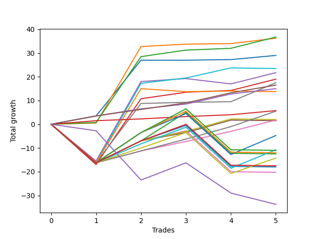

# Short Labrador 009 
- Symbol: ES_FOMC
- Date Range: 11/30/2022 - 12/14/2022
- Trading Period: 8:30-12:30
- Number of Trades: 5



| Name | Win Percent | Profit | Avg Profit / Trade | Avg Time / Trade |      | Name | Win Percent | Profit | Avg Profit / Trade | Avg Time / Trade |
| ---- | ----------- | ------ | ------------------ | ---------------- | ---- | ---- | ----------- | ------ | ------------------ | ---------------- |
| Sorted By <br> Profit | | | | | | Sorted By <br> Win Percentage ||||
| BB-20 U/L 2SD | 100.00 | 18375.00 | 3675.00 | 10:47 |     | BB-20 U/L 2SD | 100.00 | 18375.00 | 3675.00 | 10:47 |
| BB-20 U/L 1SD | 100.00 | 18125.00 | 3625.00 | 06:57 |     | BB-20 U/L 1SD | 100.00 | 18125.00 | 3625.00 | 06:57 |
| BB-20 Mid | 80.00 | 14500.00 | 2900.00 | 03:10 |     | TP-3 | 100.00 | 8250.00 | 1650.00 | 05:44 |
| BB-100 Mid | 60.00 | 11750.00 | 2350.00 | 29:37 |     | TP-2 | 100.00 | 7500.00 | 1500.00 | 05:26 |
| BB-50 Mid | 60.00 | 10875.00 | 2175.00 | 17:40 |     | TP-1 | 100.00 | 2875.00 | 575.00 | 02:48 |
| BB-20 U/L 2SD C | 80.00 | 9500.00 | 1900.00 | 17:26 |     | BB-20 Mid | 80.00 | 14500.00 | 2900.00 | 03:10 |
| V Mid | 80.00 | 8750.00 | 1750.00 | 15:47 |     | BB-20 U/L 2SD C | 80.00 | 9500.00 | 1900.00 | 17:26 |
| TP-3 | 100.00 | 8250.00 | 1650.00 | 05:44 |     | V Mid | 80.00 | 8750.00 | 1750.00 | 15:47 |
| TP-2 | 100.00 | 7500.00 | 1500.00 | 05:26 |     | TP-5 | 80.00 | 2750.00 | 550.00 | 18:29 |
| BB-200 Mid | 40.00 | 6875.00 | 1375.00 | 26:38 |     | TP-4 | 80.00 | 875.00 | 175.00 | 18:20 |
| TP-1 | 100.00 | 2875.00 | 575.00 | 02:48 |     | BB-100 Mid | 60.00 | 11750.00 | 2350.00 | 29:37 |
| TP-5 | 80.00 | 2750.00 | 550.00 | 18:29 |     | BB-50 Mid | 60.00 | 10875.00 | 2175.00 | 17:40 |
| V U/L 1SD | 60.00 | 1000.00 | 200.00 | 41:02 |     | V U/L 1SD | 60.00 | 1000.00 | 200.00 | 41:02 |
| TP-4 | 80.00 | 875.00 | 175.00 | 18:20 |     | BB-50 U/L 1SD | 60.00 | 750.00 | 150.00 | 39:51 |
| BB-50 U/L 1SD | 60.00 | 750.00 | 150.00 | 39:51 |     | TP-8 | 60.00 | -2375.00 | -475.00 | 31:09 |
| TP-8 | 60.00 | -2375.00 | -475.00 | 31:09 |     | TP-7 | 60.00 | -5375.00 | -1075.00 | 29:28 |
| TP-7 | 60.00 | -5375.00 | -1075.00 | 29:28 |     | TP-6 | 60.00 | -7125.00 | -1425.00 | 28:58 |
| TP-10 | 40.00 | -5500.00 | -1100.00 | 43:39 |     | BB-200 Mid | 40.00 | 6875.00 | 1375.00 | 26:38 |
| TP-9 | 40.00 | -6000.00 | -1200.00 | 42:23 |     | TP-10 | 40.00 | -5500.00 | -1100.00 | 43:39 |
| BB-200 U/L 2SD | 40.00 | -6250.00 | -1250.00 | 56:54 |     | TP-9 | 40.00 | -6000.00 | -1200.00 | 42:23 |
| TP-6 | 60.00 | -7125.00 | -1425.00 | 28:58 |     | BB-200 U/L 2SD | 40.00 | -6250.00 | -1250.00 | 56:54 |
| NEWFI 000 | 40.00 | -8750.00 | -1750.00 | 52:46 |     | NEWFI 000 | 40.00 | -8750.00 | -1750.00 | 52:46 |
| BB-100 U/L 2SD | 40.00 | -9000.00 | -1800.00 | 51:25 |     | BB-100 U/L 2SD | 40.00 | -9000.00 | -1800.00 | 51:25 |
| BB-50 U/L 2SD | 40.00 | -10125.00 | -2025.00 | 51:15 |     | BB-50 U/L 2SD | 40.00 | -10125.00 | -2025.00 | 51:15 |
| NEWFI 0000 | 20.00 | -16875.00 | -3375.00 | 35:51 |     | NEWFI 0000 | 20.00 | -16875.00 | -3375.00 | 35:51 |

## NO STOPLOSS

### Test BB-20 Mid
* Sell when price hits the middle line of the 20p bollinger
* No Stoploss
* Results:
```
Total Trades: 5
Percent Up: 20.00
Percent Down: 80.00
Total Points Moved Down: 29.00
Potential Profit: 14500.00
Total Points Ups: 0.00 Count Ups: 1
Total Points Downs: 29.00 Count Downs: 4
```

<details><summary>Trades</summary>

<code>In: 2022-05-25 11:34:00		Out: 2022-05-25 11:39:10		Total Position Time: 05:10		Total Move Down: 3.50		Total to Date: 3.50</code> <br />
<code>In: 2022-06-15 11:49:00		Out: 2022-06-15 11:52:35		Total Position Time: 03:35		Total Move Down: 23.50		Total to Date: 27.00</code> <br />
<code>In: 2022-11-02 08:52:00		Out: 2022-11-02 08:56:45		Total Position Time: 04:45		Total Move Down: -0.00		Total to Date: 27.00</code> <br />
<code>In: 2022-11-23 10:51:00		Out: 2022-11-23 10:52:10		Total Position Time: 01:10		Total Move Down: 0.25		Total to Date: 27.25</code> <br />
<code>In: 2022-11-23 11:31:00		Out: 2022-11-23 11:32:10		Total Position Time: 01:10		Total Move Down: 1.75		Total to Date: 29.00</code> <br />


</details>

### Test BB-20 U/L 1SD
* Sell when the price hits the lower line of the 20p 1std bollinger
* No Stoploss
* Results:
```
Total Trades: 5
Percent Up: 0.00
Percent Down: 100.00
Total Points Moved Down: 36.25
Potential Profit: 18125.00
Total Points Ups: 0.00 Count Ups: 0
Total Points Downs: 36.25 Count Downs: 5
```

<details><summary>Trades</summary>

<code>In: 2022-05-25 11:34:00		Out: 2022-05-25 11:49:55		Total Position Time: 15:55		Total Move Down: 0.50		Total to Date: 0.50</code> <br />
<code>In: 2022-06-15 11:49:00		Out: 2022-06-15 11:57:55		Total Position Time: 08:55		Total Move Down: 32.25		Total to Date: 32.75</code> <br />
<code>In: 2022-11-02 08:52:00		Out: 2022-11-02 08:57:05		Total Position Time: 05:05		Total Move Down: 1.00		Total to Date: 33.75</code> <br />
<code>In: 2022-11-23 10:51:00		Out: 2022-11-23 10:52:10		Total Position Time: 01:10		Total Move Down: 0.25		Total to Date: 34.00</code> <br />
<code>In: 2022-11-23 11:31:00		Out: 2022-11-23 11:34:40		Total Position Time: 03:40		Total Move Down: 2.25		Total to Date: 36.25</code> <br />


</details>

### Test BB-20 U/L 2SD
* Sell when the price hits the lower line of the 20p 2std bollinger
* No Stoploss
* Results:
```
Total Trades: 5
Percent Up: 0.00
Percent Down: 100.00
Total Points Moved Down: 36.75
Potential Profit: 18375.00
Total Points Ups: 0.00 Count Ups: 0
Total Points Downs: 36.75 Count Downs: 5
```

<details><summary>Trades</summary>

<code>In: 2022-05-25 11:34:00		Out: 2022-05-25 11:50:00		Total Position Time: 16:00		Total Move Down: 0.75		Total to Date: 0.75</code> <br />
<code>In: 2022-06-15 11:49:00		Out: 2022-06-15 12:13:05		Total Position Time: 24:05		Total Move Down: 27.75		Total to Date: 28.50</code> <br />
<code>In: 2022-11-02 08:52:00		Out: 2022-11-02 09:00:15		Total Position Time: 08:15		Total Move Down: 2.75		Total to Date: 31.25</code> <br />
<code>In: 2022-11-23 10:51:00		Out: 2022-11-23 10:52:30		Total Position Time: 01:30		Total Move Down: 0.75		Total to Date: 32.00</code> <br />
<code>In: 2022-11-23 11:31:00		Out: 2022-11-23 11:35:05		Total Position Time: 04:05		Total Move Down: 4.75		Total to Date: 36.75</code> <br />


</details>

### Test BB-20 U/L 2SD C
* Sell when the price hits the lower line of the 20p 2std bollinger
* No Stoploss
* Results:
```
Total Trades: 5
Percent Up: 20.00
Percent Down: 80.00
Total Points Moved Down: 19.00
Potential Profit: 9500.00
Total Points Ups: 17.00 Count Ups: 1
Total Points Downs: 36.00 Count Downs: 4
```

<details><summary>Trades</summary>

<code>In: 2022-05-25 11:34:00		Out: 2022-05-25 12:23:00		Total Position Time: 49:00		Total Move Down: -17.00		Total to Date: -17.00</code> <br />
<code>In: 2022-06-15 11:49:00		Out: 2022-06-15 12:13:05		Total Position Time: 24:05		Total Move Down: 27.75		Total to Date: 10.75</code> <br />
<code>In: 2022-11-02 08:52:00		Out: 2022-11-02 09:00:30		Total Position Time: 08:30		Total Move Down: 2.75		Total to Date: 13.50</code> <br />
<code>In: 2022-11-23 10:51:00		Out: 2022-11-23 10:52:30		Total Position Time: 01:30		Total Move Down: 0.75		Total to Date: 14.25</code> <br />
<code>In: 2022-11-23 11:31:00		Out: 2022-11-23 11:35:05		Total Position Time: 04:05		Total Move Down: 4.75		Total to Date: 19.00</code> <br />


</details>

### Test BB-50 Mid
* Sell when price hits the middle line of the 50p bollinger
* No Stoploss
* Results:
```
Total Trades: 5
Percent Up: 40.00
Percent Down: 60.00
Total Points Moved Down: 21.75
Potential Profit: 10875.00
Total Points Ups: 17.75 Count Ups: 2
Total Points Downs: 39.50 Count Downs: 3
```

<details><summary>Trades</summary>

<code>In: 2022-05-25 11:34:00		Out: 2022-05-25 12:34:20		Total Position Time: 60:20		Total Move Down: -15.50		Total to Date: -15.50</code> <br />
<code>In: 2022-06-15 11:49:00		Out: 2022-06-15 11:58:05		Total Position Time: 09:05		Total Move Down: 33.50		Total to Date: 18.00</code> <br />
<code>In: 2022-11-02 08:52:00		Out: 2022-11-02 08:57:25		Total Position Time: 05:25		Total Move Down: 1.25		Total to Date: 19.25</code> <br />
<code>In: 2022-11-23 10:51:00		Out: 2022-11-23 11:00:25		Total Position Time: 09:25		Total Move Down: -2.25		Total to Date: 17.00</code> <br />
<code>In: 2022-11-23 11:31:00		Out: 2022-11-23 11:35:05		Total Position Time: 04:05		Total Move Down: 4.75		Total to Date: 21.75</code> <br />


</details>

### Test BB-50 U/L 1SD
* Sell when the price hits the lower line of the 50p 1std bollinger
* No Stoploss
* Results:
```
Total Trades: 5
Percent Up: 40.00
Percent Down: 60.00
Total Points Moved Down: 1.50
Potential Profit: 750.00
Total Points Ups: 16.50 Count Ups: 2
Total Points Downs: 18.00 Count Downs: 3
```

<details><summary>Trades</summary>

<code>In: 2022-05-25 11:34:00		Out: 2022-05-25 12:34:55		Total Position Time: 60:55		Total Move Down: -16.25		Total to Date: -16.25</code> <br />
<code>In: 2022-06-15 11:49:00		Out: 2022-06-15 12:47:00		Total Position Time: 58:00		Total Move Down: 9.25		Total to Date: -7.00</code> <br />
<code>In: 2022-11-02 08:52:00		Out: 2022-11-02 09:01:25		Total Position Time: 09:25		Total Move Down: 3.50		Total to Date: -3.50</code> <br />
<code>In: 2022-11-23 10:51:00		Out: 2022-11-23 11:01:00		Total Position Time: 10:00		Total Move Down: 5.25		Total to Date: 1.75</code> <br />
<code>In: 2022-11-23 11:31:00		Out: 2022-11-23 12:31:55		Total Position Time: 60:55		Total Move Down: -0.25		Total to Date: 1.50</code> <br />


</details>

### Test BB-50 U/L 2SD
* Sell when the price hits the lower line of the 50p 2std bollinger
* No Stoploss
* Results:
```
Total Trades: 5
Percent Up: 60.00
Percent Down: 40.00
Total Points Moved Down: -20.25
Potential Profit: -10125.00
Total Points Ups: 33.75 Count Ups: 3
Total Points Downs: 13.50 Count Downs: 2
```

<details><summary>Trades</summary>

<code>In: 2022-05-25 11:34:00		Out: 2022-05-25 12:34:55		Total Position Time: 60:55		Total Move Down: -16.25		Total to Date: -16.25</code> <br />
<code>In: 2022-06-15 11:49:00		Out: 2022-06-15 12:47:00		Total Position Time: 58:00		Total Move Down: 9.25		Total to Date: -7.00</code> <br />
<code>In: 2022-11-02 08:52:00		Out: 2022-11-02 09:07:30		Total Position Time: 15:30		Total Move Down: 4.25		Total to Date: -2.75</code> <br />
<code>In: 2022-11-23 10:51:00		Out: 2022-11-23 11:51:55		Total Position Time: 60:55		Total Move Down: -17.25		Total to Date: -20.00</code> <br />
<code>In: 2022-11-23 11:31:00		Out: 2022-11-23 12:31:55		Total Position Time: 60:55		Total Move Down: -0.25		Total to Date: -20.25</code> <br />


</details>

### Test V Mid
* Sell when the price hits the middle line of the 1std VWAP
* No Stoploss
* Results:
```
Total Trades: 5
Percent Up: 20.00
Percent Down: 80.00
Total Points Moved Down: 17.50
Potential Profit: 8750.00
Total Points Ups: 16.25 Count Ups: 1
Total Points Downs: 33.75 Count Downs: 4
```

<details><summary>Trades</summary>

<code>In: 2022-05-25 11:34:00		Out: 2022-05-25 12:34:55		Total Position Time: 60:55		Total Move Down: -16.25		Total to Date: -16.25</code> <br />
<code>In: 2022-06-15 11:49:00		Out: 2022-06-15 11:54:50		Total Position Time: 05:50		Total Move Down: 25.00		Total to Date: 8.75</code> <br />
<code>In: 2022-11-02 08:52:00		Out: 2022-11-02 08:56:55		Total Position Time: 04:55		Total Move Down: 0.50		Total to Date: 9.25</code> <br />
<code>In: 2022-11-23 10:51:00		Out: 2022-11-23 10:52:10		Total Position Time: 01:10		Total Move Down: 0.25		Total to Date: 9.50</code> <br />
<code>In: 2022-11-23 11:31:00		Out: 2022-11-23 11:37:05		Total Position Time: 06:05		Total Move Down: 8.00		Total to Date: 17.50</code> <br />


</details>

### Test V U/L 1SD
* Sell when the price hits the lower line of the 1std VWAP
* No Stoploss
* Results:
```
Total Trades: 5
Percent Up: 40.00
Percent Down: 60.00
Total Points Moved Down: 2.00
Potential Profit: 1000.00
Total Points Ups: 16.50 Count Ups: 2
Total Points Downs: 18.50 Count Downs: 3
```

<details><summary>Trades</summary>

<code>In: 2022-05-25 11:34:00		Out: 2022-05-25 12:34:55		Total Position Time: 60:55		Total Move Down: -16.25		Total to Date: -16.25</code> <br />
<code>In: 2022-06-15 11:49:00		Out: 2022-06-15 12:47:00		Total Position Time: 58:00		Total Move Down: 9.25		Total to Date: -7.00</code> <br />
<code>In: 2022-11-02 08:52:00		Out: 2022-11-02 09:07:20		Total Position Time: 15:20		Total Move Down: 4.00		Total to Date: -3.00</code> <br />
<code>In: 2022-11-23 10:51:00		Out: 2022-11-23 11:01:00		Total Position Time: 10:00		Total Move Down: 5.25		Total to Date: 2.25</code> <br />
<code>In: 2022-11-23 11:31:00		Out: 2022-11-23 12:31:55		Total Position Time: 60:55		Total Move Down: -0.25		Total to Date: 2.00</code> <br />


</details>

### Test BB-100 Mid
* Move to BB100 Mid
* No Stoploss
* Results:
```
Total Trades: 5
Percent Up: 40.00
Percent Down: 60.00
Total Points Moved Down: 23.50
Potential Profit: 11750.00
Total Points Ups: 16.50 Count Ups: 2
Total Points Downs: 40.00 Count Downs: 3
```

<details><summary>Trades</summary>

<code>In: 2022-05-25 11:34:00		Out: 2022-05-25 12:34:55		Total Position Time: 60:55		Total Move Down: -16.25		Total to Date: -16.25</code> <br />
<code>In: 2022-06-15 11:49:00		Out: 2022-06-15 11:58:05		Total Position Time: 09:05		Total Move Down: 33.50		Total to Date: 17.25</code> <br />
<code>In: 2022-11-02 08:52:00		Out: 2022-11-02 08:59:15		Total Position Time: 07:15		Total Move Down: 2.25		Total to Date: 19.50</code> <br />
<code>In: 2022-11-23 10:51:00		Out: 2022-11-23 11:00:55		Total Position Time: 09:55		Total Move Down: 4.25		Total to Date: 23.75</code> <br />
<code>In: 2022-11-23 11:31:00		Out: 2022-11-23 12:31:55		Total Position Time: 60:55		Total Move Down: -0.25		Total to Date: 23.50</code> <br />


</details>

### Test BB-100 U/L 2SD
* Move to BB100 Upper Band
* No Stoploss
* Results:
```
Total Trades: 5
Percent Up: 60.00
Percent Down: 40.00
Total Points Moved Down: -18.00
Potential Profit: -9000.00
Total Points Ups: 33.75 Count Ups: 3
Total Points Downs: 15.75 Count Downs: 2
```

<details><summary>Trades</summary>

<code>In: 2022-05-25 11:34:00		Out: 2022-05-25 12:34:55		Total Position Time: 60:55		Total Move Down: -16.25		Total to Date: -16.25</code> <br />
<code>In: 2022-06-15 11:49:00		Out: 2022-06-15 12:47:00		Total Position Time: 58:00		Total Move Down: 9.25		Total to Date: -7.00</code> <br />
<code>In: 2022-11-02 08:52:00		Out: 2022-11-02 09:08:20		Total Position Time: 16:20		Total Move Down: 6.50		Total to Date: -0.50</code> <br />
<code>In: 2022-11-23 10:51:00		Out: 2022-11-23 11:51:55		Total Position Time: 60:55		Total Move Down: -17.25		Total to Date: -17.75</code> <br />
<code>In: 2022-11-23 11:31:00		Out: 2022-11-23 12:31:55		Total Position Time: 60:55		Total Move Down: -0.25		Total to Date: -18.00</code> <br />


</details>

### Test BB-200 Mid
* Move to BB200 Mid
* No Stoploss
* Results:
```
Total Trades: 5
Percent Up: 60.00
Percent Down: 40.00
Total Points Moved Down: 13.75
Potential Profit: 6875.00
Total Points Ups: 17.75 Count Ups: 3
Total Points Downs: 31.50 Count Downs: 2
```

<details><summary>Trades</summary>

<code>In: 2022-05-25 11:34:00		Out: 2022-05-25 12:34:55		Total Position Time: 60:55		Total Move Down: -16.25		Total to Date: -16.25</code> <br />
<code>In: 2022-06-15 11:49:00		Out: 2022-06-15 11:58:00		Total Position Time: 09:00		Total Move Down: 31.25		Total to Date: 15.00</code> <br />
<code>In: 2022-11-02 08:52:00		Out: 2022-11-02 08:53:10		Total Position Time: 01:10		Total Move Down: -1.25		Total to Date: 13.75</code> <br />
<code>In: 2022-11-23 10:51:00		Out: 2022-11-23 10:52:10		Total Position Time: 01:10		Total Move Down: 0.25		Total to Date: 14.00</code> <br />
<code>In: 2022-11-23 11:31:00		Out: 2022-11-23 12:31:55		Total Position Time: 60:55		Total Move Down: -0.25		Total to Date: 13.75</code> <br />


</details>

### Test BB-200 U/L 2SD
* Move to BB200 Upper Band
* No Stoploss
* Results:
```
Total Trades: 5
Percent Up: 60.00
Percent Down: 40.00
Total Points Moved Down: -12.50
Potential Profit: -6250.00
Total Points Ups: 33.75 Count Ups: 3
Total Points Downs: 21.25 Count Downs: 2
```

<details><summary>Trades</summary>

<code>In: 2022-05-25 11:34:00		Out: 2022-05-25 12:34:55		Total Position Time: 60:55		Total Move Down: -16.25		Total to Date: -16.25</code> <br />
<code>In: 2022-06-15 11:49:00		Out: 2022-06-15 12:47:00		Total Position Time: 58:00		Total Move Down: 9.25		Total to Date: -7.00</code> <br />
<code>In: 2022-11-02 08:52:00		Out: 2022-11-02 09:35:45		Total Position Time: 43:45		Total Move Down: 12.00		Total to Date: 5.00</code> <br />
<code>In: 2022-11-23 10:51:00		Out: 2022-11-23 11:51:55		Total Position Time: 60:55		Total Move Down: -17.25		Total to Date: -12.25</code> <br />
<code>In: 2022-11-23 11:31:00		Out: 2022-11-23 12:31:55		Total Position Time: 60:55		Total Move Down: -0.25		Total to Date: -12.50</code> <br />


</details>

## TAKE PROFIT

### Test TP-1
* Take Profit of 1 Point
* No Stoploss
* Results:
```
Total Trades: 5
Percent Up: 0.00
Percent Down: 100.00
Total Points Moved Down: 5.75
Potential Profit: 2875.00
Total Points Ups: 0.00 Count Ups: 0
Total Points Downs: 5.75 Count Downs: 5
```

<details><summary>Trades</summary>

<code>In: 2022-05-25 11:34:00		Out: 2022-05-25 11:39:05		Total Position Time: 05:05		Total Move Down: 1.50		Total to Date: 1.50</code> <br />
<code>In: 2022-06-15 11:49:00		Out: 2022-06-15 11:50:10		Total Position Time: 01:10		Total Move Down: 0.75		Total to Date: 2.25</code> <br />
<code>In: 2022-11-02 08:52:00		Out: 2022-11-02 08:57:05		Total Position Time: 05:05		Total Move Down: 1.00		Total to Date: 3.25</code> <br />
<code>In: 2022-11-23 10:51:00		Out: 2022-11-23 10:52:30		Total Position Time: 01:30		Total Move Down: 0.75		Total to Date: 4.00</code> <br />
<code>In: 2022-11-23 11:31:00		Out: 2022-11-23 11:32:10		Total Position Time: 01:10		Total Move Down: 1.75		Total to Date: 5.75</code> <br />


</details>

### Test TP-2
* Take Profit of 2 Point
* No Stoploss
* Results:
```
Total Trades: 5
Percent Up: 0.00
Percent Down: 100.00
Total Points Moved Down: 15.00
Potential Profit: 7500.00
Total Points Ups: 0.00 Count Ups: 0
Total Points Downs: 15.00 Count Downs: 5
```

<details><summary>Trades</summary>

<code>In: 2022-05-25 11:34:00		Out: 2022-05-25 11:39:10		Total Position Time: 05:10		Total Move Down: 3.50		Total to Date: 3.50</code> <br />
<code>In: 2022-06-15 11:49:00		Out: 2022-06-15 11:50:15		Total Position Time: 01:15		Total Move Down: 3.00		Total to Date: 6.50</code> <br />
<code>In: 2022-11-02 08:52:00		Out: 2022-11-02 08:59:10		Total Position Time: 07:10		Total Move Down: 2.00		Total to Date: 8.50</code> <br />
<code>In: 2022-11-23 10:51:00		Out: 2022-11-23 11:00:55		Total Position Time: 09:55		Total Move Down: 4.25		Total to Date: 12.75</code> <br />
<code>In: 2022-11-23 11:31:00		Out: 2022-11-23 11:34:40		Total Position Time: 03:40		Total Move Down: 2.25		Total to Date: 15.00</code> <br />


</details>

### Test TP-3
* Take Profit of 3 Point
* No Stoploss
* Results:
```
Total Trades: 5
Percent Up: 0.00
Percent Down: 100.00
Total Points Moved Down: 16.50
Potential Profit: 8250.00
Total Points Ups: 0.00 Count Ups: 0
Total Points Downs: 16.50 Count Downs: 5
```

<details><summary>Trades</summary>

<code>In: 2022-05-25 11:34:00		Out: 2022-05-25 11:39:10		Total Position Time: 05:10		Total Move Down: 3.50		Total to Date: 3.50</code> <br />
<code>In: 2022-06-15 11:49:00		Out: 2022-06-15 11:50:20		Total Position Time: 01:20		Total Move Down: 2.75		Total to Date: 6.25</code> <br />
<code>In: 2022-11-02 08:52:00		Out: 2022-11-02 09:00:30		Total Position Time: 08:30		Total Move Down: 2.75		Total to Date: 9.00</code> <br />
<code>In: 2022-11-23 10:51:00		Out: 2022-11-23 11:00:55		Total Position Time: 09:55		Total Move Down: 4.25		Total to Date: 13.25</code> <br />
<code>In: 2022-11-23 11:31:00		Out: 2022-11-23 11:34:45		Total Position Time: 03:45		Total Move Down: 3.25		Total to Date: 16.50</code> <br />


</details>

### Test TP-4
* Take Profit of 4 Point
* No Stoploss
* Results:
```
Total Trades: 5
Percent Up: 20.00
Percent Down: 80.00
Total Points Moved Down: 1.75
Potential Profit: 875.00
Total Points Ups: 16.25 Count Ups: 1
Total Points Downs: 18.00 Count Downs: 4
```

<details><summary>Trades</summary>

<code>In: 2022-05-25 11:34:00		Out: 2022-05-25 12:34:55		Total Position Time: 60:55		Total Move Down: -16.25		Total to Date: -16.25</code> <br />
<code>In: 2022-06-15 11:49:00		Out: 2022-06-15 11:50:25		Total Position Time: 01:25		Total Move Down: 5.00		Total to Date: -11.25</code> <br />
<code>In: 2022-11-02 08:52:00		Out: 2022-11-02 09:07:20		Total Position Time: 15:20		Total Move Down: 4.00		Total to Date: -7.25</code> <br />
<code>In: 2022-11-23 10:51:00		Out: 2022-11-23 11:00:55		Total Position Time: 09:55		Total Move Down: 4.25		Total to Date: -3.00</code> <br />
<code>In: 2022-11-23 11:31:00		Out: 2022-11-23 11:35:05		Total Position Time: 04:05		Total Move Down: 4.75		Total to Date: 1.75</code> <br />


</details>

### Test TP-5
* Take Profit of 5 Point
* No Stoploss
* Results:
```
Total Trades: 5
Percent Up: 20.00
Percent Down: 80.00
Total Points Moved Down: 5.50
Potential Profit: 2750.00
Total Points Ups: 16.25 Count Ups: 1
Total Points Downs: 21.75 Count Downs: 4
```

<details><summary>Trades</summary>

<code>In: 2022-05-25 11:34:00		Out: 2022-05-25 12:34:55		Total Position Time: 60:55		Total Move Down: -16.25		Total to Date: -16.25</code> <br />
<code>In: 2022-06-15 11:49:00		Out: 2022-06-15 11:50:25		Total Position Time: 01:25		Total Move Down: 5.00		Total to Date: -11.25</code> <br />
<code>In: 2022-11-02 08:52:00		Out: 2022-11-02 09:07:55		Total Position Time: 15:55		Total Move Down: 5.00		Total to Date: -6.25</code> <br />
<code>In: 2022-11-23 10:51:00		Out: 2022-11-23 11:01:00		Total Position Time: 10:00		Total Move Down: 5.25		Total to Date: -1.00</code> <br />
<code>In: 2022-11-23 11:31:00		Out: 2022-11-23 11:35:10		Total Position Time: 04:10		Total Move Down: 6.50		Total to Date: 5.50</code> <br />


</details>

### Test TP-6
* Take Profit of 6 Point
* No Stoploss
* Results:
```
Total Trades: 5
Percent Up: 40.00
Percent Down: 60.00
Total Points Moved Down: -14.25
Potential Profit: -7125.00
Total Points Ups: 33.50 Count Ups: 2
Total Points Downs: 19.25 Count Downs: 3
```

<details><summary>Trades</summary>

<code>In: 2022-05-25 11:34:00		Out: 2022-05-25 12:34:55		Total Position Time: 60:55		Total Move Down: -16.25		Total to Date: -16.25</code> <br />
<code>In: 2022-06-15 11:49:00		Out: 2022-06-15 11:51:30		Total Position Time: 02:30		Total Move Down: 6.25		Total to Date: -10.00</code> <br />
<code>In: 2022-11-02 08:52:00		Out: 2022-11-02 09:08:20		Total Position Time: 16:20		Total Move Down: 6.50		Total to Date: -3.50</code> <br />
<code>In: 2022-11-23 10:51:00		Out: 2022-11-23 11:51:55		Total Position Time: 60:55		Total Move Down: -17.25		Total to Date: -20.75</code> <br />
<code>In: 2022-11-23 11:31:00		Out: 2022-11-23 11:35:10		Total Position Time: 04:10		Total Move Down: 6.50		Total to Date: -14.25</code> <br />


</details>

### Test TP-7
* Take Profit of 7 Point
* No Stoploss
* Results:
```
Total Trades: 5
Percent Up: 40.00
Percent Down: 60.00
Total Points Moved Down: -10.75
Potential Profit: -5375.00
Total Points Ups: 33.50 Count Ups: 2
Total Points Downs: 22.75 Count Downs: 3
```

<details><summary>Trades</summary>

<code>In: 2022-05-25 11:34:00		Out: 2022-05-25 12:34:55		Total Position Time: 60:55		Total Move Down: -16.25		Total to Date: -16.25</code> <br />
<code>In: 2022-06-15 11:49:00		Out: 2022-06-15 11:52:05		Total Position Time: 03:05		Total Move Down: 8.00		Total to Date: -8.25</code> <br />
<code>In: 2022-11-02 08:52:00		Out: 2022-11-02 09:08:25		Total Position Time: 16:25		Total Move Down: 7.00		Total to Date: -1.25</code> <br />
<code>In: 2022-11-23 10:51:00		Out: 2022-11-23 11:51:55		Total Position Time: 60:55		Total Move Down: -17.25		Total to Date: -18.50</code> <br />
<code>In: 2022-11-23 11:31:00		Out: 2022-11-23 11:37:00		Total Position Time: 06:00		Total Move Down: 7.75		Total to Date: -10.75</code> <br />


</details>

### Test TP-8
* Take Profit of 8 Point
* No Stoploss
* Results:
```
Total Trades: 5
Percent Up: 40.00
Percent Down: 60.00
Total Points Moved Down: -4.75
Potential Profit: -2375.00
Total Points Ups: 33.50 Count Ups: 2
Total Points Downs: 28.75 Count Downs: 3
```

<details><summary>Trades</summary>

<code>In: 2022-05-25 11:34:00		Out: 2022-05-25 12:34:55		Total Position Time: 60:55		Total Move Down: -16.25		Total to Date: -16.25</code> <br />
<code>In: 2022-06-15 11:49:00		Out: 2022-06-15 11:52:10		Total Position Time: 03:10		Total Move Down: 12.75		Total to Date: -3.50</code> <br />
<code>In: 2022-11-02 08:52:00		Out: 2022-11-02 09:16:40		Total Position Time: 24:40		Total Move Down: 8.00		Total to Date: 4.50</code> <br />
<code>In: 2022-11-23 10:51:00		Out: 2022-11-23 11:51:55		Total Position Time: 60:55		Total Move Down: -17.25		Total to Date: -12.75</code> <br />
<code>In: 2022-11-23 11:31:00		Out: 2022-11-23 11:37:05		Total Position Time: 06:05		Total Move Down: 8.00		Total to Date: -4.75</code> <br />


</details>

### Test TP-9
* Take Profit of 9 Point
* No Stoploss
* Results:
```
Total Trades: 5
Percent Up: 60.00
Percent Down: 40.00
Total Points Moved Down: -12.00
Potential Profit: -6000.00
Total Points Ups: 33.75 Count Ups: 3
Total Points Downs: 21.75 Count Downs: 2
```

<details><summary>Trades</summary>

<code>In: 2022-05-25 11:34:00		Out: 2022-05-25 12:34:55		Total Position Time: 60:55		Total Move Down: -16.25		Total to Date: -16.25</code> <br />
<code>In: 2022-06-15 11:49:00		Out: 2022-06-15 11:52:10		Total Position Time: 03:10		Total Move Down: 12.75		Total to Date: -3.50</code> <br />
<code>In: 2022-11-02 08:52:00		Out: 2022-11-02 09:18:00		Total Position Time: 26:00		Total Move Down: 9.00		Total to Date: 5.50</code> <br />
<code>In: 2022-11-23 10:51:00		Out: 2022-11-23 11:51:55		Total Position Time: 60:55		Total Move Down: -17.25		Total to Date: -11.75</code> <br />
<code>In: 2022-11-23 11:31:00		Out: 2022-11-23 12:31:55		Total Position Time: 60:55		Total Move Down: -0.25		Total to Date: -12.00</code> <br />


</details>

### Test TP-10
* Take Profit of 10 Point
* No Stoploss
* Results:
```
Total Trades: 5
Percent Up: 60.00
Percent Down: 40.00
Total Points Moved Down: -11.00
Potential Profit: -5500.00
Total Points Ups: 33.75 Count Ups: 3
Total Points Downs: 22.75 Count Downs: 2
```

<details><summary>Trades</summary>

<code>In: 2022-05-25 11:34:00		Out: 2022-05-25 12:34:55		Total Position Time: 60:55		Total Move Down: -16.25		Total to Date: -16.25</code> <br />
<code>In: 2022-06-15 11:49:00		Out: 2022-06-15 11:52:10		Total Position Time: 03:10		Total Move Down: 12.75		Total to Date: -3.50</code> <br />
<code>In: 2022-11-02 08:52:00		Out: 2022-11-02 09:24:20		Total Position Time: 32:20		Total Move Down: 10.00		Total to Date: 6.50</code> <br />
<code>In: 2022-11-23 10:51:00		Out: 2022-11-23 11:51:55		Total Position Time: 60:55		Total Move Down: -17.25		Total to Date: -10.75</code> <br />
<code>In: 2022-11-23 11:31:00		Out: 2022-11-23 12:31:55		Total Position Time: 60:55		Total Move Down: -0.25		Total to Date: -11.00</code> <br />


</details>

## Indicator Exits

### Test NEWFI 000
* Newfi 0000
* No Stoploss
* Results:
```
Total Trades: 5
Percent Up: 60.00
Percent Down: 40.00
Total Points Moved Down: -17.50
Potential Profit: -8750.00
Total Points Ups: 33.75 Count Ups: 3
Total Points Downs: 16.25 Count Downs: 2
```

<details><summary>Trades</summary>

<code>In: 2022-05-25 11:34:00		Out: 2022-05-25 12:34:55		Total Position Time: 60:55		Total Move Down: -16.25		Total to Date: -16.25</code> <br />
<code>In: 2022-06-15 11:49:00		Out: 2022-06-15 12:47:00		Total Position Time: 58:00		Total Move Down: 9.25		Total to Date: -7.00</code> <br />
<code>In: 2022-11-02 08:52:00		Out: 2022-11-02 09:15:05		Total Position Time: 23:05		Total Move Down: 7.00		Total to Date: 0.00</code> <br />
<code>In: 2022-11-23 10:51:00		Out: 2022-11-23 11:51:55		Total Position Time: 60:55		Total Move Down: -17.25		Total to Date: -17.25</code> <br />
<code>In: 2022-11-23 11:31:00		Out: 2022-11-23 12:31:55		Total Position Time: 60:55		Total Move Down: -0.25		Total to Date: -17.50</code> <br />


</details>

### Test NEWFI 0000
* Newfi 0000
* No Stoploss
* Results:
```
Total Trades: 5
Percent Up: 80.00
Percent Down: 20.00
Total Points Moved Down: -33.75
Potential Profit: -16875.00
Total Points Ups: 41.00 Count Ups: 4
Total Points Downs: 7.25 Count Downs: 1
```

<details><summary>Trades</summary>

<code>In: 2022-05-25 11:34:00		Out: 2022-05-25 11:46:05		Total Position Time: 12:05		Total Move Down: -2.75		Total to Date: -2.75</code> <br />
<code>In: 2022-06-15 11:49:00		Out: 2022-06-15 12:32:05		Total Position Time: 43:05		Total Move Down: -20.75		Total to Date: -23.50</code> <br />
<code>In: 2022-11-02 08:52:00		Out: 2022-11-02 09:52:55		Total Position Time: 60:55		Total Move Down: 7.25		Total to Date: -16.25</code> <br />
<code>In: 2022-11-23 10:51:00		Out: 2022-11-23 11:08:05		Total Position Time: 17:05		Total Move Down: -12.75		Total to Date: -29.00</code> <br />
<code>In: 2022-11-23 11:31:00		Out: 2022-11-23 12:17:05		Total Position Time: 46:05		Total Move Down: -4.75		Total to Date: -33.75</code> <br />


</details>