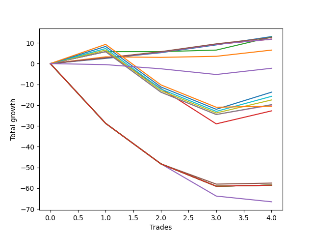

# Short Labrador 011 
- Symbol: ES_FOMC
- Date Range: 11/30/2022 - 12/14/2022
- Trading Period: 8:30-12:30
- Number of Trades: 4



| Name | Win Percent | Profit | Avg Profit / Trade | Avg Time / Trade |      | Name | Win Percent | Profit | Avg Profit / Trade | Avg Time / Trade |
| ---- | ----------- | ------ | ------------------ | ---------------- | ---- | ---- | ----------- | ------ | ------------------ | ---------------- |
| Sorted By <br> Profit | | | | | | Sorted By <br> Win Percentage ||||
| BB-20 Mid | 100.00 | 6500.00 | 1625.00 | 02:41 |     | BB-20 Mid | 100.00 | 6500.00 | 1625.00 | 02:41 |
| BB-20 U/L 2SD | 75.00 | 6375.00 | 1593.75 | 12:00 |     | TP-3 | 100.00 | 6250.00 | 1562.50 | 02:38 |
| TP-3 | 100.00 | 6250.00 | 1562.50 | 02:38 |     | TP-2 | 100.00 | 5875.00 | 1468.75 | 02:25 |
| TP-2 | 100.00 | 5875.00 | 1468.75 | 02:25 |     | TP-1 | 100.00 | 5875.00 | 1468.75 | 02:25 |
| TP-1 | 100.00 | 5875.00 | 1468.75 | 02:25 |     | BB-20 U/L 2SD | 75.00 | 6375.00 | 1593.75 | 12:00 |
| BB-20 U/L 1SD | 75.00 | 3250.00 | 812.50 | 11:40 |     | BB-20 U/L 1SD | 75.00 | 3250.00 | 812.50 | 11:40 |
| NEWFI 0000 | 25.00 | -1125.00 | -281.25 | 08:05 |     | TP-8 | 50.00 | -6875.00 | -1718.75 | 36:53 |
| TP-8 | 50.00 | -6875.00 | -1718.75 | 36:53 |     | TP-7 | 50.00 | -7875.00 | -1968.75 | 36:47 |
| TP-7 | 50.00 | -7875.00 | -1968.75 | 36:47 |     | TP-6 | 50.00 | -8750.00 | -2187.50 | 35:28 |
| TP-6 | 50.00 | -8750.00 | -2187.50 | 35:28 |     | TP-5 | 50.00 | -9875.00 | -2468.75 | 32:41 |
| TP-5 | 50.00 | -9875.00 | -2468.75 | 32:41 |     | TP-4 | 50.00 | -10000.00 | -2500.00 | 32:40 |
| TP-4 | 50.00 | -10000.00 | -2500.00 | 32:40 |     | TP-9 | 50.00 | -10250.00 | -2562.50 | 48:16 |
| TP-9 | 50.00 | -10250.00 | -2562.50 | 48:16 |     | BB-20 U/L 2SD C | 50.00 | -11375.00 | -2843.75 | 28:30 |
| BB-20 U/L 2SD C | 50.00 | -11375.00 | -2843.75 | 28:30 |     | NEWFI 0000 | 25.00 | -1125.00 | -281.25 | 08:05 |
| BB-50 U/L 1SD | 25.00 | -28750.00 | -7187.50 | 59:43 |     | BB-50 U/L 1SD | 25.00 | -28750.00 | -7187.50 | 59:43 |
| NEWFI 000 | 25.00 | -29250.00 | -7312.50 | 60:26 |     | NEWFI 000 | 25.00 | -29250.00 | -7312.50 | 60:26 |
| TP-10 | 25.00 | -29250.00 | -7312.50 | 60:26 |     | TP-10 | 25.00 | -29250.00 | -7312.50 | 60:26 |
| BB-200 U/L 2SD | 25.00 | -29250.00 | -7312.50 | 60:26 |     | BB-200 U/L 2SD | 25.00 | -29250.00 | -7312.50 | 60:26 |
| BB-200 Mid | 25.00 | -29250.00 | -7312.50 | 60:26 |     | BB-200 Mid | 25.00 | -29250.00 | -7312.50 | 60:26 |
| BB-100 U/L 2SD | 25.00 | -29250.00 | -7312.50 | 60:26 |     | BB-100 U/L 2SD | 25.00 | -29250.00 | -7312.50 | 60:26 |
| BB-100 Mid | 25.00 | -29250.00 | -7312.50 | 60:26 |     | BB-100 Mid | 25.00 | -29250.00 | -7312.50 | 60:26 |
| V U/L 1SD | 25.00 | -29250.00 | -7312.50 | 60:26 |     | V U/L 1SD | 25.00 | -29250.00 | -7312.50 | 60:26 |
| V Mid | 25.00 | -29250.00 | -7312.50 | 60:26 |     | V Mid | 25.00 | -29250.00 | -7312.50 | 60:26 |
| BB-50 U/L 2SD | 25.00 | -29250.00 | -7312.50 | 60:26 |     | BB-50 U/L 2SD | 25.00 | -29250.00 | -7312.50 | 60:26 |
| BB-50 Mid | 0.00 | -33250.00 | -8312.50 | 57:48 |     | BB-50 Mid | 0.00 | -33250.00 | -8312.50 | 57:48 |

## NO STOPLOSS

### Test BB-20 Mid
* Sell when price hits the middle line of the 20p bollinger
* No Stoploss
* Results:
```
Total Trades: 4
Percent Up: 0.00
Percent Down: 100.00
Total Points Moved Down: 13.00
Potential Profit: 6500.00
Total Points Ups: 0.00 Count Ups: 0
Total Points Downs: 13.00 Count Downs: 4
```

<details><summary>Trades</summary>

<code>In: 2022-11-30 11:32:00		Out: 2022-11-30 11:33:20		Total Position Time: 01:20		Total Move Down: 2.50		Total to Date: 2.50</code> <br />
<code>In: 2022-05-25 11:33:00		Out: 2022-05-25 11:39:10		Total Position Time: 06:10		Total Move Down: 2.75		Total to Date: 5.25</code> <br />
<code>In: 2022-05-25 11:39:00		Out: 2022-05-25 11:40:10		Total Position Time: 01:10		Total Move Down: 3.75		Total to Date: 9.00</code> <br />
<code>In: 2022-07-06 11:48:00		Out: 2022-07-06 11:50:05		Total Position Time: 02:05		Total Move Down: 4.00		Total to Date: 13.00</code> <br />


</details>

### Test BB-20 U/L 1SD
* Sell when the price hits the lower line of the 20p 1std bollinger
* No Stoploss
* Results:
```
Total Trades: 4
Percent Up: 25.00
Percent Down: 75.00
Total Points Moved Down: 6.50
Potential Profit: 3250.00
Total Points Ups: 0.25 Count Ups: 1
Total Points Downs: 6.75 Count Downs: 3
```

<details><summary>Trades</summary>

<code>In: 2022-11-30 11:32:00		Out: 2022-11-30 11:38:05		Total Position Time: 06:05		Total Move Down: 3.25		Total to Date: 3.25</code> <br />
<code>In: 2022-05-25 11:33:00		Out: 2022-05-25 11:49:55		Total Position Time: 16:55		Total Move Down: -0.25		Total to Date: 3.00</code> <br />
<code>In: 2022-05-25 11:39:00		Out: 2022-05-25 11:49:55		Total Position Time: 10:55		Total Move Down: 0.50		Total to Date: 3.50</code> <br />
<code>In: 2022-07-06 11:48:00		Out: 2022-07-06 12:00:45		Total Position Time: 12:45		Total Move Down: 3.00		Total to Date: 6.50</code> <br />


</details>

### Test BB-20 U/L 2SD
* Sell when the price hits the lower line of the 20p 2std bollinger
* No Stoploss
* Results:
```
Total Trades: 4
Percent Up: 25.00
Percent Down: 75.00
Total Points Moved Down: 12.75
Potential Profit: 6375.00
Total Points Ups: 0.00 Count Ups: 1
Total Points Downs: 12.75 Count Downs: 3
```

<details><summary>Trades</summary>

<code>In: 2022-11-30 11:32:00		Out: 2022-11-30 11:38:35		Total Position Time: 06:35		Total Move Down: 5.75		Total to Date: 5.75</code> <br />
<code>In: 2022-05-25 11:33:00		Out: 2022-05-25 11:50:00		Total Position Time: 17:00		Total Move Down: -0.00		Total to Date: 5.75</code> <br />
<code>In: 2022-05-25 11:39:00		Out: 2022-05-25 11:50:00		Total Position Time: 11:00		Total Move Down: 0.75		Total to Date: 6.50</code> <br />
<code>In: 2022-07-06 11:48:00		Out: 2022-07-06 12:01:25		Total Position Time: 13:25		Total Move Down: 6.25		Total to Date: 12.75</code> <br />


</details>

### Test BB-20 U/L 2SD C
* Sell when the price hits the lower line of the 20p 2std bollinger
* No Stoploss
* Results:
```
Total Trades: 4
Percent Up: 50.00
Percent Down: 50.00
Total Points Moved Down: -22.75
Potential Profit: -11375.00
Total Points Ups: 34.75 Count Ups: 2
Total Points Downs: 12.00 Count Downs: 2
```

<details><summary>Trades</summary>

<code>In: 2022-11-30 11:32:00		Out: 2022-11-30 11:38:35		Total Position Time: 06:35		Total Move Down: 5.75		Total to Date: 5.75</code> <br />
<code>In: 2022-05-25 11:33:00		Out: 2022-05-25 12:23:00		Total Position Time: 50:00		Total Move Down: -17.75		Total to Date: -12.00</code> <br />
<code>In: 2022-05-25 11:39:00		Out: 2022-05-25 12:23:00		Total Position Time: 44:00		Total Move Down: -17.00		Total to Date: -29.00</code> <br />
<code>In: 2022-07-06 11:48:00		Out: 2022-07-06 12:01:25		Total Position Time: 13:25		Total Move Down: 6.25		Total to Date: -22.75</code> <br />


</details>

### Test BB-50 Mid
* Sell when price hits the middle line of the 50p bollinger
* No Stoploss
* Results:
```
Total Trades: 4
Percent Up: 100.00
Percent Down: 0.00
Total Points Moved Down: -66.50
Potential Profit: -33250.00
Total Points Ups: 66.50 Count Ups: 4
Total Points Downs: 0.00 Count Downs: 0
```

<details><summary>Trades</summary>

<code>In: 2022-11-30 11:32:00		Out: 2022-11-30 12:32:55		Total Position Time: 60:55		Total Move Down: -28.75		Total to Date: -28.75</code> <br />
<code>In: 2022-05-25 11:33:00		Out: 2022-05-25 12:33:55		Total Position Time: 60:55		Total Move Down: -19.50		Total to Date: -48.25</code> <br />
<code>In: 2022-05-25 11:39:00		Out: 2022-05-25 12:34:20		Total Position Time: 55:20		Total Move Down: -15.50		Total to Date: -63.75</code> <br />
<code>In: 2022-07-06 11:48:00		Out: 2022-07-06 12:42:05		Total Position Time: 54:05		Total Move Down: -2.75		Total to Date: -66.50</code> <br />


</details>

### Test BB-50 U/L 1SD
* Sell when the price hits the lower line of the 50p 1std bollinger
* No Stoploss
* Results:
```
Total Trades: 4
Percent Up: 75.00
Percent Down: 25.00
Total Points Moved Down: -57.50
Potential Profit: -28750.00
Total Points Ups: 58.00 Count Ups: 3
Total Points Downs: 0.50 Count Downs: 1
```

<details><summary>Trades</summary>

<code>In: 2022-11-30 11:32:00		Out: 2022-11-30 12:32:55		Total Position Time: 60:55		Total Move Down: -28.75		Total to Date: -28.75</code> <br />
<code>In: 2022-05-25 11:33:00		Out: 2022-05-25 12:33:55		Total Position Time: 60:55		Total Move Down: -19.50		Total to Date: -48.25</code> <br />
<code>In: 2022-05-25 11:39:00		Out: 2022-05-25 12:37:05		Total Position Time: 58:05		Total Move Down: -9.75		Total to Date: -58.00</code> <br />
<code>In: 2022-07-06 11:48:00		Out: 2022-07-06 12:47:00		Total Position Time: 59:00		Total Move Down: 0.50		Total to Date: -57.50</code> <br />


</details>

### Test BB-50 U/L 2SD
* Sell when the price hits the lower line of the 50p 2std bollinger
* No Stoploss
* Results:
```
Total Trades: 4
Percent Up: 75.00
Percent Down: 25.00
Total Points Moved Down: -58.50
Potential Profit: -29250.00
Total Points Ups: 59.00 Count Ups: 3
Total Points Downs: 0.50 Count Downs: 1
```

<details><summary>Trades</summary>

<code>In: 2022-11-30 11:32:00		Out: 2022-11-30 12:32:55		Total Position Time: 60:55		Total Move Down: -28.75		Total to Date: -28.75</code> <br />
<code>In: 2022-05-25 11:33:00		Out: 2022-05-25 12:33:55		Total Position Time: 60:55		Total Move Down: -19.50		Total to Date: -48.25</code> <br />
<code>In: 2022-05-25 11:39:00		Out: 2022-05-25 12:39:55		Total Position Time: 60:55		Total Move Down: -10.75		Total to Date: -59.00</code> <br />
<code>In: 2022-07-06 11:48:00		Out: 2022-07-06 12:47:00		Total Position Time: 59:00		Total Move Down: 0.50		Total to Date: -58.50</code> <br />


</details>

### Test V Mid
* Sell when the price hits the middle line of the 1std VWAP
* No Stoploss
* Results:
```
Total Trades: 4
Percent Up: 75.00
Percent Down: 25.00
Total Points Moved Down: -58.50
Potential Profit: -29250.00
Total Points Ups: 59.00 Count Ups: 3
Total Points Downs: 0.50 Count Downs: 1
```

<details><summary>Trades</summary>

<code>In: 2022-11-30 11:32:00		Out: 2022-11-30 12:32:55		Total Position Time: 60:55		Total Move Down: -28.75		Total to Date: -28.75</code> <br />
<code>In: 2022-05-25 11:33:00		Out: 2022-05-25 12:33:55		Total Position Time: 60:55		Total Move Down: -19.50		Total to Date: -48.25</code> <br />
<code>In: 2022-05-25 11:39:00		Out: 2022-05-25 12:39:55		Total Position Time: 60:55		Total Move Down: -10.75		Total to Date: -59.00</code> <br />
<code>In: 2022-07-06 11:48:00		Out: 2022-07-06 12:47:00		Total Position Time: 59:00		Total Move Down: 0.50		Total to Date: -58.50</code> <br />


</details>

### Test V U/L 1SD
* Sell when the price hits the lower line of the 1std VWAP
* No Stoploss
* Results:
```
Total Trades: 4
Percent Up: 75.00
Percent Down: 25.00
Total Points Moved Down: -58.50
Potential Profit: -29250.00
Total Points Ups: 59.00 Count Ups: 3
Total Points Downs: 0.50 Count Downs: 1
```

<details><summary>Trades</summary>

<code>In: 2022-11-30 11:32:00		Out: 2022-11-30 12:32:55		Total Position Time: 60:55		Total Move Down: -28.75		Total to Date: -28.75</code> <br />
<code>In: 2022-05-25 11:33:00		Out: 2022-05-25 12:33:55		Total Position Time: 60:55		Total Move Down: -19.50		Total to Date: -48.25</code> <br />
<code>In: 2022-05-25 11:39:00		Out: 2022-05-25 12:39:55		Total Position Time: 60:55		Total Move Down: -10.75		Total to Date: -59.00</code> <br />
<code>In: 2022-07-06 11:48:00		Out: 2022-07-06 12:47:00		Total Position Time: 59:00		Total Move Down: 0.50		Total to Date: -58.50</code> <br />


</details>

### Test BB-100 Mid
* Move to BB100 Mid
* No Stoploss
* Results:
```
Total Trades: 4
Percent Up: 75.00
Percent Down: 25.00
Total Points Moved Down: -58.50
Potential Profit: -29250.00
Total Points Ups: 59.00 Count Ups: 3
Total Points Downs: 0.50 Count Downs: 1
```

<details><summary>Trades</summary>

<code>In: 2022-11-30 11:32:00		Out: 2022-11-30 12:32:55		Total Position Time: 60:55		Total Move Down: -28.75		Total to Date: -28.75</code> <br />
<code>In: 2022-05-25 11:33:00		Out: 2022-05-25 12:33:55		Total Position Time: 60:55		Total Move Down: -19.50		Total to Date: -48.25</code> <br />
<code>In: 2022-05-25 11:39:00		Out: 2022-05-25 12:39:55		Total Position Time: 60:55		Total Move Down: -10.75		Total to Date: -59.00</code> <br />
<code>In: 2022-07-06 11:48:00		Out: 2022-07-06 12:47:00		Total Position Time: 59:00		Total Move Down: 0.50		Total to Date: -58.50</code> <br />


</details>

### Test BB-100 U/L 2SD
* Move to BB100 Upper Band
* No Stoploss
* Results:
```
Total Trades: 4
Percent Up: 75.00
Percent Down: 25.00
Total Points Moved Down: -58.50
Potential Profit: -29250.00
Total Points Ups: 59.00 Count Ups: 3
Total Points Downs: 0.50 Count Downs: 1
```

<details><summary>Trades</summary>

<code>In: 2022-11-30 11:32:00		Out: 2022-11-30 12:32:55		Total Position Time: 60:55		Total Move Down: -28.75		Total to Date: -28.75</code> <br />
<code>In: 2022-05-25 11:33:00		Out: 2022-05-25 12:33:55		Total Position Time: 60:55		Total Move Down: -19.50		Total to Date: -48.25</code> <br />
<code>In: 2022-05-25 11:39:00		Out: 2022-05-25 12:39:55		Total Position Time: 60:55		Total Move Down: -10.75		Total to Date: -59.00</code> <br />
<code>In: 2022-07-06 11:48:00		Out: 2022-07-06 12:47:00		Total Position Time: 59:00		Total Move Down: 0.50		Total to Date: -58.50</code> <br />


</details>

### Test BB-200 Mid
* Move to BB200 Mid
* No Stoploss
* Results:
```
Total Trades: 4
Percent Up: 75.00
Percent Down: 25.00
Total Points Moved Down: -58.50
Potential Profit: -29250.00
Total Points Ups: 59.00 Count Ups: 3
Total Points Downs: 0.50 Count Downs: 1
```

<details><summary>Trades</summary>

<code>In: 2022-11-30 11:32:00		Out: 2022-11-30 12:32:55		Total Position Time: 60:55		Total Move Down: -28.75		Total to Date: -28.75</code> <br />
<code>In: 2022-05-25 11:33:00		Out: 2022-05-25 12:33:55		Total Position Time: 60:55		Total Move Down: -19.50		Total to Date: -48.25</code> <br />
<code>In: 2022-05-25 11:39:00		Out: 2022-05-25 12:39:55		Total Position Time: 60:55		Total Move Down: -10.75		Total to Date: -59.00</code> <br />
<code>In: 2022-07-06 11:48:00		Out: 2022-07-06 12:47:00		Total Position Time: 59:00		Total Move Down: 0.50		Total to Date: -58.50</code> <br />


</details>

### Test BB-200 U/L 2SD
* Move to BB200 Upper Band
* No Stoploss
* Results:
```
Total Trades: 4
Percent Up: 75.00
Percent Down: 25.00
Total Points Moved Down: -58.50
Potential Profit: -29250.00
Total Points Ups: 59.00 Count Ups: 3
Total Points Downs: 0.50 Count Downs: 1
```

<details><summary>Trades</summary>

<code>In: 2022-11-30 11:32:00		Out: 2022-11-30 12:32:55		Total Position Time: 60:55		Total Move Down: -28.75		Total to Date: -28.75</code> <br />
<code>In: 2022-05-25 11:33:00		Out: 2022-05-25 12:33:55		Total Position Time: 60:55		Total Move Down: -19.50		Total to Date: -48.25</code> <br />
<code>In: 2022-05-25 11:39:00		Out: 2022-05-25 12:39:55		Total Position Time: 60:55		Total Move Down: -10.75		Total to Date: -59.00</code> <br />
<code>In: 2022-07-06 11:48:00		Out: 2022-07-06 12:47:00		Total Position Time: 59:00		Total Move Down: 0.50		Total to Date: -58.50</code> <br />


</details>

## TAKE PROFIT

### Test TP-1
* Take Profit of 1 Point
* No Stoploss
* Results:
```
Total Trades: 4
Percent Up: 0.00
Percent Down: 100.00
Total Points Moved Down: 11.75
Potential Profit: 5875.00
Total Points Ups: 0.00 Count Ups: 0
Total Points Downs: 11.75 Count Downs: 4
```

<details><summary>Trades</summary>

<code>In: 2022-11-30 11:32:00		Out: 2022-11-30 11:33:10		Total Position Time: 01:10		Total Move Down: 2.75		Total to Date: 2.75</code> <br />
<code>In: 2022-05-25 11:33:00		Out: 2022-05-25 11:39:10		Total Position Time: 06:10		Total Move Down: 2.75		Total to Date: 5.50</code> <br />
<code>In: 2022-05-25 11:39:00		Out: 2022-05-25 11:40:10		Total Position Time: 01:10		Total Move Down: 3.75		Total to Date: 9.25</code> <br />
<code>In: 2022-07-06 11:48:00		Out: 2022-07-06 11:49:10		Total Position Time: 01:10		Total Move Down: 2.50		Total to Date: 11.75</code> <br />


</details>

### Test TP-2
* Take Profit of 2 Point
* No Stoploss
* Results:
```
Total Trades: 4
Percent Up: 0.00
Percent Down: 100.00
Total Points Moved Down: 11.75
Potential Profit: 5875.00
Total Points Ups: 0.00 Count Ups: 0
Total Points Downs: 11.75 Count Downs: 4
```

<details><summary>Trades</summary>

<code>In: 2022-11-30 11:32:00		Out: 2022-11-30 11:33:10		Total Position Time: 01:10		Total Move Down: 2.75		Total to Date: 2.75</code> <br />
<code>In: 2022-05-25 11:33:00		Out: 2022-05-25 11:39:10		Total Position Time: 06:10		Total Move Down: 2.75		Total to Date: 5.50</code> <br />
<code>In: 2022-05-25 11:39:00		Out: 2022-05-25 11:40:10		Total Position Time: 01:10		Total Move Down: 3.75		Total to Date: 9.25</code> <br />
<code>In: 2022-07-06 11:48:00		Out: 2022-07-06 11:49:10		Total Position Time: 01:10		Total Move Down: 2.50		Total to Date: 11.75</code> <br />


</details>

### Test TP-3
* Take Profit of 3 Point
* No Stoploss
* Results:
```
Total Trades: 4
Percent Up: 0.00
Percent Down: 100.00
Total Points Moved Down: 12.50
Potential Profit: 6250.00
Total Points Ups: 0.00 Count Ups: 0
Total Points Downs: 12.50 Count Downs: 4
```

<details><summary>Trades</summary>

<code>In: 2022-11-30 11:32:00		Out: 2022-11-30 11:33:10		Total Position Time: 01:10		Total Move Down: 2.75		Total to Date: 2.75</code> <br />
<code>In: 2022-05-25 11:33:00		Out: 2022-05-25 11:39:55		Total Position Time: 06:55		Total Move Down: 3.00		Total to Date: 5.75</code> <br />
<code>In: 2022-05-25 11:39:00		Out: 2022-05-25 11:40:10		Total Position Time: 01:10		Total Move Down: 3.75		Total to Date: 9.50</code> <br />
<code>In: 2022-07-06 11:48:00		Out: 2022-07-06 11:49:20		Total Position Time: 01:20		Total Move Down: 3.00		Total to Date: 12.50</code> <br />


</details>

### Test TP-4
* Take Profit of 4 Point
* No Stoploss
* Results:
```
Total Trades: 4
Percent Up: 50.00
Percent Down: 50.00
Total Points Moved Down: -20.00
Potential Profit: -10000.00
Total Points Ups: 30.25 Count Ups: 2
Total Points Downs: 10.25 Count Downs: 2
```

<details><summary>Trades</summary>

<code>In: 2022-11-30 11:32:00		Out: 2022-11-30 11:38:35		Total Position Time: 06:35		Total Move Down: 5.75		Total to Date: 5.75</code> <br />
<code>In: 2022-05-25 11:33:00		Out: 2022-05-25 12:33:55		Total Position Time: 60:55		Total Move Down: -19.50		Total to Date: -13.75</code> <br />
<code>In: 2022-05-25 11:39:00		Out: 2022-05-25 12:39:55		Total Position Time: 60:55		Total Move Down: -10.75		Total to Date: -24.50</code> <br />
<code>In: 2022-07-06 11:48:00		Out: 2022-07-06 11:50:15		Total Position Time: 02:15		Total Move Down: 4.50		Total to Date: -20.00</code> <br />


</details>

### Test TP-5
* Take Profit of 5 Point
* No Stoploss
* Results:
```
Total Trades: 4
Percent Up: 50.00
Percent Down: 50.00
Total Points Moved Down: -19.75
Potential Profit: -9875.00
Total Points Ups: 30.25 Count Ups: 2
Total Points Downs: 10.50 Count Downs: 2
```

<details><summary>Trades</summary>

<code>In: 2022-11-30 11:32:00		Out: 2022-11-30 11:38:35		Total Position Time: 06:35		Total Move Down: 5.75		Total to Date: 5.75</code> <br />
<code>In: 2022-05-25 11:33:00		Out: 2022-05-25 12:33:55		Total Position Time: 60:55		Total Move Down: -19.50		Total to Date: -13.75</code> <br />
<code>In: 2022-05-25 11:39:00		Out: 2022-05-25 12:39:55		Total Position Time: 60:55		Total Move Down: -10.75		Total to Date: -24.50</code> <br />
<code>In: 2022-07-06 11:48:00		Out: 2022-07-06 11:50:20		Total Position Time: 02:20		Total Move Down: 4.75		Total to Date: -19.75</code> <br />


</details>

### Test TP-6
* Take Profit of 6 Point
* No Stoploss
* Results:
```
Total Trades: 4
Percent Up: 50.00
Percent Down: 50.00
Total Points Moved Down: -17.50
Potential Profit: -8750.00
Total Points Ups: 30.25 Count Ups: 2
Total Points Downs: 12.75 Count Downs: 2
```

<details><summary>Trades</summary>

<code>In: 2022-11-30 11:32:00		Out: 2022-11-30 11:38:40		Total Position Time: 06:40		Total Move Down: 6.50		Total to Date: 6.50</code> <br />
<code>In: 2022-05-25 11:33:00		Out: 2022-05-25 12:33:55		Total Position Time: 60:55		Total Move Down: -19.50		Total to Date: -13.00</code> <br />
<code>In: 2022-05-25 11:39:00		Out: 2022-05-25 12:39:55		Total Position Time: 60:55		Total Move Down: -10.75		Total to Date: -23.75</code> <br />
<code>In: 2022-07-06 11:48:00		Out: 2022-07-06 12:01:25		Total Position Time: 13:25		Total Move Down: 6.25		Total to Date: -17.50</code> <br />


</details>

### Test TP-7
* Take Profit of 7 Point
* No Stoploss
* Results:
```
Total Trades: 4
Percent Up: 50.00
Percent Down: 50.00
Total Points Moved Down: -15.75
Potential Profit: -7875.00
Total Points Ups: 30.25 Count Ups: 2
Total Points Downs: 14.50 Count Downs: 2
```

<details><summary>Trades</summary>

<code>In: 2022-11-30 11:32:00		Out: 2022-11-30 11:43:50		Total Position Time: 11:50		Total Move Down: 7.25		Total to Date: 7.25</code> <br />
<code>In: 2022-05-25 11:33:00		Out: 2022-05-25 12:33:55		Total Position Time: 60:55		Total Move Down: -19.50		Total to Date: -12.25</code> <br />
<code>In: 2022-05-25 11:39:00		Out: 2022-05-25 12:39:55		Total Position Time: 60:55		Total Move Down: -10.75		Total to Date: -23.00</code> <br />
<code>In: 2022-07-06 11:48:00		Out: 2022-07-06 12:01:30		Total Position Time: 13:30		Total Move Down: 7.25		Total to Date: -15.75</code> <br />


</details>

### Test TP-8
* Take Profit of 8 Point
* No Stoploss
* Results:
```
Total Trades: 4
Percent Up: 50.00
Percent Down: 50.00
Total Points Moved Down: -13.75
Potential Profit: -6875.00
Total Points Ups: 30.25 Count Ups: 2
Total Points Downs: 16.50 Count Downs: 2
```

<details><summary>Trades</summary>

<code>In: 2022-11-30 11:32:00		Out: 2022-11-30 11:44:05		Total Position Time: 12:05		Total Move Down: 8.25		Total to Date: 8.25</code> <br />
<code>In: 2022-05-25 11:33:00		Out: 2022-05-25 12:33:55		Total Position Time: 60:55		Total Move Down: -19.50		Total to Date: -11.25</code> <br />
<code>In: 2022-05-25 11:39:00		Out: 2022-05-25 12:39:55		Total Position Time: 60:55		Total Move Down: -10.75		Total to Date: -22.00</code> <br />
<code>In: 2022-07-06 11:48:00		Out: 2022-07-06 12:01:40		Total Position Time: 13:40		Total Move Down: 8.25		Total to Date: -13.75</code> <br />


</details>

### Test TP-9
* Take Profit of 9 Point
* No Stoploss
* Results:
```
Total Trades: 4
Percent Up: 50.00
Percent Down: 50.00
Total Points Moved Down: -20.50
Potential Profit: -10250.00
Total Points Ups: 30.25 Count Ups: 2
Total Points Downs: 9.75 Count Downs: 2
```

<details><summary>Trades</summary>

<code>In: 2022-11-30 11:32:00		Out: 2022-11-30 11:44:15		Total Position Time: 12:15		Total Move Down: 9.25		Total to Date: 9.25</code> <br />
<code>In: 2022-05-25 11:33:00		Out: 2022-05-25 12:33:55		Total Position Time: 60:55		Total Move Down: -19.50		Total to Date: -10.25</code> <br />
<code>In: 2022-05-25 11:39:00		Out: 2022-05-25 12:39:55		Total Position Time: 60:55		Total Move Down: -10.75		Total to Date: -21.00</code> <br />
<code>In: 2022-07-06 11:48:00		Out: 2022-07-06 12:47:00		Total Position Time: 59:00		Total Move Down: 0.50		Total to Date: -20.50</code> <br />


</details>

### Test TP-10
* Take Profit of 10 Point
* No Stoploss
* Results:
```
Total Trades: 4
Percent Up: 75.00
Percent Down: 25.00
Total Points Moved Down: -58.50
Potential Profit: -29250.00
Total Points Ups: 59.00 Count Ups: 3
Total Points Downs: 0.50 Count Downs: 1
```

<details><summary>Trades</summary>

<code>In: 2022-11-30 11:32:00		Out: 2022-11-30 12:32:55		Total Position Time: 60:55		Total Move Down: -28.75		Total to Date: -28.75</code> <br />
<code>In: 2022-05-25 11:33:00		Out: 2022-05-25 12:33:55		Total Position Time: 60:55		Total Move Down: -19.50		Total to Date: -48.25</code> <br />
<code>In: 2022-05-25 11:39:00		Out: 2022-05-25 12:39:55		Total Position Time: 60:55		Total Move Down: -10.75		Total to Date: -59.00</code> <br />
<code>In: 2022-07-06 11:48:00		Out: 2022-07-06 12:47:00		Total Position Time: 59:00		Total Move Down: 0.50		Total to Date: -58.50</code> <br />


</details>

## Indicator Exits

### Test NEWFI 000
* Newfi 0000
* No Stoploss
* Results:
```
Total Trades: 4
Percent Up: 75.00
Percent Down: 25.00
Total Points Moved Down: -58.50
Potential Profit: -29250.00
Total Points Ups: 59.00 Count Ups: 3
Total Points Downs: 0.50 Count Downs: 1
```

<details><summary>Trades</summary>

<code>In: 2022-11-30 11:32:00		Out: 2022-11-30 12:32:55		Total Position Time: 60:55		Total Move Down: -28.75		Total to Date: -28.75</code> <br />
<code>In: 2022-05-25 11:33:00		Out: 2022-05-25 12:33:55		Total Position Time: 60:55		Total Move Down: -19.50		Total to Date: -48.25</code> <br />
<code>In: 2022-05-25 11:39:00		Out: 2022-05-25 12:39:55		Total Position Time: 60:55		Total Move Down: -10.75		Total to Date: -59.00</code> <br />
<code>In: 2022-07-06 11:48:00		Out: 2022-07-06 12:47:00		Total Position Time: 59:00		Total Move Down: 0.50		Total to Date: -58.50</code> <br />


</details>

### Test NEWFI 0000
* Newfi 0000
* No Stoploss
* Results:
```
Total Trades: 4
Percent Up: 75.00
Percent Down: 25.00
Total Points Moved Down: -2.25
Potential Profit: -1125.00
Total Points Ups: 5.25 Count Ups: 3
Total Points Downs: 3.00 Count Downs: 1
```

<details><summary>Trades</summary>

<code>In: 2022-11-30 11:32:00		Out: 2022-11-30 11:55:05		Total Position Time: 23:05		Total Move Down: -0.50		Total to Date: -0.50</code> <br />
<code>In: 2022-05-25 11:33:00		Out: 2022-05-25 11:34:05		Total Position Time: 01:05		Total Move Down: -2.00		Total to Date: -2.50</code> <br />
<code>In: 2022-05-25 11:39:00		Out: 2022-05-25 11:46:05		Total Position Time: 07:05		Total Move Down: -2.75		Total to Date: -5.25</code> <br />
<code>In: 2022-07-06 11:48:00		Out: 2022-07-06 11:49:05		Total Position Time: 01:05		Total Move Down: 3.00		Total to Date: -2.25</code> <br />


</details>