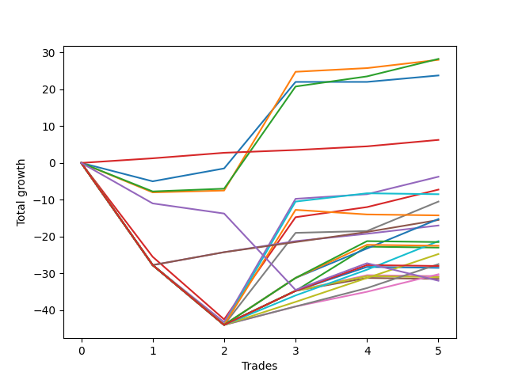

# Short Labrador 012 
- Symbol: ES_FOMC
- Date Range: 11/30/2022 - 12/14/2022
- Trading Period: 8:30-12:30
- Number of Trades: 5



| Name | Win Percent | Profit | Avg Profit / Trade | Avg Time / Trade |      | Name | Win Percent | Profit | Avg Profit / Trade | Avg Time / Trade |
| ---- | ----------- | ------ | ------------------ | ---------------- | ---- | ---- | ----------- | ------ | ------------------ | ---------------- |
| Sorted By <br> Profit | | | | | | Sorted By <br> Win Percentage ||||
| BB-20 U/L 2SD | 80.00 | 14125.00 | 2825.00 | 15:41 |     | TP-1 | 100.00 | 3125.00 | 625.00 | 02:45 |
| BB-20 U/L 1SD | 80.00 | 14000.00 | 2800.00 | 11:54 |     | BB-20 U/L 2SD | 80.00 | 14125.00 | 2825.00 | 15:41 |
| BB-20 Mid | 60.00 | 11875.00 | 2375.00 | 05:58 |     | BB-20 U/L 1SD | 80.00 | 14000.00 | 2800.00 | 11:54 |
| TP-1 | 100.00 | 3125.00 | 625.00 | 02:45 |     | TP-3 | 80.00 | -7750.00 | -1550.00 | 15:56 |
| BB-50 Mid | 60.00 | -1875.00 | -375.00 | 27:58 |     | TP-2 | 80.00 | -8500.00 | -1700.00 | 15:38 |
| BB-20 U/L 2SD C | 60.00 | -3625.00 | -725.00 | 28:56 |     | BB-20 Mid | 60.00 | 11875.00 | 2375.00 | 05:58 |
| BB-100 Mid | 40.00 | -4250.00 | -850.00 | 39:49 |     | BB-50 Mid | 60.00 | -1875.00 | -375.00 | 27:58 |
| V Mid | 60.00 | -5250.00 | -1050.00 | 27:44 |     | BB-20 U/L 2SD C | 60.00 | -3625.00 | -725.00 | 28:56 |
| BB-200 Mid | 20.00 | -7125.00 | -1425.00 | 38:35 |     | V Mid | 60.00 | -5250.00 | -1050.00 | 27:44 |
| TP-8 | 60.00 | -7625.00 | -1525.00 | 31:09 |     | TP-8 | 60.00 | -7625.00 | -1525.00 | 31:09 |
| TP-3 | 80.00 | -7750.00 | -1550.00 | 15:56 |     | TP-7 | 60.00 | -10625.00 | -2125.00 | 29:28 |
| TP-2 | 80.00 | -8500.00 | -1700.00 | 15:38 |     | TP-6 | 60.00 | -12375.00 | -2475.00 | 28:58 |
| TP-7 | 60.00 | -10625.00 | -2125.00 | 29:28 |     | TP-5 | 60.00 | -13750.00 | -2750.00 | 28:40 |
| TP-10 | 40.00 | -10750.00 | -2150.00 | 43:39 |     | TP-4 | 60.00 | -15125.00 | -3025.00 | 28:32 |
| TP-9 | 40.00 | -11250.00 | -2250.00 | 42:23 |     | BB-100 Mid | 40.00 | -4250.00 | -850.00 | 39:49 |
| BB-200 U/L 2SD | 40.00 | -11500.00 | -2300.00 | 56:54 |     | TP-10 | 40.00 | -10750.00 | -2150.00 | 43:39 |
| TP-6 | 60.00 | -12375.00 | -2475.00 | 28:58 |     | TP-9 | 40.00 | -11250.00 | -2250.00 | 42:23 |
| TP-5 | 60.00 | -13750.00 | -2750.00 | 28:40 |     | BB-200 U/L 2SD | 40.00 | -11500.00 | -2300.00 | 56:54 |
| NEWFI 000 | 40.00 | -14000.00 | -2800.00 | 52:46 |     | NEWFI 000 | 40.00 | -14000.00 | -2800.00 | 52:46 |
| BB-100 U/L 2SD | 40.00 | -14250.00 | -2850.00 | 51:25 |     | BB-100 U/L 2SD | 40.00 | -14250.00 | -2850.00 | 51:25 |
| TP-4 | 60.00 | -15125.00 | -3025.00 | 28:32 |     | BB-50 U/L 2SD | 40.00 | -15375.00 | -3075.00 | 51:15 |
| BB-50 U/L 2SD | 40.00 | -15375.00 | -3075.00 | 51:15 |     | V U/L 1SD | 40.00 | -15500.00 | -3100.00 | 51:13 |
| V U/L 1SD | 40.00 | -15500.00 | -3100.00 | 51:13 |     | BB-50 U/L 1SD | 40.00 | -15750.00 | -3150.00 | 50:02 |
| BB-50 U/L 1SD | 40.00 | -15750.00 | -3150.00 | 50:02 |     | BB-200 Mid | 20.00 | -7125.00 | -1425.00 | 38:35 |
| NEWFI 0000 | 20.00 | -16000.00 | -3200.00 | 33:39 |     | NEWFI 0000 | 20.00 | -16000.00 | -3200.00 | 33:39 |

## NO STOPLOSS

### Test BB-20 Mid
* Sell when price hits the middle line of the 20p bollinger
* No Stoploss
* Results:
```
Total Trades: 5
Percent Up: 40.00
Percent Down: 60.00
Total Points Moved Down: 23.75
Potential Profit: 11875.00
Total Points Ups: 5.00 Count Ups: 2
Total Points Downs: 28.75 Count Downs: 3
```

<details><summary>Trades</summary>

<code>In: 2022-05-25 11:24:00		Out: 2022-05-25 11:39:10		Total Position Time: 15:10		Total Move Down: -5.00		Total to Date: -5.00</code> <br />
<code>In: 2022-05-25 11:34:00		Out: 2022-05-25 11:39:10		Total Position Time: 05:10		Total Move Down: 3.50		Total to Date: -1.50</code> <br />
<code>In: 2022-06-15 11:49:00		Out: 2022-06-15 11:52:35		Total Position Time: 03:35		Total Move Down: 23.50		Total to Date: 22.00</code> <br />
<code>In: 2022-11-02 08:52:00		Out: 2022-11-02 08:56:45		Total Position Time: 04:45		Total Move Down: -0.00		Total to Date: 22.00</code> <br />
<code>In: 2022-11-23 11:31:00		Out: 2022-11-23 11:32:10		Total Position Time: 01:10		Total Move Down: 1.75		Total to Date: 23.75</code> <br />


</details>

### Test BB-20 U/L 1SD
* Sell when the price hits the lower line of the 20p 1std bollinger
* No Stoploss
* Results:
```
Total Trades: 5
Percent Up: 20.00
Percent Down: 80.00
Total Points Moved Down: 28.00
Potential Profit: 14000.00
Total Points Ups: 8.00 Count Ups: 1
Total Points Downs: 36.00 Count Downs: 4
```

<details><summary>Trades</summary>

<code>In: 2022-05-25 11:24:00		Out: 2022-05-25 11:49:55		Total Position Time: 25:55		Total Move Down: -8.00		Total to Date: -8.00</code> <br />
<code>In: 2022-05-25 11:34:00		Out: 2022-05-25 11:49:55		Total Position Time: 15:55		Total Move Down: 0.50		Total to Date: -7.50</code> <br />
<code>In: 2022-06-15 11:49:00		Out: 2022-06-15 11:57:55		Total Position Time: 08:55		Total Move Down: 32.25		Total to Date: 24.75</code> <br />
<code>In: 2022-11-02 08:52:00		Out: 2022-11-02 08:57:05		Total Position Time: 05:05		Total Move Down: 1.00		Total to Date: 25.75</code> <br />
<code>In: 2022-11-23 11:31:00		Out: 2022-11-23 11:34:40		Total Position Time: 03:40		Total Move Down: 2.25		Total to Date: 28.00</code> <br />


</details>

### Test BB-20 U/L 2SD
* Sell when the price hits the lower line of the 20p 2std bollinger
* No Stoploss
* Results:
```
Total Trades: 5
Percent Up: 20.00
Percent Down: 80.00
Total Points Moved Down: 28.25
Potential Profit: 14125.00
Total Points Ups: 7.75 Count Ups: 1
Total Points Downs: 36.00 Count Downs: 4
```

<details><summary>Trades</summary>

<code>In: 2022-05-25 11:24:00		Out: 2022-05-25 11:50:00		Total Position Time: 26:00		Total Move Down: -7.75		Total to Date: -7.75</code> <br />
<code>In: 2022-05-25 11:34:00		Out: 2022-05-25 11:50:00		Total Position Time: 16:00		Total Move Down: 0.75		Total to Date: -7.00</code> <br />
<code>In: 2022-06-15 11:49:00		Out: 2022-06-15 12:13:05		Total Position Time: 24:05		Total Move Down: 27.75		Total to Date: 20.75</code> <br />
<code>In: 2022-11-02 08:52:00		Out: 2022-11-02 09:00:15		Total Position Time: 08:15		Total Move Down: 2.75		Total to Date: 23.50</code> <br />
<code>In: 2022-11-23 11:31:00		Out: 2022-11-23 11:35:05		Total Position Time: 04:05		Total Move Down: 4.75		Total to Date: 28.25</code> <br />


</details>

### Test BB-20 U/L 2SD C
* Sell when the price hits the lower line of the 20p 2std bollinger
* No Stoploss
* Results:
```
Total Trades: 5
Percent Up: 40.00
Percent Down: 60.00
Total Points Moved Down: -7.25
Potential Profit: -3625.00
Total Points Ups: 42.50 Count Ups: 2
Total Points Downs: 35.25 Count Downs: 3
```

<details><summary>Trades</summary>

<code>In: 2022-05-25 11:24:00		Out: 2022-05-25 12:23:00		Total Position Time: 59:00		Total Move Down: -25.50		Total to Date: -25.50</code> <br />
<code>In: 2022-05-25 11:34:00		Out: 2022-05-25 12:23:00		Total Position Time: 49:00		Total Move Down: -17.00		Total to Date: -42.50</code> <br />
<code>In: 2022-06-15 11:49:00		Out: 2022-06-15 12:13:05		Total Position Time: 24:05		Total Move Down: 27.75		Total to Date: -14.75</code> <br />
<code>In: 2022-11-02 08:52:00		Out: 2022-11-02 09:00:30		Total Position Time: 08:30		Total Move Down: 2.75		Total to Date: -12.00</code> <br />
<code>In: 2022-11-23 11:31:00		Out: 2022-11-23 11:35:05		Total Position Time: 04:05		Total Move Down: 4.75		Total to Date: -7.25</code> <br />


</details>

### Test BB-50 Mid
* Sell when price hits the middle line of the 50p bollinger
* No Stoploss
* Results:
```
Total Trades: 5
Percent Up: 40.00
Percent Down: 60.00
Total Points Moved Down: -3.75
Potential Profit: -1875.00
Total Points Ups: 43.25 Count Ups: 2
Total Points Downs: 39.50 Count Downs: 3
```

<details><summary>Trades</summary>

<code>In: 2022-05-25 11:24:00		Out: 2022-05-25 12:24:55		Total Position Time: 60:55		Total Move Down: -27.75		Total to Date: -27.75</code> <br />
<code>In: 2022-05-25 11:34:00		Out: 2022-05-25 12:34:20		Total Position Time: 60:20		Total Move Down: -15.50		Total to Date: -43.25</code> <br />
<code>In: 2022-06-15 11:49:00		Out: 2022-06-15 11:58:05		Total Position Time: 09:05		Total Move Down: 33.50		Total to Date: -9.75</code> <br />
<code>In: 2022-11-02 08:52:00		Out: 2022-11-02 08:57:25		Total Position Time: 05:25		Total Move Down: 1.25		Total to Date: -8.50</code> <br />
<code>In: 2022-11-23 11:31:00		Out: 2022-11-23 11:35:05		Total Position Time: 04:05		Total Move Down: 4.75		Total to Date: -3.75</code> <br />


</details>

### Test BB-50 U/L 1SD
* Sell when the price hits the lower line of the 50p 1std bollinger
* No Stoploss
* Results:
```
Total Trades: 5
Percent Up: 60.00
Percent Down: 40.00
Total Points Moved Down: -31.50
Potential Profit: -15750.00
Total Points Ups: 44.25 Count Ups: 3
Total Points Downs: 12.75 Count Downs: 2
```

<details><summary>Trades</summary>

<code>In: 2022-05-25 11:24:00		Out: 2022-05-25 12:24:55		Total Position Time: 60:55		Total Move Down: -27.75		Total to Date: -27.75</code> <br />
<code>In: 2022-05-25 11:34:00		Out: 2022-05-25 12:34:55		Total Position Time: 60:55		Total Move Down: -16.25		Total to Date: -44.00</code> <br />
<code>In: 2022-06-15 11:49:00		Out: 2022-06-15 12:47:00		Total Position Time: 58:00		Total Move Down: 9.25		Total to Date: -34.75</code> <br />
<code>In: 2022-11-02 08:52:00		Out: 2022-11-02 09:01:25		Total Position Time: 09:25		Total Move Down: 3.50		Total to Date: -31.25</code> <br />
<code>In: 2022-11-23 11:31:00		Out: 2022-11-23 12:31:55		Total Position Time: 60:55		Total Move Down: -0.25		Total to Date: -31.50</code> <br />


</details>

### Test BB-50 U/L 2SD
* Sell when the price hits the lower line of the 50p 2std bollinger
* No Stoploss
* Results:
```
Total Trades: 5
Percent Up: 60.00
Percent Down: 40.00
Total Points Moved Down: -30.75
Potential Profit: -15375.00
Total Points Ups: 44.25 Count Ups: 3
Total Points Downs: 13.50 Count Downs: 2
```

<details><summary>Trades</summary>

<code>In: 2022-05-25 11:24:00		Out: 2022-05-25 12:24:55		Total Position Time: 60:55		Total Move Down: -27.75		Total to Date: -27.75</code> <br />
<code>In: 2022-05-25 11:34:00		Out: 2022-05-25 12:34:55		Total Position Time: 60:55		Total Move Down: -16.25		Total to Date: -44.00</code> <br />
<code>In: 2022-06-15 11:49:00		Out: 2022-06-15 12:47:00		Total Position Time: 58:00		Total Move Down: 9.25		Total to Date: -34.75</code> <br />
<code>In: 2022-11-02 08:52:00		Out: 2022-11-02 09:07:30		Total Position Time: 15:30		Total Move Down: 4.25		Total to Date: -30.50</code> <br />
<code>In: 2022-11-23 11:31:00		Out: 2022-11-23 12:31:55		Total Position Time: 60:55		Total Move Down: -0.25		Total to Date: -30.75</code> <br />


</details>

### Test V Mid
* Sell when the price hits the middle line of the 1std VWAP
* No Stoploss
* Results:
```
Total Trades: 5
Percent Up: 40.00
Percent Down: 60.00
Total Points Moved Down: -10.50
Potential Profit: -5250.00
Total Points Ups: 44.00 Count Ups: 2
Total Points Downs: 33.50 Count Downs: 3
```

<details><summary>Trades</summary>

<code>In: 2022-05-25 11:24:00		Out: 2022-05-25 12:24:55		Total Position Time: 60:55		Total Move Down: -27.75		Total to Date: -27.75</code> <br />
<code>In: 2022-05-25 11:34:00		Out: 2022-05-25 12:34:55		Total Position Time: 60:55		Total Move Down: -16.25		Total to Date: -44.00</code> <br />
<code>In: 2022-06-15 11:49:00		Out: 2022-06-15 11:54:50		Total Position Time: 05:50		Total Move Down: 25.00		Total to Date: -19.00</code> <br />
<code>In: 2022-11-02 08:52:00		Out: 2022-11-02 08:56:55		Total Position Time: 04:55		Total Move Down: 0.50		Total to Date: -18.50</code> <br />
<code>In: 2022-11-23 11:31:00		Out: 2022-11-23 11:37:05		Total Position Time: 06:05		Total Move Down: 8.00		Total to Date: -10.50</code> <br />


</details>

### Test V U/L 1SD
* Sell when the price hits the lower line of the 1std VWAP
* No Stoploss
* Results:
```
Total Trades: 5
Percent Up: 60.00
Percent Down: 40.00
Total Points Moved Down: -31.00
Potential Profit: -15500.00
Total Points Ups: 44.25 Count Ups: 3
Total Points Downs: 13.25 Count Downs: 2
```

<details><summary>Trades</summary>

<code>In: 2022-05-25 11:24:00		Out: 2022-05-25 12:24:55		Total Position Time: 60:55		Total Move Down: -27.75		Total to Date: -27.75</code> <br />
<code>In: 2022-05-25 11:34:00		Out: 2022-05-25 12:34:55		Total Position Time: 60:55		Total Move Down: -16.25		Total to Date: -44.00</code> <br />
<code>In: 2022-06-15 11:49:00		Out: 2022-06-15 12:47:00		Total Position Time: 58:00		Total Move Down: 9.25		Total to Date: -34.75</code> <br />
<code>In: 2022-11-02 08:52:00		Out: 2022-11-02 09:07:20		Total Position Time: 15:20		Total Move Down: 4.00		Total to Date: -30.75</code> <br />
<code>In: 2022-11-23 11:31:00		Out: 2022-11-23 12:31:55		Total Position Time: 60:55		Total Move Down: -0.25		Total to Date: -31.00</code> <br />


</details>

### Test BB-100 Mid
* Move to BB100 Mid
* No Stoploss
* Results:
```
Total Trades: 5
Percent Up: 60.00
Percent Down: 40.00
Total Points Moved Down: -8.50
Potential Profit: -4250.00
Total Points Ups: 44.25 Count Ups: 3
Total Points Downs: 35.75 Count Downs: 2
```

<details><summary>Trades</summary>

<code>In: 2022-05-25 11:24:00		Out: 2022-05-25 12:24:55		Total Position Time: 60:55		Total Move Down: -27.75		Total to Date: -27.75</code> <br />
<code>In: 2022-05-25 11:34:00		Out: 2022-05-25 12:34:55		Total Position Time: 60:55		Total Move Down: -16.25		Total to Date: -44.00</code> <br />
<code>In: 2022-06-15 11:49:00		Out: 2022-06-15 11:58:05		Total Position Time: 09:05		Total Move Down: 33.50		Total to Date: -10.50</code> <br />
<code>In: 2022-11-02 08:52:00		Out: 2022-11-02 08:59:15		Total Position Time: 07:15		Total Move Down: 2.25		Total to Date: -8.25</code> <br />
<code>In: 2022-11-23 11:31:00		Out: 2022-11-23 12:31:55		Total Position Time: 60:55		Total Move Down: -0.25		Total to Date: -8.50</code> <br />


</details>

### Test BB-100 U/L 2SD
* Move to BB100 Upper Band
* No Stoploss
* Results:
```
Total Trades: 5
Percent Up: 60.00
Percent Down: 40.00
Total Points Moved Down: -28.50
Potential Profit: -14250.00
Total Points Ups: 44.25 Count Ups: 3
Total Points Downs: 15.75 Count Downs: 2
```

<details><summary>Trades</summary>

<code>In: 2022-05-25 11:24:00		Out: 2022-05-25 12:24:55		Total Position Time: 60:55		Total Move Down: -27.75		Total to Date: -27.75</code> <br />
<code>In: 2022-05-25 11:34:00		Out: 2022-05-25 12:34:55		Total Position Time: 60:55		Total Move Down: -16.25		Total to Date: -44.00</code> <br />
<code>In: 2022-06-15 11:49:00		Out: 2022-06-15 12:47:00		Total Position Time: 58:00		Total Move Down: 9.25		Total to Date: -34.75</code> <br />
<code>In: 2022-11-02 08:52:00		Out: 2022-11-02 09:08:20		Total Position Time: 16:20		Total Move Down: 6.50		Total to Date: -28.25</code> <br />
<code>In: 2022-11-23 11:31:00		Out: 2022-11-23 12:31:55		Total Position Time: 60:55		Total Move Down: -0.25		Total to Date: -28.50</code> <br />


</details>

### Test BB-200 Mid
* Move to BB200 Mid
* No Stoploss
* Results:
```
Total Trades: 5
Percent Up: 80.00
Percent Down: 20.00
Total Points Moved Down: -14.25
Potential Profit: -7125.00
Total Points Ups: 45.50 Count Ups: 4
Total Points Downs: 31.25 Count Downs: 1
```

<details><summary>Trades</summary>

<code>In: 2022-05-25 11:24:00		Out: 2022-05-25 12:24:55		Total Position Time: 60:55		Total Move Down: -27.75		Total to Date: -27.75</code> <br />
<code>In: 2022-05-25 11:34:00		Out: 2022-05-25 12:34:55		Total Position Time: 60:55		Total Move Down: -16.25		Total to Date: -44.00</code> <br />
<code>In: 2022-06-15 11:49:00		Out: 2022-06-15 11:58:00		Total Position Time: 09:00		Total Move Down: 31.25		Total to Date: -12.75</code> <br />
<code>In: 2022-11-02 08:52:00		Out: 2022-11-02 08:53:10		Total Position Time: 01:10		Total Move Down: -1.25		Total to Date: -14.00</code> <br />
<code>In: 2022-11-23 11:31:00		Out: 2022-11-23 12:31:55		Total Position Time: 60:55		Total Move Down: -0.25		Total to Date: -14.25</code> <br />


</details>

### Test BB-200 U/L 2SD
* Move to BB200 Upper Band
* No Stoploss
* Results:
```
Total Trades: 5
Percent Up: 60.00
Percent Down: 40.00
Total Points Moved Down: -23.00
Potential Profit: -11500.00
Total Points Ups: 44.25 Count Ups: 3
Total Points Downs: 21.25 Count Downs: 2
```

<details><summary>Trades</summary>

<code>In: 2022-05-25 11:24:00		Out: 2022-05-25 12:24:55		Total Position Time: 60:55		Total Move Down: -27.75		Total to Date: -27.75</code> <br />
<code>In: 2022-05-25 11:34:00		Out: 2022-05-25 12:34:55		Total Position Time: 60:55		Total Move Down: -16.25		Total to Date: -44.00</code> <br />
<code>In: 2022-06-15 11:49:00		Out: 2022-06-15 12:47:00		Total Position Time: 58:00		Total Move Down: 9.25		Total to Date: -34.75</code> <br />
<code>In: 2022-11-02 08:52:00		Out: 2022-11-02 09:35:45		Total Position Time: 43:45		Total Move Down: 12.00		Total to Date: -22.75</code> <br />
<code>In: 2022-11-23 11:31:00		Out: 2022-11-23 12:31:55		Total Position Time: 60:55		Total Move Down: -0.25		Total to Date: -23.00</code> <br />


</details>

## TAKE PROFIT

### Test TP-1
* Take Profit of 1 Point
* No Stoploss
* Results:
```
Total Trades: 5
Percent Up: 0.00
Percent Down: 100.00
Total Points Moved Down: 6.25
Potential Profit: 3125.00
Total Points Ups: 0.00 Count Ups: 0
Total Points Downs: 6.25 Count Downs: 5
```

<details><summary>Trades</summary>

<code>In: 2022-05-25 11:24:00		Out: 2022-05-25 11:25:15		Total Position Time: 01:15		Total Move Down: 1.25		Total to Date: 1.25</code> <br />
<code>In: 2022-05-25 11:34:00		Out: 2022-05-25 11:39:05		Total Position Time: 05:05		Total Move Down: 1.50		Total to Date: 2.75</code> <br />
<code>In: 2022-06-15 11:49:00		Out: 2022-06-15 11:50:10		Total Position Time: 01:10		Total Move Down: 0.75		Total to Date: 3.50</code> <br />
<code>In: 2022-11-02 08:52:00		Out: 2022-11-02 08:57:05		Total Position Time: 05:05		Total Move Down: 1.00		Total to Date: 4.50</code> <br />
<code>In: 2022-11-23 11:31:00		Out: 2022-11-23 11:32:10		Total Position Time: 01:10		Total Move Down: 1.75		Total to Date: 6.25</code> <br />


</details>

### Test TP-2
* Take Profit of 2 Point
* No Stoploss
* Results:
```
Total Trades: 5
Percent Up: 20.00
Percent Down: 80.00
Total Points Moved Down: -17.00
Potential Profit: -8500.00
Total Points Ups: 27.75 Count Ups: 1
Total Points Downs: 10.75 Count Downs: 4
```

<details><summary>Trades</summary>

<code>In: 2022-05-25 11:24:00		Out: 2022-05-25 12:24:55		Total Position Time: 60:55		Total Move Down: -27.75		Total to Date: -27.75</code> <br />
<code>In: 2022-05-25 11:34:00		Out: 2022-05-25 11:39:10		Total Position Time: 05:10		Total Move Down: 3.50		Total to Date: -24.25</code> <br />
<code>In: 2022-06-15 11:49:00		Out: 2022-06-15 11:50:15		Total Position Time: 01:15		Total Move Down: 3.00		Total to Date: -21.25</code> <br />
<code>In: 2022-11-02 08:52:00		Out: 2022-11-02 08:59:10		Total Position Time: 07:10		Total Move Down: 2.00		Total to Date: -19.25</code> <br />
<code>In: 2022-11-23 11:31:00		Out: 2022-11-23 11:34:40		Total Position Time: 03:40		Total Move Down: 2.25		Total to Date: -17.00</code> <br />


</details>

### Test TP-3
* Take Profit of 3 Point
* No Stoploss
* Results:
```
Total Trades: 5
Percent Up: 20.00
Percent Down: 80.00
Total Points Moved Down: -15.50
Potential Profit: -7750.00
Total Points Ups: 27.75 Count Ups: 1
Total Points Downs: 12.25 Count Downs: 4
```

<details><summary>Trades</summary>

<code>In: 2022-05-25 11:24:00		Out: 2022-05-25 12:24:55		Total Position Time: 60:55		Total Move Down: -27.75		Total to Date: -27.75</code> <br />
<code>In: 2022-05-25 11:34:00		Out: 2022-05-25 11:39:10		Total Position Time: 05:10		Total Move Down: 3.50		Total to Date: -24.25</code> <br />
<code>In: 2022-06-15 11:49:00		Out: 2022-06-15 11:50:20		Total Position Time: 01:20		Total Move Down: 2.75		Total to Date: -21.50</code> <br />
<code>In: 2022-11-02 08:52:00		Out: 2022-11-02 09:00:30		Total Position Time: 08:30		Total Move Down: 2.75		Total to Date: -18.75</code> <br />
<code>In: 2022-11-23 11:31:00		Out: 2022-11-23 11:34:45		Total Position Time: 03:45		Total Move Down: 3.25		Total to Date: -15.50</code> <br />


</details>

### Test TP-4
* Take Profit of 4 Point
* No Stoploss
* Results:
```
Total Trades: 5
Percent Up: 40.00
Percent Down: 60.00
Total Points Moved Down: -30.25
Potential Profit: -15125.00
Total Points Ups: 44.00 Count Ups: 2
Total Points Downs: 13.75 Count Downs: 3
```

<details><summary>Trades</summary>

<code>In: 2022-05-25 11:24:00		Out: 2022-05-25 12:24:55		Total Position Time: 60:55		Total Move Down: -27.75		Total to Date: -27.75</code> <br />
<code>In: 2022-05-25 11:34:00		Out: 2022-05-25 12:34:55		Total Position Time: 60:55		Total Move Down: -16.25		Total to Date: -44.00</code> <br />
<code>In: 2022-06-15 11:49:00		Out: 2022-06-15 11:50:25		Total Position Time: 01:25		Total Move Down: 5.00		Total to Date: -39.00</code> <br />
<code>In: 2022-11-02 08:52:00		Out: 2022-11-02 09:07:20		Total Position Time: 15:20		Total Move Down: 4.00		Total to Date: -35.00</code> <br />
<code>In: 2022-11-23 11:31:00		Out: 2022-11-23 11:35:05		Total Position Time: 04:05		Total Move Down: 4.75		Total to Date: -30.25</code> <br />


</details>

### Test TP-5
* Take Profit of 5 Point
* No Stoploss
* Results:
```
Total Trades: 5
Percent Up: 40.00
Percent Down: 60.00
Total Points Moved Down: -27.50
Potential Profit: -13750.00
Total Points Ups: 44.00 Count Ups: 2
Total Points Downs: 16.50 Count Downs: 3
```

<details><summary>Trades</summary>

<code>In: 2022-05-25 11:24:00		Out: 2022-05-25 12:24:55		Total Position Time: 60:55		Total Move Down: -27.75		Total to Date: -27.75</code> <br />
<code>In: 2022-05-25 11:34:00		Out: 2022-05-25 12:34:55		Total Position Time: 60:55		Total Move Down: -16.25		Total to Date: -44.00</code> <br />
<code>In: 2022-06-15 11:49:00		Out: 2022-06-15 11:50:25		Total Position Time: 01:25		Total Move Down: 5.00		Total to Date: -39.00</code> <br />
<code>In: 2022-11-02 08:52:00		Out: 2022-11-02 09:07:55		Total Position Time: 15:55		Total Move Down: 5.00		Total to Date: -34.00</code> <br />
<code>In: 2022-11-23 11:31:00		Out: 2022-11-23 11:35:10		Total Position Time: 04:10		Total Move Down: 6.50		Total to Date: -27.50</code> <br />


</details>

### Test TP-6
* Take Profit of 6 Point
* No Stoploss
* Results:
```
Total Trades: 5
Percent Up: 40.00
Percent Down: 60.00
Total Points Moved Down: -24.75
Potential Profit: -12375.00
Total Points Ups: 44.00 Count Ups: 2
Total Points Downs: 19.25 Count Downs: 3
```

<details><summary>Trades</summary>

<code>In: 2022-05-25 11:24:00		Out: 2022-05-25 12:24:55		Total Position Time: 60:55		Total Move Down: -27.75		Total to Date: -27.75</code> <br />
<code>In: 2022-05-25 11:34:00		Out: 2022-05-25 12:34:55		Total Position Time: 60:55		Total Move Down: -16.25		Total to Date: -44.00</code> <br />
<code>In: 2022-06-15 11:49:00		Out: 2022-06-15 11:51:30		Total Position Time: 02:30		Total Move Down: 6.25		Total to Date: -37.75</code> <br />
<code>In: 2022-11-02 08:52:00		Out: 2022-11-02 09:08:20		Total Position Time: 16:20		Total Move Down: 6.50		Total to Date: -31.25</code> <br />
<code>In: 2022-11-23 11:31:00		Out: 2022-11-23 11:35:10		Total Position Time: 04:10		Total Move Down: 6.50		Total to Date: -24.75</code> <br />


</details>

### Test TP-7
* Take Profit of 7 Point
* No Stoploss
* Results:
```
Total Trades: 5
Percent Up: 40.00
Percent Down: 60.00
Total Points Moved Down: -21.25
Potential Profit: -10625.00
Total Points Ups: 44.00 Count Ups: 2
Total Points Downs: 22.75 Count Downs: 3
```

<details><summary>Trades</summary>

<code>In: 2022-05-25 11:24:00		Out: 2022-05-25 12:24:55		Total Position Time: 60:55		Total Move Down: -27.75		Total to Date: -27.75</code> <br />
<code>In: 2022-05-25 11:34:00		Out: 2022-05-25 12:34:55		Total Position Time: 60:55		Total Move Down: -16.25		Total to Date: -44.00</code> <br />
<code>In: 2022-06-15 11:49:00		Out: 2022-06-15 11:52:05		Total Position Time: 03:05		Total Move Down: 8.00		Total to Date: -36.00</code> <br />
<code>In: 2022-11-02 08:52:00		Out: 2022-11-02 09:08:25		Total Position Time: 16:25		Total Move Down: 7.00		Total to Date: -29.00</code> <br />
<code>In: 2022-11-23 11:31:00		Out: 2022-11-23 11:37:00		Total Position Time: 06:00		Total Move Down: 7.75		Total to Date: -21.25</code> <br />


</details>

### Test TP-8
* Take Profit of 8 Point
* No Stoploss
* Results:
```
Total Trades: 5
Percent Up: 40.00
Percent Down: 60.00
Total Points Moved Down: -15.25
Potential Profit: -7625.00
Total Points Ups: 44.00 Count Ups: 2
Total Points Downs: 28.75 Count Downs: 3
```

<details><summary>Trades</summary>

<code>In: 2022-05-25 11:24:00		Out: 2022-05-25 12:24:55		Total Position Time: 60:55		Total Move Down: -27.75		Total to Date: -27.75</code> <br />
<code>In: 2022-05-25 11:34:00		Out: 2022-05-25 12:34:55		Total Position Time: 60:55		Total Move Down: -16.25		Total to Date: -44.00</code> <br />
<code>In: 2022-06-15 11:49:00		Out: 2022-06-15 11:52:10		Total Position Time: 03:10		Total Move Down: 12.75		Total to Date: -31.25</code> <br />
<code>In: 2022-11-02 08:52:00		Out: 2022-11-02 09:16:40		Total Position Time: 24:40		Total Move Down: 8.00		Total to Date: -23.25</code> <br />
<code>In: 2022-11-23 11:31:00		Out: 2022-11-23 11:37:05		Total Position Time: 06:05		Total Move Down: 8.00		Total to Date: -15.25</code> <br />


</details>

### Test TP-9
* Take Profit of 9 Point
* No Stoploss
* Results:
```
Total Trades: 5
Percent Up: 60.00
Percent Down: 40.00
Total Points Moved Down: -22.50
Potential Profit: -11250.00
Total Points Ups: 44.25 Count Ups: 3
Total Points Downs: 21.75 Count Downs: 2
```

<details><summary>Trades</summary>

<code>In: 2022-05-25 11:24:00		Out: 2022-05-25 12:24:55		Total Position Time: 60:55		Total Move Down: -27.75		Total to Date: -27.75</code> <br />
<code>In: 2022-05-25 11:34:00		Out: 2022-05-25 12:34:55		Total Position Time: 60:55		Total Move Down: -16.25		Total to Date: -44.00</code> <br />
<code>In: 2022-06-15 11:49:00		Out: 2022-06-15 11:52:10		Total Position Time: 03:10		Total Move Down: 12.75		Total to Date: -31.25</code> <br />
<code>In: 2022-11-02 08:52:00		Out: 2022-11-02 09:18:00		Total Position Time: 26:00		Total Move Down: 9.00		Total to Date: -22.25</code> <br />
<code>In: 2022-11-23 11:31:00		Out: 2022-11-23 12:31:55		Total Position Time: 60:55		Total Move Down: -0.25		Total to Date: -22.50</code> <br />


</details>

### Test TP-10
* Take Profit of 10 Point
* No Stoploss
* Results:
```
Total Trades: 5
Percent Up: 60.00
Percent Down: 40.00
Total Points Moved Down: -21.50
Potential Profit: -10750.00
Total Points Ups: 44.25 Count Ups: 3
Total Points Downs: 22.75 Count Downs: 2
```

<details><summary>Trades</summary>

<code>In: 2022-05-25 11:24:00		Out: 2022-05-25 12:24:55		Total Position Time: 60:55		Total Move Down: -27.75		Total to Date: -27.75</code> <br />
<code>In: 2022-05-25 11:34:00		Out: 2022-05-25 12:34:55		Total Position Time: 60:55		Total Move Down: -16.25		Total to Date: -44.00</code> <br />
<code>In: 2022-06-15 11:49:00		Out: 2022-06-15 11:52:10		Total Position Time: 03:10		Total Move Down: 12.75		Total to Date: -31.25</code> <br />
<code>In: 2022-11-02 08:52:00		Out: 2022-11-02 09:24:20		Total Position Time: 32:20		Total Move Down: 10.00		Total to Date: -21.25</code> <br />
<code>In: 2022-11-23 11:31:00		Out: 2022-11-23 12:31:55		Total Position Time: 60:55		Total Move Down: -0.25		Total to Date: -21.50</code> <br />


</details>

## Indicator Exits

### Test NEWFI 000
* Newfi 0000
* No Stoploss
* Results:
```
Total Trades: 5
Percent Up: 60.00
Percent Down: 40.00
Total Points Moved Down: -28.00
Potential Profit: -14000.00
Total Points Ups: 44.25 Count Ups: 3
Total Points Downs: 16.25 Count Downs: 2
```

<details><summary>Trades</summary>

<code>In: 2022-05-25 11:24:00		Out: 2022-05-25 12:24:55		Total Position Time: 60:55		Total Move Down: -27.75		Total to Date: -27.75</code> <br />
<code>In: 2022-05-25 11:34:00		Out: 2022-05-25 12:34:55		Total Position Time: 60:55		Total Move Down: -16.25		Total to Date: -44.00</code> <br />
<code>In: 2022-06-15 11:49:00		Out: 2022-06-15 12:47:00		Total Position Time: 58:00		Total Move Down: 9.25		Total to Date: -34.75</code> <br />
<code>In: 2022-11-02 08:52:00		Out: 2022-11-02 09:15:05		Total Position Time: 23:05		Total Move Down: 7.00		Total to Date: -27.75</code> <br />
<code>In: 2022-11-23 11:31:00		Out: 2022-11-23 12:31:55		Total Position Time: 60:55		Total Move Down: -0.25		Total to Date: -28.00</code> <br />


</details>

### Test NEWFI 0000
* Newfi 0000
* No Stoploss
* Results:
```
Total Trades: 5
Percent Up: 80.00
Percent Down: 20.00
Total Points Moved Down: -32.00
Potential Profit: -16000.00
Total Points Ups: 39.25 Count Ups: 4
Total Points Downs: 7.25 Count Downs: 1
```

<details><summary>Trades</summary>

<code>In: 2022-05-25 11:24:00		Out: 2022-05-25 11:30:05		Total Position Time: 06:05		Total Move Down: -11.00		Total to Date: -11.00</code> <br />
<code>In: 2022-05-25 11:34:00		Out: 2022-05-25 11:46:05		Total Position Time: 12:05		Total Move Down: -2.75		Total to Date: -13.75</code> <br />
<code>In: 2022-06-15 11:49:00		Out: 2022-06-15 12:32:05		Total Position Time: 43:05		Total Move Down: -20.75		Total to Date: -34.50</code> <br />
<code>In: 2022-11-02 08:52:00		Out: 2022-11-02 09:52:55		Total Position Time: 60:55		Total Move Down: 7.25		Total to Date: -27.25</code> <br />
<code>In: 2022-11-23 11:31:00		Out: 2022-11-23 12:17:05		Total Position Time: 46:05		Total Move Down: -4.75		Total to Date: -32.00</code> <br />


</details>