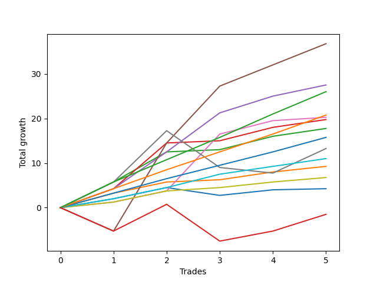

# Long Bernese 001 
- Symbol: ES_SmolBoi
- Date Range: 03/18/2022 - 09/30/2022
- Trading Period: 7:20-12:30
- Number of Trades: 5



| Name | Win Percent | Profit | Avg Profit / Trade | Avg Time / Trade |      | Name | Win Percent | Profit | Avg Profit / Trade | Avg Time / Trade |
| ---- | ----------- | ------ | ------------------ | ---------------- | ---- | ---- | ----------- | ------ | ------------------ | ---------------- |
| Sorted By <br> Profit | | | | | | Sorted By <br> Win Percentage ||||
| Five | 80.00 | 18375.00 | 3675.00 | 36:25 |     | Four | 100.00 | 13750.00 | 2750.00 | 25:31 |
| Four | 100.00 | 13750.00 | 2750.00 | 25:31 |     | Eighty-Five | 100.00 | 13000.00 | 2600.00 | 18:54 |
| Eighty-Five | 100.00 | 13000.00 | 2600.00 | 18:54 |     | Eighty-Four | 100.00 | 10375.00 | 2075.00 | 15:51 |
| Eighty-Four | 100.00 | 10375.00 | 2075.00 | 15:51 |     | Six | 100.00 | 10125.00 | 2025.00 | 05:48 |
| Six | 100.00 | 10125.00 | 2025.00 | 05:48 |     | Three | 100.00 | 9875.00 | 1975.00 | 11:24 |
| Three | 100.00 | 9875.00 | 1975.00 | 11:24 |     | Two | 100.00 | 8875.00 | 1775.00 | 08:58 |
| Two | 100.00 | 8875.00 | 1775.00 | 08:58 |     | Eighty-Three | 100.00 | 7875.00 | 1575.00 | 13:35 |
| Eighty-Three | 100.00 | 7875.00 | 1575.00 | 13:35 |     | Eighty-Two | 100.00 | 5500.00 | 1100.00 | 08:00 |
| Seven | 60.00 | 6625.00 | 1325.00 | 37:31 |     | One | 100.00 | 4625.00 | 925.00 | 08:05 |
| Eighty-Two | 100.00 | 5500.00 | 1100.00 | 08:00 |     | Eighty-One | 100.00 | 3375.00 | 675.00 | 01:24 |
| One | 100.00 | 4625.00 | 925.00 | 08:05 |     | Five | 80.00 | 18375.00 | 3675.00 | 36:25 |
| Eighty-One | 100.00 | 3375.00 | 675.00 | 01:24 |     | Zero | 80.00 | 2125.00 | 425.00 | 05:26 |
| Zero | 80.00 | 2125.00 | 425.00 | 05:26 |     | Seven | 60.00 | 6625.00 | 1325.00 | 37:31 |
| NEWFI 0000 | 60.00 | -750.00 | -150.00 | 42:13 |     | NEWFI 0000 | 60.00 | -750.00 | -150.00 | 42:13 |

## NO STOPLOSS

### Test Zero
* Sell when price hits the middle line of the 20p bollinger
* No Stoploss
* Results:
```
Total Trades: 5
Percent Up: 80.00
Percent Down: 20.00
Total Points Moved Up: 4.25
Potential Profit: 2125.00
Total Points Ups: 6.00 Count Ups: 4
Total Points Downs: -1.75 Count Downs: 1
```

<details><summary>Trades</summary>

<code>In: 2022-03-31 08:37:00		Out: 2022-03-31 08:38:15		Total Position Time: 01:15		Total Move Up: 2.00		Total to Date: 2.00</code> <br />
<code>In: 2022-05-06 09:03:00		Out: 2022-05-06 09:03:10		Total Position Time: 00:10		Total Move Up: 2.50		Total to Date: 4.50</code> <br />
<code>In: 2022-05-06 11:28:00		Out: 2022-05-06 11:40:25		Total Position Time: 12:25		Total Move Up: -1.75		Total to Date: 2.75</code> <br />
<code>In: 2022-07-12 10:28:00		Out: 2022-07-12 10:28:50		Total Position Time: 00:50		Total Move Up: 1.25		Total to Date: 4.00</code> <br />
<code>In: 2022-08-05 11:32:00		Out: 2022-08-05 11:44:30		Total Position Time: 12:30		Total Move Up: 0.25		Total to Date: 4.25</code> <br />


</details>

### Test One
* Sell when the price hits the upper line of the 20p 1std bollinger
* No Stoploss
* Results:
```
Total Trades: 5
Percent Up: 100.00
Percent Down: 0.00
Total Points Moved Up: 9.25
Potential Profit: 4625.00
Total Points Ups: 9.25 Count Ups: 5
Total Points Downs: 0.00 Count Downs: 0
```

<details><summary>Trades</summary>

<code>In: 2022-03-31 08:37:00		Out: 2022-03-31 08:40:35		Total Position Time: 03:35		Total Move Up: 3.25		Total to Date: 3.25</code> <br />
<code>In: 2022-05-06 09:03:00		Out: 2022-05-06 09:03:10		Total Position Time: 00:10		Total Move Up: 2.50		Total to Date: 5.75</code> <br />
<code>In: 2022-05-06 11:28:00		Out: 2022-05-06 11:49:10		Total Position Time: 21:10		Total Move Up: 0.50		Total to Date: 6.25</code> <br />
<code>In: 2022-07-12 10:28:00		Out: 2022-07-12 10:30:05		Total Position Time: 02:05		Total Move Up: 1.75		Total to Date: 8.00</code> <br />
<code>In: 2022-08-05 11:32:00		Out: 2022-08-05 11:45:25		Total Position Time: 13:25		Total Move Up: 1.25		Total to Date: 9.25</code> <br />


</details>

### Test Two
* Sell when the price hits the upper line of the 20p 2std bollinger
* No Stoploss
* Results:
```
Total Trades: 5
Percent Up: 100.00
Percent Down: 0.00
Total Points Moved Up: 17.75
Potential Profit: 8875.00
Total Points Ups: 17.75 Count Ups: 5
Total Points Downs: 0.00 Count Downs: 0
```

<details><summary>Trades</summary>

<code>In: 2022-03-31 08:37:00		Out: 2022-03-31 08:41:10		Total Position Time: 04:10		Total Move Up: 5.75		Total to Date: 5.75</code> <br />
<code>In: 2022-05-06 09:03:00		Out: 2022-05-06 09:03:55		Total Position Time: 00:55		Total Move Up: 6.75		Total to Date: 12.50</code> <br />
<code>In: 2022-05-06 11:28:00		Out: 2022-05-06 11:49:10		Total Position Time: 21:10		Total Move Up: 0.50		Total to Date: 13.00</code> <br />
<code>In: 2022-07-12 10:28:00		Out: 2022-07-12 10:31:30		Total Position Time: 03:30		Total Move Up: 3.00		Total to Date: 16.00</code> <br />
<code>In: 2022-08-05 11:32:00		Out: 2022-08-05 11:47:05		Total Position Time: 15:05		Total Move Up: 1.75		Total to Date: 17.75</code> <br />


</details>

### Test Three
* Sell when price hits the middle line of the 50p bollinger
* No Stoploss
* Results:
```
Total Trades: 5
Percent Up: 100.00
Percent Down: 0.00
Total Points Moved Up: 19.75
Potential Profit: 9875.00
Total Points Ups: 19.75 Count Ups: 5
Total Points Downs: 0.00 Count Downs: 0
```

<details><summary>Trades</summary>

<code>In: 2022-03-31 08:37:00		Out: 2022-03-31 08:41:05		Total Position Time: 04:05		Total Move Up: 4.25		Total to Date: 4.25</code> <br />
<code>In: 2022-05-06 09:03:00		Out: 2022-05-06 09:06:05		Total Position Time: 03:05		Total Move Up: 10.25		Total to Date: 14.50</code> <br />
<code>In: 2022-05-06 11:28:00		Out: 2022-05-06 11:49:10		Total Position Time: 21:10		Total Move Up: 0.50		Total to Date: 15.00</code> <br />
<code>In: 2022-07-12 10:28:00		Out: 2022-07-12 10:41:35		Total Position Time: 13:35		Total Move Up: 3.00		Total to Date: 18.00</code> <br />
<code>In: 2022-08-05 11:32:00		Out: 2022-08-05 11:47:05		Total Position Time: 15:05		Total Move Up: 1.75		Total to Date: 19.75</code> <br />


</details>

### Test Four
* Sell when the price hits the upper line of the 50p 1std bollinger
* No Stoploss
* Results:
```
Total Trades: 5
Percent Up: 100.00
Percent Down: 0.00
Total Points Moved Up: 27.50
Potential Profit: 13750.00
Total Points Ups: 27.50 Count Ups: 5
Total Points Downs: 0.00 Count Downs: 0
```

<details><summary>Trades</summary>

<code>In: 2022-03-31 08:37:00		Out: 2022-03-31 09:00:15		Total Position Time: 23:15		Total Move Up: 4.25		Total to Date: 4.25</code> <br />
<code>In: 2022-05-06 09:03:00		Out: 2022-05-06 09:22:25		Total Position Time: 19:25		Total Move Up: 8.25		Total to Date: 12.50</code> <br />
<code>In: 2022-05-06 11:28:00		Out: 2022-05-06 11:50:10		Total Position Time: 22:10		Total Move Up: 8.75		Total to Date: 21.25</code> <br />
<code>In: 2022-07-12 10:28:00		Out: 2022-07-12 10:52:25		Total Position Time: 24:25		Total Move Up: 3.75		Total to Date: 25.00</code> <br />
<code>In: 2022-08-05 11:32:00		Out: 2022-08-05 12:10:20		Total Position Time: 38:20		Total Move Up: 2.50		Total to Date: 27.50</code> <br />


</details>

### Test Five
* Sell when the price hits the upper line of the 50p 2std bollinger
* No Stoploss
* Results:
```
Total Trades: 5
Percent Up: 80.00
Percent Down: 20.00
Total Points Moved Up: 36.75
Potential Profit: 18375.00
Total Points Ups: 42.00 Count Ups: 4
Total Points Downs: -5.25 Count Downs: 1
```

<details><summary>Trades</summary>

<code>In: 2022-03-31 08:37:00		Out: 2022-03-31 09:36:55		Total Position Time: 59:55		Total Move Up: -5.25		Total to Date: -5.25</code> <br />
<code>In: 2022-05-06 09:03:00		Out: 2022-05-06 09:36:15		Total Position Time: 33:15		Total Move Up: 19.75		Total to Date: 14.50</code> <br />
<code>In: 2022-05-06 11:28:00		Out: 2022-05-06 11:50:35		Total Position Time: 22:35		Total Move Up: 12.75		Total to Date: 27.25</code> <br />
<code>In: 2022-07-12 10:28:00		Out: 2022-07-12 10:54:05		Total Position Time: 26:05		Total Move Up: 4.75		Total to Date: 32.00</code> <br />
<code>In: 2022-08-05 11:32:00		Out: 2022-08-05 12:12:15		Total Position Time: 40:15		Total Move Up: 4.75		Total to Date: 36.75</code> <br />


</details>

### Test Six
* Sell when the price hits the middle line of the 1std VWAP
* No Stoploss
* Results:
```
Total Trades: 5
Percent Up: 100.00
Percent Down: 0.00
Total Points Moved Up: 20.25
Potential Profit: 10125.00
Total Points Ups: 20.25 Count Ups: 5
Total Points Downs: 0.00 Count Downs: 0
```

<details><summary>Trades</summary>

<code>In: 2022-03-31 08:37:00		Out: 2022-03-31 08:37:40		Total Position Time: 00:40		Total Move Up: 1.25		Total to Date: 1.25</code> <br />
<code>In: 2022-05-06 09:03:00		Out: 2022-05-06 09:03:10		Total Position Time: 00:10		Total Move Up: 2.50		Total to Date: 3.75</code> <br />
<code>In: 2022-05-06 11:28:00		Out: 2022-05-06 11:50:20		Total Position Time: 22:20		Total Move Up: 12.75		Total to Date: 16.50</code> <br />
<code>In: 2022-07-12 10:28:00		Out: 2022-07-12 10:31:15		Total Position Time: 03:15		Total Move Up: 3.00		Total to Date: 19.50</code> <br />
<code>In: 2022-08-05 11:32:00		Out: 2022-08-05 11:34:35		Total Position Time: 02:35		Total Move Up: 0.75		Total to Date: 20.25</code> <br />


</details>

### Test Seven
* Sell when the price hits the upper line of the 1std VWAP
* No Stoploss
* Results:
```
Total Trades: 5
Percent Up: 60.00
Percent Down: 40.00
Total Points Moved Up: 13.25
Potential Profit: 6625.00
Total Points Ups: 22.75 Count Ups: 3
Total Points Downs: -9.50 Count Downs: 2
```

<details><summary>Trades</summary>

<code>In: 2022-03-31 08:37:00		Out: 2022-03-31 08:41:10		Total Position Time: 04:10		Total Move Up: 5.75		Total to Date: 5.75</code> <br />
<code>In: 2022-05-06 09:03:00		Out: 2022-05-06 09:06:40		Total Position Time: 03:40		Total Move Up: 11.50		Total to Date: 17.25</code> <br />
<code>In: 2022-05-06 11:28:00		Out: 2022-05-06 12:27:55		Total Position Time: 59:55		Total Move Up: -8.25		Total to Date: 9.00</code> <br />
<code>In: 2022-07-12 10:28:00		Out: 2022-07-12 11:27:55		Total Position Time: 59:55		Total Move Up: -1.25		Total to Date: 7.75</code> <br />
<code>In: 2022-08-05 11:32:00		Out: 2022-08-05 12:31:55		Total Position Time: 59:55		Total Move Up: 5.50		Total to Date: 13.25</code> <br />


</details>

## TAKE PROFIT

### Test Eighty-One
* Take Profit of 1 Point
* No Stoploss
* Results:
```
Total Trades: 5
Percent Up: 100.00
Percent Down: 0.00
Total Points Moved Up: 6.75
Potential Profit: 3375.00
Total Points Ups: 6.75 Count Ups: 5
Total Points Downs: 0.00 Count Downs: 0
```

<details><summary>Trades</summary>

<code>In: 2022-03-31 08:37:00		Out: 2022-03-31 08:37:40		Total Position Time: 00:40		Total Move Up: 1.25		Total to Date: 1.25</code> <br />
<code>In: 2022-05-06 09:03:00		Out: 2022-05-06 09:03:10		Total Position Time: 00:10		Total Move Up: 2.50		Total to Date: 3.75</code> <br />
<code>In: 2022-05-06 11:28:00		Out: 2022-05-06 11:30:35		Total Position Time: 02:35		Total Move Up: 0.75		Total to Date: 4.50</code> <br />
<code>In: 2022-07-12 10:28:00		Out: 2022-07-12 10:28:50		Total Position Time: 00:50		Total Move Up: 1.25		Total to Date: 5.75</code> <br />
<code>In: 2022-08-05 11:32:00		Out: 2022-08-05 11:34:45		Total Position Time: 02:45		Total Move Up: 1.00		Total to Date: 6.75</code> <br />


</details>

### Test Eighty-Two
* Take Profit of 2 Point
* No Stoploss
* Results:
```
Total Trades: 5
Percent Up: 100.00
Percent Down: 0.00
Total Points Moved Up: 11.00
Potential Profit: 5500.00
Total Points Ups: 11.00 Count Ups: 5
Total Points Downs: 0.00 Count Downs: 0
```

<details><summary>Trades</summary>

<code>In: 2022-03-31 08:37:00		Out: 2022-03-31 08:38:15		Total Position Time: 01:15		Total Move Up: 2.00		Total to Date: 2.00</code> <br />
<code>In: 2022-05-06 09:03:00		Out: 2022-05-06 09:03:10		Total Position Time: 00:10		Total Move Up: 2.50		Total to Date: 4.50</code> <br />
<code>In: 2022-05-06 11:28:00		Out: 2022-05-06 11:49:25		Total Position Time: 21:25		Total Move Up: 3.00		Total to Date: 7.50</code> <br />
<code>In: 2022-07-12 10:28:00		Out: 2022-07-12 10:30:05		Total Position Time: 02:05		Total Move Up: 1.75		Total to Date: 9.25</code> <br />
<code>In: 2022-08-05 11:32:00		Out: 2022-08-05 11:47:05		Total Position Time: 15:05		Total Move Up: 1.75		Total to Date: 11.00</code> <br />


</details>

### Test Eighty-Three
* Take Profit of 3 Point
* No Stoploss
* Results:
```
Total Trades: 5
Percent Up: 100.00
Percent Down: 0.00
Total Points Moved Up: 15.75
Potential Profit: 7875.00
Total Points Ups: 15.75 Count Ups: 5
Total Points Downs: 0.00 Count Downs: 0
```

<details><summary>Trades</summary>

<code>In: 2022-03-31 08:37:00		Out: 2022-03-31 08:40:35		Total Position Time: 03:35		Total Move Up: 3.25		Total to Date: 3.25</code> <br />
<code>In: 2022-05-06 09:03:00		Out: 2022-05-06 09:03:40		Total Position Time: 00:40		Total Move Up: 3.25		Total to Date: 6.50</code> <br />
<code>In: 2022-05-06 11:28:00		Out: 2022-05-06 11:49:25		Total Position Time: 21:25		Total Move Up: 3.00		Total to Date: 9.50</code> <br />
<code>In: 2022-07-12 10:28:00		Out: 2022-07-12 10:31:15		Total Position Time: 03:15		Total Move Up: 3.00		Total to Date: 12.50</code> <br />
<code>In: 2022-08-05 11:32:00		Out: 2022-08-05 12:11:00		Total Position Time: 39:00		Total Move Up: 3.25		Total to Date: 15.75</code> <br />


</details>

### Test Eighty-Four
* Take Profit of 4 Point
* No Stoploss
* Results:
```
Total Trades: 5
Percent Up: 100.00
Percent Down: 0.00
Total Points Moved Up: 20.75
Potential Profit: 10375.00
Total Points Ups: 20.75 Count Ups: 5
Total Points Downs: 0.00 Count Downs: 0
```

<details><summary>Trades</summary>

<code>In: 2022-03-31 08:37:00		Out: 2022-03-31 08:41:05		Total Position Time: 04:05		Total Move Up: 4.25		Total to Date: 4.25</code> <br />
<code>In: 2022-05-06 09:03:00		Out: 2022-05-06 09:03:45		Total Position Time: 00:45		Total Move Up: 4.25		Total to Date: 8.50</code> <br />
<code>In: 2022-05-06 11:28:00		Out: 2022-05-06 11:49:30		Total Position Time: 21:30		Total Move Up: 4.00		Total to Date: 12.50</code> <br />
<code>In: 2022-07-12 10:28:00		Out: 2022-07-12 10:41:40		Total Position Time: 13:40		Total Move Up: 4.00		Total to Date: 16.50</code> <br />
<code>In: 2022-08-05 11:32:00		Out: 2022-08-05 12:11:15		Total Position Time: 39:15		Total Move Up: 4.25		Total to Date: 20.75</code> <br />


</details>

### Test Eighty-Five
* Take Profit of 5 Point
* No Stoploss
* Results:
```
Total Trades: 5
Percent Up: 100.00
Percent Down: 0.00
Total Points Moved Up: 26.00
Potential Profit: 13000.00
Total Points Ups: 26.00 Count Ups: 5
Total Points Downs: 0.00 Count Downs: 0
```

<details><summary>Trades</summary>

<code>In: 2022-03-31 08:37:00		Out: 2022-03-31 08:41:10		Total Position Time: 04:10		Total Move Up: 5.75		Total to Date: 5.75</code> <br />
<code>In: 2022-05-06 09:03:00		Out: 2022-05-06 09:03:50		Total Position Time: 00:50		Total Move Up: 5.00		Total to Date: 10.75</code> <br />
<code>In: 2022-05-06 11:28:00		Out: 2022-05-06 11:50:05		Total Position Time: 22:05		Total Move Up: 5.00		Total to Date: 15.75</code> <br />
<code>In: 2022-07-12 10:28:00		Out: 2022-07-12 10:54:15		Total Position Time: 26:15		Total Move Up: 5.25		Total to Date: 21.00</code> <br />
<code>In: 2022-08-05 11:32:00		Out: 2022-08-05 12:13:10		Total Position Time: 41:10		Total Move Up: 5.00		Total to Date: 26.00</code> <br />


</details>

## Indicator Exits

### Test NEWFI 0000
* Newfi 0000
* No Stoploss
* Results:
```
Total Trades: 5
Percent Up: 60.00
Percent Down: 40.00
Total Points Moved Up: -1.50
Potential Profit: -750.00
Total Points Ups: 12.00 Count Ups: 3
Total Points Downs: -13.50 Count Downs: 2
```

<details><summary>Trades</summary>

<code>In: 2022-03-31 08:37:00		Out: 2022-03-31 09:36:55		Total Position Time: 59:55		Total Move Up: -5.25		Total to Date: -5.25</code> <br />
<code>In: 2022-05-06 09:03:00		Out: 2022-05-06 09:28:05		Total Position Time: 25:05		Total Move Up: 6.00		Total to Date: 0.75</code> <br />
<code>In: 2022-05-06 11:28:00		Out: 2022-05-06 12:27:55		Total Position Time: 59:55		Total Move Up: -8.25		Total to Date: -7.50</code> <br />
<code>In: 2022-07-12 10:28:00		Out: 2022-07-12 10:51:05		Total Position Time: 23:05		Total Move Up: 2.25		Total to Date: -5.25</code> <br />
<code>In: 2022-08-05 11:32:00		Out: 2022-08-05 12:15:05		Total Position Time: 43:05		Total Move Up: 3.75		Total to Date: -1.50</code> <br />


</details>