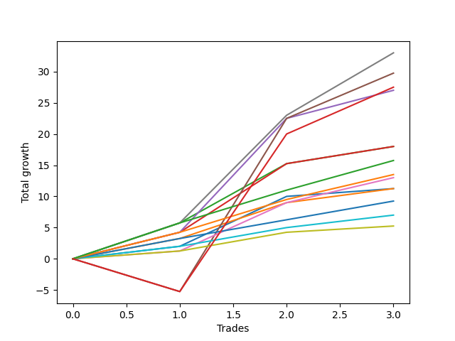

# Long Bernese 002 50 
- Symbol: ES_SmolBoi
- Date Range: 03/18/2022 - 09/30/2022
- Trading Period: 7:20-12:30
- Number of Trades: 3



| Name | Win Percent | Profit | Avg Profit / Trade | Avg Time / Trade |      | Name | Win Percent | Profit | Avg Profit / Trade | Avg Time / Trade |
| ---- | ----------- | ------ | ------------------ | ---------------- | ---- | ---- | ----------- | ------ | ------------------ | ---------------- |
| Sorted By <br> Profit | | | | | | Sorted By <br> Win Percentage ||||
| Seven | 100.00 | 16500.00 | 5500.00 | 23:15 |     | Seven | 100.00 | 16500.00 | 5500.00 | 23:15 |
| Five | 66.67 | 14875.00 | 4958.33 | 36:06 |     | Four | 100.00 | 13500.00 | 4500.00 | 21:23 |
| NEWFI 0000 | 66.67 | 13750.00 | 4583.33 | 43:01 |     | Three | 100.00 | 9000.00 | 3000.00 | 12:45 |
| Four | 100.00 | 13500.00 | 4500.00 | 21:23 |     | Two | 100.00 | 9000.00 | 3000.00 | 12:41 |
| Three | 100.00 | 9000.00 | 3000.00 | 12:45 |     | Eighty-Five | 100.00 | 7875.00 | 2625.00 | 08:56 |
| Two | 100.00 | 9000.00 | 3000.00 | 12:41 |     | Eighty-Four | 100.00 | 6750.00 | 2250.00 | 08:33 |
| Eighty-Five | 100.00 | 7875.00 | 2625.00 | 08:56 |     | Six | 100.00 | 6500.00 | 2166.67 | 07:31 |
| Eighty-Four | 100.00 | 6750.00 | 2250.00 | 08:33 |     | One | 100.00 | 5625.00 | 1875.00 | 08:10 |
| Six | 100.00 | 6500.00 | 2166.67 | 07:31 |     | Zero | 100.00 | 5625.00 | 1875.00 | 01:25 |
| One | 100.00 | 5625.00 | 1875.00 | 08:10 |     | Eighty-Three | 100.00 | 4625.00 | 1541.67 | 08:10 |
| Zero | 100.00 | 5625.00 | 1875.00 | 01:25 |     | Eighty-Two | 100.00 | 3500.00 | 1166.67 | 01:21 |
| Eighty-Three | 100.00 | 4625.00 | 1541.67 | 08:10 |     | Eighty-One | 100.00 | 2625.00 | 875.00 | 00:51 |
| Eighty-Two | 100.00 | 3500.00 | 1166.67 | 01:21 |     | Five | 66.67 | 14875.00 | 4958.33 | 36:06 |
| Eighty-One | 100.00 | 2625.00 | 875.00 | 00:51 |     | NEWFI 0000 | 66.67 | 13750.00 | 4583.33 | 43:01 |

## NO STOPLOSS

### Test Zero
* Sell when price hits the middle line of the 20p bollinger
* No Stoploss
* Results:
```
Total Trades: 3
Percent Up: 100.00
Percent Down: 0.00
Total Points Moved Up: 11.25
Potential Profit: 5625.00
Total Points Ups: 11.25 Count Ups: 3
Total Points Downs: 0.00 Count Downs: 0
```

<details><summary>Trades</summary>

<code>In: 2022-03-31 08:37:00		Out: 2022-03-31 08:38:15		Total Position Time: 01:15		Total Move Up: 2.00		Total to Date: 2.00</code> <br />
<code>In: 2022-05-17 11:25:00		Out: 2022-05-17 11:27:30		Total Position Time: 02:30		Total Move Up: 8.00		Total to Date: 10.00</code> <br />
<code>In: 2022-08-18 09:47:00		Out: 2022-08-18 09:47:30		Total Position Time: 00:30		Total Move Up: 1.25		Total to Date: 11.25</code> <br />


</details>

### Test One
* Sell when the price hits the upper line of the 20p 1std bollinger
* No Stoploss
* Results:
```
Total Trades: 3
Percent Up: 100.00
Percent Down: 0.00
Total Points Moved Up: 11.25
Potential Profit: 5625.00
Total Points Ups: 11.25 Count Ups: 3
Total Points Downs: 0.00 Count Downs: 0
```

<details><summary>Trades</summary>

<code>In: 2022-03-31 08:37:00		Out: 2022-03-31 08:40:35		Total Position Time: 03:35		Total Move Up: 3.25		Total to Date: 3.25</code> <br />
<code>In: 2022-05-17 11:25:00		Out: 2022-05-17 11:37:35		Total Position Time: 12:35		Total Move Up: 5.75		Total to Date: 9.00</code> <br />
<code>In: 2022-08-18 09:47:00		Out: 2022-08-18 09:55:20		Total Position Time: 08:20		Total Move Up: 2.25		Total to Date: 11.25</code> <br />


</details>

### Test Two
* Sell when the price hits the upper line of the 20p 2std bollinger
* No Stoploss
* Results:
```
Total Trades: 3
Percent Up: 100.00
Percent Down: 0.00
Total Points Moved Up: 18.00
Potential Profit: 9000.00
Total Points Ups: 18.00 Count Ups: 3
Total Points Downs: 0.00 Count Downs: 0
```

<details><summary>Trades</summary>

<code>In: 2022-03-31 08:37:00		Out: 2022-03-31 08:41:10		Total Position Time: 04:10		Total Move Up: 5.75		Total to Date: 5.75</code> <br />
<code>In: 2022-05-17 11:25:00		Out: 2022-05-17 11:40:00		Total Position Time: 15:00		Total Move Up: 9.50		Total to Date: 15.25</code> <br />
<code>In: 2022-08-18 09:47:00		Out: 2022-08-18 10:05:55		Total Position Time: 18:55		Total Move Up: 2.75		Total to Date: 18.00</code> <br />


</details>

### Test Three
* Sell when price hits the middle line of the 50p bollinger
* No Stoploss
* Results:
```
Total Trades: 3
Percent Up: 100.00
Percent Down: 0.00
Total Points Moved Up: 18.00
Potential Profit: 9000.00
Total Points Ups: 18.00 Count Ups: 3
Total Points Downs: 0.00 Count Downs: 0
```

<details><summary>Trades</summary>

<code>In: 2022-03-31 08:37:00		Out: 2022-03-31 08:41:05		Total Position Time: 04:05		Total Move Up: 4.25		Total to Date: 4.25</code> <br />
<code>In: 2022-05-17 11:25:00		Out: 2022-05-17 11:40:05		Total Position Time: 15:05		Total Move Up: 11.00		Total to Date: 15.25</code> <br />
<code>In: 2022-08-18 09:47:00		Out: 2022-08-18 10:06:05		Total Position Time: 19:05		Total Move Up: 2.75		Total to Date: 18.00</code> <br />


</details>

### Test Four
* Sell when the price hits the upper line of the 50p 1std bollinger
* No Stoploss
* Results:
```
Total Trades: 3
Percent Up: 100.00
Percent Down: 0.00
Total Points Moved Up: 27.00
Potential Profit: 13500.00
Total Points Ups: 27.00 Count Ups: 3
Total Points Downs: 0.00 Count Downs: 0
```

<details><summary>Trades</summary>

<code>In: 2022-03-31 08:37:00		Out: 2022-03-31 09:00:15		Total Position Time: 23:15		Total Move Up: 4.25		Total to Date: 4.25</code> <br />
<code>In: 2022-05-17 11:25:00		Out: 2022-05-17 11:44:30		Total Position Time: 19:30		Total Move Up: 18.25		Total to Date: 22.50</code> <br />
<code>In: 2022-08-18 09:47:00		Out: 2022-08-18 10:08:25		Total Position Time: 21:25		Total Move Up: 4.50		Total to Date: 27.00</code> <br />


</details>

### Test Five
* Sell when the price hits the upper line of the 50p 2std bollinger
* No Stoploss
* Results:
```
Total Trades: 3
Percent Up: 66.67
Percent Down: 33.33
Total Points Moved Up: 29.75
Potential Profit: 14875.00
Total Points Ups: 35.00 Count Ups: 2
Total Points Downs: -5.25 Count Downs: 1
```

<details><summary>Trades</summary>

<code>In: 2022-03-31 08:37:00		Out: 2022-03-31 09:36:55		Total Position Time: 59:55		Total Move Up: -5.25		Total to Date: -5.25</code> <br />
<code>In: 2022-05-17 11:25:00		Out: 2022-05-17 11:48:45		Total Position Time: 23:45		Total Move Up: 27.75		Total to Date: 22.50</code> <br />
<code>In: 2022-08-18 09:47:00		Out: 2022-08-18 10:11:40		Total Position Time: 24:40		Total Move Up: 7.25		Total to Date: 29.75</code> <br />


</details>

### Test Six
* Sell when the price hits the middle line of the 1std VWAP
* No Stoploss
* Results:
```
Total Trades: 3
Percent Up: 100.00
Percent Down: 0.00
Total Points Moved Up: 13.00
Potential Profit: 6500.00
Total Points Ups: 13.00 Count Ups: 3
Total Points Downs: 0.00 Count Downs: 0
```

<details><summary>Trades</summary>

<code>In: 2022-03-31 08:37:00		Out: 2022-03-31 08:37:40		Total Position Time: 00:40		Total Move Up: 1.25		Total to Date: 1.25</code> <br />
<code>In: 2022-05-17 11:25:00		Out: 2022-05-17 11:27:25		Total Position Time: 02:25		Total Move Up: 7.75		Total to Date: 9.00</code> <br />
<code>In: 2022-08-18 09:47:00		Out: 2022-08-18 10:06:30		Total Position Time: 19:30		Total Move Up: 4.00		Total to Date: 13.00</code> <br />


</details>

### Test Seven
* Sell when the price hits the upper line of the 1std VWAP
* No Stoploss
* Results:
```
Total Trades: 3
Percent Up: 100.00
Percent Down: 0.00
Total Points Moved Up: 33.00
Potential Profit: 16500.00
Total Points Ups: 33.00 Count Ups: 3
Total Points Downs: 0.00 Count Downs: 0
```

<details><summary>Trades</summary>

<code>In: 2022-03-31 08:37:00		Out: 2022-03-31 08:41:10		Total Position Time: 04:10		Total Move Up: 5.75		Total to Date: 5.75</code> <br />
<code>In: 2022-05-17 11:25:00		Out: 2022-05-17 11:40:20		Total Position Time: 15:20		Total Move Up: 17.25		Total to Date: 23.00</code> <br />
<code>In: 2022-08-18 09:47:00		Out: 2022-08-18 10:37:15		Total Position Time: 50:15		Total Move Up: 10.00		Total to Date: 33.00</code> <br />


</details>

## TAKE PROFIT

### Test Eighty-One
* Take Profit of 1 Point
* No Stoploss
* Results:
```
Total Trades: 3
Percent Up: 100.00
Percent Down: 0.00
Total Points Moved Up: 5.25
Potential Profit: 2625.00
Total Points Ups: 5.25 Count Ups: 3
Total Points Downs: 0.00 Count Downs: 0
```

<details><summary>Trades</summary>

<code>In: 2022-03-31 08:37:00		Out: 2022-03-31 08:37:40		Total Position Time: 00:40		Total Move Up: 1.25		Total to Date: 1.25</code> <br />
<code>In: 2022-05-17 11:25:00		Out: 2022-05-17 11:26:40		Total Position Time: 01:40		Total Move Up: 3.00		Total to Date: 4.25</code> <br />
<code>In: 2022-08-18 09:47:00		Out: 2022-08-18 09:47:15		Total Position Time: 00:15		Total Move Up: 1.00		Total to Date: 5.25</code> <br />


</details>

### Test Eighty-Two
* Take Profit of 2 Point
* No Stoploss
* Results:
```
Total Trades: 3
Percent Up: 100.00
Percent Down: 0.00
Total Points Moved Up: 7.00
Potential Profit: 3500.00
Total Points Ups: 7.00 Count Ups: 3
Total Points Downs: 0.00 Count Downs: 0
```

<details><summary>Trades</summary>

<code>In: 2022-03-31 08:37:00		Out: 2022-03-31 08:38:15		Total Position Time: 01:15		Total Move Up: 2.00		Total to Date: 2.00</code> <br />
<code>In: 2022-05-17 11:25:00		Out: 2022-05-17 11:26:40		Total Position Time: 01:40		Total Move Up: 3.00		Total to Date: 5.00</code> <br />
<code>In: 2022-08-18 09:47:00		Out: 2022-08-18 09:48:10		Total Position Time: 01:10		Total Move Up: 2.00		Total to Date: 7.00</code> <br />


</details>

### Test Eighty-Three
* Take Profit of 3 Point
* No Stoploss
* Results:
```
Total Trades: 3
Percent Up: 100.00
Percent Down: 0.00
Total Points Moved Up: 9.25
Potential Profit: 4625.00
Total Points Ups: 9.25 Count Ups: 3
Total Points Downs: 0.00 Count Downs: 0
```

<details><summary>Trades</summary>

<code>In: 2022-03-31 08:37:00		Out: 2022-03-31 08:40:35		Total Position Time: 03:35		Total Move Up: 3.25		Total to Date: 3.25</code> <br />
<code>In: 2022-05-17 11:25:00		Out: 2022-05-17 11:26:40		Total Position Time: 01:40		Total Move Up: 3.00		Total to Date: 6.25</code> <br />
<code>In: 2022-08-18 09:47:00		Out: 2022-08-18 10:06:15		Total Position Time: 19:15		Total Move Up: 3.00		Total to Date: 9.25</code> <br />


</details>

### Test Eighty-Four
* Take Profit of 4 Point
* No Stoploss
* Results:
```
Total Trades: 3
Percent Up: 100.00
Percent Down: 0.00
Total Points Moved Up: 13.50
Potential Profit: 6750.00
Total Points Ups: 13.50 Count Ups: 3
Total Points Downs: 0.00 Count Downs: 0
```

<details><summary>Trades</summary>

<code>In: 2022-03-31 08:37:00		Out: 2022-03-31 08:41:05		Total Position Time: 04:05		Total Move Up: 4.25		Total to Date: 4.25</code> <br />
<code>In: 2022-05-17 11:25:00		Out: 2022-05-17 11:27:05		Total Position Time: 02:05		Total Move Up: 5.25		Total to Date: 9.50</code> <br />
<code>In: 2022-08-18 09:47:00		Out: 2022-08-18 10:06:30		Total Position Time: 19:30		Total Move Up: 4.00		Total to Date: 13.50</code> <br />


</details>

### Test Eighty-Five
* Take Profit of 5 Point
* No Stoploss
* Results:
```
Total Trades: 3
Percent Up: 100.00
Percent Down: 0.00
Total Points Moved Up: 15.75
Potential Profit: 7875.00
Total Points Ups: 15.75 Count Ups: 3
Total Points Downs: 0.00 Count Downs: 0
```

<details><summary>Trades</summary>

<code>In: 2022-03-31 08:37:00		Out: 2022-03-31 08:41:10		Total Position Time: 04:10		Total Move Up: 5.75		Total to Date: 5.75</code> <br />
<code>In: 2022-05-17 11:25:00		Out: 2022-05-17 11:27:05		Total Position Time: 02:05		Total Move Up: 5.25		Total to Date: 11.00</code> <br />
<code>In: 2022-08-18 09:47:00		Out: 2022-08-18 10:07:35		Total Position Time: 20:35		Total Move Up: 4.75		Total to Date: 15.75</code> <br />


</details>

## Indicator Exits

### Test NEWFI 0000
* Newfi 0000
* No Stoploss
* Results:
```
Total Trades: 3
Percent Up: 66.67
Percent Down: 33.33
Total Points Moved Up: 27.50
Potential Profit: 13750.00
Total Points Ups: 32.75 Count Ups: 2
Total Points Downs: -5.25 Count Downs: 1
```

<details><summary>Trades</summary>

<code>In: 2022-03-31 08:37:00		Out: 2022-03-31 09:36:55		Total Position Time: 59:55		Total Move Up: -5.25		Total to Date: -5.25</code> <br />
<code>In: 2022-05-17 11:25:00		Out: 2022-05-17 11:51:05		Total Position Time: 26:05		Total Move Up: 25.25		Total to Date: 20.00</code> <br />
<code>In: 2022-08-18 09:47:00		Out: 2022-08-18 10:30:05		Total Position Time: 43:05		Total Move Up: 7.50		Total to Date: 27.50</code> <br />


</details>