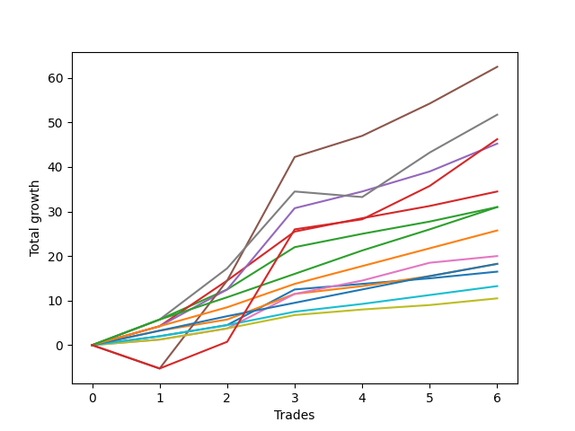

# Long Bernese 002 
- Symbol: ES_SmolBoi
- Date Range: 03/18/2022 - 09/30/2022
- Trading Period: 7:20-12:30
- Number of Trades: 6



| Name | Win Percent | Profit | Avg Profit / Trade | Avg Time / Trade |      | Name | Win Percent | Profit | Avg Profit / Trade | Avg Time / Trade |
| ---- | ----------- | ------ | ------------------ | ---------------- | ---- | ---- | ----------- | ------ | ------------------ | ---------------- |
| Sorted By <br> Profit | | | | | | Sorted By <br> Win Percentage ||||
| Five | 83.33 | 31250.00 | 5208.33 | 31:32 |     | Four | 100.00 | 22625.00 | 3770.83 | 19:36 |
| Seven | 83.33 | 25875.00 | 4312.50 | 25:50 |     | Three | 100.00 | 17250.00 | 2875.00 | 10:04 |
| NEWFI 0000 | 83.33 | 23125.00 | 3854.17 | 33:43 |     | Eighty-Five | 100.00 | 15500.00 | 2583.33 | 10:22 |
| Four | 100.00 | 22625.00 | 3770.83 | 19:36 |     | Two | 100.00 | 15500.00 | 2583.33 | 08:21 |
| Three | 100.00 | 17250.00 | 2875.00 | 10:04 |     | Eighty-Four | 100.00 | 12875.00 | 2145.83 | 08:00 |
| Eighty-Five | 100.00 | 15500.00 | 2583.33 | 10:22 |     | Six | 100.00 | 10000.00 | 1666.67 | 04:21 |
| Two | 100.00 | 15500.00 | 2583.33 | 08:21 |     | Eighty-Three | 100.00 | 9125.00 | 1520.83 | 05:38 |
| Eighty-Four | 100.00 | 12875.00 | 2145.83 | 08:00 |     | One | 100.00 | 9125.00 | 1520.83 | 05:21 |
| Six | 100.00 | 10000.00 | 1666.67 | 04:21 |     | Zero | 100.00 | 8250.00 | 1375.00 | 00:54 |
| Eighty-Three | 100.00 | 9125.00 | 1520.83 | 05:38 |     | Eighty-Two | 100.00 | 6625.00 | 1104.17 | 01:56 |
| One | 100.00 | 9125.00 | 1520.83 | 05:21 |     | Eighty-One | 100.00 | 5250.00 | 875.00 | 00:37 |
| Zero | 100.00 | 8250.00 | 1375.00 | 00:54 |     | Five | 83.33 | 31250.00 | 5208.33 | 31:32 |
| Eighty-Two | 100.00 | 6625.00 | 1104.17 | 01:56 |     | Seven | 83.33 | 25875.00 | 4312.50 | 25:50 |
| Eighty-One | 100.00 | 5250.00 | 875.00 | 00:37 |     | NEWFI 0000 | 83.33 | 23125.00 | 3854.17 | 33:43 |

## NO STOPLOSS

### Test Zero
* Sell when price hits the middle line of the 20p bollinger
* No Stoploss
* Results:
```
Total Trades: 6
Percent Up: 100.00
Percent Down: 0.00
Total Points Moved Up: 16.50
Potential Profit: 8250.00
Total Points Ups: 16.50 Count Ups: 6
Total Points Downs: 0.00 Count Downs: 0
```

<details><summary>Trades</summary>

<code>In: 2022-03-31 08:37:00		Out: 2022-03-31 08:38:15		Total Position Time: 01:15		Total Move Up: 2.00		Total to Date: 2.00</code> <br />
<code>In: 2022-05-06 09:03:00		Out: 2022-05-06 09:03:10		Total Position Time: 00:10		Total Move Up: 2.50		Total to Date: 4.50</code> <br />
<code>In: 2022-05-17 11:25:00		Out: 2022-05-17 11:27:30		Total Position Time: 02:30		Total Move Up: 8.00		Total to Date: 12.50</code> <br />
<code>In: 2022-07-12 10:28:00		Out: 2022-07-12 10:28:50		Total Position Time: 00:50		Total Move Up: 1.25		Total to Date: 13.75</code> <br />
<code>In: 2022-08-18 09:47:00		Out: 2022-08-18 09:47:30		Total Position Time: 00:30		Total Move Up: 1.25		Total to Date: 15.00</code> <br />
<code>In: 2022-09-09 09:28:00		Out: 2022-09-09 09:28:10		Total Position Time: 00:10		Total Move Up: 1.50		Total to Date: 16.50</code> <br />


</details>

### Test One
* Sell when the price hits the upper line of the 20p 1std bollinger
* No Stoploss
* Results:
```
Total Trades: 6
Percent Up: 100.00
Percent Down: 0.00
Total Points Moved Up: 18.25
Potential Profit: 9125.00
Total Points Ups: 18.25 Count Ups: 6
Total Points Downs: 0.00 Count Downs: 0
```

<details><summary>Trades</summary>

<code>In: 2022-03-31 08:37:00		Out: 2022-03-31 08:40:35		Total Position Time: 03:35		Total Move Up: 3.25		Total to Date: 3.25</code> <br />
<code>In: 2022-05-06 09:03:00		Out: 2022-05-06 09:03:10		Total Position Time: 00:10		Total Move Up: 2.50		Total to Date: 5.75</code> <br />
<code>In: 2022-05-17 11:25:00		Out: 2022-05-17 11:37:35		Total Position Time: 12:35		Total Move Up: 5.75		Total to Date: 11.50</code> <br />
<code>In: 2022-07-12 10:28:00		Out: 2022-07-12 10:30:05		Total Position Time: 02:05		Total Move Up: 1.75		Total to Date: 13.25</code> <br />
<code>In: 2022-08-18 09:47:00		Out: 2022-08-18 09:55:20		Total Position Time: 08:20		Total Move Up: 2.25		Total to Date: 15.50</code> <br />
<code>In: 2022-09-09 09:28:00		Out: 2022-09-09 09:33:25		Total Position Time: 05:25		Total Move Up: 2.75		Total to Date: 18.25</code> <br />


</details>

### Test Two
* Sell when the price hits the upper line of the 20p 2std bollinger
* No Stoploss
* Results:
```
Total Trades: 6
Percent Up: 100.00
Percent Down: 0.00
Total Points Moved Up: 31.00
Potential Profit: 15500.00
Total Points Ups: 31.00 Count Ups: 6
Total Points Downs: 0.00 Count Downs: 0
```

<details><summary>Trades</summary>

<code>In: 2022-03-31 08:37:00		Out: 2022-03-31 08:41:10		Total Position Time: 04:10		Total Move Up: 5.75		Total to Date: 5.75</code> <br />
<code>In: 2022-05-06 09:03:00		Out: 2022-05-06 09:03:55		Total Position Time: 00:55		Total Move Up: 6.75		Total to Date: 12.50</code> <br />
<code>In: 2022-05-17 11:25:00		Out: 2022-05-17 11:40:00		Total Position Time: 15:00		Total Move Up: 9.50		Total to Date: 22.00</code> <br />
<code>In: 2022-07-12 10:28:00		Out: 2022-07-12 10:31:30		Total Position Time: 03:30		Total Move Up: 3.00		Total to Date: 25.00</code> <br />
<code>In: 2022-08-18 09:47:00		Out: 2022-08-18 10:05:55		Total Position Time: 18:55		Total Move Up: 2.75		Total to Date: 27.75</code> <br />
<code>In: 2022-09-09 09:28:00		Out: 2022-09-09 09:35:40		Total Position Time: 07:40		Total Move Up: 3.25		Total to Date: 31.00</code> <br />


</details>

### Test Three
* Sell when price hits the middle line of the 50p bollinger
* No Stoploss
* Results:
```
Total Trades: 6
Percent Up: 100.00
Percent Down: 0.00
Total Points Moved Up: 34.50
Potential Profit: 17250.00
Total Points Ups: 34.50 Count Ups: 6
Total Points Downs: 0.00 Count Downs: 0
```

<details><summary>Trades</summary>

<code>In: 2022-03-31 08:37:00		Out: 2022-03-31 08:41:05		Total Position Time: 04:05		Total Move Up: 4.25		Total to Date: 4.25</code> <br />
<code>In: 2022-05-06 09:03:00		Out: 2022-05-06 09:06:05		Total Position Time: 03:05		Total Move Up: 10.25		Total to Date: 14.50</code> <br />
<code>In: 2022-05-17 11:25:00		Out: 2022-05-17 11:40:05		Total Position Time: 15:05		Total Move Up: 11.00		Total to Date: 25.50</code> <br />
<code>In: 2022-07-12 10:28:00		Out: 2022-07-12 10:41:35		Total Position Time: 13:35		Total Move Up: 3.00		Total to Date: 28.50</code> <br />
<code>In: 2022-08-18 09:47:00		Out: 2022-08-18 10:06:05		Total Position Time: 19:05		Total Move Up: 2.75		Total to Date: 31.25</code> <br />
<code>In: 2022-09-09 09:28:00		Out: 2022-09-09 09:33:30		Total Position Time: 05:30		Total Move Up: 3.25		Total to Date: 34.50</code> <br />


</details>

### Test Four
* Sell when the price hits the upper line of the 50p 1std bollinger
* No Stoploss
* Results:
```
Total Trades: 6
Percent Up: 100.00
Percent Down: 0.00
Total Points Moved Up: 45.25
Potential Profit: 22625.00
Total Points Ups: 45.25 Count Ups: 6
Total Points Downs: 0.00 Count Downs: 0
```

<details><summary>Trades</summary>

<code>In: 2022-03-31 08:37:00		Out: 2022-03-31 09:00:15		Total Position Time: 23:15		Total Move Up: 4.25		Total to Date: 4.25</code> <br />
<code>In: 2022-05-06 09:03:00		Out: 2022-05-06 09:22:25		Total Position Time: 19:25		Total Move Up: 8.25		Total to Date: 12.50</code> <br />
<code>In: 2022-05-17 11:25:00		Out: 2022-05-17 11:44:30		Total Position Time: 19:30		Total Move Up: 18.25		Total to Date: 30.75</code> <br />
<code>In: 2022-07-12 10:28:00		Out: 2022-07-12 10:52:25		Total Position Time: 24:25		Total Move Up: 3.75		Total to Date: 34.50</code> <br />
<code>In: 2022-08-18 09:47:00		Out: 2022-08-18 10:08:25		Total Position Time: 21:25		Total Move Up: 4.50		Total to Date: 39.00</code> <br />
<code>In: 2022-09-09 09:28:00		Out: 2022-09-09 09:37:40		Total Position Time: 09:40		Total Move Up: 6.25		Total to Date: 45.25</code> <br />


</details>

### Test Five
* Sell when the price hits the upper line of the 50p 2std bollinger
* No Stoploss
* Results:
```
Total Trades: 6
Percent Up: 83.33
Percent Down: 16.67
Total Points Moved Up: 62.50
Potential Profit: 31250.00
Total Points Ups: 67.75 Count Ups: 5
Total Points Downs: -5.25 Count Downs: 1
```

<details><summary>Trades</summary>

<code>In: 2022-03-31 08:37:00		Out: 2022-03-31 09:36:55		Total Position Time: 59:55		Total Move Up: -5.25		Total to Date: -5.25</code> <br />
<code>In: 2022-05-06 09:03:00		Out: 2022-05-06 09:36:15		Total Position Time: 33:15		Total Move Up: 19.75		Total to Date: 14.50</code> <br />
<code>In: 2022-05-17 11:25:00		Out: 2022-05-17 11:48:45		Total Position Time: 23:45		Total Move Up: 27.75		Total to Date: 42.25</code> <br />
<code>In: 2022-07-12 10:28:00		Out: 2022-07-12 10:54:05		Total Position Time: 26:05		Total Move Up: 4.75		Total to Date: 47.00</code> <br />
<code>In: 2022-08-18 09:47:00		Out: 2022-08-18 10:11:40		Total Position Time: 24:40		Total Move Up: 7.25		Total to Date: 54.25</code> <br />
<code>In: 2022-09-09 09:28:00		Out: 2022-09-09 09:49:35		Total Position Time: 21:35		Total Move Up: 8.25		Total to Date: 62.50</code> <br />


</details>

### Test Six
* Sell when the price hits the middle line of the 1std VWAP
* No Stoploss
* Results:
```
Total Trades: 6
Percent Up: 100.00
Percent Down: 0.00
Total Points Moved Up: 20.00
Potential Profit: 10000.00
Total Points Ups: 20.00 Count Ups: 6
Total Points Downs: 0.00 Count Downs: 0
```

<details><summary>Trades</summary>

<code>In: 2022-03-31 08:37:00		Out: 2022-03-31 08:37:40		Total Position Time: 00:40		Total Move Up: 1.25		Total to Date: 1.25</code> <br />
<code>In: 2022-05-06 09:03:00		Out: 2022-05-06 09:03:10		Total Position Time: 00:10		Total Move Up: 2.50		Total to Date: 3.75</code> <br />
<code>In: 2022-05-17 11:25:00		Out: 2022-05-17 11:27:25		Total Position Time: 02:25		Total Move Up: 7.75		Total to Date: 11.50</code> <br />
<code>In: 2022-07-12 10:28:00		Out: 2022-07-12 10:31:15		Total Position Time: 03:15		Total Move Up: 3.00		Total to Date: 14.50</code> <br />
<code>In: 2022-08-18 09:47:00		Out: 2022-08-18 10:06:30		Total Position Time: 19:30		Total Move Up: 4.00		Total to Date: 18.50</code> <br />
<code>In: 2022-09-09 09:28:00		Out: 2022-09-09 09:28:10		Total Position Time: 00:10		Total Move Up: 1.50		Total to Date: 20.00</code> <br />


</details>

### Test Seven
* Sell when the price hits the upper line of the 1std VWAP
* No Stoploss
* Results:
```
Total Trades: 6
Percent Up: 83.33
Percent Down: 16.67
Total Points Moved Up: 51.75
Potential Profit: 25875.00
Total Points Ups: 53.00 Count Ups: 5
Total Points Downs: -1.25 Count Downs: 1
```

<details><summary>Trades</summary>

<code>In: 2022-03-31 08:37:00		Out: 2022-03-31 08:41:10		Total Position Time: 04:10		Total Move Up: 5.75		Total to Date: 5.75</code> <br />
<code>In: 2022-05-06 09:03:00		Out: 2022-05-06 09:06:40		Total Position Time: 03:40		Total Move Up: 11.50		Total to Date: 17.25</code> <br />
<code>In: 2022-05-17 11:25:00		Out: 2022-05-17 11:40:20		Total Position Time: 15:20		Total Move Up: 17.25		Total to Date: 34.50</code> <br />
<code>In: 2022-07-12 10:28:00		Out: 2022-07-12 11:27:55		Total Position Time: 59:55		Total Move Up: -1.25		Total to Date: 33.25</code> <br />
<code>In: 2022-08-18 09:47:00		Out: 2022-08-18 10:37:15		Total Position Time: 50:15		Total Move Up: 10.00		Total to Date: 43.25</code> <br />
<code>In: 2022-09-09 09:28:00		Out: 2022-09-09 09:49:40		Total Position Time: 21:40		Total Move Up: 8.50		Total to Date: 51.75</code> <br />


</details>

## TAKE PROFIT

### Test Eighty-One
* Take Profit of 1 Point
* No Stoploss
* Results:
```
Total Trades: 6
Percent Up: 100.00
Percent Down: 0.00
Total Points Moved Up: 10.50
Potential Profit: 5250.00
Total Points Ups: 10.50 Count Ups: 6
Total Points Downs: 0.00 Count Downs: 0
```

<details><summary>Trades</summary>

<code>In: 2022-03-31 08:37:00		Out: 2022-03-31 08:37:40		Total Position Time: 00:40		Total Move Up: 1.25		Total to Date: 1.25</code> <br />
<code>In: 2022-05-06 09:03:00		Out: 2022-05-06 09:03:10		Total Position Time: 00:10		Total Move Up: 2.50		Total to Date: 3.75</code> <br />
<code>In: 2022-05-17 11:25:00		Out: 2022-05-17 11:26:40		Total Position Time: 01:40		Total Move Up: 3.00		Total to Date: 6.75</code> <br />
<code>In: 2022-07-12 10:28:00		Out: 2022-07-12 10:28:50		Total Position Time: 00:50		Total Move Up: 1.25		Total to Date: 8.00</code> <br />
<code>In: 2022-08-18 09:47:00		Out: 2022-08-18 09:47:15		Total Position Time: 00:15		Total Move Up: 1.00		Total to Date: 9.00</code> <br />
<code>In: 2022-09-09 09:28:00		Out: 2022-09-09 09:28:10		Total Position Time: 00:10		Total Move Up: 1.50		Total to Date: 10.50</code> <br />


</details>

### Test Eighty-Two
* Take Profit of 2 Point
* No Stoploss
* Results:
```
Total Trades: 6
Percent Up: 100.00
Percent Down: 0.00
Total Points Moved Up: 13.25
Potential Profit: 6625.00
Total Points Ups: 13.25 Count Ups: 6
Total Points Downs: 0.00 Count Downs: 0
```

<details><summary>Trades</summary>

<code>In: 2022-03-31 08:37:00		Out: 2022-03-31 08:38:15		Total Position Time: 01:15		Total Move Up: 2.00		Total to Date: 2.00</code> <br />
<code>In: 2022-05-06 09:03:00		Out: 2022-05-06 09:03:10		Total Position Time: 00:10		Total Move Up: 2.50		Total to Date: 4.50</code> <br />
<code>In: 2022-05-17 11:25:00		Out: 2022-05-17 11:26:40		Total Position Time: 01:40		Total Move Up: 3.00		Total to Date: 7.50</code> <br />
<code>In: 2022-07-12 10:28:00		Out: 2022-07-12 10:30:05		Total Position Time: 02:05		Total Move Up: 1.75		Total to Date: 9.25</code> <br />
<code>In: 2022-08-18 09:47:00		Out: 2022-08-18 09:48:10		Total Position Time: 01:10		Total Move Up: 2.00		Total to Date: 11.25</code> <br />
<code>In: 2022-09-09 09:28:00		Out: 2022-09-09 09:33:20		Total Position Time: 05:20		Total Move Up: 2.00		Total to Date: 13.25</code> <br />


</details>

### Test Eighty-Three
* Take Profit of 3 Point
* No Stoploss
* Results:
```
Total Trades: 6
Percent Up: 100.00
Percent Down: 0.00
Total Points Moved Up: 18.25
Potential Profit: 9125.00
Total Points Ups: 18.25 Count Ups: 6
Total Points Downs: 0.00 Count Downs: 0
```

<details><summary>Trades</summary>

<code>In: 2022-03-31 08:37:00		Out: 2022-03-31 08:40:35		Total Position Time: 03:35		Total Move Up: 3.25		Total to Date: 3.25</code> <br />
<code>In: 2022-05-06 09:03:00		Out: 2022-05-06 09:03:40		Total Position Time: 00:40		Total Move Up: 3.25		Total to Date: 6.50</code> <br />
<code>In: 2022-05-17 11:25:00		Out: 2022-05-17 11:26:40		Total Position Time: 01:40		Total Move Up: 3.00		Total to Date: 9.50</code> <br />
<code>In: 2022-07-12 10:28:00		Out: 2022-07-12 10:31:15		Total Position Time: 03:15		Total Move Up: 3.00		Total to Date: 12.50</code> <br />
<code>In: 2022-08-18 09:47:00		Out: 2022-08-18 10:06:15		Total Position Time: 19:15		Total Move Up: 3.00		Total to Date: 15.50</code> <br />
<code>In: 2022-09-09 09:28:00		Out: 2022-09-09 09:33:25		Total Position Time: 05:25		Total Move Up: 2.75		Total to Date: 18.25</code> <br />


</details>

### Test Eighty-Four
* Take Profit of 4 Point
* No Stoploss
* Results:
```
Total Trades: 6
Percent Up: 100.00
Percent Down: 0.00
Total Points Moved Up: 25.75
Potential Profit: 12875.00
Total Points Ups: 25.75 Count Ups: 6
Total Points Downs: 0.00 Count Downs: 0
```

<details><summary>Trades</summary>

<code>In: 2022-03-31 08:37:00		Out: 2022-03-31 08:41:05		Total Position Time: 04:05		Total Move Up: 4.25		Total to Date: 4.25</code> <br />
<code>In: 2022-05-06 09:03:00		Out: 2022-05-06 09:03:45		Total Position Time: 00:45		Total Move Up: 4.25		Total to Date: 8.50</code> <br />
<code>In: 2022-05-17 11:25:00		Out: 2022-05-17 11:27:05		Total Position Time: 02:05		Total Move Up: 5.25		Total to Date: 13.75</code> <br />
<code>In: 2022-07-12 10:28:00		Out: 2022-07-12 10:41:40		Total Position Time: 13:40		Total Move Up: 4.00		Total to Date: 17.75</code> <br />
<code>In: 2022-08-18 09:47:00		Out: 2022-08-18 10:06:30		Total Position Time: 19:30		Total Move Up: 4.00		Total to Date: 21.75</code> <br />
<code>In: 2022-09-09 09:28:00		Out: 2022-09-09 09:35:55		Total Position Time: 07:55		Total Move Up: 4.00		Total to Date: 25.75</code> <br />


</details>

### Test Eighty-Five
* Take Profit of 5 Point
* No Stoploss
* Results:
```
Total Trades: 6
Percent Up: 100.00
Percent Down: 0.00
Total Points Moved Up: 31.00
Potential Profit: 15500.00
Total Points Ups: 31.00 Count Ups: 6
Total Points Downs: 0.00 Count Downs: 0
```

<details><summary>Trades</summary>

<code>In: 2022-03-31 08:37:00		Out: 2022-03-31 08:41:10		Total Position Time: 04:10		Total Move Up: 5.75		Total to Date: 5.75</code> <br />
<code>In: 2022-05-06 09:03:00		Out: 2022-05-06 09:03:50		Total Position Time: 00:50		Total Move Up: 5.00		Total to Date: 10.75</code> <br />
<code>In: 2022-05-17 11:25:00		Out: 2022-05-17 11:27:05		Total Position Time: 02:05		Total Move Up: 5.25		Total to Date: 16.00</code> <br />
<code>In: 2022-07-12 10:28:00		Out: 2022-07-12 10:54:15		Total Position Time: 26:15		Total Move Up: 5.25		Total to Date: 21.25</code> <br />
<code>In: 2022-08-18 09:47:00		Out: 2022-08-18 10:07:35		Total Position Time: 20:35		Total Move Up: 4.75		Total to Date: 26.00</code> <br />
<code>In: 2022-09-09 09:28:00		Out: 2022-09-09 09:36:20		Total Position Time: 08:20		Total Move Up: 5.00		Total to Date: 31.00</code> <br />


</details>

## Indicator Exits

### Test NEWFI 0000
* Newfi 0000
* No Stoploss
* Results:
```
Total Trades: 6
Percent Up: 83.33
Percent Down: 16.67
Total Points Moved Up: 46.25
Potential Profit: 23125.00
Total Points Ups: 51.50 Count Ups: 5
Total Points Downs: -5.25 Count Downs: 1
```

<details><summary>Trades</summary>

<code>In: 2022-03-31 08:37:00		Out: 2022-03-31 09:36:55		Total Position Time: 59:55		Total Move Up: -5.25		Total to Date: -5.25</code> <br />
<code>In: 2022-05-06 09:03:00		Out: 2022-05-06 09:28:05		Total Position Time: 25:05		Total Move Up: 6.00		Total to Date: 0.75</code> <br />
<code>In: 2022-05-17 11:25:00		Out: 2022-05-17 11:51:05		Total Position Time: 26:05		Total Move Up: 25.25		Total to Date: 26.00</code> <br />
<code>In: 2022-07-12 10:28:00		Out: 2022-07-12 10:51:05		Total Position Time: 23:05		Total Move Up: 2.25		Total to Date: 28.25</code> <br />
<code>In: 2022-08-18 09:47:00		Out: 2022-08-18 10:30:05		Total Position Time: 43:05		Total Move Up: 7.50		Total to Date: 35.75</code> <br />
<code>In: 2022-09-09 09:28:00		Out: 2022-09-09 09:53:05		Total Position Time: 25:05		Total Move Up: 10.50		Total to Date: 46.25</code> <br />


</details>