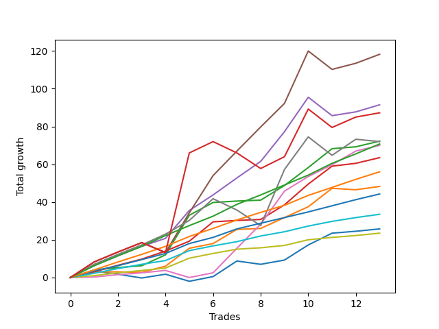

# Long Bernese 003 
- Symbol: ES_SmolBoi
- Date Range: 03/18/2022 - 09/30/2022
- Trading Period: 7:20-12:30
- Number of Trades: 21



| Name | Win Percent | Profit | Avg Profit / Trade | Avg Time / Trade |      | Name | Win Percent | Profit | Avg Profit / Trade | Avg Time / Trade |
| ---- | ----------- | ------ | ------------------ | ---------------- | ---- | ---- | ----------- | ------ | ------------------ | ---------------- |
| Sorted By <br> Profit | | | | | | Sorted By <br> Win Percentage ||||
| Five | 85.71 | 75375.00 | 3589.29 | 36:05 |     | Eighty-Five | 95.24 | 47375.00 | 2255.95 | 17:38 |
| NEWFI 0000 | 76.19 | 57375.00 | 2732.14 | 39:38 |     | Two | 95.24 | 43625.00 | 2077.38 | 19:51 |
| Four | 90.48 | 57000.00 | 2714.29 | 27:43 |     | Three | 95.24 | 38125.00 | 1815.48 | 17:12 |
| Seven | 76.19 | 56000.00 | 2666.67 | 40:27 |     | Eighty-Four | 95.24 | 36750.00 | 1750.00 | 14:01 |
| Eighty-Five | 95.24 | 47375.00 | 2255.95 | 17:38 |     | Eighty-Three | 95.24 | 27000.00 | 1285.71 | 12:05 |
| Two | 95.24 | 43625.00 | 2077.38 | 19:51 |     | Eighty-Two | 95.24 | 17875.00 | 851.19 | 08:06 |
| Three | 95.24 | 38125.00 | 1815.48 | 17:12 |     | Eighty-One | 95.24 | 10125.00 | 482.14 | 05:44 |
| Eighty-Four | 95.24 | 36750.00 | 1750.00 | 14:01 |     | Four | 90.48 | 57000.00 | 2714.29 | 27:43 |
| Six | 80.95 | 36125.00 | 1720.24 | 16:10 |     | Five | 85.71 | 75375.00 | 3589.29 | 36:05 |
| One | 85.71 | 29875.00 | 1422.62 | 12:28 |     | One | 85.71 | 29875.00 | 1422.62 | 12:28 |
| Eighty-Three | 95.24 | 27000.00 | 1285.71 | 12:05 |     | Six | 80.95 | 36125.00 | 1720.24 | 16:10 |
| Eighty-Two | 95.24 | 17875.00 | 851.19 | 08:06 |     | NEWFI 0000 | 76.19 | 57375.00 | 2732.14 | 39:38 |
| Zero | 76.19 | 13375.00 | 636.90 | 07:30 |     | Seven | 76.19 | 56000.00 | 2666.67 | 40:27 |
| Eighty-One | 95.24 | 10125.00 | 482.14 | 05:44 |     | Zero | 76.19 | 13375.00 | 636.90 | 07:30 |

## NO STOPLOSS

### Test Zero
* Sell when price hits the middle line of the 20p bollinger
* No Stoploss
* Results:
```
Total Trades: 21
Percent Up: 76.19
Percent Down: 23.81
Total Points Moved Up: 26.75
Potential Profit: 13375.00
Total Points Ups: 47.25 Count Ups: 16
Total Points Downs: -20.50 Count Downs: 5
```

<details><summary>Trades</summary>

<code>In: 2022-03-22 11:29:00		Out: 2022-03-22 11:34:50		Total Position Time: 05:50		Total Move Up: 3.50		Total to Date: 3.50</code> <br />
<code>In: 2022-03-25 12:25:00		Out: 2022-03-25 12:37:05		Total Position Time: 12:05		Total Move Up: -1.75		Total to Date: 1.75</code> <br />
<code>In: 2022-03-25 12:26:00		Out: 2022-03-25 12:37:05		Total Position Time: 11:05		Total Move Up: -2.00		Total to Date: -0.25</code> <br />
<code>In: 2022-03-31 08:37:00		Out: 2022-03-31 08:38:15		Total Position Time: 01:15		Total Move Up: 2.00		Total to Date: 1.75</code> <br />
<code>In: 2022-05-04 11:37:00		Out: 2022-05-04 11:37:10		Total Position Time: 00:10		Total Move Up: -3.75		Total to Date: -2.00</code> <br />
<code>In: 2022-05-06 09:03:00		Out: 2022-05-06 09:03:10		Total Position Time: 00:10		Total Move Up: 2.50		Total to Date: 0.50</code> <br />
<code>In: 2022-05-06 11:11:00		Out: 2022-05-06 11:12:20		Total Position Time: 01:20		Total Move Up: 8.25		Total to Date: 8.75</code> <br />
<code>In: 2022-05-06 11:28:00		Out: 2022-05-06 11:40:25		Total Position Time: 12:25		Total Move Up: -1.75		Total to Date: 7.00</code> <br />
<code>In: 2022-05-13 11:07:00		Out: 2022-05-13 11:19:15		Total Position Time: 12:15		Total Move Up: 2.25		Total to Date: 9.25</code> <br />
<code>In: 2022-05-17 11:25:00		Out: 2022-05-17 11:27:30		Total Position Time: 02:30		Total Move Up: 8.00		Total to Date: 17.25</code> <br />
<code>In: 2022-05-25 08:40:00		Out: 2022-05-25 08:44:05		Total Position Time: 04:05		Total Move Up: 6.25		Total to Date: 23.50</code> <br />
<code>In: 2022-07-08 09:45:00		Out: 2022-07-08 09:48:40		Total Position Time: 03:40		Total Move Up: 1.00		Total to Date: 24.50</code> <br />
<code>In: 2022-07-12 10:28:00		Out: 2022-07-12 10:28:50		Total Position Time: 00:50		Total Move Up: 1.25		Total to Date: 25.75</code> <br />
<code>In: 2022-08-05 11:32:00		Out: 2022-08-05 11:44:30		Total Position Time: 12:30		Total Move Up: 0.25		Total to Date: 26.00</code> <br />
<code>In: 2022-08-10 09:25:00		Out: 2022-08-10 09:30:05		Total Position Time: 05:05		Total Move Up: 1.75		Total to Date: 27.75</code> <br />
<code>In: 2022-08-18 09:47:00		Out: 2022-08-18 09:47:30		Total Position Time: 00:30		Total Move Up: 1.25		Total to Date: 29.00</code> <br />
<code>In: 2022-08-25 09:19:00		Out: 2022-08-25 09:26:05		Total Position Time: 07:05		Total Move Up: 3.25		Total to Date: 32.25</code> <br />
<code>In: 2022-09-09 09:28:00		Out: 2022-09-09 09:28:10		Total Position Time: 00:10		Total Move Up: 1.50		Total to Date: 33.75</code> <br />
<code>In: 2022-09-12 08:59:00		Out: 2022-09-12 09:58:55		Total Position Time: 59:55		Total Move Up: -11.25		Total to Date: 22.50</code> <br />
<code>In: 2022-09-19 10:40:00		Out: 2022-09-19 10:42:40		Total Position Time: 02:40		Total Move Up: 2.25		Total to Date: 24.75</code> <br />
<code>In: 2022-09-19 11:26:00		Out: 2022-09-19 11:28:05		Total Position Time: 02:05		Total Move Up: 2.00		Total to Date: 26.75</code> <br />


</details>

### Test One
* Sell when the price hits the upper line of the 20p 1std bollinger
* No Stoploss
* Results:
```
Total Trades: 21
Percent Up: 85.71
Percent Down: 14.29
Total Points Moved Up: 59.75
Potential Profit: 29875.00
Total Points Ups: 72.00 Count Ups: 18
Total Points Downs: -12.25 Count Downs: 3
```

<details><summary>Trades</summary>

<code>In: 2022-03-22 11:29:00		Out: 2022-03-22 11:47:05		Total Position Time: 18:05		Total Move Up: 3.00		Total to Date: 3.00</code> <br />
<code>In: 2022-03-25 12:25:00		Out: 2022-03-25 12:38:35		Total Position Time: 13:35		Total Move Up: 0.00		Total to Date: 3.00</code> <br />
<code>In: 2022-03-25 12:26:00		Out: 2022-03-25 12:38:35		Total Position Time: 12:35		Total Move Up: -0.25		Total to Date: 2.75</code> <br />
<code>In: 2022-03-31 08:37:00		Out: 2022-03-31 08:40:35		Total Position Time: 03:35		Total Move Up: 3.25		Total to Date: 6.00</code> <br />
<code>In: 2022-05-04 11:37:00		Out: 2022-05-04 11:41:35		Total Position Time: 04:35		Total Move Up: 9.50		Total to Date: 15.50</code> <br />
<code>In: 2022-05-06 09:03:00		Out: 2022-05-06 09:03:10		Total Position Time: 00:10		Total Move Up: 2.50		Total to Date: 18.00</code> <br />
<code>In: 2022-05-06 11:11:00		Out: 2022-05-06 11:24:25		Total Position Time: 13:25		Total Move Up: 7.50		Total to Date: 25.50</code> <br />
<code>In: 2022-05-06 11:28:00		Out: 2022-05-06 11:49:10		Total Position Time: 21:10		Total Move Up: 0.50		Total to Date: 26.00</code> <br />
<code>In: 2022-05-13 11:07:00		Out: 2022-05-13 11:20:00		Total Position Time: 13:00		Total Move Up: 5.75		Total to Date: 31.75</code> <br />
<code>In: 2022-05-17 11:25:00		Out: 2022-05-17 11:37:35		Total Position Time: 12:35		Total Move Up: 5.75		Total to Date: 37.50</code> <br />
<code>In: 2022-05-25 08:40:00		Out: 2022-05-25 08:48:35		Total Position Time: 08:35		Total Move Up: 9.75		Total to Date: 47.25</code> <br />
<code>In: 2022-07-08 09:45:00		Out: 2022-07-08 10:06:55		Total Position Time: 21:55		Total Move Up: -0.75		Total to Date: 46.50</code> <br />
<code>In: 2022-07-12 10:28:00		Out: 2022-07-12 10:30:05		Total Position Time: 02:05		Total Move Up: 1.75		Total to Date: 48.25</code> <br />
<code>In: 2022-08-05 11:32:00		Out: 2022-08-05 11:45:25		Total Position Time: 13:25		Total Move Up: 1.25		Total to Date: 49.50</code> <br />
<code>In: 2022-08-10 09:25:00		Out: 2022-08-10 09:34:05		Total Position Time: 09:05		Total Move Up: 3.50		Total to Date: 53.00</code> <br />
<code>In: 2022-08-18 09:47:00		Out: 2022-08-18 09:55:20		Total Position Time: 08:20		Total Move Up: 2.25		Total to Date: 55.25</code> <br />
<code>In: 2022-08-25 09:19:00		Out: 2022-08-25 09:28:20		Total Position Time: 09:20		Total Move Up: 4.25		Total to Date: 59.50</code> <br />
<code>In: 2022-09-09 09:28:00		Out: 2022-09-09 09:33:25		Total Position Time: 05:25		Total Move Up: 2.75		Total to Date: 62.25</code> <br />
<code>In: 2022-09-12 08:59:00		Out: 2022-09-12 09:58:55		Total Position Time: 59:55		Total Move Up: -11.25		Total to Date: 51.00</code> <br />
<code>In: 2022-09-19 10:40:00		Out: 2022-09-19 10:46:20		Total Position Time: 06:20		Total Move Up: 5.25		Total to Date: 56.25</code> <br />
<code>In: 2022-09-19 11:26:00		Out: 2022-09-19 11:30:40		Total Position Time: 04:40		Total Move Up: 3.50		Total to Date: 59.75</code> <br />


</details>

### Test Two
* Sell when the price hits the upper line of the 20p 2std bollinger
* No Stoploss
* Results:
```
Total Trades: 21
Percent Up: 95.24
Percent Down: 4.76
Total Points Moved Up: 87.25
Potential Profit: 43625.00
Total Points Ups: 98.50 Count Ups: 20
Total Points Downs: -11.25 Count Downs: 1
```

<details><summary>Trades</summary>

<code>In: 2022-03-22 11:29:00		Out: 2022-03-22 11:53:55		Total Position Time: 24:55		Total Move Up: 4.00		Total to Date: 4.00</code> <br />
<code>In: 2022-03-25 12:25:00		Out: 2022-03-25 12:41:35		Total Position Time: 16:35		Total Move Up: 1.25		Total to Date: 5.25</code> <br />
<code>In: 2022-03-25 12:26:00		Out: 2022-03-25 12:41:35		Total Position Time: 15:35		Total Move Up: 1.00		Total to Date: 6.25</code> <br />
<code>In: 2022-03-31 08:37:00		Out: 2022-03-31 08:41:10		Total Position Time: 04:10		Total Move Up: 5.75		Total to Date: 12.00</code> <br />
<code>In: 2022-05-04 11:37:00		Out: 2022-05-04 11:43:45		Total Position Time: 06:45		Total Move Up: 21.00		Total to Date: 33.00</code> <br />
<code>In: 2022-05-06 09:03:00		Out: 2022-05-06 09:03:55		Total Position Time: 00:55		Total Move Up: 6.75		Total to Date: 39.75</code> <br />
<code>In: 2022-05-06 11:11:00		Out: 2022-05-06 11:49:10		Total Position Time: 38:10		Total Move Up: 0.75		Total to Date: 40.50</code> <br />
<code>In: 2022-05-06 11:28:00		Out: 2022-05-06 11:49:10		Total Position Time: 21:10		Total Move Up: 0.50		Total to Date: 41.00</code> <br />
<code>In: 2022-05-13 11:07:00		Out: 2022-05-13 11:31:20		Total Position Time: 24:20		Total Move Up: 7.75		Total to Date: 48.75</code> <br />
<code>In: 2022-05-17 11:25:00		Out: 2022-05-17 11:40:00		Total Position Time: 15:00		Total Move Up: 9.50		Total to Date: 58.25</code> <br />
<code>In: 2022-05-25 08:40:00		Out: 2022-05-25 09:02:20		Total Position Time: 22:20		Total Move Up: 10.00		Total to Date: 68.25</code> <br />
<code>In: 2022-07-08 09:45:00		Out: 2022-07-08 10:10:30		Total Position Time: 25:30		Total Move Up: 1.00		Total to Date: 69.25</code> <br />
<code>In: 2022-07-12 10:28:00		Out: 2022-07-12 10:31:30		Total Position Time: 03:30		Total Move Up: 3.00		Total to Date: 72.25</code> <br />
<code>In: 2022-08-05 11:32:00		Out: 2022-08-05 11:47:05		Total Position Time: 15:05		Total Move Up: 1.75		Total to Date: 74.00</code> <br />
<code>In: 2022-08-10 09:25:00		Out: 2022-08-10 09:56:20		Total Position Time: 31:20		Total Move Up: 4.25		Total to Date: 78.25</code> <br />
<code>In: 2022-08-18 09:47:00		Out: 2022-08-18 10:05:55		Total Position Time: 18:55		Total Move Up: 2.75		Total to Date: 81.00</code> <br />
<code>In: 2022-08-25 09:19:00		Out: 2022-08-25 09:33:55		Total Position Time: 14:55		Total Move Up: 4.50		Total to Date: 85.50</code> <br />
<code>In: 2022-09-09 09:28:00		Out: 2022-09-09 09:35:40		Total Position Time: 07:40		Total Move Up: 3.25		Total to Date: 88.75</code> <br />
<code>In: 2022-09-12 08:59:00		Out: 2022-09-12 09:58:55		Total Position Time: 59:55		Total Move Up: -11.25		Total to Date: 77.50</code> <br />
<code>In: 2022-09-19 10:40:00		Out: 2022-09-19 11:17:45		Total Position Time: 37:45		Total Move Up: 1.50		Total to Date: 79.00</code> <br />
<code>In: 2022-09-19 11:26:00		Out: 2022-09-19 11:38:35		Total Position Time: 12:35		Total Move Up: 8.25		Total to Date: 87.25</code> <br />


</details>

### Test Three
* Sell when price hits the middle line of the 50p bollinger
* No Stoploss
* Results:
```
Total Trades: 21
Percent Up: 95.24
Percent Down: 4.76
Total Points Moved Up: 76.25
Potential Profit: 38125.00
Total Points Ups: 87.50 Count Ups: 20
Total Points Downs: -11.25 Count Downs: 1
```

<details><summary>Trades</summary>

<code>In: 2022-03-22 11:29:00		Out: 2022-03-22 11:52:45		Total Position Time: 23:45		Total Move Up: 3.00		Total to Date: 3.00</code> <br />
<code>In: 2022-03-25 12:25:00		Out: 2022-03-25 12:42:05		Total Position Time: 17:05		Total Move Up: 3.50		Total to Date: 6.50</code> <br />
<code>In: 2022-03-25 12:26:00		Out: 2022-03-25 12:42:05		Total Position Time: 16:05		Total Move Up: 3.25		Total to Date: 9.75</code> <br />
<code>In: 2022-03-31 08:37:00		Out: 2022-03-31 08:41:05		Total Position Time: 04:05		Total Move Up: 4.25		Total to Date: 14.00</code> <br />
<code>In: 2022-05-04 11:37:00		Out: 2022-05-04 11:41:15		Total Position Time: 04:15		Total Move Up: 5.25		Total to Date: 19.25</code> <br />
<code>In: 2022-05-06 09:03:00		Out: 2022-05-06 09:06:05		Total Position Time: 03:05		Total Move Up: 10.25		Total to Date: 29.50</code> <br />
<code>In: 2022-05-06 11:11:00		Out: 2022-05-06 11:49:10		Total Position Time: 38:10		Total Move Up: 0.75		Total to Date: 30.25</code> <br />
<code>In: 2022-05-06 11:28:00		Out: 2022-05-06 11:49:10		Total Position Time: 21:10		Total Move Up: 0.50		Total to Date: 30.75</code> <br />
<code>In: 2022-05-13 11:07:00		Out: 2022-05-13 11:31:20		Total Position Time: 24:20		Total Move Up: 7.75		Total to Date: 38.50</code> <br />
<code>In: 2022-05-17 11:25:00		Out: 2022-05-17 11:40:05		Total Position Time: 15:05		Total Move Up: 11.00		Total to Date: 49.50</code> <br />
<code>In: 2022-05-25 08:40:00		Out: 2022-05-25 08:58:20		Total Position Time: 18:20		Total Move Up: 9.50		Total to Date: 59.00</code> <br />
<code>In: 2022-07-08 09:45:00		Out: 2022-07-08 10:11:05		Total Position Time: 26:05		Total Move Up: 1.50		Total to Date: 60.50</code> <br />
<code>In: 2022-07-12 10:28:00		Out: 2022-07-12 10:41:35		Total Position Time: 13:35		Total Move Up: 3.00		Total to Date: 63.50</code> <br />
<code>In: 2022-08-05 11:32:00		Out: 2022-08-05 11:47:05		Total Position Time: 15:05		Total Move Up: 1.75		Total to Date: 65.25</code> <br />
<code>In: 2022-08-10 09:25:00		Out: 2022-08-10 09:41:55		Total Position Time: 16:55		Total Move Up: 4.50		Total to Date: 69.75</code> <br />
<code>In: 2022-08-18 09:47:00		Out: 2022-08-18 10:06:05		Total Position Time: 19:05		Total Move Up: 2.75		Total to Date: 72.50</code> <br />
<code>In: 2022-08-25 09:19:00		Out: 2022-08-25 09:28:30		Total Position Time: 09:30		Total Move Up: 4.75		Total to Date: 77.25</code> <br />
<code>In: 2022-09-09 09:28:00		Out: 2022-09-09 09:33:30		Total Position Time: 05:30		Total Move Up: 3.25		Total to Date: 80.50</code> <br />
<code>In: 2022-09-12 08:59:00		Out: 2022-09-12 09:58:55		Total Position Time: 59:55		Total Move Up: -11.25		Total to Date: 69.25</code> <br />
<code>In: 2022-09-19 10:40:00		Out: 2022-09-19 10:45:45		Total Position Time: 05:45		Total Move Up: 3.50		Total to Date: 72.75</code> <br />
<code>In: 2022-09-19 11:26:00		Out: 2022-09-19 11:30:40		Total Position Time: 04:40		Total Move Up: 3.50		Total to Date: 76.25</code> <br />


</details>

### Test Four
* Sell when the price hits the upper line of the 50p 1std bollinger
* No Stoploss
* Results:
```
Total Trades: 21
Percent Up: 90.48
Percent Down: 9.52
Total Points Moved Up: 114.00
Potential Profit: 57000.00
Total Points Ups: 135.00 Count Ups: 19
Total Points Downs: -21.00 Count Downs: 2
```

<details><summary>Trades</summary>

<code>In: 2022-03-22 11:29:00		Out: 2022-03-22 11:56:05		Total Position Time: 27:05		Total Move Up: 6.25		Total to Date: 6.25</code> <br />
<code>In: 2022-03-25 12:25:00		Out: 2022-03-25 12:46:00		Total Position Time: 21:00		Total Move Up: 5.25		Total to Date: 11.50</code> <br />
<code>In: 2022-03-25 12:26:00		Out: 2022-03-25 12:46:00		Total Position Time: 20:00		Total Move Up: 5.00		Total to Date: 16.50</code> <br />
<code>In: 2022-03-31 08:37:00		Out: 2022-03-31 09:00:15		Total Position Time: 23:15		Total Move Up: 4.25		Total to Date: 20.75</code> <br />
<code>In: 2022-05-04 11:37:00		Out: 2022-05-04 11:42:00		Total Position Time: 05:00		Total Move Up: 14.75		Total to Date: 35.50</code> <br />
<code>In: 2022-05-06 09:03:00		Out: 2022-05-06 09:22:25		Total Position Time: 19:25		Total Move Up: 8.25		Total to Date: 43.75</code> <br />
<code>In: 2022-05-06 11:11:00		Out: 2022-05-06 11:50:10		Total Position Time: 39:10		Total Move Up: 9.00		Total to Date: 52.75</code> <br />
<code>In: 2022-05-06 11:28:00		Out: 2022-05-06 11:50:10		Total Position Time: 22:10		Total Move Up: 8.75		Total to Date: 61.50</code> <br />
<code>In: 2022-05-13 11:07:00		Out: 2022-05-13 11:32:00		Total Position Time: 25:00		Total Move Up: 15.75		Total to Date: 77.25</code> <br />
<code>In: 2022-05-17 11:25:00		Out: 2022-05-17 11:44:30		Total Position Time: 19:30		Total Move Up: 18.25		Total to Date: 95.50</code> <br />
<code>In: 2022-05-25 08:40:00		Out: 2022-05-25 09:39:55		Total Position Time: 59:55		Total Move Up: -9.75		Total to Date: 85.75</code> <br />
<code>In: 2022-07-08 09:45:00		Out: 2022-07-08 10:26:30		Total Position Time: 41:30		Total Move Up: 2.00		Total to Date: 87.75</code> <br />
<code>In: 2022-07-12 10:28:00		Out: 2022-07-12 10:52:25		Total Position Time: 24:25		Total Move Up: 3.75		Total to Date: 91.50</code> <br />
<code>In: 2022-08-05 11:32:00		Out: 2022-08-05 12:10:20		Total Position Time: 38:20		Total Move Up: 2.50		Total to Date: 94.00</code> <br />
<code>In: 2022-08-10 09:25:00		Out: 2022-08-10 10:08:05		Total Position Time: 43:05		Total Move Up: 4.00		Total to Date: 98.00</code> <br />
<code>In: 2022-08-18 09:47:00		Out: 2022-08-18 10:08:25		Total Position Time: 21:25		Total Move Up: 4.50		Total to Date: 102.50</code> <br />
<code>In: 2022-08-25 09:19:00		Out: 2022-08-25 10:01:45		Total Position Time: 42:45		Total Move Up: 4.50		Total to Date: 107.00</code> <br />
<code>In: 2022-09-09 09:28:00		Out: 2022-09-09 09:37:40		Total Position Time: 09:40		Total Move Up: 6.25		Total to Date: 113.25</code> <br />
<code>In: 2022-09-12 08:59:00		Out: 2022-09-12 09:58:55		Total Position Time: 59:55		Total Move Up: -11.25		Total to Date: 102.00</code> <br />
<code>In: 2022-09-19 10:40:00		Out: 2022-09-19 10:47:15		Total Position Time: 07:15		Total Move Up: 5.75		Total to Date: 107.75</code> <br />
<code>In: 2022-09-19 11:26:00		Out: 2022-09-19 11:38:25		Total Position Time: 12:25		Total Move Up: 6.25		Total to Date: 114.00</code> <br />


</details>

### Test Five
* Sell when the price hits the upper line of the 50p 2std bollinger
* No Stoploss
* Results:
```
Total Trades: 21
Percent Up: 85.71
Percent Down: 14.29
Total Points Moved Up: 150.75
Potential Profit: 75375.00
Total Points Ups: 177.00 Count Ups: 18
Total Points Downs: -26.25 Count Downs: 3
```

<details><summary>Trades</summary>

<code>In: 2022-03-22 11:29:00		Out: 2022-03-22 12:05:25		Total Position Time: 36:25		Total Move Up: 8.25		Total to Date: 8.25</code> <br />
<code>In: 2022-03-25 12:25:00		Out: 2022-03-25 12:46:00		Total Position Time: 21:00		Total Move Up: 5.25		Total to Date: 13.50</code> <br />
<code>In: 2022-03-25 12:26:00		Out: 2022-03-25 12:46:00		Total Position Time: 20:00		Total Move Up: 5.00		Total to Date: 18.50</code> <br />
<code>In: 2022-03-31 08:37:00		Out: 2022-03-31 09:36:55		Total Position Time: 59:55		Total Move Up: -5.25		Total to Date: 13.25</code> <br />
<code>In: 2022-05-04 11:37:00		Out: 2022-05-04 11:43:45		Total Position Time: 06:45		Total Move Up: 21.00		Total to Date: 34.25</code> <br />
<code>In: 2022-05-06 09:03:00		Out: 2022-05-06 09:36:15		Total Position Time: 33:15		Total Move Up: 19.75		Total to Date: 54.00</code> <br />
<code>In: 2022-05-06 11:11:00		Out: 2022-05-06 11:50:35		Total Position Time: 39:35		Total Move Up: 13.00		Total to Date: 67.00</code> <br />
<code>In: 2022-05-06 11:28:00		Out: 2022-05-06 11:50:35		Total Position Time: 22:35		Total Move Up: 12.75		Total to Date: 79.75</code> <br />
<code>In: 2022-05-13 11:07:00		Out: 2022-05-13 11:51:15		Total Position Time: 44:15		Total Move Up: 12.50		Total to Date: 92.25</code> <br />
<code>In: 2022-05-17 11:25:00		Out: 2022-05-17 11:48:45		Total Position Time: 23:45		Total Move Up: 27.75		Total to Date: 120.00</code> <br />
<code>In: 2022-05-25 08:40:00		Out: 2022-05-25 09:39:55		Total Position Time: 59:55		Total Move Up: -9.75		Total to Date: 110.25</code> <br />
<code>In: 2022-07-08 09:45:00		Out: 2022-07-08 10:26:55		Total Position Time: 41:55		Total Move Up: 3.25		Total to Date: 113.50</code> <br />
<code>In: 2022-07-12 10:28:00		Out: 2022-07-12 10:54:05		Total Position Time: 26:05		Total Move Up: 4.75		Total to Date: 118.25</code> <br />
<code>In: 2022-08-05 11:32:00		Out: 2022-08-05 12:12:15		Total Position Time: 40:15		Total Move Up: 4.75		Total to Date: 123.00</code> <br />
<code>In: 2022-08-10 09:25:00		Out: 2022-08-10 10:10:10		Total Position Time: 45:10		Total Move Up: 5.50		Total to Date: 128.50</code> <br />
<code>In: 2022-08-18 09:47:00		Out: 2022-08-18 10:11:40		Total Position Time: 24:40		Total Move Up: 7.25		Total to Date: 135.75</code> <br />
<code>In: 2022-08-25 09:19:00		Out: 2022-08-25 10:18:55		Total Position Time: 59:55		Total Move Up: 5.25		Total to Date: 141.00</code> <br />
<code>In: 2022-09-09 09:28:00		Out: 2022-09-09 09:49:35		Total Position Time: 21:35		Total Move Up: 8.25		Total to Date: 149.25</code> <br />
<code>In: 2022-09-12 08:59:00		Out: 2022-09-12 09:58:55		Total Position Time: 59:55		Total Move Up: -11.25		Total to Date: 138.00</code> <br />
<code>In: 2022-09-19 10:40:00		Out: 2022-09-19 11:38:35		Total Position Time: 58:35		Total Move Up: 4.50		Total to Date: 142.50</code> <br />
<code>In: 2022-09-19 11:26:00		Out: 2022-09-19 11:38:35		Total Position Time: 12:35		Total Move Up: 8.25		Total to Date: 150.75</code> <br />


</details>

### Test Six
* Sell when the price hits the middle line of the 1std VWAP
* No Stoploss
* Results:
```
Total Trades: 21
Percent Up: 80.95
Percent Down: 19.05
Total Points Moved Up: 72.25
Potential Profit: 36125.00
Total Points Ups: 88.00 Count Ups: 17
Total Points Downs: -15.75 Count Downs: 4
```

<details><summary>Trades</summary>

<code>In: 2022-03-22 11:29:00		Out: 2022-03-22 11:29:10		Total Position Time: 00:10		Total Move Up: 0.25		Total to Date: 0.25</code> <br />
<code>In: 2022-03-25 12:25:00		Out: 2022-03-25 12:41:35		Total Position Time: 16:35		Total Move Up: 1.25		Total to Date: 1.50</code> <br />
<code>In: 2022-03-25 12:26:00		Out: 2022-03-25 12:41:35		Total Position Time: 15:35		Total Move Up: 1.00		Total to Date: 2.50</code> <br />
<code>In: 2022-03-31 08:37:00		Out: 2022-03-31 08:37:40		Total Position Time: 00:40		Total Move Up: 1.25		Total to Date: 3.75</code> <br />
<code>In: 2022-05-04 11:37:00		Out: 2022-05-04 11:37:10		Total Position Time: 00:10		Total Move Up: -3.75		Total to Date: 0.00</code> <br />
<code>In: 2022-05-06 09:03:00		Out: 2022-05-06 09:03:10		Total Position Time: 00:10		Total Move Up: 2.50		Total to Date: 2.50</code> <br />
<code>In: 2022-05-06 11:11:00		Out: 2022-05-06 11:50:20		Total Position Time: 39:20		Total Move Up: 13.00		Total to Date: 15.50</code> <br />
<code>In: 2022-05-06 11:28:00		Out: 2022-05-06 11:50:20		Total Position Time: 22:20		Total Move Up: 12.75		Total to Date: 28.25</code> <br />
<code>In: 2022-05-13 11:07:00		Out: 2022-05-13 11:52:25		Total Position Time: 45:25		Total Move Up: 17.50		Total to Date: 45.75</code> <br />
<code>In: 2022-05-17 11:25:00		Out: 2022-05-17 11:27:25		Total Position Time: 02:25		Total Move Up: 7.75		Total to Date: 53.50</code> <br />
<code>In: 2022-05-25 08:40:00		Out: 2022-05-25 08:44:05		Total Position Time: 04:05		Total Move Up: 6.25		Total to Date: 59.75</code> <br />
<code>In: 2022-07-08 09:45:00		Out: 2022-07-08 10:29:10		Total Position Time: 44:10		Total Move Up: 7.25		Total to Date: 67.00</code> <br />
<code>In: 2022-07-12 10:28:00		Out: 2022-07-12 10:31:15		Total Position Time: 03:15		Total Move Up: 3.00		Total to Date: 70.00</code> <br />
<code>In: 2022-08-05 11:32:00		Out: 2022-08-05 11:34:35		Total Position Time: 02:35		Total Move Up: 0.75		Total to Date: 70.75</code> <br />
<code>In: 2022-08-10 09:25:00		Out: 2022-08-10 09:25:10		Total Position Time: 00:10		Total Move Up: -0.25		Total to Date: 70.50</code> <br />
<code>In: 2022-08-18 09:47:00		Out: 2022-08-18 10:06:30		Total Position Time: 19:30		Total Move Up: 4.00		Total to Date: 74.50</code> <br />
<code>In: 2022-08-25 09:19:00		Out: 2022-08-25 10:18:55		Total Position Time: 59:55		Total Move Up: 5.25		Total to Date: 79.75</code> <br />
<code>In: 2022-09-09 09:28:00		Out: 2022-09-09 09:28:10		Total Position Time: 00:10		Total Move Up: 1.50		Total to Date: 81.25</code> <br />
<code>In: 2022-09-12 08:59:00		Out: 2022-09-12 09:58:55		Total Position Time: 59:55		Total Move Up: -11.25		Total to Date: 70.00</code> <br />
<code>In: 2022-09-19 10:40:00		Out: 2022-09-19 10:40:10		Total Position Time: 00:10		Total Move Up: -0.50		Total to Date: 69.50</code> <br />
<code>In: 2022-09-19 11:26:00		Out: 2022-09-19 11:28:50		Total Position Time: 02:50		Total Move Up: 2.75		Total to Date: 72.25</code> <br />


</details>

### Test Seven
* Sell when the price hits the upper line of the 1std VWAP
* No Stoploss
* Results:
```
Total Trades: 21
Percent Up: 76.19
Percent Down: 23.81
Total Points Moved Up: 112.00
Potential Profit: 56000.00
Total Points Ups: 148.50 Count Ups: 16
Total Points Downs: -36.50 Count Downs: 5
```

<details><summary>Trades</summary>

<code>In: 2022-03-22 11:29:00		Out: 2022-03-22 11:57:20		Total Position Time: 28:20		Total Move Up: 7.00		Total to Date: 7.00</code> <br />
<code>In: 2022-03-25 12:25:00		Out: 2022-03-25 12:46:00		Total Position Time: 21:00		Total Move Up: 5.25		Total to Date: 12.25</code> <br />
<code>In: 2022-03-25 12:26:00		Out: 2022-03-25 12:46:00		Total Position Time: 20:00		Total Move Up: 5.00		Total to Date: 17.25</code> <br />
<code>In: 2022-03-31 08:37:00		Out: 2022-03-31 08:41:10		Total Position Time: 04:10		Total Move Up: 5.75		Total to Date: 23.00</code> <br />
<code>In: 2022-05-04 11:37:00		Out: 2022-05-04 11:41:30		Total Position Time: 04:30		Total Move Up: 7.25		Total to Date: 30.25</code> <br />
<code>In: 2022-05-06 09:03:00		Out: 2022-05-06 09:06:40		Total Position Time: 03:40		Total Move Up: 11.50		Total to Date: 41.75</code> <br />
<code>In: 2022-05-06 11:11:00		Out: 2022-05-06 12:10:55		Total Position Time: 59:55		Total Move Up: -6.00		Total to Date: 35.75</code> <br />
<code>In: 2022-05-06 11:28:00		Out: 2022-05-06 12:27:55		Total Position Time: 59:55		Total Move Up: -8.25		Total to Date: 27.50</code> <br />
<code>In: 2022-05-13 11:07:00		Out: 2022-05-13 12:06:55		Total Position Time: 59:55		Total Move Up: 29.75		Total to Date: 57.25</code> <br />
<code>In: 2022-05-17 11:25:00		Out: 2022-05-17 11:40:20		Total Position Time: 15:20		Total Move Up: 17.25		Total to Date: 74.50</code> <br />
<code>In: 2022-05-25 08:40:00		Out: 2022-05-25 09:39:55		Total Position Time: 59:55		Total Move Up: -9.75		Total to Date: 64.75</code> <br />
<code>In: 2022-07-08 09:45:00		Out: 2022-07-08 10:44:55		Total Position Time: 59:55		Total Move Up: 8.50		Total to Date: 73.25</code> <br />
<code>In: 2022-07-12 10:28:00		Out: 2022-07-12 11:27:55		Total Position Time: 59:55		Total Move Up: -1.25		Total to Date: 72.00</code> <br />
<code>In: 2022-08-05 11:32:00		Out: 2022-08-05 12:31:55		Total Position Time: 59:55		Total Move Up: 5.50		Total to Date: 77.50</code> <br />
<code>In: 2022-08-10 09:25:00		Out: 2022-08-10 10:12:05		Total Position Time: 47:05		Total Move Up: 6.25		Total to Date: 83.75</code> <br />
<code>In: 2022-08-18 09:47:00		Out: 2022-08-18 10:37:15		Total Position Time: 50:15		Total Move Up: 10.00		Total to Date: 93.75</code> <br />
<code>In: 2022-08-25 09:19:00		Out: 2022-08-25 10:18:55		Total Position Time: 59:55		Total Move Up: 5.25		Total to Date: 99.00</code> <br />
<code>In: 2022-09-09 09:28:00		Out: 2022-09-09 09:49:40		Total Position Time: 21:40		Total Move Up: 8.50		Total to Date: 107.50</code> <br />
<code>In: 2022-09-12 08:59:00		Out: 2022-09-12 09:58:55		Total Position Time: 59:55		Total Move Up: -11.25		Total to Date: 96.25</code> <br />
<code>In: 2022-09-19 10:40:00		Out: 2022-09-19 11:39:55		Total Position Time: 59:55		Total Move Up: 4.50		Total to Date: 100.75</code> <br />
<code>In: 2022-09-19 11:26:00		Out: 2022-09-19 12:00:25		Total Position Time: 34:25		Total Move Up: 11.25		Total to Date: 112.00</code> <br />


</details>

## TAKE PROFIT

### Test Eighty-One
* Take Profit of 1 Point
* No Stoploss
* Results:
```
Total Trades: 21
Percent Up: 95.24
Percent Down: 4.76
Total Points Moved Up: 20.25
Potential Profit: 10125.00
Total Points Ups: 31.50 Count Ups: 20
Total Points Downs: -11.25 Count Downs: 1
```

<details><summary>Trades</summary>

<code>In: 2022-03-22 11:29:00		Out: 2022-03-22 11:29:25		Total Position Time: 00:25		Total Move Up: 1.00		Total to Date: 1.00</code> <br />
<code>In: 2022-03-25 12:25:00		Out: 2022-03-25 12:41:30		Total Position Time: 16:30		Total Move Up: 1.50		Total to Date: 2.50</code> <br />
<code>In: 2022-03-25 12:26:00		Out: 2022-03-25 12:41:30		Total Position Time: 15:30		Total Move Up: 1.25		Total to Date: 3.75</code> <br />
<code>In: 2022-03-31 08:37:00		Out: 2022-03-31 08:37:40		Total Position Time: 00:40		Total Move Up: 1.25		Total to Date: 5.00</code> <br />
<code>In: 2022-05-04 11:37:00		Out: 2022-05-04 11:41:15		Total Position Time: 04:15		Total Move Up: 5.25		Total to Date: 10.25</code> <br />
<code>In: 2022-05-06 09:03:00		Out: 2022-05-06 09:03:10		Total Position Time: 00:10		Total Move Up: 2.50		Total to Date: 12.75</code> <br />
<code>In: 2022-05-06 11:11:00		Out: 2022-05-06 11:11:40		Total Position Time: 00:40		Total Move Up: 2.25		Total to Date: 15.00</code> <br />
<code>In: 2022-05-06 11:28:00		Out: 2022-05-06 11:30:35		Total Position Time: 02:35		Total Move Up: 0.75		Total to Date: 15.75</code> <br />
<code>In: 2022-05-13 11:07:00		Out: 2022-05-13 11:09:25		Total Position Time: 02:25		Total Move Up: 1.25		Total to Date: 17.00</code> <br />
<code>In: 2022-05-17 11:25:00		Out: 2022-05-17 11:26:40		Total Position Time: 01:40		Total Move Up: 3.00		Total to Date: 20.00</code> <br />
<code>In: 2022-05-25 08:40:00		Out: 2022-05-25 08:40:50		Total Position Time: 00:50		Total Move Up: 1.25		Total to Date: 21.25</code> <br />
<code>In: 2022-07-08 09:45:00		Out: 2022-07-08 09:48:40		Total Position Time: 03:40		Total Move Up: 1.00		Total to Date: 22.25</code> <br />
<code>In: 2022-07-12 10:28:00		Out: 2022-07-12 10:28:50		Total Position Time: 00:50		Total Move Up: 1.25		Total to Date: 23.50</code> <br />
<code>In: 2022-08-05 11:32:00		Out: 2022-08-05 11:34:45		Total Position Time: 02:45		Total Move Up: 1.00		Total to Date: 24.50</code> <br />
<code>In: 2022-08-10 09:25:00		Out: 2022-08-10 09:28:55		Total Position Time: 03:55		Total Move Up: 1.25		Total to Date: 25.75</code> <br />
<code>In: 2022-08-18 09:47:00		Out: 2022-08-18 09:47:15		Total Position Time: 00:15		Total Move Up: 1.00		Total to Date: 26.75</code> <br />
<code>In: 2022-08-25 09:19:00		Out: 2022-08-25 09:19:45		Total Position Time: 00:45		Total Move Up: 1.00		Total to Date: 27.75</code> <br />
<code>In: 2022-09-09 09:28:00		Out: 2022-09-09 09:28:10		Total Position Time: 00:10		Total Move Up: 1.50		Total to Date: 29.25</code> <br />
<code>In: 2022-09-12 08:59:00		Out: 2022-09-12 09:58:55		Total Position Time: 59:55		Total Move Up: -11.25		Total to Date: 18.00</code> <br />
<code>In: 2022-09-19 10:40:00		Out: 2022-09-19 10:40:45		Total Position Time: 00:45		Total Move Up: 1.00		Total to Date: 19.00</code> <br />
<code>In: 2022-09-19 11:26:00		Out: 2022-09-19 11:27:50		Total Position Time: 01:50		Total Move Up: 1.25		Total to Date: 20.25</code> <br />


</details>

### Test Eighty-Two
* Take Profit of 2 Point
* No Stoploss
* Results:
```
Total Trades: 21
Percent Up: 95.24
Percent Down: 4.76
Total Points Moved Up: 35.75
Potential Profit: 17875.00
Total Points Ups: 47.00 Count Ups: 20
Total Points Downs: -11.25 Count Downs: 1
```

<details><summary>Trades</summary>

<code>In: 2022-03-22 11:29:00		Out: 2022-03-22 11:32:50		Total Position Time: 03:50		Total Move Up: 2.25		Total to Date: 2.25</code> <br />
<code>In: 2022-03-25 12:25:00		Out: 2022-03-25 12:41:55		Total Position Time: 16:55		Total Move Up: 2.50		Total to Date: 4.75</code> <br />
<code>In: 2022-03-25 12:26:00		Out: 2022-03-25 12:41:55		Total Position Time: 15:55		Total Move Up: 2.25		Total to Date: 7.00</code> <br />
<code>In: 2022-03-31 08:37:00		Out: 2022-03-31 08:38:15		Total Position Time: 01:15		Total Move Up: 2.00		Total to Date: 9.00</code> <br />
<code>In: 2022-05-04 11:37:00		Out: 2022-05-04 11:41:15		Total Position Time: 04:15		Total Move Up: 5.25		Total to Date: 14.25</code> <br />
<code>In: 2022-05-06 09:03:00		Out: 2022-05-06 09:03:10		Total Position Time: 00:10		Total Move Up: 2.50		Total to Date: 16.75</code> <br />
<code>In: 2022-05-06 11:11:00		Out: 2022-05-06 11:11:40		Total Position Time: 00:40		Total Move Up: 2.25		Total to Date: 19.00</code> <br />
<code>In: 2022-05-06 11:28:00		Out: 2022-05-06 11:49:25		Total Position Time: 21:25		Total Move Up: 3.00		Total to Date: 22.00</code> <br />
<code>In: 2022-05-13 11:07:00		Out: 2022-05-13 11:09:30		Total Position Time: 02:30		Total Move Up: 2.25		Total to Date: 24.25</code> <br />
<code>In: 2022-05-17 11:25:00		Out: 2022-05-17 11:26:40		Total Position Time: 01:40		Total Move Up: 3.00		Total to Date: 27.25</code> <br />
<code>In: 2022-05-25 08:40:00		Out: 2022-05-25 08:40:55		Total Position Time: 00:55		Total Move Up: 2.50		Total to Date: 29.75</code> <br />
<code>In: 2022-07-08 09:45:00		Out: 2022-07-08 09:49:45		Total Position Time: 04:45		Total Move Up: 2.00		Total to Date: 31.75</code> <br />
<code>In: 2022-07-12 10:28:00		Out: 2022-07-12 10:30:05		Total Position Time: 02:05		Total Move Up: 1.75		Total to Date: 33.50</code> <br />
<code>In: 2022-08-05 11:32:00		Out: 2022-08-05 11:47:05		Total Position Time: 15:05		Total Move Up: 1.75		Total to Date: 35.25</code> <br />
<code>In: 2022-08-10 09:25:00		Out: 2022-08-10 09:30:00		Total Position Time: 05:00		Total Move Up: 2.00		Total to Date: 37.25</code> <br />
<code>In: 2022-08-18 09:47:00		Out: 2022-08-18 09:48:10		Total Position Time: 01:10		Total Move Up: 2.00		Total to Date: 39.25</code> <br />
<code>In: 2022-08-25 09:19:00		Out: 2022-08-25 09:23:00		Total Position Time: 04:00		Total Move Up: 1.75		Total to Date: 41.00</code> <br />
<code>In: 2022-09-09 09:28:00		Out: 2022-09-09 09:33:20		Total Position Time: 05:20		Total Move Up: 2.00		Total to Date: 43.00</code> <br />
<code>In: 2022-09-12 08:59:00		Out: 2022-09-12 09:58:55		Total Position Time: 59:55		Total Move Up: -11.25		Total to Date: 31.75</code> <br />
<code>In: 2022-09-19 10:40:00		Out: 2022-09-19 10:41:25		Total Position Time: 01:25		Total Move Up: 2.00		Total to Date: 33.75</code> <br />
<code>In: 2022-09-19 11:26:00		Out: 2022-09-19 11:28:05		Total Position Time: 02:05		Total Move Up: 2.00		Total to Date: 35.75</code> <br />


</details>

### Test Eighty-Three
* Take Profit of 3 Point
* No Stoploss
* Results:
```
Total Trades: 21
Percent Up: 95.24
Percent Down: 4.76
Total Points Moved Up: 54.00
Potential Profit: 27000.00
Total Points Ups: 65.25 Count Ups: 20
Total Points Downs: -11.25 Count Downs: 1
```

<details><summary>Trades</summary>

<code>In: 2022-03-22 11:29:00		Out: 2022-03-22 11:34:50		Total Position Time: 05:50		Total Move Up: 3.50		Total to Date: 3.50</code> <br />
<code>In: 2022-03-25 12:25:00		Out: 2022-03-25 12:42:00		Total Position Time: 17:00		Total Move Up: 2.75		Total to Date: 6.25</code> <br />
<code>In: 2022-03-25 12:26:00		Out: 2022-03-25 12:42:05		Total Position Time: 16:05		Total Move Up: 3.25		Total to Date: 9.50</code> <br />
<code>In: 2022-03-31 08:37:00		Out: 2022-03-31 08:40:35		Total Position Time: 03:35		Total Move Up: 3.25		Total to Date: 12.75</code> <br />
<code>In: 2022-05-04 11:37:00		Out: 2022-05-04 11:41:15		Total Position Time: 04:15		Total Move Up: 5.25		Total to Date: 18.00</code> <br />
<code>In: 2022-05-06 09:03:00		Out: 2022-05-06 09:03:40		Total Position Time: 00:40		Total Move Up: 3.25		Total to Date: 21.25</code> <br />
<code>In: 2022-05-06 11:11:00		Out: 2022-05-06 11:12:00		Total Position Time: 01:00		Total Move Up: 4.50		Total to Date: 25.75</code> <br />
<code>In: 2022-05-06 11:28:00		Out: 2022-05-06 11:49:25		Total Position Time: 21:25		Total Move Up: 3.00		Total to Date: 28.75</code> <br />
<code>In: 2022-05-13 11:07:00		Out: 2022-05-13 11:09:35		Total Position Time: 02:35		Total Move Up: 3.00		Total to Date: 31.75</code> <br />
<code>In: 2022-05-17 11:25:00		Out: 2022-05-17 11:26:40		Total Position Time: 01:40		Total Move Up: 3.00		Total to Date: 34.75</code> <br />
<code>In: 2022-05-25 08:40:00		Out: 2022-05-25 08:41:40		Total Position Time: 01:40		Total Move Up: 3.25		Total to Date: 38.00</code> <br />
<code>In: 2022-07-08 09:45:00		Out: 2022-07-08 10:12:25		Total Position Time: 27:25		Total Move Up: 3.25		Total to Date: 41.25</code> <br />
<code>In: 2022-07-12 10:28:00		Out: 2022-07-12 10:31:15		Total Position Time: 03:15		Total Move Up: 3.00		Total to Date: 44.25</code> <br />
<code>In: 2022-08-05 11:32:00		Out: 2022-08-05 12:11:00		Total Position Time: 39:00		Total Move Up: 3.25		Total to Date: 47.50</code> <br />
<code>In: 2022-08-10 09:25:00		Out: 2022-08-10 09:33:30		Total Position Time: 08:30		Total Move Up: 3.00		Total to Date: 50.50</code> <br />
<code>In: 2022-08-18 09:47:00		Out: 2022-08-18 10:06:15		Total Position Time: 19:15		Total Move Up: 3.00		Total to Date: 53.50</code> <br />
<code>In: 2022-08-25 09:19:00		Out: 2022-08-25 09:26:05		Total Position Time: 07:05		Total Move Up: 3.25		Total to Date: 56.75</code> <br />
<code>In: 2022-09-09 09:28:00		Out: 2022-09-09 09:33:25		Total Position Time: 05:25		Total Move Up: 2.75		Total to Date: 59.50</code> <br />
<code>In: 2022-09-12 08:59:00		Out: 2022-09-12 09:58:55		Total Position Time: 59:55		Total Move Up: -11.25		Total to Date: 48.25</code> <br />
<code>In: 2022-09-19 10:40:00		Out: 2022-09-19 10:45:25		Total Position Time: 05:25		Total Move Up: 2.75		Total to Date: 51.00</code> <br />
<code>In: 2022-09-19 11:26:00		Out: 2022-09-19 11:29:00		Total Position Time: 03:00		Total Move Up: 3.00		Total to Date: 54.00</code> <br />


</details>

### Test Eighty-Four
* Take Profit of 4 Point
* No Stoploss
* Results:
```
Total Trades: 21
Percent Up: 95.24
Percent Down: 4.76
Total Points Moved Up: 73.50
Potential Profit: 36750.00
Total Points Ups: 84.75 Count Ups: 20
Total Points Downs: -11.25 Count Downs: 1
```

<details><summary>Trades</summary>

<code>In: 2022-03-22 11:29:00		Out: 2022-03-22 11:34:55		Total Position Time: 05:55		Total Move Up: 4.00		Total to Date: 4.00</code> <br />
<code>In: 2022-03-25 12:25:00		Out: 2022-03-25 12:42:40		Total Position Time: 17:40		Total Move Up: 4.25		Total to Date: 8.25</code> <br />
<code>In: 2022-03-25 12:26:00		Out: 2022-03-25 12:42:40		Total Position Time: 16:40		Total Move Up: 4.00		Total to Date: 12.25</code> <br />
<code>In: 2022-03-31 08:37:00		Out: 2022-03-31 08:41:05		Total Position Time: 04:05		Total Move Up: 4.25		Total to Date: 16.50</code> <br />
<code>In: 2022-05-04 11:37:00		Out: 2022-05-04 11:41:15		Total Position Time: 04:15		Total Move Up: 5.25		Total to Date: 21.75</code> <br />
<code>In: 2022-05-06 09:03:00		Out: 2022-05-06 09:03:45		Total Position Time: 00:45		Total Move Up: 4.25		Total to Date: 26.00</code> <br />
<code>In: 2022-05-06 11:11:00		Out: 2022-05-06 11:12:00		Total Position Time: 01:00		Total Move Up: 4.50		Total to Date: 30.50</code> <br />
<code>In: 2022-05-06 11:28:00		Out: 2022-05-06 11:49:30		Total Position Time: 21:30		Total Move Up: 4.00		Total to Date: 34.50</code> <br />
<code>In: 2022-05-13 11:07:00		Out: 2022-05-13 11:10:20		Total Position Time: 03:20		Total Move Up: 3.75		Total to Date: 38.25</code> <br />
<code>In: 2022-05-17 11:25:00		Out: 2022-05-17 11:27:05		Total Position Time: 02:05		Total Move Up: 5.25		Total to Date: 43.50</code> <br />
<code>In: 2022-05-25 08:40:00		Out: 2022-05-25 08:44:00		Total Position Time: 04:00		Total Move Up: 4.25		Total to Date: 47.75</code> <br />
<code>In: 2022-07-08 09:45:00		Out: 2022-07-08 10:27:00		Total Position Time: 42:00		Total Move Up: 4.25		Total to Date: 52.00</code> <br />
<code>In: 2022-07-12 10:28:00		Out: 2022-07-12 10:41:40		Total Position Time: 13:40		Total Move Up: 4.00		Total to Date: 56.00</code> <br />
<code>In: 2022-08-05 11:32:00		Out: 2022-08-05 12:11:15		Total Position Time: 39:15		Total Move Up: 4.25		Total to Date: 60.25</code> <br />
<code>In: 2022-08-10 09:25:00		Out: 2022-08-10 09:36:15		Total Position Time: 11:15		Total Move Up: 4.00		Total to Date: 64.25</code> <br />
<code>In: 2022-08-18 09:47:00		Out: 2022-08-18 10:06:30		Total Position Time: 19:30		Total Move Up: 4.00		Total to Date: 68.25</code> <br />
<code>In: 2022-08-25 09:19:00		Out: 2022-08-25 09:28:15		Total Position Time: 09:15		Total Move Up: 4.00		Total to Date: 72.25</code> <br />
<code>In: 2022-09-09 09:28:00		Out: 2022-09-09 09:35:55		Total Position Time: 07:55		Total Move Up: 4.00		Total to Date: 76.25</code> <br />
<code>In: 2022-09-12 08:59:00		Out: 2022-09-12 09:58:55		Total Position Time: 59:55		Total Move Up: -11.25		Total to Date: 65.00</code> <br />
<code>In: 2022-09-19 10:40:00		Out: 2022-09-19 10:45:50		Total Position Time: 05:50		Total Move Up: 4.00		Total to Date: 69.00</code> <br />
<code>In: 2022-09-19 11:26:00		Out: 2022-09-19 11:30:45		Total Position Time: 04:45		Total Move Up: 4.50		Total to Date: 73.50</code> <br />


</details>

### Test Eighty-Five
* Take Profit of 5 Point
* No Stoploss
* Results:
```
Total Trades: 21
Percent Up: 95.24
Percent Down: 4.76
Total Points Moved Up: 94.75
Potential Profit: 47375.00
Total Points Ups: 106.00 Count Ups: 20
Total Points Downs: -11.25 Count Downs: 1
```

<details><summary>Trades</summary>

<code>In: 2022-03-22 11:29:00		Out: 2022-03-22 11:56:05		Total Position Time: 27:05		Total Move Up: 6.25		Total to Date: 6.25</code> <br />
<code>In: 2022-03-25 12:25:00		Out: 2022-03-25 12:43:05		Total Position Time: 18:05		Total Move Up: 5.25		Total to Date: 11.50</code> <br />
<code>In: 2022-03-25 12:26:00		Out: 2022-03-25 12:43:05		Total Position Time: 17:05		Total Move Up: 5.00		Total to Date: 16.50</code> <br />
<code>In: 2022-03-31 08:37:00		Out: 2022-03-31 08:41:10		Total Position Time: 04:10		Total Move Up: 5.75		Total to Date: 22.25</code> <br />
<code>In: 2022-05-04 11:37:00		Out: 2022-05-04 11:41:15		Total Position Time: 04:15		Total Move Up: 5.25		Total to Date: 27.50</code> <br />
<code>In: 2022-05-06 09:03:00		Out: 2022-05-06 09:03:50		Total Position Time: 00:50		Total Move Up: 5.00		Total to Date: 32.50</code> <br />
<code>In: 2022-05-06 11:11:00		Out: 2022-05-06 11:12:15		Total Position Time: 01:15		Total Move Up: 6.25		Total to Date: 38.75</code> <br />
<code>In: 2022-05-06 11:28:00		Out: 2022-05-06 11:50:05		Total Position Time: 22:05		Total Move Up: 5.00		Total to Date: 43.75</code> <br />
<code>In: 2022-05-13 11:07:00		Out: 2022-05-13 11:10:50		Total Position Time: 03:50		Total Move Up: 5.25		Total to Date: 49.00</code> <br />
<code>In: 2022-05-17 11:25:00		Out: 2022-05-17 11:27:05		Total Position Time: 02:05		Total Move Up: 5.25		Total to Date: 54.25</code> <br />
<code>In: 2022-05-25 08:40:00		Out: 2022-05-25 08:44:05		Total Position Time: 04:05		Total Move Up: 6.25		Total to Date: 60.50</code> <br />
<code>In: 2022-07-08 09:45:00		Out: 2022-07-08 10:28:10		Total Position Time: 43:10		Total Move Up: 5.00		Total to Date: 65.50</code> <br />
<code>In: 2022-07-12 10:28:00		Out: 2022-07-12 10:54:15		Total Position Time: 26:15		Total Move Up: 5.25		Total to Date: 70.75</code> <br />
<code>In: 2022-08-05 11:32:00		Out: 2022-08-05 12:13:10		Total Position Time: 41:10		Total Move Up: 5.00		Total to Date: 75.75</code> <br />
<code>In: 2022-08-10 09:25:00		Out: 2022-08-10 10:10:05		Total Position Time: 45:05		Total Move Up: 5.25		Total to Date: 81.00</code> <br />
<code>In: 2022-08-18 09:47:00		Out: 2022-08-18 10:07:35		Total Position Time: 20:35		Total Move Up: 4.75		Total to Date: 85.75</code> <br />
<code>In: 2022-08-25 09:19:00		Out: 2022-08-25 09:28:35		Total Position Time: 09:35		Total Move Up: 5.00		Total to Date: 90.75</code> <br />
<code>In: 2022-09-09 09:28:00		Out: 2022-09-09 09:36:20		Total Position Time: 08:20		Total Move Up: 5.00		Total to Date: 95.75</code> <br />
<code>In: 2022-09-12 08:59:00		Out: 2022-09-12 09:58:55		Total Position Time: 59:55		Total Move Up: -11.25		Total to Date: 84.50</code> <br />
<code>In: 2022-09-19 10:40:00		Out: 2022-09-19 10:46:20		Total Position Time: 06:20		Total Move Up: 5.25		Total to Date: 89.75</code> <br />
<code>In: 2022-09-19 11:26:00		Out: 2022-09-19 11:31:20		Total Position Time: 05:20		Total Move Up: 5.00		Total to Date: 94.75</code> <br />


</details>

## Indicator Exits

### Test NEWFI 0000
* Newfi 0000
* No Stoploss
* Results:
```
Total Trades: 21
Percent Up: 76.19
Percent Down: 23.81
Total Points Moved Up: 114.75
Potential Profit: 57375.00
Total Points Ups: 158.00 Count Ups: 16
Total Points Downs: -43.25 Count Downs: 5
```

<details><summary>Trades</summary>

<code>In: 2022-03-22 11:29:00		Out: 2022-03-22 12:06:05		Total Position Time: 37:05		Total Move Up: 8.25		Total to Date: 8.25</code> <br />
<code>In: 2022-03-25 12:25:00		Out: 2022-03-25 12:46:00		Total Position Time: 21:00		Total Move Up: 5.25		Total to Date: 13.50</code> <br />
<code>In: 2022-03-25 12:26:00		Out: 2022-03-25 12:46:00		Total Position Time: 20:00		Total Move Up: 5.00		Total to Date: 18.50</code> <br />
<code>In: 2022-03-31 08:37:00		Out: 2022-03-31 09:36:55		Total Position Time: 59:55		Total Move Up: -5.25		Total to Date: 13.25</code> <br />
<code>In: 2022-05-04 11:37:00		Out: 2022-05-04 11:50:05		Total Position Time: 13:05		Total Move Up: 52.75		Total to Date: 66.00</code> <br />
<code>In: 2022-05-06 09:03:00		Out: 2022-05-06 09:28:05		Total Position Time: 25:05		Total Move Up: 6.00		Total to Date: 72.00</code> <br />
<code>In: 2022-05-06 11:11:00		Out: 2022-05-06 12:10:55		Total Position Time: 59:55		Total Move Up: -6.00		Total to Date: 66.00</code> <br />
<code>In: 2022-05-06 11:28:00		Out: 2022-05-06 12:27:55		Total Position Time: 59:55		Total Move Up: -8.25		Total to Date: 57.75</code> <br />
<code>In: 2022-05-13 11:07:00		Out: 2022-05-13 11:46:05		Total Position Time: 39:05		Total Move Up: 6.25		Total to Date: 64.00</code> <br />
<code>In: 2022-05-17 11:25:00		Out: 2022-05-17 11:51:05		Total Position Time: 26:05		Total Move Up: 25.25		Total to Date: 89.25</code> <br />
<code>In: 2022-05-25 08:40:00		Out: 2022-05-25 09:39:55		Total Position Time: 59:55		Total Move Up: -9.75		Total to Date: 79.50</code> <br />
<code>In: 2022-07-08 09:45:00		Out: 2022-07-08 10:31:05		Total Position Time: 46:05		Total Move Up: 5.50		Total to Date: 85.00</code> <br />
<code>In: 2022-07-12 10:28:00		Out: 2022-07-12 10:51:05		Total Position Time: 23:05		Total Move Up: 2.25		Total to Date: 87.25</code> <br />
<code>In: 2022-08-05 11:32:00		Out: 2022-08-05 12:15:05		Total Position Time: 43:05		Total Move Up: 3.75		Total to Date: 91.00</code> <br />
<code>In: 2022-08-10 09:25:00		Out: 2022-08-10 10:01:05		Total Position Time: 36:05		Total Move Up: 2.75		Total to Date: 93.75</code> <br />
<code>In: 2022-08-18 09:47:00		Out: 2022-08-18 10:30:05		Total Position Time: 43:05		Total Move Up: 7.50		Total to Date: 101.25</code> <br />
<code>In: 2022-08-25 09:19:00		Out: 2022-08-25 10:18:55		Total Position Time: 59:55		Total Move Up: 5.25		Total to Date: 106.50</code> <br />
<code>In: 2022-09-09 09:28:00		Out: 2022-09-09 09:53:05		Total Position Time: 25:05		Total Move Up: 10.50		Total to Date: 117.00</code> <br />
<code>In: 2022-09-12 08:59:00		Out: 2022-09-12 09:41:05		Total Position Time: 42:05		Total Move Up: -14.00		Total to Date: 103.00</code> <br />
<code>In: 2022-09-19 10:40:00		Out: 2022-09-19 11:39:55		Total Position Time: 59:55		Total Move Up: 4.50		Total to Date: 107.50</code> <br />
<code>In: 2022-09-19 11:26:00		Out: 2022-09-19 11:59:05		Total Position Time: 33:05		Total Move Up: 7.25		Total to Date: 114.75</code> <br />


</details>