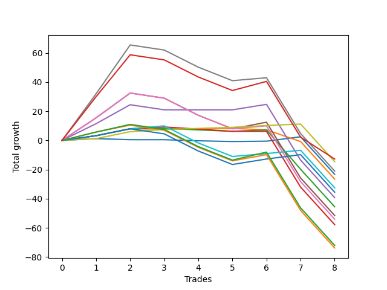

# Long Bernese 005 
- Symbol: ES_SmolBoi
- Date Range: 03/18/2022 - 09/30/2022
- Trading Period: 7:20-12:30
- Number of Trades: 8



| Name | Win Percent | Profit | Avg Profit / Trade | Avg Time / Trade |      | Name | Win Percent | Profit | Avg Profit / Trade | Avg Time / Trade |
| ---- | ----------- | ------ | ------------------ | ---------------- | ---- | ---- | ----------- | ------ | ------------------ | ---------------- |
| Sorted By <br> Profit | | | | | | Sorted By <br> Win Percentage ||||
| NEWFI 0000 | 37.50 | -6375.00 | -796.88 | 50:51 |     | Eighty-One | 87.50 | -7250.00 | -906.25 | 10:50 |
| Eighty-One | 87.50 | -7250.00 | -906.25 | 10:50 |     | Eighty-Two | 62.50 | -16250.00 | -2031.25 | 29:51 |
| Seven | 37.50 | -10500.00 | -1312.50 | 55:19 |     | Four | 62.50 | -19625.00 | -2453.12 | 32:19 |
| Zero | 50.00 | -11625.00 | -1453.12 | 09:43 |     | Zero | 50.00 | -11625.00 | -1453.12 | 09:43 |
| One | 50.00 | -13250.00 | -1656.25 | 16:25 |     | One | 50.00 | -13250.00 | -1656.25 | 16:25 |
| Eighty-Two | 62.50 | -16250.00 | -2031.25 | 29:51 |     | Eighty-Three | 50.00 | -17750.00 | -2218.75 | 31:46 |
| Eighty-Three | 50.00 | -17750.00 | -2218.75 | 31:46 |     | Two | 50.00 | -22750.00 | -2843.75 | 25:55 |
| Four | 62.50 | -19625.00 | -2453.12 | 32:19 |     | Three | 50.00 | -28875.00 | -3609.38 | 29:41 |
| Two | 50.00 | -22750.00 | -2843.75 | 25:55 |     | NEWFI 0000 | 37.50 | -6375.00 | -796.88 | 50:51 |
| Five | 37.50 | -25750.00 | -3218.75 | 40:16 |     | Seven | 37.50 | -10500.00 | -1312.50 | 55:19 |
| Six | 37.50 | -27000.00 | -3375.00 | 42:54 |     | Five | 37.50 | -25750.00 | -3218.75 | 40:16 |
| Three | 50.00 | -28875.00 | -3609.38 | 29:41 |     | Six | 37.50 | -27000.00 | -3375.00 | 42:54 |
| Eighty-Five | 37.50 | -36000.00 | -4500.00 | 39:16 |     | Eighty-Five | 37.50 | -36000.00 | -4500.00 | 39:16 |
| Eighty-Four | 37.50 | -36875.00 | -4609.38 | 39:11 |     | Eighty-Four | 37.50 | -36875.00 | -4609.38 | 39:11 |

## NO STOPLOSS

### Test Zero
* Sell when price hits the middle line of the 20p bollinger
* No Stoploss
* Results:
```
Total Trades: 8
Percent Up: 50.00
Percent Down: 50.00
Total Points Moved Up: -23.25
Potential Profit: -11625.00
Total Points Ups: 4.50 Count Ups: 4
Total Points Downs: -27.75 Count Downs: 4
```

<details><summary>Trades</summary>

<code>In: 2022-05-06 11:41:00		Out: 2022-05-06 11:41:10		Total Position Time: 00:10		Total Move Up: 1.25		Total to Date: 1.25</code> <br />
<code>In: 2022-05-06 11:47:00		Out: 2022-05-06 11:48:15		Total Position Time: 01:15		Total Move Up: -0.75		Total to Date: 0.50</code> <br />
<code>In: 2022-07-11 12:15:00		Out: 2022-07-11 12:22:10		Total Position Time: 07:10		Total Move Up: 0.00		Total to Date: 0.50</code> <br />
<code>In: 2022-07-25 11:07:00		Out: 2022-07-25 11:10:40		Total Position Time: 03:40		Total Move Up: -0.75		Total to Date: -0.25</code> <br />
<code>In: 2022-07-25 11:11:00		Out: 2022-07-25 11:11:10		Total Position Time: 00:10		Total Move Up: -0.50		Total to Date: -0.75</code> <br />
<code>In: 2022-08-05 08:33:00		Out: 2022-08-05 08:36:50		Total Position Time: 03:50		Total Move Up: 0.25		Total to Date: -0.50</code> <br />
<code>In: 2022-09-02 09:55:00		Out: 2022-09-02 09:56:40		Total Position Time: 01:40		Total Move Up: 3.00		Total to Date: 2.50</code> <br />
<code>In: 2022-09-14 10:59:00		Out: 2022-09-14 11:58:55		Total Position Time: 59:55		Total Move Up: -25.75		Total to Date: -23.25</code> <br />


</details>

### Test One
* Sell when the price hits the upper line of the 20p 1std bollinger
* No Stoploss
* Results:
```
Total Trades: 8
Percent Up: 50.00
Percent Down: 50.00
Total Points Moved Up: -26.50
Potential Profit: -13250.00
Total Points Ups: 8.50 Count Ups: 4
Total Points Downs: -35.00 Count Downs: 4
```

<details><summary>Trades</summary>

<code>In: 2022-05-06 11:41:00		Out: 2022-05-06 11:49:10		Total Position Time: 08:10		Total Move Up: 3.25		Total to Date: 3.25</code> <br />
<code>In: 2022-05-06 11:47:00		Out: 2022-05-06 11:49:10		Total Position Time: 02:10		Total Move Up: 4.75		Total to Date: 8.00</code> <br />
<code>In: 2022-07-11 12:15:00		Out: 2022-07-11 12:29:15		Total Position Time: 14:15		Total Move Up: -0.25		Total to Date: 7.75</code> <br />
<code>In: 2022-07-25 11:07:00		Out: 2022-07-25 11:11:20		Total Position Time: 04:20		Total Move Up: 0.25		Total to Date: 8.00</code> <br />
<code>In: 2022-07-25 11:11:00		Out: 2022-07-25 11:11:20		Total Position Time: 00:20		Total Move Up: 0.25		Total to Date: 8.25</code> <br />
<code>In: 2022-08-05 08:33:00		Out: 2022-08-05 08:51:30		Total Position Time: 18:30		Total Move Up: -1.00		Total to Date: 7.25</code> <br />
<code>In: 2022-09-02 09:55:00		Out: 2022-09-02 10:18:40		Total Position Time: 23:40		Total Move Up: -8.00		Total to Date: -0.75</code> <br />
<code>In: 2022-09-14 10:59:00		Out: 2022-09-14 11:58:55		Total Position Time: 59:55		Total Move Up: -25.75		Total to Date: -26.50</code> <br />


</details>

### Test Two
* Sell when the price hits the upper line of the 20p 2std bollinger
* No Stoploss
* Results:
```
Total Trades: 8
Percent Up: 50.00
Percent Down: 50.00
Total Points Moved Up: -45.50
Potential Profit: -22750.00
Total Points Ups: 9.25 Count Ups: 4
Total Points Downs: -54.75 Count Downs: 4
```

<details><summary>Trades</summary>

<code>In: 2022-05-06 11:41:00		Out: 2022-05-06 11:49:10		Total Position Time: 08:10		Total Move Up: 3.25		Total to Date: 3.25</code> <br />
<code>In: 2022-05-06 11:47:00		Out: 2022-05-06 11:49:10		Total Position Time: 02:10		Total Move Up: 4.75		Total to Date: 8.00</code> <br />
<code>In: 2022-07-11 12:15:00		Out: 2022-07-11 12:29:25		Total Position Time: 14:25		Total Move Up: 0.25		Total to Date: 8.25</code> <br />
<code>In: 2022-07-25 11:07:00		Out: 2022-07-25 11:35:45		Total Position Time: 28:45		Total Move Up: -1.00		Total to Date: 7.25</code> <br />
<code>In: 2022-07-25 11:11:00		Out: 2022-07-25 11:35:45		Total Position Time: 24:45		Total Move Up: -1.00		Total to Date: 6.25</code> <br />
<code>In: 2022-08-05 08:33:00		Out: 2022-08-05 08:53:30		Total Position Time: 20:30		Total Move Up: 1.00		Total to Date: 7.25</code> <br />
<code>In: 2022-09-02 09:55:00		Out: 2022-09-02 10:43:40		Total Position Time: 48:40		Total Move Up: -27.00		Total to Date: -19.75</code> <br />
<code>In: 2022-09-14 10:59:00		Out: 2022-09-14 11:58:55		Total Position Time: 59:55		Total Move Up: -25.75		Total to Date: -45.50</code> <br />


</details>

### Test Three
* Sell when price hits the middle line of the 50p bollinger
* No Stoploss
* Results:
```
Total Trades: 8
Percent Up: 50.00
Percent Down: 50.00
Total Points Moved Up: -57.75
Potential Profit: -28875.00
Total Points Ups: 9.25 Count Ups: 4
Total Points Downs: -67.00 Count Downs: 4
```

<details><summary>Trades</summary>

<code>In: 2022-05-06 11:41:00		Out: 2022-05-06 11:49:10		Total Position Time: 08:10		Total Move Up: 3.25		Total to Date: 3.25</code> <br />
<code>In: 2022-05-06 11:47:00		Out: 2022-05-06 11:49:10		Total Position Time: 02:10		Total Move Up: 4.75		Total to Date: 8.00</code> <br />
<code>In: 2022-07-11 12:15:00		Out: 2022-07-11 12:40:35		Total Position Time: 25:35		Total Move Up: 1.25		Total to Date: 9.25</code> <br />
<code>In: 2022-07-25 11:07:00		Out: 2022-07-25 11:35:40		Total Position Time: 28:40		Total Move Up: -1.50		Total to Date: 7.75</code> <br />
<code>In: 2022-07-25 11:11:00		Out: 2022-07-25 11:35:40		Total Position Time: 24:40		Total Move Up: -1.50		Total to Date: 6.25</code> <br />
<code>In: 2022-08-05 08:33:00		Out: 2022-08-05 09:01:25		Total Position Time: 28:25		Total Move Up: 0.00		Total to Date: 6.25</code> <br />
<code>In: 2022-09-02 09:55:00		Out: 2022-09-02 10:54:55		Total Position Time: 59:55		Total Move Up: -38.25		Total to Date: -32.00</code> <br />
<code>In: 2022-09-14 10:59:00		Out: 2022-09-14 11:58:55		Total Position Time: 59:55		Total Move Up: -25.75		Total to Date: -57.75</code> <br />


</details>

### Test Four
* Sell when the price hits the upper line of the 50p 1std bollinger
* No Stoploss
* Results:
```
Total Trades: 8
Percent Up: 62.50
Percent Down: 37.50
Total Points Moved Up: -39.25
Potential Profit: -19625.00
Total Points Ups: 28.25 Count Ups: 5
Total Points Downs: -67.50 Count Downs: 3
```

<details><summary>Trades</summary>

<code>In: 2022-05-06 11:41:00		Out: 2022-05-06 11:50:10		Total Position Time: 09:10		Total Move Up: 11.50		Total to Date: 11.50</code> <br />
<code>In: 2022-05-06 11:47:00		Out: 2022-05-06 11:50:10		Total Position Time: 03:10		Total Move Up: 13.00		Total to Date: 24.50</code> <br />
<code>In: 2022-07-11 12:15:00		Out: 2022-07-11 12:46:00		Total Position Time: 31:00		Total Move Up: -3.50		Total to Date: 21.00</code> <br />
<code>In: 2022-07-25 11:07:00		Out: 2022-07-25 11:41:00		Total Position Time: 34:00		Total Move Up: 0.00		Total to Date: 21.00</code> <br />
<code>In: 2022-07-25 11:11:00		Out: 2022-07-25 11:41:00		Total Position Time: 30:00		Total Move Up: 0.00		Total to Date: 21.00</code> <br />
<code>In: 2022-08-05 08:33:00		Out: 2022-08-05 09:04:25		Total Position Time: 31:25		Total Move Up: 3.75		Total to Date: 24.75</code> <br />
<code>In: 2022-09-02 09:55:00		Out: 2022-09-02 10:54:55		Total Position Time: 59:55		Total Move Up: -38.25		Total to Date: -13.50</code> <br />
<code>In: 2022-09-14 10:59:00		Out: 2022-09-14 11:58:55		Total Position Time: 59:55		Total Move Up: -25.75		Total to Date: -39.25</code> <br />


</details>

### Test Five
* Sell when the price hits the upper line of the 50p 2std bollinger
* No Stoploss
* Results:
```
Total Trades: 8
Percent Up: 37.50
Percent Down: 62.50
Total Points Moved Up: -51.50
Potential Profit: -25750.00
Total Points Ups: 37.00 Count Ups: 3
Total Points Downs: -88.50 Count Downs: 5
```

<details><summary>Trades</summary>

<code>In: 2022-05-06 11:41:00		Out: 2022-05-06 11:50:35		Total Position Time: 09:35		Total Move Up: 15.50		Total to Date: 15.50</code> <br />
<code>In: 2022-05-06 11:47:00		Out: 2022-05-06 11:50:35		Total Position Time: 03:35		Total Move Up: 17.00		Total to Date: 32.50</code> <br />
<code>In: 2022-07-11 12:15:00		Out: 2022-07-11 12:46:00		Total Position Time: 31:00		Total Move Up: -3.50		Total to Date: 29.00</code> <br />
<code>In: 2022-07-25 11:07:00		Out: 2022-07-25 12:06:55		Total Position Time: 59:55		Total Move Up: -11.75		Total to Date: 17.25</code> <br />
<code>In: 2022-07-25 11:11:00		Out: 2022-07-25 12:10:55		Total Position Time: 59:55		Total Move Up: -9.25		Total to Date: 8.00</code> <br />
<code>In: 2022-08-05 08:33:00		Out: 2022-08-05 09:11:25		Total Position Time: 38:25		Total Move Up: 4.50		Total to Date: 12.50</code> <br />
<code>In: 2022-09-02 09:55:00		Out: 2022-09-02 10:54:55		Total Position Time: 59:55		Total Move Up: -38.25		Total to Date: -25.75</code> <br />
<code>In: 2022-09-14 10:59:00		Out: 2022-09-14 11:58:55		Total Position Time: 59:55		Total Move Up: -25.75		Total to Date: -51.50</code> <br />


</details>

### Test Six
* Sell when the price hits the middle line of the 1std VWAP
* No Stoploss
* Results:
```
Total Trades: 8
Percent Up: 37.50
Percent Down: 62.50
Total Points Moved Up: -54.00
Potential Profit: -27000.00
Total Points Ups: 34.50 Count Ups: 3
Total Points Downs: -88.50 Count Downs: 5
```

<details><summary>Trades</summary>

<code>In: 2022-05-06 11:41:00		Out: 2022-05-06 11:50:20		Total Position Time: 09:20		Total Move Up: 15.50		Total to Date: 15.50</code> <br />
<code>In: 2022-05-06 11:47:00		Out: 2022-05-06 11:50:20		Total Position Time: 03:20		Total Move Up: 17.00		Total to Date: 32.50</code> <br />
<code>In: 2022-07-11 12:15:00		Out: 2022-07-11 12:46:00		Total Position Time: 31:00		Total Move Up: -3.50		Total to Date: 29.00</code> <br />
<code>In: 2022-07-25 11:07:00		Out: 2022-07-25 12:06:55		Total Position Time: 59:55		Total Move Up: -11.75		Total to Date: 17.25</code> <br />
<code>In: 2022-07-25 11:11:00		Out: 2022-07-25 12:10:55		Total Position Time: 59:55		Total Move Up: -9.25		Total to Date: 8.00</code> <br />
<code>In: 2022-08-05 08:33:00		Out: 2022-08-05 09:32:55		Total Position Time: 59:55		Total Move Up: 2.00		Total to Date: 10.00</code> <br />
<code>In: 2022-09-02 09:55:00		Out: 2022-09-02 10:54:55		Total Position Time: 59:55		Total Move Up: -38.25		Total to Date: -28.25</code> <br />
<code>In: 2022-09-14 10:59:00		Out: 2022-09-14 11:58:55		Total Position Time: 59:55		Total Move Up: -25.75		Total to Date: -54.00</code> <br />


</details>

### Test Seven
* Sell when the price hits the upper line of the 1std VWAP
* No Stoploss
* Results:
```
Total Trades: 8
Percent Up: 37.50
Percent Down: 62.50
Total Points Moved Up: -21.00
Potential Profit: -10500.00
Total Points Ups: 67.50 Count Ups: 3
Total Points Downs: -88.50 Count Downs: 5
```

<details><summary>Trades</summary>

<code>In: 2022-05-06 11:41:00		Out: 2022-05-06 12:40:00		Total Position Time: 59:00		Total Move Up: 32.00		Total to Date: 32.00</code> <br />
<code>In: 2022-05-06 11:47:00		Out: 2022-05-06 12:40:00		Total Position Time: 53:00		Total Move Up: 33.50		Total to Date: 65.50</code> <br />
<code>In: 2022-07-11 12:15:00		Out: 2022-07-11 12:46:00		Total Position Time: 31:00		Total Move Up: -3.50		Total to Date: 62.00</code> <br />
<code>In: 2022-07-25 11:07:00		Out: 2022-07-25 12:06:55		Total Position Time: 59:55		Total Move Up: -11.75		Total to Date: 50.25</code> <br />
<code>In: 2022-07-25 11:11:00		Out: 2022-07-25 12:10:55		Total Position Time: 59:55		Total Move Up: -9.25		Total to Date: 41.00</code> <br />
<code>In: 2022-08-05 08:33:00		Out: 2022-08-05 09:32:55		Total Position Time: 59:55		Total Move Up: 2.00		Total to Date: 43.00</code> <br />
<code>In: 2022-09-02 09:55:00		Out: 2022-09-02 10:54:55		Total Position Time: 59:55		Total Move Up: -38.25		Total to Date: 4.75</code> <br />
<code>In: 2022-09-14 10:59:00		Out: 2022-09-14 11:58:55		Total Position Time: 59:55		Total Move Up: -25.75		Total to Date: -21.00</code> <br />


</details>

## TAKE PROFIT

### Test Eighty-One
* Take Profit of 1 Point
* No Stoploss
* Results:
```
Total Trades: 8
Percent Up: 87.50
Percent Down: 12.50
Total Points Moved Up: -14.50
Potential Profit: -7250.00
Total Points Ups: 11.25 Count Ups: 7
Total Points Downs: -25.75 Count Downs: 1
```

<details><summary>Trades</summary>

<code>In: 2022-05-06 11:41:00		Out: 2022-05-06 11:41:10		Total Position Time: 00:10		Total Move Up: 1.25		Total to Date: 1.25</code> <br />
<code>In: 2022-05-06 11:47:00		Out: 2022-05-06 11:49:10		Total Position Time: 02:10		Total Move Up: 4.75		Total to Date: 6.00</code> <br />
<code>In: 2022-07-11 12:15:00		Out: 2022-07-11 12:29:40		Total Position Time: 14:40		Total Move Up: 1.50		Total to Date: 7.50</code> <br />
<code>In: 2022-07-25 11:07:00		Out: 2022-07-25 11:11:45		Total Position Time: 04:45		Total Move Up: 0.75		Total to Date: 8.25</code> <br />
<code>In: 2022-07-25 11:11:00		Out: 2022-07-25 11:11:45		Total Position Time: 00:45		Total Move Up: 0.75		Total to Date: 9.00</code> <br />
<code>In: 2022-08-05 08:33:00		Out: 2022-08-05 08:37:00		Total Position Time: 04:00		Total Move Up: 1.25		Total to Date: 10.25</code> <br />
<code>In: 2022-09-02 09:55:00		Out: 2022-09-02 09:55:15		Total Position Time: 00:15		Total Move Up: 1.00		Total to Date: 11.25</code> <br />
<code>In: 2022-09-14 10:59:00		Out: 2022-09-14 11:58:55		Total Position Time: 59:55		Total Move Up: -25.75		Total to Date: -14.50</code> <br />


</details>

### Test Eighty-Two
* Take Profit of 2 Point
* No Stoploss
* Results:
```
Total Trades: 8
Percent Up: 62.50
Percent Down: 37.50
Total Points Moved Up: -32.50
Potential Profit: -16250.00
Total Points Ups: 14.25 Count Ups: 5
Total Points Downs: -46.75 Count Downs: 3
```

<details><summary>Trades</summary>

<code>In: 2022-05-06 11:41:00		Out: 2022-05-06 11:49:10		Total Position Time: 08:10		Total Move Up: 3.25		Total to Date: 3.25</code> <br />
<code>In: 2022-05-06 11:47:00		Out: 2022-05-06 11:49:10		Total Position Time: 02:10		Total Move Up: 4.75		Total to Date: 8.00</code> <br />
<code>In: 2022-07-11 12:15:00		Out: 2022-07-11 12:31:10		Total Position Time: 16:10		Total Move Up: 2.00		Total to Date: 10.00</code> <br />
<code>In: 2022-07-25 11:07:00		Out: 2022-07-25 12:06:55		Total Position Time: 59:55		Total Move Up: -11.75		Total to Date: -1.75</code> <br />
<code>In: 2022-07-25 11:11:00		Out: 2022-07-25 12:10:55		Total Position Time: 59:55		Total Move Up: -9.25		Total to Date: -11.00</code> <br />
<code>In: 2022-08-05 08:33:00		Out: 2022-08-05 09:04:00		Total Position Time: 31:00		Total Move Up: 2.00		Total to Date: -9.00</code> <br />
<code>In: 2022-09-02 09:55:00		Out: 2022-09-02 09:56:35		Total Position Time: 01:35		Total Move Up: 2.25		Total to Date: -6.75</code> <br />
<code>In: 2022-09-14 10:59:00		Out: 2022-09-14 11:58:55		Total Position Time: 59:55		Total Move Up: -25.75		Total to Date: -32.50</code> <br />


</details>

### Test Eighty-Three
* Take Profit of 3 Point
* No Stoploss
* Results:
```
Total Trades: 8
Percent Up: 50.00
Percent Down: 50.00
Total Points Moved Up: -35.50
Potential Profit: -17750.00
Total Points Ups: 14.75 Count Ups: 4
Total Points Downs: -50.25 Count Downs: 4
```

<details><summary>Trades</summary>

<code>In: 2022-05-06 11:41:00		Out: 2022-05-06 11:49:10		Total Position Time: 08:10		Total Move Up: 3.25		Total to Date: 3.25</code> <br />
<code>In: 2022-05-06 11:47:00		Out: 2022-05-06 11:49:10		Total Position Time: 02:10		Total Move Up: 4.75		Total to Date: 8.00</code> <br />
<code>In: 2022-07-11 12:15:00		Out: 2022-07-11 12:46:00		Total Position Time: 31:00		Total Move Up: -3.50		Total to Date: 4.50</code> <br />
<code>In: 2022-07-25 11:07:00		Out: 2022-07-25 12:06:55		Total Position Time: 59:55		Total Move Up: -11.75		Total to Date: -7.25</code> <br />
<code>In: 2022-07-25 11:11:00		Out: 2022-07-25 12:10:55		Total Position Time: 59:55		Total Move Up: -9.25		Total to Date: -16.50</code> <br />
<code>In: 2022-08-05 08:33:00		Out: 2022-08-05 09:04:25		Total Position Time: 31:25		Total Move Up: 3.75		Total to Date: -12.75</code> <br />
<code>In: 2022-09-02 09:55:00		Out: 2022-09-02 09:56:40		Total Position Time: 01:40		Total Move Up: 3.00		Total to Date: -9.75</code> <br />
<code>In: 2022-09-14 10:59:00		Out: 2022-09-14 11:58:55		Total Position Time: 59:55		Total Move Up: -25.75		Total to Date: -35.50</code> <br />


</details>

### Test Eighty-Four
* Take Profit of 4 Point
* No Stoploss
* Results:
```
Total Trades: 8
Percent Up: 37.50
Percent Down: 62.50
Total Points Moved Up: -73.75
Potential Profit: -36875.00
Total Points Ups: 14.75 Count Ups: 3
Total Points Downs: -88.50 Count Downs: 5
```

<details><summary>Trades</summary>

<code>In: 2022-05-06 11:41:00		Out: 2022-05-06 11:49:25		Total Position Time: 08:25		Total Move Up: 5.75		Total to Date: 5.75</code> <br />
<code>In: 2022-05-06 11:47:00		Out: 2022-05-06 11:49:10		Total Position Time: 02:10		Total Move Up: 4.75		Total to Date: 10.50</code> <br />
<code>In: 2022-07-11 12:15:00		Out: 2022-07-11 12:46:00		Total Position Time: 31:00		Total Move Up: -3.50		Total to Date: 7.00</code> <br />
<code>In: 2022-07-25 11:07:00		Out: 2022-07-25 12:06:55		Total Position Time: 59:55		Total Move Up: -11.75		Total to Date: -4.75</code> <br />
<code>In: 2022-07-25 11:11:00		Out: 2022-07-25 12:10:55		Total Position Time: 59:55		Total Move Up: -9.25		Total to Date: -14.00</code> <br />
<code>In: 2022-08-05 08:33:00		Out: 2022-08-05 09:05:20		Total Position Time: 32:20		Total Move Up: 4.25		Total to Date: -9.75</code> <br />
<code>In: 2022-09-02 09:55:00		Out: 2022-09-02 10:54:55		Total Position Time: 59:55		Total Move Up: -38.25		Total to Date: -48.00</code> <br />
<code>In: 2022-09-14 10:59:00		Out: 2022-09-14 11:58:55		Total Position Time: 59:55		Total Move Up: -25.75		Total to Date: -73.75</code> <br />


</details>

### Test Eighty-Five
* Take Profit of 5 Point
* No Stoploss
* Results:
```
Total Trades: 8
Percent Up: 37.50
Percent Down: 62.50
Total Points Moved Up: -72.00
Potential Profit: -36000.00
Total Points Ups: 16.50 Count Ups: 3
Total Points Downs: -88.50 Count Downs: 5
```

<details><summary>Trades</summary>

<code>In: 2022-05-06 11:41:00		Out: 2022-05-06 11:49:25		Total Position Time: 08:25		Total Move Up: 5.75		Total to Date: 5.75</code> <br />
<code>In: 2022-05-06 11:47:00		Out: 2022-05-06 11:49:20		Total Position Time: 02:20		Total Move Up: 5.25		Total to Date: 11.00</code> <br />
<code>In: 2022-07-11 12:15:00		Out: 2022-07-11 12:46:00		Total Position Time: 31:00		Total Move Up: -3.50		Total to Date: 7.50</code> <br />
<code>In: 2022-07-25 11:07:00		Out: 2022-07-25 12:06:55		Total Position Time: 59:55		Total Move Up: -11.75		Total to Date: -4.25</code> <br />
<code>In: 2022-07-25 11:11:00		Out: 2022-07-25 12:10:55		Total Position Time: 59:55		Total Move Up: -9.25		Total to Date: -13.50</code> <br />
<code>In: 2022-08-05 08:33:00		Out: 2022-08-05 09:05:45		Total Position Time: 32:45		Total Move Up: 5.50		Total to Date: -8.00</code> <br />
<code>In: 2022-09-02 09:55:00		Out: 2022-09-02 10:54:55		Total Position Time: 59:55		Total Move Up: -38.25		Total to Date: -46.25</code> <br />
<code>In: 2022-09-14 10:59:00		Out: 2022-09-14 11:58:55		Total Position Time: 59:55		Total Move Up: -25.75		Total to Date: -72.00</code> <br />


</details>

## Indicator Exits

### Test NEWFI 0000
* Newfi 0000
* No Stoploss
* Results:
```
Total Trades: 8
Percent Up: 37.50
Percent Down: 62.50
Total Points Moved Up: -12.75
Potential Profit: -6375.00
Total Points Ups: 65.00 Count Ups: 3
Total Points Downs: -77.75 Count Downs: 5
```

<details><summary>Trades</summary>

<code>In: 2022-05-06 11:41:00		Out: 2022-05-06 12:40:55		Total Position Time: 59:55		Total Move Up: 30.00		Total to Date: 30.00</code> <br />
<code>In: 2022-05-06 11:47:00		Out: 2022-05-06 12:41:05		Total Position Time: 54:05		Total Move Up: 28.75		Total to Date: 58.75</code> <br />
<code>In: 2022-07-11 12:15:00		Out: 2022-07-11 12:46:00		Total Position Time: 31:00		Total Move Up: -3.50		Total to Date: 55.25</code> <br />
<code>In: 2022-07-25 11:07:00		Out: 2022-07-25 12:06:55		Total Position Time: 59:55		Total Move Up: -11.75		Total to Date: 43.50</code> <br />
<code>In: 2022-07-25 11:11:00		Out: 2022-07-25 12:10:55		Total Position Time: 59:55		Total Move Up: -9.25		Total to Date: 34.25</code> <br />
<code>In: 2022-08-05 08:33:00		Out: 2022-08-05 09:20:05		Total Position Time: 47:05		Total Move Up: 6.25		Total to Date: 40.50</code> <br />
<code>In: 2022-09-02 09:55:00		Out: 2022-09-02 10:54:55		Total Position Time: 59:55		Total Move Up: -38.25		Total to Date: 2.25</code> <br />
<code>In: 2022-09-14 10:59:00		Out: 2022-09-14 11:34:05		Total Position Time: 35:05		Total Move Up: -15.00		Total to Date: -12.75</code> <br />


</details>