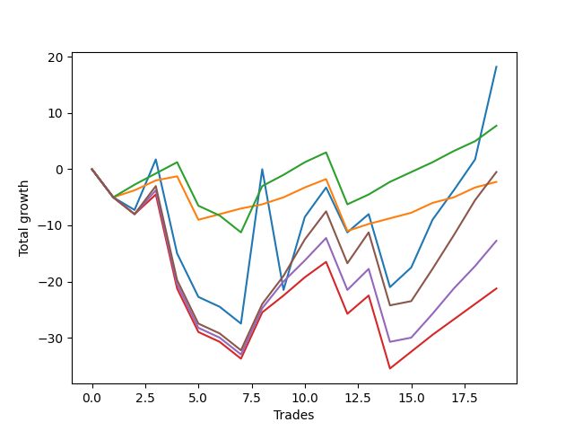

# Long Bulldog 005 DB 
- Symbol: ES_SmolBoi
- Date Range: 03/18/2022 - 07/29/2022
- Trading Period: 7:20-12:30
- Number of Trades: 19



| Name | Win Percent | Profit | Avg Profit / Trade | Avg Time / Trade |      | Name | Win Percent | Profit | Avg Profit / Trade | Avg Time / Trade |
| ---- | ----------- | ------ | ------------------ | ---------------- | ---- | ---- | ----------- | ------ | ------------------ | ---------------- |
| Sorted By <br> Profit | | | | | | Sorted By <br> Win Percentage ||||
| Two | 52.63 | 9125.00 | 480.26 | 21:23 |     | Eighty-One | 84.21 | -1125.00 | -59.21 | 05:43 |
| Eighty-Two | 73.68 | 3875.00 | 203.95 | 10:01 |     | Eighty-Two | 73.68 | 3875.00 | 203.95 | 10:01 |
| Eighty-Five | 57.89 | -250.00 | -13.16 | 18:23 |     | Eighty-Five | 57.89 | -250.00 | -13.16 | 18:23 |
| Eighty-One | 84.21 | -1125.00 | -59.21 | 05:43 |     | Eighty-Four | 57.89 | -6375.00 | -335.53 | 17:17 |
| Eighty-Four | 57.89 | -6375.00 | -335.53 | 17:17 |     | Eighty-Three | 57.89 | -10625.00 | -559.21 | 15:43 |
| Eighty-Three | 57.89 | -10625.00 | -559.21 | 15:43 |     | Two | 52.63 | 9125.00 | 480.26 | 21:23 |

## NO STOPLOSS

### Test Two
* Sell when the price hits the upper line of the 20p 2std bollinger
* No Stoploss
* Results:
```
Total Trades: 19
Percent Up: 52.63
Percent Down: 47.37
Total Points Moved Up: 18.25
Potential Profit: 9125.00
Total Points Ups: 97.25 Count Ups: 10
Total Points Downs: -79.00 Count Downs: 9
```

<details><summary>Trades</summary>

<code>In: 2022-03-23 10:23:00		Out: 2022-03-23 10:52:55		Total Position Time: 29:55		Total Move Up: -5.00		Total to Date: -5.00</code> <br />
<code>In: 2022-03-25 08:14:00		Out: 2022-03-25 08:41:45		Total Position Time: 27:45		Total Move Up: -2.25		Total to Date: -7.25</code> <br />
<code>In: 2022-03-28 07:39:00		Out: 2022-03-28 07:48:05		Total Position Time: 09:05		Total Move Up: 9.00		Total to Date: 1.75</code> <br />
<code>In: 2022-03-28 08:27:00		Out: 2022-03-28 08:56:55		Total Position Time: 29:55		Total Move Up: -16.75		Total to Date: -15.00</code> <br />
<code>In: 2022-04-18 08:26:00		Out: 2022-04-18 08:55:55		Total Position Time: 29:55		Total Move Up: -7.75		Total to Date: -22.75</code> <br />
<code>In: 2022-04-18 08:29:00		Out: 2022-04-18 08:58:55		Total Position Time: 29:55		Total Move Up: -1.75		Total to Date: -24.50</code> <br />
<code>In: 2022-04-20 11:38:00		Out: 2022-04-20 12:07:55		Total Position Time: 29:55		Total Move Up: -3.00		Total to Date: -27.50</code> <br />
<code>In: 2022-05-04 11:36:00		Out: 2022-05-04 11:43:45		Total Position Time: 07:45		Total Move Up: 27.50		Total to Date: 0.00</code> <br />
<code>In: 2022-05-11 09:32:00		Out: 2022-05-11 10:01:55		Total Position Time: 29:55		Total Move Up: -21.50		Total to Date: -21.50</code> <br />
<code>In: 2022-05-17 11:24:00		Out: 2022-05-17 11:40:00		Total Position Time: 16:00		Total Move Up: 13.00		Total to Date: -8.50</code> <br />
<code>In: 2022-05-25 09:29:00		Out: 2022-05-25 09:45:20		Total Position Time: 16:20		Total Move Up: 5.25		Total to Date: -3.25</code> <br />
<code>In: 2022-06-06 08:14:00		Out: 2022-06-06 08:43:00		Total Position Time: 29:00		Total Move Up: -8.00		Total to Date: -11.25</code> <br />
<code>In: 2022-06-06 08:19:00		Out: 2022-06-06 08:43:00		Total Position Time: 24:00		Total Move Up: 3.25		Total to Date: -8.00</code> <br />
<code>In: 2022-06-08 09:29:00		Out: 2022-06-08 09:58:55		Total Position Time: 29:55		Total Move Up: -13.00		Total to Date: -21.00</code> <br />
<code>In: 2022-06-08 09:41:00		Out: 2022-06-08 09:59:10		Total Position Time: 18:10		Total Move Up: 3.50		Total to Date: -17.50</code> <br />
<code>In: 2022-06-29 08:25:00		Out: 2022-06-29 08:34:40		Total Position Time: 09:40		Total Move Up: 8.50		Total to Date: -9.00</code> <br />
<code>In: 2022-07-05 08:02:00		Out: 2022-07-05 08:17:55		Total Position Time: 15:55		Total Move Up: 5.25		Total to Date: -3.75</code> <br />
<code>In: 2022-07-05 08:04:00		Out: 2022-07-05 08:17:55		Total Position Time: 13:55		Total Move Up: 5.50		Total to Date: 1.75</code> <br />
<code>In: 2022-07-13 07:22:00		Out: 2022-07-13 07:31:30		Total Position Time: 09:30		Total Move Up: 16.50		Total to Date: 18.25</code> <br />


</details>

## TAKE PROFIT

### Test Eighty-One
* Take Profit of 1 Point
* No Stoploss
* Results:
```
Total Trades: 19
Percent Up: 84.21
Percent Down: 15.79
Total Points Moved Up: -2.25
Potential Profit: -1125.00
Total Points Ups: 19.75 Count Ups: 16
Total Points Downs: -22.00 Count Downs: 3
```

<details><summary>Trades</summary>

<code>In: 2022-03-23 10:23:00		Out: 2022-03-23 10:52:55		Total Position Time: 29:55		Total Move Up: -5.00		Total to Date: -5.00</code> <br />
<code>In: 2022-03-25 08:14:00		Out: 2022-03-25 08:15:50		Total Position Time: 01:50		Total Move Up: 1.25		Total to Date: -3.75</code> <br />
<code>In: 2022-03-28 07:39:00		Out: 2022-03-28 07:39:20		Total Position Time: 00:20		Total Move Up: 1.75		Total to Date: -2.00</code> <br />
<code>In: 2022-03-28 08:27:00		Out: 2022-03-28 08:27:45		Total Position Time: 00:45		Total Move Up: 0.75		Total to Date: -1.25</code> <br />
<code>In: 2022-04-18 08:26:00		Out: 2022-04-18 08:55:55		Total Position Time: 29:55		Total Move Up: -7.75		Total to Date: -9.00</code> <br />
<code>In: 2022-04-18 08:29:00		Out: 2022-04-18 08:29:25		Total Position Time: 00:25		Total Move Up: 1.00		Total to Date: -8.00</code> <br />
<code>In: 2022-04-20 11:38:00		Out: 2022-04-20 11:48:20		Total Position Time: 10:20		Total Move Up: 1.00		Total to Date: -7.00</code> <br />
<code>In: 2022-05-04 11:36:00		Out: 2022-05-04 11:36:10		Total Position Time: 00:10		Total Move Up: 0.75		Total to Date: -6.25</code> <br />
<code>In: 2022-05-11 09:32:00		Out: 2022-05-11 09:32:30		Total Position Time: 00:30		Total Move Up: 1.25		Total to Date: -5.00</code> <br />
<code>In: 2022-05-17 11:24:00		Out: 2022-05-17 11:24:25		Total Position Time: 00:25		Total Move Up: 1.75		Total to Date: -3.25</code> <br />
<code>In: 2022-05-25 09:29:00		Out: 2022-05-25 09:30:00		Total Position Time: 01:00		Total Move Up: 1.50		Total to Date: -1.75</code> <br />
<code>In: 2022-06-06 08:14:00		Out: 2022-06-06 08:43:55		Total Position Time: 29:55		Total Move Up: -9.25		Total to Date: -11.00</code> <br />
<code>In: 2022-06-06 08:19:00		Out: 2022-06-06 08:19:10		Total Position Time: 00:10		Total Move Up: 1.25		Total to Date: -9.75</code> <br />
<code>In: 2022-06-08 09:29:00		Out: 2022-06-08 09:29:15		Total Position Time: 00:15		Total Move Up: 1.00		Total to Date: -8.75</code> <br />
<code>In: 2022-06-08 09:41:00		Out: 2022-06-08 09:41:35		Total Position Time: 00:35		Total Move Up: 1.00		Total to Date: -7.75</code> <br />
<code>In: 2022-06-29 08:25:00		Out: 2022-06-29 08:25:15		Total Position Time: 00:15		Total Move Up: 1.75		Total to Date: -6.00</code> <br />
<code>In: 2022-07-05 08:02:00		Out: 2022-07-05 08:03:45		Total Position Time: 01:45		Total Move Up: 1.00		Total to Date: -5.00</code> <br />
<code>In: 2022-07-05 08:04:00		Out: 2022-07-05 08:04:10		Total Position Time: 00:10		Total Move Up: 1.75		Total to Date: -3.25</code> <br />
<code>In: 2022-07-13 07:22:00		Out: 2022-07-13 07:22:10		Total Position Time: 00:10		Total Move Up: 1.00		Total to Date: -2.25</code> <br />


</details>

### Test Eighty-Two
* Take Profit of 2 Point
* No Stoploss
* Results:
```
Total Trades: 19
Percent Up: 73.68
Percent Down: 26.32
Total Points Moved Up: 7.75
Potential Profit: 3875.00
Total Points Ups: 34.50 Count Ups: 14
Total Points Downs: -26.75 Count Downs: 5
```

<details><summary>Trades</summary>

<code>In: 2022-03-23 10:23:00		Out: 2022-03-23 10:52:55		Total Position Time: 29:55		Total Move Up: -5.00		Total to Date: -5.00</code> <br />
<code>In: 2022-03-25 08:14:00		Out: 2022-03-25 08:16:05		Total Position Time: 02:05		Total Move Up: 2.25		Total to Date: -2.75</code> <br />
<code>In: 2022-03-28 07:39:00		Out: 2022-03-28 07:40:00		Total Position Time: 01:00		Total Move Up: 2.00		Total to Date: -0.75</code> <br />
<code>In: 2022-03-28 08:27:00		Out: 2022-03-28 08:28:10		Total Position Time: 01:10		Total Move Up: 2.00		Total to Date: 1.25</code> <br />
<code>In: 2022-04-18 08:26:00		Out: 2022-04-18 08:55:55		Total Position Time: 29:55		Total Move Up: -7.75		Total to Date: -6.50</code> <br />
<code>In: 2022-04-18 08:29:00		Out: 2022-04-18 08:58:55		Total Position Time: 29:55		Total Move Up: -1.75		Total to Date: -8.25</code> <br />
<code>In: 2022-04-20 11:38:00		Out: 2022-04-20 12:07:55		Total Position Time: 29:55		Total Move Up: -3.00		Total to Date: -11.25</code> <br />
<code>In: 2022-05-04 11:36:00		Out: 2022-05-04 11:36:40		Total Position Time: 00:40		Total Move Up: 8.25		Total to Date: -3.00</code> <br />
<code>In: 2022-05-11 09:32:00		Out: 2022-05-11 09:35:20		Total Position Time: 03:20		Total Move Up: 2.00		Total to Date: -1.00</code> <br />
<code>In: 2022-05-17 11:24:00		Out: 2022-05-17 11:24:35		Total Position Time: 00:35		Total Move Up: 2.25		Total to Date: 1.25</code> <br />
<code>In: 2022-05-25 09:29:00		Out: 2022-05-25 09:30:05		Total Position Time: 01:05		Total Move Up: 1.75		Total to Date: 3.00</code> <br />
<code>In: 2022-06-06 08:14:00		Out: 2022-06-06 08:43:55		Total Position Time: 29:55		Total Move Up: -9.25		Total to Date: -6.25</code> <br />
<code>In: 2022-06-06 08:19:00		Out: 2022-06-06 08:29:05		Total Position Time: 10:05		Total Move Up: 1.75		Total to Date: -4.50</code> <br />
<code>In: 2022-06-08 09:29:00		Out: 2022-06-08 09:29:55		Total Position Time: 00:55		Total Move Up: 2.25		Total to Date: -2.25</code> <br />
<code>In: 2022-06-08 09:41:00		Out: 2022-06-08 09:57:10		Total Position Time: 16:10		Total Move Up: 1.75		Total to Date: -0.50</code> <br />
<code>In: 2022-06-29 08:25:00		Out: 2022-06-29 08:25:15		Total Position Time: 00:15		Total Move Up: 1.75		Total to Date: 1.25</code> <br />
<code>In: 2022-07-05 08:02:00		Out: 2022-07-05 08:04:40		Total Position Time: 02:40		Total Move Up: 2.00		Total to Date: 3.25</code> <br />
<code>In: 2022-07-05 08:04:00		Out: 2022-07-05 08:04:30		Total Position Time: 00:30		Total Move Up: 1.75		Total to Date: 5.00</code> <br />
<code>In: 2022-07-13 07:22:00		Out: 2022-07-13 07:22:30		Total Position Time: 00:30		Total Move Up: 2.75		Total to Date: 7.75</code> <br />


</details>

### Test Eighty-Three
* Take Profit of 3 Point
* No Stoploss
* Results:
```
Total Trades: 19
Percent Up: 57.89
Percent Down: 42.11
Total Points Moved Up: -21.25
Potential Profit: -10625.00
Total Points Ups: 38.25 Count Ups: 11
Total Points Downs: -59.50 Count Downs: 8
```

<details><summary>Trades</summary>

<code>In: 2022-03-23 10:23:00		Out: 2022-03-23 10:52:55		Total Position Time: 29:55		Total Move Up: -5.00		Total to Date: -5.00</code> <br />
<code>In: 2022-03-25 08:14:00		Out: 2022-03-25 08:43:55		Total Position Time: 29:55		Total Move Up: -3.00		Total to Date: -8.00</code> <br />
<code>In: 2022-03-28 07:39:00		Out: 2022-03-28 07:43:00		Total Position Time: 04:00		Total Move Up: 3.50		Total to Date: -4.50</code> <br />
<code>In: 2022-03-28 08:27:00		Out: 2022-03-28 08:56:55		Total Position Time: 29:55		Total Move Up: -16.75		Total to Date: -21.25</code> <br />
<code>In: 2022-04-18 08:26:00		Out: 2022-04-18 08:55:55		Total Position Time: 29:55		Total Move Up: -7.75		Total to Date: -29.00</code> <br />
<code>In: 2022-04-18 08:29:00		Out: 2022-04-18 08:58:55		Total Position Time: 29:55		Total Move Up: -1.75		Total to Date: -30.75</code> <br />
<code>In: 2022-04-20 11:38:00		Out: 2022-04-20 12:07:55		Total Position Time: 29:55		Total Move Up: -3.00		Total to Date: -33.75</code> <br />
<code>In: 2022-05-04 11:36:00		Out: 2022-05-04 11:36:40		Total Position Time: 00:40		Total Move Up: 8.25		Total to Date: -25.50</code> <br />
<code>In: 2022-05-11 09:32:00		Out: 2022-05-11 09:35:30		Total Position Time: 03:30		Total Move Up: 3.00		Total to Date: -22.50</code> <br />
<code>In: 2022-05-17 11:24:00		Out: 2022-05-17 11:24:40		Total Position Time: 00:40		Total Move Up: 3.25		Total to Date: -19.25</code> <br />
<code>In: 2022-05-25 09:29:00		Out: 2022-05-25 09:30:15		Total Position Time: 01:15		Total Move Up: 2.75		Total to Date: -16.50</code> <br />
<code>In: 2022-06-06 08:14:00		Out: 2022-06-06 08:43:55		Total Position Time: 29:55		Total Move Up: -9.25		Total to Date: -25.75</code> <br />
<code>In: 2022-06-06 08:19:00		Out: 2022-06-06 08:43:00		Total Position Time: 24:00		Total Move Up: 3.25		Total to Date: -22.50</code> <br />
<code>In: 2022-06-08 09:29:00		Out: 2022-06-08 09:58:55		Total Position Time: 29:55		Total Move Up: -13.00		Total to Date: -35.50</code> <br />
<code>In: 2022-06-08 09:41:00		Out: 2022-06-08 09:59:05		Total Position Time: 18:05		Total Move Up: 3.00		Total to Date: -32.50</code> <br />
<code>In: 2022-06-29 08:25:00		Out: 2022-06-29 08:25:20		Total Position Time: 00:20		Total Move Up: 3.00		Total to Date: -29.50</code> <br />
<code>In: 2022-07-05 08:02:00		Out: 2022-07-05 08:07:50		Total Position Time: 05:50		Total Move Up: 2.75		Total to Date: -26.75</code> <br />
<code>In: 2022-07-05 08:04:00		Out: 2022-07-05 08:04:45		Total Position Time: 00:45		Total Move Up: 2.75		Total to Date: -24.00</code> <br />
<code>In: 2022-07-13 07:22:00		Out: 2022-07-13 07:22:30		Total Position Time: 00:30		Total Move Up: 2.75		Total to Date: -21.25</code> <br />


</details>

### Test Eighty-Four
* Take Profit of 4 Point
* No Stoploss
* Results:
```
Total Trades: 19
Percent Up: 57.89
Percent Down: 42.11
Total Points Moved Up: -12.75
Potential Profit: -6375.00
Total Points Ups: 46.75 Count Ups: 11
Total Points Downs: -59.50 Count Downs: 8
```

<details><summary>Trades</summary>

<code>In: 2022-03-23 10:23:00		Out: 2022-03-23 10:52:55		Total Position Time: 29:55		Total Move Up: -5.00		Total to Date: -5.00</code> <br />
<code>In: 2022-03-25 08:14:00		Out: 2022-03-25 08:43:55		Total Position Time: 29:55		Total Move Up: -3.00		Total to Date: -8.00</code> <br />
<code>In: 2022-03-28 07:39:00		Out: 2022-03-28 07:43:10		Total Position Time: 04:10		Total Move Up: 4.25		Total to Date: -3.75</code> <br />
<code>In: 2022-03-28 08:27:00		Out: 2022-03-28 08:56:55		Total Position Time: 29:55		Total Move Up: -16.75		Total to Date: -20.50</code> <br />
<code>In: 2022-04-18 08:26:00		Out: 2022-04-18 08:55:55		Total Position Time: 29:55		Total Move Up: -7.75		Total to Date: -28.25</code> <br />
<code>In: 2022-04-18 08:29:00		Out: 2022-04-18 08:58:55		Total Position Time: 29:55		Total Move Up: -1.75		Total to Date: -30.00</code> <br />
<code>In: 2022-04-20 11:38:00		Out: 2022-04-20 12:07:55		Total Position Time: 29:55		Total Move Up: -3.00		Total to Date: -33.00</code> <br />
<code>In: 2022-05-04 11:36:00		Out: 2022-05-04 11:36:40		Total Position Time: 00:40		Total Move Up: 8.25		Total to Date: -24.75</code> <br />
<code>In: 2022-05-11 09:32:00		Out: 2022-05-11 09:35:50		Total Position Time: 03:50		Total Move Up: 4.75		Total to Date: -20.00</code> <br />
<code>In: 2022-05-17 11:24:00		Out: 2022-05-17 11:24:50		Total Position Time: 00:50		Total Move Up: 3.75		Total to Date: -16.25</code> <br />
<code>In: 2022-05-25 09:29:00		Out: 2022-05-25 09:30:30		Total Position Time: 01:30		Total Move Up: 4.00		Total to Date: -12.25</code> <br />
<code>In: 2022-06-06 08:14:00		Out: 2022-06-06 08:43:55		Total Position Time: 29:55		Total Move Up: -9.25		Total to Date: -21.50</code> <br />
<code>In: 2022-06-06 08:19:00		Out: 2022-06-06 08:44:15		Total Position Time: 25:15		Total Move Up: 3.75		Total to Date: -17.75</code> <br />
<code>In: 2022-06-08 09:29:00		Out: 2022-06-08 09:58:55		Total Position Time: 29:55		Total Move Up: -13.00		Total to Date: -30.75</code> <br />
<code>In: 2022-06-08 09:41:00		Out: 2022-06-08 10:10:55		Total Position Time: 29:55		Total Move Up: 0.75		Total to Date: -30.00</code> <br />
<code>In: 2022-06-29 08:25:00		Out: 2022-06-29 08:28:15		Total Position Time: 03:15		Total Move Up: 4.25		Total to Date: -25.75</code> <br />
<code>In: 2022-07-05 08:02:00		Out: 2022-07-05 08:16:45		Total Position Time: 14:45		Total Move Up: 4.50		Total to Date: -21.25</code> <br />
<code>In: 2022-07-05 08:04:00		Out: 2022-07-05 08:08:20		Total Position Time: 04:20		Total Move Up: 4.00		Total to Date: -17.25</code> <br />
<code>In: 2022-07-13 07:22:00		Out: 2022-07-13 07:22:45		Total Position Time: 00:45		Total Move Up: 4.50		Total to Date: -12.75</code> <br />


</details>

### Test Eighty-Five
* Take Profit of 5 Point
* No Stoploss
* Results:
```
Total Trades: 19
Percent Up: 57.89
Percent Down: 42.11
Total Points Moved Up: -0.50
Potential Profit: -250.00
Total Points Ups: 59.00 Count Ups: 11
Total Points Downs: -59.50 Count Downs: 8
```

<details><summary>Trades</summary>

<code>In: 2022-03-23 10:23:00		Out: 2022-03-23 10:52:55		Total Position Time: 29:55		Total Move Up: -5.00		Total to Date: -5.00</code> <br />
<code>In: 2022-03-25 08:14:00		Out: 2022-03-25 08:43:55		Total Position Time: 29:55		Total Move Up: -3.00		Total to Date: -8.00</code> <br />
<code>In: 2022-03-28 07:39:00		Out: 2022-03-28 07:44:55		Total Position Time: 05:55		Total Move Up: 5.00		Total to Date: -3.00</code> <br />
<code>In: 2022-03-28 08:27:00		Out: 2022-03-28 08:56:55		Total Position Time: 29:55		Total Move Up: -16.75		Total to Date: -19.75</code> <br />
<code>In: 2022-04-18 08:26:00		Out: 2022-04-18 08:55:55		Total Position Time: 29:55		Total Move Up: -7.75		Total to Date: -27.50</code> <br />
<code>In: 2022-04-18 08:29:00		Out: 2022-04-18 08:58:55		Total Position Time: 29:55		Total Move Up: -1.75		Total to Date: -29.25</code> <br />
<code>In: 2022-04-20 11:38:00		Out: 2022-04-20 12:07:55		Total Position Time: 29:55		Total Move Up: -3.00		Total to Date: -32.25</code> <br />
<code>In: 2022-05-04 11:36:00		Out: 2022-05-04 11:36:40		Total Position Time: 00:40		Total Move Up: 8.25		Total to Date: -24.00</code> <br />
<code>In: 2022-05-11 09:32:00		Out: 2022-05-11 09:36:05		Total Position Time: 04:05		Total Move Up: 5.00		Total to Date: -19.00</code> <br />
<code>In: 2022-05-17 11:24:00		Out: 2022-05-17 11:26:40		Total Position Time: 02:40		Total Move Up: 6.50		Total to Date: -12.50</code> <br />
<code>In: 2022-05-25 09:29:00		Out: 2022-05-25 09:32:10		Total Position Time: 03:10		Total Move Up: 5.00		Total to Date: -7.50</code> <br />
<code>In: 2022-06-06 08:14:00		Out: 2022-06-06 08:43:55		Total Position Time: 29:55		Total Move Up: -9.25		Total to Date: -16.75</code> <br />
<code>In: 2022-06-06 08:19:00		Out: 2022-06-06 08:44:30		Total Position Time: 25:30		Total Move Up: 5.50		Total to Date: -11.25</code> <br />
<code>In: 2022-06-08 09:29:00		Out: 2022-06-08 09:58:55		Total Position Time: 29:55		Total Move Up: -13.00		Total to Date: -24.25</code> <br />
<code>In: 2022-06-08 09:41:00		Out: 2022-06-08 10:10:55		Total Position Time: 29:55		Total Move Up: 0.75		Total to Date: -23.50</code> <br />
<code>In: 2022-06-29 08:25:00		Out: 2022-06-29 08:32:15		Total Position Time: 07:15		Total Move Up: 5.75		Total to Date: -17.75</code> <br />
<code>In: 2022-07-05 08:02:00		Out: 2022-07-05 08:17:50		Total Position Time: 15:50		Total Move Up: 6.00		Total to Date: -11.75</code> <br />
<code>In: 2022-07-05 08:04:00		Out: 2022-07-05 08:17:50		Total Position Time: 13:50		Total Move Up: 6.25		Total to Date: -5.50</code> <br />
<code>In: 2022-07-13 07:22:00		Out: 2022-07-13 07:23:20		Total Position Time: 01:20		Total Move Up: 5.00		Total to Date: -0.50</code> <br />


</details>