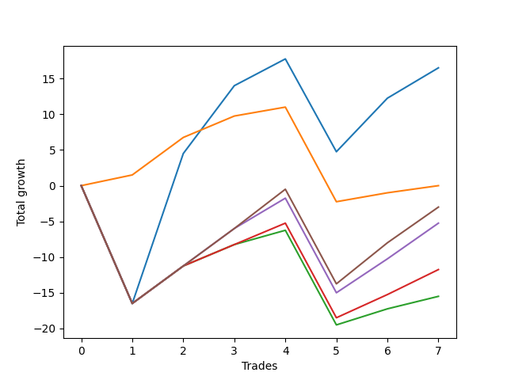

# Long Bulldog 006 DB 
- Symbol: ES_SmolBoi
- Date Range: 03/18/2022 - 07/29/2022
- Trading Period: 7:20-12:30
- Number of Trades: 7



| Name | Win Percent | Profit | Avg Profit / Trade | Avg Time / Trade |      | Name | Win Percent | Profit | Avg Profit / Trade | Avg Time / Trade |
| ---- | ----------- | ------ | ------------------ | ---------------- | ---- | ---- | ----------- | ------ | ------------------ | ---------------- |
| Sorted By <br> Profit | | | | | | Sorted By <br> Win Percentage ||||
| Two | 71.43 | 8250.00 | 1178.57 | 16:49 |     | Eighty-One | 85.71 | 0.00 | 0.00 | 05:43 |
| Eighty-One | 85.71 | 0.00 | 0.00 | 05:43 |     | Two | 71.43 | 8250.00 | 1178.57 | 16:49 |
| Eighty-Five | 71.43 | -1500.00 | -214.29 | 15:16 |     | Eighty-Five | 71.43 | -1500.00 | -214.29 | 15:16 |
| Eighty-Four | 71.43 | -2625.00 | -375.00 | 14:46 |     | Eighty-Four | 71.43 | -2625.00 | -375.00 | 14:46 |
| Eighty-Three | 71.43 | -5875.00 | -839.29 | 11:38 |     | Eighty-Three | 71.43 | -5875.00 | -839.29 | 11:38 |
| Eighty-Two | 71.43 | -7750.00 | -1107.14 | 10:09 |     | Eighty-Two | 71.43 | -7750.00 | -1107.14 | 10:09 |

## NO STOPLOSS

### Test Two
* Sell when the price hits the upper line of the 20p 2std bollinger
* No Stoploss
* Results:
```
Total Trades: 7
Percent Up: 71.43
Percent Down: 28.57
Total Points Moved Up: 16.50
Potential Profit: 8250.00
Total Points Ups: 46.00 Count Ups: 5
Total Points Downs: -29.50 Count Downs: 2
```

<details><summary>Trades</summary>

<code>In: 2022-03-28 08:28:00		Out: 2022-03-28 08:57:55		Total Position Time: 29:55		Total Move Up: -16.50		Total to Date: -16.50</code> <br />
<code>In: 2022-05-04 11:37:00		Out: 2022-05-04 11:43:45		Total Position Time: 06:45		Total Move Up: 21.00		Total to Date: 4.50</code> <br />
<code>In: 2022-05-17 11:25:00		Out: 2022-05-17 11:40:00		Total Position Time: 15:00		Total Move Up: 9.50		Total to Date: 14.00</code> <br />
<code>In: 2022-05-25 09:30:00		Out: 2022-05-25 09:45:20		Total Position Time: 15:20		Total Move Up: 3.75		Total to Date: 17.75</code> <br />
<code>In: 2022-06-08 09:30:00		Out: 2022-06-08 09:59:10		Total Position Time: 29:10		Total Move Up: -13.00		Total to Date: 4.75</code> <br />
<code>In: 2022-06-29 08:26:00		Out: 2022-06-29 08:34:40		Total Position Time: 08:40		Total Move Up: 7.50		Total to Date: 12.25</code> <br />
<code>In: 2022-07-05 08:05:00		Out: 2022-07-05 08:17:55		Total Position Time: 12:55		Total Move Up: 4.25		Total to Date: 16.50</code> <br />


</details>

## TAKE PROFIT

### Test Eighty-One
* Take Profit of 1 Point
* No Stoploss
* Results:
```
Total Trades: 7
Percent Up: 85.71
Percent Down: 14.29
Total Points Moved Up: 0.00
Potential Profit: 0.00
Total Points Ups: 13.25 Count Ups: 6
Total Points Downs: -13.25 Count Downs: 1
```

<details><summary>Trades</summary>

<code>In: 2022-03-28 08:28:00		Out: 2022-03-28 08:28:10		Total Position Time: 00:10		Total Move Up: 1.50		Total to Date: 1.50</code> <br />
<code>In: 2022-05-04 11:37:00		Out: 2022-05-04 11:41:15		Total Position Time: 04:15		Total Move Up: 5.25		Total to Date: 6.75</code> <br />
<code>In: 2022-05-17 11:25:00		Out: 2022-05-17 11:26:40		Total Position Time: 01:40		Total Move Up: 3.00		Total to Date: 9.75</code> <br />
<code>In: 2022-05-25 09:30:00		Out: 2022-05-25 09:30:15		Total Position Time: 00:15		Total Move Up: 1.25		Total to Date: 11.00</code> <br />
<code>In: 2022-06-08 09:30:00		Out: 2022-06-08 09:59:55		Total Position Time: 29:55		Total Move Up: -13.25		Total to Date: -2.25</code> <br />
<code>In: 2022-06-29 08:26:00		Out: 2022-06-29 08:27:15		Total Position Time: 01:15		Total Move Up: 1.25		Total to Date: -1.00</code> <br />
<code>In: 2022-07-05 08:05:00		Out: 2022-07-05 08:07:35		Total Position Time: 02:35		Total Move Up: 1.00		Total to Date: 0.00</code> <br />


</details>

### Test Eighty-Two
* Take Profit of 2 Point
* No Stoploss
* Results:
```
Total Trades: 7
Percent Up: 71.43
Percent Down: 28.57
Total Points Moved Up: -15.50
Potential Profit: -7750.00
Total Points Ups: 14.25 Count Ups: 5
Total Points Downs: -29.75 Count Downs: 2
```

<details><summary>Trades</summary>

<code>In: 2022-03-28 08:28:00		Out: 2022-03-28 08:57:55		Total Position Time: 29:55		Total Move Up: -16.50		Total to Date: -16.50</code> <br />
<code>In: 2022-05-04 11:37:00		Out: 2022-05-04 11:41:15		Total Position Time: 04:15		Total Move Up: 5.25		Total to Date: -11.25</code> <br />
<code>In: 2022-05-17 11:25:00		Out: 2022-05-17 11:26:40		Total Position Time: 01:40		Total Move Up: 3.00		Total to Date: -8.25</code> <br />
<code>In: 2022-05-25 09:30:00		Out: 2022-05-25 09:30:25		Total Position Time: 00:25		Total Move Up: 2.00		Total to Date: -6.25</code> <br />
<code>In: 2022-06-08 09:30:00		Out: 2022-06-08 09:59:55		Total Position Time: 29:55		Total Move Up: -13.25		Total to Date: -19.50</code> <br />
<code>In: 2022-06-29 08:26:00		Out: 2022-06-29 08:28:05		Total Position Time: 02:05		Total Move Up: 2.25		Total to Date: -17.25</code> <br />
<code>In: 2022-07-05 08:05:00		Out: 2022-07-05 08:07:50		Total Position Time: 02:50		Total Move Up: 1.75		Total to Date: -15.50</code> <br />


</details>

### Test Eighty-Three
* Take Profit of 3 Point
* No Stoploss
* Results:
```
Total Trades: 7
Percent Up: 71.43
Percent Down: 28.57
Total Points Moved Up: -11.75
Potential Profit: -5875.00
Total Points Ups: 18.00 Count Ups: 5
Total Points Downs: -29.75 Count Downs: 2
```

<details><summary>Trades</summary>

<code>In: 2022-03-28 08:28:00		Out: 2022-03-28 08:57:55		Total Position Time: 29:55		Total Move Up: -16.50		Total to Date: -16.50</code> <br />
<code>In: 2022-05-04 11:37:00		Out: 2022-05-04 11:41:15		Total Position Time: 04:15		Total Move Up: 5.25		Total to Date: -11.25</code> <br />
<code>In: 2022-05-17 11:25:00		Out: 2022-05-17 11:26:40		Total Position Time: 01:40		Total Move Up: 3.00		Total to Date: -8.25</code> <br />
<code>In: 2022-05-25 09:30:00		Out: 2022-05-25 09:31:45		Total Position Time: 01:45		Total Move Up: 3.00		Total to Date: -5.25</code> <br />
<code>In: 2022-06-08 09:30:00		Out: 2022-06-08 09:59:55		Total Position Time: 29:55		Total Move Up: -13.25		Total to Date: -18.50</code> <br />
<code>In: 2022-06-29 08:26:00		Out: 2022-06-29 08:28:15		Total Position Time: 02:15		Total Move Up: 3.25		Total to Date: -15.25</code> <br />
<code>In: 2022-07-05 08:05:00		Out: 2022-07-05 08:16:45		Total Position Time: 11:45		Total Move Up: 3.50		Total to Date: -11.75</code> <br />


</details>

### Test Eighty-Four
* Take Profit of 4 Point
* No Stoploss
* Results:
```
Total Trades: 7
Percent Up: 71.43
Percent Down: 28.57
Total Points Moved Up: -5.25
Potential Profit: -2625.00
Total Points Ups: 24.50 Count Ups: 5
Total Points Downs: -29.75 Count Downs: 2
```

<details><summary>Trades</summary>

<code>In: 2022-03-28 08:28:00		Out: 2022-03-28 08:57:55		Total Position Time: 29:55		Total Move Up: -16.50		Total to Date: -16.50</code> <br />
<code>In: 2022-05-04 11:37:00		Out: 2022-05-04 11:41:15		Total Position Time: 04:15		Total Move Up: 5.25		Total to Date: -11.25</code> <br />
<code>In: 2022-05-17 11:25:00		Out: 2022-05-17 11:27:05		Total Position Time: 02:05		Total Move Up: 5.25		Total to Date: -6.00</code> <br />
<code>In: 2022-05-25 09:30:00		Out: 2022-05-25 09:48:10		Total Position Time: 18:10		Total Move Up: 4.25		Total to Date: -1.75</code> <br />
<code>In: 2022-06-08 09:30:00		Out: 2022-06-08 09:59:55		Total Position Time: 29:55		Total Move Up: -13.25		Total to Date: -15.00</code> <br />
<code>In: 2022-06-29 08:26:00		Out: 2022-06-29 08:32:15		Total Position Time: 06:15		Total Move Up: 4.75		Total to Date: -10.25</code> <br />
<code>In: 2022-07-05 08:05:00		Out: 2022-07-05 08:17:50		Total Position Time: 12:50		Total Move Up: 5.00		Total to Date: -5.25</code> <br />


</details>

### Test Eighty-Five
* Take Profit of 5 Point
* No Stoploss
* Results:
```
Total Trades: 7
Percent Up: 71.43
Percent Down: 28.57
Total Points Moved Up: -3.00
Potential Profit: -1500.00
Total Points Ups: 26.75 Count Ups: 5
Total Points Downs: -29.75 Count Downs: 2
```

<details><summary>Trades</summary>

<code>In: 2022-03-28 08:28:00		Out: 2022-03-28 08:57:55		Total Position Time: 29:55		Total Move Up: -16.50		Total to Date: -16.50</code> <br />
<code>In: 2022-05-04 11:37:00		Out: 2022-05-04 11:41:15		Total Position Time: 04:15		Total Move Up: 5.25		Total to Date: -11.25</code> <br />
<code>In: 2022-05-17 11:25:00		Out: 2022-05-17 11:27:05		Total Position Time: 02:05		Total Move Up: 5.25		Total to Date: -6.00</code> <br />
<code>In: 2022-05-25 09:30:00		Out: 2022-05-25 09:48:50		Total Position Time: 18:50		Total Move Up: 5.50		Total to Date: -0.50</code> <br />
<code>In: 2022-06-08 09:30:00		Out: 2022-06-08 09:59:55		Total Position Time: 29:55		Total Move Up: -13.25		Total to Date: -13.75</code> <br />
<code>In: 2022-06-29 08:26:00		Out: 2022-06-29 08:32:20		Total Position Time: 06:20		Total Move Up: 5.75		Total to Date: -8.00</code> <br />
<code>In: 2022-07-05 08:05:00		Out: 2022-07-05 08:20:35		Total Position Time: 15:35		Total Move Up: 5.00		Total to Date: -3.00</code> <br />


</details>