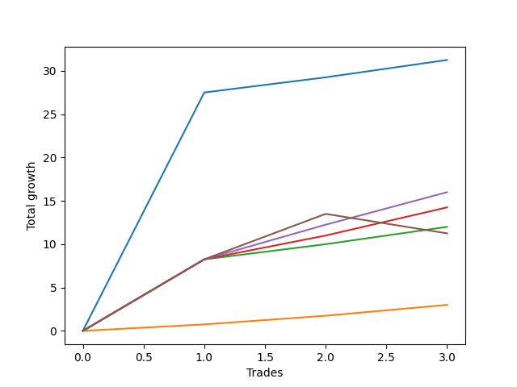

# Long Pointer 001 DBVW 
- Symbol: ES_SmolBoi
- Date Range: 03/18/2022 - 07/29/2022
- Trading Period: 7:20-12:30
- Number of Trades: 3



| Name | Win Percent | Profit | Avg Profit / Trade | Avg Time / Trade |      | Name | Win Percent | Profit | Avg Profit / Trade | Avg Time / Trade |
| ---- | ----------- | ------ | ------------------ | ---------------- | ---- | ---- | ----------- | ------ | ------------------ | ---------------- |
| Sorted By <br> Profit | | | | | | Sorted By <br> Win Percentage ||||
| Two | 100.00 | 15625.00 | 5208.33 | 14:20 |     | Two | 100.00 | 15625.00 | 5208.33 | 14:20 |
| Eighty-Four | 100.00 | 8000.00 | 2666.67 | 14:31 |     | Eighty-Four | 100.00 | 8000.00 | 2666.67 | 14:31 |
| Eighty-Three | 100.00 | 7125.00 | 2375.00 | 12:16 |     | Eighty-Three | 100.00 | 7125.00 | 2375.00 | 12:16 |
| Eighty-Two | 100.00 | 6000.00 | 2000.00 | 04:48 |     | Eighty-Two | 100.00 | 6000.00 | 2000.00 | 04:48 |
| Eighty-Five | 66.67 | 5625.00 | 1875.00 | 33:33 |     | Eighty-One | 100.00 | 1500.00 | 500.00 | 00:23 |
| Eighty-One | 100.00 | 1500.00 | 500.00 | 00:23 |     | Eighty-Five | 66.67 | 5625.00 | 1875.00 | 33:33 |

## NO STOPLOSS

### Test Two
* Sell when the price hits the upper line of the 20p 2std bollinger
* No Stoploss
* Results:
```
Total Trades: 3
Percent Up: 100.00
Percent Down: 0.00
Total Points Moved Up: 31.25
Potential Profit: 15625.00
Total Points Ups: 31.25 Count Ups: 3
Total Points Downs: 0.00 Count Downs: 0
```

<details><summary>Trades</summary>

<code>In: 2022-05-04 11:36:00		Out: 2022-05-04 11:43:45		Total Position Time: 07:45		Total Move Up: 27.50		Total to Date: 27.50</code> <br />
<code>In: 2022-07-08 09:48:00		Out: 2022-07-08 10:10:30		Total Position Time: 22:30		Total Move Up: 1.75		Total to Date: 29.25</code> <br />
<code>In: 2022-07-25 11:23:00		Out: 2022-07-25 11:35:45		Total Position Time: 12:45		Total Move Up: 2.00		Total to Date: 31.25</code> <br />


</details>

## TAKE PROFIT

### Test Eighty-One
* Take Profit of 1 Point
* No Stoploss
* Results:
```
Total Trades: 3
Percent Up: 100.00
Percent Down: 0.00
Total Points Moved Up: 3.00
Potential Profit: 1500.00
Total Points Ups: 3.00 Count Ups: 3
Total Points Downs: 0.00 Count Downs: 0
```

<details><summary>Trades</summary>

<code>In: 2022-05-04 11:36:00		Out: 2022-05-04 11:36:10		Total Position Time: 00:10		Total Move Up: 0.75		Total to Date: 0.75</code> <br />
<code>In: 2022-07-08 09:48:00		Out: 2022-07-08 09:48:20		Total Position Time: 00:20		Total Move Up: 1.00		Total to Date: 1.75</code> <br />
<code>In: 2022-07-25 11:23:00		Out: 2022-07-25 11:23:40		Total Position Time: 00:40		Total Move Up: 1.25		Total to Date: 3.00</code> <br />


</details>

### Test Eighty-Two
* Take Profit of 2 Point
* No Stoploss
* Results:
```
Total Trades: 3
Percent Up: 100.00
Percent Down: 0.00
Total Points Moved Up: 12.00
Potential Profit: 6000.00
Total Points Ups: 12.00 Count Ups: 3
Total Points Downs: 0.00 Count Downs: 0
```

<details><summary>Trades</summary>

<code>In: 2022-05-04 11:36:00		Out: 2022-05-04 11:36:40		Total Position Time: 00:40		Total Move Up: 8.25		Total to Date: 8.25</code> <br />
<code>In: 2022-07-08 09:48:00		Out: 2022-07-08 09:49:00		Total Position Time: 01:00		Total Move Up: 1.75		Total to Date: 10.00</code> <br />
<code>In: 2022-07-25 11:23:00		Out: 2022-07-25 11:35:45		Total Position Time: 12:45		Total Move Up: 2.00		Total to Date: 12.00</code> <br />


</details>

### Test Eighty-Three
* Take Profit of 3 Point
* No Stoploss
* Results:
```
Total Trades: 3
Percent Up: 100.00
Percent Down: 0.00
Total Points Moved Up: 14.25
Potential Profit: 7125.00
Total Points Ups: 14.25 Count Ups: 3
Total Points Downs: 0.00 Count Downs: 0
```

<details><summary>Trades</summary>

<code>In: 2022-05-04 11:36:00		Out: 2022-05-04 11:36:40		Total Position Time: 00:40		Total Move Up: 8.25		Total to Date: 8.25</code> <br />
<code>In: 2022-07-08 09:48:00		Out: 2022-07-08 10:11:20		Total Position Time: 23:20		Total Move Up: 2.75		Total to Date: 11.00</code> <br />
<code>In: 2022-07-25 11:23:00		Out: 2022-07-25 11:35:50		Total Position Time: 12:50		Total Move Up: 3.25		Total to Date: 14.25</code> <br />


</details>

### Test Eighty-Four
* Take Profit of 4 Point
* No Stoploss
* Results:
```
Total Trades: 3
Percent Up: 100.00
Percent Down: 0.00
Total Points Moved Up: 16.00
Potential Profit: 8000.00
Total Points Ups: 16.00 Count Ups: 3
Total Points Downs: 0.00 Count Downs: 0
```

<details><summary>Trades</summary>

<code>In: 2022-05-04 11:36:00		Out: 2022-05-04 11:36:40		Total Position Time: 00:40		Total Move Up: 8.25		Total to Date: 8.25</code> <br />
<code>In: 2022-07-08 09:48:00		Out: 2022-07-08 10:12:25		Total Position Time: 24:25		Total Move Up: 4.00		Total to Date: 12.25</code> <br />
<code>In: 2022-07-25 11:23:00		Out: 2022-07-25 11:41:30		Total Position Time: 18:30		Total Move Up: 3.75		Total to Date: 16.00</code> <br />


</details>

### Test Eighty-Five
* Take Profit of 5 Point
* No Stoploss
* Results:
```
Total Trades: 3
Percent Up: 66.67
Percent Down: 33.33
Total Points Moved Up: 11.25
Potential Profit: 5625.00
Total Points Ups: 13.50 Count Ups: 2
Total Points Downs: -2.25 Count Downs: 1
```

<details><summary>Trades</summary>

<code>In: 2022-05-04 11:36:00		Out: 2022-05-04 11:36:40		Total Position Time: 00:40		Total Move Up: 8.25		Total to Date: 8.25</code> <br />
<code>In: 2022-07-08 09:48:00		Out: 2022-07-08 10:28:05		Total Position Time: 40:05		Total Move Up: 5.25		Total to Date: 13.50</code> <br />
<code>In: 2022-07-25 11:23:00		Out: 2022-07-25 12:22:55		Total Position Time: 59:55		Total Move Up: -2.25		Total to Date: 11.25</code> <br />


</details>