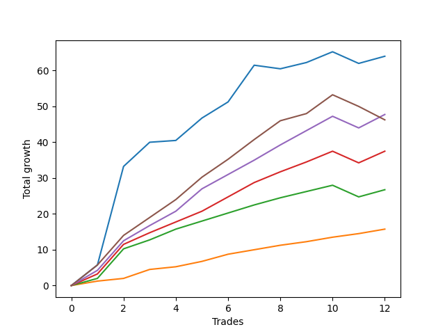

# Long Pointer 001 DB 
- Symbol: ES_SmolBoi
- Date Range: 03/18/2022 - 07/29/2022
- Trading Period: 7:20-12:30
- Number of Trades: 12



| Name | Win Percent | Profit | Avg Profit / Trade | Avg Time / Trade |      | Name | Win Percent | Profit | Avg Profit / Trade | Avg Time / Trade |
| ---- | ----------- | ------ | ------------------ | ---------------- | ---- | ---- | ----------- | ------ | ------------------ | ---------------- |
| Sorted By <br> Profit | | | | | | Sorted By <br> Win Percentage ||||
| Three | 91.67 | 28500.00 | 2375.00 | 13:14 |     | Eighty-One | 100.00 | 7875.00 | 656.25 | 01:04 |
| Two | 83.33 | 27875.00 | 2322.92 | 18:37 |     | Three | 91.67 | 28500.00 | 2375.00 | 13:14 |
| Eighty-Five | 83.33 | 24625.00 | 2052.08 | 19:13 |     | Eighty-Four | 91.67 | 23000.00 | 1916.67 | 13:13 |
| Eighty-Four | 91.67 | 23000.00 | 1916.67 | 13:13 |     | One | 91.67 | 21125.00 | 1760.42 | 09:27 |
| One | 91.67 | 21125.00 | 1760.42 | 09:27 |     | Eighty-Three | 91.67 | 17875.00 | 1489.58 | 11:35 |
| Five | 58.33 | 19375.00 | 1614.58 | 39:34 |     | Eighty-Two | 91.67 | 12500.00 | 1041.67 | 08:40 |
| NEWFI 0000 | 50.00 | 18375.00 | 1531.25 | 43:10 |     | Two | 83.33 | 27875.00 | 2322.92 | 18:37 |
| Eighty-Three | 91.67 | 17875.00 | 1489.58 | 11:35 |     | Eighty-Five | 83.33 | 24625.00 | 2052.08 | 19:13 |
| Four | 83.33 | 17000.00 | 1416.67 | 26:15 |     | Four | 83.33 | 17000.00 | 1416.67 | 26:15 |
| Six | 75.00 | 15750.00 | 1312.50 | 16:45 |     | Zero | 83.33 | 10250.00 | 854.17 | 03:57 |
| Eighty-Two | 91.67 | 12500.00 | 1041.67 | 08:40 |     | Six | 75.00 | 15750.00 | 1312.50 | 16:45 |
| Zero | 83.33 | 10250.00 | 854.17 | 03:57 |     | Five | 58.33 | 19375.00 | 1614.58 | 39:34 |
| Eighty-One | 100.00 | 7875.00 | 656.25 | 01:04 |     | NEWFI 0000 | 50.00 | 18375.00 | 1531.25 | 43:10 |
| Seven | 50.00 | 3625.00 | 302.08 | 39:56 |     | Seven | 50.00 | 3625.00 | 302.08 | 39:56 |

## NO STOPLOSS

### Test Zero
* Sell when price hits the middle line of the 20p bollinger
* No Stoploss
* Results:
```
Total Trades: 12
Percent Up: 83.33
Percent Down: 16.67
Total Points Moved Up: 20.50
Potential Profit: 10250.00
Total Points Ups: 25.75 Count Ups: 10
Total Points Downs: -5.25 Count Downs: 2
```

<details><summary>Trades</summary>

<code>In: 2022-03-31 08:37:00		Out: 2022-03-31 08:38:15		Total Position Time: 01:15		Total Move Up: 2.00		Total to Date: 2.00</code> <br />
<code>In: 2022-05-04 11:36:00		Out: 2022-05-04 11:36:40		Total Position Time: 00:40		Total Move Up: 8.25		Total to Date: 10.25</code> <br />
<code>In: 2022-05-06 09:03:00		Out: 2022-05-06 09:03:10		Total Position Time: 00:10		Total Move Up: 2.50		Total to Date: 12.75</code> <br />
<code>In: 2022-05-06 11:28:00		Out: 2022-05-06 11:40:25		Total Position Time: 12:25		Total Move Up: -1.75		Total to Date: 11.00</code> <br />
<code>In: 2022-05-11 09:14:00		Out: 2022-05-11 09:17:50		Total Position Time: 03:50		Total Move Up: 0.25		Total to Date: 11.25</code> <br />
<code>In: 2022-05-16 09:47:00		Out: 2022-05-16 09:48:15		Total Position Time: 01:15		Total Move Up: 4.00		Total to Date: 15.25</code> <br />
<code>In: 2022-05-31 12:05:00		Out: 2022-05-31 12:07:20		Total Position Time: 02:20		Total Move Up: 2.25		Total to Date: 17.50</code> <br />
<code>In: 2022-06-27 10:10:00		Out: 2022-06-27 10:11:25		Total Position Time: 01:25		Total Move Up: 3.00		Total to Date: 20.50</code> <br />
<code>In: 2022-07-08 09:48:00		Out: 2022-07-08 09:48:40		Total Position Time: 00:40		Total Move Up: 1.75		Total to Date: 22.25</code> <br />
<code>In: 2022-07-12 10:28:00		Out: 2022-07-12 10:28:50		Total Position Time: 00:50		Total Move Up: 1.25		Total to Date: 23.50</code> <br />
<code>In: 2022-07-25 10:44:00		Out: 2022-07-25 11:06:25		Total Position Time: 22:25		Total Move Up: -3.50		Total to Date: 20.00</code> <br />
<code>In: 2022-07-25 11:23:00		Out: 2022-07-25 11:23:10		Total Position Time: 00:10		Total Move Up: 0.50		Total to Date: 20.50</code> <br />


</details>

### Test One
* Sell when the price hits the upper line of the 20p 1std bollinger
* No Stoploss
* Results:
```
Total Trades: 12
Percent Up: 91.67
Percent Down: 8.33
Total Points Moved Up: 42.25
Potential Profit: 21125.00
Total Points Ups: 46.00 Count Ups: 11
Total Points Downs: -3.75 Count Downs: 1
```

<details><summary>Trades</summary>

<code>In: 2022-03-31 08:37:00		Out: 2022-03-31 08:40:35		Total Position Time: 03:35		Total Move Up: 3.25		Total to Date: 3.25</code> <br />
<code>In: 2022-05-04 11:36:00		Out: 2022-05-04 11:41:35		Total Position Time: 05:35		Total Move Up: 16.00		Total to Date: 19.25</code> <br />
<code>In: 2022-05-06 09:03:00		Out: 2022-05-06 09:03:10		Total Position Time: 00:10		Total Move Up: 2.50		Total to Date: 21.75</code> <br />
<code>In: 2022-05-06 11:28:00		Out: 2022-05-06 11:49:10		Total Position Time: 21:10		Total Move Up: 0.50		Total to Date: 22.25</code> <br />
<code>In: 2022-05-11 09:14:00		Out: 2022-05-11 09:23:10		Total Position Time: 09:10		Total Move Up: 3.25		Total to Date: 25.50</code> <br />
<code>In: 2022-05-16 09:47:00		Out: 2022-05-16 09:50:05		Total Position Time: 03:05		Total Move Up: 6.75		Total to Date: 32.25</code> <br />
<code>In: 2022-05-31 12:05:00		Out: 2022-05-31 12:09:15		Total Position Time: 04:15		Total Move Up: 5.25		Total to Date: 37.50</code> <br />
<code>In: 2022-06-27 10:10:00		Out: 2022-06-27 10:15:55		Total Position Time: 05:55		Total Move Up: 6.00		Total to Date: 43.50</code> <br />
<code>In: 2022-07-08 09:48:00		Out: 2022-07-08 10:06:55		Total Position Time: 18:55		Total Move Up: 0.00		Total to Date: 43.50</code> <br />
<code>In: 2022-07-12 10:28:00		Out: 2022-07-12 10:30:05		Total Position Time: 02:05		Total Move Up: 1.75		Total to Date: 45.25</code> <br />
<code>In: 2022-07-25 10:44:00		Out: 2022-07-25 11:11:20		Total Position Time: 27:20		Total Move Up: -3.75		Total to Date: 41.50</code> <br />
<code>In: 2022-07-25 11:23:00		Out: 2022-07-25 11:35:15		Total Position Time: 12:15		Total Move Up: 0.75		Total to Date: 42.25</code> <br />


</details>

### Test Two
* Sell when the price hits the upper line of the 20p 2std bollinger
* No Stoploss
* Results:
```
Total Trades: 12
Percent Up: 83.33
Percent Down: 16.67
Total Points Moved Up: 55.75
Potential Profit: 27875.00
Total Points Ups: 68.25 Count Ups: 10
Total Points Downs: -12.50 Count Downs: 2
```

<details><summary>Trades</summary>

<code>In: 2022-03-31 08:37:00		Out: 2022-03-31 08:41:10		Total Position Time: 04:10		Total Move Up: 5.75		Total to Date: 5.75</code> <br />
<code>In: 2022-05-04 11:36:00		Out: 2022-05-04 11:43:45		Total Position Time: 07:45		Total Move Up: 27.50		Total to Date: 33.25</code> <br />
<code>In: 2022-05-06 09:03:00		Out: 2022-05-06 09:03:55		Total Position Time: 00:55		Total Move Up: 6.75		Total to Date: 40.00</code> <br />
<code>In: 2022-05-06 11:28:00		Out: 2022-05-06 11:49:10		Total Position Time: 21:10		Total Move Up: 0.50		Total to Date: 40.50</code> <br />
<code>In: 2022-05-11 09:14:00		Out: 2022-05-11 09:23:35		Total Position Time: 09:35		Total Move Up: 6.25		Total to Date: 46.75</code> <br />
<code>In: 2022-05-16 09:47:00		Out: 2022-05-16 10:06:30		Total Position Time: 19:30		Total Move Up: 4.50		Total to Date: 51.25</code> <br />
<code>In: 2022-05-31 12:05:00		Out: 2022-05-31 12:15:05		Total Position Time: 10:05		Total Move Up: 10.25		Total to Date: 61.50</code> <br />
<code>In: 2022-06-27 10:10:00		Out: 2022-06-27 11:09:55		Total Position Time: 59:55		Total Move Up: -7.50		Total to Date: 54.00</code> <br />
<code>In: 2022-07-08 09:48:00		Out: 2022-07-08 10:10:30		Total Position Time: 22:30		Total Move Up: 1.75		Total to Date: 55.75</code> <br />
<code>In: 2022-07-12 10:28:00		Out: 2022-07-12 10:31:30		Total Position Time: 03:30		Total Move Up: 3.00		Total to Date: 58.75</code> <br />
<code>In: 2022-07-25 10:44:00		Out: 2022-07-25 11:35:45		Total Position Time: 51:45		Total Move Up: -5.00		Total to Date: 53.75</code> <br />
<code>In: 2022-07-25 11:23:00		Out: 2022-07-25 11:35:45		Total Position Time: 12:45		Total Move Up: 2.00		Total to Date: 55.75</code> <br />


</details>

### Test Three
* Sell when price hits the middle line of the 50p bollinger
* No Stoploss
* Results:
```
Total Trades: 12
Percent Up: 91.67
Percent Down: 8.33
Total Points Moved Up: 57.00
Potential Profit: 28500.00
Total Points Ups: 62.50 Count Ups: 11
Total Points Downs: -5.50 Count Downs: 1
```

<details><summary>Trades</summary>

<code>In: 2022-03-31 08:37:00		Out: 2022-03-31 08:41:05		Total Position Time: 04:05		Total Move Up: 4.25		Total to Date: 4.25</code> <br />
<code>In: 2022-05-04 11:36:00		Out: 2022-05-04 11:41:15		Total Position Time: 05:15		Total Move Up: 11.75		Total to Date: 16.00</code> <br />
<code>In: 2022-05-06 09:03:00		Out: 2022-05-06 09:06:05		Total Position Time: 03:05		Total Move Up: 10.25		Total to Date: 26.25</code> <br />
<code>In: 2022-05-06 11:28:00		Out: 2022-05-06 11:49:10		Total Position Time: 21:10		Total Move Up: 0.50		Total to Date: 26.75</code> <br />
<code>In: 2022-05-11 09:14:00		Out: 2022-05-11 09:23:45		Total Position Time: 09:45		Total Move Up: 8.25		Total to Date: 35.00</code> <br />
<code>In: 2022-05-16 09:47:00		Out: 2022-05-16 09:50:05		Total Position Time: 03:05		Total Move Up: 6.75		Total to Date: 41.75</code> <br />
<code>In: 2022-05-31 12:05:00		Out: 2022-05-31 12:15:15		Total Position Time: 10:15		Total Move Up: 12.25		Total to Date: 54.00</code> <br />
<code>In: 2022-06-27 10:10:00		Out: 2022-06-27 10:11:15		Total Position Time: 01:15		Total Move Up: 1.75		Total to Date: 55.75</code> <br />
<code>In: 2022-07-08 09:48:00		Out: 2022-07-08 10:11:05		Total Position Time: 23:05		Total Move Up: 2.25		Total to Date: 58.00</code> <br />
<code>In: 2022-07-12 10:28:00		Out: 2022-07-12 10:41:35		Total Position Time: 13:35		Total Move Up: 3.00		Total to Date: 61.00</code> <br />
<code>In: 2022-07-25 10:44:00		Out: 2022-07-25 11:35:40		Total Position Time: 51:40		Total Move Up: -5.50		Total to Date: 55.50</code> <br />
<code>In: 2022-07-25 11:23:00		Out: 2022-07-25 11:35:40		Total Position Time: 12:40		Total Move Up: 1.50		Total to Date: 57.00</code> <br />


</details>

### Test Four
* Sell when the price hits the upper line of the 50p 1std bollinger
* No Stoploss
* Results:
```
Total Trades: 12
Percent Up: 83.33
Percent Down: 16.67
Total Points Moved Up: 34.00
Potential Profit: 17000.00
Total Points Ups: 79.25 Count Ups: 10
Total Points Downs: -45.25 Count Downs: 2
```

<details><summary>Trades</summary>

<code>In: 2022-03-31 08:37:00		Out: 2022-03-31 09:00:15		Total Position Time: 23:15		Total Move Up: 4.25		Total to Date: 4.25</code> <br />
<code>In: 2022-05-04 11:36:00		Out: 2022-05-04 11:42:00		Total Position Time: 06:00		Total Move Up: 21.25		Total to Date: 25.50</code> <br />
<code>In: 2022-05-06 09:03:00		Out: 2022-05-06 09:22:25		Total Position Time: 19:25		Total Move Up: 8.25		Total to Date: 33.75</code> <br />
<code>In: 2022-05-06 11:28:00		Out: 2022-05-06 11:50:10		Total Position Time: 22:10		Total Move Up: 8.75		Total to Date: 42.50</code> <br />
<code>In: 2022-05-11 09:14:00		Out: 2022-05-11 10:13:55		Total Position Time: 59:55		Total Move Up: -41.25		Total to Date: 1.25</code> <br />
<code>In: 2022-05-16 09:47:00		Out: 2022-05-16 10:07:00		Total Position Time: 20:00		Total Move Up: 5.25		Total to Date: 6.50</code> <br />
<code>In: 2022-05-31 12:05:00		Out: 2022-05-31 12:28:20		Total Position Time: 23:20		Total Move Up: 16.50		Total to Date: 23.00</code> <br />
<code>In: 2022-06-27 10:10:00		Out: 2022-06-27 10:13:05		Total Position Time: 03:05		Total Move Up: 5.50		Total to Date: 28.50</code> <br />
<code>In: 2022-07-08 09:48:00		Out: 2022-07-08 10:26:30		Total Position Time: 38:30		Total Move Up: 2.75		Total to Date: 31.25</code> <br />
<code>In: 2022-07-12 10:28:00		Out: 2022-07-12 10:52:25		Total Position Time: 24:25		Total Move Up: 3.75		Total to Date: 35.00</code> <br />
<code>In: 2022-07-25 10:44:00		Out: 2022-07-25 11:41:00		Total Position Time: 57:00		Total Move Up: -4.00		Total to Date: 31.00</code> <br />
<code>In: 2022-07-25 11:23:00		Out: 2022-07-25 11:41:00		Total Position Time: 18:00		Total Move Up: 3.00		Total to Date: 34.00</code> <br />


</details>

### Test Five
* Sell when the price hits the upper line of the 50p 2std bollinger
* No Stoploss
* Results:
```
Total Trades: 12
Percent Up: 58.33
Percent Down: 41.67
Total Points Moved Up: 38.75
Potential Profit: 19375.00
Total Points Ups: 100.00 Count Ups: 7
Total Points Downs: -61.25 Count Downs: 5
```

<details><summary>Trades</summary>

<code>In: 2022-03-31 08:37:00		Out: 2022-03-31 09:36:55		Total Position Time: 59:55		Total Move Up: -5.25		Total to Date: -5.25</code> <br />
<code>In: 2022-05-04 11:36:00		Out: 2022-05-04 11:43:45		Total Position Time: 07:45		Total Move Up: 27.50		Total to Date: 22.25</code> <br />
<code>In: 2022-05-06 09:03:00		Out: 2022-05-06 09:36:15		Total Position Time: 33:15		Total Move Up: 19.75		Total to Date: 42.00</code> <br />
<code>In: 2022-05-06 11:28:00		Out: 2022-05-06 11:50:35		Total Position Time: 22:35		Total Move Up: 12.75		Total to Date: 54.75</code> <br />
<code>In: 2022-05-11 09:14:00		Out: 2022-05-11 10:13:55		Total Position Time: 59:55		Total Move Up: -41.25		Total to Date: 13.50</code> <br />
<code>In: 2022-05-16 09:47:00		Out: 2022-05-16 10:07:35		Total Position Time: 20:35		Total Move Up: 8.50		Total to Date: 22.00</code> <br />
<code>In: 2022-05-31 12:05:00		Out: 2022-05-31 12:31:05		Total Position Time: 26:05		Total Move Up: 22.75		Total to Date: 44.75</code> <br />
<code>In: 2022-06-27 10:10:00		Out: 2022-06-27 11:09:55		Total Position Time: 59:55		Total Move Up: -7.50		Total to Date: 37.25</code> <br />
<code>In: 2022-07-08 09:48:00		Out: 2022-07-08 10:26:55		Total Position Time: 38:55		Total Move Up: 4.00		Total to Date: 41.25</code> <br />
<code>In: 2022-07-12 10:28:00		Out: 2022-07-12 10:54:05		Total Position Time: 26:05		Total Move Up: 4.75		Total to Date: 46.00</code> <br />
<code>In: 2022-07-25 10:44:00		Out: 2022-07-25 11:43:55		Total Position Time: 59:55		Total Move Up: -5.00		Total to Date: 41.00</code> <br />
<code>In: 2022-07-25 11:23:00		Out: 2022-07-25 12:22:55		Total Position Time: 59:55		Total Move Up: -2.25		Total to Date: 38.75</code> <br />


</details>

### Test Six
* Sell when the price hits the middle line of the 1std VWAP
* No Stoploss
* Results:
```
Total Trades: 12
Percent Up: 75.00
Percent Down: 25.00
Total Points Moved Up: 31.50
Potential Profit: 15750.00
Total Points Ups: 39.25 Count Ups: 9
Total Points Downs: -7.75 Count Downs: 3
```

<details><summary>Trades</summary>

<code>In: 2022-03-31 08:37:00		Out: 2022-03-31 08:37:40		Total Position Time: 00:40		Total Move Up: 1.25		Total to Date: 1.25</code> <br />
<code>In: 2022-05-04 11:36:00		Out: 2022-05-04 11:36:10		Total Position Time: 00:10		Total Move Up: 0.75		Total to Date: 2.00</code> <br />
<code>In: 2022-05-06 09:03:00		Out: 2022-05-06 09:03:10		Total Position Time: 00:10		Total Move Up: 2.50		Total to Date: 4.50</code> <br />
<code>In: 2022-05-06 11:28:00		Out: 2022-05-06 11:50:20		Total Position Time: 22:20		Total Move Up: 12.75		Total to Date: 17.25</code> <br />
<code>In: 2022-05-11 09:14:00		Out: 2022-05-11 09:23:10		Total Position Time: 09:10		Total Move Up: 3.25		Total to Date: 20.50</code> <br />
<code>In: 2022-05-16 09:47:00		Out: 2022-05-16 09:47:10		Total Position Time: 00:10		Total Move Up: -0.50		Total to Date: 20.00</code> <br />
<code>In: 2022-05-31 12:05:00		Out: 2022-05-31 12:07:50		Total Position Time: 02:50		Total Move Up: 4.75		Total to Date: 24.75</code> <br />
<code>In: 2022-06-27 10:10:00		Out: 2022-06-27 10:11:25		Total Position Time: 01:25		Total Move Up: 3.00		Total to Date: 27.75</code> <br />
<code>In: 2022-07-08 09:48:00		Out: 2022-07-08 10:29:10		Total Position Time: 41:10		Total Move Up: 8.00		Total to Date: 35.75</code> <br />
<code>In: 2022-07-12 10:28:00		Out: 2022-07-12 10:31:15		Total Position Time: 03:15		Total Move Up: 3.00		Total to Date: 38.75</code> <br />
<code>In: 2022-07-25 10:44:00		Out: 2022-07-25 11:43:55		Total Position Time: 59:55		Total Move Up: -5.00		Total to Date: 33.75</code> <br />
<code>In: 2022-07-25 11:23:00		Out: 2022-07-25 12:22:55		Total Position Time: 59:55		Total Move Up: -2.25		Total to Date: 31.50</code> <br />


</details>

### Test Seven
* Sell when the price hits the upper line of the 1std VWAP
* No Stoploss
* Results:
```
Total Trades: 12
Percent Up: 50.00
Percent Down: 50.00
Total Points Moved Up: 7.25
Potential Profit: 3625.00
Total Points Ups: 72.75 Count Ups: 6
Total Points Downs: -65.50 Count Downs: 6
```

<details><summary>Trades</summary>

<code>In: 2022-03-31 08:37:00		Out: 2022-03-31 08:41:10		Total Position Time: 04:10		Total Move Up: 5.75		Total to Date: 5.75</code> <br />
<code>In: 2022-05-04 11:36:00		Out: 2022-05-04 11:41:30		Total Position Time: 05:30		Total Move Up: 13.75		Total to Date: 19.50</code> <br />
<code>In: 2022-05-06 09:03:00		Out: 2022-05-06 09:06:40		Total Position Time: 03:40		Total Move Up: 11.50		Total to Date: 31.00</code> <br />
<code>In: 2022-05-06 11:28:00		Out: 2022-05-06 12:27:55		Total Position Time: 59:55		Total Move Up: -8.25		Total to Date: 22.75</code> <br />
<code>In: 2022-05-11 09:14:00		Out: 2022-05-11 10:13:55		Total Position Time: 59:55		Total Move Up: -41.25		Total to Date: -18.50</code> <br />
<code>In: 2022-05-16 09:47:00		Out: 2022-05-16 10:07:35		Total Position Time: 20:35		Total Move Up: 8.50		Total to Date: -10.00</code> <br />
<code>In: 2022-05-31 12:05:00		Out: 2022-05-31 12:30:55		Total Position Time: 25:55		Total Move Up: 21.50		Total to Date: 11.50</code> <br />
<code>In: 2022-06-27 10:10:00		Out: 2022-06-27 11:09:55		Total Position Time: 59:55		Total Move Up: -7.50		Total to Date: 4.00</code> <br />
<code>In: 2022-07-08 09:48:00		Out: 2022-07-08 10:47:55		Total Position Time: 59:55		Total Move Up: 11.75		Total to Date: 15.75</code> <br />
<code>In: 2022-07-12 10:28:00		Out: 2022-07-12 11:27:55		Total Position Time: 59:55		Total Move Up: -1.25		Total to Date: 14.50</code> <br />
<code>In: 2022-07-25 10:44:00		Out: 2022-07-25 11:43:55		Total Position Time: 59:55		Total Move Up: -5.00		Total to Date: 9.50</code> <br />
<code>In: 2022-07-25 11:23:00		Out: 2022-07-25 12:22:55		Total Position Time: 59:55		Total Move Up: -2.25		Total to Date: 7.25</code> <br />


</details>

## TAKE PROFIT

### Test Eighty-One
* Take Profit of 1 Point
* No Stoploss
* Results:
```
Total Trades: 12
Percent Up: 100.00
Percent Down: 0.00
Total Points Moved Up: 15.75
Potential Profit: 7875.00
Total Points Ups: 15.75 Count Ups: 12
Total Points Downs: 0.00 Count Downs: 0
```

<details><summary>Trades</summary>

<code>In: 2022-03-31 08:37:00		Out: 2022-03-31 08:37:40		Total Position Time: 00:40		Total Move Up: 1.25		Total to Date: 1.25</code> <br />
<code>In: 2022-05-04 11:36:00		Out: 2022-05-04 11:36:10		Total Position Time: 00:10		Total Move Up: 0.75		Total to Date: 2.00</code> <br />
<code>In: 2022-05-06 09:03:00		Out: 2022-05-06 09:03:10		Total Position Time: 00:10		Total Move Up: 2.50		Total to Date: 4.50</code> <br />
<code>In: 2022-05-06 11:28:00		Out: 2022-05-06 11:30:35		Total Position Time: 02:35		Total Move Up: 0.75		Total to Date: 5.25</code> <br />
<code>In: 2022-05-11 09:14:00		Out: 2022-05-11 09:14:25		Total Position Time: 00:25		Total Move Up: 1.50		Total to Date: 6.75</code> <br />
<code>In: 2022-05-16 09:47:00		Out: 2022-05-16 09:47:50		Total Position Time: 00:50		Total Move Up: 2.00		Total to Date: 8.75</code> <br />
<code>In: 2022-05-31 12:05:00		Out: 2022-05-31 12:07:05		Total Position Time: 02:05		Total Move Up: 1.25		Total to Date: 10.00</code> <br />
<code>In: 2022-06-27 10:10:00		Out: 2022-06-27 10:10:25		Total Position Time: 00:25		Total Move Up: 1.25		Total to Date: 11.25</code> <br />
<code>In: 2022-07-08 09:48:00		Out: 2022-07-08 09:48:20		Total Position Time: 00:20		Total Move Up: 1.00		Total to Date: 12.25</code> <br />
<code>In: 2022-07-12 10:28:00		Out: 2022-07-12 10:28:50		Total Position Time: 00:50		Total Move Up: 1.25		Total to Date: 13.50</code> <br />
<code>In: 2022-07-25 10:44:00		Out: 2022-07-25 10:47:45		Total Position Time: 03:45		Total Move Up: 1.00		Total to Date: 14.50</code> <br />
<code>In: 2022-07-25 11:23:00		Out: 2022-07-25 11:23:40		Total Position Time: 00:40		Total Move Up: 1.25		Total to Date: 15.75</code> <br />


</details>

### Test Eighty-Two
* Take Profit of 2 Point
* No Stoploss
* Results:
```
Total Trades: 12
Percent Up: 91.67
Percent Down: 8.33
Total Points Moved Up: 25.00
Potential Profit: 12500.00
Total Points Ups: 30.00 Count Ups: 11
Total Points Downs: -5.00 Count Downs: 1
```

<details><summary>Trades</summary>

<code>In: 2022-03-31 08:37:00		Out: 2022-03-31 08:38:15		Total Position Time: 01:15		Total Move Up: 2.00		Total to Date: 2.00</code> <br />
<code>In: 2022-05-04 11:36:00		Out: 2022-05-04 11:36:40		Total Position Time: 00:40		Total Move Up: 8.25		Total to Date: 10.25</code> <br />
<code>In: 2022-05-06 09:03:00		Out: 2022-05-06 09:03:10		Total Position Time: 00:10		Total Move Up: 2.50		Total to Date: 12.75</code> <br />
<code>In: 2022-05-06 11:28:00		Out: 2022-05-06 11:49:25		Total Position Time: 21:25		Total Move Up: 3.00		Total to Date: 15.75</code> <br />
<code>In: 2022-05-11 09:14:00		Out: 2022-05-11 09:14:30		Total Position Time: 00:30		Total Move Up: 2.25		Total to Date: 18.00</code> <br />
<code>In: 2022-05-16 09:47:00		Out: 2022-05-16 09:47:55		Total Position Time: 00:55		Total Move Up: 2.25		Total to Date: 20.25</code> <br />
<code>In: 2022-05-31 12:05:00		Out: 2022-05-31 12:07:20		Total Position Time: 02:20		Total Move Up: 2.25		Total to Date: 22.50</code> <br />
<code>In: 2022-06-27 10:10:00		Out: 2022-06-27 10:11:10		Total Position Time: 01:10		Total Move Up: 2.00		Total to Date: 24.50</code> <br />
<code>In: 2022-07-08 09:48:00		Out: 2022-07-08 09:49:00		Total Position Time: 01:00		Total Move Up: 1.75		Total to Date: 26.25</code> <br />
<code>In: 2022-07-12 10:28:00		Out: 2022-07-12 10:30:05		Total Position Time: 02:05		Total Move Up: 1.75		Total to Date: 28.00</code> <br />
<code>In: 2022-07-25 10:44:00		Out: 2022-07-25 11:43:55		Total Position Time: 59:55		Total Move Up: -5.00		Total to Date: 23.00</code> <br />
<code>In: 2022-07-25 11:23:00		Out: 2022-07-25 11:35:45		Total Position Time: 12:45		Total Move Up: 2.00		Total to Date: 25.00</code> <br />


</details>

### Test Eighty-Three
* Take Profit of 3 Point
* No Stoploss
* Results:
```
Total Trades: 12
Percent Up: 91.67
Percent Down: 8.33
Total Points Moved Up: 35.75
Potential Profit: 17875.00
Total Points Ups: 40.75 Count Ups: 11
Total Points Downs: -5.00 Count Downs: 1
```

<details><summary>Trades</summary>

<code>In: 2022-03-31 08:37:00		Out: 2022-03-31 08:40:35		Total Position Time: 03:35		Total Move Up: 3.25		Total to Date: 3.25</code> <br />
<code>In: 2022-05-04 11:36:00		Out: 2022-05-04 11:36:40		Total Position Time: 00:40		Total Move Up: 8.25		Total to Date: 11.50</code> <br />
<code>In: 2022-05-06 09:03:00		Out: 2022-05-06 09:03:40		Total Position Time: 00:40		Total Move Up: 3.25		Total to Date: 14.75</code> <br />
<code>In: 2022-05-06 11:28:00		Out: 2022-05-06 11:49:25		Total Position Time: 21:25		Total Move Up: 3.00		Total to Date: 17.75</code> <br />
<code>In: 2022-05-11 09:14:00		Out: 2022-05-11 09:22:05		Total Position Time: 08:05		Total Move Up: 3.00		Total to Date: 20.75</code> <br />
<code>In: 2022-05-16 09:47:00		Out: 2022-05-16 09:48:15		Total Position Time: 01:15		Total Move Up: 4.00		Total to Date: 24.75</code> <br />
<code>In: 2022-05-31 12:05:00		Out: 2022-05-31 12:07:45		Total Position Time: 02:45		Total Move Up: 4.00		Total to Date: 28.75</code> <br />
<code>In: 2022-06-27 10:10:00		Out: 2022-06-27 10:11:25		Total Position Time: 01:25		Total Move Up: 3.00		Total to Date: 31.75</code> <br />
<code>In: 2022-07-08 09:48:00		Out: 2022-07-08 10:11:20		Total Position Time: 23:20		Total Move Up: 2.75		Total to Date: 34.50</code> <br />
<code>In: 2022-07-12 10:28:00		Out: 2022-07-12 10:31:15		Total Position Time: 03:15		Total Move Up: 3.00		Total to Date: 37.50</code> <br />
<code>In: 2022-07-25 10:44:00		Out: 2022-07-25 11:43:55		Total Position Time: 59:55		Total Move Up: -5.00		Total to Date: 32.50</code> <br />
<code>In: 2022-07-25 11:23:00		Out: 2022-07-25 11:35:50		Total Position Time: 12:50		Total Move Up: 3.25		Total to Date: 35.75</code> <br />


</details>

### Test Eighty-Four
* Take Profit of 4 Point
* No Stoploss
* Results:
```
Total Trades: 12
Percent Up: 91.67
Percent Down: 8.33
Total Points Moved Up: 46.00
Potential Profit: 23000.00
Total Points Ups: 51.00 Count Ups: 11
Total Points Downs: -5.00 Count Downs: 1
```

<details><summary>Trades</summary>

<code>In: 2022-03-31 08:37:00		Out: 2022-03-31 08:41:05		Total Position Time: 04:05		Total Move Up: 4.25		Total to Date: 4.25</code> <br />
<code>In: 2022-05-04 11:36:00		Out: 2022-05-04 11:36:40		Total Position Time: 00:40		Total Move Up: 8.25		Total to Date: 12.50</code> <br />
<code>In: 2022-05-06 09:03:00		Out: 2022-05-06 09:03:45		Total Position Time: 00:45		Total Move Up: 4.25		Total to Date: 16.75</code> <br />
<code>In: 2022-05-06 11:28:00		Out: 2022-05-06 11:49:30		Total Position Time: 21:30		Total Move Up: 4.00		Total to Date: 20.75</code> <br />
<code>In: 2022-05-11 09:14:00		Out: 2022-05-11 09:23:15		Total Position Time: 09:15		Total Move Up: 6.25		Total to Date: 27.00</code> <br />
<code>In: 2022-05-16 09:47:00		Out: 2022-05-16 09:48:15		Total Position Time: 01:15		Total Move Up: 4.00		Total to Date: 31.00</code> <br />
<code>In: 2022-05-31 12:05:00		Out: 2022-05-31 12:07:45		Total Position Time: 02:45		Total Move Up: 4.00		Total to Date: 35.00</code> <br />
<code>In: 2022-06-27 10:10:00		Out: 2022-06-27 10:12:00		Total Position Time: 02:00		Total Move Up: 4.25		Total to Date: 39.25</code> <br />
<code>In: 2022-07-08 09:48:00		Out: 2022-07-08 10:12:25		Total Position Time: 24:25		Total Move Up: 4.00		Total to Date: 43.25</code> <br />
<code>In: 2022-07-12 10:28:00		Out: 2022-07-12 10:41:40		Total Position Time: 13:40		Total Move Up: 4.00		Total to Date: 47.25</code> <br />
<code>In: 2022-07-25 10:44:00		Out: 2022-07-25 11:43:55		Total Position Time: 59:55		Total Move Up: -5.00		Total to Date: 42.25</code> <br />
<code>In: 2022-07-25 11:23:00		Out: 2022-07-25 11:41:30		Total Position Time: 18:30		Total Move Up: 3.75		Total to Date: 46.00</code> <br />


</details>

### Test Eighty-Five
* Take Profit of 5 Point
* No Stoploss
* Results:
```
Total Trades: 12
Percent Up: 83.33
Percent Down: 16.67
Total Points Moved Up: 49.25
Potential Profit: 24625.00
Total Points Ups: 56.50 Count Ups: 10
Total Points Downs: -7.25 Count Downs: 2
```

<details><summary>Trades</summary>

<code>In: 2022-03-31 08:37:00		Out: 2022-03-31 08:41:10		Total Position Time: 04:10		Total Move Up: 5.75		Total to Date: 5.75</code> <br />
<code>In: 2022-05-04 11:36:00		Out: 2022-05-04 11:36:40		Total Position Time: 00:40		Total Move Up: 8.25		Total to Date: 14.00</code> <br />
<code>In: 2022-05-06 09:03:00		Out: 2022-05-06 09:03:50		Total Position Time: 00:50		Total Move Up: 5.00		Total to Date: 19.00</code> <br />
<code>In: 2022-05-06 11:28:00		Out: 2022-05-06 11:50:05		Total Position Time: 22:05		Total Move Up: 5.00		Total to Date: 24.00</code> <br />
<code>In: 2022-05-11 09:14:00		Out: 2022-05-11 09:23:15		Total Position Time: 09:15		Total Move Up: 6.25		Total to Date: 30.25</code> <br />
<code>In: 2022-05-16 09:47:00		Out: 2022-05-16 09:48:45		Total Position Time: 01:45		Total Move Up: 5.00		Total to Date: 35.25</code> <br />
<code>In: 2022-05-31 12:05:00		Out: 2022-05-31 12:07:55		Total Position Time: 02:55		Total Move Up: 5.50		Total to Date: 40.75</code> <br />
<code>In: 2022-06-27 10:10:00		Out: 2022-06-27 10:12:55		Total Position Time: 02:55		Total Move Up: 5.25		Total to Date: 46.00</code> <br />
<code>In: 2022-07-08 09:48:00		Out: 2022-07-08 10:28:05		Total Position Time: 40:05		Total Move Up: 5.25		Total to Date: 51.25</code> <br />
<code>In: 2022-07-12 10:28:00		Out: 2022-07-12 10:54:15		Total Position Time: 26:15		Total Move Up: 5.25		Total to Date: 56.50</code> <br />
<code>In: 2022-07-25 10:44:00		Out: 2022-07-25 11:43:55		Total Position Time: 59:55		Total Move Up: -5.00		Total to Date: 51.50</code> <br />
<code>In: 2022-07-25 11:23:00		Out: 2022-07-25 12:22:55		Total Position Time: 59:55		Total Move Up: -2.25		Total to Date: 49.25</code> <br />


</details>

## Indicator Exits

### Test NEWFI 0000
* Newfi 0000
* No Stoploss
* Results:
```
Total Trades: 12
Percent Up: 50.00
Percent Down: 50.00
Total Points Moved Up: 36.75
Potential Profit: 18375.00
Total Points Ups: 106.25 Count Ups: 6
Total Points Downs: -69.50 Count Downs: 6
```

<details><summary>Trades</summary>

<code>In: 2022-03-31 08:37:00		Out: 2022-03-31 09:36:55		Total Position Time: 59:55		Total Move Up: -5.25		Total to Date: -5.25</code> <br />
<code>In: 2022-05-04 11:36:00		Out: 2022-05-04 11:50:05		Total Position Time: 14:05		Total Move Up: 59.25		Total to Date: 54.00</code> <br />
<code>In: 2022-05-06 09:03:00		Out: 2022-05-06 09:28:05		Total Position Time: 25:05		Total Move Up: 6.00		Total to Date: 60.00</code> <br />
<code>In: 2022-05-06 11:28:00		Out: 2022-05-06 12:27:55		Total Position Time: 59:55		Total Move Up: -8.25		Total to Date: 51.75</code> <br />
<code>In: 2022-05-11 09:14:00		Out: 2022-05-11 10:13:55		Total Position Time: 59:55		Total Move Up: -41.25		Total to Date: 10.50</code> <br />
<code>In: 2022-05-16 09:47:00		Out: 2022-05-16 10:15:05		Total Position Time: 28:05		Total Move Up: 15.00		Total to Date: 25.50</code> <br />
<code>In: 2022-05-31 12:05:00		Out: 2022-05-31 12:30:05		Total Position Time: 25:05		Total Move Up: 17.50		Total to Date: 43.00</code> <br />
<code>In: 2022-06-27 10:10:00		Out: 2022-06-27 11:09:55		Total Position Time: 59:55		Total Move Up: -7.50		Total to Date: 35.50</code> <br />
<code>In: 2022-07-08 09:48:00		Out: 2022-07-08 10:31:05		Total Position Time: 43:05		Total Move Up: 6.25		Total to Date: 41.75</code> <br />
<code>In: 2022-07-12 10:28:00		Out: 2022-07-12 10:51:05		Total Position Time: 23:05		Total Move Up: 2.25		Total to Date: 44.00</code> <br />
<code>In: 2022-07-25 10:44:00		Out: 2022-07-25 11:43:55		Total Position Time: 59:55		Total Move Up: -5.00		Total to Date: 39.00</code> <br />
<code>In: 2022-07-25 11:23:00		Out: 2022-07-25 12:22:55		Total Position Time: 59:55		Total Move Up: -2.25		Total to Date: 36.75</code> <br />


</details>