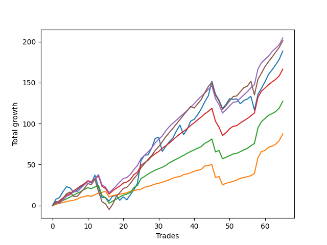

# Long Pointer 001 
- Symbol: ES_SmolBoi
- Date Range: 03/18/2022 - 07/29/2022
- Trading Period: 7:20-12:30
- Number of Trades: 65



| Name | Win Percent | Profit | Avg Profit / Trade | Avg Time / Trade |      | Name | Win Percent | Profit | Avg Profit / Trade | Avg Time / Trade |
| ---- | ----------- | ------ | ------------------ | ---------------- | ---- | ---- | ----------- | ------ | ------------------ | ---------------- |
| Sorted By <br> Profit | | | | | | Sorted By <br> Win Percentage ||||
| Eighty-Five | 75.38 | 68625.00 | 1055.77 | 15:15 |     | Eighty-One | 92.31 | 21125.00 | 325.00 | 04:24 |
| Eighty-Four | 81.54 | 67000.00 | 1030.77 | 12:39 |     | Eighty-Two | 84.62 | 26000.00 | 400.00 | 08:47 |
| Two | 70.77 | 65375.00 | 1005.77 | 16:57 |     | Eighty-Three | 83.08 | 47125.00 | 725.00 | 11:17 |
| Eighty-Three | 83.08 | 47125.00 | 725.00 | 11:17 |     | Eighty-Four | 81.54 | 67000.00 | 1030.77 | 12:39 |
| Eighty-Two | 84.62 | 26000.00 | 400.00 | 08:47 |     | Eighty-Five | 75.38 | 68625.00 | 1055.77 | 15:15 |
| Eighty-One | 92.31 | 21125.00 | 325.00 | 04:24 |     | Two | 70.77 | 65375.00 | 1005.77 | 16:57 |

## NO STOPLOSS

### Test Two
* Sell when the price hits the upper line of the 20p 2std bollinger
* No Stoploss
* Results:
```
Total Trades: 65
Percent Up: 70.77
Percent Down: 29.23
Total Points Moved Up: 130.75
Potential Profit: 65375.00
Total Points Ups: 278.50 Count Ups: 46
Total Points Downs: -147.75 Count Downs: 19
```

<details><summary>Trades</summary>

<code>In: 2022-03-25 08:30:00		Out: 2022-03-25 08:41:45		Total Position Time: 11:45		Total Move Up: 7.75		Total to Date: 7.75</code> <br />
<code>In: 2022-03-30 12:14:00		Out: 2022-03-30 12:36:20		Total Position Time: 22:20		Total Move Up: 2.00		Total to Date: 9.75</code> <br />
<code>In: 2022-03-30 12:27:00		Out: 2022-03-30 12:36:20		Total Position Time: 09:20		Total Move Up: 7.50		Total to Date: 17.25</code> <br />
<code>In: 2022-03-31 08:37:00		Out: 2022-03-31 08:41:10		Total Position Time: 04:10		Total Move Up: 5.75		Total to Date: 23.00</code> <br />
<code>In: 2022-03-31 10:02:00		Out: 2022-03-31 10:27:00		Total Position Time: 25:00		Total Move Up: -1.50		Total to Date: 21.50</code> <br />
<code>In: 2022-04-05 09:04:00		Out: 2022-04-05 09:33:55		Total Position Time: 29:55		Total Move Up: -5.25		Total to Date: 16.25</code> <br />
<code>In: 2022-04-06 09:23:00		Out: 2022-04-06 09:34:25		Total Position Time: 11:25		Total Move Up: 2.75		Total to Date: 19.00</code> <br />
<code>In: 2022-04-07 08:56:00		Out: 2022-04-07 09:08:20		Total Position Time: 12:20		Total Move Up: 4.00		Total to Date: 23.00</code> <br />
<code>In: 2022-04-12 07:53:00		Out: 2022-04-12 08:15:45		Total Position Time: 22:45		Total Move Up: 2.25		Total to Date: 25.25</code> <br />
<code>In: 2022-04-12 11:35:00		Out: 2022-04-12 11:47:00		Total Position Time: 12:00		Total Move Up: 4.50		Total to Date: 29.75</code> <br />
<code>In: 2022-04-14 09:32:00		Out: 2022-04-14 09:58:55		Total Position Time: 26:55		Total Move Up: -2.25		Total to Date: 27.50</code> <br />
<code>In: 2022-04-20 11:58:00		Out: 2022-04-20 12:12:35		Total Position Time: 14:35		Total Move Up: 9.75		Total to Date: 37.25</code> <br />
<code>In: 2022-04-21 08:25:00		Out: 2022-04-21 08:54:55		Total Position Time: 29:55		Total Move Up: -15.00		Total to Date: 22.25</code> <br />
<code>In: 2022-04-21 09:02:00		Out: 2022-04-21 09:31:55		Total Position Time: 29:55		Total Move Up: -12.50		Total to Date: 9.75</code> <br />
<code>In: 2022-04-21 09:12:00		Out: 2022-04-21 09:35:40		Total Position Time: 23:40		Total Move Up: 0.00		Total to Date: 9.75</code> <br />
<code>In: 2022-04-21 09:56:00		Out: 2022-04-21 10:21:30		Total Position Time: 25:30		Total Move Up: -4.25		Total to Date: 5.50</code> <br />
<code>In: 2022-04-21 10:21:00		Out: 2022-04-21 10:21:30		Total Position Time: 00:30		Total Move Up: 6.00		Total to Date: 11.50</code> <br />
<code>In: 2022-04-21 12:06:00		Out: 2022-04-21 12:24:30		Total Position Time: 18:30		Total Move Up: 1.00		Total to Date: 12.50</code> <br />
<code>In: 2022-05-02 08:07:00		Out: 2022-05-02 08:36:25		Total Position Time: 29:25		Total Move Up: -6.00		Total to Date: 6.50</code> <br />
<code>In: 2022-05-02 08:22:00		Out: 2022-05-02 08:36:25		Total Position Time: 14:25		Total Move Up: 4.25		Total to Date: 10.75</code> <br />
<code>In: 2022-05-02 10:37:00		Out: 2022-05-02 11:03:45		Total Position Time: 26:45		Total Move Up: -3.75		Total to Date: 7.00</code> <br />
<code>In: 2022-05-02 10:51:00		Out: 2022-05-02 11:03:45		Total Position Time: 12:45		Total Move Up: 6.25		Total to Date: 13.25</code> <br />
<code>In: 2022-05-02 11:46:00		Out: 2022-05-02 11:53:35		Total Position Time: 07:35		Total Move Up: 6.00		Total to Date: 19.25</code> <br />
<code>In: 2022-05-04 08:37:00		Out: 2022-05-04 08:47:05		Total Position Time: 10:05		Total Move Up: 8.00		Total to Date: 27.25</code> <br />
<code>In: 2022-05-04 11:36:00		Out: 2022-05-04 11:43:45		Total Position Time: 07:45		Total Move Up: 27.50		Total to Date: 54.75</code> <br />
<code>In: 2022-05-06 09:03:00		Out: 2022-05-06 09:03:55		Total Position Time: 00:55		Total Move Up: 6.75		Total to Date: 61.50</code> <br />
<code>In: 2022-05-06 11:28:00		Out: 2022-05-06 11:49:10		Total Position Time: 21:10		Total Move Up: 0.50		Total to Date: 62.00</code> <br />
<code>In: 2022-05-09 07:42:00		Out: 2022-05-09 07:48:05		Total Position Time: 06:05		Total Move Up: 8.00		Total to Date: 70.00</code> <br />
<code>In: 2022-05-09 08:34:00		Out: 2022-05-09 08:39:15		Total Position Time: 05:15		Total Move Up: 12.00		Total to Date: 82.00</code> <br />
<code>In: 2022-05-09 10:03:00		Out: 2022-05-09 10:18:05		Total Position Time: 15:05		Total Move Up: 1.25		Total to Date: 83.25</code> <br />
<code>In: 2022-05-10 07:52:00		Out: 2022-05-10 08:21:55		Total Position Time: 29:55		Total Move Up: -17.25		Total to Date: 66.00</code> <br />
<code>In: 2022-05-11 09:14:00		Out: 2022-05-11 09:23:35		Total Position Time: 09:35		Total Move Up: 6.25		Total to Date: 72.25</code> <br />
<code>In: 2022-05-11 11:01:00		Out: 2022-05-11 11:02:35		Total Position Time: 01:35		Total Move Up: 5.75		Total to Date: 78.00</code> <br />
<code>In: 2022-05-16 09:47:00		Out: 2022-05-16 10:06:30		Total Position Time: 19:30		Total Move Up: 4.50		Total to Date: 82.50</code> <br />
<code>In: 2022-05-18 08:32:00		Out: 2022-05-18 08:42:55		Total Position Time: 10:55		Total Move Up: 8.75		Total to Date: 91.25</code> <br />
<code>In: 2022-05-18 09:12:00		Out: 2022-05-18 09:17:50		Total Position Time: 05:50		Total Move Up: 7.00		Total to Date: 98.25</code> <br />
<code>In: 2022-05-20 09:48:00		Out: 2022-05-20 10:17:55		Total Position Time: 29:55		Total Move Up: -11.75		Total to Date: 86.50</code> <br />
<code>In: 2022-05-25 10:15:00		Out: 2022-05-25 10:29:40		Total Position Time: 14:40		Total Move Up: 6.25		Total to Date: 92.75</code> <br />
<code>In: 2022-05-31 12:05:00		Out: 2022-05-31 12:15:05		Total Position Time: 10:05		Total Move Up: 10.25		Total to Date: 103.00</code> <br />
<code>In: 2022-06-08 11:31:00		Out: 2022-06-08 11:43:35		Total Position Time: 12:35		Total Move Up: 2.25		Total to Date: 105.25</code> <br />
<code>In: 2022-06-08 12:11:00		Out: 2022-06-08 12:13:25		Total Position Time: 02:25		Total Move Up: 5.75		Total to Date: 111.00</code> <br />
<code>In: 2022-06-09 08:10:00		Out: 2022-06-09 08:22:35		Total Position Time: 12:35		Total Move Up: 7.00		Total to Date: 118.00</code> <br />
<code>In: 2022-06-13 12:17:00		Out: 2022-06-13 12:17:15		Total Position Time: 00:15		Total Move Up: 8.75		Total to Date: 126.75</code> <br />
<code>In: 2022-06-14 07:32:00		Out: 2022-06-14 07:51:00		Total Position Time: 19:00		Total Move Up: 7.25		Total to Date: 134.00</code> <br />
<code>In: 2022-06-14 07:45:00		Out: 2022-06-14 07:51:00		Total Position Time: 06:00		Total Move Up: 17.75		Total to Date: 151.75</code> <br />
<code>In: 2022-06-14 11:52:00		Out: 2022-06-14 12:21:55		Total Position Time: 29:55		Total Move Up: -15.75		Total to Date: 136.00</code> <br />
<code>In: 2022-06-15 07:57:00		Out: 2022-06-15 08:26:55		Total Position Time: 29:55		Total Move Up: -7.25		Total to Date: 128.75</code> <br />
<code>In: 2022-06-16 11:02:00		Out: 2022-06-16 11:31:55		Total Position Time: 29:55		Total Move Up: -10.25		Total to Date: 118.50</code> <br />
<code>In: 2022-06-17 07:38:00		Out: 2022-06-17 08:02:25		Total Position Time: 24:25		Total Move Up: 5.00		Total to Date: 123.50</code> <br />
<code>In: 2022-06-23 09:07:00		Out: 2022-06-23 09:19:05		Total Position Time: 12:05		Total Move Up: 7.00		Total to Date: 130.50</code> <br />
<code>In: 2022-06-27 10:10:00		Out: 2022-06-27 10:39:55		Total Position Time: 29:55		Total Move Up: -1.00		Total to Date: 129.50</code> <br />
<code>In: 2022-06-29 09:16:00		Out: 2022-06-29 09:38:30		Total Position Time: 22:30		Total Move Up: 0.75		Total to Date: 130.25</code> <br />
<code>In: 2022-07-06 08:12:00		Out: 2022-07-06 08:41:55		Total Position Time: 29:55		Total Move Up: -6.00		Total to Date: 124.25</code> <br />
<code>In: 2022-07-06 08:35:00		Out: 2022-07-06 08:51:15		Total Position Time: 16:15		Total Move Up: 4.00		Total to Date: 128.25</code> <br />
<code>In: 2022-07-08 09:48:00		Out: 2022-07-08 10:10:30		Total Position Time: 22:30		Total Move Up: 1.75		Total to Date: 130.00</code> <br />
<code>In: 2022-07-12 10:28:00		Out: 2022-07-12 10:31:30		Total Position Time: 03:30		Total Move Up: 3.00		Total to Date: 133.00</code> <br />
<code>In: 2022-07-12 12:27:00		Out: 2022-07-12 12:46:00		Total Position Time: 19:00		Total Move Up: -6.75		Total to Date: 126.25</code> <br />
<code>In: 2022-07-18 11:48:00		Out: 2022-07-18 12:08:50		Total Position Time: 20:50		Total Move Up: -1.00		Total to Date: 125.25</code> <br />
<code>In: 2022-07-22 10:06:00		Out: 2022-07-22 10:35:55		Total Position Time: 29:55		Total Move Up: -17.00		Total to Date: 108.25</code> <br />
<code>In: 2022-07-22 10:39:00		Out: 2022-07-22 10:56:20		Total Position Time: 17:20		Total Move Up: 5.50		Total to Date: 113.75</code> <br />
<code>In: 2022-07-25 07:29:00		Out: 2022-07-25 07:43:50		Total Position Time: 14:50		Total Move Up: 5.50		Total to Date: 119.25</code> <br />
<code>In: 2022-07-25 10:44:00		Out: 2022-07-25 11:13:55		Total Position Time: 29:55		Total Move Up: -3.25		Total to Date: 116.00</code> <br />
<code>In: 2022-07-25 11:23:00		Out: 2022-07-25 11:35:45		Total Position Time: 12:45		Total Move Up: 2.00		Total to Date: 118.00</code> <br />
<code>In: 2022-07-26 12:11:00		Out: 2022-07-26 12:33:05		Total Position Time: 22:05		Total Move Up: 7.00		Total to Date: 125.00</code> <br />
<code>In: 2022-07-29 08:29:00		Out: 2022-07-29 08:41:15		Total Position Time: 12:15		Total Move Up: 5.75		Total to Date: 130.75</code> <br />


</details>

## TAKE PROFIT

### Test Eighty-One
* Take Profit of 1 Point
* No Stoploss
* Results:
```
Total Trades: 65
Percent Up: 92.31
Percent Down: 7.69
Total Points Moved Up: 42.25
Potential Profit: 21125.00
Total Points Ups: 79.50 Count Ups: 60
Total Points Downs: -37.25 Count Downs: 5
```

<details><summary>Trades</summary>

<code>In: 2022-03-25 08:30:00		Out: 2022-03-25 08:30:20		Total Position Time: 00:20		Total Move Up: 1.50		Total to Date: 1.50</code> <br />
<code>In: 2022-03-30 12:14:00		Out: 2022-03-30 12:14:50		Total Position Time: 00:50		Total Move Up: 1.25		Total to Date: 2.75</code> <br />
<code>In: 2022-03-30 12:27:00		Out: 2022-03-30 12:27:35		Total Position Time: 00:35		Total Move Up: 1.00		Total to Date: 3.75</code> <br />
<code>In: 2022-03-31 08:37:00		Out: 2022-03-31 08:37:40		Total Position Time: 00:40		Total Move Up: 1.25		Total to Date: 5.00</code> <br />
<code>In: 2022-03-31 10:02:00		Out: 2022-03-31 10:29:40		Total Position Time: 27:40		Total Move Up: 0.75		Total to Date: 5.75</code> <br />
<code>In: 2022-04-05 09:04:00		Out: 2022-04-05 09:04:45		Total Position Time: 00:45		Total Move Up: 0.75		Total to Date: 6.50</code> <br />
<code>In: 2022-04-06 09:23:00		Out: 2022-04-06 09:31:15		Total Position Time: 08:15		Total Move Up: 1.50		Total to Date: 8.00</code> <br />
<code>In: 2022-04-07 08:56:00		Out: 2022-04-07 08:56:10		Total Position Time: 00:10		Total Move Up: 2.00		Total to Date: 10.00</code> <br />
<code>In: 2022-04-12 07:53:00		Out: 2022-04-12 07:57:25		Total Position Time: 04:25		Total Move Up: 1.00		Total to Date: 11.00</code> <br />
<code>In: 2022-04-12 11:35:00		Out: 2022-04-12 11:35:45		Total Position Time: 00:45		Total Move Up: 1.25		Total to Date: 12.25</code> <br />
<code>In: 2022-04-14 09:32:00		Out: 2022-04-14 10:01:55		Total Position Time: 29:55		Total Move Up: -1.00		Total to Date: 11.25</code> <br />
<code>In: 2022-04-20 11:58:00		Out: 2022-04-20 12:00:15		Total Position Time: 02:15		Total Move Up: 2.00		Total to Date: 13.25</code> <br />
<code>In: 2022-04-21 08:25:00		Out: 2022-04-21 08:25:10		Total Position Time: 00:10		Total Move Up: 2.00		Total to Date: 15.25</code> <br />
<code>In: 2022-04-21 09:02:00		Out: 2022-04-21 09:02:15		Total Position Time: 00:15		Total Move Up: 1.00		Total to Date: 16.25</code> <br />
<code>In: 2022-04-21 09:12:00		Out: 2022-04-21 09:20:35		Total Position Time: 08:35		Total Move Up: 1.00		Total to Date: 17.25</code> <br />
<code>In: 2022-04-21 09:56:00		Out: 2022-04-21 10:25:55		Total Position Time: 29:55		Total Move Up: -6.75		Total to Date: 10.50</code> <br />
<code>In: 2022-04-21 10:21:00		Out: 2022-04-21 10:21:10		Total Position Time: 00:10		Total Move Up: 1.75		Total to Date: 12.25</code> <br />
<code>In: 2022-04-21 12:06:00		Out: 2022-04-21 12:06:25		Total Position Time: 00:25		Total Move Up: 0.75		Total to Date: 13.00</code> <br />
<code>In: 2022-05-02 08:07:00		Out: 2022-05-02 08:07:10		Total Position Time: 00:10		Total Move Up: 0.75		Total to Date: 13.75</code> <br />
<code>In: 2022-05-02 08:22:00		Out: 2022-05-02 08:22:30		Total Position Time: 00:30		Total Move Up: 1.00		Total to Date: 14.75</code> <br />
<code>In: 2022-05-02 10:37:00		Out: 2022-05-02 10:38:00		Total Position Time: 01:00		Total Move Up: 0.75		Total to Date: 15.50</code> <br />
<code>In: 2022-05-02 10:51:00		Out: 2022-05-02 10:55:45		Total Position Time: 04:45		Total Move Up: 2.00		Total to Date: 17.50</code> <br />
<code>In: 2022-05-02 11:46:00		Out: 2022-05-02 11:46:10		Total Position Time: 00:10		Total Move Up: 0.75		Total to Date: 18.25</code> <br />
<code>In: 2022-05-04 08:37:00		Out: 2022-05-04 08:38:10		Total Position Time: 01:10		Total Move Up: 1.00		Total to Date: 19.25</code> <br />
<code>In: 2022-05-04 11:36:00		Out: 2022-05-04 11:36:10		Total Position Time: 00:10		Total Move Up: 0.75		Total to Date: 20.00</code> <br />
<code>In: 2022-05-06 09:03:00		Out: 2022-05-06 09:03:10		Total Position Time: 00:10		Total Move Up: 2.50		Total to Date: 22.50</code> <br />
<code>In: 2022-05-06 11:28:00		Out: 2022-05-06 11:30:35		Total Position Time: 02:35		Total Move Up: 0.75		Total to Date: 23.25</code> <br />
<code>In: 2022-05-09 07:42:00		Out: 2022-05-09 07:42:20		Total Position Time: 00:20		Total Move Up: 1.50		Total to Date: 24.75</code> <br />
<code>In: 2022-05-09 08:34:00		Out: 2022-05-09 08:34:10		Total Position Time: 00:10		Total Move Up: 1.50		Total to Date: 26.25</code> <br />
<code>In: 2022-05-09 10:03:00		Out: 2022-05-09 10:09:25		Total Position Time: 06:25		Total Move Up: 1.00		Total to Date: 27.25</code> <br />
<code>In: 2022-05-10 07:52:00		Out: 2022-05-10 07:52:20		Total Position Time: 00:20		Total Move Up: 1.25		Total to Date: 28.50</code> <br />
<code>In: 2022-05-11 09:14:00		Out: 2022-05-11 09:14:25		Total Position Time: 00:25		Total Move Up: 1.50		Total to Date: 30.00</code> <br />
<code>In: 2022-05-11 11:01:00		Out: 2022-05-11 11:01:10		Total Position Time: 00:10		Total Move Up: 1.50		Total to Date: 31.50</code> <br />
<code>In: 2022-05-16 09:47:00		Out: 2022-05-16 09:47:50		Total Position Time: 00:50		Total Move Up: 2.00		Total to Date: 33.50</code> <br />
<code>In: 2022-05-18 08:32:00		Out: 2022-05-18 08:33:20		Total Position Time: 01:20		Total Move Up: 1.25		Total to Date: 34.75</code> <br />
<code>In: 2022-05-18 09:12:00		Out: 2022-05-18 09:13:05		Total Position Time: 01:05		Total Move Up: 0.75		Total to Date: 35.50</code> <br />
<code>In: 2022-05-20 09:48:00		Out: 2022-05-20 09:48:25		Total Position Time: 00:25		Total Move Up: 2.25		Total to Date: 37.75</code> <br />
<code>In: 2022-05-25 10:15:00		Out: 2022-05-25 10:15:20		Total Position Time: 00:20		Total Move Up: 1.00		Total to Date: 38.75</code> <br />
<code>In: 2022-05-31 12:05:00		Out: 2022-05-31 12:07:05		Total Position Time: 02:05		Total Move Up: 1.25		Total to Date: 40.00</code> <br />
<code>In: 2022-06-08 11:31:00		Out: 2022-06-08 11:43:30		Total Position Time: 12:30		Total Move Up: 2.00		Total to Date: 42.00</code> <br />
<code>In: 2022-06-08 12:11:00		Out: 2022-06-08 12:11:10		Total Position Time: 00:10		Total Move Up: 1.00		Total to Date: 43.00</code> <br />
<code>In: 2022-06-09 08:10:00		Out: 2022-06-09 08:10:35		Total Position Time: 00:35		Total Move Up: 1.25		Total to Date: 44.25</code> <br />
<code>In: 2022-06-13 12:17:00		Out: 2022-06-13 12:17:10		Total Position Time: 00:10		Total Move Up: 4.00		Total to Date: 48.25</code> <br />
<code>In: 2022-06-14 07:32:00		Out: 2022-06-14 07:48:25		Total Position Time: 16:25		Total Move Up: 0.75		Total to Date: 49.00</code> <br />
<code>In: 2022-06-14 07:45:00		Out: 2022-06-14 07:46:15		Total Position Time: 01:15		Total Move Up: 1.00		Total to Date: 50.00</code> <br />
<code>In: 2022-06-14 11:52:00		Out: 2022-06-14 12:21:55		Total Position Time: 29:55		Total Move Up: -15.75		Total to Date: 34.25</code> <br />
<code>In: 2022-06-15 07:57:00		Out: 2022-06-15 07:59:05		Total Position Time: 02:05		Total Move Up: 1.25		Total to Date: 35.50</code> <br />
<code>In: 2022-06-16 11:02:00		Out: 2022-06-16 11:31:55		Total Position Time: 29:55		Total Move Up: -10.25		Total to Date: 25.25</code> <br />
<code>In: 2022-06-17 07:38:00		Out: 2022-06-17 07:38:10		Total Position Time: 00:10		Total Move Up: 2.00		Total to Date: 27.25</code> <br />
<code>In: 2022-06-23 09:07:00		Out: 2022-06-23 09:07:10		Total Position Time: 00:10		Total Move Up: 1.00		Total to Date: 28.25</code> <br />
<code>In: 2022-06-27 10:10:00		Out: 2022-06-27 10:10:25		Total Position Time: 00:25		Total Move Up: 1.25		Total to Date: 29.50</code> <br />
<code>In: 2022-06-29 09:16:00		Out: 2022-06-29 09:20:20		Total Position Time: 04:20		Total Move Up: 1.75		Total to Date: 31.25</code> <br />
<code>In: 2022-07-06 08:12:00		Out: 2022-07-06 08:12:15		Total Position Time: 00:15		Total Move Up: 2.00		Total to Date: 33.25</code> <br />
<code>In: 2022-07-06 08:35:00		Out: 2022-07-06 08:36:55		Total Position Time: 01:55		Total Move Up: 1.00		Total to Date: 34.25</code> <br />
<code>In: 2022-07-08 09:48:00		Out: 2022-07-08 09:48:20		Total Position Time: 00:20		Total Move Up: 1.00		Total to Date: 35.25</code> <br />
<code>In: 2022-07-12 10:28:00		Out: 2022-07-12 10:28:50		Total Position Time: 00:50		Total Move Up: 1.25		Total to Date: 36.50</code> <br />
<code>In: 2022-07-12 12:27:00		Out: 2022-07-12 12:27:10		Total Position Time: 00:10		Total Move Up: 1.25		Total to Date: 37.75</code> <br />
<code>In: 2022-07-18 11:48:00		Out: 2022-07-18 12:17:55		Total Position Time: 29:55		Total Move Up: -3.50		Total to Date: 34.25</code> <br />
<code>In: 2022-07-22 10:06:00		Out: 2022-07-22 10:07:45		Total Position Time: 01:45		Total Move Up: 1.00		Total to Date: 35.25</code> <br />
<code>In: 2022-07-22 10:39:00		Out: 2022-07-22 10:39:10		Total Position Time: 00:10		Total Move Up: 1.50		Total to Date: 36.75</code> <br />
<code>In: 2022-07-25 07:29:00		Out: 2022-07-25 07:29:10		Total Position Time: 00:10		Total Move Up: 1.50		Total to Date: 38.25</code> <br />
<code>In: 2022-07-25 10:44:00		Out: 2022-07-25 10:47:45		Total Position Time: 03:45		Total Move Up: 1.00		Total to Date: 39.25</code> <br />
<code>In: 2022-07-25 11:23:00		Out: 2022-07-25 11:23:40		Total Position Time: 00:40		Total Move Up: 1.25		Total to Date: 40.50</code> <br />
<code>In: 2022-07-26 12:11:00		Out: 2022-07-26 12:11:20		Total Position Time: 00:20		Total Move Up: 0.75		Total to Date: 41.25</code> <br />
<code>In: 2022-07-29 08:29:00		Out: 2022-07-29 08:37:00		Total Position Time: 08:00		Total Move Up: 1.00		Total to Date: 42.25</code> <br />


</details>

### Test Eighty-Two
* Take Profit of 2 Point
* No Stoploss
* Results:
```
Total Trades: 65
Percent Up: 84.62
Percent Down: 15.38
Total Points Moved Up: 52.00
Potential Profit: 26000.00
Total Points Ups: 131.50 Count Ups: 55
Total Points Downs: -79.50 Count Downs: 10
```

<details><summary>Trades</summary>

<code>In: 2022-03-25 08:30:00		Out: 2022-03-25 08:30:30		Total Position Time: 00:30		Total Move Up: 2.50		Total to Date: 2.50</code> <br />
<code>In: 2022-03-30 12:14:00		Out: 2022-03-30 12:15:20		Total Position Time: 01:20		Total Move Up: 2.00		Total to Date: 4.50</code> <br />
<code>In: 2022-03-30 12:27:00		Out: 2022-03-30 12:28:00		Total Position Time: 01:00		Total Move Up: 1.75		Total to Date: 6.25</code> <br />
<code>In: 2022-03-31 08:37:00		Out: 2022-03-31 08:38:15		Total Position Time: 01:15		Total Move Up: 2.00		Total to Date: 8.25</code> <br />
<code>In: 2022-03-31 10:02:00		Out: 2022-03-31 10:31:20		Total Position Time: 29:20		Total Move Up: 2.25		Total to Date: 10.50</code> <br />
<code>In: 2022-04-05 09:04:00		Out: 2022-04-05 09:05:20		Total Position Time: 01:20		Total Move Up: 2.25		Total to Date: 12.75</code> <br />
<code>In: 2022-04-06 09:23:00		Out: 2022-04-06 09:31:25		Total Position Time: 08:25		Total Move Up: 2.25		Total to Date: 15.00</code> <br />
<code>In: 2022-04-07 08:56:00		Out: 2022-04-07 08:56:10		Total Position Time: 00:10		Total Move Up: 2.00		Total to Date: 17.00</code> <br />
<code>In: 2022-04-12 07:53:00		Out: 2022-04-12 08:02:35		Total Position Time: 09:35		Total Move Up: 2.75		Total to Date: 19.75</code> <br />
<code>In: 2022-04-12 11:35:00		Out: 2022-04-12 11:35:55		Total Position Time: 00:55		Total Move Up: 2.00		Total to Date: 21.75</code> <br />
<code>In: 2022-04-14 09:32:00		Out: 2022-04-14 10:01:55		Total Position Time: 29:55		Total Move Up: -1.00		Total to Date: 20.75</code> <br />
<code>In: 2022-04-20 11:58:00		Out: 2022-04-20 12:00:15		Total Position Time: 02:15		Total Move Up: 2.00		Total to Date: 22.75</code> <br />
<code>In: 2022-04-21 08:25:00		Out: 2022-04-21 08:25:10		Total Position Time: 00:10		Total Move Up: 2.00		Total to Date: 24.75</code> <br />
<code>In: 2022-04-21 09:02:00		Out: 2022-04-21 09:31:55		Total Position Time: 29:55		Total Move Up: -12.50		Total to Date: 12.25</code> <br />
<code>In: 2022-04-21 09:12:00		Out: 2022-04-21 09:41:55		Total Position Time: 29:55		Total Move Up: -2.75		Total to Date: 9.50</code> <br />
<code>In: 2022-04-21 09:56:00		Out: 2022-04-21 10:25:55		Total Position Time: 29:55		Total Move Up: -6.75		Total to Date: 2.75</code> <br />
<code>In: 2022-04-21 10:21:00		Out: 2022-04-21 10:21:15		Total Position Time: 00:15		Total Move Up: 2.75		Total to Date: 5.50</code> <br />
<code>In: 2022-04-21 12:06:00		Out: 2022-04-21 12:24:40		Total Position Time: 18:40		Total Move Up: 2.25		Total to Date: 7.75</code> <br />
<code>In: 2022-05-02 08:07:00		Out: 2022-05-02 08:13:20		Total Position Time: 06:20		Total Move Up: 2.75		Total to Date: 10.50</code> <br />
<code>In: 2022-05-02 08:22:00		Out: 2022-05-02 08:22:55		Total Position Time: 00:55		Total Move Up: 2.25		Total to Date: 12.75</code> <br />
<code>In: 2022-05-02 10:37:00		Out: 2022-05-02 11:06:55		Total Position Time: 29:55		Total Move Up: 1.25		Total to Date: 14.00</code> <br />
<code>In: 2022-05-02 10:51:00		Out: 2022-05-02 10:55:45		Total Position Time: 04:45		Total Move Up: 2.00		Total to Date: 16.00</code> <br />
<code>In: 2022-05-02 11:46:00		Out: 2022-05-02 11:53:35		Total Position Time: 07:35		Total Move Up: 6.00		Total to Date: 22.00</code> <br />
<code>In: 2022-05-04 08:37:00		Out: 2022-05-04 08:39:25		Total Position Time: 02:25		Total Move Up: 2.75		Total to Date: 24.75</code> <br />
<code>In: 2022-05-04 11:36:00		Out: 2022-05-04 11:36:40		Total Position Time: 00:40		Total Move Up: 8.25		Total to Date: 33.00</code> <br />
<code>In: 2022-05-06 09:03:00		Out: 2022-05-06 09:03:10		Total Position Time: 00:10		Total Move Up: 2.50		Total to Date: 35.50</code> <br />
<code>In: 2022-05-06 11:28:00		Out: 2022-05-06 11:49:25		Total Position Time: 21:25		Total Move Up: 3.00		Total to Date: 38.50</code> <br />
<code>In: 2022-05-09 07:42:00		Out: 2022-05-09 07:42:25		Total Position Time: 00:25		Total Move Up: 2.50		Total to Date: 41.00</code> <br />
<code>In: 2022-05-09 08:34:00		Out: 2022-05-09 08:34:15		Total Position Time: 00:15		Total Move Up: 2.25		Total to Date: 43.25</code> <br />
<code>In: 2022-05-09 10:03:00		Out: 2022-05-09 10:19:05		Total Position Time: 16:05		Total Move Up: 1.75		Total to Date: 45.00</code> <br />
<code>In: 2022-05-10 07:52:00		Out: 2022-05-10 07:54:10		Total Position Time: 02:10		Total Move Up: 1.75		Total to Date: 46.75</code> <br />
<code>In: 2022-05-11 09:14:00		Out: 2022-05-11 09:14:30		Total Position Time: 00:30		Total Move Up: 2.25		Total to Date: 49.00</code> <br />
<code>In: 2022-05-11 11:01:00		Out: 2022-05-11 11:01:15		Total Position Time: 00:15		Total Move Up: 3.25		Total to Date: 52.25</code> <br />
<code>In: 2022-05-16 09:47:00		Out: 2022-05-16 09:47:55		Total Position Time: 00:55		Total Move Up: 2.25		Total to Date: 54.50</code> <br />
<code>In: 2022-05-18 08:32:00		Out: 2022-05-18 08:35:00		Total Position Time: 03:00		Total Move Up: 2.25		Total to Date: 56.75</code> <br />
<code>In: 2022-05-18 09:12:00		Out: 2022-05-18 09:14:45		Total Position Time: 02:45		Total Move Up: 2.25		Total to Date: 59.00</code> <br />
<code>In: 2022-05-20 09:48:00		Out: 2022-05-20 09:48:25		Total Position Time: 00:25		Total Move Up: 2.25		Total to Date: 61.25</code> <br />
<code>In: 2022-05-25 10:15:00		Out: 2022-05-25 10:15:25		Total Position Time: 00:25		Total Move Up: 2.50		Total to Date: 63.75</code> <br />
<code>In: 2022-05-31 12:05:00		Out: 2022-05-31 12:07:20		Total Position Time: 02:20		Total Move Up: 2.25		Total to Date: 66.00</code> <br />
<code>In: 2022-06-08 11:31:00		Out: 2022-06-08 11:43:30		Total Position Time: 12:30		Total Move Up: 2.00		Total to Date: 68.00</code> <br />
<code>In: 2022-06-08 12:11:00		Out: 2022-06-08 12:11:45		Total Position Time: 00:45		Total Move Up: 2.00		Total to Date: 70.00</code> <br />
<code>In: 2022-06-09 08:10:00		Out: 2022-06-09 08:10:45		Total Position Time: 00:45		Total Move Up: 2.00		Total to Date: 72.00</code> <br />
<code>In: 2022-06-13 12:17:00		Out: 2022-06-13 12:17:10		Total Position Time: 00:10		Total Move Up: 4.00		Total to Date: 76.00</code> <br />
<code>In: 2022-06-14 07:32:00		Out: 2022-06-14 07:48:30		Total Position Time: 16:30		Total Move Up: 2.25		Total to Date: 78.25</code> <br />
<code>In: 2022-06-14 07:45:00		Out: 2022-06-14 07:46:35		Total Position Time: 01:35		Total Move Up: 3.00		Total to Date: 81.25</code> <br />
<code>In: 2022-06-14 11:52:00		Out: 2022-06-14 12:21:55		Total Position Time: 29:55		Total Move Up: -15.75		Total to Date: 65.50</code> <br />
<code>In: 2022-06-15 07:57:00		Out: 2022-06-15 08:00:20		Total Position Time: 03:20		Total Move Up: 1.75		Total to Date: 67.25</code> <br />
<code>In: 2022-06-16 11:02:00		Out: 2022-06-16 11:31:55		Total Position Time: 29:55		Total Move Up: -10.25		Total to Date: 57.00</code> <br />
<code>In: 2022-06-17 07:38:00		Out: 2022-06-17 07:38:10		Total Position Time: 00:10		Total Move Up: 2.00		Total to Date: 59.00</code> <br />
<code>In: 2022-06-23 09:07:00		Out: 2022-06-23 09:14:30		Total Position Time: 07:30		Total Move Up: 2.00		Total to Date: 61.00</code> <br />
<code>In: 2022-06-27 10:10:00		Out: 2022-06-27 10:11:10		Total Position Time: 01:10		Total Move Up: 2.00		Total to Date: 63.00</code> <br />
<code>In: 2022-06-29 09:16:00		Out: 2022-06-29 09:45:55		Total Position Time: 29:55		Total Move Up: 0.75		Total to Date: 63.75</code> <br />
<code>In: 2022-07-06 08:12:00		Out: 2022-07-06 08:12:15		Total Position Time: 00:15		Total Move Up: 2.00		Total to Date: 65.75</code> <br />
<code>In: 2022-07-06 08:35:00		Out: 2022-07-06 08:37:05		Total Position Time: 02:05		Total Move Up: 2.25		Total to Date: 68.00</code> <br />
<code>In: 2022-07-08 09:48:00		Out: 2022-07-08 09:49:00		Total Position Time: 01:00		Total Move Up: 1.75		Total to Date: 69.75</code> <br />
<code>In: 2022-07-12 10:28:00		Out: 2022-07-12 10:30:05		Total Position Time: 02:05		Total Move Up: 1.75		Total to Date: 71.50</code> <br />
<code>In: 2022-07-12 12:27:00		Out: 2022-07-12 12:46:00		Total Position Time: 19:00		Total Move Up: -6.75		Total to Date: 64.75</code> <br />
<code>In: 2022-07-18 11:48:00		Out: 2022-07-18 12:17:55		Total Position Time: 29:55		Total Move Up: -3.50		Total to Date: 61.25</code> <br />
<code>In: 2022-07-22 10:06:00		Out: 2022-07-22 10:35:55		Total Position Time: 29:55		Total Move Up: -17.00		Total to Date: 44.25</code> <br />
<code>In: 2022-07-22 10:39:00		Out: 2022-07-22 10:39:20		Total Position Time: 00:20		Total Move Up: 2.00		Total to Date: 46.25</code> <br />
<code>In: 2022-07-25 07:29:00		Out: 2022-07-25 07:32:10		Total Position Time: 03:10		Total Move Up: 2.50		Total to Date: 48.75</code> <br />
<code>In: 2022-07-25 10:44:00		Out: 2022-07-25 11:13:55		Total Position Time: 29:55		Total Move Up: -3.25		Total to Date: 45.50</code> <br />
<code>In: 2022-07-25 11:23:00		Out: 2022-07-25 11:35:45		Total Position Time: 12:45		Total Move Up: 2.00		Total to Date: 47.50</code> <br />
<code>In: 2022-07-26 12:11:00		Out: 2022-07-26 12:11:30		Total Position Time: 00:30		Total Move Up: 2.00		Total to Date: 49.50</code> <br />
<code>In: 2022-07-29 08:29:00		Out: 2022-07-29 08:37:20		Total Position Time: 08:20		Total Move Up: 2.50		Total to Date: 52.00</code> <br />


</details>

### Test Eighty-Three
* Take Profit of 3 Point
* No Stoploss
* Results:
```
Total Trades: 65
Percent Up: 83.08
Percent Down: 16.92
Total Points Moved Up: 94.25
Potential Profit: 47125.00
Total Points Ups: 181.00 Count Ups: 54
Total Points Downs: -86.75 Count Downs: 11
```

<details><summary>Trades</summary>

<code>In: 2022-03-25 08:30:00		Out: 2022-03-25 08:35:05		Total Position Time: 05:05		Total Move Up: 3.00		Total to Date: 3.00</code> <br />
<code>In: 2022-03-30 12:14:00		Out: 2022-03-30 12:36:55		Total Position Time: 22:55		Total Move Up: 3.00		Total to Date: 6.00</code> <br />
<code>In: 2022-03-30 12:27:00		Out: 2022-03-30 12:31:35		Total Position Time: 04:35		Total Move Up: 3.50		Total to Date: 9.50</code> <br />
<code>In: 2022-03-31 08:37:00		Out: 2022-03-31 08:40:35		Total Position Time: 03:35		Total Move Up: 3.25		Total to Date: 12.75</code> <br />
<code>In: 2022-03-31 10:02:00		Out: 2022-03-31 10:31:55		Total Position Time: 29:55		Total Move Up: 2.00		Total to Date: 14.75</code> <br />
<code>In: 2022-04-05 09:04:00		Out: 2022-04-05 09:06:10		Total Position Time: 02:10		Total Move Up: 3.25		Total to Date: 18.00</code> <br />
<code>In: 2022-04-06 09:23:00		Out: 2022-04-06 09:41:10		Total Position Time: 18:10		Total Move Up: 3.00		Total to Date: 21.00</code> <br />
<code>In: 2022-04-07 08:56:00		Out: 2022-04-07 09:02:45		Total Position Time: 06:45		Total Move Up: 3.00		Total to Date: 24.00</code> <br />
<code>In: 2022-04-12 07:53:00		Out: 2022-04-12 08:02:55		Total Position Time: 09:55		Total Move Up: 2.75		Total to Date: 26.75</code> <br />
<code>In: 2022-04-12 11:35:00		Out: 2022-04-12 11:37:20		Total Position Time: 02:20		Total Move Up: 3.50		Total to Date: 30.25</code> <br />
<code>In: 2022-04-14 09:32:00		Out: 2022-04-14 10:01:55		Total Position Time: 29:55		Total Move Up: -1.00		Total to Date: 29.25</code> <br />
<code>In: 2022-04-20 11:58:00		Out: 2022-04-20 12:01:10		Total Position Time: 03:10		Total Move Up: 3.50		Total to Date: 32.75</code> <br />
<code>In: 2022-04-21 08:25:00		Out: 2022-04-21 08:25:20		Total Position Time: 00:20		Total Move Up: 3.25		Total to Date: 36.00</code> <br />
<code>In: 2022-04-21 09:02:00		Out: 2022-04-21 09:31:55		Total Position Time: 29:55		Total Move Up: -12.50		Total to Date: 23.50</code> <br />
<code>In: 2022-04-21 09:12:00		Out: 2022-04-21 09:41:55		Total Position Time: 29:55		Total Move Up: -2.75		Total to Date: 20.75</code> <br />
<code>In: 2022-04-21 09:56:00		Out: 2022-04-21 10:25:55		Total Position Time: 29:55		Total Move Up: -6.75		Total to Date: 14.00</code> <br />
<code>In: 2022-04-21 10:21:00		Out: 2022-04-21 10:21:20		Total Position Time: 00:20		Total Move Up: 4.00		Total to Date: 18.00</code> <br />
<code>In: 2022-04-21 12:06:00		Out: 2022-04-21 12:25:00		Total Position Time: 19:00		Total Move Up: 3.00		Total to Date: 21.00</code> <br />
<code>In: 2022-05-02 08:07:00		Out: 2022-05-02 08:14:55		Total Position Time: 07:55		Total Move Up: 2.75		Total to Date: 23.75</code> <br />
<code>In: 2022-05-02 08:22:00		Out: 2022-05-02 08:26:00		Total Position Time: 04:00		Total Move Up: 3.75		Total to Date: 27.50</code> <br />
<code>In: 2022-05-02 10:37:00		Out: 2022-05-02 11:06:55		Total Position Time: 29:55		Total Move Up: 1.25		Total to Date: 28.75</code> <br />
<code>In: 2022-05-02 10:51:00		Out: 2022-05-02 11:00:05		Total Position Time: 09:05		Total Move Up: 3.00		Total to Date: 31.75</code> <br />
<code>In: 2022-05-02 11:46:00		Out: 2022-05-02 11:53:35		Total Position Time: 07:35		Total Move Up: 6.00		Total to Date: 37.75</code> <br />
<code>In: 2022-05-04 08:37:00		Out: 2022-05-04 08:39:30		Total Position Time: 02:30		Total Move Up: 3.00		Total to Date: 40.75</code> <br />
<code>In: 2022-05-04 11:36:00		Out: 2022-05-04 11:36:40		Total Position Time: 00:40		Total Move Up: 8.25		Total to Date: 49.00</code> <br />
<code>In: 2022-05-06 09:03:00		Out: 2022-05-06 09:03:40		Total Position Time: 00:40		Total Move Up: 3.25		Total to Date: 52.25</code> <br />
<code>In: 2022-05-06 11:28:00		Out: 2022-05-06 11:49:25		Total Position Time: 21:25		Total Move Up: 3.00		Total to Date: 55.25</code> <br />
<code>In: 2022-05-09 07:42:00		Out: 2022-05-09 07:42:30		Total Position Time: 00:30		Total Move Up: 4.75		Total to Date: 60.00</code> <br />
<code>In: 2022-05-09 08:34:00		Out: 2022-05-09 08:34:40		Total Position Time: 00:40		Total Move Up: 3.25		Total to Date: 63.25</code> <br />
<code>In: 2022-05-09 10:03:00		Out: 2022-05-09 10:19:10		Total Position Time: 16:10		Total Move Up: 2.75		Total to Date: 66.00</code> <br />
<code>In: 2022-05-10 07:52:00		Out: 2022-05-10 07:54:15		Total Position Time: 02:15		Total Move Up: 4.00		Total to Date: 70.00</code> <br />
<code>In: 2022-05-11 09:14:00		Out: 2022-05-11 09:22:05		Total Position Time: 08:05		Total Move Up: 3.00		Total to Date: 73.00</code> <br />
<code>In: 2022-05-11 11:01:00		Out: 2022-05-11 11:01:15		Total Position Time: 00:15		Total Move Up: 3.25		Total to Date: 76.25</code> <br />
<code>In: 2022-05-16 09:47:00		Out: 2022-05-16 09:48:15		Total Position Time: 01:15		Total Move Up: 4.00		Total to Date: 80.25</code> <br />
<code>In: 2022-05-18 08:32:00		Out: 2022-05-18 08:35:30		Total Position Time: 03:30		Total Move Up: 3.75		Total to Date: 84.00</code> <br />
<code>In: 2022-05-18 09:12:00		Out: 2022-05-18 09:15:20		Total Position Time: 03:20		Total Move Up: 3.50		Total to Date: 87.50</code> <br />
<code>In: 2022-05-20 09:48:00		Out: 2022-05-20 09:49:10		Total Position Time: 01:10		Total Move Up: 3.00		Total to Date: 90.50</code> <br />
<code>In: 2022-05-25 10:15:00		Out: 2022-05-25 10:15:30		Total Position Time: 00:30		Total Move Up: 3.25		Total to Date: 93.75</code> <br />
<code>In: 2022-05-31 12:05:00		Out: 2022-05-31 12:07:45		Total Position Time: 02:45		Total Move Up: 4.00		Total to Date: 97.75</code> <br />
<code>In: 2022-06-08 11:31:00		Out: 2022-06-08 11:45:20		Total Position Time: 14:20		Total Move Up: 3.25		Total to Date: 101.00</code> <br />
<code>In: 2022-06-08 12:11:00		Out: 2022-06-08 12:12:10		Total Position Time: 01:10		Total Move Up: 3.75		Total to Date: 104.75</code> <br />
<code>In: 2022-06-09 08:10:00		Out: 2022-06-09 08:11:10		Total Position Time: 01:10		Total Move Up: 3.25		Total to Date: 108.00</code> <br />
<code>In: 2022-06-13 12:17:00		Out: 2022-06-13 12:17:10		Total Position Time: 00:10		Total Move Up: 4.00		Total to Date: 112.00</code> <br />
<code>In: 2022-06-14 07:32:00		Out: 2022-06-14 07:48:50		Total Position Time: 16:50		Total Move Up: 3.00		Total to Date: 115.00</code> <br />
<code>In: 2022-06-14 07:45:00		Out: 2022-06-14 07:46:40		Total Position Time: 01:40		Total Move Up: 3.75		Total to Date: 118.75</code> <br />
<code>In: 2022-06-14 11:52:00		Out: 2022-06-14 12:21:55		Total Position Time: 29:55		Total Move Up: -15.75		Total to Date: 103.00</code> <br />
<code>In: 2022-06-15 07:57:00		Out: 2022-06-15 08:26:55		Total Position Time: 29:55		Total Move Up: -7.25		Total to Date: 95.75</code> <br />
<code>In: 2022-06-16 11:02:00		Out: 2022-06-16 11:31:55		Total Position Time: 29:55		Total Move Up: -10.25		Total to Date: 85.50</code> <br />
<code>In: 2022-06-17 07:38:00		Out: 2022-06-17 07:38:20		Total Position Time: 00:20		Total Move Up: 3.50		Total to Date: 89.00</code> <br />
<code>In: 2022-06-23 09:07:00		Out: 2022-06-23 09:18:25		Total Position Time: 11:25		Total Move Up: 4.75		Total to Date: 93.75</code> <br />
<code>In: 2022-06-27 10:10:00		Out: 2022-06-27 10:11:25		Total Position Time: 01:25		Total Move Up: 3.00		Total to Date: 96.75</code> <br />
<code>In: 2022-06-29 09:16:00		Out: 2022-06-29 09:45:55		Total Position Time: 29:55		Total Move Up: 0.75		Total to Date: 97.50</code> <br />
<code>In: 2022-07-06 08:12:00		Out: 2022-07-06 08:13:15		Total Position Time: 01:15		Total Move Up: 3.25		Total to Date: 100.75</code> <br />
<code>In: 2022-07-06 08:35:00		Out: 2022-07-06 08:49:20		Total Position Time: 14:20		Total Move Up: 2.75		Total to Date: 103.50</code> <br />
<code>In: 2022-07-08 09:48:00		Out: 2022-07-08 10:11:20		Total Position Time: 23:20		Total Move Up: 2.75		Total to Date: 106.25</code> <br />
<code>In: 2022-07-12 10:28:00		Out: 2022-07-12 10:31:15		Total Position Time: 03:15		Total Move Up: 3.00		Total to Date: 109.25</code> <br />
<code>In: 2022-07-12 12:27:00		Out: 2022-07-12 12:46:00		Total Position Time: 19:00		Total Move Up: -6.75		Total to Date: 102.50</code> <br />
<code>In: 2022-07-18 11:48:00		Out: 2022-07-18 12:17:55		Total Position Time: 29:55		Total Move Up: -3.50		Total to Date: 99.00</code> <br />
<code>In: 2022-07-22 10:06:00		Out: 2022-07-22 10:35:55		Total Position Time: 29:55		Total Move Up: -17.00		Total to Date: 82.00</code> <br />
<code>In: 2022-07-22 10:39:00		Out: 2022-07-22 10:44:50		Total Position Time: 05:50		Total Move Up: 3.25		Total to Date: 85.25</code> <br />
<code>In: 2022-07-25 07:29:00		Out: 2022-07-25 07:43:25		Total Position Time: 14:25		Total Move Up: 2.75		Total to Date: 88.00</code> <br />
<code>In: 2022-07-25 10:44:00		Out: 2022-07-25 11:13:55		Total Position Time: 29:55		Total Move Up: -3.25		Total to Date: 84.75</code> <br />
<code>In: 2022-07-25 11:23:00		Out: 2022-07-25 11:35:50		Total Position Time: 12:50		Total Move Up: 3.25		Total to Date: 88.00</code> <br />
<code>In: 2022-07-26 12:11:00		Out: 2022-07-26 12:11:55		Total Position Time: 00:55		Total Move Up: 3.25		Total to Date: 91.25</code> <br />
<code>In: 2022-07-29 08:29:00		Out: 2022-07-29 08:38:15		Total Position Time: 09:15		Total Move Up: 3.00		Total to Date: 94.25</code> <br />


</details>

### Test Eighty-Four
* Take Profit of 4 Point
* No Stoploss
* Results:
```
Total Trades: 65
Percent Up: 81.54
Percent Down: 18.46
Total Points Moved Up: 134.00
Potential Profit: 67000.00
Total Points Ups: 222.00 Count Ups: 53
Total Points Downs: -88.00 Count Downs: 12
```

<details><summary>Trades</summary>

<code>In: 2022-03-25 08:30:00		Out: 2022-03-25 08:36:55		Total Position Time: 06:55		Total Move Up: 4.00		Total to Date: 4.00</code> <br />
<code>In: 2022-03-30 12:14:00		Out: 2022-03-30 12:43:55		Total Position Time: 29:55		Total Move Up: -1.25		Total to Date: 2.75</code> <br />
<code>In: 2022-03-30 12:27:00		Out: 2022-03-30 12:32:15		Total Position Time: 05:15		Total Move Up: 4.25		Total to Date: 7.00</code> <br />
<code>In: 2022-03-31 08:37:00		Out: 2022-03-31 08:41:05		Total Position Time: 04:05		Total Move Up: 4.25		Total to Date: 11.25</code> <br />
<code>In: 2022-03-31 10:02:00		Out: 2022-03-31 10:31:55		Total Position Time: 29:55		Total Move Up: 2.00		Total to Date: 13.25</code> <br />
<code>In: 2022-04-05 09:04:00		Out: 2022-04-05 09:07:10		Total Position Time: 03:10		Total Move Up: 3.75		Total to Date: 17.00</code> <br />
<code>In: 2022-04-06 09:23:00		Out: 2022-04-06 09:52:55		Total Position Time: 29:55		Total Move Up: 0.00		Total to Date: 17.00</code> <br />
<code>In: 2022-04-07 08:56:00		Out: 2022-04-07 09:06:15		Total Position Time: 10:15		Total Move Up: 4.00		Total to Date: 21.00</code> <br />
<code>In: 2022-04-12 07:53:00		Out: 2022-04-12 08:18:50		Total Position Time: 25:50		Total Move Up: 4.25		Total to Date: 25.25</code> <br />
<code>In: 2022-04-12 11:35:00		Out: 2022-04-12 11:37:35		Total Position Time: 02:35		Total Move Up: 4.00		Total to Date: 29.25</code> <br />
<code>In: 2022-04-14 09:32:00		Out: 2022-04-14 10:01:55		Total Position Time: 29:55		Total Move Up: -1.00		Total to Date: 28.25</code> <br />
<code>In: 2022-04-20 11:58:00		Out: 2022-04-20 12:01:15		Total Position Time: 03:15		Total Move Up: 4.75		Total to Date: 33.00</code> <br />
<code>In: 2022-04-21 08:25:00		Out: 2022-04-21 08:27:10		Total Position Time: 02:10		Total Move Up: 4.75		Total to Date: 37.75</code> <br />
<code>In: 2022-04-21 09:02:00		Out: 2022-04-21 09:31:55		Total Position Time: 29:55		Total Move Up: -12.50		Total to Date: 25.25</code> <br />
<code>In: 2022-04-21 09:12:00		Out: 2022-04-21 09:41:55		Total Position Time: 29:55		Total Move Up: -2.75		Total to Date: 22.50</code> <br />
<code>In: 2022-04-21 09:56:00		Out: 2022-04-21 10:25:55		Total Position Time: 29:55		Total Move Up: -6.75		Total to Date: 15.75</code> <br />
<code>In: 2022-04-21 10:21:00		Out: 2022-04-21 10:21:20		Total Position Time: 00:20		Total Move Up: 4.00		Total to Date: 19.75</code> <br />
<code>In: 2022-04-21 12:06:00		Out: 2022-04-21 12:29:40		Total Position Time: 23:40		Total Move Up: 4.25		Total to Date: 24.00</code> <br />
<code>In: 2022-05-02 08:07:00		Out: 2022-05-02 08:15:00		Total Position Time: 08:00		Total Move Up: 4.75		Total to Date: 28.75</code> <br />
<code>In: 2022-05-02 08:22:00		Out: 2022-05-02 08:26:05		Total Position Time: 04:05		Total Move Up: 4.25		Total to Date: 33.00</code> <br />
<code>In: 2022-05-02 10:37:00		Out: 2022-05-02 11:06:55		Total Position Time: 29:55		Total Move Up: 1.25		Total to Date: 34.25</code> <br />
<code>In: 2022-05-02 10:51:00		Out: 2022-05-02 11:02:40		Total Position Time: 11:40		Total Move Up: 3.75		Total to Date: 38.00</code> <br />
<code>In: 2022-05-02 11:46:00		Out: 2022-05-02 11:53:35		Total Position Time: 07:35		Total Move Up: 6.00		Total to Date: 44.00</code> <br />
<code>In: 2022-05-04 08:37:00		Out: 2022-05-04 08:40:55		Total Position Time: 03:55		Total Move Up: 5.00		Total to Date: 49.00</code> <br />
<code>In: 2022-05-04 11:36:00		Out: 2022-05-04 11:36:40		Total Position Time: 00:40		Total Move Up: 8.25		Total to Date: 57.25</code> <br />
<code>In: 2022-05-06 09:03:00		Out: 2022-05-06 09:03:45		Total Position Time: 00:45		Total Move Up: 4.25		Total to Date: 61.50</code> <br />
<code>In: 2022-05-06 11:28:00		Out: 2022-05-06 11:49:30		Total Position Time: 21:30		Total Move Up: 4.00		Total to Date: 65.50</code> <br />
<code>In: 2022-05-09 07:42:00		Out: 2022-05-09 07:42:30		Total Position Time: 00:30		Total Move Up: 4.75		Total to Date: 70.25</code> <br />
<code>In: 2022-05-09 08:34:00		Out: 2022-05-09 08:35:10		Total Position Time: 01:10		Total Move Up: 6.25		Total to Date: 76.50</code> <br />
<code>In: 2022-05-09 10:03:00		Out: 2022-05-09 10:25:40		Total Position Time: 22:40		Total Move Up: 4.50		Total to Date: 81.00</code> <br />
<code>In: 2022-05-10 07:52:00		Out: 2022-05-10 07:54:15		Total Position Time: 02:15		Total Move Up: 4.00		Total to Date: 85.00</code> <br />
<code>In: 2022-05-11 09:14:00		Out: 2022-05-11 09:23:15		Total Position Time: 09:15		Total Move Up: 6.25		Total to Date: 91.25</code> <br />
<code>In: 2022-05-11 11:01:00		Out: 2022-05-11 11:01:20		Total Position Time: 00:20		Total Move Up: 5.25		Total to Date: 96.50</code> <br />
<code>In: 2022-05-16 09:47:00		Out: 2022-05-16 09:48:15		Total Position Time: 01:15		Total Move Up: 4.00		Total to Date: 100.50</code> <br />
<code>In: 2022-05-18 08:32:00		Out: 2022-05-18 08:35:35		Total Position Time: 03:35		Total Move Up: 3.75		Total to Date: 104.25</code> <br />
<code>In: 2022-05-18 09:12:00		Out: 2022-05-18 09:15:25		Total Position Time: 03:25		Total Move Up: 4.00		Total to Date: 108.25</code> <br />
<code>In: 2022-05-20 09:48:00		Out: 2022-05-20 09:49:20		Total Position Time: 01:20		Total Move Up: 3.75		Total to Date: 112.00</code> <br />
<code>In: 2022-05-25 10:15:00		Out: 2022-05-25 10:15:55		Total Position Time: 00:55		Total Move Up: 4.00		Total to Date: 116.00</code> <br />
<code>In: 2022-05-31 12:05:00		Out: 2022-05-31 12:07:45		Total Position Time: 02:45		Total Move Up: 4.00		Total to Date: 120.00</code> <br />
<code>In: 2022-06-08 11:31:00		Out: 2022-06-08 11:45:30		Total Position Time: 14:30		Total Move Up: 4.25		Total to Date: 124.25</code> <br />
<code>In: 2022-06-08 12:11:00		Out: 2022-06-08 12:12:20		Total Position Time: 01:20		Total Move Up: 5.00		Total to Date: 129.25</code> <br />
<code>In: 2022-06-09 08:10:00		Out: 2022-06-09 08:11:30		Total Position Time: 01:30		Total Move Up: 4.00		Total to Date: 133.25</code> <br />
<code>In: 2022-06-13 12:17:00		Out: 2022-06-13 12:17:10		Total Position Time: 00:10		Total Move Up: 4.00		Total to Date: 137.25</code> <br />
<code>In: 2022-06-14 07:32:00		Out: 2022-06-14 07:50:00		Total Position Time: 18:00		Total Move Up: 4.50		Total to Date: 141.75</code> <br />
<code>In: 2022-06-14 07:45:00		Out: 2022-06-14 07:46:50		Total Position Time: 01:50		Total Move Up: 4.50		Total to Date: 146.25</code> <br />
<code>In: 2022-06-14 11:52:00		Out: 2022-06-14 12:21:55		Total Position Time: 29:55		Total Move Up: -15.75		Total to Date: 130.50</code> <br />
<code>In: 2022-06-15 07:57:00		Out: 2022-06-15 08:26:55		Total Position Time: 29:55		Total Move Up: -7.25		Total to Date: 123.25</code> <br />
<code>In: 2022-06-16 11:02:00		Out: 2022-06-16 11:31:55		Total Position Time: 29:55		Total Move Up: -10.25		Total to Date: 113.00</code> <br />
<code>In: 2022-06-17 07:38:00		Out: 2022-06-17 07:38:25		Total Position Time: 00:25		Total Move Up: 4.00		Total to Date: 117.00</code> <br />
<code>In: 2022-06-23 09:07:00		Out: 2022-06-23 09:18:25		Total Position Time: 11:25		Total Move Up: 4.75		Total to Date: 121.75</code> <br />
<code>In: 2022-06-27 10:10:00		Out: 2022-06-27 10:12:00		Total Position Time: 02:00		Total Move Up: 4.25		Total to Date: 126.00</code> <br />
<code>In: 2022-06-29 09:16:00		Out: 2022-06-29 09:45:55		Total Position Time: 29:55		Total Move Up: 0.75		Total to Date: 126.75</code> <br />
<code>In: 2022-07-06 08:12:00		Out: 2022-07-06 08:15:05		Total Position Time: 03:05		Total Move Up: 4.25		Total to Date: 131.00</code> <br />
<code>In: 2022-07-06 08:35:00		Out: 2022-07-06 08:51:15		Total Position Time: 16:15		Total Move Up: 4.00		Total to Date: 135.00</code> <br />
<code>In: 2022-07-08 09:48:00		Out: 2022-07-08 10:12:25		Total Position Time: 24:25		Total Move Up: 4.00		Total to Date: 139.00</code> <br />
<code>In: 2022-07-12 10:28:00		Out: 2022-07-12 10:41:40		Total Position Time: 13:40		Total Move Up: 4.00		Total to Date: 143.00</code> <br />
<code>In: 2022-07-12 12:27:00		Out: 2022-07-12 12:46:00		Total Position Time: 19:00		Total Move Up: -6.75		Total to Date: 136.25</code> <br />
<code>In: 2022-07-18 11:48:00		Out: 2022-07-18 12:17:55		Total Position Time: 29:55		Total Move Up: -3.50		Total to Date: 132.75</code> <br />
<code>In: 2022-07-22 10:06:00		Out: 2022-07-22 10:35:55		Total Position Time: 29:55		Total Move Up: -17.00		Total to Date: 115.75</code> <br />
<code>In: 2022-07-22 10:39:00		Out: 2022-07-22 10:45:40		Total Position Time: 06:40		Total Move Up: 3.75		Total to Date: 119.50</code> <br />
<code>In: 2022-07-25 07:29:00		Out: 2022-07-25 07:43:50		Total Position Time: 14:50		Total Move Up: 5.50		Total to Date: 125.00</code> <br />
<code>In: 2022-07-25 10:44:00		Out: 2022-07-25 11:13:55		Total Position Time: 29:55		Total Move Up: -3.25		Total to Date: 121.75</code> <br />
<code>In: 2022-07-25 11:23:00		Out: 2022-07-25 11:41:30		Total Position Time: 18:30		Total Move Up: 3.75		Total to Date: 125.50</code> <br />
<code>In: 2022-07-26 12:11:00		Out: 2022-07-26 12:12:05		Total Position Time: 01:05		Total Move Up: 4.25		Total to Date: 129.75</code> <br />
<code>In: 2022-07-29 08:29:00		Out: 2022-07-29 08:39:15		Total Position Time: 10:15		Total Move Up: 4.25		Total to Date: 134.00</code> <br />


</details>

### Test Eighty-Five
* Take Profit of 5 Point
* No Stoploss
* Results:
```
Total Trades: 65
Percent Up: 75.38
Percent Down: 24.62
Total Points Moved Up: 137.25
Potential Profit: 68625.00
Total Points Ups: 251.25 Count Ups: 49
Total Points Downs: -114.00 Count Downs: 16
```

<details><summary>Trades</summary>

<code>In: 2022-03-25 08:30:00		Out: 2022-03-25 08:40:40		Total Position Time: 10:40		Total Move Up: 5.00		Total to Date: 5.00</code> <br />
<code>In: 2022-03-30 12:14:00		Out: 2022-03-30 12:43:55		Total Position Time: 29:55		Total Move Up: -1.25		Total to Date: 3.75</code> <br />
<code>In: 2022-03-30 12:27:00		Out: 2022-03-30 12:32:25		Total Position Time: 05:25		Total Move Up: 5.00		Total to Date: 8.75</code> <br />
<code>In: 2022-03-31 08:37:00		Out: 2022-03-31 08:41:10		Total Position Time: 04:10		Total Move Up: 5.75		Total to Date: 14.50</code> <br />
<code>In: 2022-03-31 10:02:00		Out: 2022-03-31 10:31:55		Total Position Time: 29:55		Total Move Up: 2.00		Total to Date: 16.50</code> <br />
<code>In: 2022-04-05 09:04:00		Out: 2022-04-05 09:33:55		Total Position Time: 29:55		Total Move Up: -5.25		Total to Date: 11.25</code> <br />
<code>In: 2022-04-06 09:23:00		Out: 2022-04-06 09:52:55		Total Position Time: 29:55		Total Move Up: 0.00		Total to Date: 11.25</code> <br />
<code>In: 2022-04-07 08:56:00		Out: 2022-04-07 09:09:05		Total Position Time: 13:05		Total Move Up: 4.75		Total to Date: 16.00</code> <br />
<code>In: 2022-04-12 07:53:00		Out: 2022-04-12 08:19:00		Total Position Time: 26:00		Total Move Up: 4.75		Total to Date: 20.75</code> <br />
<code>In: 2022-04-12 11:35:00		Out: 2022-04-12 11:47:05		Total Position Time: 12:05		Total Move Up: 6.00		Total to Date: 26.75</code> <br />
<code>In: 2022-04-14 09:32:00		Out: 2022-04-14 10:01:55		Total Position Time: 29:55		Total Move Up: -1.00		Total to Date: 25.75</code> <br />
<code>In: 2022-04-20 11:58:00		Out: 2022-04-20 12:01:20		Total Position Time: 03:20		Total Move Up: 6.50		Total to Date: 32.25</code> <br />
<code>In: 2022-04-21 08:25:00		Out: 2022-04-21 08:54:55		Total Position Time: 29:55		Total Move Up: -15.00		Total to Date: 17.25</code> <br />
<code>In: 2022-04-21 09:02:00		Out: 2022-04-21 09:31:55		Total Position Time: 29:55		Total Move Up: -12.50		Total to Date: 4.75</code> <br />
<code>In: 2022-04-21 09:12:00		Out: 2022-04-21 09:41:55		Total Position Time: 29:55		Total Move Up: -2.75		Total to Date: 2.00</code> <br />
<code>In: 2022-04-21 09:56:00		Out: 2022-04-21 10:25:55		Total Position Time: 29:55		Total Move Up: -6.75		Total to Date: -4.75</code> <br />
<code>In: 2022-04-21 10:21:00		Out: 2022-04-21 10:21:25		Total Position Time: 00:25		Total Move Up: 6.25		Total to Date: 1.50</code> <br />
<code>In: 2022-04-21 12:06:00		Out: 2022-04-21 12:29:55		Total Position Time: 23:55		Total Move Up: 9.50		Total to Date: 11.00</code> <br />
<code>In: 2022-05-02 08:07:00		Out: 2022-05-02 08:15:00		Total Position Time: 08:00		Total Move Up: 4.75		Total to Date: 15.75</code> <br />
<code>In: 2022-05-02 08:22:00		Out: 2022-05-02 08:26:10		Total Position Time: 04:10		Total Move Up: 5.25		Total to Date: 21.00</code> <br />
<code>In: 2022-05-02 10:37:00		Out: 2022-05-02 11:06:55		Total Position Time: 29:55		Total Move Up: 1.25		Total to Date: 22.25</code> <br />
<code>In: 2022-05-02 10:51:00		Out: 2022-05-02 11:02:45		Total Position Time: 11:45		Total Move Up: 4.75		Total to Date: 27.00</code> <br />
<code>In: 2022-05-02 11:46:00		Out: 2022-05-02 11:53:35		Total Position Time: 07:35		Total Move Up: 6.00		Total to Date: 33.00</code> <br />
<code>In: 2022-05-04 08:37:00		Out: 2022-05-04 08:40:55		Total Position Time: 03:55		Total Move Up: 5.00		Total to Date: 38.00</code> <br />
<code>In: 2022-05-04 11:36:00		Out: 2022-05-04 11:36:40		Total Position Time: 00:40		Total Move Up: 8.25		Total to Date: 46.25</code> <br />
<code>In: 2022-05-06 09:03:00		Out: 2022-05-06 09:03:50		Total Position Time: 00:50		Total Move Up: 5.00		Total to Date: 51.25</code> <br />
<code>In: 2022-05-06 11:28:00		Out: 2022-05-06 11:50:05		Total Position Time: 22:05		Total Move Up: 5.00		Total to Date: 56.25</code> <br />
<code>In: 2022-05-09 07:42:00		Out: 2022-05-09 07:42:30		Total Position Time: 00:30		Total Move Up: 4.75		Total to Date: 61.00</code> <br />
<code>In: 2022-05-09 08:34:00		Out: 2022-05-09 08:35:10		Total Position Time: 01:10		Total Move Up: 6.25		Total to Date: 67.25</code> <br />
<code>In: 2022-05-09 10:03:00		Out: 2022-05-09 10:26:00		Total Position Time: 23:00		Total Move Up: 4.75		Total to Date: 72.00</code> <br />
<code>In: 2022-05-10 07:52:00		Out: 2022-05-10 07:54:20		Total Position Time: 02:20		Total Move Up: 5.75		Total to Date: 77.75</code> <br />
<code>In: 2022-05-11 09:14:00		Out: 2022-05-11 09:23:15		Total Position Time: 09:15		Total Move Up: 6.25		Total to Date: 84.00</code> <br />
<code>In: 2022-05-11 11:01:00		Out: 2022-05-11 11:01:20		Total Position Time: 00:20		Total Move Up: 5.25		Total to Date: 89.25</code> <br />
<code>In: 2022-05-16 09:47:00		Out: 2022-05-16 09:48:45		Total Position Time: 01:45		Total Move Up: 5.00		Total to Date: 94.25</code> <br />
<code>In: 2022-05-18 08:32:00		Out: 2022-05-18 08:37:40		Total Position Time: 05:40		Total Move Up: 5.50		Total to Date: 99.75</code> <br />
<code>In: 2022-05-18 09:12:00		Out: 2022-05-18 09:16:30		Total Position Time: 04:30		Total Move Up: 5.25		Total to Date: 105.00</code> <br />
<code>In: 2022-05-20 09:48:00		Out: 2022-05-20 09:49:30		Total Position Time: 01:30		Total Move Up: 5.50		Total to Date: 110.50</code> <br />
<code>In: 2022-05-25 10:15:00		Out: 2022-05-25 10:16:25		Total Position Time: 01:25		Total Move Up: 5.00		Total to Date: 115.50</code> <br />
<code>In: 2022-05-31 12:05:00		Out: 2022-05-31 12:07:55		Total Position Time: 02:55		Total Move Up: 5.50		Total to Date: 121.00</code> <br />
<code>In: 2022-06-08 11:31:00		Out: 2022-06-08 12:00:55		Total Position Time: 29:55		Total Move Up: -2.00		Total to Date: 119.00</code> <br />
<code>In: 2022-06-08 12:11:00		Out: 2022-06-08 12:12:35		Total Position Time: 01:35		Total Move Up: 5.25		Total to Date: 124.25</code> <br />
<code>In: 2022-06-09 08:10:00		Out: 2022-06-09 08:21:15		Total Position Time: 11:15		Total Move Up: 5.00		Total to Date: 129.25</code> <br />
<code>In: 2022-06-13 12:17:00		Out: 2022-06-13 12:17:15		Total Position Time: 00:15		Total Move Up: 8.75		Total to Date: 138.00</code> <br />
<code>In: 2022-06-14 07:32:00		Out: 2022-06-14 07:51:00		Total Position Time: 19:00		Total Move Up: 7.25		Total to Date: 145.25</code> <br />
<code>In: 2022-06-14 07:45:00		Out: 2022-06-14 07:47:00		Total Position Time: 02:00		Total Move Up: 5.25		Total to Date: 150.50</code> <br />
<code>In: 2022-06-14 11:52:00		Out: 2022-06-14 12:21:55		Total Position Time: 29:55		Total Move Up: -15.75		Total to Date: 134.75</code> <br />
<code>In: 2022-06-15 07:57:00		Out: 2022-06-15 08:26:55		Total Position Time: 29:55		Total Move Up: -7.25		Total to Date: 127.50</code> <br />
<code>In: 2022-06-16 11:02:00		Out: 2022-06-16 11:31:55		Total Position Time: 29:55		Total Move Up: -10.25		Total to Date: 117.25</code> <br />
<code>In: 2022-06-17 07:38:00		Out: 2022-06-17 08:02:25		Total Position Time: 24:25		Total Move Up: 5.00		Total to Date: 122.25</code> <br />
<code>In: 2022-06-23 09:07:00		Out: 2022-06-23 09:18:40		Total Position Time: 11:40		Total Move Up: 5.50		Total to Date: 127.75</code> <br />
<code>In: 2022-06-27 10:10:00		Out: 2022-06-27 10:12:55		Total Position Time: 02:55		Total Move Up: 5.25		Total to Date: 133.00</code> <br />
<code>In: 2022-06-29 09:16:00		Out: 2022-06-29 09:45:55		Total Position Time: 29:55		Total Move Up: 0.75		Total to Date: 133.75</code> <br />
<code>In: 2022-07-06 08:12:00		Out: 2022-07-06 08:15:15		Total Position Time: 03:15		Total Move Up: 5.00		Total to Date: 138.75</code> <br />
<code>In: 2022-07-06 08:35:00		Out: 2022-07-06 08:58:10		Total Position Time: 23:10		Total Move Up: 5.00		Total to Date: 143.75</code> <br />
<code>In: 2022-07-08 09:48:00		Out: 2022-07-08 10:17:55		Total Position Time: 29:55		Total Move Up: 2.00		Total to Date: 145.75</code> <br />
<code>In: 2022-07-12 10:28:00		Out: 2022-07-12 10:54:15		Total Position Time: 26:15		Total Move Up: 5.25		Total to Date: 151.00</code> <br />
<code>In: 2022-07-12 12:27:00		Out: 2022-07-12 12:46:00		Total Position Time: 19:00		Total Move Up: -6.75		Total to Date: 144.25</code> <br />
<code>In: 2022-07-18 11:48:00		Out: 2022-07-18 12:17:55		Total Position Time: 29:55		Total Move Up: -3.50		Total to Date: 140.75</code> <br />
<code>In: 2022-07-22 10:06:00		Out: 2022-07-22 10:35:55		Total Position Time: 29:55		Total Move Up: -17.00		Total to Date: 123.75</code> <br />
<code>In: 2022-07-22 10:39:00		Out: 2022-07-22 10:48:15		Total Position Time: 09:15		Total Move Up: 5.00		Total to Date: 128.75</code> <br />
<code>In: 2022-07-25 07:29:00		Out: 2022-07-25 07:43:50		Total Position Time: 14:50		Total Move Up: 5.50		Total to Date: 134.25</code> <br />
<code>In: 2022-07-25 10:44:00		Out: 2022-07-25 11:13:55		Total Position Time: 29:55		Total Move Up: -3.25		Total to Date: 131.00</code> <br />
<code>In: 2022-07-25 11:23:00		Out: 2022-07-25 11:52:55		Total Position Time: 29:55		Total Move Up: -3.75		Total to Date: 127.25</code> <br />
<code>In: 2022-07-26 12:11:00		Out: 2022-07-26 12:12:15		Total Position Time: 01:15		Total Move Up: 5.00		Total to Date: 132.25</code> <br />
<code>In: 2022-07-29 08:29:00		Out: 2022-07-29 08:40:05		Total Position Time: 11:05		Total Move Up: 5.00		Total to Date: 137.25</code> <br />


</details>