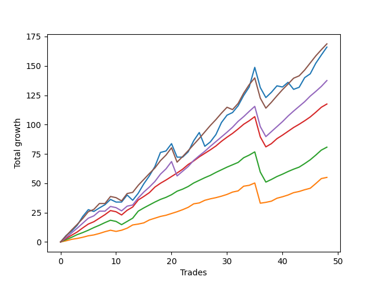

# Long Pointer 002 
- Symbol: ES_SmolBoi
- Date Range: 03/18/2022 - 07/29/2022
- Trading Period: 7:20-12:30
- Number of Trades: 48



| Name | Win Percent | Profit | Avg Profit / Trade | Avg Time / Trade |      | Name | Win Percent | Profit | Avg Profit / Trade | Avg Time / Trade |
| ---- | ----------- | ------ | ------------------ | ---------------- | ---- | ---- | ----------- | ------ | ------------------ | ---------------- |
| Sorted By <br> Profit | | | | | | Sorted By <br> Win Percentage ||||
| Eighty-Five | 87.50 | 84375.00 | 1757.81 | 14:18 |     | Eighty-One | 95.83 | 27500.00 | 572.92 | 06:46 |
| Two | 81.25 | 83000.00 | 1729.17 | 17:23 |     | Eighty-Three | 91.67 | 58750.00 | 1223.96 | 10:13 |
| Eighty-Four | 89.58 | 68750.00 | 1432.29 | 12:52 |     | Eighty-Two | 91.67 | 40375.00 | 841.15 | 08:34 |
| Eighty-Three | 91.67 | 58750.00 | 1223.96 | 10:13 |     | Eighty-Four | 89.58 | 68750.00 | 1432.29 | 12:52 |
| Eighty-Two | 91.67 | 40375.00 | 841.15 | 08:34 |     | Eighty-Five | 87.50 | 84375.00 | 1757.81 | 14:18 |
| Eighty-One | 95.83 | 27500.00 | 572.92 | 06:46 |     | Two | 81.25 | 83000.00 | 1729.17 | 17:23 |

## NO STOPLOSS

### Test Two
* Sell when the price hits the upper line of the 20p 2std bollinger
* No Stoploss
* Results:
```
Total Trades: 48
Percent Up: 81.25
Percent Down: 18.75
Total Points Moved Up: 166.00
Potential Profit: 83000.00
Total Points Ups: 230.25 Count Ups: 39
Total Points Downs: -64.25 Count Downs: 9
```

<details><summary>Trades</summary>

<code>In: 2022-03-23 10:50:00		Out: 2022-03-23 10:54:25		Total Position Time: 04:25		Total Move Up: 5.50		Total to Date: 5.50</code> <br />
<code>In: 2022-03-25 12:31:00		Out: 2022-03-25 12:41:35		Total Position Time: 10:35		Total Move Up: 3.75		Total to Date: 9.25</code> <br />
<code>In: 2022-03-28 09:21:00		Out: 2022-03-28 09:30:40		Total Position Time: 09:40		Total Move Up: 5.00		Total to Date: 14.25</code> <br />
<code>In: 2022-03-30 12:27:00		Out: 2022-03-30 12:36:20		Total Position Time: 09:20		Total Move Up: 7.50		Total to Date: 21.75</code> <br />
<code>In: 2022-03-31 08:37:00		Out: 2022-03-31 08:41:10		Total Position Time: 04:10		Total Move Up: 5.75		Total to Date: 27.50</code> <br />
<code>In: 2022-03-31 10:02:00		Out: 2022-03-31 10:27:00		Total Position Time: 25:00		Total Move Up: -1.50		Total to Date: 26.00</code> <br />
<code>In: 2022-03-31 10:18:00		Out: 2022-03-31 10:27:00		Total Position Time: 09:00		Total Move Up: 3.00		Total to Date: 29.00</code> <br />
<code>In: 2022-04-06 09:23:00		Out: 2022-04-06 09:34:25		Total Position Time: 11:25		Total Move Up: 2.75		Total to Date: 31.75</code> <br />
<code>In: 2022-04-12 11:35:00		Out: 2022-04-12 11:47:00		Total Position Time: 12:00		Total Move Up: 4.50		Total to Date: 36.25</code> <br />
<code>In: 2022-04-14 09:32:00		Out: 2022-04-14 09:58:55		Total Position Time: 26:55		Total Move Up: -2.25		Total to Date: 34.00</code> <br />
<code>In: 2022-04-21 09:12:00		Out: 2022-04-21 09:35:40		Total Position Time: 23:40		Total Move Up: 0.00		Total to Date: 34.00</code> <br />
<code>In: 2022-04-21 10:21:00		Out: 2022-04-21 10:21:30		Total Position Time: 00:30		Total Move Up: 6.00		Total to Date: 40.00</code> <br />
<code>In: 2022-05-02 10:38:00		Out: 2022-05-02 11:03:45		Total Position Time: 25:45		Total Move Up: -4.50		Total to Date: 35.50</code> <br />
<code>In: 2022-05-02 11:46:00		Out: 2022-05-02 11:53:35		Total Position Time: 07:35		Total Move Up: 6.00		Total to Date: 41.50</code> <br />
<code>In: 2022-05-04 08:37:00		Out: 2022-05-04 08:47:05		Total Position Time: 10:05		Total Move Up: 8.00		Total to Date: 49.50</code> <br />
<code>In: 2022-05-06 09:03:00		Out: 2022-05-06 09:03:55		Total Position Time: 00:55		Total Move Up: 6.75		Total to Date: 56.25</code> <br />
<code>In: 2022-05-09 07:42:00		Out: 2022-05-09 07:48:05		Total Position Time: 06:05		Total Move Up: 8.00		Total to Date: 64.25</code> <br />
<code>In: 2022-05-09 08:34:00		Out: 2022-05-09 08:39:15		Total Position Time: 05:15		Total Move Up: 12.00		Total to Date: 76.25</code> <br />
<code>In: 2022-05-09 10:03:00		Out: 2022-05-09 10:18:05		Total Position Time: 15:05		Total Move Up: 1.25		Total to Date: 77.50</code> <br />
<code>In: 2022-05-11 09:14:00		Out: 2022-05-11 09:23:35		Total Position Time: 09:35		Total Move Up: 6.25		Total to Date: 83.75</code> <br />
<code>In: 2022-05-11 10:33:00		Out: 2022-05-11 11:02:35		Total Position Time: 29:35		Total Move Up: -11.50		Total to Date: 72.25</code> <br />
<code>In: 2022-05-12 11:35:00		Out: 2022-05-12 11:53:00		Total Position Time: 18:00		Total Move Up: 0.00		Total to Date: 72.25</code> <br />
<code>In: 2022-05-16 09:47:00		Out: 2022-05-16 10:06:30		Total Position Time: 19:30		Total Move Up: 4.50		Total to Date: 76.75</code> <br />
<code>In: 2022-05-17 11:25:00		Out: 2022-05-17 11:40:00		Total Position Time: 15:00		Total Move Up: 9.50		Total to Date: 86.25</code> <br />
<code>In: 2022-05-18 09:12:00		Out: 2022-05-18 09:17:50		Total Position Time: 05:50		Total Move Up: 7.00		Total to Date: 93.25</code> <br />
<code>In: 2022-05-20 09:48:00		Out: 2022-05-20 10:17:55		Total Position Time: 29:55		Total Move Up: -11.75		Total to Date: 81.50</code> <br />
<code>In: 2022-05-25 09:30:00		Out: 2022-05-25 09:45:20		Total Position Time: 15:20		Total Move Up: 3.75		Total to Date: 85.25</code> <br />
<code>In: 2022-05-25 10:15:00		Out: 2022-05-25 10:29:40		Total Position Time: 14:40		Total Move Up: 6.25		Total to Date: 91.50</code> <br />
<code>In: 2022-05-31 12:05:00		Out: 2022-05-31 12:15:05		Total Position Time: 10:05		Total Move Up: 10.25		Total to Date: 101.75</code> <br />
<code>In: 2022-06-08 08:06:00		Out: 2022-06-08 08:14:00		Total Position Time: 08:00		Total Move Up: 6.25		Total to Date: 108.00</code> <br />
<code>In: 2022-06-08 11:31:00		Out: 2022-06-08 11:43:35		Total Position Time: 12:35		Total Move Up: 2.25		Total to Date: 110.25</code> <br />
<code>In: 2022-06-08 12:11:00		Out: 2022-06-08 12:13:25		Total Position Time: 02:25		Total Move Up: 5.75		Total to Date: 116.00</code> <br />
<code>In: 2022-06-13 12:17:00		Out: 2022-06-13 12:17:15		Total Position Time: 00:15		Total Move Up: 8.75		Total to Date: 124.75</code> <br />
<code>In: 2022-06-14 07:32:00		Out: 2022-06-14 07:51:00		Total Position Time: 19:00		Total Move Up: 7.25		Total to Date: 132.00</code> <br />
<code>In: 2022-06-14 07:46:00		Out: 2022-06-14 07:51:00		Total Position Time: 05:00		Total Move Up: 16.75		Total to Date: 148.75</code> <br />
<code>In: 2022-06-14 11:53:00		Out: 2022-06-14 12:22:55		Total Position Time: 29:55		Total Move Up: -17.25		Total to Date: 131.50</code> <br />
<code>In: 2022-06-15 07:58:00		Out: 2022-06-15 08:27:55		Total Position Time: 29:55		Total Move Up: -8.50		Total to Date: 123.00</code> <br />
<code>In: 2022-06-21 11:06:00		Out: 2022-06-21 11:10:45		Total Position Time: 04:45		Total Move Up: 4.50		Total to Date: 127.50</code> <br />
<code>In: 2022-06-23 10:06:00		Out: 2022-06-23 10:07:40		Total Position Time: 01:40		Total Move Up: 5.50		Total to Date: 133.00</code> <br />
<code>In: 2022-06-27 10:10:00		Out: 2022-06-27 10:39:55		Total Position Time: 29:55		Total Move Up: -1.00		Total to Date: 132.00</code> <br />
<code>In: 2022-07-05 08:08:00		Out: 2022-07-05 08:17:55		Total Position Time: 09:55		Total Move Up: 4.00		Total to Date: 136.00</code> <br />
<code>In: 2022-07-06 08:12:00		Out: 2022-07-06 08:41:55		Total Position Time: 29:55		Total Move Up: -6.00		Total to Date: 130.00</code> <br />
<code>In: 2022-07-08 09:48:00		Out: 2022-07-08 10:10:30		Total Position Time: 22:30		Total Move Up: 1.75		Total to Date: 131.75</code> <br />
<code>In: 2022-07-11 08:53:00		Out: 2022-07-11 09:39:00		Total Position Time: 46:00		Total Move Up: 8.25		Total to Date: 140.00</code> <br />
<code>In: 2022-07-12 10:28:00		Out: 2022-07-12 10:42:00		Total Position Time: 14:00		Total Move Up: 3.25		Total to Date: 143.25</code> <br />
<code>In: 2022-07-25 07:29:00		Out: 2022-07-25 08:29:00		Total Position Time: 60:00		Total Move Up: 9.00		Total to Date: 152.25</code> <br />
<code>In: 2022-07-25 12:10:00		Out: 2022-07-25 12:40:00		Total Position Time: 30:00		Total Move Up: 7.00		Total to Date: 159.25</code> <br />
<code>In: 2022-07-26 08:35:00		Out: 2022-07-26 10:09:00		Total Position Time: 94:00		Total Move Up: 6.75		Total to Date: 166.00</code> <br />


</details>

## TAKE PROFIT

### Test Eighty-One
* Take Profit of 1 Point
* No Stoploss
* Results:
```
Total Trades: 48
Percent Up: 95.83
Percent Down: 4.17
Total Points Moved Up: 55.00
Potential Profit: 27500.00
Total Points Ups: 73.25 Count Ups: 46
Total Points Downs: -18.25 Count Downs: 2
```

<details><summary>Trades</summary>

<code>In: 2022-03-23 10:50:00		Out: 2022-03-23 10:51:00		Total Position Time: 01:00		Total Move Up: 1.00		Total to Date: 1.00</code> <br />
<code>In: 2022-03-25 12:31:00		Out: 2022-03-25 12:37:10		Total Position Time: 06:10		Total Move Up: 1.25		Total to Date: 2.25</code> <br />
<code>In: 2022-03-28 09:21:00		Out: 2022-03-28 09:21:10		Total Position Time: 00:10		Total Move Up: 0.75		Total to Date: 3.00</code> <br />
<code>In: 2022-03-30 12:27:00		Out: 2022-03-30 12:27:35		Total Position Time: 00:35		Total Move Up: 1.00		Total to Date: 4.00</code> <br />
<code>In: 2022-03-31 08:37:00		Out: 2022-03-31 08:37:40		Total Position Time: 00:40		Total Move Up: 1.25		Total to Date: 5.25</code> <br />
<code>In: 2022-03-31 10:02:00		Out: 2022-03-31 10:29:40		Total Position Time: 27:40		Total Move Up: 0.75		Total to Date: 6.00</code> <br />
<code>In: 2022-03-31 10:18:00		Out: 2022-03-31 10:18:20		Total Position Time: 00:20		Total Move Up: 1.25		Total to Date: 7.25</code> <br />
<code>In: 2022-04-06 09:23:00		Out: 2022-04-06 09:31:15		Total Position Time: 08:15		Total Move Up: 1.50		Total to Date: 8.75</code> <br />
<code>In: 2022-04-12 11:35:00		Out: 2022-04-12 11:35:45		Total Position Time: 00:45		Total Move Up: 1.25		Total to Date: 10.00</code> <br />
<code>In: 2022-04-14 09:32:00		Out: 2022-04-14 10:01:55		Total Position Time: 29:55		Total Move Up: -1.00		Total to Date: 9.00</code> <br />
<code>In: 2022-04-21 09:12:00		Out: 2022-04-21 09:20:35		Total Position Time: 08:35		Total Move Up: 1.00		Total to Date: 10.00</code> <br />
<code>In: 2022-04-21 10:21:00		Out: 2022-04-21 10:21:10		Total Position Time: 00:10		Total Move Up: 1.75		Total to Date: 11.75</code> <br />
<code>In: 2022-05-02 10:38:00		Out: 2022-05-02 11:07:05		Total Position Time: 29:05		Total Move Up: 2.75		Total to Date: 14.50</code> <br />
<code>In: 2022-05-02 11:46:00		Out: 2022-05-02 11:46:10		Total Position Time: 00:10		Total Move Up: 0.75		Total to Date: 15.25</code> <br />
<code>In: 2022-05-04 08:37:00		Out: 2022-05-04 08:38:10		Total Position Time: 01:10		Total Move Up: 1.00		Total to Date: 16.25</code> <br />
<code>In: 2022-05-06 09:03:00		Out: 2022-05-06 09:03:10		Total Position Time: 00:10		Total Move Up: 2.50		Total to Date: 18.75</code> <br />
<code>In: 2022-05-09 07:42:00		Out: 2022-05-09 07:42:20		Total Position Time: 00:20		Total Move Up: 1.50		Total to Date: 20.25</code> <br />
<code>In: 2022-05-09 08:34:00		Out: 2022-05-09 08:34:10		Total Position Time: 00:10		Total Move Up: 1.50		Total to Date: 21.75</code> <br />
<code>In: 2022-05-09 10:03:00		Out: 2022-05-09 10:09:25		Total Position Time: 06:25		Total Move Up: 1.00		Total to Date: 22.75</code> <br />
<code>In: 2022-05-11 09:14:00		Out: 2022-05-11 09:14:25		Total Position Time: 00:25		Total Move Up: 1.50		Total to Date: 24.25</code> <br />
<code>In: 2022-05-11 10:33:00		Out: 2022-05-11 10:34:30		Total Position Time: 01:30		Total Move Up: 1.50		Total to Date: 25.75</code> <br />
<code>In: 2022-05-12 11:35:00		Out: 2022-05-12 11:53:25		Total Position Time: 18:25		Total Move Up: 1.75		Total to Date: 27.50</code> <br />
<code>In: 2022-05-16 09:47:00		Out: 2022-05-16 09:47:50		Total Position Time: 00:50		Total Move Up: 2.00		Total to Date: 29.50</code> <br />
<code>In: 2022-05-17 11:25:00		Out: 2022-05-17 11:26:40		Total Position Time: 01:40		Total Move Up: 3.00		Total to Date: 32.50</code> <br />
<code>In: 2022-05-18 09:12:00		Out: 2022-05-18 09:13:05		Total Position Time: 01:05		Total Move Up: 0.75		Total to Date: 33.25</code> <br />
<code>In: 2022-05-20 09:48:00		Out: 2022-05-20 09:48:25		Total Position Time: 00:25		Total Move Up: 2.25		Total to Date: 35.50</code> <br />
<code>In: 2022-05-25 09:30:00		Out: 2022-05-25 09:30:15		Total Position Time: 00:15		Total Move Up: 1.25		Total to Date: 36.75</code> <br />
<code>In: 2022-05-25 10:15:00		Out: 2022-05-25 10:15:20		Total Position Time: 00:20		Total Move Up: 1.00		Total to Date: 37.75</code> <br />
<code>In: 2022-05-31 12:05:00		Out: 2022-05-31 12:07:05		Total Position Time: 02:05		Total Move Up: 1.25		Total to Date: 39.00</code> <br />
<code>In: 2022-06-08 08:06:00		Out: 2022-06-08 08:06:10		Total Position Time: 00:10		Total Move Up: 1.50		Total to Date: 40.50</code> <br />
<code>In: 2022-06-08 11:31:00		Out: 2022-06-08 11:43:30		Total Position Time: 12:30		Total Move Up: 2.00		Total to Date: 42.50</code> <br />
<code>In: 2022-06-08 12:11:00		Out: 2022-06-08 12:11:10		Total Position Time: 00:10		Total Move Up: 1.00		Total to Date: 43.50</code> <br />
<code>In: 2022-06-13 12:17:00		Out: 2022-06-13 12:17:10		Total Position Time: 00:10		Total Move Up: 4.00		Total to Date: 47.50</code> <br />
<code>In: 2022-06-14 07:32:00		Out: 2022-06-14 07:48:25		Total Position Time: 16:25		Total Move Up: 0.75		Total to Date: 48.25</code> <br />
<code>In: 2022-06-14 07:46:00		Out: 2022-06-14 07:46:35		Total Position Time: 00:35		Total Move Up: 2.00		Total to Date: 50.25</code> <br />
<code>In: 2022-06-14 11:53:00		Out: 2022-06-14 12:22:55		Total Position Time: 29:55		Total Move Up: -17.25		Total to Date: 33.00</code> <br />
<code>In: 2022-06-15 07:58:00		Out: 2022-06-15 08:00:20		Total Position Time: 02:20		Total Move Up: 0.75		Total to Date: 33.75</code> <br />
<code>In: 2022-06-21 11:06:00		Out: 2022-06-21 11:07:45		Total Position Time: 01:45		Total Move Up: 1.00		Total to Date: 34.75</code> <br />
<code>In: 2022-06-23 10:06:00		Out: 2022-06-23 10:06:10		Total Position Time: 00:10		Total Move Up: 2.50		Total to Date: 37.25</code> <br />
<code>In: 2022-06-27 10:10:00		Out: 2022-06-27 10:10:25		Total Position Time: 00:25		Total Move Up: 1.25		Total to Date: 38.50</code> <br />
<code>In: 2022-07-05 08:08:00		Out: 2022-07-05 08:08:10		Total Position Time: 00:10		Total Move Up: 1.50		Total to Date: 40.00</code> <br />
<code>In: 2022-07-06 08:12:00		Out: 2022-07-06 08:12:15		Total Position Time: 00:15		Total Move Up: 2.00		Total to Date: 42.00</code> <br />
<code>In: 2022-07-08 09:48:00		Out: 2022-07-08 09:48:20		Total Position Time: 00:20		Total Move Up: 1.00		Total to Date: 43.00</code> <br />
<code>In: 2022-07-11 08:53:00		Out: 2022-07-11 09:06:00		Total Position Time: 13:00		Total Move Up: 1.50		Total to Date: 44.50</code> <br />
<code>In: 2022-07-12 10:28:00		Out: 2022-07-12 10:41:00		Total Position Time: 13:00		Total Move Up: 1.25		Total to Date: 45.75</code> <br />
<code>In: 2022-07-25 07:29:00		Out: 2022-07-25 07:44:00		Total Position Time: 15:00		Total Move Up: 4.00		Total to Date: 49.75</code> <br />
<code>In: 2022-07-25 12:10:00		Out: 2022-07-25 12:23:00		Total Position Time: 13:00		Total Move Up: 4.25		Total to Date: 54.00</code> <br />
<code>In: 2022-07-26 08:35:00		Out: 2022-07-26 09:32:00		Total Position Time: 57:00		Total Move Up: 1.00		Total to Date: 55.00</code> <br />


</details>

### Test Eighty-Two
* Take Profit of 2 Point
* No Stoploss
* Results:
```
Total Trades: 48
Percent Up: 91.67
Percent Down: 8.33
Total Points Moved Up: 80.75
Potential Profit: 40375.00
Total Points Ups: 110.25 Count Ups: 44
Total Points Downs: -29.50 Count Downs: 4
```

<details><summary>Trades</summary>

<code>In: 2022-03-23 10:50:00		Out: 2022-03-23 10:51:10		Total Position Time: 01:10		Total Move Up: 2.00		Total to Date: 2.00</code> <br />
<code>In: 2022-03-25 12:31:00		Out: 2022-03-25 12:37:15		Total Position Time: 06:15		Total Move Up: 2.00		Total to Date: 4.00</code> <br />
<code>In: 2022-03-28 09:21:00		Out: 2022-03-28 09:21:25		Total Position Time: 00:25		Total Move Up: 2.25		Total to Date: 6.25</code> <br />
<code>In: 2022-03-30 12:27:00		Out: 2022-03-30 12:28:00		Total Position Time: 01:00		Total Move Up: 1.75		Total to Date: 8.00</code> <br />
<code>In: 2022-03-31 08:37:00		Out: 2022-03-31 08:38:15		Total Position Time: 01:15		Total Move Up: 2.00		Total to Date: 10.00</code> <br />
<code>In: 2022-03-31 10:02:00		Out: 2022-03-31 10:31:20		Total Position Time: 29:20		Total Move Up: 2.25		Total to Date: 12.25</code> <br />
<code>In: 2022-03-31 10:18:00		Out: 2022-03-31 10:19:05		Total Position Time: 01:05		Total Move Up: 2.00		Total to Date: 14.25</code> <br />
<code>In: 2022-04-06 09:23:00		Out: 2022-04-06 09:31:25		Total Position Time: 08:25		Total Move Up: 2.25		Total to Date: 16.50</code> <br />
<code>In: 2022-04-12 11:35:00		Out: 2022-04-12 11:35:55		Total Position Time: 00:55		Total Move Up: 2.00		Total to Date: 18.50</code> <br />
<code>In: 2022-04-14 09:32:00		Out: 2022-04-14 10:01:55		Total Position Time: 29:55		Total Move Up: -1.00		Total to Date: 17.50</code> <br />
<code>In: 2022-04-21 09:12:00		Out: 2022-04-21 09:41:55		Total Position Time: 29:55		Total Move Up: -2.75		Total to Date: 14.75</code> <br />
<code>In: 2022-04-21 10:21:00		Out: 2022-04-21 10:21:15		Total Position Time: 00:15		Total Move Up: 2.75		Total to Date: 17.50</code> <br />
<code>In: 2022-05-02 10:38:00		Out: 2022-05-02 11:07:05		Total Position Time: 29:05		Total Move Up: 2.75		Total to Date: 20.25</code> <br />
<code>In: 2022-05-02 11:46:00		Out: 2022-05-02 11:53:35		Total Position Time: 07:35		Total Move Up: 6.00		Total to Date: 26.25</code> <br />
<code>In: 2022-05-04 08:37:00		Out: 2022-05-04 08:39:25		Total Position Time: 02:25		Total Move Up: 2.75		Total to Date: 29.00</code> <br />
<code>In: 2022-05-06 09:03:00		Out: 2022-05-06 09:03:10		Total Position Time: 00:10		Total Move Up: 2.50		Total to Date: 31.50</code> <br />
<code>In: 2022-05-09 07:42:00		Out: 2022-05-09 07:42:25		Total Position Time: 00:25		Total Move Up: 2.50		Total to Date: 34.00</code> <br />
<code>In: 2022-05-09 08:34:00		Out: 2022-05-09 08:34:15		Total Position Time: 00:15		Total Move Up: 2.25		Total to Date: 36.25</code> <br />
<code>In: 2022-05-09 10:03:00		Out: 2022-05-09 10:19:05		Total Position Time: 16:05		Total Move Up: 1.75		Total to Date: 38.00</code> <br />
<code>In: 2022-05-11 09:14:00		Out: 2022-05-11 09:14:30		Total Position Time: 00:30		Total Move Up: 2.25		Total to Date: 40.25</code> <br />
<code>In: 2022-05-11 10:33:00		Out: 2022-05-11 10:34:50		Total Position Time: 01:50		Total Move Up: 3.00		Total to Date: 43.25</code> <br />
<code>In: 2022-05-12 11:35:00		Out: 2022-05-12 11:53:25		Total Position Time: 18:25		Total Move Up: 1.75		Total to Date: 45.00</code> <br />
<code>In: 2022-05-16 09:47:00		Out: 2022-05-16 09:47:55		Total Position Time: 00:55		Total Move Up: 2.25		Total to Date: 47.25</code> <br />
<code>In: 2022-05-17 11:25:00		Out: 2022-05-17 11:26:40		Total Position Time: 01:40		Total Move Up: 3.00		Total to Date: 50.25</code> <br />
<code>In: 2022-05-18 09:12:00		Out: 2022-05-18 09:14:45		Total Position Time: 02:45		Total Move Up: 2.25		Total to Date: 52.50</code> <br />
<code>In: 2022-05-20 09:48:00		Out: 2022-05-20 09:48:25		Total Position Time: 00:25		Total Move Up: 2.25		Total to Date: 54.75</code> <br />
<code>In: 2022-05-25 09:30:00		Out: 2022-05-25 09:30:25		Total Position Time: 00:25		Total Move Up: 2.00		Total to Date: 56.75</code> <br />
<code>In: 2022-05-25 10:15:00		Out: 2022-05-25 10:15:25		Total Position Time: 00:25		Total Move Up: 2.50		Total to Date: 59.25</code> <br />
<code>In: 2022-05-31 12:05:00		Out: 2022-05-31 12:07:20		Total Position Time: 02:20		Total Move Up: 2.25		Total to Date: 61.50</code> <br />
<code>In: 2022-06-08 08:06:00		Out: 2022-06-08 08:10:45		Total Position Time: 04:45		Total Move Up: 2.25		Total to Date: 63.75</code> <br />
<code>In: 2022-06-08 11:31:00		Out: 2022-06-08 11:43:30		Total Position Time: 12:30		Total Move Up: 2.00		Total to Date: 65.75</code> <br />
<code>In: 2022-06-08 12:11:00		Out: 2022-06-08 12:11:45		Total Position Time: 00:45		Total Move Up: 2.00		Total to Date: 67.75</code> <br />
<code>In: 2022-06-13 12:17:00		Out: 2022-06-13 12:17:10		Total Position Time: 00:10		Total Move Up: 4.00		Total to Date: 71.75</code> <br />
<code>In: 2022-06-14 07:32:00		Out: 2022-06-14 07:48:30		Total Position Time: 16:30		Total Move Up: 2.25		Total to Date: 74.00</code> <br />
<code>In: 2022-06-14 07:46:00		Out: 2022-06-14 07:46:40		Total Position Time: 00:40		Total Move Up: 2.75		Total to Date: 76.75</code> <br />
<code>In: 2022-06-14 11:53:00		Out: 2022-06-14 12:22:55		Total Position Time: 29:55		Total Move Up: -17.25		Total to Date: 59.50</code> <br />
<code>In: 2022-06-15 07:58:00		Out: 2022-06-15 08:27:55		Total Position Time: 29:55		Total Move Up: -8.50		Total to Date: 51.00</code> <br />
<code>In: 2022-06-21 11:06:00		Out: 2022-06-21 11:08:15		Total Position Time: 02:15		Total Move Up: 2.25		Total to Date: 53.25</code> <br />
<code>In: 2022-06-23 10:06:00		Out: 2022-06-23 10:06:10		Total Position Time: 00:10		Total Move Up: 2.50		Total to Date: 55.75</code> <br />
<code>In: 2022-06-27 10:10:00		Out: 2022-06-27 10:11:10		Total Position Time: 01:10		Total Move Up: 2.00		Total to Date: 57.75</code> <br />
<code>In: 2022-07-05 08:08:00		Out: 2022-07-05 08:08:15		Total Position Time: 00:15		Total Move Up: 2.25		Total to Date: 60.00</code> <br />
<code>In: 2022-07-06 08:12:00		Out: 2022-07-06 08:12:15		Total Position Time: 00:15		Total Move Up: 2.00		Total to Date: 62.00</code> <br />
<code>In: 2022-07-08 09:48:00		Out: 2022-07-08 09:49:00		Total Position Time: 01:00		Total Move Up: 1.75		Total to Date: 63.75</code> <br />
<code>In: 2022-07-11 08:53:00		Out: 2022-07-11 09:07:00		Total Position Time: 14:00		Total Move Up: 3.00		Total to Date: 66.75</code> <br />
<code>In: 2022-07-12 10:28:00		Out: 2022-07-12 10:42:00		Total Position Time: 14:00		Total Move Up: 3.25		Total to Date: 70.00</code> <br />
<code>In: 2022-07-25 07:29:00		Out: 2022-07-25 07:44:00		Total Position Time: 15:00		Total Move Up: 4.00		Total to Date: 74.00</code> <br />
<code>In: 2022-07-25 12:10:00		Out: 2022-07-25 12:23:00		Total Position Time: 13:00		Total Move Up: 4.25		Total to Date: 78.25</code> <br />
<code>In: 2022-07-26 08:35:00		Out: 2022-07-26 09:35:00		Total Position Time: 60:00		Total Move Up: 2.50		Total to Date: 80.75</code> <br />


</details>

### Test Eighty-Three
* Take Profit of 3 Point
* No Stoploss
* Results:
```
Total Trades: 48
Percent Up: 91.67
Percent Down: 8.33
Total Points Moved Up: 117.50
Potential Profit: 58750.00
Total Points Ups: 147.00 Count Ups: 44
Total Points Downs: -29.50 Count Downs: 4
```

<details><summary>Trades</summary>

<code>In: 2022-03-23 10:50:00		Out: 2022-03-23 10:51:35		Total Position Time: 01:35		Total Move Up: 3.00		Total to Date: 3.00</code> <br />
<code>In: 2022-03-25 12:31:00		Out: 2022-03-25 12:41:20		Total Position Time: 10:20		Total Move Up: 2.75		Total to Date: 5.75</code> <br />
<code>In: 2022-03-28 09:21:00		Out: 2022-03-28 09:21:30		Total Position Time: 00:30		Total Move Up: 2.75		Total to Date: 8.50</code> <br />
<code>In: 2022-03-30 12:27:00		Out: 2022-03-30 12:31:35		Total Position Time: 04:35		Total Move Up: 3.50		Total to Date: 12.00</code> <br />
<code>In: 2022-03-31 08:37:00		Out: 2022-03-31 08:40:35		Total Position Time: 03:35		Total Move Up: 3.25		Total to Date: 15.25</code> <br />
<code>In: 2022-03-31 10:02:00		Out: 2022-03-31 10:31:55		Total Position Time: 29:55		Total Move Up: 2.00		Total to Date: 17.25</code> <br />
<code>In: 2022-03-31 10:18:00		Out: 2022-03-31 10:19:15		Total Position Time: 01:15		Total Move Up: 3.00		Total to Date: 20.25</code> <br />
<code>In: 2022-04-06 09:23:00		Out: 2022-04-06 09:41:10		Total Position Time: 18:10		Total Move Up: 3.00		Total to Date: 23.25</code> <br />
<code>In: 2022-04-12 11:35:00		Out: 2022-04-12 11:37:20		Total Position Time: 02:20		Total Move Up: 3.50		Total to Date: 26.75</code> <br />
<code>In: 2022-04-14 09:32:00		Out: 2022-04-14 10:01:55		Total Position Time: 29:55		Total Move Up: -1.00		Total to Date: 25.75</code> <br />
<code>In: 2022-04-21 09:12:00		Out: 2022-04-21 09:41:55		Total Position Time: 29:55		Total Move Up: -2.75		Total to Date: 23.00</code> <br />
<code>In: 2022-04-21 10:21:00		Out: 2022-04-21 10:21:20		Total Position Time: 00:20		Total Move Up: 4.00		Total to Date: 27.00</code> <br />
<code>In: 2022-05-02 10:38:00		Out: 2022-05-02 11:07:05		Total Position Time: 29:05		Total Move Up: 2.75		Total to Date: 29.75</code> <br />
<code>In: 2022-05-02 11:46:00		Out: 2022-05-02 11:53:35		Total Position Time: 07:35		Total Move Up: 6.00		Total to Date: 35.75</code> <br />
<code>In: 2022-05-04 08:37:00		Out: 2022-05-04 08:39:30		Total Position Time: 02:30		Total Move Up: 3.00		Total to Date: 38.75</code> <br />
<code>In: 2022-05-06 09:03:00		Out: 2022-05-06 09:03:40		Total Position Time: 00:40		Total Move Up: 3.25		Total to Date: 42.00</code> <br />
<code>In: 2022-05-09 07:42:00		Out: 2022-05-09 07:42:30		Total Position Time: 00:30		Total Move Up: 4.75		Total to Date: 46.75</code> <br />
<code>In: 2022-05-09 08:34:00		Out: 2022-05-09 08:34:40		Total Position Time: 00:40		Total Move Up: 3.25		Total to Date: 50.00</code> <br />
<code>In: 2022-05-09 10:03:00		Out: 2022-05-09 10:19:10		Total Position Time: 16:10		Total Move Up: 2.75		Total to Date: 52.75</code> <br />
<code>In: 2022-05-11 09:14:00		Out: 2022-05-11 09:22:05		Total Position Time: 08:05		Total Move Up: 3.00		Total to Date: 55.75</code> <br />
<code>In: 2022-05-11 10:33:00		Out: 2022-05-11 10:34:50		Total Position Time: 01:50		Total Move Up: 3.00		Total to Date: 58.75</code> <br />
<code>In: 2022-05-12 11:35:00		Out: 2022-05-12 12:00:50		Total Position Time: 25:50		Total Move Up: 3.25		Total to Date: 62.00</code> <br />
<code>In: 2022-05-16 09:47:00		Out: 2022-05-16 09:48:15		Total Position Time: 01:15		Total Move Up: 4.00		Total to Date: 66.00</code> <br />
<code>In: 2022-05-17 11:25:00		Out: 2022-05-17 11:26:40		Total Position Time: 01:40		Total Move Up: 3.00		Total to Date: 69.00</code> <br />
<code>In: 2022-05-18 09:12:00		Out: 2022-05-18 09:15:20		Total Position Time: 03:20		Total Move Up: 3.50		Total to Date: 72.50</code> <br />
<code>In: 2022-05-20 09:48:00		Out: 2022-05-20 09:49:10		Total Position Time: 01:10		Total Move Up: 3.00		Total to Date: 75.50</code> <br />
<code>In: 2022-05-25 09:30:00		Out: 2022-05-25 09:31:45		Total Position Time: 01:45		Total Move Up: 3.00		Total to Date: 78.50</code> <br />
<code>In: 2022-05-25 10:15:00		Out: 2022-05-25 10:15:30		Total Position Time: 00:30		Total Move Up: 3.25		Total to Date: 81.75</code> <br />
<code>In: 2022-05-31 12:05:00		Out: 2022-05-31 12:07:45		Total Position Time: 02:45		Total Move Up: 4.00		Total to Date: 85.75</code> <br />
<code>In: 2022-06-08 08:06:00		Out: 2022-06-08 08:11:05		Total Position Time: 05:05		Total Move Up: 3.50		Total to Date: 89.25</code> <br />
<code>In: 2022-06-08 11:31:00		Out: 2022-06-08 11:45:20		Total Position Time: 14:20		Total Move Up: 3.25		Total to Date: 92.50</code> <br />
<code>In: 2022-06-08 12:11:00		Out: 2022-06-08 12:12:10		Total Position Time: 01:10		Total Move Up: 3.75		Total to Date: 96.25</code> <br />
<code>In: 2022-06-13 12:17:00		Out: 2022-06-13 12:17:10		Total Position Time: 00:10		Total Move Up: 4.00		Total to Date: 100.25</code> <br />
<code>In: 2022-06-14 07:32:00		Out: 2022-06-14 07:48:50		Total Position Time: 16:50		Total Move Up: 3.00		Total to Date: 103.25</code> <br />
<code>In: 2022-06-14 07:46:00		Out: 2022-06-14 07:46:50		Total Position Time: 00:50		Total Move Up: 3.50		Total to Date: 106.75</code> <br />
<code>In: 2022-06-14 11:53:00		Out: 2022-06-14 12:22:55		Total Position Time: 29:55		Total Move Up: -17.25		Total to Date: 89.50</code> <br />
<code>In: 2022-06-15 07:58:00		Out: 2022-06-15 08:27:55		Total Position Time: 29:55		Total Move Up: -8.50		Total to Date: 81.00</code> <br />
<code>In: 2022-06-21 11:06:00		Out: 2022-06-21 11:08:30		Total Position Time: 02:30		Total Move Up: 2.75		Total to Date: 83.75</code> <br />
<code>In: 2022-06-23 10:06:00		Out: 2022-06-23 10:06:30		Total Position Time: 00:30		Total Move Up: 4.25		Total to Date: 88.00</code> <br />
<code>In: 2022-06-27 10:10:00		Out: 2022-06-27 10:11:25		Total Position Time: 01:25		Total Move Up: 3.00		Total to Date: 91.00</code> <br />
<code>In: 2022-07-05 08:08:00		Out: 2022-07-05 08:16:45		Total Position Time: 08:45		Total Move Up: 3.25		Total to Date: 94.25</code> <br />
<code>In: 2022-07-06 08:12:00		Out: 2022-07-06 08:13:15		Total Position Time: 01:15		Total Move Up: 3.25		Total to Date: 97.50</code> <br />
<code>In: 2022-07-08 09:48:00		Out: 2022-07-08 10:11:20		Total Position Time: 23:20		Total Move Up: 2.75		Total to Date: 100.25</code> <br />
<code>In: 2022-07-11 08:53:00		Out: 2022-07-11 09:07:00		Total Position Time: 14:00		Total Move Up: 3.00		Total to Date: 103.25</code> <br />
<code>In: 2022-07-12 10:28:00		Out: 2022-07-12 10:42:00		Total Position Time: 14:00		Total Move Up: 3.25		Total to Date: 106.50</code> <br />
<code>In: 2022-07-25 07:29:00		Out: 2022-07-25 07:44:00		Total Position Time: 15:00		Total Move Up: 4.00		Total to Date: 110.50</code> <br />
<code>In: 2022-07-25 12:10:00		Out: 2022-07-25 12:23:00		Total Position Time: 13:00		Total Move Up: 4.25		Total to Date: 114.75</code> <br />
<code>In: 2022-07-26 08:35:00		Out: 2022-07-26 09:36:00		Total Position Time: 61:00		Total Move Up: 2.75		Total to Date: 117.50</code> <br />


</details>

### Test Eighty-Four
* Take Profit of 4 Point
* No Stoploss
* Results:
```
Total Trades: 48
Percent Up: 89.58
Percent Down: 10.42
Total Points Moved Up: 137.50
Potential Profit: 68750.00
Total Points Ups: 179.25 Count Ups: 43
Total Points Downs: -41.75 Count Downs: 5
```

<details><summary>Trades</summary>

<code>In: 2022-03-23 10:50:00		Out: 2022-03-23 10:51:50		Total Position Time: 01:50		Total Move Up: 3.75		Total to Date: 3.75</code> <br />
<code>In: 2022-03-25 12:31:00		Out: 2022-03-25 12:41:40		Total Position Time: 10:40		Total Move Up: 4.00		Total to Date: 7.75</code> <br />
<code>In: 2022-03-28 09:21:00		Out: 2022-03-28 09:23:25		Total Position Time: 02:25		Total Move Up: 4.00		Total to Date: 11.75</code> <br />
<code>In: 2022-03-30 12:27:00		Out: 2022-03-30 12:32:15		Total Position Time: 05:15		Total Move Up: 4.25		Total to Date: 16.00</code> <br />
<code>In: 2022-03-31 08:37:00		Out: 2022-03-31 08:41:05		Total Position Time: 04:05		Total Move Up: 4.25		Total to Date: 20.25</code> <br />
<code>In: 2022-03-31 10:02:00		Out: 2022-03-31 10:31:55		Total Position Time: 29:55		Total Move Up: 2.00		Total to Date: 22.25</code> <br />
<code>In: 2022-03-31 10:18:00		Out: 2022-03-31 10:19:40		Total Position Time: 01:40		Total Move Up: 4.00		Total to Date: 26.25</code> <br />
<code>In: 2022-04-06 09:23:00		Out: 2022-04-06 09:52:55		Total Position Time: 29:55		Total Move Up: 0.00		Total to Date: 26.25</code> <br />
<code>In: 2022-04-12 11:35:00		Out: 2022-04-12 11:37:35		Total Position Time: 02:35		Total Move Up: 4.00		Total to Date: 30.25</code> <br />
<code>In: 2022-04-14 09:32:00		Out: 2022-04-14 10:01:55		Total Position Time: 29:55		Total Move Up: -1.00		Total to Date: 29.25</code> <br />
<code>In: 2022-04-21 09:12:00		Out: 2022-04-21 09:41:55		Total Position Time: 29:55		Total Move Up: -2.75		Total to Date: 26.50</code> <br />
<code>In: 2022-04-21 10:21:00		Out: 2022-04-21 10:21:20		Total Position Time: 00:20		Total Move Up: 4.00		Total to Date: 30.50</code> <br />
<code>In: 2022-05-02 10:38:00		Out: 2022-05-02 11:07:55		Total Position Time: 29:55		Total Move Up: 1.00		Total to Date: 31.50</code> <br />
<code>In: 2022-05-02 11:46:00		Out: 2022-05-02 11:53:35		Total Position Time: 07:35		Total Move Up: 6.00		Total to Date: 37.50</code> <br />
<code>In: 2022-05-04 08:37:00		Out: 2022-05-04 08:40:55		Total Position Time: 03:55		Total Move Up: 5.00		Total to Date: 42.50</code> <br />
<code>In: 2022-05-06 09:03:00		Out: 2022-05-06 09:03:45		Total Position Time: 00:45		Total Move Up: 4.25		Total to Date: 46.75</code> <br />
<code>In: 2022-05-09 07:42:00		Out: 2022-05-09 07:42:30		Total Position Time: 00:30		Total Move Up: 4.75		Total to Date: 51.50</code> <br />
<code>In: 2022-05-09 08:34:00		Out: 2022-05-09 08:35:10		Total Position Time: 01:10		Total Move Up: 6.25		Total to Date: 57.75</code> <br />
<code>In: 2022-05-09 10:03:00		Out: 2022-05-09 10:25:40		Total Position Time: 22:40		Total Move Up: 4.50		Total to Date: 62.25</code> <br />
<code>In: 2022-05-11 09:14:00		Out: 2022-05-11 09:23:15		Total Position Time: 09:15		Total Move Up: 6.25		Total to Date: 68.50</code> <br />
<code>In: 2022-05-11 10:33:00		Out: 2022-05-11 11:02:55		Total Position Time: 29:55		Total Move Up: -12.25		Total to Date: 56.25</code> <br />
<code>In: 2022-05-12 11:35:00		Out: 2022-05-12 12:03:45		Total Position Time: 28:45		Total Move Up: 4.00		Total to Date: 60.25</code> <br />
<code>In: 2022-05-16 09:47:00		Out: 2022-05-16 09:48:15		Total Position Time: 01:15		Total Move Up: 4.00		Total to Date: 64.25</code> <br />
<code>In: 2022-05-17 11:25:00		Out: 2022-05-17 11:27:05		Total Position Time: 02:05		Total Move Up: 5.25		Total to Date: 69.50</code> <br />
<code>In: 2022-05-18 09:12:00		Out: 2022-05-18 09:15:25		Total Position Time: 03:25		Total Move Up: 4.00		Total to Date: 73.50</code> <br />
<code>In: 2022-05-20 09:48:00		Out: 2022-05-20 09:49:20		Total Position Time: 01:20		Total Move Up: 3.75		Total to Date: 77.25</code> <br />
<code>In: 2022-05-25 09:30:00		Out: 2022-05-25 09:48:10		Total Position Time: 18:10		Total Move Up: 4.25		Total to Date: 81.50</code> <br />
<code>In: 2022-05-25 10:15:00		Out: 2022-05-25 10:15:55		Total Position Time: 00:55		Total Move Up: 4.00		Total to Date: 85.50</code> <br />
<code>In: 2022-05-31 12:05:00		Out: 2022-05-31 12:07:45		Total Position Time: 02:45		Total Move Up: 4.00		Total to Date: 89.50</code> <br />
<code>In: 2022-06-08 08:06:00		Out: 2022-06-08 08:11:15		Total Position Time: 05:15		Total Move Up: 4.00		Total to Date: 93.50</code> <br />
<code>In: 2022-06-08 11:31:00		Out: 2022-06-08 11:45:30		Total Position Time: 14:30		Total Move Up: 4.25		Total to Date: 97.75</code> <br />
<code>In: 2022-06-08 12:11:00		Out: 2022-06-08 12:12:20		Total Position Time: 01:20		Total Move Up: 5.00		Total to Date: 102.75</code> <br />
<code>In: 2022-06-13 12:17:00		Out: 2022-06-13 12:17:10		Total Position Time: 00:10		Total Move Up: 4.00		Total to Date: 106.75</code> <br />
<code>In: 2022-06-14 07:32:00		Out: 2022-06-14 07:50:00		Total Position Time: 18:00		Total Move Up: 4.50		Total to Date: 111.25</code> <br />
<code>In: 2022-06-14 07:46:00		Out: 2022-06-14 07:47:00		Total Position Time: 01:00		Total Move Up: 4.25		Total to Date: 115.50</code> <br />
<code>In: 2022-06-14 11:53:00		Out: 2022-06-14 12:22:55		Total Position Time: 29:55		Total Move Up: -17.25		Total to Date: 98.25</code> <br />
<code>In: 2022-06-15 07:58:00		Out: 2022-06-15 08:27:55		Total Position Time: 29:55		Total Move Up: -8.50		Total to Date: 89.75</code> <br />
<code>In: 2022-06-21 11:06:00		Out: 2022-06-21 11:10:20		Total Position Time: 04:20		Total Move Up: 4.25		Total to Date: 94.00</code> <br />
<code>In: 2022-06-23 10:06:00		Out: 2022-06-23 10:06:30		Total Position Time: 00:30		Total Move Up: 4.25		Total to Date: 98.25</code> <br />
<code>In: 2022-06-27 10:10:00		Out: 2022-06-27 10:12:00		Total Position Time: 02:00		Total Move Up: 4.25		Total to Date: 102.50</code> <br />
<code>In: 2022-07-05 08:08:00		Out: 2022-07-05 08:17:50		Total Position Time: 09:50		Total Move Up: 4.75		Total to Date: 107.25</code> <br />
<code>In: 2022-07-06 08:12:00		Out: 2022-07-06 08:15:05		Total Position Time: 03:05		Total Move Up: 4.25		Total to Date: 111.50</code> <br />
<code>In: 2022-07-08 09:48:00		Out: 2022-07-08 10:12:25		Total Position Time: 24:25		Total Move Up: 4.00		Total to Date: 115.50</code> <br />
<code>In: 2022-07-11 08:53:00		Out: 2022-07-11 09:11:00		Total Position Time: 18:00		Total Move Up: 4.00		Total to Date: 119.50</code> <br />
<code>In: 2022-07-12 10:28:00		Out: 2022-07-12 10:54:00		Total Position Time: 26:00		Total Move Up: 4.75		Total to Date: 124.25</code> <br />
<code>In: 2022-07-25 07:29:00		Out: 2022-07-25 07:44:00		Total Position Time: 15:00		Total Move Up: 4.00		Total to Date: 128.25</code> <br />
<code>In: 2022-07-25 12:10:00		Out: 2022-07-25 12:23:00		Total Position Time: 13:00		Total Move Up: 4.25		Total to Date: 132.50</code> <br />
<code>In: 2022-07-26 08:35:00		Out: 2022-07-26 10:04:00		Total Position Time: 89:00		Total Move Up: 5.00		Total to Date: 137.50</code> <br />


</details>

### Test Eighty-Five
* Take Profit of 5 Point
* No Stoploss
* Results:
```
Total Trades: 48
Percent Up: 87.50
Percent Down: 12.50
Total Points Moved Up: 168.75
Potential Profit: 84375.00
Total Points Ups: 212.50 Count Ups: 42
Total Points Downs: -43.75 Count Downs: 6
```

<details><summary>Trades</summary>

<code>In: 2022-03-23 10:50:00		Out: 2022-03-23 10:54:20		Total Position Time: 04:20		Total Move Up: 5.25		Total to Date: 5.25</code> <br />
<code>In: 2022-03-25 12:31:00		Out: 2022-03-25 12:41:55		Total Position Time: 10:55		Total Move Up: 5.00		Total to Date: 10.25</code> <br />
<code>In: 2022-03-28 09:21:00		Out: 2022-03-28 09:25:35		Total Position Time: 04:35		Total Move Up: 4.75		Total to Date: 15.00</code> <br />
<code>In: 2022-03-30 12:27:00		Out: 2022-03-30 12:32:25		Total Position Time: 05:25		Total Move Up: 5.00		Total to Date: 20.00</code> <br />
<code>In: 2022-03-31 08:37:00		Out: 2022-03-31 08:41:10		Total Position Time: 04:10		Total Move Up: 5.75		Total to Date: 25.75</code> <br />
<code>In: 2022-03-31 10:02:00		Out: 2022-03-31 10:31:55		Total Position Time: 29:55		Total Move Up: 2.00		Total to Date: 27.75</code> <br />
<code>In: 2022-03-31 10:18:00		Out: 2022-03-31 10:29:20		Total Position Time: 11:20		Total Move Up: 5.00		Total to Date: 32.75</code> <br />
<code>In: 2022-04-06 09:23:00		Out: 2022-04-06 09:52:55		Total Position Time: 29:55		Total Move Up: 0.00		Total to Date: 32.75</code> <br />
<code>In: 2022-04-12 11:35:00		Out: 2022-04-12 11:47:05		Total Position Time: 12:05		Total Move Up: 6.00		Total to Date: 38.75</code> <br />
<code>In: 2022-04-14 09:32:00		Out: 2022-04-14 10:01:55		Total Position Time: 29:55		Total Move Up: -1.00		Total to Date: 37.75</code> <br />
<code>In: 2022-04-21 09:12:00		Out: 2022-04-21 09:41:55		Total Position Time: 29:55		Total Move Up: -2.75		Total to Date: 35.00</code> <br />
<code>In: 2022-04-21 10:21:00		Out: 2022-04-21 10:21:25		Total Position Time: 00:25		Total Move Up: 6.25		Total to Date: 41.25</code> <br />
<code>In: 2022-05-02 10:38:00		Out: 2022-05-02 11:07:55		Total Position Time: 29:55		Total Move Up: 1.00		Total to Date: 42.25</code> <br />
<code>In: 2022-05-02 11:46:00		Out: 2022-05-02 11:53:35		Total Position Time: 07:35		Total Move Up: 6.00		Total to Date: 48.25</code> <br />
<code>In: 2022-05-04 08:37:00		Out: 2022-05-04 08:40:55		Total Position Time: 03:55		Total Move Up: 5.00		Total to Date: 53.25</code> <br />
<code>In: 2022-05-06 09:03:00		Out: 2022-05-06 09:03:50		Total Position Time: 00:50		Total Move Up: 5.00		Total to Date: 58.25</code> <br />
<code>In: 2022-05-09 07:42:00		Out: 2022-05-09 07:42:30		Total Position Time: 00:30		Total Move Up: 4.75		Total to Date: 63.00</code> <br />
<code>In: 2022-05-09 08:34:00		Out: 2022-05-09 08:35:10		Total Position Time: 01:10		Total Move Up: 6.25		Total to Date: 69.25</code> <br />
<code>In: 2022-05-09 10:03:00		Out: 2022-05-09 10:26:00		Total Position Time: 23:00		Total Move Up: 4.75		Total to Date: 74.00</code> <br />
<code>In: 2022-05-11 09:14:00		Out: 2022-05-11 09:23:15		Total Position Time: 09:15		Total Move Up: 6.25		Total to Date: 80.25</code> <br />
<code>In: 2022-05-11 10:33:00		Out: 2022-05-11 11:02:55		Total Position Time: 29:55		Total Move Up: -12.25		Total to Date: 68.00</code> <br />
<code>In: 2022-05-12 11:35:00		Out: 2022-05-12 12:04:05		Total Position Time: 29:05		Total Move Up: 4.75		Total to Date: 72.75</code> <br />
<code>In: 2022-05-16 09:47:00		Out: 2022-05-16 09:48:45		Total Position Time: 01:45		Total Move Up: 5.00		Total to Date: 77.75</code> <br />
<code>In: 2022-05-17 11:25:00		Out: 2022-05-17 11:27:05		Total Position Time: 02:05		Total Move Up: 5.25		Total to Date: 83.00</code> <br />
<code>In: 2022-05-18 09:12:00		Out: 2022-05-18 09:16:30		Total Position Time: 04:30		Total Move Up: 5.25		Total to Date: 88.25</code> <br />
<code>In: 2022-05-20 09:48:00		Out: 2022-05-20 09:49:30		Total Position Time: 01:30		Total Move Up: 5.50		Total to Date: 93.75</code> <br />
<code>In: 2022-05-25 09:30:00		Out: 2022-05-25 09:48:50		Total Position Time: 18:50		Total Move Up: 5.50		Total to Date: 99.25</code> <br />
<code>In: 2022-05-25 10:15:00		Out: 2022-05-25 10:16:25		Total Position Time: 01:25		Total Move Up: 5.00		Total to Date: 104.25</code> <br />
<code>In: 2022-05-31 12:05:00		Out: 2022-05-31 12:07:55		Total Position Time: 02:55		Total Move Up: 5.50		Total to Date: 109.75</code> <br />
<code>In: 2022-06-08 08:06:00		Out: 2022-06-08 08:11:30		Total Position Time: 05:30		Total Move Up: 5.00		Total to Date: 114.75</code> <br />
<code>In: 2022-06-08 11:31:00		Out: 2022-06-08 12:00:55		Total Position Time: 29:55		Total Move Up: -2.00		Total to Date: 112.75</code> <br />
<code>In: 2022-06-08 12:11:00		Out: 2022-06-08 12:12:35		Total Position Time: 01:35		Total Move Up: 5.25		Total to Date: 118.00</code> <br />
<code>In: 2022-06-13 12:17:00		Out: 2022-06-13 12:17:15		Total Position Time: 00:15		Total Move Up: 8.75		Total to Date: 126.75</code> <br />
<code>In: 2022-06-14 07:32:00		Out: 2022-06-14 07:51:00		Total Position Time: 19:00		Total Move Up: 7.25		Total to Date: 134.00</code> <br />
<code>In: 2022-06-14 07:46:00		Out: 2022-06-14 07:47:05		Total Position Time: 01:05		Total Move Up: 5.75		Total to Date: 139.75</code> <br />
<code>In: 2022-06-14 11:53:00		Out: 2022-06-14 12:22:55		Total Position Time: 29:55		Total Move Up: -17.25		Total to Date: 122.50</code> <br />
<code>In: 2022-06-15 07:58:00		Out: 2022-06-15 08:27:55		Total Position Time: 29:55		Total Move Up: -8.50		Total to Date: 114.00</code> <br />
<code>In: 2022-06-21 11:06:00		Out: 2022-06-21 11:11:00		Total Position Time: 05:00		Total Move Up: 5.00		Total to Date: 119.00</code> <br />
<code>In: 2022-06-23 10:06:00		Out: 2022-06-23 10:07:40		Total Position Time: 01:40		Total Move Up: 5.50		Total to Date: 124.50</code> <br />
<code>In: 2022-06-27 10:10:00		Out: 2022-06-27 10:12:55		Total Position Time: 02:55		Total Move Up: 5.25		Total to Date: 129.75</code> <br />
<code>In: 2022-07-05 08:08:00		Out: 2022-07-05 08:20:45		Total Position Time: 12:45		Total Move Up: 4.75		Total to Date: 134.50</code> <br />
<code>In: 2022-07-06 08:12:00		Out: 2022-07-06 08:15:15		Total Position Time: 03:15		Total Move Up: 5.00		Total to Date: 139.50</code> <br />
<code>In: 2022-07-08 09:48:00		Out: 2022-07-08 10:17:55		Total Position Time: 29:55		Total Move Up: 2.00		Total to Date: 141.50</code> <br />
<code>In: 2022-07-11 08:53:00		Out: 2022-07-11 09:19:00		Total Position Time: 26:00		Total Move Up: 5.00		Total to Date: 146.50</code> <br />
<code>In: 2022-07-12 10:28:00		Out: 2022-07-12 10:55:00		Total Position Time: 27:00		Total Move Up: 6.00		Total to Date: 152.50</code> <br />
<code>In: 2022-07-25 07:29:00		Out: 2022-07-25 07:45:00		Total Position Time: 16:00		Total Move Up: 6.00		Total to Date: 158.50</code> <br />
<code>In: 2022-07-25 12:10:00		Out: 2022-07-25 12:25:00		Total Position Time: 15:00		Total Move Up: 5.25		Total to Date: 163.75</code> <br />
<code>In: 2022-07-26 08:35:00		Out: 2022-07-26 10:04:00		Total Position Time: 89:00		Total Move Up: 5.00		Total to Date: 168.75</code> <br />


</details>