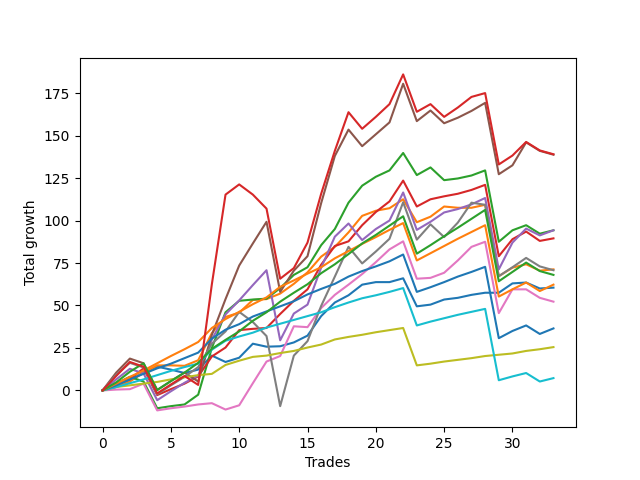

# Long Pointer 003 DB 
- Symbol: ES_SmolBoi
- Date Range: 03/18/2022 - 07/29/2022
- Trading Period: 7:20-12:30
- Number of Trades: 34



| Name | Win Percent | Profit | Avg Profit / Trade | Avg Time / Trade |      | Name | Win Percent | Profit | Avg Profit / Trade | Avg Time / Trade |
| ---- | ----------- | ------ | ------------------ | ---------------- | ---- | ---- | ----------- | ------ | ------------------ | ---------------- |
| Sorted By <br> Profit | | | | | | Sorted By <br> Win Percentage ||||
| Two | 79.41 | 68000.00 | 2000.00 | 17:01 |     | Eighty-One | 97.06 | 17750.00 | 522.06 | 03:26 |
| Eighty-Five | 85.29 | 55250.00 | 1625.00 | 13:04 |     | Eighty-Four | 91.18 | 48125.00 | 1415.44 | 10:25 |
| Eighty-Four | 91.18 | 48125.00 | 1415.44 | 10:25 |     | Eighty-Three | 91.18 | 35625.00 | 1047.79 | 08:41 |
| Eighty-Three | 91.18 | 35625.00 | 1047.79 | 08:41 |     | Eighty-Two | 91.18 | 20625.00 | 606.62 | 06:31 |
| Eighty-Two | 91.18 | 20625.00 | 606.62 | 06:31 |     | Eighty-Five | 85.29 | 55250.00 | 1625.00 | 13:04 |
| Eighty-One | 97.06 | 17750.00 | 522.06 | 03:26 |     | Two | 79.41 | 68000.00 | 2000.00 | 17:01 |

## NO STOPLOSS

### Test Two
* Sell when the price hits the upper line of the 20p 2std bollinger
* No Stoploss
* Results:
```
Total Trades: 34
Percent Up: 79.41
Percent Down: 20.59
Total Points Moved Up: 136.00
Potential Profit: 68000.00
Total Points Ups: 183.25 Count Ups: 27
Total Points Downs: -47.25 Count Downs: 7
```

<details><summary>Trades</summary>

<code>In: 2022-03-22 09:29:00		Out: 2022-03-22 09:41:50		Total Position Time: 12:50		Total Move Up: 4.00		Total to Date: 4.00</code> <br />
<code>In: 2022-03-22 11:29:00		Out: 2022-03-22 11:53:55		Total Position Time: 24:55		Total Move Up: 4.00		Total to Date: 8.00</code> <br />
<code>In: 2022-03-23 09:15:00		Out: 2022-03-23 09:44:55		Total Position Time: 29:55		Total Move Up: -4.75		Total to Date: 3.25</code> <br />
<code>In: 2022-03-23 09:48:00		Out: 2022-03-23 10:17:55		Total Position Time: 29:55		Total Move Up: -2.75		Total to Date: 0.50</code> <br />
<code>In: 2022-03-25 12:25:00		Out: 2022-03-25 12:41:35		Total Position Time: 16:35		Total Move Up: 1.25		Total to Date: 1.75</code> <br />
<code>In: 2022-03-25 12:26:00		Out: 2022-03-25 12:41:35		Total Position Time: 15:35		Total Move Up: 1.00		Total to Date: 2.75</code> <br />
<code>In: 2022-03-25 12:31:00		Out: 2022-03-25 12:41:35		Total Position Time: 10:35		Total Move Up: 3.75		Total to Date: 6.50</code> <br />
<code>In: 2022-03-31 08:37:00		Out: 2022-03-31 08:41:10		Total Position Time: 04:10		Total Move Up: 5.75		Total to Date: 12.25</code> <br />
<code>In: 2022-05-04 11:36:00		Out: 2022-05-04 11:43:45		Total Position Time: 07:45		Total Move Up: 27.50		Total to Date: 39.75</code> <br />
<code>In: 2022-05-04 11:37:00		Out: 2022-05-04 11:43:45		Total Position Time: 06:45		Total Move Up: 21.00		Total to Date: 60.75</code> <br />
<code>In: 2022-05-06 09:03:00		Out: 2022-05-06 09:03:55		Total Position Time: 00:55		Total Move Up: 6.75		Total to Date: 67.50</code> <br />
<code>In: 2022-05-06 11:11:00		Out: 2022-05-06 11:40:55		Total Position Time: 29:55		Total Move Up: -2.00		Total to Date: 65.50</code> <br />
<code>In: 2022-05-06 11:28:00		Out: 2022-05-06 11:49:10		Total Position Time: 21:10		Total Move Up: 0.50		Total to Date: 66.00</code> <br />
<code>In: 2022-05-11 09:14:00		Out: 2022-05-11 09:23:35		Total Position Time: 09:35		Total Move Up: 6.25		Total to Date: 72.25</code> <br />
<code>In: 2022-05-13 11:07:00		Out: 2022-05-13 11:31:20		Total Position Time: 24:20		Total Move Up: 7.75		Total to Date: 80.00</code> <br />
<code>In: 2022-05-16 09:47:00		Out: 2022-05-16 10:06:30		Total Position Time: 19:30		Total Move Up: 4.50		Total to Date: 84.50</code> <br />
<code>In: 2022-05-17 11:24:00		Out: 2022-05-17 11:40:00		Total Position Time: 16:00		Total Move Up: 13.00		Total to Date: 97.50</code> <br />
<code>In: 2022-05-17 11:25:00		Out: 2022-05-17 11:40:00		Total Position Time: 15:00		Total Move Up: 9.50		Total to Date: 107.00</code> <br />
<code>In: 2022-05-19 10:52:00		Out: 2022-05-19 10:55:15		Total Position Time: 03:15		Total Move Up: 15.50		Total to Date: 122.50</code> <br />
<code>In: 2022-05-25 08:40:00		Out: 2022-05-25 09:02:20		Total Position Time: 22:20		Total Move Up: 10.00		Total to Date: 132.50</code> <br />
<code>In: 2022-05-25 09:29:00		Out: 2022-05-25 09:45:20		Total Position Time: 16:20		Total Move Up: 5.25		Total to Date: 137.75</code> <br />
<code>In: 2022-05-25 09:30:00		Out: 2022-05-25 09:45:20		Total Position Time: 15:20		Total Move Up: 3.75		Total to Date: 141.50</code> <br />
<code>In: 2022-05-31 12:05:00		Out: 2022-05-31 12:15:05		Total Position Time: 10:05		Total Move Up: 10.25		Total to Date: 151.75</code> <br />
<code>In: 2022-06-08 09:30:00		Out: 2022-06-08 09:59:10		Total Position Time: 29:10		Total Move Up: -13.00		Total to Date: 138.75</code> <br />
<code>In: 2022-06-21 11:06:00		Out: 2022-06-21 11:10:45		Total Position Time: 04:45		Total Move Up: 4.50		Total to Date: 143.25</code> <br />
<code>In: 2022-06-27 10:10:00		Out: 2022-06-27 10:39:55		Total Position Time: 29:55		Total Move Up: -1.00		Total to Date: 142.25</code> <br />
<code>In: 2022-07-08 09:45:00		Out: 2022-07-08 10:10:30		Total Position Time: 25:30		Total Move Up: 1.00		Total to Date: 143.25</code> <br />
<code>In: 2022-07-08 09:48:00		Out: 2022-07-08 10:10:30		Total Position Time: 22:30		Total Move Up: 1.75		Total to Date: 145.00</code> <br />
<code>In: 2022-07-12 10:28:00		Out: 2022-07-12 10:31:30		Total Position Time: 03:30		Total Move Up: 3.00		Total to Date: 148.00</code> <br />
<code>In: 2022-07-12 11:36:00		Out: 2022-07-12 12:05:55		Total Position Time: 29:55		Total Move Up: -20.50		Total to Date: 127.50</code> <br />
<code>In: 2022-07-20 10:14:00		Out: 2022-07-20 10:28:15		Total Position Time: 14:15		Total Move Up: 6.75		Total to Date: 134.25</code> <br />
<code>In: 2022-07-25 09:18:00		Out: 2022-07-25 09:32:05		Total Position Time: 14:05		Total Move Up: 3.00		Total to Date: 137.25</code> <br />
<code>In: 2022-07-25 10:44:00		Out: 2022-07-25 11:13:55		Total Position Time: 29:55		Total Move Up: -3.25		Total to Date: 134.00</code> <br />
<code>In: 2022-07-25 11:23:00		Out: 2022-07-25 11:35:45		Total Position Time: 12:45		Total Move Up: 2.00		Total to Date: 136.00</code> <br />


</details>

## TAKE PROFIT

### Test Eighty-One
* Take Profit of 1 Point
* No Stoploss
* Results:
```
Total Trades: 34
Percent Up: 97.06
Percent Down: 2.94
Total Points Moved Up: 35.50
Potential Profit: 17750.00
Total Points Ups: 48.75 Count Ups: 33
Total Points Downs: -13.25 Count Downs: 1
```

<details><summary>Trades</summary>

<code>In: 2022-03-22 09:29:00		Out: 2022-03-22 09:35:05		Total Position Time: 06:05		Total Move Up: 2.00		Total to Date: 2.00</code> <br />
<code>In: 2022-03-22 11:29:00		Out: 2022-03-22 11:29:25		Total Position Time: 00:25		Total Move Up: 1.00		Total to Date: 3.00</code> <br />
<code>In: 2022-03-23 09:15:00		Out: 2022-03-23 09:15:15		Total Position Time: 00:15		Total Move Up: 1.00		Total to Date: 4.00</code> <br />
<code>In: 2022-03-23 09:48:00		Out: 2022-03-23 09:48:20		Total Position Time: 00:20		Total Move Up: 1.00		Total to Date: 5.00</code> <br />
<code>In: 2022-03-25 12:25:00		Out: 2022-03-25 12:41:30		Total Position Time: 16:30		Total Move Up: 1.50		Total to Date: 6.50</code> <br />
<code>In: 2022-03-25 12:26:00		Out: 2022-03-25 12:41:30		Total Position Time: 15:30		Total Move Up: 1.25		Total to Date: 7.75</code> <br />
<code>In: 2022-03-25 12:31:00		Out: 2022-03-25 12:37:10		Total Position Time: 06:10		Total Move Up: 1.25		Total to Date: 9.00</code> <br />
<code>In: 2022-03-31 08:37:00		Out: 2022-03-31 08:37:40		Total Position Time: 00:40		Total Move Up: 1.25		Total to Date: 10.25</code> <br />
<code>In: 2022-05-04 11:36:00		Out: 2022-05-04 11:36:10		Total Position Time: 00:10		Total Move Up: 0.75		Total to Date: 11.00</code> <br />
<code>In: 2022-05-04 11:37:00		Out: 2022-05-04 11:41:15		Total Position Time: 04:15		Total Move Up: 5.25		Total to Date: 16.25</code> <br />
<code>In: 2022-05-06 09:03:00		Out: 2022-05-06 09:03:10		Total Position Time: 00:10		Total Move Up: 2.50		Total to Date: 18.75</code> <br />
<code>In: 2022-05-06 11:11:00		Out: 2022-05-06 11:11:40		Total Position Time: 00:40		Total Move Up: 2.25		Total to Date: 21.00</code> <br />
<code>In: 2022-05-06 11:28:00		Out: 2022-05-06 11:30:35		Total Position Time: 02:35		Total Move Up: 0.75		Total to Date: 21.75</code> <br />
<code>In: 2022-05-11 09:14:00		Out: 2022-05-11 09:14:25		Total Position Time: 00:25		Total Move Up: 1.50		Total to Date: 23.25</code> <br />
<code>In: 2022-05-13 11:07:00		Out: 2022-05-13 11:09:25		Total Position Time: 02:25		Total Move Up: 1.25		Total to Date: 24.50</code> <br />
<code>In: 2022-05-16 09:47:00		Out: 2022-05-16 09:47:50		Total Position Time: 00:50		Total Move Up: 2.00		Total to Date: 26.50</code> <br />
<code>In: 2022-05-17 11:24:00		Out: 2022-05-17 11:24:25		Total Position Time: 00:25		Total Move Up: 1.75		Total to Date: 28.25</code> <br />
<code>In: 2022-05-17 11:25:00		Out: 2022-05-17 11:26:40		Total Position Time: 01:40		Total Move Up: 3.00		Total to Date: 31.25</code> <br />
<code>In: 2022-05-19 10:52:00		Out: 2022-05-19 10:52:20		Total Position Time: 00:20		Total Move Up: 1.50		Total to Date: 32.75</code> <br />
<code>In: 2022-05-25 08:40:00		Out: 2022-05-25 08:40:50		Total Position Time: 00:50		Total Move Up: 1.25		Total to Date: 34.00</code> <br />
<code>In: 2022-05-25 09:29:00		Out: 2022-05-25 09:30:00		Total Position Time: 01:00		Total Move Up: 1.50		Total to Date: 35.50</code> <br />
<code>In: 2022-05-25 09:30:00		Out: 2022-05-25 09:30:15		Total Position Time: 00:15		Total Move Up: 1.25		Total to Date: 36.75</code> <br />
<code>In: 2022-05-31 12:05:00		Out: 2022-05-31 12:07:05		Total Position Time: 02:05		Total Move Up: 1.25		Total to Date: 38.00</code> <br />
<code>In: 2022-06-08 09:30:00		Out: 2022-06-08 09:59:55		Total Position Time: 29:55		Total Move Up: -13.25		Total to Date: 24.75</code> <br />
<code>In: 2022-06-21 11:06:00		Out: 2022-06-21 11:07:45		Total Position Time: 01:45		Total Move Up: 1.00		Total to Date: 25.75</code> <br />
<code>In: 2022-06-27 10:10:00		Out: 2022-06-27 10:10:25		Total Position Time: 00:25		Total Move Up: 1.25		Total to Date: 27.00</code> <br />
<code>In: 2022-07-08 09:45:00		Out: 2022-07-08 09:48:40		Total Position Time: 03:40		Total Move Up: 1.00		Total to Date: 28.00</code> <br />
<code>In: 2022-07-08 09:48:00		Out: 2022-07-08 09:48:20		Total Position Time: 00:20		Total Move Up: 1.00		Total to Date: 29.00</code> <br />
<code>In: 2022-07-12 10:28:00		Out: 2022-07-12 10:28:50		Total Position Time: 00:50		Total Move Up: 1.25		Total to Date: 30.25</code> <br />
<code>In: 2022-07-12 11:36:00		Out: 2022-07-12 11:36:30		Total Position Time: 00:30		Total Move Up: 0.75		Total to Date: 31.00</code> <br />
<code>In: 2022-07-20 10:14:00		Out: 2022-07-20 10:14:40		Total Position Time: 00:40		Total Move Up: 0.75		Total to Date: 31.75</code> <br />
<code>In: 2022-07-25 09:18:00		Out: 2022-07-25 09:28:20		Total Position Time: 10:20		Total Move Up: 1.50		Total to Date: 33.25</code> <br />
<code>In: 2022-07-25 10:44:00		Out: 2022-07-25 10:47:45		Total Position Time: 03:45		Total Move Up: 1.00		Total to Date: 34.25</code> <br />
<code>In: 2022-07-25 11:23:00		Out: 2022-07-25 11:23:40		Total Position Time: 00:40		Total Move Up: 1.25		Total to Date: 35.50</code> <br />


</details>

### Test Eighty-Two
* Take Profit of 2 Point
* No Stoploss
* Results:
```
Total Trades: 34
Percent Up: 91.18
Percent Down: 8.82
Total Points Moved Up: 41.25
Potential Profit: 20625.00
Total Points Ups: 78.25 Count Ups: 31
Total Points Downs: -37.00 Count Downs: 3
```

<details><summary>Trades</summary>

<code>In: 2022-03-22 09:29:00		Out: 2022-03-22 09:35:05		Total Position Time: 06:05		Total Move Up: 2.00		Total to Date: 2.00</code> <br />
<code>In: 2022-03-22 11:29:00		Out: 2022-03-22 11:32:50		Total Position Time: 03:50		Total Move Up: 2.25		Total to Date: 4.25</code> <br />
<code>In: 2022-03-23 09:15:00		Out: 2022-03-23 09:15:45		Total Position Time: 00:45		Total Move Up: 2.25		Total to Date: 6.50</code> <br />
<code>In: 2022-03-23 09:48:00		Out: 2022-03-23 09:52:30		Total Position Time: 04:30		Total Move Up: 2.50		Total to Date: 9.00</code> <br />
<code>In: 2022-03-25 12:25:00		Out: 2022-03-25 12:41:55		Total Position Time: 16:55		Total Move Up: 2.50		Total to Date: 11.50</code> <br />
<code>In: 2022-03-25 12:26:00		Out: 2022-03-25 12:41:55		Total Position Time: 15:55		Total Move Up: 2.25		Total to Date: 13.75</code> <br />
<code>In: 2022-03-25 12:31:00		Out: 2022-03-25 12:37:15		Total Position Time: 06:15		Total Move Up: 2.00		Total to Date: 15.75</code> <br />
<code>In: 2022-03-31 08:37:00		Out: 2022-03-31 08:38:15		Total Position Time: 01:15		Total Move Up: 2.00		Total to Date: 17.75</code> <br />
<code>In: 2022-05-04 11:36:00		Out: 2022-05-04 11:36:40		Total Position Time: 00:40		Total Move Up: 8.25		Total to Date: 26.00</code> <br />
<code>In: 2022-05-04 11:37:00		Out: 2022-05-04 11:41:15		Total Position Time: 04:15		Total Move Up: 5.25		Total to Date: 31.25</code> <br />
<code>In: 2022-05-06 09:03:00		Out: 2022-05-06 09:03:10		Total Position Time: 00:10		Total Move Up: 2.50		Total to Date: 33.75</code> <br />
<code>In: 2022-05-06 11:11:00		Out: 2022-05-06 11:11:40		Total Position Time: 00:40		Total Move Up: 2.25		Total to Date: 36.00</code> <br />
<code>In: 2022-05-06 11:28:00		Out: 2022-05-06 11:49:25		Total Position Time: 21:25		Total Move Up: 3.00		Total to Date: 39.00</code> <br />
<code>In: 2022-05-11 09:14:00		Out: 2022-05-11 09:14:30		Total Position Time: 00:30		Total Move Up: 2.25		Total to Date: 41.25</code> <br />
<code>In: 2022-05-13 11:07:00		Out: 2022-05-13 11:09:30		Total Position Time: 02:30		Total Move Up: 2.25		Total to Date: 43.50</code> <br />
<code>In: 2022-05-16 09:47:00		Out: 2022-05-16 09:47:55		Total Position Time: 00:55		Total Move Up: 2.25		Total to Date: 45.75</code> <br />
<code>In: 2022-05-17 11:24:00		Out: 2022-05-17 11:24:35		Total Position Time: 00:35		Total Move Up: 2.25		Total to Date: 48.00</code> <br />
<code>In: 2022-05-17 11:25:00		Out: 2022-05-17 11:26:40		Total Position Time: 01:40		Total Move Up: 3.00		Total to Date: 51.00</code> <br />
<code>In: 2022-05-19 10:52:00		Out: 2022-05-19 10:52:40		Total Position Time: 00:40		Total Move Up: 2.75		Total to Date: 53.75</code> <br />
<code>In: 2022-05-25 08:40:00		Out: 2022-05-25 08:40:55		Total Position Time: 00:55		Total Move Up: 2.50		Total to Date: 56.25</code> <br />
<code>In: 2022-05-25 09:29:00		Out: 2022-05-25 09:30:05		Total Position Time: 01:05		Total Move Up: 1.75		Total to Date: 58.00</code> <br />
<code>In: 2022-05-25 09:30:00		Out: 2022-05-25 09:30:25		Total Position Time: 00:25		Total Move Up: 2.00		Total to Date: 60.00</code> <br />
<code>In: 2022-05-31 12:05:00		Out: 2022-05-31 12:07:20		Total Position Time: 02:20		Total Move Up: 2.25		Total to Date: 62.25</code> <br />
<code>In: 2022-06-08 09:30:00		Out: 2022-06-08 09:59:55		Total Position Time: 29:55		Total Move Up: -13.25		Total to Date: 49.00</code> <br />
<code>In: 2022-06-21 11:06:00		Out: 2022-06-21 11:08:15		Total Position Time: 02:15		Total Move Up: 2.25		Total to Date: 51.25</code> <br />
<code>In: 2022-06-27 10:10:00		Out: 2022-06-27 10:11:10		Total Position Time: 01:10		Total Move Up: 2.00		Total to Date: 53.25</code> <br />
<code>In: 2022-07-08 09:45:00		Out: 2022-07-08 09:49:45		Total Position Time: 04:45		Total Move Up: 2.00		Total to Date: 55.25</code> <br />
<code>In: 2022-07-08 09:48:00		Out: 2022-07-08 09:49:00		Total Position Time: 01:00		Total Move Up: 1.75		Total to Date: 57.00</code> <br />
<code>In: 2022-07-12 10:28:00		Out: 2022-07-12 10:30:05		Total Position Time: 02:05		Total Move Up: 1.75		Total to Date: 58.75</code> <br />
<code>In: 2022-07-12 11:36:00		Out: 2022-07-12 12:05:55		Total Position Time: 29:55		Total Move Up: -20.50		Total to Date: 38.25</code> <br />
<code>In: 2022-07-20 10:14:00		Out: 2022-07-20 10:15:30		Total Position Time: 01:30		Total Move Up: 2.25		Total to Date: 40.50</code> <br />
<code>In: 2022-07-25 09:18:00		Out: 2022-07-25 09:30:10		Total Position Time: 12:10		Total Move Up: 2.00		Total to Date: 42.50</code> <br />
<code>In: 2022-07-25 10:44:00		Out: 2022-07-25 11:13:55		Total Position Time: 29:55		Total Move Up: -3.25		Total to Date: 39.25</code> <br />
<code>In: 2022-07-25 11:23:00		Out: 2022-07-25 11:35:45		Total Position Time: 12:45		Total Move Up: 2.00		Total to Date: 41.25</code> <br />


</details>

### Test Eighty-Three
* Take Profit of 3 Point
* No Stoploss
* Results:
```
Total Trades: 34
Percent Up: 91.18
Percent Down: 8.82
Total Points Moved Up: 71.25
Potential Profit: 35625.00
Total Points Ups: 108.25 Count Ups: 31
Total Points Downs: -37.00 Count Downs: 3
```

<details><summary>Trades</summary>

<code>In: 2022-03-22 09:29:00		Out: 2022-03-22 09:35:15		Total Position Time: 06:15		Total Move Up: 3.00		Total to Date: 3.00</code> <br />
<code>In: 2022-03-22 11:29:00		Out: 2022-03-22 11:34:50		Total Position Time: 05:50		Total Move Up: 3.50		Total to Date: 6.50</code> <br />
<code>In: 2022-03-23 09:15:00		Out: 2022-03-23 09:16:05		Total Position Time: 01:05		Total Move Up: 3.25		Total to Date: 9.75</code> <br />
<code>In: 2022-03-23 09:48:00		Out: 2022-03-23 09:52:50		Total Position Time: 04:50		Total Move Up: 3.25		Total to Date: 13.00</code> <br />
<code>In: 2022-03-25 12:25:00		Out: 2022-03-25 12:42:00		Total Position Time: 17:00		Total Move Up: 2.75		Total to Date: 15.75</code> <br />
<code>In: 2022-03-25 12:26:00		Out: 2022-03-25 12:42:05		Total Position Time: 16:05		Total Move Up: 3.25		Total to Date: 19.00</code> <br />
<code>In: 2022-03-25 12:31:00		Out: 2022-03-25 12:41:20		Total Position Time: 10:20		Total Move Up: 2.75		Total to Date: 21.75</code> <br />
<code>In: 2022-03-31 08:37:00		Out: 2022-03-31 08:40:35		Total Position Time: 03:35		Total Move Up: 3.25		Total to Date: 25.00</code> <br />
<code>In: 2022-05-04 11:36:00		Out: 2022-05-04 11:36:40		Total Position Time: 00:40		Total Move Up: 8.25		Total to Date: 33.25</code> <br />
<code>In: 2022-05-04 11:37:00		Out: 2022-05-04 11:41:15		Total Position Time: 04:15		Total Move Up: 5.25		Total to Date: 38.50</code> <br />
<code>In: 2022-05-06 09:03:00		Out: 2022-05-06 09:03:40		Total Position Time: 00:40		Total Move Up: 3.25		Total to Date: 41.75</code> <br />
<code>In: 2022-05-06 11:11:00		Out: 2022-05-06 11:12:00		Total Position Time: 01:00		Total Move Up: 4.50		Total to Date: 46.25</code> <br />
<code>In: 2022-05-06 11:28:00		Out: 2022-05-06 11:49:25		Total Position Time: 21:25		Total Move Up: 3.00		Total to Date: 49.25</code> <br />
<code>In: 2022-05-11 09:14:00		Out: 2022-05-11 09:22:05		Total Position Time: 08:05		Total Move Up: 3.00		Total to Date: 52.25</code> <br />
<code>In: 2022-05-13 11:07:00		Out: 2022-05-13 11:09:35		Total Position Time: 02:35		Total Move Up: 3.00		Total to Date: 55.25</code> <br />
<code>In: 2022-05-16 09:47:00		Out: 2022-05-16 09:48:15		Total Position Time: 01:15		Total Move Up: 4.00		Total to Date: 59.25</code> <br />
<code>In: 2022-05-17 11:24:00		Out: 2022-05-17 11:24:40		Total Position Time: 00:40		Total Move Up: 3.25		Total to Date: 62.50</code> <br />
<code>In: 2022-05-17 11:25:00		Out: 2022-05-17 11:26:40		Total Position Time: 01:40		Total Move Up: 3.00		Total to Date: 65.50</code> <br />
<code>In: 2022-05-19 10:52:00		Out: 2022-05-19 10:52:45		Total Position Time: 00:45		Total Move Up: 4.25		Total to Date: 69.75</code> <br />
<code>In: 2022-05-25 08:40:00		Out: 2022-05-25 08:41:40		Total Position Time: 01:40		Total Move Up: 3.25		Total to Date: 73.00</code> <br />
<code>In: 2022-05-25 09:29:00		Out: 2022-05-25 09:30:15		Total Position Time: 01:15		Total Move Up: 2.75		Total to Date: 75.75</code> <br />
<code>In: 2022-05-25 09:30:00		Out: 2022-05-25 09:31:45		Total Position Time: 01:45		Total Move Up: 3.00		Total to Date: 78.75</code> <br />
<code>In: 2022-05-31 12:05:00		Out: 2022-05-31 12:07:45		Total Position Time: 02:45		Total Move Up: 4.00		Total to Date: 82.75</code> <br />
<code>In: 2022-06-08 09:30:00		Out: 2022-06-08 09:59:55		Total Position Time: 29:55		Total Move Up: -13.25		Total to Date: 69.50</code> <br />
<code>In: 2022-06-21 11:06:00		Out: 2022-06-21 11:08:30		Total Position Time: 02:30		Total Move Up: 2.75		Total to Date: 72.25</code> <br />
<code>In: 2022-06-27 10:10:00		Out: 2022-06-27 10:11:25		Total Position Time: 01:25		Total Move Up: 3.00		Total to Date: 75.25</code> <br />
<code>In: 2022-07-08 09:45:00		Out: 2022-07-08 10:12:25		Total Position Time: 27:25		Total Move Up: 3.25		Total to Date: 78.50</code> <br />
<code>In: 2022-07-08 09:48:00		Out: 2022-07-08 10:11:20		Total Position Time: 23:20		Total Move Up: 2.75		Total to Date: 81.25</code> <br />
<code>In: 2022-07-12 10:28:00		Out: 2022-07-12 10:31:15		Total Position Time: 03:15		Total Move Up: 3.00		Total to Date: 84.25</code> <br />
<code>In: 2022-07-12 11:36:00		Out: 2022-07-12 12:05:55		Total Position Time: 29:55		Total Move Up: -20.50		Total to Date: 63.75</code> <br />
<code>In: 2022-07-20 10:14:00		Out: 2022-07-20 10:19:20		Total Position Time: 05:20		Total Move Up: 4.25		Total to Date: 68.00</code> <br />
<code>In: 2022-07-25 09:18:00		Out: 2022-07-25 09:32:00		Total Position Time: 14:00		Total Move Up: 3.25		Total to Date: 71.25</code> <br />
<code>In: 2022-07-25 10:44:00		Out: 2022-07-25 11:13:55		Total Position Time: 29:55		Total Move Up: -3.25		Total to Date: 68.00</code> <br />
<code>In: 2022-07-25 11:23:00		Out: 2022-07-25 11:35:50		Total Position Time: 12:50		Total Move Up: 3.25		Total to Date: 71.25</code> <br />


</details>

### Test Eighty-Four
* Take Profit of 4 Point
* No Stoploss
* Results:
```
Total Trades: 34
Percent Up: 91.18
Percent Down: 8.82
Total Points Moved Up: 96.25
Potential Profit: 48125.00
Total Points Ups: 133.25 Count Ups: 31
Total Points Downs: -37.00 Count Downs: 3
```

<details><summary>Trades</summary>

<code>In: 2022-03-22 09:29:00		Out: 2022-03-22 09:41:50		Total Position Time: 12:50		Total Move Up: 4.00		Total to Date: 4.00</code> <br />
<code>In: 2022-03-22 11:29:00		Out: 2022-03-22 11:34:55		Total Position Time: 05:55		Total Move Up: 4.00		Total to Date: 8.00</code> <br />
<code>In: 2022-03-23 09:15:00		Out: 2022-03-23 09:16:10		Total Position Time: 01:10		Total Move Up: 3.75		Total to Date: 11.75</code> <br />
<code>In: 2022-03-23 09:48:00		Out: 2022-03-23 09:59:10		Total Position Time: 11:10		Total Move Up: 4.25		Total to Date: 16.00</code> <br />
<code>In: 2022-03-25 12:25:00		Out: 2022-03-25 12:42:40		Total Position Time: 17:40		Total Move Up: 4.25		Total to Date: 20.25</code> <br />
<code>In: 2022-03-25 12:26:00		Out: 2022-03-25 12:42:40		Total Position Time: 16:40		Total Move Up: 4.00		Total to Date: 24.25</code> <br />
<code>In: 2022-03-25 12:31:00		Out: 2022-03-25 12:41:40		Total Position Time: 10:40		Total Move Up: 4.00		Total to Date: 28.25</code> <br />
<code>In: 2022-03-31 08:37:00		Out: 2022-03-31 08:41:05		Total Position Time: 04:05		Total Move Up: 4.25		Total to Date: 32.50</code> <br />
<code>In: 2022-05-04 11:36:00		Out: 2022-05-04 11:36:40		Total Position Time: 00:40		Total Move Up: 8.25		Total to Date: 40.75</code> <br />
<code>In: 2022-05-04 11:37:00		Out: 2022-05-04 11:41:15		Total Position Time: 04:15		Total Move Up: 5.25		Total to Date: 46.00</code> <br />
<code>In: 2022-05-06 09:03:00		Out: 2022-05-06 09:03:45		Total Position Time: 00:45		Total Move Up: 4.25		Total to Date: 50.25</code> <br />
<code>In: 2022-05-06 11:11:00		Out: 2022-05-06 11:12:00		Total Position Time: 01:00		Total Move Up: 4.50		Total to Date: 54.75</code> <br />
<code>In: 2022-05-06 11:28:00		Out: 2022-05-06 11:49:30		Total Position Time: 21:30		Total Move Up: 4.00		Total to Date: 58.75</code> <br />
<code>In: 2022-05-11 09:14:00		Out: 2022-05-11 09:23:15		Total Position Time: 09:15		Total Move Up: 6.25		Total to Date: 65.00</code> <br />
<code>In: 2022-05-13 11:07:00		Out: 2022-05-13 11:10:20		Total Position Time: 03:20		Total Move Up: 3.75		Total to Date: 68.75</code> <br />
<code>In: 2022-05-16 09:47:00		Out: 2022-05-16 09:48:15		Total Position Time: 01:15		Total Move Up: 4.00		Total to Date: 72.75</code> <br />
<code>In: 2022-05-17 11:24:00		Out: 2022-05-17 11:24:50		Total Position Time: 00:50		Total Move Up: 3.75		Total to Date: 76.50</code> <br />
<code>In: 2022-05-17 11:25:00		Out: 2022-05-17 11:27:05		Total Position Time: 02:05		Total Move Up: 5.25		Total to Date: 81.75</code> <br />
<code>In: 2022-05-19 10:52:00		Out: 2022-05-19 10:52:45		Total Position Time: 00:45		Total Move Up: 4.25		Total to Date: 86.00</code> <br />
<code>In: 2022-05-25 08:40:00		Out: 2022-05-25 08:44:00		Total Position Time: 04:00		Total Move Up: 4.25		Total to Date: 90.25</code> <br />
<code>In: 2022-05-25 09:29:00		Out: 2022-05-25 09:30:30		Total Position Time: 01:30		Total Move Up: 4.00		Total to Date: 94.25</code> <br />
<code>In: 2022-05-25 09:30:00		Out: 2022-05-25 09:48:10		Total Position Time: 18:10		Total Move Up: 4.25		Total to Date: 98.50</code> <br />
<code>In: 2022-05-31 12:05:00		Out: 2022-05-31 12:07:45		Total Position Time: 02:45		Total Move Up: 4.00		Total to Date: 102.50</code> <br />
<code>In: 2022-06-08 09:30:00		Out: 2022-06-08 09:59:55		Total Position Time: 29:55		Total Move Up: -13.25		Total to Date: 89.25</code> <br />
<code>In: 2022-06-21 11:06:00		Out: 2022-06-21 11:10:20		Total Position Time: 04:20		Total Move Up: 4.25		Total to Date: 93.50</code> <br />
<code>In: 2022-06-27 10:10:00		Out: 2022-06-27 10:12:00		Total Position Time: 02:00		Total Move Up: 4.25		Total to Date: 97.75</code> <br />
<code>In: 2022-07-08 09:45:00		Out: 2022-07-08 10:14:55		Total Position Time: 29:55		Total Move Up: 2.25		Total to Date: 100.00</code> <br />
<code>In: 2022-07-08 09:48:00		Out: 2022-07-08 10:12:25		Total Position Time: 24:25		Total Move Up: 4.00		Total to Date: 104.00</code> <br />
<code>In: 2022-07-12 10:28:00		Out: 2022-07-12 10:41:40		Total Position Time: 13:40		Total Move Up: 4.00		Total to Date: 108.00</code> <br />
<code>In: 2022-07-12 11:36:00		Out: 2022-07-12 12:05:55		Total Position Time: 29:55		Total Move Up: -20.50		Total to Date: 87.50</code> <br />
<code>In: 2022-07-20 10:14:00		Out: 2022-07-20 10:19:20		Total Position Time: 05:20		Total Move Up: 4.25		Total to Date: 91.75</code> <br />
<code>In: 2022-07-25 09:18:00		Out: 2022-07-25 09:32:20		Total Position Time: 14:20		Total Move Up: 4.00		Total to Date: 95.75</code> <br />
<code>In: 2022-07-25 10:44:00		Out: 2022-07-25 11:13:55		Total Position Time: 29:55		Total Move Up: -3.25		Total to Date: 92.50</code> <br />
<code>In: 2022-07-25 11:23:00		Out: 2022-07-25 11:41:30		Total Position Time: 18:30		Total Move Up: 3.75		Total to Date: 96.25</code> <br />


</details>

### Test Eighty-Five
* Take Profit of 5 Point
* No Stoploss
* Results:
```
Total Trades: 34
Percent Up: 85.29
Percent Down: 14.71
Total Points Moved Up: 110.50
Potential Profit: 55250.00
Total Points Ups: 154.00 Count Ups: 29
Total Points Downs: -43.50 Count Downs: 5
```

<details><summary>Trades</summary>

<code>In: 2022-03-22 09:29:00		Out: 2022-03-22 09:50:05		Total Position Time: 21:05		Total Move Up: 4.75		Total to Date: 4.75</code> <br />
<code>In: 2022-03-22 11:29:00		Out: 2022-03-22 11:56:05		Total Position Time: 27:05		Total Move Up: 6.25		Total to Date: 11.00</code> <br />
<code>In: 2022-03-23 09:15:00		Out: 2022-03-23 09:18:40		Total Position Time: 03:40		Total Move Up: 5.00		Total to Date: 16.00</code> <br />
<code>In: 2022-03-23 09:48:00		Out: 2022-03-23 10:17:55		Total Position Time: 29:55		Total Move Up: -2.75		Total to Date: 13.25</code> <br />
<code>In: 2022-03-25 12:25:00		Out: 2022-03-25 12:43:05		Total Position Time: 18:05		Total Move Up: 5.25		Total to Date: 18.50</code> <br />
<code>In: 2022-03-25 12:26:00		Out: 2022-03-25 12:43:05		Total Position Time: 17:05		Total Move Up: 5.00		Total to Date: 23.50</code> <br />
<code>In: 2022-03-25 12:31:00		Out: 2022-03-25 12:41:55		Total Position Time: 10:55		Total Move Up: 5.00		Total to Date: 28.50</code> <br />
<code>In: 2022-03-31 08:37:00		Out: 2022-03-31 08:41:10		Total Position Time: 04:10		Total Move Up: 5.75		Total to Date: 34.25</code> <br />
<code>In: 2022-05-04 11:36:00		Out: 2022-05-04 11:36:40		Total Position Time: 00:40		Total Move Up: 8.25		Total to Date: 42.50</code> <br />
<code>In: 2022-05-04 11:37:00		Out: 2022-05-04 11:41:15		Total Position Time: 04:15		Total Move Up: 5.25		Total to Date: 47.75</code> <br />
<code>In: 2022-05-06 09:03:00		Out: 2022-05-06 09:03:50		Total Position Time: 00:50		Total Move Up: 5.00		Total to Date: 52.75</code> <br />
<code>In: 2022-05-06 11:11:00		Out: 2022-05-06 11:12:15		Total Position Time: 01:15		Total Move Up: 6.25		Total to Date: 59.00</code> <br />
<code>In: 2022-05-06 11:28:00		Out: 2022-05-06 11:50:05		Total Position Time: 22:05		Total Move Up: 5.00		Total to Date: 64.00</code> <br />
<code>In: 2022-05-11 09:14:00		Out: 2022-05-11 09:23:15		Total Position Time: 09:15		Total Move Up: 6.25		Total to Date: 70.25</code> <br />
<code>In: 2022-05-13 11:07:00		Out: 2022-05-13 11:10:50		Total Position Time: 03:50		Total Move Up: 5.25		Total to Date: 75.50</code> <br />
<code>In: 2022-05-16 09:47:00		Out: 2022-05-16 09:48:45		Total Position Time: 01:45		Total Move Up: 5.00		Total to Date: 80.50</code> <br />
<code>In: 2022-05-17 11:24:00		Out: 2022-05-17 11:26:40		Total Position Time: 02:40		Total Move Up: 6.50		Total to Date: 87.00</code> <br />
<code>In: 2022-05-17 11:25:00		Out: 2022-05-17 11:27:05		Total Position Time: 02:05		Total Move Up: 5.25		Total to Date: 92.25</code> <br />
<code>In: 2022-05-19 10:52:00		Out: 2022-05-19 10:52:55		Total Position Time: 00:55		Total Move Up: 6.00		Total to Date: 98.25</code> <br />
<code>In: 2022-05-25 08:40:00		Out: 2022-05-25 08:44:05		Total Position Time: 04:05		Total Move Up: 6.25		Total to Date: 104.50</code> <br />
<code>In: 2022-05-25 09:29:00		Out: 2022-05-25 09:32:10		Total Position Time: 03:10		Total Move Up: 5.00		Total to Date: 109.50</code> <br />
<code>In: 2022-05-25 09:30:00		Out: 2022-05-25 09:48:50		Total Position Time: 18:50		Total Move Up: 5.50		Total to Date: 115.00</code> <br />
<code>In: 2022-05-31 12:05:00		Out: 2022-05-31 12:07:55		Total Position Time: 02:55		Total Move Up: 5.50		Total to Date: 120.50</code> <br />
<code>In: 2022-06-08 09:30:00		Out: 2022-06-08 09:59:55		Total Position Time: 29:55		Total Move Up: -13.25		Total to Date: 107.25</code> <br />
<code>In: 2022-06-21 11:06:00		Out: 2022-06-21 11:11:00		Total Position Time: 05:00		Total Move Up: 5.00		Total to Date: 112.25</code> <br />
<code>In: 2022-06-27 10:10:00		Out: 2022-06-27 10:12:55		Total Position Time: 02:55		Total Move Up: 5.25		Total to Date: 117.50</code> <br />
<code>In: 2022-07-08 09:45:00		Out: 2022-07-08 10:14:55		Total Position Time: 29:55		Total Move Up: 2.25		Total to Date: 119.75</code> <br />
<code>In: 2022-07-08 09:48:00		Out: 2022-07-08 10:17:55		Total Position Time: 29:55		Total Move Up: 2.00		Total to Date: 121.75</code> <br />
<code>In: 2022-07-12 10:28:00		Out: 2022-07-12 10:54:15		Total Position Time: 26:15		Total Move Up: 5.25		Total to Date: 127.00</code> <br />
<code>In: 2022-07-12 11:36:00		Out: 2022-07-12 12:05:55		Total Position Time: 29:55		Total Move Up: -20.50		Total to Date: 106.50</code> <br />
<code>In: 2022-07-20 10:14:00		Out: 2022-07-20 10:19:40		Total Position Time: 05:40		Total Move Up: 5.50		Total to Date: 112.00</code> <br />
<code>In: 2022-07-25 09:18:00		Out: 2022-07-25 09:32:45		Total Position Time: 14:45		Total Move Up: 5.50		Total to Date: 117.50</code> <br />
<code>In: 2022-07-25 10:44:00		Out: 2022-07-25 11:13:55		Total Position Time: 29:55		Total Move Up: -3.25		Total to Date: 114.25</code> <br />
<code>In: 2022-07-25 11:23:00		Out: 2022-07-25 11:52:55		Total Position Time: 29:55		Total Move Up: -3.75		Total to Date: 110.50</code> <br />


</details>