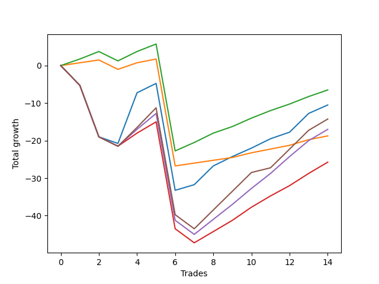

# Long Pointer 004 
- Symbol: ES_SmolBoi
- Date Range: 03/18/2022 - 07/29/2022
- Trading Period: 7:20-12:30
- Number of Trades: 14



| Name | Win Percent | Profit | Avg Profit / Trade | Avg Time / Trade |      | Name | Win Percent | Profit | Avg Profit / Trade | Avg Time / Trade |
| ---- | ----------- | ------ | ------------------ | ---------------- | ---- | ---- | ----------- | ------ | ------------------ | ---------------- |
| Sorted By <br> Profit | | | | | | Sorted By <br> Win Percentage ||||
| Eighty-Two | 85.71 | 1125.00 | 80.36 | 12:38 |     | Eighty-Two | 85.71 | 1125.00 | 80.36 | 12:38 |
| Two | 71.43 | -125.00 | -8.93 | 22:48 |     | Eighty-One | 85.71 | -4250.00 | -303.57 | 09:55 |
| Eighty-Five | 64.29 | -3500.00 | -250.00 | 23:06 |     | Two | 71.43 | -125.00 | -8.93 | 22:48 |
| Eighty-One | 85.71 | -4250.00 | -303.57 | 09:55 |     | Eighty-Five | 64.29 | -3500.00 | -250.00 | 23:06 |
| Eighty-Four | 64.29 | -6000.00 | -428.57 | 22:06 |     | Eighty-Four | 64.29 | -6000.00 | -428.57 | 22:06 |
| Eighty-Three | 64.29 | -10000.00 | -714.29 | 19:55 |     | Eighty-Three | 64.29 | -10000.00 | -714.29 | 19:55 |

## NO STOPLOSS

### Test Two
* Sell when the price hits the upper line of the 20p 2std bollinger
* No Stoploss
* Results:
```
Total Trades: 14
Percent Up: 71.43
Percent Down: 28.57
Total Points Moved Up: -0.25
Potential Profit: -125.00
Total Points Ups: 49.00 Count Ups: 10
Total Points Downs: -49.25 Count Downs: 4
```

<details><summary>Trades</summary>

<code>In: 2022-03-22 11:11:00		Out: 2022-03-22 11:40:55		Total Position Time: 29:55		Total Move Up: -5.25		Total to Date: -5.25</code> <br />
<code>In: 2022-03-28 08:11:00		Out: 2022-03-28 08:40:55		Total Position Time: 29:55		Total Move Up: -13.75		Total to Date: -19.00</code> <br />
<code>In: 2022-04-12 07:47:00		Out: 2022-04-12 08:15:45		Total Position Time: 28:45		Total Move Up: -1.75		Total to Date: -20.75</code> <br />
<code>In: 2022-05-19 10:19:00		Out: 2022-05-19 10:44:05		Total Position Time: 25:05		Total Move Up: 13.50		Total to Date: -7.25</code> <br />
<code>In: 2022-05-26 10:32:00		Out: 2022-05-26 10:46:25		Total Position Time: 14:25		Total Move Up: 2.50		Total to Date: -4.75</code> <br />
<code>In: 2022-05-31 11:31:00		Out: 2022-05-31 12:00:55		Total Position Time: 29:55		Total Move Up: -28.50		Total to Date: -33.25</code> <br />
<code>In: 2022-06-22 11:46:00		Out: 2022-06-22 12:04:10		Total Position Time: 18:10		Total Move Up: 1.50		Total to Date: -31.75</code> <br />
<code>In: 2022-06-22 11:55:00		Out: 2022-06-22 12:04:10		Total Position Time: 09:10		Total Move Up: 5.00		Total to Date: -26.75</code> <br />
<code>In: 2022-07-05 09:53:00		Out: 2022-07-05 10:04:15		Total Position Time: 11:15		Total Move Up: 2.50		Total to Date: -24.25</code> <br />
<code>In: 2022-07-07 08:35:00		Out: 2022-07-07 08:43:45		Total Position Time: 08:45		Total Move Up: 2.25		Total to Date: -22.00</code> <br />
<code>In: 2022-07-15 11:08:00		Out: 2022-07-15 11:43:00		Total Position Time: 35:00		Total Move Up: 4.25		Total to Date: -17.75</code> <br />
<code>In: 2022-07-19 10:25:00		Out: 2022-07-19 10:38:00		Total Position Time: 13:00		Total Move Up: 5.00		Total to Date: -12.75</code> <br />
<code>In: 2022-07-21 10:57:00		Out: 2022-07-21 11:10:00		Total Position Time: 13:00		Total Move Up: 6.00		Total to Date: -6.75</code> <br />
<code>In: 2022-07-28 11:11:00		Out: 2022-07-28 12:04:00		Total Position Time: 53:00		Total Move Up: 6.50		Total to Date: -0.25</code> <br />


</details>

## TAKE PROFIT

### Test Eighty-One
* Take Profit of 1 Point
* No Stoploss
* Results:
```
Total Trades: 14
Percent Up: 85.71
Percent Down: 14.29
Total Points Moved Up: -8.50
Potential Profit: -4250.00
Total Points Ups: 22.50 Count Ups: 12
Total Points Downs: -31.00 Count Downs: 2
```

<details><summary>Trades</summary>

<code>In: 2022-03-22 11:11:00		Out: 2022-03-22 11:11:50		Total Position Time: 00:50		Total Move Up: 0.75		Total to Date: 0.75</code> <br />
<code>In: 2022-03-28 08:11:00		Out: 2022-03-28 08:11:10		Total Position Time: 00:10		Total Move Up: 0.75		Total to Date: 1.50</code> <br />
<code>In: 2022-04-12 07:47:00		Out: 2022-04-12 08:16:55		Total Position Time: 29:55		Total Move Up: -2.50		Total to Date: -1.00</code> <br />
<code>In: 2022-05-19 10:19:00		Out: 2022-05-19 10:19:20		Total Position Time: 00:20		Total Move Up: 1.75		Total to Date: 0.75</code> <br />
<code>In: 2022-05-26 10:32:00		Out: 2022-05-26 10:33:15		Total Position Time: 01:15		Total Move Up: 1.00		Total to Date: 1.75</code> <br />
<code>In: 2022-05-31 11:31:00		Out: 2022-05-31 12:00:55		Total Position Time: 29:55		Total Move Up: -28.50		Total to Date: -26.75</code> <br />
<code>In: 2022-06-22 11:46:00		Out: 2022-06-22 11:56:25		Total Position Time: 10:25		Total Move Up: 0.75		Total to Date: -26.00</code> <br />
<code>In: 2022-06-22 11:55:00		Out: 2022-06-22 11:55:15		Total Position Time: 00:15		Total Move Up: 0.75		Total to Date: -25.25</code> <br />
<code>In: 2022-07-05 09:53:00		Out: 2022-07-05 10:01:45		Total Position Time: 08:45		Total Move Up: 0.75		Total to Date: -24.50</code> <br />
<code>In: 2022-07-07 08:35:00		Out: 2022-07-07 08:39:05		Total Position Time: 04:05		Total Move Up: 1.25		Total to Date: -23.25</code> <br />
<code>In: 2022-07-15 11:08:00		Out: 2022-07-15 11:21:00		Total Position Time: 13:00		Total Move Up: 2.75		Total to Date: -20.50</code> <br />
<code>In: 2022-07-19 10:25:00		Out: 2022-07-19 10:38:00		Total Position Time: 13:00		Total Move Up: 5.00		Total to Date: -15.50</code> <br />
<code>In: 2022-07-21 10:57:00		Out: 2022-07-21 11:10:00		Total Position Time: 13:00		Total Move Up: 6.00		Total to Date: -9.50</code> <br />
<code>In: 2022-07-28 11:11:00		Out: 2022-07-28 11:25:00		Total Position Time: 14:00		Total Move Up: 1.00		Total to Date: -8.50</code> <br />


</details>

### Test Eighty-Two
* Take Profit of 2 Point
* No Stoploss
* Results:
```
Total Trades: 14
Percent Up: 85.71
Percent Down: 14.29
Total Points Moved Up: 2.25
Potential Profit: 1125.00
Total Points Ups: 33.25 Count Ups: 12
Total Points Downs: -31.00 Count Downs: 2
```

<details><summary>Trades</summary>

<code>In: 2022-03-22 11:11:00		Out: 2022-03-22 11:18:30		Total Position Time: 07:30		Total Move Up: 1.75		Total to Date: 1.75</code> <br />
<code>In: 2022-03-28 08:11:00		Out: 2022-03-28 08:11:40		Total Position Time: 00:40		Total Move Up: 2.00		Total to Date: 3.75</code> <br />
<code>In: 2022-04-12 07:47:00		Out: 2022-04-12 08:16:55		Total Position Time: 29:55		Total Move Up: -2.50		Total to Date: 1.25</code> <br />
<code>In: 2022-05-19 10:19:00		Out: 2022-05-19 10:19:30		Total Position Time: 00:30		Total Move Up: 2.50		Total to Date: 3.75</code> <br />
<code>In: 2022-05-26 10:32:00		Out: 2022-05-26 10:34:00		Total Position Time: 02:00		Total Move Up: 2.00		Total to Date: 5.75</code> <br />
<code>In: 2022-05-31 11:31:00		Out: 2022-05-31 12:00:55		Total Position Time: 29:55		Total Move Up: -28.50		Total to Date: -22.75</code> <br />
<code>In: 2022-06-22 11:46:00		Out: 2022-06-22 12:04:20		Total Position Time: 18:20		Total Move Up: 2.25		Total to Date: -20.50</code> <br />
<code>In: 2022-06-22 11:55:00		Out: 2022-06-22 11:56:05		Total Position Time: 01:05		Total Move Up: 2.50		Total to Date: -18.00</code> <br />
<code>In: 2022-07-05 09:53:00		Out: 2022-07-05 10:03:15		Total Position Time: 10:15		Total Move Up: 1.75		Total to Date: -16.25</code> <br />
<code>In: 2022-07-07 08:35:00		Out: 2022-07-07 08:43:45		Total Position Time: 08:45		Total Move Up: 2.25		Total to Date: -14.00</code> <br />
<code>In: 2022-07-15 11:08:00		Out: 2022-07-15 11:21:00		Total Position Time: 13:00		Total Move Up: 2.75		Total to Date: -11.25</code> <br />
<code>In: 2022-07-19 10:25:00		Out: 2022-07-19 10:38:00		Total Position Time: 13:00		Total Move Up: 5.00		Total to Date: -6.25</code> <br />
<code>In: 2022-07-21 10:57:00		Out: 2022-07-21 11:10:00		Total Position Time: 13:00		Total Move Up: 6.00		Total to Date: -0.25</code> <br />
<code>In: 2022-07-28 11:11:00		Out: 2022-07-28 11:40:00		Total Position Time: 29:00		Total Move Up: 2.50		Total to Date: 2.25</code> <br />


</details>

### Test Eighty-Three
* Take Profit of 3 Point
* No Stoploss
* Results:
```
Total Trades: 14
Percent Up: 64.29
Percent Down: 35.71
Total Points Moved Up: -20.00
Potential Profit: -10000.00
Total Points Ups: 33.75 Count Ups: 9
Total Points Downs: -53.75 Count Downs: 5
```

<details><summary>Trades</summary>

<code>In: 2022-03-22 11:11:00		Out: 2022-03-22 11:40:55		Total Position Time: 29:55		Total Move Up: -5.25		Total to Date: -5.25</code> <br />
<code>In: 2022-03-28 08:11:00		Out: 2022-03-28 08:40:55		Total Position Time: 29:55		Total Move Up: -13.75		Total to Date: -19.00</code> <br />
<code>In: 2022-04-12 07:47:00		Out: 2022-04-12 08:16:55		Total Position Time: 29:55		Total Move Up: -2.50		Total to Date: -21.50</code> <br />
<code>In: 2022-05-19 10:19:00		Out: 2022-05-19 10:20:00		Total Position Time: 01:00		Total Move Up: 3.50		Total to Date: -18.00</code> <br />
<code>In: 2022-05-26 10:32:00		Out: 2022-05-26 10:48:40		Total Position Time: 16:40		Total Move Up: 3.00		Total to Date: -15.00</code> <br />
<code>In: 2022-05-31 11:31:00		Out: 2022-05-31 12:00:55		Total Position Time: 29:55		Total Move Up: -28.50		Total to Date: -43.50</code> <br />
<code>In: 2022-06-22 11:46:00		Out: 2022-06-22 12:15:55		Total Position Time: 29:55		Total Move Up: -3.75		Total to Date: -47.25</code> <br />
<code>In: 2022-06-22 11:55:00		Out: 2022-06-22 11:56:10		Total Position Time: 01:10		Total Move Up: 3.00		Total to Date: -44.25</code> <br />
<code>In: 2022-07-05 09:53:00		Out: 2022-07-05 10:04:30		Total Position Time: 11:30		Total Move Up: 3.00		Total to Date: -41.25</code> <br />
<code>In: 2022-07-07 08:35:00		Out: 2022-07-07 08:44:05		Total Position Time: 09:05		Total Move Up: 3.50		Total to Date: -37.75</code> <br />
<code>In: 2022-07-15 11:08:00		Out: 2022-07-15 11:42:00		Total Position Time: 34:00		Total Move Up: 3.50		Total to Date: -34.25</code> <br />
<code>In: 2022-07-19 10:25:00		Out: 2022-07-19 10:38:00		Total Position Time: 13:00		Total Move Up: 5.00		Total to Date: -29.25</code> <br />
<code>In: 2022-07-21 10:57:00		Out: 2022-07-21 11:10:00		Total Position Time: 13:00		Total Move Up: 6.00		Total to Date: -23.25</code> <br />
<code>In: 2022-07-28 11:11:00		Out: 2022-07-28 11:41:00		Total Position Time: 30:00		Total Move Up: 3.25		Total to Date: -20.00</code> <br />


</details>

### Test Eighty-Four
* Take Profit of 4 Point
* No Stoploss
* Results:
```
Total Trades: 14
Percent Up: 64.29
Percent Down: 35.71
Total Points Moved Up: -12.00
Potential Profit: -6000.00
Total Points Ups: 41.75 Count Ups: 9
Total Points Downs: -53.75 Count Downs: 5
```

<details><summary>Trades</summary>

<code>In: 2022-03-22 11:11:00		Out: 2022-03-22 11:40:55		Total Position Time: 29:55		Total Move Up: -5.25		Total to Date: -5.25</code> <br />
<code>In: 2022-03-28 08:11:00		Out: 2022-03-28 08:40:55		Total Position Time: 29:55		Total Move Up: -13.75		Total to Date: -19.00</code> <br />
<code>In: 2022-04-12 07:47:00		Out: 2022-04-12 08:16:55		Total Position Time: 29:55		Total Move Up: -2.50		Total to Date: -21.50</code> <br />
<code>In: 2022-05-19 10:19:00		Out: 2022-05-19 10:21:15		Total Position Time: 02:15		Total Move Up: 4.50		Total to Date: -17.00</code> <br />
<code>In: 2022-05-26 10:32:00		Out: 2022-05-26 10:58:25		Total Position Time: 26:25		Total Move Up: 4.25		Total to Date: -12.75</code> <br />
<code>In: 2022-05-31 11:31:00		Out: 2022-05-31 12:00:55		Total Position Time: 29:55		Total Move Up: -28.50		Total to Date: -41.25</code> <br />
<code>In: 2022-06-22 11:46:00		Out: 2022-06-22 12:15:55		Total Position Time: 29:55		Total Move Up: -3.75		Total to Date: -45.00</code> <br />
<code>In: 2022-06-22 11:55:00		Out: 2022-06-22 11:56:20		Total Position Time: 01:20		Total Move Up: 4.00		Total to Date: -41.00</code> <br />
<code>In: 2022-07-05 09:53:00		Out: 2022-07-05 10:04:45		Total Position Time: 11:45		Total Move Up: 4.00		Total to Date: -37.00</code> <br />
<code>In: 2022-07-07 08:35:00		Out: 2022-07-07 08:48:15		Total Position Time: 13:15		Total Move Up: 4.25		Total to Date: -32.75</code> <br />
<code>In: 2022-07-15 11:08:00		Out: 2022-07-15 11:43:00		Total Position Time: 35:00		Total Move Up: 4.25		Total to Date: -28.50</code> <br />
<code>In: 2022-07-19 10:25:00		Out: 2022-07-19 10:38:00		Total Position Time: 13:00		Total Move Up: 5.00		Total to Date: -23.50</code> <br />
<code>In: 2022-07-21 10:57:00		Out: 2022-07-21 11:10:00		Total Position Time: 13:00		Total Move Up: 6.00		Total to Date: -17.50</code> <br />
<code>In: 2022-07-28 11:11:00		Out: 2022-07-28 11:55:00		Total Position Time: 44:00		Total Move Up: 5.50		Total to Date: -12.00</code> <br />


</details>

### Test Eighty-Five
* Take Profit of 5 Point
* No Stoploss
* Results:
```
Total Trades: 14
Percent Up: 64.29
Percent Down: 35.71
Total Points Moved Up: -7.00
Potential Profit: -3500.00
Total Points Ups: 46.75 Count Ups: 9
Total Points Downs: -53.75 Count Downs: 5
```

<details><summary>Trades</summary>

<code>In: 2022-03-22 11:11:00		Out: 2022-03-22 11:40:55		Total Position Time: 29:55		Total Move Up: -5.25		Total to Date: -5.25</code> <br />
<code>In: 2022-03-28 08:11:00		Out: 2022-03-28 08:40:55		Total Position Time: 29:55		Total Move Up: -13.75		Total to Date: -19.00</code> <br />
<code>In: 2022-04-12 07:47:00		Out: 2022-04-12 08:16:55		Total Position Time: 29:55		Total Move Up: -2.50		Total to Date: -21.50</code> <br />
<code>In: 2022-05-19 10:19:00		Out: 2022-05-19 10:21:35		Total Position Time: 02:35		Total Move Up: 5.00		Total to Date: -16.50</code> <br />
<code>In: 2022-05-26 10:32:00		Out: 2022-05-26 10:59:20		Total Position Time: 27:20		Total Move Up: 5.25		Total to Date: -11.25</code> <br />
<code>In: 2022-05-31 11:31:00		Out: 2022-05-31 12:00:55		Total Position Time: 29:55		Total Move Up: -28.50		Total to Date: -39.75</code> <br />
<code>In: 2022-06-22 11:46:00		Out: 2022-06-22 12:15:55		Total Position Time: 29:55		Total Move Up: -3.75		Total to Date: -43.50</code> <br />
<code>In: 2022-06-22 11:55:00		Out: 2022-06-22 12:04:10		Total Position Time: 09:10		Total Move Up: 5.00		Total to Date: -38.50</code> <br />
<code>In: 2022-07-05 09:53:00		Out: 2022-07-05 10:04:50		Total Position Time: 11:50		Total Move Up: 5.00		Total to Date: -33.50</code> <br />
<code>In: 2022-07-07 08:35:00		Out: 2022-07-07 08:51:00		Total Position Time: 16:00		Total Move Up: 5.00		Total to Date: -28.50</code> <br />
<code>In: 2022-07-15 11:08:00		Out: 2022-07-15 11:45:00		Total Position Time: 37:00		Total Move Up: 5.00		Total to Date: -23.50</code> <br />
<code>In: 2022-07-19 10:25:00		Out: 2022-07-19 10:38:00		Total Position Time: 13:00		Total Move Up: 5.00		Total to Date: -18.50</code> <br />
<code>In: 2022-07-21 10:57:00		Out: 2022-07-21 11:10:00		Total Position Time: 13:00		Total Move Up: 6.00		Total to Date: -12.50</code> <br />
<code>In: 2022-07-28 11:11:00		Out: 2022-07-28 11:55:00		Total Position Time: 44:00		Total Move Up: 5.50		Total to Date: -7.00</code> <br />


</details>