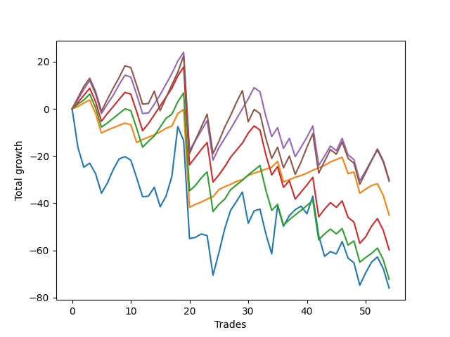

# Long Pointer 006 
- Symbol: ES_SmolBoi
- Date Range: 03/18/2022 - 07/29/2022
- Trading Period: 7:20-12:30
- Number of Trades: 54



| Name | Win Percent | Profit | Avg Profit / Trade | Avg Time / Trade |      | Name | Win Percent | Profit | Avg Profit / Trade | Avg Time / Trade |
| ---- | ----------- | ------ | ------------------ | ---------------- | ---- | ---- | ----------- | ------ | ------------------ | ---------------- |
| Sorted By <br> Profit | | | | | | Sorted By <br> Win Percentage ||||
| Eighty-Five | 61.11 | -15125.00 | -280.09 | 18:51 |     | Eighty-One | 81.48 | -22500.00 | -416.67 | 07:22 |
| Eighty-Four | 64.81 | -15375.00 | -284.72 | 16:27 |     | Eighty-Two | 70.37 | -36125.00 | -668.98 | 12:08 |
| Eighty-One | 81.48 | -22500.00 | -416.67 | 07:22 |     | Eighty-Four | 64.81 | -15375.00 | -284.72 | 16:27 |
| Eighty-Three | 64.81 | -29875.00 | -553.24 | 14:33 |     | Eighty-Three | 64.81 | -29875.00 | -553.24 | 14:33 |
| Eighty-Two | 70.37 | -36125.00 | -668.98 | 12:08 |     | Eighty-Five | 61.11 | -15125.00 | -280.09 | 18:51 |
| Two | 53.70 | -38000.00 | -703.70 | 21:05 |     | Two | 53.70 | -38000.00 | -703.70 | 21:05 |

## NO STOPLOSS

### Test Two
* Sell when the price hits the upper line of the 20p 2std bollinger
* No Stoploss
* Results:
```
Total Trades: 54
Percent Up: 53.70
Percent Down: 46.30
Total Points Moved Up: -76.00
Potential Profit: -38000.00
Total Points Ups: 154.25 Count Ups: 29
Total Points Downs: -230.25 Count Downs: 25
```

<details><summary>Trades</summary>

<code>In: 2022-03-21 09:41:00		Out: 2022-03-21 10:10:55		Total Position Time: 29:55		Total Move Up: -16.50		Total to Date: -16.50</code> <br />
<code>In: 2022-03-23 09:16:00		Out: 2022-03-23 09:45:55		Total Position Time: 29:55		Total Move Up: -8.25		Total to Date: -24.75</code> <br />
<code>In: 2022-03-23 10:33:00		Out: 2022-03-23 10:54:25		Total Position Time: 21:25		Total Move Up: 1.75		Total to Date: -23.00</code> <br />
<code>In: 2022-03-25 08:17:00		Out: 2022-03-25 08:41:45		Total Position Time: 24:45		Total Move Up: -4.50		Total to Date: -27.50</code> <br />
<code>In: 2022-03-30 08:03:00		Out: 2022-03-30 08:32:55		Total Position Time: 29:55		Total Move Up: -8.25		Total to Date: -35.75</code> <br />
<code>In: 2022-03-30 08:15:00		Out: 2022-03-30 08:35:15		Total Position Time: 20:15		Total Move Up: 4.25		Total to Date: -31.50</code> <br />
<code>In: 2022-03-30 12:28:00		Out: 2022-03-30 12:36:20		Total Position Time: 08:20		Total Move Up: 5.75		Total to Date: -25.75</code> <br />
<code>In: 2022-03-31 08:38:00		Out: 2022-03-31 08:41:10		Total Position Time: 03:10		Total Move Up: 4.50		Total to Date: -21.25</code> <br />
<code>In: 2022-03-31 10:19:00		Out: 2022-03-31 10:27:00		Total Position Time: 08:00		Total Move Up: 1.00		Total to Date: -20.25</code> <br />
<code>In: 2022-04-04 09:49:00		Out: 2022-04-04 10:18:10		Total Position Time: 29:10		Total Move Up: -1.50		Total to Date: -21.75</code> <br />
<code>In: 2022-04-08 10:22:00		Out: 2022-04-08 10:51:55		Total Position Time: 29:55		Total Move Up: -7.50		Total to Date: -29.25</code> <br />
<code>In: 2022-04-12 07:34:00		Out: 2022-04-12 08:03:55		Total Position Time: 29:55		Total Move Up: -8.00		Total to Date: -37.25</code> <br />
<code>In: 2022-04-19 09:45:00		Out: 2022-04-19 10:14:55		Total Position Time: 29:55		Total Move Up: 0.25		Total to Date: -37.00</code> <br />
<code>In: 2022-04-19 10:32:00		Out: 2022-04-19 10:49:55		Total Position Time: 17:55		Total Move Up: 3.75		Total to Date: -33.25</code> <br />
<code>In: 2022-04-26 07:24:00		Out: 2022-04-26 07:53:55		Total Position Time: 29:55		Total Move Up: -8.25		Total to Date: -41.50</code> <br />
<code>In: 2022-04-27 11:41:00		Out: 2022-04-27 11:42:40		Total Position Time: 01:40		Total Move Up: 4.50		Total to Date: -37.00</code> <br />
<code>In: 2022-05-03 09:14:00		Out: 2022-05-03 09:28:00		Total Position Time: 14:00		Total Move Up: 8.50		Total to Date: -28.50</code> <br />
<code>In: 2022-05-04 11:37:00		Out: 2022-05-04 11:43:45		Total Position Time: 06:45		Total Move Up: 21.00		Total to Date: -7.50</code> <br />
<code>In: 2022-05-06 11:12:00		Out: 2022-05-06 11:41:55		Total Position Time: 29:55		Total Move Up: -6.00		Total to Date: -13.50</code> <br />
<code>In: 2022-05-10 07:45:00		Out: 2022-05-10 08:14:55		Total Position Time: 29:55		Total Move Up: -41.50		Total to Date: -55.00</code> <br />
<code>In: 2022-05-11 10:51:00		Out: 2022-05-11 11:02:35		Total Position Time: 11:35		Total Move Up: 0.50		Total to Date: -54.50</code> <br />
<code>In: 2022-05-12 11:46:00		Out: 2022-05-12 11:53:00		Total Position Time: 07:00		Total Move Up: 1.50		Total to Date: -53.00</code> <br />
<code>In: 2022-05-13 09:56:00		Out: 2022-05-13 10:25:55		Total Position Time: 29:55		Total Move Up: -0.75		Total to Date: -53.75</code> <br />
<code>In: 2022-05-13 10:50:00		Out: 2022-05-13 11:19:55		Total Position Time: 29:55		Total Move Up: -16.75		Total to Date: -70.50</code> <br />
<code>In: 2022-05-17 11:25:00		Out: 2022-05-17 11:40:00		Total Position Time: 15:00		Total Move Up: 9.50		Total to Date: -61.00</code> <br />
<code>In: 2022-05-23 10:24:00		Out: 2022-05-23 10:33:15		Total Position Time: 09:15		Total Move Up: 10.25		Total to Date: -50.75</code> <br />
<code>In: 2022-05-25 08:41:00		Out: 2022-05-25 09:02:20		Total Position Time: 21:20		Total Move Up: 7.75		Total to Date: -43.00</code> <br />
<code>In: 2022-05-25 09:30:00		Out: 2022-05-25 09:45:20		Total Position Time: 15:20		Total Move Up: 3.75		Total to Date: -39.25</code> <br />
<code>In: 2022-05-26 11:39:00		Out: 2022-05-26 11:54:10		Total Position Time: 15:10		Total Move Up: 4.00		Total to Date: -35.25</code> <br />
<code>In: 2022-06-03 07:46:00		Out: 2022-06-03 08:15:55		Total Position Time: 29:55		Total Move Up: -13.25		Total to Date: -48.50</code> <br />
<code>In: 2022-06-08 09:48:00		Out: 2022-06-08 09:59:10		Total Position Time: 11:10		Total Move Up: 5.25		Total to Date: -43.25</code> <br />
<code>In: 2022-06-09 07:57:00		Out: 2022-06-09 08:22:35		Total Position Time: 25:35		Total Move Up: 0.75		Total to Date: -42.50</code> <br />
<code>In: 2022-06-09 11:28:00		Out: 2022-06-09 11:57:55		Total Position Time: 29:55		Total Move Up: -10.50		Total to Date: -53.00</code> <br />
<code>In: 2022-06-15 07:58:00		Out: 2022-06-15 08:27:55		Total Position Time: 29:55		Total Move Up: -8.50		Total to Date: -61.50</code> <br />
<code>In: 2022-06-16 11:57:00		Out: 2022-06-16 12:10:15		Total Position Time: 13:15		Total Move Up: 20.50		Total to Date: -41.00</code> <br />
<code>In: 2022-06-21 08:43:00		Out: 2022-06-21 09:12:55		Total Position Time: 29:55		Total Move Up: -8.75		Total to Date: -49.75</code> <br />
<code>In: 2022-06-21 11:06:00		Out: 2022-06-21 11:10:45		Total Position Time: 04:45		Total Move Up: 4.50		Total to Date: -45.25</code> <br />
<code>In: 2022-06-27 09:10:00		Out: 2022-06-27 09:21:10		Total Position Time: 11:10		Total Move Up: 2.50		Total to Date: -42.75</code> <br />
<code>In: 2022-06-27 10:51:00		Out: 2022-06-27 11:13:35		Total Position Time: 22:35		Total Move Up: 1.50		Total to Date: -41.25</code> <br />
<code>In: 2022-06-27 12:09:00		Out: 2022-06-27 12:38:55		Total Position Time: 29:55		Total Move Up: -3.25		Total to Date: -44.50</code> <br />
<code>In: 2022-06-29 08:26:00		Out: 2022-06-29 08:34:40		Total Position Time: 08:40		Total Move Up: 7.50		Total to Date: -37.00</code> <br />
<code>In: 2022-06-30 11:29:00		Out: 2022-06-30 11:58:55		Total Position Time: 29:55		Total Move Up: -16.75		Total to Date: -53.75</code> <br />
<code>In: 2022-07-06 08:13:00		Out: 2022-07-06 08:42:55		Total Position Time: 29:55		Total Move Up: -8.75		Total to Date: -62.50</code> <br />
<code>In: 2022-07-11 08:54:00		Out: 2022-07-11 09:07:00		Total Position Time: 13:00		Total Move Up: 2.00		Total to Date: -60.50</code> <br />
<code>In: 2022-07-11 12:09:00		Out: 2022-07-11 12:29:25		Total Position Time: 20:25		Total Move Up: -1.00		Total to Date: -61.50</code> <br />
<code>In: 2022-07-14 09:54:00		Out: 2022-07-14 10:17:35		Total Position Time: 23:35		Total Move Up: 5.25		Total to Date: -56.25</code> <br />
<code>In: 2022-07-15 09:05:00		Out: 2022-07-15 09:34:55		Total Position Time: 29:55		Total Move Up: -7.00		Total to Date: -63.25</code> <br />
<code>In: 2022-07-15 09:14:00		Out: 2022-07-15 09:43:55		Total Position Time: 29:55		Total Move Up: -2.00		Total to Date: -65.25</code> <br />
<code>In: 2022-07-18 10:52:00		Out: 2022-07-18 11:15:45		Total Position Time: 23:45		Total Move Up: -9.50		Total to Date: -74.75</code> <br />
<code>In: 2022-07-21 10:38:00		Out: 2022-07-21 11:06:55		Total Position Time: 28:55		Total Move Up: 5.25		Total to Date: -69.50</code> <br />
<code>In: 2022-07-25 07:30:00		Out: 2022-07-25 07:43:50		Total Position Time: 13:50		Total Move Up: 4.50		Total to Date: -65.00</code> <br />
<code>In: 2022-07-25 12:11:00		Out: 2022-07-25 12:21:00		Total Position Time: 10:00		Total Move Up: 2.25		Total to Date: -62.75</code> <br />
<code>In: 2022-07-27 09:52:00		Out: 2022-07-27 10:21:55		Total Position Time: 29:55		Total Move Up: -5.00		Total to Date: -67.75</code> <br />
<code>In: 2022-07-29 08:07:00		Out: 2022-07-29 08:36:55		Total Position Time: 29:55		Total Move Up: -8.25		Total to Date: -76.00</code> <br />


</details>

## TAKE PROFIT

### Test Eighty-One
* Take Profit of 1 Point
* No Stoploss
* Results:
```
Total Trades: 54
Percent Up: 81.48
Percent Down: 18.52
Total Points Moved Up: -45.00
Potential Profit: -22500.00
Total Points Ups: 56.75 Count Ups: 44
Total Points Downs: -101.75 Count Downs: 10
```

<details><summary>Trades</summary>

<code>In: 2022-03-21 09:41:00		Out: 2022-03-21 09:42:10		Total Position Time: 01:10		Total Move Up: 1.00		Total to Date: 1.00</code> <br />
<code>In: 2022-03-23 09:16:00		Out: 2022-03-23 09:16:10		Total Position Time: 00:10		Total Move Up: 1.50		Total to Date: 2.50</code> <br />
<code>In: 2022-03-23 10:33:00		Out: 2022-03-23 10:34:40		Total Position Time: 01:40		Total Move Up: 1.25		Total to Date: 3.75</code> <br />
<code>In: 2022-03-25 08:17:00		Out: 2022-03-25 08:46:55		Total Position Time: 29:55		Total Move Up: -5.75		Total to Date: -2.00</code> <br />
<code>In: 2022-03-30 08:03:00		Out: 2022-03-30 08:32:55		Total Position Time: 29:55		Total Move Up: -8.25		Total to Date: -10.25</code> <br />
<code>In: 2022-03-30 08:15:00		Out: 2022-03-30 08:15:30		Total Position Time: 00:30		Total Move Up: 1.25		Total to Date: -9.00</code> <br />
<code>In: 2022-03-30 12:28:00		Out: 2022-03-30 12:28:50		Total Position Time: 00:50		Total Move Up: 1.00		Total to Date: -8.00</code> <br />
<code>In: 2022-03-31 08:38:00		Out: 2022-03-31 08:38:20		Total Position Time: 00:20		Total Move Up: 1.00		Total to Date: -7.00</code> <br />
<code>In: 2022-03-31 10:19:00		Out: 2022-03-31 10:19:15		Total Position Time: 00:15		Total Move Up: 1.00		Total to Date: -6.00</code> <br />
<code>In: 2022-04-04 09:49:00		Out: 2022-04-04 10:18:55		Total Position Time: 29:55		Total Move Up: -0.75		Total to Date: -6.75</code> <br />
<code>In: 2022-04-08 10:22:00		Out: 2022-04-08 10:51:55		Total Position Time: 29:55		Total Move Up: -7.50		Total to Date: -14.25</code> <br />
<code>In: 2022-04-12 07:34:00		Out: 2022-04-12 07:35:35		Total Position Time: 01:35		Total Move Up: 1.25		Total to Date: -13.00</code> <br />
<code>In: 2022-04-19 09:45:00		Out: 2022-04-19 09:47:30		Total Position Time: 02:30		Total Move Up: 1.00		Total to Date: -12.00</code> <br />
<code>In: 2022-04-19 10:32:00		Out: 2022-04-19 10:33:00		Total Position Time: 01:00		Total Move Up: 1.00		Total to Date: -11.00</code> <br />
<code>In: 2022-04-26 07:24:00		Out: 2022-04-26 07:29:40		Total Position Time: 05:40		Total Move Up: 1.25		Total to Date: -9.75</code> <br />
<code>In: 2022-04-27 11:41:00		Out: 2022-04-27 11:41:10		Total Position Time: 00:10		Total Move Up: 1.50		Total to Date: -8.25</code> <br />
<code>In: 2022-05-03 09:14:00		Out: 2022-05-03 09:14:25		Total Position Time: 00:25		Total Move Up: 1.00		Total to Date: -7.25</code> <br />
<code>In: 2022-05-04 11:37:00		Out: 2022-05-04 11:41:15		Total Position Time: 04:15		Total Move Up: 5.25		Total to Date: -2.00</code> <br />
<code>In: 2022-05-06 11:12:00		Out: 2022-05-06 11:12:15		Total Position Time: 00:15		Total Move Up: 1.75		Total to Date: -0.25</code> <br />
<code>In: 2022-05-10 07:45:00		Out: 2022-05-10 08:14:55		Total Position Time: 29:55		Total Move Up: -41.50		Total to Date: -41.75</code> <br />
<code>In: 2022-05-11 10:51:00		Out: 2022-05-11 10:52:55		Total Position Time: 01:55		Total Move Up: 1.25		Total to Date: -40.50</code> <br />
<code>In: 2022-05-12 11:46:00		Out: 2022-05-12 11:52:55		Total Position Time: 06:55		Total Move Up: 1.00		Total to Date: -39.50</code> <br />
<code>In: 2022-05-13 09:56:00		Out: 2022-05-13 09:56:10		Total Position Time: 00:10		Total Move Up: 1.25		Total to Date: -38.25</code> <br />
<code>In: 2022-05-13 10:50:00		Out: 2022-05-13 10:51:45		Total Position Time: 01:45		Total Move Up: 1.00		Total to Date: -37.25</code> <br />
<code>In: 2022-05-17 11:25:00		Out: 2022-05-17 11:26:40		Total Position Time: 01:40		Total Move Up: 3.00		Total to Date: -34.25</code> <br />
<code>In: 2022-05-23 10:24:00		Out: 2022-05-23 10:24:30		Total Position Time: 00:30		Total Move Up: 1.25		Total to Date: -33.00</code> <br />
<code>In: 2022-05-25 08:41:00		Out: 2022-05-25 08:41:40		Total Position Time: 00:40		Total Move Up: 1.00		Total to Date: -32.00</code> <br />
<code>In: 2022-05-25 09:30:00		Out: 2022-05-25 09:30:15		Total Position Time: 00:15		Total Move Up: 1.25		Total to Date: -30.75</code> <br />
<code>In: 2022-05-26 11:39:00		Out: 2022-05-26 11:42:10		Total Position Time: 03:10		Total Move Up: 0.75		Total to Date: -30.00</code> <br />
<code>In: 2022-06-03 07:46:00		Out: 2022-06-03 07:46:10		Total Position Time: 00:10		Total Move Up: 1.75		Total to Date: -28.25</code> <br />
<code>In: 2022-06-08 09:48:00		Out: 2022-06-08 09:48:35		Total Position Time: 00:35		Total Move Up: 1.00		Total to Date: -27.25</code> <br />
<code>In: 2022-06-09 07:57:00		Out: 2022-06-09 07:57:15		Total Position Time: 00:15		Total Move Up: 0.75		Total to Date: -26.50</code> <br />
<code>In: 2022-06-09 11:28:00		Out: 2022-06-09 11:28:10		Total Position Time: 00:10		Total Move Up: 1.00		Total to Date: -25.50</code> <br />
<code>In: 2022-06-15 07:58:00		Out: 2022-06-15 08:00:20		Total Position Time: 02:20		Total Move Up: 0.75		Total to Date: -24.75</code> <br />
<code>In: 2022-06-16 11:57:00		Out: 2022-06-16 12:00:25		Total Position Time: 03:25		Total Move Up: 2.50		Total to Date: -22.25</code> <br />
<code>In: 2022-06-21 08:43:00		Out: 2022-06-21 09:12:55		Total Position Time: 29:55		Total Move Up: -8.75		Total to Date: -31.00</code> <br />
<code>In: 2022-06-21 11:06:00		Out: 2022-06-21 11:07:45		Total Position Time: 01:45		Total Move Up: 1.00		Total to Date: -30.00</code> <br />
<code>In: 2022-06-27 09:10:00		Out: 2022-06-27 09:19:25		Total Position Time: 09:25		Total Move Up: 1.00		Total to Date: -29.00</code> <br />
<code>In: 2022-06-27 10:51:00		Out: 2022-06-27 10:53:30		Total Position Time: 02:30		Total Move Up: 0.75		Total to Date: -28.25</code> <br />
<code>In: 2022-06-27 12:09:00		Out: 2022-06-27 12:09:25		Total Position Time: 00:25		Total Move Up: 1.00		Total to Date: -27.25</code> <br />
<code>In: 2022-06-29 08:26:00		Out: 2022-06-29 08:27:15		Total Position Time: 01:15		Total Move Up: 1.25		Total to Date: -26.00</code> <br />
<code>In: 2022-06-30 11:29:00		Out: 2022-06-30 11:31:00		Total Position Time: 02:00		Total Move Up: 1.00		Total to Date: -25.00</code> <br />
<code>In: 2022-07-06 08:13:00		Out: 2022-07-06 08:13:35		Total Position Time: 00:35		Total Move Up: 1.00		Total to Date: -24.00</code> <br />
<code>In: 2022-07-11 08:54:00		Out: 2022-07-11 08:56:05		Total Position Time: 02:05		Total Move Up: 1.50		Total to Date: -22.50</code> <br />
<code>In: 2022-07-11 12:09:00		Out: 2022-07-11 12:31:15		Total Position Time: 22:15		Total Move Up: 1.00		Total to Date: -21.50</code> <br />
<code>In: 2022-07-14 09:54:00		Out: 2022-07-14 09:57:20		Total Position Time: 03:20		Total Move Up: 1.00		Total to Date: -20.50</code> <br />
<code>In: 2022-07-15 09:05:00		Out: 2022-07-15 09:34:55		Total Position Time: 29:55		Total Move Up: -7.00		Total to Date: -27.50</code> <br />
<code>In: 2022-07-15 09:14:00		Out: 2022-07-15 09:19:25		Total Position Time: 05:25		Total Move Up: 0.75		Total to Date: -26.75</code> <br />
<code>In: 2022-07-18 10:52:00		Out: 2022-07-18 11:21:55		Total Position Time: 29:55		Total Move Up: -9.00		Total to Date: -35.75</code> <br />
<code>In: 2022-07-21 10:38:00		Out: 2022-07-21 10:38:50		Total Position Time: 00:50		Total Move Up: 1.75		Total to Date: -34.00</code> <br />
<code>In: 2022-07-25 07:30:00		Out: 2022-07-25 07:32:10		Total Position Time: 02:10		Total Move Up: 1.50		Total to Date: -32.50</code> <br />
<code>In: 2022-07-25 12:11:00		Out: 2022-07-25 12:11:35		Total Position Time: 00:35		Total Move Up: 0.75		Total to Date: -31.75</code> <br />
<code>In: 2022-07-27 09:52:00		Out: 2022-07-27 10:21:55		Total Position Time: 29:55		Total Move Up: -5.00		Total to Date: -36.75</code> <br />
<code>In: 2022-07-29 08:07:00		Out: 2022-07-29 08:36:55		Total Position Time: 29:55		Total Move Up: -8.25		Total to Date: -45.00</code> <br />


</details>

### Test Eighty-Two
* Take Profit of 2 Point
* No Stoploss
* Results:
```
Total Trades: 54
Percent Up: 70.37
Percent Down: 29.63
Total Points Moved Up: -72.25
Potential Profit: -36125.00
Total Points Ups: 92.00 Count Ups: 38
Total Points Downs: -164.25 Count Downs: 16
```

<details><summary>Trades</summary>

<code>In: 2022-03-21 09:41:00		Out: 2022-03-21 09:42:50		Total Position Time: 01:50		Total Move Up: 2.00		Total to Date: 2.00</code> <br />
<code>In: 2022-03-23 09:16:00		Out: 2022-03-23 09:16:55		Total Position Time: 00:55		Total Move Up: 1.75		Total to Date: 3.75</code> <br />
<code>In: 2022-03-23 10:33:00		Out: 2022-03-23 10:54:30		Total Position Time: 21:30		Total Move Up: 2.50		Total to Date: 6.25</code> <br />
<code>In: 2022-03-25 08:17:00		Out: 2022-03-25 08:46:55		Total Position Time: 29:55		Total Move Up: -5.75		Total to Date: 0.50</code> <br />
<code>In: 2022-03-30 08:03:00		Out: 2022-03-30 08:32:55		Total Position Time: 29:55		Total Move Up: -8.25		Total to Date: -7.75</code> <br />
<code>In: 2022-03-30 08:15:00		Out: 2022-03-30 08:18:10		Total Position Time: 03:10		Total Move Up: 1.75		Total to Date: -6.00</code> <br />
<code>In: 2022-03-30 12:28:00		Out: 2022-03-30 12:32:05		Total Position Time: 04:05		Total Move Up: 2.00		Total to Date: -4.00</code> <br />
<code>In: 2022-03-31 08:38:00		Out: 2022-03-31 08:40:35		Total Position Time: 02:35		Total Move Up: 2.00		Total to Date: -2.00</code> <br />
<code>In: 2022-03-31 10:19:00		Out: 2022-03-31 10:19:40		Total Position Time: 00:40		Total Move Up: 2.00		Total to Date: 0.00</code> <br />
<code>In: 2022-04-04 09:49:00		Out: 2022-04-04 10:18:55		Total Position Time: 29:55		Total Move Up: -0.75		Total to Date: -0.75</code> <br />
<code>In: 2022-04-08 10:22:00		Out: 2022-04-08 10:51:55		Total Position Time: 29:55		Total Move Up: -7.50		Total to Date: -8.25</code> <br />
<code>In: 2022-04-12 07:34:00		Out: 2022-04-12 08:03:55		Total Position Time: 29:55		Total Move Up: -8.00		Total to Date: -16.25</code> <br />
<code>In: 2022-04-19 09:45:00		Out: 2022-04-19 09:51:05		Total Position Time: 06:05		Total Move Up: 2.50		Total to Date: -13.75</code> <br />
<code>In: 2022-04-19 10:32:00		Out: 2022-04-19 10:34:00		Total Position Time: 02:00		Total Move Up: 2.25		Total to Date: -11.50</code> <br />
<code>In: 2022-04-26 07:24:00		Out: 2022-04-26 07:30:00		Total Position Time: 06:00		Total Move Up: 3.75		Total to Date: -7.75</code> <br />
<code>In: 2022-04-27 11:41:00		Out: 2022-04-27 11:42:35		Total Position Time: 01:35		Total Move Up: 3.75		Total to Date: -4.00</code> <br />
<code>In: 2022-05-03 09:14:00		Out: 2022-05-03 09:19:05		Total Position Time: 05:05		Total Move Up: 1.75		Total to Date: -2.25</code> <br />
<code>In: 2022-05-04 11:37:00		Out: 2022-05-04 11:41:15		Total Position Time: 04:15		Total Move Up: 5.25		Total to Date: 3.00</code> <br />
<code>In: 2022-05-06 11:12:00		Out: 2022-05-06 11:12:20		Total Position Time: 00:20		Total Move Up: 3.75		Total to Date: 6.75</code> <br />
<code>In: 2022-05-10 07:45:00		Out: 2022-05-10 08:14:55		Total Position Time: 29:55		Total Move Up: -41.50		Total to Date: -34.75</code> <br />
<code>In: 2022-05-11 10:51:00		Out: 2022-05-11 11:01:40		Total Position Time: 10:40		Total Move Up: 2.25		Total to Date: -32.50</code> <br />
<code>In: 2022-05-12 11:46:00		Out: 2022-05-12 11:53:25		Total Position Time: 07:25		Total Move Up: 3.25		Total to Date: -29.25</code> <br />
<code>In: 2022-05-13 09:56:00		Out: 2022-05-13 09:56:50		Total Position Time: 00:50		Total Move Up: 2.50		Total to Date: -26.75</code> <br />
<code>In: 2022-05-13 10:50:00		Out: 2022-05-13 11:19:55		Total Position Time: 29:55		Total Move Up: -16.75		Total to Date: -43.50</code> <br />
<code>In: 2022-05-17 11:25:00		Out: 2022-05-17 11:26:40		Total Position Time: 01:40		Total Move Up: 3.00		Total to Date: -40.50</code> <br />
<code>In: 2022-05-23 10:24:00		Out: 2022-05-23 10:25:50		Total Position Time: 01:50		Total Move Up: 2.25		Total to Date: -38.25</code> <br />
<code>In: 2022-05-25 08:41:00		Out: 2022-05-25 08:44:05		Total Position Time: 03:05		Total Move Up: 4.00		Total to Date: -34.25</code> <br />
<code>In: 2022-05-25 09:30:00		Out: 2022-05-25 09:30:25		Total Position Time: 00:25		Total Move Up: 2.00		Total to Date: -32.25</code> <br />
<code>In: 2022-05-26 11:39:00		Out: 2022-05-26 11:42:40		Total Position Time: 03:40		Total Move Up: 2.00		Total to Date: -30.25</code> <br />
<code>In: 2022-06-03 07:46:00		Out: 2022-06-03 07:46:15		Total Position Time: 00:15		Total Move Up: 2.25		Total to Date: -28.00</code> <br />
<code>In: 2022-06-08 09:48:00		Out: 2022-06-08 09:51:35		Total Position Time: 03:35		Total Move Up: 2.00		Total to Date: -26.00</code> <br />
<code>In: 2022-06-09 07:57:00		Out: 2022-06-09 07:57:30		Total Position Time: 00:30		Total Move Up: 2.00		Total to Date: -24.00</code> <br />
<code>In: 2022-06-09 11:28:00		Out: 2022-06-09 11:57:55		Total Position Time: 29:55		Total Move Up: -10.50		Total to Date: -34.50</code> <br />
<code>In: 2022-06-15 07:58:00		Out: 2022-06-15 08:27:55		Total Position Time: 29:55		Total Move Up: -8.50		Total to Date: -43.00</code> <br />
<code>In: 2022-06-16 11:57:00		Out: 2022-06-16 12:00:25		Total Position Time: 03:25		Total Move Up: 2.50		Total to Date: -40.50</code> <br />
<code>In: 2022-06-21 08:43:00		Out: 2022-06-21 09:12:55		Total Position Time: 29:55		Total Move Up: -8.75		Total to Date: -49.25</code> <br />
<code>In: 2022-06-21 11:06:00		Out: 2022-06-21 11:08:15		Total Position Time: 02:15		Total Move Up: 2.25		Total to Date: -47.00</code> <br />
<code>In: 2022-06-27 09:10:00		Out: 2022-06-27 09:20:15		Total Position Time: 10:15		Total Move Up: 2.00		Total to Date: -45.00</code> <br />
<code>In: 2022-06-27 10:51:00		Out: 2022-06-27 11:14:45		Total Position Time: 23:45		Total Move Up: 2.00		Total to Date: -43.00</code> <br />
<code>In: 2022-06-27 12:09:00		Out: 2022-06-27 12:09:30		Total Position Time: 00:30		Total Move Up: 2.00		Total to Date: -41.00</code> <br />
<code>In: 2022-06-29 08:26:00		Out: 2022-06-29 08:28:05		Total Position Time: 02:05		Total Move Up: 2.25		Total to Date: -38.75</code> <br />
<code>In: 2022-06-30 11:29:00		Out: 2022-06-30 11:58:55		Total Position Time: 29:55		Total Move Up: -16.75		Total to Date: -55.50</code> <br />
<code>In: 2022-07-06 08:13:00		Out: 2022-07-06 08:15:15		Total Position Time: 02:15		Total Move Up: 2.50		Total to Date: -53.00</code> <br />
<code>In: 2022-07-11 08:54:00		Out: 2022-07-11 08:58:55		Total Position Time: 04:55		Total Move Up: 2.00		Total to Date: -51.00</code> <br />
<code>In: 2022-07-11 12:09:00		Out: 2022-07-11 12:38:55		Total Position Time: 29:55		Total Move Up: -2.00		Total to Date: -53.00</code> <br />
<code>In: 2022-07-14 09:54:00		Out: 2022-07-14 09:57:50		Total Position Time: 03:50		Total Move Up: 2.25		Total to Date: -50.75</code> <br />
<code>In: 2022-07-15 09:05:00		Out: 2022-07-15 09:34:55		Total Position Time: 29:55		Total Move Up: -7.00		Total to Date: -57.75</code> <br />
<code>In: 2022-07-15 09:14:00		Out: 2022-07-15 09:20:00		Total Position Time: 06:00		Total Move Up: 1.75		Total to Date: -56.00</code> <br />
<code>In: 2022-07-18 10:52:00		Out: 2022-07-18 11:21:55		Total Position Time: 29:55		Total Move Up: -9.00		Total to Date: -65.00</code> <br />
<code>In: 2022-07-21 10:38:00		Out: 2022-07-21 10:38:55		Total Position Time: 00:55		Total Move Up: 2.00		Total to Date: -63.00</code> <br />
<code>In: 2022-07-25 07:30:00		Out: 2022-07-25 07:43:25		Total Position Time: 13:25		Total Move Up: 1.75		Total to Date: -61.25</code> <br />
<code>In: 2022-07-25 12:11:00		Out: 2022-07-25 12:20:20		Total Position Time: 09:20		Total Move Up: 2.25		Total to Date: -59.00</code> <br />
<code>In: 2022-07-27 09:52:00		Out: 2022-07-27 10:21:55		Total Position Time: 29:55		Total Move Up: -5.00		Total to Date: -64.00</code> <br />
<code>In: 2022-07-29 08:07:00		Out: 2022-07-29 08:36:55		Total Position Time: 29:55		Total Move Up: -8.25		Total to Date: -72.25</code> <br />


</details>

### Test Eighty-Three
* Take Profit of 3 Point
* No Stoploss
* Results:
```
Total Trades: 54
Percent Up: 64.81
Percent Down: 35.19
Total Points Moved Up: -59.75
Potential Profit: -29875.00
Total Points Ups: 116.00 Count Ups: 35
Total Points Downs: -175.75 Count Downs: 19
```

<details><summary>Trades</summary>

<code>In: 2022-03-21 09:41:00		Out: 2022-03-21 09:44:45		Total Position Time: 03:45		Total Move Up: 2.75		Total to Date: 2.75</code> <br />
<code>In: 2022-03-23 09:16:00		Out: 2022-03-23 09:19:25		Total Position Time: 03:25		Total Move Up: 3.00		Total to Date: 5.75</code> <br />
<code>In: 2022-03-23 10:33:00		Out: 2022-03-23 10:55:00		Total Position Time: 22:00		Total Move Up: 3.00		Total to Date: 8.75</code> <br />
<code>In: 2022-03-25 08:17:00		Out: 2022-03-25 08:46:55		Total Position Time: 29:55		Total Move Up: -5.75		Total to Date: 3.00</code> <br />
<code>In: 2022-03-30 08:03:00		Out: 2022-03-30 08:32:55		Total Position Time: 29:55		Total Move Up: -8.25		Total to Date: -5.25</code> <br />
<code>In: 2022-03-30 08:15:00		Out: 2022-03-30 08:19:25		Total Position Time: 04:25		Total Move Up: 3.25		Total to Date: -2.00</code> <br />
<code>In: 2022-03-30 12:28:00		Out: 2022-03-30 12:32:20		Total Position Time: 04:20		Total Move Up: 3.00		Total to Date: 1.00</code> <br />
<code>In: 2022-03-31 08:38:00		Out: 2022-03-31 08:41:05		Total Position Time: 03:05		Total Move Up: 3.00		Total to Date: 4.00</code> <br />
<code>In: 2022-03-31 10:19:00		Out: 2022-03-31 10:29:20		Total Position Time: 10:20		Total Move Up: 3.00		Total to Date: 7.00</code> <br />
<code>In: 2022-04-04 09:49:00		Out: 2022-04-04 10:18:55		Total Position Time: 29:55		Total Move Up: -0.75		Total to Date: 6.25</code> <br />
<code>In: 2022-04-08 10:22:00		Out: 2022-04-08 10:51:55		Total Position Time: 29:55		Total Move Up: -7.50		Total to Date: -1.25</code> <br />
<code>In: 2022-04-12 07:34:00		Out: 2022-04-12 08:03:55		Total Position Time: 29:55		Total Move Up: -8.00		Total to Date: -9.25</code> <br />
<code>In: 2022-04-19 09:45:00		Out: 2022-04-19 09:51:25		Total Position Time: 06:25		Total Move Up: 3.00		Total to Date: -6.25</code> <br />
<code>In: 2022-04-19 10:32:00		Out: 2022-04-19 10:49:55		Total Position Time: 17:55		Total Move Up: 3.75		Total to Date: -2.50</code> <br />
<code>In: 2022-04-26 07:24:00		Out: 2022-04-26 07:30:00		Total Position Time: 06:00		Total Move Up: 3.75		Total to Date: 1.25</code> <br />
<code>In: 2022-04-27 11:41:00		Out: 2022-04-27 11:42:35		Total Position Time: 01:35		Total Move Up: 3.75		Total to Date: 5.00</code> <br />
<code>In: 2022-05-03 09:14:00		Out: 2022-05-03 09:20:15		Total Position Time: 06:15		Total Move Up: 3.75		Total to Date: 8.75</code> <br />
<code>In: 2022-05-04 11:37:00		Out: 2022-05-04 11:41:15		Total Position Time: 04:15		Total Move Up: 5.25		Total to Date: 14.00</code> <br />
<code>In: 2022-05-06 11:12:00		Out: 2022-05-06 11:12:20		Total Position Time: 00:20		Total Move Up: 3.75		Total to Date: 17.75</code> <br />
<code>In: 2022-05-10 07:45:00		Out: 2022-05-10 08:14:55		Total Position Time: 29:55		Total Move Up: -41.50		Total to Date: -23.75</code> <br />
<code>In: 2022-05-11 10:51:00		Out: 2022-05-11 11:04:50		Total Position Time: 13:50		Total Move Up: 3.25		Total to Date: -20.50</code> <br />
<code>In: 2022-05-12 11:46:00		Out: 2022-05-12 11:53:25		Total Position Time: 07:25		Total Move Up: 3.25		Total to Date: -17.25</code> <br />
<code>In: 2022-05-13 09:56:00		Out: 2022-05-13 10:00:00		Total Position Time: 04:00		Total Move Up: 3.00		Total to Date: -14.25</code> <br />
<code>In: 2022-05-13 10:50:00		Out: 2022-05-13 11:19:55		Total Position Time: 29:55		Total Move Up: -16.75		Total to Date: -31.00</code> <br />
<code>In: 2022-05-17 11:25:00		Out: 2022-05-17 11:26:40		Total Position Time: 01:40		Total Move Up: 3.00		Total to Date: -28.00</code> <br />
<code>In: 2022-05-23 10:24:00		Out: 2022-05-23 10:26:30		Total Position Time: 02:30		Total Move Up: 3.50		Total to Date: -24.50</code> <br />
<code>In: 2022-05-25 08:41:00		Out: 2022-05-25 08:44:05		Total Position Time: 03:05		Total Move Up: 4.00		Total to Date: -20.50</code> <br />
<code>In: 2022-05-25 09:30:00		Out: 2022-05-25 09:31:45		Total Position Time: 01:45		Total Move Up: 3.00		Total to Date: -17.50</code> <br />
<code>In: 2022-05-26 11:39:00		Out: 2022-05-26 11:45:25		Total Position Time: 06:25		Total Move Up: 3.00		Total to Date: -14.50</code> <br />
<code>In: 2022-06-03 07:46:00		Out: 2022-06-03 07:46:25		Total Position Time: 00:25		Total Move Up: 4.25		Total to Date: -10.25</code> <br />
<code>In: 2022-06-08 09:48:00		Out: 2022-06-08 09:53:00		Total Position Time: 05:00		Total Move Up: 3.00		Total to Date: -7.25</code> <br />
<code>In: 2022-06-09 07:57:00		Out: 2022-06-09 08:26:55		Total Position Time: 29:55		Total Move Up: -1.75		Total to Date: -9.00</code> <br />
<code>In: 2022-06-09 11:28:00		Out: 2022-06-09 11:57:55		Total Position Time: 29:55		Total Move Up: -10.50		Total to Date: -19.50</code> <br />
<code>In: 2022-06-15 07:58:00		Out: 2022-06-15 08:27:55		Total Position Time: 29:55		Total Move Up: -8.50		Total to Date: -28.00</code> <br />
<code>In: 2022-06-16 11:57:00		Out: 2022-06-16 12:00:35		Total Position Time: 03:35		Total Move Up: 3.50		Total to Date: -24.50</code> <br />
<code>In: 2022-06-21 08:43:00		Out: 2022-06-21 09:12:55		Total Position Time: 29:55		Total Move Up: -8.75		Total to Date: -33.25</code> <br />
<code>In: 2022-06-21 11:06:00		Out: 2022-06-21 11:08:30		Total Position Time: 02:30		Total Move Up: 2.75		Total to Date: -30.50</code> <br />
<code>In: 2022-06-27 09:10:00		Out: 2022-06-27 09:39:55		Total Position Time: 29:55		Total Move Up: -7.75		Total to Date: -38.25</code> <br />
<code>In: 2022-06-27 10:51:00		Out: 2022-06-27 11:16:55		Total Position Time: 25:55		Total Move Up: 3.00		Total to Date: -35.25</code> <br />
<code>In: 2022-06-27 12:09:00		Out: 2022-06-27 12:09:40		Total Position Time: 00:40		Total Move Up: 3.00		Total to Date: -32.25</code> <br />
<code>In: 2022-06-29 08:26:00		Out: 2022-06-29 08:28:15		Total Position Time: 02:15		Total Move Up: 3.25		Total to Date: -29.00</code> <br />
<code>In: 2022-06-30 11:29:00		Out: 2022-06-30 11:58:55		Total Position Time: 29:55		Total Move Up: -16.75		Total to Date: -45.75</code> <br />
<code>In: 2022-07-06 08:13:00		Out: 2022-07-06 08:16:50		Total Position Time: 03:50		Total Move Up: 3.25		Total to Date: -42.50</code> <br />
<code>In: 2022-07-11 08:54:00		Out: 2022-07-11 09:00:15		Total Position Time: 06:15		Total Move Up: 2.75		Total to Date: -39.75</code> <br />
<code>In: 2022-07-11 12:09:00		Out: 2022-07-11 12:38:55		Total Position Time: 29:55		Total Move Up: -2.00		Total to Date: -41.75</code> <br />
<code>In: 2022-07-14 09:54:00		Out: 2022-07-14 10:00:20		Total Position Time: 06:20		Total Move Up: 2.75		Total to Date: -39.00</code> <br />
<code>In: 2022-07-15 09:05:00		Out: 2022-07-15 09:34:55		Total Position Time: 29:55		Total Move Up: -7.00		Total to Date: -46.00</code> <br />
<code>In: 2022-07-15 09:14:00		Out: 2022-07-15 09:43:55		Total Position Time: 29:55		Total Move Up: -2.00		Total to Date: -48.00</code> <br />
<code>In: 2022-07-18 10:52:00		Out: 2022-07-18 11:21:55		Total Position Time: 29:55		Total Move Up: -9.00		Total to Date: -57.00</code> <br />
<code>In: 2022-07-21 10:38:00		Out: 2022-07-21 10:39:55		Total Position Time: 01:55		Total Move Up: 2.75		Total to Date: -54.25</code> <br />
<code>In: 2022-07-25 07:30:00		Out: 2022-07-25 07:43:50		Total Position Time: 13:50		Total Move Up: 4.50		Total to Date: -49.75</code> <br />
<code>In: 2022-07-25 12:11:00		Out: 2022-07-25 12:21:25		Total Position Time: 10:25		Total Move Up: 3.25		Total to Date: -46.50</code> <br />
<code>In: 2022-07-27 09:52:00		Out: 2022-07-27 10:21:55		Total Position Time: 29:55		Total Move Up: -5.00		Total to Date: -51.50</code> <br />
<code>In: 2022-07-29 08:07:00		Out: 2022-07-29 08:36:55		Total Position Time: 29:55		Total Move Up: -8.25		Total to Date: -59.75</code> <br />


</details>

### Test Eighty-Four
* Take Profit of 4 Point
* No Stoploss
* Results:
```
Total Trades: 54
Percent Up: 64.81
Percent Down: 35.19
Total Points Moved Up: -30.75
Potential Profit: -15375.00
Total Points Ups: 145.00 Count Ups: 35
Total Points Downs: -175.75 Count Downs: 19
```

<details><summary>Trades</summary>

<code>In: 2022-03-21 09:41:00		Out: 2022-03-21 09:44:55		Total Position Time: 03:55		Total Move Up: 4.00		Total to Date: 4.00</code> <br />
<code>In: 2022-03-23 09:16:00		Out: 2022-03-23 09:19:50		Total Position Time: 03:50		Total Move Up: 4.25		Total to Date: 8.25</code> <br />
<code>In: 2022-03-23 10:33:00		Out: 2022-03-23 10:55:10		Total Position Time: 22:10		Total Move Up: 3.75		Total to Date: 12.00</code> <br />
<code>In: 2022-03-25 08:17:00		Out: 2022-03-25 08:46:55		Total Position Time: 29:55		Total Move Up: -5.75		Total to Date: 6.25</code> <br />
<code>In: 2022-03-30 08:03:00		Out: 2022-03-30 08:32:55		Total Position Time: 29:55		Total Move Up: -8.25		Total to Date: -2.00</code> <br />
<code>In: 2022-03-30 08:15:00		Out: 2022-03-30 08:19:35		Total Position Time: 04:35		Total Move Up: 4.00		Total to Date: 2.00</code> <br />
<code>In: 2022-03-30 12:28:00		Out: 2022-03-30 12:32:30		Total Position Time: 04:30		Total Move Up: 3.75		Total to Date: 5.75</code> <br />
<code>In: 2022-03-31 08:38:00		Out: 2022-03-31 08:41:10		Total Position Time: 03:10		Total Move Up: 4.50		Total to Date: 10.25</code> <br />
<code>In: 2022-03-31 10:19:00		Out: 2022-03-31 10:29:50		Total Position Time: 10:50		Total Move Up: 4.00		Total to Date: 14.25</code> <br />
<code>In: 2022-04-04 09:49:00		Out: 2022-04-04 10:18:55		Total Position Time: 29:55		Total Move Up: -0.75		Total to Date: 13.50</code> <br />
<code>In: 2022-04-08 10:22:00		Out: 2022-04-08 10:51:55		Total Position Time: 29:55		Total Move Up: -7.50		Total to Date: 6.00</code> <br />
<code>In: 2022-04-12 07:34:00		Out: 2022-04-12 08:03:55		Total Position Time: 29:55		Total Move Up: -8.00		Total to Date: -2.00</code> <br />
<code>In: 2022-04-19 09:45:00		Out: 2022-04-19 10:14:55		Total Position Time: 29:55		Total Move Up: 0.25		Total to Date: -1.75</code> <br />
<code>In: 2022-04-19 10:32:00		Out: 2022-04-19 10:50:00		Total Position Time: 18:00		Total Move Up: 3.75		Total to Date: 2.00</code> <br />
<code>In: 2022-04-26 07:24:00		Out: 2022-04-26 07:31:40		Total Position Time: 07:40		Total Move Up: 4.00		Total to Date: 6.00</code> <br />
<code>In: 2022-04-27 11:41:00		Out: 2022-04-27 11:42:40		Total Position Time: 01:40		Total Move Up: 4.50		Total to Date: 10.50</code> <br />
<code>In: 2022-05-03 09:14:00		Out: 2022-05-03 09:20:50		Total Position Time: 06:50		Total Move Up: 4.50		Total to Date: 15.00</code> <br />
<code>In: 2022-05-04 11:37:00		Out: 2022-05-04 11:41:15		Total Position Time: 04:15		Total Move Up: 5.25		Total to Date: 20.25</code> <br />
<code>In: 2022-05-06 11:12:00		Out: 2022-05-06 11:12:20		Total Position Time: 00:20		Total Move Up: 3.75		Total to Date: 24.00</code> <br />
<code>In: 2022-05-10 07:45:00		Out: 2022-05-10 08:14:55		Total Position Time: 29:55		Total Move Up: -41.50		Total to Date: -17.50</code> <br />
<code>In: 2022-05-11 10:51:00		Out: 2022-05-11 11:04:55		Total Position Time: 13:55		Total Move Up: 4.00		Total to Date: -13.50</code> <br />
<code>In: 2022-05-12 11:46:00		Out: 2022-05-12 11:54:20		Total Position Time: 08:20		Total Move Up: 4.25		Total to Date: -9.25</code> <br />
<code>In: 2022-05-13 09:56:00		Out: 2022-05-13 10:00:15		Total Position Time: 04:15		Total Move Up: 4.25		Total to Date: -5.00</code> <br />
<code>In: 2022-05-13 10:50:00		Out: 2022-05-13 11:19:55		Total Position Time: 29:55		Total Move Up: -16.75		Total to Date: -21.75</code> <br />
<code>In: 2022-05-17 11:25:00		Out: 2022-05-17 11:27:05		Total Position Time: 02:05		Total Move Up: 5.25		Total to Date: -16.50</code> <br />
<code>In: 2022-05-23 10:24:00		Out: 2022-05-23 10:26:55		Total Position Time: 02:55		Total Move Up: 4.00		Total to Date: -12.50</code> <br />
<code>In: 2022-05-25 08:41:00		Out: 2022-05-25 08:44:05		Total Position Time: 03:05		Total Move Up: 4.00		Total to Date: -8.50</code> <br />
<code>In: 2022-05-25 09:30:00		Out: 2022-05-25 09:48:10		Total Position Time: 18:10		Total Move Up: 4.25		Total to Date: -4.25</code> <br />
<code>In: 2022-05-26 11:39:00		Out: 2022-05-26 11:57:50		Total Position Time: 18:50		Total Move Up: 4.25		Total to Date: 0.00</code> <br />
<code>In: 2022-06-03 07:46:00		Out: 2022-06-03 07:46:25		Total Position Time: 00:25		Total Move Up: 4.25		Total to Date: 4.25</code> <br />
<code>In: 2022-06-08 09:48:00		Out: 2022-06-08 09:59:05		Total Position Time: 11:05		Total Move Up: 4.75		Total to Date: 9.00</code> <br />
<code>In: 2022-06-09 07:57:00		Out: 2022-06-09 08:26:55		Total Position Time: 29:55		Total Move Up: -1.75		Total to Date: 7.25</code> <br />
<code>In: 2022-06-09 11:28:00		Out: 2022-06-09 11:57:55		Total Position Time: 29:55		Total Move Up: -10.50		Total to Date: -3.25</code> <br />
<code>In: 2022-06-15 07:58:00		Out: 2022-06-15 08:27:55		Total Position Time: 29:55		Total Move Up: -8.50		Total to Date: -11.75</code> <br />
<code>In: 2022-06-16 11:57:00		Out: 2022-06-16 12:00:40		Total Position Time: 03:40		Total Move Up: 3.75		Total to Date: -8.00</code> <br />
<code>In: 2022-06-21 08:43:00		Out: 2022-06-21 09:12:55		Total Position Time: 29:55		Total Move Up: -8.75		Total to Date: -16.75</code> <br />
<code>In: 2022-06-21 11:06:00		Out: 2022-06-21 11:10:20		Total Position Time: 04:20		Total Move Up: 4.25		Total to Date: -12.50</code> <br />
<code>In: 2022-06-27 09:10:00		Out: 2022-06-27 09:39:55		Total Position Time: 29:55		Total Move Up: -7.75		Total to Date: -20.25</code> <br />
<code>In: 2022-06-27 10:51:00		Out: 2022-06-27 11:18:55		Total Position Time: 27:55		Total Move Up: 4.00		Total to Date: -16.25</code> <br />
<code>In: 2022-06-27 12:09:00		Out: 2022-06-27 12:10:20		Total Position Time: 01:20		Total Move Up: 4.25		Total to Date: -12.00</code> <br />
<code>In: 2022-06-29 08:26:00		Out: 2022-06-29 08:32:15		Total Position Time: 06:15		Total Move Up: 4.75		Total to Date: -7.25</code> <br />
<code>In: 2022-06-30 11:29:00		Out: 2022-06-30 11:58:55		Total Position Time: 29:55		Total Move Up: -16.75		Total to Date: -24.00</code> <br />
<code>In: 2022-07-06 08:13:00		Out: 2022-07-06 08:17:05		Total Position Time: 04:05		Total Move Up: 4.00		Total to Date: -20.00</code> <br />
<code>In: 2022-07-11 08:54:00		Out: 2022-07-11 09:10:15		Total Position Time: 16:15		Total Move Up: 4.25		Total to Date: -15.75</code> <br />
<code>In: 2022-07-11 12:09:00		Out: 2022-07-11 12:38:55		Total Position Time: 29:55		Total Move Up: -2.00		Total to Date: -17.75</code> <br />
<code>In: 2022-07-14 09:54:00		Out: 2022-07-14 10:17:35		Total Position Time: 23:35		Total Move Up: 5.25		Total to Date: -12.50</code> <br />
<code>In: 2022-07-15 09:05:00		Out: 2022-07-15 09:34:55		Total Position Time: 29:55		Total Move Up: -7.00		Total to Date: -19.50</code> <br />
<code>In: 2022-07-15 09:14:00		Out: 2022-07-15 09:43:55		Total Position Time: 29:55		Total Move Up: -2.00		Total to Date: -21.50</code> <br />
<code>In: 2022-07-18 10:52:00		Out: 2022-07-18 11:21:55		Total Position Time: 29:55		Total Move Up: -9.00		Total to Date: -30.50</code> <br />
<code>In: 2022-07-21 10:38:00		Out: 2022-07-21 10:40:55		Total Position Time: 02:55		Total Move Up: 4.25		Total to Date: -26.25</code> <br />
<code>In: 2022-07-25 07:30:00		Out: 2022-07-25 07:43:50		Total Position Time: 13:50		Total Move Up: 4.50		Total to Date: -21.75</code> <br />
<code>In: 2022-07-25 12:11:00		Out: 2022-07-25 12:22:00		Total Position Time: 11:00		Total Move Up: 4.25		Total to Date: -17.50</code> <br />
<code>In: 2022-07-27 09:52:00		Out: 2022-07-27 10:21:55		Total Position Time: 29:55		Total Move Up: -5.00		Total to Date: -22.50</code> <br />
<code>In: 2022-07-29 08:07:00		Out: 2022-07-29 08:36:55		Total Position Time: 29:55		Total Move Up: -8.25		Total to Date: -30.75</code> <br />


</details>

### Test Eighty-Five
* Take Profit of 5 Point
* No Stoploss
* Results:
```
Total Trades: 54
Percent Up: 61.11
Percent Down: 38.89
Total Points Moved Up: -30.25
Potential Profit: -15125.00
Total Points Ups: 167.00 Count Ups: 33
Total Points Downs: -197.25 Count Downs: 21
```

<details><summary>Trades</summary>

<code>In: 2022-03-21 09:41:00		Out: 2022-03-21 09:45:00		Total Position Time: 04:00		Total Move Up: 4.75		Total to Date: 4.75</code> <br />
<code>In: 2022-03-23 09:16:00		Out: 2022-03-23 09:31:00		Total Position Time: 15:00		Total Move Up: 4.75		Total to Date: 9.50</code> <br />
<code>In: 2022-03-23 10:33:00		Out: 2022-03-23 11:02:55		Total Position Time: 29:55		Total Move Up: 3.50		Total to Date: 13.00</code> <br />
<code>In: 2022-03-25 08:17:00		Out: 2022-03-25 08:46:55		Total Position Time: 29:55		Total Move Up: -5.75		Total to Date: 7.25</code> <br />
<code>In: 2022-03-30 08:03:00		Out: 2022-03-30 08:32:55		Total Position Time: 29:55		Total Move Up: -8.25		Total to Date: -1.00</code> <br />
<code>In: 2022-03-30 08:15:00		Out: 2022-03-30 08:35:25		Total Position Time: 20:25		Total Move Up: 5.00		Total to Date: 4.00</code> <br />
<code>In: 2022-03-30 12:28:00		Out: 2022-03-30 12:33:40		Total Position Time: 05:40		Total Move Up: 4.75		Total to Date: 8.75</code> <br />
<code>In: 2022-03-31 08:38:00		Out: 2022-03-31 08:42:55		Total Position Time: 04:55		Total Move Up: 4.50		Total to Date: 13.25</code> <br />
<code>In: 2022-03-31 10:19:00		Out: 2022-03-31 10:31:40		Total Position Time: 12:40		Total Move Up: 5.00		Total to Date: 18.25</code> <br />
<code>In: 2022-04-04 09:49:00		Out: 2022-04-04 10:18:55		Total Position Time: 29:55		Total Move Up: -0.75		Total to Date: 17.50</code> <br />
<code>In: 2022-04-08 10:22:00		Out: 2022-04-08 10:51:55		Total Position Time: 29:55		Total Move Up: -7.50		Total to Date: 10.00</code> <br />
<code>In: 2022-04-12 07:34:00		Out: 2022-04-12 08:03:55		Total Position Time: 29:55		Total Move Up: -8.00		Total to Date: 2.00</code> <br />
<code>In: 2022-04-19 09:45:00		Out: 2022-04-19 10:14:55		Total Position Time: 29:55		Total Move Up: 0.25		Total to Date: 2.25</code> <br />
<code>In: 2022-04-19 10:32:00		Out: 2022-04-19 10:50:15		Total Position Time: 18:15		Total Move Up: 5.25		Total to Date: 7.50</code> <br />
<code>In: 2022-04-26 07:24:00		Out: 2022-04-26 07:53:55		Total Position Time: 29:55		Total Move Up: -8.25		Total to Date: -0.75</code> <br />
<code>In: 2022-04-27 11:41:00		Out: 2022-04-27 11:42:45		Total Position Time: 01:45		Total Move Up: 5.50		Total to Date: 4.75</code> <br />
<code>In: 2022-05-03 09:14:00		Out: 2022-05-03 09:21:25		Total Position Time: 07:25		Total Move Up: 5.50		Total to Date: 10.25</code> <br />
<code>In: 2022-05-04 11:37:00		Out: 2022-05-04 11:41:15		Total Position Time: 04:15		Total Move Up: 5.25		Total to Date: 15.50</code> <br />
<code>In: 2022-05-06 11:12:00		Out: 2022-05-06 11:15:50		Total Position Time: 03:50		Total Move Up: 7.00		Total to Date: 22.50</code> <br />
<code>In: 2022-05-10 07:45:00		Out: 2022-05-10 08:14:55		Total Position Time: 29:55		Total Move Up: -41.50		Total to Date: -19.00</code> <br />
<code>In: 2022-05-11 10:51:00		Out: 2022-05-11 11:05:00		Total Position Time: 14:00		Total Move Up: 5.75		Total to Date: -13.25</code> <br />
<code>In: 2022-05-12 11:46:00		Out: 2022-05-12 12:03:45		Total Position Time: 17:45		Total Move Up: 5.50		Total to Date: -7.75</code> <br />
<code>In: 2022-05-13 09:56:00		Out: 2022-05-13 10:00:35		Total Position Time: 04:35		Total Move Up: 5.50		Total to Date: -2.25</code> <br />
<code>In: 2022-05-13 10:50:00		Out: 2022-05-13 11:19:55		Total Position Time: 29:55		Total Move Up: -16.75		Total to Date: -19.00</code> <br />
<code>In: 2022-05-17 11:25:00		Out: 2022-05-17 11:27:05		Total Position Time: 02:05		Total Move Up: 5.25		Total to Date: -13.75</code> <br />
<code>In: 2022-05-23 10:24:00		Out: 2022-05-23 10:32:35		Total Position Time: 08:35		Total Move Up: 6.00		Total to Date: -7.75</code> <br />
<code>In: 2022-05-25 08:41:00		Out: 2022-05-25 08:44:20		Total Position Time: 03:20		Total Move Up: 5.00		Total to Date: -2.75</code> <br />
<code>In: 2022-05-25 09:30:00		Out: 2022-05-25 09:48:50		Total Position Time: 18:50		Total Move Up: 5.50		Total to Date: 2.75</code> <br />
<code>In: 2022-05-26 11:39:00		Out: 2022-05-26 11:58:05		Total Position Time: 19:05		Total Move Up: 5.00		Total to Date: 7.75</code> <br />
<code>In: 2022-06-03 07:46:00		Out: 2022-06-03 08:15:55		Total Position Time: 29:55		Total Move Up: -13.25		Total to Date: -5.50</code> <br />
<code>In: 2022-06-08 09:48:00		Out: 2022-06-08 09:59:10		Total Position Time: 11:10		Total Move Up: 5.25		Total to Date: -0.25</code> <br />
<code>In: 2022-06-09 07:57:00		Out: 2022-06-09 08:26:55		Total Position Time: 29:55		Total Move Up: -1.75		Total to Date: -2.00</code> <br />
<code>In: 2022-06-09 11:28:00		Out: 2022-06-09 11:57:55		Total Position Time: 29:55		Total Move Up: -10.50		Total to Date: -12.50</code> <br />
<code>In: 2022-06-15 07:58:00		Out: 2022-06-15 08:27:55		Total Position Time: 29:55		Total Move Up: -8.50		Total to Date: -21.00</code> <br />
<code>In: 2022-06-16 11:57:00		Out: 2022-06-16 12:01:00		Total Position Time: 04:00		Total Move Up: 4.75		Total to Date: -16.25</code> <br />
<code>In: 2022-06-21 08:43:00		Out: 2022-06-21 09:12:55		Total Position Time: 29:55		Total Move Up: -8.75		Total to Date: -25.00</code> <br />
<code>In: 2022-06-21 11:06:00		Out: 2022-06-21 11:11:00		Total Position Time: 05:00		Total Move Up: 5.00		Total to Date: -20.00</code> <br />
<code>In: 2022-06-27 09:10:00		Out: 2022-06-27 09:39:55		Total Position Time: 29:55		Total Move Up: -7.75		Total to Date: -27.75</code> <br />
<code>In: 2022-06-27 10:51:00		Out: 2022-06-27 11:19:05		Total Position Time: 28:05		Total Move Up: 5.25		Total to Date: -22.50</code> <br />
<code>In: 2022-06-27 12:09:00		Out: 2022-06-27 12:10:30		Total Position Time: 01:30		Total Move Up: 6.25		Total to Date: -16.25</code> <br />
<code>In: 2022-06-29 08:26:00		Out: 2022-06-29 08:32:20		Total Position Time: 06:20		Total Move Up: 5.75		Total to Date: -10.50</code> <br />
<code>In: 2022-06-30 11:29:00		Out: 2022-06-30 11:58:55		Total Position Time: 29:55		Total Move Up: -16.75		Total to Date: -27.25</code> <br />
<code>In: 2022-07-06 08:13:00		Out: 2022-07-06 08:21:30		Total Position Time: 08:30		Total Move Up: 5.00		Total to Date: -22.25</code> <br />
<code>In: 2022-07-11 08:54:00		Out: 2022-07-11 09:18:30		Total Position Time: 24:30		Total Move Up: 5.00		Total to Date: -17.25</code> <br />
<code>In: 2022-07-11 12:09:00		Out: 2022-07-11 12:38:55		Total Position Time: 29:55		Total Move Up: -2.00		Total to Date: -19.25</code> <br />
<code>In: 2022-07-14 09:54:00		Out: 2022-07-14 10:17:35		Total Position Time: 23:35		Total Move Up: 5.25		Total to Date: -14.00</code> <br />
<code>In: 2022-07-15 09:05:00		Out: 2022-07-15 09:34:55		Total Position Time: 29:55		Total Move Up: -7.00		Total to Date: -21.00</code> <br />
<code>In: 2022-07-15 09:14:00		Out: 2022-07-15 09:43:55		Total Position Time: 29:55		Total Move Up: -2.00		Total to Date: -23.00</code> <br />
<code>In: 2022-07-18 10:52:00		Out: 2022-07-18 11:21:55		Total Position Time: 29:55		Total Move Up: -9.00		Total to Date: -32.00</code> <br />
<code>In: 2022-07-21 10:38:00		Out: 2022-07-21 10:41:55		Total Position Time: 03:55		Total Move Up: 5.00		Total to Date: -27.00</code> <br />
<code>In: 2022-07-25 07:30:00		Out: 2022-07-25 07:44:15		Total Position Time: 14:15		Total Move Up: 5.00		Total to Date: -22.00</code> <br />
<code>In: 2022-07-25 12:11:00		Out: 2022-07-25 12:24:20		Total Position Time: 13:20		Total Move Up: 5.00		Total to Date: -17.00</code> <br />
<code>In: 2022-07-27 09:52:00		Out: 2022-07-27 10:21:55		Total Position Time: 29:55		Total Move Up: -5.00		Total to Date: -22.00</code> <br />
<code>In: 2022-07-29 08:07:00		Out: 2022-07-29 08:36:55		Total Position Time: 29:55		Total Move Up: -8.25		Total to Date: -30.25</code> <br />


</details>