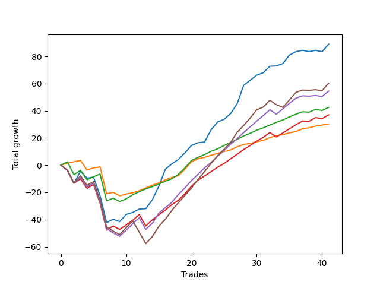

# Long Shepard 003 
- Symbol: ES_SmolBoi
- Date Range: 03/18/2022 - 07/29/2022
- Trading Period: 7:20-12:30
- Number of Trades: 41



| Name | Win Percent | Profit | Avg Profit / Trade | Avg Time / Trade |      | Name | Win Percent | Profit | Avg Profit / Trade | Avg Time / Trade |
| ---- | ----------- | ------ | ------------------ | ---------------- | ---- | ---- | ----------- | ------ | ------------------ | ---------------- |
| Sorted By <br> Profit | | | | | | Sorted By <br> Win Percentage ||||
| Two | 80.49 | 44500.00 | 1085.37 | 15:42 |     | Eighty-One | 92.68 | 15125.00 | 368.90 | 05:04 |
| Eighty-Five | 68.29 | 30125.00 | 734.76 | 17:53 |     | Eighty-Two | 85.37 | 21250.00 | 518.29 | 08:19 |
| Eighty-Four | 73.17 | 27250.00 | 664.63 | 15:35 |     | Two | 80.49 | 44500.00 | 1085.37 | 15:42 |
| Eighty-Two | 85.37 | 21250.00 | 518.29 | 08:19 |     | Eighty-Three | 75.61 | 18500.00 | 451.22 | 12:40 |
| Eighty-Three | 75.61 | 18500.00 | 451.22 | 12:40 |     | Eighty-Four | 73.17 | 27250.00 | 664.63 | 15:35 |
| Eighty-One | 92.68 | 15125.00 | 368.90 | 05:04 |     | Eighty-Five | 68.29 | 30125.00 | 734.76 | 17:53 |

## NO STOPLOSS

### Test Two
* Sell when the price hits the upper line of the 20p 2std bollinger
* No Stoploss
* Results:
```
Total Trades: 41
Percent Up: 80.49
Percent Down: 19.51
Total Points Moved Up: 89.00
Potential Profit: 44500.00
Total Points Ups: 144.50 Count Ups: 33
Total Points Downs: -55.50 Count Downs: 8
```

<details><summary>Trades</summary>

<code>In: 2022-03-23 09:49:00		Out: 2022-03-23 10:18:55		Total Position Time: 29:55		Total Move Up: -3.75		Total to Date: -3.75</code> <br />
<code>In: 2022-03-23 09:53:00		Out: 2022-03-23 10:22:55		Total Position Time: 29:55		Total Move Up: -9.50		Total to Date: -13.25</code> <br />
<code>In: 2022-03-24 07:32:00		Out: 2022-03-24 07:34:15		Total Position Time: 02:15		Total Move Up: 8.75		Total to Date: -4.50</code> <br />
<code>In: 2022-03-25 08:18:00		Out: 2022-03-25 08:41:45		Total Position Time: 23:45		Total Move Up: -5.00		Total to Date: -9.50</code> <br />
<code>In: 2022-03-28 07:30:00		Out: 2022-03-28 07:30:25		Total Position Time: 00:25		Total Move Up: 0.75		Total to Date: -8.75</code> <br />
<code>In: 2022-03-28 08:11:00		Out: 2022-03-28 08:40:55		Total Position Time: 29:55		Total Move Up: -13.75		Total to Date: -22.50</code> <br />
<code>In: 2022-03-28 08:30:00		Out: 2022-03-28 08:59:55		Total Position Time: 29:55		Total Move Up: -19.75		Total to Date: -42.25</code> <br />
<code>In: 2022-03-31 09:30:00		Out: 2022-03-31 09:44:20		Total Position Time: 14:20		Total Move Up: 2.50		Total to Date: -39.75</code> <br />
<code>In: 2022-04-12 07:47:00		Out: 2022-04-12 08:15:45		Total Position Time: 28:45		Total Move Up: -1.75		Total to Date: -41.50</code> <br />
<code>In: 2022-04-20 08:27:00		Out: 2022-04-20 08:31:15		Total Position Time: 04:15		Total Move Up: 5.25		Total to Date: -36.25</code> <br />
<code>In: 2022-04-20 11:48:00		Out: 2022-04-20 12:12:35		Total Position Time: 24:35		Total Move Up: 1.50		Total to Date: -34.75</code> <br />
<code>In: 2022-04-27 12:11:00		Out: 2022-04-27 12:31:20		Total Position Time: 20:20		Total Move Up: 2.50		Total to Date: -32.25</code> <br />
<code>In: 2022-04-27 12:14:00		Out: 2022-04-27 12:31:20		Total Position Time: 17:20		Total Move Up: 0.25		Total to Date: -32.00</code> <br />
<code>In: 2022-04-27 12:24:00		Out: 2022-04-27 12:31:20		Total Position Time: 07:20		Total Move Up: 6.50		Total to Date: -25.50</code> <br />
<code>In: 2022-05-03 07:51:00		Out: 2022-05-03 07:59:10		Total Position Time: 08:10		Total Move Up: 10.00		Total to Date: -15.50</code> <br />
<code>In: 2022-05-03 11:45:00		Out: 2022-05-03 11:52:15		Total Position Time: 07:15		Total Move Up: 12.50		Total to Date: -3.00</code> <br />
<code>In: 2022-05-06 11:36:00		Out: 2022-05-06 11:49:10		Total Position Time: 13:10		Total Move Up: 4.00		Total to Date: 1.00</code> <br />
<code>In: 2022-05-06 11:41:00		Out: 2022-05-06 11:49:10		Total Position Time: 08:10		Total Move Up: 3.25		Total to Date: 4.25</code> <br />
<code>In: 2022-05-06 11:47:00		Out: 2022-05-06 11:49:10		Total Position Time: 02:10		Total Move Up: 4.75		Total to Date: 9.00</code> <br />
<code>In: 2022-05-06 11:50:00		Out: 2022-05-06 11:50:10		Total Position Time: 00:10		Total Move Up: 5.50		Total to Date: 14.50</code> <br />
<code>In: 2022-05-06 12:12:00		Out: 2022-05-06 12:28:10		Total Position Time: 16:10		Total Move Up: 2.00		Total to Date: 16.50</code> <br />
<code>In: 2022-05-06 12:20:00		Out: 2022-05-06 12:28:10		Total Position Time: 08:10		Total Move Up: 0.50		Total to Date: 17.00</code> <br />
<code>In: 2022-05-12 09:04:00		Out: 2022-05-12 09:16:10		Total Position Time: 12:10		Total Move Up: 9.00		Total to Date: 26.00</code> <br />
<code>In: 2022-05-13 11:10:00		Out: 2022-05-13 11:31:20		Total Position Time: 21:20		Total Move Up: 5.75		Total to Date: 31.75</code> <br />
<code>In: 2022-05-16 07:58:00		Out: 2022-05-16 08:11:30		Total Position Time: 13:30		Total Move Up: 2.00		Total to Date: 33.75</code> <br />
<code>In: 2022-05-16 08:02:00		Out: 2022-05-16 08:11:30		Total Position Time: 09:30		Total Move Up: 4.25		Total to Date: 38.00</code> <br />
<code>In: 2022-05-19 07:47:00		Out: 2022-05-19 07:55:50		Total Position Time: 08:50		Total Move Up: 7.25		Total to Date: 45.25</code> <br />
<code>In: 2022-05-19 10:19:00		Out: 2022-05-19 10:44:05		Total Position Time: 25:05		Total Move Up: 13.50		Total to Date: 58.75</code> <br />
<code>In: 2022-05-25 09:39:00		Out: 2022-05-25 09:45:20		Total Position Time: 06:20		Total Move Up: 3.75		Total to Date: 62.50</code> <br />
<code>In: 2022-06-06 08:24:00		Out: 2022-06-06 08:43:00		Total Position Time: 19:00		Total Move Up: 3.75		Total to Date: 66.25</code> <br />
<code>In: 2022-07-08 09:48:00		Out: 2022-07-08 10:10:30		Total Position Time: 22:30		Total Move Up: 1.75		Total to Date: 68.00</code> <br />
<code>In: 2022-07-08 10:06:00		Out: 2022-07-08 10:10:30		Total Position Time: 04:30		Total Move Up: 4.75		Total to Date: 72.75</code> <br />
<code>In: 2022-07-11 12:15:00		Out: 2022-07-11 12:29:25		Total Position Time: 14:25		Total Move Up: 0.25		Total to Date: 73.00</code> <br />
<code>In: 2022-07-11 12:25:00		Out: 2022-07-11 12:29:25		Total Position Time: 04:25		Total Move Up: 1.75		Total to Date: 74.75</code> <br />
<code>In: 2022-07-20 11:01:00		Out: 2022-07-20 11:20:00		Total Position Time: 19:00		Total Move Up: 6.25		Total to Date: 81.00</code> <br />
<code>In: 2022-07-25 07:25:00		Out: 2022-07-25 07:43:50		Total Position Time: 18:50		Total Move Up: 2.50		Total to Date: 83.50</code> <br />
<code>In: 2022-07-25 11:06:00		Out: 2022-07-25 11:35:45		Total Position Time: 29:45		Total Move Up: 1.00		Total to Date: 84.50</code> <br />
<code>In: 2022-07-25 11:07:00		Out: 2022-07-25 11:35:45		Total Position Time: 28:45		Total Move Up: -1.00		Total to Date: 83.50</code> <br />
<code>In: 2022-07-25 11:10:00		Out: 2022-07-25 11:35:45		Total Position Time: 25:45		Total Move Up: 1.00		Total to Date: 84.50</code> <br />
<code>In: 2022-07-25 11:11:00		Out: 2022-07-25 11:35:45		Total Position Time: 24:45		Total Move Up: -1.00		Total to Date: 83.50</code> <br />
<code>In: 2022-07-29 08:32:00		Out: 2022-07-29 08:41:15		Total Position Time: 09:15		Total Move Up: 5.50		Total to Date: 89.00</code> <br />


</details>

## TAKE PROFIT

### Test Eighty-One
* Take Profit of 1 Point
* No Stoploss
* Results:
```
Total Trades: 41
Percent Up: 92.68
Percent Down: 7.32
Total Points Moved Up: 30.25
Potential Profit: 15125.00
Total Points Ups: 59.50 Count Ups: 38
Total Points Downs: -29.25 Count Downs: 3
```

<details><summary>Trades</summary>

<code>In: 2022-03-23 09:49:00		Out: 2022-03-23 09:52:50		Total Position Time: 03:50		Total Move Up: 1.50		Total to Date: 1.50</code> <br />
<code>In: 2022-03-23 09:53:00		Out: 2022-03-23 09:59:10		Total Position Time: 06:10		Total Move Up: 1.00		Total to Date: 2.50</code> <br />
<code>In: 2022-03-24 07:32:00		Out: 2022-03-24 07:32:20		Total Position Time: 00:20		Total Move Up: 1.00		Total to Date: 3.50</code> <br />
<code>In: 2022-03-25 08:18:00		Out: 2022-03-25 08:47:55		Total Position Time: 29:55		Total Move Up: -7.00		Total to Date: -3.50</code> <br />
<code>In: 2022-03-28 07:30:00		Out: 2022-03-28 07:48:05		Total Position Time: 18:05		Total Move Up: 1.50		Total to Date: -2.00</code> <br />
<code>In: 2022-03-28 08:11:00		Out: 2022-03-28 08:11:10		Total Position Time: 00:10		Total Move Up: 0.75		Total to Date: -1.25</code> <br />
<code>In: 2022-03-28 08:30:00		Out: 2022-03-28 08:59:55		Total Position Time: 29:55		Total Move Up: -19.75		Total to Date: -21.00</code> <br />
<code>In: 2022-03-31 09:30:00		Out: 2022-03-31 09:30:30		Total Position Time: 00:30		Total Move Up: 1.00		Total to Date: -20.00</code> <br />
<code>In: 2022-04-12 07:47:00		Out: 2022-04-12 08:16:55		Total Position Time: 29:55		Total Move Up: -2.50		Total to Date: -22.50</code> <br />
<code>In: 2022-04-20 08:27:00		Out: 2022-04-20 08:28:50		Total Position Time: 01:50		Total Move Up: 1.25		Total to Date: -21.25</code> <br />
<code>In: 2022-04-20 11:48:00		Out: 2022-04-20 11:48:15		Total Position Time: 00:15		Total Move Up: 1.00		Total to Date: -20.25</code> <br />
<code>In: 2022-04-27 12:11:00		Out: 2022-04-27 12:13:55		Total Position Time: 02:55		Total Move Up: 1.50		Total to Date: -18.75</code> <br />
<code>In: 2022-04-27 12:14:00		Out: 2022-04-27 12:15:20		Total Position Time: 01:20		Total Move Up: 2.00		Total to Date: -16.75</code> <br />
<code>In: 2022-04-27 12:24:00		Out: 2022-04-27 12:24:15		Total Position Time: 00:15		Total Move Up: 2.00		Total to Date: -14.75</code> <br />
<code>In: 2022-05-03 07:51:00		Out: 2022-05-03 07:51:35		Total Position Time: 00:35		Total Move Up: 1.75		Total to Date: -13.00</code> <br />
<code>In: 2022-05-03 11:45:00		Out: 2022-05-03 11:45:10		Total Position Time: 00:10		Total Move Up: 2.25		Total to Date: -10.75</code> <br />
<code>In: 2022-05-06 11:36:00		Out: 2022-05-06 11:40:25		Total Position Time: 04:25		Total Move Up: 1.75		Total to Date: -9.00</code> <br />
<code>In: 2022-05-06 11:41:00		Out: 2022-05-06 11:41:10		Total Position Time: 00:10		Total Move Up: 1.25		Total to Date: -7.75</code> <br />
<code>In: 2022-05-06 11:47:00		Out: 2022-05-06 11:49:10		Total Position Time: 02:10		Total Move Up: 4.75		Total to Date: -3.00</code> <br />
<code>In: 2022-05-06 11:50:00		Out: 2022-05-06 11:50:10		Total Position Time: 00:10		Total Move Up: 5.50		Total to Date: 2.50</code> <br />
<code>In: 2022-05-06 12:12:00		Out: 2022-05-06 12:12:10		Total Position Time: 00:10		Total Move Up: 2.25		Total to Date: 4.75</code> <br />
<code>In: 2022-05-06 12:20:00		Out: 2022-05-06 12:28:25		Total Position Time: 08:25		Total Move Up: 1.00		Total to Date: 5.75</code> <br />
<code>In: 2022-05-12 09:04:00		Out: 2022-05-12 09:04:10		Total Position Time: 00:10		Total Move Up: 1.50		Total to Date: 7.25</code> <br />
<code>In: 2022-05-13 11:10:00		Out: 2022-05-13 11:10:15		Total Position Time: 00:15		Total Move Up: 1.50		Total to Date: 8.75</code> <br />
<code>In: 2022-05-16 07:58:00		Out: 2022-05-16 08:09:55		Total Position Time: 11:55		Total Move Up: 1.25		Total to Date: 10.00</code> <br />
<code>In: 2022-05-16 08:02:00		Out: 2022-05-16 08:09:40		Total Position Time: 07:40		Total Move Up: 1.25		Total to Date: 11.25</code> <br />
<code>In: 2022-05-19 07:47:00		Out: 2022-05-19 07:54:45		Total Position Time: 07:45		Total Move Up: 2.25		Total to Date: 13.50</code> <br />
<code>In: 2022-05-19 10:19:00		Out: 2022-05-19 10:19:20		Total Position Time: 00:20		Total Move Up: 1.75		Total to Date: 15.25</code> <br />
<code>In: 2022-05-25 09:39:00		Out: 2022-05-25 09:42:00		Total Position Time: 03:00		Total Move Up: 0.75		Total to Date: 16.00</code> <br />
<code>In: 2022-06-06 08:24:00		Out: 2022-06-06 08:26:35		Total Position Time: 02:35		Total Move Up: 1.25		Total to Date: 17.25</code> <br />
<code>In: 2022-07-08 09:48:00		Out: 2022-07-08 09:48:20		Total Position Time: 00:20		Total Move Up: 1.00		Total to Date: 18.25</code> <br />
<code>In: 2022-07-08 10:06:00		Out: 2022-07-08 10:06:10		Total Position Time: 00:10		Total Move Up: 2.00		Total to Date: 20.25</code> <br />
<code>In: 2022-07-11 12:15:00		Out: 2022-07-11 12:29:40		Total Position Time: 14:40		Total Move Up: 1.50		Total to Date: 21.75</code> <br />
<code>In: 2022-07-11 12:25:00		Out: 2022-07-11 12:27:35		Total Position Time: 02:35		Total Move Up: 0.75		Total to Date: 22.50</code> <br />
<code>In: 2022-07-20 11:01:00		Out: 2022-07-20 11:03:20		Total Position Time: 02:20		Total Move Up: 1.25		Total to Date: 23.75</code> <br />
<code>In: 2022-07-25 07:25:00		Out: 2022-07-25 07:26:00		Total Position Time: 01:00		Total Move Up: 1.00		Total to Date: 24.75</code> <br />
<code>In: 2022-07-25 11:06:00		Out: 2022-07-25 11:06:15		Total Position Time: 00:15		Total Move Up: 2.00		Total to Date: 26.75</code> <br />
<code>In: 2022-07-25 11:07:00		Out: 2022-07-25 11:11:45		Total Position Time: 04:45		Total Move Up: 0.75		Total to Date: 27.50</code> <br />
<code>In: 2022-07-25 11:10:00		Out: 2022-07-25 11:10:40		Total Position Time: 00:40		Total Move Up: 1.25		Total to Date: 28.75</code> <br />
<code>In: 2022-07-25 11:11:00		Out: 2022-07-25 11:11:45		Total Position Time: 00:45		Total Move Up: 0.75		Total to Date: 29.50</code> <br />
<code>In: 2022-07-29 08:32:00		Out: 2022-07-29 08:37:00		Total Position Time: 05:00		Total Move Up: 0.75		Total to Date: 30.25</code> <br />


</details>

### Test Eighty-Two
* Take Profit of 2 Point
* No Stoploss
* Results:
```
Total Trades: 41
Percent Up: 85.37
Percent Down: 14.63
Total Points Moved Up: 42.50
Potential Profit: 21250.00
Total Points Ups: 82.25 Count Ups: 35
Total Points Downs: -39.75 Count Downs: 6
```

<details><summary>Trades</summary>

<code>In: 2022-03-23 09:49:00		Out: 2022-03-23 09:59:10		Total Position Time: 10:10		Total Move Up: 2.50		Total to Date: 2.50</code> <br />
<code>In: 2022-03-23 09:53:00		Out: 2022-03-23 10:22:55		Total Position Time: 29:55		Total Move Up: -9.50		Total to Date: -7.00</code> <br />
<code>In: 2022-03-24 07:32:00		Out: 2022-03-24 07:32:40		Total Position Time: 00:40		Total Move Up: 3.25		Total to Date: -3.75</code> <br />
<code>In: 2022-03-25 08:18:00		Out: 2022-03-25 08:47:55		Total Position Time: 29:55		Total Move Up: -7.00		Total to Date: -10.75</code> <br />
<code>In: 2022-03-28 07:30:00		Out: 2022-03-28 07:48:15		Total Position Time: 18:15		Total Move Up: 2.25		Total to Date: -8.50</code> <br />
<code>In: 2022-03-28 08:11:00		Out: 2022-03-28 08:11:40		Total Position Time: 00:40		Total Move Up: 2.00		Total to Date: -6.50</code> <br />
<code>In: 2022-03-28 08:30:00		Out: 2022-03-28 08:59:55		Total Position Time: 29:55		Total Move Up: -19.75		Total to Date: -26.25</code> <br />
<code>In: 2022-03-31 09:30:00		Out: 2022-03-31 09:32:50		Total Position Time: 02:50		Total Move Up: 2.00		Total to Date: -24.25</code> <br />
<code>In: 2022-04-12 07:47:00		Out: 2022-04-12 08:16:55		Total Position Time: 29:55		Total Move Up: -2.50		Total to Date: -26.75</code> <br />
<code>In: 2022-04-20 08:27:00		Out: 2022-04-20 08:29:05		Total Position Time: 02:05		Total Move Up: 2.00		Total to Date: -24.75</code> <br />
<code>In: 2022-04-20 11:48:00		Out: 2022-04-20 12:12:50		Total Position Time: 24:50		Total Move Up: 3.00		Total to Date: -21.75</code> <br />
<code>In: 2022-04-27 12:11:00		Out: 2022-04-27 12:14:00		Total Position Time: 03:00		Total Move Up: 2.25		Total to Date: -19.50</code> <br />
<code>In: 2022-04-27 12:14:00		Out: 2022-04-27 12:15:20		Total Position Time: 01:20		Total Move Up: 2.00		Total to Date: -17.50</code> <br />
<code>In: 2022-04-27 12:24:00		Out: 2022-04-27 12:25:15		Total Position Time: 01:15		Total Move Up: 1.75		Total to Date: -15.75</code> <br />
<code>In: 2022-05-03 07:51:00		Out: 2022-05-03 07:51:55		Total Position Time: 00:55		Total Move Up: 1.75		Total to Date: -14.00</code> <br />
<code>In: 2022-05-03 11:45:00		Out: 2022-05-03 11:45:10		Total Position Time: 00:10		Total Move Up: 2.25		Total to Date: -11.75</code> <br />
<code>In: 2022-05-06 11:36:00		Out: 2022-05-06 11:40:25		Total Position Time: 04:25		Total Move Up: 1.75		Total to Date: -10.00</code> <br />
<code>In: 2022-05-06 11:41:00		Out: 2022-05-06 11:49:10		Total Position Time: 08:10		Total Move Up: 3.25		Total to Date: -6.75</code> <br />
<code>In: 2022-05-06 11:47:00		Out: 2022-05-06 11:49:10		Total Position Time: 02:10		Total Move Up: 4.75		Total to Date: -2.00</code> <br />
<code>In: 2022-05-06 11:50:00		Out: 2022-05-06 11:50:10		Total Position Time: 00:10		Total Move Up: 5.50		Total to Date: 3.50</code> <br />
<code>In: 2022-05-06 12:12:00		Out: 2022-05-06 12:12:10		Total Position Time: 00:10		Total Move Up: 2.25		Total to Date: 5.75</code> <br />
<code>In: 2022-05-06 12:20:00		Out: 2022-05-06 12:28:50		Total Position Time: 08:50		Total Move Up: 2.00		Total to Date: 7.75</code> <br />
<code>In: 2022-05-12 09:04:00		Out: 2022-05-12 09:04:35		Total Position Time: 00:35		Total Move Up: 2.50		Total to Date: 10.25</code> <br />
<code>In: 2022-05-13 11:10:00		Out: 2022-05-13 11:10:20		Total Position Time: 00:20		Total Move Up: 1.75		Total to Date: 12.00</code> <br />
<code>In: 2022-05-16 07:58:00		Out: 2022-05-16 08:11:15		Total Position Time: 13:15		Total Move Up: 2.50		Total to Date: 14.50</code> <br />
<code>In: 2022-05-16 08:02:00		Out: 2022-05-16 08:09:50		Total Position Time: 07:50		Total Move Up: 2.25		Total to Date: 16.75</code> <br />
<code>In: 2022-05-19 07:47:00		Out: 2022-05-19 07:54:45		Total Position Time: 07:45		Total Move Up: 2.25		Total to Date: 19.00</code> <br />
<code>In: 2022-05-19 10:19:00		Out: 2022-05-19 10:19:30		Total Position Time: 00:30		Total Move Up: 2.50		Total to Date: 21.50</code> <br />
<code>In: 2022-05-25 09:39:00		Out: 2022-05-25 09:44:30		Total Position Time: 05:30		Total Move Up: 2.00		Total to Date: 23.50</code> <br />
<code>In: 2022-06-06 08:24:00		Out: 2022-06-06 08:27:45		Total Position Time: 03:45		Total Move Up: 2.25		Total to Date: 25.75</code> <br />
<code>In: 2022-07-08 09:48:00		Out: 2022-07-08 09:49:00		Total Position Time: 01:00		Total Move Up: 1.75		Total to Date: 27.50</code> <br />
<code>In: 2022-07-08 10:06:00		Out: 2022-07-08 10:06:10		Total Position Time: 00:10		Total Move Up: 2.00		Total to Date: 29.50</code> <br />
<code>In: 2022-07-11 12:15:00		Out: 2022-07-11 12:31:10		Total Position Time: 16:10		Total Move Up: 2.00		Total to Date: 31.50</code> <br />
<code>In: 2022-07-11 12:25:00		Out: 2022-07-11 12:29:25		Total Position Time: 04:25		Total Move Up: 1.75		Total to Date: 33.25</code> <br />
<code>In: 2022-07-20 11:01:00		Out: 2022-07-20 11:03:35		Total Position Time: 02:35		Total Move Up: 2.25		Total to Date: 35.50</code> <br />
<code>In: 2022-07-25 07:25:00		Out: 2022-07-25 07:26:30		Total Position Time: 01:30		Total Move Up: 2.00		Total to Date: 37.50</code> <br />
<code>In: 2022-07-25 11:06:00		Out: 2022-07-25 11:06:20		Total Position Time: 00:20		Total Move Up: 1.75		Total to Date: 39.25</code> <br />
<code>In: 2022-07-25 11:07:00		Out: 2022-07-25 11:36:55		Total Position Time: 29:55		Total Move Up: -0.25		Total to Date: 39.00</code> <br />
<code>In: 2022-07-25 11:10:00		Out: 2022-07-25 11:11:00		Total Position Time: 01:00		Total Move Up: 2.00		Total to Date: 41.00</code> <br />
<code>In: 2022-07-25 11:11:00		Out: 2022-07-25 11:40:55		Total Position Time: 29:55		Total Move Up: -0.75		Total to Date: 40.25</code> <br />
<code>In: 2022-07-29 08:32:00		Out: 2022-07-29 08:37:20		Total Position Time: 05:20		Total Move Up: 2.25		Total to Date: 42.50</code> <br />


</details>

### Test Eighty-Three
* Take Profit of 3 Point
* No Stoploss
* Results:
```
Total Trades: 41
Percent Up: 75.61
Percent Down: 24.39
Total Points Moved Up: 37.00
Potential Profit: 18500.00
Total Points Ups: 106.00 Count Ups: 31
Total Points Downs: -69.00 Count Downs: 10
```

<details><summary>Trades</summary>

<code>In: 2022-03-23 09:49:00		Out: 2022-03-23 10:18:55		Total Position Time: 29:55		Total Move Up: -3.75		Total to Date: -3.75</code> <br />
<code>In: 2022-03-23 09:53:00		Out: 2022-03-23 10:22:55		Total Position Time: 29:55		Total Move Up: -9.50		Total to Date: -13.25</code> <br />
<code>In: 2022-03-24 07:32:00		Out: 2022-03-24 07:32:40		Total Position Time: 00:40		Total Move Up: 3.25		Total to Date: -10.00</code> <br />
<code>In: 2022-03-25 08:18:00		Out: 2022-03-25 08:47:55		Total Position Time: 29:55		Total Move Up: -7.00		Total to Date: -17.00</code> <br />
<code>In: 2022-03-28 07:30:00		Out: 2022-03-28 07:48:35		Total Position Time: 18:35		Total Move Up: 2.75		Total to Date: -14.25</code> <br />
<code>In: 2022-03-28 08:11:00		Out: 2022-03-28 08:40:55		Total Position Time: 29:55		Total Move Up: -13.75		Total to Date: -28.00</code> <br />
<code>In: 2022-03-28 08:30:00		Out: 2022-03-28 08:59:55		Total Position Time: 29:55		Total Move Up: -19.75		Total to Date: -47.75</code> <br />
<code>In: 2022-03-31 09:30:00		Out: 2022-03-31 09:44:50		Total Position Time: 14:50		Total Move Up: 3.00		Total to Date: -44.75</code> <br />
<code>In: 2022-04-12 07:47:00		Out: 2022-04-12 08:16:55		Total Position Time: 29:55		Total Move Up: -2.50		Total to Date: -47.25</code> <br />
<code>In: 2022-04-20 08:27:00		Out: 2022-04-20 08:29:30		Total Position Time: 02:30		Total Move Up: 3.25		Total to Date: -44.00</code> <br />
<code>In: 2022-04-20 11:48:00		Out: 2022-04-20 12:12:55		Total Position Time: 24:55		Total Move Up: 3.50		Total to Date: -40.50</code> <br />
<code>In: 2022-04-27 12:11:00		Out: 2022-04-27 12:15:20		Total Position Time: 04:20		Total Move Up: 4.25		Total to Date: -36.25</code> <br />
<code>In: 2022-04-27 12:14:00		Out: 2022-04-27 12:43:55		Total Position Time: 29:55		Total Move Up: -8.50		Total to Date: -44.75</code> <br />
<code>In: 2022-04-27 12:24:00		Out: 2022-04-27 12:27:15		Total Position Time: 03:15		Total Move Up: 4.50		Total to Date: -40.25</code> <br />
<code>In: 2022-05-03 07:51:00		Out: 2022-05-03 07:52:25		Total Position Time: 01:25		Total Move Up: 3.75		Total to Date: -36.50</code> <br />
<code>In: 2022-05-03 11:45:00		Out: 2022-05-03 11:49:20		Total Position Time: 04:20		Total Move Up: 3.50		Total to Date: -33.00</code> <br />
<code>In: 2022-05-06 11:36:00		Out: 2022-05-06 11:49:10		Total Position Time: 13:10		Total Move Up: 4.00		Total to Date: -29.00</code> <br />
<code>In: 2022-05-06 11:41:00		Out: 2022-05-06 11:49:10		Total Position Time: 08:10		Total Move Up: 3.25		Total to Date: -25.75</code> <br />
<code>In: 2022-05-06 11:47:00		Out: 2022-05-06 11:49:10		Total Position Time: 02:10		Total Move Up: 4.75		Total to Date: -21.00</code> <br />
<code>In: 2022-05-06 11:50:00		Out: 2022-05-06 11:50:10		Total Position Time: 00:10		Total Move Up: 5.50		Total to Date: -15.50</code> <br />
<code>In: 2022-05-06 12:12:00		Out: 2022-05-06 12:13:10		Total Position Time: 01:10		Total Move Up: 4.50		Total to Date: -11.00</code> <br />
<code>In: 2022-05-06 12:20:00		Out: 2022-05-06 12:28:55		Total Position Time: 08:55		Total Move Up: 3.00		Total to Date: -8.00</code> <br />
<code>In: 2022-05-12 09:04:00		Out: 2022-05-12 09:05:00		Total Position Time: 01:00		Total Move Up: 3.25		Total to Date: -4.75</code> <br />
<code>In: 2022-05-13 11:10:00		Out: 2022-05-13 11:10:50		Total Position Time: 00:50		Total Move Up: 3.25		Total to Date: -1.50</code> <br />
<code>In: 2022-05-16 07:58:00		Out: 2022-05-16 08:12:00		Total Position Time: 14:00		Total Move Up: 2.75		Total to Date: 1.25</code> <br />
<code>In: 2022-05-16 08:02:00		Out: 2022-05-16 08:09:55		Total Position Time: 07:55		Total Move Up: 3.50		Total to Date: 4.75</code> <br />
<code>In: 2022-05-19 07:47:00		Out: 2022-05-19 07:54:50		Total Position Time: 07:50		Total Move Up: 3.25		Total to Date: 8.00</code> <br />
<code>In: 2022-05-19 10:19:00		Out: 2022-05-19 10:20:00		Total Position Time: 01:00		Total Move Up: 3.50		Total to Date: 11.50</code> <br />
<code>In: 2022-05-25 09:39:00		Out: 2022-05-25 09:45:15		Total Position Time: 06:15		Total Move Up: 3.00		Total to Date: 14.50</code> <br />
<code>In: 2022-06-06 08:24:00		Out: 2022-06-06 08:31:35		Total Position Time: 07:35		Total Move Up: 3.25		Total to Date: 17.75</code> <br />
<code>In: 2022-07-08 09:48:00		Out: 2022-07-08 10:11:20		Total Position Time: 23:20		Total Move Up: 2.75		Total to Date: 20.50</code> <br />
<code>In: 2022-07-08 10:06:00		Out: 2022-07-08 10:06:50		Total Position Time: 00:50		Total Move Up: 3.50		Total to Date: 24.00</code> <br />
<code>In: 2022-07-11 12:15:00		Out: 2022-07-11 12:44:55		Total Position Time: 29:55		Total Move Up: -3.25		Total to Date: 20.75</code> <br />
<code>In: 2022-07-11 12:25:00		Out: 2022-07-11 12:29:40		Total Position Time: 04:40		Total Move Up: 3.00		Total to Date: 23.75</code> <br />
<code>In: 2022-07-20 11:01:00		Out: 2022-07-20 11:03:45		Total Position Time: 02:45		Total Move Up: 3.00		Total to Date: 26.75</code> <br />
<code>In: 2022-07-25 07:25:00		Out: 2022-07-25 07:44:15		Total Position Time: 19:15		Total Move Up: 3.00		Total to Date: 29.75</code> <br />
<code>In: 2022-07-25 11:06:00		Out: 2022-07-25 11:11:45		Total Position Time: 05:45		Total Move Up: 2.75		Total to Date: 32.50</code> <br />
<code>In: 2022-07-25 11:07:00		Out: 2022-07-25 11:36:55		Total Position Time: 29:55		Total Move Up: -0.25		Total to Date: 32.25</code> <br />
<code>In: 2022-07-25 11:10:00		Out: 2022-07-25 11:11:45		Total Position Time: 01:45		Total Move Up: 2.75		Total to Date: 35.00</code> <br />
<code>In: 2022-07-25 11:11:00		Out: 2022-07-25 11:40:55		Total Position Time: 29:55		Total Move Up: -0.75		Total to Date: 34.25</code> <br />
<code>In: 2022-07-29 08:32:00		Out: 2022-07-29 08:39:05		Total Position Time: 07:05		Total Move Up: 2.75		Total to Date: 37.00</code> <br />


</details>

### Test Eighty-Four
* Take Profit of 4 Point
* No Stoploss
* Results:
```
Total Trades: 41
Percent Up: 73.17
Percent Down: 26.83
Total Points Moved Up: 54.50
Potential Profit: 27250.00
Total Points Ups: 126.50 Count Ups: 30
Total Points Downs: -72.00 Count Downs: 11
```

<details><summary>Trades</summary>

<code>In: 2022-03-23 09:49:00		Out: 2022-03-23 10:18:55		Total Position Time: 29:55		Total Move Up: -3.75		Total to Date: -3.75</code> <br />
<code>In: 2022-03-23 09:53:00		Out: 2022-03-23 10:22:55		Total Position Time: 29:55		Total Move Up: -9.50		Total to Date: -13.25</code> <br />
<code>In: 2022-03-24 07:32:00		Out: 2022-03-24 07:32:45		Total Position Time: 00:45		Total Move Up: 4.25		Total to Date: -9.00</code> <br />
<code>In: 2022-03-25 08:18:00		Out: 2022-03-25 08:47:55		Total Position Time: 29:55		Total Move Up: -7.00		Total to Date: -16.00</code> <br />
<code>In: 2022-03-28 07:30:00		Out: 2022-03-28 07:59:55		Total Position Time: 29:55		Total Move Up: 2.75		Total to Date: -13.25</code> <br />
<code>In: 2022-03-28 08:11:00		Out: 2022-03-28 08:40:55		Total Position Time: 29:55		Total Move Up: -13.75		Total to Date: -27.00</code> <br />
<code>In: 2022-03-28 08:30:00		Out: 2022-03-28 08:59:55		Total Position Time: 29:55		Total Move Up: -19.75		Total to Date: -46.75</code> <br />
<code>In: 2022-03-31 09:30:00		Out: 2022-03-31 09:59:55		Total Position Time: 29:55		Total Move Up: -3.00		Total to Date: -49.75</code> <br />
<code>In: 2022-04-12 07:47:00		Out: 2022-04-12 08:16:55		Total Position Time: 29:55		Total Move Up: -2.50		Total to Date: -52.25</code> <br />
<code>In: 2022-04-20 08:27:00		Out: 2022-04-20 08:30:50		Total Position Time: 03:50		Total Move Up: 4.50		Total to Date: -47.75</code> <br />
<code>In: 2022-04-20 11:48:00		Out: 2022-04-20 12:13:35		Total Position Time: 25:35		Total Move Up: 4.75		Total to Date: -43.00</code> <br />
<code>In: 2022-04-27 12:11:00		Out: 2022-04-27 12:15:20		Total Position Time: 04:20		Total Move Up: 4.25		Total to Date: -38.75</code> <br />
<code>In: 2022-04-27 12:14:00		Out: 2022-04-27 12:43:55		Total Position Time: 29:55		Total Move Up: -8.50		Total to Date: -47.25</code> <br />
<code>In: 2022-04-27 12:24:00		Out: 2022-04-27 12:27:15		Total Position Time: 03:15		Total Move Up: 4.50		Total to Date: -42.75</code> <br />
<code>In: 2022-05-03 07:51:00		Out: 2022-05-03 07:54:05		Total Position Time: 03:05		Total Move Up: 7.50		Total to Date: -35.25</code> <br />
<code>In: 2022-05-03 11:45:00		Out: 2022-05-03 11:50:40		Total Position Time: 05:40		Total Move Up: 4.00		Total to Date: -31.25</code> <br />
<code>In: 2022-05-06 11:36:00		Out: 2022-05-06 11:49:10		Total Position Time: 13:10		Total Move Up: 4.00		Total to Date: -27.25</code> <br />
<code>In: 2022-05-06 11:41:00		Out: 2022-05-06 11:49:25		Total Position Time: 08:25		Total Move Up: 5.75		Total to Date: -21.50</code> <br />
<code>In: 2022-05-06 11:47:00		Out: 2022-05-06 11:49:10		Total Position Time: 02:10		Total Move Up: 4.75		Total to Date: -16.75</code> <br />
<code>In: 2022-05-06 11:50:00		Out: 2022-05-06 11:50:10		Total Position Time: 00:10		Total Move Up: 5.50		Total to Date: -11.25</code> <br />
<code>In: 2022-05-06 12:12:00		Out: 2022-05-06 12:13:10		Total Position Time: 01:10		Total Move Up: 4.50		Total to Date: -6.75</code> <br />
<code>In: 2022-05-06 12:20:00		Out: 2022-05-06 12:30:15		Total Position Time: 10:15		Total Move Up: 4.75		Total to Date: -2.00</code> <br />
<code>In: 2022-05-12 09:04:00		Out: 2022-05-12 09:05:05		Total Position Time: 01:05		Total Move Up: 4.00		Total to Date: 2.00</code> <br />
<code>In: 2022-05-13 11:10:00		Out: 2022-05-13 11:12:25		Total Position Time: 02:25		Total Move Up: 4.50		Total to Date: 6.50</code> <br />
<code>In: 2022-05-16 07:58:00		Out: 2022-05-16 08:16:25		Total Position Time: 18:25		Total Move Up: 4.25		Total to Date: 10.75</code> <br />
<code>In: 2022-05-16 08:02:00		Out: 2022-05-16 08:11:15		Total Position Time: 09:15		Total Move Up: 4.75		Total to Date: 15.50</code> <br />
<code>In: 2022-05-19 07:47:00		Out: 2022-05-19 07:55:05		Total Position Time: 08:05		Total Move Up: 4.00		Total to Date: 19.50</code> <br />
<code>In: 2022-05-19 10:19:00		Out: 2022-05-19 10:21:15		Total Position Time: 02:15		Total Move Up: 4.50		Total to Date: 24.00</code> <br />
<code>In: 2022-05-25 09:39:00		Out: 2022-05-25 09:48:10		Total Position Time: 09:10		Total Move Up: 4.25		Total to Date: 28.25</code> <br />
<code>In: 2022-06-06 08:24:00		Out: 2022-06-06 08:44:10		Total Position Time: 20:10		Total Move Up: 4.25		Total to Date: 32.50</code> <br />
<code>In: 2022-07-08 09:48:00		Out: 2022-07-08 10:12:25		Total Position Time: 24:25		Total Move Up: 4.00		Total to Date: 36.50</code> <br />
<code>In: 2022-07-08 10:06:00		Out: 2022-07-08 10:09:40		Total Position Time: 03:40		Total Move Up: 4.25		Total to Date: 40.75</code> <br />
<code>In: 2022-07-11 12:15:00		Out: 2022-07-11 12:44:55		Total Position Time: 29:55		Total Move Up: -3.25		Total to Date: 37.50</code> <br />
<code>In: 2022-07-11 12:25:00		Out: 2022-07-11 12:31:50		Total Position Time: 06:50		Total Move Up: 4.00		Total to Date: 41.50</code> <br />
<code>In: 2022-07-20 11:01:00		Out: 2022-07-20 11:07:25		Total Position Time: 06:25		Total Move Up: 4.00		Total to Date: 45.50</code> <br />
<code>In: 2022-07-25 07:25:00		Out: 2022-07-25 07:44:20		Total Position Time: 19:20		Total Move Up: 3.75		Total to Date: 49.25</code> <br />
<code>In: 2022-07-25 11:06:00		Out: 2022-07-25 11:35:55		Total Position Time: 29:55		Total Move Up: 1.75		Total to Date: 51.00</code> <br />
<code>In: 2022-07-25 11:07:00		Out: 2022-07-25 11:36:55		Total Position Time: 29:55		Total Move Up: -0.25		Total to Date: 50.75</code> <br />
<code>In: 2022-07-25 11:10:00		Out: 2022-07-25 11:39:55		Total Position Time: 29:55		Total Move Up: 0.50		Total to Date: 51.25</code> <br />
<code>In: 2022-07-25 11:11:00		Out: 2022-07-25 11:40:55		Total Position Time: 29:55		Total Move Up: -0.75		Total to Date: 50.50</code> <br />
<code>In: 2022-07-29 08:32:00		Out: 2022-07-29 08:39:15		Total Position Time: 07:15		Total Move Up: 4.00		Total to Date: 54.50</code> <br />


</details>

### Test Eighty-Five
* Take Profit of 5 Point
* No Stoploss
* Results:
```
Total Trades: 41
Percent Up: 68.29
Percent Down: 31.71
Total Points Moved Up: 60.25
Potential Profit: 30125.00
Total Points Ups: 142.50 Count Ups: 28
Total Points Downs: -82.25 Count Downs: 13
```

<details><summary>Trades</summary>

<code>In: 2022-03-23 09:49:00		Out: 2022-03-23 10:18:55		Total Position Time: 29:55		Total Move Up: -3.75		Total to Date: -3.75</code> <br />
<code>In: 2022-03-23 09:53:00		Out: 2022-03-23 10:22:55		Total Position Time: 29:55		Total Move Up: -9.50		Total to Date: -13.25</code> <br />
<code>In: 2022-03-24 07:32:00		Out: 2022-03-24 07:32:50		Total Position Time: 00:50		Total Move Up: 5.50		Total to Date: -7.75</code> <br />
<code>In: 2022-03-25 08:18:00		Out: 2022-03-25 08:47:55		Total Position Time: 29:55		Total Move Up: -7.00		Total to Date: -14.75</code> <br />
<code>In: 2022-03-28 07:30:00		Out: 2022-03-28 07:59:55		Total Position Time: 29:55		Total Move Up: 2.75		Total to Date: -12.00</code> <br />
<code>In: 2022-03-28 08:11:00		Out: 2022-03-28 08:40:55		Total Position Time: 29:55		Total Move Up: -13.75		Total to Date: -25.75</code> <br />
<code>In: 2022-03-28 08:30:00		Out: 2022-03-28 08:59:55		Total Position Time: 29:55		Total Move Up: -19.75		Total to Date: -45.50</code> <br />
<code>In: 2022-03-31 09:30:00		Out: 2022-03-31 09:59:55		Total Position Time: 29:55		Total Move Up: -3.00		Total to Date: -48.50</code> <br />
<code>In: 2022-04-12 07:47:00		Out: 2022-04-12 08:16:55		Total Position Time: 29:55		Total Move Up: -2.50		Total to Date: -51.00</code> <br />
<code>In: 2022-04-20 08:27:00		Out: 2022-04-20 08:30:55		Total Position Time: 03:55		Total Move Up: 5.00		Total to Date: -46.00</code> <br />
<code>In: 2022-04-20 11:48:00		Out: 2022-04-20 12:13:40		Total Position Time: 25:40		Total Move Up: 5.00		Total to Date: -41.00</code> <br />
<code>In: 2022-04-27 12:11:00		Out: 2022-04-27 12:40:55		Total Position Time: 29:55		Total Move Up: -8.25		Total to Date: -49.25</code> <br />
<code>In: 2022-04-27 12:14:00		Out: 2022-04-27 12:43:55		Total Position Time: 29:55		Total Move Up: -8.50		Total to Date: -57.75</code> <br />
<code>In: 2022-04-27 12:24:00		Out: 2022-04-27 12:27:35		Total Position Time: 03:35		Total Move Up: 5.25		Total to Date: -52.50</code> <br />
<code>In: 2022-05-03 07:51:00		Out: 2022-05-03 07:54:05		Total Position Time: 03:05		Total Move Up: 7.50		Total to Date: -45.00</code> <br />
<code>In: 2022-05-03 11:45:00		Out: 2022-05-03 11:50:45		Total Position Time: 05:45		Total Move Up: 5.25		Total to Date: -39.75</code> <br />
<code>In: 2022-05-06 11:36:00		Out: 2022-05-06 11:49:25		Total Position Time: 13:25		Total Move Up: 6.50		Total to Date: -33.25</code> <br />
<code>In: 2022-05-06 11:41:00		Out: 2022-05-06 11:49:25		Total Position Time: 08:25		Total Move Up: 5.75		Total to Date: -27.50</code> <br />
<code>In: 2022-05-06 11:47:00		Out: 2022-05-06 11:49:20		Total Position Time: 02:20		Total Move Up: 5.25		Total to Date: -22.25</code> <br />
<code>In: 2022-05-06 11:50:00		Out: 2022-05-06 11:50:10		Total Position Time: 00:10		Total Move Up: 5.50		Total to Date: -16.75</code> <br />
<code>In: 2022-05-06 12:12:00		Out: 2022-05-06 12:30:15		Total Position Time: 18:15		Total Move Up: 6.25		Total to Date: -10.50</code> <br />
<code>In: 2022-05-06 12:20:00		Out: 2022-05-06 12:30:20		Total Position Time: 10:20		Total Move Up: 5.75		Total to Date: -4.75</code> <br />
<code>In: 2022-05-12 09:04:00		Out: 2022-05-12 09:07:35		Total Position Time: 03:35		Total Move Up: 6.00		Total to Date: 1.25</code> <br />
<code>In: 2022-05-13 11:10:00		Out: 2022-05-13 11:31:20		Total Position Time: 21:20		Total Move Up: 5.75		Total to Date: 7.00</code> <br />
<code>In: 2022-05-16 07:58:00		Out: 2022-05-16 08:17:00		Total Position Time: 19:00		Total Move Up: 4.75		Total to Date: 11.75</code> <br />
<code>In: 2022-05-16 08:02:00		Out: 2022-05-16 08:11:35		Total Position Time: 09:35		Total Move Up: 5.00		Total to Date: 16.75</code> <br />
<code>In: 2022-05-19 07:47:00		Out: 2022-05-19 07:55:40		Total Position Time: 08:40		Total Move Up: 7.50		Total to Date: 24.25</code> <br />
<code>In: 2022-05-19 10:19:00		Out: 2022-05-19 10:21:35		Total Position Time: 02:35		Total Move Up: 5.00		Total to Date: 29.25</code> <br />
<code>In: 2022-05-25 09:39:00		Out: 2022-05-25 09:48:50		Total Position Time: 09:50		Total Move Up: 5.50		Total to Date: 34.75</code> <br />
<code>In: 2022-06-06 08:24:00		Out: 2022-06-06 08:44:30		Total Position Time: 20:30		Total Move Up: 6.00		Total to Date: 40.75</code> <br />
<code>In: 2022-07-08 09:48:00		Out: 2022-07-08 10:17:55		Total Position Time: 29:55		Total Move Up: 2.00		Total to Date: 42.75</code> <br />
<code>In: 2022-07-08 10:06:00		Out: 2022-07-08 10:10:20		Total Position Time: 04:20		Total Move Up: 5.00		Total to Date: 47.75</code> <br />
<code>In: 2022-07-11 12:15:00		Out: 2022-07-11 12:44:55		Total Position Time: 29:55		Total Move Up: -3.25		Total to Date: 44.50</code> <br />
<code>In: 2022-07-11 12:25:00		Out: 2022-07-11 12:46:00		Total Position Time: 21:00		Total Move Up: -2.00		Total to Date: 42.50</code> <br />
<code>In: 2022-07-20 11:01:00		Out: 2022-07-20 11:09:55		Total Position Time: 08:55		Total Move Up: 5.50		Total to Date: 48.00</code> <br />
<code>In: 2022-07-25 07:25:00		Out: 2022-07-25 07:45:25		Total Position Time: 20:25		Total Move Up: 5.50		Total to Date: 53.50</code> <br />
<code>In: 2022-07-25 11:06:00		Out: 2022-07-25 11:35:55		Total Position Time: 29:55		Total Move Up: 1.75		Total to Date: 55.25</code> <br />
<code>In: 2022-07-25 11:07:00		Out: 2022-07-25 11:36:55		Total Position Time: 29:55		Total Move Up: -0.25		Total to Date: 55.00</code> <br />
<code>In: 2022-07-25 11:10:00		Out: 2022-07-25 11:39:55		Total Position Time: 29:55		Total Move Up: 0.50		Total to Date: 55.50</code> <br />
<code>In: 2022-07-25 11:11:00		Out: 2022-07-25 11:40:55		Total Position Time: 29:55		Total Move Up: -0.75		Total to Date: 54.75</code> <br />
<code>In: 2022-07-29 08:32:00		Out: 2022-07-29 08:41:15		Total Position Time: 09:15		Total Move Up: 5.50		Total to Date: 60.25</code> <br />


</details>