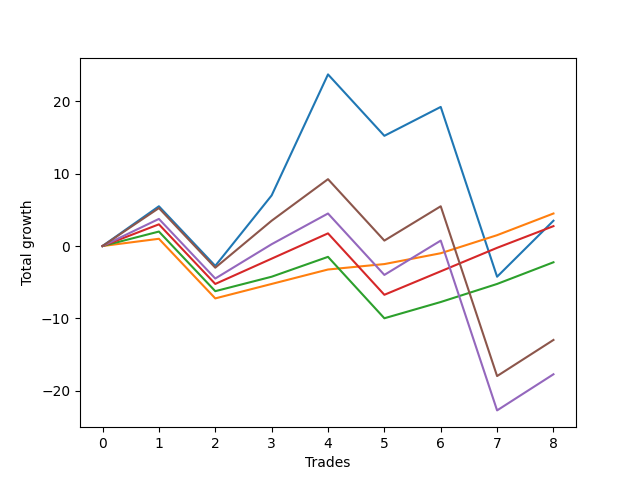

# Long Wallace 007 
- Symbol: ES_SmolBoi
- Date Range: 03/18/2022 - 07/29/2022
- Trading Period: 7:20-12:30
- Number of Trades: 8



| Name | Win Percent | Profit | Avg Profit / Trade | Avg Time / Trade |      | Name | Win Percent | Profit | Avg Profit / Trade | Avg Time / Trade |
| ---- | ----------- | ------ | ------------------ | ---------------- | ---- | ---- | ----------- | ------ | ------------------ | ---------------- |
| Sorted By <br> Profit | | | | | | Sorted By <br> Win Percentage ||||
| Eighty-One | 87.50 | 2250.00 | 281.25 | 09:24 |     | Eighty-One | 87.50 | 2250.00 | 281.25 | 09:24 |
| Two | 62.50 | 1750.00 | 218.75 | 167:05 |     | Eighty-Three | 75.00 | 1375.00 | 171.88 | 14:16 |
| Eighty-Three | 75.00 | 1375.00 | 171.88 | 14:16 |     | Eighty-Two | 75.00 | -1125.00 | -140.62 | 12:53 |
| Eighty-Two | 75.00 | -1125.00 | -140.62 | 12:53 |     | Two | 62.50 | 1750.00 | 218.75 | 167:05 |
| Eighty-Five | 62.50 | -6500.00 | -812.50 | 164:02 |     | Eighty-Five | 62.50 | -6500.00 | -812.50 | 164:02 |
| Eighty-Four | 62.50 | -8875.00 | -1109.38 | 163:20 |     | Eighty-Four | 62.50 | -8875.00 | -1109.38 | 163:20 |

## NO STOPLOSS

### Test Two
* Sell when the price hits the upper line of the 20p 2std bollinger
* No Stoploss
* Results:
```
Total Trades: 8
Percent Up: 62.50
Percent Down: 37.50
Total Points Moved Up: 3.50
Potential Profit: 1750.00
Total Points Ups: 43.75 Count Ups: 5
Total Points Downs: -40.25 Count Downs: 3
```

<details><summary>Trades</summary>

<code>In: 2022-03-23 10:50:00		Out: 2022-03-23 10:54:25		Total Position Time: 04:25		Total Move Up: 5.50		Total to Date: 5.50</code> <br />
<code>In: 2022-03-30 08:03:00		Out: 2022-03-30 08:32:55		Total Position Time: 29:55		Total Move Up: -8.25		Total to Date: -2.75</code> <br />
<code>In: 2022-04-20 11:59:00		Out: 2022-04-20 12:12:35		Total Position Time: 13:35		Total Move Up: 9.75		Total to Date: 7.00</code> <br />
<code>In: 2022-06-14 07:46:00		Out: 2022-06-14 07:51:00		Total Position Time: 05:00		Total Move Up: 16.75		Total to Date: 23.75</code> <br />
<code>In: 2022-06-15 07:58:00		Out: 2022-06-15 08:27:55		Total Position Time: 29:55		Total Move Up: -8.50		Total to Date: 15.25</code> <br />
<code>In: 2022-07-05 08:08:00		Out: 2022-07-05 08:17:55		Total Position Time: 09:55		Total Move Up: 4.00		Total to Date: 19.25</code> <br />
<code>In: 2022-07-12 12:28:00		Out: 2022-07-13 08:45:00		Total Position Time: 1217:00		Total Move Up: -23.50		Total to Date: -4.25</code> <br />
<code>In: 2022-07-25 07:30:00		Out: 2022-07-25 07:57:00		Total Position Time: 27:00		Total Move Up: 7.75		Total to Date: 3.50</code> <br />


</details>

## TAKE PROFIT

### Test Eighty-One
* Take Profit of 1 Point
* No Stoploss
* Results:
```
Total Trades: 8
Percent Up: 87.50
Percent Down: 12.50
Total Points Moved Up: 4.50
Potential Profit: 2250.00
Total Points Ups: 12.75 Count Ups: 7
Total Points Downs: -8.25 Count Downs: 1
```

<details><summary>Trades</summary>

<code>In: 2022-03-23 10:50:00		Out: 2022-03-23 10:51:00		Total Position Time: 01:00		Total Move Up: 1.00		Total to Date: 1.00</code> <br />
<code>In: 2022-03-30 08:03:00		Out: 2022-03-30 08:32:55		Total Position Time: 29:55		Total Move Up: -8.25		Total to Date: -7.25</code> <br />
<code>In: 2022-04-20 11:59:00		Out: 2022-04-20 12:00:15		Total Position Time: 01:15		Total Move Up: 2.00		Total to Date: -5.25</code> <br />
<code>In: 2022-06-14 07:46:00		Out: 2022-06-14 07:46:35		Total Position Time: 00:35		Total Move Up: 2.00		Total to Date: -3.25</code> <br />
<code>In: 2022-06-15 07:58:00		Out: 2022-06-15 08:00:20		Total Position Time: 02:20		Total Move Up: 0.75		Total to Date: -2.50</code> <br />
<code>In: 2022-07-05 08:08:00		Out: 2022-07-05 08:08:10		Total Position Time: 00:10		Total Move Up: 1.50		Total to Date: -1.00</code> <br />
<code>In: 2022-07-12 12:28:00		Out: 2022-07-12 12:54:00		Total Position Time: 26:00		Total Move Up: 2.50		Total to Date: 1.50</code> <br />
<code>In: 2022-07-25 07:30:00		Out: 2022-07-25 07:44:00		Total Position Time: 14:00		Total Move Up: 3.00		Total to Date: 4.50</code> <br />


</details>

### Test Eighty-Two
* Take Profit of 2 Point
* No Stoploss
* Results:
```
Total Trades: 8
Percent Up: 75.00
Percent Down: 25.00
Total Points Moved Up: -2.25
Potential Profit: -1125.00
Total Points Ups: 14.50 Count Ups: 6
Total Points Downs: -16.75 Count Downs: 2
```

<details><summary>Trades</summary>

<code>In: 2022-03-23 10:50:00		Out: 2022-03-23 10:51:10		Total Position Time: 01:10		Total Move Up: 2.00		Total to Date: 2.00</code> <br />
<code>In: 2022-03-30 08:03:00		Out: 2022-03-30 08:32:55		Total Position Time: 29:55		Total Move Up: -8.25		Total to Date: -6.25</code> <br />
<code>In: 2022-04-20 11:59:00		Out: 2022-04-20 12:00:15		Total Position Time: 01:15		Total Move Up: 2.00		Total to Date: -4.25</code> <br />
<code>In: 2022-06-14 07:46:00		Out: 2022-06-14 07:46:40		Total Position Time: 00:40		Total Move Up: 2.75		Total to Date: -1.50</code> <br />
<code>In: 2022-06-15 07:58:00		Out: 2022-06-15 08:27:55		Total Position Time: 29:55		Total Move Up: -8.50		Total to Date: -10.00</code> <br />
<code>In: 2022-07-05 08:08:00		Out: 2022-07-05 08:08:15		Total Position Time: 00:15		Total Move Up: 2.25		Total to Date: -7.75</code> <br />
<code>In: 2022-07-12 12:28:00		Out: 2022-07-12 12:54:00		Total Position Time: 26:00		Total Move Up: 2.50		Total to Date: -5.25</code> <br />
<code>In: 2022-07-25 07:30:00		Out: 2022-07-25 07:44:00		Total Position Time: 14:00		Total Move Up: 3.00		Total to Date: -2.25</code> <br />


</details>

### Test Eighty-Three
* Take Profit of 3 Point
* No Stoploss
* Results:
```
Total Trades: 8
Percent Up: 75.00
Percent Down: 25.00
Total Points Moved Up: 2.75
Potential Profit: 1375.00
Total Points Ups: 19.50 Count Ups: 6
Total Points Downs: -16.75 Count Downs: 2
```

<details><summary>Trades</summary>

<code>In: 2022-03-23 10:50:00		Out: 2022-03-23 10:51:35		Total Position Time: 01:35		Total Move Up: 3.00		Total to Date: 3.00</code> <br />
<code>In: 2022-03-30 08:03:00		Out: 2022-03-30 08:32:55		Total Position Time: 29:55		Total Move Up: -8.25		Total to Date: -5.25</code> <br />
<code>In: 2022-04-20 11:59:00		Out: 2022-04-20 12:01:10		Total Position Time: 02:10		Total Move Up: 3.50		Total to Date: -1.75</code> <br />
<code>In: 2022-06-14 07:46:00		Out: 2022-06-14 07:46:50		Total Position Time: 00:50		Total Move Up: 3.50		Total to Date: 1.75</code> <br />
<code>In: 2022-06-15 07:58:00		Out: 2022-06-15 08:27:55		Total Position Time: 29:55		Total Move Up: -8.50		Total to Date: -6.75</code> <br />
<code>In: 2022-07-05 08:08:00		Out: 2022-07-05 08:16:45		Total Position Time: 08:45		Total Move Up: 3.25		Total to Date: -3.50</code> <br />
<code>In: 2022-07-12 12:28:00		Out: 2022-07-12 12:55:00		Total Position Time: 27:00		Total Move Up: 3.25		Total to Date: -0.25</code> <br />
<code>In: 2022-07-25 07:30:00		Out: 2022-07-25 07:44:00		Total Position Time: 14:00		Total Move Up: 3.00		Total to Date: 2.75</code> <br />


</details>

### Test Eighty-Four
* Take Profit of 4 Point
* No Stoploss
* Results:
```
Total Trades: 8
Percent Up: 62.50
Percent Down: 37.50
Total Points Moved Up: -17.75
Potential Profit: -8875.00
Total Points Ups: 22.50 Count Ups: 5
Total Points Downs: -40.25 Count Downs: 3
```

<details><summary>Trades</summary>

<code>In: 2022-03-23 10:50:00		Out: 2022-03-23 10:51:50		Total Position Time: 01:50		Total Move Up: 3.75		Total to Date: 3.75</code> <br />
<code>In: 2022-03-30 08:03:00		Out: 2022-03-30 08:32:55		Total Position Time: 29:55		Total Move Up: -8.25		Total to Date: -4.50</code> <br />
<code>In: 2022-04-20 11:59:00		Out: 2022-04-20 12:01:15		Total Position Time: 02:15		Total Move Up: 4.75		Total to Date: 0.25</code> <br />
<code>In: 2022-06-14 07:46:00		Out: 2022-06-14 07:47:00		Total Position Time: 01:00		Total Move Up: 4.25		Total to Date: 4.50</code> <br />
<code>In: 2022-06-15 07:58:00		Out: 2022-06-15 08:27:55		Total Position Time: 29:55		Total Move Up: -8.50		Total to Date: -4.00</code> <br />
<code>In: 2022-07-05 08:08:00		Out: 2022-07-05 08:17:50		Total Position Time: 09:50		Total Move Up: 4.75		Total to Date: 0.75</code> <br />
<code>In: 2022-07-12 12:28:00		Out: 2022-07-13 08:45:00		Total Position Time: 1217:00		Total Move Up: -23.50		Total to Date: -22.75</code> <br />
<code>In: 2022-07-25 07:30:00		Out: 2022-07-25 07:45:00		Total Position Time: 15:00		Total Move Up: 5.00		Total to Date: -17.75</code> <br />


</details>

### Test Eighty-Five
* Take Profit of 5 Point
* No Stoploss
* Results:
```
Total Trades: 8
Percent Up: 62.50
Percent Down: 37.50
Total Points Moved Up: -13.00
Potential Profit: -6500.00
Total Points Ups: 27.25 Count Ups: 5
Total Points Downs: -40.25 Count Downs: 3
```

<details><summary>Trades</summary>

<code>In: 2022-03-23 10:50:00		Out: 2022-03-23 10:54:20		Total Position Time: 04:20		Total Move Up: 5.25		Total to Date: 5.25</code> <br />
<code>In: 2022-03-30 08:03:00		Out: 2022-03-30 08:32:55		Total Position Time: 29:55		Total Move Up: -8.25		Total to Date: -3.00</code> <br />
<code>In: 2022-04-20 11:59:00		Out: 2022-04-20 12:01:20		Total Position Time: 02:20		Total Move Up: 6.50		Total to Date: 3.50</code> <br />
<code>In: 2022-06-14 07:46:00		Out: 2022-06-14 07:47:05		Total Position Time: 01:05		Total Move Up: 5.75		Total to Date: 9.25</code> <br />
<code>In: 2022-06-15 07:58:00		Out: 2022-06-15 08:27:55		Total Position Time: 29:55		Total Move Up: -8.50		Total to Date: 0.75</code> <br />
<code>In: 2022-07-05 08:08:00		Out: 2022-07-05 08:20:45		Total Position Time: 12:45		Total Move Up: 4.75		Total to Date: 5.50</code> <br />
<code>In: 2022-07-12 12:28:00		Out: 2022-07-13 08:45:00		Total Position Time: 1217:00		Total Move Up: -23.50		Total to Date: -18.00</code> <br />
<code>In: 2022-07-25 07:30:00		Out: 2022-07-25 07:45:00		Total Position Time: 15:00		Total Move Up: 5.00		Total to Date: -13.00</code> <br />


</details>