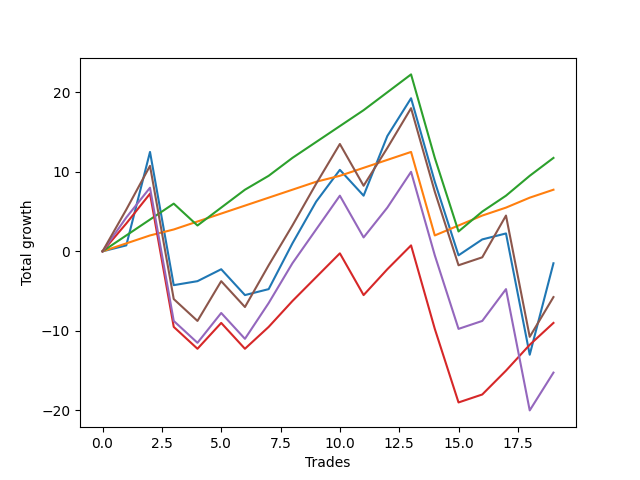

# Long Wallace 009 
- Symbol: ES_SmolBoi
- Date Range: 03/18/2022 - 07/29/2022
- Trading Period: 7:20-12:30
- Number of Trades: 19



| Name | Win Percent | Profit | Avg Profit / Trade | Avg Time / Trade |      | Name | Win Percent | Profit | Avg Profit / Trade | Avg Time / Trade |
| ---- | ----------- | ------ | ------------------ | ---------------- | ---- | ---- | ----------- | ------ | ------------------ | ---------------- |
| Sorted By <br> Profit | | | | | | Sorted By <br> Win Percentage ||||
| Eighty-Two | 84.21 | 5875.00 | 309.21 | 14:22 |     | Eighty-One | 94.74 | 3875.00 | 203.95 | 08:12 |
| Eighty-One | 94.74 | 3875.00 | 203.95 | 08:12 |     | Eighty-Two | 84.21 | 5875.00 | 309.21 | 14:22 |
| Two | 68.42 | -750.00 | -39.47 | 24:58 |     | Two | 68.42 | -750.00 | -39.47 | 24:58 |
| Eighty-Five | 63.16 | -2875.00 | -151.32 | 25:07 |     | Eighty-Three | 68.42 | -4500.00 | -236.84 | 21:18 |
| Eighty-Three | 68.42 | -4500.00 | -236.84 | 21:18 |     | Eighty-Five | 63.16 | -2875.00 | -151.32 | 25:07 |
| Eighty-Four | 63.16 | -7625.00 | -401.32 | 24:16 |     | Eighty-Four | 63.16 | -7625.00 | -401.32 | 24:16 |

## NO STOPLOSS

### Test Two
* Sell when the price hits the upper line of the 20p 2std bollinger
* No Stoploss
* Results:
```
Total Trades: 19
Percent Up: 68.42
Percent Down: 31.58
Total Points Moved Up: -1.50
Potential Profit: -750.00
Total Points Ups: 56.75 Count Ups: 13
Total Points Downs: -58.25 Count Downs: 6
```

<details><summary>Trades</summary>

<code>In: 2022-03-23 09:47:00		Out: 2022-03-23 10:16:55		Total Position Time: 29:55		Total Move Up: 0.75		Total to Date: 0.75</code> <br />
<code>In: 2022-03-25 08:29:00		Out: 2022-03-25 08:41:45		Total Position Time: 12:45		Total Move Up: 11.75		Total to Date: 12.50</code> <br />
<code>In: 2022-03-28 08:27:00		Out: 2022-03-28 08:56:55		Total Position Time: 29:55		Total Move Up: -16.75		Total to Date: -4.25</code> <br />
<code>In: 2022-03-31 09:23:00		Out: 2022-03-31 09:44:20		Total Position Time: 21:20		Total Move Up: 0.50		Total to Date: -3.75</code> <br />
<code>In: 2022-04-04 10:03:00		Out: 2022-04-04 10:18:10		Total Position Time: 15:10		Total Move Up: 1.50		Total to Date: -2.25</code> <br />
<code>In: 2022-04-08 10:36:00		Out: 2022-04-08 11:05:55		Total Position Time: 29:55		Total Move Up: -3.25		Total to Date: -5.50</code> <br />
<code>In: 2022-04-20 09:14:00		Out: 2022-04-20 09:31:05		Total Position Time: 17:05		Total Move Up: 0.75		Total to Date: -4.75</code> <br />
<code>In: 2022-04-27 11:40:00		Out: 2022-04-27 11:42:40		Total Position Time: 02:40		Total Move Up: 5.75		Total to Date: 1.00</code> <br />
<code>In: 2022-05-26 08:50:00		Out: 2022-05-26 08:56:50		Total Position Time: 06:50		Total Move Up: 5.25		Total to Date: 6.25</code> <br />
<code>In: 2022-05-26 11:38:00		Out: 2022-05-26 11:54:10		Total Position Time: 16:10		Total Move Up: 4.00		Total to Date: 10.25</code> <br />
<code>In: 2022-05-26 12:06:00		Out: 2022-05-26 12:34:25		Total Position Time: 28:25		Total Move Up: -3.25		Total to Date: 7.00</code> <br />
<code>In: 2022-05-27 08:04:00		Out: 2022-05-27 08:12:15		Total Position Time: 08:15		Total Move Up: 7.50		Total to Date: 14.50</code> <br />
<code>In: 2022-05-27 09:52:00		Out: 2022-05-27 09:55:40		Total Position Time: 03:40		Total Move Up: 4.75		Total to Date: 19.25</code> <br />
<code>In: 2022-06-15 07:35:00		Out: 2022-06-15 08:04:55		Total Position Time: 29:55		Total Move Up: -10.50		Total to Date: 8.75</code> <br />
<code>In: 2022-06-21 08:42:00		Out: 2022-06-21 09:11:55		Total Position Time: 29:55		Total Move Up: -9.25		Total to Date: -0.50</code> <br />
<code>In: 2022-06-27 10:45:00		Out: 2022-06-27 11:13:35		Total Position Time: 28:35		Total Move Up: 2.00		Total to Date: 1.50</code> <br />
<code>In: 2022-07-07 10:16:00		Out: 2022-07-07 10:34:10		Total Position Time: 18:10		Total Move Up: 0.75		Total to Date: 2.25</code> <br />
<code>In: 2022-07-08 09:11:00		Out: 2022-07-08 09:40:55		Total Position Time: 29:55		Total Move Up: -15.25		Total to Date: -13.00</code> <br />
<code>In: 2022-07-29 08:01:00		Out: 2022-07-29 09:57:00		Total Position Time: 116:00		Total Move Up: 11.50		Total to Date: -1.50</code> <br />


</details>

## TAKE PROFIT

### Test Eighty-One
* Take Profit of 1 Point
* No Stoploss
* Results:
```
Total Trades: 19
Percent Up: 94.74
Percent Down: 5.26
Total Points Moved Up: 7.75
Potential Profit: 3875.00
Total Points Ups: 18.25 Count Ups: 18
Total Points Downs: -10.50 Count Downs: 1
```

<details><summary>Trades</summary>

<code>In: 2022-03-23 09:47:00		Out: 2022-03-23 09:47:35		Total Position Time: 00:35		Total Move Up: 1.00		Total to Date: 1.00</code> <br />
<code>In: 2022-03-25 08:29:00		Out: 2022-03-25 08:29:10		Total Position Time: 00:10		Total Move Up: 1.00		Total to Date: 2.00</code> <br />
<code>In: 2022-03-28 08:27:00		Out: 2022-03-28 08:27:45		Total Position Time: 00:45		Total Move Up: 0.75		Total to Date: 2.75</code> <br />
<code>In: 2022-03-31 09:23:00		Out: 2022-03-31 09:44:50		Total Position Time: 21:50		Total Move Up: 1.00		Total to Date: 3.75</code> <br />
<code>In: 2022-04-04 10:03:00		Out: 2022-04-04 10:09:40		Total Position Time: 06:40		Total Move Up: 1.00		Total to Date: 4.75</code> <br />
<code>In: 2022-04-08 10:36:00		Out: 2022-04-08 10:36:15		Total Position Time: 00:15		Total Move Up: 1.00		Total to Date: 5.75</code> <br />
<code>In: 2022-04-20 09:14:00		Out: 2022-04-20 09:18:50		Total Position Time: 04:50		Total Move Up: 1.00		Total to Date: 6.75</code> <br />
<code>In: 2022-04-27 11:40:00		Out: 2022-04-27 11:40:10		Total Position Time: 00:10		Total Move Up: 1.00		Total to Date: 7.75</code> <br />
<code>In: 2022-05-26 08:50:00		Out: 2022-05-26 08:54:10		Total Position Time: 04:10		Total Move Up: 1.00		Total to Date: 8.75</code> <br />
<code>In: 2022-05-26 11:38:00		Out: 2022-05-26 11:42:10		Total Position Time: 04:10		Total Move Up: 0.75		Total to Date: 9.50</code> <br />
<code>In: 2022-05-26 12:06:00		Out: 2022-05-26 12:07:50		Total Position Time: 01:50		Total Move Up: 1.00		Total to Date: 10.50</code> <br />
<code>In: 2022-05-27 08:04:00		Out: 2022-05-27 08:04:20		Total Position Time: 00:20		Total Move Up: 1.00		Total to Date: 11.50</code> <br />
<code>In: 2022-05-27 09:52:00		Out: 2022-05-27 09:52:50		Total Position Time: 00:50		Total Move Up: 1.00		Total to Date: 12.50</code> <br />
<code>In: 2022-06-15 07:35:00		Out: 2022-06-15 08:04:55		Total Position Time: 29:55		Total Move Up: -10.50		Total to Date: 2.00</code> <br />
<code>In: 2022-06-21 08:42:00		Out: 2022-06-21 08:42:10		Total Position Time: 00:10		Total Move Up: 1.25		Total to Date: 3.25</code> <br />
<code>In: 2022-06-27 10:45:00		Out: 2022-06-27 10:51:15		Total Position Time: 06:15		Total Move Up: 1.25		Total to Date: 4.50</code> <br />
<code>In: 2022-07-07 10:16:00		Out: 2022-07-07 10:34:55		Total Position Time: 18:55		Total Move Up: 1.00		Total to Date: 5.50</code> <br />
<code>In: 2022-07-08 09:11:00		Out: 2022-07-08 09:11:10		Total Position Time: 00:10		Total Move Up: 1.25		Total to Date: 6.75</code> <br />
<code>In: 2022-07-29 08:01:00		Out: 2022-07-29 08:55:00		Total Position Time: 54:00		Total Move Up: 1.00		Total to Date: 7.75</code> <br />


</details>

### Test Eighty-Two
* Take Profit of 2 Point
* No Stoploss
* Results:
```
Total Trades: 19
Percent Up: 84.21
Percent Down: 15.79
Total Points Moved Up: 11.75
Potential Profit: 5875.00
Total Points Ups: 34.25 Count Ups: 16
Total Points Downs: -22.50 Count Downs: 3
```

<details><summary>Trades</summary>

<code>In: 2022-03-23 09:47:00		Out: 2022-03-23 09:48:20		Total Position Time: 01:20		Total Move Up: 2.00		Total to Date: 2.00</code> <br />
<code>In: 2022-03-25 08:29:00		Out: 2022-03-25 08:29:20		Total Position Time: 00:20		Total Move Up: 2.00		Total to Date: 4.00</code> <br />
<code>In: 2022-03-28 08:27:00		Out: 2022-03-28 08:28:10		Total Position Time: 01:10		Total Move Up: 2.00		Total to Date: 6.00</code> <br />
<code>In: 2022-03-31 09:23:00		Out: 2022-03-31 09:52:55		Total Position Time: 29:55		Total Move Up: -2.75		Total to Date: 3.25</code> <br />
<code>In: 2022-04-04 10:03:00		Out: 2022-04-04 10:18:35		Total Position Time: 15:35		Total Move Up: 2.25		Total to Date: 5.50</code> <br />
<code>In: 2022-04-08 10:36:00		Out: 2022-04-08 10:36:30		Total Position Time: 00:30		Total Move Up: 2.25		Total to Date: 7.75</code> <br />
<code>In: 2022-04-20 09:14:00		Out: 2022-04-20 09:31:35		Total Position Time: 17:35		Total Move Up: 1.75		Total to Date: 9.50</code> <br />
<code>In: 2022-04-27 11:40:00		Out: 2022-04-27 11:40:15		Total Position Time: 00:15		Total Move Up: 2.25		Total to Date: 11.75</code> <br />
<code>In: 2022-05-26 08:50:00		Out: 2022-05-26 08:55:10		Total Position Time: 05:10		Total Move Up: 2.00		Total to Date: 13.75</code> <br />
<code>In: 2022-05-26 11:38:00		Out: 2022-05-26 11:42:40		Total Position Time: 04:40		Total Move Up: 2.00		Total to Date: 15.75</code> <br />
<code>In: 2022-05-26 12:06:00		Out: 2022-05-26 12:07:55		Total Position Time: 01:55		Total Move Up: 2.00		Total to Date: 17.75</code> <br />
<code>In: 2022-05-27 08:04:00		Out: 2022-05-27 08:06:50		Total Position Time: 02:50		Total Move Up: 2.25		Total to Date: 20.00</code> <br />
<code>In: 2022-05-27 09:52:00		Out: 2022-05-27 09:53:50		Total Position Time: 01:50		Total Move Up: 2.25		Total to Date: 22.25</code> <br />
<code>In: 2022-06-15 07:35:00		Out: 2022-06-15 08:04:55		Total Position Time: 29:55		Total Move Up: -10.50		Total to Date: 11.75</code> <br />
<code>In: 2022-06-21 08:42:00		Out: 2022-06-21 09:11:55		Total Position Time: 29:55		Total Move Up: -9.25		Total to Date: 2.50</code> <br />
<code>In: 2022-06-27 10:45:00		Out: 2022-06-27 10:54:20		Total Position Time: 09:20		Total Move Up: 2.50		Total to Date: 5.00</code> <br />
<code>In: 2022-07-07 10:16:00		Out: 2022-07-07 10:36:45		Total Position Time: 20:45		Total Move Up: 2.00		Total to Date: 7.00</code> <br />
<code>In: 2022-07-08 09:11:00		Out: 2022-07-08 09:20:15		Total Position Time: 09:15		Total Move Up: 2.50		Total to Date: 9.50</code> <br />
<code>In: 2022-07-29 08:01:00		Out: 2022-07-29 09:32:00		Total Position Time: 91:00		Total Move Up: 2.25		Total to Date: 11.75</code> <br />


</details>

### Test Eighty-Three
* Take Profit of 3 Point
* No Stoploss
* Results:
```
Total Trades: 19
Percent Up: 68.42
Percent Down: 31.58
Total Points Moved Up: -9.00
Potential Profit: -4500.00
Total Points Ups: 38.75 Count Ups: 13
Total Points Downs: -47.75 Count Downs: 6
```

<details><summary>Trades</summary>

<code>In: 2022-03-23 09:47:00		Out: 2022-03-23 09:52:30		Total Position Time: 05:30		Total Move Up: 3.50		Total to Date: 3.50</code> <br />
<code>In: 2022-03-25 08:29:00		Out: 2022-03-25 08:29:55		Total Position Time: 00:55		Total Move Up: 3.75		Total to Date: 7.25</code> <br />
<code>In: 2022-03-28 08:27:00		Out: 2022-03-28 08:56:55		Total Position Time: 29:55		Total Move Up: -16.75		Total to Date: -9.50</code> <br />
<code>In: 2022-03-31 09:23:00		Out: 2022-03-31 09:52:55		Total Position Time: 29:55		Total Move Up: -2.75		Total to Date: -12.25</code> <br />
<code>In: 2022-04-04 10:03:00		Out: 2022-04-04 10:19:25		Total Position Time: 16:25		Total Move Up: 3.25		Total to Date: -9.00</code> <br />
<code>In: 2022-04-08 10:36:00		Out: 2022-04-08 11:05:55		Total Position Time: 29:55		Total Move Up: -3.25		Total to Date: -12.25</code> <br />
<code>In: 2022-04-20 09:14:00		Out: 2022-04-20 09:32:30		Total Position Time: 18:30		Total Move Up: 2.75		Total to Date: -9.50</code> <br />
<code>In: 2022-04-27 11:40:00		Out: 2022-04-27 11:42:30		Total Position Time: 02:30		Total Move Up: 3.25		Total to Date: -6.25</code> <br />
<code>In: 2022-05-26 08:50:00		Out: 2022-05-26 08:55:25		Total Position Time: 05:25		Total Move Up: 3.00		Total to Date: -3.25</code> <br />
<code>In: 2022-05-26 11:38:00		Out: 2022-05-26 11:45:25		Total Position Time: 07:25		Total Move Up: 3.00		Total to Date: -0.25</code> <br />
<code>In: 2022-05-26 12:06:00		Out: 2022-05-26 12:35:55		Total Position Time: 29:55		Total Move Up: -5.25		Total to Date: -5.50</code> <br />
<code>In: 2022-05-27 08:04:00		Out: 2022-05-27 08:07:10		Total Position Time: 03:10		Total Move Up: 3.25		Total to Date: -2.25</code> <br />
<code>In: 2022-05-27 09:52:00		Out: 2022-05-27 09:54:25		Total Position Time: 02:25		Total Move Up: 3.00		Total to Date: 0.75</code> <br />
<code>In: 2022-06-15 07:35:00		Out: 2022-06-15 08:04:55		Total Position Time: 29:55		Total Move Up: -10.50		Total to Date: -9.75</code> <br />
<code>In: 2022-06-21 08:42:00		Out: 2022-06-21 09:11:55		Total Position Time: 29:55		Total Move Up: -9.25		Total to Date: -19.00</code> <br />
<code>In: 2022-06-27 10:45:00		Out: 2022-06-27 11:14:55		Total Position Time: 29:55		Total Move Up: 1.00		Total to Date: -18.00</code> <br />
<code>In: 2022-07-07 10:16:00		Out: 2022-07-07 10:40:45		Total Position Time: 24:45		Total Move Up: 3.00		Total to Date: -15.00</code> <br />
<code>In: 2022-07-08 09:11:00		Out: 2022-07-08 09:20:30		Total Position Time: 09:30		Total Move Up: 3.25		Total to Date: -11.75</code> <br />
<code>In: 2022-07-29 08:01:00		Out: 2022-07-29 09:40:00		Total Position Time: 99:00		Total Move Up: 2.75		Total to Date: -9.00</code> <br />


</details>

### Test Eighty-Four
* Take Profit of 4 Point
* No Stoploss
* Results:
```
Total Trades: 19
Percent Up: 63.16
Percent Down: 36.84
Total Points Moved Up: -15.25
Potential Profit: -7625.00
Total Points Ups: 47.75 Count Ups: 12
Total Points Downs: -63.00 Count Downs: 7
```

<details><summary>Trades</summary>

<code>In: 2022-03-23 09:47:00		Out: 2022-03-23 09:52:50		Total Position Time: 05:50		Total Move Up: 4.25		Total to Date: 4.25</code> <br />
<code>In: 2022-03-25 08:29:00		Out: 2022-03-25 08:29:55		Total Position Time: 00:55		Total Move Up: 3.75		Total to Date: 8.00</code> <br />
<code>In: 2022-03-28 08:27:00		Out: 2022-03-28 08:56:55		Total Position Time: 29:55		Total Move Up: -16.75		Total to Date: -8.75</code> <br />
<code>In: 2022-03-31 09:23:00		Out: 2022-03-31 09:52:55		Total Position Time: 29:55		Total Move Up: -2.75		Total to Date: -11.50</code> <br />
<code>In: 2022-04-04 10:03:00		Out: 2022-04-04 10:28:25		Total Position Time: 25:25		Total Move Up: 3.75		Total to Date: -7.75</code> <br />
<code>In: 2022-04-08 10:36:00		Out: 2022-04-08 11:05:55		Total Position Time: 29:55		Total Move Up: -3.25		Total to Date: -11.00</code> <br />
<code>In: 2022-04-20 09:14:00		Out: 2022-04-20 09:32:40		Total Position Time: 18:40		Total Move Up: 4.50		Total to Date: -6.50</code> <br />
<code>In: 2022-04-27 11:40:00		Out: 2022-04-27 11:42:35		Total Position Time: 02:35		Total Move Up: 5.00		Total to Date: -1.50</code> <br />
<code>In: 2022-05-26 08:50:00		Out: 2022-05-26 08:55:35		Total Position Time: 05:35		Total Move Up: 4.25		Total to Date: 2.75</code> <br />
<code>In: 2022-05-26 11:38:00		Out: 2022-05-26 11:57:50		Total Position Time: 19:50		Total Move Up: 4.25		Total to Date: 7.00</code> <br />
<code>In: 2022-05-26 12:06:00		Out: 2022-05-26 12:35:55		Total Position Time: 29:55		Total Move Up: -5.25		Total to Date: 1.75</code> <br />
<code>In: 2022-05-27 08:04:00		Out: 2022-05-27 08:10:00		Total Position Time: 06:00		Total Move Up: 3.75		Total to Date: 5.50</code> <br />
<code>In: 2022-05-27 09:52:00		Out: 2022-05-27 09:55:30		Total Position Time: 03:30		Total Move Up: 4.50		Total to Date: 10.00</code> <br />
<code>In: 2022-06-15 07:35:00		Out: 2022-06-15 08:04:55		Total Position Time: 29:55		Total Move Up: -10.50		Total to Date: -0.50</code> <br />
<code>In: 2022-06-21 08:42:00		Out: 2022-06-21 09:11:55		Total Position Time: 29:55		Total Move Up: -9.25		Total to Date: -9.75</code> <br />
<code>In: 2022-06-27 10:45:00		Out: 2022-06-27 11:14:55		Total Position Time: 29:55		Total Move Up: 1.00		Total to Date: -8.75</code> <br />
<code>In: 2022-07-07 10:16:00		Out: 2022-07-07 10:44:40		Total Position Time: 28:40		Total Move Up: 4.00		Total to Date: -4.75</code> <br />
<code>In: 2022-07-08 09:11:00		Out: 2022-07-08 09:40:55		Total Position Time: 29:55		Total Move Up: -15.25		Total to Date: -20.00</code> <br />
<code>In: 2022-07-29 08:01:00		Out: 2022-07-29 09:46:00		Total Position Time: 105:00		Total Move Up: 4.75		Total to Date: -15.25</code> <br />


</details>

### Test Eighty-Five
* Take Profit of 5 Point
* No Stoploss
* Results:
```
Total Trades: 19
Percent Up: 63.16
Percent Down: 36.84
Total Points Moved Up: -5.75
Potential Profit: -2875.00
Total Points Ups: 57.25 Count Ups: 12
Total Points Downs: -63.00 Count Downs: 7
```

<details><summary>Trades</summary>

<code>In: 2022-03-23 09:47:00		Out: 2022-03-23 09:59:10		Total Position Time: 12:10		Total Move Up: 5.25		Total to Date: 5.25</code> <br />
<code>In: 2022-03-25 08:29:00		Out: 2022-03-25 08:30:20		Total Position Time: 01:20		Total Move Up: 5.50		Total to Date: 10.75</code> <br />
<code>In: 2022-03-28 08:27:00		Out: 2022-03-28 08:56:55		Total Position Time: 29:55		Total Move Up: -16.75		Total to Date: -6.00</code> <br />
<code>In: 2022-03-31 09:23:00		Out: 2022-03-31 09:52:55		Total Position Time: 29:55		Total Move Up: -2.75		Total to Date: -8.75</code> <br />
<code>In: 2022-04-04 10:03:00		Out: 2022-04-04 10:32:10		Total Position Time: 29:10		Total Move Up: 5.00		Total to Date: -3.75</code> <br />
<code>In: 2022-04-08 10:36:00		Out: 2022-04-08 11:05:55		Total Position Time: 29:55		Total Move Up: -3.25		Total to Date: -7.00</code> <br />
<code>In: 2022-04-20 09:14:00		Out: 2022-04-20 09:32:55		Total Position Time: 18:55		Total Move Up: 5.25		Total to Date: -1.75</code> <br />
<code>In: 2022-04-27 11:40:00		Out: 2022-04-27 11:42:35		Total Position Time: 02:35		Total Move Up: 5.00		Total to Date: 3.25</code> <br />
<code>In: 2022-05-26 08:50:00		Out: 2022-05-26 08:56:50		Total Position Time: 06:50		Total Move Up: 5.25		Total to Date: 8.50</code> <br />
<code>In: 2022-05-26 11:38:00		Out: 2022-05-26 11:58:05		Total Position Time: 20:05		Total Move Up: 5.00		Total to Date: 13.50</code> <br />
<code>In: 2022-05-26 12:06:00		Out: 2022-05-26 12:35:55		Total Position Time: 29:55		Total Move Up: -5.25		Total to Date: 8.25</code> <br />
<code>In: 2022-05-27 08:04:00		Out: 2022-05-27 08:11:00		Total Position Time: 07:00		Total Move Up: 4.75		Total to Date: 13.00</code> <br />
<code>In: 2022-05-27 09:52:00		Out: 2022-05-27 09:55:45		Total Position Time: 03:45		Total Move Up: 5.00		Total to Date: 18.00</code> <br />
<code>In: 2022-06-15 07:35:00		Out: 2022-06-15 08:04:55		Total Position Time: 29:55		Total Move Up: -10.50		Total to Date: 7.50</code> <br />
<code>In: 2022-06-21 08:42:00		Out: 2022-06-21 09:11:55		Total Position Time: 29:55		Total Move Up: -9.25		Total to Date: -1.75</code> <br />
<code>In: 2022-06-27 10:45:00		Out: 2022-06-27 11:14:55		Total Position Time: 29:55		Total Move Up: 1.00		Total to Date: -0.75</code> <br />
<code>In: 2022-07-07 10:16:00		Out: 2022-07-07 10:45:20		Total Position Time: 29:20		Total Move Up: 5.25		Total to Date: 4.50</code> <br />
<code>In: 2022-07-08 09:11:00		Out: 2022-07-08 09:40:55		Total Position Time: 29:55		Total Move Up: -15.25		Total to Date: -10.75</code> <br />
<code>In: 2022-07-29 08:01:00		Out: 2022-07-29 09:48:00		Total Position Time: 107:00		Total Move Up: 5.00		Total to Date: -5.75</code> <br />


</details>