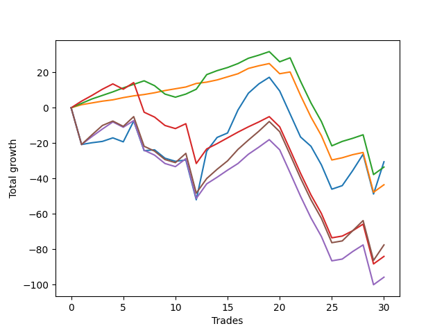

# Long Wallace 011 
- Symbol: ES_SmolBoi
- Date Range: 03/18/2022 - 07/29/2022
- Trading Period: 7:20-12:30
- Number of Trades: 30



| Name | Win Percent | Profit | Avg Profit / Trade | Avg Time / Trade |      | Name | Win Percent | Profit | Avg Profit / Trade | Avg Time / Trade |
| ---- | ----------- | ------ | ------------------ | ---------------- | ---- | ---- | ----------- | ------ | ------------------ | ---------------- |
| Sorted By <br> Profit | | | | | | Sorted By <br> Win Percentage ||||
| Two | 56.67 | -15250.00 | -508.33 | 106:16 |     | Eighty-One | 80.00 | -21750.00 | -725.00 | 54:13 |
| Eighty-Two | 70.00 | -16750.00 | -558.33 | 57:39 |     | Eighty-Two | 70.00 | -16750.00 | -558.33 | 57:39 |
| Eighty-One | 80.00 | -21750.00 | -725.00 | 54:13 |     | Two | 56.67 | -15250.00 | -508.33 | 106:16 |
| Eighty-Five | 53.33 | -38750.00 | -1291.67 | 65:56 |     | Eighty-Three | 56.67 | -42000.00 | -1400.00 | 63:44 |
| Eighty-Three | 56.67 | -42000.00 | -1400.00 | 63:44 |     | Eighty-Five | 53.33 | -38750.00 | -1291.67 | 65:56 |
| Eighty-Four | 53.33 | -47875.00 | -1595.83 | 65:04 |     | Eighty-Four | 53.33 | -47875.00 | -1595.83 | 65:04 |

## NO STOPLOSS

### Test Two
* Sell when the price hits the upper line of the 20p 2std bollinger
* No Stoploss
* Results:
```
Total Trades: 30
Percent Up: 56.67
Percent Down: 43.33
Total Points Moved Up: -30.50
Potential Profit: -15250.00
Total Points Ups: 124.00 Count Ups: 17
Total Points Downs: -154.50 Count Downs: 13
```

<details><summary>Trades</summary>

<code>In: 2022-03-21 09:35:00		Out: 2022-03-21 10:04:55		Total Position Time: 29:55		Total Move Up: -20.75		Total to Date: -20.75</code> <br />
<code>In: 2022-03-23 09:14:00		Out: 2022-03-23 09:43:55		Total Position Time: 29:55		Total Move Up: 1.00		Total to Date: -19.75</code> <br />
<code>In: 2022-03-23 09:47:00		Out: 2022-03-23 10:16:55		Total Position Time: 29:55		Total Move Up: 0.75		Total to Date: -19.00</code> <br />
<code>In: 2022-03-23 10:28:00		Out: 2022-03-23 10:54:25		Total Position Time: 26:25		Total Move Up: 2.00		Total to Date: -17.00</code> <br />
<code>In: 2022-03-25 08:14:00		Out: 2022-03-25 08:41:45		Total Position Time: 27:45		Total Move Up: -2.25		Total to Date: -19.25</code> <br />
<code>In: 2022-03-25 08:29:00		Out: 2022-03-25 08:41:45		Total Position Time: 12:45		Total Move Up: 11.75		Total to Date: -7.50</code> <br />
<code>In: 2022-03-28 08:27:00		Out: 2022-03-28 08:56:55		Total Position Time: 29:55		Total Move Up: -16.75		Total to Date: -24.25</code> <br />
<code>In: 2022-03-31 09:23:00		Out: 2022-03-31 09:44:20		Total Position Time: 21:20		Total Move Up: 0.50		Total to Date: -23.75</code> <br />
<code>In: 2022-04-12 07:41:00		Out: 2022-04-12 08:10:55		Total Position Time: 29:55		Total Move Up: -4.75		Total to Date: -28.50</code> <br />
<code>In: 2022-04-18 08:29:00		Out: 2022-04-18 08:58:55		Total Position Time: 29:55		Total Move Up: -1.75		Total to Date: -30.25</code> <br />
<code>In: 2022-04-20 09:14:00		Out: 2022-04-20 09:31:05		Total Position Time: 17:05		Total Move Up: 0.75		Total to Date: -29.50</code> <br />
<code>In: 2022-04-29 07:22:00		Out: 2022-04-29 07:51:55		Total Position Time: 29:55		Total Move Up: -22.50		Total to Date: -52.00</code> <br />
<code>In: 2022-05-04 11:36:00		Out: 2022-05-04 11:43:45		Total Position Time: 07:45		Total Move Up: 27.50		Total to Date: -24.50</code> <br />
<code>In: 2022-05-13 11:07:00		Out: 2022-05-13 11:31:20		Total Position Time: 24:20		Total Move Up: 7.75		Total to Date: -16.75</code> <br />
<code>In: 2022-05-16 07:55:00		Out: 2022-05-16 08:11:30		Total Position Time: 16:30		Total Move Up: 2.50		Total to Date: -14.25</code> <br />
<code>In: 2022-05-17 11:24:00		Out: 2022-05-17 11:40:00		Total Position Time: 16:00		Total Move Up: 13.00		Total to Date: -1.25</code> <br />
<code>In: 2022-05-17 11:25:00		Out: 2022-05-17 11:40:00		Total Position Time: 15:00		Total Move Up: 9.50		Total to Date: 8.25</code> <br />
<code>In: 2022-05-25 09:29:00		Out: 2022-05-25 09:45:20		Total Position Time: 16:20		Total Move Up: 5.25		Total to Date: 13.50</code> <br />
<code>In: 2022-05-25 09:30:00		Out: 2022-05-25 09:45:20		Total Position Time: 15:20		Total Move Up: 3.75		Total to Date: 17.25</code> <br />
<code>In: 2022-06-06 08:15:00		Out: 2022-06-06 08:43:00		Total Position Time: 28:00		Total Move Up: -7.75		Total to Date: 9.50</code> <br />
<code>In: 2022-06-08 09:29:00		Out: 2022-06-08 09:58:55		Total Position Time: 29:55		Total Move Up: -13.00		Total to Date: -3.50</code> <br />
<code>In: 2022-06-08 09:30:00		Out: 2022-06-08 09:59:10		Total Position Time: 29:10		Total Move Up: -13.00		Total to Date: -16.50</code> <br />
<code>In: 2022-06-08 09:35:00		Out: 2022-06-08 09:59:10		Total Position Time: 24:10		Total Move Up: -5.25		Total to Date: -21.75</code> <br />
<code>In: 2022-06-15 07:35:00		Out: 2022-06-15 08:04:55		Total Position Time: 29:55		Total Move Up: -10.50		Total to Date: -32.25</code> <br />
<code>In: 2022-06-15 07:48:00		Out: 2022-06-15 08:17:55		Total Position Time: 29:55		Total Move Up: -13.75		Total to Date: -46.00</code> <br />
<code>In: 2022-06-27 10:45:00		Out: 2022-06-27 11:13:35		Total Position Time: 28:35		Total Move Up: 2.00		Total to Date: -44.00</code> <br />
<code>In: 2022-06-29 08:25:00		Out: 2022-06-29 08:34:40		Total Position Time: 09:40		Total Move Up: 8.50		Total to Date: -35.50</code> <br />
<code>In: 2022-07-11 12:07:00		Out: 2022-07-12 06:36:00		Total Position Time: 1109:00		Total Move Up: 9.25		Total to Date: -26.25</code> <br />
<code>In: 2022-07-12 11:36:00		Out: 2022-07-13 10:16:00		Total Position Time: 1360:00		Total Move Up: -22.50		Total to Date: -48.75</code> <br />
<code>In: 2022-07-20 10:14:00		Out: 2022-07-20 11:38:00		Total Position Time: 84:00		Total Move Up: 18.25		Total to Date: -30.50</code> <br />


</details>

## TAKE PROFIT

### Test Eighty-One
* Take Profit of 1 Point
* No Stoploss
* Results:
```
Total Trades: 30
Percent Up: 80.00
Percent Down: 20.00
Total Points Moved Up: -43.50
Potential Profit: -21750.00
Total Points Ups: 34.50 Count Ups: 24
Total Points Downs: -78.00 Count Downs: 6
```

<details><summary>Trades</summary>

<code>In: 2022-03-21 09:35:00		Out: 2022-03-21 09:44:55		Total Position Time: 09:55		Total Move Up: 1.75		Total to Date: 1.75</code> <br />
<code>In: 2022-03-23 09:14:00		Out: 2022-03-23 09:14:10		Total Position Time: 00:10		Total Move Up: 1.00		Total to Date: 2.75</code> <br />
<code>In: 2022-03-23 09:47:00		Out: 2022-03-23 09:47:35		Total Position Time: 00:35		Total Move Up: 1.00		Total to Date: 3.75</code> <br />
<code>In: 2022-03-23 10:28:00		Out: 2022-03-23 10:34:30		Total Position Time: 06:30		Total Move Up: 0.75		Total to Date: 4.50</code> <br />
<code>In: 2022-03-25 08:14:00		Out: 2022-03-25 08:15:50		Total Position Time: 01:50		Total Move Up: 1.25		Total to Date: 5.75</code> <br />
<code>In: 2022-03-25 08:29:00		Out: 2022-03-25 08:29:10		Total Position Time: 00:10		Total Move Up: 1.00		Total to Date: 6.75</code> <br />
<code>In: 2022-03-28 08:27:00		Out: 2022-03-28 08:27:45		Total Position Time: 00:45		Total Move Up: 0.75		Total to Date: 7.50</code> <br />
<code>In: 2022-03-31 09:23:00		Out: 2022-03-31 09:44:50		Total Position Time: 21:50		Total Move Up: 1.00		Total to Date: 8.50</code> <br />
<code>In: 2022-04-12 07:41:00		Out: 2022-04-12 07:46:15		Total Position Time: 05:15		Total Move Up: 1.25		Total to Date: 9.75</code> <br />
<code>In: 2022-04-18 08:29:00		Out: 2022-04-18 08:29:25		Total Position Time: 00:25		Total Move Up: 1.00		Total to Date: 10.75</code> <br />
<code>In: 2022-04-20 09:14:00		Out: 2022-04-20 09:18:50		Total Position Time: 04:50		Total Move Up: 1.00		Total to Date: 11.75</code> <br />
<code>In: 2022-04-29 07:22:00		Out: 2022-04-29 07:22:10		Total Position Time: 00:10		Total Move Up: 2.00		Total to Date: 13.75</code> <br />
<code>In: 2022-05-04 11:36:00		Out: 2022-05-04 11:36:10		Total Position Time: 00:10		Total Move Up: 0.75		Total to Date: 14.50</code> <br />
<code>In: 2022-05-13 11:07:00		Out: 2022-05-13 11:09:25		Total Position Time: 02:25		Total Move Up: 1.25		Total to Date: 15.75</code> <br />
<code>In: 2022-05-16 07:55:00		Out: 2022-05-16 08:09:55		Total Position Time: 14:55		Total Move Up: 1.75		Total to Date: 17.50</code> <br />
<code>In: 2022-05-17 11:24:00		Out: 2022-05-17 11:24:25		Total Position Time: 00:25		Total Move Up: 1.75		Total to Date: 19.25</code> <br />
<code>In: 2022-05-17 11:25:00		Out: 2022-05-17 11:26:40		Total Position Time: 01:40		Total Move Up: 3.00		Total to Date: 22.25</code> <br />
<code>In: 2022-05-25 09:29:00		Out: 2022-05-25 09:30:00		Total Position Time: 01:00		Total Move Up: 1.50		Total to Date: 23.75</code> <br />
<code>In: 2022-05-25 09:30:00		Out: 2022-05-25 09:30:15		Total Position Time: 00:15		Total Move Up: 1.25		Total to Date: 25.00</code> <br />
<code>In: 2022-06-06 08:15:00		Out: 2022-06-06 08:44:55		Total Position Time: 29:55		Total Move Up: -5.75		Total to Date: 19.25</code> <br />
<code>In: 2022-06-08 09:29:00		Out: 2022-06-08 09:29:15		Total Position Time: 00:15		Total Move Up: 1.00		Total to Date: 20.25</code> <br />
<code>In: 2022-06-08 09:30:00		Out: 2022-06-08 09:59:55		Total Position Time: 29:55		Total Move Up: -13.25		Total to Date: 7.00</code> <br />
<code>In: 2022-06-08 09:35:00		Out: 2022-06-08 10:04:55		Total Position Time: 29:55		Total Move Up: -12.25		Total to Date: -5.25</code> <br />
<code>In: 2022-06-15 07:35:00		Out: 2022-06-15 08:04:55		Total Position Time: 29:55		Total Move Up: -10.50		Total to Date: -15.75</code> <br />
<code>In: 2022-06-15 07:48:00		Out: 2022-06-15 08:17:55		Total Position Time: 29:55		Total Move Up: -13.75		Total to Date: -29.50</code> <br />
<code>In: 2022-06-27 10:45:00		Out: 2022-06-27 10:51:15		Total Position Time: 06:15		Total Move Up: 1.25		Total to Date: -28.25</code> <br />
<code>In: 2022-06-29 08:25:00		Out: 2022-06-29 08:25:15		Total Position Time: 00:15		Total Move Up: 1.75		Total to Date: -26.50</code> <br />
<code>In: 2022-07-11 12:07:00		Out: 2022-07-11 12:31:00		Total Position Time: 24:00		Total Move Up: 1.25		Total to Date: -25.25</code> <br />
<code>In: 2022-07-12 11:36:00		Out: 2022-07-13 10:16:00		Total Position Time: 1360:00		Total Move Up: -22.50		Total to Date: -47.75</code> <br />
<code>In: 2022-07-20 10:14:00		Out: 2022-07-20 10:27:00		Total Position Time: 13:00		Total Move Up: 4.25		Total to Date: -43.50</code> <br />


</details>

### Test Eighty-Two
* Take Profit of 2 Point
* No Stoploss
* Results:
```
Total Trades: 30
Percent Up: 70.00
Percent Down: 30.00
Total Points Moved Up: -33.50
Potential Profit: -16750.00
Total Points Ups: 53.75 Count Ups: 21
Total Points Downs: -87.25 Count Downs: 9
```

<details><summary>Trades</summary>

<code>In: 2022-03-21 09:35:00		Out: 2022-03-21 09:45:00		Total Position Time: 10:00		Total Move Up: 2.50		Total to Date: 2.50</code> <br />
<code>In: 2022-03-23 09:14:00		Out: 2022-03-23 09:14:55		Total Position Time: 00:55		Total Move Up: 2.50		Total to Date: 5.00</code> <br />
<code>In: 2022-03-23 09:47:00		Out: 2022-03-23 09:48:20		Total Position Time: 01:20		Total Move Up: 2.00		Total to Date: 7.00</code> <br />
<code>In: 2022-03-23 10:28:00		Out: 2022-03-23 10:54:25		Total Position Time: 26:25		Total Move Up: 2.00		Total to Date: 9.00</code> <br />
<code>In: 2022-03-25 08:14:00		Out: 2022-03-25 08:16:05		Total Position Time: 02:05		Total Move Up: 2.25		Total to Date: 11.25</code> <br />
<code>In: 2022-03-25 08:29:00		Out: 2022-03-25 08:29:20		Total Position Time: 00:20		Total Move Up: 2.00		Total to Date: 13.25</code> <br />
<code>In: 2022-03-28 08:27:00		Out: 2022-03-28 08:28:10		Total Position Time: 01:10		Total Move Up: 2.00		Total to Date: 15.25</code> <br />
<code>In: 2022-03-31 09:23:00		Out: 2022-03-31 09:52:55		Total Position Time: 29:55		Total Move Up: -2.75		Total to Date: 12.50</code> <br />
<code>In: 2022-04-12 07:41:00		Out: 2022-04-12 08:10:55		Total Position Time: 29:55		Total Move Up: -4.75		Total to Date: 7.75</code> <br />
<code>In: 2022-04-18 08:29:00		Out: 2022-04-18 08:58:55		Total Position Time: 29:55		Total Move Up: -1.75		Total to Date: 6.00</code> <br />
<code>In: 2022-04-20 09:14:00		Out: 2022-04-20 09:31:35		Total Position Time: 17:35		Total Move Up: 1.75		Total to Date: 7.75</code> <br />
<code>In: 2022-04-29 07:22:00		Out: 2022-04-29 07:22:15		Total Position Time: 00:15		Total Move Up: 2.75		Total to Date: 10.50</code> <br />
<code>In: 2022-05-04 11:36:00		Out: 2022-05-04 11:36:40		Total Position Time: 00:40		Total Move Up: 8.25		Total to Date: 18.75</code> <br />
<code>In: 2022-05-13 11:07:00		Out: 2022-05-13 11:09:30		Total Position Time: 02:30		Total Move Up: 2.25		Total to Date: 21.00</code> <br />
<code>In: 2022-05-16 07:55:00		Out: 2022-05-16 08:09:55		Total Position Time: 14:55		Total Move Up: 1.75		Total to Date: 22.75</code> <br />
<code>In: 2022-05-17 11:24:00		Out: 2022-05-17 11:24:35		Total Position Time: 00:35		Total Move Up: 2.25		Total to Date: 25.00</code> <br />
<code>In: 2022-05-17 11:25:00		Out: 2022-05-17 11:26:40		Total Position Time: 01:40		Total Move Up: 3.00		Total to Date: 28.00</code> <br />
<code>In: 2022-05-25 09:29:00		Out: 2022-05-25 09:30:05		Total Position Time: 01:05		Total Move Up: 1.75		Total to Date: 29.75</code> <br />
<code>In: 2022-05-25 09:30:00		Out: 2022-05-25 09:30:25		Total Position Time: 00:25		Total Move Up: 2.00		Total to Date: 31.75</code> <br />
<code>In: 2022-06-06 08:15:00		Out: 2022-06-06 08:44:55		Total Position Time: 29:55		Total Move Up: -5.75		Total to Date: 26.00</code> <br />
<code>In: 2022-06-08 09:29:00		Out: 2022-06-08 09:29:55		Total Position Time: 00:55		Total Move Up: 2.25		Total to Date: 28.25</code> <br />
<code>In: 2022-06-08 09:30:00		Out: 2022-06-08 09:59:55		Total Position Time: 29:55		Total Move Up: -13.25		Total to Date: 15.00</code> <br />
<code>In: 2022-06-08 09:35:00		Out: 2022-06-08 10:04:55		Total Position Time: 29:55		Total Move Up: -12.25		Total to Date: 2.75</code> <br />
<code>In: 2022-06-15 07:35:00		Out: 2022-06-15 08:04:55		Total Position Time: 29:55		Total Move Up: -10.50		Total to Date: -7.75</code> <br />
<code>In: 2022-06-15 07:48:00		Out: 2022-06-15 08:17:55		Total Position Time: 29:55		Total Move Up: -13.75		Total to Date: -21.50</code> <br />
<code>In: 2022-06-27 10:45:00		Out: 2022-06-27 10:54:20		Total Position Time: 09:20		Total Move Up: 2.50		Total to Date: -19.00</code> <br />
<code>In: 2022-06-29 08:25:00		Out: 2022-06-29 08:25:15		Total Position Time: 00:15		Total Move Up: 1.75		Total to Date: -17.25</code> <br />
<code>In: 2022-07-11 12:07:00		Out: 2022-07-11 12:32:00		Total Position Time: 25:00		Total Move Up: 2.00		Total to Date: -15.25</code> <br />
<code>In: 2022-07-12 11:36:00		Out: 2022-07-13 10:16:00		Total Position Time: 1360:00		Total Move Up: -22.50		Total to Date: -37.75</code> <br />
<code>In: 2022-07-20 10:14:00		Out: 2022-07-20 10:27:00		Total Position Time: 13:00		Total Move Up: 4.25		Total to Date: -33.50</code> <br />


</details>

### Test Eighty-Three
* Take Profit of 3 Point
* No Stoploss
* Results:
```
Total Trades: 30
Percent Up: 56.67
Percent Down: 43.33
Total Points Moved Up: -84.00
Potential Profit: -42000.00
Total Points Ups: 58.50 Count Ups: 17
Total Points Downs: -142.50 Count Downs: 13
```

<details><summary>Trades</summary>

<code>In: 2022-03-21 09:35:00		Out: 2022-03-21 09:49:45		Total Position Time: 14:45		Total Move Up: 3.75		Total to Date: 3.75</code> <br />
<code>In: 2022-03-23 09:14:00		Out: 2022-03-23 09:15:15		Total Position Time: 01:15		Total Move Up: 3.25		Total to Date: 7.00</code> <br />
<code>In: 2022-03-23 09:47:00		Out: 2022-03-23 09:52:30		Total Position Time: 05:30		Total Move Up: 3.50		Total to Date: 10.50</code> <br />
<code>In: 2022-03-23 10:28:00		Out: 2022-03-23 10:54:50		Total Position Time: 26:50		Total Move Up: 3.00		Total to Date: 13.50</code> <br />
<code>In: 2022-03-25 08:14:00		Out: 2022-03-25 08:43:55		Total Position Time: 29:55		Total Move Up: -3.00		Total to Date: 10.50</code> <br />
<code>In: 2022-03-25 08:29:00		Out: 2022-03-25 08:29:55		Total Position Time: 00:55		Total Move Up: 3.75		Total to Date: 14.25</code> <br />
<code>In: 2022-03-28 08:27:00		Out: 2022-03-28 08:56:55		Total Position Time: 29:55		Total Move Up: -16.75		Total to Date: -2.50</code> <br />
<code>In: 2022-03-31 09:23:00		Out: 2022-03-31 09:52:55		Total Position Time: 29:55		Total Move Up: -2.75		Total to Date: -5.25</code> <br />
<code>In: 2022-04-12 07:41:00		Out: 2022-04-12 08:10:55		Total Position Time: 29:55		Total Move Up: -4.75		Total to Date: -10.00</code> <br />
<code>In: 2022-04-18 08:29:00		Out: 2022-04-18 08:58:55		Total Position Time: 29:55		Total Move Up: -1.75		Total to Date: -11.75</code> <br />
<code>In: 2022-04-20 09:14:00		Out: 2022-04-20 09:32:30		Total Position Time: 18:30		Total Move Up: 2.75		Total to Date: -9.00</code> <br />
<code>In: 2022-04-29 07:22:00		Out: 2022-04-29 07:51:55		Total Position Time: 29:55		Total Move Up: -22.50		Total to Date: -31.50</code> <br />
<code>In: 2022-05-04 11:36:00		Out: 2022-05-04 11:36:40		Total Position Time: 00:40		Total Move Up: 8.25		Total to Date: -23.25</code> <br />
<code>In: 2022-05-13 11:07:00		Out: 2022-05-13 11:09:35		Total Position Time: 02:35		Total Move Up: 3.00		Total to Date: -20.25</code> <br />
<code>In: 2022-05-16 07:55:00		Out: 2022-05-16 08:11:35		Total Position Time: 16:35		Total Move Up: 3.25		Total to Date: -17.00</code> <br />
<code>In: 2022-05-17 11:24:00		Out: 2022-05-17 11:24:40		Total Position Time: 00:40		Total Move Up: 3.25		Total to Date: -13.75</code> <br />
<code>In: 2022-05-17 11:25:00		Out: 2022-05-17 11:26:40		Total Position Time: 01:40		Total Move Up: 3.00		Total to Date: -10.75</code> <br />
<code>In: 2022-05-25 09:29:00		Out: 2022-05-25 09:30:15		Total Position Time: 01:15		Total Move Up: 2.75		Total to Date: -8.00</code> <br />
<code>In: 2022-05-25 09:30:00		Out: 2022-05-25 09:31:45		Total Position Time: 01:45		Total Move Up: 3.00		Total to Date: -5.00</code> <br />
<code>In: 2022-06-06 08:15:00		Out: 2022-06-06 08:44:55		Total Position Time: 29:55		Total Move Up: -5.75		Total to Date: -10.75</code> <br />
<code>In: 2022-06-08 09:29:00		Out: 2022-06-08 09:58:55		Total Position Time: 29:55		Total Move Up: -13.00		Total to Date: -23.75</code> <br />
<code>In: 2022-06-08 09:30:00		Out: 2022-06-08 09:59:55		Total Position Time: 29:55		Total Move Up: -13.25		Total to Date: -37.00</code> <br />
<code>In: 2022-06-08 09:35:00		Out: 2022-06-08 10:04:55		Total Position Time: 29:55		Total Move Up: -12.25		Total to Date: -49.25</code> <br />
<code>In: 2022-06-15 07:35:00		Out: 2022-06-15 08:04:55		Total Position Time: 29:55		Total Move Up: -10.50		Total to Date: -59.75</code> <br />
<code>In: 2022-06-15 07:48:00		Out: 2022-06-15 08:17:55		Total Position Time: 29:55		Total Move Up: -13.75		Total to Date: -73.50</code> <br />
<code>In: 2022-06-27 10:45:00		Out: 2022-06-27 11:14:55		Total Position Time: 29:55		Total Move Up: 1.00		Total to Date: -72.50</code> <br />
<code>In: 2022-06-29 08:25:00		Out: 2022-06-29 08:25:20		Total Position Time: 00:20		Total Move Up: 3.00		Total to Date: -69.50</code> <br />
<code>In: 2022-07-11 12:07:00		Out: 2022-07-11 13:04:00		Total Position Time: 57:00		Total Move Up: 3.75		Total to Date: -65.75</code> <br />
<code>In: 2022-07-12 11:36:00		Out: 2022-07-13 10:16:00		Total Position Time: 1360:00		Total Move Up: -22.50		Total to Date: -88.25</code> <br />
<code>In: 2022-07-20 10:14:00		Out: 2022-07-20 10:27:00		Total Position Time: 13:00		Total Move Up: 4.25		Total to Date: -84.00</code> <br />


</details>

### Test Eighty-Four
* Take Profit of 4 Point
* No Stoploss
* Results:
```
Total Trades: 30
Percent Up: 53.33
Percent Down: 46.67
Total Points Moved Up: -95.75
Potential Profit: -47875.00
Total Points Ups: 67.50 Count Ups: 16
Total Points Downs: -163.25 Count Downs: 14
```

<details><summary>Trades</summary>

<code>In: 2022-03-21 09:35:00		Out: 2022-03-21 10:04:55		Total Position Time: 29:55		Total Move Up: -20.75		Total to Date: -20.75</code> <br />
<code>In: 2022-03-23 09:14:00		Out: 2022-03-23 09:15:45		Total Position Time: 01:45		Total Move Up: 4.50		Total to Date: -16.25</code> <br />
<code>In: 2022-03-23 09:47:00		Out: 2022-03-23 09:52:50		Total Position Time: 05:50		Total Move Up: 4.25		Total to Date: -12.00</code> <br />
<code>In: 2022-03-23 10:28:00		Out: 2022-03-23 10:55:05		Total Position Time: 27:05		Total Move Up: 4.00		Total to Date: -8.00</code> <br />
<code>In: 2022-03-25 08:14:00		Out: 2022-03-25 08:43:55		Total Position Time: 29:55		Total Move Up: -3.00		Total to Date: -11.00</code> <br />
<code>In: 2022-03-25 08:29:00		Out: 2022-03-25 08:29:55		Total Position Time: 00:55		Total Move Up: 3.75		Total to Date: -7.25</code> <br />
<code>In: 2022-03-28 08:27:00		Out: 2022-03-28 08:56:55		Total Position Time: 29:55		Total Move Up: -16.75		Total to Date: -24.00</code> <br />
<code>In: 2022-03-31 09:23:00		Out: 2022-03-31 09:52:55		Total Position Time: 29:55		Total Move Up: -2.75		Total to Date: -26.75</code> <br />
<code>In: 2022-04-12 07:41:00		Out: 2022-04-12 08:10:55		Total Position Time: 29:55		Total Move Up: -4.75		Total to Date: -31.50</code> <br />
<code>In: 2022-04-18 08:29:00		Out: 2022-04-18 08:58:55		Total Position Time: 29:55		Total Move Up: -1.75		Total to Date: -33.25</code> <br />
<code>In: 2022-04-20 09:14:00		Out: 2022-04-20 09:32:40		Total Position Time: 18:40		Total Move Up: 4.50		Total to Date: -28.75</code> <br />
<code>In: 2022-04-29 07:22:00		Out: 2022-04-29 07:51:55		Total Position Time: 29:55		Total Move Up: -22.50		Total to Date: -51.25</code> <br />
<code>In: 2022-05-04 11:36:00		Out: 2022-05-04 11:36:40		Total Position Time: 00:40		Total Move Up: 8.25		Total to Date: -43.00</code> <br />
<code>In: 2022-05-13 11:07:00		Out: 2022-05-13 11:10:20		Total Position Time: 03:20		Total Move Up: 3.75		Total to Date: -39.25</code> <br />
<code>In: 2022-05-16 07:55:00		Out: 2022-05-16 08:13:10		Total Position Time: 18:10		Total Move Up: 4.00		Total to Date: -35.25</code> <br />
<code>In: 2022-05-17 11:24:00		Out: 2022-05-17 11:24:50		Total Position Time: 00:50		Total Move Up: 3.75		Total to Date: -31.50</code> <br />
<code>In: 2022-05-17 11:25:00		Out: 2022-05-17 11:27:05		Total Position Time: 02:05		Total Move Up: 5.25		Total to Date: -26.25</code> <br />
<code>In: 2022-05-25 09:29:00		Out: 2022-05-25 09:30:30		Total Position Time: 01:30		Total Move Up: 4.00		Total to Date: -22.25</code> <br />
<code>In: 2022-05-25 09:30:00		Out: 2022-05-25 09:48:10		Total Position Time: 18:10		Total Move Up: 4.25		Total to Date: -18.00</code> <br />
<code>In: 2022-06-06 08:15:00		Out: 2022-06-06 08:44:55		Total Position Time: 29:55		Total Move Up: -5.75		Total to Date: -23.75</code> <br />
<code>In: 2022-06-08 09:29:00		Out: 2022-06-08 09:58:55		Total Position Time: 29:55		Total Move Up: -13.00		Total to Date: -36.75</code> <br />
<code>In: 2022-06-08 09:30:00		Out: 2022-06-08 09:59:55		Total Position Time: 29:55		Total Move Up: -13.25		Total to Date: -50.00</code> <br />
<code>In: 2022-06-08 09:35:00		Out: 2022-06-08 10:04:55		Total Position Time: 29:55		Total Move Up: -12.25		Total to Date: -62.25</code> <br />
<code>In: 2022-06-15 07:35:00		Out: 2022-06-15 08:04:55		Total Position Time: 29:55		Total Move Up: -10.50		Total to Date: -72.75</code> <br />
<code>In: 2022-06-15 07:48:00		Out: 2022-06-15 08:17:55		Total Position Time: 29:55		Total Move Up: -13.75		Total to Date: -86.50</code> <br />
<code>In: 2022-06-27 10:45:00		Out: 2022-06-27 11:14:55		Total Position Time: 29:55		Total Move Up: 1.00		Total to Date: -85.50</code> <br />
<code>In: 2022-06-29 08:25:00		Out: 2022-06-29 08:28:15		Total Position Time: 03:15		Total Move Up: 4.25		Total to Date: -81.25</code> <br />
<code>In: 2022-07-11 12:07:00		Out: 2022-07-11 13:05:00		Total Position Time: 58:00		Total Move Up: 3.75		Total to Date: -77.50</code> <br />
<code>In: 2022-07-12 11:36:00		Out: 2022-07-13 10:16:00		Total Position Time: 1360:00		Total Move Up: -22.50		Total to Date: -100.00</code> <br />
<code>In: 2022-07-20 10:14:00		Out: 2022-07-20 10:27:00		Total Position Time: 13:00		Total Move Up: 4.25		Total to Date: -95.75</code> <br />


</details>

### Test Eighty-Five
* Take Profit of 5 Point
* No Stoploss
* Results:
```
Total Trades: 30
Percent Up: 53.33
Percent Down: 46.67
Total Points Moved Up: -77.50
Potential Profit: -38750.00
Total Points Ups: 85.75 Count Ups: 16
Total Points Downs: -163.25 Count Downs: 14
```

<details><summary>Trades</summary>

<code>In: 2022-03-21 09:35:00		Out: 2022-03-21 10:04:55		Total Position Time: 29:55		Total Move Up: -20.75		Total to Date: -20.75</code> <br />
<code>In: 2022-03-23 09:14:00		Out: 2022-03-23 09:16:05		Total Position Time: 02:05		Total Move Up: 5.50		Total to Date: -15.25</code> <br />
<code>In: 2022-03-23 09:47:00		Out: 2022-03-23 09:59:10		Total Position Time: 12:10		Total Move Up: 5.25		Total to Date: -10.00</code> <br />
<code>In: 2022-03-23 10:28:00		Out: 2022-03-23 10:57:55		Total Position Time: 29:55		Total Move Up: 2.50		Total to Date: -7.50</code> <br />
<code>In: 2022-03-25 08:14:00		Out: 2022-03-25 08:43:55		Total Position Time: 29:55		Total Move Up: -3.00		Total to Date: -10.50</code> <br />
<code>In: 2022-03-25 08:29:00		Out: 2022-03-25 08:30:20		Total Position Time: 01:20		Total Move Up: 5.50		Total to Date: -5.00</code> <br />
<code>In: 2022-03-28 08:27:00		Out: 2022-03-28 08:56:55		Total Position Time: 29:55		Total Move Up: -16.75		Total to Date: -21.75</code> <br />
<code>In: 2022-03-31 09:23:00		Out: 2022-03-31 09:52:55		Total Position Time: 29:55		Total Move Up: -2.75		Total to Date: -24.50</code> <br />
<code>In: 2022-04-12 07:41:00		Out: 2022-04-12 08:10:55		Total Position Time: 29:55		Total Move Up: -4.75		Total to Date: -29.25</code> <br />
<code>In: 2022-04-18 08:29:00		Out: 2022-04-18 08:58:55		Total Position Time: 29:55		Total Move Up: -1.75		Total to Date: -31.00</code> <br />
<code>In: 2022-04-20 09:14:00		Out: 2022-04-20 09:32:55		Total Position Time: 18:55		Total Move Up: 5.25		Total to Date: -25.75</code> <br />
<code>In: 2022-04-29 07:22:00		Out: 2022-04-29 07:51:55		Total Position Time: 29:55		Total Move Up: -22.50		Total to Date: -48.25</code> <br />
<code>In: 2022-05-04 11:36:00		Out: 2022-05-04 11:36:40		Total Position Time: 00:40		Total Move Up: 8.25		Total to Date: -40.00</code> <br />
<code>In: 2022-05-13 11:07:00		Out: 2022-05-13 11:10:50		Total Position Time: 03:50		Total Move Up: 5.25		Total to Date: -34.75</code> <br />
<code>In: 2022-05-16 07:55:00		Out: 2022-05-16 08:16:30		Total Position Time: 21:30		Total Move Up: 4.75		Total to Date: -30.00</code> <br />
<code>In: 2022-05-17 11:24:00		Out: 2022-05-17 11:26:40		Total Position Time: 02:40		Total Move Up: 6.50		Total to Date: -23.50</code> <br />
<code>In: 2022-05-17 11:25:00		Out: 2022-05-17 11:27:05		Total Position Time: 02:05		Total Move Up: 5.25		Total to Date: -18.25</code> <br />
<code>In: 2022-05-25 09:29:00		Out: 2022-05-25 09:32:10		Total Position Time: 03:10		Total Move Up: 5.00		Total to Date: -13.25</code> <br />
<code>In: 2022-05-25 09:30:00		Out: 2022-05-25 09:48:50		Total Position Time: 18:50		Total Move Up: 5.50		Total to Date: -7.75</code> <br />
<code>In: 2022-06-06 08:15:00		Out: 2022-06-06 08:44:55		Total Position Time: 29:55		Total Move Up: -5.75		Total to Date: -13.50</code> <br />
<code>In: 2022-06-08 09:29:00		Out: 2022-06-08 09:58:55		Total Position Time: 29:55		Total Move Up: -13.00		Total to Date: -26.50</code> <br />
<code>In: 2022-06-08 09:30:00		Out: 2022-06-08 09:59:55		Total Position Time: 29:55		Total Move Up: -13.25		Total to Date: -39.75</code> <br />
<code>In: 2022-06-08 09:35:00		Out: 2022-06-08 10:04:55		Total Position Time: 29:55		Total Move Up: -12.25		Total to Date: -52.00</code> <br />
<code>In: 2022-06-15 07:35:00		Out: 2022-06-15 08:04:55		Total Position Time: 29:55		Total Move Up: -10.50		Total to Date: -62.50</code> <br />
<code>In: 2022-06-15 07:48:00		Out: 2022-06-15 08:17:55		Total Position Time: 29:55		Total Move Up: -13.75		Total to Date: -76.25</code> <br />
<code>In: 2022-06-27 10:45:00		Out: 2022-06-27 11:14:55		Total Position Time: 29:55		Total Move Up: 1.00		Total to Date: -75.25</code> <br />
<code>In: 2022-06-29 08:25:00		Out: 2022-06-29 08:32:15		Total Position Time: 07:15		Total Move Up: 5.75		Total to Date: -69.50</code> <br />
<code>In: 2022-07-11 12:07:00		Out: 2022-07-11 13:07:00		Total Position Time: 60:00		Total Move Up: 5.75		Total to Date: -63.75</code> <br />
<code>In: 2022-07-12 11:36:00		Out: 2022-07-13 10:16:00		Total Position Time: 1360:00		Total Move Up: -22.50		Total to Date: -86.25</code> <br />
<code>In: 2022-07-20 10:14:00		Out: 2022-07-20 10:29:00		Total Position Time: 15:00		Total Move Up: 8.75		Total to Date: -77.50</code> <br />


</details>