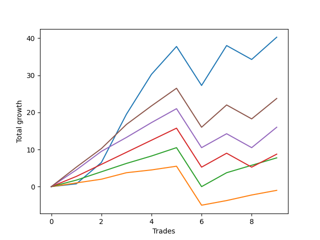

# Long Wallace 012 
- Symbol: ES_SmolBoi
- Date Range: 03/18/2022 - 07/29/2022
- Trading Period: 7:20-12:30
- Number of Trades: 9



| Name | Win Percent | Profit | Avg Profit / Trade | Avg Time / Trade |      | Name | Win Percent | Profit | Avg Profit / Trade | Avg Time / Trade |
| ---- | ----------- | ------ | ------------------ | ---------------- | ---- | ---- | ----------- | ------ | ------------------ | ---------------- |
| Sorted By <br> Profit | | | | | | Sorted By <br> Win Percentage ||||
| Two | 77.78 | 20125.00 | 2236.11 | 31:26 |     | Eighty-Two | 88.89 | 3875.00 | 430.56 | 21:32 |
| Eighty-Five | 77.78 | 11875.00 | 1319.44 | 26:00 |     | Eighty-One | 88.89 | -500.00 | -55.56 | 19:08 |
| Eighty-Four | 77.78 | 8000.00 | 888.89 | 25:33 |     | Two | 77.78 | 20125.00 | 2236.11 | 31:26 |
| Eighty-Three | 77.78 | 4375.00 | 486.11 | 25:01 |     | Eighty-Five | 77.78 | 11875.00 | 1319.44 | 26:00 |
| Eighty-Two | 88.89 | 3875.00 | 430.56 | 21:32 |     | Eighty-Four | 77.78 | 8000.00 | 888.89 | 25:33 |
| Eighty-One | 88.89 | -500.00 | -55.56 | 19:08 |     | Eighty-Three | 77.78 | 4375.00 | 486.11 | 25:01 |

## NO STOPLOSS

### Test Two
* Sell when the price hits the upper line of the 20p 2std bollinger
* No Stoploss
* Results:
```
Total Trades: 9
Percent Up: 77.78
Percent Down: 22.22
Total Points Moved Up: 40.25
Potential Profit: 20125.00
Total Points Ups: 54.50 Count Ups: 7
Total Points Downs: -14.25 Count Downs: 2
```

<details><summary>Trades</summary>

<code>In: 2022-04-20 09:14:00		Out: 2022-04-20 09:31:05		Total Position Time: 17:05		Total Move Up: 0.75		Total to Date: 0.75</code> <br />
<code>In: 2022-04-27 11:40:00		Out: 2022-04-27 11:42:40		Total Position Time: 02:40		Total Move Up: 5.75		Total to Date: 6.50</code> <br />
<code>In: 2022-05-17 11:24:00		Out: 2022-05-17 11:40:00		Total Position Time: 16:00		Total Move Up: 13.00		Total to Date: 19.50</code> <br />
<code>In: 2022-05-23 10:23:00		Out: 2022-05-23 10:33:15		Total Position Time: 10:15		Total Move Up: 10.75		Total to Date: 30.25</code> <br />
<code>In: 2022-05-27 08:04:00		Out: 2022-05-27 08:12:15		Total Position Time: 08:15		Total Move Up: 7.50		Total to Date: 37.75</code> <br />
<code>In: 2022-06-15 07:35:00		Out: 2022-06-15 08:04:55		Total Position Time: 29:55		Total Move Up: -10.50		Total to Date: 27.25</code> <br />
<code>In: 2022-06-17 12:15:00		Out: 2022-06-17 12:44:55		Total Position Time: 29:55		Total Move Up: 10.75		Total to Date: 38.00</code> <br />
<code>In: 2022-06-21 08:47:00		Out: 2022-06-21 09:16:55		Total Position Time: 29:55		Total Move Up: -3.75		Total to Date: 34.25</code> <br />
<code>In: 2022-07-25 10:41:00		Out: 2022-07-25 13:00:00		Total Position Time: 139:00		Total Move Up: 6.00		Total to Date: 40.25</code> <br />


</details>

## TAKE PROFIT

### Test Eighty-One
* Take Profit of 1 Point
* No Stoploss
* Results:
```
Total Trades: 9
Percent Up: 88.89
Percent Down: 11.11
Total Points Moved Up: -1.00
Potential Profit: -500.00
Total Points Ups: 9.50 Count Ups: 8
Total Points Downs: -10.50 Count Downs: 1
```

<details><summary>Trades</summary>

<code>In: 2022-04-20 09:14:00		Out: 2022-04-20 09:18:50		Total Position Time: 04:50		Total Move Up: 1.00		Total to Date: 1.00</code> <br />
<code>In: 2022-04-27 11:40:00		Out: 2022-04-27 11:40:10		Total Position Time: 00:10		Total Move Up: 1.00		Total to Date: 2.00</code> <br />
<code>In: 2022-05-17 11:24:00		Out: 2022-05-17 11:24:25		Total Position Time: 00:25		Total Move Up: 1.75		Total to Date: 3.75</code> <br />
<code>In: 2022-05-23 10:23:00		Out: 2022-05-23 10:23:10		Total Position Time: 00:10		Total Move Up: 0.75		Total to Date: 4.50</code> <br />
<code>In: 2022-05-27 08:04:00		Out: 2022-05-27 08:04:20		Total Position Time: 00:20		Total Move Up: 1.00		Total to Date: 5.50</code> <br />
<code>In: 2022-06-15 07:35:00		Out: 2022-06-15 08:04:55		Total Position Time: 29:55		Total Move Up: -10.50		Total to Date: -5.00</code> <br />
<code>In: 2022-06-17 12:15:00		Out: 2022-06-17 12:17:30		Total Position Time: 02:30		Total Move Up: 1.25		Total to Date: -3.75</code> <br />
<code>In: 2022-06-21 08:47:00		Out: 2022-06-21 08:50:00		Total Position Time: 03:00		Total Move Up: 1.50		Total to Date: -2.25</code> <br />
<code>In: 2022-07-25 10:41:00		Out: 2022-07-25 12:52:00		Total Position Time: 131:00		Total Move Up: 1.25		Total to Date: -1.00</code> <br />


</details>

### Test Eighty-Two
* Take Profit of 2 Point
* No Stoploss
* Results:
```
Total Trades: 9
Percent Up: 88.89
Percent Down: 11.11
Total Points Moved Up: 7.75
Potential Profit: 3875.00
Total Points Ups: 18.25 Count Ups: 8
Total Points Downs: -10.50 Count Downs: 1
```

<details><summary>Trades</summary>

<code>In: 2022-04-20 09:14:00		Out: 2022-04-20 09:31:35		Total Position Time: 17:35		Total Move Up: 1.75		Total to Date: 1.75</code> <br />
<code>In: 2022-04-27 11:40:00		Out: 2022-04-27 11:40:15		Total Position Time: 00:15		Total Move Up: 2.25		Total to Date: 4.00</code> <br />
<code>In: 2022-05-17 11:24:00		Out: 2022-05-17 11:24:35		Total Position Time: 00:35		Total Move Up: 2.25		Total to Date: 6.25</code> <br />
<code>In: 2022-05-23 10:23:00		Out: 2022-05-23 10:25:45		Total Position Time: 02:45		Total Move Up: 2.00		Total to Date: 8.25</code> <br />
<code>In: 2022-05-27 08:04:00		Out: 2022-05-27 08:06:50		Total Position Time: 02:50		Total Move Up: 2.25		Total to Date: 10.50</code> <br />
<code>In: 2022-06-15 07:35:00		Out: 2022-06-15 08:04:55		Total Position Time: 29:55		Total Move Up: -10.50		Total to Date: 0.00</code> <br />
<code>In: 2022-06-17 12:15:00		Out: 2022-06-17 12:17:35		Total Position Time: 02:35		Total Move Up: 3.75		Total to Date: 3.75</code> <br />
<code>In: 2022-06-21 08:47:00		Out: 2022-06-21 08:50:20		Total Position Time: 03:20		Total Move Up: 2.00		Total to Date: 5.75</code> <br />
<code>In: 2022-07-25 10:41:00		Out: 2022-07-25 12:55:00		Total Position Time: 134:00		Total Move Up: 2.00		Total to Date: 7.75</code> <br />


</details>

### Test Eighty-Three
* Take Profit of 3 Point
* No Stoploss
* Results:
```
Total Trades: 9
Percent Up: 77.78
Percent Down: 22.22
Total Points Moved Up: 8.75
Potential Profit: 4375.00
Total Points Ups: 23.00 Count Ups: 7
Total Points Downs: -14.25 Count Downs: 2
```

<details><summary>Trades</summary>

<code>In: 2022-04-20 09:14:00		Out: 2022-04-20 09:32:30		Total Position Time: 18:30		Total Move Up: 2.75		Total to Date: 2.75</code> <br />
<code>In: 2022-04-27 11:40:00		Out: 2022-04-27 11:42:30		Total Position Time: 02:30		Total Move Up: 3.25		Total to Date: 6.00</code> <br />
<code>In: 2022-05-17 11:24:00		Out: 2022-05-17 11:24:40		Total Position Time: 00:40		Total Move Up: 3.25		Total to Date: 9.25</code> <br />
<code>In: 2022-05-23 10:23:00		Out: 2022-05-23 10:25:55		Total Position Time: 02:55		Total Move Up: 3.25		Total to Date: 12.50</code> <br />
<code>In: 2022-05-27 08:04:00		Out: 2022-05-27 08:07:10		Total Position Time: 03:10		Total Move Up: 3.25		Total to Date: 15.75</code> <br />
<code>In: 2022-06-15 07:35:00		Out: 2022-06-15 08:04:55		Total Position Time: 29:55		Total Move Up: -10.50		Total to Date: 5.25</code> <br />
<code>In: 2022-06-17 12:15:00		Out: 2022-06-17 12:17:35		Total Position Time: 02:35		Total Move Up: 3.75		Total to Date: 9.00</code> <br />
<code>In: 2022-06-21 08:47:00		Out: 2022-06-21 09:16:55		Total Position Time: 29:55		Total Move Up: -3.75		Total to Date: 5.25</code> <br />
<code>In: 2022-07-25 10:41:00		Out: 2022-07-25 12:56:00		Total Position Time: 135:00		Total Move Up: 3.50		Total to Date: 8.75</code> <br />


</details>

### Test Eighty-Four
* Take Profit of 4 Point
* No Stoploss
* Results:
```
Total Trades: 9
Percent Up: 77.78
Percent Down: 22.22
Total Points Moved Up: 16.00
Potential Profit: 8000.00
Total Points Ups: 30.25 Count Ups: 7
Total Points Downs: -14.25 Count Downs: 2
```

<details><summary>Trades</summary>

<code>In: 2022-04-20 09:14:00		Out: 2022-04-20 09:32:40		Total Position Time: 18:40		Total Move Up: 4.50		Total to Date: 4.50</code> <br />
<code>In: 2022-04-27 11:40:00		Out: 2022-04-27 11:42:35		Total Position Time: 02:35		Total Move Up: 5.00		Total to Date: 9.50</code> <br />
<code>In: 2022-05-17 11:24:00		Out: 2022-05-17 11:24:50		Total Position Time: 00:50		Total Move Up: 3.75		Total to Date: 13.25</code> <br />
<code>In: 2022-05-23 10:23:00		Out: 2022-05-23 10:26:30		Total Position Time: 03:30		Total Move Up: 4.00		Total to Date: 17.25</code> <br />
<code>In: 2022-05-27 08:04:00		Out: 2022-05-27 08:10:00		Total Position Time: 06:00		Total Move Up: 3.75		Total to Date: 21.00</code> <br />
<code>In: 2022-06-15 07:35:00		Out: 2022-06-15 08:04:55		Total Position Time: 29:55		Total Move Up: -10.50		Total to Date: 10.50</code> <br />
<code>In: 2022-06-17 12:15:00		Out: 2022-06-17 12:17:35		Total Position Time: 02:35		Total Move Up: 3.75		Total to Date: 14.25</code> <br />
<code>In: 2022-06-21 08:47:00		Out: 2022-06-21 09:16:55		Total Position Time: 29:55		Total Move Up: -3.75		Total to Date: 10.50</code> <br />
<code>In: 2022-07-25 10:41:00		Out: 2022-07-25 12:57:00		Total Position Time: 136:00		Total Move Up: 5.50		Total to Date: 16.00</code> <br />


</details>

### Test Eighty-Five
* Take Profit of 5 Point
* No Stoploss
* Results:
```
Total Trades: 9
Percent Up: 77.78
Percent Down: 22.22
Total Points Moved Up: 23.75
Potential Profit: 11875.00
Total Points Ups: 38.00 Count Ups: 7
Total Points Downs: -14.25 Count Downs: 2
```

<details><summary>Trades</summary>

<code>In: 2022-04-20 09:14:00		Out: 2022-04-20 09:32:55		Total Position Time: 18:55		Total Move Up: 5.25		Total to Date: 5.25</code> <br />
<code>In: 2022-04-27 11:40:00		Out: 2022-04-27 11:42:35		Total Position Time: 02:35		Total Move Up: 5.00		Total to Date: 10.25</code> <br />
<code>In: 2022-05-17 11:24:00		Out: 2022-05-17 11:26:40		Total Position Time: 02:40		Total Move Up: 6.50		Total to Date: 16.75</code> <br />
<code>In: 2022-05-23 10:23:00		Out: 2022-05-23 10:27:00		Total Position Time: 04:00		Total Move Up: 5.00		Total to Date: 21.75</code> <br />
<code>In: 2022-05-27 08:04:00		Out: 2022-05-27 08:11:00		Total Position Time: 07:00		Total Move Up: 4.75		Total to Date: 26.50</code> <br />
<code>In: 2022-06-15 07:35:00		Out: 2022-06-15 08:04:55		Total Position Time: 29:55		Total Move Up: -10.50		Total to Date: 16.00</code> <br />
<code>In: 2022-06-17 12:15:00		Out: 2022-06-17 12:18:05		Total Position Time: 03:05		Total Move Up: 6.00		Total to Date: 22.00</code> <br />
<code>In: 2022-06-21 08:47:00		Out: 2022-06-21 09:16:55		Total Position Time: 29:55		Total Move Up: -3.75		Total to Date: 18.25</code> <br />
<code>In: 2022-07-25 10:41:00		Out: 2022-07-25 12:57:00		Total Position Time: 136:00		Total Move Up: 5.50		Total to Date: 23.75</code> <br />


</details>