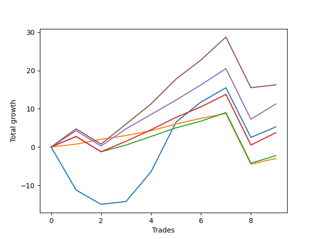

# Long Wallace 016 
- Symbol: ES_SmolBoi
- Date Range: 03/18/2022 - 07/29/2022
- Trading Period: 7:20-12:30
- Number of Trades: 9



| Name | Win Percent | Profit | Avg Profit / Trade | Avg Time / Trade |      | Name | Win Percent | Profit | Avg Profit / Trade | Avg Time / Trade |
| ---- | ----------- | ------ | ------------------ | ---------------- | ---- | ---- | ----------- | ------ | ------------------ | ---------------- |
| Sorted By <br> Profit | | | | | | Sorted By <br> Win Percentage ||||
| Eighty-Five | 77.78 | 8125.00 | 902.78 | 15:17 |     | Eighty-One | 88.89 | -1500.00 | -166.67 | 04:13 |
| Eighty-Four | 77.78 | 5625.00 | 625.00 | 11:34 |     | Eighty-Five | 77.78 | 8125.00 | 902.78 | 15:17 |
| Two | 66.67 | 2625.00 | 291.67 | 22:14 |     | Eighty-Four | 77.78 | 5625.00 | 625.00 | 11:34 |
| Eighty-Three | 77.78 | 1875.00 | 208.33 | 09:47 |     | Eighty-Three | 77.78 | 1875.00 | 208.33 | 09:47 |
| Eighty-Two | 77.78 | -1125.00 | -125.00 | 09:10 |     | Eighty-Two | 77.78 | -1125.00 | -125.00 | 09:10 |
| Eighty-One | 88.89 | -1500.00 | -166.67 | 04:13 |     | Two | 66.67 | 2625.00 | 291.67 | 22:14 |

## NO STOPLOSS

### Test Two
* Sell when the price hits the upper line of the 20p 2std bollinger
* No Stoploss
* Results:
```
Total Trades: 9
Percent Up: 66.67
Percent Down: 33.33
Total Points Moved Up: 5.25
Potential Profit: 2625.00
Total Points Ups: 33.25 Count Ups: 6
Total Points Downs: -28.00 Count Downs: 3
```

<details><summary>Trades</summary>

<code>In: 2022-03-21 09:40:00		Out: 2022-03-21 10:09:55		Total Position Time: 29:55		Total Move Up: -11.25		Total to Date: -11.25</code> <br />
<code>In: 2022-03-25 08:16:00		Out: 2022-03-25 08:41:45		Total Position Time: 25:45		Total Move Up: -3.75		Total to Date: -15.00</code> <br />
<code>In: 2022-04-20 09:18:00		Out: 2022-04-20 09:31:05		Total Position Time: 13:05		Total Move Up: 0.75		Total to Date: -14.25</code> <br />
<code>In: 2022-05-13 11:07:00		Out: 2022-05-13 11:31:20		Total Position Time: 24:20		Total Move Up: 7.75		Total to Date: -6.50</code> <br />
<code>In: 2022-05-17 11:24:00		Out: 2022-05-17 11:40:00		Total Position Time: 16:00		Total Move Up: 13.00		Total to Date: 6.50</code> <br />
<code>In: 2022-05-25 09:29:00		Out: 2022-05-25 09:45:20		Total Position Time: 16:20		Total Move Up: 5.25		Total to Date: 11.75</code> <br />
<code>In: 2022-06-06 08:24:00		Out: 2022-06-06 08:43:00		Total Position Time: 19:00		Total Move Up: 3.75		Total to Date: 15.50</code> <br />
<code>In: 2022-06-08 09:30:00		Out: 2022-06-08 09:59:10		Total Position Time: 29:10		Total Move Up: -13.00		Total to Date: 2.50</code> <br />
<code>In: 2022-06-09 07:56:00		Out: 2022-06-09 08:22:35		Total Position Time: 26:35		Total Move Up: 2.75		Total to Date: 5.25</code> <br />


</details>

## TAKE PROFIT

### Test Eighty-One
* Take Profit of 1 Point
* No Stoploss
* Results:
```
Total Trades: 9
Percent Up: 88.89
Percent Down: 11.11
Total Points Moved Up: -3.00
Potential Profit: -1500.00
Total Points Ups: 10.25 Count Ups: 8
Total Points Downs: -13.25 Count Downs: 1
```

<details><summary>Trades</summary>

<code>In: 2022-03-21 09:40:00		Out: 2022-03-21 09:40:15		Total Position Time: 00:15		Total Move Up: 0.75		Total to Date: 0.75</code> <br />
<code>In: 2022-03-25 08:16:00		Out: 2022-03-25 08:16:30		Total Position Time: 00:30		Total Move Up: 1.25		Total to Date: 2.00</code> <br />
<code>In: 2022-04-20 09:18:00		Out: 2022-04-20 09:18:50		Total Position Time: 00:50		Total Move Up: 1.00		Total to Date: 3.00</code> <br />
<code>In: 2022-05-13 11:07:00		Out: 2022-05-13 11:09:25		Total Position Time: 02:25		Total Move Up: 1.25		Total to Date: 4.25</code> <br />
<code>In: 2022-05-17 11:24:00		Out: 2022-05-17 11:24:25		Total Position Time: 00:25		Total Move Up: 1.75		Total to Date: 6.00</code> <br />
<code>In: 2022-05-25 09:29:00		Out: 2022-05-25 09:30:00		Total Position Time: 01:00		Total Move Up: 1.50		Total to Date: 7.50</code> <br />
<code>In: 2022-06-06 08:24:00		Out: 2022-06-06 08:26:35		Total Position Time: 02:35		Total Move Up: 1.25		Total to Date: 8.75</code> <br />
<code>In: 2022-06-08 09:30:00		Out: 2022-06-08 09:59:55		Total Position Time: 29:55		Total Move Up: -13.25		Total to Date: -4.50</code> <br />
<code>In: 2022-06-09 07:56:00		Out: 2022-06-09 07:56:10		Total Position Time: 00:10		Total Move Up: 1.50		Total to Date: -3.00</code> <br />


</details>

### Test Eighty-Two
* Take Profit of 2 Point
* No Stoploss
* Results:
```
Total Trades: 9
Percent Up: 77.78
Percent Down: 22.22
Total Points Moved Up: -2.25
Potential Profit: -1125.00
Total Points Ups: 15.00 Count Ups: 7
Total Points Downs: -17.25 Count Downs: 2
```

<details><summary>Trades</summary>

<code>In: 2022-03-21 09:40:00		Out: 2022-03-21 09:40:55		Total Position Time: 00:55		Total Move Up: 2.75		Total to Date: 2.75</code> <br />
<code>In: 2022-03-25 08:16:00		Out: 2022-03-25 08:45:55		Total Position Time: 29:55		Total Move Up: -4.00		Total to Date: -1.25</code> <br />
<code>In: 2022-04-20 09:18:00		Out: 2022-04-20 09:31:35		Total Position Time: 13:35		Total Move Up: 1.75		Total to Date: 0.50</code> <br />
<code>In: 2022-05-13 11:07:00		Out: 2022-05-13 11:09:30		Total Position Time: 02:30		Total Move Up: 2.25		Total to Date: 2.75</code> <br />
<code>In: 2022-05-17 11:24:00		Out: 2022-05-17 11:24:35		Total Position Time: 00:35		Total Move Up: 2.25		Total to Date: 5.00</code> <br />
<code>In: 2022-05-25 09:29:00		Out: 2022-05-25 09:30:05		Total Position Time: 01:05		Total Move Up: 1.75		Total to Date: 6.75</code> <br />
<code>In: 2022-06-06 08:24:00		Out: 2022-06-06 08:27:45		Total Position Time: 03:45		Total Move Up: 2.25		Total to Date: 9.00</code> <br />
<code>In: 2022-06-08 09:30:00		Out: 2022-06-08 09:59:55		Total Position Time: 29:55		Total Move Up: -13.25		Total to Date: -4.25</code> <br />
<code>In: 2022-06-09 07:56:00		Out: 2022-06-09 07:56:20		Total Position Time: 00:20		Total Move Up: 2.00		Total to Date: -2.25</code> <br />


</details>

### Test Eighty-Three
* Take Profit of 3 Point
* No Stoploss
* Results:
```
Total Trades: 9
Percent Up: 77.78
Percent Down: 22.22
Total Points Moved Up: 3.75
Potential Profit: 1875.00
Total Points Ups: 21.00 Count Ups: 7
Total Points Downs: -17.25 Count Downs: 2
```

<details><summary>Trades</summary>

<code>In: 2022-03-21 09:40:00		Out: 2022-03-21 09:41:00		Total Position Time: 01:00		Total Move Up: 2.75		Total to Date: 2.75</code> <br />
<code>In: 2022-03-25 08:16:00		Out: 2022-03-25 08:45:55		Total Position Time: 29:55		Total Move Up: -4.00		Total to Date: -1.25</code> <br />
<code>In: 2022-04-20 09:18:00		Out: 2022-04-20 09:32:30		Total Position Time: 14:30		Total Move Up: 2.75		Total to Date: 1.50</code> <br />
<code>In: 2022-05-13 11:07:00		Out: 2022-05-13 11:09:35		Total Position Time: 02:35		Total Move Up: 3.00		Total to Date: 4.50</code> <br />
<code>In: 2022-05-17 11:24:00		Out: 2022-05-17 11:24:40		Total Position Time: 00:40		Total Move Up: 3.25		Total to Date: 7.75</code> <br />
<code>In: 2022-05-25 09:29:00		Out: 2022-05-25 09:30:15		Total Position Time: 01:15		Total Move Up: 2.75		Total to Date: 10.50</code> <br />
<code>In: 2022-06-06 08:24:00		Out: 2022-06-06 08:31:35		Total Position Time: 07:35		Total Move Up: 3.25		Total to Date: 13.75</code> <br />
<code>In: 2022-06-08 09:30:00		Out: 2022-06-08 09:59:55		Total Position Time: 29:55		Total Move Up: -13.25		Total to Date: 0.50</code> <br />
<code>In: 2022-06-09 07:56:00		Out: 2022-06-09 07:56:40		Total Position Time: 00:40		Total Move Up: 3.25		Total to Date: 3.75</code> <br />


</details>

### Test Eighty-Four
* Take Profit of 4 Point
* No Stoploss
* Results:
```
Total Trades: 9
Percent Up: 77.78
Percent Down: 22.22
Total Points Moved Up: 11.25
Potential Profit: 5625.00
Total Points Ups: 28.50 Count Ups: 7
Total Points Downs: -17.25 Count Downs: 2
```

<details><summary>Trades</summary>

<code>In: 2022-03-21 09:40:00		Out: 2022-03-21 09:42:20		Total Position Time: 02:20		Total Move Up: 4.25		Total to Date: 4.25</code> <br />
<code>In: 2022-03-25 08:16:00		Out: 2022-03-25 08:45:55		Total Position Time: 29:55		Total Move Up: -4.00		Total to Date: 0.25</code> <br />
<code>In: 2022-04-20 09:18:00		Out: 2022-04-20 09:32:40		Total Position Time: 14:40		Total Move Up: 4.50		Total to Date: 4.75</code> <br />
<code>In: 2022-05-13 11:07:00		Out: 2022-05-13 11:10:20		Total Position Time: 03:20		Total Move Up: 3.75		Total to Date: 8.50</code> <br />
<code>In: 2022-05-17 11:24:00		Out: 2022-05-17 11:24:50		Total Position Time: 00:50		Total Move Up: 3.75		Total to Date: 12.25</code> <br />
<code>In: 2022-05-25 09:29:00		Out: 2022-05-25 09:30:30		Total Position Time: 01:30		Total Move Up: 4.00		Total to Date: 16.25</code> <br />
<code>In: 2022-06-06 08:24:00		Out: 2022-06-06 08:44:10		Total Position Time: 20:10		Total Move Up: 4.25		Total to Date: 20.50</code> <br />
<code>In: 2022-06-08 09:30:00		Out: 2022-06-08 09:59:55		Total Position Time: 29:55		Total Move Up: -13.25		Total to Date: 7.25</code> <br />
<code>In: 2022-06-09 07:56:00		Out: 2022-06-09 07:57:30		Total Position Time: 01:30		Total Move Up: 4.00		Total to Date: 11.25</code> <br />


</details>

### Test Eighty-Five
* Take Profit of 5 Point
* No Stoploss
* Results:
```
Total Trades: 9
Percent Up: 77.78
Percent Down: 22.22
Total Points Moved Up: 16.25
Potential Profit: 8125.00
Total Points Ups: 33.50 Count Ups: 7
Total Points Downs: -17.25 Count Downs: 2
```

<details><summary>Trades</summary>

<code>In: 2022-03-21 09:40:00		Out: 2022-03-21 09:42:50		Total Position Time: 02:50		Total Move Up: 4.75		Total to Date: 4.75</code> <br />
<code>In: 2022-03-25 08:16:00		Out: 2022-03-25 08:45:55		Total Position Time: 29:55		Total Move Up: -4.00		Total to Date: 0.75</code> <br />
<code>In: 2022-04-20 09:18:00		Out: 2022-04-20 09:32:55		Total Position Time: 14:55		Total Move Up: 5.25		Total to Date: 6.00</code> <br />
<code>In: 2022-05-13 11:07:00		Out: 2022-05-13 11:10:50		Total Position Time: 03:50		Total Move Up: 5.25		Total to Date: 11.25</code> <br />
<code>In: 2022-05-17 11:24:00		Out: 2022-05-17 11:26:40		Total Position Time: 02:40		Total Move Up: 6.50		Total to Date: 17.75</code> <br />
<code>In: 2022-05-25 09:29:00		Out: 2022-05-25 09:32:10		Total Position Time: 03:10		Total Move Up: 5.00		Total to Date: 22.75</code> <br />
<code>In: 2022-06-06 08:24:00		Out: 2022-06-06 08:44:30		Total Position Time: 20:30		Total Move Up: 6.00		Total to Date: 28.75</code> <br />
<code>In: 2022-06-08 09:30:00		Out: 2022-06-08 09:59:55		Total Position Time: 29:55		Total Move Up: -13.25		Total to Date: 15.50</code> <br />
<code>In: 2022-06-09 07:56:00		Out: 2022-06-09 08:25:55		Total Position Time: 29:55		Total Move Up: 0.75		Total to Date: 16.25</code> <br />


</details>