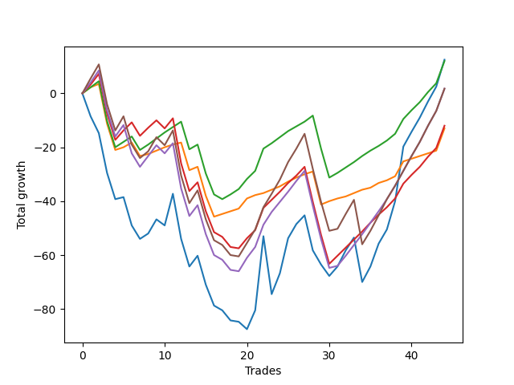

# Long Wallace 019 
- Symbol: ES_SmolBoi
- Date Range: 03/18/2022 - 07/29/2022
- Trading Period: 7:20-12:30
- Number of Trades: 44



| Name | Win Percent | Profit | Avg Profit / Trade | Avg Time / Trade |      | Name | Win Percent | Profit | Avg Profit / Trade | Avg Time / Trade |
| ---- | ----------- | ------ | ------------------ | ---------------- | ---- | ---- | ----------- | ------ | ------------------ | ---------------- |
| Sorted By <br> Profit | | | | | | Sorted By <br> Win Percentage ||||
| Two | 54.55 | 6250.00 | 142.05 | 58:56 |     | Eighty-One | 84.09 | -6500.00 | -147.73 | 08:57 |
| Eighty-Two | 79.55 | 6000.00 | 136.36 | 20:16 |     | Eighty-Two | 79.55 | 6000.00 | 136.36 | 20:16 |
| Eighty-Four | 65.91 | 875.00 | 19.89 | 26:35 |     | Eighty-Three | 68.18 | -6000.00 | -136.36 | 24:03 |
| Eighty-Five | 63.64 | 875.00 | 19.89 | 28:09 |     | Eighty-Four | 65.91 | 875.00 | 19.89 | 26:35 |
| Eighty-Three | 68.18 | -6000.00 | -136.36 | 24:03 |     | Eighty-Five | 63.64 | 875.00 | 19.89 | 28:09 |
| Eighty-One | 84.09 | -6500.00 | -147.73 | 08:57 |     | Two | 54.55 | 6250.00 | 142.05 | 58:56 |

## NO STOPLOSS

### Test Two
* Sell when the price hits the upper line of the 20p 2std bollinger
* No Stoploss
* Results:
```
Total Trades: 44
Percent Up: 54.55
Percent Down: 45.45
Total Points Moved Up: 12.50
Potential Profit: 6250.00
Total Points Ups: 184.25 Count Ups: 24
Total Points Downs: -171.75 Count Downs: 20
```

<details><summary>Trades</summary>

<code>In: 2022-03-21 09:37:00		Out: 2022-03-21 10:06:55		Total Position Time: 29:55		Total Move Up: -8.50		Total to Date: -8.50</code> <br />
<code>In: 2022-03-21 09:38:00		Out: 2022-03-21 10:07:55		Total Position Time: 29:55		Total Move Up: -6.25		Total to Date: -14.75</code> <br />
<code>In: 2022-03-21 09:56:00		Out: 2022-03-21 10:25:55		Total Position Time: 29:55		Total Move Up: -14.75		Total to Date: -29.50</code> <br />
<code>In: 2022-03-21 09:58:00		Out: 2022-03-21 10:27:55		Total Position Time: 29:55		Total Move Up: -9.75		Total to Date: -39.25</code> <br />
<code>In: 2022-03-23 09:47:00		Out: 2022-03-23 10:16:55		Total Position Time: 29:55		Total Move Up: 0.75		Total to Date: -38.50</code> <br />
<code>In: 2022-03-23 10:06:00		Out: 2022-03-23 10:35:55		Total Position Time: 29:55		Total Move Up: -10.50		Total to Date: -49.00</code> <br />
<code>In: 2022-03-23 10:23:00		Out: 2022-03-23 10:52:55		Total Position Time: 29:55		Total Move Up: -5.00		Total to Date: -54.00</code> <br />
<code>In: 2022-03-23 10:28:00		Out: 2022-03-23 10:54:25		Total Position Time: 26:25		Total Move Up: 2.00		Total to Date: -52.00</code> <br />
<code>In: 2022-03-23 10:30:00		Out: 2022-03-23 10:54:25		Total Position Time: 24:25		Total Move Up: 5.25		Total to Date: -46.75</code> <br />
<code>In: 2022-03-25 08:14:00		Out: 2022-03-25 08:41:45		Total Position Time: 27:45		Total Move Up: -2.25		Total to Date: -49.00</code> <br />
<code>In: 2022-03-25 08:29:00		Out: 2022-03-25 08:41:45		Total Position Time: 12:45		Total Move Up: 11.75		Total to Date: -37.25</code> <br />
<code>In: 2022-03-28 08:27:00		Out: 2022-03-28 08:56:55		Total Position Time: 29:55		Total Move Up: -16.75		Total to Date: -54.00</code> <br />
<code>In: 2022-03-28 08:33:00		Out: 2022-03-28 09:02:55		Total Position Time: 29:55		Total Move Up: -10.25		Total to Date: -64.25</code> <br />
<code>In: 2022-03-31 09:28:00		Out: 2022-03-31 09:44:20		Total Position Time: 16:20		Total Move Up: 4.00		Total to Date: -60.25</code> <br />
<code>In: 2022-04-18 08:23:00		Out: 2022-04-18 08:52:55		Total Position Time: 29:55		Total Move Up: -10.75		Total to Date: -71.00</code> <br />
<code>In: 2022-04-18 08:26:00		Out: 2022-04-18 08:55:55		Total Position Time: 29:55		Total Move Up: -7.75		Total to Date: -78.75</code> <br />
<code>In: 2022-04-18 08:29:00		Out: 2022-04-18 08:58:55		Total Position Time: 29:55		Total Move Up: -1.75		Total to Date: -80.50</code> <br />
<code>In: 2022-04-20 11:39:00		Out: 2022-04-20 12:08:55		Total Position Time: 29:55		Total Move Up: -3.75		Total to Date: -84.25</code> <br />
<code>In: 2022-04-20 11:40:00		Out: 2022-04-20 12:09:55		Total Position Time: 29:55		Total Move Up: -0.50		Total to Date: -84.75</code> <br />
<code>In: 2022-05-02 08:06:00		Out: 2022-05-02 08:35:55		Total Position Time: 29:55		Total Move Up: -2.75		Total to Date: -87.50</code> <br />
<code>In: 2022-05-02 08:19:00		Out: 2022-05-02 08:36:25		Total Position Time: 17:25		Total Move Up: 7.00		Total to Date: -80.50</code> <br />
<code>In: 2022-05-04 11:36:00		Out: 2022-05-04 11:43:45		Total Position Time: 07:45		Total Move Up: 27.50		Total to Date: -53.00</code> <br />
<code>In: 2022-05-11 09:32:00		Out: 2022-05-11 10:01:55		Total Position Time: 29:55		Total Move Up: -21.50		Total to Date: -74.50</code> <br />
<code>In: 2022-05-13 11:07:00		Out: 2022-05-13 11:31:20		Total Position Time: 24:20		Total Move Up: 7.75		Total to Date: -66.75</code> <br />
<code>In: 2022-05-17 11:24:00		Out: 2022-05-17 11:40:00		Total Position Time: 16:00		Total Move Up: 13.00		Total to Date: -53.75</code> <br />
<code>In: 2022-05-25 09:29:00		Out: 2022-05-25 09:45:20		Total Position Time: 16:20		Total Move Up: 5.25		Total to Date: -48.50</code> <br />
<code>In: 2022-06-06 08:19:00		Out: 2022-06-06 08:43:00		Total Position Time: 24:00		Total Move Up: 3.25		Total to Date: -45.25</code> <br />
<code>In: 2022-06-08 09:29:00		Out: 2022-06-08 09:58:55		Total Position Time: 29:55		Total Move Up: -13.00		Total to Date: -58.25</code> <br />
<code>In: 2022-06-08 09:33:00		Out: 2022-06-08 09:59:10		Total Position Time: 26:10		Total Move Up: -5.25		Total to Date: -63.50</code> <br />
<code>In: 2022-06-08 09:34:00		Out: 2022-06-08 09:59:10		Total Position Time: 25:10		Total Move Up: -4.25		Total to Date: -67.75</code> <br />
<code>In: 2022-06-08 09:41:00		Out: 2022-06-08 09:59:10		Total Position Time: 18:10		Total Move Up: 3.50		Total to Date: -64.25</code> <br />
<code>In: 2022-06-08 09:44:00		Out: 2022-06-08 09:59:10		Total Position Time: 15:10		Total Move Up: 6.00		Total to Date: -58.25</code> <br />
<code>In: 2022-06-09 07:54:00		Out: 2022-06-09 08:22:35		Total Position Time: 28:35		Total Move Up: 4.75		Total to Date: -53.50</code> <br />
<code>In: 2022-06-23 08:39:00		Out: 2022-06-23 09:08:55		Total Position Time: 29:55		Total Move Up: -16.50		Total to Date: -70.00</code> <br />
<code>In: 2022-06-27 10:48:00		Out: 2022-06-27 11:13:35		Total Position Time: 25:35		Total Move Up: 5.75		Total to Date: -64.25</code> <br />
<code>In: 2022-06-29 08:25:00		Out: 2022-06-29 08:34:40		Total Position Time: 09:40		Total Move Up: 8.50		Total to Date: -55.75</code> <br />
<code>In: 2022-07-05 08:02:00		Out: 2022-07-05 08:17:55		Total Position Time: 15:55		Total Move Up: 5.25		Total to Date: -50.50</code> <br />
<code>In: 2022-07-11 12:06:00		Out: 2022-07-12 06:36:00		Total Position Time: 1110:00		Total Move Up: 10.50		Total to Date: -40.00</code> <br />
<code>In: 2022-07-20 10:13:00		Out: 2022-07-20 11:38:00		Total Position Time: 85:00		Total Move Up: 20.25		Total to Date: -19.75</code> <br />
<code>In: 2022-07-25 10:54:00		Out: 2022-07-25 12:52:00		Total Position Time: 118:00		Total Move Up: 5.50		Total to Date: -14.25</code> <br />
<code>In: 2022-07-25 10:55:00		Out: 2022-07-25 12:52:00		Total Position Time: 117:00		Total Move Up: 5.25		Total to Date: -9.00</code> <br />
<code>In: 2022-07-25 10:56:00		Out: 2022-07-25 12:52:00		Total Position Time: 116:00		Total Move Up: 6.00		Total to Date: -3.00</code> <br />
<code>In: 2022-07-25 10:57:00		Out: 2022-07-25 12:52:00		Total Position Time: 115:00		Total Move Up: 5.50		Total to Date: 2.50</code> <br />
<code>In: 2022-07-29 08:29:00		Out: 2022-07-29 08:45:00		Total Position Time: 16:00		Total Move Up: 10.00		Total to Date: 12.50</code> <br />


</details>

## TAKE PROFIT

### Test Eighty-One
* Take Profit of 1 Point
* No Stoploss
* Results:
```
Total Trades: 44
Percent Up: 84.09
Percent Down: 15.91
Total Points Moved Up: -13.00
Potential Profit: -6500.00
Total Points Ups: 57.50 Count Ups: 37
Total Points Downs: -70.50 Count Downs: 7
```

<details><summary>Trades</summary>

<code>In: 2022-03-21 09:37:00		Out: 2022-03-21 09:39:45		Total Position Time: 02:45		Total Move Up: 2.25		Total to Date: 2.25</code> <br />
<code>In: 2022-03-21 09:38:00		Out: 2022-03-21 09:39:05		Total Position Time: 01:05		Total Move Up: 1.25		Total to Date: 3.50</code> <br />
<code>In: 2022-03-21 09:56:00		Out: 2022-03-21 10:25:55		Total Position Time: 29:55		Total Move Up: -14.75		Total to Date: -11.25</code> <br />
<code>In: 2022-03-21 09:58:00		Out: 2022-03-21 10:27:55		Total Position Time: 29:55		Total Move Up: -9.75		Total to Date: -21.00</code> <br />
<code>In: 2022-03-23 09:47:00		Out: 2022-03-23 09:47:35		Total Position Time: 00:35		Total Move Up: 1.00		Total to Date: -20.00</code> <br />
<code>In: 2022-03-23 10:06:00		Out: 2022-03-23 10:06:10		Total Position Time: 00:10		Total Move Up: 1.75		Total to Date: -18.25</code> <br />
<code>In: 2022-03-23 10:23:00		Out: 2022-03-23 10:52:55		Total Position Time: 29:55		Total Move Up: -5.00		Total to Date: -23.25</code> <br />
<code>In: 2022-03-23 10:28:00		Out: 2022-03-23 10:34:30		Total Position Time: 06:30		Total Move Up: 0.75		Total to Date: -22.50</code> <br />
<code>In: 2022-03-23 10:30:00		Out: 2022-03-23 10:31:35		Total Position Time: 01:35		Total Move Up: 1.25		Total to Date: -21.25</code> <br />
<code>In: 2022-03-25 08:14:00		Out: 2022-03-25 08:15:50		Total Position Time: 01:50		Total Move Up: 1.25		Total to Date: -20.00</code> <br />
<code>In: 2022-03-25 08:29:00		Out: 2022-03-25 08:29:10		Total Position Time: 00:10		Total Move Up: 1.00		Total to Date: -19.00</code> <br />
<code>In: 2022-03-28 08:27:00		Out: 2022-03-28 08:27:45		Total Position Time: 00:45		Total Move Up: 0.75		Total to Date: -18.25</code> <br />
<code>In: 2022-03-28 08:33:00		Out: 2022-03-28 09:02:55		Total Position Time: 29:55		Total Move Up: -10.25		Total to Date: -28.50</code> <br />
<code>In: 2022-03-31 09:28:00		Out: 2022-03-31 09:29:30		Total Position Time: 01:30		Total Move Up: 1.25		Total to Date: -27.25</code> <br />
<code>In: 2022-04-18 08:23:00		Out: 2022-04-18 08:52:55		Total Position Time: 29:55		Total Move Up: -10.75		Total to Date: -38.00</code> <br />
<code>In: 2022-04-18 08:26:00		Out: 2022-04-18 08:55:55		Total Position Time: 29:55		Total Move Up: -7.75		Total to Date: -45.75</code> <br />
<code>In: 2022-04-18 08:29:00		Out: 2022-04-18 08:29:25		Total Position Time: 00:25		Total Move Up: 1.00		Total to Date: -44.75</code> <br />
<code>In: 2022-04-20 11:39:00		Out: 2022-04-20 11:41:35		Total Position Time: 02:35		Total Move Up: 1.00		Total to Date: -43.75</code> <br />
<code>In: 2022-04-20 11:40:00		Out: 2022-04-20 11:41:30		Total Position Time: 01:30		Total Move Up: 1.00		Total to Date: -42.75</code> <br />
<code>In: 2022-05-02 08:06:00		Out: 2022-05-02 08:06:10		Total Position Time: 00:10		Total Move Up: 3.75		Total to Date: -39.00</code> <br />
<code>In: 2022-05-02 08:19:00		Out: 2022-05-02 08:19:10		Total Position Time: 00:10		Total Move Up: 1.25		Total to Date: -37.75</code> <br />
<code>In: 2022-05-04 11:36:00		Out: 2022-05-04 11:36:10		Total Position Time: 00:10		Total Move Up: 0.75		Total to Date: -37.00</code> <br />
<code>In: 2022-05-11 09:32:00		Out: 2022-05-11 09:32:30		Total Position Time: 00:30		Total Move Up: 1.25		Total to Date: -35.75</code> <br />
<code>In: 2022-05-13 11:07:00		Out: 2022-05-13 11:09:25		Total Position Time: 02:25		Total Move Up: 1.25		Total to Date: -34.50</code> <br />
<code>In: 2022-05-17 11:24:00		Out: 2022-05-17 11:24:25		Total Position Time: 00:25		Total Move Up: 1.75		Total to Date: -32.75</code> <br />
<code>In: 2022-05-25 09:29:00		Out: 2022-05-25 09:30:00		Total Position Time: 01:00		Total Move Up: 1.50		Total to Date: -31.25</code> <br />
<code>In: 2022-06-06 08:19:00		Out: 2022-06-06 08:19:10		Total Position Time: 00:10		Total Move Up: 1.25		Total to Date: -30.00</code> <br />
<code>In: 2022-06-08 09:29:00		Out: 2022-06-08 09:29:15		Total Position Time: 00:15		Total Move Up: 1.00		Total to Date: -29.00</code> <br />
<code>In: 2022-06-08 09:33:00		Out: 2022-06-08 10:02:55		Total Position Time: 29:55		Total Move Up: -12.25		Total to Date: -41.25</code> <br />
<code>In: 2022-06-08 09:34:00		Out: 2022-06-08 09:34:25		Total Position Time: 00:25		Total Move Up: 1.25		Total to Date: -40.00</code> <br />
<code>In: 2022-06-08 09:41:00		Out: 2022-06-08 09:41:35		Total Position Time: 00:35		Total Move Up: 1.00		Total to Date: -39.00</code> <br />
<code>In: 2022-06-08 09:44:00		Out: 2022-06-08 09:48:00		Total Position Time: 04:00		Total Move Up: 0.75		Total to Date: -38.25</code> <br />
<code>In: 2022-06-09 07:54:00		Out: 2022-06-09 07:54:20		Total Position Time: 00:20		Total Move Up: 1.25		Total to Date: -37.00</code> <br />
<code>In: 2022-06-23 08:39:00		Out: 2022-06-23 08:39:15		Total Position Time: 00:15		Total Move Up: 1.25		Total to Date: -35.75</code> <br />
<code>In: 2022-06-27 10:48:00		Out: 2022-06-27 10:48:30		Total Position Time: 00:30		Total Move Up: 0.75		Total to Date: -35.00</code> <br />
<code>In: 2022-06-29 08:25:00		Out: 2022-06-29 08:25:15		Total Position Time: 00:15		Total Move Up: 1.75		Total to Date: -33.25</code> <br />
<code>In: 2022-07-05 08:02:00		Out: 2022-07-05 08:03:45		Total Position Time: 01:45		Total Move Up: 1.00		Total to Date: -32.25</code> <br />
<code>In: 2022-07-11 12:06:00		Out: 2022-07-11 12:30:00		Total Position Time: 24:00		Total Move Up: 1.50		Total to Date: -30.75</code> <br />
<code>In: 2022-07-20 10:13:00		Out: 2022-07-20 10:26:00		Total Position Time: 13:00		Total Move Up: 5.50		Total to Date: -25.25</code> <br />
<code>In: 2022-07-25 10:54:00		Out: 2022-07-25 11:14:00		Total Position Time: 20:00		Total Move Up: 1.00		Total to Date: -24.25</code> <br />
<code>In: 2022-07-25 10:55:00		Out: 2022-07-25 11:42:00		Total Position Time: 47:00		Total Move Up: 1.00		Total to Date: -23.25</code> <br />
<code>In: 2022-07-25 10:56:00		Out: 2022-07-25 11:12:00		Total Position Time: 16:00		Total Move Up: 1.00		Total to Date: -22.25</code> <br />
<code>In: 2022-07-25 10:57:00		Out: 2022-07-25 11:14:00		Total Position Time: 17:00		Total Move Up: 1.00		Total to Date: -21.25</code> <br />
<code>In: 2022-07-29 08:29:00		Out: 2022-07-29 08:42:00		Total Position Time: 13:00		Total Move Up: 8.25		Total to Date: -13.00</code> <br />


</details>

### Test Eighty-Two
* Take Profit of 2 Point
* No Stoploss
* Results:
```
Total Trades: 44
Percent Up: 79.55
Percent Down: 20.45
Total Points Moved Up: 12.00
Potential Profit: 6000.00
Total Points Ups: 95.00 Count Ups: 35
Total Points Downs: -83.00 Count Downs: 9
```

<details><summary>Trades</summary>

<code>In: 2022-03-21 09:37:00		Out: 2022-03-21 09:39:45		Total Position Time: 02:45		Total Move Up: 2.25		Total to Date: 2.25</code> <br />
<code>In: 2022-03-21 09:38:00		Out: 2022-03-21 09:39:40		Total Position Time: 01:40		Total Move Up: 2.25		Total to Date: 4.50</code> <br />
<code>In: 2022-03-21 09:56:00		Out: 2022-03-21 10:25:55		Total Position Time: 29:55		Total Move Up: -14.75		Total to Date: -10.25</code> <br />
<code>In: 2022-03-21 09:58:00		Out: 2022-03-21 10:27:55		Total Position Time: 29:55		Total Move Up: -9.75		Total to Date: -20.00</code> <br />
<code>In: 2022-03-23 09:47:00		Out: 2022-03-23 09:48:20		Total Position Time: 01:20		Total Move Up: 2.00		Total to Date: -18.00</code> <br />
<code>In: 2022-03-23 10:06:00		Out: 2022-03-23 10:06:25		Total Position Time: 00:25		Total Move Up: 2.00		Total to Date: -16.00</code> <br />
<code>In: 2022-03-23 10:23:00		Out: 2022-03-23 10:52:55		Total Position Time: 29:55		Total Move Up: -5.00		Total to Date: -21.00</code> <br />
<code>In: 2022-03-23 10:28:00		Out: 2022-03-23 10:54:25		Total Position Time: 26:25		Total Move Up: 2.00		Total to Date: -19.00</code> <br />
<code>In: 2022-03-23 10:30:00		Out: 2022-03-23 10:31:40		Total Position Time: 01:40		Total Move Up: 2.25		Total to Date: -16.75</code> <br />
<code>In: 2022-03-25 08:14:00		Out: 2022-03-25 08:16:05		Total Position Time: 02:05		Total Move Up: 2.25		Total to Date: -14.50</code> <br />
<code>In: 2022-03-25 08:29:00		Out: 2022-03-25 08:29:20		Total Position Time: 00:20		Total Move Up: 2.00		Total to Date: -12.50</code> <br />
<code>In: 2022-03-28 08:27:00		Out: 2022-03-28 08:28:10		Total Position Time: 01:10		Total Move Up: 2.00		Total to Date: -10.50</code> <br />
<code>In: 2022-03-28 08:33:00		Out: 2022-03-28 09:02:55		Total Position Time: 29:55		Total Move Up: -10.25		Total to Date: -20.75</code> <br />
<code>In: 2022-03-31 09:28:00		Out: 2022-03-31 09:30:05		Total Position Time: 02:05		Total Move Up: 1.75		Total to Date: -19.00</code> <br />
<code>In: 2022-04-18 08:23:00		Out: 2022-04-18 08:52:55		Total Position Time: 29:55		Total Move Up: -10.75		Total to Date: -29.75</code> <br />
<code>In: 2022-04-18 08:26:00		Out: 2022-04-18 08:55:55		Total Position Time: 29:55		Total Move Up: -7.75		Total to Date: -37.50</code> <br />
<code>In: 2022-04-18 08:29:00		Out: 2022-04-18 08:58:55		Total Position Time: 29:55		Total Move Up: -1.75		Total to Date: -39.25</code> <br />
<code>In: 2022-04-20 11:39:00		Out: 2022-04-20 11:48:20		Total Position Time: 09:20		Total Move Up: 1.75		Total to Date: -37.50</code> <br />
<code>In: 2022-04-20 11:40:00		Out: 2022-04-20 11:48:20		Total Position Time: 08:20		Total Move Up: 2.00		Total to Date: -35.50</code> <br />
<code>In: 2022-05-02 08:06:00		Out: 2022-05-02 08:06:10		Total Position Time: 00:10		Total Move Up: 3.75		Total to Date: -31.75</code> <br />
<code>In: 2022-05-02 08:19:00		Out: 2022-05-02 08:19:15		Total Position Time: 00:15		Total Move Up: 3.00		Total to Date: -28.75</code> <br />
<code>In: 2022-05-04 11:36:00		Out: 2022-05-04 11:36:40		Total Position Time: 00:40		Total Move Up: 8.25		Total to Date: -20.50</code> <br />
<code>In: 2022-05-11 09:32:00		Out: 2022-05-11 09:35:20		Total Position Time: 03:20		Total Move Up: 2.00		Total to Date: -18.50</code> <br />
<code>In: 2022-05-13 11:07:00		Out: 2022-05-13 11:09:30		Total Position Time: 02:30		Total Move Up: 2.25		Total to Date: -16.25</code> <br />
<code>In: 2022-05-17 11:24:00		Out: 2022-05-17 11:24:35		Total Position Time: 00:35		Total Move Up: 2.25		Total to Date: -14.00</code> <br />
<code>In: 2022-05-25 09:29:00		Out: 2022-05-25 09:30:05		Total Position Time: 01:05		Total Move Up: 1.75		Total to Date: -12.25</code> <br />
<code>In: 2022-06-06 08:19:00		Out: 2022-06-06 08:29:05		Total Position Time: 10:05		Total Move Up: 1.75		Total to Date: -10.50</code> <br />
<code>In: 2022-06-08 09:29:00		Out: 2022-06-08 09:29:55		Total Position Time: 00:55		Total Move Up: 2.25		Total to Date: -8.25</code> <br />
<code>In: 2022-06-08 09:33:00		Out: 2022-06-08 10:02:55		Total Position Time: 29:55		Total Move Up: -12.25		Total to Date: -20.50</code> <br />
<code>In: 2022-06-08 09:34:00		Out: 2022-06-08 10:03:55		Total Position Time: 29:55		Total Move Up: -10.75		Total to Date: -31.25</code> <br />
<code>In: 2022-06-08 09:41:00		Out: 2022-06-08 09:57:10		Total Position Time: 16:10		Total Move Up: 1.75		Total to Date: -29.50</code> <br />
<code>In: 2022-06-08 09:44:00		Out: 2022-06-08 09:48:45		Total Position Time: 04:45		Total Move Up: 2.00		Total to Date: -27.50</code> <br />
<code>In: 2022-06-09 07:54:00		Out: 2022-06-09 07:56:00		Total Position Time: 02:00		Total Move Up: 2.00		Total to Date: -25.50</code> <br />
<code>In: 2022-06-23 08:39:00		Out: 2022-06-23 08:44:25		Total Position Time: 05:25		Total Move Up: 2.25		Total to Date: -23.25</code> <br />
<code>In: 2022-06-27 10:48:00		Out: 2022-06-27 10:49:45		Total Position Time: 01:45		Total Move Up: 2.00		Total to Date: -21.25</code> <br />
<code>In: 2022-06-29 08:25:00		Out: 2022-06-29 08:25:15		Total Position Time: 00:15		Total Move Up: 1.75		Total to Date: -19.50</code> <br />
<code>In: 2022-07-05 08:02:00		Out: 2022-07-05 08:04:40		Total Position Time: 02:40		Total Move Up: 2.00		Total to Date: -17.50</code> <br />
<code>In: 2022-07-11 12:06:00		Out: 2022-07-11 12:31:00		Total Position Time: 25:00		Total Move Up: 2.50		Total to Date: -15.00</code> <br />
<code>In: 2022-07-20 10:13:00		Out: 2022-07-20 10:26:00		Total Position Time: 13:00		Total Move Up: 5.50		Total to Date: -9.50</code> <br />
<code>In: 2022-07-25 10:54:00		Out: 2022-07-25 12:51:00		Total Position Time: 117:00		Total Move Up: 3.25		Total to Date: -6.25</code> <br />
<code>In: 2022-07-25 10:55:00		Out: 2022-07-25 12:51:00		Total Position Time: 116:00		Total Move Up: 3.00		Total to Date: -3.25</code> <br />
<code>In: 2022-07-25 10:56:00		Out: 2022-07-25 12:51:00		Total Position Time: 115:00		Total Move Up: 3.75		Total to Date: 0.50</code> <br />
<code>In: 2022-07-25 10:57:00		Out: 2022-07-25 12:51:00		Total Position Time: 114:00		Total Move Up: 3.25		Total to Date: 3.75</code> <br />
<code>In: 2022-07-29 08:29:00		Out: 2022-07-29 08:42:00		Total Position Time: 13:00		Total Move Up: 8.25		Total to Date: 12.00</code> <br />


</details>

### Test Eighty-Three
* Take Profit of 3 Point
* No Stoploss
* Results:
```
Total Trades: 44
Percent Up: 68.18
Percent Down: 31.82
Total Points Moved Up: -12.00
Potential Profit: -6000.00
Total Points Ups: 108.00 Count Ups: 30
Total Points Downs: -120.00 Count Downs: 14
```

<details><summary>Trades</summary>

<code>In: 2022-03-21 09:37:00		Out: 2022-03-21 09:40:05		Total Position Time: 03:05		Total Move Up: 3.25		Total to Date: 3.25</code> <br />
<code>In: 2022-03-21 09:38:00		Out: 2022-03-21 09:39:45		Total Position Time: 01:45		Total Move Up: 4.00		Total to Date: 7.25</code> <br />
<code>In: 2022-03-21 09:56:00		Out: 2022-03-21 10:25:55		Total Position Time: 29:55		Total Move Up: -14.75		Total to Date: -7.50</code> <br />
<code>In: 2022-03-21 09:58:00		Out: 2022-03-21 10:27:55		Total Position Time: 29:55		Total Move Up: -9.75		Total to Date: -17.25</code> <br />
<code>In: 2022-03-23 09:47:00		Out: 2022-03-23 09:52:30		Total Position Time: 05:30		Total Move Up: 3.50		Total to Date: -13.75</code> <br />
<code>In: 2022-03-23 10:06:00		Out: 2022-03-23 10:09:40		Total Position Time: 03:40		Total Move Up: 3.00		Total to Date: -10.75</code> <br />
<code>In: 2022-03-23 10:23:00		Out: 2022-03-23 10:52:55		Total Position Time: 29:55		Total Move Up: -5.00		Total to Date: -15.75</code> <br />
<code>In: 2022-03-23 10:28:00		Out: 2022-03-23 10:54:50		Total Position Time: 26:50		Total Move Up: 3.00		Total to Date: -12.75</code> <br />
<code>In: 2022-03-23 10:30:00		Out: 2022-03-23 10:31:55		Total Position Time: 01:55		Total Move Up: 2.75		Total to Date: -10.00</code> <br />
<code>In: 2022-03-25 08:14:00		Out: 2022-03-25 08:43:55		Total Position Time: 29:55		Total Move Up: -3.00		Total to Date: -13.00</code> <br />
<code>In: 2022-03-25 08:29:00		Out: 2022-03-25 08:29:55		Total Position Time: 00:55		Total Move Up: 3.75		Total to Date: -9.25</code> <br />
<code>In: 2022-03-28 08:27:00		Out: 2022-03-28 08:56:55		Total Position Time: 29:55		Total Move Up: -16.75		Total to Date: -26.00</code> <br />
<code>In: 2022-03-28 08:33:00		Out: 2022-03-28 09:02:55		Total Position Time: 29:55		Total Move Up: -10.25		Total to Date: -36.25</code> <br />
<code>In: 2022-03-31 09:28:00		Out: 2022-03-31 09:30:45		Total Position Time: 02:45		Total Move Up: 3.25		Total to Date: -33.00</code> <br />
<code>In: 2022-04-18 08:23:00		Out: 2022-04-18 08:52:55		Total Position Time: 29:55		Total Move Up: -10.75		Total to Date: -43.75</code> <br />
<code>In: 2022-04-18 08:26:00		Out: 2022-04-18 08:55:55		Total Position Time: 29:55		Total Move Up: -7.75		Total to Date: -51.50</code> <br />
<code>In: 2022-04-18 08:29:00		Out: 2022-04-18 08:58:55		Total Position Time: 29:55		Total Move Up: -1.75		Total to Date: -53.25</code> <br />
<code>In: 2022-04-20 11:39:00		Out: 2022-04-20 12:08:55		Total Position Time: 29:55		Total Move Up: -3.75		Total to Date: -57.00</code> <br />
<code>In: 2022-04-20 11:40:00		Out: 2022-04-20 12:09:55		Total Position Time: 29:55		Total Move Up: -0.50		Total to Date: -57.50</code> <br />
<code>In: 2022-05-02 08:06:00		Out: 2022-05-02 08:06:10		Total Position Time: 00:10		Total Move Up: 3.75		Total to Date: -53.75</code> <br />
<code>In: 2022-05-02 08:19:00		Out: 2022-05-02 08:19:15		Total Position Time: 00:15		Total Move Up: 3.00		Total to Date: -50.75</code> <br />
<code>In: 2022-05-04 11:36:00		Out: 2022-05-04 11:36:40		Total Position Time: 00:40		Total Move Up: 8.25		Total to Date: -42.50</code> <br />
<code>In: 2022-05-11 09:32:00		Out: 2022-05-11 09:35:30		Total Position Time: 03:30		Total Move Up: 3.00		Total to Date: -39.50</code> <br />
<code>In: 2022-05-13 11:07:00		Out: 2022-05-13 11:09:35		Total Position Time: 02:35		Total Move Up: 3.00		Total to Date: -36.50</code> <br />
<code>In: 2022-05-17 11:24:00		Out: 2022-05-17 11:24:40		Total Position Time: 00:40		Total Move Up: 3.25		Total to Date: -33.25</code> <br />
<code>In: 2022-05-25 09:29:00		Out: 2022-05-25 09:30:15		Total Position Time: 01:15		Total Move Up: 2.75		Total to Date: -30.50</code> <br />
<code>In: 2022-06-06 08:19:00		Out: 2022-06-06 08:43:00		Total Position Time: 24:00		Total Move Up: 3.25		Total to Date: -27.25</code> <br />
<code>In: 2022-06-08 09:29:00		Out: 2022-06-08 09:58:55		Total Position Time: 29:55		Total Move Up: -13.00		Total to Date: -40.25</code> <br />
<code>In: 2022-06-08 09:33:00		Out: 2022-06-08 10:02:55		Total Position Time: 29:55		Total Move Up: -12.25		Total to Date: -52.50</code> <br />
<code>In: 2022-06-08 09:34:00		Out: 2022-06-08 10:03:55		Total Position Time: 29:55		Total Move Up: -10.75		Total to Date: -63.25</code> <br />
<code>In: 2022-06-08 09:41:00		Out: 2022-06-08 09:59:05		Total Position Time: 18:05		Total Move Up: 3.00		Total to Date: -60.25</code> <br />
<code>In: 2022-06-08 09:44:00		Out: 2022-06-08 09:51:40		Total Position Time: 07:40		Total Move Up: 3.00		Total to Date: -57.25</code> <br />
<code>In: 2022-06-09 07:54:00		Out: 2022-06-09 07:56:05		Total Position Time: 02:05		Total Move Up: 3.00		Total to Date: -54.25</code> <br />
<code>In: 2022-06-23 08:39:00		Out: 2022-06-23 08:49:00		Total Position Time: 10:00		Total Move Up: 3.00		Total to Date: -51.25</code> <br />
<code>In: 2022-06-27 10:48:00		Out: 2022-06-27 10:50:05		Total Position Time: 02:05		Total Move Up: 3.25		Total to Date: -48.00</code> <br />
<code>In: 2022-06-29 08:25:00		Out: 2022-06-29 08:25:20		Total Position Time: 00:20		Total Move Up: 3.00		Total to Date: -45.00</code> <br />
<code>In: 2022-07-05 08:02:00		Out: 2022-07-05 08:07:50		Total Position Time: 05:50		Total Move Up: 2.75		Total to Date: -42.25</code> <br />
<code>In: 2022-07-11 12:06:00		Out: 2022-07-11 12:32:00		Total Position Time: 26:00		Total Move Up: 3.25		Total to Date: -39.00</code> <br />
<code>In: 2022-07-20 10:13:00		Out: 2022-07-20 10:26:00		Total Position Time: 13:00		Total Move Up: 5.50		Total to Date: -33.50</code> <br />
<code>In: 2022-07-25 10:54:00		Out: 2022-07-25 12:51:00		Total Position Time: 117:00		Total Move Up: 3.25		Total to Date: -30.25</code> <br />
<code>In: 2022-07-25 10:55:00		Out: 2022-07-25 12:51:00		Total Position Time: 116:00		Total Move Up: 3.00		Total to Date: -27.25</code> <br />
<code>In: 2022-07-25 10:56:00		Out: 2022-07-25 12:51:00		Total Position Time: 115:00		Total Move Up: 3.75		Total to Date: -23.50</code> <br />
<code>In: 2022-07-25 10:57:00		Out: 2022-07-25 12:51:00		Total Position Time: 114:00		Total Move Up: 3.25		Total to Date: -20.25</code> <br />
<code>In: 2022-07-29 08:29:00		Out: 2022-07-29 08:42:00		Total Position Time: 13:00		Total Move Up: 8.25		Total to Date: -12.00</code> <br />


</details>

### Test Eighty-Four
* Take Profit of 4 Point
* No Stoploss
* Results:
```
Total Trades: 44
Percent Up: 65.91
Percent Down: 34.09
Total Points Moved Up: 1.75
Potential Profit: 875.00
Total Points Ups: 132.25 Count Ups: 29
Total Points Downs: -130.50 Count Downs: 15
```

<details><summary>Trades</summary>

<code>In: 2022-03-21 09:37:00		Out: 2022-03-21 09:40:20		Total Position Time: 03:20		Total Move Up: 4.00		Total to Date: 4.00</code> <br />
<code>In: 2022-03-21 09:38:00		Out: 2022-03-21 09:40:00		Total Position Time: 02:00		Total Move Up: 4.50		Total to Date: 8.50</code> <br />
<code>In: 2022-03-21 09:56:00		Out: 2022-03-21 10:25:55		Total Position Time: 29:55		Total Move Up: -14.75		Total to Date: -6.25</code> <br />
<code>In: 2022-03-21 09:58:00		Out: 2022-03-21 10:27:55		Total Position Time: 29:55		Total Move Up: -9.75		Total to Date: -16.00</code> <br />
<code>In: 2022-03-23 09:47:00		Out: 2022-03-23 09:52:50		Total Position Time: 05:50		Total Move Up: 4.25		Total to Date: -11.75</code> <br />
<code>In: 2022-03-23 10:06:00		Out: 2022-03-23 10:35:55		Total Position Time: 29:55		Total Move Up: -10.50		Total to Date: -22.25</code> <br />
<code>In: 2022-03-23 10:23:00		Out: 2022-03-23 10:52:55		Total Position Time: 29:55		Total Move Up: -5.00		Total to Date: -27.25</code> <br />
<code>In: 2022-03-23 10:28:00		Out: 2022-03-23 10:55:05		Total Position Time: 27:05		Total Move Up: 4.00		Total to Date: -23.25</code> <br />
<code>In: 2022-03-23 10:30:00		Out: 2022-03-23 10:33:50		Total Position Time: 03:50		Total Move Up: 4.00		Total to Date: -19.25</code> <br />
<code>In: 2022-03-25 08:14:00		Out: 2022-03-25 08:43:55		Total Position Time: 29:55		Total Move Up: -3.00		Total to Date: -22.25</code> <br />
<code>In: 2022-03-25 08:29:00		Out: 2022-03-25 08:29:55		Total Position Time: 00:55		Total Move Up: 3.75		Total to Date: -18.50</code> <br />
<code>In: 2022-03-28 08:27:00		Out: 2022-03-28 08:56:55		Total Position Time: 29:55		Total Move Up: -16.75		Total to Date: -35.25</code> <br />
<code>In: 2022-03-28 08:33:00		Out: 2022-03-28 09:02:55		Total Position Time: 29:55		Total Move Up: -10.25		Total to Date: -45.50</code> <br />
<code>In: 2022-03-31 09:28:00		Out: 2022-03-31 09:44:20		Total Position Time: 16:20		Total Move Up: 4.00		Total to Date: -41.50</code> <br />
<code>In: 2022-04-18 08:23:00		Out: 2022-04-18 08:52:55		Total Position Time: 29:55		Total Move Up: -10.75		Total to Date: -52.25</code> <br />
<code>In: 2022-04-18 08:26:00		Out: 2022-04-18 08:55:55		Total Position Time: 29:55		Total Move Up: -7.75		Total to Date: -60.00</code> <br />
<code>In: 2022-04-18 08:29:00		Out: 2022-04-18 08:58:55		Total Position Time: 29:55		Total Move Up: -1.75		Total to Date: -61.75</code> <br />
<code>In: 2022-04-20 11:39:00		Out: 2022-04-20 12:08:55		Total Position Time: 29:55		Total Move Up: -3.75		Total to Date: -65.50</code> <br />
<code>In: 2022-04-20 11:40:00		Out: 2022-04-20 12:09:55		Total Position Time: 29:55		Total Move Up: -0.50		Total to Date: -66.00</code> <br />
<code>In: 2022-05-02 08:06:00		Out: 2022-05-02 08:06:20		Total Position Time: 00:20		Total Move Up: 5.00		Total to Date: -61.00</code> <br />
<code>In: 2022-05-02 08:19:00		Out: 2022-05-02 08:22:50		Total Position Time: 03:50		Total Move Up: 4.00		Total to Date: -57.00</code> <br />
<code>In: 2022-05-04 11:36:00		Out: 2022-05-04 11:36:40		Total Position Time: 00:40		Total Move Up: 8.25		Total to Date: -48.75</code> <br />
<code>In: 2022-05-11 09:32:00		Out: 2022-05-11 09:35:50		Total Position Time: 03:50		Total Move Up: 4.75		Total to Date: -44.00</code> <br />
<code>In: 2022-05-13 11:07:00		Out: 2022-05-13 11:10:20		Total Position Time: 03:20		Total Move Up: 3.75		Total to Date: -40.25</code> <br />
<code>In: 2022-05-17 11:24:00		Out: 2022-05-17 11:24:50		Total Position Time: 00:50		Total Move Up: 3.75		Total to Date: -36.50</code> <br />
<code>In: 2022-05-25 09:29:00		Out: 2022-05-25 09:30:30		Total Position Time: 01:30		Total Move Up: 4.00		Total to Date: -32.50</code> <br />
<code>In: 2022-06-06 08:19:00		Out: 2022-06-06 08:44:15		Total Position Time: 25:15		Total Move Up: 3.75		Total to Date: -28.75</code> <br />
<code>In: 2022-06-08 09:29:00		Out: 2022-06-08 09:58:55		Total Position Time: 29:55		Total Move Up: -13.00		Total to Date: -41.75</code> <br />
<code>In: 2022-06-08 09:33:00		Out: 2022-06-08 10:02:55		Total Position Time: 29:55		Total Move Up: -12.25		Total to Date: -54.00</code> <br />
<code>In: 2022-06-08 09:34:00		Out: 2022-06-08 10:03:55		Total Position Time: 29:55		Total Move Up: -10.75		Total to Date: -64.75</code> <br />
<code>In: 2022-06-08 09:41:00		Out: 2022-06-08 10:10:55		Total Position Time: 29:55		Total Move Up: 0.75		Total to Date: -64.00</code> <br />
<code>In: 2022-06-08 09:44:00		Out: 2022-06-08 09:53:00		Total Position Time: 09:00		Total Move Up: 3.75		Total to Date: -60.25</code> <br />
<code>In: 2022-06-09 07:54:00		Out: 2022-06-09 07:56:20		Total Position Time: 02:20		Total Move Up: 4.00		Total to Date: -56.25</code> <br />
<code>In: 2022-06-23 08:39:00		Out: 2022-06-23 08:49:25		Total Position Time: 10:25		Total Move Up: 4.00		Total to Date: -52.25</code> <br />
<code>In: 2022-06-27 10:48:00		Out: 2022-06-27 10:51:00		Total Position Time: 03:00		Total Move Up: 4.25		Total to Date: -48.00</code> <br />
<code>In: 2022-06-29 08:25:00		Out: 2022-06-29 08:28:15		Total Position Time: 03:15		Total Move Up: 4.25		Total to Date: -43.75</code> <br />
<code>In: 2022-07-05 08:02:00		Out: 2022-07-05 08:16:45		Total Position Time: 14:45		Total Move Up: 4.50		Total to Date: -39.25</code> <br />
<code>In: 2022-07-11 12:06:00		Out: 2022-07-11 13:04:00		Total Position Time: 58:00		Total Move Up: 5.00		Total to Date: -34.25</code> <br />
<code>In: 2022-07-20 10:13:00		Out: 2022-07-20 10:26:00		Total Position Time: 13:00		Total Move Up: 5.50		Total to Date: -28.75</code> <br />
<code>In: 2022-07-25 10:54:00		Out: 2022-07-25 12:52:00		Total Position Time: 118:00		Total Move Up: 5.50		Total to Date: -23.25</code> <br />
<code>In: 2022-07-25 10:55:00		Out: 2022-07-25 12:52:00		Total Position Time: 117:00		Total Move Up: 5.25		Total to Date: -18.00</code> <br />
<code>In: 2022-07-25 10:56:00		Out: 2022-07-25 12:52:00		Total Position Time: 116:00		Total Move Up: 6.00		Total to Date: -12.00</code> <br />
<code>In: 2022-07-25 10:57:00		Out: 2022-07-25 12:52:00		Total Position Time: 115:00		Total Move Up: 5.50		Total to Date: -6.50</code> <br />
<code>In: 2022-07-29 08:29:00		Out: 2022-07-29 08:42:00		Total Position Time: 13:00		Total Move Up: 8.25		Total to Date: 1.75</code> <br />


</details>

### Test Eighty-Five
* Take Profit of 5 Point
* No Stoploss
* Results:
```
Total Trades: 44
Percent Up: 63.64
Percent Down: 36.36
Total Points Moved Up: 1.75
Potential Profit: 875.00
Total Points Ups: 148.75 Count Ups: 28
Total Points Downs: -147.00 Count Downs: 16
```

<details><summary>Trades</summary>

<code>In: 2022-03-21 09:37:00		Out: 2022-03-21 09:40:55		Total Position Time: 03:55		Total Move Up: 5.50		Total to Date: 5.50</code> <br />
<code>In: 2022-03-21 09:38:00		Out: 2022-03-21 09:40:15		Total Position Time: 02:15		Total Move Up: 5.25		Total to Date: 10.75</code> <br />
<code>In: 2022-03-21 09:56:00		Out: 2022-03-21 10:25:55		Total Position Time: 29:55		Total Move Up: -14.75		Total to Date: -4.00</code> <br />
<code>In: 2022-03-21 09:58:00		Out: 2022-03-21 10:27:55		Total Position Time: 29:55		Total Move Up: -9.75		Total to Date: -13.75</code> <br />
<code>In: 2022-03-23 09:47:00		Out: 2022-03-23 09:59:10		Total Position Time: 12:10		Total Move Up: 5.25		Total to Date: -8.50</code> <br />
<code>In: 2022-03-23 10:06:00		Out: 2022-03-23 10:35:55		Total Position Time: 29:55		Total Move Up: -10.50		Total to Date: -19.00</code> <br />
<code>In: 2022-03-23 10:23:00		Out: 2022-03-23 10:52:55		Total Position Time: 29:55		Total Move Up: -5.00		Total to Date: -24.00</code> <br />
<code>In: 2022-03-23 10:28:00		Out: 2022-03-23 10:57:55		Total Position Time: 29:55		Total Move Up: 2.50		Total to Date: -21.50</code> <br />
<code>In: 2022-03-23 10:30:00		Out: 2022-03-23 10:54:25		Total Position Time: 24:25		Total Move Up: 5.25		Total to Date: -16.25</code> <br />
<code>In: 2022-03-25 08:14:00		Out: 2022-03-25 08:43:55		Total Position Time: 29:55		Total Move Up: -3.00		Total to Date: -19.25</code> <br />
<code>In: 2022-03-25 08:29:00		Out: 2022-03-25 08:30:20		Total Position Time: 01:20		Total Move Up: 5.50		Total to Date: -13.75</code> <br />
<code>In: 2022-03-28 08:27:00		Out: 2022-03-28 08:56:55		Total Position Time: 29:55		Total Move Up: -16.75		Total to Date: -30.50</code> <br />
<code>In: 2022-03-28 08:33:00		Out: 2022-03-28 09:02:55		Total Position Time: 29:55		Total Move Up: -10.25		Total to Date: -40.75</code> <br />
<code>In: 2022-03-31 09:28:00		Out: 2022-03-31 09:46:15		Total Position Time: 18:15		Total Move Up: 4.75		Total to Date: -36.00</code> <br />
<code>In: 2022-04-18 08:23:00		Out: 2022-04-18 08:52:55		Total Position Time: 29:55		Total Move Up: -10.75		Total to Date: -46.75</code> <br />
<code>In: 2022-04-18 08:26:00		Out: 2022-04-18 08:55:55		Total Position Time: 29:55		Total Move Up: -7.75		Total to Date: -54.50</code> <br />
<code>In: 2022-04-18 08:29:00		Out: 2022-04-18 08:58:55		Total Position Time: 29:55		Total Move Up: -1.75		Total to Date: -56.25</code> <br />
<code>In: 2022-04-20 11:39:00		Out: 2022-04-20 12:08:55		Total Position Time: 29:55		Total Move Up: -3.75		Total to Date: -60.00</code> <br />
<code>In: 2022-04-20 11:40:00		Out: 2022-04-20 12:09:55		Total Position Time: 29:55		Total Move Up: -0.50		Total to Date: -60.50</code> <br />
<code>In: 2022-05-02 08:06:00		Out: 2022-05-02 08:06:20		Total Position Time: 00:20		Total Move Up: 5.00		Total to Date: -55.50</code> <br />
<code>In: 2022-05-02 08:19:00		Out: 2022-05-02 08:22:55		Total Position Time: 03:55		Total Move Up: 5.00		Total to Date: -50.50</code> <br />
<code>In: 2022-05-04 11:36:00		Out: 2022-05-04 11:36:40		Total Position Time: 00:40		Total Move Up: 8.25		Total to Date: -42.25</code> <br />
<code>In: 2022-05-11 09:32:00		Out: 2022-05-11 09:36:05		Total Position Time: 04:05		Total Move Up: 5.00		Total to Date: -37.25</code> <br />
<code>In: 2022-05-13 11:07:00		Out: 2022-05-13 11:10:50		Total Position Time: 03:50		Total Move Up: 5.25		Total to Date: -32.00</code> <br />
<code>In: 2022-05-17 11:24:00		Out: 2022-05-17 11:26:40		Total Position Time: 02:40		Total Move Up: 6.50		Total to Date: -25.50</code> <br />
<code>In: 2022-05-25 09:29:00		Out: 2022-05-25 09:32:10		Total Position Time: 03:10		Total Move Up: 5.00		Total to Date: -20.50</code> <br />
<code>In: 2022-06-06 08:19:00		Out: 2022-06-06 08:44:30		Total Position Time: 25:30		Total Move Up: 5.50		Total to Date: -15.00</code> <br />
<code>In: 2022-06-08 09:29:00		Out: 2022-06-08 09:58:55		Total Position Time: 29:55		Total Move Up: -13.00		Total to Date: -28.00</code> <br />
<code>In: 2022-06-08 09:33:00		Out: 2022-06-08 10:02:55		Total Position Time: 29:55		Total Move Up: -12.25		Total to Date: -40.25</code> <br />
<code>In: 2022-06-08 09:34:00		Out: 2022-06-08 10:03:55		Total Position Time: 29:55		Total Move Up: -10.75		Total to Date: -51.00</code> <br />
<code>In: 2022-06-08 09:41:00		Out: 2022-06-08 10:10:55		Total Position Time: 29:55		Total Move Up: 0.75		Total to Date: -50.25</code> <br />
<code>In: 2022-06-08 09:44:00		Out: 2022-06-08 09:59:05		Total Position Time: 15:05		Total Move Up: 5.50		Total to Date: -44.75</code> <br />
<code>In: 2022-06-09 07:54:00		Out: 2022-06-09 07:56:40		Total Position Time: 02:40		Total Move Up: 5.25		Total to Date: -39.50</code> <br />
<code>In: 2022-06-23 08:39:00		Out: 2022-06-23 09:08:55		Total Position Time: 29:55		Total Move Up: -16.50		Total to Date: -56.00</code> <br />
<code>In: 2022-06-27 10:48:00		Out: 2022-06-27 10:51:15		Total Position Time: 03:15		Total Move Up: 5.00		Total to Date: -51.00</code> <br />
<code>In: 2022-06-29 08:25:00		Out: 2022-06-29 08:32:15		Total Position Time: 07:15		Total Move Up: 5.75		Total to Date: -45.25</code> <br />
<code>In: 2022-07-05 08:02:00		Out: 2022-07-05 08:17:50		Total Position Time: 15:50		Total Move Up: 6.00		Total to Date: -39.25</code> <br />
<code>In: 2022-07-11 12:06:00		Out: 2022-07-11 13:04:00		Total Position Time: 58:00		Total Move Up: 5.00		Total to Date: -34.25</code> <br />
<code>In: 2022-07-20 10:13:00		Out: 2022-07-20 10:26:00		Total Position Time: 13:00		Total Move Up: 5.50		Total to Date: -28.75</code> <br />
<code>In: 2022-07-25 10:54:00		Out: 2022-07-25 12:52:00		Total Position Time: 118:00		Total Move Up: 5.50		Total to Date: -23.25</code> <br />
<code>In: 2022-07-25 10:55:00		Out: 2022-07-25 12:52:00		Total Position Time: 117:00		Total Move Up: 5.25		Total to Date: -18.00</code> <br />
<code>In: 2022-07-25 10:56:00		Out: 2022-07-25 12:52:00		Total Position Time: 116:00		Total Move Up: 6.00		Total to Date: -12.00</code> <br />
<code>In: 2022-07-25 10:57:00		Out: 2022-07-25 12:52:00		Total Position Time: 115:00		Total Move Up: 5.50		Total to Date: -6.50</code> <br />
<code>In: 2022-07-29 08:29:00		Out: 2022-07-29 08:42:00		Total Position Time: 13:00		Total Move Up: 8.25		Total to Date: 1.75</code> <br />


</details>