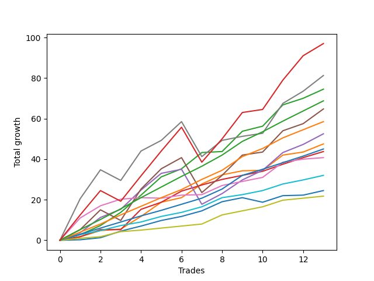

# Short Bernese 001 
- Symbol: ES_SmolBoi
- Date Range: 03/18/2022 - 09/30/2022
- Trading Period: 7:20-12:30
- Number of Trades: 22



| Name | Win Percent | Profit | Avg Profit / Trade | Avg Time / Trade |      | Name | Win Percent | Profit | Avg Profit / Trade | Avg Time / Trade |
| ---- | ----------- | ------ | ------------------ | ---------------- | ---- | ---- | ----------- | ------ | ------------------ | ---------------- |
| Sorted By <br> Profit | | | | | | Sorted By <br> Win Percentage ||||
| NEWFI 0000 | 77.27 | 76000.00 | 3454.55 | 34:30 |     | Eighty-Two | 100.00 | 35000.00 | 1590.91 | 05:36 |
| Five | 77.27 | 73250.00 | 3329.55 | 28:18 |     | Eighty-One | 100.00 | 26375.00 | 1198.86 | 02:49 |
| Seven | 72.73 | 68875.00 | 3130.68 | 31:48 |     | Two | 95.45 | 61000.00 | 2772.73 | 14:41 |
| Two | 95.45 | 61000.00 | 2772.73 | 14:41 |     | Eighty-Three | 95.45 | 33500.00 | 1522.73 | 08:03 |
| Four | 86.36 | 60875.00 | 2767.05 | 22:06 |     | Three | 90.91 | 48625.00 | 2210.23 | 12:17 |
| Three | 90.91 | 48625.00 | 2210.23 | 12:17 |     | One | 90.91 | 37625.00 | 1710.23 | 08:29 |
| Eighty-Five | 86.36 | 45500.00 | 2068.18 | 16:21 |     | Zero | 90.91 | 30875.00 | 1403.41 | 03:53 |
| One | 90.91 | 37625.00 | 1710.23 | 08:29 |     | Four | 86.36 | 60875.00 | 2767.05 | 22:06 |
| Eighty-Four | 86.36 | 37250.00 | 1693.18 | 12:59 |     | Eighty-Five | 86.36 | 45500.00 | 2068.18 | 16:21 |
| Eighty-Two | 100.00 | 35000.00 | 1590.91 | 05:36 |     | Eighty-Four | 86.36 | 37250.00 | 1693.18 | 12:59 |
| Eighty-Three | 95.45 | 33500.00 | 1522.73 | 08:03 |     | NEWFI 0000 | 77.27 | 76000.00 | 3454.55 | 34:30 |
| Zero | 90.91 | 30875.00 | 1403.41 | 03:53 |     | Five | 77.27 | 73250.00 | 3329.55 | 28:18 |
| Six | 77.27 | 29375.00 | 1335.23 | 08:01 |     | Six | 77.27 | 29375.00 | 1335.23 | 08:01 |
| Eighty-One | 100.00 | 26375.00 | 1198.86 | 02:49 |     | Seven | 72.73 | 68875.00 | 3130.68 | 31:48 |

## NO STOPLOSS

### Test Zero
* Sell when price hits the middle line of the 20p bollinger
* No Stoploss
* Results:
```
Total Trades: 22
Percent Up: 9.09
Percent Down: 90.91
Total Points Moved Down: 61.75
Potential Profit: 30875.00
Total Points Ups: 5.75 Count Ups: 2
Total Points Downs: 67.50 Count Downs: 20
```

<details><summary>Trades</summary>

<code>In: 2022-03-25 11:57:00		Out: 2022-03-25 11:57:15		Total Position Time: 00:15		Total Move Down: 0.25		Total to Date: 0.25</code> <br />
<code>In: 2022-03-29 08:52:00		Out: 2022-03-29 08:56:15		Total Position Time: 04:15		Total Move Down: 1.00		Total to Date: 1.25</code> <br />
<code>In: 2022-04-25 09:28:00		Out: 2022-04-25 09:31:05		Total Position Time: 03:05		Total Move Down: 3.25		Total to Date: 4.50</code> <br />
<code>In: 2022-04-26 09:31:00		Out: 2022-04-26 09:37:10		Total Position Time: 06:10		Total Move Down: 2.50		Total to Date: 7.00</code> <br />
<code>In: 2022-06-09 08:47:00		Out: 2022-06-09 08:48:20		Total Position Time: 01:20		Total Move Down: 2.75		Total to Date: 9.75</code> <br />
<code>In: 2022-06-09 09:46:00		Out: 2022-06-09 09:49:20		Total Position Time: 03:20		Total Move Down: 2.00		Total to Date: 11.75</code> <br />
<code>In: 2022-06-13 08:42:00		Out: 2022-06-13 08:47:40		Total Position Time: 05:40		Total Move Down: 2.75		Total to Date: 14.50</code> <br />
<code>In: 2022-06-15 09:19:00		Out: 2022-06-15 09:19:10		Total Position Time: 00:10		Total Move Down: 4.50		Total to Date: 19.00</code> <br />
<code>In: 2022-06-15 11:02:00		Out: 2022-06-15 11:02:10		Total Position Time: 00:10		Total Move Down: 2.00		Total to Date: 21.00</code> <br />
<code>In: 2022-06-29 12:20:00		Out: 2022-06-29 12:33:20		Total Position Time: 13:20		Total Move Down: -2.25		Total to Date: 18.75</code> <br />
<code>In: 2022-07-06 11:10:00		Out: 2022-07-06 11:10:10		Total Position Time: 00:10		Total Move Down: 3.25		Total to Date: 22.00</code> <br />
<code>In: 2022-07-18 09:01:00		Out: 2022-07-18 09:01:30		Total Position Time: 00:30		Total Move Down: 0.25		Total to Date: 22.25</code> <br />
<code>In: 2022-07-26 10:13:00		Out: 2022-07-26 10:15:10		Total Position Time: 02:10		Total Move Down: 2.25		Total to Date: 24.50</code> <br />
<code>In: 2022-08-01 12:01:00		Out: 2022-08-01 12:20:15		Total Position Time: 19:15		Total Move Down: -3.50		Total to Date: 21.00</code> <br />
<code>In: 2022-08-17 10:33:00		Out: 2022-08-17 10:34:05		Total Position Time: 01:05		Total Move Down: 0.75		Total to Date: 21.75</code> <br />
<code>In: 2022-08-22 09:28:00		Out: 2022-08-22 09:28:10		Total Position Time: 00:10		Total Move Down: 0.75		Total to Date: 22.50</code> <br />
<code>In: 2022-08-31 09:01:00		Out: 2022-08-31 09:04:15		Total Position Time: 03:15		Total Move Down: 1.25		Total to Date: 23.75</code> <br />
<code>In: 2022-09-12 10:32:00		Out: 2022-09-12 10:32:10		Total Position Time: 00:10		Total Move Down: 18.50		Total to Date: 42.25</code> <br />
<code>In: 2022-09-16 11:31:00		Out: 2022-09-16 11:41:05		Total Position Time: 10:05		Total Move Down: 0.75		Total to Date: 43.00</code> <br />
<code>In: 2022-09-21 11:48:00		Out: 2022-09-21 11:52:05		Total Position Time: 04:05		Total Move Down: 15.00		Total to Date: 58.00</code> <br />
<code>In: 2022-09-22 10:57:00		Out: 2022-09-22 11:01:30		Total Position Time: 04:30		Total Move Down: 1.50		Total to Date: 59.50</code> <br />
<code>In: 2022-09-22 12:16:00		Out: 2022-09-22 12:18:35		Total Position Time: 02:35		Total Move Down: 2.25		Total to Date: 61.75</code> <br />


</details>

### Test One
* Sell when the price hits the upper line of the 20p 1std bollinger
* No Stoploss
* Results:
```
Total Trades: 22
Percent Up: 9.09
Percent Down: 90.91
Total Points Moved Down: 75.25
Potential Profit: 37625.00
Total Points Ups: 11.50 Count Ups: 2
Total Points Downs: 86.75 Count Downs: 20
```

<details><summary>Trades</summary>

<code>In: 2022-03-25 11:57:00		Out: 2022-03-25 12:00:45		Total Position Time: 03:45		Total Move Down: 1.75		Total to Date: 1.75</code> <br />
<code>In: 2022-03-29 08:52:00		Out: 2022-03-29 08:58:40		Total Position Time: 06:40		Total Move Down: 3.00		Total to Date: 4.75</code> <br />
<code>In: 2022-04-25 09:28:00		Out: 2022-04-25 09:42:35		Total Position Time: 14:35		Total Move Down: 0.75		Total to Date: 5.50</code> <br />
<code>In: 2022-04-26 09:31:00		Out: 2022-04-26 09:38:00		Total Position Time: 07:00		Total Move Down: 6.25		Total to Date: 11.75</code> <br />
<code>In: 2022-06-09 08:47:00		Out: 2022-06-09 08:49:35		Total Position Time: 02:35		Total Move Down: 7.00		Total to Date: 18.75</code> <br />
<code>In: 2022-06-09 09:46:00		Out: 2022-06-09 09:54:45		Total Position Time: 08:45		Total Move Down: 2.25		Total to Date: 21.00</code> <br />
<code>In: 2022-06-13 08:42:00		Out: 2022-06-13 08:52:05		Total Position Time: 10:05		Total Move Down: 6.75		Total to Date: 27.75</code> <br />
<code>In: 2022-06-15 09:19:00		Out: 2022-06-15 09:19:10		Total Position Time: 00:10		Total Move Down: 4.50		Total to Date: 32.25</code> <br />
<code>In: 2022-06-15 11:02:00		Out: 2022-06-15 11:02:10		Total Position Time: 00:10		Total Move Down: 2.00		Total to Date: 34.25</code> <br />
<code>In: 2022-06-29 12:20:00		Out: 2022-06-29 12:34:10		Total Position Time: 14:10		Total Move Down: 0.25		Total to Date: 34.50</code> <br />
<code>In: 2022-07-06 11:10:00		Out: 2022-07-06 11:11:10		Total Position Time: 01:10		Total Move Down: 7.50		Total to Date: 42.00</code> <br />
<code>In: 2022-07-18 09:01:00		Out: 2022-07-18 09:05:10		Total Position Time: 04:10		Total Move Down: 1.50		Total to Date: 43.50</code> <br />
<code>In: 2022-07-26 10:13:00		Out: 2022-07-26 10:17:00		Total Position Time: 04:00		Total Move Down: 4.00		Total to Date: 47.50</code> <br />
<code>In: 2022-08-01 12:01:00		Out: 2022-08-01 12:21:35		Total Position Time: 20:35		Total Move Down: -2.25		Total to Date: 45.25</code> <br />
<code>In: 2022-08-17 10:33:00		Out: 2022-08-17 10:46:00		Total Position Time: 13:00		Total Move Down: 0.75		Total to Date: 46.00</code> <br />
<code>In: 2022-08-22 09:28:00		Out: 2022-08-22 09:29:00		Total Position Time: 01:00		Total Move Down: 2.50		Total to Date: 48.50</code> <br />
<code>In: 2022-08-31 09:01:00		Out: 2022-08-31 09:06:15		Total Position Time: 05:15		Total Move Down: 2.75		Total to Date: 51.25</code> <br />
<code>In: 2022-09-12 10:32:00		Out: 2022-09-12 10:32:10		Total Position Time: 00:10		Total Move Down: 18.50		Total to Date: 69.75</code> <br />
<code>In: 2022-09-16 11:31:00		Out: 2022-09-16 12:14:20		Total Position Time: 43:20		Total Move Down: -9.25		Total to Date: 60.50</code> <br />
<code>In: 2022-09-21 11:48:00		Out: 2022-09-21 12:03:25		Total Position Time: 15:25		Total Move Down: 7.25		Total to Date: 67.75</code> <br />
<code>In: 2022-09-22 10:57:00		Out: 2022-09-22 11:03:25		Total Position Time: 06:25		Total Move Down: 2.25		Total to Date: 70.00</code> <br />
<code>In: 2022-09-22 12:16:00		Out: 2022-09-22 12:20:15		Total Position Time: 04:15		Total Move Down: 5.25		Total to Date: 75.25</code> <br />


</details>

### Test Two
* Sell when the price hits the upper line of the 20p 2std bollinger
* No Stoploss
* Results:
```
Total Trades: 22
Percent Up: 4.55
Percent Down: 95.45
Total Points Moved Down: 122.00
Potential Profit: 61000.00
Total Points Ups: 6.75 Count Ups: 1
Total Points Downs: 128.75 Count Downs: 21
```

<details><summary>Trades</summary>

<code>In: 2022-03-25 11:57:00		Out: 2022-03-25 12:00:55		Total Position Time: 03:55		Total Move Down: 2.75		Total to Date: 2.75</code> <br />
<code>In: 2022-03-29 08:52:00		Out: 2022-03-29 09:01:40		Total Position Time: 09:40		Total Move Down: 4.50		Total to Date: 7.25</code> <br />
<code>In: 2022-04-25 09:28:00		Out: 2022-04-25 10:01:20		Total Position Time: 33:20		Total Move Down: 6.50		Total to Date: 13.75</code> <br />
<code>In: 2022-04-26 09:31:00		Out: 2022-04-26 09:40:15		Total Position Time: 09:15		Total Move Down: 8.50		Total to Date: 22.25</code> <br />
<code>In: 2022-06-09 08:47:00		Out: 2022-06-09 09:11:05		Total Position Time: 24:05		Total Move Down: 9.00		Total to Date: 31.25</code> <br />
<code>In: 2022-06-09 09:46:00		Out: 2022-06-09 09:55:00		Total Position Time: 09:00		Total Move Down: 4.00		Total to Date: 35.25</code> <br />
<code>In: 2022-06-13 08:42:00		Out: 2022-06-13 08:54:20		Total Position Time: 12:20		Total Move Down: 8.00		Total to Date: 43.25</code> <br />
<code>In: 2022-06-15 09:19:00		Out: 2022-06-15 09:34:05		Total Position Time: 15:05		Total Move Down: 0.50		Total to Date: 43.75</code> <br />
<code>In: 2022-06-15 11:02:00		Out: 2022-06-15 11:03:05		Total Position Time: 01:05		Total Move Down: 10.00		Total to Date: 53.75</code> <br />
<code>In: 2022-06-29 12:20:00		Out: 2022-06-29 12:35:20		Total Position Time: 15:20		Total Move Down: 2.50		Total to Date: 56.25</code> <br />
<code>In: 2022-07-06 11:10:00		Out: 2022-07-06 11:11:45		Total Position Time: 01:45		Total Move Down: 10.50		Total to Date: 66.75</code> <br />
<code>In: 2022-07-18 09:01:00		Out: 2022-07-18 09:08:15		Total Position Time: 07:15		Total Move Down: 3.25		Total to Date: 70.00</code> <br />
<code>In: 2022-07-26 10:13:00		Out: 2022-07-26 10:32:35		Total Position Time: 19:35		Total Move Down: 4.50		Total to Date: 74.50</code> <br />
<code>In: 2022-08-01 12:01:00		Out: 2022-08-01 12:22:40		Total Position Time: 21:40		Total Move Down: 0.50		Total to Date: 75.00</code> <br />
<code>In: 2022-08-17 10:33:00		Out: 2022-08-17 10:57:00		Total Position Time: 24:00		Total Move Down: 1.25		Total to Date: 76.25</code> <br />
<code>In: 2022-08-22 09:28:00		Out: 2022-08-22 09:44:55		Total Position Time: 16:55		Total Move Down: 4.75		Total to Date: 81.00</code> <br />
<code>In: 2022-08-31 09:01:00		Out: 2022-08-31 09:07:00		Total Position Time: 06:00		Total Move Down: 4.50		Total to Date: 85.50</code> <br />
<code>In: 2022-09-12 10:32:00		Out: 2022-09-12 10:32:10		Total Position Time: 00:10		Total Move Down: 18.50		Total to Date: 104.00</code> <br />
<code>In: 2022-09-16 11:31:00		Out: 2022-09-16 12:28:05		Total Position Time: 57:05		Total Move Down: -6.75		Total to Date: 97.25</code> <br />
<code>In: 2022-09-21 11:48:00		Out: 2022-09-21 12:09:10		Total Position Time: 21:10		Total Move Down: 11.75		Total to Date: 109.00</code> <br />
<code>In: 2022-09-22 10:57:00		Out: 2022-09-22 11:06:45		Total Position Time: 09:45		Total Move Down: 4.75		Total to Date: 113.75</code> <br />
<code>In: 2022-09-22 12:16:00		Out: 2022-09-22 12:20:40		Total Position Time: 04:40		Total Move Down: 8.25		Total to Date: 122.00</code> <br />


</details>

### Test Three
* Sell when price hits the middle line of the 50p bollinger
* No Stoploss
* Results:
```
Total Trades: 22
Percent Up: 9.09
Percent Down: 90.91
Total Points Moved Down: 97.25
Potential Profit: 48625.00
Total Points Ups: 6.75 Count Ups: 2
Total Points Downs: 104.00 Count Downs: 20
```

<details><summary>Trades</summary>

<code>In: 2022-03-25 11:57:00		Out: 2022-03-25 12:00:45		Total Position Time: 03:45		Total Move Down: 1.75		Total to Date: 1.75</code> <br />
<code>In: 2022-03-29 08:52:00		Out: 2022-03-29 09:01:25		Total Position Time: 09:25		Total Move Down: 3.50		Total to Date: 5.25</code> <br />
<code>In: 2022-04-25 09:28:00		Out: 2022-04-25 09:55:05		Total Position Time: 27:05		Total Move Down: -0.00		Total to Date: 5.25</code> <br />
<code>In: 2022-04-26 09:31:00		Out: 2022-04-26 09:46:10		Total Position Time: 15:10		Total Move Down: 10.00		Total to Date: 15.25</code> <br />
<code>In: 2022-06-09 08:47:00		Out: 2022-06-09 08:48:40		Total Position Time: 01:40		Total Move Down: 3.50		Total to Date: 18.75</code> <br />
<code>In: 2022-06-09 09:46:00		Out: 2022-06-09 09:55:50		Total Position Time: 09:50		Total Move Down: 5.50		Total to Date: 24.25</code> <br />
<code>In: 2022-06-13 08:42:00		Out: 2022-06-13 09:07:15		Total Position Time: 25:15		Total Move Down: 3.00		Total to Date: 27.25</code> <br />
<code>In: 2022-06-15 09:19:00		Out: 2022-06-15 09:35:10		Total Position Time: 16:10		Total Move Down: 2.75		Total to Date: 30.00</code> <br />
<code>In: 2022-06-15 11:02:00		Out: 2022-06-15 11:02:10		Total Position Time: 00:10		Total Move Down: 2.00		Total to Date: 32.00</code> <br />
<code>In: 2022-06-29 12:20:00		Out: 2022-06-29 12:34:15		Total Position Time: 14:15		Total Move Down: 2.00		Total to Date: 34.00</code> <br />
<code>In: 2022-07-06 11:10:00		Out: 2022-07-06 11:10:20		Total Position Time: 00:20		Total Move Down: 3.50		Total to Date: 37.50</code> <br />
<code>In: 2022-07-18 09:01:00		Out: 2022-07-18 09:08:15		Total Position Time: 07:15		Total Move Down: 3.25		Total to Date: 40.75</code> <br />
<code>In: 2022-07-26 10:13:00		Out: 2022-07-26 10:32:10		Total Position Time: 19:10		Total Move Down: 3.00		Total to Date: 43.75</code> <br />
<code>In: 2022-08-01 12:01:00		Out: 2022-08-01 12:22:35		Total Position Time: 21:35		Total Move Down: 0.50		Total to Date: 44.25</code> <br />
<code>In: 2022-08-17 10:33:00		Out: 2022-08-17 10:34:10		Total Position Time: 01:10		Total Move Down: 1.75		Total to Date: 46.00</code> <br />
<code>In: 2022-08-22 09:28:00		Out: 2022-08-22 09:28:10		Total Position Time: 00:10		Total Move Down: 0.75		Total to Date: 46.75</code> <br />
<code>In: 2022-08-31 09:01:00		Out: 2022-08-31 09:10:20		Total Position Time: 09:20		Total Move Down: 4.25		Total to Date: 51.00</code> <br />
<code>In: 2022-09-12 10:32:00		Out: 2022-09-12 10:32:10		Total Position Time: 00:10		Total Move Down: 18.50		Total to Date: 69.50</code> <br />
<code>In: 2022-09-16 11:31:00		Out: 2022-09-16 12:19:05		Total Position Time: 48:05		Total Move Down: -6.75		Total to Date: 62.75</code> <br />
<code>In: 2022-09-21 11:48:00		Out: 2022-09-21 12:10:10		Total Position Time: 22:10		Total Move Down: 21.50		Total to Date: 84.25</code> <br />
<code>In: 2022-09-22 10:57:00		Out: 2022-09-22 11:04:15		Total Position Time: 07:15		Total Move Down: 3.75		Total to Date: 88.00</code> <br />
<code>In: 2022-09-22 12:16:00		Out: 2022-09-22 12:27:05		Total Position Time: 11:05		Total Move Down: 9.25		Total to Date: 97.25</code> <br />


</details>

### Test Four
* Sell when the price hits the upper line of the 50p 1std bollinger
* No Stoploss
* Results:
```
Total Trades: 22
Percent Up: 13.64
Percent Down: 86.36
Total Points Moved Down: 121.75
Potential Profit: 60875.00
Total Points Ups: 24.50 Count Ups: 3
Total Points Downs: 146.25 Count Downs: 19
```

<details><summary>Trades</summary>

<code>In: 2022-03-25 11:57:00		Out: 2022-03-25 12:01:35		Total Position Time: 04:35		Total Move Down: 3.75		Total to Date: 3.75</code> <br />
<code>In: 2022-03-29 08:52:00		Out: 2022-03-29 09:02:15		Total Position Time: 10:15		Total Move Down: 7.50		Total to Date: 11.25</code> <br />
<code>In: 2022-04-25 09:28:00		Out: 2022-04-25 10:01:15		Total Position Time: 33:15		Total Move Down: 4.00		Total to Date: 15.25</code> <br />
<code>In: 2022-04-26 09:31:00		Out: 2022-04-26 10:02:50		Total Position Time: 31:50		Total Move Down: 9.50		Total to Date: 24.75</code> <br />
<code>In: 2022-06-09 08:47:00		Out: 2022-06-09 08:50:20		Total Position Time: 03:20		Total Move Down: 8.25		Total to Date: 33.00</code> <br />
<code>In: 2022-06-09 09:46:00		Out: 2022-06-09 10:23:50		Total Position Time: 37:50		Total Move Down: 2.00		Total to Date: 35.00</code> <br />
<code>In: 2022-06-13 08:42:00		Out: 2022-06-13 09:41:55		Total Position Time: 59:55		Total Move Down: -17.25		Total to Date: 17.75</code> <br />
<code>In: 2022-06-15 09:19:00		Out: 2022-06-15 09:39:25		Total Position Time: 20:25		Total Move Down: 5.25		Total to Date: 23.00</code> <br />
<code>In: 2022-06-15 11:02:00		Out: 2022-06-15 11:03:00		Total Position Time: 01:00		Total Move Down: 6.75		Total to Date: 29.75</code> <br />
<code>In: 2022-06-29 12:20:00		Out: 2022-06-29 12:41:00		Total Position Time: 21:00		Total Move Down: 4.75		Total to Date: 34.50</code> <br />
<code>In: 2022-07-06 11:10:00		Out: 2022-07-06 11:11:35		Total Position Time: 01:35		Total Move Down: 8.75		Total to Date: 43.25</code> <br />
<code>In: 2022-07-18 09:01:00		Out: 2022-07-18 09:19:25		Total Position Time: 18:25		Total Move Down: 4.00		Total to Date: 47.25</code> <br />
<code>In: 2022-07-26 10:13:00		Out: 2022-07-26 10:38:20		Total Position Time: 25:20		Total Move Down: 5.25		Total to Date: 52.50</code> <br />
<code>In: 2022-08-01 12:01:00		Out: 2022-08-01 12:43:55		Total Position Time: 42:55		Total Move Down: 2.00		Total to Date: 54.50</code> <br />
<code>In: 2022-08-17 10:33:00		Out: 2022-08-17 11:00:50		Total Position Time: 27:50		Total Move Down: 2.00		Total to Date: 56.50</code> <br />
<code>In: 2022-08-22 09:28:00		Out: 2022-08-22 09:28:30		Total Position Time: 00:30		Total Move Down: 1.25		Total to Date: 57.75</code> <br />
<code>In: 2022-08-31 09:01:00		Out: 2022-08-31 09:22:40		Total Position Time: 21:40		Total Move Down: 5.75		Total to Date: 63.50</code> <br />
<code>In: 2022-09-12 10:32:00		Out: 2022-09-12 10:32:10		Total Position Time: 00:10		Total Move Down: 18.50		Total to Date: 82.00</code> <br />
<code>In: 2022-09-16 11:31:00		Out: 2022-09-16 12:30:20		Total Position Time: 59:20		Total Move Down: -5.25		Total to Date: 76.75</code> <br />
<code>In: 2022-09-21 11:48:00		Out: 2022-09-21 12:11:05		Total Position Time: 23:05		Total Move Down: 40.75		Total to Date: 117.50</code> <br />
<code>In: 2022-09-22 10:57:00		Out: 2022-09-22 11:09:10		Total Position Time: 12:10		Total Move Down: 6.25		Total to Date: 123.75</code> <br />
<code>In: 2022-09-22 12:16:00		Out: 2022-09-22 12:46:00		Total Position Time: 30:00		Total Move Down: -2.00		Total to Date: 121.75</code> <br />


</details>

### Test Five
* Sell when the price hits the upper line of the 50p 2std bollinger
* No Stoploss
* Results:
```
Total Trades: 22
Percent Up: 22.73
Percent Down: 77.27
Total Points Moved Down: 146.50
Potential Profit: 73250.00
Total Points Ups: 26.75 Count Ups: 5
Total Points Downs: 173.25 Count Downs: 17
```

<details><summary>Trades</summary>

<code>In: 2022-03-25 11:57:00		Out: 2022-03-25 12:01:55		Total Position Time: 04:55		Total Move Down: 5.25		Total to Date: 5.25</code> <br />
<code>In: 2022-03-29 08:52:00		Out: 2022-03-29 09:10:50		Total Position Time: 18:50		Total Move Down: 9.75		Total to Date: 15.00</code> <br />
<code>In: 2022-04-25 09:28:00		Out: 2022-04-25 10:27:55		Total Position Time: 59:55		Total Move Down: -5.25		Total to Date: 9.75</code> <br />
<code>In: 2022-04-26 09:31:00		Out: 2022-04-26 10:14:40		Total Position Time: 43:40		Total Move Down: 15.50		Total to Date: 25.25</code> <br />
<code>In: 2022-06-09 08:47:00		Out: 2022-06-09 09:11:10		Total Position Time: 24:10		Total Move Down: 10.00		Total to Date: 35.25</code> <br />
<code>In: 2022-06-09 09:46:00		Out: 2022-06-09 10:27:20		Total Position Time: 41:20		Total Move Down: 5.50		Total to Date: 40.75</code> <br />
<code>In: 2022-06-13 08:42:00		Out: 2022-06-13 09:41:55		Total Position Time: 59:55		Total Move Down: -17.25		Total to Date: 23.50</code> <br />
<code>In: 2022-06-15 09:19:00		Out: 2022-06-15 09:41:45		Total Position Time: 22:45		Total Move Down: 8.50		Total to Date: 32.00</code> <br />
<code>In: 2022-06-15 11:02:00		Out: 2022-06-15 11:03:05		Total Position Time: 01:05		Total Move Down: 10.00		Total to Date: 42.00</code> <br />
<code>In: 2022-06-29 12:20:00		Out: 2022-06-29 12:46:00		Total Position Time: 26:00		Total Move Down: 1.50		Total to Date: 43.50</code> <br />
<code>In: 2022-07-06 11:10:00		Out: 2022-07-06 11:11:50		Total Position Time: 01:50		Total Move Down: 10.50		Total to Date: 54.00</code> <br />
<code>In: 2022-07-18 09:01:00		Out: 2022-07-18 09:26:05		Total Position Time: 25:05		Total Move Down: 3.50		Total to Date: 57.50</code> <br />
<code>In: 2022-07-26 10:13:00		Out: 2022-07-26 10:47:00		Total Position Time: 34:00		Total Move Down: 7.25		Total to Date: 64.75</code> <br />
<code>In: 2022-08-01 12:01:00		Out: 2022-08-01 12:46:00		Total Position Time: 45:00		Total Move Down: -0.00		Total to Date: 64.75</code> <br />
<code>In: 2022-08-17 10:33:00		Out: 2022-08-17 11:01:00		Total Position Time: 28:00		Total Move Down: 2.00		Total to Date: 66.75</code> <br />
<code>In: 2022-08-22 09:28:00		Out: 2022-08-22 09:44:55		Total Position Time: 16:55		Total Move Down: 4.75		Total to Date: 71.50</code> <br />
<code>In: 2022-08-31 09:01:00		Out: 2022-08-31 09:23:45		Total Position Time: 22:45		Total Move Down: 8.50		Total to Date: 80.00</code> <br />
<code>In: 2022-09-12 10:32:00		Out: 2022-09-12 10:32:10		Total Position Time: 00:10		Total Move Down: 18.50		Total to Date: 98.50</code> <br />
<code>In: 2022-09-16 11:31:00		Out: 2022-09-16 12:30:55		Total Position Time: 59:55		Total Move Down: -2.25		Total to Date: 96.25</code> <br />
<code>In: 2022-09-21 11:48:00		Out: 2022-09-21 12:26:25		Total Position Time: 38:25		Total Move Down: 43.00		Total to Date: 139.25</code> <br />
<code>In: 2022-09-22 10:57:00		Out: 2022-09-22 11:15:05		Total Position Time: 18:05		Total Move Down: 9.25		Total to Date: 148.50</code> <br />
<code>In: 2022-09-22 12:16:00		Out: 2022-09-22 12:46:00		Total Position Time: 30:00		Total Move Down: -2.00		Total to Date: 146.50</code> <br />


</details>

### Test Six
* Sell when the price hits the middle line of the 1std VWAP
* No Stoploss
* Results:
```
Total Trades: 22
Percent Up: 22.73
Percent Down: 77.27
Total Points Moved Down: 58.75
Potential Profit: 29375.00
Total Points Ups: 25.50 Count Ups: 5
Total Points Downs: 84.25 Count Downs: 17
```

<details><summary>Trades</summary>

<code>In: 2022-03-25 11:57:00		Out: 2022-03-25 12:07:35		Total Position Time: 10:35		Total Move Down: 11.00		Total to Date: 11.00</code> <br />
<code>In: 2022-03-29 08:52:00		Out: 2022-03-29 09:02:10		Total Position Time: 10:10		Total Move Down: 6.00		Total to Date: 17.00</code> <br />
<code>In: 2022-04-25 09:28:00		Out: 2022-04-25 09:31:05		Total Position Time: 03:05		Total Move Down: 3.25		Total to Date: 20.25</code> <br />
<code>In: 2022-04-26 09:31:00		Out: 2022-04-26 09:31:10		Total Position Time: 00:10		Total Move Down: 0.75		Total to Date: 21.00</code> <br />
<code>In: 2022-06-09 08:47:00		Out: 2022-06-09 08:47:10		Total Position Time: 00:10		Total Move Down: -0.25		Total to Date: 20.75</code> <br />
<code>In: 2022-06-09 09:46:00		Out: 2022-06-09 09:48:20		Total Position Time: 02:20		Total Move Down: 1.50		Total to Date: 22.25</code> <br />
<code>In: 2022-06-13 08:42:00		Out: 2022-06-13 08:42:10		Total Position Time: 00:10		Total Move Down: 0.25		Total to Date: 22.50</code> <br />
<code>In: 2022-06-15 09:19:00		Out: 2022-06-15 09:19:10		Total Position Time: 00:10		Total Move Down: 4.50		Total to Date: 27.00</code> <br />
<code>In: 2022-06-15 11:02:00		Out: 2022-06-15 11:02:10		Total Position Time: 00:10		Total Move Down: 2.00		Total to Date: 29.00</code> <br />
<code>In: 2022-06-29 12:20:00		Out: 2022-06-29 12:34:15		Total Position Time: 14:15		Total Move Down: 2.00		Total to Date: 31.00</code> <br />
<code>In: 2022-07-06 11:10:00		Out: 2022-07-06 11:11:10		Total Position Time: 01:10		Total Move Down: 7.50		Total to Date: 38.50</code> <br />
<code>In: 2022-07-18 09:01:00		Out: 2022-07-18 09:05:10		Total Position Time: 04:10		Total Move Down: 1.50		Total to Date: 40.00</code> <br />
<code>In: 2022-07-26 10:13:00		Out: 2022-07-26 10:13:10		Total Position Time: 00:10		Total Move Down: 0.75		Total to Date: 40.75</code> <br />
<code>In: 2022-08-01 12:01:00		Out: 2022-08-01 12:01:10		Total Position Time: 00:10		Total Move Down: -1.00		Total to Date: 39.75</code> <br />
<code>In: 2022-08-17 10:33:00		Out: 2022-08-17 11:32:55		Total Position Time: 59:55		Total Move Down: -22.25		Total to Date: 17.50</code> <br />
<code>In: 2022-08-22 09:28:00		Out: 2022-08-22 09:28:10		Total Position Time: 00:10		Total Move Down: 0.75		Total to Date: 18.25</code> <br />
<code>In: 2022-08-31 09:01:00		Out: 2022-08-31 09:01:10		Total Position Time: 00:10		Total Move Down: -0.00		Total to Date: 18.25</code> <br />
<code>In: 2022-09-12 10:32:00		Out: 2022-09-12 10:32:10		Total Position Time: 00:10		Total Move Down: 18.50		Total to Date: 36.75</code> <br />
<code>In: 2022-09-16 11:31:00		Out: 2022-09-16 11:41:40		Total Position Time: 10:40		Total Move Down: 3.25		Total to Date: 40.00</code> <br />
<code>In: 2022-09-21 11:48:00		Out: 2022-09-21 12:10:05		Total Position Time: 22:05		Total Move Down: 18.50		Total to Date: 58.50</code> <br />
<code>In: 2022-09-22 10:57:00		Out: 2022-09-22 11:03:25		Total Position Time: 06:25		Total Move Down: 2.25		Total to Date: 60.75</code> <br />
<code>In: 2022-09-22 12:16:00		Out: 2022-09-22 12:46:00		Total Position Time: 30:00		Total Move Down: -2.00		Total to Date: 58.75</code> <br />


</details>

### Test Seven
* Sell when the price hits the upper line of the 1std VWAP
* No Stoploss
* Results:
```
Total Trades: 22
Percent Up: 27.27
Percent Down: 72.73
Total Points Moved Down: 137.75
Potential Profit: 68875.00
Total Points Ups: 49.00 Count Ups: 6
Total Points Downs: 186.75 Count Downs: 16
```

<details><summary>Trades</summary>

<code>In: 2022-03-25 11:57:00		Out: 2022-03-25 12:33:10		Total Position Time: 36:10		Total Move Down: 20.50		Total to Date: 20.50</code> <br />
<code>In: 2022-03-29 08:52:00		Out: 2022-03-29 09:27:55		Total Position Time: 35:55		Total Move Down: 14.25		Total to Date: 34.75</code> <br />
<code>In: 2022-04-25 09:28:00		Out: 2022-04-25 10:27:55		Total Position Time: 59:55		Total Move Down: -5.25		Total to Date: 29.50</code> <br />
<code>In: 2022-04-26 09:31:00		Out: 2022-04-26 10:14:15		Total Position Time: 43:15		Total Move Down: 14.50		Total to Date: 44.00</code> <br />
<code>In: 2022-06-09 08:47:00		Out: 2022-06-09 08:48:50		Total Position Time: 01:50		Total Move Down: 5.25		Total to Date: 49.25</code> <br />
<code>In: 2022-06-09 09:46:00		Out: 2022-06-09 10:30:30		Total Position Time: 44:30		Total Move Down: 9.25		Total to Date: 58.50</code> <br />
<code>In: 2022-06-13 08:42:00		Out: 2022-06-13 09:41:55		Total Position Time: 59:55		Total Move Down: -17.25		Total to Date: 41.25</code> <br />
<code>In: 2022-06-15 09:19:00		Out: 2022-06-15 09:41:40		Total Position Time: 22:40		Total Move Down: 8.00		Total to Date: 49.25</code> <br />
<code>In: 2022-06-15 11:02:00		Out: 2022-06-15 11:02:10		Total Position Time: 00:10		Total Move Down: 2.00		Total to Date: 51.25</code> <br />
<code>In: 2022-06-29 12:20:00		Out: 2022-06-29 12:46:00		Total Position Time: 26:00		Total Move Down: 1.50		Total to Date: 52.75</code> <br />
<code>In: 2022-07-06 11:10:00		Out: 2022-07-06 11:12:20		Total Position Time: 02:20		Total Move Down: 14.75		Total to Date: 67.50</code> <br />
<code>In: 2022-07-18 09:01:00		Out: 2022-07-18 09:49:15		Total Position Time: 48:15		Total Move Down: 6.00		Total to Date: 73.50</code> <br />
<code>In: 2022-07-26 10:13:00		Out: 2022-07-26 10:57:05		Total Position Time: 44:05		Total Move Down: 7.75		Total to Date: 81.25</code> <br />
<code>In: 2022-08-01 12:01:00		Out: 2022-08-01 12:46:00		Total Position Time: 45:00		Total Move Down: -0.00		Total to Date: 81.25</code> <br />
<code>In: 2022-08-17 10:33:00		Out: 2022-08-17 11:32:55		Total Position Time: 59:55		Total Move Down: -22.25		Total to Date: 59.00</code> <br />
<code>In: 2022-08-22 09:28:00		Out: 2022-08-22 09:44:55		Total Position Time: 16:55		Total Move Down: 4.75		Total to Date: 63.75</code> <br />
<code>In: 2022-08-31 09:01:00		Out: 2022-08-31 09:24:30		Total Position Time: 23:30		Total Move Down: 10.00		Total to Date: 73.75</code> <br />
<code>In: 2022-09-12 10:32:00		Out: 2022-09-12 10:32:10		Total Position Time: 00:10		Total Move Down: 18.50		Total to Date: 92.25</code> <br />
<code>In: 2022-09-16 11:31:00		Out: 2022-09-16 12:30:55		Total Position Time: 59:55		Total Move Down: -2.25		Total to Date: 90.00</code> <br />
<code>In: 2022-09-21 11:48:00		Out: 2022-09-21 12:11:05		Total Position Time: 23:05		Total Move Down: 40.75		Total to Date: 130.75</code> <br />
<code>In: 2022-09-22 10:57:00		Out: 2022-09-22 11:13:10		Total Position Time: 16:10		Total Move Down: 9.00		Total to Date: 139.75</code> <br />
<code>In: 2022-09-22 12:16:00		Out: 2022-09-22 12:46:00		Total Position Time: 30:00		Total Move Down: -2.00		Total to Date: 137.75</code> <br />


</details>

## TAKE PROFIT

### Test Eighty-One
* Take Profit of 1 Point
* No Stoploss
* Results:
```
Total Trades: 22
Percent Up: 0.00
Percent Down: 100.00
Total Points Moved Down: 52.75
Potential Profit: 26375.00
Total Points Ups: 0.00 Count Ups: 0
Total Points Downs: 52.75 Count Downs: 22
```

<details><summary>Trades</summary>

<code>In: 2022-03-25 11:57:00		Out: 2022-03-25 11:58:45		Total Position Time: 01:45		Total Move Down: 1.00		Total to Date: 1.00</code> <br />
<code>In: 2022-03-29 08:52:00		Out: 2022-03-29 08:52:55		Total Position Time: 00:55		Total Move Down: 0.75		Total to Date: 1.75</code> <br />
<code>In: 2022-04-25 09:28:00		Out: 2022-04-25 09:28:30		Total Position Time: 00:30		Total Move Down: 2.50		Total to Date: 4.25</code> <br />
<code>In: 2022-04-26 09:31:00		Out: 2022-04-26 09:31:55		Total Position Time: 00:55		Total Move Down: 0.75		Total to Date: 5.00</code> <br />
<code>In: 2022-06-09 08:47:00		Out: 2022-06-09 08:48:05		Total Position Time: 01:05		Total Move Down: 1.00		Total to Date: 6.00</code> <br />
<code>In: 2022-06-09 09:46:00		Out: 2022-06-09 09:47:25		Total Position Time: 01:25		Total Move Down: 1.00		Total to Date: 7.00</code> <br />
<code>In: 2022-06-13 08:42:00		Out: 2022-06-13 08:47:05		Total Position Time: 05:05		Total Move Down: 1.00		Total to Date: 8.00</code> <br />
<code>In: 2022-06-15 09:19:00		Out: 2022-06-15 09:19:10		Total Position Time: 00:10		Total Move Down: 4.50		Total to Date: 12.50</code> <br />
<code>In: 2022-06-15 11:02:00		Out: 2022-06-15 11:02:10		Total Position Time: 00:10		Total Move Down: 2.00		Total to Date: 14.50</code> <br />
<code>In: 2022-06-29 12:20:00		Out: 2022-06-29 12:34:15		Total Position Time: 14:15		Total Move Down: 2.00		Total to Date: 16.50</code> <br />
<code>In: 2022-07-06 11:10:00		Out: 2022-07-06 11:10:10		Total Position Time: 00:10		Total Move Down: 3.25		Total to Date: 19.75</code> <br />
<code>In: 2022-07-18 09:01:00		Out: 2022-07-18 09:02:05		Total Position Time: 01:05		Total Move Down: 1.00		Total to Date: 20.75</code> <br />
<code>In: 2022-07-26 10:13:00		Out: 2022-07-26 10:13:15		Total Position Time: 00:15		Total Move Down: 1.00		Total to Date: 21.75</code> <br />
<code>In: 2022-08-01 12:01:00		Out: 2022-08-01 12:22:55		Total Position Time: 21:55		Total Move Down: 1.50		Total to Date: 23.25</code> <br />
<code>In: 2022-08-17 10:33:00		Out: 2022-08-17 10:34:05		Total Position Time: 01:05		Total Move Down: 0.75		Total to Date: 24.00</code> <br />
<code>In: 2022-08-22 09:28:00		Out: 2022-08-22 09:28:15		Total Position Time: 00:15		Total Move Down: 1.25		Total to Date: 25.25</code> <br />
<code>In: 2022-08-31 09:01:00		Out: 2022-08-31 09:04:15		Total Position Time: 03:15		Total Move Down: 1.25		Total to Date: 26.50</code> <br />
<code>In: 2022-09-12 10:32:00		Out: 2022-09-12 10:32:10		Total Position Time: 00:10		Total Move Down: 18.50		Total to Date: 45.00</code> <br />
<code>In: 2022-09-16 11:31:00		Out: 2022-09-16 11:31:30		Total Position Time: 00:30		Total Move Down: 1.00		Total to Date: 46.00</code> <br />
<code>In: 2022-09-21 11:48:00		Out: 2022-09-21 11:48:25		Total Position Time: 00:25		Total Move Down: 4.50		Total to Date: 50.50</code> <br />
<code>In: 2022-09-22 10:57:00		Out: 2022-09-22 11:01:30		Total Position Time: 04:30		Total Move Down: 1.50		Total to Date: 52.00</code> <br />
<code>In: 2022-09-22 12:16:00		Out: 2022-09-22 12:18:10		Total Position Time: 02:10		Total Move Down: 0.75		Total to Date: 52.75</code> <br />


</details>

### Test Eighty-Two
* Take Profit of 2 Point
* No Stoploss
* Results:
```
Total Trades: 22
Percent Up: 0.00
Percent Down: 100.00
Total Points Moved Down: 70.00
Potential Profit: 35000.00
Total Points Ups: 0.00 Count Ups: 0
Total Points Downs: 70.00 Count Downs: 22
```

<details><summary>Trades</summary>

<code>In: 2022-03-25 11:57:00		Out: 2022-03-25 12:00:50		Total Position Time: 03:50		Total Move Down: 2.75		Total to Date: 2.75</code> <br />
<code>In: 2022-03-29 08:52:00		Out: 2022-03-29 08:57:40		Total Position Time: 05:40		Total Move Down: 2.00		Total to Date: 4.75</code> <br />
<code>In: 2022-04-25 09:28:00		Out: 2022-04-25 09:28:30		Total Position Time: 00:30		Total Move Down: 2.50		Total to Date: 7.25</code> <br />
<code>In: 2022-04-26 09:31:00		Out: 2022-04-26 09:32:00		Total Position Time: 01:00		Total Move Down: 1.75		Total to Date: 9.00</code> <br />
<code>In: 2022-06-09 08:47:00		Out: 2022-06-09 08:48:20		Total Position Time: 01:20		Total Move Down: 2.75		Total to Date: 11.75</code> <br />
<code>In: 2022-06-09 09:46:00		Out: 2022-06-09 09:49:20		Total Position Time: 03:20		Total Move Down: 2.00		Total to Date: 13.75</code> <br />
<code>In: 2022-06-13 08:42:00		Out: 2022-06-13 08:47:40		Total Position Time: 05:40		Total Move Down: 2.75		Total to Date: 16.50</code> <br />
<code>In: 2022-06-15 09:19:00		Out: 2022-06-15 09:19:10		Total Position Time: 00:10		Total Move Down: 4.50		Total to Date: 21.00</code> <br />
<code>In: 2022-06-15 11:02:00		Out: 2022-06-15 11:02:45		Total Position Time: 00:45		Total Move Down: 1.50		Total to Date: 22.50</code> <br />
<code>In: 2022-06-29 12:20:00		Out: 2022-06-29 12:34:15		Total Position Time: 14:15		Total Move Down: 2.00		Total to Date: 24.50</code> <br />
<code>In: 2022-07-06 11:10:00		Out: 2022-07-06 11:10:10		Total Position Time: 00:10		Total Move Down: 3.25		Total to Date: 27.75</code> <br />
<code>In: 2022-07-18 09:01:00		Out: 2022-07-18 09:07:55		Total Position Time: 06:55		Total Move Down: 2.00		Total to Date: 29.75</code> <br />
<code>In: 2022-07-26 10:13:00		Out: 2022-07-26 10:15:10		Total Position Time: 02:10		Total Move Down: 2.25		Total to Date: 32.00</code> <br />
<code>In: 2022-08-01 12:01:00		Out: 2022-08-01 12:25:10		Total Position Time: 24:10		Total Move Down: 2.25		Total to Date: 34.25</code> <br />
<code>In: 2022-08-17 10:33:00		Out: 2022-08-17 11:00:50		Total Position Time: 27:50		Total Move Down: 2.00		Total to Date: 36.25</code> <br />
<code>In: 2022-08-22 09:28:00		Out: 2022-08-22 09:28:40		Total Position Time: 00:40		Total Move Down: 1.75		Total to Date: 38.00</code> <br />
<code>In: 2022-08-31 09:01:00		Out: 2022-08-31 09:06:15		Total Position Time: 05:15		Total Move Down: 2.75		Total to Date: 40.75</code> <br />
<code>In: 2022-09-12 10:32:00		Out: 2022-09-12 10:32:10		Total Position Time: 00:10		Total Move Down: 18.50		Total to Date: 59.25</code> <br />
<code>In: 2022-09-16 11:31:00		Out: 2022-09-16 11:41:15		Total Position Time: 10:15		Total Move Down: 2.25		Total to Date: 61.50</code> <br />
<code>In: 2022-09-21 11:48:00		Out: 2022-09-21 11:48:25		Total Position Time: 00:25		Total Move Down: 4.50		Total to Date: 66.00</code> <br />
<code>In: 2022-09-22 10:57:00		Out: 2022-09-22 11:03:25		Total Position Time: 06:25		Total Move Down: 2.25		Total to Date: 68.25</code> <br />
<code>In: 2022-09-22 12:16:00		Out: 2022-09-22 12:18:25		Total Position Time: 02:25		Total Move Down: 1.75		Total to Date: 70.00</code> <br />


</details>

### Test Eighty-Three
* Take Profit of 3 Point
* No Stoploss
* Results:
```
Total Trades: 22
Percent Up: 4.55
Percent Down: 95.45
Total Points Moved Down: 67.00
Potential Profit: 33500.00
Total Points Ups: 22.25 Count Ups: 1
Total Points Downs: 89.25 Count Downs: 21
```

<details><summary>Trades</summary>

<code>In: 2022-03-25 11:57:00		Out: 2022-03-25 12:01:00		Total Position Time: 04:00		Total Move Down: 3.00		Total to Date: 3.00</code> <br />
<code>In: 2022-03-29 08:52:00		Out: 2022-03-29 08:58:40		Total Position Time: 06:40		Total Move Down: 3.00		Total to Date: 6.00</code> <br />
<code>In: 2022-04-25 09:28:00		Out: 2022-04-25 09:31:00		Total Position Time: 03:00		Total Move Down: 3.00		Total to Date: 9.00</code> <br />
<code>In: 2022-04-26 09:31:00		Out: 2022-04-26 09:32:05		Total Position Time: 01:05		Total Move Down: 3.00		Total to Date: 12.00</code> <br />
<code>In: 2022-06-09 08:47:00		Out: 2022-06-09 08:48:20		Total Position Time: 01:20		Total Move Down: 2.75		Total to Date: 14.75</code> <br />
<code>In: 2022-06-09 09:46:00		Out: 2022-06-09 09:54:55		Total Position Time: 08:55		Total Move Down: 3.00		Total to Date: 17.75</code> <br />
<code>In: 2022-06-13 08:42:00		Out: 2022-06-13 08:47:50		Total Position Time: 05:50		Total Move Down: 3.00		Total to Date: 20.75</code> <br />
<code>In: 2022-06-15 09:19:00		Out: 2022-06-15 09:19:10		Total Position Time: 00:10		Total Move Down: 4.50		Total to Date: 25.25</code> <br />
<code>In: 2022-06-15 11:02:00		Out: 2022-06-15 11:03:00		Total Position Time: 01:00		Total Move Down: 6.75		Total to Date: 32.00</code> <br />
<code>In: 2022-06-29 12:20:00		Out: 2022-06-29 12:35:15		Total Position Time: 15:15		Total Move Down: 3.00		Total to Date: 35.00</code> <br />
<code>In: 2022-07-06 11:10:00		Out: 2022-07-06 11:10:10		Total Position Time: 00:10		Total Move Down: 3.25		Total to Date: 38.25</code> <br />
<code>In: 2022-07-18 09:01:00		Out: 2022-07-18 09:08:15		Total Position Time: 07:15		Total Move Down: 3.25		Total to Date: 41.50</code> <br />
<code>In: 2022-07-26 10:13:00		Out: 2022-07-26 10:16:35		Total Position Time: 03:35		Total Move Down: 3.50		Total to Date: 45.00</code> <br />
<code>In: 2022-08-01 12:01:00		Out: 2022-08-01 12:28:05		Total Position Time: 27:05		Total Move Down: 3.50		Total to Date: 48.50</code> <br />
<code>In: 2022-08-17 10:33:00		Out: 2022-08-17 11:32:55		Total Position Time: 59:55		Total Move Down: -22.25		Total to Date: 26.25</code> <br />
<code>In: 2022-08-22 09:28:00		Out: 2022-08-22 09:32:05		Total Position Time: 04:05		Total Move Down: 3.00		Total to Date: 29.25</code> <br />
<code>In: 2022-08-31 09:01:00		Out: 2022-08-31 09:06:25		Total Position Time: 05:25		Total Move Down: 3.00		Total to Date: 32.25</code> <br />
<code>In: 2022-09-12 10:32:00		Out: 2022-09-12 10:32:10		Total Position Time: 00:10		Total Move Down: 18.50		Total to Date: 50.75</code> <br />
<code>In: 2022-09-16 11:31:00		Out: 2022-09-16 11:41:20		Total Position Time: 10:20		Total Move Down: 2.75		Total to Date: 53.50</code> <br />
<code>In: 2022-09-21 11:48:00		Out: 2022-09-21 11:48:25		Total Position Time: 00:25		Total Move Down: 4.50		Total to Date: 58.00</code> <br />
<code>In: 2022-09-22 10:57:00		Out: 2022-09-22 11:04:15		Total Position Time: 07:15		Total Move Down: 3.75		Total to Date: 61.75</code> <br />
<code>In: 2022-09-22 12:16:00		Out: 2022-09-22 12:20:15		Total Position Time: 04:15		Total Move Down: 5.25		Total to Date: 67.00</code> <br />


</details>

### Test Eighty-Four
* Take Profit of 4 Point
* No Stoploss
* Results:
```
Total Trades: 22
Percent Up: 13.64
Percent Down: 86.36
Total Points Moved Down: 74.50
Potential Profit: 37250.00
Total Points Ups: 24.50 Count Ups: 3
Total Points Downs: 99.00 Count Downs: 19
```

<details><summary>Trades</summary>

<code>In: 2022-03-25 11:57:00		Out: 2022-03-25 12:01:45		Total Position Time: 04:45		Total Move Down: 4.00		Total to Date: 4.00</code> <br />
<code>In: 2022-03-29 08:52:00		Out: 2022-03-29 09:01:35		Total Position Time: 09:35		Total Move Down: 4.00		Total to Date: 8.00</code> <br />
<code>In: 2022-04-25 09:28:00		Out: 2022-04-25 09:31:10		Total Position Time: 03:10		Total Move Down: 4.50		Total to Date: 12.50</code> <br />
<code>In: 2022-04-26 09:31:00		Out: 2022-04-26 09:37:35		Total Position Time: 06:35		Total Move Down: 4.25		Total to Date: 16.75</code> <br />
<code>In: 2022-06-09 08:47:00		Out: 2022-06-09 08:48:35		Total Position Time: 01:35		Total Move Down: 4.25		Total to Date: 21.00</code> <br />
<code>In: 2022-06-09 09:46:00		Out: 2022-06-09 09:55:00		Total Position Time: 09:00		Total Move Down: 4.00		Total to Date: 25.00</code> <br />
<code>In: 2022-06-13 08:42:00		Out: 2022-06-13 08:51:35		Total Position Time: 09:35		Total Move Down: 5.00		Total to Date: 30.00</code> <br />
<code>In: 2022-06-15 09:19:00		Out: 2022-06-15 09:19:10		Total Position Time: 00:10		Total Move Down: 4.50		Total to Date: 34.50</code> <br />
<code>In: 2022-06-15 11:02:00		Out: 2022-06-15 11:03:00		Total Position Time: 01:00		Total Move Down: 6.75		Total to Date: 41.25</code> <br />
<code>In: 2022-06-29 12:20:00		Out: 2022-06-29 12:37:05		Total Position Time: 17:05		Total Move Down: 4.00		Total to Date: 45.25</code> <br />
<code>In: 2022-07-06 11:10:00		Out: 2022-07-06 11:11:05		Total Position Time: 01:05		Total Move Down: 5.25		Total to Date: 50.50</code> <br />
<code>In: 2022-07-18 09:01:00		Out: 2022-07-18 09:19:25		Total Position Time: 18:25		Total Move Down: 4.00		Total to Date: 54.50</code> <br />
<code>In: 2022-07-26 10:13:00		Out: 2022-07-26 10:17:00		Total Position Time: 04:00		Total Move Down: 4.00		Total to Date: 58.50</code> <br />
<code>In: 2022-08-01 12:01:00		Out: 2022-08-01 12:46:00		Total Position Time: 45:00		Total Move Down: -0.00		Total to Date: 58.50</code> <br />
<code>In: 2022-08-17 10:33:00		Out: 2022-08-17 11:32:55		Total Position Time: 59:55		Total Move Down: -22.25		Total to Date: 36.25</code> <br />
<code>In: 2022-08-22 09:28:00		Out: 2022-08-22 09:44:40		Total Position Time: 16:40		Total Move Down: 3.75		Total to Date: 40.00</code> <br />
<code>In: 2022-08-31 09:01:00		Out: 2022-08-31 09:07:00		Total Position Time: 06:00		Total Move Down: 4.50		Total to Date: 44.50</code> <br />
<code>In: 2022-09-12 10:32:00		Out: 2022-09-12 10:32:10		Total Position Time: 00:10		Total Move Down: 18.50		Total to Date: 63.00</code> <br />
<code>In: 2022-09-16 11:31:00		Out: 2022-09-16 12:30:55		Total Position Time: 59:55		Total Move Down: -2.25		Total to Date: 60.75</code> <br />
<code>In: 2022-09-21 11:48:00		Out: 2022-09-21 11:48:25		Total Position Time: 00:25		Total Move Down: 4.50		Total to Date: 65.25</code> <br />
<code>In: 2022-09-22 10:57:00		Out: 2022-09-22 11:04:20		Total Position Time: 07:20		Total Move Down: 4.00		Total to Date: 69.25</code> <br />
<code>In: 2022-09-22 12:16:00		Out: 2022-09-22 12:20:15		Total Position Time: 04:15		Total Move Down: 5.25		Total to Date: 74.50</code> <br />


</details>

### Test Eighty-Five
* Take Profit of 5 Point
* No Stoploss
* Results:
```
Total Trades: 22
Percent Up: 13.64
Percent Down: 86.36
Total Points Moved Down: 91.00
Potential Profit: 45500.00
Total Points Ups: 24.50 Count Ups: 3
Total Points Downs: 115.50 Count Downs: 19
```

<details><summary>Trades</summary>

<code>In: 2022-03-25 11:57:00		Out: 2022-03-25 12:01:55		Total Position Time: 04:55		Total Move Down: 5.25		Total to Date: 5.25</code> <br />
<code>In: 2022-03-29 08:52:00		Out: 2022-03-29 09:01:45		Total Position Time: 09:45		Total Move Down: 5.00		Total to Date: 10.25</code> <br />
<code>In: 2022-04-25 09:28:00		Out: 2022-04-25 09:31:15		Total Position Time: 03:15		Total Move Down: 5.25		Total to Date: 15.50</code> <br />
<code>In: 2022-04-26 09:31:00		Out: 2022-04-26 09:37:40		Total Position Time: 06:40		Total Move Down: 5.50		Total to Date: 21.00</code> <br />
<code>In: 2022-06-09 08:47:00		Out: 2022-06-09 08:48:50		Total Position Time: 01:50		Total Move Down: 5.25		Total to Date: 26.25</code> <br />
<code>In: 2022-06-09 09:46:00		Out: 2022-06-09 09:55:45		Total Position Time: 09:45		Total Move Down: 5.25		Total to Date: 31.50</code> <br />
<code>In: 2022-06-13 08:42:00		Out: 2022-06-13 08:51:35		Total Position Time: 09:35		Total Move Down: 5.00		Total to Date: 36.50</code> <br />
<code>In: 2022-06-15 09:19:00		Out: 2022-06-15 09:38:40		Total Position Time: 19:40		Total Move Down: 5.50		Total to Date: 42.00</code> <br />
<code>In: 2022-06-15 11:02:00		Out: 2022-06-15 11:03:00		Total Position Time: 01:00		Total Move Down: 6.75		Total to Date: 48.75</code> <br />
<code>In: 2022-06-29 12:20:00		Out: 2022-06-29 12:41:05		Total Position Time: 21:05		Total Move Down: 4.75		Total to Date: 53.50</code> <br />
<code>In: 2022-07-06 11:10:00		Out: 2022-07-06 11:11:05		Total Position Time: 01:05		Total Move Down: 5.25		Total to Date: 58.75</code> <br />
<code>In: 2022-07-18 09:01:00		Out: 2022-07-18 09:48:55		Total Position Time: 47:55		Total Move Down: 5.00		Total to Date: 63.75</code> <br />
<code>In: 2022-07-26 10:13:00		Out: 2022-07-26 10:33:10		Total Position Time: 20:10		Total Move Down: 5.00		Total to Date: 68.75</code> <br />
<code>In: 2022-08-01 12:01:00		Out: 2022-08-01 12:46:00		Total Position Time: 45:00		Total Move Down: -0.00		Total to Date: 68.75</code> <br />
<code>In: 2022-08-17 10:33:00		Out: 2022-08-17 11:32:55		Total Position Time: 59:55		Total Move Down: -22.25		Total to Date: 46.50</code> <br />
<code>In: 2022-08-22 09:28:00		Out: 2022-08-22 09:45:15		Total Position Time: 17:15		Total Move Down: 5.25		Total to Date: 51.75</code> <br />
<code>In: 2022-08-31 09:01:00		Out: 2022-08-31 09:07:10		Total Position Time: 06:10		Total Move Down: 5.00		Total to Date: 56.75</code> <br />
<code>In: 2022-09-12 10:32:00		Out: 2022-09-12 10:32:10		Total Position Time: 00:10		Total Move Down: 18.50		Total to Date: 75.25</code> <br />
<code>In: 2022-09-16 11:31:00		Out: 2022-09-16 12:30:55		Total Position Time: 59:55		Total Move Down: -2.25		Total to Date: 73.00</code> <br />
<code>In: 2022-09-21 11:48:00		Out: 2022-09-21 11:48:50		Total Position Time: 00:50		Total Move Down: 7.75		Total to Date: 80.75</code> <br />
<code>In: 2022-09-22 10:57:00		Out: 2022-09-22 11:06:50		Total Position Time: 09:50		Total Move Down: 5.00		Total to Date: 85.75</code> <br />
<code>In: 2022-09-22 12:16:00		Out: 2022-09-22 12:20:15		Total Position Time: 04:15		Total Move Down: 5.25		Total to Date: 91.00</code> <br />


</details>

## Indicator Exits

### Test NEWFI 0000
* Newfi 0000
* No Stoploss
* Results:
```
Total Trades: 22
Percent Up: 22.73
Percent Down: 77.27
Total Points Moved Down: 152.00
Potential Profit: 76000.00
Total Points Ups: 47.00 Count Ups: 5
Total Points Downs: 199.00 Count Downs: 17
```

<details><summary>Trades</summary>

<code>In: 2022-03-25 11:57:00		Out: 2022-03-25 12:20:40		Total Position Time: 23:40		Total Move Down: 12.50		Total to Date: 12.50</code> <br />
<code>In: 2022-03-29 08:52:00		Out: 2022-03-29 09:25:05		Total Position Time: 33:05		Total Move Down: 12.00		Total to Date: 24.50</code> <br />
<code>In: 2022-04-25 09:28:00		Out: 2022-04-25 10:27:55		Total Position Time: 59:55		Total Move Down: -5.25		Total to Date: 19.25</code> <br />
<code>In: 2022-04-26 09:31:00		Out: 2022-04-26 10:04:10		Total Position Time: 33:10		Total Move Down: 12.50		Total to Date: 31.75</code> <br />
<code>In: 2022-06-09 08:47:00		Out: 2022-06-09 09:13:15		Total Position Time: 26:15		Total Move Down: 12.25		Total to Date: 44.00</code> <br />
<code>In: 2022-06-09 09:46:00		Out: 2022-06-09 10:32:45		Total Position Time: 46:45		Total Move Down: 11.75		Total to Date: 55.75</code> <br />
<code>In: 2022-06-13 08:42:00		Out: 2022-06-13 09:41:55		Total Position Time: 59:55		Total Move Down: -17.25		Total to Date: 38.50</code> <br />
<code>In: 2022-06-15 09:19:00		Out: 2022-06-15 09:47:10		Total Position Time: 28:10		Total Move Down: 11.50		Total to Date: 50.00</code> <br />
<code>In: 2022-06-15 11:02:00		Out: 2022-06-15 11:03:15		Total Position Time: 01:15		Total Move Down: 13.00		Total to Date: 63.00</code> <br />
<code>In: 2022-06-29 12:20:00		Out: 2022-06-29 12:46:00		Total Position Time: 26:00		Total Move Down: 1.50		Total to Date: 64.50</code> <br />
<code>In: 2022-07-06 11:10:00		Out: 2022-07-06 11:12:15		Total Position Time: 02:15		Total Move Down: 14.50		Total to Date: 79.00</code> <br />
<code>In: 2022-07-18 09:01:00		Out: 2022-07-18 09:58:20		Total Position Time: 57:20		Total Move Down: 12.00		Total to Date: 91.00</code> <br />
<code>In: 2022-07-26 10:13:00		Out: 2022-07-26 11:12:55		Total Position Time: 59:55		Total Move Down: 6.00		Total to Date: 97.00</code> <br />
<code>In: 2022-08-01 12:01:00		Out: 2022-08-01 12:46:00		Total Position Time: 45:00		Total Move Down: -0.00		Total to Date: 97.00</code> <br />
<code>In: 2022-08-17 10:33:00		Out: 2022-08-17 11:32:55		Total Position Time: 59:55		Total Move Down: -22.25		Total to Date: 74.75</code> <br />
<code>In: 2022-08-22 09:28:00		Out: 2022-08-22 10:27:55		Total Position Time: 59:55		Total Move Down: 10.50		Total to Date: 85.25</code> <br />
<code>In: 2022-08-31 09:01:00		Out: 2022-08-31 09:40:20		Total Position Time: 39:20		Total Move Down: 12.25		Total to Date: 97.50</code> <br />
<code>In: 2022-09-12 10:32:00		Out: 2022-09-12 10:32:10		Total Position Time: 00:10		Total Move Down: 18.50		Total to Date: 116.00</code> <br />
<code>In: 2022-09-16 11:31:00		Out: 2022-09-16 12:30:55		Total Position Time: 59:55		Total Move Down: -2.25		Total to Date: 113.75</code> <br />
<code>In: 2022-09-21 11:48:00		Out: 2022-09-21 11:49:35		Total Position Time: 01:35		Total Move Down: 14.00		Total to Date: 127.75</code> <br />
<code>In: 2022-09-22 10:57:00		Out: 2022-09-22 11:21:10		Total Position Time: 24:10		Total Move Down: 12.00		Total to Date: 139.75</code> <br />
<code>In: 2022-09-22 12:16:00		Out: 2022-09-22 12:27:20		Total Position Time: 11:20		Total Move Down: 12.25		Total to Date: 152.00</code> <br />


</details>