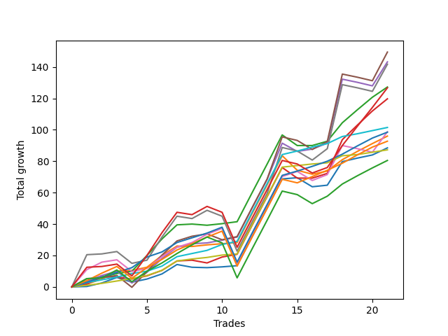

# Short Bernese 003 1v 
- Symbol: ES_SmolBoi
- Date Range: 03/18/2022 - 09/30/2022
- Trading Period: 7:20-12:30
- Number of Trades: 21



| Name | Win Percent | Profit | Avg Profit / Trade | Avg Time / Trade |      | Name | Win Percent | Profit | Avg Profit / Trade | Avg Time / Trade |
| ---- | ----------- | ------ | ------------------ | ---------------- | ---- | ---- | ----------- | ------ | ------------------ | ---------------- |
| Sorted By <br> Profit | | | | | | Sorted By <br> Win Percentage ||||
| Five | 71.43 | 74750.00 | 3559.52 | 29:50 |     | Eighty-Two | 100.00 | 50750.00 | 2416.67 | 10:09 |
| Four | 80.95 | 71625.00 | 3410.71 | 24:09 |     | Eighty-One | 100.00 | 43625.00 | 2077.38 | 04:54 |
| Seven | 61.90 | 70875.00 | 3375.00 | 36:00 |     | Eighty-Three | 95.24 | 49250.00 | 2345.24 | 12:34 |
| Two | 85.71 | 63625.00 | 3029.76 | 14:48 |     | Two | 85.71 | 63625.00 | 3029.76 | 14:48 |
| NEWFI 0000 | 71.43 | 63375.00 | 3017.86 | 31:45 |     | One | 85.71 | 48000.00 | 2285.71 | 09:43 |
| Three | 76.19 | 59875.00 | 2851.19 | 14:58 |     | Eighty-Four | 85.71 | 46375.00 | 2208.33 | 18:04 |
| Eighty-Two | 100.00 | 50750.00 | 2416.67 | 10:09 |     | Four | 80.95 | 71625.00 | 3410.71 | 24:09 |
| Six | 76.19 | 49375.00 | 2351.19 | 24:15 |     | Zero | 80.95 | 44250.00 | 2107.14 | 04:54 |
| Eighty-Three | 95.24 | 49250.00 | 2345.24 | 12:34 |     | Three | 76.19 | 59875.00 | 2851.19 | 14:58 |
| One | 85.71 | 48000.00 | 2285.71 | 09:43 |     | Six | 76.19 | 49375.00 | 2351.19 | 24:15 |
| Eighty-Four | 85.71 | 46375.00 | 2208.33 | 18:04 |     | Eighty-Five | 76.19 | 40250.00 | 1916.67 | 23:01 |
| Zero | 80.95 | 44250.00 | 2107.14 | 04:54 |     | Five | 71.43 | 74750.00 | 3559.52 | 29:50 |
| Eighty-One | 100.00 | 43625.00 | 2077.38 | 04:54 |     | NEWFI 0000 | 71.43 | 63375.00 | 3017.86 | 31:45 |
| Eighty-Five | 76.19 | 40250.00 | 1916.67 | 23:01 |     | Seven | 61.90 | 70875.00 | 3375.00 | 36:00 |

## NO STOPLOSS

### Test Zero
* Sell when price hits the middle line of the 20p bollinger
* No Stoploss
* Results:
```
Total Trades: 21
Percent Up: 19.05
Percent Down: 80.95
Total Points Moved Down: 88.50
Potential Profit: 44250.00
Total Points Ups: 10.75 Count Ups: 4
Total Points Downs: 99.25 Count Downs: 17
```

<details><summary>Trades</summary>

<code>In: 2022-03-25 11:57:00		Out: 2022-03-25 11:57:15		Total Position Time: 00:15		Total Move Down: 0.25		Total to Date: 0.25</code> <br />
<code>In: 2022-04-20 09:55:00		Out: 2022-04-20 09:59:15		Total Position Time: 04:15		Total Move Down: 2.25		Total to Date: 2.50</code> <br />
<code>In: 2022-05-04 09:42:00		Out: 2022-05-04 09:45:30		Total Position Time: 03:30		Total Move Down: 3.50		Total to Date: 6.00</code> <br />
<code>In: 2022-05-24 10:44:00		Out: 2022-05-24 11:01:15		Total Position Time: 17:15		Total Move Down: -3.00		Total to Date: 3.00</code> <br />
<code>In: 2022-06-15 11:02:00		Out: 2022-06-15 11:02:10		Total Position Time: 00:10		Total Move Down: 2.00		Total to Date: 5.00</code> <br />
<code>In: 2022-07-06 11:10:00		Out: 2022-07-06 11:10:10		Total Position Time: 00:10		Total Move Down: 3.25		Total to Date: 8.25</code> <br />
<code>In: 2022-07-06 11:11:00		Out: 2022-07-06 11:11:10		Total Position Time: 00:10		Total Move Down: 6.00		Total to Date: 14.25</code> <br />
<code>In: 2022-08-04 10:31:00		Out: 2022-08-04 10:43:00		Total Position Time: 12:00		Total Move Down: -1.75		Total to Date: 12.50</code> <br />
<code>In: 2022-08-05 10:10:00		Out: 2022-08-05 10:20:05		Total Position Time: 10:05		Total Move Down: -0.25		Total to Date: 12.25</code> <br />
<code>In: 2022-08-17 09:41:00		Out: 2022-08-17 09:50:20		Total Position Time: 09:20		Total Move Down: 0.50		Total to Date: 12.75</code> <br />
<code>In: 2022-08-17 10:33:00		Out: 2022-08-17 10:34:05		Total Position Time: 01:05		Total Move Down: 0.75		Total to Date: 13.50</code> <br />
<code>In: 2022-09-12 10:32:00		Out: 2022-09-12 10:32:10		Total Position Time: 00:10		Total Move Down: 18.50		Total to Date: 32.00</code> <br />
<code>In: 2022-09-12 10:33:00		Out: 2022-09-12 10:33:10		Total Position Time: 00:10		Total Move Down: 18.25		Total to Date: 50.25</code> <br />
<code>In: 2022-09-15 10:29:00		Out: 2022-09-15 10:29:10		Total Position Time: 00:10		Total Move Down: 18.50		Total to Date: 68.75</code> <br />
<code>In: 2022-09-16 11:31:00		Out: 2022-09-16 11:41:05		Total Position Time: 10:05		Total Move Down: 0.75		Total to Date: 69.50</code> <br />
<code>In: 2022-09-16 11:51:00		Out: 2022-09-16 12:11:05		Total Position Time: 20:05		Total Move Down: -5.75		Total to Date: 63.75</code> <br />
<code>In: 2022-09-21 09:38:00		Out: 2022-09-21 09:39:05		Total Position Time: 01:05		Total Move Down: 1.00		Total to Date: 64.75</code> <br />
<code>In: 2022-09-21 11:48:00		Out: 2022-09-21 11:52:05		Total Position Time: 04:05		Total Move Down: 15.00		Total to Date: 79.75</code> <br />
<code>In: 2022-09-22 12:16:00		Out: 2022-09-22 12:18:35		Total Position Time: 02:35		Total Move Down: 2.25		Total to Date: 82.00</code> <br />
<code>In: 2022-09-22 12:17:00		Out: 2022-09-22 12:18:35		Total Position Time: 01:35		Total Move Down: 2.00		Total to Date: 84.00</code> <br />
<code>In: 2022-09-29 08:57:00		Out: 2022-09-29 09:01:50		Total Position Time: 04:50		Total Move Down: 4.50		Total to Date: 88.50</code> <br />


</details>

### Test One
* Sell when the price hits the upper line of the 20p 1std bollinger
* No Stoploss
* Results:
```
Total Trades: 21
Percent Up: 14.29
Percent Down: 85.71
Total Points Moved Down: 96.00
Potential Profit: 48000.00
Total Points Ups: 12.00 Count Ups: 3
Total Points Downs: 108.00 Count Downs: 18
```

<details><summary>Trades</summary>

<code>In: 2022-03-25 11:57:00		Out: 2022-03-25 12:00:45		Total Position Time: 03:45		Total Move Down: 1.75		Total to Date: 1.75</code> <br />
<code>In: 2022-04-20 09:55:00		Out: 2022-04-20 10:08:15		Total Position Time: 13:15		Total Move Down: 3.25		Total to Date: 5.00</code> <br />
<code>In: 2022-05-04 09:42:00		Out: 2022-05-04 09:46:30		Total Position Time: 04:30		Total Move Down: 5.00		Total to Date: 10.00</code> <br />
<code>In: 2022-05-24 10:44:00		Out: 2022-05-24 11:01:40		Total Position Time: 17:40		Total Move Down: 0.50		Total to Date: 10.50</code> <br />
<code>In: 2022-06-15 11:02:00		Out: 2022-06-15 11:02:10		Total Position Time: 00:10		Total Move Down: 2.00		Total to Date: 12.50</code> <br />
<code>In: 2022-07-06 11:10:00		Out: 2022-07-06 11:11:10		Total Position Time: 01:10		Total Move Down: 7.50		Total to Date: 20.00</code> <br />
<code>In: 2022-07-06 11:11:00		Out: 2022-07-06 11:11:10		Total Position Time: 00:10		Total Move Down: 6.00		Total to Date: 26.00</code> <br />
<code>In: 2022-08-04 10:31:00		Out: 2022-08-04 10:43:10		Total Position Time: 12:10		Total Move Down: -0.25		Total to Date: 25.75</code> <br />
<code>In: 2022-08-05 10:10:00		Out: 2022-08-05 10:23:15		Total Position Time: 13:15		Total Move Down: 1.00		Total to Date: 26.75</code> <br />
<code>In: 2022-08-17 09:41:00		Out: 2022-08-17 09:55:10		Total Position Time: 14:10		Total Move Down: 0.75		Total to Date: 27.50</code> <br />
<code>In: 2022-08-17 10:33:00		Out: 2022-08-17 10:46:00		Total Position Time: 13:00		Total Move Down: 0.75		Total to Date: 28.25</code> <br />
<code>In: 2022-09-12 10:32:00		Out: 2022-09-12 10:32:10		Total Position Time: 00:10		Total Move Down: 18.50		Total to Date: 46.75</code> <br />
<code>In: 2022-09-12 10:33:00		Out: 2022-09-12 10:33:10		Total Position Time: 00:10		Total Move Down: 18.25		Total to Date: 65.00</code> <br />
<code>In: 2022-09-15 10:29:00		Out: 2022-09-15 10:29:10		Total Position Time: 00:10		Total Move Down: 18.50		Total to Date: 83.50</code> <br />
<code>In: 2022-09-16 11:31:00		Out: 2022-09-16 12:14:20		Total Position Time: 43:20		Total Move Down: -9.25		Total to Date: 74.25</code> <br />
<code>In: 2022-09-16 11:51:00		Out: 2022-09-16 12:14:20		Total Position Time: 23:20		Total Move Down: -2.50		Total to Date: 71.75</code> <br />
<code>In: 2022-09-21 09:38:00		Out: 2022-09-21 09:45:05		Total Position Time: 07:05		Total Move Down: 2.00		Total to Date: 73.75</code> <br />
<code>In: 2022-09-21 11:48:00		Out: 2022-09-21 12:03:25		Total Position Time: 15:25		Total Move Down: 7.25		Total to Date: 81.00</code> <br />
<code>In: 2022-09-22 12:16:00		Out: 2022-09-22 12:20:15		Total Position Time: 04:15		Total Move Down: 5.25		Total to Date: 86.25</code> <br />
<code>In: 2022-09-22 12:17:00		Out: 2022-09-22 12:20:15		Total Position Time: 03:15		Total Move Down: 5.00		Total to Date: 91.25</code> <br />
<code>In: 2022-09-29 08:57:00		Out: 2022-09-29 09:10:55		Total Position Time: 13:55		Total Move Down: 4.75		Total to Date: 96.00</code> <br />


</details>

### Test Two
* Sell when the price hits the upper line of the 20p 2std bollinger
* No Stoploss
* Results:
```
Total Trades: 21
Percent Up: 14.29
Percent Down: 85.71
Total Points Moved Down: 127.25
Potential Profit: 63625.00
Total Points Ups: 7.50 Count Ups: 3
Total Points Downs: 134.75 Count Downs: 18
```

<details><summary>Trades</summary>

<code>In: 2022-03-25 11:57:00		Out: 2022-03-25 12:00:55		Total Position Time: 03:55		Total Move Down: 2.75		Total to Date: 2.75</code> <br />
<code>In: 2022-04-20 09:55:00		Out: 2022-04-20 10:08:15		Total Position Time: 13:15		Total Move Down: 3.25		Total to Date: 6.00</code> <br />
<code>In: 2022-05-04 09:42:00		Out: 2022-05-04 10:11:15		Total Position Time: 29:15		Total Move Down: 2.50		Total to Date: 8.50</code> <br />
<code>In: 2022-05-24 10:44:00		Out: 2022-05-24 11:01:50		Total Position Time: 17:50		Total Move Down: 1.50		Total to Date: 10.00</code> <br />
<code>In: 2022-06-15 11:02:00		Out: 2022-06-15 11:03:05		Total Position Time: 01:05		Total Move Down: 10.00		Total to Date: 20.00</code> <br />
<code>In: 2022-07-06 11:10:00		Out: 2022-07-06 11:11:45		Total Position Time: 01:45		Total Move Down: 10.50		Total to Date: 30.50</code> <br />
<code>In: 2022-07-06 11:11:00		Out: 2022-07-06 11:11:45		Total Position Time: 00:45		Total Move Down: 9.00		Total to Date: 39.50</code> <br />
<code>In: 2022-08-04 10:31:00		Out: 2022-08-04 10:45:25		Total Position Time: 14:25		Total Move Down: 0.50		Total to Date: 40.00</code> <br />
<code>In: 2022-08-05 10:10:00		Out: 2022-08-05 10:49:30		Total Position Time: 39:30		Total Move Down: -0.75		Total to Date: 39.25</code> <br />
<code>In: 2022-08-17 09:41:00		Out: 2022-08-17 09:58:30		Total Position Time: 17:30		Total Move Down: 1.00		Total to Date: 40.25</code> <br />
<code>In: 2022-08-17 10:33:00		Out: 2022-08-17 10:57:00		Total Position Time: 24:00		Total Move Down: 1.25		Total to Date: 41.50</code> <br />
<code>In: 2022-09-12 10:32:00		Out: 2022-09-12 10:32:10		Total Position Time: 00:10		Total Move Down: 18.50		Total to Date: 60.00</code> <br />
<code>In: 2022-09-12 10:33:00		Out: 2022-09-12 10:33:10		Total Position Time: 00:10		Total Move Down: 18.25		Total to Date: 78.25</code> <br />
<code>In: 2022-09-15 10:29:00		Out: 2022-09-15 10:29:10		Total Position Time: 00:10		Total Move Down: 18.50		Total to Date: 96.75</code> <br />
<code>In: 2022-09-16 11:31:00		Out: 2022-09-16 12:28:05		Total Position Time: 57:05		Total Move Down: -6.75		Total to Date: 90.00</code> <br />
<code>In: 2022-09-16 11:51:00		Out: 2022-09-16 12:28:05		Total Position Time: 37:05		Total Move Down: -0.00		Total to Date: 90.00</code> <br />
<code>In: 2022-09-21 09:38:00		Out: 2022-09-21 09:47:15		Total Position Time: 09:15		Total Move Down: 2.75		Total to Date: 92.75</code> <br />
<code>In: 2022-09-21 11:48:00		Out: 2022-09-21 12:09:10		Total Position Time: 21:10		Total Move Down: 11.75		Total to Date: 104.50</code> <br />
<code>In: 2022-09-22 12:16:00		Out: 2022-09-22 12:20:40		Total Position Time: 04:40		Total Move Down: 8.25		Total to Date: 112.75</code> <br />
<code>In: 2022-09-22 12:17:00		Out: 2022-09-22 12:20:40		Total Position Time: 03:40		Total Move Down: 8.00		Total to Date: 120.75</code> <br />
<code>In: 2022-09-29 08:57:00		Out: 2022-09-29 09:11:20		Total Position Time: 14:20		Total Move Down: 6.50		Total to Date: 127.25</code> <br />


</details>

### Test Three
* Sell when price hits the middle line of the 50p bollinger
* No Stoploss
* Results:
```
Total Trades: 21
Percent Up: 23.81
Percent Down: 76.19
Total Points Moved Down: 119.75
Potential Profit: 59875.00
Total Points Ups: 10.00 Count Ups: 5
Total Points Downs: 129.75 Count Downs: 16
```

<details><summary>Trades</summary>

<code>In: 2022-03-25 11:57:00		Out: 2022-03-25 12:00:45		Total Position Time: 03:45		Total Move Down: 1.75		Total to Date: 1.75</code> <br />
<code>In: 2022-04-20 09:55:00		Out: 2022-04-20 10:08:35		Total Position Time: 13:35		Total Move Down: 4.75		Total to Date: 6.50</code> <br />
<code>In: 2022-05-04 09:42:00		Out: 2022-05-04 10:10:20		Total Position Time: 28:20		Total Move Down: -0.25		Total to Date: 6.25</code> <br />
<code>In: 2022-05-24 10:44:00		Out: 2022-05-24 11:20:25		Total Position Time: 36:25		Total Move Down: -1.25		Total to Date: 5.00</code> <br />
<code>In: 2022-06-15 11:02:00		Out: 2022-06-15 11:02:10		Total Position Time: 00:10		Total Move Down: 2.00		Total to Date: 7.00</code> <br />
<code>In: 2022-07-06 11:10:00		Out: 2022-07-06 11:10:20		Total Position Time: 00:20		Total Move Down: 3.50		Total to Date: 10.50</code> <br />
<code>In: 2022-07-06 11:11:00		Out: 2022-07-06 11:11:10		Total Position Time: 00:10		Total Move Down: 6.00		Total to Date: 16.50</code> <br />
<code>In: 2022-08-04 10:31:00		Out: 2022-08-04 10:55:50		Total Position Time: 24:50		Total Move Down: 0.50		Total to Date: 17.00</code> <br />
<code>In: 2022-08-05 10:10:00		Out: 2022-08-05 10:47:35		Total Position Time: 37:35		Total Move Down: -1.75		Total to Date: 15.25</code> <br />
<code>In: 2022-08-17 09:41:00		Out: 2022-08-17 10:02:15		Total Position Time: 21:15		Total Move Down: 3.75		Total to Date: 19.00</code> <br />
<code>In: 2022-08-17 10:33:00		Out: 2022-08-17 10:34:10		Total Position Time: 01:10		Total Move Down: 1.75		Total to Date: 20.75</code> <br />
<code>In: 2022-09-12 10:32:00		Out: 2022-09-12 10:32:10		Total Position Time: 00:10		Total Move Down: 18.50		Total to Date: 39.25</code> <br />
<code>In: 2022-09-12 10:33:00		Out: 2022-09-12 10:33:10		Total Position Time: 00:10		Total Move Down: 18.25		Total to Date: 57.50</code> <br />
<code>In: 2022-09-15 10:29:00		Out: 2022-09-15 10:29:10		Total Position Time: 00:10		Total Move Down: 18.50		Total to Date: 76.00</code> <br />
<code>In: 2022-09-16 11:31:00		Out: 2022-09-16 12:19:05		Total Position Time: 48:05		Total Move Down: -6.75		Total to Date: 69.25</code> <br />
<code>In: 2022-09-16 11:51:00		Out: 2022-09-16 12:19:05		Total Position Time: 28:05		Total Move Down: -0.00		Total to Date: 69.25</code> <br />
<code>In: 2022-09-21 09:38:00		Out: 2022-09-21 09:45:30		Total Position Time: 07:30		Total Move Down: 3.00		Total to Date: 72.25</code> <br />
<code>In: 2022-09-21 11:48:00		Out: 2022-09-21 12:10:10		Total Position Time: 22:10		Total Move Down: 21.50		Total to Date: 93.75</code> <br />
<code>In: 2022-09-22 12:16:00		Out: 2022-09-22 12:27:05		Total Position Time: 11:05		Total Move Down: 9.25		Total to Date: 103.00</code> <br />
<code>In: 2022-09-22 12:17:00		Out: 2022-09-22 12:27:05		Total Position Time: 10:05		Total Move Down: 9.00		Total to Date: 112.00</code> <br />
<code>In: 2022-09-29 08:57:00		Out: 2022-09-29 09:16:15		Total Position Time: 19:15		Total Move Down: 7.75		Total to Date: 119.75</code> <br />


</details>

### Test Four
* Sell when the price hits the upper line of the 50p 1std bollinger
* No Stoploss
* Results:
```
Total Trades: 21
Percent Up: 19.05
Percent Down: 80.95
Total Points Moved Down: 143.25
Potential Profit: 71625.00
Total Points Ups: 17.00 Count Ups: 4
Total Points Downs: 160.25 Count Downs: 17
```

<details><summary>Trades</summary>

<code>In: 2022-03-25 11:57:00		Out: 2022-03-25 12:01:35		Total Position Time: 04:35		Total Move Down: 3.75		Total to Date: 3.75</code> <br />
<code>In: 2022-04-20 09:55:00		Out: 2022-04-20 10:26:35		Total Position Time: 31:35		Total Move Down: 3.50		Total to Date: 7.25</code> <br />
<code>In: 2022-05-04 09:42:00		Out: 2022-05-04 10:30:25		Total Position Time: 48:25		Total Move Down: 2.75		Total to Date: 10.00</code> <br />
<code>In: 2022-05-24 10:44:00		Out: 2022-05-24 11:43:55		Total Position Time: 59:55		Total Move Down: -7.50		Total to Date: 2.50</code> <br />
<code>In: 2022-06-15 11:02:00		Out: 2022-06-15 11:03:00		Total Position Time: 01:00		Total Move Down: 6.75		Total to Date: 9.25</code> <br />
<code>In: 2022-07-06 11:10:00		Out: 2022-07-06 11:11:35		Total Position Time: 01:35		Total Move Down: 8.75		Total to Date: 18.00</code> <br />
<code>In: 2022-07-06 11:11:00		Out: 2022-07-06 11:11:35		Total Position Time: 00:35		Total Move Down: 7.25		Total to Date: 25.25</code> <br />
<code>In: 2022-08-04 10:31:00		Out: 2022-08-04 11:02:05		Total Position Time: 31:05		Total Move Down: 2.25		Total to Date: 27.50</code> <br />
<code>In: 2022-08-05 10:10:00		Out: 2022-08-05 10:50:45		Total Position Time: 40:45		Total Move Down: 0.50		Total to Date: 28.00</code> <br />
<code>In: 2022-08-17 09:41:00		Out: 2022-08-17 10:19:40		Total Position Time: 38:40		Total Move Down: 1.75		Total to Date: 29.75</code> <br />
<code>In: 2022-08-17 10:33:00		Out: 2022-08-17 11:00:50		Total Position Time: 27:50		Total Move Down: 2.00		Total to Date: 31.75</code> <br />
<code>In: 2022-09-12 10:32:00		Out: 2022-09-12 10:32:10		Total Position Time: 00:10		Total Move Down: 18.50		Total to Date: 50.25</code> <br />
<code>In: 2022-09-12 10:33:00		Out: 2022-09-12 10:33:10		Total Position Time: 00:10		Total Move Down: 18.25		Total to Date: 68.50</code> <br />
<code>In: 2022-09-15 10:29:00		Out: 2022-09-15 10:32:10		Total Position Time: 03:10		Total Move Down: 23.00		Total to Date: 91.50</code> <br />
<code>In: 2022-09-16 11:31:00		Out: 2022-09-16 12:30:20		Total Position Time: 59:20		Total Move Down: -5.25		Total to Date: 86.25</code> <br />
<code>In: 2022-09-16 11:51:00		Out: 2022-09-16 12:30:20		Total Position Time: 39:20		Total Move Down: 1.50		Total to Date: 87.75</code> <br />
<code>In: 2022-09-21 09:38:00		Out: 2022-09-21 09:53:00		Total Position Time: 15:00		Total Move Down: 3.75		Total to Date: 91.50</code> <br />
<code>In: 2022-09-21 11:48:00		Out: 2022-09-21 12:11:05		Total Position Time: 23:05		Total Move Down: 40.75		Total to Date: 132.25</code> <br />
<code>In: 2022-09-22 12:16:00		Out: 2022-09-22 12:46:00		Total Position Time: 30:00		Total Move Down: -2.00		Total to Date: 130.25</code> <br />
<code>In: 2022-09-22 12:17:00		Out: 2022-09-22 12:46:00		Total Position Time: 29:00		Total Move Down: -2.25		Total to Date: 128.00</code> <br />
<code>In: 2022-09-29 08:57:00		Out: 2022-09-29 09:19:05		Total Position Time: 22:05		Total Move Down: 15.25		Total to Date: 143.25</code> <br />


</details>

### Test Five
* Sell when the price hits the upper line of the 50p 2std bollinger
* No Stoploss
* Results:
```
Total Trades: 21
Percent Up: 28.57
Percent Down: 71.43
Total Points Moved Down: 149.50
Potential Profit: 74750.00
Total Points Ups: 23.50 Count Ups: 6
Total Points Downs: 173.00 Count Downs: 15
```

<details><summary>Trades</summary>

<code>In: 2022-03-25 11:57:00		Out: 2022-03-25 12:01:55		Total Position Time: 04:55		Total Move Down: 5.25		Total to Date: 5.25</code> <br />
<code>In: 2022-04-20 09:55:00		Out: 2022-04-20 10:54:55		Total Position Time: 59:55		Total Move Down: 0.50		Total to Date: 5.75</code> <br />
<code>In: 2022-05-04 09:42:00		Out: 2022-05-04 10:41:55		Total Position Time: 59:55		Total Move Down: 1.50		Total to Date: 7.25</code> <br />
<code>In: 2022-05-24 10:44:00		Out: 2022-05-24 11:43:55		Total Position Time: 59:55		Total Move Down: -7.50		Total to Date: -0.25</code> <br />
<code>In: 2022-06-15 11:02:00		Out: 2022-06-15 11:03:05		Total Position Time: 01:05		Total Move Down: 10.00		Total to Date: 9.75</code> <br />
<code>In: 2022-07-06 11:10:00		Out: 2022-07-06 11:11:50		Total Position Time: 01:50		Total Move Down: 10.50		Total to Date: 20.25</code> <br />
<code>In: 2022-07-06 11:11:00		Out: 2022-07-06 11:11:50		Total Position Time: 00:50		Total Move Down: 9.00		Total to Date: 29.25</code> <br />
<code>In: 2022-08-04 10:31:00		Out: 2022-08-04 11:10:15		Total Position Time: 39:15		Total Move Down: 3.00		Total to Date: 32.25</code> <br />
<code>In: 2022-08-05 10:10:00		Out: 2022-08-05 10:55:40		Total Position Time: 45:40		Total Move Down: 1.50		Total to Date: 33.75</code> <br />
<code>In: 2022-08-17 09:41:00		Out: 2022-08-17 10:40:55		Total Position Time: 59:55		Total Move Down: -3.75		Total to Date: 30.00</code> <br />
<code>In: 2022-08-17 10:33:00		Out: 2022-08-17 11:01:00		Total Position Time: 28:00		Total Move Down: 2.00		Total to Date: 32.00</code> <br />
<code>In: 2022-09-12 10:32:00		Out: 2022-09-12 10:32:10		Total Position Time: 00:10		Total Move Down: 18.50		Total to Date: 50.50</code> <br />
<code>In: 2022-09-12 10:33:00		Out: 2022-09-12 10:33:10		Total Position Time: 00:10		Total Move Down: 18.25		Total to Date: 68.75</code> <br />
<code>In: 2022-09-15 10:29:00		Out: 2022-09-15 10:39:05		Total Position Time: 10:05		Total Move Down: 26.75		Total to Date: 95.50</code> <br />
<code>In: 2022-09-16 11:31:00		Out: 2022-09-16 12:30:55		Total Position Time: 59:55		Total Move Down: -2.25		Total to Date: 93.25</code> <br />
<code>In: 2022-09-16 11:51:00		Out: 2022-09-16 12:46:00		Total Position Time: 55:00		Total Move Down: -5.75		Total to Date: 87.50</code> <br />
<code>In: 2022-09-21 09:38:00		Out: 2022-09-21 09:55:05		Total Position Time: 17:05		Total Move Down: 5.00		Total to Date: 92.50</code> <br />
<code>In: 2022-09-21 11:48:00		Out: 2022-09-21 12:26:25		Total Position Time: 38:25		Total Move Down: 43.00		Total to Date: 135.50</code> <br />
<code>In: 2022-09-22 12:16:00		Out: 2022-09-22 12:46:00		Total Position Time: 30:00		Total Move Down: -2.00		Total to Date: 133.50</code> <br />
<code>In: 2022-09-22 12:17:00		Out: 2022-09-22 12:46:00		Total Position Time: 29:00		Total Move Down: -2.25		Total to Date: 131.25</code> <br />
<code>In: 2022-09-29 08:57:00		Out: 2022-09-29 09:22:45		Total Position Time: 25:45		Total Move Down: 18.25		Total to Date: 149.50</code> <br />


</details>

### Test Six
* Sell when the price hits the middle line of the 1std VWAP
* No Stoploss
* Results:
```
Total Trades: 21
Percent Up: 23.81
Percent Down: 76.19
Total Points Moved Down: 98.75
Potential Profit: 49375.00
Total Points Ups: 39.75 Count Ups: 5
Total Points Downs: 138.50 Count Downs: 16
```

<details><summary>Trades</summary>

<code>In: 2022-03-25 11:57:00		Out: 2022-03-25 12:07:35		Total Position Time: 10:35		Total Move Down: 11.00		Total to Date: 11.00</code> <br />
<code>In: 2022-04-20 09:55:00		Out: 2022-04-20 10:08:35		Total Position Time: 13:35		Total Move Down: 4.75		Total to Date: 15.75</code> <br />
<code>In: 2022-05-04 09:42:00		Out: 2022-05-04 10:41:55		Total Position Time: 59:55		Total Move Down: 1.50		Total to Date: 17.25</code> <br />
<code>In: 2022-05-24 10:44:00		Out: 2022-05-24 11:43:55		Total Position Time: 59:55		Total Move Down: -7.50		Total to Date: 9.75</code> <br />
<code>In: 2022-06-15 11:02:00		Out: 2022-06-15 11:02:10		Total Position Time: 00:10		Total Move Down: 2.00		Total to Date: 11.75</code> <br />
<code>In: 2022-07-06 11:10:00		Out: 2022-07-06 11:11:10		Total Position Time: 01:10		Total Move Down: 7.50		Total to Date: 19.25</code> <br />
<code>In: 2022-07-06 11:11:00		Out: 2022-07-06 11:11:10		Total Position Time: 00:10		Total Move Down: 6.00		Total to Date: 25.25</code> <br />
<code>In: 2022-08-04 10:31:00		Out: 2022-08-04 11:10:15		Total Position Time: 39:15		Total Move Down: 3.00		Total to Date: 28.25</code> <br />
<code>In: 2022-08-05 10:10:00		Out: 2022-08-05 11:09:55		Total Position Time: 59:55		Total Move Down: 5.25		Total to Date: 33.50</code> <br />
<code>In: 2022-08-17 09:41:00		Out: 2022-08-17 10:02:15		Total Position Time: 21:15		Total Move Down: 3.75		Total to Date: 37.25</code> <br />
<code>In: 2022-08-17 10:33:00		Out: 2022-08-17 11:32:55		Total Position Time: 59:55		Total Move Down: -22.25		Total to Date: 15.00</code> <br />
<code>In: 2022-09-12 10:32:00		Out: 2022-09-12 10:32:10		Total Position Time: 00:10		Total Move Down: 18.50		Total to Date: 33.50</code> <br />
<code>In: 2022-09-12 10:33:00		Out: 2022-09-12 10:33:10		Total Position Time: 00:10		Total Move Down: 18.25		Total to Date: 51.75</code> <br />
<code>In: 2022-09-15 10:29:00		Out: 2022-09-15 10:29:10		Total Position Time: 00:10		Total Move Down: 18.50		Total to Date: 70.25</code> <br />
<code>In: 2022-09-16 11:31:00		Out: 2022-09-16 11:41:40		Total Position Time: 10:40		Total Move Down: 3.25		Total to Date: 73.50</code> <br />
<code>In: 2022-09-16 11:51:00		Out: 2022-09-16 12:46:00		Total Position Time: 55:00		Total Move Down: -5.75		Total to Date: 67.75</code> <br />
<code>In: 2022-09-21 09:38:00		Out: 2022-09-21 09:53:00		Total Position Time: 15:00		Total Move Down: 3.75		Total to Date: 71.50</code> <br />
<code>In: 2022-09-21 11:48:00		Out: 2022-09-21 12:10:05		Total Position Time: 22:05		Total Move Down: 18.50		Total to Date: 90.00</code> <br />
<code>In: 2022-09-22 12:16:00		Out: 2022-09-22 12:46:00		Total Position Time: 30:00		Total Move Down: -2.00		Total to Date: 88.00</code> <br />
<code>In: 2022-09-22 12:17:00		Out: 2022-09-22 12:46:00		Total Position Time: 29:00		Total Move Down: -2.25		Total to Date: 85.75</code> <br />
<code>In: 2022-09-29 08:57:00		Out: 2022-09-29 09:18:20		Total Position Time: 21:20		Total Move Down: 13.00		Total to Date: 98.75</code> <br />


</details>

### Test Seven
* Sell when the price hits the upper line of the 1std VWAP
* No Stoploss
* Results:
```
Total Trades: 21
Percent Up: 38.10
Percent Down: 61.90
Total Points Moved Down: 141.75
Potential Profit: 70875.00
Total Points Ups: 47.25 Count Ups: 8
Total Points Downs: 189.00 Count Downs: 13
```

<details><summary>Trades</summary>

<code>In: 2022-03-25 11:57:00		Out: 2022-03-25 12:33:10		Total Position Time: 36:10		Total Move Down: 20.50		Total to Date: 20.50</code> <br />
<code>In: 2022-04-20 09:55:00		Out: 2022-04-20 10:54:55		Total Position Time: 59:55		Total Move Down: 0.50		Total to Date: 21.00</code> <br />
<code>In: 2022-05-04 09:42:00		Out: 2022-05-04 10:41:55		Total Position Time: 59:55		Total Move Down: 1.50		Total to Date: 22.50</code> <br />
<code>In: 2022-05-24 10:44:00		Out: 2022-05-24 11:43:55		Total Position Time: 59:55		Total Move Down: -7.50		Total to Date: 15.00</code> <br />
<code>In: 2022-06-15 11:02:00		Out: 2022-06-15 11:02:10		Total Position Time: 00:10		Total Move Down: 2.00		Total to Date: 17.00</code> <br />
<code>In: 2022-07-06 11:10:00		Out: 2022-07-06 11:12:20		Total Position Time: 02:20		Total Move Down: 14.75		Total to Date: 31.75</code> <br />
<code>In: 2022-07-06 11:11:00		Out: 2022-07-06 11:12:20		Total Position Time: 01:20		Total Move Down: 13.25		Total to Date: 45.00</code> <br />
<code>In: 2022-08-04 10:31:00		Out: 2022-08-04 11:30:55		Total Position Time: 59:55		Total Move Down: -1.50		Total to Date: 43.50</code> <br />
<code>In: 2022-08-05 10:10:00		Out: 2022-08-05 11:09:55		Total Position Time: 59:55		Total Move Down: 5.25		Total to Date: 48.75</code> <br />
<code>In: 2022-08-17 09:41:00		Out: 2022-08-17 10:40:55		Total Position Time: 59:55		Total Move Down: -3.75		Total to Date: 45.00</code> <br />
<code>In: 2022-08-17 10:33:00		Out: 2022-08-17 11:32:55		Total Position Time: 59:55		Total Move Down: -22.25		Total to Date: 22.75</code> <br />
<code>In: 2022-09-12 10:32:00		Out: 2022-09-12 10:32:10		Total Position Time: 00:10		Total Move Down: 18.50		Total to Date: 41.25</code> <br />
<code>In: 2022-09-12 10:33:00		Out: 2022-09-12 10:33:10		Total Position Time: 00:10		Total Move Down: 18.25		Total to Date: 59.50</code> <br />
<code>In: 2022-09-15 10:29:00		Out: 2022-09-15 10:46:20		Total Position Time: 17:20		Total Move Down: 29.25		Total to Date: 88.75</code> <br />
<code>In: 2022-09-16 11:31:00		Out: 2022-09-16 12:30:55		Total Position Time: 59:55		Total Move Down: -2.25		Total to Date: 86.50</code> <br />
<code>In: 2022-09-16 11:51:00		Out: 2022-09-16 12:46:00		Total Position Time: 55:00		Total Move Down: -5.75		Total to Date: 80.75</code> <br />
<code>In: 2022-09-21 09:38:00		Out: 2022-09-21 10:00:05		Total Position Time: 22:05		Total Move Down: 7.25		Total to Date: 88.00</code> <br />
<code>In: 2022-09-21 11:48:00		Out: 2022-09-21 12:11:05		Total Position Time: 23:05		Total Move Down: 40.75		Total to Date: 128.75</code> <br />
<code>In: 2022-09-22 12:16:00		Out: 2022-09-22 12:46:00		Total Position Time: 30:00		Total Move Down: -2.00		Total to Date: 126.75</code> <br />
<code>In: 2022-09-22 12:17:00		Out: 2022-09-22 12:46:00		Total Position Time: 29:00		Total Move Down: -2.25		Total to Date: 124.50</code> <br />
<code>In: 2022-09-29 08:57:00		Out: 2022-09-29 09:56:55		Total Position Time: 59:55		Total Move Down: 17.25		Total to Date: 141.75</code> <br />


</details>

## TAKE PROFIT

### Test Eighty-One
* Take Profit of 1 Point
* No Stoploss
* Results:
```
Total Trades: 21
Percent Up: 0.00
Percent Down: 100.00
Total Points Moved Down: 87.25
Potential Profit: 43625.00
Total Points Ups: 0.00 Count Ups: 0
Total Points Downs: 87.25 Count Downs: 21
```

<details><summary>Trades</summary>

<code>In: 2022-03-25 11:57:00		Out: 2022-03-25 11:58:45		Total Position Time: 01:45		Total Move Down: 1.00		Total to Date: 1.00</code> <br />
<code>In: 2022-04-20 09:55:00		Out: 2022-04-20 09:57:25		Total Position Time: 02:25		Total Move Down: 1.25		Total to Date: 2.25</code> <br />
<code>In: 2022-05-04 09:42:00		Out: 2022-05-04 09:42:10		Total Position Time: 00:10		Total Move Down: 1.50		Total to Date: 3.75</code> <br />
<code>In: 2022-05-24 10:44:00		Out: 2022-05-24 10:47:50		Total Position Time: 03:50		Total Move Down: 1.50		Total to Date: 5.25</code> <br />
<code>In: 2022-06-15 11:02:00		Out: 2022-06-15 11:02:10		Total Position Time: 00:10		Total Move Down: 2.00		Total to Date: 7.25</code> <br />
<code>In: 2022-07-06 11:10:00		Out: 2022-07-06 11:10:10		Total Position Time: 00:10		Total Move Down: 3.25		Total to Date: 10.50</code> <br />
<code>In: 2022-07-06 11:11:00		Out: 2022-07-06 11:11:10		Total Position Time: 00:10		Total Move Down: 6.00		Total to Date: 16.50</code> <br />
<code>In: 2022-08-04 10:31:00		Out: 2022-08-04 10:56:25		Total Position Time: 25:25		Total Move Down: 1.25		Total to Date: 17.75</code> <br />
<code>In: 2022-08-05 10:10:00		Out: 2022-08-05 10:21:25		Total Position Time: 11:25		Total Move Down: 1.00		Total to Date: 18.75</code> <br />
<code>In: 2022-08-17 09:41:00		Out: 2022-08-17 09:50:55		Total Position Time: 09:55		Total Move Down: 1.50		Total to Date: 20.25</code> <br />
<code>In: 2022-08-17 10:33:00		Out: 2022-08-17 10:34:05		Total Position Time: 01:05		Total Move Down: 0.75		Total to Date: 21.00</code> <br />
<code>In: 2022-09-12 10:32:00		Out: 2022-09-12 10:32:10		Total Position Time: 00:10		Total Move Down: 18.50		Total to Date: 39.50</code> <br />
<code>In: 2022-09-12 10:33:00		Out: 2022-09-12 10:33:10		Total Position Time: 00:10		Total Move Down: 18.25		Total to Date: 57.75</code> <br />
<code>In: 2022-09-15 10:29:00		Out: 2022-09-15 10:29:10		Total Position Time: 00:10		Total Move Down: 18.50		Total to Date: 76.25</code> <br />
<code>In: 2022-09-16 11:31:00		Out: 2022-09-16 11:31:30		Total Position Time: 00:30		Total Move Down: 1.00		Total to Date: 77.25</code> <br />
<code>In: 2022-09-16 11:51:00		Out: 2022-09-16 12:30:10		Total Position Time: 39:10		Total Move Down: 1.00		Total to Date: 78.25</code> <br />
<code>In: 2022-09-21 09:38:00		Out: 2022-09-21 09:38:40		Total Position Time: 00:40		Total Move Down: 0.75		Total to Date: 79.00</code> <br />
<code>In: 2022-09-21 11:48:00		Out: 2022-09-21 11:48:25		Total Position Time: 00:25		Total Move Down: 4.50		Total to Date: 83.50</code> <br />
<code>In: 2022-09-22 12:16:00		Out: 2022-09-22 12:18:10		Total Position Time: 02:10		Total Move Down: 0.75		Total to Date: 84.25</code> <br />
<code>In: 2022-09-22 12:17:00		Out: 2022-09-22 12:18:25		Total Position Time: 01:25		Total Move Down: 1.50		Total to Date: 85.75</code> <br />
<code>In: 2022-09-29 08:57:00		Out: 2022-09-29 08:58:40		Total Position Time: 01:40		Total Move Down: 1.50		Total to Date: 87.25</code> <br />


</details>

### Test Eighty-Two
* Take Profit of 2 Point
* No Stoploss
* Results:
```
Total Trades: 21
Percent Up: 0.00
Percent Down: 100.00
Total Points Moved Down: 101.50
Potential Profit: 50750.00
Total Points Ups: 0.00 Count Ups: 0
Total Points Downs: 101.50 Count Downs: 21
```

<details><summary>Trades</summary>

<code>In: 2022-03-25 11:57:00		Out: 2022-03-25 12:00:50		Total Position Time: 03:50		Total Move Down: 2.75		Total to Date: 2.75</code> <br />
<code>In: 2022-04-20 09:55:00		Out: 2022-04-20 09:59:05		Total Position Time: 04:05		Total Move Down: 1.75		Total to Date: 4.50</code> <br />
<code>In: 2022-05-04 09:42:00		Out: 2022-05-04 09:42:20		Total Position Time: 00:20		Total Move Down: 1.75		Total to Date: 6.25</code> <br />
<code>In: 2022-05-24 10:44:00		Out: 2022-05-24 11:04:55		Total Position Time: 20:55		Total Move Down: 2.25		Total to Date: 8.50</code> <br />
<code>In: 2022-06-15 11:02:00		Out: 2022-06-15 11:02:45		Total Position Time: 00:45		Total Move Down: 1.50		Total to Date: 10.00</code> <br />
<code>In: 2022-07-06 11:10:00		Out: 2022-07-06 11:10:10		Total Position Time: 00:10		Total Move Down: 3.25		Total to Date: 13.25</code> <br />
<code>In: 2022-07-06 11:11:00		Out: 2022-07-06 11:11:10		Total Position Time: 00:10		Total Move Down: 6.00		Total to Date: 19.25</code> <br />
<code>In: 2022-08-04 10:31:00		Out: 2022-08-04 10:56:30		Total Position Time: 25:30		Total Move Down: 2.00		Total to Date: 21.25</code> <br />
<code>In: 2022-08-05 10:10:00		Out: 2022-08-05 10:55:55		Total Position Time: 45:55		Total Move Down: 2.00		Total to Date: 23.25</code> <br />
<code>In: 2022-08-17 09:41:00		Out: 2022-08-17 10:02:15		Total Position Time: 21:15		Total Move Down: 3.75		Total to Date: 27.00</code> <br />
<code>In: 2022-08-17 10:33:00		Out: 2022-08-17 11:00:50		Total Position Time: 27:50		Total Move Down: 2.00		Total to Date: 29.00</code> <br />
<code>In: 2022-09-12 10:32:00		Out: 2022-09-12 10:32:10		Total Position Time: 00:10		Total Move Down: 18.50		Total to Date: 47.50</code> <br />
<code>In: 2022-09-12 10:33:00		Out: 2022-09-12 10:33:10		Total Position Time: 00:10		Total Move Down: 18.25		Total to Date: 65.75</code> <br />
<code>In: 2022-09-15 10:29:00		Out: 2022-09-15 10:29:10		Total Position Time: 00:10		Total Move Down: 18.50		Total to Date: 84.25</code> <br />
<code>In: 2022-09-16 11:31:00		Out: 2022-09-16 11:41:15		Total Position Time: 10:15		Total Move Down: 2.25		Total to Date: 86.50</code> <br />
<code>In: 2022-09-16 11:51:00		Out: 2022-09-16 12:30:25		Total Position Time: 39:25		Total Move Down: 2.50		Total to Date: 89.00</code> <br />
<code>In: 2022-09-21 09:38:00		Out: 2022-09-21 09:43:40		Total Position Time: 05:40		Total Move Down: 2.25		Total to Date: 91.25</code> <br />
<code>In: 2022-09-21 11:48:00		Out: 2022-09-21 11:48:25		Total Position Time: 00:25		Total Move Down: 4.50		Total to Date: 95.75</code> <br />
<code>In: 2022-09-22 12:16:00		Out: 2022-09-22 12:18:25		Total Position Time: 02:25		Total Move Down: 1.75		Total to Date: 97.50</code> <br />
<code>In: 2022-09-22 12:17:00		Out: 2022-09-22 12:18:40		Total Position Time: 01:40		Total Move Down: 2.00		Total to Date: 99.50</code> <br />
<code>In: 2022-09-29 08:57:00		Out: 2022-09-29 08:59:15		Total Position Time: 02:15		Total Move Down: 2.00		Total to Date: 101.50</code> <br />


</details>

### Test Eighty-Three
* Take Profit of 3 Point
* No Stoploss
* Results:
```
Total Trades: 21
Percent Up: 4.76
Percent Down: 95.24
Total Points Moved Down: 98.50
Potential Profit: 49250.00
Total Points Ups: 22.25 Count Ups: 1
Total Points Downs: 120.75 Count Downs: 20
```

<details><summary>Trades</summary>

<code>In: 2022-03-25 11:57:00		Out: 2022-03-25 12:01:00		Total Position Time: 04:00		Total Move Down: 3.00		Total to Date: 3.00</code> <br />
<code>In: 2022-04-20 09:55:00		Out: 2022-04-20 10:08:15		Total Position Time: 13:15		Total Move Down: 3.25		Total to Date: 6.25</code> <br />
<code>In: 2022-05-04 09:42:00		Out: 2022-05-04 09:42:35		Total Position Time: 00:35		Total Move Down: 3.00		Total to Date: 9.25</code> <br />
<code>In: 2022-05-24 10:44:00		Out: 2022-05-24 11:05:00		Total Position Time: 21:00		Total Move Down: 3.00		Total to Date: 12.25</code> <br />
<code>In: 2022-06-15 11:02:00		Out: 2022-06-15 11:03:00		Total Position Time: 01:00		Total Move Down: 6.75		Total to Date: 19.00</code> <br />
<code>In: 2022-07-06 11:10:00		Out: 2022-07-06 11:10:10		Total Position Time: 00:10		Total Move Down: 3.25		Total to Date: 22.25</code> <br />
<code>In: 2022-07-06 11:11:00		Out: 2022-07-06 11:11:10		Total Position Time: 00:10		Total Move Down: 6.00		Total to Date: 28.25</code> <br />
<code>In: 2022-08-04 10:31:00		Out: 2022-08-04 10:57:00		Total Position Time: 26:00		Total Move Down: 3.00		Total to Date: 31.25</code> <br />
<code>In: 2022-08-05 10:10:00		Out: 2022-08-05 10:56:10		Total Position Time: 46:10		Total Move Down: 3.00		Total to Date: 34.25</code> <br />
<code>In: 2022-08-17 09:41:00		Out: 2022-08-17 10:02:15		Total Position Time: 21:15		Total Move Down: 3.75		Total to Date: 38.00</code> <br />
<code>In: 2022-08-17 10:33:00		Out: 2022-08-17 11:32:55		Total Position Time: 59:55		Total Move Down: -22.25		Total to Date: 15.75</code> <br />
<code>In: 2022-09-12 10:32:00		Out: 2022-09-12 10:32:10		Total Position Time: 00:10		Total Move Down: 18.50		Total to Date: 34.25</code> <br />
<code>In: 2022-09-12 10:33:00		Out: 2022-09-12 10:33:10		Total Position Time: 00:10		Total Move Down: 18.25		Total to Date: 52.50</code> <br />
<code>In: 2022-09-15 10:29:00		Out: 2022-09-15 10:29:10		Total Position Time: 00:10		Total Move Down: 18.50		Total to Date: 71.00</code> <br />
<code>In: 2022-09-16 11:31:00		Out: 2022-09-16 11:41:20		Total Position Time: 10:20		Total Move Down: 2.75		Total to Date: 73.75</code> <br />
<code>In: 2022-09-16 11:51:00		Out: 2022-09-16 12:30:45		Total Position Time: 39:45		Total Move Down: 3.00		Total to Date: 76.75</code> <br />
<code>In: 2022-09-21 09:38:00		Out: 2022-09-21 09:47:20		Total Position Time: 09:20		Total Move Down: 3.25		Total to Date: 80.00</code> <br />
<code>In: 2022-09-21 11:48:00		Out: 2022-09-21 11:48:25		Total Position Time: 00:25		Total Move Down: 4.50		Total to Date: 84.50</code> <br />
<code>In: 2022-09-22 12:16:00		Out: 2022-09-22 12:20:15		Total Position Time: 04:15		Total Move Down: 5.25		Total to Date: 89.75</code> <br />
<code>In: 2022-09-22 12:17:00		Out: 2022-09-22 12:20:15		Total Position Time: 03:15		Total Move Down: 5.00		Total to Date: 94.75</code> <br />
<code>In: 2022-09-29 08:57:00		Out: 2022-09-29 08:59:35		Total Position Time: 02:35		Total Move Down: 3.75		Total to Date: 98.50</code> <br />


</details>

### Test Eighty-Four
* Take Profit of 4 Point
* No Stoploss
* Results:
```
Total Trades: 21
Percent Up: 14.29
Percent Down: 85.71
Total Points Moved Down: 92.75
Potential Profit: 46375.00
Total Points Ups: 32.00 Count Ups: 3
Total Points Downs: 124.75 Count Downs: 18
```

<details><summary>Trades</summary>

<code>In: 2022-03-25 11:57:00		Out: 2022-03-25 12:01:45		Total Position Time: 04:45		Total Move Down: 4.00		Total to Date: 4.00</code> <br />
<code>In: 2022-04-20 09:55:00		Out: 2022-04-20 10:08:35		Total Position Time: 13:35		Total Move Down: 4.75		Total to Date: 8.75</code> <br />
<code>In: 2022-05-04 09:42:00		Out: 2022-05-04 09:46:15		Total Position Time: 04:15		Total Move Down: 4.25		Total to Date: 13.00</code> <br />
<code>In: 2022-05-24 10:44:00		Out: 2022-05-24 11:43:55		Total Position Time: 59:55		Total Move Down: -7.50		Total to Date: 5.50</code> <br />
<code>In: 2022-06-15 11:02:00		Out: 2022-06-15 11:03:00		Total Position Time: 01:00		Total Move Down: 6.75		Total to Date: 12.25</code> <br />
<code>In: 2022-07-06 11:10:00		Out: 2022-07-06 11:11:05		Total Position Time: 01:05		Total Move Down: 5.25		Total to Date: 17.50</code> <br />
<code>In: 2022-07-06 11:11:00		Out: 2022-07-06 11:11:10		Total Position Time: 00:10		Total Move Down: 6.00		Total to Date: 23.50</code> <br />
<code>In: 2022-08-04 10:31:00		Out: 2022-08-04 11:11:05		Total Position Time: 40:05		Total Move Down: 4.00		Total to Date: 27.50</code> <br />
<code>In: 2022-08-05 10:10:00		Out: 2022-08-05 10:56:30		Total Position Time: 46:30		Total Move Down: 4.25		Total to Date: 31.75</code> <br />
<code>In: 2022-08-17 09:41:00		Out: 2022-08-17 10:02:40		Total Position Time: 21:40		Total Move Down: 3.75		Total to Date: 35.50</code> <br />
<code>In: 2022-08-17 10:33:00		Out: 2022-08-17 11:32:55		Total Position Time: 59:55		Total Move Down: -22.25		Total to Date: 13.25</code> <br />
<code>In: 2022-09-12 10:32:00		Out: 2022-09-12 10:32:10		Total Position Time: 00:10		Total Move Down: 18.50		Total to Date: 31.75</code> <br />
<code>In: 2022-09-12 10:33:00		Out: 2022-09-12 10:33:10		Total Position Time: 00:10		Total Move Down: 18.25		Total to Date: 50.00</code> <br />
<code>In: 2022-09-15 10:29:00		Out: 2022-09-15 10:29:10		Total Position Time: 00:10		Total Move Down: 18.50		Total to Date: 68.50</code> <br />
<code>In: 2022-09-16 11:31:00		Out: 2022-09-16 12:30:55		Total Position Time: 59:55		Total Move Down: -2.25		Total to Date: 66.25</code> <br />
<code>In: 2022-09-16 11:51:00		Out: 2022-09-16 12:30:50		Total Position Time: 39:50		Total Move Down: 4.00		Total to Date: 70.25</code> <br />
<code>In: 2022-09-21 09:38:00		Out: 2022-09-21 09:53:05		Total Position Time: 15:05		Total Move Down: 4.00		Total to Date: 74.25</code> <br />
<code>In: 2022-09-21 11:48:00		Out: 2022-09-21 11:48:25		Total Position Time: 00:25		Total Move Down: 4.50		Total to Date: 78.75</code> <br />
<code>In: 2022-09-22 12:16:00		Out: 2022-09-22 12:20:15		Total Position Time: 04:15		Total Move Down: 5.25		Total to Date: 84.00</code> <br />
<code>In: 2022-09-22 12:17:00		Out: 2022-09-22 12:20:15		Total Position Time: 03:15		Total Move Down: 5.00		Total to Date: 89.00</code> <br />
<code>In: 2022-09-29 08:57:00		Out: 2022-09-29 09:00:15		Total Position Time: 03:15		Total Move Down: 3.75		Total to Date: 92.75</code> <br />


</details>

### Test Eighty-Five
* Take Profit of 5 Point
* No Stoploss
* Results:
```
Total Trades: 21
Percent Up: 23.81
Percent Down: 76.19
Total Points Moved Down: 80.50
Potential Profit: 40250.00
Total Points Ups: 41.50 Count Ups: 5
Total Points Downs: 122.00 Count Downs: 16
```

<details><summary>Trades</summary>

<code>In: 2022-03-25 11:57:00		Out: 2022-03-25 12:01:55		Total Position Time: 04:55		Total Move Down: 5.25		Total to Date: 5.25</code> <br />
<code>In: 2022-04-20 09:55:00		Out: 2022-04-20 10:54:55		Total Position Time: 59:55		Total Move Down: 0.50		Total to Date: 5.75</code> <br />
<code>In: 2022-05-04 09:42:00		Out: 2022-05-04 09:46:30		Total Position Time: 04:30		Total Move Down: 5.00		Total to Date: 10.75</code> <br />
<code>In: 2022-05-24 10:44:00		Out: 2022-05-24 11:43:55		Total Position Time: 59:55		Total Move Down: -7.50		Total to Date: 3.25</code> <br />
<code>In: 2022-06-15 11:02:00		Out: 2022-06-15 11:03:00		Total Position Time: 01:00		Total Move Down: 6.75		Total to Date: 10.00</code> <br />
<code>In: 2022-07-06 11:10:00		Out: 2022-07-06 11:11:05		Total Position Time: 01:05		Total Move Down: 5.25		Total to Date: 15.25</code> <br />
<code>In: 2022-07-06 11:11:00		Out: 2022-07-06 11:11:10		Total Position Time: 00:10		Total Move Down: 6.00		Total to Date: 21.25</code> <br />
<code>In: 2022-08-04 10:31:00		Out: 2022-08-04 11:11:15		Total Position Time: 40:15		Total Move Down: 5.50		Total to Date: 26.75</code> <br />
<code>In: 2022-08-05 10:10:00		Out: 2022-08-05 10:56:50		Total Position Time: 46:50		Total Move Down: 5.00		Total to Date: 31.75</code> <br />
<code>In: 2022-08-17 09:41:00		Out: 2022-08-17 10:40:55		Total Position Time: 59:55		Total Move Down: -3.75		Total to Date: 28.00</code> <br />
<code>In: 2022-08-17 10:33:00		Out: 2022-08-17 11:32:55		Total Position Time: 59:55		Total Move Down: -22.25		Total to Date: 5.75</code> <br />
<code>In: 2022-09-12 10:32:00		Out: 2022-09-12 10:32:10		Total Position Time: 00:10		Total Move Down: 18.50		Total to Date: 24.25</code> <br />
<code>In: 2022-09-12 10:33:00		Out: 2022-09-12 10:33:10		Total Position Time: 00:10		Total Move Down: 18.25		Total to Date: 42.50</code> <br />
<code>In: 2022-09-15 10:29:00		Out: 2022-09-15 10:29:10		Total Position Time: 00:10		Total Move Down: 18.50		Total to Date: 61.00</code> <br />
<code>In: 2022-09-16 11:31:00		Out: 2022-09-16 12:30:55		Total Position Time: 59:55		Total Move Down: -2.25		Total to Date: 58.75</code> <br />
<code>In: 2022-09-16 11:51:00		Out: 2022-09-16 12:46:00		Total Position Time: 55:00		Total Move Down: -5.75		Total to Date: 53.00</code> <br />
<code>In: 2022-09-21 09:38:00		Out: 2022-09-21 09:54:00		Total Position Time: 16:00		Total Move Down: 4.75		Total to Date: 57.75</code> <br />
<code>In: 2022-09-21 11:48:00		Out: 2022-09-21 11:48:50		Total Position Time: 00:50		Total Move Down: 7.75		Total to Date: 65.50</code> <br />
<code>In: 2022-09-22 12:16:00		Out: 2022-09-22 12:20:15		Total Position Time: 04:15		Total Move Down: 5.25		Total to Date: 70.75</code> <br />
<code>In: 2022-09-22 12:17:00		Out: 2022-09-22 12:20:15		Total Position Time: 03:15		Total Move Down: 5.00		Total to Date: 75.75</code> <br />
<code>In: 2022-09-29 08:57:00		Out: 2022-09-29 09:02:15		Total Position Time: 05:15		Total Move Down: 4.75		Total to Date: 80.50</code> <br />


</details>

## Indicator Exits

### Test NEWFI 0000
* Newfi 0000
* No Stoploss
* Results:
```
Total Trades: 21
Percent Up: 28.57
Percent Down: 71.43
Total Points Moved Down: 126.75
Potential Profit: 63375.00
Total Points Ups: 43.00 Count Ups: 6
Total Points Downs: 169.75 Count Downs: 15
```

<details><summary>Trades</summary>

<code>In: 2022-03-25 11:57:00		Out: 2022-03-25 12:20:40		Total Position Time: 23:40		Total Move Down: 12.50		Total to Date: 12.50</code> <br />
<code>In: 2022-04-20 09:55:00		Out: 2022-04-20 10:54:55		Total Position Time: 59:55		Total Move Down: 0.50		Total to Date: 13.00</code> <br />
<code>In: 2022-05-04 09:42:00		Out: 2022-05-04 10:41:55		Total Position Time: 59:55		Total Move Down: 1.50		Total to Date: 14.50</code> <br />
<code>In: 2022-05-24 10:44:00		Out: 2022-05-24 11:43:55		Total Position Time: 59:55		Total Move Down: -7.50		Total to Date: 7.00</code> <br />
<code>In: 2022-06-15 11:02:00		Out: 2022-06-15 11:03:15		Total Position Time: 01:15		Total Move Down: 13.00		Total to Date: 20.00</code> <br />
<code>In: 2022-07-06 11:10:00		Out: 2022-07-06 11:12:15		Total Position Time: 02:15		Total Move Down: 14.50		Total to Date: 34.50</code> <br />
<code>In: 2022-07-06 11:11:00		Out: 2022-07-06 11:12:15		Total Position Time: 01:15		Total Move Down: 13.00		Total to Date: 47.50</code> <br />
<code>In: 2022-08-04 10:31:00		Out: 2022-08-04 11:30:55		Total Position Time: 59:55		Total Move Down: -1.50		Total to Date: 46.00</code> <br />
<code>In: 2022-08-05 10:10:00		Out: 2022-08-05 11:09:55		Total Position Time: 59:55		Total Move Down: 5.25		Total to Date: 51.25</code> <br />
<code>In: 2022-08-17 09:41:00		Out: 2022-08-17 10:40:55		Total Position Time: 59:55		Total Move Down: -3.75		Total to Date: 47.50</code> <br />
<code>In: 2022-08-17 10:33:00		Out: 2022-08-17 11:32:55		Total Position Time: 59:55		Total Move Down: -22.25		Total to Date: 25.25</code> <br />
<code>In: 2022-09-12 10:32:00		Out: 2022-09-12 10:32:10		Total Position Time: 00:10		Total Move Down: 18.50		Total to Date: 43.75</code> <br />
<code>In: 2022-09-12 10:33:00		Out: 2022-09-12 10:33:10		Total Position Time: 00:10		Total Move Down: 18.25		Total to Date: 62.00</code> <br />
<code>In: 2022-09-15 10:29:00		Out: 2022-09-15 10:29:10		Total Position Time: 00:10		Total Move Down: 18.50		Total to Date: 80.50</code> <br />
<code>In: 2022-09-16 11:31:00		Out: 2022-09-16 12:30:55		Total Position Time: 59:55		Total Move Down: -2.25		Total to Date: 78.25</code> <br />
<code>In: 2022-09-16 11:51:00		Out: 2022-09-16 12:46:00		Total Position Time: 55:00		Total Move Down: -5.75		Total to Date: 72.50</code> <br />
<code>In: 2022-09-21 09:38:00		Out: 2022-09-21 10:37:55		Total Position Time: 59:55		Total Move Down: 3.50		Total to Date: 76.00</code> <br />
<code>In: 2022-09-21 11:48:00		Out: 2022-09-21 11:49:35		Total Position Time: 01:35		Total Move Down: 14.00		Total to Date: 90.00</code> <br />
<code>In: 2022-09-22 12:16:00		Out: 2022-09-22 12:27:20		Total Position Time: 11:20		Total Move Down: 12.25		Total to Date: 102.25</code> <br />
<code>In: 2022-09-22 12:17:00		Out: 2022-09-22 12:27:20		Total Position Time: 10:20		Total Move Down: 12.00		Total to Date: 114.25</code> <br />
<code>In: 2022-09-29 08:57:00		Out: 2022-09-29 09:17:40		Total Position Time: 20:40		Total Move Down: 12.50		Total to Date: 126.75</code> <br />


</details>