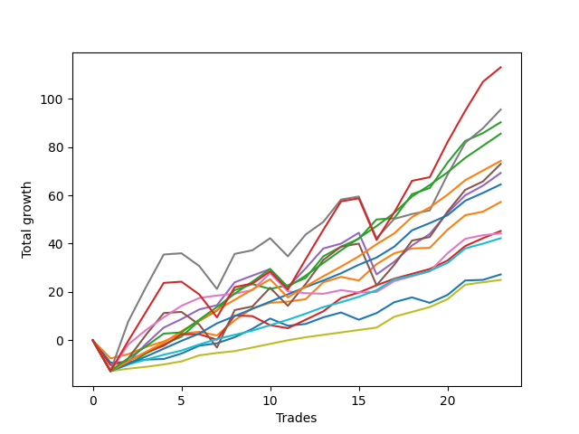

# Short Bernese 003 
- Symbol: ES_SmolBoi
- Date Range: 03/18/2022 - 07/29/2022
- Trading Period: 7:20-12:30
- Number of Trades: 23



| Name | Win Percent | Profit | Avg Profit / Trade | Avg Time / Trade |      | Name | Win Percent | Profit | Avg Profit / Trade | Avg Time / Trade |
| ---- | ----------- | ------ | ------------------ | ---------------- | ---- | ---- | ----------- | ------ | ------------------ | ---------------- |
| Sorted By <br> Profit | | | | | | Sorted By <br> Win Percentage ||||
| NEWFI 0000 | 78.26 | 56500.00 | 2456.52 | 40:49 |     | Eighty-Three | 95.65 | 32250.00 | 1402.17 | 09:57 |
| Seven | 78.26 | 47750.00 | 2076.09 | 39:27 |     | Eighty-Two | 95.65 | 21125.00 | 918.48 | 06:58 |
| Two | 91.30 | 45125.00 | 1961.96 | 17:10 |     | Eighty-One | 95.65 | 12500.00 | 543.48 | 04:36 |
| Eighty-Five | 91.30 | 42750.00 | 1858.70 | 18:38 |     | Two | 91.30 | 45125.00 | 1961.96 | 17:10 |
| Eighty-Four | 91.30 | 37125.00 | 1614.13 | 13:22 |     | Eighty-Five | 91.30 | 42750.00 | 1858.70 | 18:38 |
| Five | 78.26 | 36500.00 | 1586.96 | 35:24 |     | Eighty-Four | 91.30 | 37125.00 | 1614.13 | 13:22 |
| Four | 86.96 | 34625.00 | 1505.43 | 26:39 |     | Four | 86.96 | 34625.00 | 1505.43 | 26:39 |
| Eighty-Three | 95.65 | 32250.00 | 1402.17 | 09:57 |     | One | 86.96 | 28625.00 | 1244.57 | 08:39 |
| One | 86.96 | 28625.00 | 1244.57 | 08:39 |     | Zero | 82.61 | 13625.00 | 592.39 | 05:30 |
| Three | 73.91 | 22625.00 | 983.70 | 16:55 |     | NEWFI 0000 | 78.26 | 56500.00 | 2456.52 | 40:49 |
| Six | 78.26 | 22125.00 | 961.96 | 12:56 |     | Seven | 78.26 | 47750.00 | 2076.09 | 39:27 |
| Eighty-Two | 95.65 | 21125.00 | 918.48 | 06:58 |     | Five | 78.26 | 36500.00 | 1586.96 | 35:24 |
| Zero | 82.61 | 13625.00 | 592.39 | 05:30 |     | Six | 78.26 | 22125.00 | 961.96 | 12:56 |
| Eighty-One | 95.65 | 12500.00 | 543.48 | 04:36 |     | Three | 73.91 | 22625.00 | 983.70 | 16:55 |

## NO STOPLOSS

### Test Zero
* Sell when price hits the middle line of the 20p bollinger
* No Stoploss
* Results:
```
Total Trades: 23
Percent Up: 17.39
Percent Down: 82.61
Total Points Moved Down: 27.25
Potential Profit: 13625.00
Total Points Ups: 17.50 Count Ups: 4
Total Points Downs: 44.75 Count Downs: 19
```

<details><summary>Trades</summary>

<code>In: 2022-03-25 10:53:00		Out: 2022-03-25 11:18:10		Total Position Time: 25:10		Total Move Down: -9.25		Total to Date: -9.25</code> <br />
<code>In: 2022-03-25 11:57:00		Out: 2022-03-25 11:57:15		Total Position Time: 00:15		Total Move Down: 0.25		Total to Date: -9.00</code> <br />
<code>In: 2022-03-29 08:52:00		Out: 2022-03-29 08:56:15		Total Position Time: 04:15		Total Move Down: 1.00		Total to Date: -8.00</code> <br />
<code>In: 2022-03-29 08:53:00		Out: 2022-03-29 08:56:15		Total Position Time: 03:15		Total Move Down: 0.25		Total to Date: -7.75</code> <br />
<code>In: 2022-04-20 09:55:00		Out: 2022-04-20 09:59:15		Total Position Time: 04:15		Total Move Down: 2.25		Total to Date: -5.50</code> <br />
<code>In: 2022-04-25 09:28:00		Out: 2022-04-25 09:31:05		Total Position Time: 03:05		Total Move Down: 3.25		Total to Date: -2.25</code> <br />
<code>In: 2022-04-25 09:29:00		Out: 2022-04-25 09:31:05		Total Position Time: 02:05		Total Move Down: 1.00		Total to Date: -1.25</code> <br />
<code>In: 2022-04-26 09:31:00		Out: 2022-04-26 09:37:10		Total Position Time: 06:10		Total Move Down: 2.50		Total to Date: 1.25</code> <br />
<code>In: 2022-05-04 09:42:00		Out: 2022-05-04 09:45:30		Total Position Time: 03:30		Total Move Down: 3.50		Total to Date: 4.75</code> <br />
<code>In: 2022-05-24 08:51:00		Out: 2022-05-24 09:01:05		Total Position Time: 10:05		Total Move Down: 4.25		Total to Date: 9.00</code> <br />
<code>In: 2022-05-24 10:44:00		Out: 2022-05-24 11:01:15		Total Position Time: 17:15		Total Move Down: -3.00		Total to Date: 6.00</code> <br />
<code>In: 2022-05-25 10:40:00		Out: 2022-05-25 10:47:20		Total Position Time: 07:20		Total Move Down: 0.75		Total to Date: 6.75</code> <br />
<code>In: 2022-06-09 08:47:00		Out: 2022-06-09 08:48:20		Total Position Time: 01:20		Total Move Down: 2.75		Total to Date: 9.50</code> <br />
<code>In: 2022-06-09 09:46:00		Out: 2022-06-09 09:49:20		Total Position Time: 03:20		Total Move Down: 2.00		Total to Date: 11.50</code> <br />
<code>In: 2022-06-10 10:42:00		Out: 2022-06-10 10:54:55		Total Position Time: 12:55		Total Move Down: -3.00		Total to Date: 8.50</code> <br />
<code>In: 2022-06-13 08:42:00		Out: 2022-06-13 08:47:40		Total Position Time: 05:40		Total Move Down: 2.75		Total to Date: 11.25</code> <br />
<code>In: 2022-06-15 09:19:00		Out: 2022-06-15 09:19:10		Total Position Time: 00:10		Total Move Down: 4.50		Total to Date: 15.75</code> <br />
<code>In: 2022-06-15 11:02:00		Out: 2022-06-15 11:02:10		Total Position Time: 00:10		Total Move Down: 2.00		Total to Date: 17.75</code> <br />
<code>In: 2022-06-29 12:20:00		Out: 2022-06-29 12:33:20		Total Position Time: 13:20		Total Move Down: -2.25		Total to Date: 15.50</code> <br />
<code>In: 2022-07-06 11:10:00		Out: 2022-07-06 11:10:10		Total Position Time: 00:10		Total Move Down: 3.25		Total to Date: 18.75</code> <br />
<code>In: 2022-07-06 11:11:00		Out: 2022-07-06 11:11:10		Total Position Time: 00:10		Total Move Down: 6.00		Total to Date: 24.75</code> <br />
<code>In: 2022-07-18 09:01:00		Out: 2022-07-18 09:01:30		Total Position Time: 00:30		Total Move Down: 0.25		Total to Date: 25.00</code> <br />
<code>In: 2022-07-26 10:13:00		Out: 2022-07-26 10:15:10		Total Position Time: 02:10		Total Move Down: 2.25		Total to Date: 27.25</code> <br />


</details>

### Test One
* Sell when the price hits the upper line of the 20p 1std bollinger
* No Stoploss
* Results:
```
Total Trades: 23
Percent Up: 13.04
Percent Down: 86.96
Total Points Moved Down: 57.25
Potential Profit: 28625.00
Total Points Ups: 10.50 Count Ups: 3
Total Points Downs: 67.75 Count Downs: 20
```

<details><summary>Trades</summary>

<code>In: 2022-03-25 10:53:00		Out: 2022-03-25 11:19:30		Total Position Time: 26:30		Total Move Down: -7.50		Total to Date: -7.50</code> <br />
<code>In: 2022-03-25 11:57:00		Out: 2022-03-25 12:00:45		Total Position Time: 03:45		Total Move Down: 1.75		Total to Date: -5.75</code> <br />
<code>In: 2022-03-29 08:52:00		Out: 2022-03-29 08:58:40		Total Position Time: 06:40		Total Move Down: 3.00		Total to Date: -2.75</code> <br />
<code>In: 2022-03-29 08:53:00		Out: 2022-03-29 08:58:40		Total Position Time: 05:40		Total Move Down: 2.25		Total to Date: -0.50</code> <br />
<code>In: 2022-04-20 09:55:00		Out: 2022-04-20 10:08:15		Total Position Time: 13:15		Total Move Down: 3.25		Total to Date: 2.75</code> <br />
<code>In: 2022-04-25 09:28:00		Out: 2022-04-25 09:42:35		Total Position Time: 14:35		Total Move Down: 0.75		Total to Date: 3.50</code> <br />
<code>In: 2022-04-25 09:29:00		Out: 2022-04-25 09:42:35		Total Position Time: 13:35		Total Move Down: -1.50		Total to Date: 2.00</code> <br />
<code>In: 2022-04-26 09:31:00		Out: 2022-04-26 09:38:00		Total Position Time: 07:00		Total Move Down: 6.25		Total to Date: 8.25</code> <br />
<code>In: 2022-05-04 09:42:00		Out: 2022-05-04 09:46:30		Total Position Time: 04:30		Total Move Down: 5.00		Total to Date: 13.25</code> <br />
<code>In: 2022-05-24 08:51:00		Out: 2022-05-24 09:06:10		Total Position Time: 15:10		Total Move Down: 2.25		Total to Date: 15.50</code> <br />
<code>In: 2022-05-24 10:44:00		Out: 2022-05-24 11:01:40		Total Position Time: 17:40		Total Move Down: 0.50		Total to Date: 16.00</code> <br />
<code>In: 2022-05-25 10:40:00		Out: 2022-05-25 10:51:20		Total Position Time: 11:20		Total Move Down: 1.00		Total to Date: 17.00</code> <br />
<code>In: 2022-06-09 08:47:00		Out: 2022-06-09 08:49:35		Total Position Time: 02:35		Total Move Down: 7.00		Total to Date: 24.00</code> <br />
<code>In: 2022-06-09 09:46:00		Out: 2022-06-09 09:54:45		Total Position Time: 08:45		Total Move Down: 2.25		Total to Date: 26.25</code> <br />
<code>In: 2022-06-10 10:42:00		Out: 2022-06-10 10:56:05		Total Position Time: 14:05		Total Move Down: -1.50		Total to Date: 24.75</code> <br />
<code>In: 2022-06-13 08:42:00		Out: 2022-06-13 08:52:05		Total Position Time: 10:05		Total Move Down: 6.75		Total to Date: 31.50</code> <br />
<code>In: 2022-06-15 09:19:00		Out: 2022-06-15 09:19:10		Total Position Time: 00:10		Total Move Down: 4.50		Total to Date: 36.00</code> <br />
<code>In: 2022-06-15 11:02:00		Out: 2022-06-15 11:02:10		Total Position Time: 00:10		Total Move Down: 2.00		Total to Date: 38.00</code> <br />
<code>In: 2022-06-29 12:20:00		Out: 2022-06-29 12:34:10		Total Position Time: 14:10		Total Move Down: 0.25		Total to Date: 38.25</code> <br />
<code>In: 2022-07-06 11:10:00		Out: 2022-07-06 11:11:10		Total Position Time: 01:10		Total Move Down: 7.50		Total to Date: 45.75</code> <br />
<code>In: 2022-07-06 11:11:00		Out: 2022-07-06 11:11:10		Total Position Time: 00:10		Total Move Down: 6.00		Total to Date: 51.75</code> <br />
<code>In: 2022-07-18 09:01:00		Out: 2022-07-18 09:05:10		Total Position Time: 04:10		Total Move Down: 1.50		Total to Date: 53.25</code> <br />
<code>In: 2022-07-26 10:13:00		Out: 2022-07-26 10:17:00		Total Position Time: 04:00		Total Move Down: 4.00		Total to Date: 57.25</code> <br />


</details>

### Test Two
* Sell when the price hits the upper line of the 20p 2std bollinger
* No Stoploss
* Results:
```
Total Trades: 23
Percent Up: 8.70
Percent Down: 91.30
Total Points Moved Down: 90.25
Potential Profit: 45125.00
Total Points Ups: 14.75 Count Ups: 2
Total Points Downs: 105.00 Count Downs: 21
```

<details><summary>Trades</summary>

<code>In: 2022-03-25 10:53:00		Out: 2022-03-25 11:52:55		Total Position Time: 59:55		Total Move Down: -12.75		Total to Date: -12.75</code> <br />
<code>In: 2022-03-25 11:57:00		Out: 2022-03-25 12:00:55		Total Position Time: 03:55		Total Move Down: 2.75		Total to Date: -10.00</code> <br />
<code>In: 2022-03-29 08:52:00		Out: 2022-03-29 09:01:40		Total Position Time: 09:40		Total Move Down: 4.50		Total to Date: -5.50</code> <br />
<code>In: 2022-03-29 08:53:00		Out: 2022-03-29 09:01:40		Total Position Time: 08:40		Total Move Down: 3.75		Total to Date: -1.75</code> <br />
<code>In: 2022-04-20 09:55:00		Out: 2022-04-20 10:08:15		Total Position Time: 13:15		Total Move Down: 3.25		Total to Date: 1.50</code> <br />
<code>In: 2022-04-25 09:28:00		Out: 2022-04-25 10:01:20		Total Position Time: 33:20		Total Move Down: 6.50		Total to Date: 8.00</code> <br />
<code>In: 2022-04-25 09:29:00		Out: 2022-04-25 10:01:20		Total Position Time: 32:20		Total Move Down: 4.25		Total to Date: 12.25</code> <br />
<code>In: 2022-04-26 09:31:00		Out: 2022-04-26 09:40:15		Total Position Time: 09:15		Total Move Down: 8.50		Total to Date: 20.75</code> <br />
<code>In: 2022-05-04 09:42:00		Out: 2022-05-04 10:11:15		Total Position Time: 29:15		Total Move Down: 2.50		Total to Date: 23.25</code> <br />
<code>In: 2022-05-24 08:51:00		Out: 2022-05-24 09:31:20		Total Position Time: 40:20		Total Move Down: -2.00		Total to Date: 21.25</code> <br />
<code>In: 2022-05-24 10:44:00		Out: 2022-05-24 11:01:50		Total Position Time: 17:50		Total Move Down: 1.50		Total to Date: 22.75</code> <br />
<code>In: 2022-05-25 10:40:00		Out: 2022-05-25 10:52:10		Total Position Time: 12:10		Total Move Down: 3.00		Total to Date: 25.75</code> <br />
<code>In: 2022-06-09 08:47:00		Out: 2022-06-09 09:11:05		Total Position Time: 24:05		Total Move Down: 9.00		Total to Date: 34.75</code> <br />
<code>In: 2022-06-09 09:46:00		Out: 2022-06-09 09:55:00		Total Position Time: 09:00		Total Move Down: 4.00		Total to Date: 38.75</code> <br />
<code>In: 2022-06-10 10:42:00		Out: 2022-06-10 11:01:00		Total Position Time: 19:00		Total Move Down: 3.25		Total to Date: 42.00</code> <br />
<code>In: 2022-06-13 08:42:00		Out: 2022-06-13 08:54:20		Total Position Time: 12:20		Total Move Down: 8.00		Total to Date: 50.00</code> <br />
<code>In: 2022-06-15 09:19:00		Out: 2022-06-15 09:34:05		Total Position Time: 15:05		Total Move Down: 0.50		Total to Date: 50.50</code> <br />
<code>In: 2022-06-15 11:02:00		Out: 2022-06-15 11:03:05		Total Position Time: 01:05		Total Move Down: 10.00		Total to Date: 60.50</code> <br />
<code>In: 2022-06-29 12:20:00		Out: 2022-06-29 12:35:20		Total Position Time: 15:20		Total Move Down: 2.50		Total to Date: 63.00</code> <br />
<code>In: 2022-07-06 11:10:00		Out: 2022-07-06 11:11:45		Total Position Time: 01:45		Total Move Down: 10.50		Total to Date: 73.50</code> <br />
<code>In: 2022-07-06 11:11:00		Out: 2022-07-06 11:11:45		Total Position Time: 00:45		Total Move Down: 9.00		Total to Date: 82.50</code> <br />
<code>In: 2022-07-18 09:01:00		Out: 2022-07-18 09:08:15		Total Position Time: 07:15		Total Move Down: 3.25		Total to Date: 85.75</code> <br />
<code>In: 2022-07-26 10:13:00		Out: 2022-07-26 10:32:35		Total Position Time: 19:35		Total Move Down: 4.50		Total to Date: 90.25</code> <br />


</details>

### Test Three
* Sell when price hits the middle line of the 50p bollinger
* No Stoploss
* Results:
```
Total Trades: 23
Percent Up: 26.09
Percent Down: 73.91
Total Points Moved Down: 45.25
Potential Profit: 22625.00
Total Points Ups: 17.75 Count Ups: 6
Total Points Downs: 63.00 Count Downs: 17
```

<details><summary>Trades</summary>

<code>In: 2022-03-25 10:53:00		Out: 2022-03-25 11:49:30		Total Position Time: 56:30		Total Move Down: -10.25		Total to Date: -10.25</code> <br />
<code>In: 2022-03-25 11:57:00		Out: 2022-03-25 12:00:45		Total Position Time: 03:45		Total Move Down: 1.75		Total to Date: -8.50</code> <br />
<code>In: 2022-03-29 08:52:00		Out: 2022-03-29 09:01:25		Total Position Time: 09:25		Total Move Down: 3.50		Total to Date: -5.00</code> <br />
<code>In: 2022-03-29 08:53:00		Out: 2022-03-29 09:01:25		Total Position Time: 08:25		Total Move Down: 2.75		Total to Date: -2.25</code> <br />
<code>In: 2022-04-20 09:55:00		Out: 2022-04-20 10:08:35		Total Position Time: 13:35		Total Move Down: 4.75		Total to Date: 2.50</code> <br />
<code>In: 2022-04-25 09:28:00		Out: 2022-04-25 09:55:05		Total Position Time: 27:05		Total Move Down: -0.00		Total to Date: 2.50</code> <br />
<code>In: 2022-04-25 09:29:00		Out: 2022-04-25 09:55:05		Total Position Time: 26:05		Total Move Down: -2.25		Total to Date: 0.25</code> <br />
<code>In: 2022-04-26 09:31:00		Out: 2022-04-26 09:46:10		Total Position Time: 15:10		Total Move Down: 10.00		Total to Date: 10.25</code> <br />
<code>In: 2022-05-04 09:42:00		Out: 2022-05-04 10:10:20		Total Position Time: 28:20		Total Move Down: -0.25		Total to Date: 10.00</code> <br />
<code>In: 2022-05-24 08:51:00		Out: 2022-05-24 09:31:15		Total Position Time: 40:15		Total Move Down: -3.75		Total to Date: 6.25</code> <br />
<code>In: 2022-05-24 10:44:00		Out: 2022-05-24 11:20:25		Total Position Time: 36:25		Total Move Down: -1.25		Total to Date: 5.00</code> <br />
<code>In: 2022-05-25 10:40:00		Out: 2022-05-25 10:53:30		Total Position Time: 13:30		Total Move Down: 3.50		Total to Date: 8.50</code> <br />
<code>In: 2022-06-09 08:47:00		Out: 2022-06-09 08:48:40		Total Position Time: 01:40		Total Move Down: 3.50		Total to Date: 12.00</code> <br />
<code>In: 2022-06-09 09:46:00		Out: 2022-06-09 09:55:50		Total Position Time: 09:50		Total Move Down: 5.50		Total to Date: 17.50</code> <br />
<code>In: 2022-06-10 10:42:00		Out: 2022-06-10 10:58:20		Total Position Time: 16:20		Total Move Down: 2.25		Total to Date: 19.75</code> <br />
<code>In: 2022-06-13 08:42:00		Out: 2022-06-13 09:07:15		Total Position Time: 25:15		Total Move Down: 3.00		Total to Date: 22.75</code> <br />
<code>In: 2022-06-15 09:19:00		Out: 2022-06-15 09:35:10		Total Position Time: 16:10		Total Move Down: 2.75		Total to Date: 25.50</code> <br />
<code>In: 2022-06-15 11:02:00		Out: 2022-06-15 11:02:10		Total Position Time: 00:10		Total Move Down: 2.00		Total to Date: 27.50</code> <br />
<code>In: 2022-06-29 12:20:00		Out: 2022-06-29 12:34:15		Total Position Time: 14:15		Total Move Down: 2.00		Total to Date: 29.50</code> <br />
<code>In: 2022-07-06 11:10:00		Out: 2022-07-06 11:10:20		Total Position Time: 00:20		Total Move Down: 3.50		Total to Date: 33.00</code> <br />
<code>In: 2022-07-06 11:11:00		Out: 2022-07-06 11:11:10		Total Position Time: 00:10		Total Move Down: 6.00		Total to Date: 39.00</code> <br />
<code>In: 2022-07-18 09:01:00		Out: 2022-07-18 09:08:15		Total Position Time: 07:15		Total Move Down: 3.25		Total to Date: 42.25</code> <br />
<code>In: 2022-07-26 10:13:00		Out: 2022-07-26 10:32:10		Total Position Time: 19:10		Total Move Down: 3.00		Total to Date: 45.25</code> <br />


</details>

### Test Four
* Sell when the price hits the upper line of the 50p 1std bollinger
* No Stoploss
* Results:
```
Total Trades: 23
Percent Up: 13.04
Percent Down: 86.96
Total Points Moved Down: 69.25
Potential Profit: 34625.00
Total Points Ups: 37.50 Count Ups: 3
Total Points Downs: 106.75 Count Downs: 20
```

<details><summary>Trades</summary>

<code>In: 2022-03-25 10:53:00		Out: 2022-03-25 11:52:55		Total Position Time: 59:55		Total Move Down: -12.75		Total to Date: -12.75</code> <br />
<code>In: 2022-03-25 11:57:00		Out: 2022-03-25 12:01:35		Total Position Time: 04:35		Total Move Down: 3.75		Total to Date: -9.00</code> <br />
<code>In: 2022-03-29 08:52:00		Out: 2022-03-29 09:02:15		Total Position Time: 10:15		Total Move Down: 7.50		Total to Date: -1.50</code> <br />
<code>In: 2022-03-29 08:53:00		Out: 2022-03-29 09:02:15		Total Position Time: 09:15		Total Move Down: 6.75		Total to Date: 5.25</code> <br />
<code>In: 2022-04-20 09:55:00		Out: 2022-04-20 10:26:35		Total Position Time: 31:35		Total Move Down: 3.50		Total to Date: 8.75</code> <br />
<code>In: 2022-04-25 09:28:00		Out: 2022-04-25 10:01:15		Total Position Time: 33:15		Total Move Down: 4.00		Total to Date: 12.75</code> <br />
<code>In: 2022-04-25 09:29:00		Out: 2022-04-25 10:01:15		Total Position Time: 32:15		Total Move Down: 1.75		Total to Date: 14.50</code> <br />
<code>In: 2022-04-26 09:31:00		Out: 2022-04-26 10:02:50		Total Position Time: 31:50		Total Move Down: 9.50		Total to Date: 24.00</code> <br />
<code>In: 2022-05-04 09:42:00		Out: 2022-05-04 10:30:25		Total Position Time: 48:25		Total Move Down: 2.75		Total to Date: 26.75</code> <br />
<code>In: 2022-05-24 08:51:00		Out: 2022-05-24 09:33:20		Total Position Time: 42:20		Total Move Down: 2.75		Total to Date: 29.50</code> <br />
<code>In: 2022-05-24 10:44:00		Out: 2022-05-24 11:43:55		Total Position Time: 59:55		Total Move Down: -7.50		Total to Date: 22.00</code> <br />
<code>In: 2022-05-25 10:40:00		Out: 2022-05-25 11:06:40		Total Position Time: 26:40		Total Move Down: 7.75		Total to Date: 29.75</code> <br />
<code>In: 2022-06-09 08:47:00		Out: 2022-06-09 08:50:20		Total Position Time: 03:20		Total Move Down: 8.25		Total to Date: 38.00</code> <br />
<code>In: 2022-06-09 09:46:00		Out: 2022-06-09 10:23:50		Total Position Time: 37:50		Total Move Down: 2.00		Total to Date: 40.00</code> <br />
<code>In: 2022-06-10 10:42:00		Out: 2022-06-10 11:15:20		Total Position Time: 33:20		Total Move Down: 4.50		Total to Date: 44.50</code> <br />
<code>In: 2022-06-13 08:42:00		Out: 2022-06-13 09:41:55		Total Position Time: 59:55		Total Move Down: -17.25		Total to Date: 27.25</code> <br />
<code>In: 2022-06-15 09:19:00		Out: 2022-06-15 09:39:25		Total Position Time: 20:25		Total Move Down: 5.25		Total to Date: 32.50</code> <br />
<code>In: 2022-06-15 11:02:00		Out: 2022-06-15 11:03:00		Total Position Time: 01:00		Total Move Down: 6.75		Total to Date: 39.25</code> <br />
<code>In: 2022-06-29 12:20:00		Out: 2022-06-29 12:41:00		Total Position Time: 21:00		Total Move Down: 4.75		Total to Date: 44.00</code> <br />
<code>In: 2022-07-06 11:10:00		Out: 2022-07-06 11:11:35		Total Position Time: 01:35		Total Move Down: 8.75		Total to Date: 52.75</code> <br />
<code>In: 2022-07-06 11:11:00		Out: 2022-07-06 11:11:35		Total Position Time: 00:35		Total Move Down: 7.25		Total to Date: 60.00</code> <br />
<code>In: 2022-07-18 09:01:00		Out: 2022-07-18 09:19:25		Total Position Time: 18:25		Total Move Down: 4.00		Total to Date: 64.00</code> <br />
<code>In: 2022-07-26 10:13:00		Out: 2022-07-26 10:38:20		Total Position Time: 25:20		Total Move Down: 5.25		Total to Date: 69.25</code> <br />


</details>

### Test Five
* Sell when the price hits the upper line of the 50p 2std bollinger
* No Stoploss
* Results:
```
Total Trades: 23
Percent Up: 21.74
Percent Down: 78.26
Total Points Moved Down: 73.00
Potential Profit: 36500.00
Total Points Ups: 52.25 Count Ups: 5
Total Points Downs: 125.25 Count Downs: 18
```

<details><summary>Trades</summary>

<code>In: 2022-03-25 10:53:00		Out: 2022-03-25 11:52:55		Total Position Time: 59:55		Total Move Down: -12.75		Total to Date: -12.75</code> <br />
<code>In: 2022-03-25 11:57:00		Out: 2022-03-25 12:01:55		Total Position Time: 04:55		Total Move Down: 5.25		Total to Date: -7.50</code> <br />
<code>In: 2022-03-29 08:52:00		Out: 2022-03-29 09:10:50		Total Position Time: 18:50		Total Move Down: 9.75		Total to Date: 2.25</code> <br />
<code>In: 2022-03-29 08:53:00		Out: 2022-03-29 09:10:50		Total Position Time: 17:50		Total Move Down: 9.00		Total to Date: 11.25</code> <br />
<code>In: 2022-04-20 09:55:00		Out: 2022-04-20 10:54:55		Total Position Time: 59:55		Total Move Down: 0.50		Total to Date: 11.75</code> <br />
<code>In: 2022-04-25 09:28:00		Out: 2022-04-25 10:27:55		Total Position Time: 59:55		Total Move Down: -5.25		Total to Date: 6.50</code> <br />
<code>In: 2022-04-25 09:29:00		Out: 2022-04-25 10:28:55		Total Position Time: 59:55		Total Move Down: -9.50		Total to Date: -3.00</code> <br />
<code>In: 2022-04-26 09:31:00		Out: 2022-04-26 10:14:40		Total Position Time: 43:40		Total Move Down: 15.50		Total to Date: 12.50</code> <br />
<code>In: 2022-05-04 09:42:00		Out: 2022-05-04 10:41:55		Total Position Time: 59:55		Total Move Down: 1.50		Total to Date: 14.00</code> <br />
<code>In: 2022-05-24 08:51:00		Out: 2022-05-24 09:36:50		Total Position Time: 45:50		Total Move Down: 7.75		Total to Date: 21.75</code> <br />
<code>In: 2022-05-24 10:44:00		Out: 2022-05-24 11:43:55		Total Position Time: 59:55		Total Move Down: -7.50		Total to Date: 14.25</code> <br />
<code>In: 2022-05-25 10:40:00		Out: 2022-05-25 11:06:45		Total Position Time: 26:45		Total Move Down: 9.00		Total to Date: 23.25</code> <br />
<code>In: 2022-06-09 08:47:00		Out: 2022-06-09 09:11:10		Total Position Time: 24:10		Total Move Down: 10.00		Total to Date: 33.25</code> <br />
<code>In: 2022-06-09 09:46:00		Out: 2022-06-09 10:27:20		Total Position Time: 41:20		Total Move Down: 5.50		Total to Date: 38.75</code> <br />
<code>In: 2022-06-10 10:42:00		Out: 2022-06-10 11:41:55		Total Position Time: 59:55		Total Move Down: 1.25		Total to Date: 40.00</code> <br />
<code>In: 2022-06-13 08:42:00		Out: 2022-06-13 09:41:55		Total Position Time: 59:55		Total Move Down: -17.25		Total to Date: 22.75</code> <br />
<code>In: 2022-06-15 09:19:00		Out: 2022-06-15 09:41:45		Total Position Time: 22:45		Total Move Down: 8.50		Total to Date: 31.25</code> <br />
<code>In: 2022-06-15 11:02:00		Out: 2022-06-15 11:03:05		Total Position Time: 01:05		Total Move Down: 10.00		Total to Date: 41.25</code> <br />
<code>In: 2022-06-29 12:20:00		Out: 2022-06-29 12:46:00		Total Position Time: 26:00		Total Move Down: 1.50		Total to Date: 42.75</code> <br />
<code>In: 2022-07-06 11:10:00		Out: 2022-07-06 11:11:50		Total Position Time: 01:50		Total Move Down: 10.50		Total to Date: 53.25</code> <br />
<code>In: 2022-07-06 11:11:00		Out: 2022-07-06 11:11:50		Total Position Time: 00:50		Total Move Down: 9.00		Total to Date: 62.25</code> <br />
<code>In: 2022-07-18 09:01:00		Out: 2022-07-18 09:26:05		Total Position Time: 25:05		Total Move Down: 3.50		Total to Date: 65.75</code> <br />
<code>In: 2022-07-26 10:13:00		Out: 2022-07-26 10:47:00		Total Position Time: 34:00		Total Move Down: 7.25		Total to Date: 73.00</code> <br />


</details>

### Test Six
* Sell when the price hits the middle line of the 1std VWAP
* No Stoploss
* Results:
```
Total Trades: 23
Percent Up: 21.74
Percent Down: 78.26
Total Points Moved Down: 44.25
Potential Profit: 22125.00
Total Points Ups: 22.25 Count Ups: 5
Total Points Downs: 66.50 Count Downs: 18
```

<details><summary>Trades</summary>

<code>In: 2022-03-25 10:53:00		Out: 2022-03-25 11:52:55		Total Position Time: 59:55		Total Move Down: -12.75		Total to Date: -12.75</code> <br />
<code>In: 2022-03-25 11:57:00		Out: 2022-03-25 12:07:35		Total Position Time: 10:35		Total Move Down: 11.00		Total to Date: -1.75</code> <br />
<code>In: 2022-03-29 08:52:00		Out: 2022-03-29 09:02:10		Total Position Time: 10:10		Total Move Down: 6.00		Total to Date: 4.25</code> <br />
<code>In: 2022-03-29 08:53:00		Out: 2022-03-29 09:02:10		Total Position Time: 09:10		Total Move Down: 5.25		Total to Date: 9.50</code> <br />
<code>In: 2022-04-20 09:55:00		Out: 2022-04-20 10:08:35		Total Position Time: 13:35		Total Move Down: 4.75		Total to Date: 14.25</code> <br />
<code>In: 2022-04-25 09:28:00		Out: 2022-04-25 09:31:05		Total Position Time: 03:05		Total Move Down: 3.25		Total to Date: 17.50</code> <br />
<code>In: 2022-04-25 09:29:00		Out: 2022-04-25 09:31:05		Total Position Time: 02:05		Total Move Down: 1.00		Total to Date: 18.50</code> <br />
<code>In: 2022-04-26 09:31:00		Out: 2022-04-26 09:31:10		Total Position Time: 00:10		Total Move Down: 0.75		Total to Date: 19.25</code> <br />
<code>In: 2022-05-04 09:42:00		Out: 2022-05-04 10:41:55		Total Position Time: 59:55		Total Move Down: 1.50		Total to Date: 20.75</code> <br />
<code>In: 2022-05-24 08:51:00		Out: 2022-05-24 09:36:45		Total Position Time: 45:45		Total Move Down: 7.00		Total to Date: 27.75</code> <br />
<code>In: 2022-05-24 10:44:00		Out: 2022-05-24 11:43:55		Total Position Time: 59:55		Total Move Down: -7.50		Total to Date: 20.25</code> <br />
<code>In: 2022-05-25 10:40:00		Out: 2022-05-25 10:40:10		Total Position Time: 00:10		Total Move Down: -0.75		Total to Date: 19.50</code> <br />
<code>In: 2022-06-09 08:47:00		Out: 2022-06-09 08:47:10		Total Position Time: 00:10		Total Move Down: -0.25		Total to Date: 19.25</code> <br />
<code>In: 2022-06-09 09:46:00		Out: 2022-06-09 09:48:20		Total Position Time: 02:20		Total Move Down: 1.50		Total to Date: 20.75</code> <br />
<code>In: 2022-06-10 10:42:00		Out: 2022-06-10 10:42:10		Total Position Time: 00:10		Total Move Down: -1.00		Total to Date: 19.75</code> <br />
<code>In: 2022-06-13 08:42:00		Out: 2022-06-13 08:42:10		Total Position Time: 00:10		Total Move Down: 0.25		Total to Date: 20.00</code> <br />
<code>In: 2022-06-15 09:19:00		Out: 2022-06-15 09:19:10		Total Position Time: 00:10		Total Move Down: 4.50		Total to Date: 24.50</code> <br />
<code>In: 2022-06-15 11:02:00		Out: 2022-06-15 11:02:10		Total Position Time: 00:10		Total Move Down: 2.00		Total to Date: 26.50</code> <br />
<code>In: 2022-06-29 12:20:00		Out: 2022-06-29 12:34:15		Total Position Time: 14:15		Total Move Down: 2.00		Total to Date: 28.50</code> <br />
<code>In: 2022-07-06 11:10:00		Out: 2022-07-06 11:11:10		Total Position Time: 01:10		Total Move Down: 7.50		Total to Date: 36.00</code> <br />
<code>In: 2022-07-06 11:11:00		Out: 2022-07-06 11:11:10		Total Position Time: 00:10		Total Move Down: 6.00		Total to Date: 42.00</code> <br />
<code>In: 2022-07-18 09:01:00		Out: 2022-07-18 09:05:10		Total Position Time: 04:10		Total Move Down: 1.50		Total to Date: 43.50</code> <br />
<code>In: 2022-07-26 10:13:00		Out: 2022-07-26 10:13:10		Total Position Time: 00:10		Total Move Down: 0.75		Total to Date: 44.25</code> <br />


</details>

### Test Seven
* Sell when the price hits the upper line of the 1std VWAP
* No Stoploss
* Results:
```
Total Trades: 23
Percent Up: 21.74
Percent Down: 78.26
Total Points Moved Down: 95.50
Potential Profit: 47750.00
Total Points Ups: 52.25 Count Ups: 5
Total Points Downs: 147.75 Count Downs: 18
```

<details><summary>Trades</summary>

<code>In: 2022-03-25 10:53:00		Out: 2022-03-25 11:52:55		Total Position Time: 59:55		Total Move Down: -12.75		Total to Date: -12.75</code> <br />
<code>In: 2022-03-25 11:57:00		Out: 2022-03-25 12:33:10		Total Position Time: 36:10		Total Move Down: 20.50		Total to Date: 7.75</code> <br />
<code>In: 2022-03-29 08:52:00		Out: 2022-03-29 09:27:55		Total Position Time: 35:55		Total Move Down: 14.25		Total to Date: 22.00</code> <br />
<code>In: 2022-03-29 08:53:00		Out: 2022-03-29 09:27:55		Total Position Time: 34:55		Total Move Down: 13.50		Total to Date: 35.50</code> <br />
<code>In: 2022-04-20 09:55:00		Out: 2022-04-20 10:54:55		Total Position Time: 59:55		Total Move Down: 0.50		Total to Date: 36.00</code> <br />
<code>In: 2022-04-25 09:28:00		Out: 2022-04-25 10:27:55		Total Position Time: 59:55		Total Move Down: -5.25		Total to Date: 30.75</code> <br />
<code>In: 2022-04-25 09:29:00		Out: 2022-04-25 10:28:55		Total Position Time: 59:55		Total Move Down: -9.50		Total to Date: 21.25</code> <br />
<code>In: 2022-04-26 09:31:00		Out: 2022-04-26 10:14:15		Total Position Time: 43:15		Total Move Down: 14.50		Total to Date: 35.75</code> <br />
<code>In: 2022-05-04 09:42:00		Out: 2022-05-04 10:41:55		Total Position Time: 59:55		Total Move Down: 1.50		Total to Date: 37.25</code> <br />
<code>In: 2022-05-24 08:51:00		Out: 2022-05-24 09:50:55		Total Position Time: 59:55		Total Move Down: 5.00		Total to Date: 42.25</code> <br />
<code>In: 2022-05-24 10:44:00		Out: 2022-05-24 11:43:55		Total Position Time: 59:55		Total Move Down: -7.50		Total to Date: 34.75</code> <br />
<code>In: 2022-05-25 10:40:00		Out: 2022-05-25 11:06:45		Total Position Time: 26:45		Total Move Down: 9.00		Total to Date: 43.75</code> <br />
<code>In: 2022-06-09 08:47:00		Out: 2022-06-09 08:48:50		Total Position Time: 01:50		Total Move Down: 5.25		Total to Date: 49.00</code> <br />
<code>In: 2022-06-09 09:46:00		Out: 2022-06-09 10:30:30		Total Position Time: 44:30		Total Move Down: 9.25		Total to Date: 58.25</code> <br />
<code>In: 2022-06-10 10:42:00		Out: 2022-06-10 11:41:55		Total Position Time: 59:55		Total Move Down: 1.25		Total to Date: 59.50</code> <br />
<code>In: 2022-06-13 08:42:00		Out: 2022-06-13 09:41:55		Total Position Time: 59:55		Total Move Down: -17.25		Total to Date: 42.25</code> <br />
<code>In: 2022-06-15 09:19:00		Out: 2022-06-15 09:41:40		Total Position Time: 22:40		Total Move Down: 8.00		Total to Date: 50.25</code> <br />
<code>In: 2022-06-15 11:02:00		Out: 2022-06-15 11:02:10		Total Position Time: 00:10		Total Move Down: 2.00		Total to Date: 52.25</code> <br />
<code>In: 2022-06-29 12:20:00		Out: 2022-06-29 12:46:00		Total Position Time: 26:00		Total Move Down: 1.50		Total to Date: 53.75</code> <br />
<code>In: 2022-07-06 11:10:00		Out: 2022-07-06 11:12:20		Total Position Time: 02:20		Total Move Down: 14.75		Total to Date: 68.50</code> <br />
<code>In: 2022-07-06 11:11:00		Out: 2022-07-06 11:12:20		Total Position Time: 01:20		Total Move Down: 13.25		Total to Date: 81.75</code> <br />
<code>In: 2022-07-18 09:01:00		Out: 2022-07-18 09:49:15		Total Position Time: 48:15		Total Move Down: 6.00		Total to Date: 87.75</code> <br />
<code>In: 2022-07-26 10:13:00		Out: 2022-07-26 10:57:05		Total Position Time: 44:05		Total Move Down: 7.75		Total to Date: 95.50</code> <br />


</details>

## TAKE PROFIT

### Test Eighty-One
* Take Profit of 1 Point
* No Stoploss
* Results:
```
Total Trades: 23
Percent Up: 4.35
Percent Down: 95.65
Total Points Moved Down: 25.00
Potential Profit: 12500.00
Total Points Ups: 12.75 Count Ups: 1
Total Points Downs: 37.75 Count Downs: 22
```

<details><summary>Trades</summary>

<code>In: 2022-03-25 10:53:00		Out: 2022-03-25 11:52:55		Total Position Time: 59:55		Total Move Down: -12.75		Total to Date: -12.75</code> <br />
<code>In: 2022-03-25 11:57:00		Out: 2022-03-25 11:58:45		Total Position Time: 01:45		Total Move Down: 1.00		Total to Date: -11.75</code> <br />
<code>In: 2022-03-29 08:52:00		Out: 2022-03-29 08:52:55		Total Position Time: 00:55		Total Move Down: 0.75		Total to Date: -11.00</code> <br />
<code>In: 2022-03-29 08:53:00		Out: 2022-03-29 08:57:35		Total Position Time: 04:35		Total Move Down: 1.00		Total to Date: -10.00</code> <br />
<code>In: 2022-04-20 09:55:00		Out: 2022-04-20 09:57:25		Total Position Time: 02:25		Total Move Down: 1.25		Total to Date: -8.75</code> <br />
<code>In: 2022-04-25 09:28:00		Out: 2022-04-25 09:28:30		Total Position Time: 00:30		Total Move Down: 2.50		Total to Date: -6.25</code> <br />
<code>In: 2022-04-25 09:29:00		Out: 2022-04-25 09:31:05		Total Position Time: 02:05		Total Move Down: 1.00		Total to Date: -5.25</code> <br />
<code>In: 2022-04-26 09:31:00		Out: 2022-04-26 09:31:55		Total Position Time: 00:55		Total Move Down: 0.75		Total to Date: -4.50</code> <br />
<code>In: 2022-05-04 09:42:00		Out: 2022-05-04 09:42:10		Total Position Time: 00:10		Total Move Down: 1.50		Total to Date: -3.00</code> <br />
<code>In: 2022-05-24 08:51:00		Out: 2022-05-24 08:52:30		Total Position Time: 01:30		Total Move Down: 1.50		Total to Date: -1.50</code> <br />
<code>In: 2022-05-24 10:44:00		Out: 2022-05-24 10:47:50		Total Position Time: 03:50		Total Move Down: 1.50		Total to Date: 0.00</code> <br />
<code>In: 2022-05-25 10:40:00		Out: 2022-05-25 10:41:05		Total Position Time: 01:05		Total Move Down: 1.25		Total to Date: 1.25</code> <br />
<code>In: 2022-06-09 08:47:00		Out: 2022-06-09 08:48:05		Total Position Time: 01:05		Total Move Down: 1.00		Total to Date: 2.25</code> <br />
<code>In: 2022-06-09 09:46:00		Out: 2022-06-09 09:47:25		Total Position Time: 01:25		Total Move Down: 1.00		Total to Date: 3.25</code> <br />
<code>In: 2022-06-10 10:42:00		Out: 2022-06-10 10:44:25		Total Position Time: 02:25		Total Move Down: 1.00		Total to Date: 4.25</code> <br />
<code>In: 2022-06-13 08:42:00		Out: 2022-06-13 08:47:05		Total Position Time: 05:05		Total Move Down: 1.00		Total to Date: 5.25</code> <br />
<code>In: 2022-06-15 09:19:00		Out: 2022-06-15 09:19:10		Total Position Time: 00:10		Total Move Down: 4.50		Total to Date: 9.75</code> <br />
<code>In: 2022-06-15 11:02:00		Out: 2022-06-15 11:02:10		Total Position Time: 00:10		Total Move Down: 2.00		Total to Date: 11.75</code> <br />
<code>In: 2022-06-29 12:20:00		Out: 2022-06-29 12:34:15		Total Position Time: 14:15		Total Move Down: 2.00		Total to Date: 13.75</code> <br />
<code>In: 2022-07-06 11:10:00		Out: 2022-07-06 11:10:10		Total Position Time: 00:10		Total Move Down: 3.25		Total to Date: 17.00</code> <br />
<code>In: 2022-07-06 11:11:00		Out: 2022-07-06 11:11:10		Total Position Time: 00:10		Total Move Down: 6.00		Total to Date: 23.00</code> <br />
<code>In: 2022-07-18 09:01:00		Out: 2022-07-18 09:02:05		Total Position Time: 01:05		Total Move Down: 1.00		Total to Date: 24.00</code> <br />
<code>In: 2022-07-26 10:13:00		Out: 2022-07-26 10:13:15		Total Position Time: 00:15		Total Move Down: 1.00		Total to Date: 25.00</code> <br />


</details>

### Test Eighty-Two
* Take Profit of 2 Point
* No Stoploss
* Results:
```
Total Trades: 23
Percent Up: 4.35
Percent Down: 95.65
Total Points Moved Down: 42.25
Potential Profit: 21125.00
Total Points Ups: 12.75 Count Ups: 1
Total Points Downs: 55.00 Count Downs: 22
```

<details><summary>Trades</summary>

<code>In: 2022-03-25 10:53:00		Out: 2022-03-25 11:52:55		Total Position Time: 59:55		Total Move Down: -12.75		Total to Date: -12.75</code> <br />
<code>In: 2022-03-25 11:57:00		Out: 2022-03-25 12:00:50		Total Position Time: 03:50		Total Move Down: 2.75		Total to Date: -10.00</code> <br />
<code>In: 2022-03-29 08:52:00		Out: 2022-03-29 08:57:40		Total Position Time: 05:40		Total Move Down: 2.00		Total to Date: -8.00</code> <br />
<code>In: 2022-03-29 08:53:00		Out: 2022-03-29 08:58:35		Total Position Time: 05:35		Total Move Down: 2.00		Total to Date: -6.00</code> <br />
<code>In: 2022-04-20 09:55:00		Out: 2022-04-20 09:59:05		Total Position Time: 04:05		Total Move Down: 1.75		Total to Date: -4.25</code> <br />
<code>In: 2022-04-25 09:28:00		Out: 2022-04-25 09:28:30		Total Position Time: 00:30		Total Move Down: 2.50		Total to Date: -1.75</code> <br />
<code>In: 2022-04-25 09:29:00		Out: 2022-04-25 09:31:10		Total Position Time: 02:10		Total Move Down: 2.25		Total to Date: 0.50</code> <br />
<code>In: 2022-04-26 09:31:00		Out: 2022-04-26 09:32:00		Total Position Time: 01:00		Total Move Down: 1.75		Total to Date: 2.25</code> <br />
<code>In: 2022-05-04 09:42:00		Out: 2022-05-04 09:42:20		Total Position Time: 00:20		Total Move Down: 1.75		Total to Date: 4.00</code> <br />
<code>In: 2022-05-24 08:51:00		Out: 2022-05-24 08:54:45		Total Position Time: 03:45		Total Move Down: 2.25		Total to Date: 6.25</code> <br />
<code>In: 2022-05-24 10:44:00		Out: 2022-05-24 11:04:55		Total Position Time: 20:55		Total Move Down: 2.25		Total to Date: 8.50</code> <br />
<code>In: 2022-05-25 10:40:00		Out: 2022-05-25 10:41:15		Total Position Time: 01:15		Total Move Down: 2.50		Total to Date: 11.00</code> <br />
<code>In: 2022-06-09 08:47:00		Out: 2022-06-09 08:48:20		Total Position Time: 01:20		Total Move Down: 2.75		Total to Date: 13.75</code> <br />
<code>In: 2022-06-09 09:46:00		Out: 2022-06-09 09:49:20		Total Position Time: 03:20		Total Move Down: 2.00		Total to Date: 15.75</code> <br />
<code>In: 2022-06-10 10:42:00		Out: 2022-06-10 10:58:20		Total Position Time: 16:20		Total Move Down: 2.25		Total to Date: 18.00</code> <br />
<code>In: 2022-06-13 08:42:00		Out: 2022-06-13 08:47:40		Total Position Time: 05:40		Total Move Down: 2.75		Total to Date: 20.75</code> <br />
<code>In: 2022-06-15 09:19:00		Out: 2022-06-15 09:19:10		Total Position Time: 00:10		Total Move Down: 4.50		Total to Date: 25.25</code> <br />
<code>In: 2022-06-15 11:02:00		Out: 2022-06-15 11:02:45		Total Position Time: 00:45		Total Move Down: 1.50		Total to Date: 26.75</code> <br />
<code>In: 2022-06-29 12:20:00		Out: 2022-06-29 12:34:15		Total Position Time: 14:15		Total Move Down: 2.00		Total to Date: 28.75</code> <br />
<code>In: 2022-07-06 11:10:00		Out: 2022-07-06 11:10:10		Total Position Time: 00:10		Total Move Down: 3.25		Total to Date: 32.00</code> <br />
<code>In: 2022-07-06 11:11:00		Out: 2022-07-06 11:11:10		Total Position Time: 00:10		Total Move Down: 6.00		Total to Date: 38.00</code> <br />
<code>In: 2022-07-18 09:01:00		Out: 2022-07-18 09:07:55		Total Position Time: 06:55		Total Move Down: 2.00		Total to Date: 40.00</code> <br />
<code>In: 2022-07-26 10:13:00		Out: 2022-07-26 10:15:10		Total Position Time: 02:10		Total Move Down: 2.25		Total to Date: 42.25</code> <br />


</details>

### Test Eighty-Three
* Take Profit of 3 Point
* No Stoploss
* Results:
```
Total Trades: 23
Percent Up: 4.35
Percent Down: 95.65
Total Points Moved Down: 64.50
Potential Profit: 32250.00
Total Points Ups: 12.75 Count Ups: 1
Total Points Downs: 77.25 Count Downs: 22
```

<details><summary>Trades</summary>

<code>In: 2022-03-25 10:53:00		Out: 2022-03-25 11:52:55		Total Position Time: 59:55		Total Move Down: -12.75		Total to Date: -12.75</code> <br />
<code>In: 2022-03-25 11:57:00		Out: 2022-03-25 12:01:00		Total Position Time: 04:00		Total Move Down: 3.00		Total to Date: -9.75</code> <br />
<code>In: 2022-03-29 08:52:00		Out: 2022-03-29 08:58:40		Total Position Time: 06:40		Total Move Down: 3.00		Total to Date: -6.75</code> <br />
<code>In: 2022-03-29 08:53:00		Out: 2022-03-29 09:01:35		Total Position Time: 08:35		Total Move Down: 3.25		Total to Date: -3.50</code> <br />
<code>In: 2022-04-20 09:55:00		Out: 2022-04-20 10:08:15		Total Position Time: 13:15		Total Move Down: 3.25		Total to Date: -0.25</code> <br />
<code>In: 2022-04-25 09:28:00		Out: 2022-04-25 09:31:00		Total Position Time: 03:00		Total Move Down: 3.00		Total to Date: 2.75</code> <br />
<code>In: 2022-04-25 09:29:00		Out: 2022-04-25 10:01:20		Total Position Time: 32:20		Total Move Down: 4.25		Total to Date: 7.00</code> <br />
<code>In: 2022-04-26 09:31:00		Out: 2022-04-26 09:32:05		Total Position Time: 01:05		Total Move Down: 3.00		Total to Date: 10.00</code> <br />
<code>In: 2022-05-04 09:42:00		Out: 2022-05-04 09:42:35		Total Position Time: 00:35		Total Move Down: 3.00		Total to Date: 13.00</code> <br />
<code>In: 2022-05-24 08:51:00		Out: 2022-05-24 08:54:50		Total Position Time: 03:50		Total Move Down: 3.00		Total to Date: 16.00</code> <br />
<code>In: 2022-05-24 10:44:00		Out: 2022-05-24 11:05:00		Total Position Time: 21:00		Total Move Down: 3.00		Total to Date: 19.00</code> <br />
<code>In: 2022-05-25 10:40:00		Out: 2022-05-25 10:52:10		Total Position Time: 12:10		Total Move Down: 3.00		Total to Date: 22.00</code> <br />
<code>In: 2022-06-09 08:47:00		Out: 2022-06-09 08:48:20		Total Position Time: 01:20		Total Move Down: 2.75		Total to Date: 24.75</code> <br />
<code>In: 2022-06-09 09:46:00		Out: 2022-06-09 09:54:55		Total Position Time: 08:55		Total Move Down: 3.00		Total to Date: 27.75</code> <br />
<code>In: 2022-06-10 10:42:00		Out: 2022-06-10 11:00:55		Total Position Time: 18:55		Total Move Down: 3.50		Total to Date: 31.25</code> <br />
<code>In: 2022-06-13 08:42:00		Out: 2022-06-13 08:47:50		Total Position Time: 05:50		Total Move Down: 3.00		Total to Date: 34.25</code> <br />
<code>In: 2022-06-15 09:19:00		Out: 2022-06-15 09:19:10		Total Position Time: 00:10		Total Move Down: 4.50		Total to Date: 38.75</code> <br />
<code>In: 2022-06-15 11:02:00		Out: 2022-06-15 11:03:00		Total Position Time: 01:00		Total Move Down: 6.75		Total to Date: 45.50</code> <br />
<code>In: 2022-06-29 12:20:00		Out: 2022-06-29 12:35:15		Total Position Time: 15:15		Total Move Down: 3.00		Total to Date: 48.50</code> <br />
<code>In: 2022-07-06 11:10:00		Out: 2022-07-06 11:10:10		Total Position Time: 00:10		Total Move Down: 3.25		Total to Date: 51.75</code> <br />
<code>In: 2022-07-06 11:11:00		Out: 2022-07-06 11:11:10		Total Position Time: 00:10		Total Move Down: 6.00		Total to Date: 57.75</code> <br />
<code>In: 2022-07-18 09:01:00		Out: 2022-07-18 09:08:15		Total Position Time: 07:15		Total Move Down: 3.25		Total to Date: 61.00</code> <br />
<code>In: 2022-07-26 10:13:00		Out: 2022-07-26 10:16:35		Total Position Time: 03:35		Total Move Down: 3.50		Total to Date: 64.50</code> <br />


</details>

### Test Eighty-Four
* Take Profit of 4 Point
* No Stoploss
* Results:
```
Total Trades: 23
Percent Up: 8.70
Percent Down: 91.30
Total Points Moved Down: 74.25
Potential Profit: 37125.00
Total Points Ups: 20.25 Count Ups: 2
Total Points Downs: 94.50 Count Downs: 21
```

<details><summary>Trades</summary>

<code>In: 2022-03-25 10:53:00		Out: 2022-03-25 11:52:55		Total Position Time: 59:55		Total Move Down: -12.75		Total to Date: -12.75</code> <br />
<code>In: 2022-03-25 11:57:00		Out: 2022-03-25 12:01:45		Total Position Time: 04:45		Total Move Down: 4.00		Total to Date: -8.75</code> <br />
<code>In: 2022-03-29 08:52:00		Out: 2022-03-29 09:01:35		Total Position Time: 09:35		Total Move Down: 4.00		Total to Date: -4.75</code> <br />
<code>In: 2022-03-29 08:53:00		Out: 2022-03-29 09:01:40		Total Position Time: 08:40		Total Move Down: 3.75		Total to Date: -1.00</code> <br />
<code>In: 2022-04-20 09:55:00		Out: 2022-04-20 10:08:35		Total Position Time: 13:35		Total Move Down: 4.75		Total to Date: 3.75</code> <br />
<code>In: 2022-04-25 09:28:00		Out: 2022-04-25 09:31:10		Total Position Time: 03:10		Total Move Down: 4.50		Total to Date: 8.25</code> <br />
<code>In: 2022-04-25 09:29:00		Out: 2022-04-25 10:01:20		Total Position Time: 32:20		Total Move Down: 4.25		Total to Date: 12.50</code> <br />
<code>In: 2022-04-26 09:31:00		Out: 2022-04-26 09:37:35		Total Position Time: 06:35		Total Move Down: 4.25		Total to Date: 16.75</code> <br />
<code>In: 2022-05-04 09:42:00		Out: 2022-05-04 09:46:15		Total Position Time: 04:15		Total Move Down: 4.25		Total to Date: 21.00</code> <br />
<code>In: 2022-05-24 08:51:00		Out: 2022-05-24 09:01:05		Total Position Time: 10:05		Total Move Down: 4.25		Total to Date: 25.25</code> <br />
<code>In: 2022-05-24 10:44:00		Out: 2022-05-24 11:43:55		Total Position Time: 59:55		Total Move Down: -7.50		Total to Date: 17.75</code> <br />
<code>In: 2022-05-25 10:40:00		Out: 2022-05-25 10:53:35		Total Position Time: 13:35		Total Move Down: 4.50		Total to Date: 22.25</code> <br />
<code>In: 2022-06-09 08:47:00		Out: 2022-06-09 08:48:35		Total Position Time: 01:35		Total Move Down: 4.25		Total to Date: 26.50</code> <br />
<code>In: 2022-06-09 09:46:00		Out: 2022-06-09 09:55:00		Total Position Time: 09:00		Total Move Down: 4.00		Total to Date: 30.50</code> <br />
<code>In: 2022-06-10 10:42:00		Out: 2022-06-10 11:01:10		Total Position Time: 19:10		Total Move Down: 4.25		Total to Date: 34.75</code> <br />
<code>In: 2022-06-13 08:42:00		Out: 2022-06-13 08:51:35		Total Position Time: 09:35		Total Move Down: 5.00		Total to Date: 39.75</code> <br />
<code>In: 2022-06-15 09:19:00		Out: 2022-06-15 09:19:10		Total Position Time: 00:10		Total Move Down: 4.50		Total to Date: 44.25</code> <br />
<code>In: 2022-06-15 11:02:00		Out: 2022-06-15 11:03:00		Total Position Time: 01:00		Total Move Down: 6.75		Total to Date: 51.00</code> <br />
<code>In: 2022-06-29 12:20:00		Out: 2022-06-29 12:37:05		Total Position Time: 17:05		Total Move Down: 4.00		Total to Date: 55.00</code> <br />
<code>In: 2022-07-06 11:10:00		Out: 2022-07-06 11:11:05		Total Position Time: 01:05		Total Move Down: 5.25		Total to Date: 60.25</code> <br />
<code>In: 2022-07-06 11:11:00		Out: 2022-07-06 11:11:10		Total Position Time: 00:10		Total Move Down: 6.00		Total to Date: 66.25</code> <br />
<code>In: 2022-07-18 09:01:00		Out: 2022-07-18 09:19:25		Total Position Time: 18:25		Total Move Down: 4.00		Total to Date: 70.25</code> <br />
<code>In: 2022-07-26 10:13:00		Out: 2022-07-26 10:17:00		Total Position Time: 04:00		Total Move Down: 4.00		Total to Date: 74.25</code> <br />


</details>

### Test Eighty-Five
* Take Profit of 5 Point
* No Stoploss
* Results:
```
Total Trades: 23
Percent Up: 8.70
Percent Down: 91.30
Total Points Moved Down: 85.50
Potential Profit: 42750.00
Total Points Ups: 20.25 Count Ups: 2
Total Points Downs: 105.75 Count Downs: 21
```

<details><summary>Trades</summary>

<code>In: 2022-03-25 10:53:00		Out: 2022-03-25 11:52:55		Total Position Time: 59:55		Total Move Down: -12.75		Total to Date: -12.75</code> <br />
<code>In: 2022-03-25 11:57:00		Out: 2022-03-25 12:01:55		Total Position Time: 04:55		Total Move Down: 5.25		Total to Date: -7.50</code> <br />
<code>In: 2022-03-29 08:52:00		Out: 2022-03-29 09:01:45		Total Position Time: 09:45		Total Move Down: 5.00		Total to Date: -2.50</code> <br />
<code>In: 2022-03-29 08:53:00		Out: 2022-03-29 09:02:10		Total Position Time: 09:10		Total Move Down: 5.25		Total to Date: 2.75</code> <br />
<code>In: 2022-04-20 09:55:00		Out: 2022-04-20 10:54:55		Total Position Time: 59:55		Total Move Down: 0.50		Total to Date: 3.25</code> <br />
<code>In: 2022-04-25 09:28:00		Out: 2022-04-25 09:31:15		Total Position Time: 03:15		Total Move Down: 5.25		Total to Date: 8.50</code> <br />
<code>In: 2022-04-25 09:29:00		Out: 2022-04-25 10:01:40		Total Position Time: 32:40		Total Move Down: 5.25		Total to Date: 13.75</code> <br />
<code>In: 2022-04-26 09:31:00		Out: 2022-04-26 09:37:40		Total Position Time: 06:40		Total Move Down: 5.50		Total to Date: 19.25</code> <br />
<code>In: 2022-05-04 09:42:00		Out: 2022-05-04 09:46:30		Total Position Time: 04:30		Total Move Down: 5.00		Total to Date: 24.25</code> <br />
<code>In: 2022-05-24 08:51:00		Out: 2022-05-24 09:01:15		Total Position Time: 10:15		Total Move Down: 5.25		Total to Date: 29.50</code> <br />
<code>In: 2022-05-24 10:44:00		Out: 2022-05-24 11:43:55		Total Position Time: 59:55		Total Move Down: -7.50		Total to Date: 22.00</code> <br />
<code>In: 2022-05-25 10:40:00		Out: 2022-05-25 10:56:15		Total Position Time: 16:15		Total Move Down: 4.75		Total to Date: 26.75</code> <br />
<code>In: 2022-06-09 08:47:00		Out: 2022-06-09 08:48:50		Total Position Time: 01:50		Total Move Down: 5.25		Total to Date: 32.00</code> <br />
<code>In: 2022-06-09 09:46:00		Out: 2022-06-09 09:55:45		Total Position Time: 09:45		Total Move Down: 5.25		Total to Date: 37.25</code> <br />
<code>In: 2022-06-10 10:42:00		Out: 2022-06-10 11:01:15		Total Position Time: 19:15		Total Move Down: 5.00		Total to Date: 42.25</code> <br />
<code>In: 2022-06-13 08:42:00		Out: 2022-06-13 08:51:35		Total Position Time: 09:35		Total Move Down: 5.00		Total to Date: 47.25</code> <br />
<code>In: 2022-06-15 09:19:00		Out: 2022-06-15 09:38:40		Total Position Time: 19:40		Total Move Down: 5.50		Total to Date: 52.75</code> <br />
<code>In: 2022-06-15 11:02:00		Out: 2022-06-15 11:03:00		Total Position Time: 01:00		Total Move Down: 6.75		Total to Date: 59.50</code> <br />
<code>In: 2022-06-29 12:20:00		Out: 2022-06-29 12:41:05		Total Position Time: 21:05		Total Move Down: 4.75		Total to Date: 64.25</code> <br />
<code>In: 2022-07-06 11:10:00		Out: 2022-07-06 11:11:05		Total Position Time: 01:05		Total Move Down: 5.25		Total to Date: 69.50</code> <br />
<code>In: 2022-07-06 11:11:00		Out: 2022-07-06 11:11:10		Total Position Time: 00:10		Total Move Down: 6.00		Total to Date: 75.50</code> <br />
<code>In: 2022-07-18 09:01:00		Out: 2022-07-18 09:48:55		Total Position Time: 47:55		Total Move Down: 5.00		Total to Date: 80.50</code> <br />
<code>In: 2022-07-26 10:13:00		Out: 2022-07-26 10:33:10		Total Position Time: 20:10		Total Move Down: 5.00		Total to Date: 85.50</code> <br />


</details>

## Indicator Exits

### Test NEWFI 0000
* Newfi 0000
* No Stoploss
* Results:
```
Total Trades: 23
Percent Up: 21.74
Percent Down: 78.26
Total Points Moved Down: 113.00
Potential Profit: 56500.00
Total Points Ups: 52.25 Count Ups: 5
Total Points Downs: 165.25 Count Downs: 18
```

<details><summary>Trades</summary>

<code>In: 2022-03-25 10:53:00		Out: 2022-03-25 11:52:55		Total Position Time: 59:55		Total Move Down: -12.75		Total to Date: -12.75</code> <br />
<code>In: 2022-03-25 11:57:00		Out: 2022-03-25 12:20:40		Total Position Time: 23:40		Total Move Down: 12.50		Total to Date: -0.25</code> <br />
<code>In: 2022-03-29 08:52:00		Out: 2022-03-29 09:25:05		Total Position Time: 33:05		Total Move Down: 12.00		Total to Date: 11.75</code> <br />
<code>In: 2022-03-29 08:53:00		Out: 2022-03-29 09:26:35		Total Position Time: 33:35		Total Move Down: 12.00		Total to Date: 23.75</code> <br />
<code>In: 2022-04-20 09:55:00		Out: 2022-04-20 10:54:55		Total Position Time: 59:55		Total Move Down: 0.50		Total to Date: 24.25</code> <br />
<code>In: 2022-04-25 09:28:00		Out: 2022-04-25 10:27:55		Total Position Time: 59:55		Total Move Down: -5.25		Total to Date: 19.00</code> <br />
<code>In: 2022-04-25 09:29:00		Out: 2022-04-25 10:28:55		Total Position Time: 59:55		Total Move Down: -9.50		Total to Date: 9.50</code> <br />
<code>In: 2022-04-26 09:31:00		Out: 2022-04-26 10:04:10		Total Position Time: 33:10		Total Move Down: 12.50		Total to Date: 22.00</code> <br />
<code>In: 2022-05-04 09:42:00		Out: 2022-05-04 10:41:55		Total Position Time: 59:55		Total Move Down: 1.50		Total to Date: 23.50</code> <br />
<code>In: 2022-05-24 08:51:00		Out: 2022-05-24 09:50:55		Total Position Time: 59:55		Total Move Down: 5.00		Total to Date: 28.50</code> <br />
<code>In: 2022-05-24 10:44:00		Out: 2022-05-24 11:43:55		Total Position Time: 59:55		Total Move Down: -7.50		Total to Date: 21.00</code> <br />
<code>In: 2022-05-25 10:40:00		Out: 2022-05-25 11:06:55		Total Position Time: 26:55		Total Move Down: 12.50		Total to Date: 33.50</code> <br />
<code>In: 2022-06-09 08:47:00		Out: 2022-06-09 09:13:15		Total Position Time: 26:15		Total Move Down: 12.25		Total to Date: 45.75</code> <br />
<code>In: 2022-06-09 09:46:00		Out: 2022-06-09 10:32:45		Total Position Time: 46:45		Total Move Down: 11.75		Total to Date: 57.50</code> <br />
<code>In: 2022-06-10 10:42:00		Out: 2022-06-10 11:41:55		Total Position Time: 59:55		Total Move Down: 1.25		Total to Date: 58.75</code> <br />
<code>In: 2022-06-13 08:42:00		Out: 2022-06-13 09:41:55		Total Position Time: 59:55		Total Move Down: -17.25		Total to Date: 41.50</code> <br />
<code>In: 2022-06-15 09:19:00		Out: 2022-06-15 09:47:10		Total Position Time: 28:10		Total Move Down: 11.50		Total to Date: 53.00</code> <br />
<code>In: 2022-06-15 11:02:00		Out: 2022-06-15 11:03:15		Total Position Time: 01:15		Total Move Down: 13.00		Total to Date: 66.00</code> <br />
<code>In: 2022-06-29 12:20:00		Out: 2022-06-29 12:46:00		Total Position Time: 26:00		Total Move Down: 1.50		Total to Date: 67.50</code> <br />
<code>In: 2022-07-06 11:10:00		Out: 2022-07-06 11:12:15		Total Position Time: 02:15		Total Move Down: 14.50		Total to Date: 82.00</code> <br />
<code>In: 2022-07-06 11:11:00		Out: 2022-07-06 11:12:15		Total Position Time: 01:15		Total Move Down: 13.00		Total to Date: 95.00</code> <br />
<code>In: 2022-07-18 09:01:00		Out: 2022-07-18 09:58:20		Total Position Time: 57:20		Total Move Down: 12.00		Total to Date: 107.00</code> <br />
<code>In: 2022-07-26 10:13:00		Out: 2022-07-26 11:12:55		Total Position Time: 59:55		Total Move Down: 6.00		Total to Date: 113.00</code> <br />


</details>