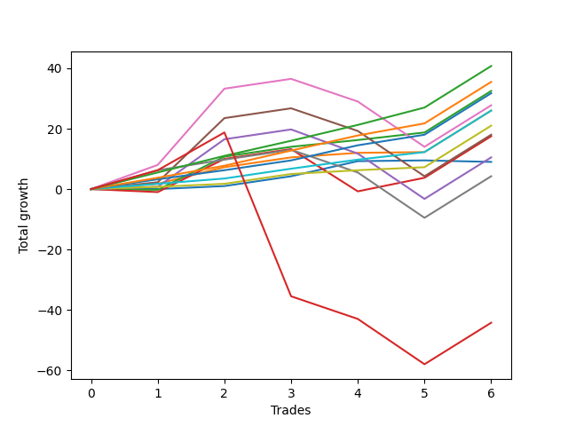

# Short Bernese 005 
- Symbol: ES_SmolBoi
- Date Range: 03/18/2022 - 07/29/2022
- Trading Period: 7:20-12:30
- Number of Trades: 5



| Name | Win Percent | Profit | Avg Profit / Trade | Avg Time / Trade |      | Name | Win Percent | Profit | Avg Profit / Trade | Avg Time / Trade |
| ---- | ----------- | ------ | ------------------ | ---------------- | ---- | ---- | ----------- | ------ | ------------------ | ---------------- |
| Sorted By <br> Profit | | | | | | Sorted By <br> Win Percentage ||||
| Eighty-Five | 100.00 | 13500.00 | 2700.00 | 12:55 |     | Eighty-Five | 100.00 | 13500.00 | 2700.00 | 12:55 |
| Eighty-Four | 100.00 | 10875.00 | 2175.00 | 12:17 |     | Eighty-Four | 100.00 | 10875.00 | 2175.00 | 12:17 |
| Two | 80.00 | 9375.00 | 1875.00 | 15:49 |     | Eighty-Three | 100.00 | 9000.00 | 1800.00 | 12:05 |
| Eighty-Three | 100.00 | 9000.00 | 1800.00 | 12:05 |     | Eighty-Two | 100.00 | 6125.00 | 1225.00 | 03:29 |
| Six | 60.00 | 7000.00 | 1400.00 | 38:15 |     | One | 100.00 | 6125.00 | 1225.00 | 04:01 |
| Eighty-Two | 100.00 | 6125.00 | 1225.00 | 03:29 |     | Eighty-One | 100.00 | 3625.00 | 725.00 | 02:29 |
| One | 100.00 | 6125.00 | 1225.00 | 04:01 |     | Two | 80.00 | 9375.00 | 1875.00 | 15:49 |
| Zero | 80.00 | 4750.00 | 950.00 | 01:18 |     | Zero | 80.00 | 4750.00 | 950.00 | 01:18 |
| Eighty-One | 100.00 | 3625.00 | 725.00 | 02:29 |     | Six | 60.00 | 7000.00 | 1400.00 | 38:15 |
| Five | 60.00 | 2125.00 | 425.00 | 36:51 |     | Five | 60.00 | 2125.00 | 425.00 | 36:51 |
| Three | 60.00 | 1875.00 | 375.00 | 23:00 |     | Three | 60.00 | 1875.00 | 375.00 | 23:00 |
| Four | 60.00 | -1625.00 | -325.00 | 36:16 |     | Four | 60.00 | -1625.00 | -325.00 | 36:16 |
| Seven | 60.00 | -4750.00 | -950.00 | 47:58 |     | Seven | 60.00 | -4750.00 | -950.00 | 47:58 |
| NEWFI 0000 | 40.00 | -29000.00 | -5800.00 | 49:59 |     | NEWFI 0000 | 40.00 | -29000.00 | -5800.00 | 49:59 |

## NO STOPLOSS

### Test Zero
* Sell when price hits the middle line of the 20p bollinger
* No Stoploss
* Results:
```
Total Trades: 5
Percent Up: 20.00
Percent Down: 80.00
Total Points Moved Down: 9.50
Potential Profit: 4750.00
Total Points Ups: 0.00 Count Ups: 1
Total Points Downs: 9.50 Count Downs: 4
```

<details><summary>Trades</summary>

<code>In: 2022-03-25 11:18:00		Out: 2022-03-25 11:18:10		Total Position Time: 00:10		Total Move Down: -0.00		Total to Date: 0.00</code> <br />
<code>In: 2022-05-10 11:06:00		Out: 2022-05-10 11:06:15		Total Position Time: 00:15		Total Move Down: 1.00		Total to Date: 1.00</code> <br />
<code>In: 2022-05-25 11:07:00		Out: 2022-05-25 11:07:10		Total Position Time: 00:10		Total Move Down: 3.25		Total to Date: 4.25</code> <br />
<code>In: 2022-05-25 11:37:00		Out: 2022-05-25 11:39:10		Total Position Time: 02:10		Total Move Down: 5.00		Total to Date: 9.25</code> <br />
<code>In: 2022-07-01 10:55:00		Out: 2022-07-01 10:58:45		Total Position Time: 03:45		Total Move Down: 0.25		Total to Date: 9.50</code> <br />


</details>

### Test One
* Sell when the price hits the upper line of the 20p 1std bollinger
* No Stoploss
* Results:
```
Total Trades: 5
Percent Up: 0.00
Percent Down: 100.00
Total Points Moved Down: 12.25
Potential Profit: 6125.00
Total Points Ups: 0.00 Count Ups: 0
Total Points Downs: 12.25 Count Downs: 5
```

<details><summary>Trades</summary>

<code>In: 2022-03-25 11:18:00		Out: 2022-03-25 11:19:30		Total Position Time: 01:30		Total Move Down: 1.75		Total to Date: 1.75</code> <br />
<code>In: 2022-05-10 11:06:00		Out: 2022-05-10 11:06:45		Total Position Time: 00:45		Total Move Down: 5.50		Total to Date: 7.25</code> <br />
<code>In: 2022-05-25 11:07:00		Out: 2022-05-25 11:07:10		Total Position Time: 00:10		Total Move Down: 3.25		Total to Date: 10.50</code> <br />
<code>In: 2022-05-25 11:37:00		Out: 2022-05-25 11:45:15		Total Position Time: 08:15		Total Move Down: 1.50		Total to Date: 12.00</code> <br />
<code>In: 2022-07-01 10:55:00		Out: 2022-07-01 11:04:25		Total Position Time: 09:25		Total Move Down: 0.25		Total to Date: 12.25</code> <br />


</details>

### Test Two
* Sell when the price hits the upper line of the 20p 2std bollinger
* No Stoploss
* Results:
```
Total Trades: 5
Percent Up: 20.00
Percent Down: 80.00
Total Points Moved Down: 18.75
Potential Profit: 9375.00
Total Points Ups: 0.25 Count Ups: 1
Total Points Downs: 19.00 Count Downs: 4
```

<details><summary>Trades</summary>

<code>In: 2022-03-25 11:18:00		Out: 2022-03-25 12:00:55		Total Position Time: 42:55		Total Move Down: -0.25		Total to Date: -0.25</code> <br />
<code>In: 2022-05-10 11:06:00		Out: 2022-05-10 11:16:05		Total Position Time: 10:05		Total Move Down: 11.00		Total to Date: 10.75</code> <br />
<code>In: 2022-05-25 11:07:00		Out: 2022-05-25 11:07:10		Total Position Time: 00:10		Total Move Down: 3.25		Total to Date: 14.00</code> <br />
<code>In: 2022-05-25 11:37:00		Out: 2022-05-25 11:50:00		Total Position Time: 13:00		Total Move Down: 2.25		Total to Date: 16.25</code> <br />
<code>In: 2022-07-01 10:55:00		Out: 2022-07-01 11:07:55		Total Position Time: 12:55		Total Move Down: 2.50		Total to Date: 18.75</code> <br />


</details>

### Test Three
* Sell when price hits the middle line of the 50p bollinger
* No Stoploss
* Results:
```
Total Trades: 5
Percent Up: 40.00
Percent Down: 60.00
Total Points Moved Down: 3.75
Potential Profit: 1875.00
Total Points Ups: 15.00 Count Ups: 2
Total Points Downs: 18.75 Count Downs: 3
```

<details><summary>Trades</summary>

<code>In: 2022-03-25 11:18:00		Out: 2022-03-25 11:49:30		Total Position Time: 31:30		Total Move Down: -1.00		Total to Date: -1.00</code> <br />
<code>In: 2022-05-10 11:06:00		Out: 2022-05-10 11:16:05		Total Position Time: 10:05		Total Move Down: 11.00		Total to Date: 10.00</code> <br />
<code>In: 2022-05-25 11:07:00		Out: 2022-05-25 11:07:10		Total Position Time: 00:10		Total Move Down: 3.25		Total to Date: 13.25</code> <br />
<code>In: 2022-05-25 11:37:00		Out: 2022-05-25 12:34:20		Total Position Time: 57:20		Total Move Down: -14.00		Total to Date: -0.75</code> <br />
<code>In: 2022-07-01 10:55:00		Out: 2022-07-01 11:10:55		Total Position Time: 15:55		Total Move Down: 4.50		Total to Date: 3.75</code> <br />


</details>

### Test Four
* Sell when the price hits the upper line of the 50p 1std bollinger
* No Stoploss
* Results:
```
Total Trades: 5
Percent Up: 40.00
Percent Down: 60.00
Total Points Moved Down: -3.25
Potential Profit: -1625.00
Total Points Ups: 23.00 Count Ups: 2
Total Points Downs: 19.75 Count Downs: 3
```

<details><summary>Trades</summary>

<code>In: 2022-03-25 11:18:00		Out: 2022-03-25 12:01:35		Total Position Time: 43:35		Total Move Down: 0.75		Total to Date: 0.75</code> <br />
<code>In: 2022-05-10 11:06:00		Out: 2022-05-10 11:24:05		Total Position Time: 18:05		Total Move Down: 15.75		Total to Date: 16.50</code> <br />
<code>In: 2022-05-25 11:07:00		Out: 2022-05-25 11:07:10		Total Position Time: 00:10		Total Move Down: 3.25		Total to Date: 19.75</code> <br />
<code>In: 2022-05-25 11:37:00		Out: 2022-05-25 12:36:35		Total Position Time: 59:35		Total Move Down: -8.00		Total to Date: 11.75</code> <br />
<code>In: 2022-07-01 10:55:00		Out: 2022-07-01 11:54:55		Total Position Time: 59:55		Total Move Down: -15.00		Total to Date: -3.25</code> <br />


</details>

### Test Five
* Sell when the price hits the upper line of the 50p 2std bollinger
* No Stoploss
* Results:
```
Total Trades: 5
Percent Up: 40.00
Percent Down: 60.00
Total Points Moved Down: 4.25
Potential Profit: 2125.00
Total Points Ups: 22.50 Count Ups: 2
Total Points Downs: 26.75 Count Downs: 3
```

<details><summary>Trades</summary>

<code>In: 2022-03-25 11:18:00		Out: 2022-03-25 12:01:55		Total Position Time: 43:55		Total Move Down: 2.25		Total to Date: 2.25</code> <br />
<code>In: 2022-05-10 11:06:00		Out: 2022-05-10 11:26:20		Total Position Time: 20:20		Total Move Down: 21.25		Total to Date: 23.50</code> <br />
<code>In: 2022-05-25 11:07:00		Out: 2022-05-25 11:07:10		Total Position Time: 00:10		Total Move Down: 3.25		Total to Date: 26.75</code> <br />
<code>In: 2022-05-25 11:37:00		Out: 2022-05-25 12:36:55		Total Position Time: 59:55		Total Move Down: -7.50		Total to Date: 19.25</code> <br />
<code>In: 2022-07-01 10:55:00		Out: 2022-07-01 11:54:55		Total Position Time: 59:55		Total Move Down: -15.00		Total to Date: 4.25</code> <br />


</details>

### Test Six
* Sell when the price hits the middle line of the 1std VWAP
* No Stoploss
* Results:
```
Total Trades: 5
Percent Up: 40.00
Percent Down: 60.00
Total Points Moved Down: 14.00
Potential Profit: 7000.00
Total Points Ups: 22.50 Count Ups: 2
Total Points Downs: 36.50 Count Downs: 3
```

<details><summary>Trades</summary>

<code>In: 2022-03-25 11:18:00		Out: 2022-03-25 12:07:35		Total Position Time: 49:35		Total Move Down: 8.00		Total to Date: 8.00</code> <br />
<code>In: 2022-05-10 11:06:00		Out: 2022-05-10 11:27:40		Total Position Time: 21:40		Total Move Down: 25.25		Total to Date: 33.25</code> <br />
<code>In: 2022-05-25 11:07:00		Out: 2022-05-25 11:07:10		Total Position Time: 00:10		Total Move Down: 3.25		Total to Date: 36.50</code> <br />
<code>In: 2022-05-25 11:37:00		Out: 2022-05-25 12:36:55		Total Position Time: 59:55		Total Move Down: -7.50		Total to Date: 29.00</code> <br />
<code>In: 2022-07-01 10:55:00		Out: 2022-07-01 11:54:55		Total Position Time: 59:55		Total Move Down: -15.00		Total to Date: 14.00</code> <br />


</details>

### Test Seven
* Sell when the price hits the upper line of the 1std VWAP
* No Stoploss
* Results:
```
Total Trades: 5
Percent Up: 40.00
Percent Down: 60.00
Total Points Moved Down: -9.50
Potential Profit: -4750.00
Total Points Ups: 22.50 Count Ups: 2
Total Points Downs: 13.00 Count Downs: 3
```

<details><summary>Trades</summary>

<code>In: 2022-03-25 11:18:00		Out: 2022-03-25 12:17:55		Total Position Time: 59:55		Total Move Down: 6.25		Total to Date: 6.25</code> <br />
<code>In: 2022-05-10 11:06:00		Out: 2022-05-10 12:05:55		Total Position Time: 59:55		Total Move Down: 3.50		Total to Date: 9.75</code> <br />
<code>In: 2022-05-25 11:07:00		Out: 2022-05-25 11:07:10		Total Position Time: 00:10		Total Move Down: 3.25		Total to Date: 13.00</code> <br />
<code>In: 2022-05-25 11:37:00		Out: 2022-05-25 12:36:55		Total Position Time: 59:55		Total Move Down: -7.50		Total to Date: 5.50</code> <br />
<code>In: 2022-07-01 10:55:00		Out: 2022-07-01 11:54:55		Total Position Time: 59:55		Total Move Down: -15.00		Total to Date: -9.50</code> <br />


</details>

## TAKE PROFIT

### Test Eighty-One
* Take Profit of 1 Point
* No Stoploss
* Results:
```
Total Trades: 5
Percent Up: 0.00
Percent Down: 100.00
Total Points Moved Down: 7.25
Potential Profit: 3625.00
Total Points Ups: 0.00 Count Ups: 0
Total Points Downs: 7.25 Count Downs: 5
```

<details><summary>Trades</summary>

<code>In: 2022-03-25 11:18:00		Out: 2022-03-25 11:18:15		Total Position Time: 00:15		Total Move Down: 0.75		Total to Date: 0.75</code> <br />
<code>In: 2022-05-10 11:06:00		Out: 2022-05-10 11:06:15		Total Position Time: 00:15		Total Move Down: 1.00		Total to Date: 1.75</code> <br />
<code>In: 2022-05-25 11:07:00		Out: 2022-05-25 11:07:10		Total Position Time: 00:10		Total Move Down: 3.25		Total to Date: 5.00</code> <br />
<code>In: 2022-05-25 11:37:00		Out: 2022-05-25 11:38:50		Total Position Time: 01:50		Total Move Down: 1.25		Total to Date: 6.25</code> <br />
<code>In: 2022-07-01 10:55:00		Out: 2022-07-01 11:04:55		Total Position Time: 09:55		Total Move Down: 1.00		Total to Date: 7.25</code> <br />


</details>

### Test Eighty-Two
* Take Profit of 2 Point
* No Stoploss
* Results:
```
Total Trades: 5
Percent Up: 0.00
Percent Down: 100.00
Total Points Moved Down: 12.25
Potential Profit: 6125.00
Total Points Ups: 0.00 Count Ups: 0
Total Points Downs: 12.25 Count Downs: 5
```

<details><summary>Trades</summary>

<code>In: 2022-03-25 11:18:00		Out: 2022-03-25 11:19:45		Total Position Time: 01:45		Total Move Down: 1.75		Total to Date: 1.75</code> <br />
<code>In: 2022-05-10 11:06:00		Out: 2022-05-10 11:06:30		Total Position Time: 00:30		Total Move Down: 1.75		Total to Date: 3.50</code> <br />
<code>In: 2022-05-25 11:07:00		Out: 2022-05-25 11:07:10		Total Position Time: 00:10		Total Move Down: 3.25		Total to Date: 6.75</code> <br />
<code>In: 2022-05-25 11:37:00		Out: 2022-05-25 11:39:05		Total Position Time: 02:05		Total Move Down: 3.00		Total to Date: 9.75</code> <br />
<code>In: 2022-07-01 10:55:00		Out: 2022-07-01 11:07:55		Total Position Time: 12:55		Total Move Down: 2.50		Total to Date: 12.25</code> <br />


</details>

### Test Eighty-Three
* Take Profit of 3 Point
* No Stoploss
* Results:
```
Total Trades: 5
Percent Up: 0.00
Percent Down: 100.00
Total Points Moved Down: 18.00
Potential Profit: 9000.00
Total Points Ups: 0.00 Count Ups: 0
Total Points Downs: 18.00 Count Downs: 5
```

<details><summary>Trades</summary>

<code>In: 2022-03-25 11:18:00		Out: 2022-03-25 12:02:00		Total Position Time: 44:00		Total Move Down: 3.25		Total to Date: 3.25</code> <br />
<code>In: 2022-05-10 11:06:00		Out: 2022-05-10 11:06:35		Total Position Time: 00:35		Total Move Down: 3.00		Total to Date: 6.25</code> <br />
<code>In: 2022-05-25 11:07:00		Out: 2022-05-25 11:07:10		Total Position Time: 00:10		Total Move Down: 3.25		Total to Date: 9.50</code> <br />
<code>In: 2022-05-25 11:37:00		Out: 2022-05-25 11:39:10		Total Position Time: 02:10		Total Move Down: 5.00		Total to Date: 14.50</code> <br />
<code>In: 2022-07-01 10:55:00		Out: 2022-07-01 11:08:30		Total Position Time: 13:30		Total Move Down: 3.50		Total to Date: 18.00</code> <br />


</details>

### Test Eighty-Four
* Take Profit of 4 Point
* No Stoploss
* Results:
```
Total Trades: 5
Percent Up: 0.00
Percent Down: 100.00
Total Points Moved Down: 21.75
Potential Profit: 10875.00
Total Points Ups: 0.00 Count Ups: 0
Total Points Downs: 21.75 Count Downs: 5
```

<details><summary>Trades</summary>

<code>In: 2022-03-25 11:18:00		Out: 2022-03-25 12:02:30		Total Position Time: 44:30		Total Move Down: 3.75		Total to Date: 3.75</code> <br />
<code>In: 2022-05-10 11:06:00		Out: 2022-05-10 11:06:40		Total Position Time: 00:40		Total Move Down: 4.00		Total to Date: 7.75</code> <br />
<code>In: 2022-05-25 11:07:00		Out: 2022-05-25 11:07:15		Total Position Time: 00:15		Total Move Down: 5.00		Total to Date: 12.75</code> <br />
<code>In: 2022-05-25 11:37:00		Out: 2022-05-25 11:39:10		Total Position Time: 02:10		Total Move Down: 5.00		Total to Date: 17.75</code> <br />
<code>In: 2022-07-01 10:55:00		Out: 2022-07-01 11:08:50		Total Position Time: 13:50		Total Move Down: 4.00		Total to Date: 21.75</code> <br />


</details>

### Test Eighty-Five
* Take Profit of 5 Point
* No Stoploss
* Results:
```
Total Trades: 5
Percent Up: 0.00
Percent Down: 100.00
Total Points Moved Down: 27.00
Potential Profit: 13500.00
Total Points Ups: 0.00 Count Ups: 0
Total Points Downs: 27.00 Count Downs: 5
```

<details><summary>Trades</summary>

<code>In: 2022-03-25 11:18:00		Out: 2022-03-25 12:03:05		Total Position Time: 45:05		Total Move Down: 5.50		Total to Date: 5.50</code> <br />
<code>In: 2022-05-10 11:06:00		Out: 2022-05-10 11:06:45		Total Position Time: 00:45		Total Move Down: 5.50		Total to Date: 11.00</code> <br />
<code>In: 2022-05-25 11:07:00		Out: 2022-05-25 11:07:15		Total Position Time: 00:15		Total Move Down: 5.00		Total to Date: 16.00</code> <br />
<code>In: 2022-05-25 11:37:00		Out: 2022-05-25 11:39:25		Total Position Time: 02:25		Total Move Down: 5.25		Total to Date: 21.25</code> <br />
<code>In: 2022-07-01 10:55:00		Out: 2022-07-01 11:11:05		Total Position Time: 16:05		Total Move Down: 5.75		Total to Date: 27.00</code> <br />


</details>

## Indicator Exits

### Test NEWFI 0000
* Newfi 0000
* No Stoploss
* Results:
```
Total Trades: 5
Percent Up: 60.00
Percent Down: 40.00
Total Points Moved Down: -58.00
Potential Profit: -29000.00
Total Points Ups: 76.75 Count Ups: 3
Total Points Downs: 18.75 Count Downs: 2
```

<details><summary>Trades</summary>

<code>In: 2022-03-25 11:18:00		Out: 2022-03-25 12:17:55		Total Position Time: 59:55		Total Move Down: 6.25		Total to Date: 6.25</code> <br />
<code>In: 2022-05-10 11:06:00		Out: 2022-05-10 11:16:15		Total Position Time: 10:15		Total Move Down: 12.50		Total to Date: 18.75</code> <br />
<code>In: 2022-05-25 11:07:00		Out: 2022-05-25 12:06:55		Total Position Time: 59:55		Total Move Down: -54.25		Total to Date: -35.50</code> <br />
<code>In: 2022-05-25 11:37:00		Out: 2022-05-25 12:36:55		Total Position Time: 59:55		Total Move Down: -7.50		Total to Date: -43.00</code> <br />
<code>In: 2022-07-01 10:55:00		Out: 2022-07-01 11:54:55		Total Position Time: 59:55		Total Move Down: -15.00		Total to Date: -58.00</code> <br />


</details>