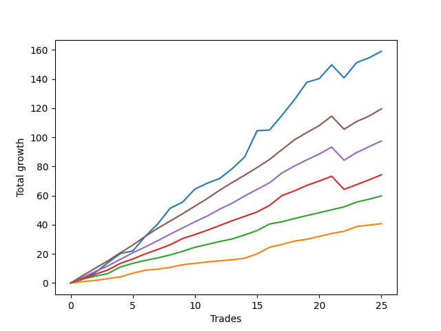

# Short Pointer 001 DB 
- Symbol: ES_SmolBoi
- Date Range: 03/18/2022 - 07/29/2022
- Trading Period: 7:20-12:30
- Number of Trades: 24



| Name | Win Percent | Profit | Avg Profit / Trade | Avg Time / Trade |      | Name | Win Percent | Profit | Avg Profit / Trade | Avg Time / Trade |
| ---- | ----------- | ------ | ------------------ | ---------------- | ---- | ---- | ----------- | ------ | ------------------ | ---------------- |
| Sorted By <br> Profit | | | | | | Sorted By <br> Win Percentage ||||
| Seven | 83.33 | 79375.00 | 3307.29 | 35:53 |     | Eighty-Two | 100.00 | 28875.00 | 1203.12 | 03:06 |
| Two | 95.83 | 77875.00 | 3244.79 | 13:06 |     | Eighty-One | 100.00 | 19375.00 | 807.29 | 01:44 |
| NEWFI 0000 | 83.33 | 76125.00 | 3171.88 | 31:20 |     | Two | 95.83 | 77875.00 | 3244.79 | 13:06 |
| Five | 83.33 | 71500.00 | 2979.17 | 31:11 |     | Eighty-Five | 95.83 | 48000.00 | 2000.00 | 11:33 |
| Four | 91.67 | 70000.00 | 2916.67 | 19:43 |     | One | 95.83 | 47500.00 | 1979.17 | 07:05 |
| Three | 91.67 | 53875.00 | 2244.79 | 11:32 |     | Eighty-Four | 95.83 | 37250.00 | 1552.08 | 07:53 |
| Eighty-Five | 95.83 | 48000.00 | 2000.00 | 11:33 |     | Eighty-Three | 95.83 | 26375.00 | 1098.96 | 06:28 |
| One | 95.83 | 47500.00 | 1979.17 | 07:05 |     | Four | 91.67 | 70000.00 | 2916.67 | 19:43 |
| Six | 91.67 | 45375.00 | 1890.62 | 10:37 |     | Three | 91.67 | 53875.00 | 2244.79 | 11:32 |
| Eighty-Four | 95.83 | 37250.00 | 1552.08 | 07:53 |     | Six | 91.67 | 45375.00 | 1890.62 | 10:37 |
| Eighty-Two | 100.00 | 28875.00 | 1203.12 | 03:06 |     | Zero | 87.50 | 23750.00 | 989.58 | 04:00 |
| Eighty-Three | 95.83 | 26375.00 | 1098.96 | 06:28 |     | Seven | 83.33 | 79375.00 | 3307.29 | 35:53 |
| Zero | 87.50 | 23750.00 | 989.58 | 04:00 |     | NEWFI 0000 | 83.33 | 76125.00 | 3171.88 | 31:20 |
| Eighty-One | 100.00 | 19375.00 | 807.29 | 01:44 |     | Five | 83.33 | 71500.00 | 2979.17 | 31:11 |

## NO STOPLOSS

### Test Zero
* Sell when price hits the middle line of the 20p bollinger
* No Stoploss
* Results:
```
Total Trades: 24
Percent Up: 12.50
Percent Down: 87.50
Total Points Moved Down: 47.50
Potential Profit: 23750.00
Total Points Ups: 12.50 Count Ups: 3
Total Points Downs: 60.00 Count Downs: 21
```

<details><summary>Trades</summary>

<code>In: 2022-03-25 11:57:00		Out: 2022-03-25 11:57:15		Total Position Time: 00:15		Total Move Down: 0.25		Total to Date: 0.25</code> <br />
<code>In: 2022-03-29 08:52:00		Out: 2022-03-29 08:56:15		Total Position Time: 04:15		Total Move Down: 1.00		Total to Date: 1.25</code> <br />
<code>In: 2022-03-31 12:05:00		Out: 2022-03-31 12:11:35		Total Position Time: 06:35		Total Move Down: 3.00		Total to Date: 4.25</code> <br />
<code>In: 2022-04-18 10:59:00		Out: 2022-04-18 10:59:30		Total Position Time: 00:30		Total Move Down: 4.50		Total to Date: 8.75</code> <br />
<code>In: 2022-04-25 09:28:00		Out: 2022-04-25 09:31:05		Total Position Time: 03:05		Total Move Down: 3.25		Total to Date: 12.00</code> <br />
<code>In: 2022-04-25 09:53:00		Out: 2022-04-25 09:53:10		Total Position Time: 00:10		Total Move Down: -0.50		Total to Date: 11.50</code> <br />
<code>In: 2022-04-26 09:31:00		Out: 2022-04-26 09:37:10		Total Position Time: 06:10		Total Move Down: 2.50		Total to Date: 14.00</code> <br />
<code>In: 2022-05-24 09:18:00		Out: 2022-05-24 09:21:35		Total Position Time: 03:35		Total Move Down: 4.75		Total to Date: 18.75</code> <br />
<code>In: 2022-06-01 12:19:00		Out: 2022-06-01 12:25:25		Total Position Time: 06:25		Total Move Down: 1.00		Total to Date: 19.75</code> <br />
<code>In: 2022-06-09 08:47:00		Out: 2022-06-09 08:48:20		Total Position Time: 01:20		Total Move Down: 2.75		Total to Date: 22.50</code> <br />
<code>In: 2022-06-09 09:46:00		Out: 2022-06-09 09:49:20		Total Position Time: 03:20		Total Move Down: 2.00		Total to Date: 24.50</code> <br />
<code>In: 2022-06-09 10:08:00		Out: 2022-06-09 10:16:15		Total Position Time: 08:15		Total Move Down: 0.75		Total to Date: 25.25</code> <br />
<code>In: 2022-06-10 11:26:00		Out: 2022-06-10 11:28:25		Total Position Time: 02:25		Total Move Down: 5.25		Total to Date: 30.50</code> <br />
<code>In: 2022-06-13 08:42:00		Out: 2022-06-13 08:47:40		Total Position Time: 05:40		Total Move Down: 2.75		Total to Date: 33.25</code> <br />
<code>In: 2022-06-13 09:41:00		Out: 2022-06-13 09:43:15		Total Position Time: 02:15		Total Move Down: 7.75		Total to Date: 41.00</code> <br />
<code>In: 2022-06-15 09:19:00		Out: 2022-06-15 09:19:10		Total Position Time: 00:10		Total Move Down: 4.50		Total to Date: 45.50</code> <br />
<code>In: 2022-06-15 11:02:00		Out: 2022-06-15 11:02:10		Total Position Time: 00:10		Total Move Down: 2.00		Total to Date: 47.50</code> <br />
<code>In: 2022-06-16 08:30:00		Out: 2022-06-16 08:30:25		Total Position Time: 00:25		Total Move Down: 4.75		Total to Date: 52.25</code> <br />
<code>In: 2022-06-17 08:34:00		Out: 2022-06-17 08:35:05		Total Position Time: 01:05		Total Move Down: 1.50		Total to Date: 53.75</code> <br />
<code>In: 2022-06-29 12:20:00		Out: 2022-06-29 12:33:20		Total Position Time: 13:20		Total Move Down: -2.25		Total to Date: 51.50</code> <br />
<code>In: 2022-07-01 10:35:00		Out: 2022-07-01 10:58:45		Total Position Time: 23:45		Total Move Down: -9.75		Total to Date: 41.75</code> <br />
<code>In: 2022-07-06 11:10:00		Out: 2022-07-06 11:10:10		Total Position Time: 00:10		Total Move Down: 3.25		Total to Date: 45.00</code> <br />
<code>In: 2022-07-18 09:01:00		Out: 2022-07-18 09:01:30		Total Position Time: 00:30		Total Move Down: 0.25		Total to Date: 45.25</code> <br />
<code>In: 2022-07-26 10:13:00		Out: 2022-07-26 10:15:10		Total Position Time: 02:10		Total Move Down: 2.25		Total to Date: 47.50</code> <br />


</details>

### Test One
* Sell when the price hits the upper line of the 20p 1std bollinger
* No Stoploss
* Results:
```
Total Trades: 24
Percent Up: 4.17
Percent Down: 95.83
Total Points Moved Down: 95.00
Potential Profit: 47500.00
Total Points Ups: 9.75 Count Ups: 1
Total Points Downs: 104.75 Count Downs: 23
```

<details><summary>Trades</summary>

<code>In: 2022-03-25 11:57:00		Out: 2022-03-25 12:00:45		Total Position Time: 03:45		Total Move Down: 1.75		Total to Date: 1.75</code> <br />
<code>In: 2022-03-29 08:52:00		Out: 2022-03-29 08:58:40		Total Position Time: 06:40		Total Move Down: 3.00		Total to Date: 4.75</code> <br />
<code>In: 2022-03-31 12:05:00		Out: 2022-03-31 12:16:00		Total Position Time: 11:00		Total Move Down: 4.75		Total to Date: 9.50</code> <br />
<code>In: 2022-04-18 10:59:00		Out: 2022-04-18 11:06:20		Total Position Time: 07:20		Total Move Down: 3.75		Total to Date: 13.25</code> <br />
<code>In: 2022-04-25 09:28:00		Out: 2022-04-25 09:42:35		Total Position Time: 14:35		Total Move Down: 0.75		Total to Date: 14.00</code> <br />
<code>In: 2022-04-25 09:53:00		Out: 2022-04-25 09:55:05		Total Position Time: 02:05		Total Move Down: 3.50		Total to Date: 17.50</code> <br />
<code>In: 2022-04-26 09:31:00		Out: 2022-04-26 09:38:00		Total Position Time: 07:00		Total Move Down: 6.25		Total to Date: 23.75</code> <br />
<code>In: 2022-05-24 09:18:00		Out: 2022-05-24 09:28:55		Total Position Time: 10:55		Total Move Down: 6.25		Total to Date: 30.00</code> <br />
<code>In: 2022-06-01 12:19:00		Out: 2022-06-01 12:25:45		Total Position Time: 06:45		Total Move Down: 2.00		Total to Date: 32.00</code> <br />
<code>In: 2022-06-09 08:47:00		Out: 2022-06-09 08:49:35		Total Position Time: 02:35		Total Move Down: 7.00		Total to Date: 39.00</code> <br />
<code>In: 2022-06-09 09:46:00		Out: 2022-06-09 09:54:45		Total Position Time: 08:45		Total Move Down: 2.25		Total to Date: 41.25</code> <br />
<code>In: 2022-06-09 10:08:00		Out: 2022-06-09 10:18:10		Total Position Time: 10:10		Total Move Down: 1.75		Total to Date: 43.00</code> <br />
<code>In: 2022-06-10 11:26:00		Out: 2022-06-10 11:28:35		Total Position Time: 02:35		Total Move Down: 7.25		Total to Date: 50.25</code> <br />
<code>In: 2022-06-13 08:42:00		Out: 2022-06-13 08:52:05		Total Position Time: 10:05		Total Move Down: 6.75		Total to Date: 57.00</code> <br />
<code>In: 2022-06-13 09:41:00		Out: 2022-06-13 09:47:50		Total Position Time: 06:50		Total Move Down: 13.25		Total to Date: 70.25</code> <br />
<code>In: 2022-06-15 09:19:00		Out: 2022-06-15 09:19:10		Total Position Time: 00:10		Total Move Down: 4.50		Total to Date: 74.75</code> <br />
<code>In: 2022-06-15 11:02:00		Out: 2022-06-15 11:02:10		Total Position Time: 00:10		Total Move Down: 2.00		Total to Date: 76.75</code> <br />
<code>In: 2022-06-16 08:30:00		Out: 2022-06-16 08:30:55		Total Position Time: 00:55		Total Move Down: 8.00		Total to Date: 84.75</code> <br />
<code>In: 2022-06-17 08:34:00		Out: 2022-06-17 08:39:00		Total Position Time: 05:00		Total Move Down: 6.75		Total to Date: 91.50</code> <br />
<code>In: 2022-06-29 12:20:00		Out: 2022-06-29 12:34:10		Total Position Time: 14:10		Total Move Down: 0.25		Total to Date: 91.75</code> <br />
<code>In: 2022-07-01 10:35:00		Out: 2022-07-01 11:04:25		Total Position Time: 29:25		Total Move Down: -9.75		Total to Date: 82.00</code> <br />
<code>In: 2022-07-06 11:10:00		Out: 2022-07-06 11:11:10		Total Position Time: 01:10		Total Move Down: 7.50		Total to Date: 89.50</code> <br />
<code>In: 2022-07-18 09:01:00		Out: 2022-07-18 09:05:10		Total Position Time: 04:10		Total Move Down: 1.50		Total to Date: 91.00</code> <br />
<code>In: 2022-07-26 10:13:00		Out: 2022-07-26 10:17:00		Total Position Time: 04:00		Total Move Down: 4.00		Total to Date: 95.00</code> <br />


</details>

### Test Two
* Sell when the price hits the upper line of the 20p 2std bollinger
* No Stoploss
* Results:
```
Total Trades: 24
Percent Up: 4.17
Percent Down: 95.83
Total Points Moved Down: 155.75
Potential Profit: 77875.00
Total Points Ups: 7.50 Count Ups: 1
Total Points Downs: 163.25 Count Downs: 23
```

<details><summary>Trades</summary>

<code>In: 2022-03-25 11:57:00		Out: 2022-03-25 12:00:55		Total Position Time: 03:55		Total Move Down: 2.75		Total to Date: 2.75</code> <br />
<code>In: 2022-03-29 08:52:00		Out: 2022-03-29 09:01:40		Total Position Time: 09:40		Total Move Down: 4.50		Total to Date: 7.25</code> <br />
<code>In: 2022-03-31 12:05:00		Out: 2022-03-31 12:19:35		Total Position Time: 14:35		Total Move Down: 6.75		Total to Date: 14.00</code> <br />
<code>In: 2022-04-18 10:59:00		Out: 2022-04-18 11:10:40		Total Position Time: 11:40		Total Move Down: 6.25		Total to Date: 20.25</code> <br />
<code>In: 2022-04-25 09:28:00		Out: 2022-04-25 10:01:20		Total Position Time: 33:20		Total Move Down: 6.50		Total to Date: 26.75</code> <br />
<code>In: 2022-04-25 09:53:00		Out: 2022-04-25 10:01:20		Total Position Time: 08:20		Total Move Down: 10.00		Total to Date: 36.75</code> <br />
<code>In: 2022-04-26 09:31:00		Out: 2022-04-26 09:40:15		Total Position Time: 09:15		Total Move Down: 8.50		Total to Date: 45.25</code> <br />
<code>In: 2022-05-24 09:18:00		Out: 2022-05-24 09:31:20		Total Position Time: 13:20		Total Move Down: 10.75		Total to Date: 56.00</code> <br />
<code>In: 2022-06-01 12:19:00		Out: 2022-06-01 12:30:05		Total Position Time: 11:05		Total Move Down: 4.25		Total to Date: 60.25</code> <br />
<code>In: 2022-06-09 08:47:00		Out: 2022-06-09 09:11:05		Total Position Time: 24:05		Total Move Down: 9.00		Total to Date: 69.25</code> <br />
<code>In: 2022-06-09 09:46:00		Out: 2022-06-09 09:55:00		Total Position Time: 09:00		Total Move Down: 4.00		Total to Date: 73.25</code> <br />
<code>In: 2022-06-09 10:08:00		Out: 2022-06-09 10:18:55		Total Position Time: 10:55		Total Move Down: 3.25		Total to Date: 76.50</code> <br />
<code>In: 2022-06-10 11:26:00		Out: 2022-06-10 11:40:10		Total Position Time: 14:10		Total Move Down: 6.75		Total to Date: 83.25</code> <br />
<code>In: 2022-06-13 08:42:00		Out: 2022-06-13 08:54:20		Total Position Time: 12:20		Total Move Down: 8.00		Total to Date: 91.25</code> <br />
<code>In: 2022-06-13 09:41:00		Out: 2022-06-13 09:54:20		Total Position Time: 13:20		Total Move Down: 18.00		Total to Date: 109.25</code> <br />
<code>In: 2022-06-15 09:19:00		Out: 2022-06-15 09:34:05		Total Position Time: 15:05		Total Move Down: 0.50		Total to Date: 109.75</code> <br />
<code>In: 2022-06-15 11:02:00		Out: 2022-06-15 11:03:05		Total Position Time: 01:05		Total Move Down: 10.00		Total to Date: 119.75</code> <br />
<code>In: 2022-06-16 08:30:00		Out: 2022-06-16 08:41:25		Total Position Time: 11:25		Total Move Down: 10.75		Total to Date: 130.50</code> <br />
<code>In: 2022-06-17 08:34:00		Out: 2022-06-17 08:45:15		Total Position Time: 11:15		Total Move Down: 12.00		Total to Date: 142.50</code> <br />
<code>In: 2022-06-29 12:20:00		Out: 2022-06-29 12:35:20		Total Position Time: 15:20		Total Move Down: 2.50		Total to Date: 145.00</code> <br />
<code>In: 2022-07-01 10:35:00		Out: 2022-07-01 11:07:55		Total Position Time: 32:55		Total Move Down: -7.50		Total to Date: 137.50</code> <br />
<code>In: 2022-07-06 11:10:00		Out: 2022-07-06 11:11:45		Total Position Time: 01:45		Total Move Down: 10.50		Total to Date: 148.00</code> <br />
<code>In: 2022-07-18 09:01:00		Out: 2022-07-18 09:08:15		Total Position Time: 07:15		Total Move Down: 3.25		Total to Date: 151.25</code> <br />
<code>In: 2022-07-26 10:13:00		Out: 2022-07-26 10:32:35		Total Position Time: 19:35		Total Move Down: 4.50		Total to Date: 155.75</code> <br />


</details>

### Test Three
* Sell when price hits the middle line of the 50p bollinger
* No Stoploss
* Results:
```
Total Trades: 24
Percent Up: 8.33
Percent Down: 91.67
Total Points Moved Down: 107.75
Potential Profit: 53875.00
Total Points Ups: 5.50 Count Ups: 2
Total Points Downs: 113.25 Count Downs: 22
```

<details><summary>Trades</summary>

<code>In: 2022-03-25 11:57:00		Out: 2022-03-25 12:00:45		Total Position Time: 03:45		Total Move Down: 1.75		Total to Date: 1.75</code> <br />
<code>In: 2022-03-29 08:52:00		Out: 2022-03-29 09:01:25		Total Position Time: 09:25		Total Move Down: 3.50		Total to Date: 5.25</code> <br />
<code>In: 2022-03-31 12:05:00		Out: 2022-03-31 12:16:40		Total Position Time: 11:40		Total Move Down: 5.25		Total to Date: 10.50</code> <br />
<code>In: 2022-04-18 10:59:00		Out: 2022-04-18 11:16:30		Total Position Time: 17:30		Total Move Down: 6.25		Total to Date: 16.75</code> <br />
<code>In: 2022-04-25 09:28:00		Out: 2022-04-25 09:55:05		Total Position Time: 27:05		Total Move Down: -0.00		Total to Date: 16.75</code> <br />
<code>In: 2022-04-25 09:53:00		Out: 2022-04-25 09:55:05		Total Position Time: 02:05		Total Move Down: 3.50		Total to Date: 20.25</code> <br />
<code>In: 2022-04-26 09:31:00		Out: 2022-04-26 09:46:10		Total Position Time: 15:10		Total Move Down: 10.00		Total to Date: 30.25</code> <br />
<code>In: 2022-05-24 09:18:00		Out: 2022-05-24 09:31:15		Total Position Time: 13:15		Total Move Down: 9.00		Total to Date: 39.25</code> <br />
<code>In: 2022-06-01 12:19:00		Out: 2022-06-01 12:25:30		Total Position Time: 06:30		Total Move Down: 1.75		Total to Date: 41.00</code> <br />
<code>In: 2022-06-09 08:47:00		Out: 2022-06-09 08:48:40		Total Position Time: 01:40		Total Move Down: 3.50		Total to Date: 44.50</code> <br />
<code>In: 2022-06-09 09:46:00		Out: 2022-06-09 09:55:50		Total Position Time: 09:50		Total Move Down: 5.50		Total to Date: 50.00</code> <br />
<code>In: 2022-06-09 10:08:00		Out: 2022-06-09 10:22:05		Total Position Time: 14:05		Total Move Down: 4.75		Total to Date: 54.75</code> <br />
<code>In: 2022-06-10 11:26:00		Out: 2022-06-10 11:28:30		Total Position Time: 02:30		Total Move Down: 6.50		Total to Date: 61.25</code> <br />
<code>In: 2022-06-13 08:42:00		Out: 2022-06-13 09:07:15		Total Position Time: 25:15		Total Move Down: 3.00		Total to Date: 64.25</code> <br />
<code>In: 2022-06-13 09:41:00		Out: 2022-06-13 09:47:50		Total Position Time: 06:50		Total Move Down: 13.25		Total to Date: 77.50</code> <br />
<code>In: 2022-06-15 09:19:00		Out: 2022-06-15 09:35:10		Total Position Time: 16:10		Total Move Down: 2.75		Total to Date: 80.25</code> <br />
<code>In: 2022-06-15 11:02:00		Out: 2022-06-15 11:02:10		Total Position Time: 00:10		Total Move Down: 2.00		Total to Date: 82.25</code> <br />
<code>In: 2022-06-16 08:30:00		Out: 2022-06-16 08:36:10		Total Position Time: 06:10		Total Move Down: 10.25		Total to Date: 92.50</code> <br />
<code>In: 2022-06-17 08:34:00		Out: 2022-06-17 08:45:00		Total Position Time: 11:00		Total Move Down: 9.00		Total to Date: 101.50</code> <br />
<code>In: 2022-06-29 12:20:00		Out: 2022-06-29 12:34:15		Total Position Time: 14:15		Total Move Down: 2.00		Total to Date: 103.50</code> <br />
<code>In: 2022-07-01 10:35:00		Out: 2022-07-01 11:10:55		Total Position Time: 35:55		Total Move Down: -5.50		Total to Date: 98.00</code> <br />
<code>In: 2022-07-06 11:10:00		Out: 2022-07-06 11:10:20		Total Position Time: 00:20		Total Move Down: 3.50		Total to Date: 101.50</code> <br />
<code>In: 2022-07-18 09:01:00		Out: 2022-07-18 09:08:15		Total Position Time: 07:15		Total Move Down: 3.25		Total to Date: 104.75</code> <br />
<code>In: 2022-07-26 10:13:00		Out: 2022-07-26 10:32:10		Total Position Time: 19:10		Total Move Down: 3.00		Total to Date: 107.75</code> <br />


</details>

### Test Four
* Sell when the price hits the upper line of the 50p 1std bollinger
* No Stoploss
* Results:
```
Total Trades: 24
Percent Up: 8.33
Percent Down: 91.67
Total Points Moved Down: 140.00
Potential Profit: 70000.00
Total Points Ups: 44.50 Count Ups: 2
Total Points Downs: 184.50 Count Downs: 22
```

<details><summary>Trades</summary>

<code>In: 2022-03-25 11:57:00		Out: 2022-03-25 12:01:35		Total Position Time: 04:35		Total Move Down: 3.75		Total to Date: 3.75</code> <br />
<code>In: 2022-03-29 08:52:00		Out: 2022-03-29 09:02:15		Total Position Time: 10:15		Total Move Down: 7.50		Total to Date: 11.25</code> <br />
<code>In: 2022-03-31 12:05:00		Out: 2022-03-31 12:20:15		Total Position Time: 15:15		Total Move Down: 8.25		Total to Date: 19.50</code> <br />
<code>In: 2022-04-18 10:59:00		Out: 2022-04-18 11:18:10		Total Position Time: 19:10		Total Move Down: 11.75		Total to Date: 31.25</code> <br />
<code>In: 2022-04-25 09:28:00		Out: 2022-04-25 10:01:15		Total Position Time: 33:15		Total Move Down: 4.00		Total to Date: 35.25</code> <br />
<code>In: 2022-04-25 09:53:00		Out: 2022-04-25 10:01:15		Total Position Time: 08:15		Total Move Down: 7.50		Total to Date: 42.75</code> <br />
<code>In: 2022-04-26 09:31:00		Out: 2022-04-26 10:02:50		Total Position Time: 31:50		Total Move Down: 9.50		Total to Date: 52.25</code> <br />
<code>In: 2022-05-24 09:18:00		Out: 2022-05-24 09:33:20		Total Position Time: 15:20		Total Move Down: 15.50		Total to Date: 67.75</code> <br />
<code>In: 2022-06-01 12:19:00		Out: 2022-06-01 12:31:00		Total Position Time: 12:00		Total Move Down: 5.00		Total to Date: 72.75</code> <br />
<code>In: 2022-06-09 08:47:00		Out: 2022-06-09 08:50:20		Total Position Time: 03:20		Total Move Down: 8.25		Total to Date: 81.00</code> <br />
<code>In: 2022-06-09 09:46:00		Out: 2022-06-09 10:23:50		Total Position Time: 37:50		Total Move Down: 2.00		Total to Date: 83.00</code> <br />
<code>In: 2022-06-09 10:08:00		Out: 2022-06-09 10:23:50		Total Position Time: 15:50		Total Move Down: 8.00		Total to Date: 91.00</code> <br />
<code>In: 2022-06-10 11:26:00		Out: 2022-06-10 11:41:45		Total Position Time: 15:45		Total Move Down: 10.00		Total to Date: 101.00</code> <br />
<code>In: 2022-06-13 08:42:00		Out: 2022-06-13 09:41:55		Total Position Time: 59:55		Total Move Down: -17.25		Total to Date: 83.75</code> <br />
<code>In: 2022-06-13 09:41:00		Out: 2022-06-13 09:54:40		Total Position Time: 13:40		Total Move Down: 19.50		Total to Date: 103.25</code> <br />
<code>In: 2022-06-15 09:19:00		Out: 2022-06-15 09:39:25		Total Position Time: 20:25		Total Move Down: 5.25		Total to Date: 108.50</code> <br />
<code>In: 2022-06-15 11:02:00		Out: 2022-06-15 11:03:00		Total Position Time: 01:00		Total Move Down: 6.75		Total to Date: 115.25</code> <br />
<code>In: 2022-06-16 08:30:00		Out: 2022-06-16 08:42:25		Total Position Time: 12:25		Total Move Down: 17.00		Total to Date: 132.25</code> <br />
<code>In: 2022-06-17 08:34:00		Out: 2022-06-17 08:51:15		Total Position Time: 17:15		Total Move Down: 12.25		Total to Date: 144.50</code> <br />
<code>In: 2022-06-29 12:20:00		Out: 2022-06-29 12:41:00		Total Position Time: 21:00		Total Move Down: 4.75		Total to Date: 149.25</code> <br />
<code>In: 2022-07-01 10:35:00		Out: 2022-07-01 11:34:55		Total Position Time: 59:55		Total Move Down: -27.25		Total to Date: 122.00</code> <br />
<code>In: 2022-07-06 11:10:00		Out: 2022-07-06 11:11:35		Total Position Time: 01:35		Total Move Down: 8.75		Total to Date: 130.75</code> <br />
<code>In: 2022-07-18 09:01:00		Out: 2022-07-18 09:19:25		Total Position Time: 18:25		Total Move Down: 4.00		Total to Date: 134.75</code> <br />
<code>In: 2022-07-26 10:13:00		Out: 2022-07-26 10:38:20		Total Position Time: 25:20		Total Move Down: 5.25		Total to Date: 140.00</code> <br />


</details>

### Test Five
* Sell when the price hits the upper line of the 50p 2std bollinger
* No Stoploss
* Results:
```
Total Trades: 24
Percent Up: 16.67
Percent Down: 83.33
Total Points Moved Down: 143.00
Potential Profit: 71500.00
Total Points Ups: 62.00 Count Ups: 4
Total Points Downs: 205.00 Count Downs: 20
```

<details><summary>Trades</summary>

<code>In: 2022-03-25 11:57:00		Out: 2022-03-25 12:01:55		Total Position Time: 04:55		Total Move Down: 5.25		Total to Date: 5.25</code> <br />
<code>In: 2022-03-29 08:52:00		Out: 2022-03-29 09:10:50		Total Position Time: 18:50		Total Move Down: 9.75		Total to Date: 15.00</code> <br />
<code>In: 2022-03-31 12:05:00		Out: 2022-03-31 12:24:15		Total Position Time: 19:15		Total Move Down: 13.75		Total to Date: 28.75</code> <br />
<code>In: 2022-04-18 10:59:00		Out: 2022-04-18 11:47:00		Total Position Time: 48:00		Total Move Down: 10.25		Total to Date: 39.00</code> <br />
<code>In: 2022-04-25 09:28:00		Out: 2022-04-25 10:27:55		Total Position Time: 59:55		Total Move Down: -5.25		Total to Date: 33.75</code> <br />
<code>In: 2022-04-25 09:53:00		Out: 2022-04-25 10:52:55		Total Position Time: 59:55		Total Move Down: 1.00		Total to Date: 34.75</code> <br />
<code>In: 2022-04-26 09:31:00		Out: 2022-04-26 10:14:40		Total Position Time: 43:40		Total Move Down: 15.50		Total to Date: 50.25</code> <br />
<code>In: 2022-05-24 09:18:00		Out: 2022-05-24 09:36:50		Total Position Time: 18:50		Total Move Down: 20.50		Total to Date: 70.75</code> <br />
<code>In: 2022-06-01 12:19:00		Out: 2022-06-01 12:46:00		Total Position Time: 27:00		Total Move Down: 1.25		Total to Date: 72.00</code> <br />
<code>In: 2022-06-09 08:47:00		Out: 2022-06-09 09:11:10		Total Position Time: 24:10		Total Move Down: 10.00		Total to Date: 82.00</code> <br />
<code>In: 2022-06-09 09:46:00		Out: 2022-06-09 10:27:20		Total Position Time: 41:20		Total Move Down: 5.50		Total to Date: 87.50</code> <br />
<code>In: 2022-06-09 10:08:00		Out: 2022-06-09 10:27:20		Total Position Time: 19:20		Total Move Down: 11.50		Total to Date: 99.00</code> <br />
<code>In: 2022-06-10 11:26:00		Out: 2022-06-10 12:25:55		Total Position Time: 59:55		Total Move Down: -12.25		Total to Date: 86.75</code> <br />
<code>In: 2022-06-13 08:42:00		Out: 2022-06-13 09:41:55		Total Position Time: 59:55		Total Move Down: -17.25		Total to Date: 69.50</code> <br />
<code>In: 2022-06-13 09:41:00		Out: 2022-06-13 09:58:05		Total Position Time: 17:05		Total Move Down: 25.00		Total to Date: 94.50</code> <br />
<code>In: 2022-06-15 09:19:00		Out: 2022-06-15 09:41:45		Total Position Time: 22:45		Total Move Down: 8.50		Total to Date: 103.00</code> <br />
<code>In: 2022-06-15 11:02:00		Out: 2022-06-15 11:03:05		Total Position Time: 01:05		Total Move Down: 10.00		Total to Date: 113.00</code> <br />
<code>In: 2022-06-16 08:30:00		Out: 2022-06-16 09:07:40		Total Position Time: 37:40		Total Move Down: 17.00		Total to Date: 130.00</code> <br />
<code>In: 2022-06-17 08:34:00		Out: 2022-06-17 08:52:05		Total Position Time: 18:05		Total Move Down: 17.50		Total to Date: 147.50</code> <br />
<code>In: 2022-06-29 12:20:00		Out: 2022-06-29 12:46:00		Total Position Time: 26:00		Total Move Down: 1.50		Total to Date: 149.00</code> <br />
<code>In: 2022-07-01 10:35:00		Out: 2022-07-01 11:34:55		Total Position Time: 59:55		Total Move Down: -27.25		Total to Date: 121.75</code> <br />
<code>In: 2022-07-06 11:10:00		Out: 2022-07-06 11:11:50		Total Position Time: 01:50		Total Move Down: 10.50		Total to Date: 132.25</code> <br />
<code>In: 2022-07-18 09:01:00		Out: 2022-07-18 09:26:05		Total Position Time: 25:05		Total Move Down: 3.50		Total to Date: 135.75</code> <br />
<code>In: 2022-07-26 10:13:00		Out: 2022-07-26 10:47:00		Total Position Time: 34:00		Total Move Down: 7.25		Total to Date: 143.00</code> <br />


</details>

### Test Six
* Sell when the price hits the middle line of the 1std VWAP
* No Stoploss
* Results:
```
Total Trades: 24
Percent Up: 8.33
Percent Down: 91.67
Total Points Moved Down: 90.75
Potential Profit: 45375.00
Total Points Ups: 27.50 Count Ups: 2
Total Points Downs: 118.25 Count Downs: 22
```

<details><summary>Trades</summary>

<code>In: 2022-03-25 11:57:00		Out: 2022-03-25 12:07:35		Total Position Time: 10:35		Total Move Down: 11.00		Total to Date: 11.00</code> <br />
<code>In: 2022-03-29 08:52:00		Out: 2022-03-29 09:02:10		Total Position Time: 10:10		Total Move Down: 6.00		Total to Date: 17.00</code> <br />
<code>In: 2022-03-31 12:05:00		Out: 2022-03-31 12:05:10		Total Position Time: 00:10		Total Move Down: 0.50		Total to Date: 17.50</code> <br />
<code>In: 2022-04-18 10:59:00		Out: 2022-04-18 11:58:55		Total Position Time: 59:55		Total Move Down: 8.25		Total to Date: 25.75</code> <br />
<code>In: 2022-04-25 09:28:00		Out: 2022-04-25 09:31:05		Total Position Time: 03:05		Total Move Down: 3.25		Total to Date: 29.00</code> <br />
<code>In: 2022-04-25 09:53:00		Out: 2022-04-25 10:01:15		Total Position Time: 08:15		Total Move Down: 7.50		Total to Date: 36.50</code> <br />
<code>In: 2022-04-26 09:31:00		Out: 2022-04-26 09:31:10		Total Position Time: 00:10		Total Move Down: 0.75		Total to Date: 37.25</code> <br />
<code>In: 2022-05-24 09:18:00		Out: 2022-05-24 09:36:45		Total Position Time: 18:45		Total Move Down: 19.75		Total to Date: 57.00</code> <br />
<code>In: 2022-06-01 12:19:00		Out: 2022-06-01 12:46:00		Total Position Time: 27:00		Total Move Down: 1.25		Total to Date: 58.25</code> <br />
<code>In: 2022-06-09 08:47:00		Out: 2022-06-09 08:47:10		Total Position Time: 00:10		Total Move Down: -0.25		Total to Date: 58.00</code> <br />
<code>In: 2022-06-09 09:46:00		Out: 2022-06-09 09:48:20		Total Position Time: 02:20		Total Move Down: 1.50		Total to Date: 59.50</code> <br />
<code>In: 2022-06-09 10:08:00		Out: 2022-06-09 10:23:45		Total Position Time: 15:45		Total Move Down: 7.25		Total to Date: 66.75</code> <br />
<code>In: 2022-06-10 11:26:00		Out: 2022-06-10 11:28:30		Total Position Time: 02:30		Total Move Down: 6.50		Total to Date: 73.25</code> <br />
<code>In: 2022-06-13 08:42:00		Out: 2022-06-13 08:42:10		Total Position Time: 00:10		Total Move Down: 0.25		Total to Date: 73.50</code> <br />
<code>In: 2022-06-13 09:41:00		Out: 2022-06-13 09:54:45		Total Position Time: 13:45		Total Move Down: 20.50		Total to Date: 94.00</code> <br />
<code>In: 2022-06-15 09:19:00		Out: 2022-06-15 09:19:10		Total Position Time: 00:10		Total Move Down: 4.50		Total to Date: 98.50</code> <br />
<code>In: 2022-06-15 11:02:00		Out: 2022-06-15 11:02:10		Total Position Time: 00:10		Total Move Down: 2.00		Total to Date: 100.50</code> <br />
<code>In: 2022-06-16 08:30:00		Out: 2022-06-16 08:30:10		Total Position Time: 00:10		Total Move Down: 2.25		Total to Date: 102.75</code> <br />
<code>In: 2022-06-17 08:34:00		Out: 2022-06-17 08:36:10		Total Position Time: 02:10		Total Move Down: 3.50		Total to Date: 106.25</code> <br />
<code>In: 2022-06-29 12:20:00		Out: 2022-06-29 12:34:15		Total Position Time: 14:15		Total Move Down: 2.00		Total to Date: 108.25</code> <br />
<code>In: 2022-07-01 10:35:00		Out: 2022-07-01 11:34:55		Total Position Time: 59:55		Total Move Down: -27.25		Total to Date: 81.00</code> <br />
<code>In: 2022-07-06 11:10:00		Out: 2022-07-06 11:11:10		Total Position Time: 01:10		Total Move Down: 7.50		Total to Date: 88.50</code> <br />
<code>In: 2022-07-18 09:01:00		Out: 2022-07-18 09:05:10		Total Position Time: 04:10		Total Move Down: 1.50		Total to Date: 90.00</code> <br />
<code>In: 2022-07-26 10:13:00		Out: 2022-07-26 10:13:10		Total Position Time: 00:10		Total Move Down: 0.75		Total to Date: 90.75</code> <br />


</details>

### Test Seven
* Sell when the price hits the upper line of the 1std VWAP
* No Stoploss
* Results:
```
Total Trades: 24
Percent Up: 16.67
Percent Down: 83.33
Total Points Moved Down: 158.75
Potential Profit: 79375.00
Total Points Ups: 62.00 Count Ups: 4
Total Points Downs: 220.75 Count Downs: 20
```

<details><summary>Trades</summary>

<code>In: 2022-03-25 11:57:00		Out: 2022-03-25 12:33:10		Total Position Time: 36:10		Total Move Down: 20.50		Total to Date: 20.50</code> <br />
<code>In: 2022-03-29 08:52:00		Out: 2022-03-29 09:27:55		Total Position Time: 35:55		Total Move Down: 14.25		Total to Date: 34.75</code> <br />
<code>In: 2022-03-31 12:05:00		Out: 2022-03-31 12:11:55		Total Position Time: 06:55		Total Move Down: 3.00		Total to Date: 37.75</code> <br />
<code>In: 2022-04-18 10:59:00		Out: 2022-04-18 11:58:55		Total Position Time: 59:55		Total Move Down: 8.25		Total to Date: 46.00</code> <br />
<code>In: 2022-04-25 09:28:00		Out: 2022-04-25 10:27:55		Total Position Time: 59:55		Total Move Down: -5.25		Total to Date: 40.75</code> <br />
<code>In: 2022-04-25 09:53:00		Out: 2022-04-25 10:52:55		Total Position Time: 59:55		Total Move Down: 1.00		Total to Date: 41.75</code> <br />
<code>In: 2022-04-26 09:31:00		Out: 2022-04-26 10:14:15		Total Position Time: 43:15		Total Move Down: 14.50		Total to Date: 56.25</code> <br />
<code>In: 2022-05-24 09:18:00		Out: 2022-05-24 10:17:55		Total Position Time: 59:55		Total Move Down: 20.00		Total to Date: 76.25</code> <br />
<code>In: 2022-06-01 12:19:00		Out: 2022-06-01 12:46:00		Total Position Time: 27:00		Total Move Down: 1.25		Total to Date: 77.50</code> <br />
<code>In: 2022-06-09 08:47:00		Out: 2022-06-09 08:48:50		Total Position Time: 01:50		Total Move Down: 5.25		Total to Date: 82.75</code> <br />
<code>In: 2022-06-09 09:46:00		Out: 2022-06-09 10:30:30		Total Position Time: 44:30		Total Move Down: 9.25		Total to Date: 92.00</code> <br />
<code>In: 2022-06-09 10:08:00		Out: 2022-06-09 10:30:30		Total Position Time: 22:30		Total Move Down: 15.25		Total to Date: 107.25</code> <br />
<code>In: 2022-06-10 11:26:00		Out: 2022-06-10 12:25:55		Total Position Time: 59:55		Total Move Down: -12.25		Total to Date: 95.00</code> <br />
<code>In: 2022-06-13 08:42:00		Out: 2022-06-13 09:41:55		Total Position Time: 59:55		Total Move Down: -17.25		Total to Date: 77.75</code> <br />
<code>In: 2022-06-13 09:41:00		Out: 2022-06-13 10:26:50		Total Position Time: 45:50		Total Move Down: 35.75		Total to Date: 113.50</code> <br />
<code>In: 2022-06-15 09:19:00		Out: 2022-06-15 09:41:40		Total Position Time: 22:40		Total Move Down: 8.00		Total to Date: 121.50</code> <br />
<code>In: 2022-06-15 11:02:00		Out: 2022-06-15 11:02:10		Total Position Time: 00:10		Total Move Down: 2.00		Total to Date: 123.50</code> <br />
<code>In: 2022-06-16 08:30:00		Out: 2022-06-16 08:35:30		Total Position Time: 05:30		Total Move Down: 10.00		Total to Date: 133.50</code> <br />
<code>In: 2022-06-17 08:34:00		Out: 2022-06-17 09:03:15		Total Position Time: 29:15		Total Move Down: 22.50		Total to Date: 156.00</code> <br />
<code>In: 2022-06-29 12:20:00		Out: 2022-06-29 12:46:00		Total Position Time: 26:00		Total Move Down: 1.50		Total to Date: 157.50</code> <br />
<code>In: 2022-07-01 10:35:00		Out: 2022-07-01 11:34:55		Total Position Time: 59:55		Total Move Down: -27.25		Total to Date: 130.25</code> <br />
<code>In: 2022-07-06 11:10:00		Out: 2022-07-06 11:12:20		Total Position Time: 02:20		Total Move Down: 14.75		Total to Date: 145.00</code> <br />
<code>In: 2022-07-18 09:01:00		Out: 2022-07-18 09:49:15		Total Position Time: 48:15		Total Move Down: 6.00		Total to Date: 151.00</code> <br />
<code>In: 2022-07-26 10:13:00		Out: 2022-07-26 10:57:05		Total Position Time: 44:05		Total Move Down: 7.75		Total to Date: 158.75</code> <br />


</details>

## TAKE PROFIT

### Test Eighty-One
* Take Profit of 1 Point
* No Stoploss
* Results:
```
Total Trades: 24
Percent Up: 0.00
Percent Down: 100.00
Total Points Moved Down: 38.75
Potential Profit: 19375.00
Total Points Ups: 0.00 Count Ups: 0
Total Points Downs: 38.75 Count Downs: 24
```

<details><summary>Trades</summary>

<code>In: 2022-03-25 11:57:00		Out: 2022-03-25 11:58:45		Total Position Time: 01:45		Total Move Down: 1.00		Total to Date: 1.00</code> <br />
<code>In: 2022-03-29 08:52:00		Out: 2022-03-29 08:52:55		Total Position Time: 00:55		Total Move Down: 0.75		Total to Date: 1.75</code> <br />
<code>In: 2022-03-31 12:05:00		Out: 2022-03-31 12:05:25		Total Position Time: 00:25		Total Move Down: 1.25		Total to Date: 3.00</code> <br />
<code>In: 2022-04-18 10:59:00		Out: 2022-04-18 10:59:15		Total Position Time: 00:15		Total Move Down: 1.25		Total to Date: 4.25</code> <br />
<code>In: 2022-04-25 09:28:00		Out: 2022-04-25 09:28:30		Total Position Time: 00:30		Total Move Down: 2.50		Total to Date: 6.75</code> <br />
<code>In: 2022-04-25 09:53:00		Out: 2022-04-25 09:54:40		Total Position Time: 01:40		Total Move Down: 2.00		Total to Date: 8.75</code> <br />
<code>In: 2022-04-26 09:31:00		Out: 2022-04-26 09:31:55		Total Position Time: 00:55		Total Move Down: 0.75		Total to Date: 9.50</code> <br />
<code>In: 2022-05-24 09:18:00		Out: 2022-05-24 09:18:50		Total Position Time: 00:50		Total Move Down: 1.25		Total to Date: 10.75</code> <br />
<code>In: 2022-06-01 12:19:00		Out: 2022-06-01 12:25:30		Total Position Time: 06:30		Total Move Down: 1.75		Total to Date: 12.50</code> <br />
<code>In: 2022-06-09 08:47:00		Out: 2022-06-09 08:48:05		Total Position Time: 01:05		Total Move Down: 1.00		Total to Date: 13.50</code> <br />
<code>In: 2022-06-09 09:46:00		Out: 2022-06-09 09:47:25		Total Position Time: 01:25		Total Move Down: 1.00		Total to Date: 14.50</code> <br />
<code>In: 2022-06-09 10:08:00		Out: 2022-06-09 10:10:15		Total Position Time: 02:15		Total Move Down: 0.75		Total to Date: 15.25</code> <br />
<code>In: 2022-06-10 11:26:00		Out: 2022-06-10 11:26:20		Total Position Time: 00:20		Total Move Down: 0.75		Total to Date: 16.00</code> <br />
<code>In: 2022-06-13 08:42:00		Out: 2022-06-13 08:47:05		Total Position Time: 05:05		Total Move Down: 1.00		Total to Date: 17.00</code> <br />
<code>In: 2022-06-13 09:41:00		Out: 2022-06-13 09:41:10		Total Position Time: 00:10		Total Move Down: 3.00		Total to Date: 20.00</code> <br />
<code>In: 2022-06-15 09:19:00		Out: 2022-06-15 09:19:10		Total Position Time: 00:10		Total Move Down: 4.50		Total to Date: 24.50</code> <br />
<code>In: 2022-06-15 11:02:00		Out: 2022-06-15 11:02:10		Total Position Time: 00:10		Total Move Down: 2.00		Total to Date: 26.50</code> <br />
<code>In: 2022-06-16 08:30:00		Out: 2022-06-16 08:30:10		Total Position Time: 00:10		Total Move Down: 2.25		Total to Date: 28.75</code> <br />
<code>In: 2022-06-17 08:34:00		Out: 2022-06-17 08:34:55		Total Position Time: 00:55		Total Move Down: 1.25		Total to Date: 30.00</code> <br />
<code>In: 2022-06-29 12:20:00		Out: 2022-06-29 12:34:15		Total Position Time: 14:15		Total Move Down: 2.00		Total to Date: 32.00</code> <br />
<code>In: 2022-07-01 10:35:00		Out: 2022-07-01 10:35:30		Total Position Time: 00:30		Total Move Down: 1.50		Total to Date: 33.50</code> <br />
<code>In: 2022-07-06 11:10:00		Out: 2022-07-06 11:10:10		Total Position Time: 00:10		Total Move Down: 3.25		Total to Date: 36.75</code> <br />
<code>In: 2022-07-18 09:01:00		Out: 2022-07-18 09:02:05		Total Position Time: 01:05		Total Move Down: 1.00		Total to Date: 37.75</code> <br />
<code>In: 2022-07-26 10:13:00		Out: 2022-07-26 10:13:15		Total Position Time: 00:15		Total Move Down: 1.00		Total to Date: 38.75</code> <br />


</details>

### Test Eighty-Two
* Take Profit of 2 Point
* No Stoploss
* Results:
```
Total Trades: 24
Percent Up: 0.00
Percent Down: 100.00
Total Points Moved Down: 57.75
Potential Profit: 28875.00
Total Points Ups: 0.00 Count Ups: 0
Total Points Downs: 57.75 Count Downs: 24
```

<details><summary>Trades</summary>

<code>In: 2022-03-25 11:57:00		Out: 2022-03-25 12:00:50		Total Position Time: 03:50		Total Move Down: 2.75		Total to Date: 2.75</code> <br />
<code>In: 2022-03-29 08:52:00		Out: 2022-03-29 08:57:40		Total Position Time: 05:40		Total Move Down: 2.00		Total to Date: 4.75</code> <br />
<code>In: 2022-03-31 12:05:00		Out: 2022-03-31 12:11:15		Total Position Time: 06:15		Total Move Down: 1.75		Total to Date: 6.50</code> <br />
<code>In: 2022-04-18 10:59:00		Out: 2022-04-18 10:59:30		Total Position Time: 00:30		Total Move Down: 4.50		Total to Date: 11.00</code> <br />
<code>In: 2022-04-25 09:28:00		Out: 2022-04-25 09:28:30		Total Position Time: 00:30		Total Move Down: 2.50		Total to Date: 13.50</code> <br />
<code>In: 2022-04-25 09:53:00		Out: 2022-04-25 09:54:45		Total Position Time: 01:45		Total Move Down: 2.00		Total to Date: 15.50</code> <br />
<code>In: 2022-04-26 09:31:00		Out: 2022-04-26 09:32:00		Total Position Time: 01:00		Total Move Down: 1.75		Total to Date: 17.25</code> <br />
<code>In: 2022-05-24 09:18:00		Out: 2022-05-24 09:20:10		Total Position Time: 02:10		Total Move Down: 2.00		Total to Date: 19.25</code> <br />
<code>In: 2022-06-01 12:19:00		Out: 2022-06-01 12:25:40		Total Position Time: 06:40		Total Move Down: 2.50		Total to Date: 21.75</code> <br />
<code>In: 2022-06-09 08:47:00		Out: 2022-06-09 08:48:20		Total Position Time: 01:20		Total Move Down: 2.75		Total to Date: 24.50</code> <br />
<code>In: 2022-06-09 09:46:00		Out: 2022-06-09 09:49:20		Total Position Time: 03:20		Total Move Down: 2.00		Total to Date: 26.50</code> <br />
<code>In: 2022-06-09 10:08:00		Out: 2022-06-09 10:16:55		Total Position Time: 08:55		Total Move Down: 2.00		Total to Date: 28.50</code> <br />
<code>In: 2022-06-10 11:26:00		Out: 2022-06-10 11:26:30		Total Position Time: 00:30		Total Move Down: 1.75		Total to Date: 30.25</code> <br />
<code>In: 2022-06-13 08:42:00		Out: 2022-06-13 08:47:40		Total Position Time: 05:40		Total Move Down: 2.75		Total to Date: 33.00</code> <br />
<code>In: 2022-06-13 09:41:00		Out: 2022-06-13 09:41:10		Total Position Time: 00:10		Total Move Down: 3.00		Total to Date: 36.00</code> <br />
<code>In: 2022-06-15 09:19:00		Out: 2022-06-15 09:19:10		Total Position Time: 00:10		Total Move Down: 4.50		Total to Date: 40.50</code> <br />
<code>In: 2022-06-15 11:02:00		Out: 2022-06-15 11:02:45		Total Position Time: 00:45		Total Move Down: 1.50		Total to Date: 42.00</code> <br />
<code>In: 2022-06-16 08:30:00		Out: 2022-06-16 08:30:10		Total Position Time: 00:10		Total Move Down: 2.25		Total to Date: 44.25</code> <br />
<code>In: 2022-06-17 08:34:00		Out: 2022-06-17 08:35:15		Total Position Time: 01:15		Total Move Down: 2.00		Total to Date: 46.25</code> <br />
<code>In: 2022-06-29 12:20:00		Out: 2022-06-29 12:34:15		Total Position Time: 14:15		Total Move Down: 2.00		Total to Date: 48.25</code> <br />
<code>In: 2022-07-01 10:35:00		Out: 2022-07-01 10:35:40		Total Position Time: 00:40		Total Move Down: 2.00		Total to Date: 50.25</code> <br />
<code>In: 2022-07-06 11:10:00		Out: 2022-07-06 11:10:10		Total Position Time: 00:10		Total Move Down: 3.25		Total to Date: 53.50</code> <br />
<code>In: 2022-07-18 09:01:00		Out: 2022-07-18 09:07:55		Total Position Time: 06:55		Total Move Down: 2.00		Total to Date: 55.50</code> <br />
<code>In: 2022-07-26 10:13:00		Out: 2022-07-26 10:15:10		Total Position Time: 02:10		Total Move Down: 2.25		Total to Date: 57.75</code> <br />


</details>

### Test Eighty-Three
* Take Profit of 3 Point
* No Stoploss
* Results:
```
Total Trades: 24
Percent Up: 4.17
Percent Down: 95.83
Total Points Moved Down: 52.75
Potential Profit: 26375.00
Total Points Ups: 27.25 Count Ups: 1
Total Points Downs: 80.00 Count Downs: 23
```

<details><summary>Trades</summary>

<code>In: 2022-03-25 11:57:00		Out: 2022-03-25 12:01:00		Total Position Time: 04:00		Total Move Down: 3.00		Total to Date: 3.00</code> <br />
<code>In: 2022-03-29 08:52:00		Out: 2022-03-29 08:58:40		Total Position Time: 06:40		Total Move Down: 3.00		Total to Date: 6.00</code> <br />
<code>In: 2022-03-31 12:05:00		Out: 2022-03-31 12:11:35		Total Position Time: 06:35		Total Move Down: 3.00		Total to Date: 9.00</code> <br />
<code>In: 2022-04-18 10:59:00		Out: 2022-04-18 10:59:30		Total Position Time: 00:30		Total Move Down: 4.50		Total to Date: 13.50</code> <br />
<code>In: 2022-04-25 09:28:00		Out: 2022-04-25 09:31:00		Total Position Time: 03:00		Total Move Down: 3.00		Total to Date: 16.50</code> <br />
<code>In: 2022-04-25 09:53:00		Out: 2022-04-25 09:55:05		Total Position Time: 02:05		Total Move Down: 3.50		Total to Date: 20.00</code> <br />
<code>In: 2022-04-26 09:31:00		Out: 2022-04-26 09:32:05		Total Position Time: 01:05		Total Move Down: 3.00		Total to Date: 23.00</code> <br />
<code>In: 2022-05-24 09:18:00		Out: 2022-05-24 09:21:05		Total Position Time: 03:05		Total Move Down: 3.25		Total to Date: 26.25</code> <br />
<code>In: 2022-06-01 12:19:00		Out: 2022-06-01 12:30:05		Total Position Time: 11:05		Total Move Down: 4.25		Total to Date: 30.50</code> <br />
<code>In: 2022-06-09 08:47:00		Out: 2022-06-09 08:48:20		Total Position Time: 01:20		Total Move Down: 2.75		Total to Date: 33.25</code> <br />
<code>In: 2022-06-09 09:46:00		Out: 2022-06-09 09:54:55		Total Position Time: 08:55		Total Move Down: 3.00		Total to Date: 36.25</code> <br />
<code>In: 2022-06-09 10:08:00		Out: 2022-06-09 10:18:55		Total Position Time: 10:55		Total Move Down: 3.25		Total to Date: 39.50</code> <br />
<code>In: 2022-06-10 11:26:00		Out: 2022-06-10 11:26:55		Total Position Time: 00:55		Total Move Down: 3.25		Total to Date: 42.75</code> <br />
<code>In: 2022-06-13 08:42:00		Out: 2022-06-13 08:47:50		Total Position Time: 05:50		Total Move Down: 3.00		Total to Date: 45.75</code> <br />
<code>In: 2022-06-13 09:41:00		Out: 2022-06-13 09:41:10		Total Position Time: 00:10		Total Move Down: 3.00		Total to Date: 48.75</code> <br />
<code>In: 2022-06-15 09:19:00		Out: 2022-06-15 09:19:10		Total Position Time: 00:10		Total Move Down: 4.50		Total to Date: 53.25</code> <br />
<code>In: 2022-06-15 11:02:00		Out: 2022-06-15 11:03:00		Total Position Time: 01:00		Total Move Down: 6.75		Total to Date: 60.00</code> <br />
<code>In: 2022-06-16 08:30:00		Out: 2022-06-16 08:30:20		Total Position Time: 00:20		Total Move Down: 3.25		Total to Date: 63.25</code> <br />
<code>In: 2022-06-17 08:34:00		Out: 2022-06-17 08:35:45		Total Position Time: 01:45		Total Move Down: 3.75		Total to Date: 67.00</code> <br />
<code>In: 2022-06-29 12:20:00		Out: 2022-06-29 12:35:15		Total Position Time: 15:15		Total Move Down: 3.00		Total to Date: 70.00</code> <br />
<code>In: 2022-07-01 10:35:00		Out: 2022-07-01 11:34:55		Total Position Time: 59:55		Total Move Down: -27.25		Total to Date: 42.75</code> <br />
<code>In: 2022-07-06 11:10:00		Out: 2022-07-06 11:10:10		Total Position Time: 00:10		Total Move Down: 3.25		Total to Date: 46.00</code> <br />
<code>In: 2022-07-18 09:01:00		Out: 2022-07-18 09:08:15		Total Position Time: 07:15		Total Move Down: 3.25		Total to Date: 49.25</code> <br />
<code>In: 2022-07-26 10:13:00		Out: 2022-07-26 10:16:35		Total Position Time: 03:35		Total Move Down: 3.50		Total to Date: 52.75</code> <br />


</details>

### Test Eighty-Four
* Take Profit of 4 Point
* No Stoploss
* Results:
```
Total Trades: 24
Percent Up: 4.17
Percent Down: 95.83
Total Points Moved Down: 74.50
Potential Profit: 37250.00
Total Points Ups: 27.25 Count Ups: 1
Total Points Downs: 101.75 Count Downs: 23
```

<details><summary>Trades</summary>

<code>In: 2022-03-25 11:57:00		Out: 2022-03-25 12:01:45		Total Position Time: 04:45		Total Move Down: 4.00		Total to Date: 4.00</code> <br />
<code>In: 2022-03-29 08:52:00		Out: 2022-03-29 09:01:35		Total Position Time: 09:35		Total Move Down: 4.00		Total to Date: 8.00</code> <br />
<code>In: 2022-03-31 12:05:00		Out: 2022-03-31 12:12:45		Total Position Time: 07:45		Total Move Down: 3.75		Total to Date: 11.75</code> <br />
<code>In: 2022-04-18 10:59:00		Out: 2022-04-18 10:59:30		Total Position Time: 00:30		Total Move Down: 4.50		Total to Date: 16.25</code> <br />
<code>In: 2022-04-25 09:28:00		Out: 2022-04-25 09:31:10		Total Position Time: 03:10		Total Move Down: 4.50		Total to Date: 20.75</code> <br />
<code>In: 2022-04-25 09:53:00		Out: 2022-04-25 09:55:10		Total Position Time: 02:10		Total Move Down: 4.00		Total to Date: 24.75</code> <br />
<code>In: 2022-04-26 09:31:00		Out: 2022-04-26 09:37:35		Total Position Time: 06:35		Total Move Down: 4.25		Total to Date: 29.00</code> <br />
<code>In: 2022-05-24 09:18:00		Out: 2022-05-24 09:21:15		Total Position Time: 03:15		Total Move Down: 4.50		Total to Date: 33.50</code> <br />
<code>In: 2022-06-01 12:19:00		Out: 2022-06-01 12:30:05		Total Position Time: 11:05		Total Move Down: 4.25		Total to Date: 37.75</code> <br />
<code>In: 2022-06-09 08:47:00		Out: 2022-06-09 08:48:35		Total Position Time: 01:35		Total Move Down: 4.25		Total to Date: 42.00</code> <br />
<code>In: 2022-06-09 09:46:00		Out: 2022-06-09 09:55:00		Total Position Time: 09:00		Total Move Down: 4.00		Total to Date: 46.00</code> <br />
<code>In: 2022-06-09 10:08:00		Out: 2022-06-09 10:22:05		Total Position Time: 14:05		Total Move Down: 4.75		Total to Date: 50.75</code> <br />
<code>In: 2022-06-10 11:26:00		Out: 2022-06-10 11:28:10		Total Position Time: 02:10		Total Move Down: 4.00		Total to Date: 54.75</code> <br />
<code>In: 2022-06-13 08:42:00		Out: 2022-06-13 08:51:35		Total Position Time: 09:35		Total Move Down: 5.00		Total to Date: 59.75</code> <br />
<code>In: 2022-06-13 09:41:00		Out: 2022-06-13 09:41:15		Total Position Time: 00:15		Total Move Down: 4.50		Total to Date: 64.25</code> <br />
<code>In: 2022-06-15 09:19:00		Out: 2022-06-15 09:19:10		Total Position Time: 00:10		Total Move Down: 4.50		Total to Date: 68.75</code> <br />
<code>In: 2022-06-15 11:02:00		Out: 2022-06-15 11:03:00		Total Position Time: 01:00		Total Move Down: 6.75		Total to Date: 75.50</code> <br />
<code>In: 2022-06-16 08:30:00		Out: 2022-06-16 08:30:25		Total Position Time: 00:25		Total Move Down: 4.75		Total to Date: 80.25</code> <br />
<code>In: 2022-06-17 08:34:00		Out: 2022-06-17 08:35:50		Total Position Time: 01:50		Total Move Down: 4.25		Total to Date: 84.50</code> <br />
<code>In: 2022-06-29 12:20:00		Out: 2022-06-29 12:37:05		Total Position Time: 17:05		Total Move Down: 4.00		Total to Date: 88.50</code> <br />
<code>In: 2022-07-01 10:35:00		Out: 2022-07-01 11:34:55		Total Position Time: 59:55		Total Move Down: -27.25		Total to Date: 61.25</code> <br />
<code>In: 2022-07-06 11:10:00		Out: 2022-07-06 11:11:05		Total Position Time: 01:05		Total Move Down: 5.25		Total to Date: 66.50</code> <br />
<code>In: 2022-07-18 09:01:00		Out: 2022-07-18 09:19:25		Total Position Time: 18:25		Total Move Down: 4.00		Total to Date: 70.50</code> <br />
<code>In: 2022-07-26 10:13:00		Out: 2022-07-26 10:17:00		Total Position Time: 04:00		Total Move Down: 4.00		Total to Date: 74.50</code> <br />


</details>

### Test Eighty-Five
* Take Profit of 5 Point
* No Stoploss
* Results:
```
Total Trades: 24
Percent Up: 4.17
Percent Down: 95.83
Total Points Moved Down: 96.00
Potential Profit: 48000.00
Total Points Ups: 27.25 Count Ups: 1
Total Points Downs: 123.25 Count Downs: 23
```

<details><summary>Trades</summary>

<code>In: 2022-03-25 11:57:00		Out: 2022-03-25 12:01:55		Total Position Time: 04:55		Total Move Down: 5.25		Total to Date: 5.25</code> <br />
<code>In: 2022-03-29 08:52:00		Out: 2022-03-29 09:01:45		Total Position Time: 09:45		Total Move Down: 5.00		Total to Date: 10.25</code> <br />
<code>In: 2022-03-31 12:05:00		Out: 2022-03-31 12:16:25		Total Position Time: 11:25		Total Move Down: 5.00		Total to Date: 15.25</code> <br />
<code>In: 2022-04-18 10:59:00		Out: 2022-04-18 11:06:40		Total Position Time: 07:40		Total Move Down: 5.50		Total to Date: 20.75</code> <br />
<code>In: 2022-04-25 09:28:00		Out: 2022-04-25 09:31:15		Total Position Time: 03:15		Total Move Down: 5.25		Total to Date: 26.00</code> <br />
<code>In: 2022-04-25 09:53:00		Out: 2022-04-25 09:56:20		Total Position Time: 03:20		Total Move Down: 6.00		Total to Date: 32.00</code> <br />
<code>In: 2022-04-26 09:31:00		Out: 2022-04-26 09:37:40		Total Position Time: 06:40		Total Move Down: 5.50		Total to Date: 37.50</code> <br />
<code>In: 2022-05-24 09:18:00		Out: 2022-05-24 09:21:30		Total Position Time: 03:30		Total Move Down: 5.00		Total to Date: 42.50</code> <br />
<code>In: 2022-06-01 12:19:00		Out: 2022-06-01 12:32:50		Total Position Time: 13:50		Total Move Down: 5.00		Total to Date: 47.50</code> <br />
<code>In: 2022-06-09 08:47:00		Out: 2022-06-09 08:48:50		Total Position Time: 01:50		Total Move Down: 5.25		Total to Date: 52.75</code> <br />
<code>In: 2022-06-09 09:46:00		Out: 2022-06-09 09:55:45		Total Position Time: 09:45		Total Move Down: 5.25		Total to Date: 58.00</code> <br />
<code>In: 2022-06-09 10:08:00		Out: 2022-06-09 10:22:35		Total Position Time: 14:35		Total Move Down: 5.75		Total to Date: 63.75</code> <br />
<code>In: 2022-06-10 11:26:00		Out: 2022-06-10 11:28:25		Total Position Time: 02:25		Total Move Down: 5.25		Total to Date: 69.00</code> <br />
<code>In: 2022-06-13 08:42:00		Out: 2022-06-13 08:51:35		Total Position Time: 09:35		Total Move Down: 5.00		Total to Date: 74.00</code> <br />
<code>In: 2022-06-13 09:41:00		Out: 2022-06-13 09:41:45		Total Position Time: 00:45		Total Move Down: 5.25		Total to Date: 79.25</code> <br />
<code>In: 2022-06-15 09:19:00		Out: 2022-06-15 09:38:40		Total Position Time: 19:40		Total Move Down: 5.50		Total to Date: 84.75</code> <br />
<code>In: 2022-06-15 11:02:00		Out: 2022-06-15 11:03:00		Total Position Time: 01:00		Total Move Down: 6.75		Total to Date: 91.50</code> <br />
<code>In: 2022-06-16 08:30:00		Out: 2022-06-16 08:30:30		Total Position Time: 00:30		Total Move Down: 6.75		Total to Date: 98.25</code> <br />
<code>In: 2022-06-17 08:34:00		Out: 2022-06-17 08:37:00		Total Position Time: 03:00		Total Move Down: 5.00		Total to Date: 103.25</code> <br />
<code>In: 2022-06-29 12:20:00		Out: 2022-06-29 12:41:05		Total Position Time: 21:05		Total Move Down: 4.75		Total to Date: 108.00</code> <br />
<code>In: 2022-07-01 10:35:00		Out: 2022-07-01 11:34:55		Total Position Time: 59:55		Total Move Down: -27.25		Total to Date: 80.75</code> <br />
<code>In: 2022-07-06 11:10:00		Out: 2022-07-06 11:11:05		Total Position Time: 01:05		Total Move Down: 5.25		Total to Date: 86.00</code> <br />
<code>In: 2022-07-18 09:01:00		Out: 2022-07-18 09:48:55		Total Position Time: 47:55		Total Move Down: 5.00		Total to Date: 91.00</code> <br />
<code>In: 2022-07-26 10:13:00		Out: 2022-07-26 10:33:10		Total Position Time: 20:10		Total Move Down: 5.00		Total to Date: 96.00</code> <br />


</details>

## Indicator Exits

### Test NEWFI 0000
* Newfi 0000
* No Stoploss
* Results:
```
Total Trades: 24
Percent Up: 16.67
Percent Down: 83.33
Total Points Moved Down: 152.25
Potential Profit: 76125.00
Total Points Ups: 62.00 Count Ups: 4
Total Points Downs: 214.25 Count Downs: 20
```

<details><summary>Trades</summary>

<code>In: 2022-03-25 11:57:00		Out: 2022-03-25 12:20:40		Total Position Time: 23:40		Total Move Down: 12.50		Total to Date: 12.50</code> <br />
<code>In: 2022-03-29 08:52:00		Out: 2022-03-29 09:25:05		Total Position Time: 33:05		Total Move Down: 12.00		Total to Date: 24.50</code> <br />
<code>In: 2022-03-31 12:05:00		Out: 2022-03-31 12:21:45		Total Position Time: 16:45		Total Move Down: 12.00		Total to Date: 36.50</code> <br />
<code>In: 2022-04-18 10:59:00		Out: 2022-04-18 11:58:55		Total Position Time: 59:55		Total Move Down: 8.25		Total to Date: 44.75</code> <br />
<code>In: 2022-04-25 09:28:00		Out: 2022-04-25 10:27:55		Total Position Time: 59:55		Total Move Down: -5.25		Total to Date: 39.50</code> <br />
<code>In: 2022-04-25 09:53:00		Out: 2022-04-25 10:01:50		Total Position Time: 08:50		Total Move Down: 12.00		Total to Date: 51.50</code> <br />
<code>In: 2022-04-26 09:31:00		Out: 2022-04-26 10:04:10		Total Position Time: 33:10		Total Move Down: 12.50		Total to Date: 64.00</code> <br />
<code>In: 2022-05-24 09:18:00		Out: 2022-05-24 09:32:20		Total Position Time: 14:20		Total Move Down: 12.00		Total to Date: 76.00</code> <br />
<code>In: 2022-06-01 12:19:00		Out: 2022-06-01 12:46:00		Total Position Time: 27:00		Total Move Down: 1.25		Total to Date: 77.25</code> <br />
<code>In: 2022-06-09 08:47:00		Out: 2022-06-09 09:13:15		Total Position Time: 26:15		Total Move Down: 12.25		Total to Date: 89.50</code> <br />
<code>In: 2022-06-09 09:46:00		Out: 2022-06-09 10:32:45		Total Position Time: 46:45		Total Move Down: 11.75		Total to Date: 101.25</code> <br />
<code>In: 2022-06-09 10:08:00		Out: 2022-06-09 10:28:40		Total Position Time: 20:40		Total Move Down: 12.00		Total to Date: 113.25</code> <br />
<code>In: 2022-06-10 11:26:00		Out: 2022-06-10 12:25:55		Total Position Time: 59:55		Total Move Down: -12.25		Total to Date: 101.00</code> <br />
<code>In: 2022-06-13 08:42:00		Out: 2022-06-13 09:41:55		Total Position Time: 59:55		Total Move Down: -17.25		Total to Date: 83.75</code> <br />
<code>In: 2022-06-13 09:41:00		Out: 2022-06-13 09:45:00		Total Position Time: 04:00		Total Move Down: 12.75		Total to Date: 96.50</code> <br />
<code>In: 2022-06-15 09:19:00		Out: 2022-06-15 09:47:10		Total Position Time: 28:10		Total Move Down: 11.50		Total to Date: 108.00</code> <br />
<code>In: 2022-06-15 11:02:00		Out: 2022-06-15 11:03:15		Total Position Time: 01:15		Total Move Down: 13.00		Total to Date: 121.00</code> <br />
<code>In: 2022-06-16 08:30:00		Out: 2022-06-16 08:41:55		Total Position Time: 11:55		Total Move Down: 12.50		Total to Date: 133.50</code> <br />
<code>In: 2022-06-17 08:34:00		Out: 2022-06-17 08:45:15		Total Position Time: 11:15		Total Move Down: 12.00		Total to Date: 145.50</code> <br />
<code>In: 2022-06-29 12:20:00		Out: 2022-06-29 12:46:00		Total Position Time: 26:00		Total Move Down: 1.50		Total to Date: 147.00</code> <br />
<code>In: 2022-07-01 10:35:00		Out: 2022-07-01 11:34:55		Total Position Time: 59:55		Total Move Down: -27.25		Total to Date: 119.75</code> <br />
<code>In: 2022-07-06 11:10:00		Out: 2022-07-06 11:12:15		Total Position Time: 02:15		Total Move Down: 14.50		Total to Date: 134.25</code> <br />
<code>In: 2022-07-18 09:01:00		Out: 2022-07-18 09:58:20		Total Position Time: 57:20		Total Move Down: 12.00		Total to Date: 146.25</code> <br />
<code>In: 2022-07-26 10:13:00		Out: 2022-07-26 11:12:55		Total Position Time: 59:55		Total Move Down: 6.00		Total to Date: 152.25</code> <br />


</details>