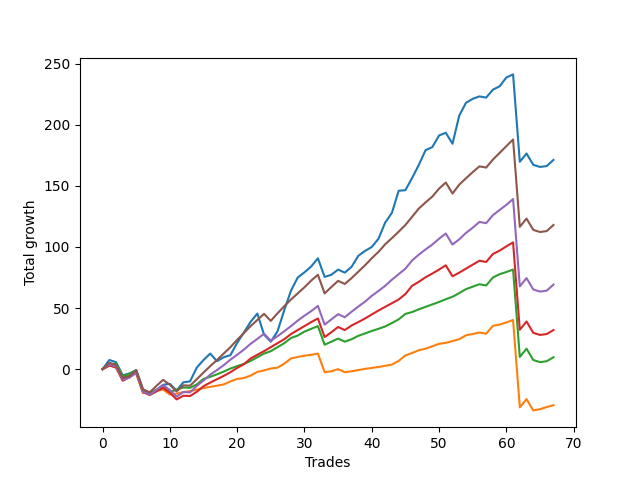

# Short Pointer 001 
- Symbol: ES_SmolBoi
- Date Range: 03/18/2022 - 07/29/2022
- Trading Period: 7:20-12:30
- Number of Trades: 67



| Name | Win Percent | Profit | Avg Profit / Trade | Avg Time / Trade |      | Name | Win Percent | Profit | Avg Profit / Trade | Avg Time / Trade |
| ---- | ----------- | ------ | ------------------ | ---------------- | ---- | ---- | ----------- | ------ | ------------------ | ---------------- |
| Sorted By <br> Profit | | | | | | Sorted By <br> Win Percentage ||||
| Two | 77.61 | 85625.00 | 1277.99 | 39:28 |     | Eighty-One | 88.06 | -14750.00 | -220.15 | 28:54 |
| Eighty-Five | 77.61 | 59000.00 | 880.60 | 37:31 |     | Eighty-Two | 83.58 | 4875.00 | 72.76 | 31:38 |
| Eighty-Four | 77.61 | 34625.00 | 516.79 | 36:01 |     | Eighty-Three | 79.10 | 16000.00 | 238.81 | 33:57 |
| Eighty-Three | 79.10 | 16000.00 | 238.81 | 33:57 |     | Two | 77.61 | 85625.00 | 1277.99 | 39:28 |
| Eighty-Two | 83.58 | 4875.00 | 72.76 | 31:38 |     | Eighty-Five | 77.61 | 59000.00 | 880.60 | 37:31 |
| Eighty-One | 88.06 | -14750.00 | -220.15 | 28:54 |     | Eighty-Four | 77.61 | 34625.00 | 516.79 | 36:01 |

## NO STOPLOSS

### Test Two
* Sell when the price hits the upper line of the 20p 2std bollinger
* No Stoploss
* Results:
```
Total Trades: 67
Percent Up: 22.39
Percent Down: 77.61
Total Points Moved Down: 171.25
Potential Profit: 85625.00
Total Points Ups: 176.75 Count Ups: 15
Total Points Downs: 348.00 Count Downs: 52
```

<details><summary>Trades</summary>

<code>In: 2022-03-18 08:40:00		Out: 2022-03-18 08:54:30		Total Position Time: 14:30		Total Move Down: 7.50		Total to Date: 7.50</code> <br />
<code>In: 2022-03-18 10:14:00		Out: 2022-03-18 10:43:55		Total Position Time: 29:55		Total Move Down: -1.75		Total to Date: 5.75</code> <br />
<code>In: 2022-03-18 12:13:00		Out: 2022-03-18 12:42:55		Total Position Time: 29:55		Total Move Down: -10.75		Total to Date: -5.00</code> <br />
<code>In: 2022-03-21 08:20:00		Out: 2022-03-21 08:36:05		Total Position Time: 16:05		Total Move Down: 1.50		Total to Date: -3.50</code> <br />
<code>In: 2022-03-23 08:28:00		Out: 2022-03-23 08:42:15		Total Position Time: 14:15		Total Move Down: 2.75		Total to Date: -0.75</code> <br />
<code>In: 2022-03-24 08:09:00		Out: 2022-03-24 08:38:55		Total Position Time: 29:55		Total Move Down: -15.75		Total to Date: -16.50</code> <br />
<code>In: 2022-03-25 07:26:00		Out: 2022-03-25 07:54:10		Total Position Time: 28:10		Total Move Down: -3.50		Total to Date: -20.00</code> <br />
<code>In: 2022-03-25 11:57:00		Out: 2022-03-25 12:00:55		Total Position Time: 03:55		Total Move Down: 2.75		Total to Date: -17.25</code> <br />
<code>In: 2022-03-29 08:52:00		Out: 2022-03-29 09:01:40		Total Position Time: 09:40		Total Move Down: 4.50		Total to Date: -12.75</code> <br />
<code>In: 2022-03-29 12:15:00		Out: 2022-03-29 12:27:50		Total Position Time: 12:50		Total Move Down: 0.75		Total to Date: -12.00</code> <br />
<code>In: 2022-03-31 07:38:00		Out: 2022-03-31 08:07:55		Total Position Time: 29:55		Total Move Down: -5.50		Total to Date: -17.50</code> <br />
<code>In: 2022-03-31 12:05:00		Out: 2022-03-31 12:19:35		Total Position Time: 14:35		Total Move Down: 6.75		Total to Date: -10.75</code> <br />
<code>In: 2022-04-04 11:50:00		Out: 2022-04-04 12:03:40		Total Position Time: 13:40		Total Move Down: 0.75		Total to Date: -10.00</code> <br />
<code>In: 2022-04-06 11:06:00		Out: 2022-04-06 11:08:10		Total Position Time: 02:10		Total Move Down: 11.25		Total to Date: 1.25</code> <br />
<code>In: 2022-04-18 10:59:00		Out: 2022-04-18 11:10:40		Total Position Time: 11:40		Total Move Down: 6.25		Total to Date: 7.50</code> <br />
<code>In: 2022-04-20 07:57:00		Out: 2022-04-20 08:00:45		Total Position Time: 03:45		Total Move Down: 5.25		Total to Date: 12.75</code> <br />
<code>In: 2022-04-20 10:18:00		Out: 2022-04-20 10:47:55		Total Position Time: 29:55		Total Move Down: -6.25		Total to Date: 6.50</code> <br />
<code>In: 2022-04-20 10:50:00		Out: 2022-04-20 11:13:55		Total Position Time: 23:55		Total Move Down: 3.25		Total to Date: 9.75</code> <br />
<code>In: 2022-04-25 09:28:00		Out: 2022-04-25 09:57:55		Total Position Time: 29:55		Total Move Down: 1.75		Total to Date: 11.50</code> <br />
<code>In: 2022-04-25 09:53:00		Out: 2022-04-25 10:01:20		Total Position Time: 08:20		Total Move Down: 10.00		Total to Date: 21.50</code> <br />
<code>In: 2022-04-26 09:31:00		Out: 2022-04-26 09:40:15		Total Position Time: 09:15		Total Move Down: 8.50		Total to Date: 30.00</code> <br />
<code>In: 2022-04-27 08:04:00		Out: 2022-04-27 08:10:35		Total Position Time: 06:35		Total Move Down: 8.75		Total to Date: 38.75</code> <br />
<code>In: 2022-04-27 09:46:00		Out: 2022-04-27 10:00:10		Total Position Time: 14:10		Total Move Down: 6.75		Total to Date: 45.50</code> <br />
<code>In: 2022-04-28 09:50:00		Out: 2022-04-28 10:19:55		Total Position Time: 29:55		Total Move Down: -17.25		Total to Date: 28.25</code> <br />
<code>In: 2022-04-28 10:42:00		Out: 2022-04-28 11:11:55		Total Position Time: 29:55		Total Move Down: -5.75		Total to Date: 22.50</code> <br />
<code>In: 2022-05-03 10:19:00		Out: 2022-05-03 10:28:05		Total Position Time: 09:05		Total Move Down: 8.50		Total to Date: 31.00</code> <br />
<code>In: 2022-05-04 11:03:00		Out: 2022-05-04 11:07:40		Total Position Time: 04:40		Total Move Down: 17.25		Total to Date: 48.25</code> <br />
<code>In: 2022-05-04 11:07:00		Out: 2022-05-04 11:07:40		Total Position Time: 00:40		Total Move Down: 16.00		Total to Date: 64.25</code> <br />
<code>In: 2022-05-24 09:18:00		Out: 2022-05-24 09:31:20		Total Position Time: 13:20		Total Move Down: 10.75		Total to Date: 75.00</code> <br />
<code>In: 2022-05-24 10:58:00		Out: 2022-05-24 11:01:50		Total Position Time: 03:50		Total Move Down: 4.25		Total to Date: 79.25</code> <br />
<code>In: 2022-05-24 11:15:00		Out: 2022-05-24 11:43:50		Total Position Time: 28:50		Total Move Down: 4.75		Total to Date: 84.00</code> <br />
<code>In: 2022-05-24 11:41:00		Out: 2022-05-24 11:43:50		Total Position Time: 02:50		Total Move Down: 6.75		Total to Date: 90.75</code> <br />
<code>In: 2022-05-27 12:03:00		Out: 2022-05-27 12:32:55		Total Position Time: 29:55		Total Move Down: -15.25		Total to Date: 75.50</code> <br />
<code>In: 2022-05-31 10:58:00		Out: 2022-05-31 11:22:35		Total Position Time: 24:35		Total Move Down: 1.75		Total to Date: 77.25</code> <br />
<code>In: 2022-06-01 12:19:00		Out: 2022-06-01 12:30:05		Total Position Time: 11:05		Total Move Down: 4.25		Total to Date: 81.50</code> <br />
<code>In: 2022-06-07 10:12:00		Out: 2022-06-07 10:34:35		Total Position Time: 22:35		Total Move Down: -2.50		Total to Date: 79.00</code> <br />
<code>In: 2022-06-07 11:38:00		Out: 2022-06-07 11:43:25		Total Position Time: 05:25		Total Move Down: 4.75		Total to Date: 83.75</code> <br />
<code>In: 2022-06-09 08:47:00		Out: 2022-06-09 09:11:05		Total Position Time: 24:05		Total Move Down: 9.00		Total to Date: 92.75</code> <br />
<code>In: 2022-06-09 09:46:00		Out: 2022-06-09 09:55:00		Total Position Time: 09:00		Total Move Down: 4.00		Total to Date: 96.75</code> <br />
<code>In: 2022-06-09 10:08:00		Out: 2022-06-09 10:18:55		Total Position Time: 10:55		Total Move Down: 3.25		Total to Date: 100.00</code> <br />
<code>In: 2022-06-10 11:26:00		Out: 2022-06-10 11:40:10		Total Position Time: 14:10		Total Move Down: 6.75		Total to Date: 106.75</code> <br />
<code>In: 2022-06-10 12:29:00		Out: 2022-06-10 12:42:45		Total Position Time: 13:45		Total Move Down: 13.25		Total to Date: 120.00</code> <br />
<code>In: 2022-06-13 08:42:00		Out: 2022-06-13 08:54:20		Total Position Time: 12:20		Total Move Down: 8.00		Total to Date: 128.00</code> <br />
<code>In: 2022-06-13 09:41:00		Out: 2022-06-13 09:54:20		Total Position Time: 13:20		Total Move Down: 18.00		Total to Date: 146.00</code> <br />
<code>In: 2022-06-15 09:19:00		Out: 2022-06-15 09:34:05		Total Position Time: 15:05		Total Move Down: 0.50		Total to Date: 146.50</code> <br />
<code>In: 2022-06-15 11:02:00		Out: 2022-06-15 11:03:05		Total Position Time: 01:05		Total Move Down: 10.00		Total to Date: 156.50</code> <br />
<code>In: 2022-06-16 08:30:00		Out: 2022-06-16 08:41:25		Total Position Time: 11:25		Total Move Down: 10.75		Total to Date: 167.25</code> <br />
<code>In: 2022-06-17 08:34:00		Out: 2022-06-17 08:45:15		Total Position Time: 11:15		Total Move Down: 12.00		Total to Date: 179.25</code> <br />
<code>In: 2022-06-29 12:20:00		Out: 2022-06-29 12:35:20		Total Position Time: 15:20		Total Move Down: 2.50		Total to Date: 181.75</code> <br />
<code>In: 2022-06-29 12:31:00		Out: 2022-06-29 12:35:20		Total Position Time: 04:20		Total Move Down: 9.50		Total to Date: 191.25</code> <br />
<code>In: 2022-06-30 08:51:00		Out: 2022-06-30 09:06:15		Total Position Time: 15:15		Total Move Down: 2.25		Total to Date: 193.50</code> <br />
<code>In: 2022-07-01 10:35:00		Out: 2022-07-01 11:04:55		Total Position Time: 29:55		Total Move Down: -9.00		Total to Date: 184.50</code> <br />
<code>In: 2022-07-05 07:41:00		Out: 2022-07-05 08:01:10		Total Position Time: 20:10		Total Move Down: 23.00		Total to Date: 207.50</code> <br />
<code>In: 2022-07-06 11:10:00		Out: 2022-07-06 11:11:45		Total Position Time: 01:45		Total Move Down: 10.50		Total to Date: 218.00</code> <br />
<code>In: 2022-07-07 08:10:00		Out: 2022-07-07 08:21:00		Total Position Time: 11:00		Total Move Down: 3.25		Total to Date: 221.25</code> <br />
<code>In: 2022-07-07 09:37:00		Out: 2022-07-07 09:48:20		Total Position Time: 11:20		Total Move Down: 2.00		Total to Date: 223.25</code> <br />
<code>In: 2022-07-07 11:05:00		Out: 2022-07-07 11:34:55		Total Position Time: 29:55		Total Move Down: -1.00		Total to Date: 222.25</code> <br />
<code>In: 2022-07-12 10:03:00		Out: 2022-07-12 10:16:00		Total Position Time: 13:00		Total Move Down: 6.50		Total to Date: 228.75</code> <br />
<code>In: 2022-07-18 09:01:00		Out: 2022-07-18 09:19:00		Total Position Time: 18:00		Total Move Down: 2.75		Total to Date: 231.50</code> <br />
<code>In: 2022-07-26 10:13:00		Out: 2022-07-26 10:47:00		Total Position Time: 34:00		Total Move Down: 7.25		Total to Date: 238.75</code> <br />
<code>In: 2022-07-27 09:00:00		Out: 2022-07-27 09:48:00		Total Position Time: 48:00		Total Move Down: 2.50		Total to Date: 241.25</code> <br />
<code>In: 2022-07-28 08:09:00		Out: 2022-07-29 06:49:00		Total Position Time: 1360:00		Total Move Down: -71.50		Total to Date: 169.75</code> <br />
<code>In: 2022-07-28 11:00:00		Out: 2022-07-28 11:13:00		Total Position Time: 13:00		Total Move Down: 6.75		Total to Date: 176.50</code> <br />
<code>In: 2022-07-29 10:57:00		Out: 2022-07-29 12:59:00		Total Position Time: 122:00		Total Move Down: -9.25		Total to Date: 167.25</code> <br />
<code>In: 2022-07-29 11:40:00		Out: 2022-07-29 12:59:00		Total Position Time: 79:00		Total Move Down: -1.75		Total to Date: 165.50</code> <br />
<code>In: 2022-07-29 12:06:00		Out: 2022-07-29 12:59:00		Total Position Time: 53:00		Total Move Down: 0.75		Total to Date: 166.25</code> <br />
<code>In: 2022-07-29 12:31:00		Out: 2022-07-29 12:57:00		Total Position Time: 26:00		Total Move Down: 5.00		Total to Date: 171.25</code> <br />


</details>

## TAKE PROFIT

### Test Eighty-One
* Take Profit of 1 Point
* No Stoploss
* Results:
```
Total Trades: 67
Percent Up: 11.94
Percent Down: 88.06
Total Points Moved Down: -29.50
Potential Profit: -14750.00
Total Points Ups: 130.00 Count Ups: 8
Total Points Downs: 100.50 Count Downs: 59
```

<details><summary>Trades</summary>

<code>In: 2022-03-18 08:40:00		Out: 2022-03-18 08:40:10		Total Position Time: 00:10		Total Move Down: 3.00		Total to Date: 3.00</code> <br />
<code>In: 2022-03-18 10:14:00		Out: 2022-03-18 10:16:00		Total Position Time: 02:00		Total Move Down: 1.00		Total to Date: 4.00</code> <br />
<code>In: 2022-03-18 12:13:00		Out: 2022-03-18 12:42:55		Total Position Time: 29:55		Total Move Down: -10.75		Total to Date: -6.75</code> <br />
<code>In: 2022-03-21 08:20:00		Out: 2022-03-21 08:20:10		Total Position Time: 00:10		Total Move Down: 2.25		Total to Date: -4.50</code> <br />
<code>In: 2022-03-23 08:28:00		Out: 2022-03-23 08:31:25		Total Position Time: 03:25		Total Move Down: 0.75		Total to Date: -3.75</code> <br />
<code>In: 2022-03-24 08:09:00		Out: 2022-03-24 08:38:55		Total Position Time: 29:55		Total Move Down: -15.75		Total to Date: -19.50</code> <br />
<code>In: 2022-03-25 07:26:00		Out: 2022-03-25 07:26:10		Total Position Time: 00:10		Total Move Down: 1.00		Total to Date: -18.50</code> <br />
<code>In: 2022-03-25 11:57:00		Out: 2022-03-25 11:58:45		Total Position Time: 01:45		Total Move Down: 1.00		Total to Date: -17.50</code> <br />
<code>In: 2022-03-29 08:52:00		Out: 2022-03-29 08:52:55		Total Position Time: 00:55		Total Move Down: 0.75		Total to Date: -16.75</code> <br />
<code>In: 2022-03-29 12:15:00		Out: 2022-03-29 12:44:55		Total Position Time: 29:55		Total Move Down: -4.00		Total to Date: -20.75</code> <br />
<code>In: 2022-03-31 07:38:00		Out: 2022-03-31 07:39:15		Total Position Time: 01:15		Total Move Down: 0.75		Total to Date: -20.00</code> <br />
<code>In: 2022-03-31 12:05:00		Out: 2022-03-31 12:05:25		Total Position Time: 00:25		Total Move Down: 1.25		Total to Date: -18.75</code> <br />
<code>In: 2022-04-04 11:50:00		Out: 2022-04-04 11:52:10		Total Position Time: 02:10		Total Move Down: 0.75		Total to Date: -18.00</code> <br />
<code>In: 2022-04-06 11:06:00		Out: 2022-04-06 11:07:00		Total Position Time: 01:00		Total Move Down: 1.25		Total to Date: -16.75</code> <br />
<code>In: 2022-04-18 10:59:00		Out: 2022-04-18 10:59:15		Total Position Time: 00:15		Total Move Down: 1.25		Total to Date: -15.50</code> <br />
<code>In: 2022-04-20 07:57:00		Out: 2022-04-20 07:57:50		Total Position Time: 00:50		Total Move Down: 1.00		Total to Date: -14.50</code> <br />
<code>In: 2022-04-20 10:18:00		Out: 2022-04-20 10:18:35		Total Position Time: 00:35		Total Move Down: 1.00		Total to Date: -13.50</code> <br />
<code>In: 2022-04-20 10:50:00		Out: 2022-04-20 10:50:20		Total Position Time: 00:20		Total Move Down: 1.00		Total to Date: -12.50</code> <br />
<code>In: 2022-04-25 09:28:00		Out: 2022-04-25 09:28:30		Total Position Time: 00:30		Total Move Down: 2.50		Total to Date: -10.00</code> <br />
<code>In: 2022-04-25 09:53:00		Out: 2022-04-25 09:54:40		Total Position Time: 01:40		Total Move Down: 2.00		Total to Date: -8.00</code> <br />
<code>In: 2022-04-26 09:31:00		Out: 2022-04-26 09:31:55		Total Position Time: 00:55		Total Move Down: 0.75		Total to Date: -7.25</code> <br />
<code>In: 2022-04-27 08:04:00		Out: 2022-04-27 08:05:20		Total Position Time: 01:20		Total Move Down: 2.00		Total to Date: -5.25</code> <br />
<code>In: 2022-04-27 09:46:00		Out: 2022-04-27 09:46:10		Total Position Time: 00:10		Total Move Down: 3.00		Total to Date: -2.25</code> <br />
<code>In: 2022-04-28 09:50:00		Out: 2022-04-28 09:50:35		Total Position Time: 00:35		Total Move Down: 1.25		Total to Date: -1.00</code> <br />
<code>In: 2022-04-28 10:42:00		Out: 2022-04-28 10:42:10		Total Position Time: 00:10		Total Move Down: 1.50		Total to Date: 0.50</code> <br />
<code>In: 2022-05-03 10:19:00		Out: 2022-05-03 10:19:30		Total Position Time: 00:30		Total Move Down: 0.75		Total to Date: 1.25</code> <br />
<code>In: 2022-05-04 11:03:00		Out: 2022-05-04 11:03:10		Total Position Time: 00:10		Total Move Down: 3.25		Total to Date: 4.50</code> <br />
<code>In: 2022-05-04 11:07:00		Out: 2022-05-04 11:07:10		Total Position Time: 00:10		Total Move Down: 4.25		Total to Date: 8.75</code> <br />
<code>In: 2022-05-24 09:18:00		Out: 2022-05-24 09:18:50		Total Position Time: 00:50		Total Move Down: 1.25		Total to Date: 10.00</code> <br />
<code>In: 2022-05-24 10:58:00		Out: 2022-05-24 11:01:30		Total Position Time: 03:30		Total Move Down: 1.00		Total to Date: 11.00</code> <br />
<code>In: 2022-05-24 11:15:00		Out: 2022-05-24 11:15:10		Total Position Time: 00:10		Total Move Down: 0.75		Total to Date: 11.75</code> <br />
<code>In: 2022-05-24 11:41:00		Out: 2022-05-24 11:41:15		Total Position Time: 00:15		Total Move Down: 1.00		Total to Date: 12.75</code> <br />
<code>In: 2022-05-27 12:03:00		Out: 2022-05-27 12:32:55		Total Position Time: 29:55		Total Move Down: -15.25		Total to Date: -2.50</code> <br />
<code>In: 2022-05-31 10:58:00		Out: 2022-05-31 11:05:20		Total Position Time: 07:20		Total Move Down: 0.75		Total to Date: -1.75</code> <br />
<code>In: 2022-06-01 12:19:00		Out: 2022-06-01 12:25:30		Total Position Time: 06:30		Total Move Down: 1.75		Total to Date: 0.00</code> <br />
<code>In: 2022-06-07 10:12:00		Out: 2022-06-07 10:41:55		Total Position Time: 29:55		Total Move Down: -2.50		Total to Date: -2.50</code> <br />
<code>In: 2022-06-07 11:38:00		Out: 2022-06-07 11:40:55		Total Position Time: 02:55		Total Move Down: 0.75		Total to Date: -1.75</code> <br />
<code>In: 2022-06-09 08:47:00		Out: 2022-06-09 08:48:05		Total Position Time: 01:05		Total Move Down: 1.00		Total to Date: -0.75</code> <br />
<code>In: 2022-06-09 09:46:00		Out: 2022-06-09 09:47:25		Total Position Time: 01:25		Total Move Down: 1.00		Total to Date: 0.25</code> <br />
<code>In: 2022-06-09 10:08:00		Out: 2022-06-09 10:10:15		Total Position Time: 02:15		Total Move Down: 0.75		Total to Date: 1.00</code> <br />
<code>In: 2022-06-10 11:26:00		Out: 2022-06-10 11:26:20		Total Position Time: 00:20		Total Move Down: 0.75		Total to Date: 1.75</code> <br />
<code>In: 2022-06-10 12:29:00		Out: 2022-06-10 12:29:10		Total Position Time: 00:10		Total Move Down: 1.00		Total to Date: 2.75</code> <br />
<code>In: 2022-06-13 08:42:00		Out: 2022-06-13 08:47:05		Total Position Time: 05:05		Total Move Down: 1.00		Total to Date: 3.75</code> <br />
<code>In: 2022-06-13 09:41:00		Out: 2022-06-13 09:41:10		Total Position Time: 00:10		Total Move Down: 3.00		Total to Date: 6.75</code> <br />
<code>In: 2022-06-15 09:19:00		Out: 2022-06-15 09:19:10		Total Position Time: 00:10		Total Move Down: 4.50		Total to Date: 11.25</code> <br />
<code>In: 2022-06-15 11:02:00		Out: 2022-06-15 11:02:10		Total Position Time: 00:10		Total Move Down: 2.00		Total to Date: 13.25</code> <br />
<code>In: 2022-06-16 08:30:00		Out: 2022-06-16 08:30:10		Total Position Time: 00:10		Total Move Down: 2.25		Total to Date: 15.50</code> <br />
<code>In: 2022-06-17 08:34:00		Out: 2022-06-17 08:34:55		Total Position Time: 00:55		Total Move Down: 1.25		Total to Date: 16.75</code> <br />
<code>In: 2022-06-29 12:20:00		Out: 2022-06-29 12:34:15		Total Position Time: 14:15		Total Move Down: 2.00		Total to Date: 18.75</code> <br />
<code>In: 2022-06-29 12:31:00		Out: 2022-06-29 12:31:10		Total Position Time: 00:10		Total Move Down: 2.00		Total to Date: 20.75</code> <br />
<code>In: 2022-06-30 08:51:00		Out: 2022-06-30 09:06:00		Total Position Time: 15:00		Total Move Down: 0.75		Total to Date: 21.50</code> <br />
<code>In: 2022-07-01 10:35:00		Out: 2022-07-01 10:35:30		Total Position Time: 00:30		Total Move Down: 1.50		Total to Date: 23.00</code> <br />
<code>In: 2022-07-05 07:41:00		Out: 2022-07-05 07:43:00		Total Position Time: 02:00		Total Move Down: 1.50		Total to Date: 24.50</code> <br />
<code>In: 2022-07-06 11:10:00		Out: 2022-07-06 11:10:10		Total Position Time: 00:10		Total Move Down: 3.25		Total to Date: 27.75</code> <br />
<code>In: 2022-07-07 08:10:00		Out: 2022-07-07 08:10:15		Total Position Time: 00:15		Total Move Down: 1.00		Total to Date: 28.75</code> <br />
<code>In: 2022-07-07 09:37:00		Out: 2022-07-07 09:37:25		Total Position Time: 00:25		Total Move Down: 1.25		Total to Date: 30.00</code> <br />
<code>In: 2022-07-07 11:05:00		Out: 2022-07-07 11:34:55		Total Position Time: 29:55		Total Move Down: -1.00		Total to Date: 29.00</code> <br />
<code>In: 2022-07-12 10:03:00		Out: 2022-07-12 10:16:00		Total Position Time: 13:00		Total Move Down: 6.50		Total to Date: 35.50</code> <br />
<code>In: 2022-07-18 09:01:00		Out: 2022-07-18 09:18:00		Total Position Time: 17:00		Total Move Down: 1.00		Total to Date: 36.50</code> <br />
<code>In: 2022-07-26 10:13:00		Out: 2022-07-26 10:26:00		Total Position Time: 13:00		Total Move Down: 1.75		Total to Date: 38.25</code> <br />
<code>In: 2022-07-27 09:00:00		Out: 2022-07-27 09:40:00		Total Position Time: 40:00		Total Move Down: 2.00		Total to Date: 40.25</code> <br />
<code>In: 2022-07-28 08:09:00		Out: 2022-07-29 06:49:00		Total Position Time: 1360:00		Total Move Down: -71.50		Total to Date: -31.25</code> <br />
<code>In: 2022-07-28 11:00:00		Out: 2022-07-28 11:13:00		Total Position Time: 13:00		Total Move Down: 6.75		Total to Date: -24.50</code> <br />
<code>In: 2022-07-29 10:57:00		Out: 2022-07-29 12:59:00		Total Position Time: 122:00		Total Move Down: -9.25		Total to Date: -33.75</code> <br />
<code>In: 2022-07-29 11:40:00		Out: 2022-07-29 11:58:00		Total Position Time: 18:00		Total Move Down: 1.00		Total to Date: -32.75</code> <br />
<code>In: 2022-07-29 12:06:00		Out: 2022-07-29 12:57:00		Total Position Time: 51:00		Total Move Down: 1.75		Total to Date: -31.00</code> <br />
<code>In: 2022-07-29 12:31:00		Out: 2022-07-29 12:54:00		Total Position Time: 23:00		Total Move Down: 1.50		Total to Date: -29.50</code> <br />


</details>

### Test Eighty-Two
* Take Profit of 2 Point
* No Stoploss
* Results:
```
Total Trades: 67
Percent Up: 16.42
Percent Down: 83.58
Total Points Moved Down: 9.75
Potential Profit: 4875.00
Total Points Ups: 134.50 Count Ups: 11
Total Points Downs: 144.25 Count Downs: 56
```

<details><summary>Trades</summary>

<code>In: 2022-03-18 08:40:00		Out: 2022-03-18 08:40:10		Total Position Time: 00:10		Total Move Down: 3.00		Total to Date: 3.00</code> <br />
<code>In: 2022-03-18 10:14:00		Out: 2022-03-18 10:20:00		Total Position Time: 06:00		Total Move Down: 1.75		Total to Date: 4.75</code> <br />
<code>In: 2022-03-18 12:13:00		Out: 2022-03-18 12:42:55		Total Position Time: 29:55		Total Move Down: -10.75		Total to Date: -6.00</code> <br />
<code>In: 2022-03-21 08:20:00		Out: 2022-03-21 08:20:10		Total Position Time: 00:10		Total Move Down: 2.25		Total to Date: -3.75</code> <br />
<code>In: 2022-03-23 08:28:00		Out: 2022-03-23 08:32:40		Total Position Time: 04:40		Total Move Down: 2.50		Total to Date: -1.25</code> <br />
<code>In: 2022-03-24 08:09:00		Out: 2022-03-24 08:38:55		Total Position Time: 29:55		Total Move Down: -15.75		Total to Date: -17.00</code> <br />
<code>In: 2022-03-25 07:26:00		Out: 2022-03-25 07:55:55		Total Position Time: 29:55		Total Move Down: -2.50		Total to Date: -19.50</code> <br />
<code>In: 2022-03-25 11:57:00		Out: 2022-03-25 12:00:50		Total Position Time: 03:50		Total Move Down: 2.75		Total to Date: -16.75</code> <br />
<code>In: 2022-03-29 08:52:00		Out: 2022-03-29 08:57:40		Total Position Time: 05:40		Total Move Down: 2.00		Total to Date: -14.75</code> <br />
<code>In: 2022-03-29 12:15:00		Out: 2022-03-29 12:44:55		Total Position Time: 29:55		Total Move Down: -4.00		Total to Date: -18.75</code> <br />
<code>In: 2022-03-31 07:38:00		Out: 2022-03-31 07:41:25		Total Position Time: 03:25		Total Move Down: 2.00		Total to Date: -16.75</code> <br />
<code>In: 2022-03-31 12:05:00		Out: 2022-03-31 12:11:15		Total Position Time: 06:15		Total Move Down: 1.75		Total to Date: -15.00</code> <br />
<code>In: 2022-04-04 11:50:00		Out: 2022-04-04 12:19:55		Total Position Time: 29:55		Total Move Down: -0.25		Total to Date: -15.25</code> <br />
<code>In: 2022-04-06 11:06:00		Out: 2022-04-06 11:07:05		Total Position Time: 01:05		Total Move Down: 2.75		Total to Date: -12.50</code> <br />
<code>In: 2022-04-18 10:59:00		Out: 2022-04-18 10:59:30		Total Position Time: 00:30		Total Move Down: 4.50		Total to Date: -8.00</code> <br />
<code>In: 2022-04-20 07:57:00		Out: 2022-04-20 08:00:20		Total Position Time: 03:20		Total Move Down: 1.75		Total to Date: -6.25</code> <br />
<code>In: 2022-04-20 10:18:00		Out: 2022-04-20 10:19:00		Total Position Time: 01:00		Total Move Down: 2.00		Total to Date: -4.25</code> <br />
<code>In: 2022-04-20 10:50:00		Out: 2022-04-20 10:51:30		Total Position Time: 01:30		Total Move Down: 2.25		Total to Date: -2.00</code> <br />
<code>In: 2022-04-25 09:28:00		Out: 2022-04-25 09:28:30		Total Position Time: 00:30		Total Move Down: 2.50		Total to Date: 0.50</code> <br />
<code>In: 2022-04-25 09:53:00		Out: 2022-04-25 09:54:45		Total Position Time: 01:45		Total Move Down: 2.00		Total to Date: 2.50</code> <br />
<code>In: 2022-04-26 09:31:00		Out: 2022-04-26 09:32:00		Total Position Time: 01:00		Total Move Down: 1.75		Total to Date: 4.25</code> <br />
<code>In: 2022-04-27 08:04:00		Out: 2022-04-27 08:05:25		Total Position Time: 01:25		Total Move Down: 2.50		Total to Date: 6.75</code> <br />
<code>In: 2022-04-27 09:46:00		Out: 2022-04-27 09:46:10		Total Position Time: 00:10		Total Move Down: 3.00		Total to Date: 9.75</code> <br />
<code>In: 2022-04-28 09:50:00		Out: 2022-04-28 09:51:05		Total Position Time: 01:05		Total Move Down: 3.00		Total to Date: 12.75</code> <br />
<code>In: 2022-04-28 10:42:00		Out: 2022-04-28 10:44:05		Total Position Time: 02:05		Total Move Down: 2.00		Total to Date: 14.75</code> <br />
<code>In: 2022-05-03 10:19:00		Out: 2022-05-03 10:23:35		Total Position Time: 04:35		Total Move Down: 3.25		Total to Date: 18.00</code> <br />
<code>In: 2022-05-04 11:03:00		Out: 2022-05-04 11:03:10		Total Position Time: 00:10		Total Move Down: 3.25		Total to Date: 21.25</code> <br />
<code>In: 2022-05-04 11:07:00		Out: 2022-05-04 11:07:10		Total Position Time: 00:10		Total Move Down: 4.25		Total to Date: 25.50</code> <br />
<code>In: 2022-05-24 09:18:00		Out: 2022-05-24 09:20:10		Total Position Time: 02:10		Total Move Down: 2.00		Total to Date: 27.50</code> <br />
<code>In: 2022-05-24 10:58:00		Out: 2022-05-24 11:01:40		Total Position Time: 03:40		Total Move Down: 3.25		Total to Date: 30.75</code> <br />
<code>In: 2022-05-24 11:15:00		Out: 2022-05-24 11:15:30		Total Position Time: 00:30		Total Move Down: 2.25		Total to Date: 33.00</code> <br />
<code>In: 2022-05-24 11:41:00		Out: 2022-05-24 11:42:10		Total Position Time: 01:10		Total Move Down: 2.25		Total to Date: 35.25</code> <br />
<code>In: 2022-05-27 12:03:00		Out: 2022-05-27 12:32:55		Total Position Time: 29:55		Total Move Down: -15.25		Total to Date: 20.00</code> <br />
<code>In: 2022-05-31 10:58:00		Out: 2022-05-31 11:05:45		Total Position Time: 07:45		Total Move Down: 2.50		Total to Date: 22.50</code> <br />
<code>In: 2022-06-01 12:19:00		Out: 2022-06-01 12:25:40		Total Position Time: 06:40		Total Move Down: 2.50		Total to Date: 25.00</code> <br />
<code>In: 2022-06-07 10:12:00		Out: 2022-06-07 10:41:55		Total Position Time: 29:55		Total Move Down: -2.50		Total to Date: 22.50</code> <br />
<code>In: 2022-06-07 11:38:00		Out: 2022-06-07 11:41:50		Total Position Time: 03:50		Total Move Down: 2.00		Total to Date: 24.50</code> <br />
<code>In: 2022-06-09 08:47:00		Out: 2022-06-09 08:48:20		Total Position Time: 01:20		Total Move Down: 2.75		Total to Date: 27.25</code> <br />
<code>In: 2022-06-09 09:46:00		Out: 2022-06-09 09:49:20		Total Position Time: 03:20		Total Move Down: 2.00		Total to Date: 29.25</code> <br />
<code>In: 2022-06-09 10:08:00		Out: 2022-06-09 10:16:55		Total Position Time: 08:55		Total Move Down: 2.00		Total to Date: 31.25</code> <br />
<code>In: 2022-06-10 11:26:00		Out: 2022-06-10 11:26:30		Total Position Time: 00:30		Total Move Down: 1.75		Total to Date: 33.00</code> <br />
<code>In: 2022-06-10 12:29:00		Out: 2022-06-10 12:29:20		Total Position Time: 00:20		Total Move Down: 2.00		Total to Date: 35.00</code> <br />
<code>In: 2022-06-13 08:42:00		Out: 2022-06-13 08:47:40		Total Position Time: 05:40		Total Move Down: 2.75		Total to Date: 37.75</code> <br />
<code>In: 2022-06-13 09:41:00		Out: 2022-06-13 09:41:10		Total Position Time: 00:10		Total Move Down: 3.00		Total to Date: 40.75</code> <br />
<code>In: 2022-06-15 09:19:00		Out: 2022-06-15 09:19:10		Total Position Time: 00:10		Total Move Down: 4.50		Total to Date: 45.25</code> <br />
<code>In: 2022-06-15 11:02:00		Out: 2022-06-15 11:02:45		Total Position Time: 00:45		Total Move Down: 1.50		Total to Date: 46.75</code> <br />
<code>In: 2022-06-16 08:30:00		Out: 2022-06-16 08:30:10		Total Position Time: 00:10		Total Move Down: 2.25		Total to Date: 49.00</code> <br />
<code>In: 2022-06-17 08:34:00		Out: 2022-06-17 08:35:15		Total Position Time: 01:15		Total Move Down: 2.00		Total to Date: 51.00</code> <br />
<code>In: 2022-06-29 12:20:00		Out: 2022-06-29 12:34:15		Total Position Time: 14:15		Total Move Down: 2.00		Total to Date: 53.00</code> <br />
<code>In: 2022-06-29 12:31:00		Out: 2022-06-29 12:31:10		Total Position Time: 00:10		Total Move Down: 2.00		Total to Date: 55.00</code> <br />
<code>In: 2022-06-30 08:51:00		Out: 2022-06-30 09:06:15		Total Position Time: 15:15		Total Move Down: 2.25		Total to Date: 57.25</code> <br />
<code>In: 2022-07-01 10:35:00		Out: 2022-07-01 10:35:40		Total Position Time: 00:40		Total Move Down: 2.00		Total to Date: 59.25</code> <br />
<code>In: 2022-07-05 07:41:00		Out: 2022-07-05 07:44:00		Total Position Time: 03:00		Total Move Down: 3.00		Total to Date: 62.25</code> <br />
<code>In: 2022-07-06 11:10:00		Out: 2022-07-06 11:10:10		Total Position Time: 00:10		Total Move Down: 3.25		Total to Date: 65.50</code> <br />
<code>In: 2022-07-07 08:10:00		Out: 2022-07-07 08:14:10		Total Position Time: 04:10		Total Move Down: 2.00		Total to Date: 67.50</code> <br />
<code>In: 2022-07-07 09:37:00		Out: 2022-07-07 09:44:40		Total Position Time: 07:40		Total Move Down: 2.00		Total to Date: 69.50</code> <br />
<code>In: 2022-07-07 11:05:00		Out: 2022-07-07 11:34:55		Total Position Time: 29:55		Total Move Down: -1.00		Total to Date: 68.50</code> <br />
<code>In: 2022-07-12 10:03:00		Out: 2022-07-12 10:16:00		Total Position Time: 13:00		Total Move Down: 6.50		Total to Date: 75.00</code> <br />
<code>In: 2022-07-18 09:01:00		Out: 2022-07-18 09:19:00		Total Position Time: 18:00		Total Move Down: 2.75		Total to Date: 77.75</code> <br />
<code>In: 2022-07-26 10:13:00		Out: 2022-07-26 10:26:00		Total Position Time: 13:00		Total Move Down: 1.75		Total to Date: 79.50</code> <br />
<code>In: 2022-07-27 09:00:00		Out: 2022-07-27 09:40:00		Total Position Time: 40:00		Total Move Down: 2.00		Total to Date: 81.50</code> <br />
<code>In: 2022-07-28 08:09:00		Out: 2022-07-29 06:49:00		Total Position Time: 1360:00		Total Move Down: -71.50		Total to Date: 10.00</code> <br />
<code>In: 2022-07-28 11:00:00		Out: 2022-07-28 11:13:00		Total Position Time: 13:00		Total Move Down: 6.75		Total to Date: 16.75</code> <br />
<code>In: 2022-07-29 10:57:00		Out: 2022-07-29 12:59:00		Total Position Time: 122:00		Total Move Down: -9.25		Total to Date: 7.50</code> <br />
<code>In: 2022-07-29 11:40:00		Out: 2022-07-29 12:59:00		Total Position Time: 79:00		Total Move Down: -1.75		Total to Date: 5.75</code> <br />
<code>In: 2022-07-29 12:06:00		Out: 2022-07-29 12:59:00		Total Position Time: 53:00		Total Move Down: 0.75		Total to Date: 6.50</code> <br />
<code>In: 2022-07-29 12:31:00		Out: 2022-07-29 12:56:00		Total Position Time: 25:00		Total Move Down: 3.25		Total to Date: 9.75</code> <br />


</details>

### Test Eighty-Three
* Take Profit of 3 Point
* No Stoploss
* Results:
```
Total Trades: 67
Percent Up: 20.90
Percent Down: 79.10
Total Points Moved Down: 32.00
Potential Profit: 16000.00
Total Points Ups: 150.75 Count Ups: 14
Total Points Downs: 182.75 Count Downs: 53
```

<details><summary>Trades</summary>

<code>In: 2022-03-18 08:40:00		Out: 2022-03-18 08:40:15		Total Position Time: 00:15		Total Move Down: 3.00		Total to Date: 3.00</code> <br />
<code>In: 2022-03-18 10:14:00		Out: 2022-03-18 10:43:55		Total Position Time: 29:55		Total Move Down: -1.75		Total to Date: 1.25</code> <br />
<code>In: 2022-03-18 12:13:00		Out: 2022-03-18 12:42:55		Total Position Time: 29:55		Total Move Down: -10.75		Total to Date: -9.50</code> <br />
<code>In: 2022-03-21 08:20:00		Out: 2022-03-21 08:20:35		Total Position Time: 00:35		Total Move Down: 3.00		Total to Date: -6.50</code> <br />
<code>In: 2022-03-23 08:28:00		Out: 2022-03-23 08:35:25		Total Position Time: 07:25		Total Move Down: 3.50		Total to Date: -3.00</code> <br />
<code>In: 2022-03-24 08:09:00		Out: 2022-03-24 08:38:55		Total Position Time: 29:55		Total Move Down: -15.75		Total to Date: -18.75</code> <br />
<code>In: 2022-03-25 07:26:00		Out: 2022-03-25 07:55:55		Total Position Time: 29:55		Total Move Down: -2.50		Total to Date: -21.25</code> <br />
<code>In: 2022-03-25 11:57:00		Out: 2022-03-25 12:01:00		Total Position Time: 04:00		Total Move Down: 3.00		Total to Date: -18.25</code> <br />
<code>In: 2022-03-29 08:52:00		Out: 2022-03-29 08:58:40		Total Position Time: 06:40		Total Move Down: 3.00		Total to Date: -15.25</code> <br />
<code>In: 2022-03-29 12:15:00		Out: 2022-03-29 12:44:55		Total Position Time: 29:55		Total Move Down: -4.00		Total to Date: -19.25</code> <br />
<code>In: 2022-03-31 07:38:00		Out: 2022-03-31 08:07:55		Total Position Time: 29:55		Total Move Down: -5.50		Total to Date: -24.75</code> <br />
<code>In: 2022-03-31 12:05:00		Out: 2022-03-31 12:11:35		Total Position Time: 06:35		Total Move Down: 3.00		Total to Date: -21.75</code> <br />
<code>In: 2022-04-04 11:50:00		Out: 2022-04-04 12:19:55		Total Position Time: 29:55		Total Move Down: -0.25		Total to Date: -22.00</code> <br />
<code>In: 2022-04-06 11:06:00		Out: 2022-04-06 11:07:15		Total Position Time: 01:15		Total Move Down: 3.50		Total to Date: -18.50</code> <br />
<code>In: 2022-04-18 10:59:00		Out: 2022-04-18 10:59:30		Total Position Time: 00:30		Total Move Down: 4.50		Total to Date: -14.00</code> <br />
<code>In: 2022-04-20 07:57:00		Out: 2022-04-20 08:00:30		Total Position Time: 03:30		Total Move Down: 3.00		Total to Date: -11.00</code> <br />
<code>In: 2022-04-20 10:18:00		Out: 2022-04-20 10:19:05		Total Position Time: 01:05		Total Move Down: 2.75		Total to Date: -8.25</code> <br />
<code>In: 2022-04-20 10:50:00		Out: 2022-04-20 10:55:05		Total Position Time: 05:05		Total Move Down: 2.75		Total to Date: -5.50</code> <br />
<code>In: 2022-04-25 09:28:00		Out: 2022-04-25 09:31:00		Total Position Time: 03:00		Total Move Down: 3.00		Total to Date: -2.50</code> <br />
<code>In: 2022-04-25 09:53:00		Out: 2022-04-25 09:55:05		Total Position Time: 02:05		Total Move Down: 3.50		Total to Date: 1.00</code> <br />
<code>In: 2022-04-26 09:31:00		Out: 2022-04-26 09:32:05		Total Position Time: 01:05		Total Move Down: 3.00		Total to Date: 4.00</code> <br />
<code>In: 2022-04-27 08:04:00		Out: 2022-04-27 08:05:30		Total Position Time: 01:30		Total Move Down: 4.75		Total to Date: 8.75</code> <br />
<code>In: 2022-04-27 09:46:00		Out: 2022-04-27 09:46:10		Total Position Time: 00:10		Total Move Down: 3.00		Total to Date: 11.75</code> <br />
<code>In: 2022-04-28 09:50:00		Out: 2022-04-28 09:51:05		Total Position Time: 01:05		Total Move Down: 3.00		Total to Date: 14.75</code> <br />
<code>In: 2022-04-28 10:42:00		Out: 2022-04-28 10:44:10		Total Position Time: 02:10		Total Move Down: 3.25		Total to Date: 18.00</code> <br />
<code>In: 2022-05-03 10:19:00		Out: 2022-05-03 10:23:35		Total Position Time: 04:35		Total Move Down: 3.25		Total to Date: 21.25</code> <br />
<code>In: 2022-05-04 11:03:00		Out: 2022-05-04 11:03:10		Total Position Time: 00:10		Total Move Down: 3.25		Total to Date: 24.50</code> <br />
<code>In: 2022-05-04 11:07:00		Out: 2022-05-04 11:07:10		Total Position Time: 00:10		Total Move Down: 4.25		Total to Date: 28.75</code> <br />
<code>In: 2022-05-24 09:18:00		Out: 2022-05-24 09:21:05		Total Position Time: 03:05		Total Move Down: 3.25		Total to Date: 32.00</code> <br />
<code>In: 2022-05-24 10:58:00		Out: 2022-05-24 11:01:40		Total Position Time: 03:40		Total Move Down: 3.25		Total to Date: 35.25</code> <br />
<code>In: 2022-05-24 11:15:00		Out: 2022-05-24 11:15:40		Total Position Time: 00:40		Total Move Down: 3.25		Total to Date: 38.50</code> <br />
<code>In: 2022-05-24 11:41:00		Out: 2022-05-24 11:42:20		Total Position Time: 01:20		Total Move Down: 3.00		Total to Date: 41.50</code> <br />
<code>In: 2022-05-27 12:03:00		Out: 2022-05-27 12:32:55		Total Position Time: 29:55		Total Move Down: -15.25		Total to Date: 26.25</code> <br />
<code>In: 2022-05-31 10:58:00		Out: 2022-05-31 11:22:50		Total Position Time: 24:50		Total Move Down: 4.00		Total to Date: 30.25</code> <br />
<code>In: 2022-06-01 12:19:00		Out: 2022-06-01 12:30:05		Total Position Time: 11:05		Total Move Down: 4.25		Total to Date: 34.50</code> <br />
<code>In: 2022-06-07 10:12:00		Out: 2022-06-07 10:41:55		Total Position Time: 29:55		Total Move Down: -2.50		Total to Date: 32.00</code> <br />
<code>In: 2022-06-07 11:38:00		Out: 2022-06-07 11:43:00		Total Position Time: 05:00		Total Move Down: 3.75		Total to Date: 35.75</code> <br />
<code>In: 2022-06-09 08:47:00		Out: 2022-06-09 08:48:20		Total Position Time: 01:20		Total Move Down: 2.75		Total to Date: 38.50</code> <br />
<code>In: 2022-06-09 09:46:00		Out: 2022-06-09 09:54:55		Total Position Time: 08:55		Total Move Down: 3.00		Total to Date: 41.50</code> <br />
<code>In: 2022-06-09 10:08:00		Out: 2022-06-09 10:18:55		Total Position Time: 10:55		Total Move Down: 3.25		Total to Date: 44.75</code> <br />
<code>In: 2022-06-10 11:26:00		Out: 2022-06-10 11:26:55		Total Position Time: 00:55		Total Move Down: 3.25		Total to Date: 48.00</code> <br />
<code>In: 2022-06-10 12:29:00		Out: 2022-06-10 12:30:10		Total Position Time: 01:10		Total Move Down: 3.00		Total to Date: 51.00</code> <br />
<code>In: 2022-06-13 08:42:00		Out: 2022-06-13 08:47:50		Total Position Time: 05:50		Total Move Down: 3.00		Total to Date: 54.00</code> <br />
<code>In: 2022-06-13 09:41:00		Out: 2022-06-13 09:41:10		Total Position Time: 00:10		Total Move Down: 3.00		Total to Date: 57.00</code> <br />
<code>In: 2022-06-15 09:19:00		Out: 2022-06-15 09:19:10		Total Position Time: 00:10		Total Move Down: 4.50		Total to Date: 61.50</code> <br />
<code>In: 2022-06-15 11:02:00		Out: 2022-06-15 11:03:00		Total Position Time: 01:00		Total Move Down: 6.75		Total to Date: 68.25</code> <br />
<code>In: 2022-06-16 08:30:00		Out: 2022-06-16 08:30:20		Total Position Time: 00:20		Total Move Down: 3.25		Total to Date: 71.50</code> <br />
<code>In: 2022-06-17 08:34:00		Out: 2022-06-17 08:35:45		Total Position Time: 01:45		Total Move Down: 3.75		Total to Date: 75.25</code> <br />
<code>In: 2022-06-29 12:20:00		Out: 2022-06-29 12:35:15		Total Position Time: 15:15		Total Move Down: 3.00		Total to Date: 78.25</code> <br />
<code>In: 2022-06-29 12:31:00		Out: 2022-06-29 12:32:15		Total Position Time: 01:15		Total Move Down: 3.25		Total to Date: 81.50</code> <br />
<code>In: 2022-06-30 08:51:00		Out: 2022-06-30 09:06:20		Total Position Time: 15:20		Total Move Down: 3.50		Total to Date: 85.00</code> <br />
<code>In: 2022-07-01 10:35:00		Out: 2022-07-01 11:04:55		Total Position Time: 29:55		Total Move Down: -9.00		Total to Date: 76.00</code> <br />
<code>In: 2022-07-05 07:41:00		Out: 2022-07-05 07:44:00		Total Position Time: 03:00		Total Move Down: 3.00		Total to Date: 79.00</code> <br />
<code>In: 2022-07-06 11:10:00		Out: 2022-07-06 11:10:10		Total Position Time: 00:10		Total Move Down: 3.25		Total to Date: 82.25</code> <br />
<code>In: 2022-07-07 08:10:00		Out: 2022-07-07 08:21:00		Total Position Time: 11:00		Total Move Down: 3.25		Total to Date: 85.50</code> <br />
<code>In: 2022-07-07 09:37:00		Out: 2022-07-07 09:49:45		Total Position Time: 12:45		Total Move Down: 3.25		Total to Date: 88.75</code> <br />
<code>In: 2022-07-07 11:05:00		Out: 2022-07-07 11:34:55		Total Position Time: 29:55		Total Move Down: -1.00		Total to Date: 87.75</code> <br />
<code>In: 2022-07-12 10:03:00		Out: 2022-07-12 10:16:00		Total Position Time: 13:00		Total Move Down: 6.50		Total to Date: 94.25</code> <br />
<code>In: 2022-07-18 09:01:00		Out: 2022-07-18 09:19:00		Total Position Time: 18:00		Total Move Down: 2.75		Total to Date: 97.00</code> <br />
<code>In: 2022-07-26 10:13:00		Out: 2022-07-26 10:33:00		Total Position Time: 20:00		Total Move Down: 3.50		Total to Date: 100.50</code> <br />
<code>In: 2022-07-27 09:00:00		Out: 2022-07-27 09:49:00		Total Position Time: 49:00		Total Move Down: 3.25		Total to Date: 103.75</code> <br />
<code>In: 2022-07-28 08:09:00		Out: 2022-07-29 06:49:00		Total Position Time: 1360:00		Total Move Down: -71.50		Total to Date: 32.25</code> <br />
<code>In: 2022-07-28 11:00:00		Out: 2022-07-28 11:13:00		Total Position Time: 13:00		Total Move Down: 6.75		Total to Date: 39.00</code> <br />
<code>In: 2022-07-29 10:57:00		Out: 2022-07-29 12:59:00		Total Position Time: 122:00		Total Move Down: -9.25		Total to Date: 29.75</code> <br />
<code>In: 2022-07-29 11:40:00		Out: 2022-07-29 12:59:00		Total Position Time: 79:00		Total Move Down: -1.75		Total to Date: 28.00</code> <br />
<code>In: 2022-07-29 12:06:00		Out: 2022-07-29 12:59:00		Total Position Time: 53:00		Total Move Down: 0.75		Total to Date: 28.75</code> <br />
<code>In: 2022-07-29 12:31:00		Out: 2022-07-29 12:56:00		Total Position Time: 25:00		Total Move Down: 3.25		Total to Date: 32.00</code> <br />


</details>

### Test Eighty-Four
* Take Profit of 4 Point
* No Stoploss
* Results:
```
Total Trades: 67
Percent Up: 22.39
Percent Down: 77.61
Total Points Moved Down: 69.25
Potential Profit: 34625.00
Total Points Ups: 156.50 Count Ups: 15
Total Points Downs: 225.75 Count Downs: 52
```

<details><summary>Trades</summary>

<code>In: 2022-03-18 08:40:00		Out: 2022-03-18 08:40:50		Total Position Time: 00:50		Total Move Down: 4.00		Total to Date: 4.00</code> <br />
<code>In: 2022-03-18 10:14:00		Out: 2022-03-18 10:43:55		Total Position Time: 29:55		Total Move Down: -1.75		Total to Date: 2.25</code> <br />
<code>In: 2022-03-18 12:13:00		Out: 2022-03-18 12:42:55		Total Position Time: 29:55		Total Move Down: -10.75		Total to Date: -8.50</code> <br />
<code>In: 2022-03-21 08:20:00		Out: 2022-03-21 08:49:55		Total Position Time: 29:55		Total Move Down: 1.50		Total to Date: -7.00</code> <br />
<code>In: 2022-03-23 08:28:00		Out: 2022-03-23 08:43:00		Total Position Time: 15:00		Total Move Down: 4.25		Total to Date: -2.75</code> <br />
<code>In: 2022-03-24 08:09:00		Out: 2022-03-24 08:38:55		Total Position Time: 29:55		Total Move Down: -15.75		Total to Date: -18.50</code> <br />
<code>In: 2022-03-25 07:26:00		Out: 2022-03-25 07:55:55		Total Position Time: 29:55		Total Move Down: -2.50		Total to Date: -21.00</code> <br />
<code>In: 2022-03-25 11:57:00		Out: 2022-03-25 12:01:45		Total Position Time: 04:45		Total Move Down: 4.00		Total to Date: -17.00</code> <br />
<code>In: 2022-03-29 08:52:00		Out: 2022-03-29 09:01:35		Total Position Time: 09:35		Total Move Down: 4.00		Total to Date: -13.00</code> <br />
<code>In: 2022-03-29 12:15:00		Out: 2022-03-29 12:44:55		Total Position Time: 29:55		Total Move Down: -4.00		Total to Date: -17.00</code> <br />
<code>In: 2022-03-31 07:38:00		Out: 2022-03-31 08:07:55		Total Position Time: 29:55		Total Move Down: -5.50		Total to Date: -22.50</code> <br />
<code>In: 2022-03-31 12:05:00		Out: 2022-03-31 12:12:45		Total Position Time: 07:45		Total Move Down: 3.75		Total to Date: -18.75</code> <br />
<code>In: 2022-04-04 11:50:00		Out: 2022-04-04 12:19:55		Total Position Time: 29:55		Total Move Down: -0.25		Total to Date: -19.00</code> <br />
<code>In: 2022-04-06 11:06:00		Out: 2022-04-06 11:07:20		Total Position Time: 01:20		Total Move Down: 5.25		Total to Date: -13.75</code> <br />
<code>In: 2022-04-18 10:59:00		Out: 2022-04-18 10:59:30		Total Position Time: 00:30		Total Move Down: 4.50		Total to Date: -9.25</code> <br />
<code>In: 2022-04-20 07:57:00		Out: 2022-04-20 08:00:40		Total Position Time: 03:40		Total Move Down: 4.75		Total to Date: -4.50</code> <br />
<code>In: 2022-04-20 10:18:00		Out: 2022-04-20 10:19:30		Total Position Time: 01:30		Total Move Down: 3.75		Total to Date: -0.75</code> <br />
<code>In: 2022-04-20 10:50:00		Out: 2022-04-20 11:14:30		Total Position Time: 24:30		Total Move Down: 4.00		Total to Date: 3.25</code> <br />
<code>In: 2022-04-25 09:28:00		Out: 2022-04-25 09:31:10		Total Position Time: 03:10		Total Move Down: 4.50		Total to Date: 7.75</code> <br />
<code>In: 2022-04-25 09:53:00		Out: 2022-04-25 09:55:10		Total Position Time: 02:10		Total Move Down: 4.00		Total to Date: 11.75</code> <br />
<code>In: 2022-04-26 09:31:00		Out: 2022-04-26 09:37:35		Total Position Time: 06:35		Total Move Down: 4.25		Total to Date: 16.00</code> <br />
<code>In: 2022-04-27 08:04:00		Out: 2022-04-27 08:05:30		Total Position Time: 01:30		Total Move Down: 4.75		Total to Date: 20.75</code> <br />
<code>In: 2022-04-27 09:46:00		Out: 2022-04-27 09:51:20		Total Position Time: 05:20		Total Move Down: 4.00		Total to Date: 24.75</code> <br />
<code>In: 2022-04-28 09:50:00		Out: 2022-04-28 09:51:15		Total Position Time: 01:15		Total Move Down: 4.25		Total to Date: 29.00</code> <br />
<code>In: 2022-04-28 10:42:00		Out: 2022-04-28 11:11:55		Total Position Time: 29:55		Total Move Down: -5.75		Total to Date: 23.25</code> <br />
<code>In: 2022-05-03 10:19:00		Out: 2022-05-03 10:23:55		Total Position Time: 04:55		Total Move Down: 3.75		Total to Date: 27.00</code> <br />
<code>In: 2022-05-04 11:03:00		Out: 2022-05-04 11:03:20		Total Position Time: 00:20		Total Move Down: 4.00		Total to Date: 31.00</code> <br />
<code>In: 2022-05-04 11:07:00		Out: 2022-05-04 11:07:10		Total Position Time: 00:10		Total Move Down: 4.25		Total to Date: 35.25</code> <br />
<code>In: 2022-05-24 09:18:00		Out: 2022-05-24 09:21:15		Total Position Time: 03:15		Total Move Down: 4.50		Total to Date: 39.75</code> <br />
<code>In: 2022-05-24 10:58:00		Out: 2022-05-24 11:01:45		Total Position Time: 03:45		Total Move Down: 4.00		Total to Date: 43.75</code> <br />
<code>In: 2022-05-24 11:15:00		Out: 2022-05-24 11:17:45		Total Position Time: 02:45		Total Move Down: 3.75		Total to Date: 47.50</code> <br />
<code>In: 2022-05-24 11:41:00		Out: 2022-05-24 11:43:10		Total Position Time: 02:10		Total Move Down: 4.25		Total to Date: 51.75</code> <br />
<code>In: 2022-05-27 12:03:00		Out: 2022-05-27 12:32:55		Total Position Time: 29:55		Total Move Down: -15.25		Total to Date: 36.50</code> <br />
<code>In: 2022-05-31 10:58:00		Out: 2022-05-31 11:22:55		Total Position Time: 24:55		Total Move Down: 4.25		Total to Date: 40.75</code> <br />
<code>In: 2022-06-01 12:19:00		Out: 2022-06-01 12:30:05		Total Position Time: 11:05		Total Move Down: 4.25		Total to Date: 45.00</code> <br />
<code>In: 2022-06-07 10:12:00		Out: 2022-06-07 10:41:55		Total Position Time: 29:55		Total Move Down: -2.50		Total to Date: 42.50</code> <br />
<code>In: 2022-06-07 11:38:00		Out: 2022-06-07 11:43:05		Total Position Time: 05:05		Total Move Down: 4.50		Total to Date: 47.00</code> <br />
<code>In: 2022-06-09 08:47:00		Out: 2022-06-09 08:48:35		Total Position Time: 01:35		Total Move Down: 4.25		Total to Date: 51.25</code> <br />
<code>In: 2022-06-09 09:46:00		Out: 2022-06-09 09:55:00		Total Position Time: 09:00		Total Move Down: 4.00		Total to Date: 55.25</code> <br />
<code>In: 2022-06-09 10:08:00		Out: 2022-06-09 10:22:05		Total Position Time: 14:05		Total Move Down: 4.75		Total to Date: 60.00</code> <br />
<code>In: 2022-06-10 11:26:00		Out: 2022-06-10 11:28:10		Total Position Time: 02:10		Total Move Down: 4.00		Total to Date: 64.00</code> <br />
<code>In: 2022-06-10 12:29:00		Out: 2022-06-10 12:30:20		Total Position Time: 01:20		Total Move Down: 4.25		Total to Date: 68.25</code> <br />
<code>In: 2022-06-13 08:42:00		Out: 2022-06-13 08:51:35		Total Position Time: 09:35		Total Move Down: 5.00		Total to Date: 73.25</code> <br />
<code>In: 2022-06-13 09:41:00		Out: 2022-06-13 09:41:15		Total Position Time: 00:15		Total Move Down: 4.50		Total to Date: 77.75</code> <br />
<code>In: 2022-06-15 09:19:00		Out: 2022-06-15 09:19:10		Total Position Time: 00:10		Total Move Down: 4.50		Total to Date: 82.25</code> <br />
<code>In: 2022-06-15 11:02:00		Out: 2022-06-15 11:03:00		Total Position Time: 01:00		Total Move Down: 6.75		Total to Date: 89.00</code> <br />
<code>In: 2022-06-16 08:30:00		Out: 2022-06-16 08:30:25		Total Position Time: 00:25		Total Move Down: 4.75		Total to Date: 93.75</code> <br />
<code>In: 2022-06-17 08:34:00		Out: 2022-06-17 08:35:50		Total Position Time: 01:50		Total Move Down: 4.25		Total to Date: 98.00</code> <br />
<code>In: 2022-06-29 12:20:00		Out: 2022-06-29 12:37:05		Total Position Time: 17:05		Total Move Down: 4.00		Total to Date: 102.00</code> <br />
<code>In: 2022-06-29 12:31:00		Out: 2022-06-29 12:33:20		Total Position Time: 02:20		Total Move Down: 4.75		Total to Date: 106.75</code> <br />
<code>In: 2022-06-30 08:51:00		Out: 2022-06-30 09:07:15		Total Position Time: 16:15		Total Move Down: 4.25		Total to Date: 111.00</code> <br />
<code>In: 2022-07-01 10:35:00		Out: 2022-07-01 11:04:55		Total Position Time: 29:55		Total Move Down: -9.00		Total to Date: 102.00</code> <br />
<code>In: 2022-07-05 07:41:00		Out: 2022-07-05 07:44:20		Total Position Time: 03:20		Total Move Down: 4.25		Total to Date: 106.25</code> <br />
<code>In: 2022-07-06 11:10:00		Out: 2022-07-06 11:11:05		Total Position Time: 01:05		Total Move Down: 5.25		Total to Date: 111.50</code> <br />
<code>In: 2022-07-07 08:10:00		Out: 2022-07-07 08:22:45		Total Position Time: 12:45		Total Move Down: 4.25		Total to Date: 115.75</code> <br />
<code>In: 2022-07-07 09:37:00		Out: 2022-07-07 09:50:10		Total Position Time: 13:10		Total Move Down: 4.75		Total to Date: 120.50</code> <br />
<code>In: 2022-07-07 11:05:00		Out: 2022-07-07 11:34:55		Total Position Time: 29:55		Total Move Down: -1.00		Total to Date: 119.50</code> <br />
<code>In: 2022-07-12 10:03:00		Out: 2022-07-12 10:16:00		Total Position Time: 13:00		Total Move Down: 6.50		Total to Date: 126.00</code> <br />
<code>In: 2022-07-18 09:01:00		Out: 2022-07-18 09:28:00		Total Position Time: 27:00		Total Move Down: 4.25		Total to Date: 130.25</code> <br />
<code>In: 2022-07-26 10:13:00		Out: 2022-07-26 10:34:00		Total Position Time: 21:00		Total Move Down: 4.25		Total to Date: 134.50</code> <br />
<code>In: 2022-07-27 09:00:00		Out: 2022-07-27 09:56:00		Total Position Time: 56:00		Total Move Down: 4.75		Total to Date: 139.25</code> <br />
<code>In: 2022-07-28 08:09:00		Out: 2022-07-29 06:49:00		Total Position Time: 1360:00		Total Move Down: -71.50		Total to Date: 67.75</code> <br />
<code>In: 2022-07-28 11:00:00		Out: 2022-07-28 11:13:00		Total Position Time: 13:00		Total Move Down: 6.75		Total to Date: 74.50</code> <br />
<code>In: 2022-07-29 10:57:00		Out: 2022-07-29 12:59:00		Total Position Time: 122:00		Total Move Down: -9.25		Total to Date: 65.25</code> <br />
<code>In: 2022-07-29 11:40:00		Out: 2022-07-29 12:59:00		Total Position Time: 79:00		Total Move Down: -1.75		Total to Date: 63.50</code> <br />
<code>In: 2022-07-29 12:06:00		Out: 2022-07-29 12:59:00		Total Position Time: 53:00		Total Move Down: 0.75		Total to Date: 64.25</code> <br />
<code>In: 2022-07-29 12:31:00		Out: 2022-07-29 12:57:00		Total Position Time: 26:00		Total Move Down: 5.00		Total to Date: 69.25</code> <br />


</details>

### Test Eighty-Five
* Take Profit of 5 Point
* No Stoploss
* Results:
```
Total Trades: 67
Percent Up: 22.39
Percent Down: 77.61
Total Points Moved Down: 118.00
Potential Profit: 59000.00
Total Points Ups: 156.50 Count Ups: 15
Total Points Downs: 274.50 Count Downs: 52
```

<details><summary>Trades</summary>

<code>In: 2022-03-18 08:40:00		Out: 2022-03-18 08:48:00		Total Position Time: 08:00		Total Move Down: 5.25		Total to Date: 5.25</code> <br />
<code>In: 2022-03-18 10:14:00		Out: 2022-03-18 10:43:55		Total Position Time: 29:55		Total Move Down: -1.75		Total to Date: 3.50</code> <br />
<code>In: 2022-03-18 12:13:00		Out: 2022-03-18 12:42:55		Total Position Time: 29:55		Total Move Down: -10.75		Total to Date: -7.25</code> <br />
<code>In: 2022-03-21 08:20:00		Out: 2022-03-21 08:49:55		Total Position Time: 29:55		Total Move Down: 1.50		Total to Date: -5.75</code> <br />
<code>In: 2022-03-23 08:28:00		Out: 2022-03-23 08:43:10		Total Position Time: 15:10		Total Move Down: 5.00		Total to Date: -0.75</code> <br />
<code>In: 2022-03-24 08:09:00		Out: 2022-03-24 08:38:55		Total Position Time: 29:55		Total Move Down: -15.75		Total to Date: -16.50</code> <br />
<code>In: 2022-03-25 07:26:00		Out: 2022-03-25 07:55:55		Total Position Time: 29:55		Total Move Down: -2.50		Total to Date: -19.00</code> <br />
<code>In: 2022-03-25 11:57:00		Out: 2022-03-25 12:01:55		Total Position Time: 04:55		Total Move Down: 5.25		Total to Date: -13.75</code> <br />
<code>In: 2022-03-29 08:52:00		Out: 2022-03-29 09:01:45		Total Position Time: 09:45		Total Move Down: 5.00		Total to Date: -8.75</code> <br />
<code>In: 2022-03-29 12:15:00		Out: 2022-03-29 12:44:55		Total Position Time: 29:55		Total Move Down: -4.00		Total to Date: -12.75</code> <br />
<code>In: 2022-03-31 07:38:00		Out: 2022-03-31 08:07:55		Total Position Time: 29:55		Total Move Down: -5.50		Total to Date: -18.25</code> <br />
<code>In: 2022-03-31 12:05:00		Out: 2022-03-31 12:16:25		Total Position Time: 11:25		Total Move Down: 5.00		Total to Date: -13.25</code> <br />
<code>In: 2022-04-04 11:50:00		Out: 2022-04-04 12:19:55		Total Position Time: 29:55		Total Move Down: -0.25		Total to Date: -13.50</code> <br />
<code>In: 2022-04-06 11:06:00		Out: 2022-04-06 11:07:20		Total Position Time: 01:20		Total Move Down: 5.25		Total to Date: -8.25</code> <br />
<code>In: 2022-04-18 10:59:00		Out: 2022-04-18 11:06:40		Total Position Time: 07:40		Total Move Down: 5.50		Total to Date: -2.75</code> <br />
<code>In: 2022-04-20 07:57:00		Out: 2022-04-20 08:00:45		Total Position Time: 03:45		Total Move Down: 5.25		Total to Date: 2.50</code> <br />
<code>In: 2022-04-20 10:18:00		Out: 2022-04-20 10:26:35		Total Position Time: 08:35		Total Move Down: 5.00		Total to Date: 7.50</code> <br />
<code>In: 2022-04-20 10:50:00		Out: 2022-04-20 11:17:15		Total Position Time: 27:15		Total Move Down: 5.25		Total to Date: 12.75</code> <br />
<code>In: 2022-04-25 09:28:00		Out: 2022-04-25 09:31:15		Total Position Time: 03:15		Total Move Down: 5.25		Total to Date: 18.00</code> <br />
<code>In: 2022-04-25 09:53:00		Out: 2022-04-25 09:56:20		Total Position Time: 03:20		Total Move Down: 6.00		Total to Date: 24.00</code> <br />
<code>In: 2022-04-26 09:31:00		Out: 2022-04-26 09:37:40		Total Position Time: 06:40		Total Move Down: 5.50		Total to Date: 29.50</code> <br />
<code>In: 2022-04-27 08:04:00		Out: 2022-04-27 08:05:35		Total Position Time: 01:35		Total Move Down: 5.75		Total to Date: 35.25</code> <br />
<code>In: 2022-04-27 09:46:00		Out: 2022-04-27 09:51:25		Total Position Time: 05:25		Total Move Down: 5.00		Total to Date: 40.25</code> <br />
<code>In: 2022-04-28 09:50:00		Out: 2022-04-28 09:51:20		Total Position Time: 01:20		Total Move Down: 5.00		Total to Date: 45.25</code> <br />
<code>In: 2022-04-28 10:42:00		Out: 2022-04-28 11:11:55		Total Position Time: 29:55		Total Move Down: -5.75		Total to Date: 39.50</code> <br />
<code>In: 2022-05-03 10:19:00		Out: 2022-05-03 10:24:05		Total Position Time: 05:05		Total Move Down: 6.25		Total to Date: 45.75</code> <br />
<code>In: 2022-05-04 11:03:00		Out: 2022-05-04 11:07:05		Total Position Time: 04:05		Total Move Down: 5.75		Total to Date: 51.50</code> <br />
<code>In: 2022-05-04 11:07:00		Out: 2022-05-04 11:07:15		Total Position Time: 00:15		Total Move Down: 5.50		Total to Date: 57.00</code> <br />
<code>In: 2022-05-24 09:18:00		Out: 2022-05-24 09:21:30		Total Position Time: 03:30		Total Move Down: 5.00		Total to Date: 62.00</code> <br />
<code>In: 2022-05-24 10:58:00		Out: 2022-05-24 11:04:55		Total Position Time: 06:55		Total Move Down: 5.00		Total to Date: 67.00</code> <br />
<code>In: 2022-05-24 11:15:00		Out: 2022-05-24 11:18:20		Total Position Time: 03:20		Total Move Down: 5.50		Total to Date: 72.50</code> <br />
<code>In: 2022-05-24 11:41:00		Out: 2022-05-24 11:43:20		Total Position Time: 02:20		Total Move Down: 4.75		Total to Date: 77.25</code> <br />
<code>In: 2022-05-27 12:03:00		Out: 2022-05-27 12:32:55		Total Position Time: 29:55		Total Move Down: -15.25		Total to Date: 62.00</code> <br />
<code>In: 2022-05-31 10:58:00		Out: 2022-05-31 11:26:10		Total Position Time: 28:10		Total Move Down: 5.25		Total to Date: 67.25</code> <br />
<code>In: 2022-06-01 12:19:00		Out: 2022-06-01 12:32:50		Total Position Time: 13:50		Total Move Down: 5.00		Total to Date: 72.25</code> <br />
<code>In: 2022-06-07 10:12:00		Out: 2022-06-07 10:41:55		Total Position Time: 29:55		Total Move Down: -2.50		Total to Date: 69.75</code> <br />
<code>In: 2022-06-07 11:38:00		Out: 2022-06-07 11:43:25		Total Position Time: 05:25		Total Move Down: 4.75		Total to Date: 74.50</code> <br />
<code>In: 2022-06-09 08:47:00		Out: 2022-06-09 08:48:50		Total Position Time: 01:50		Total Move Down: 5.25		Total to Date: 79.75</code> <br />
<code>In: 2022-06-09 09:46:00		Out: 2022-06-09 09:55:45		Total Position Time: 09:45		Total Move Down: 5.25		Total to Date: 85.00</code> <br />
<code>In: 2022-06-09 10:08:00		Out: 2022-06-09 10:22:35		Total Position Time: 14:35		Total Move Down: 5.75		Total to Date: 90.75</code> <br />
<code>In: 2022-06-10 11:26:00		Out: 2022-06-10 11:28:25		Total Position Time: 02:25		Total Move Down: 5.25		Total to Date: 96.00</code> <br />
<code>In: 2022-06-10 12:29:00		Out: 2022-06-10 12:30:30		Total Position Time: 01:30		Total Move Down: 6.25		Total to Date: 102.25</code> <br />
<code>In: 2022-06-13 08:42:00		Out: 2022-06-13 08:51:35		Total Position Time: 09:35		Total Move Down: 5.00		Total to Date: 107.25</code> <br />
<code>In: 2022-06-13 09:41:00		Out: 2022-06-13 09:41:45		Total Position Time: 00:45		Total Move Down: 5.25		Total to Date: 112.50</code> <br />
<code>In: 2022-06-15 09:19:00		Out: 2022-06-15 09:38:40		Total Position Time: 19:40		Total Move Down: 5.50		Total to Date: 118.00</code> <br />
<code>In: 2022-06-15 11:02:00		Out: 2022-06-15 11:03:00		Total Position Time: 01:00		Total Move Down: 6.75		Total to Date: 124.75</code> <br />
<code>In: 2022-06-16 08:30:00		Out: 2022-06-16 08:30:30		Total Position Time: 00:30		Total Move Down: 6.75		Total to Date: 131.50</code> <br />
<code>In: 2022-06-17 08:34:00		Out: 2022-06-17 08:37:00		Total Position Time: 03:00		Total Move Down: 5.00		Total to Date: 136.50</code> <br />
<code>In: 2022-06-29 12:20:00		Out: 2022-06-29 12:41:05		Total Position Time: 21:05		Total Move Down: 4.75		Total to Date: 141.25</code> <br />
<code>In: 2022-06-29 12:31:00		Out: 2022-06-29 12:33:25		Total Position Time: 02:25		Total Move Down: 6.50		Total to Date: 147.75</code> <br />
<code>In: 2022-06-30 08:51:00		Out: 2022-06-30 09:09:40		Total Position Time: 18:40		Total Move Down: 5.00		Total to Date: 152.75</code> <br />
<code>In: 2022-07-01 10:35:00		Out: 2022-07-01 11:04:55		Total Position Time: 29:55		Total Move Down: -9.00		Total to Date: 143.75</code> <br />
<code>In: 2022-07-05 07:41:00		Out: 2022-07-05 07:44:30		Total Position Time: 03:30		Total Move Down: 7.25		Total to Date: 151.00</code> <br />
<code>In: 2022-07-06 11:10:00		Out: 2022-07-06 11:11:05		Total Position Time: 01:05		Total Move Down: 5.25		Total to Date: 156.25</code> <br />
<code>In: 2022-07-07 08:10:00		Out: 2022-07-07 08:22:50		Total Position Time: 12:50		Total Move Down: 5.00		Total to Date: 161.25</code> <br />
<code>In: 2022-07-07 09:37:00		Out: 2022-07-07 09:50:15		Total Position Time: 13:15		Total Move Down: 4.75		Total to Date: 166.00</code> <br />
<code>In: 2022-07-07 11:05:00		Out: 2022-07-07 11:34:55		Total Position Time: 29:55		Total Move Down: -1.00		Total to Date: 165.00</code> <br />
<code>In: 2022-07-12 10:03:00		Out: 2022-07-12 10:16:00		Total Position Time: 13:00		Total Move Down: 6.50		Total to Date: 171.50</code> <br />
<code>In: 2022-07-18 09:01:00		Out: 2022-07-18 09:50:00		Total Position Time: 49:00		Total Move Down: 5.50		Total to Date: 177.00</code> <br />
<code>In: 2022-07-26 10:13:00		Out: 2022-07-26 10:35:00		Total Position Time: 22:00		Total Move Down: 5.50		Total to Date: 182.50</code> <br />
<code>In: 2022-07-27 09:00:00		Out: 2022-07-27 09:58:00		Total Position Time: 58:00		Total Move Down: 5.50		Total to Date: 188.00</code> <br />
<code>In: 2022-07-28 08:09:00		Out: 2022-07-29 06:49:00		Total Position Time: 1360:00		Total Move Down: -71.50		Total to Date: 116.50</code> <br />
<code>In: 2022-07-28 11:00:00		Out: 2022-07-28 11:13:00		Total Position Time: 13:00		Total Move Down: 6.75		Total to Date: 123.25</code> <br />
<code>In: 2022-07-29 10:57:00		Out: 2022-07-29 12:59:00		Total Position Time: 122:00		Total Move Down: -9.25		Total to Date: 114.00</code> <br />
<code>In: 2022-07-29 11:40:00		Out: 2022-07-29 12:59:00		Total Position Time: 79:00		Total Move Down: -1.75		Total to Date: 112.25</code> <br />
<code>In: 2022-07-29 12:06:00		Out: 2022-07-29 12:59:00		Total Position Time: 53:00		Total Move Down: 0.75		Total to Date: 113.00</code> <br />
<code>In: 2022-07-29 12:31:00		Out: 2022-07-29 12:57:00		Total Position Time: 26:00		Total Move Down: 5.00		Total to Date: 118.00</code> <br />


</details>