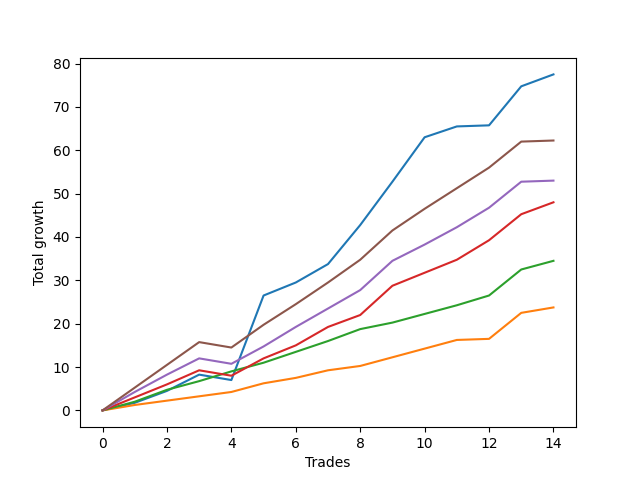

# Short Pointer 002 DB 
- Symbol: ES_SmolBoi
- Date Range: 03/18/2022 - 07/29/2022
- Trading Period: 7:20-12:30
- Number of Trades: 14



| Name | Win Percent | Profit | Avg Profit / Trade | Avg Time / Trade |      | Name | Win Percent | Profit | Avg Profit / Trade | Avg Time / Trade |
| ---- | ----------- | ------ | ------------------ | ---------------- | ---- | ---- | ----------- | ------ | ------------------ | ---------------- |
| Sorted By <br> Profit | | | | | | Sorted By <br> Win Percentage ||||
| Two | 92.86 | 38750.00 | 2767.86 | 13:21 |     | Eighty-Two | 100.00 | 17250.00 | 1232.14 | 03:22 |
| Eighty-Five | 92.86 | 31125.00 | 2223.21 | 11:33 |     | Eighty-One | 100.00 | 11875.00 | 848.21 | 02:32 |
| Eighty-Four | 92.86 | 26500.00 | 1892.86 | 10:44 |     | Two | 92.86 | 38750.00 | 2767.86 | 13:21 |
| Eighty-Three | 92.86 | 24000.00 | 1714.29 | 09:45 |     | Eighty-Five | 92.86 | 31125.00 | 2223.21 | 11:33 |
| Eighty-Two | 100.00 | 17250.00 | 1232.14 | 03:22 |     | Eighty-Four | 92.86 | 26500.00 | 1892.86 | 10:44 |
| Eighty-One | 100.00 | 11875.00 | 848.21 | 02:32 |     | Eighty-Three | 92.86 | 24000.00 | 1714.29 | 09:45 |

## NO STOPLOSS

### Test Two
* Sell when the price hits the upper line of the 20p 2std bollinger
* No Stoploss
* Results:
```
Total Trades: 14
Percent Up: 7.14
Percent Down: 92.86
Total Points Moved Down: 77.50
Potential Profit: 38750.00
Total Points Ups: 1.25 Count Ups: 1
Total Points Downs: 78.75 Count Downs: 13
```

<details><summary>Trades</summary>

<code>In: 2022-03-25 11:34:00		Out: 2022-03-25 12:00:55		Total Position Time: 26:55		Total Move Down: 1.75		Total to Date: 1.75</code> <br />
<code>In: 2022-03-25 11:57:00		Out: 2022-03-25 12:00:55		Total Position Time: 03:55		Total Move Down: 2.75		Total to Date: 4.50</code> <br />
<code>In: 2022-03-29 08:53:00		Out: 2022-03-29 09:01:40		Total Position Time: 08:40		Total Move Down: 3.75		Total to Date: 8.25</code> <br />
<code>In: 2022-04-25 09:29:00		Out: 2022-04-25 09:58:55		Total Position Time: 29:55		Total Move Down: -1.25		Total to Date: 7.00</code> <br />
<code>In: 2022-04-26 10:02:00		Out: 2022-04-26 10:22:20		Total Position Time: 20:20		Total Move Down: 19.50		Total to Date: 26.50</code> <br />
<code>In: 2022-05-25 10:40:00		Out: 2022-05-25 10:52:10		Total Position Time: 12:10		Total Move Down: 3.00		Total to Date: 29.50</code> <br />
<code>In: 2022-06-01 12:19:00		Out: 2022-06-01 12:30:05		Total Position Time: 11:05		Total Move Down: 4.25		Total to Date: 33.75</code> <br />
<code>In: 2022-06-09 08:47:00		Out: 2022-06-09 09:11:05		Total Position Time: 24:05		Total Move Down: 9.00		Total to Date: 42.75</code> <br />
<code>In: 2022-06-15 11:02:00		Out: 2022-06-15 11:03:05		Total Position Time: 01:05		Total Move Down: 10.00		Total to Date: 52.75</code> <br />
<code>In: 2022-06-17 08:35:00		Out: 2022-06-17 08:45:15		Total Position Time: 10:15		Total Move Down: 10.25		Total to Date: 63.00</code> <br />
<code>In: 2022-06-29 12:20:00		Out: 2022-06-29 12:35:20		Total Position Time: 15:20		Total Move Down: 2.50		Total to Date: 65.50</code> <br />
<code>In: 2022-07-06 11:00:00		Out: 2022-07-06 11:00:10		Total Position Time: 00:10		Total Move Down: 0.25		Total to Date: 65.75</code> <br />
<code>In: 2022-07-06 11:11:00		Out: 2022-07-06 11:11:45		Total Position Time: 00:45		Total Move Down: 9.00		Total to Date: 74.75</code> <br />
<code>In: 2022-07-18 08:46:00		Out: 2022-07-18 09:08:15		Total Position Time: 22:15		Total Move Down: 2.75		Total to Date: 77.50</code> <br />


</details>

## TAKE PROFIT

### Test Eighty-One
* Take Profit of 1 Point
* No Stoploss
* Results:
```
Total Trades: 14
Percent Up: 0.00
Percent Down: 100.00
Total Points Moved Down: 23.75
Potential Profit: 11875.00
Total Points Ups: 0.00 Count Ups: 0
Total Points Downs: 23.75 Count Downs: 14
```

<details><summary>Trades</summary>

<code>In: 2022-03-25 11:34:00		Out: 2022-03-25 11:35:15		Total Position Time: 01:15		Total Move Down: 1.25		Total to Date: 1.25</code> <br />
<code>In: 2022-03-25 11:57:00		Out: 2022-03-25 11:58:45		Total Position Time: 01:45		Total Move Down: 1.00		Total to Date: 2.25</code> <br />
<code>In: 2022-03-29 08:53:00		Out: 2022-03-29 08:57:35		Total Position Time: 04:35		Total Move Down: 1.00		Total to Date: 3.25</code> <br />
<code>In: 2022-04-25 09:29:00		Out: 2022-04-25 09:31:05		Total Position Time: 02:05		Total Move Down: 1.00		Total to Date: 4.25</code> <br />
<code>In: 2022-04-26 10:02:00		Out: 2022-04-26 10:02:10		Total Position Time: 00:10		Total Move Down: 2.00		Total to Date: 6.25</code> <br />
<code>In: 2022-05-25 10:40:00		Out: 2022-05-25 10:41:05		Total Position Time: 01:05		Total Move Down: 1.25		Total to Date: 7.50</code> <br />
<code>In: 2022-06-01 12:19:00		Out: 2022-06-01 12:25:30		Total Position Time: 06:30		Total Move Down: 1.75		Total to Date: 9.25</code> <br />
<code>In: 2022-06-09 08:47:00		Out: 2022-06-09 08:48:05		Total Position Time: 01:05		Total Move Down: 1.00		Total to Date: 10.25</code> <br />
<code>In: 2022-06-15 11:02:00		Out: 2022-06-15 11:02:10		Total Position Time: 00:10		Total Move Down: 2.00		Total to Date: 12.25</code> <br />
<code>In: 2022-06-17 08:35:00		Out: 2022-06-17 08:35:45		Total Position Time: 00:45		Total Move Down: 2.00		Total to Date: 14.25</code> <br />
<code>In: 2022-06-29 12:20:00		Out: 2022-06-29 12:34:15		Total Position Time: 14:15		Total Move Down: 2.00		Total to Date: 16.25</code> <br />
<code>In: 2022-07-06 11:00:00		Out: 2022-07-06 11:00:10		Total Position Time: 00:10		Total Move Down: 0.25		Total to Date: 16.50</code> <br />
<code>In: 2022-07-06 11:11:00		Out: 2022-07-06 11:11:10		Total Position Time: 00:10		Total Move Down: 6.00		Total to Date: 22.50</code> <br />
<code>In: 2022-07-18 08:46:00		Out: 2022-07-18 08:47:35		Total Position Time: 01:35		Total Move Down: 1.25		Total to Date: 23.75</code> <br />


</details>

### Test Eighty-Two
* Take Profit of 2 Point
* No Stoploss
* Results:
```
Total Trades: 14
Percent Up: 0.00
Percent Down: 100.00
Total Points Moved Down: 34.50
Potential Profit: 17250.00
Total Points Ups: 0.00 Count Ups: 0
Total Points Downs: 34.50 Count Downs: 14
```

<details><summary>Trades</summary>

<code>In: 2022-03-25 11:34:00		Out: 2022-03-25 11:40:25		Total Position Time: 06:25		Total Move Down: 2.00		Total to Date: 2.00</code> <br />
<code>In: 2022-03-25 11:57:00		Out: 2022-03-25 12:00:50		Total Position Time: 03:50		Total Move Down: 2.75		Total to Date: 4.75</code> <br />
<code>In: 2022-03-29 08:53:00		Out: 2022-03-29 08:58:35		Total Position Time: 05:35		Total Move Down: 2.00		Total to Date: 6.75</code> <br />
<code>In: 2022-04-25 09:29:00		Out: 2022-04-25 09:31:10		Total Position Time: 02:10		Total Move Down: 2.25		Total to Date: 9.00</code> <br />
<code>In: 2022-04-26 10:02:00		Out: 2022-04-26 10:02:10		Total Position Time: 00:10		Total Move Down: 2.00		Total to Date: 11.00</code> <br />
<code>In: 2022-05-25 10:40:00		Out: 2022-05-25 10:41:15		Total Position Time: 01:15		Total Move Down: 2.50		Total to Date: 13.50</code> <br />
<code>In: 2022-06-01 12:19:00		Out: 2022-06-01 12:25:40		Total Position Time: 06:40		Total Move Down: 2.50		Total to Date: 16.00</code> <br />
<code>In: 2022-06-09 08:47:00		Out: 2022-06-09 08:48:20		Total Position Time: 01:20		Total Move Down: 2.75		Total to Date: 18.75</code> <br />
<code>In: 2022-06-15 11:02:00		Out: 2022-06-15 11:02:45		Total Position Time: 00:45		Total Move Down: 1.50		Total to Date: 20.25</code> <br />
<code>In: 2022-06-17 08:35:00		Out: 2022-06-17 08:35:45		Total Position Time: 00:45		Total Move Down: 2.00		Total to Date: 22.25</code> <br />
<code>In: 2022-06-29 12:20:00		Out: 2022-06-29 12:34:15		Total Position Time: 14:15		Total Move Down: 2.00		Total to Date: 24.25</code> <br />
<code>In: 2022-07-06 11:00:00		Out: 2022-07-06 11:00:15		Total Position Time: 00:15		Total Move Down: 2.25		Total to Date: 26.50</code> <br />
<code>In: 2022-07-06 11:11:00		Out: 2022-07-06 11:11:10		Total Position Time: 00:10		Total Move Down: 6.00		Total to Date: 32.50</code> <br />
<code>In: 2022-07-18 08:46:00		Out: 2022-07-18 08:49:35		Total Position Time: 03:35		Total Move Down: 2.00		Total to Date: 34.50</code> <br />


</details>

### Test Eighty-Three
* Take Profit of 3 Point
* No Stoploss
* Results:
```
Total Trades: 14
Percent Up: 7.14
Percent Down: 92.86
Total Points Moved Down: 48.00
Potential Profit: 24000.00
Total Points Ups: 1.25 Count Ups: 1
Total Points Downs: 49.25 Count Downs: 13
```

<details><summary>Trades</summary>

<code>In: 2022-03-25 11:34:00		Out: 2022-03-25 12:01:45		Total Position Time: 27:45		Total Move Down: 3.00		Total to Date: 3.00</code> <br />
<code>In: 2022-03-25 11:57:00		Out: 2022-03-25 12:01:00		Total Position Time: 04:00		Total Move Down: 3.00		Total to Date: 6.00</code> <br />
<code>In: 2022-03-29 08:53:00		Out: 2022-03-29 09:01:35		Total Position Time: 08:35		Total Move Down: 3.25		Total to Date: 9.25</code> <br />
<code>In: 2022-04-25 09:29:00		Out: 2022-04-25 09:58:55		Total Position Time: 29:55		Total Move Down: -1.25		Total to Date: 8.00</code> <br />
<code>In: 2022-04-26 10:02:00		Out: 2022-04-26 10:02:25		Total Position Time: 00:25		Total Move Down: 4.00		Total to Date: 12.00</code> <br />
<code>In: 2022-05-25 10:40:00		Out: 2022-05-25 10:52:10		Total Position Time: 12:10		Total Move Down: 3.00		Total to Date: 15.00</code> <br />
<code>In: 2022-06-01 12:19:00		Out: 2022-06-01 12:30:05		Total Position Time: 11:05		Total Move Down: 4.25		Total to Date: 19.25</code> <br />
<code>In: 2022-06-09 08:47:00		Out: 2022-06-09 08:48:20		Total Position Time: 01:20		Total Move Down: 2.75		Total to Date: 22.00</code> <br />
<code>In: 2022-06-15 11:02:00		Out: 2022-06-15 11:03:00		Total Position Time: 01:00		Total Move Down: 6.75		Total to Date: 28.75</code> <br />
<code>In: 2022-06-17 08:35:00		Out: 2022-06-17 08:36:55		Total Position Time: 01:55		Total Move Down: 3.00		Total to Date: 31.75</code> <br />
<code>In: 2022-06-29 12:20:00		Out: 2022-06-29 12:35:15		Total Position Time: 15:15		Total Move Down: 3.00		Total to Date: 34.75</code> <br />
<code>In: 2022-07-06 11:00:00		Out: 2022-07-06 11:00:40		Total Position Time: 00:40		Total Move Down: 4.50		Total to Date: 39.25</code> <br />
<code>In: 2022-07-06 11:11:00		Out: 2022-07-06 11:11:10		Total Position Time: 00:10		Total Move Down: 6.00		Total to Date: 45.25</code> <br />
<code>In: 2022-07-18 08:46:00		Out: 2022-07-18 09:08:15		Total Position Time: 22:15		Total Move Down: 2.75		Total to Date: 48.00</code> <br />


</details>

### Test Eighty-Four
* Take Profit of 4 Point
* No Stoploss
* Results:
```
Total Trades: 14
Percent Up: 7.14
Percent Down: 92.86
Total Points Moved Down: 53.00
Potential Profit: 26500.00
Total Points Ups: 1.25 Count Ups: 1
Total Points Downs: 54.25 Count Downs: 13
```

<details><summary>Trades</summary>

<code>In: 2022-03-25 11:34:00		Out: 2022-03-25 12:01:55		Total Position Time: 27:55		Total Move Down: 4.25		Total to Date: 4.25</code> <br />
<code>In: 2022-03-25 11:57:00		Out: 2022-03-25 12:01:45		Total Position Time: 04:45		Total Move Down: 4.00		Total to Date: 8.25</code> <br />
<code>In: 2022-03-29 08:53:00		Out: 2022-03-29 09:01:40		Total Position Time: 08:40		Total Move Down: 3.75		Total to Date: 12.00</code> <br />
<code>In: 2022-04-25 09:29:00		Out: 2022-04-25 09:58:55		Total Position Time: 29:55		Total Move Down: -1.25		Total to Date: 10.75</code> <br />
<code>In: 2022-04-26 10:02:00		Out: 2022-04-26 10:02:25		Total Position Time: 00:25		Total Move Down: 4.00		Total to Date: 14.75</code> <br />
<code>In: 2022-05-25 10:40:00		Out: 2022-05-25 10:53:35		Total Position Time: 13:35		Total Move Down: 4.50		Total to Date: 19.25</code> <br />
<code>In: 2022-06-01 12:19:00		Out: 2022-06-01 12:30:05		Total Position Time: 11:05		Total Move Down: 4.25		Total to Date: 23.50</code> <br />
<code>In: 2022-06-09 08:47:00		Out: 2022-06-09 08:48:35		Total Position Time: 01:35		Total Move Down: 4.25		Total to Date: 27.75</code> <br />
<code>In: 2022-06-15 11:02:00		Out: 2022-06-15 11:03:00		Total Position Time: 01:00		Total Move Down: 6.75		Total to Date: 34.50</code> <br />
<code>In: 2022-06-17 08:35:00		Out: 2022-06-17 08:38:35		Total Position Time: 03:35		Total Move Down: 3.75		Total to Date: 38.25</code> <br />
<code>In: 2022-06-29 12:20:00		Out: 2022-06-29 12:37:05		Total Position Time: 17:05		Total Move Down: 4.00		Total to Date: 42.25</code> <br />
<code>In: 2022-07-06 11:00:00		Out: 2022-07-06 11:00:40		Total Position Time: 00:40		Total Move Down: 4.50		Total to Date: 46.75</code> <br />
<code>In: 2022-07-06 11:11:00		Out: 2022-07-06 11:11:10		Total Position Time: 00:10		Total Move Down: 6.00		Total to Date: 52.75</code> <br />
<code>In: 2022-07-18 08:46:00		Out: 2022-07-18 09:15:55		Total Position Time: 29:55		Total Move Down: 0.25		Total to Date: 53.00</code> <br />


</details>

### Test Eighty-Five
* Take Profit of 5 Point
* No Stoploss
* Results:
```
Total Trades: 14
Percent Up: 7.14
Percent Down: 92.86
Total Points Moved Down: 62.25
Potential Profit: 31125.00
Total Points Ups: 1.25 Count Ups: 1
Total Points Downs: 63.50 Count Downs: 13
```

<details><summary>Trades</summary>

<code>In: 2022-03-25 11:34:00		Out: 2022-03-25 12:02:00		Total Position Time: 28:00		Total Move Down: 5.25		Total to Date: 5.25</code> <br />
<code>In: 2022-03-25 11:57:00		Out: 2022-03-25 12:01:55		Total Position Time: 04:55		Total Move Down: 5.25		Total to Date: 10.50</code> <br />
<code>In: 2022-03-29 08:53:00		Out: 2022-03-29 09:02:10		Total Position Time: 09:10		Total Move Down: 5.25		Total to Date: 15.75</code> <br />
<code>In: 2022-04-25 09:29:00		Out: 2022-04-25 09:58:55		Total Position Time: 29:55		Total Move Down: -1.25		Total to Date: 14.50</code> <br />
<code>In: 2022-04-26 10:02:00		Out: 2022-04-26 10:02:30		Total Position Time: 00:30		Total Move Down: 5.25		Total to Date: 19.75</code> <br />
<code>In: 2022-05-25 10:40:00		Out: 2022-05-25 10:56:15		Total Position Time: 16:15		Total Move Down: 4.75		Total to Date: 24.50</code> <br />
<code>In: 2022-06-01 12:19:00		Out: 2022-06-01 12:32:50		Total Position Time: 13:50		Total Move Down: 5.00		Total to Date: 29.50</code> <br />
<code>In: 2022-06-09 08:47:00		Out: 2022-06-09 08:48:50		Total Position Time: 01:50		Total Move Down: 5.25		Total to Date: 34.75</code> <br />
<code>In: 2022-06-15 11:02:00		Out: 2022-06-15 11:03:00		Total Position Time: 01:00		Total Move Down: 6.75		Total to Date: 41.50</code> <br />
<code>In: 2022-06-17 08:35:00		Out: 2022-06-17 08:39:00		Total Position Time: 04:00		Total Move Down: 5.00		Total to Date: 46.50</code> <br />
<code>In: 2022-06-29 12:20:00		Out: 2022-06-29 12:41:05		Total Position Time: 21:05		Total Move Down: 4.75		Total to Date: 51.25</code> <br />
<code>In: 2022-07-06 11:00:00		Out: 2022-07-06 11:01:15		Total Position Time: 01:15		Total Move Down: 4.75		Total to Date: 56.00</code> <br />
<code>In: 2022-07-06 11:11:00		Out: 2022-07-06 11:11:10		Total Position Time: 00:10		Total Move Down: 6.00		Total to Date: 62.00</code> <br />
<code>In: 2022-07-18 08:46:00		Out: 2022-07-18 09:15:55		Total Position Time: 29:55		Total Move Down: 0.25		Total to Date: 62.25</code> <br />


</details>