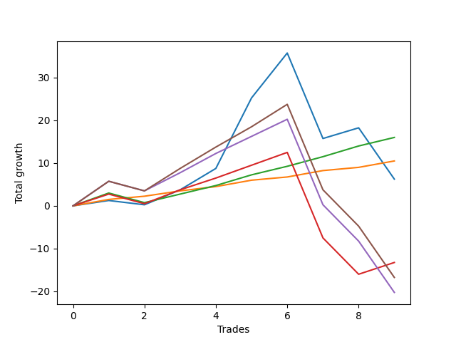

# Short Pointer 004 
- Symbol: ES_SmolBoi
- Date Range: 03/18/2022 - 07/29/2022
- Trading Period: 7:20-12:30
- Number of Trades: 9



| Name | Win Percent | Profit | Avg Profit / Trade | Avg Time / Trade |      | Name | Win Percent | Profit | Avg Profit / Trade | Avg Time / Trade |
| ---- | ----------- | ------ | ------------------ | ---------------- | ---- | ---- | ----------- | ------ | ------------------ | ---------------- |
| Sorted By <br> Profit | | | | | | Sorted By <br> Win Percentage ||||
| Eighty-Two | 88.89 | 8000.00 | 888.89 | 07:11 |     | Eighty-One | 100.00 | 5250.00 | 583.33 | 05:28 |
| Eighty-One | 100.00 | 5250.00 | 583.33 | 05:28 |     | Eighty-Two | 88.89 | 8000.00 | 888.89 | 07:11 |
| Two | 66.67 | 3125.00 | 347.22 | 16:53 |     | Two | 66.67 | 3125.00 | 347.22 | 16:53 |
| Eighty-Three | 66.67 | -6625.00 | -736.11 | 13:43 |     | Eighty-Three | 66.67 | -6625.00 | -736.11 | 13:43 |
| Eighty-Five | 55.56 | -8375.00 | -930.56 | 20:13 |     | Eighty-Five | 55.56 | -8375.00 | -930.56 | 20:13 |
| Eighty-Four | 55.56 | -10125.00 | -1125.00 | 18:09 |     | Eighty-Four | 55.56 | -10125.00 | -1125.00 | 18:09 |

## NO STOPLOSS

### Test Two
* Sell when the price hits the upper line of the 20p 2std bollinger
* No Stoploss
* Results:
```
Total Trades: 9
Percent Up: 33.33
Percent Down: 66.67
Total Points Moved Down: 6.25
Potential Profit: 3125.00
Total Points Ups: 33.00 Count Ups: 3
Total Points Downs: 39.25 Count Downs: 6
```

<details><summary>Trades</summary>

<code>In: 2022-03-21 11:32:00		Out: 2022-03-21 11:42:15		Total Position Time: 10:15		Total Move Down: 1.25		Total to Date: 1.25</code> <br />
<code>In: 2022-03-28 10:33:00		Out: 2022-03-28 10:55:00		Total Position Time: 22:00		Total Move Down: -1.00		Total to Date: 0.25</code> <br />
<code>In: 2022-04-11 10:09:00		Out: 2022-04-11 10:19:05		Total Position Time: 10:05		Total Move Down: 3.50		Total to Date: 3.75</code> <br />
<code>In: 2022-04-29 08:37:00		Out: 2022-04-29 08:57:25		Total Position Time: 20:25		Total Move Down: 5.00		Total to Date: 8.75</code> <br />
<code>In: 2022-05-05 10:11:00		Out: 2022-05-05 10:16:35		Total Position Time: 05:35		Total Move Down: 16.50		Total to Date: 25.25</code> <br />
<code>In: 2022-05-10 10:11:00		Out: 2022-05-10 10:24:00		Total Position Time: 13:00		Total Move Down: 10.50		Total to Date: 35.75</code> <br />
<code>In: 2022-06-30 08:02:00		Out: 2022-06-30 08:31:55		Total Position Time: 29:55		Total Move Down: -20.00		Total to Date: 15.75</code> <br />
<code>In: 2022-07-05 08:53:00		Out: 2022-07-05 09:03:50		Total Position Time: 10:50		Total Move Down: 2.50		Total to Date: 18.25</code> <br />
<code>In: 2022-07-22 12:00:00		Out: 2022-07-22 12:29:55		Total Position Time: 29:55		Total Move Down: -12.00		Total to Date: 6.25</code> <br />


</details>

## TAKE PROFIT

### Test Eighty-One
* Take Profit of 1 Point
* No Stoploss
* Results:
```
Total Trades: 9
Percent Up: 0.00
Percent Down: 100.00
Total Points Moved Down: 10.50
Potential Profit: 5250.00
Total Points Ups: 0.00 Count Ups: 0
Total Points Downs: 10.50 Count Downs: 9
```

<details><summary>Trades</summary>

<code>In: 2022-03-21 11:32:00		Out: 2022-03-21 11:35:45		Total Position Time: 03:45		Total Move Down: 1.50		Total to Date: 1.50</code> <br />
<code>In: 2022-03-28 10:33:00		Out: 2022-03-28 10:57:00		Total Position Time: 24:00		Total Move Down: 0.75		Total to Date: 2.25</code> <br />
<code>In: 2022-04-11 10:09:00		Out: 2022-04-11 10:16:15		Total Position Time: 07:15		Total Move Down: 1.25		Total to Date: 3.50</code> <br />
<code>In: 2022-04-29 08:37:00		Out: 2022-04-29 08:38:15		Total Position Time: 01:15		Total Move Down: 1.00		Total to Date: 4.50</code> <br />
<code>In: 2022-05-05 10:11:00		Out: 2022-05-05 10:11:10		Total Position Time: 00:10		Total Move Down: 1.50		Total to Date: 6.00</code> <br />
<code>In: 2022-05-10 10:11:00		Out: 2022-05-10 10:11:10		Total Position Time: 00:10		Total Move Down: 0.75		Total to Date: 6.75</code> <br />
<code>In: 2022-06-30 08:02:00		Out: 2022-06-30 08:03:50		Total Position Time: 01:50		Total Move Down: 1.50		Total to Date: 8.25</code> <br />
<code>In: 2022-07-05 08:53:00		Out: 2022-07-05 09:03:45		Total Position Time: 10:45		Total Move Down: 0.75		Total to Date: 9.00</code> <br />
<code>In: 2022-07-22 12:00:00		Out: 2022-07-22 12:00:10		Total Position Time: 00:10		Total Move Down: 1.50		Total to Date: 10.50</code> <br />


</details>

### Test Eighty-Two
* Take Profit of 2 Point
* No Stoploss
* Results:
```
Total Trades: 9
Percent Up: 11.11
Percent Down: 88.89
Total Points Moved Down: 16.00
Potential Profit: 8000.00
Total Points Ups: 2.25 Count Ups: 1
Total Points Downs: 18.25 Count Downs: 8
```

<details><summary>Trades</summary>

<code>In: 2022-03-21 11:32:00		Out: 2022-03-21 11:42:30		Total Position Time: 10:30		Total Move Down: 3.00		Total to Date: 3.00</code> <br />
<code>In: 2022-03-28 10:33:00		Out: 2022-03-28 11:02:55		Total Position Time: 29:55		Total Move Down: -2.25		Total to Date: 0.75</code> <br />
<code>In: 2022-04-11 10:09:00		Out: 2022-04-11 10:17:05		Total Position Time: 08:05		Total Move Down: 2.00		Total to Date: 2.75</code> <br />
<code>In: 2022-04-29 08:37:00		Out: 2022-04-29 08:38:30		Total Position Time: 01:30		Total Move Down: 2.00		Total to Date: 4.75</code> <br />
<code>In: 2022-05-05 10:11:00		Out: 2022-05-05 10:11:15		Total Position Time: 00:15		Total Move Down: 2.50		Total to Date: 7.25</code> <br />
<code>In: 2022-05-10 10:11:00		Out: 2022-05-10 10:12:10		Total Position Time: 01:10		Total Move Down: 2.00		Total to Date: 9.25</code> <br />
<code>In: 2022-06-30 08:02:00		Out: 2022-06-30 08:04:05		Total Position Time: 02:05		Total Move Down: 2.25		Total to Date: 11.50</code> <br />
<code>In: 2022-07-05 08:53:00		Out: 2022-07-05 09:03:50		Total Position Time: 10:50		Total Move Down: 2.50		Total to Date: 14.00</code> <br />
<code>In: 2022-07-22 12:00:00		Out: 2022-07-22 12:00:25		Total Position Time: 00:25		Total Move Down: 2.00		Total to Date: 16.00</code> <br />


</details>

### Test Eighty-Three
* Take Profit of 3 Point
* No Stoploss
* Results:
```
Total Trades: 9
Percent Up: 33.33
Percent Down: 66.67
Total Points Moved Down: -13.25
Potential Profit: -6625.00
Total Points Ups: 30.75 Count Ups: 3
Total Points Downs: 17.50 Count Downs: 6
```

<details><summary>Trades</summary>

<code>In: 2022-03-21 11:32:00		Out: 2022-03-21 11:42:35		Total Position Time: 10:35		Total Move Down: 2.75		Total to Date: 2.75</code> <br />
<code>In: 2022-03-28 10:33:00		Out: 2022-03-28 11:02:55		Total Position Time: 29:55		Total Move Down: -2.25		Total to Date: 0.50</code> <br />
<code>In: 2022-04-11 10:09:00		Out: 2022-04-11 10:18:25		Total Position Time: 09:25		Total Move Down: 3.25		Total to Date: 3.75</code> <br />
<code>In: 2022-04-29 08:37:00		Out: 2022-04-29 08:38:45		Total Position Time: 01:45		Total Move Down: 2.75		Total to Date: 6.50</code> <br />
<code>In: 2022-05-05 10:11:00		Out: 2022-05-05 10:12:30		Total Position Time: 01:30		Total Move Down: 3.00		Total to Date: 9.50</code> <br />
<code>In: 2022-05-10 10:11:00		Out: 2022-05-10 10:12:25		Total Position Time: 01:25		Total Move Down: 3.00		Total to Date: 12.50</code> <br />
<code>In: 2022-06-30 08:02:00		Out: 2022-06-30 08:31:55		Total Position Time: 29:55		Total Move Down: -20.00		Total to Date: -7.50</code> <br />
<code>In: 2022-07-05 08:53:00		Out: 2022-07-05 09:22:55		Total Position Time: 29:55		Total Move Down: -8.50		Total to Date: -16.00</code> <br />
<code>In: 2022-07-22 12:00:00		Out: 2022-07-22 12:09:05		Total Position Time: 09:05		Total Move Down: 2.75		Total to Date: -13.25</code> <br />


</details>

### Test Eighty-Four
* Take Profit of 4 Point
* No Stoploss
* Results:
```
Total Trades: 9
Percent Up: 44.44
Percent Down: 55.56
Total Points Moved Down: -20.25
Potential Profit: -10125.00
Total Points Ups: 42.75 Count Ups: 4
Total Points Downs: 22.50 Count Downs: 5
```

<details><summary>Trades</summary>

<code>In: 2022-03-21 11:32:00		Out: 2022-03-21 11:55:35		Total Position Time: 23:35		Total Move Down: 5.75		Total to Date: 5.75</code> <br />
<code>In: 2022-03-28 10:33:00		Out: 2022-03-28 11:02:55		Total Position Time: 29:55		Total Move Down: -2.25		Total to Date: 3.50</code> <br />
<code>In: 2022-04-11 10:09:00		Out: 2022-04-11 10:21:25		Total Position Time: 12:25		Total Move Down: 4.25		Total to Date: 7.75</code> <br />
<code>In: 2022-04-29 08:37:00		Out: 2022-04-29 08:40:05		Total Position Time: 03:05		Total Move Down: 4.50		Total to Date: 12.25</code> <br />
<code>In: 2022-05-05 10:11:00		Out: 2022-05-05 10:12:45		Total Position Time: 01:45		Total Move Down: 4.00		Total to Date: 16.25</code> <br />
<code>In: 2022-05-10 10:11:00		Out: 2022-05-10 10:13:55		Total Position Time: 02:55		Total Move Down: 4.00		Total to Date: 20.25</code> <br />
<code>In: 2022-06-30 08:02:00		Out: 2022-06-30 08:31:55		Total Position Time: 29:55		Total Move Down: -20.00		Total to Date: 0.25</code> <br />
<code>In: 2022-07-05 08:53:00		Out: 2022-07-05 09:22:55		Total Position Time: 29:55		Total Move Down: -8.50		Total to Date: -8.25</code> <br />
<code>In: 2022-07-22 12:00:00		Out: 2022-07-22 12:29:55		Total Position Time: 29:55		Total Move Down: -12.00		Total to Date: -20.25</code> <br />


</details>

### Test Eighty-Five
* Take Profit of 5 Point
* No Stoploss
* Results:
```
Total Trades: 9
Percent Up: 44.44
Percent Down: 55.56
Total Points Moved Down: -16.75
Potential Profit: -8375.00
Total Points Ups: 42.75 Count Ups: 4
Total Points Downs: 26.00 Count Downs: 5
```

<details><summary>Trades</summary>

<code>In: 2022-03-21 11:32:00		Out: 2022-03-21 11:55:35		Total Position Time: 23:35		Total Move Down: 5.75		Total to Date: 5.75</code> <br />
<code>In: 2022-03-28 10:33:00		Out: 2022-03-28 11:02:55		Total Position Time: 29:55		Total Move Down: -2.25		Total to Date: 3.50</code> <br />
<code>In: 2022-04-11 10:09:00		Out: 2022-04-11 10:22:25		Total Position Time: 13:25		Total Move Down: 5.25		Total to Date: 8.75</code> <br />
<code>In: 2022-04-29 08:37:00		Out: 2022-04-29 08:57:25		Total Position Time: 20:25		Total Move Down: 5.00		Total to Date: 13.75</code> <br />
<code>In: 2022-05-05 10:11:00		Out: 2022-05-05 10:12:50		Total Position Time: 01:50		Total Move Down: 4.75		Total to Date: 18.50</code> <br />
<code>In: 2022-05-10 10:11:00		Out: 2022-05-10 10:14:10		Total Position Time: 03:10		Total Move Down: 5.25		Total to Date: 23.75</code> <br />
<code>In: 2022-06-30 08:02:00		Out: 2022-06-30 08:31:55		Total Position Time: 29:55		Total Move Down: -20.00		Total to Date: 3.75</code> <br />
<code>In: 2022-07-05 08:53:00		Out: 2022-07-05 09:22:55		Total Position Time: 29:55		Total Move Down: -8.50		Total to Date: -4.75</code> <br />
<code>In: 2022-07-22 12:00:00		Out: 2022-07-22 12:29:55		Total Position Time: 29:55		Total Move Down: -12.00		Total to Date: -16.75</code> <br />


</details>