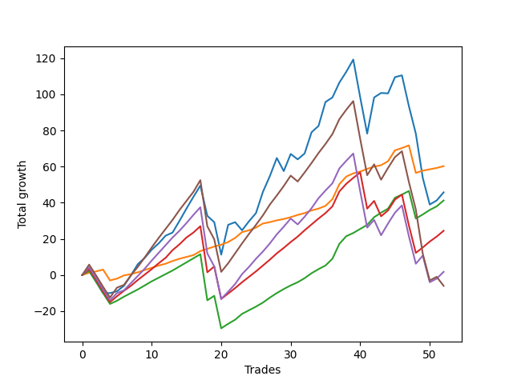

# Short Pointer 006 
- Symbol: ES_SmolBoi
- Date Range: 03/18/2022 - 07/29/2022
- Trading Period: 7:20-12:30
- Number of Trades: 52



| Name | Win Percent | Profit | Avg Profit / Trade | Avg Time / Trade |      | Name | Win Percent | Profit | Avg Profit / Trade | Avg Time / Trade |
| ---- | ----------- | ------ | ------------------ | ---------------- | ---- | ---- | ----------- | ------ | ------------------ | ---------------- |
| Sorted By <br> Profit | | | | | | Sorted By <br> Win Percentage ||||
| Eighty-One | 96.15 | 30125.00 | 579.33 | 03:21 |     | Eighty-One | 96.15 | 30125.00 | 579.33 | 03:21 |
| Two | 69.23 | 22875.00 | 439.90 | 16:05 |     | Eighty-Two | 88.46 | 20625.00 | 396.63 | 06:16 |
| Eighty-Two | 88.46 | 20625.00 | 396.63 | 06:16 |     | Eighty-Three | 82.69 | 12250.00 | 235.58 | 09:44 |
| Eighty-Three | 82.69 | 12250.00 | 235.58 | 09:44 |     | Eighty-Four | 75.00 | 875.00 | 16.83 | 13:25 |
| Eighty-Four | 75.00 | 875.00 | 16.83 | 13:25 |     | Eighty-Five | 71.15 | -3000.00 | -57.69 | 15:12 |
| Eighty-Five | 71.15 | -3000.00 | -57.69 | 15:12 |     | Two | 69.23 | 22875.00 | 439.90 | 16:05 |

## NO STOPLOSS

### Test Two
* Sell when the price hits the upper line of the 20p 2std bollinger
* No Stoploss
* Results:
```
Total Trades: 52
Percent Up: 30.77
Percent Down: 69.23
Total Points Moved Down: 45.75
Potential Profit: 22875.00
Total Points Ups: 178.00 Count Ups: 16
Total Points Downs: 223.75 Count Downs: 36
```

<details><summary>Trades</summary>

<code>In: 2022-03-25 11:58:00		Out: 2022-03-25 12:00:55		Total Position Time: 02:55		Total Move Down: 2.25		Total to Date: 2.25</code> <br />
<code>In: 2022-03-28 11:13:00		Out: 2022-03-28 11:42:55		Total Position Time: 29:55		Total Move Down: -6.00		Total to Date: -3.75</code> <br />
<code>In: 2022-03-28 12:02:00		Out: 2022-03-28 12:31:55		Total Position Time: 29:55		Total Move Down: -6.25		Total to Date: -10.00</code> <br />
<code>In: 2022-03-29 12:16:00		Out: 2022-03-29 12:27:50		Total Position Time: 11:50		Total Move Down: -0.00		Total to Date: -10.00</code> <br />
<code>In: 2022-03-30 09:47:00		Out: 2022-03-30 10:01:15		Total Position Time: 14:15		Total Move Down: 1.00		Total to Date: -9.00</code> <br />
<code>In: 2022-03-31 07:52:00		Out: 2022-03-31 08:08:30		Total Position Time: 16:30		Total Move Down: 3.00		Total to Date: -6.00</code> <br />
<code>In: 2022-03-31 12:06:00		Out: 2022-03-31 12:19:35		Total Position Time: 13:35		Total Move Down: 5.75		Total to Date: -0.25</code> <br />
<code>In: 2022-03-31 12:09:00		Out: 2022-03-31 12:19:35		Total Position Time: 10:35		Total Move Down: 6.25		Total to Date: 6.00</code> <br />
<code>In: 2022-04-06 08:54:00		Out: 2022-04-06 09:09:40		Total Position Time: 15:40		Total Move Down: 3.50		Total to Date: 9.50</code> <br />
<code>In: 2022-04-07 11:05:00		Out: 2022-04-07 11:18:20		Total Position Time: 13:20		Total Move Down: 4.50		Total to Date: 14.00</code> <br />
<code>In: 2022-04-11 10:09:00		Out: 2022-04-11 10:19:05		Total Position Time: 10:05		Total Move Down: 3.50		Total to Date: 17.50</code> <br />
<code>In: 2022-04-11 11:13:00		Out: 2022-04-11 11:14:30		Total Position Time: 01:30		Total Move Down: 4.25		Total to Date: 21.75</code> <br />
<code>In: 2022-04-20 07:44:00		Out: 2022-04-20 08:00:45		Total Position Time: 16:45		Total Move Down: 1.75		Total to Date: 23.50</code> <br />
<code>In: 2022-04-25 10:19:00		Out: 2022-04-25 10:33:35		Total Position Time: 14:35		Total Move Down: 6.50		Total to Date: 30.00</code> <br />
<code>In: 2022-04-26 09:32:00		Out: 2022-04-26 09:40:15		Total Position Time: 08:15		Total Move Down: 6.75		Total to Date: 36.75</code> <br />
<code>In: 2022-04-27 09:33:00		Out: 2022-04-27 10:00:10		Total Position Time: 27:10		Total Move Down: 6.50		Total to Date: 43.25</code> <br />
<code>In: 2022-04-29 10:40:00		Out: 2022-04-29 10:43:20		Total Position Time: 03:20		Total Move Down: 6.25		Total to Date: 49.50</code> <br />
<code>In: 2022-05-02 12:18:00		Out: 2022-05-02 12:45:05		Total Position Time: 27:05		Total Move Down: -16.75		Total to Date: 32.75</code> <br />
<code>In: 2022-05-03 08:12:00		Out: 2022-05-03 08:39:10		Total Position Time: 27:10		Total Move Down: -3.50		Total to Date: 29.25</code> <br />
<code>In: 2022-05-04 08:58:00		Out: 2022-05-04 09:27:55		Total Position Time: 29:55		Total Move Down: -18.00		Total to Date: 11.25</code> <br />
<code>In: 2022-05-05 10:11:00		Out: 2022-05-05 10:16:35		Total Position Time: 05:35		Total Move Down: 16.50		Total to Date: 27.75</code> <br />
<code>In: 2022-05-09 12:05:00		Out: 2022-05-09 12:20:35		Total Position Time: 15:35		Total Move Down: 1.50		Total to Date: 29.25</code> <br />
<code>In: 2022-05-12 12:29:00		Out: 2022-05-12 12:46:00		Total Position Time: 17:00		Total Move Down: -4.50		Total to Date: 24.75</code> <br />
<code>In: 2022-05-16 11:36:00		Out: 2022-05-16 11:45:35		Total Position Time: 09:35		Total Move Down: 5.00		Total to Date: 29.75</code> <br />
<code>In: 2022-05-17 09:49:00		Out: 2022-05-17 10:01:10		Total Position Time: 12:10		Total Move Down: 4.50		Total to Date: 34.25</code> <br />
<code>In: 2022-05-19 08:46:00		Out: 2022-05-19 08:56:05		Total Position Time: 10:05		Total Move Down: 11.75		Total to Date: 46.00</code> <br />
<code>In: 2022-05-19 11:57:00		Out: 2022-05-19 12:14:05		Total Position Time: 17:05		Total Move Down: 8.75		Total to Date: 54.75</code> <br />
<code>In: 2022-05-20 11:57:00		Out: 2022-05-20 12:07:15		Total Position Time: 10:15		Total Move Down: 10.00		Total to Date: 64.75</code> <br />
<code>In: 2022-05-31 07:25:00		Out: 2022-05-31 07:54:55		Total Position Time: 29:55		Total Move Down: -7.25		Total to Date: 57.50</code> <br />
<code>In: 2022-06-03 10:09:00		Out: 2022-06-03 10:17:55		Total Position Time: 08:55		Total Move Down: 9.50		Total to Date: 67.00</code> <br />
<code>In: 2022-06-10 10:32:00		Out: 2022-06-10 11:01:00		Total Position Time: 29:00		Total Move Down: -3.00		Total to Date: 64.00</code> <br />
<code>In: 2022-06-10 10:42:00		Out: 2022-06-10 11:01:00		Total Position Time: 19:00		Total Move Down: 3.25		Total to Date: 67.25</code> <br />
<code>In: 2022-06-10 12:30:00		Out: 2022-06-10 12:42:45		Total Position Time: 12:45		Total Move Down: 11.75		Total to Date: 79.00</code> <br />
<code>In: 2022-06-13 09:15:00		Out: 2022-06-13 09:30:15		Total Position Time: 15:15		Total Move Down: 3.50		Total to Date: 82.50</code> <br />
<code>In: 2022-06-13 09:42:00		Out: 2022-06-13 09:54:20		Total Position Time: 12:20		Total Move Down: 13.25		Total to Date: 95.75</code> <br />
<code>In: 2022-06-14 10:15:00		Out: 2022-06-14 10:31:00		Total Position Time: 16:00		Total Move Down: 2.50		Total to Date: 98.25</code> <br />
<code>In: 2022-06-15 11:03:00		Out: 2022-06-15 11:03:10		Total Position Time: 00:10		Total Move Down: 8.25		Total to Date: 106.50</code> <br />
<code>In: 2022-06-16 08:31:00		Out: 2022-06-16 08:41:25		Total Position Time: 10:25		Total Move Down: 6.00		Total to Date: 112.50</code> <br />
<code>In: 2022-06-27 08:00:00		Out: 2022-06-27 08:09:45		Total Position Time: 09:45		Total Move Down: 6.75		Total to Date: 119.25</code> <br />
<code>In: 2022-06-30 07:40:00		Out: 2022-06-30 08:09:55		Total Position Time: 29:55		Total Move Down: -21.00		Total to Date: 98.25</code> <br />
<code>In: 2022-06-30 08:02:00		Out: 2022-06-30 08:31:55		Total Position Time: 29:55		Total Move Down: -20.00		Total to Date: 78.25</code> <br />
<code>In: 2022-07-05 07:44:00		Out: 2022-07-05 08:01:10		Total Position Time: 17:10		Total Move Down: 20.00		Total to Date: 98.25</code> <br />
<code>In: 2022-07-05 08:53:00		Out: 2022-07-05 09:03:50		Total Position Time: 10:50		Total Move Down: 2.50		Total to Date: 100.75</code> <br />
<code>In: 2022-07-06 11:01:00		Out: 2022-07-06 11:02:20		Total Position Time: 01:20		Total Move Down: -0.25		Total to Date: 100.50</code> <br />
<code>In: 2022-07-06 11:11:00		Out: 2022-07-06 11:11:45		Total Position Time: 00:45		Total Move Down: 9.00		Total to Date: 109.50</code> <br />
<code>In: 2022-07-07 07:57:00		Out: 2022-07-07 08:21:00		Total Position Time: 24:00		Total Move Down: 1.00		Total to Date: 110.50</code> <br />
<code>In: 2022-07-14 07:57:00		Out: 2022-07-14 08:26:55		Total Position Time: 29:55		Total Move Down: -17.00		Total to Date: 93.50</code> <br />
<code>In: 2022-07-14 08:03:00		Out: 2022-07-14 08:32:55		Total Position Time: 29:55		Total Move Down: -15.25		Total to Date: 78.25</code> <br />
<code>In: 2022-07-14 08:13:00		Out: 2022-07-14 08:42:55		Total Position Time: 29:55		Total Move Down: -24.50		Total to Date: 53.75</code> <br />
<code>In: 2022-07-21 08:40:00		Out: 2022-07-21 09:09:55		Total Position Time: 29:55		Total Move Down: -14.75		Total to Date: 39.00</code> <br />
<code>In: 2022-07-22 12:27:00		Out: 2022-07-22 12:36:55		Total Position Time: 09:55		Total Move Down: 2.25		Total to Date: 41.25</code> <br />
<code>In: 2022-07-26 09:38:00		Out: 2022-07-26 09:45:55		Total Position Time: 07:55		Total Move Down: 4.50		Total to Date: 45.75</code> <br />


</details>

## TAKE PROFIT

### Test Eighty-One
* Take Profit of 1 Point
* No Stoploss
* Results:
```
Total Trades: 52
Percent Up: 3.85
Percent Down: 96.15
Total Points Moved Down: 60.25
Potential Profit: 30125.00
Total Points Ups: 21.25 Count Ups: 2
Total Points Downs: 81.50 Count Downs: 50
```

<details><summary>Trades</summary>

<code>In: 2022-03-25 11:58:00		Out: 2022-03-25 12:00:45		Total Position Time: 02:45		Total Move Down: 1.25		Total to Date: 1.25</code> <br />
<code>In: 2022-03-28 11:13:00		Out: 2022-03-28 11:20:40		Total Position Time: 07:40		Total Move Down: 0.75		Total to Date: 2.00</code> <br />
<code>In: 2022-03-28 12:02:00		Out: 2022-03-28 12:03:05		Total Position Time: 01:05		Total Move Down: 1.00		Total to Date: 3.00</code> <br />
<code>In: 2022-03-29 12:16:00		Out: 2022-03-29 12:45:55		Total Position Time: 29:55		Total Move Down: -6.00		Total to Date: -3.00</code> <br />
<code>In: 2022-03-30 09:47:00		Out: 2022-03-30 10:01:15		Total Position Time: 14:15		Total Move Down: 1.00		Total to Date: -2.00</code> <br />
<code>In: 2022-03-31 07:52:00		Out: 2022-03-31 07:53:10		Total Position Time: 01:10		Total Move Down: 1.75		Total to Date: -0.25</code> <br />
<code>In: 2022-03-31 12:06:00		Out: 2022-03-31 12:11:15		Total Position Time: 05:15		Total Move Down: 0.75		Total to Date: 0.50</code> <br />
<code>In: 2022-03-31 12:09:00		Out: 2022-03-31 12:11:10		Total Position Time: 02:10		Total Move Down: 1.00		Total to Date: 1.50</code> <br />
<code>In: 2022-04-06 08:54:00		Out: 2022-04-06 08:55:40		Total Position Time: 01:40		Total Move Down: 1.25		Total to Date: 2.75</code> <br />
<code>In: 2022-04-07 11:05:00		Out: 2022-04-07 11:05:10		Total Position Time: 00:10		Total Move Down: 1.25		Total to Date: 4.00</code> <br />
<code>In: 2022-04-11 10:09:00		Out: 2022-04-11 10:16:15		Total Position Time: 07:15		Total Move Down: 1.25		Total to Date: 5.25</code> <br />
<code>In: 2022-04-11 11:13:00		Out: 2022-04-11 11:13:10		Total Position Time: 00:10		Total Move Down: 1.00		Total to Date: 6.25</code> <br />
<code>In: 2022-04-20 07:44:00		Out: 2022-04-20 07:47:45		Total Position Time: 03:45		Total Move Down: 1.50		Total to Date: 7.75</code> <br />
<code>In: 2022-04-25 10:19:00		Out: 2022-04-25 10:19:30		Total Position Time: 00:30		Total Move Down: 1.25		Total to Date: 9.00</code> <br />
<code>In: 2022-04-26 09:32:00		Out: 2022-04-26 09:32:10		Total Position Time: 00:10		Total Move Down: 1.00		Total to Date: 10.00</code> <br />
<code>In: 2022-04-27 09:33:00		Out: 2022-04-27 09:33:25		Total Position Time: 00:25		Total Move Down: 1.00		Total to Date: 11.00</code> <br />
<code>In: 2022-04-29 10:40:00		Out: 2022-04-29 10:40:30		Total Position Time: 00:30		Total Move Down: 2.25		Total to Date: 13.25</code> <br />
<code>In: 2022-05-02 12:18:00		Out: 2022-05-02 12:18:25		Total Position Time: 00:25		Total Move Down: 1.25		Total to Date: 14.50</code> <br />
<code>In: 2022-05-03 08:12:00		Out: 2022-05-03 08:13:00		Total Position Time: 01:00		Total Move Down: 1.25		Total to Date: 15.75</code> <br />
<code>In: 2022-05-04 08:58:00		Out: 2022-05-04 09:02:35		Total Position Time: 04:35		Total Move Down: 1.00		Total to Date: 16.75</code> <br />
<code>In: 2022-05-05 10:11:00		Out: 2022-05-05 10:11:10		Total Position Time: 00:10		Total Move Down: 1.50		Total to Date: 18.25</code> <br />
<code>In: 2022-05-09 12:05:00		Out: 2022-05-09 12:09:35		Total Position Time: 04:35		Total Move Down: 2.25		Total to Date: 20.50</code> <br />
<code>In: 2022-05-12 12:29:00		Out: 2022-05-12 12:29:10		Total Position Time: 00:10		Total Move Down: 3.25		Total to Date: 23.75</code> <br />
<code>In: 2022-05-16 11:36:00		Out: 2022-05-16 11:36:10		Total Position Time: 00:10		Total Move Down: 1.00		Total to Date: 24.75</code> <br />
<code>In: 2022-05-17 09:49:00		Out: 2022-05-17 09:51:10		Total Position Time: 02:10		Total Move Down: 1.50		Total to Date: 26.25</code> <br />
<code>In: 2022-05-19 08:46:00		Out: 2022-05-19 08:53:35		Total Position Time: 07:35		Total Move Down: 2.25		Total to Date: 28.50</code> <br />
<code>In: 2022-05-19 11:57:00		Out: 2022-05-19 11:57:25		Total Position Time: 00:25		Total Move Down: 0.75		Total to Date: 29.25</code> <br />
<code>In: 2022-05-20 11:57:00		Out: 2022-05-20 11:59:45		Total Position Time: 02:45		Total Move Down: 1.00		Total to Date: 30.25</code> <br />
<code>In: 2022-05-31 07:25:00		Out: 2022-05-31 07:25:10		Total Position Time: 00:10		Total Move Down: 0.75		Total to Date: 31.00</code> <br />
<code>In: 2022-06-03 10:09:00		Out: 2022-06-03 10:09:10		Total Position Time: 00:10		Total Move Down: 1.00		Total to Date: 32.00</code> <br />
<code>In: 2022-06-10 10:32:00		Out: 2022-06-10 10:32:10		Total Position Time: 00:10		Total Move Down: 1.25		Total to Date: 33.25</code> <br />
<code>In: 2022-06-10 10:42:00		Out: 2022-06-10 10:44:25		Total Position Time: 02:25		Total Move Down: 1.00		Total to Date: 34.25</code> <br />
<code>In: 2022-06-10 12:30:00		Out: 2022-06-10 12:30:10		Total Position Time: 00:10		Total Move Down: 1.50		Total to Date: 35.75</code> <br />
<code>In: 2022-06-13 09:15:00		Out: 2022-06-13 09:15:10		Total Position Time: 00:10		Total Move Down: 1.00		Total to Date: 36.75</code> <br />
<code>In: 2022-06-13 09:42:00		Out: 2022-06-13 09:42:10		Total Position Time: 00:10		Total Move Down: 1.50		Total to Date: 38.25</code> <br />
<code>In: 2022-06-14 10:15:00		Out: 2022-06-14 10:15:10		Total Position Time: 00:10		Total Move Down: 3.75		Total to Date: 42.00</code> <br />
<code>In: 2022-06-15 11:03:00		Out: 2022-06-15 11:03:10		Total Position Time: 00:10		Total Move Down: 8.25		Total to Date: 50.25</code> <br />
<code>In: 2022-06-16 08:31:00		Out: 2022-06-16 08:31:10		Total Position Time: 00:10		Total Move Down: 4.25		Total to Date: 54.50</code> <br />
<code>In: 2022-06-27 08:00:00		Out: 2022-06-27 08:01:15		Total Position Time: 01:15		Total Move Down: 1.75		Total to Date: 56.25</code> <br />
<code>In: 2022-06-30 07:40:00		Out: 2022-06-30 07:40:10		Total Position Time: 00:10		Total Move Down: 1.00		Total to Date: 57.25</code> <br />
<code>In: 2022-06-30 08:02:00		Out: 2022-06-30 08:03:50		Total Position Time: 01:50		Total Move Down: 1.50		Total to Date: 58.75</code> <br />
<code>In: 2022-07-05 07:44:00		Out: 2022-07-05 07:44:20		Total Position Time: 00:20		Total Move Down: 1.25		Total to Date: 60.00</code> <br />
<code>In: 2022-07-05 08:53:00		Out: 2022-07-05 09:03:45		Total Position Time: 10:45		Total Move Down: 0.75		Total to Date: 60.75</code> <br />
<code>In: 2022-07-06 11:01:00		Out: 2022-07-06 11:02:25		Total Position Time: 01:25		Total Move Down: 2.25		Total to Date: 63.00</code> <br />
<code>In: 2022-07-06 11:11:00		Out: 2022-07-06 11:11:10		Total Position Time: 00:10		Total Move Down: 6.00		Total to Date: 69.00</code> <br />
<code>In: 2022-07-07 07:57:00		Out: 2022-07-07 07:57:10		Total Position Time: 00:10		Total Move Down: 1.25		Total to Date: 70.25</code> <br />
<code>In: 2022-07-14 07:57:00		Out: 2022-07-14 07:57:15		Total Position Time: 00:15		Total Move Down: 1.50		Total to Date: 71.75</code> <br />
<code>In: 2022-07-14 08:03:00		Out: 2022-07-14 08:32:55		Total Position Time: 29:55		Total Move Down: -15.25		Total to Date: 56.50</code> <br />
<code>In: 2022-07-14 08:13:00		Out: 2022-07-14 08:14:30		Total Position Time: 01:30		Total Move Down: 1.25		Total to Date: 57.75</code> <br />
<code>In: 2022-07-21 08:40:00		Out: 2022-07-21 08:48:55		Total Position Time: 08:55		Total Move Down: 0.75		Total to Date: 58.50</code> <br />
<code>In: 2022-07-22 12:27:00		Out: 2022-07-22 12:36:30		Total Position Time: 09:30		Total Move Down: 0.75		Total to Date: 59.25</code> <br />
<code>In: 2022-07-26 09:38:00		Out: 2022-07-26 09:40:05		Total Position Time: 02:05		Total Move Down: 1.00		Total to Date: 60.25</code> <br />


</details>

### Test Eighty-Two
* Take Profit of 2 Point
* No Stoploss
* Results:
```
Total Trades: 52
Percent Up: 11.54
Percent Down: 88.46
Total Points Moved Down: 41.25
Potential Profit: 20625.00
Total Points Ups: 77.00 Count Ups: 6
Total Points Downs: 118.25 Count Downs: 46
```

<details><summary>Trades</summary>

<code>In: 2022-03-25 11:58:00		Out: 2022-03-25 12:00:50		Total Position Time: 02:50		Total Move Down: 2.25		Total to Date: 2.25</code> <br />
<code>In: 2022-03-28 11:13:00		Out: 2022-03-28 11:42:55		Total Position Time: 29:55		Total Move Down: -6.00		Total to Date: -3.75</code> <br />
<code>In: 2022-03-28 12:02:00		Out: 2022-03-28 12:31:55		Total Position Time: 29:55		Total Move Down: -6.25		Total to Date: -10.00</code> <br />
<code>In: 2022-03-29 12:16:00		Out: 2022-03-29 12:45:55		Total Position Time: 29:55		Total Move Down: -6.00		Total to Date: -16.00</code> <br />
<code>In: 2022-03-30 09:47:00		Out: 2022-03-30 10:02:10		Total Position Time: 15:10		Total Move Down: 1.75		Total to Date: -14.25</code> <br />
<code>In: 2022-03-31 07:52:00		Out: 2022-03-31 07:54:45		Total Position Time: 02:45		Total Move Down: 2.25		Total to Date: -12.00</code> <br />
<code>In: 2022-03-31 12:06:00		Out: 2022-03-31 12:11:35		Total Position Time: 05:35		Total Move Down: 2.00		Total to Date: -10.00</code> <br />
<code>In: 2022-03-31 12:09:00		Out: 2022-03-31 12:11:20		Total Position Time: 02:20		Total Move Down: 2.00		Total to Date: -8.00</code> <br />
<code>In: 2022-04-06 08:54:00		Out: 2022-04-06 08:57:35		Total Position Time: 03:35		Total Move Down: 2.25		Total to Date: -5.75</code> <br />
<code>In: 2022-04-07 11:05:00		Out: 2022-04-07 11:06:00		Total Position Time: 01:00		Total Move Down: 2.25		Total to Date: -3.50</code> <br />
<code>In: 2022-04-11 10:09:00		Out: 2022-04-11 10:17:05		Total Position Time: 08:05		Total Move Down: 2.00		Total to Date: -1.50</code> <br />
<code>In: 2022-04-11 11:13:00		Out: 2022-04-11 11:13:30		Total Position Time: 00:30		Total Move Down: 2.00		Total to Date: 0.50</code> <br />
<code>In: 2022-04-20 07:44:00		Out: 2022-04-20 07:48:05		Total Position Time: 04:05		Total Move Down: 2.00		Total to Date: 2.50</code> <br />
<code>In: 2022-04-25 10:19:00		Out: 2022-04-25 10:22:40		Total Position Time: 03:40		Total Move Down: 2.25		Total to Date: 4.75</code> <br />
<code>In: 2022-04-26 09:32:00		Out: 2022-04-26 09:37:30		Total Position Time: 05:30		Total Move Down: 2.25		Total to Date: 7.00</code> <br />
<code>In: 2022-04-27 09:33:00		Out: 2022-04-27 09:33:55		Total Position Time: 00:55		Total Move Down: 2.25		Total to Date: 9.25</code> <br />
<code>In: 2022-04-29 10:40:00		Out: 2022-04-29 10:40:30		Total Position Time: 00:30		Total Move Down: 2.25		Total to Date: 11.50</code> <br />
<code>In: 2022-05-02 12:18:00		Out: 2022-05-02 12:46:00		Total Position Time: 28:00		Total Move Down: -25.50		Total to Date: -14.00</code> <br />
<code>In: 2022-05-03 08:12:00		Out: 2022-05-03 08:13:25		Total Position Time: 01:25		Total Move Down: 2.50		Total to Date: -11.50</code> <br />
<code>In: 2022-05-04 08:58:00		Out: 2022-05-04 09:27:55		Total Position Time: 29:55		Total Move Down: -18.00		Total to Date: -29.50</code> <br />
<code>In: 2022-05-05 10:11:00		Out: 2022-05-05 10:11:15		Total Position Time: 00:15		Total Move Down: 2.50		Total to Date: -27.00</code> <br />
<code>In: 2022-05-09 12:05:00		Out: 2022-05-09 12:09:35		Total Position Time: 04:35		Total Move Down: 2.25		Total to Date: -24.75</code> <br />
<code>In: 2022-05-12 12:29:00		Out: 2022-05-12 12:29:10		Total Position Time: 00:10		Total Move Down: 3.25		Total to Date: -21.50</code> <br />
<code>In: 2022-05-16 11:36:00		Out: 2022-05-16 11:36:25		Total Position Time: 00:25		Total Move Down: 2.00		Total to Date: -19.50</code> <br />
<code>In: 2022-05-17 09:49:00		Out: 2022-05-17 09:51:20		Total Position Time: 02:20		Total Move Down: 2.00		Total to Date: -17.50</code> <br />
<code>In: 2022-05-19 08:46:00		Out: 2022-05-19 08:53:35		Total Position Time: 07:35		Total Move Down: 2.25		Total to Date: -15.25</code> <br />
<code>In: 2022-05-19 11:57:00		Out: 2022-05-19 11:57:30		Total Position Time: 00:30		Total Move Down: 2.75		Total to Date: -12.50</code> <br />
<code>In: 2022-05-20 11:57:00		Out: 2022-05-20 12:02:25		Total Position Time: 05:25		Total Move Down: 2.50		Total to Date: -10.00</code> <br />
<code>In: 2022-05-31 07:25:00		Out: 2022-05-31 07:25:35		Total Position Time: 00:35		Total Move Down: 2.25		Total to Date: -7.75</code> <br />
<code>In: 2022-06-03 10:09:00		Out: 2022-06-03 10:13:30		Total Position Time: 04:30		Total Move Down: 2.00		Total to Date: -5.75</code> <br />
<code>In: 2022-06-10 10:32:00		Out: 2022-06-10 10:32:15		Total Position Time: 00:15		Total Move Down: 1.75		Total to Date: -4.00</code> <br />
<code>In: 2022-06-10 10:42:00		Out: 2022-06-10 10:58:20		Total Position Time: 16:20		Total Move Down: 2.25		Total to Date: -1.75</code> <br />
<code>In: 2022-06-10 12:30:00		Out: 2022-06-10 12:30:20		Total Position Time: 00:20		Total Move Down: 2.75		Total to Date: 1.00</code> <br />
<code>In: 2022-06-13 09:15:00		Out: 2022-06-13 09:16:45		Total Position Time: 01:45		Total Move Down: 2.25		Total to Date: 3.25</code> <br />
<code>In: 2022-06-13 09:42:00		Out: 2022-06-13 09:42:45		Total Position Time: 00:45		Total Move Down: 2.00		Total to Date: 5.25</code> <br />
<code>In: 2022-06-14 10:15:00		Out: 2022-06-14 10:15:10		Total Position Time: 00:10		Total Move Down: 3.75		Total to Date: 9.00</code> <br />
<code>In: 2022-06-15 11:03:00		Out: 2022-06-15 11:03:10		Total Position Time: 00:10		Total Move Down: 8.25		Total to Date: 17.25</code> <br />
<code>In: 2022-06-16 08:31:00		Out: 2022-06-16 08:31:10		Total Position Time: 00:10		Total Move Down: 4.25		Total to Date: 21.50</code> <br />
<code>In: 2022-06-27 08:00:00		Out: 2022-06-27 08:01:15		Total Position Time: 01:15		Total Move Down: 1.75		Total to Date: 23.25</code> <br />
<code>In: 2022-06-30 07:40:00		Out: 2022-06-30 07:42:30		Total Position Time: 02:30		Total Move Down: 2.25		Total to Date: 25.50</code> <br />
<code>In: 2022-06-30 08:02:00		Out: 2022-06-30 08:04:05		Total Position Time: 02:05		Total Move Down: 2.25		Total to Date: 27.75</code> <br />
<code>In: 2022-07-05 07:44:00		Out: 2022-07-05 07:44:30		Total Position Time: 00:30		Total Move Down: 4.25		Total to Date: 32.00</code> <br />
<code>In: 2022-07-05 08:53:00		Out: 2022-07-05 09:03:50		Total Position Time: 10:50		Total Move Down: 2.50		Total to Date: 34.50</code> <br />
<code>In: 2022-07-06 11:01:00		Out: 2022-07-06 11:02:25		Total Position Time: 01:25		Total Move Down: 2.25		Total to Date: 36.75</code> <br />
<code>In: 2022-07-06 11:11:00		Out: 2022-07-06 11:11:10		Total Position Time: 00:10		Total Move Down: 6.00		Total to Date: 42.75</code> <br />
<code>In: 2022-07-07 07:57:00		Out: 2022-07-07 07:58:25		Total Position Time: 01:25		Total Move Down: 1.75		Total to Date: 44.50</code> <br />
<code>In: 2022-07-14 07:57:00		Out: 2022-07-14 07:57:50		Total Position Time: 00:50		Total Move Down: 2.00		Total to Date: 46.50</code> <br />
<code>In: 2022-07-14 08:03:00		Out: 2022-07-14 08:32:55		Total Position Time: 29:55		Total Move Down: -15.25		Total to Date: 31.25</code> <br />
<code>In: 2022-07-14 08:13:00		Out: 2022-07-14 08:15:15		Total Position Time: 02:15		Total Move Down: 2.25		Total to Date: 33.50</code> <br />
<code>In: 2022-07-21 08:40:00		Out: 2022-07-21 08:49:15		Total Position Time: 09:15		Total Move Down: 2.50		Total to Date: 36.00</code> <br />
<code>In: 2022-07-22 12:27:00		Out: 2022-07-22 12:36:45		Total Position Time: 09:45		Total Move Down: 2.00		Total to Date: 38.00</code> <br />
<code>In: 2022-07-26 09:38:00		Out: 2022-07-26 09:40:30		Total Position Time: 02:30		Total Move Down: 3.25		Total to Date: 41.25</code> <br />


</details>

### Test Eighty-Three
* Take Profit of 3 Point
* No Stoploss
* Results:
```
Total Trades: 52
Percent Up: 17.31
Percent Down: 82.69
Total Points Moved Down: 24.50
Potential Profit: 12250.00
Total Points Ups: 122.50 Count Ups: 9
Total Points Downs: 147.00 Count Downs: 43
```

<details><summary>Trades</summary>

<code>In: 2022-03-25 11:58:00		Out: 2022-03-25 12:01:40		Total Position Time: 03:40		Total Move Down: 3.25		Total to Date: 3.25</code> <br />
<code>In: 2022-03-28 11:13:00		Out: 2022-03-28 11:42:55		Total Position Time: 29:55		Total Move Down: -6.00		Total to Date: -2.75</code> <br />
<code>In: 2022-03-28 12:02:00		Out: 2022-03-28 12:31:55		Total Position Time: 29:55		Total Move Down: -6.25		Total to Date: -9.00</code> <br />
<code>In: 2022-03-29 12:16:00		Out: 2022-03-29 12:45:55		Total Position Time: 29:55		Total Move Down: -6.00		Total to Date: -15.00</code> <br />
<code>In: 2022-03-30 09:47:00		Out: 2022-03-30 10:05:15		Total Position Time: 18:15		Total Move Down: 3.25		Total to Date: -11.75</code> <br />
<code>In: 2022-03-31 07:52:00		Out: 2022-03-31 08:08:30		Total Position Time: 16:30		Total Move Down: 3.00		Total to Date: -8.75</code> <br />
<code>In: 2022-03-31 12:06:00		Out: 2022-03-31 12:12:45		Total Position Time: 06:45		Total Move Down: 2.75		Total to Date: -6.00</code> <br />
<code>In: 2022-03-31 12:09:00		Out: 2022-03-31 12:12:45		Total Position Time: 03:45		Total Move Down: 3.25		Total to Date: -2.75</code> <br />
<code>In: 2022-04-06 08:54:00		Out: 2022-04-06 09:04:20		Total Position Time: 10:20		Total Move Down: 3.00		Total to Date: 0.25</code> <br />
<code>In: 2022-04-07 11:05:00		Out: 2022-04-07 11:06:10		Total Position Time: 01:10		Total Move Down: 3.00		Total to Date: 3.25</code> <br />
<code>In: 2022-04-11 10:09:00		Out: 2022-04-11 10:18:25		Total Position Time: 09:25		Total Move Down: 3.25		Total to Date: 6.50</code> <br />
<code>In: 2022-04-11 11:13:00		Out: 2022-04-11 11:14:25		Total Position Time: 01:25		Total Move Down: 3.00		Total to Date: 9.50</code> <br />
<code>In: 2022-04-20 07:44:00		Out: 2022-04-20 08:01:10		Total Position Time: 17:10		Total Move Down: 4.25		Total to Date: 13.75</code> <br />
<code>In: 2022-04-25 10:19:00		Out: 2022-04-25 10:23:05		Total Position Time: 04:05		Total Move Down: 3.25		Total to Date: 17.00</code> <br />
<code>In: 2022-04-26 09:32:00		Out: 2022-04-26 09:37:40		Total Position Time: 05:40		Total Move Down: 3.75		Total to Date: 20.75</code> <br />
<code>In: 2022-04-27 09:33:00		Out: 2022-04-27 09:34:05		Total Position Time: 01:05		Total Move Down: 2.75		Total to Date: 23.50</code> <br />
<code>In: 2022-04-29 10:40:00		Out: 2022-04-29 10:40:40		Total Position Time: 00:40		Total Move Down: 3.50		Total to Date: 27.00</code> <br />
<code>In: 2022-05-02 12:18:00		Out: 2022-05-02 12:46:00		Total Position Time: 28:00		Total Move Down: -25.50		Total to Date: 1.50</code> <br />
<code>In: 2022-05-03 08:12:00		Out: 2022-05-03 08:13:35		Total Position Time: 01:35		Total Move Down: 3.25		Total to Date: 4.75</code> <br />
<code>In: 2022-05-04 08:58:00		Out: 2022-05-04 09:27:55		Total Position Time: 29:55		Total Move Down: -18.00		Total to Date: -13.25</code> <br />
<code>In: 2022-05-05 10:11:00		Out: 2022-05-05 10:12:30		Total Position Time: 01:30		Total Move Down: 3.00		Total to Date: -10.25</code> <br />
<code>In: 2022-05-09 12:05:00		Out: 2022-05-09 12:20:50		Total Position Time: 15:50		Total Move Down: 3.00		Total to Date: -7.25</code> <br />
<code>In: 2022-05-12 12:29:00		Out: 2022-05-12 12:29:10		Total Position Time: 00:10		Total Move Down: 3.25		Total to Date: -4.00</code> <br />
<code>In: 2022-05-16 11:36:00		Out: 2022-05-16 11:36:45		Total Position Time: 00:45		Total Move Down: 3.00		Total to Date: -1.00</code> <br />
<code>In: 2022-05-17 09:49:00		Out: 2022-05-17 09:54:25		Total Position Time: 05:25		Total Move Down: 3.00		Total to Date: 2.00</code> <br />
<code>In: 2022-05-19 08:46:00		Out: 2022-05-19 08:53:40		Total Position Time: 07:40		Total Move Down: 3.25		Total to Date: 5.25</code> <br />
<code>In: 2022-05-19 11:57:00		Out: 2022-05-19 11:57:35		Total Position Time: 00:35		Total Move Down: 3.25		Total to Date: 8.50</code> <br />
<code>In: 2022-05-20 11:57:00		Out: 2022-05-20 12:02:30		Total Position Time: 05:30		Total Move Down: 3.50		Total to Date: 12.00</code> <br />
<code>In: 2022-05-31 07:25:00		Out: 2022-05-31 07:26:15		Total Position Time: 01:15		Total Move Down: 3.00		Total to Date: 15.00</code> <br />
<code>In: 2022-06-03 10:09:00		Out: 2022-06-03 10:14:30		Total Position Time: 05:30		Total Move Down: 3.25		Total to Date: 18.25</code> <br />
<code>In: 2022-06-10 10:32:00		Out: 2022-06-10 10:34:35		Total Position Time: 02:35		Total Move Down: 3.00		Total to Date: 21.25</code> <br />
<code>In: 2022-06-10 10:42:00		Out: 2022-06-10 11:00:55		Total Position Time: 18:55		Total Move Down: 3.50		Total to Date: 24.75</code> <br />
<code>In: 2022-06-10 12:30:00		Out: 2022-06-10 12:30:25		Total Position Time: 00:25		Total Move Down: 3.25		Total to Date: 28.00</code> <br />
<code>In: 2022-06-13 09:15:00		Out: 2022-06-13 09:16:50		Total Position Time: 01:50		Total Move Down: 3.25		Total to Date: 31.25</code> <br />
<code>In: 2022-06-13 09:42:00		Out: 2022-06-13 09:42:55		Total Position Time: 00:55		Total Move Down: 3.00		Total to Date: 34.25</code> <br />
<code>In: 2022-06-14 10:15:00		Out: 2022-06-14 10:15:10		Total Position Time: 00:10		Total Move Down: 3.75		Total to Date: 38.00</code> <br />
<code>In: 2022-06-15 11:03:00		Out: 2022-06-15 11:03:10		Total Position Time: 00:10		Total Move Down: 8.25		Total to Date: 46.25</code> <br />
<code>In: 2022-06-16 08:31:00		Out: 2022-06-16 08:31:10		Total Position Time: 00:10		Total Move Down: 4.25		Total to Date: 50.50</code> <br />
<code>In: 2022-06-27 08:00:00		Out: 2022-06-27 08:01:20		Total Position Time: 01:20		Total Move Down: 3.25		Total to Date: 53.75</code> <br />
<code>In: 2022-06-30 07:40:00		Out: 2022-06-30 07:43:00		Total Position Time: 03:00		Total Move Down: 3.00		Total to Date: 56.75</code> <br />
<code>In: 2022-06-30 08:02:00		Out: 2022-06-30 08:31:55		Total Position Time: 29:55		Total Move Down: -20.00		Total to Date: 36.75</code> <br />
<code>In: 2022-07-05 07:44:00		Out: 2022-07-05 07:44:30		Total Position Time: 00:30		Total Move Down: 4.25		Total to Date: 41.00</code> <br />
<code>In: 2022-07-05 08:53:00		Out: 2022-07-05 09:22:55		Total Position Time: 29:55		Total Move Down: -8.50		Total to Date: 32.50</code> <br />
<code>In: 2022-07-06 11:01:00		Out: 2022-07-06 11:12:05		Total Position Time: 11:05		Total Move Down: 3.25		Total to Date: 35.75</code> <br />
<code>In: 2022-07-06 11:11:00		Out: 2022-07-06 11:11:10		Total Position Time: 00:10		Total Move Down: 6.00		Total to Date: 41.75</code> <br />
<code>In: 2022-07-07 07:57:00		Out: 2022-07-07 08:22:50		Total Position Time: 25:50		Total Move Down: 2.75		Total to Date: 44.50</code> <br />
<code>In: 2022-07-14 07:57:00		Out: 2022-07-14 08:26:55		Total Position Time: 29:55		Total Move Down: -17.00		Total to Date: 27.50</code> <br />
<code>In: 2022-07-14 08:03:00		Out: 2022-07-14 08:32:55		Total Position Time: 29:55		Total Move Down: -15.25		Total to Date: 12.25</code> <br />
<code>In: 2022-07-14 08:13:00		Out: 2022-07-14 08:15:25		Total Position Time: 02:25		Total Move Down: 3.00		Total to Date: 15.25</code> <br />
<code>In: 2022-07-21 08:40:00		Out: 2022-07-21 08:49:20		Total Position Time: 09:20		Total Move Down: 3.25		Total to Date: 18.50</code> <br />
<code>In: 2022-07-22 12:27:00		Out: 2022-07-22 12:39:30		Total Position Time: 12:30		Total Move Down: 2.75		Total to Date: 21.25</code> <br />
<code>In: 2022-07-26 09:38:00		Out: 2022-07-26 09:40:30		Total Position Time: 02:30		Total Move Down: 3.25		Total to Date: 24.50</code> <br />


</details>

### Test Eighty-Four
* Take Profit of 4 Point
* No Stoploss
* Results:
```
Total Trades: 52
Percent Up: 25.00
Percent Down: 75.00
Total Points Moved Down: 1.75
Potential Profit: 875.00
Total Points Ups: 168.75 Count Ups: 13
Total Points Downs: 170.50 Count Downs: 39
```

<details><summary>Trades</summary>

<code>In: 2022-03-25 11:58:00		Out: 2022-03-25 12:01:50		Total Position Time: 03:50		Total Move Down: 4.25		Total to Date: 4.25</code> <br />
<code>In: 2022-03-28 11:13:00		Out: 2022-03-28 11:42:55		Total Position Time: 29:55		Total Move Down: -6.00		Total to Date: -1.75</code> <br />
<code>In: 2022-03-28 12:02:00		Out: 2022-03-28 12:31:55		Total Position Time: 29:55		Total Move Down: -6.25		Total to Date: -8.00</code> <br />
<code>In: 2022-03-29 12:16:00		Out: 2022-03-29 12:45:55		Total Position Time: 29:55		Total Move Down: -6.00		Total to Date: -14.00</code> <br />
<code>In: 2022-03-30 09:47:00		Out: 2022-03-30 10:06:55		Total Position Time: 19:55		Total Move Down: 4.00		Total to Date: -10.00</code> <br />
<code>In: 2022-03-31 07:52:00		Out: 2022-03-31 08:21:55		Total Position Time: 29:55		Total Move Down: 1.50		Total to Date: -8.50</code> <br />
<code>In: 2022-03-31 12:06:00		Out: 2022-03-31 12:16:25		Total Position Time: 10:25		Total Move Down: 4.00		Total to Date: -4.50</code> <br />
<code>In: 2022-03-31 12:09:00		Out: 2022-03-31 12:14:10		Total Position Time: 05:10		Total Move Down: 4.00		Total to Date: -0.50</code> <br />
<code>In: 2022-04-06 08:54:00		Out: 2022-04-06 09:11:00		Total Position Time: 17:00		Total Move Down: 4.00		Total to Date: 3.50</code> <br />
<code>In: 2022-04-07 11:05:00		Out: 2022-04-07 11:06:40		Total Position Time: 01:40		Total Move Down: 4.50		Total to Date: 8.00</code> <br />
<code>In: 2022-04-11 10:09:00		Out: 2022-04-11 10:21:25		Total Position Time: 12:25		Total Move Down: 4.25		Total to Date: 12.25</code> <br />
<code>In: 2022-04-11 11:13:00		Out: 2022-04-11 11:14:30		Total Position Time: 01:30		Total Move Down: 4.25		Total to Date: 16.50</code> <br />
<code>In: 2022-04-20 07:44:00		Out: 2022-04-20 08:01:10		Total Position Time: 17:10		Total Move Down: 4.25		Total to Date: 20.75</code> <br />
<code>In: 2022-04-25 10:19:00		Out: 2022-04-25 10:27:00		Total Position Time: 08:00		Total Move Down: 3.75		Total to Date: 24.50</code> <br />
<code>In: 2022-04-26 09:32:00		Out: 2022-04-26 09:37:55		Total Position Time: 05:55		Total Move Down: 4.25		Total to Date: 28.75</code> <br />
<code>In: 2022-04-27 09:33:00		Out: 2022-04-27 09:36:40		Total Position Time: 03:40		Total Move Down: 4.50		Total to Date: 33.25</code> <br />
<code>In: 2022-04-29 10:40:00		Out: 2022-04-29 10:41:00		Total Position Time: 01:00		Total Move Down: 4.25		Total to Date: 37.50</code> <br />
<code>In: 2022-05-02 12:18:00		Out: 2022-05-02 12:46:00		Total Position Time: 28:00		Total Move Down: -25.50		Total to Date: 12.00</code> <br />
<code>In: 2022-05-03 08:12:00		Out: 2022-05-03 08:41:55		Total Position Time: 29:55		Total Move Down: -7.25		Total to Date: 4.75</code> <br />
<code>In: 2022-05-04 08:58:00		Out: 2022-05-04 09:27:55		Total Position Time: 29:55		Total Move Down: -18.00		Total to Date: -13.25</code> <br />
<code>In: 2022-05-05 10:11:00		Out: 2022-05-05 10:12:45		Total Position Time: 01:45		Total Move Down: 4.00		Total to Date: -9.25</code> <br />
<code>In: 2022-05-09 12:05:00		Out: 2022-05-09 12:21:00		Total Position Time: 16:00		Total Move Down: 4.25		Total to Date: -5.00</code> <br />
<code>In: 2022-05-12 12:29:00		Out: 2022-05-12 12:29:15		Total Position Time: 00:15		Total Move Down: 5.50		Total to Date: 0.50</code> <br />
<code>In: 2022-05-16 11:36:00		Out: 2022-05-16 11:45:10		Total Position Time: 09:10		Total Move Down: 4.00		Total to Date: 4.50</code> <br />
<code>In: 2022-05-17 09:49:00		Out: 2022-05-17 10:01:10		Total Position Time: 12:10		Total Move Down: 4.50		Total to Date: 9.00</code> <br />
<code>In: 2022-05-19 08:46:00		Out: 2022-05-19 08:54:20		Total Position Time: 08:20		Total Move Down: 4.00		Total to Date: 13.00</code> <br />
<code>In: 2022-05-19 11:57:00		Out: 2022-05-19 11:57:40		Total Position Time: 00:40		Total Move Down: 4.50		Total to Date: 17.50</code> <br />
<code>In: 2022-05-20 11:57:00		Out: 2022-05-20 12:03:30		Total Position Time: 06:30		Total Move Down: 5.00		Total to Date: 22.50</code> <br />
<code>In: 2022-05-31 07:25:00		Out: 2022-05-31 07:26:30		Total Position Time: 01:30		Total Move Down: 4.25		Total to Date: 26.75</code> <br />
<code>In: 2022-06-03 10:09:00		Out: 2022-06-03 10:14:45		Total Position Time: 05:45		Total Move Down: 4.50		Total to Date: 31.25</code> <br />
<code>In: 2022-06-10 10:32:00		Out: 2022-06-10 11:01:55		Total Position Time: 29:55		Total Move Down: -3.25		Total to Date: 28.00</code> <br />
<code>In: 2022-06-10 10:42:00		Out: 2022-06-10 11:01:10		Total Position Time: 19:10		Total Move Down: 4.25		Total to Date: 32.25</code> <br />
<code>In: 2022-06-10 12:30:00		Out: 2022-06-10 12:30:30		Total Position Time: 00:30		Total Move Down: 4.75		Total to Date: 37.00</code> <br />
<code>In: 2022-06-13 09:15:00		Out: 2022-06-13 09:17:05		Total Position Time: 02:05		Total Move Down: 5.50		Total to Date: 42.50</code> <br />
<code>In: 2022-06-13 09:42:00		Out: 2022-06-13 09:44:05		Total Position Time: 02:05		Total Move Down: 4.25		Total to Date: 46.75</code> <br />
<code>In: 2022-06-14 10:15:00		Out: 2022-06-14 10:31:15		Total Position Time: 16:15		Total Move Down: 4.00		Total to Date: 50.75</code> <br />
<code>In: 2022-06-15 11:03:00		Out: 2022-06-15 11:03:10		Total Position Time: 00:10		Total Move Down: 8.25		Total to Date: 59.00</code> <br />
<code>In: 2022-06-16 08:31:00		Out: 2022-06-16 08:31:10		Total Position Time: 00:10		Total Move Down: 4.25		Total to Date: 63.25</code> <br />
<code>In: 2022-06-27 08:00:00		Out: 2022-06-27 08:04:10		Total Position Time: 04:10		Total Move Down: 4.00		Total to Date: 67.25</code> <br />
<code>In: 2022-06-30 07:40:00		Out: 2022-06-30 08:09:55		Total Position Time: 29:55		Total Move Down: -21.00		Total to Date: 46.25</code> <br />
<code>In: 2022-06-30 08:02:00		Out: 2022-06-30 08:31:55		Total Position Time: 29:55		Total Move Down: -20.00		Total to Date: 26.25</code> <br />
<code>In: 2022-07-05 07:44:00		Out: 2022-07-05 07:44:30		Total Position Time: 00:30		Total Move Down: 4.25		Total to Date: 30.50</code> <br />
<code>In: 2022-07-05 08:53:00		Out: 2022-07-05 09:22:55		Total Position Time: 29:55		Total Move Down: -8.50		Total to Date: 22.00</code> <br />
<code>In: 2022-07-06 11:01:00		Out: 2022-07-06 11:12:15		Total Position Time: 11:15		Total Move Down: 6.50		Total to Date: 28.50</code> <br />
<code>In: 2022-07-06 11:11:00		Out: 2022-07-06 11:11:10		Total Position Time: 00:10		Total Move Down: 6.00		Total to Date: 34.50</code> <br />
<code>In: 2022-07-07 07:57:00		Out: 2022-07-07 08:23:05		Total Position Time: 26:05		Total Move Down: 4.00		Total to Date: 38.50</code> <br />
<code>In: 2022-07-14 07:57:00		Out: 2022-07-14 08:26:55		Total Position Time: 29:55		Total Move Down: -17.00		Total to Date: 21.50</code> <br />
<code>In: 2022-07-14 08:03:00		Out: 2022-07-14 08:32:55		Total Position Time: 29:55		Total Move Down: -15.25		Total to Date: 6.25</code> <br />
<code>In: 2022-07-14 08:13:00		Out: 2022-07-14 08:15:45		Total Position Time: 02:45		Total Move Down: 4.50		Total to Date: 10.75</code> <br />
<code>In: 2022-07-21 08:40:00		Out: 2022-07-21 09:09:55		Total Position Time: 29:55		Total Move Down: -14.75		Total to Date: -4.00</code> <br />
<code>In: 2022-07-22 12:27:00		Out: 2022-07-22 12:46:00		Total Position Time: 19:00		Total Move Down: 2.00		Total to Date: -2.00</code> <br />
<code>In: 2022-07-26 09:38:00		Out: 2022-07-26 09:45:20		Total Position Time: 07:20		Total Move Down: 3.75		Total to Date: 1.75</code> <br />


</details>

### Test Eighty-Five
* Take Profit of 5 Point
* No Stoploss
* Results:
```
Total Trades: 52
Percent Up: 28.85
Percent Down: 71.15
Total Points Moved Down: -6.00
Potential Profit: -3000.00
Total Points Ups: 198.25 Count Ups: 15
Total Points Downs: 192.25 Count Downs: 37
```

<details><summary>Trades</summary>

<code>In: 2022-03-25 11:58:00		Out: 2022-03-25 12:02:00		Total Position Time: 04:00		Total Move Down: 5.75		Total to Date: 5.75</code> <br />
<code>In: 2022-03-28 11:13:00		Out: 2022-03-28 11:42:55		Total Position Time: 29:55		Total Move Down: -6.00		Total to Date: -0.25</code> <br />
<code>In: 2022-03-28 12:02:00		Out: 2022-03-28 12:31:55		Total Position Time: 29:55		Total Move Down: -6.25		Total to Date: -6.50</code> <br />
<code>In: 2022-03-29 12:16:00		Out: 2022-03-29 12:45:55		Total Position Time: 29:55		Total Move Down: -6.00		Total to Date: -12.50</code> <br />
<code>In: 2022-03-30 09:47:00		Out: 2022-03-30 10:07:20		Total Position Time: 20:20		Total Move Down: 5.50		Total to Date: -7.00</code> <br />
<code>In: 2022-03-31 07:52:00		Out: 2022-03-31 08:21:55		Total Position Time: 29:55		Total Move Down: 1.50		Total to Date: -5.50</code> <br />
<code>In: 2022-03-31 12:06:00		Out: 2022-03-31 12:18:10		Total Position Time: 12:10		Total Move Down: 5.25		Total to Date: -0.25</code> <br />
<code>In: 2022-03-31 12:09:00		Out: 2022-03-31 12:16:40		Total Position Time: 07:40		Total Move Down: 4.75		Total to Date: 4.50</code> <br />
<code>In: 2022-04-06 08:54:00		Out: 2022-04-06 09:13:05		Total Position Time: 19:05		Total Move Down: 5.25		Total to Date: 9.75</code> <br />
<code>In: 2022-04-07 11:05:00		Out: 2022-04-07 11:18:40		Total Position Time: 13:40		Total Move Down: 5.50		Total to Date: 15.25</code> <br />
<code>In: 2022-04-11 10:09:00		Out: 2022-04-11 10:22:25		Total Position Time: 13:25		Total Move Down: 5.25		Total to Date: 20.50</code> <br />
<code>In: 2022-04-11 11:13:00		Out: 2022-04-11 11:14:35		Total Position Time: 01:35		Total Move Down: 5.00		Total to Date: 25.50</code> <br />
<code>In: 2022-04-20 07:44:00		Out: 2022-04-20 08:03:50		Total Position Time: 19:50		Total Move Down: 5.00		Total to Date: 30.50</code> <br />
<code>In: 2022-04-25 10:19:00		Out: 2022-04-25 10:27:10		Total Position Time: 08:10		Total Move Down: 5.50		Total to Date: 36.00</code> <br />
<code>In: 2022-04-26 09:32:00		Out: 2022-04-26 09:38:05		Total Position Time: 06:05		Total Move Down: 5.00		Total to Date: 41.00</code> <br />
<code>In: 2022-04-27 09:33:00		Out: 2022-04-27 09:36:55		Total Position Time: 03:55		Total Move Down: 5.00		Total to Date: 46.00</code> <br />
<code>In: 2022-04-29 10:40:00		Out: 2022-04-29 10:43:15		Total Position Time: 03:15		Total Move Down: 6.50		Total to Date: 52.50</code> <br />
<code>In: 2022-05-02 12:18:00		Out: 2022-05-02 12:46:00		Total Position Time: 28:00		Total Move Down: -25.50		Total to Date: 27.00</code> <br />
<code>In: 2022-05-03 08:12:00		Out: 2022-05-03 08:41:55		Total Position Time: 29:55		Total Move Down: -7.25		Total to Date: 19.75</code> <br />
<code>In: 2022-05-04 08:58:00		Out: 2022-05-04 09:27:55		Total Position Time: 29:55		Total Move Down: -18.00		Total to Date: 1.75</code> <br />
<code>In: 2022-05-05 10:11:00		Out: 2022-05-05 10:12:50		Total Position Time: 01:50		Total Move Down: 4.75		Total to Date: 6.50</code> <br />
<code>In: 2022-05-09 12:05:00		Out: 2022-05-09 12:21:30		Total Position Time: 16:30		Total Move Down: 5.50		Total to Date: 12.00</code> <br />
<code>In: 2022-05-12 12:29:00		Out: 2022-05-12 12:29:15		Total Position Time: 00:15		Total Move Down: 5.50		Total to Date: 17.50</code> <br />
<code>In: 2022-05-16 11:36:00		Out: 2022-05-16 11:45:40		Total Position Time: 09:40		Total Move Down: 5.25		Total to Date: 22.75</code> <br />
<code>In: 2022-05-17 09:49:00		Out: 2022-05-17 10:01:25		Total Position Time: 12:25		Total Move Down: 5.00		Total to Date: 27.75</code> <br />
<code>In: 2022-05-19 08:46:00		Out: 2022-05-19 08:54:30		Total Position Time: 08:30		Total Move Down: 5.25		Total to Date: 33.00</code> <br />
<code>In: 2022-05-19 11:57:00		Out: 2022-05-19 11:57:50		Total Position Time: 00:50		Total Move Down: 6.00		Total to Date: 39.00</code> <br />
<code>In: 2022-05-20 11:57:00		Out: 2022-05-20 12:03:30		Total Position Time: 06:30		Total Move Down: 5.00		Total to Date: 44.00</code> <br />
<code>In: 2022-05-31 07:25:00		Out: 2022-05-31 07:26:35		Total Position Time: 01:35		Total Move Down: 5.25		Total to Date: 49.25</code> <br />
<code>In: 2022-06-03 10:09:00		Out: 2022-06-03 10:15:10		Total Position Time: 06:10		Total Move Down: 5.75		Total to Date: 55.00</code> <br />
<code>In: 2022-06-10 10:32:00		Out: 2022-06-10 11:01:55		Total Position Time: 29:55		Total Move Down: -3.25		Total to Date: 51.75</code> <br />
<code>In: 2022-06-10 10:42:00		Out: 2022-06-10 11:01:15		Total Position Time: 19:15		Total Move Down: 5.00		Total to Date: 56.75</code> <br />
<code>In: 2022-06-10 12:30:00		Out: 2022-06-10 12:30:35		Total Position Time: 00:35		Total Move Down: 5.25		Total to Date: 62.00</code> <br />
<code>In: 2022-06-13 09:15:00		Out: 2022-06-13 09:17:05		Total Position Time: 02:05		Total Move Down: 5.50		Total to Date: 67.50</code> <br />
<code>In: 2022-06-13 09:42:00		Out: 2022-06-13 09:44:20		Total Position Time: 02:20		Total Move Down: 5.00		Total to Date: 72.50</code> <br />
<code>In: 2022-06-14 10:15:00		Out: 2022-06-14 10:34:00		Total Position Time: 19:00		Total Move Down: 5.50		Total to Date: 78.00</code> <br />
<code>In: 2022-06-15 11:03:00		Out: 2022-06-15 11:03:10		Total Position Time: 00:10		Total Move Down: 8.25		Total to Date: 86.25</code> <br />
<code>In: 2022-06-16 08:31:00		Out: 2022-06-16 08:35:10		Total Position Time: 04:10		Total Move Down: 5.25		Total to Date: 91.50</code> <br />
<code>In: 2022-06-27 08:00:00		Out: 2022-06-27 08:07:30		Total Position Time: 07:30		Total Move Down: 4.75		Total to Date: 96.25</code> <br />
<code>In: 2022-06-30 07:40:00		Out: 2022-06-30 08:09:55		Total Position Time: 29:55		Total Move Down: -21.00		Total to Date: 75.25</code> <br />
<code>In: 2022-06-30 08:02:00		Out: 2022-06-30 08:31:55		Total Position Time: 29:55		Total Move Down: -20.00		Total to Date: 55.25</code> <br />
<code>In: 2022-07-05 07:44:00		Out: 2022-07-05 07:45:00		Total Position Time: 01:00		Total Move Down: 6.00		Total to Date: 61.25</code> <br />
<code>In: 2022-07-05 08:53:00		Out: 2022-07-05 09:22:55		Total Position Time: 29:55		Total Move Down: -8.50		Total to Date: 52.75</code> <br />
<code>In: 2022-07-06 11:01:00		Out: 2022-07-06 11:12:15		Total Position Time: 11:15		Total Move Down: 6.50		Total to Date: 59.25</code> <br />
<code>In: 2022-07-06 11:11:00		Out: 2022-07-06 11:11:10		Total Position Time: 00:10		Total Move Down: 6.00		Total to Date: 65.25</code> <br />
<code>In: 2022-07-07 07:57:00		Out: 2022-07-07 08:26:55		Total Position Time: 29:55		Total Move Down: 3.25		Total to Date: 68.50</code> <br />
<code>In: 2022-07-14 07:57:00		Out: 2022-07-14 08:26:55		Total Position Time: 29:55		Total Move Down: -17.00		Total to Date: 51.50</code> <br />
<code>In: 2022-07-14 08:03:00		Out: 2022-07-14 08:32:55		Total Position Time: 29:55		Total Move Down: -15.25		Total to Date: 36.25</code> <br />
<code>In: 2022-07-14 08:13:00		Out: 2022-07-14 08:42:55		Total Position Time: 29:55		Total Move Down: -24.50		Total to Date: 11.75</code> <br />
<code>In: 2022-07-21 08:40:00		Out: 2022-07-21 09:09:55		Total Position Time: 29:55		Total Move Down: -14.75		Total to Date: -3.00</code> <br />
<code>In: 2022-07-22 12:27:00		Out: 2022-07-22 12:46:00		Total Position Time: 19:00		Total Move Down: 2.00		Total to Date: -1.00</code> <br />
<code>In: 2022-07-26 09:38:00		Out: 2022-07-26 10:07:55		Total Position Time: 29:55		Total Move Down: -5.00		Total to Date: -6.00</code> <br />


</details>