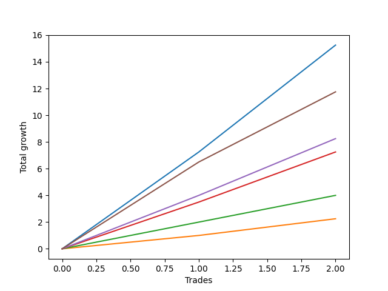

# Short Pointer 007 
- Symbol: ES_SmolBoi
- Date Range: 03/18/2022 - 07/29/2022
- Trading Period: 7:20-12:30
- Number of Trades: 2



| Name | Win Percent | Profit | Avg Profit / Trade | Avg Time / Trade |      | Name | Win Percent | Profit | Avg Profit / Trade | Avg Time / Trade |
| ---- | ----------- | ------ | ------------------ | ---------------- | ---- | ---- | ----------- | ------ | ------------------ | ---------------- |
| Sorted By <br> Profit | | | | | | Sorted By <br> Win Percentage ||||
| Two | 100.00 | 7625.00 | 3812.50 | 11:55 |     | Two | 100.00 | 7625.00 | 3812.50 | 11:55 |
| Eighty-Five | 100.00 | 5875.00 | 2937.50 | 04:40 |     | Eighty-Five | 100.00 | 5875.00 | 2937.50 | 04:40 |
| Eighty-Four | 100.00 | 4125.00 | 2062.50 | 04:27 |     | Eighty-Four | 100.00 | 4125.00 | 2062.50 | 04:27 |
| Eighty-Three | 100.00 | 3625.00 | 1812.50 | 04:22 |     | Eighty-Three | 100.00 | 3625.00 | 1812.50 | 04:22 |
| Eighty-Two | 100.00 | 2000.00 | 1000.00 | 01:45 |     | Eighty-Two | 100.00 | 2000.00 | 1000.00 | 01:45 |
| Eighty-One | 100.00 | 1125.00 | 562.50 | 00:57 |     | Eighty-One | 100.00 | 1125.00 | 562.50 | 00:57 |

## NO STOPLOSS

### Test Two
* Sell when the price hits the upper line of the 20p 2std bollinger
* No Stoploss
* Results:
```
Total Trades: 2
Percent Up: 0.00
Percent Down: 100.00
Total Points Moved Down: 15.25
Potential Profit: 7625.00
Total Points Ups: 0.00 Count Ups: 0
Total Points Downs: 15.25 Count Downs: 2
```

<details><summary>Trades</summary>

<code>In: 2022-05-31 09:07:00		Out: 2022-05-31 09:15:05		Total Position Time: 08:05		Total Move Down: 7.25		Total to Date: 7.25</code> <br />
<code>In: 2022-06-30 09:35:00		Out: 2022-06-30 09:50:45		Total Position Time: 15:45		Total Move Down: 8.00		Total to Date: 15.25</code> <br />


</details>

## TAKE PROFIT

### Test Eighty-One
* Take Profit of 1 Point
* No Stoploss
* Results:
```
Total Trades: 2
Percent Up: 0.00
Percent Down: 100.00
Total Points Moved Down: 2.25
Potential Profit: 1125.00
Total Points Ups: 0.00 Count Ups: 0
Total Points Downs: 2.25 Count Downs: 2
```

<details><summary>Trades</summary>

<code>In: 2022-05-31 09:07:00		Out: 2022-05-31 09:08:40		Total Position Time: 01:40		Total Move Down: 1.00		Total to Date: 1.00</code> <br />
<code>In: 2022-06-30 09:35:00		Out: 2022-06-30 09:35:15		Total Position Time: 00:15		Total Move Down: 1.25		Total to Date: 2.25</code> <br />


</details>

### Test Eighty-Two
* Take Profit of 2 Point
* No Stoploss
* Results:
```
Total Trades: 2
Percent Up: 0.00
Percent Down: 100.00
Total Points Moved Down: 4.00
Potential Profit: 2000.00
Total Points Ups: 0.00 Count Ups: 0
Total Points Downs: 4.00 Count Downs: 2
```

<details><summary>Trades</summary>

<code>In: 2022-05-31 09:07:00		Out: 2022-05-31 09:10:00		Total Position Time: 03:00		Total Move Down: 2.00		Total to Date: 2.00</code> <br />
<code>In: 2022-06-30 09:35:00		Out: 2022-06-30 09:35:30		Total Position Time: 00:30		Total Move Down: 2.00		Total to Date: 4.00</code> <br />


</details>

### Test Eighty-Three
* Take Profit of 3 Point
* No Stoploss
* Results:
```
Total Trades: 2
Percent Up: 0.00
Percent Down: 100.00
Total Points Moved Down: 7.25
Potential Profit: 3625.00
Total Points Ups: 0.00 Count Ups: 0
Total Points Downs: 7.25 Count Downs: 2
```

<details><summary>Trades</summary>

<code>In: 2022-05-31 09:07:00		Out: 2022-05-31 09:14:20		Total Position Time: 07:20		Total Move Down: 3.50		Total to Date: 3.50</code> <br />
<code>In: 2022-06-30 09:35:00		Out: 2022-06-30 09:36:25		Total Position Time: 01:25		Total Move Down: 3.75		Total to Date: 7.25</code> <br />


</details>

### Test Eighty-Four
* Take Profit of 4 Point
* No Stoploss
* Results:
```
Total Trades: 2
Percent Up: 0.00
Percent Down: 100.00
Total Points Moved Down: 8.25
Potential Profit: 4125.00
Total Points Ups: 0.00 Count Ups: 0
Total Points Downs: 8.25 Count Downs: 2
```

<details><summary>Trades</summary>

<code>In: 2022-05-31 09:07:00		Out: 2022-05-31 09:14:25		Total Position Time: 07:25		Total Move Down: 4.00		Total to Date: 4.00</code> <br />
<code>In: 2022-06-30 09:35:00		Out: 2022-06-30 09:36:30		Total Position Time: 01:30		Total Move Down: 4.25		Total to Date: 8.25</code> <br />


</details>

### Test Eighty-Five
* Take Profit of 5 Point
* No Stoploss
* Results:
```
Total Trades: 2
Percent Up: 0.00
Percent Down: 100.00
Total Points Moved Down: 11.75
Potential Profit: 5875.00
Total Points Ups: 0.00 Count Ups: 0
Total Points Downs: 11.75 Count Downs: 2
```

<details><summary>Trades</summary>

<code>In: 2022-05-31 09:07:00		Out: 2022-05-31 09:14:40		Total Position Time: 07:40		Total Move Down: 6.50		Total to Date: 6.50</code> <br />
<code>In: 2022-06-30 09:35:00		Out: 2022-06-30 09:36:40		Total Position Time: 01:40		Total Move Down: 5.25		Total to Date: 11.75</code> <br />


</details>