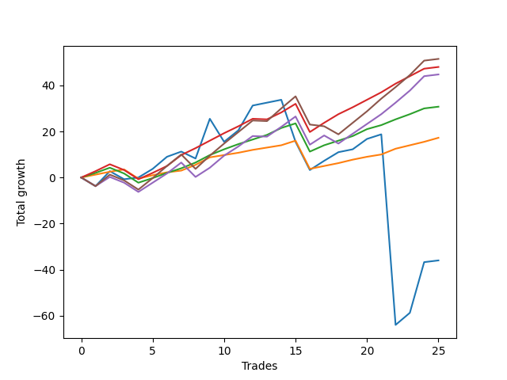

# Short Pointer 011 
- Symbol: ES_SmolBoi
- Date Range: 03/18/2022 - 07/29/2022
- Trading Period: 7:20-12:30
- Number of Trades: 25



| Name | Win Percent | Profit | Avg Profit / Trade | Avg Time / Trade |      | Name | Win Percent | Profit | Avg Profit / Trade | Avg Time / Trade |
| ---- | ----------- | ------ | ------------------ | ---------------- | ---- | ---- | ----------- | ------ | ------------------ | ---------------- |
| Sorted By <br> Profit | | | | | | Sorted By <br> Win Percentage ||||
| Eighty-Five | 68.00 | 25750.00 | 1030.00 | 20:23 |     | Eighty-One | 92.00 | 8625.00 | 345.00 | 08:53 |
| Eighty-Three | 84.00 | 24000.00 | 960.00 | 16:06 |     | Eighty-Two | 88.00 | 15375.00 | 615.00 | 12:45 |
| Eighty-Four | 72.00 | 22375.00 | 895.00 | 19:11 |     | Eighty-Three | 84.00 | 24000.00 | 960.00 | 16:06 |
| Eighty-Two | 88.00 | 15375.00 | 615.00 | 12:45 |     | Eighty-Four | 72.00 | 22375.00 | 895.00 | 19:11 |
| Eighty-One | 92.00 | 8625.00 | 345.00 | 08:53 |     | Two | 72.00 | -18000.00 | -720.00 | 81:14 |
| Two | 72.00 | -18000.00 | -720.00 | 81:14 |     | Eighty-Five | 68.00 | 25750.00 | 1030.00 | 20:23 |

## NO STOPLOSS

### Test Two
* Sell when the price hits the upper line of the 20p 2std bollinger
* No Stoploss
* Results:
```
Total Trades: 25
Percent Up: 28.00
Percent Down: 72.00
Total Points Moved Down: -36.00
Potential Profit: -18000.00
Total Points Ups: 133.50 Count Ups: 7
Total Points Downs: 97.50 Count Downs: 18
```

<details><summary>Trades</summary>

<code>In: 2022-03-18 12:28:00		Out: 2022-03-18 12:46:00		Total Position Time: 18:00		Total Move Down: -3.75		Total to Date: -3.75</code> <br />
<code>In: 2022-03-24 12:29:00		Out: 2022-03-24 12:42:05		Total Position Time: 13:05		Total Move Down: 6.50		Total to Date: 2.75</code> <br />
<code>In: 2022-03-25 07:26:00		Out: 2022-03-25 07:54:10		Total Position Time: 28:10		Total Move Down: -3.50		Total to Date: -0.75</code> <br />
<code>In: 2022-03-29 12:15:00		Out: 2022-03-29 12:27:50		Total Position Time: 12:50		Total Move Down: 0.75		Total to Date: 0.00</code> <br />
<code>In: 2022-04-06 08:53:00		Out: 2022-04-06 09:09:40		Total Position Time: 16:40		Total Move Down: 3.75		Total to Date: 3.75</code> <br />
<code>In: 2022-04-07 11:04:00		Out: 2022-04-07 11:18:20		Total Position Time: 14:20		Total Move Down: 5.25		Total to Date: 9.00</code> <br />
<code>In: 2022-04-20 07:43:00		Out: 2022-04-20 08:00:45		Total Position Time: 17:45		Total Move Down: 2.25		Total to Date: 11.25</code> <br />
<code>In: 2022-05-03 08:11:00		Out: 2022-05-03 08:39:10		Total Position Time: 28:10		Total Move Down: -3.00		Total to Date: 8.25</code> <br />
<code>In: 2022-05-04 11:03:00		Out: 2022-05-04 11:07:40		Total Position Time: 04:40		Total Move Down: 17.25		Total to Date: 25.50</code> <br />
<code>In: 2022-05-16 10:16:00		Out: 2022-05-16 10:45:55		Total Position Time: 29:55		Total Move Down: -10.00		Total to Date: 15.50</code> <br />
<code>In: 2022-05-17 09:48:00		Out: 2022-05-17 10:01:10		Total Position Time: 13:10		Total Move Down: 5.00		Total to Date: 20.50</code> <br />
<code>In: 2022-05-24 09:18:00		Out: 2022-05-24 09:31:20		Total Position Time: 13:20		Total Move Down: 10.75		Total to Date: 31.25</code> <br />
<code>In: 2022-05-27 12:11:00		Out: 2022-05-27 12:36:55		Total Position Time: 25:55		Total Move Down: 1.25		Total to Date: 32.50</code> <br />
<code>In: 2022-05-31 08:58:00		Out: 2022-05-31 09:15:05		Total Position Time: 17:05		Total Move Down: 1.25		Total to Date: 33.75</code> <br />
<code>In: 2022-06-30 08:01:00		Out: 2022-06-30 08:30:55		Total Position Time: 29:55		Total Move Down: -18.25		Total to Date: 15.50</code> <br />
<code>In: 2022-06-30 08:12:00		Out: 2022-06-30 08:41:55		Total Position Time: 29:55		Total Move Down: -12.25		Total to Date: 3.25</code> <br />
<code>In: 2022-06-30 09:29:00		Out: 2022-06-30 09:50:45		Total Position Time: 21:45		Total Move Down: 4.00		Total to Date: 7.25</code> <br />
<code>In: 2022-07-05 08:49:00		Out: 2022-07-05 09:03:50		Total Position Time: 14:50		Total Move Down: 3.75		Total to Date: 11.00</code> <br />
<code>In: 2022-07-07 07:56:00		Out: 2022-07-07 08:21:00		Total Position Time: 25:00		Total Move Down: 1.25		Total to Date: 12.25</code> <br />
<code>In: 2022-07-07 12:18:00		Out: 2022-07-07 12:28:30		Total Position Time: 10:30		Total Move Down: 4.50		Total to Date: 16.75</code> <br />
<code>In: 2022-07-08 11:40:00		Out: 2022-07-08 11:54:00		Total Position Time: 14:00		Total Move Down: 2.00		Total to Date: 18.75</code> <br />
<code>In: 2022-07-14 08:46:00		Out: 2022-07-15 07:26:00		Total Position Time: 1360:00		Total Move Down: -82.75		Total to Date: -64.00</code> <br />
<code>In: 2022-07-27 08:05:00		Out: 2022-07-27 11:07:00		Total Position Time: 182:00		Total Move Down: 5.25		Total to Date: -58.75</code> <br />
<code>In: 2022-07-27 12:31:00		Out: 2022-07-27 13:08:00		Total Position Time: 37:00		Total Move Down: 22.00		Total to Date: -36.75</code> <br />
<code>In: 2022-07-29 12:06:00		Out: 2022-07-29 12:59:00		Total Position Time: 53:00		Total Move Down: 0.75		Total to Date: -36.00</code> <br />


</details>

## TAKE PROFIT

### Test Eighty-One
* Take Profit of 1 Point
* No Stoploss
* Results:
```
Total Trades: 25
Percent Up: 8.00
Percent Down: 92.00
Total Points Moved Down: 17.25
Potential Profit: 8625.00
Total Points Ups: 16.25 Count Ups: 2
Total Points Downs: 33.50 Count Downs: 23
```

<details><summary>Trades</summary>

<code>In: 2022-03-18 12:28:00		Out: 2022-03-18 12:37:25		Total Position Time: 09:25		Total Move Down: 1.25		Total to Date: 1.25</code> <br />
<code>In: 2022-03-24 12:29:00		Out: 2022-03-24 12:31:55		Total Position Time: 02:55		Total Move Down: 1.25		Total to Date: 2.50</code> <br />
<code>In: 2022-03-25 07:26:00		Out: 2022-03-25 07:26:10		Total Position Time: 00:10		Total Move Down: 1.00		Total to Date: 3.50</code> <br />
<code>In: 2022-03-29 12:15:00		Out: 2022-03-29 12:44:55		Total Position Time: 29:55		Total Move Down: -4.00		Total to Date: -0.50</code> <br />
<code>In: 2022-04-06 08:53:00		Out: 2022-04-06 08:55:40		Total Position Time: 02:40		Total Move Down: 1.50		Total to Date: 1.00</code> <br />
<code>In: 2022-04-07 11:04:00		Out: 2022-04-07 11:04:10		Total Position Time: 00:10		Total Move Down: 1.25		Total to Date: 2.25</code> <br />
<code>In: 2022-04-20 07:43:00		Out: 2022-04-20 07:44:25		Total Position Time: 01:25		Total Move Down: 0.75		Total to Date: 3.00</code> <br />
<code>In: 2022-05-03 08:11:00		Out: 2022-05-03 08:11:10		Total Position Time: 00:10		Total Move Down: 2.50		Total to Date: 5.50</code> <br />
<code>In: 2022-05-04 11:03:00		Out: 2022-05-04 11:03:10		Total Position Time: 00:10		Total Move Down: 3.25		Total to Date: 8.75</code> <br />
<code>In: 2022-05-16 10:16:00		Out: 2022-05-16 10:17:55		Total Position Time: 01:55		Total Move Down: 1.00		Total to Date: 9.75</code> <br />
<code>In: 2022-05-17 09:48:00		Out: 2022-05-17 09:48:10		Total Position Time: 00:10		Total Move Down: 1.00		Total to Date: 10.75</code> <br />
<code>In: 2022-05-24 09:18:00		Out: 2022-05-24 09:18:50		Total Position Time: 00:50		Total Move Down: 1.25		Total to Date: 12.00</code> <br />
<code>In: 2022-05-27 12:11:00		Out: 2022-05-27 12:16:20		Total Position Time: 05:20		Total Move Down: 1.00		Total to Date: 13.00</code> <br />
<code>In: 2022-05-31 08:58:00		Out: 2022-05-31 09:14:55		Total Position Time: 16:55		Total Move Down: 1.00		Total to Date: 14.00</code> <br />
<code>In: 2022-06-30 08:01:00		Out: 2022-06-30 08:01:10		Total Position Time: 00:10		Total Move Down: 2.00		Total to Date: 16.00</code> <br />
<code>In: 2022-06-30 08:12:00		Out: 2022-06-30 08:41:55		Total Position Time: 29:55		Total Move Down: -12.25		Total to Date: 3.75</code> <br />
<code>In: 2022-06-30 09:29:00		Out: 2022-06-30 09:36:40		Total Position Time: 07:40		Total Move Down: 1.25		Total to Date: 5.00</code> <br />
<code>In: 2022-07-05 08:49:00		Out: 2022-07-05 08:52:25		Total Position Time: 03:25		Total Move Down: 1.25		Total to Date: 6.25</code> <br />
<code>In: 2022-07-07 07:56:00		Out: 2022-07-07 07:57:10		Total Position Time: 01:10		Total Move Down: 1.50		Total to Date: 7.75</code> <br />
<code>In: 2022-07-07 12:18:00		Out: 2022-07-07 12:24:15		Total Position Time: 06:15		Total Move Down: 1.25		Total to Date: 9.00</code> <br />
<code>In: 2022-07-08 11:40:00		Out: 2022-07-08 11:40:20		Total Position Time: 00:20		Total Move Down: 1.00		Total to Date: 10.00</code> <br />
<code>In: 2022-07-14 08:46:00		Out: 2022-07-14 09:08:00		Total Position Time: 22:00		Total Move Down: 2.50		Total to Date: 12.50</code> <br />
<code>In: 2022-07-27 08:05:00		Out: 2022-07-27 08:18:00		Total Position Time: 13:00		Total Move Down: 1.50		Total to Date: 14.00</code> <br />
<code>In: 2022-07-27 12:31:00		Out: 2022-07-27 12:46:00		Total Position Time: 15:00		Total Move Down: 1.50		Total to Date: 15.50</code> <br />
<code>In: 2022-07-29 12:06:00		Out: 2022-07-29 12:57:00		Total Position Time: 51:00		Total Move Down: 1.75		Total to Date: 17.25</code> <br />


</details>

### Test Eighty-Two
* Take Profit of 2 Point
* No Stoploss
* Results:
```
Total Trades: 25
Percent Up: 12.00
Percent Down: 88.00
Total Points Moved Down: 30.75
Potential Profit: 15375.00
Total Points Ups: 18.75 Count Ups: 3
Total Points Downs: 49.50 Count Downs: 22
```

<details><summary>Trades</summary>

<code>In: 2022-03-18 12:28:00		Out: 2022-03-18 12:37:55		Total Position Time: 09:55		Total Move Down: 2.00		Total to Date: 2.00</code> <br />
<code>In: 2022-03-24 12:29:00		Out: 2022-03-24 12:32:20		Total Position Time: 03:20		Total Move Down: 2.25		Total to Date: 4.25</code> <br />
<code>In: 2022-03-25 07:26:00		Out: 2022-03-25 07:55:55		Total Position Time: 29:55		Total Move Down: -2.50		Total to Date: 1.75</code> <br />
<code>In: 2022-03-29 12:15:00		Out: 2022-03-29 12:44:55		Total Position Time: 29:55		Total Move Down: -4.00		Total to Date: -2.25</code> <br />
<code>In: 2022-04-06 08:53:00		Out: 2022-04-06 08:57:30		Total Position Time: 04:30		Total Move Down: 2.00		Total to Date: -0.25</code> <br />
<code>In: 2022-04-07 11:04:00		Out: 2022-04-07 11:04:20		Total Position Time: 00:20		Total Move Down: 2.25		Total to Date: 2.00</code> <br />
<code>In: 2022-04-20 07:43:00		Out: 2022-04-20 07:47:45		Total Position Time: 04:45		Total Move Down: 2.00		Total to Date: 4.00</code> <br />
<code>In: 2022-05-03 08:11:00		Out: 2022-05-03 08:11:10		Total Position Time: 00:10		Total Move Down: 2.50		Total to Date: 6.50</code> <br />
<code>In: 2022-05-04 11:03:00		Out: 2022-05-04 11:03:10		Total Position Time: 00:10		Total Move Down: 3.25		Total to Date: 9.75</code> <br />
<code>In: 2022-05-16 10:16:00		Out: 2022-05-16 10:18:00		Total Position Time: 02:00		Total Move Down: 2.50		Total to Date: 12.25</code> <br />
<code>In: 2022-05-17 09:48:00		Out: 2022-05-17 09:51:15		Total Position Time: 03:15		Total Move Down: 2.25		Total to Date: 14.50</code> <br />
<code>In: 2022-05-24 09:18:00		Out: 2022-05-24 09:20:10		Total Position Time: 02:10		Total Move Down: 2.00		Total to Date: 16.50</code> <br />
<code>In: 2022-05-27 12:11:00		Out: 2022-05-27 12:38:10		Total Position Time: 27:10		Total Move Down: 2.00		Total to Date: 18.50</code> <br />
<code>In: 2022-05-31 08:58:00		Out: 2022-05-31 09:15:10		Total Position Time: 17:10		Total Move Down: 3.00		Total to Date: 21.50</code> <br />
<code>In: 2022-06-30 08:01:00		Out: 2022-06-30 08:01:10		Total Position Time: 00:10		Total Move Down: 2.00		Total to Date: 23.50</code> <br />
<code>In: 2022-06-30 08:12:00		Out: 2022-06-30 08:41:55		Total Position Time: 29:55		Total Move Down: -12.25		Total to Date: 11.25</code> <br />
<code>In: 2022-06-30 09:29:00		Out: 2022-06-30 09:37:05		Total Position Time: 08:05		Total Move Down: 2.75		Total to Date: 14.00</code> <br />
<code>In: 2022-07-05 08:49:00		Out: 2022-07-05 09:03:30		Total Position Time: 14:30		Total Move Down: 2.00		Total to Date: 16.00</code> <br />
<code>In: 2022-07-07 07:56:00		Out: 2022-07-07 07:58:25		Total Position Time: 02:25		Total Move Down: 2.00		Total to Date: 18.00</code> <br />
<code>In: 2022-07-07 12:18:00		Out: 2022-07-07 12:25:05		Total Position Time: 07:05		Total Move Down: 3.00		Total to Date: 21.00</code> <br />
<code>In: 2022-07-08 11:40:00		Out: 2022-07-08 11:53:55		Total Position Time: 13:55		Total Move Down: 1.75		Total to Date: 22.75</code> <br />
<code>In: 2022-07-14 08:46:00		Out: 2022-07-14 09:08:00		Total Position Time: 22:00		Total Move Down: 2.50		Total to Date: 25.25</code> <br />
<code>In: 2022-07-27 08:05:00		Out: 2022-07-27 08:20:00		Total Position Time: 15:00		Total Move Down: 2.25		Total to Date: 27.50</code> <br />
<code>In: 2022-07-27 12:31:00		Out: 2022-07-27 12:49:00		Total Position Time: 18:00		Total Move Down: 2.50		Total to Date: 30.00</code> <br />
<code>In: 2022-07-29 12:06:00		Out: 2022-07-29 12:59:00		Total Position Time: 53:00		Total Move Down: 0.75		Total to Date: 30.75</code> <br />


</details>

### Test Eighty-Three
* Take Profit of 3 Point
* No Stoploss
* Results:
```
Total Trades: 25
Percent Up: 16.00
Percent Down: 84.00
Total Points Moved Down: 48.00
Potential Profit: 24000.00
Total Points Ups: 19.00 Count Ups: 4
Total Points Downs: 67.00 Count Downs: 21
```

<details><summary>Trades</summary>

<code>In: 2022-03-18 12:28:00		Out: 2022-03-18 12:39:55		Total Position Time: 11:55		Total Move Down: 2.75		Total to Date: 2.75</code> <br />
<code>In: 2022-03-24 12:29:00		Out: 2022-03-24 12:32:40		Total Position Time: 03:40		Total Move Down: 3.00		Total to Date: 5.75</code> <br />
<code>In: 2022-03-25 07:26:00		Out: 2022-03-25 07:55:55		Total Position Time: 29:55		Total Move Down: -2.50		Total to Date: 3.25</code> <br />
<code>In: 2022-03-29 12:15:00		Out: 2022-03-29 12:44:55		Total Position Time: 29:55		Total Move Down: -4.00		Total to Date: -0.75</code> <br />
<code>In: 2022-04-06 08:53:00		Out: 2022-04-06 09:03:50		Total Position Time: 10:50		Total Move Down: 2.75		Total to Date: 2.00</code> <br />
<code>In: 2022-04-07 11:04:00		Out: 2022-04-07 11:06:00		Total Position Time: 02:00		Total Move Down: 3.00		Total to Date: 5.00</code> <br />
<code>In: 2022-04-20 07:43:00		Out: 2022-04-20 08:01:10		Total Position Time: 18:10		Total Move Down: 4.75		Total to Date: 9.75</code> <br />
<code>In: 2022-05-03 08:11:00		Out: 2022-05-03 08:13:25		Total Position Time: 02:25		Total Move Down: 3.00		Total to Date: 12.75</code> <br />
<code>In: 2022-05-04 11:03:00		Out: 2022-05-04 11:03:10		Total Position Time: 00:10		Total Move Down: 3.25		Total to Date: 16.00</code> <br />
<code>In: 2022-05-16 10:16:00		Out: 2022-05-16 10:18:05		Total Position Time: 02:05		Total Move Down: 3.25		Total to Date: 19.25</code> <br />
<code>In: 2022-05-17 09:48:00		Out: 2022-05-17 09:53:50		Total Position Time: 05:50		Total Move Down: 3.00		Total to Date: 22.25</code> <br />
<code>In: 2022-05-24 09:18:00		Out: 2022-05-24 09:21:05		Total Position Time: 03:05		Total Move Down: 3.25		Total to Date: 25.50</code> <br />
<code>In: 2022-05-27 12:11:00		Out: 2022-05-27 12:40:55		Total Position Time: 29:55		Total Move Down: -0.25		Total to Date: 25.25</code> <br />
<code>In: 2022-05-31 08:58:00		Out: 2022-05-31 09:15:10		Total Position Time: 17:10		Total Move Down: 3.00		Total to Date: 28.25</code> <br />
<code>In: 2022-06-30 08:01:00		Out: 2022-06-30 08:02:00		Total Position Time: 01:00		Total Move Down: 3.75		Total to Date: 32.00</code> <br />
<code>In: 2022-06-30 08:12:00		Out: 2022-06-30 08:41:55		Total Position Time: 29:55		Total Move Down: -12.25		Total to Date: 19.75</code> <br />
<code>In: 2022-06-30 09:29:00		Out: 2022-06-30 09:50:45		Total Position Time: 21:45		Total Move Down: 4.00		Total to Date: 23.75</code> <br />
<code>In: 2022-07-05 08:49:00		Out: 2022-07-05 09:03:50		Total Position Time: 14:50		Total Move Down: 3.75		Total to Date: 27.50</code> <br />
<code>In: 2022-07-07 07:56:00		Out: 2022-07-07 08:22:50		Total Position Time: 26:50		Total Move Down: 3.00		Total to Date: 30.50</code> <br />
<code>In: 2022-07-07 12:18:00		Out: 2022-07-07 12:25:10		Total Position Time: 07:10		Total Move Down: 3.25		Total to Date: 33.75</code> <br />
<code>In: 2022-07-08 11:40:00		Out: 2022-07-08 11:54:10		Total Position Time: 14:10		Total Move Down: 3.25		Total to Date: 37.00</code> <br />
<code>In: 2022-07-14 08:46:00		Out: 2022-07-14 09:17:00		Total Position Time: 31:00		Total Move Down: 3.75		Total to Date: 40.75</code> <br />
<code>In: 2022-07-27 08:05:00		Out: 2022-07-27 08:22:00		Total Position Time: 17:00		Total Move Down: 3.25		Total to Date: 44.00</code> <br />
<code>In: 2022-07-27 12:31:00		Out: 2022-07-27 12:50:00		Total Position Time: 19:00		Total Move Down: 3.25		Total to Date: 47.25</code> <br />
<code>In: 2022-07-29 12:06:00		Out: 2022-07-29 12:59:00		Total Position Time: 53:00		Total Move Down: 0.75		Total to Date: 48.00</code> <br />


</details>

### Test Eighty-Four
* Take Profit of 4 Point
* No Stoploss
* Results:
```
Total Trades: 25
Percent Up: 28.00
Percent Down: 72.00
Total Points Moved Down: 44.75
Potential Profit: 22375.00
Total Points Ups: 32.50 Count Ups: 7
Total Points Downs: 77.25 Count Downs: 18
```

<details><summary>Trades</summary>

<code>In: 2022-03-18 12:28:00		Out: 2022-03-18 12:46:00		Total Position Time: 18:00		Total Move Down: -3.75		Total to Date: -3.75</code> <br />
<code>In: 2022-03-24 12:29:00		Out: 2022-03-24 12:33:25		Total Position Time: 04:25		Total Move Down: 4.00		Total to Date: 0.25</code> <br />
<code>In: 2022-03-25 07:26:00		Out: 2022-03-25 07:55:55		Total Position Time: 29:55		Total Move Down: -2.50		Total to Date: -2.25</code> <br />
<code>In: 2022-03-29 12:15:00		Out: 2022-03-29 12:44:55		Total Position Time: 29:55		Total Move Down: -4.00		Total to Date: -6.25</code> <br />
<code>In: 2022-04-06 08:53:00		Out: 2022-04-06 09:10:30		Total Position Time: 17:30		Total Move Down: 4.00		Total to Date: -2.25</code> <br />
<code>In: 2022-04-07 11:04:00		Out: 2022-04-07 11:06:15		Total Position Time: 02:15		Total Move Down: 4.00		Total to Date: 1.75</code> <br />
<code>In: 2022-04-20 07:43:00		Out: 2022-04-20 08:01:10		Total Position Time: 18:10		Total Move Down: 4.75		Total to Date: 6.50</code> <br />
<code>In: 2022-05-03 08:11:00		Out: 2022-05-03 08:40:55		Total Position Time: 29:55		Total Move Down: -6.25		Total to Date: 0.25</code> <br />
<code>In: 2022-05-04 11:03:00		Out: 2022-05-04 11:03:20		Total Position Time: 00:20		Total Move Down: 4.00		Total to Date: 4.25</code> <br />
<code>In: 2022-05-16 10:16:00		Out: 2022-05-16 10:18:15		Total Position Time: 02:15		Total Move Down: 5.25		Total to Date: 9.50</code> <br />
<code>In: 2022-05-17 09:48:00		Out: 2022-05-17 09:56:30		Total Position Time: 08:30		Total Move Down: 4.00		Total to Date: 13.50</code> <br />
<code>In: 2022-05-24 09:18:00		Out: 2022-05-24 09:21:15		Total Position Time: 03:15		Total Move Down: 4.50		Total to Date: 18.00</code> <br />
<code>In: 2022-05-27 12:11:00		Out: 2022-05-27 12:40:55		Total Position Time: 29:55		Total Move Down: -0.25		Total to Date: 17.75</code> <br />
<code>In: 2022-05-31 08:58:00		Out: 2022-05-31 09:15:55		Total Position Time: 17:55		Total Move Down: 4.25		Total to Date: 22.00</code> <br />
<code>In: 2022-06-30 08:01:00		Out: 2022-06-30 08:03:40		Total Position Time: 02:40		Total Move Down: 4.50		Total to Date: 26.50</code> <br />
<code>In: 2022-06-30 08:12:00		Out: 2022-06-30 08:41:55		Total Position Time: 29:55		Total Move Down: -12.25		Total to Date: 14.25</code> <br />
<code>In: 2022-06-30 09:29:00		Out: 2022-06-30 09:50:45		Total Position Time: 21:45		Total Move Down: 4.00		Total to Date: 18.25</code> <br />
<code>In: 2022-07-05 08:49:00		Out: 2022-07-05 09:18:55		Total Position Time: 29:55		Total Move Down: -3.50		Total to Date: 14.75</code> <br />
<code>In: 2022-07-07 07:56:00		Out: 2022-07-07 08:23:05		Total Position Time: 27:05		Total Move Down: 4.25		Total to Date: 19.00</code> <br />
<code>In: 2022-07-07 12:18:00		Out: 2022-07-07 12:28:25		Total Position Time: 10:25		Total Move Down: 4.25		Total to Date: 23.25</code> <br />
<code>In: 2022-07-08 11:40:00		Out: 2022-07-08 11:54:50		Total Position Time: 14:50		Total Move Down: 4.25		Total to Date: 27.50</code> <br />
<code>In: 2022-07-14 08:46:00		Out: 2022-07-14 09:26:00		Total Position Time: 40:00		Total Move Down: 5.00		Total to Date: 32.50</code> <br />
<code>In: 2022-07-27 08:05:00		Out: 2022-07-27 08:23:00		Total Position Time: 18:00		Total Move Down: 5.25		Total to Date: 37.75</code> <br />
<code>In: 2022-07-27 12:31:00		Out: 2022-07-27 12:51:00		Total Position Time: 20:00		Total Move Down: 6.25		Total to Date: 44.00</code> <br />
<code>In: 2022-07-29 12:06:00		Out: 2022-07-29 12:59:00		Total Position Time: 53:00		Total Move Down: 0.75		Total to Date: 44.75</code> <br />


</details>

### Test Eighty-Five
* Take Profit of 5 Point
* No Stoploss
* Results:
```
Total Trades: 25
Percent Up: 32.00
Percent Down: 68.00
Total Points Moved Down: 51.50
Potential Profit: 25750.00
Total Points Ups: 33.25 Count Ups: 8
Total Points Downs: 84.75 Count Downs: 17
```

<details><summary>Trades</summary>

<code>In: 2022-03-18 12:28:00		Out: 2022-03-18 12:46:00		Total Position Time: 18:00		Total Move Down: -3.75		Total to Date: -3.75</code> <br />
<code>In: 2022-03-24 12:29:00		Out: 2022-03-24 12:37:45		Total Position Time: 08:45		Total Move Down: 5.00		Total to Date: 1.25</code> <br />
<code>In: 2022-03-25 07:26:00		Out: 2022-03-25 07:55:55		Total Position Time: 29:55		Total Move Down: -2.50		Total to Date: -1.25</code> <br />
<code>In: 2022-03-29 12:15:00		Out: 2022-03-29 12:44:55		Total Position Time: 29:55		Total Move Down: -4.00		Total to Date: -5.25</code> <br />
<code>In: 2022-04-06 08:53:00		Out: 2022-04-06 09:12:55		Total Position Time: 19:55		Total Move Down: 5.00		Total to Date: -0.25</code> <br />
<code>In: 2022-04-07 11:04:00		Out: 2022-04-07 11:06:40		Total Position Time: 02:40		Total Move Down: 5.25		Total to Date: 5.00</code> <br />
<code>In: 2022-04-20 07:43:00		Out: 2022-04-20 08:03:05		Total Position Time: 20:05		Total Move Down: 5.00		Total to Date: 10.00</code> <br />
<code>In: 2022-05-03 08:11:00		Out: 2022-05-03 08:40:55		Total Position Time: 29:55		Total Move Down: -6.25		Total to Date: 3.75</code> <br />
<code>In: 2022-05-04 11:03:00		Out: 2022-05-04 11:07:05		Total Position Time: 04:05		Total Move Down: 5.75		Total to Date: 9.50</code> <br />
<code>In: 2022-05-16 10:16:00		Out: 2022-05-16 10:18:15		Total Position Time: 02:15		Total Move Down: 5.25		Total to Date: 14.75</code> <br />
<code>In: 2022-05-17 09:48:00		Out: 2022-05-17 10:01:20		Total Position Time: 13:20		Total Move Down: 5.00		Total to Date: 19.75</code> <br />
<code>In: 2022-05-24 09:18:00		Out: 2022-05-24 09:21:30		Total Position Time: 03:30		Total Move Down: 5.00		Total to Date: 24.75</code> <br />
<code>In: 2022-05-27 12:11:00		Out: 2022-05-27 12:40:55		Total Position Time: 29:55		Total Move Down: -0.25		Total to Date: 24.50</code> <br />
<code>In: 2022-05-31 08:58:00		Out: 2022-05-31 09:18:40		Total Position Time: 20:40		Total Move Down: 5.50		Total to Date: 30.00</code> <br />
<code>In: 2022-06-30 08:01:00		Out: 2022-06-30 08:03:50		Total Position Time: 02:50		Total Move Down: 5.25		Total to Date: 35.25</code> <br />
<code>In: 2022-06-30 08:12:00		Out: 2022-06-30 08:41:55		Total Position Time: 29:55		Total Move Down: -12.25		Total to Date: 23.00</code> <br />
<code>In: 2022-06-30 09:29:00		Out: 2022-06-30 09:58:55		Total Position Time: 29:55		Total Move Down: -0.75		Total to Date: 22.25</code> <br />
<code>In: 2022-07-05 08:49:00		Out: 2022-07-05 09:18:55		Total Position Time: 29:55		Total Move Down: -3.50		Total to Date: 18.75</code> <br />
<code>In: 2022-07-07 07:56:00		Out: 2022-07-07 08:23:20		Total Position Time: 27:20		Total Move Down: 5.00		Total to Date: 23.75</code> <br />
<code>In: 2022-07-07 12:18:00		Out: 2022-07-07 12:28:40		Total Position Time: 10:40		Total Move Down: 5.00		Total to Date: 28.75</code> <br />
<code>In: 2022-07-08 11:40:00		Out: 2022-07-08 11:55:05		Total Position Time: 15:05		Total Move Down: 5.50		Total to Date: 34.25</code> <br />
<code>In: 2022-07-14 08:46:00		Out: 2022-07-14 09:26:00		Total Position Time: 40:00		Total Move Down: 5.00		Total to Date: 39.25</code> <br />
<code>In: 2022-07-27 08:05:00		Out: 2022-07-27 08:23:00		Total Position Time: 18:00		Total Move Down: 5.25		Total to Date: 44.50</code> <br />
<code>In: 2022-07-27 12:31:00		Out: 2022-07-27 12:51:00		Total Position Time: 20:00		Total Move Down: 6.25		Total to Date: 50.75</code> <br />
<code>In: 2022-07-29 12:06:00		Out: 2022-07-29 12:59:00		Total Position Time: 53:00		Total Move Down: 0.75		Total to Date: 51.50</code> <br />


</details>