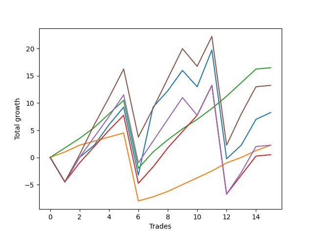

# Short Shepard 001 
- Symbol: ES_SmolBoi
- Date Range: 03/18/2022 - 07/29/2022
- Trading Period: 7:20-12:30
- Number of Trades: 15



| Name | Win Percent | Profit | Avg Profit / Trade | Avg Time / Trade |      | Name | Win Percent | Profit | Avg Profit / Trade | Avg Time / Trade |
| ---- | ----------- | ------ | ------------------ | ---------------- | ---- | ---- | ----------- | ------ | ------------------ | ---------------- |
| Sorted By <br> Profit | | | | | | Sorted By <br> Win Percentage ||||
| Eighty-Two | 93.33 | 8250.00 | 550.00 | 07:04 |     | Eighty-Two | 93.33 | 8250.00 | 550.00 | 07:04 |
| Eighty-Five | 73.33 | 6625.00 | 441.67 | 18:21 |     | Eighty-One | 93.33 | 1125.00 | 75.00 | 04:39 |
| Two | 73.33 | 4125.00 | 275.00 | 15:02 |     | Eighty-Three | 80.00 | 250.00 | 16.67 | 12:31 |
| Eighty-One | 93.33 | 1125.00 | 75.00 | 04:39 |     | Eighty-Five | 73.33 | 6625.00 | 441.67 | 18:21 |
| Eighty-Four | 73.33 | 1125.00 | 75.00 | 16:16 |     | Two | 73.33 | 4125.00 | 275.00 | 15:02 |
| Eighty-Three | 80.00 | 250.00 | 16.67 | 12:31 |     | Eighty-Four | 73.33 | 1125.00 | 75.00 | 16:16 |

## NO STOPLOSS

### Test Two
* Sell when the price hits the upper line of the 20p 2std bollinger
* No Stoploss
* Results:
```
Total Trades: 15
Percent Up: 26.67
Percent Down: 73.33
Total Points Moved Down: 8.25
Potential Profit: 4125.00
Total Points Ups: 40.00 Count Ups: 4
Total Points Downs: 48.25 Count Downs: 11
```

<details><summary>Trades</summary>

<code>In: 2022-03-18 09:47:00		Out: 2022-03-18 10:16:55		Total Position Time: 29:55		Total Move Down: -4.50		Total to Date: -4.50</code> <br />
<code>In: 2022-03-24 08:50:00		Out: 2022-03-24 09:03:10		Total Position Time: 13:10		Total Move Down: 4.50		Total to Date: 0.00</code> <br />
<code>In: 2022-04-05 10:24:00		Out: 2022-04-05 10:29:15		Total Position Time: 05:15		Total Move Down: 2.25		Total to Date: 2.25</code> <br />
<code>In: 2022-04-07 10:34:00		Out: 2022-04-07 10:45:15		Total Position Time: 11:15		Total Move Down: 3.75		Total to Date: 6.00</code> <br />
<code>In: 2022-04-18 11:00:00		Out: 2022-04-18 11:10:40		Total Position Time: 10:40		Total Move Down: 3.25		Total to Date: 9.25</code> <br />
<code>In: 2022-04-28 11:55:00		Out: 2022-04-28 12:24:55		Total Position Time: 29:55		Total Move Down: -12.50		Total to Date: -3.25</code> <br />
<code>In: 2022-05-19 08:51:00		Out: 2022-05-19 08:56:05		Total Position Time: 05:05		Total Move Down: 12.50		Total to Date: 9.25</code> <br />
<code>In: 2022-05-25 12:16:00		Out: 2022-05-25 12:22:50		Total Position Time: 06:50		Total Move Down: 3.00		Total to Date: 12.25</code> <br />
<code>In: 2022-06-07 07:52:00		Out: 2022-06-07 08:04:45		Total Position Time: 12:45		Total Move Down: 3.75		Total to Date: 16.00</code> <br />
<code>In: 2022-06-10 10:32:00		Out: 2022-06-10 11:01:00		Total Position Time: 29:00		Total Move Down: -3.00		Total to Date: 13.00</code> <br />
<code>In: 2022-06-22 11:21:00		Out: 2022-06-22 11:26:15		Total Position Time: 05:15		Total Move Down: 6.75		Total to Date: 19.75</code> <br />
<code>In: 2022-06-30 08:02:00		Out: 2022-06-30 08:31:55		Total Position Time: 29:55		Total Move Down: -20.00		Total to Date: -0.25</code> <br />
<code>In: 2022-07-01 10:55:00		Out: 2022-07-01 11:07:55		Total Position Time: 12:55		Total Move Down: 2.50		Total to Date: 2.25</code> <br />
<code>In: 2022-07-20 09:14:00		Out: 2022-07-20 09:29:15		Total Position Time: 15:15		Total Move Down: 4.75		Total to Date: 7.00</code> <br />
<code>In: 2022-07-25 09:52:00		Out: 2022-07-25 10:00:20		Total Position Time: 08:20		Total Move Down: 1.25		Total to Date: 8.25</code> <br />


</details>

## TAKE PROFIT

### Test Eighty-One
* Take Profit of 1 Point
* No Stoploss
* Results:
```
Total Trades: 15
Percent Up: 6.67
Percent Down: 93.33
Total Points Moved Down: 2.25
Potential Profit: 1125.00
Total Points Ups: 12.50 Count Ups: 1
Total Points Downs: 14.75 Count Downs: 14
```

<details><summary>Trades</summary>

<code>In: 2022-03-18 09:47:00		Out: 2022-03-18 09:47:40		Total Position Time: 00:40		Total Move Down: 1.00		Total to Date: 1.00</code> <br />
<code>In: 2022-03-24 08:50:00		Out: 2022-03-24 08:50:10		Total Position Time: 00:10		Total Move Down: 1.25		Total to Date: 2.25</code> <br />
<code>In: 2022-04-05 10:24:00		Out: 2022-04-05 10:26:40		Total Position Time: 02:40		Total Move Down: 0.75		Total to Date: 3.00</code> <br />
<code>In: 2022-04-07 10:34:00		Out: 2022-04-07 10:34:15		Total Position Time: 00:15		Total Move Down: 0.75		Total to Date: 3.75</code> <br />
<code>In: 2022-04-18 11:00:00		Out: 2022-04-18 11:06:30		Total Position Time: 06:30		Total Move Down: 0.75		Total to Date: 4.50</code> <br />
<code>In: 2022-04-28 11:55:00		Out: 2022-04-28 12:24:55		Total Position Time: 29:55		Total Move Down: -12.50		Total to Date: -8.00</code> <br />
<code>In: 2022-05-19 08:51:00		Out: 2022-05-19 08:52:10		Total Position Time: 01:10		Total Move Down: 0.75		Total to Date: -7.25</code> <br />
<code>In: 2022-05-25 12:16:00		Out: 2022-05-25 12:17:30		Total Position Time: 01:30		Total Move Down: 1.00		Total to Date: -6.25</code> <br />
<code>In: 2022-06-07 07:52:00		Out: 2022-06-07 07:57:35		Total Position Time: 05:35		Total Move Down: 1.25		Total to Date: -5.00</code> <br />
<code>In: 2022-06-10 10:32:00		Out: 2022-06-10 10:32:10		Total Position Time: 00:10		Total Move Down: 1.25		Total to Date: -3.75</code> <br />
<code>In: 2022-06-22 11:21:00		Out: 2022-06-22 11:21:15		Total Position Time: 00:15		Total Move Down: 1.25		Total to Date: -2.50</code> <br />
<code>In: 2022-06-30 08:02:00		Out: 2022-06-30 08:03:50		Total Position Time: 01:50		Total Move Down: 1.50		Total to Date: -1.00</code> <br />
<code>In: 2022-07-01 10:55:00		Out: 2022-07-01 11:04:55		Total Position Time: 09:55		Total Move Down: 1.00		Total to Date: 0.00</code> <br />
<code>In: 2022-07-20 09:14:00		Out: 2022-07-20 09:15:30		Total Position Time: 01:30		Total Move Down: 1.25		Total to Date: 1.25</code> <br />
<code>In: 2022-07-25 09:52:00		Out: 2022-07-25 09:59:45		Total Position Time: 07:45		Total Move Down: 1.00		Total to Date: 2.25</code> <br />


</details>

### Test Eighty-Two
* Take Profit of 2 Point
* No Stoploss
* Results:
```
Total Trades: 15
Percent Up: 6.67
Percent Down: 93.33
Total Points Moved Down: 16.50
Potential Profit: 8250.00
Total Points Ups: 12.50 Count Ups: 1
Total Points Downs: 29.00 Count Downs: 14
```

<details><summary>Trades</summary>

<code>In: 2022-03-18 09:47:00		Out: 2022-03-18 09:48:35		Total Position Time: 01:35		Total Move Down: 1.75		Total to Date: 1.75</code> <br />
<code>In: 2022-03-24 08:50:00		Out: 2022-03-24 08:50:40		Total Position Time: 00:40		Total Move Down: 1.75		Total to Date: 3.50</code> <br />
<code>In: 2022-04-05 10:24:00		Out: 2022-04-05 10:27:10		Total Position Time: 03:10		Total Move Down: 2.00		Total to Date: 5.50</code> <br />
<code>In: 2022-04-07 10:34:00		Out: 2022-04-07 10:39:50		Total Position Time: 05:50		Total Move Down: 2.50		Total to Date: 8.00</code> <br />
<code>In: 2022-04-18 11:00:00		Out: 2022-04-18 11:06:40		Total Position Time: 06:40		Total Move Down: 2.50		Total to Date: 10.50</code> <br />
<code>In: 2022-04-28 11:55:00		Out: 2022-04-28 12:24:55		Total Position Time: 29:55		Total Move Down: -12.50		Total to Date: -2.00</code> <br />
<code>In: 2022-05-19 08:51:00		Out: 2022-05-19 08:53:35		Total Position Time: 02:35		Total Move Down: 3.00		Total to Date: 1.00</code> <br />
<code>In: 2022-05-25 12:16:00		Out: 2022-05-25 12:18:15		Total Position Time: 02:15		Total Move Down: 2.25		Total to Date: 3.25</code> <br />
<code>In: 2022-06-07 07:52:00		Out: 2022-06-07 07:57:55		Total Position Time: 05:55		Total Move Down: 2.00		Total to Date: 5.25</code> <br />
<code>In: 2022-06-10 10:32:00		Out: 2022-06-10 10:32:15		Total Position Time: 00:15		Total Move Down: 1.75		Total to Date: 7.00</code> <br />
<code>In: 2022-06-22 11:21:00		Out: 2022-06-22 11:21:30		Total Position Time: 00:30		Total Move Down: 2.00		Total to Date: 9.00</code> <br />
<code>In: 2022-06-30 08:02:00		Out: 2022-06-30 08:04:05		Total Position Time: 02:05		Total Move Down: 2.25		Total to Date: 11.25</code> <br />
<code>In: 2022-07-01 10:55:00		Out: 2022-07-01 11:07:55		Total Position Time: 12:55		Total Move Down: 2.50		Total to Date: 13.75</code> <br />
<code>In: 2022-07-20 09:14:00		Out: 2022-07-20 09:15:55		Total Position Time: 01:55		Total Move Down: 2.50		Total to Date: 16.25</code> <br />
<code>In: 2022-07-25 09:52:00		Out: 2022-07-25 10:21:55		Total Position Time: 29:55		Total Move Down: 0.25		Total to Date: 16.50</code> <br />


</details>

### Test Eighty-Three
* Take Profit of 3 Point
* No Stoploss
* Results:
```
Total Trades: 15
Percent Up: 20.00
Percent Down: 80.00
Total Points Moved Down: 0.50
Potential Profit: 250.00
Total Points Ups: 37.00 Count Ups: 3
Total Points Downs: 37.50 Count Downs: 12
```

<details><summary>Trades</summary>

<code>In: 2022-03-18 09:47:00		Out: 2022-03-18 10:16:55		Total Position Time: 29:55		Total Move Down: -4.50		Total to Date: -4.50</code> <br />
<code>In: 2022-03-24 08:50:00		Out: 2022-03-24 09:03:05		Total Position Time: 13:05		Total Move Down: 3.50		Total to Date: -1.00</code> <br />
<code>In: 2022-04-05 10:24:00		Out: 2022-04-05 10:29:35		Total Position Time: 05:35		Total Move Down: 3.00		Total to Date: 2.00</code> <br />
<code>In: 2022-04-07 10:34:00		Out: 2022-04-07 10:40:00		Total Position Time: 06:00		Total Move Down: 3.00		Total to Date: 5.00</code> <br />
<code>In: 2022-04-18 11:00:00		Out: 2022-04-18 11:10:35		Total Position Time: 10:35		Total Move Down: 2.75		Total to Date: 7.75</code> <br />
<code>In: 2022-04-28 11:55:00		Out: 2022-04-28 12:24:55		Total Position Time: 29:55		Total Move Down: -12.50		Total to Date: -4.75</code> <br />
<code>In: 2022-05-19 08:51:00		Out: 2022-05-19 08:53:35		Total Position Time: 02:35		Total Move Down: 3.00		Total to Date: -1.75</code> <br />
<code>In: 2022-05-25 12:16:00		Out: 2022-05-25 12:20:25		Total Position Time: 04:25		Total Move Down: 3.50		Total to Date: 1.75</code> <br />
<code>In: 2022-06-07 07:52:00		Out: 2022-06-07 07:59:00		Total Position Time: 07:00		Total Move Down: 3.00		Total to Date: 4.75</code> <br />
<code>In: 2022-06-10 10:32:00		Out: 2022-06-10 10:34:35		Total Position Time: 02:35		Total Move Down: 3.00		Total to Date: 7.75</code> <br />
<code>In: 2022-06-22 11:21:00		Out: 2022-06-22 11:21:35		Total Position Time: 00:35		Total Move Down: 5.50		Total to Date: 13.25</code> <br />
<code>In: 2022-06-30 08:02:00		Out: 2022-06-30 08:31:55		Total Position Time: 29:55		Total Move Down: -20.00		Total to Date: -6.75</code> <br />
<code>In: 2022-07-01 10:55:00		Out: 2022-07-01 11:08:30		Total Position Time: 13:30		Total Move Down: 3.50		Total to Date: -3.25</code> <br />
<code>In: 2022-07-20 09:14:00		Out: 2022-07-20 09:16:15		Total Position Time: 02:15		Total Move Down: 3.50		Total to Date: 0.25</code> <br />
<code>In: 2022-07-25 09:52:00		Out: 2022-07-25 10:21:55		Total Position Time: 29:55		Total Move Down: 0.25		Total to Date: 0.50</code> <br />


</details>

### Test Eighty-Four
* Take Profit of 4 Point
* No Stoploss
* Results:
```
Total Trades: 15
Percent Up: 26.67
Percent Down: 73.33
Total Points Moved Down: 2.25
Potential Profit: 1125.00
Total Points Ups: 40.25 Count Ups: 4
Total Points Downs: 42.50 Count Downs: 11
```

<details><summary>Trades</summary>

<code>In: 2022-03-18 09:47:00		Out: 2022-03-18 10:16:55		Total Position Time: 29:55		Total Move Down: -4.50		Total to Date: -4.50</code> <br />
<code>In: 2022-03-24 08:50:00		Out: 2022-03-24 09:03:10		Total Position Time: 13:10		Total Move Down: 4.50		Total to Date: 0.00</code> <br />
<code>In: 2022-04-05 10:24:00		Out: 2022-04-05 10:30:45		Total Position Time: 06:45		Total Move Down: 3.75		Total to Date: 3.75</code> <br />
<code>In: 2022-04-07 10:34:00		Out: 2022-04-07 10:45:15		Total Position Time: 11:15		Total Move Down: 3.75		Total to Date: 7.50</code> <br />
<code>In: 2022-04-18 11:00:00		Out: 2022-04-18 11:11:10		Total Position Time: 11:10		Total Move Down: 4.00		Total to Date: 11.50</code> <br />
<code>In: 2022-04-28 11:55:00		Out: 2022-04-28 12:24:55		Total Position Time: 29:55		Total Move Down: -12.50		Total to Date: -1.00</code> <br />
<code>In: 2022-05-19 08:51:00		Out: 2022-05-19 08:53:40		Total Position Time: 02:40		Total Move Down: 4.00		Total to Date: 3.00</code> <br />
<code>In: 2022-05-25 12:16:00		Out: 2022-05-25 12:23:00		Total Position Time: 07:00		Total Move Down: 4.00		Total to Date: 7.00</code> <br />
<code>In: 2022-06-07 07:52:00		Out: 2022-06-07 08:04:50		Total Position Time: 12:50		Total Move Down: 4.00		Total to Date: 11.00</code> <br />
<code>In: 2022-06-10 10:32:00		Out: 2022-06-10 11:01:55		Total Position Time: 29:55		Total Move Down: -3.25		Total to Date: 7.75</code> <br />
<code>In: 2022-06-22 11:21:00		Out: 2022-06-22 11:21:35		Total Position Time: 00:35		Total Move Down: 5.50		Total to Date: 13.25</code> <br />
<code>In: 2022-06-30 08:02:00		Out: 2022-06-30 08:31:55		Total Position Time: 29:55		Total Move Down: -20.00		Total to Date: -6.75</code> <br />
<code>In: 2022-07-01 10:55:00		Out: 2022-07-01 11:08:50		Total Position Time: 13:50		Total Move Down: 4.00		Total to Date: -2.75</code> <br />
<code>In: 2022-07-20 09:14:00		Out: 2022-07-20 09:29:15		Total Position Time: 15:15		Total Move Down: 4.75		Total to Date: 2.00</code> <br />
<code>In: 2022-07-25 09:52:00		Out: 2022-07-25 10:21:55		Total Position Time: 29:55		Total Move Down: 0.25		Total to Date: 2.25</code> <br />


</details>

### Test Eighty-Five
* Take Profit of 5 Point
* No Stoploss
* Results:
```
Total Trades: 15
Percent Up: 26.67
Percent Down: 73.33
Total Points Moved Down: 13.25
Potential Profit: 6625.00
Total Points Ups: 40.25 Count Ups: 4
Total Points Downs: 53.50 Count Downs: 11
```

<details><summary>Trades</summary>

<code>In: 2022-03-18 09:47:00		Out: 2022-03-18 10:16:55		Total Position Time: 29:55		Total Move Down: -4.50		Total to Date: -4.50</code> <br />
<code>In: 2022-03-24 08:50:00		Out: 2022-03-24 09:03:15		Total Position Time: 13:15		Total Move Down: 5.00		Total to Date: 0.50</code> <br />
<code>In: 2022-04-05 10:24:00		Out: 2022-04-05 10:34:05		Total Position Time: 10:05		Total Move Down: 5.50		Total to Date: 6.00</code> <br />
<code>In: 2022-04-07 10:34:00		Out: 2022-04-07 10:52:05		Total Position Time: 18:05		Total Move Down: 5.00		Total to Date: 11.00</code> <br />
<code>In: 2022-04-18 11:00:00		Out: 2022-04-18 11:16:50		Total Position Time: 16:50		Total Move Down: 5.25		Total to Date: 16.25</code> <br />
<code>In: 2022-04-28 11:55:00		Out: 2022-04-28 12:24:55		Total Position Time: 29:55		Total Move Down: -12.50		Total to Date: 3.75</code> <br />
<code>In: 2022-05-19 08:51:00		Out: 2022-05-19 08:54:25		Total Position Time: 03:25		Total Move Down: 5.25		Total to Date: 9.00</code> <br />
<code>In: 2022-05-25 12:16:00		Out: 2022-05-25 12:34:20		Total Position Time: 18:20		Total Move Down: 5.50		Total to Date: 14.50</code> <br />
<code>In: 2022-06-07 07:52:00		Out: 2022-06-07 08:05:30		Total Position Time: 13:30		Total Move Down: 5.50		Total to Date: 20.00</code> <br />
<code>In: 2022-06-10 10:32:00		Out: 2022-06-10 11:01:55		Total Position Time: 29:55		Total Move Down: -3.25		Total to Date: 16.75</code> <br />
<code>In: 2022-06-22 11:21:00		Out: 2022-06-22 11:21:35		Total Position Time: 00:35		Total Move Down: 5.50		Total to Date: 22.25</code> <br />
<code>In: 2022-06-30 08:02:00		Out: 2022-06-30 08:31:55		Total Position Time: 29:55		Total Move Down: -20.00		Total to Date: 2.25</code> <br />
<code>In: 2022-07-01 10:55:00		Out: 2022-07-01 11:11:05		Total Position Time: 16:05		Total Move Down: 5.75		Total to Date: 8.00</code> <br />
<code>In: 2022-07-20 09:14:00		Out: 2022-07-20 09:29:30		Total Position Time: 15:30		Total Move Down: 5.00		Total to Date: 13.00</code> <br />
<code>In: 2022-07-25 09:52:00		Out: 2022-07-25 10:21:55		Total Position Time: 29:55		Total Move Down: 0.25		Total to Date: 13.25</code> <br />


</details>