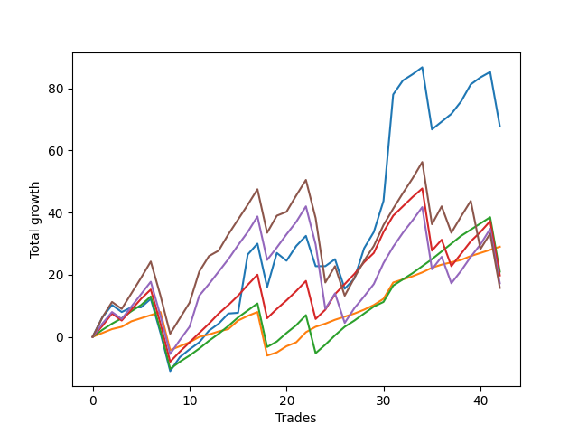

# Short Shepard 003 
- Symbol: ES_SmolBoi
- Date Range: 03/18/2022 - 07/29/2022
- Trading Period: 7:20-12:30
- Number of Trades: 42



| Name | Win Percent | Profit | Avg Profit / Trade | Avg Time / Trade |      | Name | Win Percent | Profit | Avg Profit / Trade | Avg Time / Trade |
| ---- | ----------- | ------ | ------------------ | ---------------- | ---- | ---- | ----------- | ------ | ------------------ | ---------------- |
| Sorted By <br> Profit | | | | | | Sorted By <br> Win Percentage ||||
| Two | 73.81 | 33875.00 | 806.55 | 14:25 |     | Eighty-One | 95.24 | 14500.00 | 345.24 | 04:36 |
| Eighty-One | 95.24 | 14500.00 | 345.24 | 04:36 |     | Eighty-Two | 88.10 | 10500.00 | 250.00 | 08:03 |
| Eighty-Two | 88.10 | 10500.00 | 250.00 | 08:03 |     | Eighty-Three | 80.95 | 9875.00 | 235.12 | 12:18 |
| Eighty-Three | 80.95 | 9875.00 | 235.12 | 12:18 |     | Eighty-Four | 76.19 | 8625.00 | 205.36 | 14:21 |
| Eighty-Four | 76.19 | 8625.00 | 205.36 | 14:21 |     | Two | 73.81 | 33875.00 | 806.55 | 14:25 |
| Eighty-Five | 73.81 | 7875.00 | 187.50 | 16:01 |     | Eighty-Five | 73.81 | 7875.00 | 187.50 | 16:01 |

## NO STOPLOSS

### Test Two
* Sell when the price hits the upper line of the 20p 2std bollinger
* No Stoploss
* Results:
```
Total Trades: 42
Percent Up: 26.19
Percent Down: 73.81
Total Points Moved Down: 67.75
Potential Profit: 33875.00
Total Points Ups: 98.75 Count Ups: 11
Total Points Downs: 166.50 Count Downs: 31
```

<details><summary>Trades</summary>

<code>In: 2022-03-21 08:30:00		Out: 2022-03-21 08:36:05		Total Position Time: 06:05		Total Move Down: 6.25		Total to Date: 6.25</code> <br />
<code>In: 2022-03-21 08:31:00		Out: 2022-03-21 08:36:05		Total Position Time: 05:05		Total Move Down: 4.00		Total to Date: 10.25</code> <br />
<code>In: 2022-03-25 11:18:00		Out: 2022-03-25 11:47:55		Total Position Time: 29:55		Total Move Down: -2.25		Total to Date: 8.00</code> <br />
<code>In: 2022-03-25 11:37:00		Out: 2022-03-25 12:00:55		Total Position Time: 23:55		Total Move Down: 1.50		Total to Date: 9.50</code> <br />
<code>In: 2022-03-25 11:41:00		Out: 2022-03-25 12:00:55		Total Position Time: 19:55		Total Move Down: -0.00		Total to Date: 9.50</code> <br />
<code>In: 2022-03-25 11:57:00		Out: 2022-03-25 12:00:55		Total Position Time: 03:55		Total Move Down: 2.75		Total to Date: 12.25</code> <br />
<code>In: 2022-03-28 11:34:00		Out: 2022-03-28 12:03:55		Total Position Time: 29:55		Total Move Down: -11.00		Total to Date: 1.25</code> <br />
<code>In: 2022-03-28 11:36:00		Out: 2022-03-28 12:05:55		Total Position Time: 29:55		Total Move Down: -12.25		Total to Date: -11.00</code> <br />
<code>In: 2022-04-01 12:09:00		Out: 2022-04-01 12:11:10		Total Position Time: 02:10		Total Move Down: 4.50		Total to Date: -6.50</code> <br />
<code>In: 2022-04-06 08:57:00		Out: 2022-04-06 09:09:40		Total Position Time: 12:40		Total Move Down: 2.50		Total to Date: -4.00</code> <br />
<code>In: 2022-04-06 10:47:00		Out: 2022-04-06 10:57:20		Total Position Time: 10:20		Total Move Down: 2.25		Total to Date: -1.75</code> <br />
<code>In: 2022-04-07 10:34:00		Out: 2022-04-07 10:45:15		Total Position Time: 11:15		Total Move Down: 3.75		Total to Date: 2.00</code> <br />
<code>In: 2022-04-07 11:06:00		Out: 2022-04-07 11:18:20		Total Position Time: 12:20		Total Move Down: 2.25		Total to Date: 4.25</code> <br />
<code>In: 2022-04-18 11:00:00		Out: 2022-04-18 11:10:40		Total Position Time: 10:40		Total Move Down: 3.25		Total to Date: 7.50</code> <br />
<code>In: 2022-04-20 07:48:00		Out: 2022-04-20 08:00:45		Total Position Time: 12:45		Total Move Down: 0.25		Total to Date: 7.75</code> <br />
<code>In: 2022-04-25 07:39:00		Out: 2022-04-25 07:52:35		Total Position Time: 13:35		Total Move Down: 18.75		Total to Date: 26.50</code> <br />
<code>In: 2022-04-28 08:36:00		Out: 2022-04-28 08:38:55		Total Position Time: 02:55		Total Move Down: 3.50		Total to Date: 30.00</code> <br />
<code>In: 2022-05-04 09:32:00		Out: 2022-05-04 10:01:55		Total Position Time: 29:55		Total Move Down: -14.00		Total to Date: 16.00</code> <br />
<code>In: 2022-05-10 11:06:00		Out: 2022-05-10 11:16:05		Total Position Time: 10:05		Total Move Down: 11.00		Total to Date: 27.00</code> <br />
<code>In: 2022-05-16 08:51:00		Out: 2022-05-16 09:11:35		Total Position Time: 20:35		Total Move Down: -2.50		Total to Date: 24.50</code> <br />
<code>In: 2022-05-17 08:39:00		Out: 2022-05-17 08:48:20		Total Position Time: 09:20		Total Move Down: 4.75		Total to Date: 29.25</code> <br />
<code>In: 2022-05-25 11:07:00		Out: 2022-05-25 11:07:10		Total Position Time: 00:10		Total Move Down: 3.25		Total to Date: 32.50</code> <br />
<code>In: 2022-05-25 11:23:00		Out: 2022-05-25 11:50:00		Total Position Time: 27:00		Total Move Down: -9.75		Total to Date: 22.75</code> <br />
<code>In: 2022-05-25 11:33:00		Out: 2022-05-25 11:50:00		Total Position Time: 17:00		Total Move Down: -0.00		Total to Date: 22.75</code> <br />
<code>In: 2022-05-25 11:37:00		Out: 2022-05-25 11:50:00		Total Position Time: 13:00		Total Move Down: 2.25		Total to Date: 25.00</code> <br />
<code>In: 2022-05-31 07:26:00		Out: 2022-05-31 07:55:55		Total Position Time: 29:55		Total Move Down: -9.50		Total to Date: 15.50</code> <br />
<code>In: 2022-06-09 10:14:00		Out: 2022-06-09 10:18:55		Total Position Time: 04:55		Total Move Down: 3.25		Total to Date: 18.75</code> <br />
<code>In: 2022-06-10 12:03:00		Out: 2022-06-10 12:05:55		Total Position Time: 02:55		Total Move Down: 9.75		Total to Date: 28.50</code> <br />
<code>In: 2022-06-10 12:21:00		Out: 2022-06-10 12:42:45		Total Position Time: 21:45		Total Move Down: 5.25		Total to Date: 33.75</code> <br />
<code>In: 2022-06-15 11:02:00		Out: 2022-06-15 11:03:05		Total Position Time: 01:05		Total Move Down: 10.00		Total to Date: 43.75</code> <br />
<code>In: 2022-06-15 11:48:00		Out: 2022-06-15 11:58:05		Total Position Time: 10:05		Total Move Down: 34.25		Total to Date: 78.00</code> <br />
<code>In: 2022-06-17 10:16:00		Out: 2022-06-17 10:27:05		Total Position Time: 11:05		Total Move Down: 4.50		Total to Date: 82.50</code> <br />
<code>In: 2022-06-29 11:08:00		Out: 2022-06-29 11:20:45		Total Position Time: 12:45		Total Move Down: 2.00		Total to Date: 84.50</code> <br />
<code>In: 2022-06-29 11:18:00		Out: 2022-06-29 11:20:45		Total Position Time: 02:45		Total Move Down: 2.25		Total to Date: 86.75</code> <br />
<code>In: 2022-06-30 08:02:00		Out: 2022-06-30 08:31:55		Total Position Time: 29:55		Total Move Down: -20.00		Total to Date: 66.75</code> <br />
<code>In: 2022-07-01 10:55:00		Out: 2022-07-01 11:07:55		Total Position Time: 12:55		Total Move Down: 2.50		Total to Date: 69.25</code> <br />
<code>In: 2022-07-05 08:53:00		Out: 2022-07-05 09:03:50		Total Position Time: 10:50		Total Move Down: 2.50		Total to Date: 71.75</code> <br />
<code>In: 2022-07-11 08:14:00		Out: 2022-07-11 08:37:10		Total Position Time: 23:10		Total Move Down: 4.00		Total to Date: 75.75</code> <br />
<code>In: 2022-07-12 08:34:00		Out: 2022-07-12 08:41:10		Total Position Time: 07:10		Total Move Down: 5.50		Total to Date: 81.25</code> <br />
<code>In: 2022-07-21 08:08:00		Out: 2022-07-21 08:20:50		Total Position Time: 12:50		Total Move Down: 2.25		Total to Date: 83.50</code> <br />
<code>In: 2022-07-25 07:55:00		Out: 2022-07-25 08:12:05		Total Position Time: 17:05		Total Move Down: 1.75		Total to Date: 85.25</code> <br />
<code>In: 2022-07-28 08:09:00		Out: 2022-07-28 08:38:55		Total Position Time: 29:55		Total Move Down: -17.50		Total to Date: 67.75</code> <br />


</details>

## TAKE PROFIT

### Test Eighty-One
* Take Profit of 1 Point
* No Stoploss
* Results:
```
Total Trades: 42
Percent Up: 4.76
Percent Down: 95.24
Total Points Moved Down: 29.00
Potential Profit: 14500.00
Total Points Ups: 26.25 Count Ups: 2
Total Points Downs: 55.25 Count Downs: 40
```

<details><summary>Trades</summary>

<code>In: 2022-03-21 08:30:00		Out: 2022-03-21 08:30:35		Total Position Time: 00:35		Total Move Down: 1.25		Total to Date: 1.25</code> <br />
<code>In: 2022-03-21 08:31:00		Out: 2022-03-21 08:32:35		Total Position Time: 01:35		Total Move Down: 1.25		Total to Date: 2.50</code> <br />
<code>In: 2022-03-25 11:18:00		Out: 2022-03-25 11:18:15		Total Position Time: 00:15		Total Move Down: 0.75		Total to Date: 3.25</code> <br />
<code>In: 2022-03-25 11:37:00		Out: 2022-03-25 11:40:25		Total Position Time: 03:25		Total Move Down: 1.75		Total to Date: 5.00</code> <br />
<code>In: 2022-03-25 11:41:00		Out: 2022-03-25 12:01:40		Total Position Time: 20:40		Total Move Down: 1.00		Total to Date: 6.00</code> <br />
<code>In: 2022-03-25 11:57:00		Out: 2022-03-25 11:58:45		Total Position Time: 01:45		Total Move Down: 1.00		Total to Date: 7.00</code> <br />
<code>In: 2022-03-28 11:34:00		Out: 2022-03-28 11:36:05		Total Position Time: 02:05		Total Move Down: 1.00		Total to Date: 8.00</code> <br />
<code>In: 2022-03-28 11:36:00		Out: 2022-03-28 12:05:55		Total Position Time: 29:55		Total Move Down: -12.25		Total to Date: -4.25</code> <br />
<code>In: 2022-04-01 12:09:00		Out: 2022-04-01 12:09:15		Total Position Time: 00:15		Total Move Down: 1.25		Total to Date: -3.00</code> <br />
<code>In: 2022-04-06 08:57:00		Out: 2022-04-06 08:57:35		Total Position Time: 00:35		Total Move Down: 1.25		Total to Date: -1.75</code> <br />
<code>In: 2022-04-06 10:47:00		Out: 2022-04-06 10:47:10		Total Position Time: 00:10		Total Move Down: 1.75		Total to Date: 0.00</code> <br />
<code>In: 2022-04-07 10:34:00		Out: 2022-04-07 10:34:15		Total Position Time: 00:15		Total Move Down: 0.75		Total to Date: 0.75</code> <br />
<code>In: 2022-04-07 11:06:00		Out: 2022-04-07 11:06:15		Total Position Time: 00:15		Total Move Down: 1.00		Total to Date: 1.75</code> <br />
<code>In: 2022-04-18 11:00:00		Out: 2022-04-18 11:06:30		Total Position Time: 06:30		Total Move Down: 0.75		Total to Date: 2.50</code> <br />
<code>In: 2022-04-20 07:48:00		Out: 2022-04-20 08:01:10		Total Position Time: 13:10		Total Move Down: 2.75		Total to Date: 5.25</code> <br />
<code>In: 2022-04-25 07:39:00		Out: 2022-04-25 07:39:15		Total Position Time: 00:15		Total Move Down: 1.50		Total to Date: 6.75</code> <br />
<code>In: 2022-04-28 08:36:00		Out: 2022-04-28 08:36:10		Total Position Time: 00:10		Total Move Down: 1.25		Total to Date: 8.00</code> <br />
<code>In: 2022-05-04 09:32:00		Out: 2022-05-04 10:01:55		Total Position Time: 29:55		Total Move Down: -14.00		Total to Date: -6.00</code> <br />
<code>In: 2022-05-10 11:06:00		Out: 2022-05-10 11:06:15		Total Position Time: 00:15		Total Move Down: 1.00		Total to Date: -5.00</code> <br />
<code>In: 2022-05-16 08:51:00		Out: 2022-05-16 09:15:55		Total Position Time: 24:55		Total Move Down: 2.00		Total to Date: -3.00</code> <br />
<code>In: 2022-05-17 08:39:00		Out: 2022-05-17 08:42:50		Total Position Time: 03:50		Total Move Down: 1.25		Total to Date: -1.75</code> <br />
<code>In: 2022-05-25 11:07:00		Out: 2022-05-25 11:07:10		Total Position Time: 00:10		Total Move Down: 3.25		Total to Date: 1.50</code> <br />
<code>In: 2022-05-25 11:23:00		Out: 2022-05-25 11:23:25		Total Position Time: 00:25		Total Move Down: 1.75		Total to Date: 3.25</code> <br />
<code>In: 2022-05-25 11:33:00		Out: 2022-05-25 11:33:15		Total Position Time: 00:15		Total Move Down: 1.00		Total to Date: 4.25</code> <br />
<code>In: 2022-05-25 11:37:00		Out: 2022-05-25 11:38:50		Total Position Time: 01:50		Total Move Down: 1.25		Total to Date: 5.50</code> <br />
<code>In: 2022-05-31 07:26:00		Out: 2022-05-31 07:26:20		Total Position Time: 00:20		Total Move Down: 1.00		Total to Date: 6.50</code> <br />
<code>In: 2022-06-09 10:14:00		Out: 2022-06-09 10:16:30		Total Position Time: 02:30		Total Move Down: 1.00		Total to Date: 7.50</code> <br />
<code>In: 2022-06-10 12:03:00		Out: 2022-06-10 12:03:15		Total Position Time: 00:15		Total Move Down: 1.25		Total to Date: 8.75</code> <br />
<code>In: 2022-06-10 12:21:00		Out: 2022-06-10 12:21:40		Total Position Time: 00:40		Total Move Down: 1.50		Total to Date: 10.25</code> <br />
<code>In: 2022-06-15 11:02:00		Out: 2022-06-15 11:02:10		Total Position Time: 00:10		Total Move Down: 2.00		Total to Date: 12.25</code> <br />
<code>In: 2022-06-15 11:48:00		Out: 2022-06-15 11:48:10		Total Position Time: 00:10		Total Move Down: 5.25		Total to Date: 17.50</code> <br />
<code>In: 2022-06-17 10:16:00		Out: 2022-06-17 10:20:55		Total Position Time: 04:55		Total Move Down: 1.00		Total to Date: 18.50</code> <br />
<code>In: 2022-06-29 11:08:00		Out: 2022-06-29 11:08:20		Total Position Time: 00:20		Total Move Down: 1.00		Total to Date: 19.50</code> <br />
<code>In: 2022-06-29 11:18:00		Out: 2022-06-29 11:20:25		Total Position Time: 02:25		Total Move Down: 1.25		Total to Date: 20.75</code> <br />
<code>In: 2022-06-30 08:02:00		Out: 2022-06-30 08:03:50		Total Position Time: 01:50		Total Move Down: 1.50		Total to Date: 22.25</code> <br />
<code>In: 2022-07-01 10:55:00		Out: 2022-07-01 11:04:55		Total Position Time: 09:55		Total Move Down: 1.00		Total to Date: 23.25</code> <br />
<code>In: 2022-07-05 08:53:00		Out: 2022-07-05 09:03:45		Total Position Time: 10:45		Total Move Down: 0.75		Total to Date: 24.00</code> <br />
<code>In: 2022-07-11 08:14:00		Out: 2022-07-11 08:19:45		Total Position Time: 05:45		Total Move Down: 0.75		Total to Date: 24.75</code> <br />
<code>In: 2022-07-12 08:34:00		Out: 2022-07-12 08:36:55		Total Position Time: 02:55		Total Move Down: 1.25		Total to Date: 26.00</code> <br />
<code>In: 2022-07-21 08:08:00		Out: 2022-07-21 08:12:35		Total Position Time: 04:35		Total Move Down: 1.00		Total to Date: 27.00</code> <br />
<code>In: 2022-07-25 07:55:00		Out: 2022-07-25 07:55:15		Total Position Time: 00:15		Total Move Down: 1.00		Total to Date: 28.00</code> <br />
<code>In: 2022-07-28 08:09:00		Out: 2022-07-28 08:11:20		Total Position Time: 02:20		Total Move Down: 1.00		Total to Date: 29.00</code> <br />


</details>

### Test Eighty-Two
* Take Profit of 2 Point
* No Stoploss
* Results:
```
Total Trades: 42
Percent Up: 11.90
Percent Down: 88.10
Total Points Moved Down: 21.00
Potential Profit: 10500.00
Total Points Ups: 67.00 Count Ups: 5
Total Points Downs: 88.00 Count Downs: 37
```

<details><summary>Trades</summary>

<code>In: 2022-03-21 08:30:00		Out: 2022-03-21 08:30:55		Total Position Time: 00:55		Total Move Down: 2.25		Total to Date: 2.25</code> <br />
<code>In: 2022-03-21 08:31:00		Out: 2022-03-21 08:36:00		Total Position Time: 05:00		Total Move Down: 2.00		Total to Date: 4.25</code> <br />
<code>In: 2022-03-25 11:18:00		Out: 2022-03-25 11:19:45		Total Position Time: 01:45		Total Move Down: 1.75		Total to Date: 6.00</code> <br />
<code>In: 2022-03-25 11:37:00		Out: 2022-03-25 11:40:50		Total Position Time: 03:50		Total Move Down: 2.25		Total to Date: 8.25</code> <br />
<code>In: 2022-03-25 11:41:00		Out: 2022-03-25 12:01:50		Total Position Time: 20:50		Total Move Down: 2.00		Total to Date: 10.25</code> <br />
<code>In: 2022-03-25 11:57:00		Out: 2022-03-25 12:00:50		Total Position Time: 03:50		Total Move Down: 2.75		Total to Date: 13.00</code> <br />
<code>In: 2022-03-28 11:34:00		Out: 2022-03-28 12:03:55		Total Position Time: 29:55		Total Move Down: -11.00		Total to Date: 2.00</code> <br />
<code>In: 2022-03-28 11:36:00		Out: 2022-03-28 12:05:55		Total Position Time: 29:55		Total Move Down: -12.25		Total to Date: -10.25</code> <br />
<code>In: 2022-04-01 12:09:00		Out: 2022-04-01 12:09:25		Total Position Time: 00:25		Total Move Down: 2.25		Total to Date: -8.00</code> <br />
<code>In: 2022-04-06 08:57:00		Out: 2022-04-06 09:04:20		Total Position Time: 07:20		Total Move Down: 2.00		Total to Date: -6.00</code> <br />
<code>In: 2022-04-06 10:47:00		Out: 2022-04-06 10:47:15		Total Position Time: 00:15		Total Move Down: 2.25		Total to Date: -3.75</code> <br />
<code>In: 2022-04-07 10:34:00		Out: 2022-04-07 10:39:50		Total Position Time: 05:50		Total Move Down: 2.50		Total to Date: -1.25</code> <br />
<code>In: 2022-04-07 11:06:00		Out: 2022-04-07 11:06:40		Total Position Time: 00:40		Total Move Down: 2.25		Total to Date: 1.00</code> <br />
<code>In: 2022-04-18 11:00:00		Out: 2022-04-18 11:06:40		Total Position Time: 06:40		Total Move Down: 2.50		Total to Date: 3.50</code> <br />
<code>In: 2022-04-20 07:48:00		Out: 2022-04-20 08:01:10		Total Position Time: 13:10		Total Move Down: 2.75		Total to Date: 6.25</code> <br />
<code>In: 2022-04-25 07:39:00		Out: 2022-04-25 07:39:20		Total Position Time: 00:20		Total Move Down: 2.25		Total to Date: 8.50</code> <br />
<code>In: 2022-04-28 08:36:00		Out: 2022-04-28 08:37:50		Total Position Time: 01:50		Total Move Down: 2.25		Total to Date: 10.75</code> <br />
<code>In: 2022-05-04 09:32:00		Out: 2022-05-04 10:01:55		Total Position Time: 29:55		Total Move Down: -14.00		Total to Date: -3.25</code> <br />
<code>In: 2022-05-10 11:06:00		Out: 2022-05-10 11:06:30		Total Position Time: 00:30		Total Move Down: 1.75		Total to Date: -1.50</code> <br />
<code>In: 2022-05-16 08:51:00		Out: 2022-05-16 09:16:05		Total Position Time: 25:05		Total Move Down: 2.75		Total to Date: 1.25</code> <br />
<code>In: 2022-05-17 08:39:00		Out: 2022-05-17 08:44:50		Total Position Time: 05:50		Total Move Down: 2.50		Total to Date: 3.75</code> <br />
<code>In: 2022-05-25 11:07:00		Out: 2022-05-25 11:07:10		Total Position Time: 00:10		Total Move Down: 3.25		Total to Date: 7.00</code> <br />
<code>In: 2022-05-25 11:23:00		Out: 2022-05-25 11:52:55		Total Position Time: 29:55		Total Move Down: -12.25		Total to Date: -5.25</code> <br />
<code>In: 2022-05-25 11:33:00		Out: 2022-05-25 11:39:10		Total Position Time: 06:10		Total Move Down: 2.75		Total to Date: -2.50</code> <br />
<code>In: 2022-05-25 11:37:00		Out: 2022-05-25 11:39:05		Total Position Time: 02:05		Total Move Down: 3.00		Total to Date: 0.50</code> <br />
<code>In: 2022-05-31 07:26:00		Out: 2022-05-31 07:26:35		Total Position Time: 00:35		Total Move Down: 2.75		Total to Date: 3.25</code> <br />
<code>In: 2022-06-09 10:14:00		Out: 2022-06-09 10:16:55		Total Position Time: 02:55		Total Move Down: 2.00		Total to Date: 5.25</code> <br />
<code>In: 2022-06-10 12:03:00		Out: 2022-06-10 12:03:25		Total Position Time: 00:25		Total Move Down: 2.25		Total to Date: 7.50</code> <br />
<code>In: 2022-06-10 12:21:00		Out: 2022-06-10 12:21:45		Total Position Time: 00:45		Total Move Down: 2.25		Total to Date: 9.75</code> <br />
<code>In: 2022-06-15 11:02:00		Out: 2022-06-15 11:02:45		Total Position Time: 00:45		Total Move Down: 1.50		Total to Date: 11.25</code> <br />
<code>In: 2022-06-15 11:48:00		Out: 2022-06-15 11:48:10		Total Position Time: 00:10		Total Move Down: 5.25		Total to Date: 16.50</code> <br />
<code>In: 2022-06-17 10:16:00		Out: 2022-06-17 10:22:10		Total Position Time: 06:10		Total Move Down: 2.00		Total to Date: 18.50</code> <br />
<code>In: 2022-06-29 11:08:00		Out: 2022-06-29 11:20:40		Total Position Time: 12:40		Total Move Down: 2.00		Total to Date: 20.50</code> <br />
<code>In: 2022-06-29 11:18:00		Out: 2022-06-29 11:20:40		Total Position Time: 02:40		Total Move Down: 2.25		Total to Date: 22.75</code> <br />
<code>In: 2022-06-30 08:02:00		Out: 2022-06-30 08:04:05		Total Position Time: 02:05		Total Move Down: 2.25		Total to Date: 25.00</code> <br />
<code>In: 2022-07-01 10:55:00		Out: 2022-07-01 11:07:55		Total Position Time: 12:55		Total Move Down: 2.50		Total to Date: 27.50</code> <br />
<code>In: 2022-07-05 08:53:00		Out: 2022-07-05 09:03:50		Total Position Time: 10:50		Total Move Down: 2.50		Total to Date: 30.00</code> <br />
<code>In: 2022-07-11 08:14:00		Out: 2022-07-11 08:23:25		Total Position Time: 09:25		Total Move Down: 2.50		Total to Date: 32.50</code> <br />
<code>In: 2022-07-12 08:34:00		Out: 2022-07-12 08:37:05		Total Position Time: 03:05		Total Move Down: 2.00		Total to Date: 34.50</code> <br />
<code>In: 2022-07-21 08:08:00		Out: 2022-07-21 08:13:15		Total Position Time: 05:15		Total Move Down: 2.00		Total to Date: 36.50</code> <br />
<code>In: 2022-07-25 07:55:00		Out: 2022-07-25 08:00:30		Total Position Time: 05:30		Total Move Down: 2.00		Total to Date: 38.50</code> <br />
<code>In: 2022-07-28 08:09:00		Out: 2022-07-28 08:38:55		Total Position Time: 29:55		Total Move Down: -17.50		Total to Date: 21.00</code> <br />


</details>

### Test Eighty-Three
* Take Profit of 3 Point
* No Stoploss
* Results:
```
Total Trades: 42
Percent Up: 19.05
Percent Down: 80.95
Total Points Moved Down: 19.75
Potential Profit: 9875.00
Total Points Ups: 97.75 Count Ups: 8
Total Points Downs: 117.50 Count Downs: 34
```

<details><summary>Trades</summary>

<code>In: 2022-03-21 08:30:00		Out: 2022-03-21 08:32:35		Total Position Time: 02:35		Total Move Down: 3.50		Total to Date: 3.50</code> <br />
<code>In: 2022-03-21 08:31:00		Out: 2022-03-21 08:36:05		Total Position Time: 05:05		Total Move Down: 4.00		Total to Date: 7.50</code> <br />
<code>In: 2022-03-25 11:18:00		Out: 2022-03-25 11:47:55		Total Position Time: 29:55		Total Move Down: -2.25		Total to Date: 5.25</code> <br />
<code>In: 2022-03-25 11:37:00		Out: 2022-03-25 12:01:50		Total Position Time: 24:50		Total Move Down: 3.50		Total to Date: 8.75</code> <br />
<code>In: 2022-03-25 11:41:00		Out: 2022-03-25 12:02:00		Total Position Time: 21:00		Total Move Down: 3.50		Total to Date: 12.25</code> <br />
<code>In: 2022-03-25 11:57:00		Out: 2022-03-25 12:01:00		Total Position Time: 04:00		Total Move Down: 3.00		Total to Date: 15.25</code> <br />
<code>In: 2022-03-28 11:34:00		Out: 2022-03-28 12:03:55		Total Position Time: 29:55		Total Move Down: -11.00		Total to Date: 4.25</code> <br />
<code>In: 2022-03-28 11:36:00		Out: 2022-03-28 12:05:55		Total Position Time: 29:55		Total Move Down: -12.25		Total to Date: -8.00</code> <br />
<code>In: 2022-04-01 12:09:00		Out: 2022-04-01 12:09:35		Total Position Time: 00:35		Total Move Down: 3.25		Total to Date: -4.75</code> <br />
<code>In: 2022-04-06 08:57:00		Out: 2022-04-06 09:11:00		Total Position Time: 14:00		Total Move Down: 3.00		Total to Date: -1.75</code> <br />
<code>In: 2022-04-06 10:47:00		Out: 2022-04-06 10:58:00		Total Position Time: 11:00		Total Move Down: 3.00		Total to Date: 1.25</code> <br />
<code>In: 2022-04-07 10:34:00		Out: 2022-04-07 10:40:00		Total Position Time: 06:00		Total Move Down: 3.00		Total to Date: 4.25</code> <br />
<code>In: 2022-04-07 11:06:00		Out: 2022-04-07 11:18:40		Total Position Time: 12:40		Total Move Down: 3.25		Total to Date: 7.50</code> <br />
<code>In: 2022-04-18 11:00:00		Out: 2022-04-18 11:10:35		Total Position Time: 10:35		Total Move Down: 2.75		Total to Date: 10.25</code> <br />
<code>In: 2022-04-20 07:48:00		Out: 2022-04-20 08:03:05		Total Position Time: 15:05		Total Move Down: 3.00		Total to Date: 13.25</code> <br />
<code>In: 2022-04-25 07:39:00		Out: 2022-04-25 07:39:30		Total Position Time: 00:30		Total Move Down: 3.50		Total to Date: 16.75</code> <br />
<code>In: 2022-04-28 08:36:00		Out: 2022-04-28 08:38:05		Total Position Time: 02:05		Total Move Down: 3.25		Total to Date: 20.00</code> <br />
<code>In: 2022-05-04 09:32:00		Out: 2022-05-04 10:01:55		Total Position Time: 29:55		Total Move Down: -14.00		Total to Date: 6.00</code> <br />
<code>In: 2022-05-10 11:06:00		Out: 2022-05-10 11:06:35		Total Position Time: 00:35		Total Move Down: 3.00		Total to Date: 9.00</code> <br />
<code>In: 2022-05-16 08:51:00		Out: 2022-05-16 09:16:05		Total Position Time: 25:05		Total Move Down: 2.75		Total to Date: 11.75</code> <br />
<code>In: 2022-05-17 08:39:00		Out: 2022-05-17 08:46:00		Total Position Time: 07:00		Total Move Down: 3.00		Total to Date: 14.75</code> <br />
<code>In: 2022-05-25 11:07:00		Out: 2022-05-25 11:07:10		Total Position Time: 00:10		Total Move Down: 3.25		Total to Date: 18.00</code> <br />
<code>In: 2022-05-25 11:23:00		Out: 2022-05-25 11:52:55		Total Position Time: 29:55		Total Move Down: -12.25		Total to Date: 5.75</code> <br />
<code>In: 2022-05-25 11:33:00		Out: 2022-05-25 11:39:55		Total Position Time: 06:55		Total Move Down: 3.00		Total to Date: 8.75</code> <br />
<code>In: 2022-05-25 11:37:00		Out: 2022-05-25 11:39:10		Total Position Time: 02:10		Total Move Down: 5.00		Total to Date: 13.75</code> <br />
<code>In: 2022-05-31 07:26:00		Out: 2022-05-31 07:29:45		Total Position Time: 03:45		Total Move Down: 3.25		Total to Date: 17.00</code> <br />
<code>In: 2022-06-09 10:14:00		Out: 2022-06-09 10:18:55		Total Position Time: 04:55		Total Move Down: 3.25		Total to Date: 20.25</code> <br />
<code>In: 2022-06-10 12:03:00		Out: 2022-06-10 12:03:30		Total Position Time: 00:30		Total Move Down: 3.75		Total to Date: 24.00</code> <br />
<code>In: 2022-06-10 12:21:00		Out: 2022-06-10 12:21:50		Total Position Time: 00:50		Total Move Down: 3.00		Total to Date: 27.00</code> <br />
<code>In: 2022-06-15 11:02:00		Out: 2022-06-15 11:03:00		Total Position Time: 01:00		Total Move Down: 6.75		Total to Date: 33.75</code> <br />
<code>In: 2022-06-15 11:48:00		Out: 2022-06-15 11:48:10		Total Position Time: 00:10		Total Move Down: 5.25		Total to Date: 39.00</code> <br />
<code>In: 2022-06-17 10:16:00		Out: 2022-06-17 10:23:05		Total Position Time: 07:05		Total Move Down: 3.00		Total to Date: 42.00</code> <br />
<code>In: 2022-06-29 11:08:00		Out: 2022-06-29 11:21:30		Total Position Time: 13:30		Total Move Down: 3.00		Total to Date: 45.00</code> <br />
<code>In: 2022-06-29 11:18:00		Out: 2022-06-29 11:21:15		Total Position Time: 03:15		Total Move Down: 2.75		Total to Date: 47.75</code> <br />
<code>In: 2022-06-30 08:02:00		Out: 2022-06-30 08:31:55		Total Position Time: 29:55		Total Move Down: -20.00		Total to Date: 27.75</code> <br />
<code>In: 2022-07-01 10:55:00		Out: 2022-07-01 11:08:30		Total Position Time: 13:30		Total Move Down: 3.50		Total to Date: 31.25</code> <br />
<code>In: 2022-07-05 08:53:00		Out: 2022-07-05 09:22:55		Total Position Time: 29:55		Total Move Down: -8.50		Total to Date: 22.75</code> <br />
<code>In: 2022-07-11 08:14:00		Out: 2022-07-11 08:37:10		Total Position Time: 23:10		Total Move Down: 4.00		Total to Date: 26.75</code> <br />
<code>In: 2022-07-12 08:34:00		Out: 2022-07-12 08:38:05		Total Position Time: 04:05		Total Move Down: 4.00		Total to Date: 30.75</code> <br />
<code>In: 2022-07-21 08:08:00		Out: 2022-07-21 08:21:00		Total Position Time: 13:00		Total Move Down: 3.00		Total to Date: 33.75</code> <br />
<code>In: 2022-07-25 07:55:00		Out: 2022-07-25 08:12:15		Total Position Time: 17:15		Total Move Down: 3.50		Total to Date: 37.25</code> <br />
<code>In: 2022-07-28 08:09:00		Out: 2022-07-28 08:38:55		Total Position Time: 29:55		Total Move Down: -17.50		Total to Date: 19.75</code> <br />


</details>

### Test Eighty-Four
* Take Profit of 4 Point
* No Stoploss
* Results:
```
Total Trades: 42
Percent Up: 23.81
Percent Down: 76.19
Total Points Moved Down: 17.25
Potential Profit: 8625.00
Total Points Ups: 128.00 Count Ups: 10
Total Points Downs: 145.25 Count Downs: 32
```

<details><summary>Trades</summary>

<code>In: 2022-03-21 08:30:00		Out: 2022-03-21 08:36:00		Total Position Time: 06:00		Total Move Down: 4.25		Total to Date: 4.25</code> <br />
<code>In: 2022-03-21 08:31:00		Out: 2022-03-21 08:36:10		Total Position Time: 05:10		Total Move Down: 3.75		Total to Date: 8.00</code> <br />
<code>In: 2022-03-25 11:18:00		Out: 2022-03-25 11:47:55		Total Position Time: 29:55		Total Move Down: -2.25		Total to Date: 5.75</code> <br />
<code>In: 2022-03-25 11:37:00		Out: 2022-03-25 12:01:55		Total Position Time: 24:55		Total Move Down: 4.00		Total to Date: 9.75</code> <br />
<code>In: 2022-03-25 11:41:00		Out: 2022-03-25 12:02:30		Total Position Time: 21:30		Total Move Down: 4.00		Total to Date: 13.75</code> <br />
<code>In: 2022-03-25 11:57:00		Out: 2022-03-25 12:01:45		Total Position Time: 04:45		Total Move Down: 4.00		Total to Date: 17.75</code> <br />
<code>In: 2022-03-28 11:34:00		Out: 2022-03-28 12:03:55		Total Position Time: 29:55		Total Move Down: -11.00		Total to Date: 6.75</code> <br />
<code>In: 2022-03-28 11:36:00		Out: 2022-03-28 12:05:55		Total Position Time: 29:55		Total Move Down: -12.25		Total to Date: -5.50</code> <br />
<code>In: 2022-04-01 12:09:00		Out: 2022-04-01 12:11:10		Total Position Time: 02:10		Total Move Down: 4.50		Total to Date: -1.00</code> <br />
<code>In: 2022-04-06 08:57:00		Out: 2022-04-06 09:13:05		Total Position Time: 16:05		Total Move Down: 4.25		Total to Date: 3.25</code> <br />
<code>In: 2022-04-06 10:47:00		Out: 2022-04-06 11:00:10		Total Position Time: 13:10		Total Move Down: 10.00		Total to Date: 13.25</code> <br />
<code>In: 2022-04-07 10:34:00		Out: 2022-04-07 10:45:15		Total Position Time: 11:15		Total Move Down: 3.75		Total to Date: 17.00</code> <br />
<code>In: 2022-04-07 11:06:00		Out: 2022-04-07 11:19:10		Total Position Time: 13:10		Total Move Down: 4.00		Total to Date: 21.00</code> <br />
<code>In: 2022-04-18 11:00:00		Out: 2022-04-18 11:11:10		Total Position Time: 11:10		Total Move Down: 4.00		Total to Date: 25.00</code> <br />
<code>In: 2022-04-20 07:48:00		Out: 2022-04-20 08:04:55		Total Position Time: 16:55		Total Move Down: 4.50		Total to Date: 29.50</code> <br />
<code>In: 2022-04-25 07:39:00		Out: 2022-04-25 07:39:40		Total Position Time: 00:40		Total Move Down: 4.25		Total to Date: 33.75</code> <br />
<code>In: 2022-04-28 08:36:00		Out: 2022-04-28 08:39:25		Total Position Time: 03:25		Total Move Down: 5.00		Total to Date: 38.75</code> <br />
<code>In: 2022-05-04 09:32:00		Out: 2022-05-04 10:01:55		Total Position Time: 29:55		Total Move Down: -14.00		Total to Date: 24.75</code> <br />
<code>In: 2022-05-10 11:06:00		Out: 2022-05-10 11:06:40		Total Position Time: 00:40		Total Move Down: 4.00		Total to Date: 28.75</code> <br />
<code>In: 2022-05-16 08:51:00		Out: 2022-05-16 09:18:05		Total Position Time: 27:05		Total Move Down: 4.25		Total to Date: 33.00</code> <br />
<code>In: 2022-05-17 08:39:00		Out: 2022-05-17 08:47:20		Total Position Time: 08:20		Total Move Down: 4.00		Total to Date: 37.00</code> <br />
<code>In: 2022-05-25 11:07:00		Out: 2022-05-25 11:07:15		Total Position Time: 00:15		Total Move Down: 5.00		Total to Date: 42.00</code> <br />
<code>In: 2022-05-25 11:23:00		Out: 2022-05-25 11:52:55		Total Position Time: 29:55		Total Move Down: -12.25		Total to Date: 29.75</code> <br />
<code>In: 2022-05-25 11:33:00		Out: 2022-05-25 12:02:55		Total Position Time: 29:55		Total Move Down: -20.75		Total to Date: 9.00</code> <br />
<code>In: 2022-05-25 11:37:00		Out: 2022-05-25 11:39:10		Total Position Time: 02:10		Total Move Down: 5.00		Total to Date: 14.00</code> <br />
<code>In: 2022-05-31 07:26:00		Out: 2022-05-31 07:55:55		Total Position Time: 29:55		Total Move Down: -9.50		Total to Date: 4.50</code> <br />
<code>In: 2022-06-09 10:14:00		Out: 2022-06-09 10:22:05		Total Position Time: 08:05		Total Move Down: 4.75		Total to Date: 9.25</code> <br />
<code>In: 2022-06-10 12:03:00		Out: 2022-06-10 12:03:30		Total Position Time: 00:30		Total Move Down: 3.75		Total to Date: 13.00</code> <br />
<code>In: 2022-06-10 12:21:00		Out: 2022-06-10 12:22:15		Total Position Time: 01:15		Total Move Down: 4.00		Total to Date: 17.00</code> <br />
<code>In: 2022-06-15 11:02:00		Out: 2022-06-15 11:03:00		Total Position Time: 01:00		Total Move Down: 6.75		Total to Date: 23.75</code> <br />
<code>In: 2022-06-15 11:48:00		Out: 2022-06-15 11:48:10		Total Position Time: 00:10		Total Move Down: 5.25		Total to Date: 29.00</code> <br />
<code>In: 2022-06-17 10:16:00		Out: 2022-06-17 10:26:30		Total Position Time: 10:30		Total Move Down: 4.50		Total to Date: 33.50</code> <br />
<code>In: 2022-06-29 11:08:00		Out: 2022-06-29 11:22:35		Total Position Time: 14:35		Total Move Down: 4.00		Total to Date: 37.50</code> <br />
<code>In: 2022-06-29 11:18:00		Out: 2022-06-29 11:22:35		Total Position Time: 04:35		Total Move Down: 4.25		Total to Date: 41.75</code> <br />
<code>In: 2022-06-30 08:02:00		Out: 2022-06-30 08:31:55		Total Position Time: 29:55		Total Move Down: -20.00		Total to Date: 21.75</code> <br />
<code>In: 2022-07-01 10:55:00		Out: 2022-07-01 11:08:50		Total Position Time: 13:50		Total Move Down: 4.00		Total to Date: 25.75</code> <br />
<code>In: 2022-07-05 08:53:00		Out: 2022-07-05 09:22:55		Total Position Time: 29:55		Total Move Down: -8.50		Total to Date: 17.25</code> <br />
<code>In: 2022-07-11 08:14:00		Out: 2022-07-11 08:37:10		Total Position Time: 23:10		Total Move Down: 4.00		Total to Date: 21.25</code> <br />
<code>In: 2022-07-12 08:34:00		Out: 2022-07-12 08:38:10		Total Position Time: 04:10		Total Move Down: 4.50		Total to Date: 25.75</code> <br />
<code>In: 2022-07-21 08:08:00		Out: 2022-07-21 08:23:15		Total Position Time: 15:15		Total Move Down: 4.00		Total to Date: 29.75</code> <br />
<code>In: 2022-07-25 07:55:00		Out: 2022-07-25 08:12:55		Total Position Time: 17:55		Total Move Down: 5.00		Total to Date: 34.75</code> <br />
<code>In: 2022-07-28 08:09:00		Out: 2022-07-28 08:38:55		Total Position Time: 29:55		Total Move Down: -17.50		Total to Date: 17.25</code> <br />


</details>

### Test Eighty-Five
* Take Profit of 5 Point
* No Stoploss
* Results:
```
Total Trades: 42
Percent Up: 26.19
Percent Down: 73.81
Total Points Moved Down: 15.75
Potential Profit: 7875.00
Total Points Ups: 143.50 Count Ups: 11
Total Points Downs: 159.25 Count Downs: 31
```

<details><summary>Trades</summary>

<code>In: 2022-03-21 08:30:00		Out: 2022-03-21 08:36:05		Total Position Time: 06:05		Total Move Down: 6.25		Total to Date: 6.25</code> <br />
<code>In: 2022-03-21 08:31:00		Out: 2022-03-21 08:44:45		Total Position Time: 13:45		Total Move Down: 5.00		Total to Date: 11.25</code> <br />
<code>In: 2022-03-25 11:18:00		Out: 2022-03-25 11:47:55		Total Position Time: 29:55		Total Move Down: -2.25		Total to Date: 9.00</code> <br />
<code>In: 2022-03-25 11:37:00		Out: 2022-03-25 12:02:15		Total Position Time: 25:15		Total Move Down: 5.00		Total to Date: 14.00</code> <br />
<code>In: 2022-03-25 11:41:00		Out: 2022-03-25 12:03:00		Total Position Time: 22:00		Total Move Down: 5.00		Total to Date: 19.00</code> <br />
<code>In: 2022-03-25 11:57:00		Out: 2022-03-25 12:01:55		Total Position Time: 04:55		Total Move Down: 5.25		Total to Date: 24.25</code> <br />
<code>In: 2022-03-28 11:34:00		Out: 2022-03-28 12:03:55		Total Position Time: 29:55		Total Move Down: -11.00		Total to Date: 13.25</code> <br />
<code>In: 2022-03-28 11:36:00		Out: 2022-03-28 12:05:55		Total Position Time: 29:55		Total Move Down: -12.25		Total to Date: 1.00</code> <br />
<code>In: 2022-04-01 12:09:00		Out: 2022-04-01 12:11:20		Total Position Time: 02:20		Total Move Down: 5.00		Total to Date: 6.00</code> <br />
<code>In: 2022-04-06 08:57:00		Out: 2022-04-06 09:13:30		Total Position Time: 16:30		Total Move Down: 5.00		Total to Date: 11.00</code> <br />
<code>In: 2022-04-06 10:47:00		Out: 2022-04-06 11:00:10		Total Position Time: 13:10		Total Move Down: 10.00		Total to Date: 21.00</code> <br />
<code>In: 2022-04-07 10:34:00		Out: 2022-04-07 10:52:05		Total Position Time: 18:05		Total Move Down: 5.00		Total to Date: 26.00</code> <br />
<code>In: 2022-04-07 11:06:00		Out: 2022-04-07 11:35:55		Total Position Time: 29:55		Total Move Down: 1.75		Total to Date: 27.75</code> <br />
<code>In: 2022-04-18 11:00:00		Out: 2022-04-18 11:16:50		Total Position Time: 16:50		Total Move Down: 5.25		Total to Date: 33.00</code> <br />
<code>In: 2022-04-20 07:48:00		Out: 2022-04-20 08:05:00		Total Position Time: 17:00		Total Move Down: 4.75		Total to Date: 37.75</code> <br />
<code>In: 2022-04-25 07:39:00		Out: 2022-04-25 07:39:55		Total Position Time: 00:55		Total Move Down: 4.75		Total to Date: 42.50</code> <br />
<code>In: 2022-04-28 08:36:00		Out: 2022-04-28 08:39:25		Total Position Time: 03:25		Total Move Down: 5.00		Total to Date: 47.50</code> <br />
<code>In: 2022-05-04 09:32:00		Out: 2022-05-04 10:01:55		Total Position Time: 29:55		Total Move Down: -14.00		Total to Date: 33.50</code> <br />
<code>In: 2022-05-10 11:06:00		Out: 2022-05-10 11:06:45		Total Position Time: 00:45		Total Move Down: 5.50		Total to Date: 39.00</code> <br />
<code>In: 2022-05-16 08:51:00		Out: 2022-05-16 09:20:55		Total Position Time: 29:55		Total Move Down: 1.25		Total to Date: 40.25</code> <br />
<code>In: 2022-05-17 08:39:00		Out: 2022-05-17 08:47:25		Total Position Time: 08:25		Total Move Down: 5.25		Total to Date: 45.50</code> <br />
<code>In: 2022-05-25 11:07:00		Out: 2022-05-25 11:07:15		Total Position Time: 00:15		Total Move Down: 5.00		Total to Date: 50.50</code> <br />
<code>In: 2022-05-25 11:23:00		Out: 2022-05-25 11:52:55		Total Position Time: 29:55		Total Move Down: -12.25		Total to Date: 38.25</code> <br />
<code>In: 2022-05-25 11:33:00		Out: 2022-05-25 12:02:55		Total Position Time: 29:55		Total Move Down: -20.75		Total to Date: 17.50</code> <br />
<code>In: 2022-05-25 11:37:00		Out: 2022-05-25 11:39:25		Total Position Time: 02:25		Total Move Down: 5.25		Total to Date: 22.75</code> <br />
<code>In: 2022-05-31 07:26:00		Out: 2022-05-31 07:55:55		Total Position Time: 29:55		Total Move Down: -9.50		Total to Date: 13.25</code> <br />
<code>In: 2022-06-09 10:14:00		Out: 2022-06-09 10:22:35		Total Position Time: 08:35		Total Move Down: 5.75		Total to Date: 19.00</code> <br />
<code>In: 2022-06-10 12:03:00		Out: 2022-06-10 12:03:40		Total Position Time: 00:40		Total Move Down: 5.50		Total to Date: 24.50</code> <br />
<code>In: 2022-06-10 12:21:00		Out: 2022-06-10 12:22:40		Total Position Time: 01:40		Total Move Down: 4.75		Total to Date: 29.25</code> <br />
<code>In: 2022-06-15 11:02:00		Out: 2022-06-15 11:03:00		Total Position Time: 01:00		Total Move Down: 6.75		Total to Date: 36.00</code> <br />
<code>In: 2022-06-15 11:48:00		Out: 2022-06-15 11:48:10		Total Position Time: 00:10		Total Move Down: 5.25		Total to Date: 41.25</code> <br />
<code>In: 2022-06-17 10:16:00		Out: 2022-06-17 10:26:50		Total Position Time: 10:50		Total Move Down: 5.00		Total to Date: 46.25</code> <br />
<code>In: 2022-06-29 11:08:00		Out: 2022-06-29 11:24:15		Total Position Time: 16:15		Total Move Down: 4.75		Total to Date: 51.00</code> <br />
<code>In: 2022-06-29 11:18:00		Out: 2022-06-29 11:24:10		Total Position Time: 06:10		Total Move Down: 5.25		Total to Date: 56.25</code> <br />
<code>In: 2022-06-30 08:02:00		Out: 2022-06-30 08:31:55		Total Position Time: 29:55		Total Move Down: -20.00		Total to Date: 36.25</code> <br />
<code>In: 2022-07-01 10:55:00		Out: 2022-07-01 11:11:05		Total Position Time: 16:05		Total Move Down: 5.75		Total to Date: 42.00</code> <br />
<code>In: 2022-07-05 08:53:00		Out: 2022-07-05 09:22:55		Total Position Time: 29:55		Total Move Down: -8.50		Total to Date: 33.50</code> <br />
<code>In: 2022-07-11 08:14:00		Out: 2022-07-11 08:42:20		Total Position Time: 28:20		Total Move Down: 5.25		Total to Date: 38.75</code> <br />
<code>In: 2022-07-12 08:34:00		Out: 2022-07-12 08:38:15		Total Position Time: 04:15		Total Move Down: 5.00		Total to Date: 43.75</code> <br />
<code>In: 2022-07-21 08:08:00		Out: 2022-07-21 08:37:55		Total Position Time: 29:55		Total Move Down: -15.50		Total to Date: 28.25</code> <br />
<code>In: 2022-07-25 07:55:00		Out: 2022-07-25 08:12:55		Total Position Time: 17:55		Total Move Down: 5.00		Total to Date: 33.25</code> <br />
<code>In: 2022-07-28 08:09:00		Out: 2022-07-28 08:38:55		Total Position Time: 29:55		Total Move Down: -17.50		Total to Date: 15.75</code> <br />


</details>