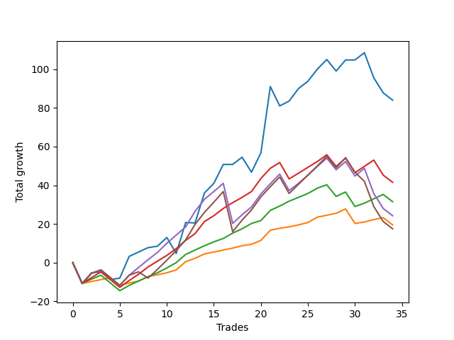

# Short Shepard 004 
- Symbol: ES_SmolBoi
- Date Range: 03/18/2022 - 07/29/2022
- Trading Period: 7:20-12:30
- Number of Trades: 34



| Name | Win Percent | Profit | Avg Profit / Trade | Avg Time / Trade |      | Name | Win Percent | Profit | Avg Profit / Trade | Avg Time / Trade |
| ---- | ----------- | ------ | ------------------ | ---------------- | ---- | ---- | ----------- | ------ | ------------------ | ---------------- |
| Sorted By <br> Profit | | | | | | Sorted By <br> Win Percentage ||||
| Two | 64.71 | 42000.00 | 1235.29 | 15:43 |     | Eighty-One | 88.24 | 9750.00 | 286.76 | 05:41 |
| Eighty-Three | 76.47 | 20750.00 | 610.29 | 10:27 |     | Eighty-Two | 82.35 | 15750.00 | 463.24 | 08:27 |
| Eighty-Two | 82.35 | 15750.00 | 463.24 | 08:27 |     | Eighty-Three | 76.47 | 20750.00 | 610.29 | 10:27 |
| Eighty-Four | 70.59 | 12125.00 | 356.62 | 12:47 |     | Eighty-Four | 70.59 | 12125.00 | 356.62 | 12:47 |
| Eighty-One | 88.24 | 9750.00 | 286.76 | 05:41 |     | Two | 64.71 | 42000.00 | 1235.29 | 15:43 |
| Eighty-Five | 64.71 | 8750.00 | 257.35 | 15:06 |     | Eighty-Five | 64.71 | 8750.00 | 257.35 | 15:06 |

## NO STOPLOSS

### Test Two
* Sell when the price hits the upper line of the 20p 2std bollinger
* No Stoploss
* Results:
```
Total Trades: 34
Percent Up: 35.29
Percent Down: 64.71
Total Points Moved Down: 84.00
Potential Profit: 42000.00
Total Points Ups: 71.50 Count Ups: 12
Total Points Downs: 155.50 Count Downs: 22
```

<details><summary>Trades</summary>

<code>In: 2022-03-18 12:13:00		Out: 2022-03-18 12:42:55		Total Position Time: 29:55		Total Move Down: -10.75		Total to Date: -10.75</code> <br />
<code>In: 2022-03-23 09:05:00		Out: 2022-03-23 09:06:25		Total Position Time: 01:25		Total Move Down: 5.50		Total to Date: -5.25</code> <br />
<code>In: 2022-03-24 08:35:00		Out: 2022-03-24 09:03:10		Total Position Time: 28:10		Total Move Down: 0.50		Total to Date: -4.75</code> <br />
<code>In: 2022-03-28 12:01:00		Out: 2022-03-28 12:30:55		Total Position Time: 29:55		Total Move Down: -4.00		Total to Date: -8.75</code> <br />
<code>In: 2022-03-29 12:15:00		Out: 2022-03-29 12:27:50		Total Position Time: 12:50		Total Move Down: 0.75		Total to Date: -8.00</code> <br />
<code>In: 2022-04-06 11:06:00		Out: 2022-04-06 11:08:10		Total Position Time: 02:10		Total Move Down: 11.25		Total to Date: 3.25</code> <br />
<code>In: 2022-04-07 11:06:00		Out: 2022-04-07 11:18:20		Total Position Time: 12:20		Total Move Down: 2.25		Total to Date: 5.50</code> <br />
<code>In: 2022-04-07 12:08:00		Out: 2022-04-07 12:21:20		Total Position Time: 13:20		Total Move Down: 2.25		Total to Date: 7.75</code> <br />
<code>In: 2022-04-13 10:26:00		Out: 2022-04-13 10:26:55		Total Position Time: 00:55		Total Move Down: 0.75		Total to Date: 8.50</code> <br />
<code>In: 2022-04-27 09:34:00		Out: 2022-04-27 10:00:10		Total Position Time: 26:10		Total Move Down: 4.50		Total to Date: 13.00</code> <br />
<code>In: 2022-04-28 11:54:00		Out: 2022-04-28 12:23:55		Total Position Time: 29:55		Total Move Down: -8.25		Total to Date: 4.75</code> <br />
<code>In: 2022-05-04 11:07:00		Out: 2022-05-04 11:07:40		Total Position Time: 00:40		Total Move Down: 16.00		Total to Date: 20.75</code> <br />
<code>In: 2022-05-04 11:08:00		Out: 2022-05-04 11:08:10		Total Position Time: 00:10		Total Move Down: -0.25		Total to Date: 20.50</code> <br />
<code>In: 2022-05-04 11:31:00		Out: 2022-05-04 11:32:25		Total Position Time: 01:25		Total Move Down: 15.50		Total to Date: 36.00</code> <br />
<code>In: 2022-05-16 11:36:00		Out: 2022-05-16 11:45:35		Total Position Time: 09:35		Total Move Down: 5.00		Total to Date: 41.00</code> <br />
<code>In: 2022-05-19 11:56:00		Out: 2022-05-19 12:14:05		Total Position Time: 18:05		Total Move Down: 9.75		Total to Date: 50.75</code> <br />
<code>In: 2022-05-25 11:33:00		Out: 2022-05-25 11:50:00		Total Position Time: 17:00		Total Move Down: -0.00		Total to Date: 50.75</code> <br />
<code>In: 2022-05-31 11:04:00		Out: 2022-05-31 11:22:35		Total Position Time: 18:35		Total Move Down: 3.75		Total to Date: 54.50</code> <br />
<code>In: 2022-06-02 08:55:00		Out: 2022-06-02 09:24:55		Total Position Time: 29:55		Total Move Down: -7.75		Total to Date: 46.75</code> <br />
<code>In: 2022-06-15 11:02:00		Out: 2022-06-15 11:03:05		Total Position Time: 01:05		Total Move Down: 10.00		Total to Date: 56.75</code> <br />
<code>In: 2022-06-15 11:48:00		Out: 2022-06-15 11:58:05		Total Position Time: 10:05		Total Move Down: 34.25		Total to Date: 91.00</code> <br />
<code>In: 2022-07-01 12:18:00		Out: 2022-07-01 12:46:00		Total Position Time: 28:00		Total Move Down: -10.00		Total to Date: 81.00</code> <br />
<code>In: 2022-07-05 08:53:00		Out: 2022-07-05 09:03:50		Total Position Time: 10:50		Total Move Down: 2.50		Total to Date: 83.50</code> <br />
<code>In: 2022-07-05 08:58:00		Out: 2022-07-05 09:03:50		Total Position Time: 05:50		Total Move Down: 6.50		Total to Date: 90.00</code> <br />
<code>In: 2022-07-05 11:43:00		Out: 2022-07-05 12:01:15		Total Position Time: 18:15		Total Move Down: 3.75		Total to Date: 93.75</code> <br />
<code>In: 2022-07-06 11:48:00		Out: 2022-07-06 12:01:25		Total Position Time: 13:25		Total Move Down: 6.25		Total to Date: 100.00</code> <br />
<code>In: 2022-07-07 12:23:00		Out: 2022-07-07 12:28:30		Total Position Time: 05:30		Total Move Down: 5.00		Total to Date: 105.00</code> <br />
<code>In: 2022-07-11 10:15:00		Out: 2022-07-11 10:44:55		Total Position Time: 29:55		Total Move Down: -6.00		Total to Date: 99.00</code> <br />
<code>In: 2022-07-13 10:08:00		Out: 2022-07-13 10:18:35		Total Position Time: 10:35		Total Move Down: 5.75		Total to Date: 104.75</code> <br />
<code>In: 2022-07-14 11:28:00		Out: 2022-07-14 11:52:00		Total Position Time: 24:00		Total Move Down: -0.00		Total to Date: 104.75</code> <br />
<code>In: 2022-07-14 11:32:00		Out: 2022-07-14 11:52:00		Total Position Time: 20:00		Total Move Down: 3.75		Total to Date: 108.50</code> <br />
<code>In: 2022-07-27 11:50:00		Out: 2022-07-27 12:19:55		Total Position Time: 29:55		Total Move Down: -13.00		Total to Date: 95.50</code> <br />
<code>In: 2022-07-29 12:09:00		Out: 2022-07-29 12:38:55		Total Position Time: 29:55		Total Move Down: -7.75		Total to Date: 87.75</code> <br />
<code>In: 2022-07-29 12:31:00		Out: 2022-07-29 12:46:00		Total Position Time: 15:00		Total Move Down: -3.75		Total to Date: 84.00</code> <br />


</details>

## TAKE PROFIT

### Test Eighty-One
* Take Profit of 1 Point
* No Stoploss
* Results:
```
Total Trades: 34
Percent Up: 11.76
Percent Down: 88.24
Total Points Moved Down: 19.50
Potential Profit: 9750.00
Total Points Ups: 26.00 Count Ups: 4
Total Points Downs: 45.50 Count Downs: 30
```

<details><summary>Trades</summary>

<code>In: 2022-03-18 12:13:00		Out: 2022-03-18 12:42:55		Total Position Time: 29:55		Total Move Down: -10.75		Total to Date: -10.75</code> <br />
<code>In: 2022-03-23 09:05:00		Out: 2022-03-23 09:05:30		Total Position Time: 00:30		Total Move Down: 1.00		Total to Date: -9.75</code> <br />
<code>In: 2022-03-24 08:35:00		Out: 2022-03-24 09:03:15		Total Position Time: 28:15		Total Move Down: 1.00		Total to Date: -8.75</code> <br />
<code>In: 2022-03-28 12:01:00		Out: 2022-03-28 12:03:00		Total Position Time: 02:00		Total Move Down: 1.00		Total to Date: -7.75</code> <br />
<code>In: 2022-03-29 12:15:00		Out: 2022-03-29 12:44:55		Total Position Time: 29:55		Total Move Down: -4.00		Total to Date: -11.75</code> <br />
<code>In: 2022-04-06 11:06:00		Out: 2022-04-06 11:07:00		Total Position Time: 01:00		Total Move Down: 1.25		Total to Date: -10.50</code> <br />
<code>In: 2022-04-07 11:06:00		Out: 2022-04-07 11:06:15		Total Position Time: 00:15		Total Move Down: 1.00		Total to Date: -9.50</code> <br />
<code>In: 2022-04-07 12:08:00		Out: 2022-04-07 12:21:20		Total Position Time: 13:20		Total Move Down: 2.25		Total to Date: -7.25</code> <br />
<code>In: 2022-04-13 10:26:00		Out: 2022-04-13 10:28:10		Total Position Time: 02:10		Total Move Down: 1.00		Total to Date: -6.25</code> <br />
<code>In: 2022-04-27 09:34:00		Out: 2022-04-27 09:34:10		Total Position Time: 00:10		Total Move Down: 1.00		Total to Date: -5.25</code> <br />
<code>In: 2022-04-28 11:54:00		Out: 2022-04-28 11:54:20		Total Position Time: 00:20		Total Move Down: 1.50		Total to Date: -3.75</code> <br />
<code>In: 2022-05-04 11:07:00		Out: 2022-05-04 11:07:10		Total Position Time: 00:10		Total Move Down: 4.25		Total to Date: 0.50</code> <br />
<code>In: 2022-05-04 11:08:00		Out: 2022-05-04 11:08:15		Total Position Time: 00:15		Total Move Down: 1.75		Total to Date: 2.25</code> <br />
<code>In: 2022-05-04 11:31:00		Out: 2022-05-04 11:31:10		Total Position Time: 00:10		Total Move Down: 2.25		Total to Date: 4.50</code> <br />
<code>In: 2022-05-16 11:36:00		Out: 2022-05-16 11:36:10		Total Position Time: 00:10		Total Move Down: 1.00		Total to Date: 5.50</code> <br />
<code>In: 2022-05-19 11:56:00		Out: 2022-05-19 11:57:00		Total Position Time: 01:00		Total Move Down: 1.00		Total to Date: 6.50</code> <br />
<code>In: 2022-05-25 11:33:00		Out: 2022-05-25 11:33:15		Total Position Time: 00:15		Total Move Down: 1.00		Total to Date: 7.50</code> <br />
<code>In: 2022-05-31 11:04:00		Out: 2022-05-31 11:04:10		Total Position Time: 00:10		Total Move Down: 1.25		Total to Date: 8.75</code> <br />
<code>In: 2022-06-02 08:55:00		Out: 2022-06-02 08:55:30		Total Position Time: 00:30		Total Move Down: 0.75		Total to Date: 9.50</code> <br />
<code>In: 2022-06-15 11:02:00		Out: 2022-06-15 11:02:10		Total Position Time: 00:10		Total Move Down: 2.00		Total to Date: 11.50</code> <br />
<code>In: 2022-06-15 11:48:00		Out: 2022-06-15 11:48:10		Total Position Time: 00:10		Total Move Down: 5.25		Total to Date: 16.75</code> <br />
<code>In: 2022-07-01 12:18:00		Out: 2022-07-01 12:19:50		Total Position Time: 01:50		Total Move Down: 1.00		Total to Date: 17.75</code> <br />
<code>In: 2022-07-05 08:53:00		Out: 2022-07-05 09:03:45		Total Position Time: 10:45		Total Move Down: 0.75		Total to Date: 18.50</code> <br />
<code>In: 2022-07-05 08:58:00		Out: 2022-07-05 08:58:20		Total Position Time: 00:20		Total Move Down: 1.00		Total to Date: 19.50</code> <br />
<code>In: 2022-07-05 11:43:00		Out: 2022-07-05 11:44:10		Total Position Time: 01:10		Total Move Down: 1.25		Total to Date: 20.75</code> <br />
<code>In: 2022-07-06 11:48:00		Out: 2022-07-06 11:48:10		Total Position Time: 00:10		Total Move Down: 2.75		Total to Date: 23.50</code> <br />
<code>In: 2022-07-07 12:23:00		Out: 2022-07-07 12:24:05		Total Position Time: 01:05		Total Move Down: 1.00		Total to Date: 24.50</code> <br />
<code>In: 2022-07-11 10:15:00		Out: 2022-07-11 10:15:35		Total Position Time: 00:35		Total Move Down: 1.00		Total to Date: 25.50</code> <br />
<code>In: 2022-07-13 10:08:00		Out: 2022-07-13 10:16:30		Total Position Time: 08:30		Total Move Down: 2.25		Total to Date: 27.75</code> <br />
<code>In: 2022-07-14 11:28:00		Out: 2022-07-14 11:57:55		Total Position Time: 29:55		Total Move Down: -7.50		Total to Date: 20.25</code> <br />
<code>In: 2022-07-14 11:32:00		Out: 2022-07-14 11:44:00		Total Position Time: 12:00		Total Move Down: 0.75		Total to Date: 21.00</code> <br />
<code>In: 2022-07-27 11:50:00		Out: 2022-07-27 11:50:45		Total Position Time: 00:45		Total Move Down: 1.25		Total to Date: 22.25</code> <br />
<code>In: 2022-07-29 12:09:00		Out: 2022-07-29 12:09:25		Total Position Time: 00:25		Total Move Down: 1.00		Total to Date: 23.25</code> <br />
<code>In: 2022-07-29 12:31:00		Out: 2022-07-29 12:46:00		Total Position Time: 15:00		Total Move Down: -3.75		Total to Date: 19.50</code> <br />


</details>

### Test Eighty-Two
* Take Profit of 2 Point
* No Stoploss
* Results:
```
Total Trades: 34
Percent Up: 17.65
Percent Down: 82.35
Total Points Moved Down: 31.50
Potential Profit: 15750.00
Total Points Ups: 36.00 Count Ups: 6
Total Points Downs: 67.50 Count Downs: 28
```

<details><summary>Trades</summary>

<code>In: 2022-03-18 12:13:00		Out: 2022-03-18 12:42:55		Total Position Time: 29:55		Total Move Down: -10.75		Total to Date: -10.75</code> <br />
<code>In: 2022-03-23 09:05:00		Out: 2022-03-23 09:05:55		Total Position Time: 00:55		Total Move Down: 2.25		Total to Date: -8.50</code> <br />
<code>In: 2022-03-24 08:35:00		Out: 2022-03-24 09:03:20		Total Position Time: 28:20		Total Move Down: 2.00		Total to Date: -6.50</code> <br />
<code>In: 2022-03-28 12:01:00		Out: 2022-03-28 12:30:55		Total Position Time: 29:55		Total Move Down: -4.00		Total to Date: -10.50</code> <br />
<code>In: 2022-03-29 12:15:00		Out: 2022-03-29 12:44:55		Total Position Time: 29:55		Total Move Down: -4.00		Total to Date: -14.50</code> <br />
<code>In: 2022-04-06 11:06:00		Out: 2022-04-06 11:07:05		Total Position Time: 01:05		Total Move Down: 2.75		Total to Date: -11.75</code> <br />
<code>In: 2022-04-07 11:06:00		Out: 2022-04-07 11:06:40		Total Position Time: 00:40		Total Move Down: 2.25		Total to Date: -9.50</code> <br />
<code>In: 2022-04-07 12:08:00		Out: 2022-04-07 12:21:20		Total Position Time: 13:20		Total Move Down: 2.25		Total to Date: -7.25</code> <br />
<code>In: 2022-04-13 10:26:00		Out: 2022-04-13 10:33:10		Total Position Time: 07:10		Total Move Down: 2.00		Total to Date: -5.25</code> <br />
<code>In: 2022-04-27 09:34:00		Out: 2022-04-27 09:36:40		Total Position Time: 02:40		Total Move Down: 2.50		Total to Date: -2.75</code> <br />
<code>In: 2022-04-28 11:54:00		Out: 2022-04-28 11:54:30		Total Position Time: 00:30		Total Move Down: 2.75		Total to Date: 0.00</code> <br />
<code>In: 2022-05-04 11:07:00		Out: 2022-05-04 11:07:10		Total Position Time: 00:10		Total Move Down: 4.25		Total to Date: 4.25</code> <br />
<code>In: 2022-05-04 11:08:00		Out: 2022-05-04 11:18:50		Total Position Time: 10:50		Total Move Down: 2.25		Total to Date: 6.50</code> <br />
<code>In: 2022-05-04 11:31:00		Out: 2022-05-04 11:31:10		Total Position Time: 00:10		Total Move Down: 2.25		Total to Date: 8.75</code> <br />
<code>In: 2022-05-16 11:36:00		Out: 2022-05-16 11:36:25		Total Position Time: 00:25		Total Move Down: 2.00		Total to Date: 10.75</code> <br />
<code>In: 2022-05-19 11:56:00		Out: 2022-05-19 11:57:25		Total Position Time: 01:25		Total Move Down: 1.75		Total to Date: 12.50</code> <br />
<code>In: 2022-05-25 11:33:00		Out: 2022-05-25 11:39:10		Total Position Time: 06:10		Total Move Down: 2.75		Total to Date: 15.25</code> <br />
<code>In: 2022-05-31 11:04:00		Out: 2022-05-31 11:05:05		Total Position Time: 01:05		Total Move Down: 2.25		Total to Date: 17.50</code> <br />
<code>In: 2022-06-02 08:55:00		Out: 2022-06-02 08:56:10		Total Position Time: 01:10		Total Move Down: 2.75		Total to Date: 20.25</code> <br />
<code>In: 2022-06-15 11:02:00		Out: 2022-06-15 11:02:45		Total Position Time: 00:45		Total Move Down: 1.50		Total to Date: 21.75</code> <br />
<code>In: 2022-06-15 11:48:00		Out: 2022-06-15 11:48:10		Total Position Time: 00:10		Total Move Down: 5.25		Total to Date: 27.00</code> <br />
<code>In: 2022-07-01 12:18:00		Out: 2022-07-01 12:20:30		Total Position Time: 02:30		Total Move Down: 2.25		Total to Date: 29.25</code> <br />
<code>In: 2022-07-05 08:53:00		Out: 2022-07-05 09:03:50		Total Position Time: 10:50		Total Move Down: 2.50		Total to Date: 31.75</code> <br />
<code>In: 2022-07-05 08:58:00		Out: 2022-07-05 08:58:40		Total Position Time: 00:40		Total Move Down: 2.00		Total to Date: 33.75</code> <br />
<code>In: 2022-07-05 11:43:00		Out: 2022-07-05 11:47:40		Total Position Time: 04:40		Total Move Down: 2.00		Total to Date: 35.75</code> <br />
<code>In: 2022-07-06 11:48:00		Out: 2022-07-06 11:48:10		Total Position Time: 00:10		Total Move Down: 2.75		Total to Date: 38.50</code> <br />
<code>In: 2022-07-07 12:23:00		Out: 2022-07-07 12:24:25		Total Position Time: 01:25		Total Move Down: 1.75		Total to Date: 40.25</code> <br />
<code>In: 2022-07-11 10:15:00		Out: 2022-07-11 10:44:55		Total Position Time: 29:55		Total Move Down: -6.00		Total to Date: 34.25</code> <br />
<code>In: 2022-07-13 10:08:00		Out: 2022-07-13 10:16:30		Total Position Time: 08:30		Total Move Down: 2.25		Total to Date: 36.50</code> <br />
<code>In: 2022-07-14 11:28:00		Out: 2022-07-14 11:57:55		Total Position Time: 29:55		Total Move Down: -7.50		Total to Date: 29.00</code> <br />
<code>In: 2022-07-14 11:32:00		Out: 2022-07-14 11:44:30		Total Position Time: 12:30		Total Move Down: 1.75		Total to Date: 30.75</code> <br />
<code>In: 2022-07-27 11:50:00		Out: 2022-07-27 11:50:50		Total Position Time: 00:50		Total Move Down: 2.25		Total to Date: 33.00</code> <br />
<code>In: 2022-07-29 12:09:00		Out: 2022-07-29 12:12:55		Total Position Time: 03:55		Total Move Down: 2.25		Total to Date: 35.25</code> <br />
<code>In: 2022-07-29 12:31:00		Out: 2022-07-29 12:46:00		Total Position Time: 15:00		Total Move Down: -3.75		Total to Date: 31.50</code> <br />


</details>

### Test Eighty-Three
* Take Profit of 3 Point
* No Stoploss
* Results:
```
Total Trades: 34
Percent Up: 23.53
Percent Down: 76.47
Total Points Moved Down: 41.50
Potential Profit: 20750.00
Total Points Ups: 52.25 Count Ups: 8
Total Points Downs: 93.75 Count Downs: 26
```

<details><summary>Trades</summary>

<code>In: 2022-03-18 12:13:00		Out: 2022-03-18 12:42:55		Total Position Time: 29:55		Total Move Down: -10.75		Total to Date: -10.75</code> <br />
<code>In: 2022-03-23 09:05:00		Out: 2022-03-23 09:06:05		Total Position Time: 01:05		Total Move Down: 3.00		Total to Date: -7.75</code> <br />
<code>In: 2022-03-24 08:35:00		Out: 2022-03-24 09:03:30		Total Position Time: 28:30		Total Move Down: 3.00		Total to Date: -4.75</code> <br />
<code>In: 2022-03-28 12:01:00		Out: 2022-03-28 12:30:55		Total Position Time: 29:55		Total Move Down: -4.00		Total to Date: -8.75</code> <br />
<code>In: 2022-03-29 12:15:00		Out: 2022-03-29 12:44:55		Total Position Time: 29:55		Total Move Down: -4.00		Total to Date: -12.75</code> <br />
<code>In: 2022-04-06 11:06:00		Out: 2022-04-06 11:07:15		Total Position Time: 01:15		Total Move Down: 3.50		Total to Date: -9.25</code> <br />
<code>In: 2022-04-07 11:06:00		Out: 2022-04-07 11:18:40		Total Position Time: 12:40		Total Move Down: 3.25		Total to Date: -6.00</code> <br />
<code>In: 2022-04-07 12:08:00		Out: 2022-04-07 12:24:10		Total Position Time: 16:10		Total Move Down: 3.75		Total to Date: -2.25</code> <br />
<code>In: 2022-04-13 10:26:00		Out: 2022-04-13 10:33:25		Total Position Time: 07:25		Total Move Down: 3.00		Total to Date: 0.75</code> <br />
<code>In: 2022-04-27 09:34:00		Out: 2022-04-27 09:36:55		Total Position Time: 02:55		Total Move Down: 3.00		Total to Date: 3.75</code> <br />
<code>In: 2022-04-28 11:54:00		Out: 2022-04-28 11:54:40		Total Position Time: 00:40		Total Move Down: 3.50		Total to Date: 7.25</code> <br />
<code>In: 2022-05-04 11:07:00		Out: 2022-05-04 11:07:10		Total Position Time: 00:10		Total Move Down: 4.25		Total to Date: 11.50</code> <br />
<code>In: 2022-05-04 11:08:00		Out: 2022-05-04 11:19:05		Total Position Time: 11:05		Total Move Down: 3.50		Total to Date: 15.00</code> <br />
<code>In: 2022-05-04 11:31:00		Out: 2022-05-04 11:31:20		Total Position Time: 00:20		Total Move Down: 6.25		Total to Date: 21.25</code> <br />
<code>In: 2022-05-16 11:36:00		Out: 2022-05-16 11:36:45		Total Position Time: 00:45		Total Move Down: 3.00		Total to Date: 24.25</code> <br />
<code>In: 2022-05-19 11:56:00		Out: 2022-05-19 11:57:30		Total Position Time: 01:30		Total Move Down: 3.75		Total to Date: 28.00</code> <br />
<code>In: 2022-05-25 11:33:00		Out: 2022-05-25 11:39:55		Total Position Time: 06:55		Total Move Down: 3.00		Total to Date: 31.00</code> <br />
<code>In: 2022-05-31 11:04:00		Out: 2022-05-31 11:05:20		Total Position Time: 01:20		Total Move Down: 2.75		Total to Date: 33.75</code> <br />
<code>In: 2022-06-02 08:55:00		Out: 2022-06-02 08:56:25		Total Position Time: 01:25		Total Move Down: 3.00		Total to Date: 36.75</code> <br />
<code>In: 2022-06-15 11:02:00		Out: 2022-06-15 11:03:00		Total Position Time: 01:00		Total Move Down: 6.75		Total to Date: 43.50</code> <br />
<code>In: 2022-06-15 11:48:00		Out: 2022-06-15 11:48:10		Total Position Time: 00:10		Total Move Down: 5.25		Total to Date: 48.75</code> <br />
<code>In: 2022-07-01 12:18:00		Out: 2022-07-01 12:20:50		Total Position Time: 02:50		Total Move Down: 3.00		Total to Date: 51.75</code> <br />
<code>In: 2022-07-05 08:53:00		Out: 2022-07-05 09:22:55		Total Position Time: 29:55		Total Move Down: -8.50		Total to Date: 43.25</code> <br />
<code>In: 2022-07-05 08:58:00		Out: 2022-07-05 08:59:15		Total Position Time: 01:15		Total Move Down: 3.00		Total to Date: 46.25</code> <br />
<code>In: 2022-07-05 11:43:00		Out: 2022-07-05 11:48:10		Total Position Time: 05:10		Total Move Down: 3.00		Total to Date: 49.25</code> <br />
<code>In: 2022-07-06 11:48:00		Out: 2022-07-06 11:48:35		Total Position Time: 00:35		Total Move Down: 3.00		Total to Date: 52.25</code> <br />
<code>In: 2022-07-07 12:23:00		Out: 2022-07-07 12:25:05		Total Position Time: 02:05		Total Move Down: 3.50		Total to Date: 55.75</code> <br />
<code>In: 2022-07-11 10:15:00		Out: 2022-07-11 10:44:55		Total Position Time: 29:55		Total Move Down: -6.00		Total to Date: 49.75</code> <br />
<code>In: 2022-07-13 10:08:00		Out: 2022-07-13 10:17:05		Total Position Time: 09:05		Total Move Down: 4.25		Total to Date: 54.00</code> <br />
<code>In: 2022-07-14 11:28:00		Out: 2022-07-14 11:57:55		Total Position Time: 29:55		Total Move Down: -7.50		Total to Date: 46.50</code> <br />
<code>In: 2022-07-14 11:32:00		Out: 2022-07-14 11:46:00		Total Position Time: 14:00		Total Move Down: 3.25		Total to Date: 49.75</code> <br />
<code>In: 2022-07-27 11:50:00		Out: 2022-07-27 11:51:05		Total Position Time: 01:05		Total Move Down: 3.25		Total to Date: 53.00</code> <br />
<code>In: 2022-07-29 12:09:00		Out: 2022-07-29 12:38:55		Total Position Time: 29:55		Total Move Down: -7.75		Total to Date: 45.25</code> <br />
<code>In: 2022-07-29 12:31:00		Out: 2022-07-29 12:46:00		Total Position Time: 15:00		Total Move Down: -3.75		Total to Date: 41.50</code> <br />


</details>

### Test Eighty-Four
* Take Profit of 4 Point
* No Stoploss
* Results:
```
Total Trades: 34
Percent Up: 29.41
Percent Down: 70.59
Total Points Moved Down: 24.25
Potential Profit: 12125.00
Total Points Ups: 86.00 Count Ups: 10
Total Points Downs: 110.25 Count Downs: 24
```

<details><summary>Trades</summary>

<code>In: 2022-03-18 12:13:00		Out: 2022-03-18 12:42:55		Total Position Time: 29:55		Total Move Down: -10.75		Total to Date: -10.75</code> <br />
<code>In: 2022-03-23 09:05:00		Out: 2022-03-23 09:06:20		Total Position Time: 01:20		Total Move Down: 5.25		Total to Date: -5.50</code> <br />
<code>In: 2022-03-24 08:35:00		Out: 2022-03-24 09:04:55		Total Position Time: 29:55		Total Move Down: 1.75		Total to Date: -3.75</code> <br />
<code>In: 2022-03-28 12:01:00		Out: 2022-03-28 12:30:55		Total Position Time: 29:55		Total Move Down: -4.00		Total to Date: -7.75</code> <br />
<code>In: 2022-03-29 12:15:00		Out: 2022-03-29 12:44:55		Total Position Time: 29:55		Total Move Down: -4.00		Total to Date: -11.75</code> <br />
<code>In: 2022-04-06 11:06:00		Out: 2022-04-06 11:07:20		Total Position Time: 01:20		Total Move Down: 5.25		Total to Date: -6.50</code> <br />
<code>In: 2022-04-07 11:06:00		Out: 2022-04-07 11:19:10		Total Position Time: 13:10		Total Move Down: 4.00		Total to Date: -2.50</code> <br />
<code>In: 2022-04-07 12:08:00		Out: 2022-04-07 12:24:35		Total Position Time: 16:35		Total Move Down: 4.00		Total to Date: 1.50</code> <br />
<code>In: 2022-04-13 10:26:00		Out: 2022-04-13 10:34:30		Total Position Time: 08:30		Total Move Down: 3.75		Total to Date: 5.25</code> <br />
<code>In: 2022-04-27 09:34:00		Out: 2022-04-27 09:37:00		Total Position Time: 03:00		Total Move Down: 4.75		Total to Date: 10.00</code> <br />
<code>In: 2022-04-28 11:54:00		Out: 2022-04-28 11:55:00		Total Position Time: 01:00		Total Move Down: 4.25		Total to Date: 14.25</code> <br />
<code>In: 2022-05-04 11:07:00		Out: 2022-05-04 11:07:10		Total Position Time: 00:10		Total Move Down: 4.25		Total to Date: 18.50</code> <br />
<code>In: 2022-05-04 11:08:00		Out: 2022-05-04 11:20:50		Total Position Time: 12:50		Total Move Down: 8.00		Total to Date: 26.50</code> <br />
<code>In: 2022-05-04 11:31:00		Out: 2022-05-04 11:31:20		Total Position Time: 00:20		Total Move Down: 6.25		Total to Date: 32.75</code> <br />
<code>In: 2022-05-16 11:36:00		Out: 2022-05-16 11:45:10		Total Position Time: 09:10		Total Move Down: 4.00		Total to Date: 36.75</code> <br />
<code>In: 2022-05-19 11:56:00		Out: 2022-05-19 11:57:35		Total Position Time: 01:35		Total Move Down: 4.25		Total to Date: 41.00</code> <br />
<code>In: 2022-05-25 11:33:00		Out: 2022-05-25 12:02:55		Total Position Time: 29:55		Total Move Down: -20.75		Total to Date: 20.25</code> <br />
<code>In: 2022-05-31 11:04:00		Out: 2022-05-31 11:05:45		Total Position Time: 01:45		Total Move Down: 4.50		Total to Date: 24.75</code> <br />
<code>In: 2022-06-02 08:55:00		Out: 2022-06-02 08:57:05		Total Position Time: 02:05		Total Move Down: 4.00		Total to Date: 28.75</code> <br />
<code>In: 2022-06-15 11:02:00		Out: 2022-06-15 11:03:00		Total Position Time: 01:00		Total Move Down: 6.75		Total to Date: 35.50</code> <br />
<code>In: 2022-06-15 11:48:00		Out: 2022-06-15 11:48:10		Total Position Time: 00:10		Total Move Down: 5.25		Total to Date: 40.75</code> <br />
<code>In: 2022-07-01 12:18:00		Out: 2022-07-01 12:21:00		Total Position Time: 03:00		Total Move Down: 5.00		Total to Date: 45.75</code> <br />
<code>In: 2022-07-05 08:53:00		Out: 2022-07-05 09:22:55		Total Position Time: 29:55		Total Move Down: -8.50		Total to Date: 37.25</code> <br />
<code>In: 2022-07-05 08:58:00		Out: 2022-07-05 08:59:30		Total Position Time: 01:30		Total Move Down: 3.75		Total to Date: 41.00</code> <br />
<code>In: 2022-07-05 11:43:00		Out: 2022-07-05 11:48:55		Total Position Time: 05:55		Total Move Down: 4.25		Total to Date: 45.25</code> <br />
<code>In: 2022-07-06 11:48:00		Out: 2022-07-06 11:50:15		Total Position Time: 02:15		Total Move Down: 4.50		Total to Date: 49.75</code> <br />
<code>In: 2022-07-07 12:23:00		Out: 2022-07-07 12:27:40		Total Position Time: 04:40		Total Move Down: 4.25		Total to Date: 54.00</code> <br />
<code>In: 2022-07-11 10:15:00		Out: 2022-07-11 10:44:55		Total Position Time: 29:55		Total Move Down: -6.00		Total to Date: 48.00</code> <br />
<code>In: 2022-07-13 10:08:00		Out: 2022-07-13 10:17:05		Total Position Time: 09:05		Total Move Down: 4.25		Total to Date: 52.25</code> <br />
<code>In: 2022-07-14 11:28:00		Out: 2022-07-14 11:57:55		Total Position Time: 29:55		Total Move Down: -7.50		Total to Date: 44.75</code> <br />
<code>In: 2022-07-14 11:32:00		Out: 2022-07-14 11:52:05		Total Position Time: 20:05		Total Move Down: 4.00		Total to Date: 48.75</code> <br />
<code>In: 2022-07-27 11:50:00		Out: 2022-07-27 12:19:55		Total Position Time: 29:55		Total Move Down: -13.00		Total to Date: 35.75</code> <br />
<code>In: 2022-07-29 12:09:00		Out: 2022-07-29 12:38:55		Total Position Time: 29:55		Total Move Down: -7.75		Total to Date: 28.00</code> <br />
<code>In: 2022-07-29 12:31:00		Out: 2022-07-29 12:46:00		Total Position Time: 15:00		Total Move Down: -3.75		Total to Date: 24.25</code> <br />


</details>

### Test Eighty-Five
* Take Profit of 5 Point
* No Stoploss
* Results:
```
Total Trades: 34
Percent Up: 35.29
Percent Down: 64.71
Total Points Moved Down: 17.50
Potential Profit: 8750.00
Total Points Ups: 94.00 Count Ups: 12
Total Points Downs: 111.50 Count Downs: 22
```

<details><summary>Trades</summary>

<code>In: 2022-03-18 12:13:00		Out: 2022-03-18 12:42:55		Total Position Time: 29:55		Total Move Down: -10.75		Total to Date: -10.75</code> <br />
<code>In: 2022-03-23 09:05:00		Out: 2022-03-23 09:06:20		Total Position Time: 01:20		Total Move Down: 5.25		Total to Date: -5.50</code> <br />
<code>In: 2022-03-24 08:35:00		Out: 2022-03-24 09:04:55		Total Position Time: 29:55		Total Move Down: 1.75		Total to Date: -3.75</code> <br />
<code>In: 2022-03-28 12:01:00		Out: 2022-03-28 12:30:55		Total Position Time: 29:55		Total Move Down: -4.00		Total to Date: -7.75</code> <br />
<code>In: 2022-03-29 12:15:00		Out: 2022-03-29 12:44:55		Total Position Time: 29:55		Total Move Down: -4.00		Total to Date: -11.75</code> <br />
<code>In: 2022-04-06 11:06:00		Out: 2022-04-06 11:07:20		Total Position Time: 01:20		Total Move Down: 5.25		Total to Date: -6.50</code> <br />
<code>In: 2022-04-07 11:06:00		Out: 2022-04-07 11:35:55		Total Position Time: 29:55		Total Move Down: 1.75		Total to Date: -4.75</code> <br />
<code>In: 2022-04-07 12:08:00		Out: 2022-04-07 12:37:55		Total Position Time: 29:55		Total Move Down: -3.25		Total to Date: -8.00</code> <br />
<code>In: 2022-04-13 10:26:00		Out: 2022-04-13 10:36:00		Total Position Time: 10:00		Total Move Down: 4.50		Total to Date: -3.50</code> <br />
<code>In: 2022-04-27 09:34:00		Out: 2022-04-27 09:37:00		Total Position Time: 03:00		Total Move Down: 4.75		Total to Date: 1.25</code> <br />
<code>In: 2022-04-28 11:54:00		Out: 2022-04-28 11:55:10		Total Position Time: 01:10		Total Move Down: 5.00		Total to Date: 6.25</code> <br />
<code>In: 2022-05-04 11:07:00		Out: 2022-05-04 11:07:15		Total Position Time: 00:15		Total Move Down: 5.50		Total to Date: 11.75</code> <br />
<code>In: 2022-05-04 11:08:00		Out: 2022-05-04 11:20:50		Total Position Time: 12:50		Total Move Down: 8.00		Total to Date: 19.75</code> <br />
<code>In: 2022-05-04 11:31:00		Out: 2022-05-04 11:31:20		Total Position Time: 00:20		Total Move Down: 6.25		Total to Date: 26.00</code> <br />
<code>In: 2022-05-16 11:36:00		Out: 2022-05-16 11:45:40		Total Position Time: 09:40		Total Move Down: 5.25		Total to Date: 31.25</code> <br />
<code>In: 2022-05-19 11:56:00		Out: 2022-05-19 11:57:40		Total Position Time: 01:40		Total Move Down: 5.50		Total to Date: 36.75</code> <br />
<code>In: 2022-05-25 11:33:00		Out: 2022-05-25 12:02:55		Total Position Time: 29:55		Total Move Down: -20.75		Total to Date: 16.00</code> <br />
<code>In: 2022-05-31 11:04:00		Out: 2022-05-31 11:22:50		Total Position Time: 18:50		Total Move Down: 6.00		Total to Date: 22.00</code> <br />
<code>In: 2022-06-02 08:55:00		Out: 2022-06-02 08:57:25		Total Position Time: 02:25		Total Move Down: 5.25		Total to Date: 27.25</code> <br />
<code>In: 2022-06-15 11:02:00		Out: 2022-06-15 11:03:00		Total Position Time: 01:00		Total Move Down: 6.75		Total to Date: 34.00</code> <br />
<code>In: 2022-06-15 11:48:00		Out: 2022-06-15 11:48:10		Total Position Time: 00:10		Total Move Down: 5.25		Total to Date: 39.25</code> <br />
<code>In: 2022-07-01 12:18:00		Out: 2022-07-01 12:21:00		Total Position Time: 03:00		Total Move Down: 5.00		Total to Date: 44.25</code> <br />
<code>In: 2022-07-05 08:53:00		Out: 2022-07-05 09:22:55		Total Position Time: 29:55		Total Move Down: -8.50		Total to Date: 35.75</code> <br />
<code>In: 2022-07-05 08:58:00		Out: 2022-07-05 09:03:45		Total Position Time: 05:45		Total Move Down: 4.75		Total to Date: 40.50</code> <br />
<code>In: 2022-07-05 11:43:00		Out: 2022-07-05 12:01:50		Total Position Time: 18:50		Total Move Down: 4.75		Total to Date: 45.25</code> <br />
<code>In: 2022-07-06 11:48:00		Out: 2022-07-06 11:50:20		Total Position Time: 02:20		Total Move Down: 4.75		Total to Date: 50.00</code> <br />
<code>In: 2022-07-07 12:23:00		Out: 2022-07-07 12:28:30		Total Position Time: 05:30		Total Move Down: 5.00		Total to Date: 55.00</code> <br />
<code>In: 2022-07-11 10:15:00		Out: 2022-07-11 10:44:55		Total Position Time: 29:55		Total Move Down: -6.00		Total to Date: 49.00</code> <br />
<code>In: 2022-07-13 10:08:00		Out: 2022-07-13 10:18:30		Total Position Time: 10:30		Total Move Down: 5.25		Total to Date: 54.25</code> <br />
<code>In: 2022-07-14 11:28:00		Out: 2022-07-14 11:57:55		Total Position Time: 29:55		Total Move Down: -7.50		Total to Date: 46.75</code> <br />
<code>In: 2022-07-14 11:32:00		Out: 2022-07-14 12:01:55		Total Position Time: 29:55		Total Move Down: -4.75		Total to Date: 42.00</code> <br />
<code>In: 2022-07-27 11:50:00		Out: 2022-07-27 12:19:55		Total Position Time: 29:55		Total Move Down: -13.00		Total to Date: 29.00</code> <br />
<code>In: 2022-07-29 12:09:00		Out: 2022-07-29 12:38:55		Total Position Time: 29:55		Total Move Down: -7.75		Total to Date: 21.25</code> <br />
<code>In: 2022-07-29 12:31:00		Out: 2022-07-29 12:46:00		Total Position Time: 15:00		Total Move Down: -3.75		Total to Date: 17.50</code> <br />


</details>