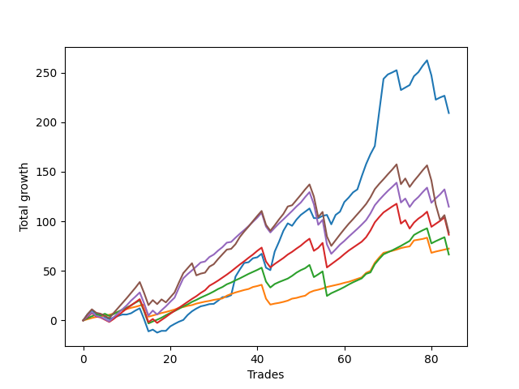

# Short Shepard 006 
- Symbol: ES_SmolBoi
- Date Range: 03/18/2022 - 07/29/2022
- Trading Period: 7:20-12:30
- Number of Trades: 84



| Name | Win Percent | Profit | Avg Profit / Trade | Avg Time / Trade |      | Name | Win Percent | Profit | Avg Profit / Trade | Avg Time / Trade |
| ---- | ----------- | ------ | ------------------ | ---------------- | ---- | ---- | ----------- | ------ | ------------------ | ---------------- |
| Sorted By <br> Profit | | | | | | Sorted By <br> Win Percentage ||||
| Two | 77.38 | 104625.00 | 1245.54 | 14:12 |     | Eighty-One | 95.24 | 36250.00 | 431.55 | 04:34 |
| Eighty-Four | 79.76 | 57375.00 | 683.04 | 14:22 |     | Eighty-Two | 88.10 | 33250.00 | 395.83 | 08:22 |
| Eighty-Five | 75.00 | 44375.00 | 528.27 | 16:27 |     | Eighty-Three | 82.14 | 43250.00 | 514.88 | 12:08 |
| Eighty-Three | 82.14 | 43250.00 | 514.88 | 12:08 |     | Eighty-Four | 79.76 | 57375.00 | 683.04 | 14:22 |
| Eighty-One | 95.24 | 36250.00 | 431.55 | 04:34 |     | Two | 77.38 | 104625.00 | 1245.54 | 14:12 |
| Eighty-Two | 88.10 | 33250.00 | 395.83 | 08:22 |     | Eighty-Five | 75.00 | 44375.00 | 528.27 | 16:27 |

## NO STOPLOSS

### Test Two
* Sell when the price hits the upper line of the 20p 2std bollinger
* No Stoploss
* Results:
```
Total Trades: 84
Percent Up: 22.62
Percent Down: 77.38
Total Points Moved Down: 209.25
Potential Profit: 104625.00
Total Points Ups: 150.75 Count Ups: 19
Total Points Downs: 360.00 Count Downs: 65
```

<details><summary>Trades</summary>

<code>In: 2022-03-21 08:30:00		Out: 2022-03-21 08:36:05		Total Position Time: 06:05		Total Move Down: 6.25		Total to Date: 6.25</code> <br />
<code>In: 2022-03-21 08:31:00		Out: 2022-03-21 08:36:05		Total Position Time: 05:05		Total Move Down: 4.00		Total to Date: 10.25</code> <br />
<code>In: 2022-03-25 11:09:00		Out: 2022-03-25 11:38:55		Total Position Time: 29:55		Total Move Down: -3.50		Total to Date: 6.75</code> <br />
<code>In: 2022-03-25 11:12:00		Out: 2022-03-25 11:41:55		Total Position Time: 29:55		Total Move Down: -1.00		Total to Date: 5.75</code> <br />
<code>In: 2022-03-25 11:18:00		Out: 2022-03-25 11:47:55		Total Position Time: 29:55		Total Move Down: -2.25		Total to Date: 3.50</code> <br />
<code>In: 2022-03-25 11:19:00		Out: 2022-03-25 11:48:55		Total Position Time: 29:55		Total Move Down: -2.25		Total to Date: 1.25</code> <br />
<code>In: 2022-03-25 11:34:00		Out: 2022-03-25 12:00:55		Total Position Time: 26:55		Total Move Down: 1.75		Total to Date: 3.00</code> <br />
<code>In: 2022-03-25 11:37:00		Out: 2022-03-25 12:00:55		Total Position Time: 23:55		Total Move Down: 1.50		Total to Date: 4.50</code> <br />
<code>In: 2022-03-25 11:40:00		Out: 2022-03-25 12:00:55		Total Position Time: 20:55		Total Move Down: 1.50		Total to Date: 6.00</code> <br />
<code>In: 2022-03-25 11:41:00		Out: 2022-03-25 12:00:55		Total Position Time: 19:55		Total Move Down: -0.00		Total to Date: 6.00</code> <br />
<code>In: 2022-03-25 11:49:00		Out: 2022-03-25 12:00:55		Total Position Time: 11:55		Total Move Down: 1.25		Total to Date: 7.25</code> <br />
<code>In: 2022-03-25 11:57:00		Out: 2022-03-25 12:00:55		Total Position Time: 03:55		Total Move Down: 2.75		Total to Date: 10.00</code> <br />
<code>In: 2022-03-25 11:58:00		Out: 2022-03-25 12:00:55		Total Position Time: 02:55		Total Move Down: 2.25		Total to Date: 12.25</code> <br />
<code>In: 2022-03-28 11:34:00		Out: 2022-03-28 12:03:55		Total Position Time: 29:55		Total Move Down: -11.00		Total to Date: 1.25</code> <br />
<code>In: 2022-03-28 11:36:00		Out: 2022-03-28 12:05:55		Total Position Time: 29:55		Total Move Down: -12.25		Total to Date: -11.00</code> <br />
<code>In: 2022-03-29 11:16:00		Out: 2022-03-29 11:18:30		Total Position Time: 02:30		Total Move Down: 1.75		Total to Date: -9.25</code> <br />
<code>In: 2022-03-31 07:39:00		Out: 2022-03-31 08:08:30		Total Position Time: 29:30		Total Move Down: -3.00		Total to Date: -12.25</code> <br />
<code>In: 2022-04-01 11:37:00		Out: 2022-04-01 11:50:20		Total Position Time: 13:20		Total Move Down: 1.75		Total to Date: -10.50</code> <br />
<code>In: 2022-04-01 11:38:00		Out: 2022-04-01 11:50:20		Total Position Time: 12:20		Total Move Down: -0.00		Total to Date: -10.50</code> <br />
<code>In: 2022-04-01 12:09:00		Out: 2022-04-01 12:11:10		Total Position Time: 02:10		Total Move Down: 4.50		Total to Date: -6.00</code> <br />
<code>In: 2022-04-06 08:57:00		Out: 2022-04-06 09:09:40		Total Position Time: 12:40		Total Move Down: 2.50		Total to Date: -3.50</code> <br />
<code>In: 2022-04-06 10:47:00		Out: 2022-04-06 10:57:20		Total Position Time: 10:20		Total Move Down: 2.25		Total to Date: -1.25</code> <br />
<code>In: 2022-04-06 10:48:00		Out: 2022-04-06 10:57:20		Total Position Time: 09:20		Total Move Down: 1.75		Total to Date: 0.50</code> <br />
<code>In: 2022-04-07 10:33:00		Out: 2022-04-07 10:45:15		Total Position Time: 12:15		Total Move Down: 5.00		Total to Date: 5.50</code> <br />
<code>In: 2022-04-07 10:34:00		Out: 2022-04-07 10:45:15		Total Position Time: 11:15		Total Move Down: 3.75		Total to Date: 9.25</code> <br />
<code>In: 2022-04-07 10:35:00		Out: 2022-04-07 10:45:15		Total Position Time: 10:15		Total Move Down: 2.75		Total to Date: 12.00</code> <br />
<code>In: 2022-04-07 11:06:00		Out: 2022-04-07 11:18:20		Total Position Time: 12:20		Total Move Down: 2.25		Total to Date: 14.25</code> <br />
<code>In: 2022-04-07 11:07:00		Out: 2022-04-07 11:18:20		Total Position Time: 11:20		Total Move Down: 1.00		Total to Date: 15.25</code> <br />
<code>In: 2022-04-18 07:29:00		Out: 2022-04-18 07:51:45		Total Position Time: 22:45		Total Move Down: 1.25		Total to Date: 16.50</code> <br />
<code>In: 2022-04-18 10:47:00		Out: 2022-04-18 11:10:40		Total Position Time: 23:40		Total Move Down: 0.25		Total to Date: 16.75</code> <br />
<code>In: 2022-04-18 11:00:00		Out: 2022-04-18 11:10:40		Total Position Time: 10:40		Total Move Down: 3.25		Total to Date: 20.00</code> <br />
<code>In: 2022-04-18 11:04:00		Out: 2022-04-18 11:10:40		Total Position Time: 06:40		Total Move Down: 3.50		Total to Date: 23.50</code> <br />
<code>In: 2022-04-20 07:48:00		Out: 2022-04-20 08:00:45		Total Position Time: 12:45		Total Move Down: 0.25		Total to Date: 23.75</code> <br />
<code>In: 2022-04-20 09:58:00		Out: 2022-04-20 10:08:15		Total Position Time: 10:15		Total Move Down: 1.75		Total to Date: 25.50</code> <br />
<code>In: 2022-04-25 07:39:00		Out: 2022-04-25 07:52:35		Total Position Time: 13:35		Total Move Down: 18.75		Total to Date: 44.25</code> <br />
<code>In: 2022-04-25 09:41:00		Out: 2022-04-25 10:01:20		Total Position Time: 20:20		Total Move Down: 7.25		Total to Date: 51.50</code> <br />
<code>In: 2022-04-25 10:19:00		Out: 2022-04-25 10:33:35		Total Position Time: 14:35		Total Move Down: 6.50		Total to Date: 58.00</code> <br />
<code>In: 2022-04-28 08:17:00		Out: 2022-04-28 08:32:15		Total Position Time: 15:15		Total Move Down: 0.75		Total to Date: 58.75</code> <br />
<code>In: 2022-04-28 08:21:00		Out: 2022-04-28 08:32:15		Total Position Time: 11:15		Total Move Down: 4.00		Total to Date: 62.75</code> <br />
<code>In: 2022-04-28 08:33:00		Out: 2022-04-28 08:33:10		Total Position Time: 00:10		Total Move Down: 1.00		Total to Date: 63.75</code> <br />
<code>In: 2022-04-28 08:36:00		Out: 2022-04-28 08:38:55		Total Position Time: 02:55		Total Move Down: 3.50		Total to Date: 67.25</code> <br />
<code>In: 2022-05-04 09:32:00		Out: 2022-05-04 10:01:55		Total Position Time: 29:55		Total Move Down: -14.00		Total to Date: 53.25</code> <br />
<code>In: 2022-05-04 09:47:00		Out: 2022-05-04 10:11:15		Total Position Time: 24:15		Total Move Down: -2.50		Total to Date: 50.75</code> <br />
<code>In: 2022-05-06 07:25:00		Out: 2022-05-06 07:36:30		Total Position Time: 11:30		Total Move Down: 18.75		Total to Date: 69.50</code> <br />
<code>In: 2022-05-10 11:02:00		Out: 2022-05-10 11:16:05		Total Position Time: 14:05		Total Move Down: 10.00		Total to Date: 79.50</code> <br />
<code>In: 2022-05-10 11:06:00		Out: 2022-05-10 11:16:05		Total Position Time: 10:05		Total Move Down: 11.00		Total to Date: 90.50</code> <br />
<code>In: 2022-05-10 11:07:00		Out: 2022-05-10 11:16:05		Total Position Time: 09:05		Total Move Down: 7.50		Total to Date: 98.00</code> <br />
<code>In: 2022-05-16 08:51:00		Out: 2022-05-16 09:11:35		Total Position Time: 20:35		Total Move Down: -2.50		Total to Date: 95.50</code> <br />
<code>In: 2022-05-16 08:57:00		Out: 2022-05-16 09:11:35		Total Position Time: 14:35		Total Move Down: 6.25		Total to Date: 101.75</code> <br />
<code>In: 2022-05-17 08:39:00		Out: 2022-05-17 08:48:20		Total Position Time: 09:20		Total Move Down: 4.75		Total to Date: 106.50</code> <br />
<code>In: 2022-05-17 08:44:00		Out: 2022-05-17 08:48:20		Total Position Time: 04:20		Total Move Down: 3.25		Total to Date: 109.75</code> <br />
<code>In: 2022-05-25 11:07:00		Out: 2022-05-25 11:07:10		Total Position Time: 00:10		Total Move Down: 3.25		Total to Date: 113.00</code> <br />
<code>In: 2022-05-25 11:23:00		Out: 2022-05-25 11:50:00		Total Position Time: 27:00		Total Move Down: -9.75		Total to Date: 103.25</code> <br />
<code>In: 2022-05-25 11:33:00		Out: 2022-05-25 11:50:00		Total Position Time: 17:00		Total Move Down: -0.00		Total to Date: 103.25</code> <br />
<code>In: 2022-05-25 11:37:00		Out: 2022-05-25 11:50:00		Total Position Time: 13:00		Total Move Down: 2.25		Total to Date: 105.50</code> <br />
<code>In: 2022-05-25 11:45:00		Out: 2022-05-25 11:50:00		Total Position Time: 05:00		Total Move Down: 1.00		Total to Date: 106.50</code> <br />
<code>In: 2022-05-31 07:26:00		Out: 2022-05-31 07:55:55		Total Position Time: 29:55		Total Move Down: -9.50		Total to Date: 97.00</code> <br />
<code>In: 2022-06-03 10:09:00		Out: 2022-06-03 10:17:55		Total Position Time: 08:55		Total Move Down: 9.50		Total to Date: 106.50</code> <br />
<code>In: 2022-06-09 10:14:00		Out: 2022-06-09 10:18:55		Total Position Time: 04:55		Total Move Down: 3.25		Total to Date: 109.75</code> <br />
<code>In: 2022-06-10 12:03:00		Out: 2022-06-10 12:05:55		Total Position Time: 02:55		Total Move Down: 9.75		Total to Date: 119.50</code> <br />
<code>In: 2022-06-10 12:04:00		Out: 2022-06-10 12:05:55		Total Position Time: 01:55		Total Move Down: 4.50		Total to Date: 124.00</code> <br />
<code>In: 2022-06-10 12:21:00		Out: 2022-06-10 12:42:45		Total Position Time: 21:45		Total Move Down: 5.25		Total to Date: 129.25</code> <br />
<code>In: 2022-06-10 12:22:00		Out: 2022-06-10 12:42:45		Total Position Time: 20:45		Total Move Down: 3.00		Total to Date: 132.25</code> <br />
<code>In: 2022-06-13 09:42:00		Out: 2022-06-13 09:54:20		Total Position Time: 12:20		Total Move Down: 13.25		Total to Date: 145.50</code> <br />
<code>In: 2022-06-14 10:26:00		Out: 2022-06-14 10:31:00		Total Position Time: 05:00		Total Move Down: 12.25		Total to Date: 157.75</code> <br />
<code>In: 2022-06-15 11:02:00		Out: 2022-06-15 11:03:05		Total Position Time: 01:05		Total Move Down: 10.00		Total to Date: 167.75</code> <br />
<code>In: 2022-06-15 11:03:00		Out: 2022-06-15 11:03:10		Total Position Time: 00:10		Total Move Down: 8.25		Total to Date: 176.00</code> <br />
<code>In: 2022-06-15 11:48:00		Out: 2022-06-15 11:58:05		Total Position Time: 10:05		Total Move Down: 34.25		Total to Date: 210.25</code> <br />
<code>In: 2022-06-15 11:49:00		Out: 2022-06-15 11:58:05		Total Position Time: 09:05		Total Move Down: 33.50		Total to Date: 243.75</code> <br />
<code>In: 2022-06-17 10:16:00		Out: 2022-06-17 10:27:05		Total Position Time: 11:05		Total Move Down: 4.50		Total to Date: 248.25</code> <br />
<code>In: 2022-06-29 11:08:00		Out: 2022-06-29 11:20:45		Total Position Time: 12:45		Total Move Down: 2.00		Total to Date: 250.25</code> <br />
<code>In: 2022-06-29 11:18:00		Out: 2022-06-29 11:20:45		Total Position Time: 02:45		Total Move Down: 2.25		Total to Date: 252.50</code> <br />
<code>In: 2022-06-30 08:02:00		Out: 2022-06-30 08:31:55		Total Position Time: 29:55		Total Move Down: -20.00		Total to Date: 232.50</code> <br />
<code>In: 2022-07-01 10:55:00		Out: 2022-07-01 11:07:55		Total Position Time: 12:55		Total Move Down: 2.50		Total to Date: 235.00</code> <br />
<code>In: 2022-07-05 08:53:00		Out: 2022-07-05 09:03:50		Total Position Time: 10:50		Total Move Down: 2.50		Total to Date: 237.50</code> <br />
<code>In: 2022-07-06 11:11:00		Out: 2022-07-06 11:11:45		Total Position Time: 00:45		Total Move Down: 9.00		Total to Date: 246.50</code> <br />
<code>In: 2022-07-11 08:14:00		Out: 2022-07-11 08:37:10		Total Position Time: 23:10		Total Move Down: 4.00		Total to Date: 250.50</code> <br />
<code>In: 2022-07-12 08:33:00		Out: 2022-07-12 08:41:10		Total Position Time: 08:10		Total Move Down: 6.50		Total to Date: 257.00</code> <br />
<code>In: 2022-07-12 08:34:00		Out: 2022-07-12 08:41:10		Total Position Time: 07:10		Total Move Down: 5.50		Total to Date: 262.50</code> <br />
<code>In: 2022-07-14 08:03:00		Out: 2022-07-14 08:32:55		Total Position Time: 29:55		Total Move Down: -15.25		Total to Date: 247.25</code> <br />
<code>In: 2022-07-14 08:13:00		Out: 2022-07-14 08:42:55		Total Position Time: 29:55		Total Move Down: -24.50		Total to Date: 222.75</code> <br />
<code>In: 2022-07-21 08:08:00		Out: 2022-07-21 08:20:50		Total Position Time: 12:50		Total Move Down: 2.25		Total to Date: 225.00</code> <br />
<code>In: 2022-07-25 07:55:00		Out: 2022-07-25 08:12:05		Total Position Time: 17:05		Total Move Down: 1.75		Total to Date: 226.75</code> <br />
<code>In: 2022-07-28 08:09:00		Out: 2022-07-28 08:38:55		Total Position Time: 29:55		Total Move Down: -17.50		Total to Date: 209.25</code> <br />


</details>

## TAKE PROFIT

### Test Eighty-One
* Take Profit of 1 Point
* No Stoploss
* Results:
```
Total Trades: 84
Percent Up: 4.76
Percent Down: 95.24
Total Points Moved Down: 72.50
Potential Profit: 36250.00
Total Points Ups: 47.50 Count Ups: 4
Total Points Downs: 120.00 Count Downs: 80
```

<details><summary>Trades</summary>

<code>In: 2022-03-21 08:30:00		Out: 2022-03-21 08:30:35		Total Position Time: 00:35		Total Move Down: 1.25		Total to Date: 1.25</code> <br />
<code>In: 2022-03-21 08:31:00		Out: 2022-03-21 08:32:35		Total Position Time: 01:35		Total Move Down: 1.25		Total to Date: 2.50</code> <br />
<code>In: 2022-03-25 11:09:00		Out: 2022-03-25 11:11:30		Total Position Time: 02:30		Total Move Down: 1.00		Total to Date: 3.50</code> <br />
<code>In: 2022-03-25 11:12:00		Out: 2022-03-25 11:19:45		Total Position Time: 07:45		Total Move Down: 0.75		Total to Date: 4.25</code> <br />
<code>In: 2022-03-25 11:18:00		Out: 2022-03-25 11:18:15		Total Position Time: 00:15		Total Move Down: 0.75		Total to Date: 5.00</code> <br />
<code>In: 2022-03-25 11:19:00		Out: 2022-03-25 11:19:35		Total Position Time: 00:35		Total Move Down: 0.75		Total to Date: 5.75</code> <br />
<code>In: 2022-03-25 11:34:00		Out: 2022-03-25 11:35:15		Total Position Time: 01:15		Total Move Down: 1.25		Total to Date: 7.00</code> <br />
<code>In: 2022-03-25 11:37:00		Out: 2022-03-25 11:40:25		Total Position Time: 03:25		Total Move Down: 1.75		Total to Date: 8.75</code> <br />
<code>In: 2022-03-25 11:40:00		Out: 2022-03-25 11:40:25		Total Position Time: 00:25		Total Move Down: 1.75		Total to Date: 10.50</code> <br />
<code>In: 2022-03-25 11:41:00		Out: 2022-03-25 12:01:40		Total Position Time: 20:40		Total Move Down: 1.00		Total to Date: 11.50</code> <br />
<code>In: 2022-03-25 11:49:00		Out: 2022-03-25 12:00:50		Total Position Time: 11:50		Total Move Down: 1.25		Total to Date: 12.75</code> <br />
<code>In: 2022-03-25 11:57:00		Out: 2022-03-25 11:58:45		Total Position Time: 01:45		Total Move Down: 1.00		Total to Date: 13.75</code> <br />
<code>In: 2022-03-25 11:58:00		Out: 2022-03-25 12:00:45		Total Position Time: 02:45		Total Move Down: 1.25		Total to Date: 15.00</code> <br />
<code>In: 2022-03-28 11:34:00		Out: 2022-03-28 11:36:05		Total Position Time: 02:05		Total Move Down: 1.00		Total to Date: 16.00</code> <br />
<code>In: 2022-03-28 11:36:00		Out: 2022-03-28 12:05:55		Total Position Time: 29:55		Total Move Down: -12.25		Total to Date: 3.75</code> <br />
<code>In: 2022-03-29 11:16:00		Out: 2022-03-29 11:16:35		Total Position Time: 00:35		Total Move Down: 1.25		Total to Date: 5.00</code> <br />
<code>In: 2022-03-31 07:39:00		Out: 2022-03-31 07:41:25		Total Position Time: 02:25		Total Move Down: 1.25		Total to Date: 6.25</code> <br />
<code>In: 2022-04-01 11:37:00		Out: 2022-04-01 11:37:40		Total Position Time: 00:40		Total Move Down: 1.25		Total to Date: 7.50</code> <br />
<code>In: 2022-04-01 11:38:00		Out: 2022-04-01 11:53:40		Total Position Time: 15:40		Total Move Down: 1.00		Total to Date: 8.50</code> <br />
<code>In: 2022-04-01 12:09:00		Out: 2022-04-01 12:09:15		Total Position Time: 00:15		Total Move Down: 1.25		Total to Date: 9.75</code> <br />
<code>In: 2022-04-06 08:57:00		Out: 2022-04-06 08:57:35		Total Position Time: 00:35		Total Move Down: 1.25		Total to Date: 11.00</code> <br />
<code>In: 2022-04-06 10:47:00		Out: 2022-04-06 10:47:10		Total Position Time: 00:10		Total Move Down: 1.75		Total to Date: 12.75</code> <br />
<code>In: 2022-04-06 10:48:00		Out: 2022-04-06 10:56:55		Total Position Time: 08:55		Total Move Down: 0.75		Total to Date: 13.50</code> <br />
<code>In: 2022-04-07 10:33:00		Out: 2022-04-07 10:33:55		Total Position Time: 00:55		Total Move Down: 1.25		Total to Date: 14.75</code> <br />
<code>In: 2022-04-07 10:34:00		Out: 2022-04-07 10:34:15		Total Position Time: 00:15		Total Move Down: 0.75		Total to Date: 15.50</code> <br />
<code>In: 2022-04-07 10:35:00		Out: 2022-04-07 10:39:50		Total Position Time: 04:50		Total Move Down: 1.50		Total to Date: 17.00</code> <br />
<code>In: 2022-04-07 11:06:00		Out: 2022-04-07 11:06:15		Total Position Time: 00:15		Total Move Down: 1.00		Total to Date: 18.00</code> <br />
<code>In: 2022-04-07 11:07:00		Out: 2022-04-07 11:18:20		Total Position Time: 11:20		Total Move Down: 1.00		Total to Date: 19.00</code> <br />
<code>In: 2022-04-18 07:29:00		Out: 2022-04-18 07:29:55		Total Position Time: 00:55		Total Move Down: 0.75		Total to Date: 19.75</code> <br />
<code>In: 2022-04-18 10:47:00		Out: 2022-04-18 11:11:10		Total Position Time: 24:10		Total Move Down: 1.00		Total to Date: 20.75</code> <br />
<code>In: 2022-04-18 11:00:00		Out: 2022-04-18 11:06:30		Total Position Time: 06:30		Total Move Down: 0.75		Total to Date: 21.50</code> <br />
<code>In: 2022-04-18 11:04:00		Out: 2022-04-18 11:06:15		Total Position Time: 02:15		Total Move Down: 0.75		Total to Date: 22.25</code> <br />
<code>In: 2022-04-20 07:48:00		Out: 2022-04-20 08:01:10		Total Position Time: 13:10		Total Move Down: 2.75		Total to Date: 25.00</code> <br />
<code>In: 2022-04-20 09:58:00		Out: 2022-04-20 10:08:15		Total Position Time: 10:15		Total Move Down: 1.75		Total to Date: 26.75</code> <br />
<code>In: 2022-04-25 07:39:00		Out: 2022-04-25 07:39:15		Total Position Time: 00:15		Total Move Down: 1.50		Total to Date: 28.25</code> <br />
<code>In: 2022-04-25 09:41:00		Out: 2022-04-25 09:41:55		Total Position Time: 00:55		Total Move Down: 1.25		Total to Date: 29.50</code> <br />
<code>In: 2022-04-25 10:19:00		Out: 2022-04-25 10:19:30		Total Position Time: 00:30		Total Move Down: 1.25		Total to Date: 30.75</code> <br />
<code>In: 2022-04-28 08:17:00		Out: 2022-04-28 08:21:25		Total Position Time: 04:25		Total Move Down: 1.00		Total to Date: 31.75</code> <br />
<code>In: 2022-04-28 08:21:00		Out: 2022-04-28 08:21:10		Total Position Time: 00:10		Total Move Down: 2.00		Total to Date: 33.75</code> <br />
<code>In: 2022-04-28 08:33:00		Out: 2022-04-28 08:33:10		Total Position Time: 00:10		Total Move Down: 1.00		Total to Date: 34.75</code> <br />
<code>In: 2022-04-28 08:36:00		Out: 2022-04-28 08:36:10		Total Position Time: 00:10		Total Move Down: 1.25		Total to Date: 36.00</code> <br />
<code>In: 2022-05-04 09:32:00		Out: 2022-05-04 10:01:55		Total Position Time: 29:55		Total Move Down: -14.00		Total to Date: 22.00</code> <br />
<code>In: 2022-05-04 09:47:00		Out: 2022-05-04 10:16:55		Total Position Time: 29:55		Total Move Down: -6.00		Total to Date: 16.00</code> <br />
<code>In: 2022-05-06 07:25:00		Out: 2022-05-06 07:28:50		Total Position Time: 03:50		Total Move Down: 1.00		Total to Date: 17.00</code> <br />
<code>In: 2022-05-10 11:02:00		Out: 2022-05-10 11:06:30		Total Position Time: 04:30		Total Move Down: 0.75		Total to Date: 17.75</code> <br />
<code>In: 2022-05-10 11:06:00		Out: 2022-05-10 11:06:15		Total Position Time: 00:15		Total Move Down: 1.00		Total to Date: 18.75</code> <br />
<code>In: 2022-05-10 11:07:00		Out: 2022-05-10 11:07:10		Total Position Time: 00:10		Total Move Down: 1.25		Total to Date: 20.00</code> <br />
<code>In: 2022-05-16 08:51:00		Out: 2022-05-16 09:15:55		Total Position Time: 24:55		Total Move Down: 2.00		Total to Date: 22.00</code> <br />
<code>In: 2022-05-16 08:57:00		Out: 2022-05-16 08:57:25		Total Position Time: 00:25		Total Move Down: 0.75		Total to Date: 22.75</code> <br />
<code>In: 2022-05-17 08:39:00		Out: 2022-05-17 08:42:50		Total Position Time: 03:50		Total Move Down: 1.25		Total to Date: 24.00</code> <br />
<code>In: 2022-05-17 08:44:00		Out: 2022-05-17 08:44:50		Total Position Time: 00:50		Total Move Down: 1.00		Total to Date: 25.00</code> <br />
<code>In: 2022-05-25 11:07:00		Out: 2022-05-25 11:07:10		Total Position Time: 00:10		Total Move Down: 3.25		Total to Date: 28.25</code> <br />
<code>In: 2022-05-25 11:23:00		Out: 2022-05-25 11:23:25		Total Position Time: 00:25		Total Move Down: 1.75		Total to Date: 30.00</code> <br />
<code>In: 2022-05-25 11:33:00		Out: 2022-05-25 11:33:15		Total Position Time: 00:15		Total Move Down: 1.00		Total to Date: 31.00</code> <br />
<code>In: 2022-05-25 11:37:00		Out: 2022-05-25 11:38:50		Total Position Time: 01:50		Total Move Down: 1.25		Total to Date: 32.25</code> <br />
<code>In: 2022-05-25 11:45:00		Out: 2022-05-25 11:45:25		Total Position Time: 00:25		Total Move Down: 1.50		Total to Date: 33.75</code> <br />
<code>In: 2022-05-31 07:26:00		Out: 2022-05-31 07:26:20		Total Position Time: 00:20		Total Move Down: 1.00		Total to Date: 34.75</code> <br />
<code>In: 2022-06-03 10:09:00		Out: 2022-06-03 10:09:10		Total Position Time: 00:10		Total Move Down: 1.00		Total to Date: 35.75</code> <br />
<code>In: 2022-06-09 10:14:00		Out: 2022-06-09 10:16:30		Total Position Time: 02:30		Total Move Down: 1.00		Total to Date: 36.75</code> <br />
<code>In: 2022-06-10 12:03:00		Out: 2022-06-10 12:03:15		Total Position Time: 00:15		Total Move Down: 1.25		Total to Date: 38.00</code> <br />
<code>In: 2022-06-10 12:04:00		Out: 2022-06-10 12:04:40		Total Position Time: 00:40		Total Move Down: 1.00		Total to Date: 39.00</code> <br />
<code>In: 2022-06-10 12:21:00		Out: 2022-06-10 12:21:40		Total Position Time: 00:40		Total Move Down: 1.50		Total to Date: 40.50</code> <br />
<code>In: 2022-06-10 12:22:00		Out: 2022-06-10 12:22:10		Total Position Time: 00:10		Total Move Down: 1.50		Total to Date: 42.00</code> <br />
<code>In: 2022-06-13 09:42:00		Out: 2022-06-13 09:42:10		Total Position Time: 00:10		Total Move Down: 1.50		Total to Date: 43.50</code> <br />
<code>In: 2022-06-14 10:26:00		Out: 2022-06-14 10:26:10		Total Position Time: 00:10		Total Move Down: 4.50		Total to Date: 48.00</code> <br />
<code>In: 2022-06-15 11:02:00		Out: 2022-06-15 11:02:10		Total Position Time: 00:10		Total Move Down: 2.00		Total to Date: 50.00</code> <br />
<code>In: 2022-06-15 11:03:00		Out: 2022-06-15 11:03:10		Total Position Time: 00:10		Total Move Down: 8.25		Total to Date: 58.25</code> <br />
<code>In: 2022-06-15 11:48:00		Out: 2022-06-15 11:48:10		Total Position Time: 00:10		Total Move Down: 5.25		Total to Date: 63.50</code> <br />
<code>In: 2022-06-15 11:49:00		Out: 2022-06-15 11:49:10		Total Position Time: 00:10		Total Move Down: 4.75		Total to Date: 68.25</code> <br />
<code>In: 2022-06-17 10:16:00		Out: 2022-06-17 10:20:55		Total Position Time: 04:55		Total Move Down: 1.00		Total to Date: 69.25</code> <br />
<code>In: 2022-06-29 11:08:00		Out: 2022-06-29 11:08:20		Total Position Time: 00:20		Total Move Down: 1.00		Total to Date: 70.25</code> <br />
<code>In: 2022-06-29 11:18:00		Out: 2022-06-29 11:20:25		Total Position Time: 02:25		Total Move Down: 1.25		Total to Date: 71.50</code> <br />
<code>In: 2022-06-30 08:02:00		Out: 2022-06-30 08:03:50		Total Position Time: 01:50		Total Move Down: 1.50		Total to Date: 73.00</code> <br />
<code>In: 2022-07-01 10:55:00		Out: 2022-07-01 11:04:55		Total Position Time: 09:55		Total Move Down: 1.00		Total to Date: 74.00</code> <br />
<code>In: 2022-07-05 08:53:00		Out: 2022-07-05 09:03:45		Total Position Time: 10:45		Total Move Down: 0.75		Total to Date: 74.75</code> <br />
<code>In: 2022-07-06 11:11:00		Out: 2022-07-06 11:11:10		Total Position Time: 00:10		Total Move Down: 6.00		Total to Date: 80.75</code> <br />
<code>In: 2022-07-11 08:14:00		Out: 2022-07-11 08:19:45		Total Position Time: 05:45		Total Move Down: 0.75		Total to Date: 81.50</code> <br />
<code>In: 2022-07-12 08:33:00		Out: 2022-07-12 08:33:45		Total Position Time: 00:45		Total Move Down: 0.75		Total to Date: 82.25</code> <br />
<code>In: 2022-07-12 08:34:00		Out: 2022-07-12 08:36:55		Total Position Time: 02:55		Total Move Down: 1.25		Total to Date: 83.50</code> <br />
<code>In: 2022-07-14 08:03:00		Out: 2022-07-14 08:32:55		Total Position Time: 29:55		Total Move Down: -15.25		Total to Date: 68.25</code> <br />
<code>In: 2022-07-14 08:13:00		Out: 2022-07-14 08:14:30		Total Position Time: 01:30		Total Move Down: 1.25		Total to Date: 69.50</code> <br />
<code>In: 2022-07-21 08:08:00		Out: 2022-07-21 08:12:35		Total Position Time: 04:35		Total Move Down: 1.00		Total to Date: 70.50</code> <br />
<code>In: 2022-07-25 07:55:00		Out: 2022-07-25 07:55:15		Total Position Time: 00:15		Total Move Down: 1.00		Total to Date: 71.50</code> <br />
<code>In: 2022-07-28 08:09:00		Out: 2022-07-28 08:11:20		Total Position Time: 02:20		Total Move Down: 1.00		Total to Date: 72.50</code> <br />


</details>

### Test Eighty-Two
* Take Profit of 2 Point
* No Stoploss
* Results:
```
Total Trades: 84
Percent Up: 11.90
Percent Down: 88.10
Total Points Moved Down: 66.50
Potential Profit: 33250.00
Total Points Ups: 116.25 Count Ups: 10
Total Points Downs: 182.75 Count Downs: 74
```

<details><summary>Trades</summary>

<code>In: 2022-03-21 08:30:00		Out: 2022-03-21 08:30:55		Total Position Time: 00:55		Total Move Down: 2.25		Total to Date: 2.25</code> <br />
<code>In: 2022-03-21 08:31:00		Out: 2022-03-21 08:36:00		Total Position Time: 05:00		Total Move Down: 2.00		Total to Date: 4.25</code> <br />
<code>In: 2022-03-25 11:09:00		Out: 2022-03-25 11:19:45		Total Position Time: 10:45		Total Move Down: 1.75		Total to Date: 6.00</code> <br />
<code>In: 2022-03-25 11:12:00		Out: 2022-03-25 11:41:55		Total Position Time: 29:55		Total Move Down: -1.00		Total to Date: 5.00</code> <br />
<code>In: 2022-03-25 11:18:00		Out: 2022-03-25 11:19:45		Total Position Time: 01:45		Total Move Down: 1.75		Total to Date: 6.75</code> <br />
<code>In: 2022-03-25 11:19:00		Out: 2022-03-25 11:48:55		Total Position Time: 29:55		Total Move Down: -2.25		Total to Date: 4.50</code> <br />
<code>In: 2022-03-25 11:34:00		Out: 2022-03-25 11:40:25		Total Position Time: 06:25		Total Move Down: 2.00		Total to Date: 6.50</code> <br />
<code>In: 2022-03-25 11:37:00		Out: 2022-03-25 11:40:50		Total Position Time: 03:50		Total Move Down: 2.25		Total to Date: 8.75</code> <br />
<code>In: 2022-03-25 11:40:00		Out: 2022-03-25 11:40:50		Total Position Time: 00:50		Total Move Down: 2.25		Total to Date: 11.00</code> <br />
<code>In: 2022-03-25 11:41:00		Out: 2022-03-25 12:01:50		Total Position Time: 20:50		Total Move Down: 2.00		Total to Date: 13.00</code> <br />
<code>In: 2022-03-25 11:49:00		Out: 2022-03-25 12:01:40		Total Position Time: 12:40		Total Move Down: 2.25		Total to Date: 15.25</code> <br />
<code>In: 2022-03-25 11:57:00		Out: 2022-03-25 12:00:50		Total Position Time: 03:50		Total Move Down: 2.75		Total to Date: 18.00</code> <br />
<code>In: 2022-03-25 11:58:00		Out: 2022-03-25 12:00:50		Total Position Time: 02:50		Total Move Down: 2.25		Total to Date: 20.25</code> <br />
<code>In: 2022-03-28 11:34:00		Out: 2022-03-28 12:03:55		Total Position Time: 29:55		Total Move Down: -11.00		Total to Date: 9.25</code> <br />
<code>In: 2022-03-28 11:36:00		Out: 2022-03-28 12:05:55		Total Position Time: 29:55		Total Move Down: -12.25		Total to Date: -3.00</code> <br />
<code>In: 2022-03-29 11:16:00		Out: 2022-03-29 11:18:35		Total Position Time: 02:35		Total Move Down: 2.00		Total to Date: -1.00</code> <br />
<code>In: 2022-03-31 07:39:00		Out: 2022-03-31 07:41:50		Total Position Time: 02:50		Total Move Down: 1.75		Total to Date: 0.75</code> <br />
<code>In: 2022-04-01 11:37:00		Out: 2022-04-01 11:37:50		Total Position Time: 00:50		Total Move Down: 2.00		Total to Date: 2.75</code> <br />
<code>In: 2022-04-01 11:38:00		Out: 2022-04-01 11:58:10		Total Position Time: 20:10		Total Move Down: 2.50		Total to Date: 5.25</code> <br />
<code>In: 2022-04-01 12:09:00		Out: 2022-04-01 12:09:25		Total Position Time: 00:25		Total Move Down: 2.25		Total to Date: 7.50</code> <br />
<code>In: 2022-04-06 08:57:00		Out: 2022-04-06 09:04:20		Total Position Time: 07:20		Total Move Down: 2.00		Total to Date: 9.50</code> <br />
<code>In: 2022-04-06 10:47:00		Out: 2022-04-06 10:47:15		Total Position Time: 00:15		Total Move Down: 2.25		Total to Date: 11.75</code> <br />
<code>In: 2022-04-06 10:48:00		Out: 2022-04-06 10:58:00		Total Position Time: 10:00		Total Move Down: 2.50		Total to Date: 14.25</code> <br />
<code>In: 2022-04-07 10:33:00		Out: 2022-04-07 10:34:15		Total Position Time: 01:15		Total Move Down: 2.00		Total to Date: 16.25</code> <br />
<code>In: 2022-04-07 10:34:00		Out: 2022-04-07 10:39:50		Total Position Time: 05:50		Total Move Down: 2.50		Total to Date: 18.75</code> <br />
<code>In: 2022-04-07 10:35:00		Out: 2022-04-07 10:40:00		Total Position Time: 05:00		Total Move Down: 2.00		Total to Date: 20.75</code> <br />
<code>In: 2022-04-07 11:06:00		Out: 2022-04-07 11:06:40		Total Position Time: 00:40		Total Move Down: 2.25		Total to Date: 23.00</code> <br />
<code>In: 2022-04-07 11:07:00		Out: 2022-04-07 11:18:40		Total Position Time: 11:40		Total Move Down: 2.00		Total to Date: 25.00</code> <br />
<code>In: 2022-04-18 07:29:00		Out: 2022-04-18 07:52:25		Total Position Time: 23:25		Total Move Down: 2.00		Total to Date: 27.00</code> <br />
<code>In: 2022-04-18 10:47:00		Out: 2022-04-18 11:16:50		Total Position Time: 29:50		Total Move Down: 2.25		Total to Date: 29.25</code> <br />
<code>In: 2022-04-18 11:00:00		Out: 2022-04-18 11:06:40		Total Position Time: 06:40		Total Move Down: 2.50		Total to Date: 31.75</code> <br />
<code>In: 2022-04-18 11:04:00		Out: 2022-04-18 11:06:35		Total Position Time: 02:35		Total Move Down: 2.00		Total to Date: 33.75</code> <br />
<code>In: 2022-04-20 07:48:00		Out: 2022-04-20 08:01:10		Total Position Time: 13:10		Total Move Down: 2.75		Total to Date: 36.50</code> <br />
<code>In: 2022-04-20 09:58:00		Out: 2022-04-20 10:08:15		Total Position Time: 10:15		Total Move Down: 1.75		Total to Date: 38.25</code> <br />
<code>In: 2022-04-25 07:39:00		Out: 2022-04-25 07:39:20		Total Position Time: 00:20		Total Move Down: 2.25		Total to Date: 40.50</code> <br />
<code>In: 2022-04-25 09:41:00		Out: 2022-04-25 09:42:40		Total Position Time: 01:40		Total Move Down: 2.00		Total to Date: 42.50</code> <br />
<code>In: 2022-04-25 10:19:00		Out: 2022-04-25 10:22:40		Total Position Time: 03:40		Total Move Down: 2.25		Total to Date: 44.75</code> <br />
<code>In: 2022-04-28 08:17:00		Out: 2022-04-28 08:32:20		Total Position Time: 15:20		Total Move Down: 2.25		Total to Date: 47.00</code> <br />
<code>In: 2022-04-28 08:21:00		Out: 2022-04-28 08:21:10		Total Position Time: 00:10		Total Move Down: 2.00		Total to Date: 49.00</code> <br />
<code>In: 2022-04-28 08:33:00		Out: 2022-04-28 08:39:25		Total Position Time: 06:25		Total Move Down: 2.00		Total to Date: 51.00</code> <br />
<code>In: 2022-04-28 08:36:00		Out: 2022-04-28 08:37:50		Total Position Time: 01:50		Total Move Down: 2.25		Total to Date: 53.25</code> <br />
<code>In: 2022-05-04 09:32:00		Out: 2022-05-04 10:01:55		Total Position Time: 29:55		Total Move Down: -14.00		Total to Date: 39.25</code> <br />
<code>In: 2022-05-04 09:47:00		Out: 2022-05-04 10:16:55		Total Position Time: 29:55		Total Move Down: -6.00		Total to Date: 33.25</code> <br />
<code>In: 2022-05-06 07:25:00		Out: 2022-05-06 07:28:55		Total Position Time: 03:55		Total Move Down: 3.50		Total to Date: 36.75</code> <br />
<code>In: 2022-05-10 11:02:00		Out: 2022-05-10 11:06:35		Total Position Time: 04:35		Total Move Down: 2.00		Total to Date: 38.75</code> <br />
<code>In: 2022-05-10 11:06:00		Out: 2022-05-10 11:06:30		Total Position Time: 00:30		Total Move Down: 1.75		Total to Date: 40.50</code> <br />
<code>In: 2022-05-10 11:07:00		Out: 2022-05-10 11:07:15		Total Position Time: 00:15		Total Move Down: 1.75		Total to Date: 42.25</code> <br />
<code>In: 2022-05-16 08:51:00		Out: 2022-05-16 09:16:05		Total Position Time: 25:05		Total Move Down: 2.75		Total to Date: 45.00</code> <br />
<code>In: 2022-05-16 08:57:00		Out: 2022-05-16 09:06:00		Total Position Time: 09:00		Total Move Down: 3.25		Total to Date: 48.25</code> <br />
<code>In: 2022-05-17 08:39:00		Out: 2022-05-17 08:44:50		Total Position Time: 05:50		Total Move Down: 2.50		Total to Date: 50.75</code> <br />
<code>In: 2022-05-17 08:44:00		Out: 2022-05-17 08:47:15		Total Position Time: 03:15		Total Move Down: 2.00		Total to Date: 52.75</code> <br />
<code>In: 2022-05-25 11:07:00		Out: 2022-05-25 11:07:10		Total Position Time: 00:10		Total Move Down: 3.25		Total to Date: 56.00</code> <br />
<code>In: 2022-05-25 11:23:00		Out: 2022-05-25 11:52:55		Total Position Time: 29:55		Total Move Down: -12.25		Total to Date: 43.75</code> <br />
<code>In: 2022-05-25 11:33:00		Out: 2022-05-25 11:39:10		Total Position Time: 06:10		Total Move Down: 2.75		Total to Date: 46.50</code> <br />
<code>In: 2022-05-25 11:37:00		Out: 2022-05-25 11:39:05		Total Position Time: 02:05		Total Move Down: 3.00		Total to Date: 49.50</code> <br />
<code>In: 2022-05-25 11:45:00		Out: 2022-05-25 12:14:55		Total Position Time: 29:55		Total Move Down: -24.75		Total to Date: 24.75</code> <br />
<code>In: 2022-05-31 07:26:00		Out: 2022-05-31 07:26:35		Total Position Time: 00:35		Total Move Down: 2.75		Total to Date: 27.50</code> <br />
<code>In: 2022-06-03 10:09:00		Out: 2022-06-03 10:13:30		Total Position Time: 04:30		Total Move Down: 2.00		Total to Date: 29.50</code> <br />
<code>In: 2022-06-09 10:14:00		Out: 2022-06-09 10:16:55		Total Position Time: 02:55		Total Move Down: 2.00		Total to Date: 31.50</code> <br />
<code>In: 2022-06-10 12:03:00		Out: 2022-06-10 12:03:25		Total Position Time: 00:25		Total Move Down: 2.25		Total to Date: 33.75</code> <br />
<code>In: 2022-06-10 12:04:00		Out: 2022-06-10 12:05:15		Total Position Time: 01:15		Total Move Down: 2.50		Total to Date: 36.25</code> <br />
<code>In: 2022-06-10 12:21:00		Out: 2022-06-10 12:21:45		Total Position Time: 00:45		Total Move Down: 2.25		Total to Date: 38.50</code> <br />
<code>In: 2022-06-10 12:22:00		Out: 2022-06-10 12:22:35		Total Position Time: 00:35		Total Move Down: 2.00		Total to Date: 40.50</code> <br />
<code>In: 2022-06-13 09:42:00		Out: 2022-06-13 09:42:45		Total Position Time: 00:45		Total Move Down: 2.00		Total to Date: 42.50</code> <br />
<code>In: 2022-06-14 10:26:00		Out: 2022-06-14 10:26:10		Total Position Time: 00:10		Total Move Down: 4.50		Total to Date: 47.00</code> <br />
<code>In: 2022-06-15 11:02:00		Out: 2022-06-15 11:02:45		Total Position Time: 00:45		Total Move Down: 1.50		Total to Date: 48.50</code> <br />
<code>In: 2022-06-15 11:03:00		Out: 2022-06-15 11:03:10		Total Position Time: 00:10		Total Move Down: 8.25		Total to Date: 56.75</code> <br />
<code>In: 2022-06-15 11:48:00		Out: 2022-06-15 11:48:10		Total Position Time: 00:10		Total Move Down: 5.25		Total to Date: 62.00</code> <br />
<code>In: 2022-06-15 11:49:00		Out: 2022-06-15 11:49:10		Total Position Time: 00:10		Total Move Down: 4.75		Total to Date: 66.75</code> <br />
<code>In: 2022-06-17 10:16:00		Out: 2022-06-17 10:22:10		Total Position Time: 06:10		Total Move Down: 2.00		Total to Date: 68.75</code> <br />
<code>In: 2022-06-29 11:08:00		Out: 2022-06-29 11:20:40		Total Position Time: 12:40		Total Move Down: 2.00		Total to Date: 70.75</code> <br />
<code>In: 2022-06-29 11:18:00		Out: 2022-06-29 11:20:40		Total Position Time: 02:40		Total Move Down: 2.25		Total to Date: 73.00</code> <br />
<code>In: 2022-06-30 08:02:00		Out: 2022-06-30 08:04:05		Total Position Time: 02:05		Total Move Down: 2.25		Total to Date: 75.25</code> <br />
<code>In: 2022-07-01 10:55:00		Out: 2022-07-01 11:07:55		Total Position Time: 12:55		Total Move Down: 2.50		Total to Date: 77.75</code> <br />
<code>In: 2022-07-05 08:53:00		Out: 2022-07-05 09:03:50		Total Position Time: 10:50		Total Move Down: 2.50		Total to Date: 80.25</code> <br />
<code>In: 2022-07-06 11:11:00		Out: 2022-07-06 11:11:10		Total Position Time: 00:10		Total Move Down: 6.00		Total to Date: 86.25</code> <br />
<code>In: 2022-07-11 08:14:00		Out: 2022-07-11 08:23:25		Total Position Time: 09:25		Total Move Down: 2.50		Total to Date: 88.75</code> <br />
<code>In: 2022-07-12 08:33:00		Out: 2022-07-12 08:36:55		Total Position Time: 03:55		Total Move Down: 2.25		Total to Date: 91.00</code> <br />
<code>In: 2022-07-12 08:34:00		Out: 2022-07-12 08:37:05		Total Position Time: 03:05		Total Move Down: 2.00		Total to Date: 93.00</code> <br />
<code>In: 2022-07-14 08:03:00		Out: 2022-07-14 08:32:55		Total Position Time: 29:55		Total Move Down: -15.25		Total to Date: 77.75</code> <br />
<code>In: 2022-07-14 08:13:00		Out: 2022-07-14 08:15:15		Total Position Time: 02:15		Total Move Down: 2.25		Total to Date: 80.00</code> <br />
<code>In: 2022-07-21 08:08:00		Out: 2022-07-21 08:13:15		Total Position Time: 05:15		Total Move Down: 2.00		Total to Date: 82.00</code> <br />
<code>In: 2022-07-25 07:55:00		Out: 2022-07-25 08:00:30		Total Position Time: 05:30		Total Move Down: 2.00		Total to Date: 84.00</code> <br />
<code>In: 2022-07-28 08:09:00		Out: 2022-07-28 08:38:55		Total Position Time: 29:55		Total Move Down: -17.50		Total to Date: 66.50</code> <br />


</details>

### Test Eighty-Three
* Take Profit of 3 Point
* No Stoploss
* Results:
```
Total Trades: 84
Percent Up: 17.86
Percent Down: 82.14
Total Points Moved Down: 86.50
Potential Profit: 43250.00
Total Points Ups: 154.50 Count Ups: 15
Total Points Downs: 241.00 Count Downs: 69
```

<details><summary>Trades</summary>

<code>In: 2022-03-21 08:30:00		Out: 2022-03-21 08:32:35		Total Position Time: 02:35		Total Move Down: 3.50		Total to Date: 3.50</code> <br />
<code>In: 2022-03-21 08:31:00		Out: 2022-03-21 08:36:05		Total Position Time: 05:05		Total Move Down: 4.00		Total to Date: 7.50</code> <br />
<code>In: 2022-03-25 11:09:00		Out: 2022-03-25 11:38:55		Total Position Time: 29:55		Total Move Down: -3.50		Total to Date: 4.00</code> <br />
<code>In: 2022-03-25 11:12:00		Out: 2022-03-25 11:41:55		Total Position Time: 29:55		Total Move Down: -1.00		Total to Date: 3.00</code> <br />
<code>In: 2022-03-25 11:18:00		Out: 2022-03-25 11:47:55		Total Position Time: 29:55		Total Move Down: -2.25		Total to Date: 0.75</code> <br />
<code>In: 2022-03-25 11:19:00		Out: 2022-03-25 11:48:55		Total Position Time: 29:55		Total Move Down: -2.25		Total to Date: -1.50</code> <br />
<code>In: 2022-03-25 11:34:00		Out: 2022-03-25 12:01:45		Total Position Time: 27:45		Total Move Down: 3.00		Total to Date: 1.50</code> <br />
<code>In: 2022-03-25 11:37:00		Out: 2022-03-25 12:01:50		Total Position Time: 24:50		Total Move Down: 3.50		Total to Date: 5.00</code> <br />
<code>In: 2022-03-25 11:40:00		Out: 2022-03-25 12:01:50		Total Position Time: 21:50		Total Move Down: 3.50		Total to Date: 8.50</code> <br />
<code>In: 2022-03-25 11:41:00		Out: 2022-03-25 12:02:00		Total Position Time: 21:00		Total Move Down: 3.50		Total to Date: 12.00</code> <br />
<code>In: 2022-03-25 11:49:00		Out: 2022-03-25 12:01:50		Total Position Time: 12:50		Total Move Down: 3.25		Total to Date: 15.25</code> <br />
<code>In: 2022-03-25 11:57:00		Out: 2022-03-25 12:01:00		Total Position Time: 04:00		Total Move Down: 3.00		Total to Date: 18.25</code> <br />
<code>In: 2022-03-25 11:58:00		Out: 2022-03-25 12:01:40		Total Position Time: 03:40		Total Move Down: 3.25		Total to Date: 21.50</code> <br />
<code>In: 2022-03-28 11:34:00		Out: 2022-03-28 12:03:55		Total Position Time: 29:55		Total Move Down: -11.00		Total to Date: 10.50</code> <br />
<code>In: 2022-03-28 11:36:00		Out: 2022-03-28 12:05:55		Total Position Time: 29:55		Total Move Down: -12.25		Total to Date: -1.75</code> <br />
<code>In: 2022-03-29 11:16:00		Out: 2022-03-29 11:18:50		Total Position Time: 02:50		Total Move Down: 3.25		Total to Date: 1.50</code> <br />
<code>In: 2022-03-31 07:39:00		Out: 2022-03-31 08:08:55		Total Position Time: 29:55		Total Move Down: -4.00		Total to Date: -2.50</code> <br />
<code>In: 2022-04-01 11:37:00		Out: 2022-04-01 11:54:00		Total Position Time: 17:00		Total Move Down: 3.00		Total to Date: 0.50</code> <br />
<code>In: 2022-04-01 11:38:00		Out: 2022-04-01 11:58:35		Total Position Time: 20:35		Total Move Down: 3.00		Total to Date: 3.50</code> <br />
<code>In: 2022-04-01 12:09:00		Out: 2022-04-01 12:09:35		Total Position Time: 00:35		Total Move Down: 3.25		Total to Date: 6.75</code> <br />
<code>In: 2022-04-06 08:57:00		Out: 2022-04-06 09:11:00		Total Position Time: 14:00		Total Move Down: 3.00		Total to Date: 9.75</code> <br />
<code>In: 2022-04-06 10:47:00		Out: 2022-04-06 10:58:00		Total Position Time: 11:00		Total Move Down: 3.00		Total to Date: 12.75</code> <br />
<code>In: 2022-04-06 10:48:00		Out: 2022-04-06 11:00:00		Total Position Time: 12:00		Total Move Down: 3.00		Total to Date: 15.75</code> <br />
<code>In: 2022-04-07 10:33:00		Out: 2022-04-07 10:37:50		Total Position Time: 04:50		Total Move Down: 3.00		Total to Date: 18.75</code> <br />
<code>In: 2022-04-07 10:34:00		Out: 2022-04-07 10:40:00		Total Position Time: 06:00		Total Move Down: 3.00		Total to Date: 21.75</code> <br />
<code>In: 2022-04-07 10:35:00		Out: 2022-04-07 10:45:15		Total Position Time: 10:15		Total Move Down: 2.75		Total to Date: 24.50</code> <br />
<code>In: 2022-04-07 11:06:00		Out: 2022-04-07 11:18:40		Total Position Time: 12:40		Total Move Down: 3.25		Total to Date: 27.75</code> <br />
<code>In: 2022-04-07 11:07:00		Out: 2022-04-07 11:19:10		Total Position Time: 12:10		Total Move Down: 2.75		Total to Date: 30.50</code> <br />
<code>In: 2022-04-18 07:29:00		Out: 2022-04-18 07:55:15		Total Position Time: 26:15		Total Move Down: 4.50		Total to Date: 35.00</code> <br />
<code>In: 2022-04-18 10:47:00		Out: 2022-04-18 11:16:55		Total Position Time: 29:55		Total Move Down: 2.50		Total to Date: 37.50</code> <br />
<code>In: 2022-04-18 11:00:00		Out: 2022-04-18 11:10:35		Total Position Time: 10:35		Total Move Down: 2.75		Total to Date: 40.25</code> <br />
<code>In: 2022-04-18 11:04:00		Out: 2022-04-18 11:10:35		Total Position Time: 06:35		Total Move Down: 3.00		Total to Date: 43.25</code> <br />
<code>In: 2022-04-20 07:48:00		Out: 2022-04-20 08:03:05		Total Position Time: 15:05		Total Move Down: 3.00		Total to Date: 46.25</code> <br />
<code>In: 2022-04-20 09:58:00		Out: 2022-04-20 10:08:35		Total Position Time: 10:35		Total Move Down: 3.25		Total to Date: 49.50</code> <br />
<code>In: 2022-04-25 07:39:00		Out: 2022-04-25 07:39:30		Total Position Time: 00:30		Total Move Down: 3.50		Total to Date: 53.00</code> <br />
<code>In: 2022-04-25 09:41:00		Out: 2022-04-25 09:45:00		Total Position Time: 04:00		Total Move Down: 3.50		Total to Date: 56.50</code> <br />
<code>In: 2022-04-25 10:19:00		Out: 2022-04-25 10:23:05		Total Position Time: 04:05		Total Move Down: 3.25		Total to Date: 59.75</code> <br />
<code>In: 2022-04-28 08:17:00		Out: 2022-04-28 08:39:35		Total Position Time: 22:35		Total Move Down: 3.50		Total to Date: 63.25</code> <br />
<code>In: 2022-04-28 08:21:00		Out: 2022-04-28 08:21:20		Total Position Time: 00:20		Total Move Down: 3.25		Total to Date: 66.50</code> <br />
<code>In: 2022-04-28 08:33:00		Out: 2022-04-28 08:39:35		Total Position Time: 06:35		Total Move Down: 3.75		Total to Date: 70.25</code> <br />
<code>In: 2022-04-28 08:36:00		Out: 2022-04-28 08:38:05		Total Position Time: 02:05		Total Move Down: 3.25		Total to Date: 73.50</code> <br />
<code>In: 2022-05-04 09:32:00		Out: 2022-05-04 10:01:55		Total Position Time: 29:55		Total Move Down: -14.00		Total to Date: 59.50</code> <br />
<code>In: 2022-05-04 09:47:00		Out: 2022-05-04 10:16:55		Total Position Time: 29:55		Total Move Down: -6.00		Total to Date: 53.50</code> <br />
<code>In: 2022-05-06 07:25:00		Out: 2022-05-06 07:28:55		Total Position Time: 03:55		Total Move Down: 3.50		Total to Date: 57.00</code> <br />
<code>In: 2022-05-10 11:02:00		Out: 2022-05-10 11:06:40		Total Position Time: 04:40		Total Move Down: 3.00		Total to Date: 60.00</code> <br />
<code>In: 2022-05-10 11:06:00		Out: 2022-05-10 11:06:35		Total Position Time: 00:35		Total Move Down: 3.00		Total to Date: 63.00</code> <br />
<code>In: 2022-05-10 11:07:00		Out: 2022-05-10 11:07:25		Total Position Time: 00:25		Total Move Down: 3.50		Total to Date: 66.50</code> <br />
<code>In: 2022-05-16 08:51:00		Out: 2022-05-16 09:16:05		Total Position Time: 25:05		Total Move Down: 2.75		Total to Date: 69.25</code> <br />
<code>In: 2022-05-16 08:57:00		Out: 2022-05-16 09:06:00		Total Position Time: 09:00		Total Move Down: 3.25		Total to Date: 72.50</code> <br />
<code>In: 2022-05-17 08:39:00		Out: 2022-05-17 08:46:00		Total Position Time: 07:00		Total Move Down: 3.00		Total to Date: 75.50</code> <br />
<code>In: 2022-05-17 08:44:00		Out: 2022-05-17 08:47:25		Total Position Time: 03:25		Total Move Down: 3.75		Total to Date: 79.25</code> <br />
<code>In: 2022-05-25 11:07:00		Out: 2022-05-25 11:07:10		Total Position Time: 00:10		Total Move Down: 3.25		Total to Date: 82.50</code> <br />
<code>In: 2022-05-25 11:23:00		Out: 2022-05-25 11:52:55		Total Position Time: 29:55		Total Move Down: -12.25		Total to Date: 70.25</code> <br />
<code>In: 2022-05-25 11:33:00		Out: 2022-05-25 11:39:55		Total Position Time: 06:55		Total Move Down: 3.00		Total to Date: 73.25</code> <br />
<code>In: 2022-05-25 11:37:00		Out: 2022-05-25 11:39:10		Total Position Time: 02:10		Total Move Down: 5.00		Total to Date: 78.25</code> <br />
<code>In: 2022-05-25 11:45:00		Out: 2022-05-25 12:14:55		Total Position Time: 29:55		Total Move Down: -24.75		Total to Date: 53.50</code> <br />
<code>In: 2022-05-31 07:26:00		Out: 2022-05-31 07:29:45		Total Position Time: 03:45		Total Move Down: 3.25		Total to Date: 56.75</code> <br />
<code>In: 2022-06-03 10:09:00		Out: 2022-06-03 10:14:30		Total Position Time: 05:30		Total Move Down: 3.25		Total to Date: 60.00</code> <br />
<code>In: 2022-06-09 10:14:00		Out: 2022-06-09 10:18:55		Total Position Time: 04:55		Total Move Down: 3.25		Total to Date: 63.25</code> <br />
<code>In: 2022-06-10 12:03:00		Out: 2022-06-10 12:03:30		Total Position Time: 00:30		Total Move Down: 3.75		Total to Date: 67.00</code> <br />
<code>In: 2022-06-10 12:04:00		Out: 2022-06-10 12:05:20		Total Position Time: 01:20		Total Move Down: 3.50		Total to Date: 70.50</code> <br />
<code>In: 2022-06-10 12:21:00		Out: 2022-06-10 12:21:50		Total Position Time: 00:50		Total Move Down: 3.00		Total to Date: 73.50</code> <br />
<code>In: 2022-06-10 12:22:00		Out: 2022-06-10 12:22:45		Total Position Time: 00:45		Total Move Down: 3.00		Total to Date: 76.50</code> <br />
<code>In: 2022-06-13 09:42:00		Out: 2022-06-13 09:42:55		Total Position Time: 00:55		Total Move Down: 3.00		Total to Date: 79.50</code> <br />
<code>In: 2022-06-14 10:26:00		Out: 2022-06-14 10:26:10		Total Position Time: 00:10		Total Move Down: 4.50		Total to Date: 84.00</code> <br />
<code>In: 2022-06-15 11:02:00		Out: 2022-06-15 11:03:00		Total Position Time: 01:00		Total Move Down: 6.75		Total to Date: 90.75</code> <br />
<code>In: 2022-06-15 11:03:00		Out: 2022-06-15 11:03:10		Total Position Time: 00:10		Total Move Down: 8.25		Total to Date: 99.00</code> <br />
<code>In: 2022-06-15 11:48:00		Out: 2022-06-15 11:48:10		Total Position Time: 00:10		Total Move Down: 5.25		Total to Date: 104.25</code> <br />
<code>In: 2022-06-15 11:49:00		Out: 2022-06-15 11:49:10		Total Position Time: 00:10		Total Move Down: 4.75		Total to Date: 109.00</code> <br />
<code>In: 2022-06-17 10:16:00		Out: 2022-06-17 10:23:05		Total Position Time: 07:05		Total Move Down: 3.00		Total to Date: 112.00</code> <br />
<code>In: 2022-06-29 11:08:00		Out: 2022-06-29 11:21:30		Total Position Time: 13:30		Total Move Down: 3.00		Total to Date: 115.00</code> <br />
<code>In: 2022-06-29 11:18:00		Out: 2022-06-29 11:21:15		Total Position Time: 03:15		Total Move Down: 2.75		Total to Date: 117.75</code> <br />
<code>In: 2022-06-30 08:02:00		Out: 2022-06-30 08:31:55		Total Position Time: 29:55		Total Move Down: -20.00		Total to Date: 97.75</code> <br />
<code>In: 2022-07-01 10:55:00		Out: 2022-07-01 11:08:30		Total Position Time: 13:30		Total Move Down: 3.50		Total to Date: 101.25</code> <br />
<code>In: 2022-07-05 08:53:00		Out: 2022-07-05 09:22:55		Total Position Time: 29:55		Total Move Down: -8.50		Total to Date: 92.75</code> <br />
<code>In: 2022-07-06 11:11:00		Out: 2022-07-06 11:11:10		Total Position Time: 00:10		Total Move Down: 6.00		Total to Date: 98.75</code> <br />
<code>In: 2022-07-11 08:14:00		Out: 2022-07-11 08:37:10		Total Position Time: 23:10		Total Move Down: 4.00		Total to Date: 102.75</code> <br />
<code>In: 2022-07-12 08:33:00		Out: 2022-07-12 08:37:05		Total Position Time: 04:05		Total Move Down: 3.00		Total to Date: 105.75</code> <br />
<code>In: 2022-07-12 08:34:00		Out: 2022-07-12 08:38:05		Total Position Time: 04:05		Total Move Down: 4.00		Total to Date: 109.75</code> <br />
<code>In: 2022-07-14 08:03:00		Out: 2022-07-14 08:32:55		Total Position Time: 29:55		Total Move Down: -15.25		Total to Date: 94.50</code> <br />
<code>In: 2022-07-14 08:13:00		Out: 2022-07-14 08:15:25		Total Position Time: 02:25		Total Move Down: 3.00		Total to Date: 97.50</code> <br />
<code>In: 2022-07-21 08:08:00		Out: 2022-07-21 08:21:00		Total Position Time: 13:00		Total Move Down: 3.00		Total to Date: 100.50</code> <br />
<code>In: 2022-07-25 07:55:00		Out: 2022-07-25 08:12:15		Total Position Time: 17:15		Total Move Down: 3.50		Total to Date: 104.00</code> <br />
<code>In: 2022-07-28 08:09:00		Out: 2022-07-28 08:38:55		Total Position Time: 29:55		Total Move Down: -17.50		Total to Date: 86.50</code> <br />


</details>

### Test Eighty-Four
* Take Profit of 4 Point
* No Stoploss
* Results:
```
Total Trades: 84
Percent Up: 20.24
Percent Down: 79.76
Total Points Moved Down: 114.75
Potential Profit: 57375.00
Total Points Ups: 184.75 Count Ups: 17
Total Points Downs: 299.50 Count Downs: 67
```

<details><summary>Trades</summary>

<code>In: 2022-03-21 08:30:00		Out: 2022-03-21 08:36:00		Total Position Time: 06:00		Total Move Down: 4.25		Total to Date: 4.25</code> <br />
<code>In: 2022-03-21 08:31:00		Out: 2022-03-21 08:36:10		Total Position Time: 05:10		Total Move Down: 3.75		Total to Date: 8.00</code> <br />
<code>In: 2022-03-25 11:09:00		Out: 2022-03-25 11:38:55		Total Position Time: 29:55		Total Move Down: -3.50		Total to Date: 4.50</code> <br />
<code>In: 2022-03-25 11:12:00		Out: 2022-03-25 11:41:55		Total Position Time: 29:55		Total Move Down: -1.00		Total to Date: 3.50</code> <br />
<code>In: 2022-03-25 11:18:00		Out: 2022-03-25 11:47:55		Total Position Time: 29:55		Total Move Down: -2.25		Total to Date: 1.25</code> <br />
<code>In: 2022-03-25 11:19:00		Out: 2022-03-25 11:48:55		Total Position Time: 29:55		Total Move Down: -2.25		Total to Date: -1.00</code> <br />
<code>In: 2022-03-25 11:34:00		Out: 2022-03-25 12:01:55		Total Position Time: 27:55		Total Move Down: 4.25		Total to Date: 3.25</code> <br />
<code>In: 2022-03-25 11:37:00		Out: 2022-03-25 12:01:55		Total Position Time: 24:55		Total Move Down: 4.00		Total to Date: 7.25</code> <br />
<code>In: 2022-03-25 11:40:00		Out: 2022-03-25 12:01:55		Total Position Time: 21:55		Total Move Down: 4.00		Total to Date: 11.25</code> <br />
<code>In: 2022-03-25 11:41:00		Out: 2022-03-25 12:02:30		Total Position Time: 21:30		Total Move Down: 4.00		Total to Date: 15.25</code> <br />
<code>In: 2022-03-25 11:49:00		Out: 2022-03-25 12:02:00		Total Position Time: 13:00		Total Move Down: 4.75		Total to Date: 20.00</code> <br />
<code>In: 2022-03-25 11:57:00		Out: 2022-03-25 12:01:45		Total Position Time: 04:45		Total Move Down: 4.00		Total to Date: 24.00</code> <br />
<code>In: 2022-03-25 11:58:00		Out: 2022-03-25 12:01:50		Total Position Time: 03:50		Total Move Down: 4.25		Total to Date: 28.25</code> <br />
<code>In: 2022-03-28 11:34:00		Out: 2022-03-28 12:03:55		Total Position Time: 29:55		Total Move Down: -11.00		Total to Date: 17.25</code> <br />
<code>In: 2022-03-28 11:36:00		Out: 2022-03-28 12:05:55		Total Position Time: 29:55		Total Move Down: -12.25		Total to Date: 5.00</code> <br />
<code>In: 2022-03-29 11:16:00		Out: 2022-03-29 11:21:20		Total Position Time: 05:20		Total Move Down: 5.00		Total to Date: 10.00</code> <br />
<code>In: 2022-03-31 07:39:00		Out: 2022-03-31 08:08:55		Total Position Time: 29:55		Total Move Down: -4.00		Total to Date: 6.00</code> <br />
<code>In: 2022-04-01 11:37:00		Out: 2022-04-01 11:58:10		Total Position Time: 21:10		Total Move Down: 4.25		Total to Date: 10.25</code> <br />
<code>In: 2022-04-01 11:38:00		Out: 2022-04-01 11:58:50		Total Position Time: 20:50		Total Move Down: 4.00		Total to Date: 14.25</code> <br />
<code>In: 2022-04-01 12:09:00		Out: 2022-04-01 12:11:10		Total Position Time: 02:10		Total Move Down: 4.50		Total to Date: 18.75</code> <br />
<code>In: 2022-04-06 08:57:00		Out: 2022-04-06 09:13:05		Total Position Time: 16:05		Total Move Down: 4.25		Total to Date: 23.00</code> <br />
<code>In: 2022-04-06 10:47:00		Out: 2022-04-06 11:00:10		Total Position Time: 13:10		Total Move Down: 10.00		Total to Date: 33.00</code> <br />
<code>In: 2022-04-06 10:48:00		Out: 2022-04-06 11:00:10		Total Position Time: 12:10		Total Move Down: 9.50		Total to Date: 42.50</code> <br />
<code>In: 2022-04-07 10:33:00		Out: 2022-04-07 10:39:55		Total Position Time: 06:55		Total Move Down: 4.25		Total to Date: 46.75</code> <br />
<code>In: 2022-04-07 10:34:00		Out: 2022-04-07 10:45:15		Total Position Time: 11:15		Total Move Down: 3.75		Total to Date: 50.50</code> <br />
<code>In: 2022-04-07 10:35:00		Out: 2022-04-07 10:52:05		Total Position Time: 17:05		Total Move Down: 4.00		Total to Date: 54.50</code> <br />
<code>In: 2022-04-07 11:06:00		Out: 2022-04-07 11:19:10		Total Position Time: 13:10		Total Move Down: 4.00		Total to Date: 58.50</code> <br />
<code>In: 2022-04-07 11:07:00		Out: 2022-04-07 11:36:55		Total Position Time: 29:55		Total Move Down: 1.00		Total to Date: 59.50</code> <br />
<code>In: 2022-04-18 07:29:00		Out: 2022-04-18 07:55:15		Total Position Time: 26:15		Total Move Down: 4.50		Total to Date: 64.00</code> <br />
<code>In: 2022-04-18 10:47:00		Out: 2022-04-18 11:16:55		Total Position Time: 29:55		Total Move Down: 2.50		Total to Date: 66.50</code> <br />
<code>In: 2022-04-18 11:00:00		Out: 2022-04-18 11:11:10		Total Position Time: 11:10		Total Move Down: 4.00		Total to Date: 70.50</code> <br />
<code>In: 2022-04-18 11:04:00		Out: 2022-04-18 11:11:00		Total Position Time: 07:00		Total Move Down: 3.50		Total to Date: 74.00</code> <br />
<code>In: 2022-04-20 07:48:00		Out: 2022-04-20 08:04:55		Total Position Time: 16:55		Total Move Down: 4.50		Total to Date: 78.50</code> <br />
<code>In: 2022-04-20 09:58:00		Out: 2022-04-20 10:27:55		Total Position Time: 29:55		Total Move Down: 0.75		Total to Date: 79.25</code> <br />
<code>In: 2022-04-25 07:39:00		Out: 2022-04-25 07:39:40		Total Position Time: 00:40		Total Move Down: 4.25		Total to Date: 83.50</code> <br />
<code>In: 2022-04-25 09:41:00		Out: 2022-04-25 10:01:10		Total Position Time: 20:10		Total Move Down: 4.00		Total to Date: 87.50</code> <br />
<code>In: 2022-04-25 10:19:00		Out: 2022-04-25 10:27:00		Total Position Time: 08:00		Total Move Down: 3.75		Total to Date: 91.25</code> <br />
<code>In: 2022-04-28 08:17:00		Out: 2022-04-28 08:39:55		Total Position Time: 22:55		Total Move Down: 4.00		Total to Date: 95.25</code> <br />
<code>In: 2022-04-28 08:21:00		Out: 2022-04-28 08:21:25		Total Position Time: 00:25		Total Move Down: 4.25		Total to Date: 99.50</code> <br />
<code>In: 2022-04-28 08:33:00		Out: 2022-04-28 08:39:55		Total Position Time: 06:55		Total Move Down: 4.25		Total to Date: 103.75</code> <br />
<code>In: 2022-04-28 08:36:00		Out: 2022-04-28 08:39:25		Total Position Time: 03:25		Total Move Down: 5.00		Total to Date: 108.75</code> <br />
<code>In: 2022-05-04 09:32:00		Out: 2022-05-04 10:01:55		Total Position Time: 29:55		Total Move Down: -14.00		Total to Date: 94.75</code> <br />
<code>In: 2022-05-04 09:47:00		Out: 2022-05-04 10:16:55		Total Position Time: 29:55		Total Move Down: -6.00		Total to Date: 88.75</code> <br />
<code>In: 2022-05-06 07:25:00		Out: 2022-05-06 07:29:00		Total Position Time: 04:00		Total Move Down: 4.75		Total to Date: 93.50</code> <br />
<code>In: 2022-05-10 11:02:00		Out: 2022-05-10 11:06:45		Total Position Time: 04:45		Total Move Down: 4.50		Total to Date: 98.00</code> <br />
<code>In: 2022-05-10 11:06:00		Out: 2022-05-10 11:06:40		Total Position Time: 00:40		Total Move Down: 4.00		Total to Date: 102.00</code> <br />
<code>In: 2022-05-10 11:07:00		Out: 2022-05-10 11:11:10		Total Position Time: 04:10		Total Move Down: 4.25		Total to Date: 106.25</code> <br />
<code>In: 2022-05-16 08:51:00		Out: 2022-05-16 09:18:05		Total Position Time: 27:05		Total Move Down: 4.25		Total to Date: 110.50</code> <br />
<code>In: 2022-05-16 08:57:00		Out: 2022-05-16 09:06:05		Total Position Time: 09:05		Total Move Down: 4.50		Total to Date: 115.00</code> <br />
<code>In: 2022-05-17 08:39:00		Out: 2022-05-17 08:47:20		Total Position Time: 08:20		Total Move Down: 4.00		Total to Date: 119.00</code> <br />
<code>In: 2022-05-17 08:44:00		Out: 2022-05-17 09:06:45		Total Position Time: 22:45		Total Move Down: 5.50		Total to Date: 124.50</code> <br />
<code>In: 2022-05-25 11:07:00		Out: 2022-05-25 11:07:15		Total Position Time: 00:15		Total Move Down: 5.00		Total to Date: 129.50</code> <br />
<code>In: 2022-05-25 11:23:00		Out: 2022-05-25 11:52:55		Total Position Time: 29:55		Total Move Down: -12.25		Total to Date: 117.25</code> <br />
<code>In: 2022-05-25 11:33:00		Out: 2022-05-25 12:02:55		Total Position Time: 29:55		Total Move Down: -20.75		Total to Date: 96.50</code> <br />
<code>In: 2022-05-25 11:37:00		Out: 2022-05-25 11:39:10		Total Position Time: 02:10		Total Move Down: 5.00		Total to Date: 101.50</code> <br />
<code>In: 2022-05-25 11:45:00		Out: 2022-05-25 12:14:55		Total Position Time: 29:55		Total Move Down: -24.75		Total to Date: 76.75</code> <br />
<code>In: 2022-05-31 07:26:00		Out: 2022-05-31 07:55:55		Total Position Time: 29:55		Total Move Down: -9.50		Total to Date: 67.25</code> <br />
<code>In: 2022-06-03 10:09:00		Out: 2022-06-03 10:14:45		Total Position Time: 05:45		Total Move Down: 4.50		Total to Date: 71.75</code> <br />
<code>In: 2022-06-09 10:14:00		Out: 2022-06-09 10:22:05		Total Position Time: 08:05		Total Move Down: 4.75		Total to Date: 76.50</code> <br />
<code>In: 2022-06-10 12:03:00		Out: 2022-06-10 12:03:30		Total Position Time: 00:30		Total Move Down: 3.75		Total to Date: 80.25</code> <br />
<code>In: 2022-06-10 12:04:00		Out: 2022-06-10 12:05:30		Total Position Time: 01:30		Total Move Down: 4.25		Total to Date: 84.50</code> <br />
<code>In: 2022-06-10 12:21:00		Out: 2022-06-10 12:22:15		Total Position Time: 01:15		Total Move Down: 4.00		Total to Date: 88.50</code> <br />
<code>In: 2022-06-10 12:22:00		Out: 2022-06-10 12:23:05		Total Position Time: 01:05		Total Move Down: 4.00		Total to Date: 92.50</code> <br />
<code>In: 2022-06-13 09:42:00		Out: 2022-06-13 09:44:05		Total Position Time: 02:05		Total Move Down: 4.25		Total to Date: 96.75</code> <br />
<code>In: 2022-06-14 10:26:00		Out: 2022-06-14 10:26:10		Total Position Time: 00:10		Total Move Down: 4.50		Total to Date: 101.25</code> <br />
<code>In: 2022-06-15 11:02:00		Out: 2022-06-15 11:03:00		Total Position Time: 01:00		Total Move Down: 6.75		Total to Date: 108.00</code> <br />
<code>In: 2022-06-15 11:03:00		Out: 2022-06-15 11:03:10		Total Position Time: 00:10		Total Move Down: 8.25		Total to Date: 116.25</code> <br />
<code>In: 2022-06-15 11:48:00		Out: 2022-06-15 11:48:10		Total Position Time: 00:10		Total Move Down: 5.25		Total to Date: 121.50</code> <br />
<code>In: 2022-06-15 11:49:00		Out: 2022-06-15 11:49:10		Total Position Time: 00:10		Total Move Down: 4.75		Total to Date: 126.25</code> <br />
<code>In: 2022-06-17 10:16:00		Out: 2022-06-17 10:26:30		Total Position Time: 10:30		Total Move Down: 4.50		Total to Date: 130.75</code> <br />
<code>In: 2022-06-29 11:08:00		Out: 2022-06-29 11:22:35		Total Position Time: 14:35		Total Move Down: 4.00		Total to Date: 134.75</code> <br />
<code>In: 2022-06-29 11:18:00		Out: 2022-06-29 11:22:35		Total Position Time: 04:35		Total Move Down: 4.25		Total to Date: 139.00</code> <br />
<code>In: 2022-06-30 08:02:00		Out: 2022-06-30 08:31:55		Total Position Time: 29:55		Total Move Down: -20.00		Total to Date: 119.00</code> <br />
<code>In: 2022-07-01 10:55:00		Out: 2022-07-01 11:08:50		Total Position Time: 13:50		Total Move Down: 4.00		Total to Date: 123.00</code> <br />
<code>In: 2022-07-05 08:53:00		Out: 2022-07-05 09:22:55		Total Position Time: 29:55		Total Move Down: -8.50		Total to Date: 114.50</code> <br />
<code>In: 2022-07-06 11:11:00		Out: 2022-07-06 11:11:10		Total Position Time: 00:10		Total Move Down: 6.00		Total to Date: 120.50</code> <br />
<code>In: 2022-07-11 08:14:00		Out: 2022-07-11 08:37:10		Total Position Time: 23:10		Total Move Down: 4.00		Total to Date: 124.50</code> <br />
<code>In: 2022-07-12 08:33:00		Out: 2022-07-12 08:38:05		Total Position Time: 05:05		Total Move Down: 5.00		Total to Date: 129.50</code> <br />
<code>In: 2022-07-12 08:34:00		Out: 2022-07-12 08:38:10		Total Position Time: 04:10		Total Move Down: 4.50		Total to Date: 134.00</code> <br />
<code>In: 2022-07-14 08:03:00		Out: 2022-07-14 08:32:55		Total Position Time: 29:55		Total Move Down: -15.25		Total to Date: 118.75</code> <br />
<code>In: 2022-07-14 08:13:00		Out: 2022-07-14 08:15:45		Total Position Time: 02:45		Total Move Down: 4.50		Total to Date: 123.25</code> <br />
<code>In: 2022-07-21 08:08:00		Out: 2022-07-21 08:23:15		Total Position Time: 15:15		Total Move Down: 4.00		Total to Date: 127.25</code> <br />
<code>In: 2022-07-25 07:55:00		Out: 2022-07-25 08:12:55		Total Position Time: 17:55		Total Move Down: 5.00		Total to Date: 132.25</code> <br />
<code>In: 2022-07-28 08:09:00		Out: 2022-07-28 08:38:55		Total Position Time: 29:55		Total Move Down: -17.50		Total to Date: 114.75</code> <br />


</details>

### Test Eighty-Five
* Take Profit of 5 Point
* No Stoploss
* Results:
```
Total Trades: 84
Percent Up: 25.00
Percent Down: 75.00
Total Points Moved Down: 88.75
Potential Profit: 44375.00
Total Points Ups: 240.00 Count Ups: 21
Total Points Downs: 328.75 Count Downs: 63
```

<details><summary>Trades</summary>

<code>In: 2022-03-21 08:30:00		Out: 2022-03-21 08:36:05		Total Position Time: 06:05		Total Move Down: 6.25		Total to Date: 6.25</code> <br />
<code>In: 2022-03-21 08:31:00		Out: 2022-03-21 08:44:45		Total Position Time: 13:45		Total Move Down: 5.00		Total to Date: 11.25</code> <br />
<code>In: 2022-03-25 11:09:00		Out: 2022-03-25 11:38:55		Total Position Time: 29:55		Total Move Down: -3.50		Total to Date: 7.75</code> <br />
<code>In: 2022-03-25 11:12:00		Out: 2022-03-25 11:41:55		Total Position Time: 29:55		Total Move Down: -1.00		Total to Date: 6.75</code> <br />
<code>In: 2022-03-25 11:18:00		Out: 2022-03-25 11:47:55		Total Position Time: 29:55		Total Move Down: -2.25		Total to Date: 4.50</code> <br />
<code>In: 2022-03-25 11:19:00		Out: 2022-03-25 11:48:55		Total Position Time: 29:55		Total Move Down: -2.25		Total to Date: 2.25</code> <br />
<code>In: 2022-03-25 11:34:00		Out: 2022-03-25 12:02:00		Total Position Time: 28:00		Total Move Down: 5.25		Total to Date: 7.50</code> <br />
<code>In: 2022-03-25 11:37:00		Out: 2022-03-25 12:02:15		Total Position Time: 25:15		Total Move Down: 5.00		Total to Date: 12.50</code> <br />
<code>In: 2022-03-25 11:40:00		Out: 2022-03-25 12:02:15		Total Position Time: 22:15		Total Move Down: 5.00		Total to Date: 17.50</code> <br />
<code>In: 2022-03-25 11:41:00		Out: 2022-03-25 12:03:00		Total Position Time: 22:00		Total Move Down: 5.00		Total to Date: 22.50</code> <br />
<code>In: 2022-03-25 11:49:00		Out: 2022-03-25 12:02:30		Total Position Time: 13:30		Total Move Down: 5.25		Total to Date: 27.75</code> <br />
<code>In: 2022-03-25 11:57:00		Out: 2022-03-25 12:01:55		Total Position Time: 04:55		Total Move Down: 5.25		Total to Date: 33.00</code> <br />
<code>In: 2022-03-25 11:58:00		Out: 2022-03-25 12:02:00		Total Position Time: 04:00		Total Move Down: 5.75		Total to Date: 38.75</code> <br />
<code>In: 2022-03-28 11:34:00		Out: 2022-03-28 12:03:55		Total Position Time: 29:55		Total Move Down: -11.00		Total to Date: 27.75</code> <br />
<code>In: 2022-03-28 11:36:00		Out: 2022-03-28 12:05:55		Total Position Time: 29:55		Total Move Down: -12.25		Total to Date: 15.50</code> <br />
<code>In: 2022-03-29 11:16:00		Out: 2022-03-29 11:21:20		Total Position Time: 05:20		Total Move Down: 5.00		Total to Date: 20.50</code> <br />
<code>In: 2022-03-31 07:39:00		Out: 2022-03-31 08:08:55		Total Position Time: 29:55		Total Move Down: -4.00		Total to Date: 16.50</code> <br />
<code>In: 2022-04-01 11:37:00		Out: 2022-04-01 11:58:40		Total Position Time: 21:40		Total Move Down: 4.75		Total to Date: 21.25</code> <br />
<code>In: 2022-04-01 11:38:00		Out: 2022-04-01 12:07:55		Total Position Time: 29:55		Total Move Down: -3.00		Total to Date: 18.25</code> <br />
<code>In: 2022-04-01 12:09:00		Out: 2022-04-01 12:11:20		Total Position Time: 02:20		Total Move Down: 5.00		Total to Date: 23.25</code> <br />
<code>In: 2022-04-06 08:57:00		Out: 2022-04-06 09:13:30		Total Position Time: 16:30		Total Move Down: 5.00		Total to Date: 28.25</code> <br />
<code>In: 2022-04-06 10:47:00		Out: 2022-04-06 11:00:10		Total Position Time: 13:10		Total Move Down: 10.00		Total to Date: 38.25</code> <br />
<code>In: 2022-04-06 10:48:00		Out: 2022-04-06 11:00:10		Total Position Time: 12:10		Total Move Down: 9.50		Total to Date: 47.75</code> <br />
<code>In: 2022-04-07 10:33:00		Out: 2022-04-07 10:45:15		Total Position Time: 12:15		Total Move Down: 5.00		Total to Date: 52.75</code> <br />
<code>In: 2022-04-07 10:34:00		Out: 2022-04-07 10:52:05		Total Position Time: 18:05		Total Move Down: 5.00		Total to Date: 57.75</code> <br />
<code>In: 2022-04-07 10:35:00		Out: 2022-04-07 11:04:55		Total Position Time: 29:55		Total Move Down: -12.25		Total to Date: 45.50</code> <br />
<code>In: 2022-04-07 11:06:00		Out: 2022-04-07 11:35:55		Total Position Time: 29:55		Total Move Down: 1.75		Total to Date: 47.25</code> <br />
<code>In: 2022-04-07 11:07:00		Out: 2022-04-07 11:36:55		Total Position Time: 29:55		Total Move Down: 1.00		Total to Date: 48.25</code> <br />
<code>In: 2022-04-18 07:29:00		Out: 2022-04-18 07:57:05		Total Position Time: 28:05		Total Move Down: 6.00		Total to Date: 54.25</code> <br />
<code>In: 2022-04-18 10:47:00		Out: 2022-04-18 11:16:55		Total Position Time: 29:55		Total Move Down: 2.50		Total to Date: 56.75</code> <br />
<code>In: 2022-04-18 11:00:00		Out: 2022-04-18 11:16:50		Total Position Time: 16:50		Total Move Down: 5.25		Total to Date: 62.00</code> <br />
<code>In: 2022-04-18 11:04:00		Out: 2022-04-18 11:16:45		Total Position Time: 12:45		Total Move Down: 4.75		Total to Date: 66.75</code> <br />
<code>In: 2022-04-20 07:48:00		Out: 2022-04-20 08:05:00		Total Position Time: 17:00		Total Move Down: 4.75		Total to Date: 71.50</code> <br />
<code>In: 2022-04-20 09:58:00		Out: 2022-04-20 10:27:55		Total Position Time: 29:55		Total Move Down: 0.75		Total to Date: 72.25</code> <br />
<code>In: 2022-04-25 07:39:00		Out: 2022-04-25 07:39:55		Total Position Time: 00:55		Total Move Down: 4.75		Total to Date: 77.00</code> <br />
<code>In: 2022-04-25 09:41:00		Out: 2022-04-25 10:01:20		Total Position Time: 20:20		Total Move Down: 7.25		Total to Date: 84.25</code> <br />
<code>In: 2022-04-25 10:19:00		Out: 2022-04-25 10:27:10		Total Position Time: 08:10		Total Move Down: 5.50		Total to Date: 89.75</code> <br />
<code>In: 2022-04-28 08:17:00		Out: 2022-04-28 08:40:35		Total Position Time: 23:35		Total Move Down: 5.00		Total to Date: 94.75</code> <br />
<code>In: 2022-04-28 08:21:00		Out: 2022-04-28 08:32:20		Total Position Time: 11:20		Total Move Down: 5.50		Total to Date: 100.25</code> <br />
<code>In: 2022-04-28 08:33:00		Out: 2022-04-28 08:40:35		Total Position Time: 07:35		Total Move Down: 5.25		Total to Date: 105.50</code> <br />
<code>In: 2022-04-28 08:36:00		Out: 2022-04-28 08:39:25		Total Position Time: 03:25		Total Move Down: 5.00		Total to Date: 110.50</code> <br />
<code>In: 2022-05-04 09:32:00		Out: 2022-05-04 10:01:55		Total Position Time: 29:55		Total Move Down: -14.00		Total to Date: 96.50</code> <br />
<code>In: 2022-05-04 09:47:00		Out: 2022-05-04 10:16:55		Total Position Time: 29:55		Total Move Down: -6.00		Total to Date: 90.50</code> <br />
<code>In: 2022-05-06 07:25:00		Out: 2022-05-06 07:29:40		Total Position Time: 04:40		Total Move Down: 5.50		Total to Date: 96.00</code> <br />
<code>In: 2022-05-10 11:02:00		Out: 2022-05-10 11:07:25		Total Position Time: 05:25		Total Move Down: 6.00		Total to Date: 102.00</code> <br />
<code>In: 2022-05-10 11:06:00		Out: 2022-05-10 11:06:45		Total Position Time: 00:45		Total Move Down: 5.50		Total to Date: 107.50</code> <br />
<code>In: 2022-05-10 11:07:00		Out: 2022-05-10 11:16:05		Total Position Time: 09:05		Total Move Down: 7.50		Total to Date: 115.00</code> <br />
<code>In: 2022-05-16 08:51:00		Out: 2022-05-16 09:20:55		Total Position Time: 29:55		Total Move Down: 1.25		Total to Date: 116.25</code> <br />
<code>In: 2022-05-16 08:57:00		Out: 2022-05-16 09:06:10		Total Position Time: 09:10		Total Move Down: 5.25		Total to Date: 121.50</code> <br />
<code>In: 2022-05-17 08:39:00		Out: 2022-05-17 08:47:25		Total Position Time: 08:25		Total Move Down: 5.25		Total to Date: 126.75</code> <br />
<code>In: 2022-05-17 08:44:00		Out: 2022-05-17 09:06:45		Total Position Time: 22:45		Total Move Down: 5.50		Total to Date: 132.25</code> <br />
<code>In: 2022-05-25 11:07:00		Out: 2022-05-25 11:07:15		Total Position Time: 00:15		Total Move Down: 5.00		Total to Date: 137.25</code> <br />
<code>In: 2022-05-25 11:23:00		Out: 2022-05-25 11:52:55		Total Position Time: 29:55		Total Move Down: -12.25		Total to Date: 125.00</code> <br />
<code>In: 2022-05-25 11:33:00		Out: 2022-05-25 12:02:55		Total Position Time: 29:55		Total Move Down: -20.75		Total to Date: 104.25</code> <br />
<code>In: 2022-05-25 11:37:00		Out: 2022-05-25 11:39:25		Total Position Time: 02:25		Total Move Down: 5.25		Total to Date: 109.50</code> <br />
<code>In: 2022-05-25 11:45:00		Out: 2022-05-25 12:14:55		Total Position Time: 29:55		Total Move Down: -24.75		Total to Date: 84.75</code> <br />
<code>In: 2022-05-31 07:26:00		Out: 2022-05-31 07:55:55		Total Position Time: 29:55		Total Move Down: -9.50		Total to Date: 75.25</code> <br />
<code>In: 2022-06-03 10:09:00		Out: 2022-06-03 10:15:10		Total Position Time: 06:10		Total Move Down: 5.75		Total to Date: 81.00</code> <br />
<code>In: 2022-06-09 10:14:00		Out: 2022-06-09 10:22:35		Total Position Time: 08:35		Total Move Down: 5.75		Total to Date: 86.75</code> <br />
<code>In: 2022-06-10 12:03:00		Out: 2022-06-10 12:03:40		Total Position Time: 00:40		Total Move Down: 5.50		Total to Date: 92.25</code> <br />
<code>In: 2022-06-10 12:04:00		Out: 2022-06-10 12:06:05		Total Position Time: 02:05		Total Move Down: 5.25		Total to Date: 97.50</code> <br />
<code>In: 2022-06-10 12:21:00		Out: 2022-06-10 12:22:40		Total Position Time: 01:40		Total Move Down: 4.75		Total to Date: 102.25</code> <br />
<code>In: 2022-06-10 12:22:00		Out: 2022-06-10 12:43:25		Total Position Time: 21:25		Total Move Down: 5.00		Total to Date: 107.25</code> <br />
<code>In: 2022-06-13 09:42:00		Out: 2022-06-13 09:44:20		Total Position Time: 02:20		Total Move Down: 5.00		Total to Date: 112.25</code> <br />
<code>In: 2022-06-14 10:26:00		Out: 2022-06-14 10:26:30		Total Position Time: 00:30		Total Move Down: 5.25		Total to Date: 117.50</code> <br />
<code>In: 2022-06-15 11:02:00		Out: 2022-06-15 11:03:00		Total Position Time: 01:00		Total Move Down: 6.75		Total to Date: 124.25</code> <br />
<code>In: 2022-06-15 11:03:00		Out: 2022-06-15 11:03:10		Total Position Time: 00:10		Total Move Down: 8.25		Total to Date: 132.50</code> <br />
<code>In: 2022-06-15 11:48:00		Out: 2022-06-15 11:48:10		Total Position Time: 00:10		Total Move Down: 5.25		Total to Date: 137.75</code> <br />
<code>In: 2022-06-15 11:49:00		Out: 2022-06-15 11:49:10		Total Position Time: 00:10		Total Move Down: 4.75		Total to Date: 142.50</code> <br />
<code>In: 2022-06-17 10:16:00		Out: 2022-06-17 10:26:50		Total Position Time: 10:50		Total Move Down: 5.00		Total to Date: 147.50</code> <br />
<code>In: 2022-06-29 11:08:00		Out: 2022-06-29 11:24:15		Total Position Time: 16:15		Total Move Down: 4.75		Total to Date: 152.25</code> <br />
<code>In: 2022-06-29 11:18:00		Out: 2022-06-29 11:24:10		Total Position Time: 06:10		Total Move Down: 5.25		Total to Date: 157.50</code> <br />
<code>In: 2022-06-30 08:02:00		Out: 2022-06-30 08:31:55		Total Position Time: 29:55		Total Move Down: -20.00		Total to Date: 137.50</code> <br />
<code>In: 2022-07-01 10:55:00		Out: 2022-07-01 11:11:05		Total Position Time: 16:05		Total Move Down: 5.75		Total to Date: 143.25</code> <br />
<code>In: 2022-07-05 08:53:00		Out: 2022-07-05 09:22:55		Total Position Time: 29:55		Total Move Down: -8.50		Total to Date: 134.75</code> <br />
<code>In: 2022-07-06 11:11:00		Out: 2022-07-06 11:11:10		Total Position Time: 00:10		Total Move Down: 6.00		Total to Date: 140.75</code> <br />
<code>In: 2022-07-11 08:14:00		Out: 2022-07-11 08:42:20		Total Position Time: 28:20		Total Move Down: 5.25		Total to Date: 146.00</code> <br />
<code>In: 2022-07-12 08:33:00		Out: 2022-07-12 08:38:10		Total Position Time: 05:10		Total Move Down: 5.50		Total to Date: 151.50</code> <br />
<code>In: 2022-07-12 08:34:00		Out: 2022-07-12 08:38:15		Total Position Time: 04:15		Total Move Down: 5.00		Total to Date: 156.50</code> <br />
<code>In: 2022-07-14 08:03:00		Out: 2022-07-14 08:32:55		Total Position Time: 29:55		Total Move Down: -15.25		Total to Date: 141.25</code> <br />
<code>In: 2022-07-14 08:13:00		Out: 2022-07-14 08:42:55		Total Position Time: 29:55		Total Move Down: -24.50		Total to Date: 116.75</code> <br />
<code>In: 2022-07-21 08:08:00		Out: 2022-07-21 08:37:55		Total Position Time: 29:55		Total Move Down: -15.50		Total to Date: 101.25</code> <br />
<code>In: 2022-07-25 07:55:00		Out: 2022-07-25 08:12:55		Total Position Time: 17:55		Total Move Down: 5.00		Total to Date: 106.25</code> <br />
<code>In: 2022-07-28 08:09:00		Out: 2022-07-28 08:38:55		Total Position Time: 29:55		Total Move Down: -17.50		Total to Date: 88.75</code> <br />


</details>