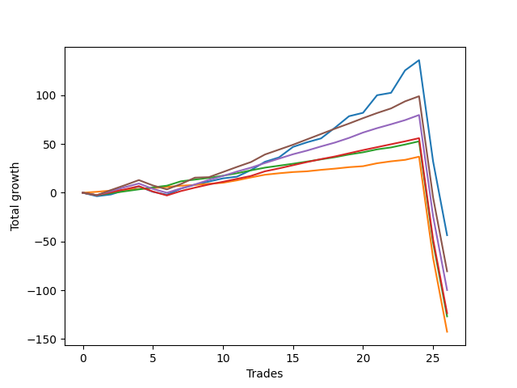

# Short Wallace 003 
- Symbol: ES_SmolBoi
- Date Range: 03/18/2022 - 07/29/2022
- Trading Period: 7:20-12:30
- Number of Trades: 26



| Name | Win Percent | Profit | Avg Profit / Trade | Avg Time / Trade |      | Name | Win Percent | Profit | Avg Profit / Trade | Avg Time / Trade |
| ---- | ----------- | ------ | ------------------ | ---------------- | ---- | ---- | ----------- | ------ | ------------------ | ---------------- |
| Sorted By <br> Profit | | | | | | Sorted By <br> Win Percentage ||||
| Two | 80.77 | -21750.00 | -836.54 | 119:52 |     | Eighty-One | 92.31 | -71250.00 | -2740.38 | 106:00 |
| Eighty-Five | 80.77 | -40250.00 | -1548.08 | 115:28 |     | Eighty-Two | 88.46 | -63375.00 | -2437.50 | 107:59 |
| Eighty-Four | 80.77 | -49875.00 | -1918.27 | 113:27 |     | Two | 80.77 | -21750.00 | -836.54 | 119:52 |
| Eighty-Three | 80.77 | -61750.00 | -2375.00 | 111:51 |     | Eighty-Five | 80.77 | -40250.00 | -1548.08 | 115:28 |
| Eighty-Two | 88.46 | -63375.00 | -2437.50 | 107:59 |     | Eighty-Four | 80.77 | -49875.00 | -1918.27 | 113:27 |
| Eighty-One | 92.31 | -71250.00 | -2740.38 | 106:00 |     | Eighty-Three | 80.77 | -61750.00 | -2375.00 | 111:51 |

## NO STOPLOSS

### Test Two
* Sell when the price hits the upper line of the 20p 2std bollinger
* No Stoploss
* Results:
```
Total Trades: 26
Percent Up: 19.23
Percent Down: 80.77
Total Points Moved Down: -43.50
Potential Profit: -21750.00
Total Points Ups: 191.50 Count Ups: 5
Total Points Downs: 148.00 Count Downs: 21
```

<details><summary>Trades</summary>

<code>In: 2022-03-25 07:26:00		Out: 2022-03-25 07:54:10		Total Position Time: 28:10		Total Move Down: -3.50		Total to Date: -3.50</code> <br />
<code>In: 2022-03-25 11:34:00		Out: 2022-03-25 12:00:55		Total Position Time: 26:55		Total Move Down: 1.75		Total to Date: -1.75</code> <br />
<code>In: 2022-03-29 08:52:00		Out: 2022-03-29 09:01:40		Total Position Time: 09:40		Total Move Down: 4.50		Total to Date: 2.75</code> <br />
<code>In: 2022-03-29 08:53:00		Out: 2022-03-29 09:01:40		Total Position Time: 08:40		Total Move Down: 3.75		Total to Date: 6.50</code> <br />
<code>In: 2022-03-31 07:38:00		Out: 2022-03-31 08:07:55		Total Position Time: 29:55		Total Move Down: -5.50		Total to Date: 1.00</code> <br />
<code>In: 2022-03-31 07:39:00		Out: 2022-03-31 08:08:30		Total Position Time: 29:30		Total Move Down: -3.00		Total to Date: -2.00</code> <br />
<code>In: 2022-04-18 10:59:00		Out: 2022-04-18 11:10:40		Total Position Time: 11:40		Total Move Down: 6.25		Total to Date: 4.25</code> <br />
<code>In: 2022-04-20 07:58:00		Out: 2022-04-20 08:00:45		Total Position Time: 02:45		Total Move Down: 4.00		Total to Date: 8.25</code> <br />
<code>In: 2022-04-20 09:55:00		Out: 2022-04-20 10:08:15		Total Position Time: 13:15		Total Move Down: 3.25		Total to Date: 11.50</code> <br />
<code>In: 2022-04-20 10:50:00		Out: 2022-04-20 11:13:55		Total Position Time: 23:55		Total Move Down: 3.25		Total to Date: 14.75</code> <br />
<code>In: 2022-04-25 09:28:00		Out: 2022-04-25 09:57:55		Total Position Time: 29:55		Total Move Down: 1.75		Total to Date: 16.50</code> <br />
<code>In: 2022-04-27 09:46:00		Out: 2022-04-27 10:00:10		Total Position Time: 14:10		Total Move Down: 6.75		Total to Date: 23.25</code> <br />
<code>In: 2022-05-10 11:47:00		Out: 2022-05-10 11:56:50		Total Position Time: 09:50		Total Move Down: 8.50		Total to Date: 31.75</code> <br />
<code>In: 2022-05-17 09:49:00		Out: 2022-05-17 10:01:10		Total Position Time: 12:10		Total Move Down: 4.50		Total to Date: 36.25</code> <br />
<code>In: 2022-05-24 09:18:00		Out: 2022-05-24 09:31:20		Total Position Time: 13:20		Total Move Down: 10.75		Total to Date: 47.00</code> <br />
<code>In: 2022-05-24 11:15:00		Out: 2022-05-24 11:43:50		Total Position Time: 28:50		Total Move Down: 4.75		Total to Date: 51.75</code> <br />
<code>In: 2022-05-31 07:49:00		Out: 2022-05-31 08:07:30		Total Position Time: 18:30		Total Move Down: 4.00		Total to Date: 55.75</code> <br />
<code>In: 2022-06-10 10:53:00		Out: 2022-06-10 11:01:00		Total Position Time: 08:00		Total Move Down: 11.00		Total to Date: 66.75</code> <br />
<code>In: 2022-06-10 12:30:00		Out: 2022-06-10 12:42:45		Total Position Time: 12:45		Total Move Down: 11.75		Total to Date: 78.50</code> <br />
<code>In: 2022-06-13 09:15:00		Out: 2022-06-13 09:30:15		Total Position Time: 15:15		Total Move Down: 3.50		Total to Date: 82.00</code> <br />
<code>In: 2022-06-13 09:41:00		Out: 2022-06-13 09:54:20		Total Position Time: 13:20		Total Move Down: 18.00		Total to Date: 100.00</code> <br />
<code>In: 2022-06-29 12:21:00		Out: 2022-06-29 12:35:20		Total Position Time: 14:20		Total Move Down: 2.50		Total to Date: 102.50</code> <br />
<code>In: 2022-07-05 07:41:00		Out: 2022-07-05 08:01:10		Total Position Time: 20:10		Total Move Down: 23.00		Total to Date: 125.50</code> <br />
<code>In: 2022-07-06 11:10:00		Out: 2022-07-06 11:11:45		Total Position Time: 01:45		Total Move Down: 10.50		Total to Date: 136.00</code> <br />
<code>In: 2022-07-14 07:57:00		Out: 2022-07-15 06:37:00		Total Position Time: 1360:00		Total Move Down: -103.75		Total to Date: 32.25</code> <br />
<code>In: 2022-07-14 08:13:00		Out: 2022-07-15 06:53:00		Total Position Time: 1360:00		Total Move Down: -75.75		Total to Date: -43.50</code> <br />


</details>

## TAKE PROFIT

### Test Eighty-One
* Take Profit of 1 Point
* No Stoploss
* Results:
```
Total Trades: 26
Percent Up: 7.69
Percent Down: 92.31
Total Points Moved Down: -142.50
Potential Profit: -71250.00
Total Points Ups: 179.50 Count Ups: 2
Total Points Downs: 37.00 Count Downs: 24
```

<details><summary>Trades</summary>

<code>In: 2022-03-25 07:26:00		Out: 2022-03-25 07:26:10		Total Position Time: 00:10		Total Move Down: 1.00		Total to Date: 1.00</code> <br />
<code>In: 2022-03-25 11:34:00		Out: 2022-03-25 11:35:15		Total Position Time: 01:15		Total Move Down: 1.25		Total to Date: 2.25</code> <br />
<code>In: 2022-03-29 08:52:00		Out: 2022-03-29 08:52:55		Total Position Time: 00:55		Total Move Down: 0.75		Total to Date: 3.00</code> <br />
<code>In: 2022-03-29 08:53:00		Out: 2022-03-29 08:57:35		Total Position Time: 04:35		Total Move Down: 1.00		Total to Date: 4.00</code> <br />
<code>In: 2022-03-31 07:38:00		Out: 2022-03-31 07:39:15		Total Position Time: 01:15		Total Move Down: 0.75		Total to Date: 4.75</code> <br />
<code>In: 2022-03-31 07:39:00		Out: 2022-03-31 07:41:25		Total Position Time: 02:25		Total Move Down: 1.25		Total to Date: 6.00</code> <br />
<code>In: 2022-04-18 10:59:00		Out: 2022-04-18 10:59:15		Total Position Time: 00:15		Total Move Down: 1.25		Total to Date: 7.25</code> <br />
<code>In: 2022-04-20 07:58:00		Out: 2022-04-20 08:00:25		Total Position Time: 02:25		Total Move Down: 0.75		Total to Date: 8.00</code> <br />
<code>In: 2022-04-20 09:55:00		Out: 2022-04-20 09:57:25		Total Position Time: 02:25		Total Move Down: 1.25		Total to Date: 9.25</code> <br />
<code>In: 2022-04-20 10:50:00		Out: 2022-04-20 10:50:20		Total Position Time: 00:20		Total Move Down: 1.00		Total to Date: 10.25</code> <br />
<code>In: 2022-04-25 09:28:00		Out: 2022-04-25 09:28:30		Total Position Time: 00:30		Total Move Down: 2.50		Total to Date: 12.75</code> <br />
<code>In: 2022-04-27 09:46:00		Out: 2022-04-27 09:46:10		Total Position Time: 00:10		Total Move Down: 3.00		Total to Date: 15.75</code> <br />
<code>In: 2022-05-10 11:47:00		Out: 2022-05-10 11:47:10		Total Position Time: 00:10		Total Move Down: 2.75		Total to Date: 18.50</code> <br />
<code>In: 2022-05-17 09:49:00		Out: 2022-05-17 09:51:10		Total Position Time: 02:10		Total Move Down: 1.50		Total to Date: 20.00</code> <br />
<code>In: 2022-05-24 09:18:00		Out: 2022-05-24 09:18:50		Total Position Time: 00:50		Total Move Down: 1.25		Total to Date: 21.25</code> <br />
<code>In: 2022-05-24 11:15:00		Out: 2022-05-24 11:15:10		Total Position Time: 00:10		Total Move Down: 0.75		Total to Date: 22.00</code> <br />
<code>In: 2022-05-31 07:49:00		Out: 2022-05-31 07:49:20		Total Position Time: 00:20		Total Move Down: 1.50		Total to Date: 23.50</code> <br />
<code>In: 2022-06-10 10:53:00		Out: 2022-06-10 10:53:10		Total Position Time: 00:10		Total Move Down: 1.25		Total to Date: 24.75</code> <br />
<code>In: 2022-06-10 12:30:00		Out: 2022-06-10 12:30:10		Total Position Time: 00:10		Total Move Down: 1.50		Total to Date: 26.25</code> <br />
<code>In: 2022-06-13 09:15:00		Out: 2022-06-13 09:15:10		Total Position Time: 00:10		Total Move Down: 1.00		Total to Date: 27.25</code> <br />
<code>In: 2022-06-13 09:41:00		Out: 2022-06-13 09:41:10		Total Position Time: 00:10		Total Move Down: 3.00		Total to Date: 30.25</code> <br />
<code>In: 2022-06-29 12:21:00		Out: 2022-06-29 12:34:15		Total Position Time: 13:15		Total Move Down: 2.00		Total to Date: 32.25</code> <br />
<code>In: 2022-07-05 07:41:00		Out: 2022-07-05 07:43:00		Total Position Time: 02:00		Total Move Down: 1.50		Total to Date: 33.75</code> <br />
<code>In: 2022-07-06 11:10:00		Out: 2022-07-06 11:10:10		Total Position Time: 00:10		Total Move Down: 3.25		Total to Date: 37.00</code> <br />
<code>In: 2022-07-14 07:57:00		Out: 2022-07-15 06:37:00		Total Position Time: 1360:00		Total Move Down: -103.75		Total to Date: -66.75</code> <br />
<code>In: 2022-07-14 08:13:00		Out: 2022-07-15 06:53:00		Total Position Time: 1360:00		Total Move Down: -75.75		Total to Date: -142.50</code> <br />


</details>

### Test Eighty-Two
* Take Profit of 2 Point
* No Stoploss
* Results:
```
Total Trades: 26
Percent Up: 11.54
Percent Down: 88.46
Total Points Moved Down: -126.75
Potential Profit: -63375.00
Total Points Ups: 182.00 Count Ups: 3
Total Points Downs: 55.25 Count Downs: 23
```

<details><summary>Trades</summary>

<code>In: 2022-03-25 07:26:00		Out: 2022-03-25 07:55:55		Total Position Time: 29:55		Total Move Down: -2.50		Total to Date: -2.50</code> <br />
<code>In: 2022-03-25 11:34:00		Out: 2022-03-25 11:40:25		Total Position Time: 06:25		Total Move Down: 2.00		Total to Date: -0.50</code> <br />
<code>In: 2022-03-29 08:52:00		Out: 2022-03-29 08:57:40		Total Position Time: 05:40		Total Move Down: 2.00		Total to Date: 1.50</code> <br />
<code>In: 2022-03-29 08:53:00		Out: 2022-03-29 08:58:35		Total Position Time: 05:35		Total Move Down: 2.00		Total to Date: 3.50</code> <br />
<code>In: 2022-03-31 07:38:00		Out: 2022-03-31 07:41:25		Total Position Time: 03:25		Total Move Down: 2.00		Total to Date: 5.50</code> <br />
<code>In: 2022-03-31 07:39:00		Out: 2022-03-31 07:41:50		Total Position Time: 02:50		Total Move Down: 1.75		Total to Date: 7.25</code> <br />
<code>In: 2022-04-18 10:59:00		Out: 2022-04-18 10:59:30		Total Position Time: 00:30		Total Move Down: 4.50		Total to Date: 11.75</code> <br />
<code>In: 2022-04-20 07:58:00		Out: 2022-04-20 08:00:30		Total Position Time: 02:30		Total Move Down: 1.75		Total to Date: 13.50</code> <br />
<code>In: 2022-04-20 09:55:00		Out: 2022-04-20 09:59:05		Total Position Time: 04:05		Total Move Down: 1.75		Total to Date: 15.25</code> <br />
<code>In: 2022-04-20 10:50:00		Out: 2022-04-20 10:51:30		Total Position Time: 01:30		Total Move Down: 2.25		Total to Date: 17.50</code> <br />
<code>In: 2022-04-25 09:28:00		Out: 2022-04-25 09:28:30		Total Position Time: 00:30		Total Move Down: 2.50		Total to Date: 20.00</code> <br />
<code>In: 2022-04-27 09:46:00		Out: 2022-04-27 09:46:10		Total Position Time: 00:10		Total Move Down: 3.00		Total to Date: 23.00</code> <br />
<code>In: 2022-05-10 11:47:00		Out: 2022-05-10 11:47:10		Total Position Time: 00:10		Total Move Down: 2.75		Total to Date: 25.75</code> <br />
<code>In: 2022-05-17 09:49:00		Out: 2022-05-17 09:51:20		Total Position Time: 02:20		Total Move Down: 2.00		Total to Date: 27.75</code> <br />
<code>In: 2022-05-24 09:18:00		Out: 2022-05-24 09:20:10		Total Position Time: 02:10		Total Move Down: 2.00		Total to Date: 29.75</code> <br />
<code>In: 2022-05-24 11:15:00		Out: 2022-05-24 11:15:30		Total Position Time: 00:30		Total Move Down: 2.25		Total to Date: 32.00</code> <br />
<code>In: 2022-05-31 07:49:00		Out: 2022-05-31 07:49:45		Total Position Time: 00:45		Total Move Down: 2.25		Total to Date: 34.25</code> <br />
<code>In: 2022-06-10 10:53:00		Out: 2022-06-10 10:53:15		Total Position Time: 00:15		Total Move Down: 2.25		Total to Date: 36.50</code> <br />
<code>In: 2022-06-10 12:30:00		Out: 2022-06-10 12:30:20		Total Position Time: 00:20		Total Move Down: 2.75		Total to Date: 39.25</code> <br />
<code>In: 2022-06-13 09:15:00		Out: 2022-06-13 09:16:45		Total Position Time: 01:45		Total Move Down: 2.25		Total to Date: 41.50</code> <br />
<code>In: 2022-06-13 09:41:00		Out: 2022-06-13 09:41:10		Total Position Time: 00:10		Total Move Down: 3.00		Total to Date: 44.50</code> <br />
<code>In: 2022-06-29 12:21:00		Out: 2022-06-29 12:34:15		Total Position Time: 13:15		Total Move Down: 2.00		Total to Date: 46.50</code> <br />
<code>In: 2022-07-05 07:41:00		Out: 2022-07-05 07:44:00		Total Position Time: 03:00		Total Move Down: 3.00		Total to Date: 49.50</code> <br />
<code>In: 2022-07-06 11:10:00		Out: 2022-07-06 11:10:10		Total Position Time: 00:10		Total Move Down: 3.25		Total to Date: 52.75</code> <br />
<code>In: 2022-07-14 07:57:00		Out: 2022-07-15 06:37:00		Total Position Time: 1360:00		Total Move Down: -103.75		Total to Date: -51.00</code> <br />
<code>In: 2022-07-14 08:13:00		Out: 2022-07-15 06:53:00		Total Position Time: 1360:00		Total Move Down: -75.75		Total to Date: -126.75</code> <br />


</details>

### Test Eighty-Three
* Take Profit of 3 Point
* No Stoploss
* Results:
```
Total Trades: 26
Percent Up: 19.23
Percent Down: 80.77
Total Points Moved Down: -123.50
Potential Profit: -61750.00
Total Points Ups: 191.50 Count Ups: 5
Total Points Downs: 68.00 Count Downs: 21
```

<details><summary>Trades</summary>

<code>In: 2022-03-25 07:26:00		Out: 2022-03-25 07:55:55		Total Position Time: 29:55		Total Move Down: -2.50		Total to Date: -2.50</code> <br />
<code>In: 2022-03-25 11:34:00		Out: 2022-03-25 12:01:45		Total Position Time: 27:45		Total Move Down: 3.00		Total to Date: 0.50</code> <br />
<code>In: 2022-03-29 08:52:00		Out: 2022-03-29 08:58:40		Total Position Time: 06:40		Total Move Down: 3.00		Total to Date: 3.50</code> <br />
<code>In: 2022-03-29 08:53:00		Out: 2022-03-29 09:01:35		Total Position Time: 08:35		Total Move Down: 3.25		Total to Date: 6.75</code> <br />
<code>In: 2022-03-31 07:38:00		Out: 2022-03-31 08:07:55		Total Position Time: 29:55		Total Move Down: -5.50		Total to Date: 1.25</code> <br />
<code>In: 2022-03-31 07:39:00		Out: 2022-03-31 08:08:55		Total Position Time: 29:55		Total Move Down: -4.00		Total to Date: -2.75</code> <br />
<code>In: 2022-04-18 10:59:00		Out: 2022-04-18 10:59:30		Total Position Time: 00:30		Total Move Down: 4.50		Total to Date: 1.75</code> <br />
<code>In: 2022-04-20 07:58:00		Out: 2022-04-20 08:00:40		Total Position Time: 02:40		Total Move Down: 3.50		Total to Date: 5.25</code> <br />
<code>In: 2022-04-20 09:55:00		Out: 2022-04-20 10:08:15		Total Position Time: 13:15		Total Move Down: 3.25		Total to Date: 8.50</code> <br />
<code>In: 2022-04-20 10:50:00		Out: 2022-04-20 10:55:05		Total Position Time: 05:05		Total Move Down: 2.75		Total to Date: 11.25</code> <br />
<code>In: 2022-04-25 09:28:00		Out: 2022-04-25 09:31:00		Total Position Time: 03:00		Total Move Down: 3.00		Total to Date: 14.25</code> <br />
<code>In: 2022-04-27 09:46:00		Out: 2022-04-27 09:46:10		Total Position Time: 00:10		Total Move Down: 3.00		Total to Date: 17.25</code> <br />
<code>In: 2022-05-10 11:47:00		Out: 2022-05-10 11:47:15		Total Position Time: 00:15		Total Move Down: 4.75		Total to Date: 22.00</code> <br />
<code>In: 2022-05-17 09:49:00		Out: 2022-05-17 09:54:25		Total Position Time: 05:25		Total Move Down: 3.00		Total to Date: 25.00</code> <br />
<code>In: 2022-05-24 09:18:00		Out: 2022-05-24 09:21:05		Total Position Time: 03:05		Total Move Down: 3.25		Total to Date: 28.25</code> <br />
<code>In: 2022-05-24 11:15:00		Out: 2022-05-24 11:15:40		Total Position Time: 00:40		Total Move Down: 3.25		Total to Date: 31.50</code> <br />
<code>In: 2022-05-31 07:49:00		Out: 2022-05-31 07:49:50		Total Position Time: 00:50		Total Move Down: 3.00		Total to Date: 34.50</code> <br />
<code>In: 2022-06-10 10:53:00		Out: 2022-06-10 10:53:55		Total Position Time: 00:55		Total Move Down: 2.75		Total to Date: 37.25</code> <br />
<code>In: 2022-06-10 12:30:00		Out: 2022-06-10 12:30:25		Total Position Time: 00:25		Total Move Down: 3.25		Total to Date: 40.50</code> <br />
<code>In: 2022-06-13 09:15:00		Out: 2022-06-13 09:16:50		Total Position Time: 01:50		Total Move Down: 3.25		Total to Date: 43.75</code> <br />
<code>In: 2022-06-13 09:41:00		Out: 2022-06-13 09:41:10		Total Position Time: 00:10		Total Move Down: 3.00		Total to Date: 46.75</code> <br />
<code>In: 2022-06-29 12:21:00		Out: 2022-06-29 12:35:15		Total Position Time: 14:15		Total Move Down: 3.00		Total to Date: 49.75</code> <br />
<code>In: 2022-07-05 07:41:00		Out: 2022-07-05 07:44:00		Total Position Time: 03:00		Total Move Down: 3.00		Total to Date: 52.75</code> <br />
<code>In: 2022-07-06 11:10:00		Out: 2022-07-06 11:10:10		Total Position Time: 00:10		Total Move Down: 3.25		Total to Date: 56.00</code> <br />
<code>In: 2022-07-14 07:57:00		Out: 2022-07-15 06:37:00		Total Position Time: 1360:00		Total Move Down: -103.75		Total to Date: -47.75</code> <br />
<code>In: 2022-07-14 08:13:00		Out: 2022-07-15 06:53:00		Total Position Time: 1360:00		Total Move Down: -75.75		Total to Date: -123.50</code> <br />


</details>

### Test Eighty-Four
* Take Profit of 4 Point
* No Stoploss
* Results:
```
Total Trades: 26
Percent Up: 19.23
Percent Down: 80.77
Total Points Moved Down: -99.75
Potential Profit: -49875.00
Total Points Ups: 191.50 Count Ups: 5
Total Points Downs: 91.75 Count Downs: 21
```

<details><summary>Trades</summary>

<code>In: 2022-03-25 07:26:00		Out: 2022-03-25 07:55:55		Total Position Time: 29:55		Total Move Down: -2.50		Total to Date: -2.50</code> <br />
<code>In: 2022-03-25 11:34:00		Out: 2022-03-25 12:01:55		Total Position Time: 27:55		Total Move Down: 4.25		Total to Date: 1.75</code> <br />
<code>In: 2022-03-29 08:52:00		Out: 2022-03-29 09:01:35		Total Position Time: 09:35		Total Move Down: 4.00		Total to Date: 5.75</code> <br />
<code>In: 2022-03-29 08:53:00		Out: 2022-03-29 09:01:40		Total Position Time: 08:40		Total Move Down: 3.75		Total to Date: 9.50</code> <br />
<code>In: 2022-03-31 07:38:00		Out: 2022-03-31 08:07:55		Total Position Time: 29:55		Total Move Down: -5.50		Total to Date: 4.00</code> <br />
<code>In: 2022-03-31 07:39:00		Out: 2022-03-31 08:08:55		Total Position Time: 29:55		Total Move Down: -4.00		Total to Date: 0.00</code> <br />
<code>In: 2022-04-18 10:59:00		Out: 2022-04-18 10:59:30		Total Position Time: 00:30		Total Move Down: 4.50		Total to Date: 4.50</code> <br />
<code>In: 2022-04-20 07:58:00		Out: 2022-04-20 08:00:45		Total Position Time: 02:45		Total Move Down: 4.00		Total to Date: 8.50</code> <br />
<code>In: 2022-04-20 09:55:00		Out: 2022-04-20 10:08:35		Total Position Time: 13:35		Total Move Down: 4.75		Total to Date: 13.25</code> <br />
<code>In: 2022-04-20 10:50:00		Out: 2022-04-20 11:14:30		Total Position Time: 24:30		Total Move Down: 4.00		Total to Date: 17.25</code> <br />
<code>In: 2022-04-25 09:28:00		Out: 2022-04-25 09:31:10		Total Position Time: 03:10		Total Move Down: 4.50		Total to Date: 21.75</code> <br />
<code>In: 2022-04-27 09:46:00		Out: 2022-04-27 09:51:20		Total Position Time: 05:20		Total Move Down: 4.00		Total to Date: 25.75</code> <br />
<code>In: 2022-05-10 11:47:00		Out: 2022-05-10 11:47:15		Total Position Time: 00:15		Total Move Down: 4.75		Total to Date: 30.50</code> <br />
<code>In: 2022-05-17 09:49:00		Out: 2022-05-17 10:01:10		Total Position Time: 12:10		Total Move Down: 4.50		Total to Date: 35.00</code> <br />
<code>In: 2022-05-24 09:18:00		Out: 2022-05-24 09:21:15		Total Position Time: 03:15		Total Move Down: 4.50		Total to Date: 39.50</code> <br />
<code>In: 2022-05-24 11:15:00		Out: 2022-05-24 11:17:45		Total Position Time: 02:45		Total Move Down: 3.75		Total to Date: 43.25</code> <br />
<code>In: 2022-05-31 07:49:00		Out: 2022-05-31 07:50:05		Total Position Time: 01:05		Total Move Down: 4.25		Total to Date: 47.50</code> <br />
<code>In: 2022-06-10 10:53:00		Out: 2022-06-10 10:54:30		Total Position Time: 01:30		Total Move Down: 4.00		Total to Date: 51.50</code> <br />
<code>In: 2022-06-10 12:30:00		Out: 2022-06-10 12:30:30		Total Position Time: 00:30		Total Move Down: 4.75		Total to Date: 56.25</code> <br />
<code>In: 2022-06-13 09:15:00		Out: 2022-06-13 09:17:05		Total Position Time: 02:05		Total Move Down: 5.50		Total to Date: 61.75</code> <br />
<code>In: 2022-06-13 09:41:00		Out: 2022-06-13 09:41:15		Total Position Time: 00:15		Total Move Down: 4.50		Total to Date: 66.25</code> <br />
<code>In: 2022-06-29 12:21:00		Out: 2022-06-29 12:37:05		Total Position Time: 16:05		Total Move Down: 4.00		Total to Date: 70.25</code> <br />
<code>In: 2022-07-05 07:41:00		Out: 2022-07-05 07:44:20		Total Position Time: 03:20		Total Move Down: 4.25		Total to Date: 74.50</code> <br />
<code>In: 2022-07-06 11:10:00		Out: 2022-07-06 11:11:05		Total Position Time: 01:05		Total Move Down: 5.25		Total to Date: 79.75</code> <br />
<code>In: 2022-07-14 07:57:00		Out: 2022-07-15 06:37:00		Total Position Time: 1360:00		Total Move Down: -103.75		Total to Date: -24.00</code> <br />
<code>In: 2022-07-14 08:13:00		Out: 2022-07-15 06:53:00		Total Position Time: 1360:00		Total Move Down: -75.75		Total to Date: -99.75</code> <br />


</details>

### Test Eighty-Five
* Take Profit of 5 Point
* No Stoploss
* Results:
```
Total Trades: 26
Percent Up: 19.23
Percent Down: 80.77
Total Points Moved Down: -80.50
Potential Profit: -40250.00
Total Points Ups: 191.50 Count Ups: 5
Total Points Downs: 111.00 Count Downs: 21
```

<details><summary>Trades</summary>

<code>In: 2022-03-25 07:26:00		Out: 2022-03-25 07:55:55		Total Position Time: 29:55		Total Move Down: -2.50		Total to Date: -2.50</code> <br />
<code>In: 2022-03-25 11:34:00		Out: 2022-03-25 12:02:00		Total Position Time: 28:00		Total Move Down: 5.25		Total to Date: 2.75</code> <br />
<code>In: 2022-03-29 08:52:00		Out: 2022-03-29 09:01:45		Total Position Time: 09:45		Total Move Down: 5.00		Total to Date: 7.75</code> <br />
<code>In: 2022-03-29 08:53:00		Out: 2022-03-29 09:02:10		Total Position Time: 09:10		Total Move Down: 5.25		Total to Date: 13.00</code> <br />
<code>In: 2022-03-31 07:38:00		Out: 2022-03-31 08:07:55		Total Position Time: 29:55		Total Move Down: -5.50		Total to Date: 7.50</code> <br />
<code>In: 2022-03-31 07:39:00		Out: 2022-03-31 08:08:55		Total Position Time: 29:55		Total Move Down: -4.00		Total to Date: 3.50</code> <br />
<code>In: 2022-04-18 10:59:00		Out: 2022-04-18 11:06:40		Total Position Time: 07:40		Total Move Down: 5.50		Total to Date: 9.00</code> <br />
<code>In: 2022-04-20 07:58:00		Out: 2022-04-20 08:01:10		Total Position Time: 03:10		Total Move Down: 6.50		Total to Date: 15.50</code> <br />
<code>In: 2022-04-20 09:55:00		Out: 2022-04-20 10:24:55		Total Position Time: 29:55		Total Move Down: 0.50		Total to Date: 16.00</code> <br />
<code>In: 2022-04-20 10:50:00		Out: 2022-04-20 11:17:15		Total Position Time: 27:15		Total Move Down: 5.25		Total to Date: 21.25</code> <br />
<code>In: 2022-04-25 09:28:00		Out: 2022-04-25 09:31:15		Total Position Time: 03:15		Total Move Down: 5.25		Total to Date: 26.50</code> <br />
<code>In: 2022-04-27 09:46:00		Out: 2022-04-27 09:51:25		Total Position Time: 05:25		Total Move Down: 5.00		Total to Date: 31.50</code> <br />
<code>In: 2022-05-10 11:47:00		Out: 2022-05-10 11:47:20		Total Position Time: 00:20		Total Move Down: 7.75		Total to Date: 39.25</code> <br />
<code>In: 2022-05-17 09:49:00		Out: 2022-05-17 10:01:25		Total Position Time: 12:25		Total Move Down: 5.00		Total to Date: 44.25</code> <br />
<code>In: 2022-05-24 09:18:00		Out: 2022-05-24 09:21:30		Total Position Time: 03:30		Total Move Down: 5.00		Total to Date: 49.25</code> <br />
<code>In: 2022-05-24 11:15:00		Out: 2022-05-24 11:18:20		Total Position Time: 03:20		Total Move Down: 5.50		Total to Date: 54.75</code> <br />
<code>In: 2022-05-31 07:49:00		Out: 2022-05-31 08:08:15		Total Position Time: 19:15		Total Move Down: 5.50		Total to Date: 60.25</code> <br />
<code>In: 2022-06-10 10:53:00		Out: 2022-06-10 10:55:05		Total Position Time: 02:05		Total Move Down: 5.50		Total to Date: 65.75</code> <br />
<code>In: 2022-06-10 12:30:00		Out: 2022-06-10 12:30:35		Total Position Time: 00:35		Total Move Down: 5.25		Total to Date: 71.00</code> <br />
<code>In: 2022-06-13 09:15:00		Out: 2022-06-13 09:17:05		Total Position Time: 02:05		Total Move Down: 5.50		Total to Date: 76.50</code> <br />
<code>In: 2022-06-13 09:41:00		Out: 2022-06-13 09:41:45		Total Position Time: 00:45		Total Move Down: 5.25		Total to Date: 81.75</code> <br />
<code>In: 2022-06-29 12:21:00		Out: 2022-06-29 12:41:05		Total Position Time: 20:05		Total Move Down: 4.75		Total to Date: 86.50</code> <br />
<code>In: 2022-07-05 07:41:00		Out: 2022-07-05 07:44:30		Total Position Time: 03:30		Total Move Down: 7.25		Total to Date: 93.75</code> <br />
<code>In: 2022-07-06 11:10:00		Out: 2022-07-06 11:11:05		Total Position Time: 01:05		Total Move Down: 5.25		Total to Date: 99.00</code> <br />
<code>In: 2022-07-14 07:57:00		Out: 2022-07-15 06:37:00		Total Position Time: 1360:00		Total Move Down: -103.75		Total to Date: -4.75</code> <br />
<code>In: 2022-07-14 08:13:00		Out: 2022-07-15 06:53:00		Total Position Time: 1360:00		Total Move Down: -75.75		Total to Date: -80.50</code> <br />


</details>