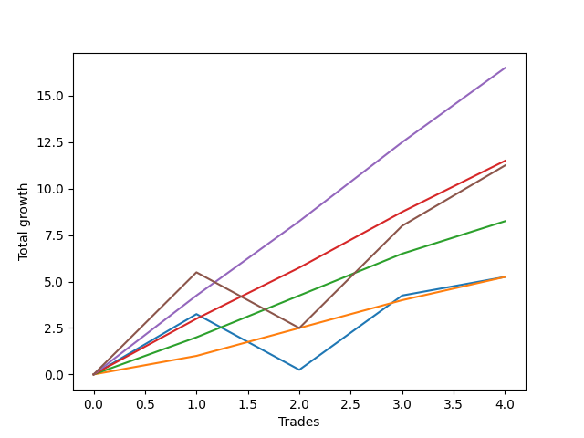

# Short Wallace 007 
- Symbol: ES_SmolBoi
- Date Range: 03/18/2022 - 07/29/2022
- Trading Period: 7:20-12:30
- Number of Trades: 4



| Name | Win Percent | Profit | Avg Profit / Trade | Avg Time / Trade |      | Name | Win Percent | Profit | Avg Profit / Trade | Avg Time / Trade |
| ---- | ----------- | ------ | ------------------ | ---------------- | ---- | ---- | ----------- | ------ | ------------------ | ---------------- |
| Sorted By <br> Profit | | | | | | Sorted By <br> Win Percentage ||||
| Eighty-Four | 100.00 | 8250.00 | 2062.50 | 10:35 |     | Eighty-Four | 100.00 | 8250.00 | 2062.50 | 10:35 |
| Eighty-Three | 100.00 | 5750.00 | 1437.50 | 08:28 |     | Eighty-Three | 100.00 | 5750.00 | 1437.50 | 08:28 |
| Eighty-Five | 75.00 | 5625.00 | 1406.25 | 23:22 |     | Eighty-Two | 100.00 | 4125.00 | 1031.25 | 00:57 |
| Eighty-Two | 100.00 | 4125.00 | 1031.25 | 00:57 |     | Eighty-One | 100.00 | 2625.00 | 656.25 | 00:26 |
| Eighty-One | 100.00 | 2625.00 | 656.25 | 00:26 |     | Eighty-Five | 75.00 | 5625.00 | 1406.25 | 23:22 |
| Two | 75.00 | 2625.00 | 656.25 | 20:25 |     | Two | 75.00 | 2625.00 | 656.25 | 20:25 |

## NO STOPLOSS

### Test Two
* Sell when the price hits the upper line of the 20p 2std bollinger
* No Stoploss
* Results:
```
Total Trades: 4
Percent Up: 25.00
Percent Down: 75.00
Total Points Moved Down: 5.25
Potential Profit: 2625.00
Total Points Ups: 3.00 Count Ups: 1
Total Points Downs: 8.25 Count Downs: 3
```

<details><summary>Trades</summary>

<code>In: 2022-04-13 08:36:00		Out: 2022-04-13 08:45:15		Total Position Time: 09:15		Total Move Down: 3.25		Total to Date: 3.25</code> <br />
<code>In: 2022-04-28 10:17:00		Out: 2022-04-28 10:46:55		Total Position Time: 29:55		Total Move Down: -3.00		Total to Date: 0.25</code> <br />
<code>In: 2022-05-31 07:49:00		Out: 2022-05-31 08:07:30		Total Position Time: 18:30		Total Move Down: 4.00		Total to Date: 4.25</code> <br />
<code>In: 2022-07-07 07:57:00		Out: 2022-07-07 08:21:00		Total Position Time: 24:00		Total Move Down: 1.00		Total to Date: 5.25</code> <br />


</details>

## TAKE PROFIT

### Test Eighty-One
* Take Profit of 1 Point
* No Stoploss
* Results:
```
Total Trades: 4
Percent Up: 0.00
Percent Down: 100.00
Total Points Moved Down: 5.25
Potential Profit: 2625.00
Total Points Ups: 0.00 Count Ups: 0
Total Points Downs: 5.25 Count Downs: 4
```

<details><summary>Trades</summary>

<code>In: 2022-04-13 08:36:00		Out: 2022-04-13 08:37:05		Total Position Time: 01:05		Total Move Down: 1.00		Total to Date: 1.00</code> <br />
<code>In: 2022-04-28 10:17:00		Out: 2022-04-28 10:17:10		Total Position Time: 00:10		Total Move Down: 1.50		Total to Date: 2.50</code> <br />
<code>In: 2022-05-31 07:49:00		Out: 2022-05-31 07:49:20		Total Position Time: 00:20		Total Move Down: 1.50		Total to Date: 4.00</code> <br />
<code>In: 2022-07-07 07:57:00		Out: 2022-07-07 07:57:10		Total Position Time: 00:10		Total Move Down: 1.25		Total to Date: 5.25</code> <br />


</details>

### Test Eighty-Two
* Take Profit of 2 Point
* No Stoploss
* Results:
```
Total Trades: 4
Percent Up: 0.00
Percent Down: 100.00
Total Points Moved Down: 8.25
Potential Profit: 4125.00
Total Points Ups: 0.00 Count Ups: 0
Total Points Downs: 8.25 Count Downs: 4
```

<details><summary>Trades</summary>

<code>In: 2022-04-13 08:36:00		Out: 2022-04-13 08:37:20		Total Position Time: 01:20		Total Move Down: 2.00		Total to Date: 2.00</code> <br />
<code>In: 2022-04-28 10:17:00		Out: 2022-04-28 10:17:20		Total Position Time: 00:20		Total Move Down: 2.25		Total to Date: 4.25</code> <br />
<code>In: 2022-05-31 07:49:00		Out: 2022-05-31 07:49:45		Total Position Time: 00:45		Total Move Down: 2.25		Total to Date: 6.50</code> <br />
<code>In: 2022-07-07 07:57:00		Out: 2022-07-07 07:58:25		Total Position Time: 01:25		Total Move Down: 1.75		Total to Date: 8.25</code> <br />


</details>

### Test Eighty-Three
* Take Profit of 3 Point
* No Stoploss
* Results:
```
Total Trades: 4
Percent Up: 0.00
Percent Down: 100.00
Total Points Moved Down: 11.50
Potential Profit: 5750.00
Total Points Ups: 0.00 Count Ups: 0
Total Points Downs: 11.50 Count Downs: 4
```

<details><summary>Trades</summary>

<code>In: 2022-04-13 08:36:00		Out: 2022-04-13 08:38:10		Total Position Time: 02:10		Total Move Down: 3.00		Total to Date: 3.00</code> <br />
<code>In: 2022-04-28 10:17:00		Out: 2022-04-28 10:22:05		Total Position Time: 05:05		Total Move Down: 2.75		Total to Date: 5.75</code> <br />
<code>In: 2022-05-31 07:49:00		Out: 2022-05-31 07:49:50		Total Position Time: 00:50		Total Move Down: 3.00		Total to Date: 8.75</code> <br />
<code>In: 2022-07-07 07:57:00		Out: 2022-07-07 08:22:50		Total Position Time: 25:50		Total Move Down: 2.75		Total to Date: 11.50</code> <br />


</details>

### Test Eighty-Four
* Take Profit of 4 Point
* No Stoploss
* Results:
```
Total Trades: 4
Percent Up: 0.00
Percent Down: 100.00
Total Points Moved Down: 16.50
Potential Profit: 8250.00
Total Points Ups: 0.00 Count Ups: 0
Total Points Downs: 16.50 Count Downs: 4
```

<details><summary>Trades</summary>

<code>In: 2022-04-13 08:36:00		Out: 2022-04-13 08:45:55		Total Position Time: 09:55		Total Move Down: 4.25		Total to Date: 4.25</code> <br />
<code>In: 2022-04-28 10:17:00		Out: 2022-04-28 10:22:15		Total Position Time: 05:15		Total Move Down: 4.00		Total to Date: 8.25</code> <br />
<code>In: 2022-05-31 07:49:00		Out: 2022-05-31 07:50:05		Total Position Time: 01:05		Total Move Down: 4.25		Total to Date: 12.50</code> <br />
<code>In: 2022-07-07 07:57:00		Out: 2022-07-07 08:23:05		Total Position Time: 26:05		Total Move Down: 4.00		Total to Date: 16.50</code> <br />


</details>

### Test Eighty-Five
* Take Profit of 5 Point
* No Stoploss
* Results:
```
Total Trades: 4
Percent Up: 25.00
Percent Down: 75.00
Total Points Moved Down: 11.25
Potential Profit: 5625.00
Total Points Ups: 3.00 Count Ups: 1
Total Points Downs: 14.25 Count Downs: 3
```

<details><summary>Trades</summary>

<code>In: 2022-04-13 08:36:00		Out: 2022-04-13 08:50:25		Total Position Time: 14:25		Total Move Down: 5.50		Total to Date: 5.50</code> <br />
<code>In: 2022-04-28 10:17:00		Out: 2022-04-28 10:46:55		Total Position Time: 29:55		Total Move Down: -3.00		Total to Date: 2.50</code> <br />
<code>In: 2022-05-31 07:49:00		Out: 2022-05-31 08:08:15		Total Position Time: 19:15		Total Move Down: 5.50		Total to Date: 8.00</code> <br />
<code>In: 2022-07-07 07:57:00		Out: 2022-07-07 08:26:55		Total Position Time: 29:55		Total Move Down: 3.25		Total to Date: 11.25</code> <br />


</details>