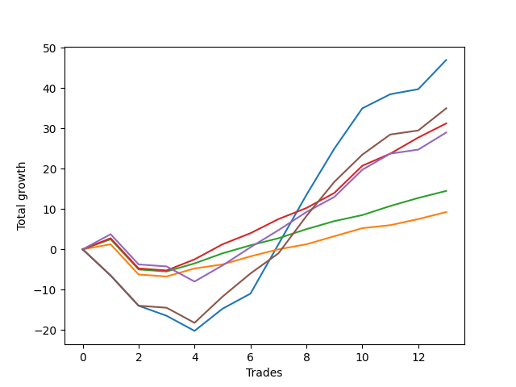

# Short Wallace 010 
- Symbol: ES_SmolBoi
- Date Range: 03/18/2022 - 07/29/2022
- Trading Period: 7:20-12:30
- Number of Trades: 13



| Name | Win Percent | Profit | Avg Profit / Trade | Avg Time / Trade |      | Name | Win Percent | Profit | Avg Profit / Trade | Avg Time / Trade |
| ---- | ----------- | ------ | ------------------ | ---------------- | ---- | ---- | ----------- | ------ | ------------------ | ---------------- |
| Sorted By <br> Profit | | | | | | Sorted By <br> Win Percentage ||||
| Two | 69.23 | 23500.00 | 1807.69 | 124:45 |     | Eighty-Three | 84.62 | 15625.00 | 1201.92 | 11:37 |
| Eighty-Five | 69.23 | 17500.00 | 1346.15 | 123:25 |     | Eighty-Two | 84.62 | 7250.00 | 557.69 | 08:48 |
| Eighty-Three | 84.62 | 15625.00 | 1201.92 | 11:37 |     | Eighty-One | 84.62 | 4625.00 | 355.77 | 08:08 |
| Eighty-Four | 76.92 | 14500.00 | 1115.38 | 120:39 |     | Eighty-Four | 76.92 | 14500.00 | 1115.38 | 120:39 |
| Eighty-Two | 84.62 | 7250.00 | 557.69 | 08:48 |     | Two | 69.23 | 23500.00 | 1807.69 | 124:45 |
| Eighty-One | 84.62 | 4625.00 | 355.77 | 08:08 |     | Eighty-Five | 69.23 | 17500.00 | 1346.15 | 123:25 |

## NO STOPLOSS

### Test Two
* Sell when the price hits the upper line of the 20p 2std bollinger
* No Stoploss
* Results:
```
Total Trades: 13
Percent Up: 30.77
Percent Down: 69.23
Total Points Moved Down: 47.00
Potential Profit: 23500.00
Total Points Ups: 20.25 Count Ups: 4
Total Points Downs: 67.25 Count Downs: 9
```

<details><summary>Trades</summary>

<code>In: 2022-03-25 10:22:00		Out: 2022-03-25 10:51:55		Total Position Time: 29:55		Total Move Down: -6.50		Total to Date: -6.50</code> <br />
<code>In: 2022-03-25 10:52:00		Out: 2022-03-25 11:21:55		Total Position Time: 29:55		Total Move Down: -7.50		Total to Date: -14.00</code> <br />
<code>In: 2022-03-28 10:27:00		Out: 2022-03-28 10:55:00		Total Position Time: 28:00		Total Move Down: -2.50		Total to Date: -16.50</code> <br />
<code>In: 2022-03-28 11:12:00		Out: 2022-03-28 11:41:55		Total Position Time: 29:55		Total Move Down: -3.75		Total to Date: -20.25</code> <br />
<code>In: 2022-04-25 09:27:00		Out: 2022-04-25 09:56:55		Total Position Time: 29:55		Total Move Down: 5.50		Total to Date: -14.75</code> <br />
<code>In: 2022-04-26 11:23:00		Out: 2022-04-26 11:41:25		Total Position Time: 18:25		Total Move Down: 3.75		Total to Date: -11.00</code> <br />
<code>In: 2022-05-02 09:23:00		Out: 2022-05-02 09:39:35		Total Position Time: 16:35		Total Move Down: 12.25		Total to Date: 1.25</code> <br />
<code>In: 2022-05-25 11:04:00		Out: 2022-05-25 11:06:40		Total Position Time: 02:40		Total Move Down: 12.25		Total to Date: 13.50</code> <br />
<code>In: 2022-05-25 11:06:00		Out: 2022-05-25 11:06:40		Total Position Time: 00:40		Total Move Down: 11.50		Total to Date: 25.00</code> <br />
<code>In: 2022-06-15 11:02:00		Out: 2022-06-15 11:03:05		Total Position Time: 01:05		Total Move Down: 10.00		Total to Date: 35.00</code> <br />
<code>In: 2022-06-29 11:06:00		Out: 2022-06-29 11:20:45		Total Position Time: 14:45		Total Move Down: 3.50		Total to Date: 38.50</code> <br />
<code>In: 2022-07-22 12:16:00		Out: 2022-07-25 11:22:00		Total Position Time: 1386:00		Total Move Down: 1.25		Total to Date: 39.75</code> <br />
<code>In: 2022-07-26 10:13:00		Out: 2022-07-26 10:47:00		Total Position Time: 34:00		Total Move Down: 7.25		Total to Date: 47.00</code> <br />


</details>

## TAKE PROFIT

### Test Eighty-One
* Take Profit of 1 Point
* No Stoploss
* Results:
```
Total Trades: 13
Percent Up: 15.38
Percent Down: 84.62
Total Points Moved Down: 9.25
Potential Profit: 4625.00
Total Points Ups: 8.00 Count Ups: 2
Total Points Downs: 17.25 Count Downs: 11
```

<details><summary>Trades</summary>

<code>In: 2022-03-25 10:22:00		Out: 2022-03-25 10:22:10		Total Position Time: 00:10		Total Move Down: 1.25		Total to Date: 1.25</code> <br />
<code>In: 2022-03-25 10:52:00		Out: 2022-03-25 11:21:55		Total Position Time: 29:55		Total Move Down: -7.50		Total to Date: -6.25</code> <br />
<code>In: 2022-03-28 10:27:00		Out: 2022-03-28 10:56:55		Total Position Time: 29:55		Total Move Down: -0.50		Total to Date: -6.75</code> <br />
<code>In: 2022-03-28 11:12:00		Out: 2022-03-28 11:12:10		Total Position Time: 00:10		Total Move Down: 2.00		Total to Date: -4.75</code> <br />
<code>In: 2022-04-25 09:27:00		Out: 2022-04-25 09:27:30		Total Position Time: 00:30		Total Move Down: 1.00		Total to Date: -3.75</code> <br />
<code>In: 2022-04-26 11:23:00		Out: 2022-04-26 11:27:25		Total Position Time: 04:25		Total Move Down: 2.00		Total to Date: -1.75</code> <br />
<code>In: 2022-05-02 09:23:00		Out: 2022-05-02 09:24:15		Total Position Time: 01:15		Total Move Down: 1.75		Total to Date: 0.00</code> <br />
<code>In: 2022-05-25 11:04:00		Out: 2022-05-25 11:04:10		Total Position Time: 00:10		Total Move Down: 1.25		Total to Date: 1.25</code> <br />
<code>In: 2022-05-25 11:06:00		Out: 2022-05-25 11:06:20		Total Position Time: 00:20		Total Move Down: 2.00		Total to Date: 3.25</code> <br />
<code>In: 2022-06-15 11:02:00		Out: 2022-06-15 11:02:10		Total Position Time: 00:10		Total Move Down: 2.00		Total to Date: 5.25</code> <br />
<code>In: 2022-06-29 11:06:00		Out: 2022-06-29 11:07:45		Total Position Time: 01:45		Total Move Down: 0.75		Total to Date: 6.00</code> <br />
<code>In: 2022-07-22 12:16:00		Out: 2022-07-22 12:40:00		Total Position Time: 24:00		Total Move Down: 1.50		Total to Date: 7.50</code> <br />
<code>In: 2022-07-26 10:13:00		Out: 2022-07-26 10:26:00		Total Position Time: 13:00		Total Move Down: 1.75		Total to Date: 9.25</code> <br />


</details>

### Test Eighty-Two
* Take Profit of 2 Point
* No Stoploss
* Results:
```
Total Trades: 13
Percent Up: 15.38
Percent Down: 84.62
Total Points Moved Down: 14.50
Potential Profit: 7250.00
Total Points Ups: 8.00 Count Ups: 2
Total Points Downs: 22.50 Count Downs: 11
```

<details><summary>Trades</summary>

<code>In: 2022-03-25 10:22:00		Out: 2022-03-25 10:23:15		Total Position Time: 01:15		Total Move Down: 2.50		Total to Date: 2.50</code> <br />
<code>In: 2022-03-25 10:52:00		Out: 2022-03-25 11:21:55		Total Position Time: 29:55		Total Move Down: -7.50		Total to Date: -5.00</code> <br />
<code>In: 2022-03-28 10:27:00		Out: 2022-03-28 10:56:55		Total Position Time: 29:55		Total Move Down: -0.50		Total to Date: -5.50</code> <br />
<code>In: 2022-03-28 11:12:00		Out: 2022-03-28 11:12:10		Total Position Time: 00:10		Total Move Down: 2.00		Total to Date: -3.50</code> <br />
<code>In: 2022-04-25 09:27:00		Out: 2022-04-25 09:27:40		Total Position Time: 00:40		Total Move Down: 2.50		Total to Date: -1.00</code> <br />
<code>In: 2022-04-26 11:23:00		Out: 2022-04-26 11:27:30		Total Position Time: 04:30		Total Move Down: 2.00		Total to Date: 1.00</code> <br />
<code>In: 2022-05-02 09:23:00		Out: 2022-05-02 09:24:15		Total Position Time: 01:15		Total Move Down: 1.75		Total to Date: 2.75</code> <br />
<code>In: 2022-05-25 11:04:00		Out: 2022-05-25 11:05:45		Total Position Time: 01:45		Total Move Down: 2.25		Total to Date: 5.00</code> <br />
<code>In: 2022-05-25 11:06:00		Out: 2022-05-25 11:06:20		Total Position Time: 00:20		Total Move Down: 2.00		Total to Date: 7.00</code> <br />
<code>In: 2022-06-15 11:02:00		Out: 2022-06-15 11:02:45		Total Position Time: 00:45		Total Move Down: 1.50		Total to Date: 8.50</code> <br />
<code>In: 2022-06-29 11:06:00		Out: 2022-06-29 11:08:05		Total Position Time: 02:05		Total Move Down: 2.25		Total to Date: 10.75</code> <br />
<code>In: 2022-07-22 12:16:00		Out: 2022-07-22 12:45:00		Total Position Time: 29:00		Total Move Down: 2.00		Total to Date: 12.75</code> <br />
<code>In: 2022-07-26 10:13:00		Out: 2022-07-26 10:26:00		Total Position Time: 13:00		Total Move Down: 1.75		Total to Date: 14.50</code> <br />


</details>

### Test Eighty-Three
* Take Profit of 3 Point
* No Stoploss
* Results:
```
Total Trades: 13
Percent Up: 15.38
Percent Down: 84.62
Total Points Moved Down: 31.25
Potential Profit: 15625.00
Total Points Ups: 8.00 Count Ups: 2
Total Points Downs: 39.25 Count Downs: 11
```

<details><summary>Trades</summary>

<code>In: 2022-03-25 10:22:00		Out: 2022-03-25 10:23:25		Total Position Time: 01:25		Total Move Down: 2.75		Total to Date: 2.75</code> <br />
<code>In: 2022-03-25 10:52:00		Out: 2022-03-25 11:21:55		Total Position Time: 29:55		Total Move Down: -7.50		Total to Date: -4.75</code> <br />
<code>In: 2022-03-28 10:27:00		Out: 2022-03-28 10:56:55		Total Position Time: 29:55		Total Move Down: -0.50		Total to Date: -5.25</code> <br />
<code>In: 2022-03-28 11:12:00		Out: 2022-03-28 11:20:40		Total Position Time: 08:40		Total Move Down: 2.75		Total to Date: -2.50</code> <br />
<code>In: 2022-04-25 09:27:00		Out: 2022-04-25 09:27:50		Total Position Time: 00:50		Total Move Down: 3.75		Total to Date: 1.25</code> <br />
<code>In: 2022-04-26 11:23:00		Out: 2022-04-26 11:32:20		Total Position Time: 09:20		Total Move Down: 2.75		Total to Date: 4.00</code> <br />
<code>In: 2022-05-02 09:23:00		Out: 2022-05-02 09:24:45		Total Position Time: 01:45		Total Move Down: 3.50		Total to Date: 7.50</code> <br />
<code>In: 2022-05-25 11:04:00		Out: 2022-05-25 11:06:20		Total Position Time: 02:20		Total Move Down: 2.75		Total to Date: 10.25</code> <br />
<code>In: 2022-05-25 11:06:00		Out: 2022-05-25 11:06:25		Total Position Time: 00:25		Total Move Down: 3.75		Total to Date: 14.00</code> <br />
<code>In: 2022-06-15 11:02:00		Out: 2022-06-15 11:03:00		Total Position Time: 01:00		Total Move Down: 6.75		Total to Date: 20.75</code> <br />
<code>In: 2022-06-29 11:06:00		Out: 2022-06-29 11:20:35		Total Position Time: 14:35		Total Move Down: 3.00		Total to Date: 23.75</code> <br />
<code>In: 2022-07-22 12:16:00		Out: 2022-07-22 12:47:00		Total Position Time: 31:00		Total Move Down: 4.00		Total to Date: 27.75</code> <br />
<code>In: 2022-07-26 10:13:00		Out: 2022-07-26 10:33:00		Total Position Time: 20:00		Total Move Down: 3.50		Total to Date: 31.25</code> <br />


</details>

### Test Eighty-Four
* Take Profit of 4 Point
* No Stoploss
* Results:
```
Total Trades: 13
Percent Up: 23.08
Percent Down: 76.92
Total Points Moved Down: 29.00
Potential Profit: 14500.00
Total Points Ups: 11.75 Count Ups: 3
Total Points Downs: 40.75 Count Downs: 10
```

<details><summary>Trades</summary>

<code>In: 2022-03-25 10:22:00		Out: 2022-03-25 10:27:05		Total Position Time: 05:05		Total Move Down: 3.75		Total to Date: 3.75</code> <br />
<code>In: 2022-03-25 10:52:00		Out: 2022-03-25 11:21:55		Total Position Time: 29:55		Total Move Down: -7.50		Total to Date: -3.75</code> <br />
<code>In: 2022-03-28 10:27:00		Out: 2022-03-28 10:56:55		Total Position Time: 29:55		Total Move Down: -0.50		Total to Date: -4.25</code> <br />
<code>In: 2022-03-28 11:12:00		Out: 2022-03-28 11:41:55		Total Position Time: 29:55		Total Move Down: -3.75		Total to Date: -8.00</code> <br />
<code>In: 2022-04-25 09:27:00		Out: 2022-04-25 09:28:00		Total Position Time: 01:00		Total Move Down: 4.00		Total to Date: -4.00</code> <br />
<code>In: 2022-04-26 11:23:00		Out: 2022-04-26 11:33:45		Total Position Time: 10:45		Total Move Down: 4.50		Total to Date: 0.50</code> <br />
<code>In: 2022-05-02 09:23:00		Out: 2022-05-02 09:24:55		Total Position Time: 01:55		Total Move Down: 4.25		Total to Date: 4.75</code> <br />
<code>In: 2022-05-25 11:04:00		Out: 2022-05-25 11:06:25		Total Position Time: 02:25		Total Move Down: 4.50		Total to Date: 9.25</code> <br />
<code>In: 2022-05-25 11:06:00		Out: 2022-05-25 11:06:25		Total Position Time: 00:25		Total Move Down: 3.75		Total to Date: 13.00</code> <br />
<code>In: 2022-06-15 11:02:00		Out: 2022-06-15 11:03:00		Total Position Time: 01:00		Total Move Down: 6.75		Total to Date: 19.75</code> <br />
<code>In: 2022-06-29 11:06:00		Out: 2022-06-29 11:21:10		Total Position Time: 15:10		Total Move Down: 4.00		Total to Date: 23.75</code> <br />
<code>In: 2022-07-22 12:16:00		Out: 2022-07-25 11:56:00		Total Position Time: 1420:00		Total Move Down: 1.00		Total to Date: 24.75</code> <br />
<code>In: 2022-07-26 10:13:00		Out: 2022-07-26 10:34:00		Total Position Time: 21:00		Total Move Down: 4.25		Total to Date: 29.00</code> <br />


</details>

### Test Eighty-Five
* Take Profit of 5 Point
* No Stoploss
* Results:
```
Total Trades: 13
Percent Up: 30.77
Percent Down: 69.23
Total Points Moved Down: 35.00
Potential Profit: 17500.00
Total Points Ups: 18.25 Count Ups: 4
Total Points Downs: 53.25 Count Downs: 9
```

<details><summary>Trades</summary>

<code>In: 2022-03-25 10:22:00		Out: 2022-03-25 10:51:55		Total Position Time: 29:55		Total Move Down: -6.50		Total to Date: -6.50</code> <br />
<code>In: 2022-03-25 10:52:00		Out: 2022-03-25 11:21:55		Total Position Time: 29:55		Total Move Down: -7.50		Total to Date: -14.00</code> <br />
<code>In: 2022-03-28 10:27:00		Out: 2022-03-28 10:56:55		Total Position Time: 29:55		Total Move Down: -0.50		Total to Date: -14.50</code> <br />
<code>In: 2022-03-28 11:12:00		Out: 2022-03-28 11:41:55		Total Position Time: 29:55		Total Move Down: -3.75		Total to Date: -18.25</code> <br />
<code>In: 2022-04-25 09:27:00		Out: 2022-04-25 09:28:30		Total Position Time: 01:30		Total Move Down: 6.50		Total to Date: -11.75</code> <br />
<code>In: 2022-04-26 11:23:00		Out: 2022-04-26 11:42:05		Total Position Time: 19:05		Total Move Down: 5.75		Total to Date: -6.00</code> <br />
<code>In: 2022-05-02 09:23:00		Out: 2022-05-02 09:25:10		Total Position Time: 02:10		Total Move Down: 5.00		Total to Date: -1.00</code> <br />
<code>In: 2022-05-25 11:04:00		Out: 2022-05-25 11:06:35		Total Position Time: 02:35		Total Move Down: 9.25		Total to Date: 8.25</code> <br />
<code>In: 2022-05-25 11:06:00		Out: 2022-05-25 11:06:35		Total Position Time: 00:35		Total Move Down: 8.50		Total to Date: 16.75</code> <br />
<code>In: 2022-06-15 11:02:00		Out: 2022-06-15 11:03:00		Total Position Time: 01:00		Total Move Down: 6.75		Total to Date: 23.50</code> <br />
<code>In: 2022-06-29 11:06:00		Out: 2022-06-29 11:21:55		Total Position Time: 15:55		Total Move Down: 5.00		Total to Date: 28.50</code> <br />
<code>In: 2022-07-22 12:16:00		Out: 2022-07-25 11:56:00		Total Position Time: 1420:00		Total Move Down: 1.00		Total to Date: 29.50</code> <br />
<code>In: 2022-07-26 10:13:00		Out: 2022-07-26 10:35:00		Total Position Time: 22:00		Total Move Down: 5.50		Total to Date: 35.00</code> <br />


</details>